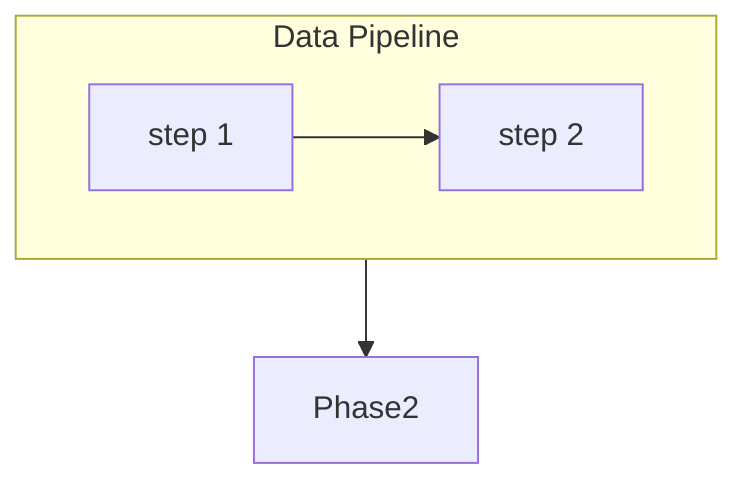
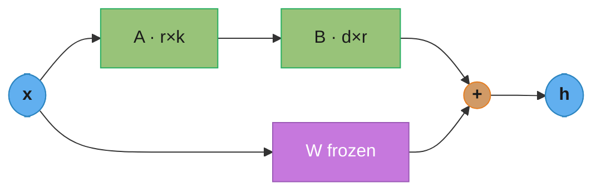

# Mermaid Diagrams

**Policy (owner-set, 2026-07-02): appeal-first.** The old "ASCII only" default is
retired for study files. Pick whichever renderable form conveys the information
most accurately AND most appealingly. In practice that means the **Mermaid
diagram family is preferred** wherever it expresses the concept; ASCII remains
only for shapes Mermaid genuinely cannot draw (see below). The first Mermaid
file was `llm/fine_tuning/lora.md`.

The game reader (`game/app.js`) already renders Mermaid via lazy CDN import
(v11). GitHub renders mermaid fences natively — including xychart-beta, pie,
quadrantChart, timeline, stateDiagram-v2, and sankey-beta. Both surfaces work;
no build step needed.

---

## Decision: which form?

Match the concept's *topology* to a diagram type. Run this before touching any
diagram.

| Concept shape | Best form |
|---------------|-----------|
| Directed flow, branching pipeline, forward/backward pass | `flowchart LR` / `TD` (One-Dark classDefs below) |
| Actor-based request/response chain | `sequenceDiagram` |
| Lifecycle / mode transitions | `stateDiagram-v2` |
| Comparing magnitudes (was: ASCII bar chart) | `xychart-beta` bar; line for trends/curves |
| Proportions of a whole | `pie` |
| Two-axis positioning / tradeoff space | `quadrantChart` |
| Evolution over time, version history | `timeline` |
| Flow volumes splitting/merging | `sankey-beta` |

### Keep ASCII only when ANY of these hold (Mermaid cannot draw it):
- **Constraint grid / matrix / token×token mask / value table** — no Mermaid grid primitive
- **Column-aligned memory/layout maps** where character alignment IS the information
- **Vector/angle geometry sketches**
- The diagram would merely restate a sentence the text already gives — then use no diagram at all

Before/after deltas and threshold axes, formerly kept ASCII, should now become
grouped `xychart-beta` bars or a labeled `quadrantChart`/`xychart-beta` band when
that reads better; keep the ASCII version only if the chart form loses information.

---

## Color System

Every Mermaid flowchart in this repo uses this One-Dark palette. Copy the
classDef block verbatim at the top of every new diagram and assign the semantic
class that matches the node's role.

```
classDef io      fill:#61afef,stroke:#2e86c1,color:#1a1a1a,font-weight:bold
classDef frozen  fill:#c678dd,stroke:#9b59b6,color:#fff
classDef train   fill:#98c379,stroke:#27ae60,color:#1a1a1a
classDef mathOp  fill:#d19a66,stroke:#e67e22,color:#1a1a1a,font-weight:bold
classDef lossN   fill:#e06c75,stroke:#c0392b,color:#fff,font-weight:bold
classDef req     fill:#56b6c2,stroke:#0097a7,color:#1a1a1a
classDef base    fill:#e5c07b,stroke:#f39c12,color:#1a1a1a
```

| Class | Color | Semantic Role |
|-------|-------|---------------|
| `io` | Blue `#61afef` | Input/output tensors, data endpoints, user requests |
| `frozen` | Purple `#c678dd` | Frozen/locked parameters, external dependencies, no-gradient paths |
| `train` | Green `#98c379` | Trainable weights, active adapters, learnable components |
| `mathOp` | Orange `#d19a66` | Math operations, summation nodes, transformations |
| `lossN` | Red `#e06c75` | Loss functions, errors, backward-pass sources, critical path |
| `req` | Teal `#56b6c2` | Requests, tagged inputs, consumers |
| `base` | Gold `#e5c07b` | Base models, foundation components, shared resources |

Assign every node exactly one class. If none fits, use the closest analogy
(e.g. a decoder block is `frozen` if it's shared, `train` if it's updated).

### Edge style conventions
- Solid arrow `-->` — forward pass, data flow, normal call
- Dotted arrow `-.->` — backward pass, gradient signal, soft dependency
- Label on edge `-->|"× alpha/r"|` — use for scale factors or transformation names

---

## Diagram Types

Use exactly one of these types per diagram. Pick the one that matches the
concept's *topology*, not its name.

### flowchart LR — left-to-right pipeline
Best for: sequential processes, adapter bypass paths, request routing.
Fan-out naturally expands downward without overlap.


### flowchart TD — top-to-bottom hierarchy
Best for: pipeline stages with subgraph boxes (Data → Training → Serving →
Eval). Subgraphs group phases clearly; avoid when the chart is wide (>5 nodes
per level).


### sequenceDiagram — request/response across actors
Best for: gRPC call chains, OAuth flows, multi-service request paths.
Do NOT use for ML model internals — they are not actor-based.

---

## Authoring Loop

1. **Decide** — run the Mermaid vs ASCII checklist above. Stop if ASCII wins.
2. **Pick type** — `flowchart LR`, `flowchart TD`, or `sequenceDiagram`.
3. **Draft** — write the mermaid fence. Copy the full `classDef` block at the top. Assign a class to every node via `class nodeId className`.
4. **Verify in reader** — open the file in the game reader (`http://127.0.0.1:8777`), navigate to the file; the diagram renders as SVG with colors. Confirm node colors match semantic roles.
5. **Check classDef is applied** — open browser console, run: `[...document.querySelectorAll(".mermaid .node")].map(n => ({id: n.id, cls: n.className?.baseVal}))`. Every node should have a class like `"node default io"`, not just `"node default"`.
6. **Caption** — add a 1–2 sentence caption below the fence tying the diagram to the insight.
7. **Don't touch** the adjacent ASCII visual-intuition diagrams (grids, charts) in the same file.

### Common failure: stale readerCache
If colors show correctly in the JS test but not in the reader, the reader has
cached the pre-edit version of the file. Fix:
```js
// In browser console while reader is open:
Object.keys(readerCache).filter(k => k.includes("lora")).forEach(k => delete readerCache[k]);
_mermaidReady = null;
openReaderPath("llm/fine_tuning/lora.md", "LoRA", null);
```

---

## ASCII → Mermaid Conversion Guide

When converting an existing ASCII flowchart to Mermaid:

### Step 1 — Classify the ASCII block
Run the decision checklist. If the block is a grid, bar chart, or number-line,
stop: it stays ASCII.

### Step 2 — Extract topology
From the ASCII art, identify:
- **Nodes** (boxes, circles, labels) — record their text content
- **Edges** (arrows `-->`, `->`, `|`) — record source → target + any label
- **Groups** (dashed box, label above section) — these become `subgraph`

### Step 3 — Assign semantic classes
For each node, decide: is it I/O, frozen, trainable, a math op, loss, request,
or base? Look at what the surrounding text says about that component.
- Weight matrix that is not updated → `frozen`
- Adapter matrix being trained → `train`
- Summation point (`+`) → `mathOp`
- Input or output token → `io`

### Step 4 — Write the mermaid block


### Step 5 — Delete the ASCII block
Replace the fenced block (`` ``` `` ... `` ``` ``) in the file with the mermaid
fence. Preserve the surrounding heading and caption sentence; do not rewrite them.

### Step 6 — Keep the visual-intuition ASCII blocks in the same file
Only convert blocks that are flowcharts. Leave constraint grids, bar charts,
and before/after pairs untouched even if they are in the same section.

---

## Node Shape Reference

| Syntax | Shape | Use for |
|--------|-------|---------|
| `id["label"]` | Rectangle | Weight matrices, model components, processing steps |
| `id([label])` | Stadium/pill | Inputs, outputs, data nodes |
| `id{label}` | Diamond | Decision points, routing conditions |
| `id((" + "))` | Circle with label | Summation / math operation nodes |
| `id[["label"]]` | Double-border rect | Sub-routines, external services |

---

## Reader Rendering Architecture

The game reader's `renderMermaid()` in `game/app.js` does three things:

1. **Lazy CDN import** — `import("mermaid@11/dist/mermaid.esm.min.mjs")` is only
   fetched when a page has `.mermaid` divs; zero cost for non-mermaid pages.
2. **`mermaid.initialize()`** — called once with `theme:"dark"` and `themeVariables`
   plus `flowchart: { curve:"basis", padding:20, nodeSpacing:45, rankSpacing:55 }`.
3. **SVG post-processing after `mermaid.run()`** — required for three things that
   Mermaid's themeVariables cannot reach:

```js
nodes.forEach(n => {
  // Widen sequence note/actor rects that under-measure their text (mermaid
  // under-measures long monospace runs by a few %; text poking onto the
  // black canvas is unreadable) — geometric fix, see mmRenderNode()
  n.querySelectorAll("rect.note, rect.actor").forEach(/* measure text bbox, widen rect */);
  // Round EVERY box ≥12px tall — flowchart nodes, sequence actors/notes,
  // alt/opt frames, timeline periods. Chart DATA MARKS exempt (xychart bars,
  // pie, quadrant fills): rx there reshapes the mark itself.
  if (!["xychart", "pie", "quadrant"].includes(ctype)) {
    n.querySelectorAll("svg rect").forEach(r => {
      const h = r.height?.baseVal?.value || 0;
      if (h < 12) return;
      const rx = Math.min(8, Math.round(h / 3));
      r.setAttribute("rx", rx); r.setAttribute("ry", rx);
    });
  }
  n.querySelectorAll(".cluster rect").forEach(r => {
    r.setAttribute("rx", "12"); r.setAttribute("ry", "12");
  });
  // Color arrowhead markers — <marker> elements in SVG <defs> are separate
  // from the edge path and ignore lineColor themeVariable entirely; only
  // setAttribute("fill") after render reaches them
  n.querySelectorAll("marker path, marker polygon").forEach(m => {
    m.setAttribute("fill", "#61afef"); m.removeAttribute("stroke");
  });
});
```

Two more reader-level behaviors (wired in `renderMermaid()`/`mmRenderNode()`,
never per-diagram):

- **Measurement fonts match the display font.** `themeVariables.fontFamily`
  only *styles* the rendered SVG; the sequence renderer *measures* actor, note,
  and message text with `sequence.actorFontFamily` / `noteFontFamily` /
  `messageFontFamily` (proportional Open Sans/Trebuchet defaults). The reader
  passes the same monospace stack to all four so measured width = drawn width.
- **Fit-to-width pill.** Every diagram gets a `.mm-fit` button, CSS-shown only
  while the container has `.h-scroll` (the diagram overflows its column).
  Clicking scales the SVG to the live width between the sidebars and sets
  `data-mm-fit` on the container; the ResizeObserver — which also watches
  `.reader-modules`/`.reader-toc`, since collapsing a sidebar can change only
  the gutters without resizing the column — keeps re-fitting on every layout
  change. Grip double-click resets to auto sizing.

CSS in `game/style.css` adds the remaining polish:
```css
.md-body .mermaid svg .edgePath .path { stroke: #61afef !important; stroke-width: 2px !important; }
.md-body .mermaid svg .edgeLabel .label rect { fill: transparent !important; stroke: none !important; }
.md-body .mermaid svg .edgeLabel foreignObject > div { background: transparent !important; color: #e5c07b !important; }
.md-body .mermaid svg .cluster rect { stroke-dasharray: 5 3 !important; stroke-width: 1.5px !important; }
```

**Why `themeVariables.edgeLabelBackground:"transparent"`** — the default `"#000000"`
paints a black rect behind every edge label, visible as an ugly pill on the dark
diagram background. Setting it to `"transparent"` removes the rect; the CSS rule
above adds belt-and-suspenders to also nullify the SVG rect fill.

---

## Gotchas

- **Grey arrowheads even with `lineColor` set** — `lineColor` only colors the edge
  path stroke; arrowhead `<marker>` elements in SVG `<defs>` are separate and get
  their fill from SVG attributes, not CSS or themeVariables. Fix: the JS
  post-processing block above (already wired in `renderMermaid()`).
- **Black pill around edge labels** — caused by `edgeLabelBackground:"#000000"` in
  themeVariables. Already fixed to `"transparent"` in the reader. If you see it
  reappear, check that `_mermaidReady` was reset (stale init from a previous page
  load may have the old value cached).
- **Square boxy nodes** — Mermaid has no corner-radius themeVariable; JS
  post-processing sets `rx` on **every rect ≥12px tall** (flowchart nodes,
  sequence actors/notes, alt/opt frames, timeline periods) after every render —
  only chart data marks (xychart bars, pie, quadrant fills) stay square.
  Already in `mmRenderNode()`; does not need to be added per-diagram.
- **Sequence text spills out of actor/note boxes** (dark text on the black
  canvas = unreadable) — TWO stacked causes, both fixed reader-side (2026-07-03):
  1. *Measure/display font mismatch*: the sequence renderer sizes boxes with
     `sequence.actorFontFamily`/`noteFontFamily`/`messageFontFamily` (default
     proportional Open Sans/Trebuchet) while `themeVariables.fontFamily`
     displays monospace — boxes ~25% too narrow. Fix: pass the same mono stack
     to all four (done in `renderMermaid()`'s initialize).
  2. *Intrinsic under-measurement*: even with matched fonts, mermaid measures
     long monospace runs a few % narrow (same disease `mmFixViewBox` patches at
     canvas level). Fix: post-render, each `rect.note`/`rect.actor` is widened
     to cover its own text bbox (done in `mmRenderNode()`).
  If a diagram still shows spill, do NOT hack the diagram source — check that
  both fixes are intact in `game/app.js`.
- **`classDef` must come before the first node definition** in the block. Mermaid
  parses classDef declarations top-down; placing them after node definitions causes
  silent failures where nodes get no class.
- **`class` assignments must be at the bottom** of the diagram, after `end` for all
  subgraphs. A `class` line inside a subgraph body is sometimes ignored.
- **`\n` in node labels** — use `\n` (backslash-n) for a line break inside a label:
  `["W\nfrozen"]`. This works in Mermaid and passes through `esc()` in the reader
  correctly (no entity-encoding issues).
- **`" + "` in circle nodes** — `((" + "))` (circle with space-padded label) renders
  as a small circle. The space padding is intentional for readability.
- **Subgraph title quotes** — `subgraph tr["During Training"]` — the title must be
  double-quoted if it contains spaces. After `esc()` in the reader, `"` becomes
  `&quot;`; the browser decodes this back before Mermaid reads `textContent`. Safe.
- **`data-processed` attribute** — Mermaid sets this after rendering. The reader's
  `renderMermaid()` removes it before re-calling `mermaid.run()` on nav. If you
  call `mermaid.run()` from the console on an already-rendered node, remove the
  attribute first: `node.removeAttribute("data-processed")`.
- **Em dash `—` in labels** is one Mermaid "character" and renders fine in SVG.
  Middle dot `·` and times `×` also render fine.
- **`[ ]` square brackets in node labels cause syntax errors** — Mermaid's lexer
  treats `[text]` as a rectangle-node shape token anywhere in the source, even
  inside `{...}` diamond or `([...])` stadium labels. Symptoms: "Syntax error in
  text" bomb icon in the reader. Two safe fixes:
  1. Quote the whole node label: `RE{"score each doc (0.0–1.0)"}` (preferred)
  2. Replace `[x]` with `(x)` or omit the brackets entirely
  This applies to edge labels too — `|"[Retrieve]"|` works because it is
  inside a quoted string, but `{[Retrieve] token\ngenerated?}` fails. Confirmed
  in Mermaid v11.16.0 (the CDN version the reader loads).
- **Click-to-zoom is wired globally** — `renderMermaid()` adds a click listener to
  every rendered `.mermaid` div. Clicking opens a full-screen dark overlay with the
  cloned SVG; `−`/`+` buttons and mouse-wheel adjust zoom (25% and 10% steps
  respectively); Escape/background-click/`✕` closes. No per-diagram work required;
  all diagrams get this automatically.
