# Backend Engineering — Senior Engineer & Interview Prep Guide

A comprehensive, production-focused reference for **backend engineering** — networking internals, API design, performance engineering, database deep dives, resilience patterns, security, testing, event-driven architecture, and microservices. Primary language is Java 25 (LTS) with Spring Boot 4.1. Emphasis: interview Q&As, production war stories, tradeoff matrices, and design decisions.

---

## Why This Section Exists

The Java and Spring sections cover language and framework mechanics. This section covers the **engineering discipline**: how to design, optimize, secure, observe, and operate backend systems at scale. It answers the questions senior engineers face in system design interviews and on-call rotations — not "how does @Transactional work?" but "how do I prevent a thundering herd from destroying my cache layer at 3 AM?"

---

## 9-Phase Learning Path

```mermaid
flowchart TD
    classDef io      fill:#61afef,stroke:#2e86c1,color:#1a1a1a,font-weight:bold
    classDef train   fill:#98c379,stroke:#27ae60,color:#1a1a1a
    classDef mathOp  fill:#d19a66,stroke:#e67e22,color:#1a1a1a,font-weight:bold
    classDef req     fill:#56b6c2,stroke:#0097a7,color:#1a1a1a

    subgraph P1["Phase 1 - Networking Fundamentals"]
        p1_osi(["OSI Model"]) --> p1_tcp(["TCP/IP Deep Dive"]) --> p1_udp(["UDP & QUIC"]) --> p1_http(["HTTP Protocols"])
    end
    subgraph P2["Phase 2 - API Design & Protocols"]
        p2_rest(["REST Design"]) --> p2_grpc(["gRPC/Protobuf"]) --> p2_graphql(["GraphQL"]) --> p2_ws(["WS & SSE"])
    end
    subgraph P3["Phase 3 - Performance Engineering"]
        p3_prof(["Profiling"]) --> p3_pool(["Connection Pooling"]) --> p3_cache(["Caching Deep Dive"]) --> p3_async(["Async Patterns"])
    end

    subgraph P4["Phase 4 - Database Engineering"]
        p4_dbint(["DB Internals"]) --> p4_query(["Query Opt."]) --> p4_migr(["Migrations"]) --> p4_dtx(["Dist. Transactions"]) --> p4_dbtypes(["DB Types Deep Dive"])
    end
    subgraph P5["Phase 5 - Resilience & Reliability"]
        p5_cb(["Circuit Breaker"]) --> p5_rl(["Rate Limiting"]) --> p5_obs(["Observability"])
    end
    subgraph P6["Phase 6 - Security"]
        p6_owasp(["OWASP Top 10"]) --> p6_auth(["Auth & AuthZ"])
    end

    subgraph P7["Phase 7 - Testing & Quality"]
        p7_test(["Testing Strategy"]) --> p7_load(["Load Testing"]) --> p7_chaos(["Chaos Engineering"])
    end
    subgraph P8["Phase 8 - Event-Driven Architecture"]
        p8_eda(["EDA Fundamentals"]) --> p8_kafka(["Kafka Deep Dive"]) --> p8_es(["Event Sourcing"]) --> p8_msg(["Messaging Patterns"])
    end
    subgraph P9["Phase 9 - Microservices Architecture"]
        p9_ms(["MS Fundamentals"]) --> p9_gw(["API Gateway"]) --> p9_mesh(["Service Mesh"]) --> p9_ops(["Operational Patterns"]) --> p9_container(["Container Patterns"])
    end

    cs(["Case Studies<br/>Booking, Feed, Payment,<br/>Order System, Migration"])

    P1 --> P4 --> P7 --> cs
    P2 --> P5 --> P8 --> cs
    P3 --> P6 --> P9 --> cs

    class p1_osi,p1_tcp,p1_udp,p1_http,p2_rest,p2_grpc,p2_graphql,p2_ws,p3_prof,p3_pool,p3_cache,p3_async io
    class p4_dbint,p4_query,p4_migr,p4_dtx,p4_dbtypes,p5_cb,p5_rl,p5_obs,p6_owasp,p6_auth train
    class p7_test,p7_load,p7_chaos,p8_eda,p8_kafka,p8_es,p8_msg,p9_ms,p9_gw,p9_mesh,p9_ops,p9_container mathOp
    class cs req
```

The three columns run independently top-to-bottom (Phase 1/4/7, Phase 2/5/8, Phase 3/6/9) and converge on the five capstone case studies.

---

## Learning Paths

This section is exhaustive by design — 34 modules across 9 phases, from OSI-layer networking through microservices architecture and container orchestration. That is the right depth for a reference and the wrong shape for someone two weeks from an interview. So there are **two ways through it**; the browser learning game's **Study** view surfaces both as a **Full / Interview** toggle (Full is the default).

### Full Path (34 modules)

The complete curriculum in the order above — see [9-Phase Learning Path](#9-phase-learning-path). Use it for genuine mastery: every networking layer (OSI, TCP/IP, UDP/QUIC), the full API surface (GraphQL, WebSockets/SSE), performance profiling, database migrations and the full database-types survey, the testing trio, event sourcing/CQRS and messaging patterns, service mesh, and container/deployment patterns. Nothing is dropped.

<!-- study-path-table senior -->
### Senior Path (21 modules)

| # | Module | Files |
|---|--------|-------|
| 2 | [tcp_ip_deep_dive](tcp_ip_deep_dive/tcp_ip_deep_dive.md) | module page only |
| 4 | [http_protocols](http_protocols/http_protocols.md) | module page only |
| 5 | [rest_api_design](rest_api_design/rest_api_design.md) | module page only |
| 6 | [grpc_and_protobuf](grpc_and_protobuf/grpc_and_protobuf.md) | module page only |
| 8 | [websockets_and_sse](websockets_and_sse/websockets_and_sse.md) | module page only |
| 9 | [performance_profiling](performance_profiling/performance_profiling.md) | module page only |
| 10 | [connection_pooling_deep_dive](connection_pooling_deep_dive/connection_pooling_deep_dive.md) | module page only |
| 11 | [caching_strategies_deep_dive](caching_strategies_deep_dive/caching_strategies_deep_dive.md) | module page only |
| 12 | [async_and_concurrency_patterns](async_and_concurrency_patterns/async_and_concurrency_patterns.md) | module page only |
| 13 | [database_internals_and_indexing](database_internals_and_indexing/database_internals_and_indexing.md) | module page only |
| 14 | [query_optimization](query_optimization/query_optimization.md) | module page only |
| 15 | [database_migrations](database_migrations/database_migrations.md) | module page only |
| 16 | [distributed_transactions_and_consistency](distributed_transactions_and_consistency/distributed_transactions_and_consistency.md) | module page only |
| 18 | [fault_tolerance_patterns](fault_tolerance_patterns/fault_tolerance_patterns.md) | module page only |
| 19 | [rate_limiting_in_depth](rate_limiting_in_depth/rate_limiting_in_depth.md) | module page only |
| 20 | [observability_and_monitoring](observability_and_monitoring/observability_and_monitoring.md) | module page only |
| 21 | [backend_security_owasp](backend_security_owasp/backend_security_owasp.md) | module page only |
| 22 | [auth_and_authorization_systems](auth_and_authorization_systems/auth_and_authorization_systems.md) | module page only |
| 24 | [load_and_performance_testing](load_and_performance_testing/load_and_performance_testing.md) | module page only |
| 27 | [kafka_deep_dive](kafka_deep_dive/kafka_deep_dive.md) | module page only |
| 34 | [container_and_deployment_patterns](container_and_deployment_patterns/container_and_deployment_patterns.md) | module page only |

**Not in this path** (13 of 34, Full Path only): `osi_model_and_networking`, `udp_and_quic`, `graphql`, `database_types_deep_dive`, `backend_testing_strategies`, `chaos_engineering`, `event_driven_fundamentals`, `event_sourcing_and_cqrs`, `messaging_patterns`, `microservices_fundamentals`, `api_gateway_patterns`, `service_mesh_and_service_discovery`, `distributed_system_operational_patterns`
<!-- /study-path-table -->

A ruthless cut to what a **senior backend engineering interview** actually probes — the protocols, performance levers, database internals, resilience patterns, security, and distributed-systems building blocks that come up in nearly every loop. Same learning order, a strict subset of the Full Path. Each group below says why it earns senior time.

| Group | Why it's tested |
|-------|-----------------|
| Protocols & API Design | HTTP/2 vs /3, TLS handshakes, idempotency, versioning, and REST-vs-RPC tradeoffs open almost every backend screen |
| Performance Engineering | Pool sizing formulas, cache stampede, and thread-pool sizing are the "why is prod slow at 3 AM" questions every senior candidate must answer |
| Database Engineering | B+tree/MVCC internals, N+1 detection, and 2PC-vs-Saga are the deepest, highest-frequency backend-specific probes |
| Resilience & Observability | Circuit breaker states, token bucket vs sliding window, and metrics/logs/traces separate "writes code" from "operates a system" |
| Security | OWASP Top 10, JWT/OAuth2 internals, and RBAC vs ABAC are near-universal, regardless of company or stack |
| Event-Driven Architecture | Choreography vs orchestration and Kafka's EOS/rebalancing internals anchor most "design an async pipeline" prompts |
| Microservices Architecture | Bounded contexts, the strangler fig pattern, and gateway/BFF responsibilities are the default frame for "design X at scale" |

<!-- study-path-table principal -->
### Principal Path (18 modules)

| # | Module | Files |
|---|--------|-------|
| 5 | [rest_api_design](rest_api_design/rest_api_design.md) | module page only |
| 11 | [caching_strategies_deep_dive](caching_strategies_deep_dive/caching_strategies_deep_dive.md) | module page only |
| 15 | [database_migrations](database_migrations/database_migrations.md) | module page only |
| 16 | [distributed_transactions_and_consistency](distributed_transactions_and_consistency/distributed_transactions_and_consistency.md) | module page only |
| 17 | [database_types_deep_dive](database_types_deep_dive/database_types_deep_dive.md) | module page only |
| 18 | [fault_tolerance_patterns](fault_tolerance_patterns/fault_tolerance_patterns.md) | module page only |
| 20 | [observability_and_monitoring](observability_and_monitoring/observability_and_monitoring.md) | module page only |
| 21 | [backend_security_owasp](backend_security_owasp/backend_security_owasp.md) | module page only |
| 22 | [auth_and_authorization_systems](auth_and_authorization_systems/auth_and_authorization_systems.md) | module page only |
| 23 | [backend_testing_strategies](backend_testing_strategies/backend_testing_strategies.md) | module page only |
| 25 | [chaos_engineering](chaos_engineering/chaos_engineering.md) | module page only |
| 26 | [event_driven_fundamentals](event_driven_fundamentals/event_driven_fundamentals.md) | module page only |
| 28 | [event_sourcing_and_cqrs](event_sourcing_and_cqrs/event_sourcing_and_cqrs.md) | module page only |
| 29 | [messaging_patterns](messaging_patterns/messaging_patterns.md) | module page only |
| 30 | [microservices_fundamentals](microservices_fundamentals/microservices_fundamentals.md) | module page only |
| 31 | [api_gateway_patterns](api_gateway_patterns/api_gateway_patterns.md) | module page only |
| 32 | [service_mesh_and_service_discovery](service_mesh_and_service_discovery/service_mesh_and_service_discovery.md) | module page only |
| 33 | [distributed_system_operational_patterns](distributed_system_operational_patterns/distributed_system_operational_patterns.md) | module page only |

**Not in this path** (16 of 34, Full Path only): `osi_model_and_networking`, `tcp_ip_deep_dive`, `udp_and_quic`, `http_protocols`, `grpc_and_protobuf`, `graphql`, `websockets_and_sse`, `performance_profiling`, `connection_pooling_deep_dive`, `async_and_concurrency_patterns`, `database_internals_and_indexing`, `query_optimization`, `rate_limiting_in_depth`, `load_and_performance_testing`, `kafka_deep_dive`, `container_and_deployment_patterns`
<!-- /study-path-table -->

A different cut, not senior-plus-extras. The Principal Path probes the judgment calls a staff backend engineer owns: which protocol and consistency model a system can afford, how it degrades under partial failure, and what you tell a team **not** to build. Roughly half of it is material the Senior Path never covers, and it is usually the smaller list -- depth of judgment, not depth of syllabus.

---

## Knowledge-Question Map

The highest-frequency backend *knowledge* questions mapped to the module that answers them. For *system design* ("design X") questions, pair these with the interview-prep shortcuts in [case_studies/case_studies.md](case_studies/case_studies.md).

| Interview question | Where the answer lives |
|---------------------|------------------------|
| HTTP/1.1 vs HTTP/2 vs HTTP/3 — what specific problem does each generation solve, and how does TLS 1.3 cut handshake round trips? | [HTTP Protocols](http_protocols/http_protocols.md) |
| What makes an endpoint idempotent, and why do idempotency keys matter for POST/payment retries? | [REST API Design](rest_api_design/rest_api_design.md) |
| gRPC vs REST — when do you actually pick gRPC, and what are its four RPC modes? | [gRPC & Protobuf](grpc_and_protobuf/grpc_and_protobuf.md) |
| How do you size a database connection pool (the HikariCP formula), and what causes a pool leak in production? | [Connection Pooling Deep Dive](connection_pooling_deep_dive/connection_pooling_deep_dive.md) |
| Cache-aside vs write-through vs write-behind — what are the tradeoffs, and what is a cache stampede? | [Caching Strategies Deep Dive](caching_strategies_deep_dive/caching_strategies_deep_dive.md) |
| How do you correctly size a thread pool, and how do virtual threads change that math? | [Async & Concurrency Patterns](async_and_concurrency_patterns/async_and_concurrency_patterns.md) |
| How does a B+tree index work, and how does MVCC let readers avoid blocking on writers? | [Database Internals & Indexing](database_internals_and_indexing/database_internals_and_indexing.md) |
| How do you diagnose and fix an N+1 query problem using EXPLAIN ANALYZE? | [Query Optimization](query_optimization/query_optimization.md) |
| Why does two-phase commit fail to scale across services, and what problem does the outbox pattern solve? | [Distributed Transactions & Consistency](distributed_transactions_and_consistency/distributed_transactions_and_consistency.md) |
| Explain the circuit breaker's closed/open/half-open states, and why retry backoff always needs jitter. | [Fault Tolerance Patterns](fault_tolerance_patterns/fault_tolerance_patterns.md) |
| Token bucket vs sliding window rate limiting — which fits bursty traffic, and how do you enforce it across instances? | [Rate Limiting In Depth](rate_limiting_in_depth/rate_limiting_in_depth.md) |
| What's the difference between metrics, logs, and traces, and how do you define an SLO and error budget? | [Observability & Monitoring](observability_and_monitoring/observability_and_monitoring.md) |
| Walk through preventing SQL injection and SSRF beyond "use prepared statements." | [Backend Security & OWASP](backend_security_owasp/backend_security_owasp.md) |
| Explain the OAuth2 authorization code flow with PKCE, and how RBAC differs from ABAC. | [Auth & Authorization Systems](auth_and_authorization_systems/auth_and_authorization_systems.md) |
| Choreography vs orchestration — how do you choose for a multi-service workflow? | [Event-Driven Fundamentals](event_driven_fundamentals/event_driven_fundamentals.md) |
| How does Kafka guarantee exactly-once semantics, and what happens when a consumer group rebalances mid-batch? | [Kafka Deep Dive](kafka_deep_dive/kafka_deep_dive.md) |
| How do you decompose a monolith into microservices using bounded contexts, and what is the strangler fig pattern? | [Microservices Fundamentals](microservices_fundamentals/microservices_fundamentals.md) |
| What does an API gateway centralize that shouldn't live in every service, and what is a BFF? | [API Gateway Patterns](api_gateway_patterns/api_gateway_patterns.md) |

---

## Study Plan

A 5-week plan over the Senior Path. Each week pairs modules with one case study to rehearse the "design X" format.

| Week | Focus | Modules | Case study |
|------|-------|---------|------------|
| 1 | Protocols & API Design | HTTP Protocols, REST API Design, gRPC & Protobuf | [Design a Booking System](case_studies/design_booking_system/design_booking_system.md) (idempotency keys + optimistic concurrency) |
| 2 | Performance Engineering | Connection Pooling Deep Dive, Caching Strategies Deep Dive, Async & Concurrency Patterns | [Design a Feed Service](case_studies/design_feed_service/design_feed_service.md) (Redis caching + fan-out under concurrent load) |
| 3 | Database & Distributed Transactions | Database Internals & Indexing, Query Optimization, Distributed Transactions & Consistency | [Design a Payment Processor](case_studies/design_payment_processor/design_payment_processor.md) (Saga orchestration + outbox pattern) |
| 4 | Resilience, Observability & Security | Fault Tolerance Patterns, Rate Limiting In Depth, Observability & Monitoring, Backend Security & OWASP, Auth & Authorization Systems | [Design a Microservices Migration](case_studies/design_microservices_migration/design_microservices_migration.md) (circuit breakers, rate limits, and auth translation guard the cutover) |
| 5 | Event-Driven & Microservices Architecture | Event-Driven Fundamentals, Kafka Deep Dive, Microservices Fundamentals, API Gateway Patterns | [Design an Event-Driven Order System](case_studies/design_event_driven_order_system/design_event_driven_order_system.md) (Kafka EOS + CQRS + outbox + DLQ capstone) |

---

## Module Table — 34 Modules

### Phase 1 — Networking Fundamentals (MAJOR DEEP DIVE)

| Module | Topic | Q&As | Difficulty |
|--------|-------|------|------------|
| [OSI Model & Networking](osi_model_and_networking/osi_model_and_networking.md) | 7 layers, TCP/IP mapping, packet encapsulation, ARP, NAT, MTU | 15 | Intermediate |
| [TCP/IP Deep Dive](tcp_ip_deep_dive/tcp_ip_deep_dive.md) | 3-way handshake, congestion control, TIME_WAIT, socket tuning | 18 | Advanced |
| [UDP & QUIC](udp_and_quic/udp_and_quic.md) | UDP characteristics, QUIC 0-RTT, HTTP/3, DTLS | 12 | Intermediate |
| [HTTP Protocols](http_protocols/http_protocols.md) | HTTP/1.1 vs /2 vs /3, TLS 1.3, ALPN, SNI, HSTS | 15 | Intermediate |

### Phase 2 — API Design & Protocols (DEEP DIVE)

| Module | Topic | Q&As | Difficulty |
|--------|-------|------|------------|
| [REST API Design](rest_api_design/rest_api_design.md) | REST constraints, versioning, idempotency, pagination, ETag, RFC 9457 | 15 | Intermediate |
| [gRPC & Protobuf](grpc_and_protobuf/grpc_and_protobuf.md) | Protobuf wire format, 4 RPC modes, interceptors, deadlines | 15 | Advanced |
| [GraphQL](graphql/graphql.md) | Schema design, DataLoader N+1, subscriptions, depth limiting | 12 | Intermediate |
| [WebSockets & SSE](websockets_and_sse/websockets_and_sse.md) | WS upgrade, frame structure, SSE, long polling, scaling WS | 12 | Intermediate |

### Phase 3 — Performance Engineering

| Module | Topic | Q&As | Difficulty |
|--------|-------|------|------------|
| [Performance Profiling](performance_profiling/performance_profiling.md) | async-profiler, JFR, flamegraphs, heap/thread dumps, GC analysis | 15 | Advanced |
| [Connection Pooling Deep Dive](connection_pooling_deep_dive/connection_pooling_deep_dive.md) | HikariCP internals, pool sizing formula, leak detection, PgBouncer | 15 | Advanced |
| [Caching Strategies Deep Dive](caching_strategies_deep_dive/caching_strategies_deep_dive.md) | Cache-aside/read-through/write-behind, stampede, Redis structures | 15 | Advanced |
| [Async & Concurrency Patterns](async_and_concurrency_patterns/async_and_concurrency_patterns.md) | Thread pool sizing, CompletableFuture pitfalls, virtual threads, bulkhead | 15 | Advanced |

### Phase 4 — Database Engineering

| Module | Topic | Q&As | Difficulty |
|--------|-------|------|------------|
| [Database Internals & Indexing](database_internals_and_indexing/database_internals_and_indexing.md) | B+tree, WAL, MVCC, index types, VACUUM, query planner | 15 | Advanced |
| [Query Optimization](query_optimization/query_optimization.md) | EXPLAIN ANALYZE, N+1 detection, pagination, batch inserts | 15 | Advanced |
| [Database Migrations](database_migrations/database_migrations.md) | Flyway vs Liquibase, zero-downtime patterns, expand-contract | 12 | Intermediate |
| [Distributed Transactions & Consistency](distributed_transactions_and_consistency/distributed_transactions_and_consistency.md) | 2PC problems, Saga, outbox pattern, idempotency keys | 15 | Expert |
| [Database Types Deep Dive](database_types_deep_dive/database_types_deep_dive.md) | Relational, Document, Key-Value, Wide-Column, Time-Series, Search, Graph, NewSQL — internals, tradeoffs, selection criteria | 18 | Expert |

> For deeper coverage of every database topic above — storage engine internals, NoSQL deep dives, distributed consensus, polyglot persistence, production operations, and 6 end-to-end case studies — see the [Database Engineering](../database/README.md) section (28 modules, 7 phases, principal-engineer level).

### Phase 5 — Resilience & Reliability

| Module | Topic | Q&As | Difficulty |
|--------|-------|------|------------|
| [Fault Tolerance Patterns](fault_tolerance_patterns/fault_tolerance_patterns.md) | Circuit breaker states, Resilience4j, retry with jitter, bulkhead | 15 | Advanced |
| [Rate Limiting In Depth](rate_limiting_in_depth/rate_limiting_in_depth.md) | Token bucket, sliding window, Redis Lua, adaptive throttling | 12 | Advanced |
| [Observability & Monitoring](observability_and_monitoring/observability_and_monitoring.md) | Metrics/logs/traces, Micrometer, MDC, OpenTelemetry, SLO/SLI | 15 | Advanced |

### Phase 6 — Security

| Module | Topic | Q&As | Difficulty |
|--------|-------|------|------------|
| [Backend Security & OWASP](backend_security_owasp/backend_security_owasp.md) | OWASP Top 10:2025, SQL injection, CSRF, SSRF, secret management | 15 | Advanced |
| [Auth & Authorization Systems](auth_and_authorization_systems/auth_and_authorization_systems.md) | JWT internals, OAuth2 flows, OIDC, RBAC vs ABAC, token revocation | 15 | Advanced |

### Phase 7 — Testing & Quality

| Module | Topic | Q&As | Difficulty |
|--------|-------|------|------------|
| [Backend Testing Strategies](backend_testing_strategies/backend_testing_strategies.md) | Testing pyramid, test doubles, contract testing, mutation testing | 12 | Intermediate |
| [Load & Performance Testing](load_and_performance_testing/load_and_performance_testing.md) | k6, Gatling, JMeter, percentile analysis, coordinated omission | 12 | Intermediate |
| [Chaos Engineering](chaos_engineering/chaos_engineering.md) | Steady-state hypothesis, fault injection, blast radius, GameDay | 10 | Advanced |

### Phase 8 — Event-Driven Architecture (MAJOR DEEP DIVE)

| Module | Topic | Q&As | Difficulty |
|--------|-------|------|------------|
| [Event-Driven Fundamentals](event_driven_fundamentals/event_driven_fundamentals.md) | Events vs commands, choreography vs orchestration, event storming | 15 | Intermediate |
| [Kafka Deep Dive](kafka_deep_dive/kafka_deep_dive.md) | Producer/consumer internals, EOS, Kafka Streams, Schema Registry | 18 | Expert |
| [Event Sourcing & CQRS](event_sourcing_and_cqrs/event_sourcing_and_cqrs.md) | Event store, aggregates, snapshots, CQRS read models, Axon | 15 | Expert |
| [Messaging Patterns](messaging_patterns/messaging_patterns.md) | Outbox, inbox, DLQ, poison pill, schema evolution, RabbitMQ vs Kafka | 15 | Advanced |

### Phase 9 — Microservices Architecture (MAJOR DEEP DIVE)

| Module | Topic | Q&As | Difficulty |
|--------|-------|------|------------|
| [Microservices Fundamentals](microservices_fundamentals/microservices_fundamentals.md) | Decomposition, bounded contexts, data ownership, strangler fig | 15 | Intermediate |
| [API Gateway Patterns](api_gateway_patterns/api_gateway_patterns.md) | Gateway responsibilities, BFF, Spring Cloud Gateway, Kong | 15 | Advanced |
| [Service Mesh & Service Discovery](service_mesh_and_service_discovery/service_mesh_and_service_discovery.md) | Istio/Envoy, mTLS, service discovery mechanisms, health probes | 15 | Advanced |
| [Distributed System Operational Patterns](distributed_system_operational_patterns/distributed_system_operational_patterns.md) | Bulkhead, sidecar, ACL, correlation ID, feature flags, graceful shutdown | 15 | Advanced |
| [Container & Deployment Patterns](container_and_deployment_patterns/container_and_deployment_patterns.md) | 12-factor, Docker multi-stage, Kubernetes strategies, HPA, PDB | 15 | Advanced |

---

## Case Studies — 5

| Case Study | Scenario | Key Concepts |
|------------|----------|-------------|
| [Design a Booking System](case_studies/design_booking_system/design_booking_system.md) | Seat reservation under concurrency | Optimistic locking, distributed lock, idempotency |
| [Design a Feed Service](case_studies/design_feed_service/design_feed_service.md) | Social feed at scale | Fan-out strategies, Redis sorted sets, cursor pagination |
| [Design a Payment Processor](case_studies/design_payment_processor/design_payment_processor.md) | Payment saga with rollback | Saga orchestration, outbox pattern, idempotency keys |
| [Design an Event-Driven Order System](case_studies/design_event_driven_order_system/design_event_driven_order_system.md) | Order lifecycle via Kafka | CQRS, Kafka EOS, transactional outbox, DLQ handling |
| [Design a Microservices Migration](case_studies/design_microservices_migration/design_microservices_migration.md) | Strangler fig from monolith | Decomposition steps, shared DB migration, traffic cutover |

---

## Version Matrix

| Technology | Version | Key Changes |
|------------|---------|------------|
| Java | 25 (LTS) | Virtual threads unpinned under `synchronized` (JEP 491, JDK 24), scoped values final (JEP 506), compact source files |
| Spring Boot | 4.1+ | HTTP service client auto-configuration, API versioning properties, OpenTelemetry starter, Jackson 3 |
| Spring Framework | 7.0 | Jakarta EE 11 baseline, JSpecify null-safety, API versioning, `@Retryable`/`@ConcurrencyLimit` |
| Kafka | 4.2+ | KRaft-only (ZooKeeper removed in 4.0), KIP-848 consumer protocol, share groups (queues) GA |
| Spring Cloud | 2025.1.x "Oakwood" | Built on Spring Framework 7 / Spring Boot 4; every project in the train is version 5.0.x |
| Resilience4j | 2.4+ | `resilience4j-spring-boot4` starter for the Boot 4 auto-configuration, virtual thread support |
| Micrometer | 1.17+ | Observation API, OTLP registry, exemplars |
| OpenTelemetry | 1.x | W3C TraceContext, OTLP protocol, Spring integration |

---

## Cross-Reference Map

| This Module | See Also |
|-------------|---------|
| Async & Concurrency Patterns | [java/concurrency](../java/concurrency/concurrency.md) |
| Connection Pooling Deep Dive | [java/jdbc_and_database](../java/jdbc_and_database/jdbc_and_database.md), [spring/spring_data_jpa](../spring/spring_data_jpa/spring_data_jpa.md) |
| Distributed Transactions | [spring/spring_transactions](../spring/spring_transactions/spring_transactions.md) |
| Kafka Deep Dive | [spring/spring_messaging](../spring/spring_messaging/spring_messaging.md) |
| Auth & Authorization Systems | [spring/spring_security_architecture](../spring/spring_security_architecture/spring_security_architecture.md), [spring/spring_security_jwt_oauth](../spring/spring_security_jwt_oauth/spring_security_jwt_oauth.md) |
| Caching Strategies Deep Dive | [spring/spring_caching](../spring/spring_caching/spring_caching.md) |
| Backend Testing Strategies | [spring/spring_testing](../spring/spring_testing/spring_testing.md) |
| Query Optimization | [spring/spring_data_jpa](../spring/spring_data_jpa/spring_data_jpa.md), [java/jdbc_and_database](../java/jdbc_and_database/jdbc_and_database.md) |

---

## Key Production Numbers

Concrete numbers appear throughout modules. Quick reference:

| Topic | Number |
|-------|--------|
| TCP TIME_WAIT | 2*MSL = 60–240s; tcp_tw_reuse=1 to recycle |
| HikariCP pool formula | (core_count * 2) + effective_spindle_count |
| Kafka linger.ms default | 0 (send immediately); recommended: 5–20ms for throughput |
| Kafka batch.size default | 16384 bytes (16 KB) |
| Kafka max.poll.records | 500 |
| Kafka acks default | 1 (leader only); acks=all for durability |
| Circuit breaker defaults | failureRateThreshold=50%, waitDurationInOpenState=60s, ringBufferSize=100 |
| HTTP/2 max concurrent streams | 100 (default SETTINGS_MAX_CONCURRENT_STREAMS) |
| gRPC max message size | 4 MB receive (default); unlimited send |
| Redis default max connections | 10,000 |
| k6 common API SLO | p99 < 200ms |
| Virtual thread stack | ~few KB vs platform thread ~1 MB |
| G1GC default pause target | 200ms |
| ZGC pause time | sub-1ms |
| BCrypt cost factor | 10–12 |
| HikariCP default pool size | 10 |
| Tomcat default threads | 200 |
