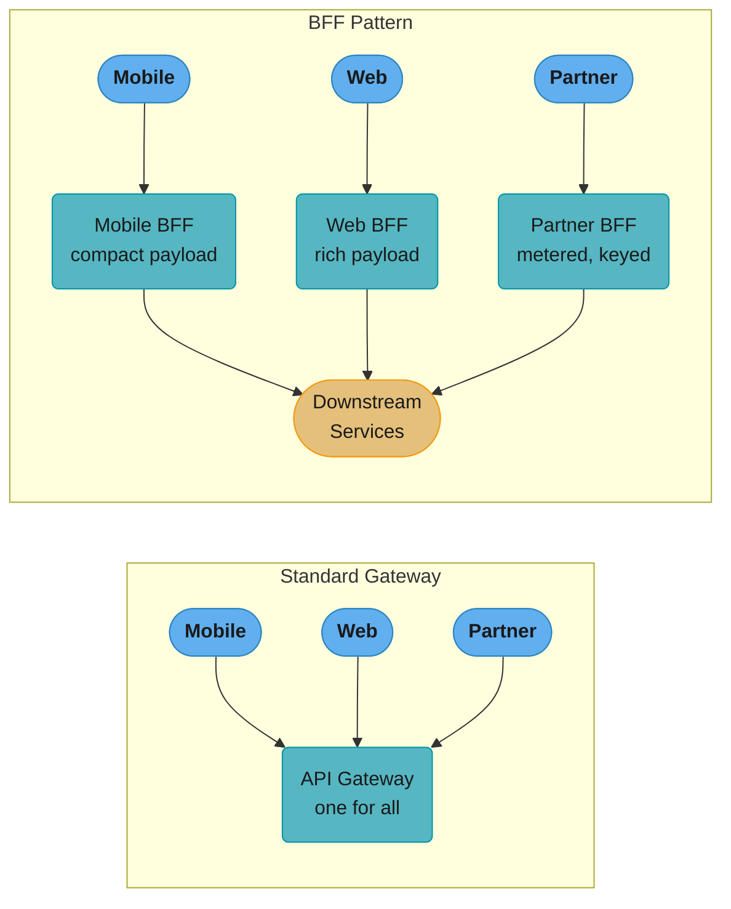
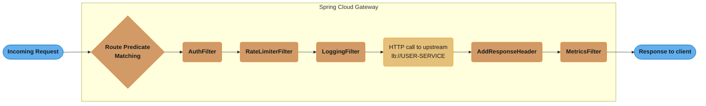
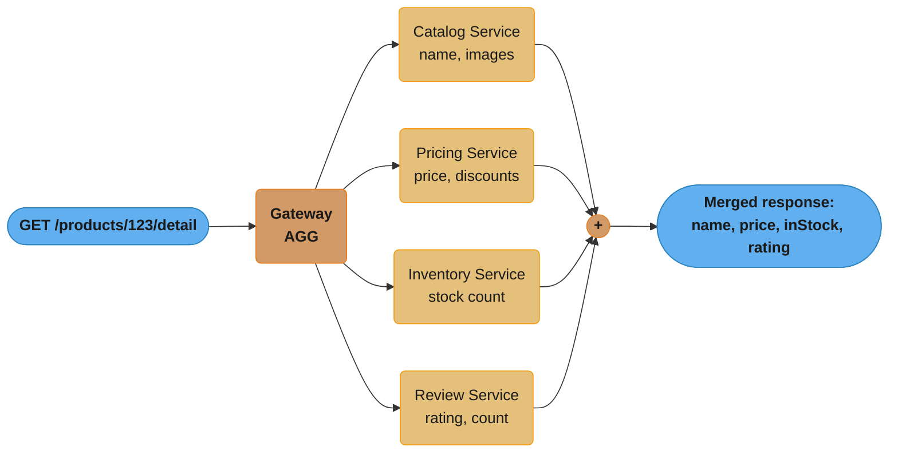
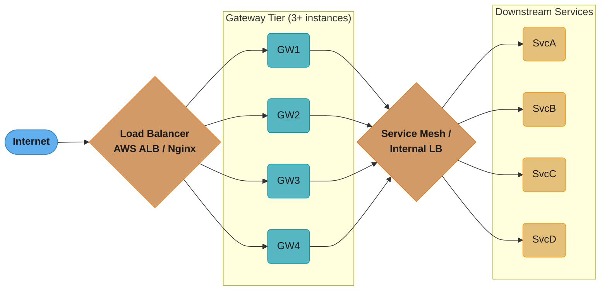
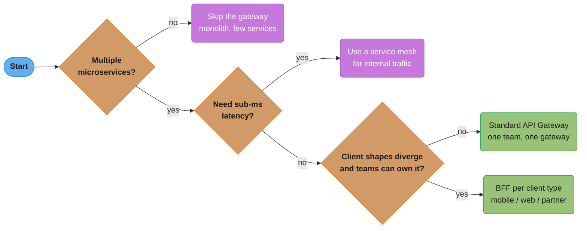
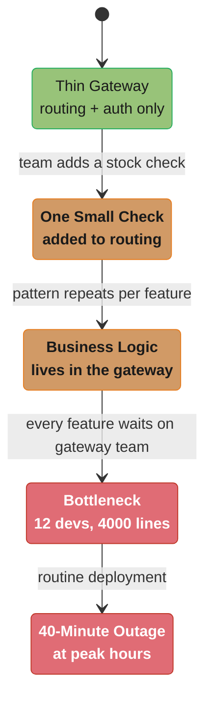
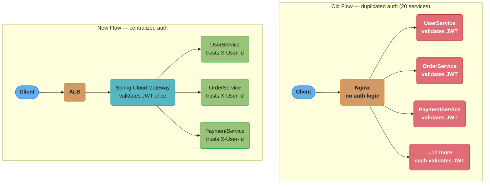
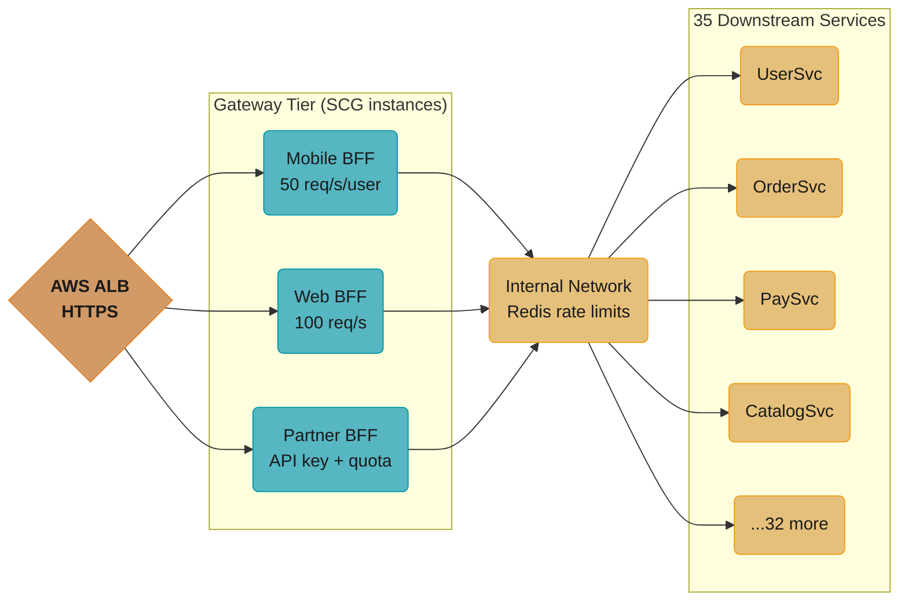

# API Gateway Patterns

---

## 1. Concept Overview

An API gateway is a server that acts as the single entry point for all client requests in a microservices architecture. Instead of clients calling individual services directly, all traffic flows through the gateway, which routes requests, enforces policies, and aggregates responses.

The gateway externalizes cross-cutting concerns — authentication, rate limiting, SSL termination, logging — that would otherwise be duplicated in every service. It also abstracts the internal topology of the backend: clients see a stable surface while services can be split, merged, or relocated behind the gateway.

---

## 2. Intuition

One-line analogy: the API gateway is the lobby of a large office building — every visitor enters through it, shows credentials, gets directed to the right floor, and the security desk logs every entry. The individual offices do not need their own security desks.

Mental model: without a gateway, a mobile app calling a product page must call catalog service, inventory service, pricing service, and review service separately — four round trips, four auth checks, four rate limit implementations. With a gateway, one call, one auth check, one rate limit, one aggregated response.

Why it matters: in a 50-service backend, without a gateway, cross-cutting concerns duplicate 50 times. A security vulnerability in JWT validation must be patched in 50 places. A new rate limiting policy must be configured in 50 services. The gateway centralizes this.

Key insight: the gateway trades a potential single point of failure for massive simplification of the client contract and cross-cutting concerns. The SPOF risk is mitigated by running multiple gateway instances behind a load balancer.

---

## 3. Core Principles

**Single Entry Point**
All client traffic enters through the gateway. Services are not directly reachable from the internet. This enables centralized policy enforcement.

**Thin Gateway, Smart Services**
The gateway handles routing and policy enforcement, not business logic. Business logic belongs in services. A gateway that contains business logic becomes a bottleneck and a deployment coordination point.

**Client-Specific Aggregation**
Different clients (mobile, web, partner) have different data needs. The gateway can tailor responses to each client type rather than forcing all clients to make multiple calls.

**Stateless Gateway**
The gateway itself holds no session state. Session state lives in downstream services or a distributed cache (Redis). This allows horizontal scaling of gateway instances.

**Fail Fast at the Edge**
Auth failures, rate limit violations, and malformed requests are rejected at the gateway before consuming service resources. A single invalid JWT check at the edge prevents 50 services from doing the same check.

---

## 4. Types / Architectures / Strategies

### Standard API Gateway

One gateway for all clients. Routes `/api/v1/users/**` to the User Service, `/api/v1/orders/**` to the Order Service. Handles JWT validation, rate limiting, SSL termination, and logging centrally.

### Backend For Frontend (BFF)

Separate gateway per client type:
- Mobile BFF: returns compact payloads, handles push notification tokens, mobile-specific auth flows.
- Web BFF: returns richer payloads, handles cookie-based sessions, CSRF tokens.
- Partner BFF: enforces partner-specific rate limits, API key auth, usage metering.

Each BFF is owned by the team that builds the client. The mobile team owns the Mobile BFF. This prevents the "mega-gateway" problem where the gateway team becomes a bottleneck for every client team's needs.

### API Composition Gateway

The gateway aggregates responses from multiple services and returns a single response to the client. Analogous to what GraphQL does at the query layer, but applied at the HTTP routing layer. Useful when a single client view (product detail page) requires data from catalog, inventory, pricing, and reviews.

### GraphQL Gateway

A GraphQL server (Apollo Federation, Spring for GraphQL) acts as the gateway. Services expose GraphQL subgraphs. The gateway federates them into a single unified schema. Clients specify exactly the fields they need; the gateway fetches only the required data from the relevant services.

---

## 5. Architecture Diagrams

### Standard Gateway vs BFF



A single shared gateway routes every client type through identical logic, while the BFF pattern gives each client its own tailored gateway instance — owned by that client's team — that still calls the same downstream services.

### Spring Cloud Gateway Internals



Every request passes through predicate matching, an ordered pre-filter chain (Auth, RateLimiter, Logging), the proxied call to the upstream service, and a post-filter chain before the response returns to the client.

### API Composition



The gateway fans out to four services in parallel (`Mono.zip`) and merges their responses into one payload — cutting client round trips from four to one.

### Single Point of Failure Mitigation



A single gateway instance is a SPOF; running a minimum of three behind a load balancer, with an internal mesh routing to redundant service instances, removes the single point of failure.

---

## 6. How It Works — Detailed Mechanics

### Spring Cloud Gateway Configuration

```yaml
# application.yml — Spring Cloud Gateway
spring:
  cloud:
    gateway:
      routes:
        - id: user-service
          uri: lb://USER-SERVICE
          predicates:
            - Path=/api/v1/users/**
          filters:
            - StripPrefix=2
            - name: CircuitBreaker
              args:
                name: userServiceCB
                fallbackUri: forward:/fallback/users
            - name: RequestRateLimiter
              args:
                redis-rate-limiter.replenishRate: 100
                redis-rate-limiter.burstCapacity: 200
                key-resolver: "#{@userKeyResolver}"

        - id: order-service
          uri: lb://ORDER-SERVICE
          predicates:
            - Path=/api/v1/orders/**
            - Header=X-API-Version, 2
          filters:
            - StripPrefix=2
            - AddRequestHeader=X-Internal-Request, true
            - name: Retry
              args:
                retries: 3
                statuses: SERVICE_UNAVAILABLE
                methods: GET
                backoff:
                  firstBackoff: 50ms
                  maxBackoff: 500ms
                  factor: 2

      default-filters:
        - AddResponseHeader=X-Gateway-Version, 1.0
        - name: RequestSize
          args:
            maxSize: 5MB
```

### JWT Authentication Global Filter

```java
@Component
public class JwtAuthenticationFilter implements GlobalFilter, Ordered {

    private final JwtValidator jwtValidator;

    // paths that do not require authentication
    private static final Set<String> PUBLIC_PATHS = Set.of(
        "/api/v1/auth/login",
        "/api/v1/auth/register",
        "/actuator/health"
    );

    @Override
    public Mono<Void> filter(ServerWebExchange exchange, GatewayFilterChain chain) {
        String path = exchange.getRequest().getPath().value();

        if (PUBLIC_PATHS.stream().anyMatch(path::startsWith)) {
            return chain.filter(exchange);
        }

        String authHeader = exchange.getRequest()
            .getHeaders()
            .getFirst(HttpHeaders.AUTHORIZATION);

        if (authHeader == null || !authHeader.startsWith("Bearer ")) {
            exchange.getResponse().setStatusCode(HttpStatus.UNAUTHORIZED);
            return exchange.getResponse().setComplete();
        }

        String token = authHeader.substring(7);
        return jwtValidator.validate(token)
            .flatMap(claims -> {
                // Propagate user info as headers to downstream services
                // Services trust these headers (they are internal only)
                ServerHttpRequest mutatedRequest = exchange.getRequest()
                    .mutate()
                    .header("X-User-Id", claims.getSubject())
                    .header("X-User-Roles", String.join(",", claims.getRoles()))
                    .build();
                return chain.filter(exchange.mutate().request(mutatedRequest).build());
            })
            .onErrorResume(e -> {
                exchange.getResponse().setStatusCode(HttpStatus.UNAUTHORIZED);
                return exchange.getResponse().setComplete();
            });
    }

    @Override
    public int getOrder() {
        return -100; // run before routing
    }
}
```

### Rate Limiter Key Resolver

```java
// Rate limit per user ID (extracted from JWT-populated header)
@Bean
public KeyResolver userKeyResolver() {
    return exchange -> Mono.justOrEmpty(
        exchange.getRequest().getHeaders().getFirst("X-User-Id")
    ).defaultIfEmpty("anonymous");
}

// Rate limit per API key (for partner APIs)
@Bean
public KeyResolver apiKeyResolver() {
    return exchange -> Mono.justOrEmpty(
        exchange.getRequest().getHeaders().getFirst("X-API-Key")
    ).switchIfEmpty(Mono.error(new ResponseStatusException(HttpStatus.UNAUTHORIZED)));
}
```

### API Composition Example

```java
@RestController
@RequestMapping("/api/v1/products")
public class ProductCompositionController {

    private final CatalogServiceClient catalogClient;
    private final PricingServiceClient pricingClient;
    private final InventoryServiceClient inventoryClient;
    private final ReviewServiceClient reviewClient;

    @GetMapping("/{id}/detail")
    public Mono<ProductDetailResponse> getProductDetail(@PathVariable String id) {
        // Parallel calls — all four execute concurrently
        Mono<CatalogData> catalog = catalogClient.getProduct(id);
        Mono<PricingData> pricing = pricingClient.getPrice(id);
        Mono<InventoryData> inventory = inventoryClient.getStock(id);
        Mono<ReviewSummary> reviews = reviewClient.getSummary(id);

        return Mono.zip(catalog, pricing, inventory, reviews)
            .map(tuple -> ProductDetailResponse.builder()
                .name(tuple.getT1().getName())
                .description(tuple.getT1().getDescription())
                .price(tuple.getT2().getPrice())
                .discount(tuple.getT2().getDiscount())
                .inStock(tuple.getT3().getQuantity() > 0)
                .rating(tuple.getT4().getAverageRating())
                .reviewCount(tuple.getT4().getCount())
                .build());
    }
}
```

### Fallback Controller

```java
@RestController
@RequestMapping("/fallback")
public class FallbackController {

    @GetMapping("/users")
    public ResponseEntity<ErrorResponse> userServiceFallback() {
        return ResponseEntity.status(HttpStatus.SERVICE_UNAVAILABLE)
            .body(new ErrorResponse("USER_SERVICE_UNAVAILABLE",
                "User service is temporarily unavailable. Please try again."));
    }

    @GetMapping("/orders")
    public ResponseEntity<CachedOrderResponse> orderServiceFallback(
            ServerWebExchange exchange) {
        // Return cached/degraded response instead of error when possible
        String userId = exchange.getRequest().getHeaders().getFirst("X-User-Id");
        return ResponseEntity.ok(CachedOrderResponse.degraded(userId));
    }
}
```

---

## 7. Real-World Examples

**Netflix Zuul / Spring Cloud Gateway**: Netflix built Zuul as their first-generation gateway. Zuul 1 used a thread-per-connection model and became a bottleneck at high concurrency. Zuul 2 (and Spring Cloud Gateway) uses a non-blocking reactive model (Netty) that handles thousands of concurrent connections with far fewer threads.

**AWS API Gateway**: used by companies running serverless architectures. Lambda authorizers validate custom tokens. Usage plans and API keys enforce per-client rate limits. Throttling settings at 10,000 requests per second default, adjustable per stage and method.

**Kong at Instacart**: Kong (Nginx-based) handles 1M+ requests per hour. Rate limiting, JWT validation, and request transformation are all Kong plugins. Declarative configuration via deck allows infrastructure-as-code for gateway config.

**Uber's API Gateway**: Uber built a custom gateway (APEX) that routes to 2,000+ microservices. It handles service discovery, protocol translation (HTTP to Thrift), and dynamic routing based on request attributes.

---

## 8. Tradeoffs

| Dimension | With API Gateway | Without API Gateway |
|---|---|---|
| Cross-cutting concerns | Centralized (auth, rate limiting once) | Duplicated in every service |
| Client simplicity | One endpoint, aggregated responses | Multiple service calls per page |
| Operational complexity | Additional component to deploy and monitor | Simpler topology |
| Latency | +5-20ms per request (gateway overhead) | Direct service calls are faster |
| SPOF risk | High if gateway is single instance | No gateway = no gateway SPOF |
| Service discoverability | Hidden behind gateway (good for security) | Services directly exposed |
| BFF flexibility | Per-client tailoring possible | All clients hit same APIs |
| Protocol translation | HTTP to gRPC, WebSocket, etc. | Each client handles protocols |

### Gateway Products Comparison

| Feature | Spring Cloud Gateway | Kong | AWS API GW |
|---|---|---|---|
| Model | Reactive (Project Reactor / Netty) | Nginx-based (lua plugins) | Managed SaaS |
| Config | Java/YAML, code | declarative YAML / admin API / deck | Console / Terraform / CDK |
| Auth | Custom filters, Spring Security | JWT, OAuth2, basic-auth plugins | Lambda authorizer, Cognito |
| Rate limiting | Redis-backed token bucket | Redis-backed, per consumer | Usage plans per API key |
| Service discovery | Eureka, Kubernetes, Consul | Consul, DNS | Not applicable (Lambda/EC2 targets) |
| Cost | Open source | Open source (EE paid) | Per-request pricing (~$3.50/million) |
| Best for | Spring Boot shops, full control | Polyglot, plugin ecosystem | AWS-native, serverless |

---

## 9. When to Use / When NOT to Use

**Use an API gateway when:**
- You have multiple microservices that clients need to call.
- You want to centralize JWT/OAuth2 validation instead of duplicating it.
- Different client types (mobile vs web) need tailored response shapes.
- You need rate limiting, SSL termination, or request logging at the edge.
- You want to hide internal service topology from external clients.

**Do NOT use an API gateway when:**
- You have a monolith or very few services — overhead is not justified.
- You need to put business logic in the gateway — it will become a bottleneck.
- You need sub-millisecond latency — every gateway hop adds 5-20ms.
- You are building an internal service mesh — a service mesh handles internal traffic better than a gateway.

**BFF when:**
- Mobile and web clients have fundamentally different data shapes.
- Client teams are large enough to own their BFF.
- You want to prevent the API gateway team from becoming a bottleneck for every feature.



A monolith or a handful of services rarely justifies the added 5-20ms hop; once services multiply, the remaining choice is whether client needs diverge enough to warrant a BFF per client type instead of one shared gateway.

---

## 10. Common Pitfalls

**The Smart Gateway Anti-Pattern**
Teams gradually add business logic to the gateway: "let's validate stock availability at the gateway level." Now the gateway calls the inventory service to check stock before routing to the order service. The gateway has business logic. A change in inventory rules requires a gateway deployment. The gateway team is on the critical path for every feature. Keep the gateway thin: routing, auth, rate limiting, logging only.

Production war story: a major e-commerce company's gateway team became a 12-person team maintaining 4,000 lines of routing rules, coupon validation, A/B test routing, and personalization logic. A gateway deployment caused a 40-minute outage during peak hours. The gateway had become the most complex and fragile component in the system.



The anti-pattern is a slow drift, not one bad decision: each "just one small check" compounds until the gateway team owns 4,000 lines of business logic and sits on the critical path for every feature — exactly what caused the 40-minute peak-hour outage above.

**Single Point of Failure with One Instance**
Running a single gateway instance. A gateway crash or misconfiguration takes down all traffic. Always run a minimum of 3 gateway instances behind a load balancer. Use circuit breakers on gateway routes so a failing service does not cascade to the gateway becoming unresponsive.

**Missing Fallback Routes**
A downstream service fails and the gateway returns 502 to the client with no context. Define fallback URIs for every route: return a cached response, a degraded response, or a clear error message. This is especially important for mobile clients that may display a crash rather than handle a 502 gracefully.

**Propagating Internal Headers to External Clients**
The gateway adds X-User-Id and X-User-Roles headers for downstream services. If the gateway also reflects these headers back to the external client, clients can read (and potentially spoof) internal headers on subsequent requests. Strip internal headers from client responses. Validate and re-generate internal headers from the JWT on each request, never trust X-User-Id from the incoming request.

**No Request Size Limits**
Without request size limits, a client can send a 500MB body to any service. Add `RequestSize` filters (default 5MB) at the gateway default-filters level. Without this, a single large upload can exhaust memory on a downstream service.

**Rate Limiting Without User-Level Keys**
Rate limiting per IP allows a single malicious user with many IPs to bypass limits, while legitimate users on shared IPs (corporate NAT) get unfairly throttled. Rate limit by authenticated user ID for logged-in endpoints, by API key for partner endpoints, and by IP only for public unauthenticated endpoints.

---

## 11. Technologies & Tools

| Category | Tools |
|---|---|
| Spring-native gateway | Spring Cloud Gateway (reactive, Netty-based) |
| Nginx-based | Kong (open source / enterprise), Nginx Plus |
| Managed cloud | AWS API Gateway, Azure API Management, GCP Apigee |
| Service mesh with gateway | Istio Ingress Gateway, Envoy as edge proxy |
| GraphQL federation | Apollo Federation, Spring for GraphQL |
| Rate limiting backend | Redis (token bucket / sliding window) |
| Auth | Spring Security OAuth2, Keycloak, Auth0, Okta |
| Circuit breaker | Resilience4j (integrated with Spring Cloud Gateway) |
| API design / contract | OpenAPI 3.0 (Swagger), AsyncAPI for event-driven |

---

## 12. Interview Questions with Answers

**Q: What is an API gateway and what responsibilities does it typically handle?**
An API gateway is the single entry point for all external traffic in a microservices architecture. It handles routing (directing requests to the correct service), authentication and authorization offloading (JWT validation before the request reaches a service), rate limiting, SSL termination, request and response transformation, logging, and metrics collection. The key benefit is centralizing cross-cutting concerns that would otherwise be duplicated across every service.

**Q: What is the BFF (Backend For Frontend) pattern and when do you use it?**
BFF creates a separate gateway instance tailored to each client type: a Mobile BFF returns compact payloads optimized for bandwidth-constrained devices; a Web BFF returns richer payloads; a Partner BFF enforces API key auth and usage metering. Use BFF when different clients have fundamentally different data shape requirements and when client teams are large enough to own their gateway tier. It prevents the single-gateway team from becoming a bottleneck, as each BFF is owned by the team that builds its corresponding client.

**Q: How does Spring Cloud Gateway differ from Zuul 1?**
Spring Cloud Gateway is fully reactive, built on Project Reactor and Netty, using non-blocking I/O. It handles thousands of concurrent connections with a small, fixed thread pool. Zuul 1 uses a blocking, thread-per-connection model: each request ties up a thread for the duration of the call. Under high concurrency (thousands of concurrent slow upstream services), Zuul 1 exhausts the thread pool and backs up. Spring Cloud Gateway scales better under high concurrency and integrates naturally with reactive Spring WebFlux.

**Q: Explain Spring Cloud Gateway predicates and filters.**
Predicates are conditions that a request must match for a route to apply: `Path=/api/v1/users/**`, `Header=X-API-Version: 2`, `Method=GET`, `Host=api.example.com`. Filters transform the request before routing or the response after: `StripPrefix` removes path segments, `AddRequestHeader` injects headers, `CircuitBreaker` wraps the route with a circuit breaker, `RequestRateLimiter` enforces rate limits via Redis, `RewritePath` transforms the URL. `GlobalFilter` beans apply to every route, while per-route filters apply only to matching routes.

**Q: How do you prevent the API gateway from becoming a single point of failure?**
Run multiple gateway instances (minimum 3) behind a load balancer (AWS ALB, Nginx). Each instance is stateless — rate limit state and session state live in Redis. Use circuit breakers on every route so a failing upstream service returns a fallback response rather than causing the gateway to hang. Health checks on each gateway instance allow the load balancer to route around a failed instance. Use rolling deployments so gateway updates do not cause downtime.

**Q: How does JWT authentication work at the gateway level?**
The gateway intercepts every request, extracts the Bearer token from the Authorization header, validates the JWT signature using the public key (from the authorization server's JWKS endpoint), and checks expiry and claims. On success, the gateway extracts user identity from the JWT claims and injects it as trusted internal headers (X-User-Id, X-User-Roles) before forwarding to the downstream service. Downstream services trust these headers because they are inside the network perimeter and never exposed to external clients. This removes the need for each service to validate JWTs independently.

**Q: What is API composition at the gateway level?**
API composition aggregates responses from multiple services into a single response for the client. For a product detail page, the gateway calls catalog, pricing, inventory, and review services in parallel using reactive composition (Mono.zip), merges the responses, and returns one JSON object to the client. This reduces client round trips from 4 to 1. The tradeoff: the gateway now calls multiple services per request, and the gateway's response time is the maximum of all upstream calls.

**Q: How do you implement rate limiting in Spring Cloud Gateway?**
Spring Cloud Gateway uses the `RequestRateLimiter` filter backed by Redis. The token bucket algorithm allows a `replenishRate` (steady-state tokens added per second) and a `burstCapacity` (maximum tokens in the bucket, allowing short bursts). A `KeyResolver` bean determines the rate limit key: by user ID for authenticated endpoints (extracted from the JWT-populated X-User-Id header), by API key for partner endpoints, or by IP for public unauthenticated endpoints. When the bucket is empty, the gateway returns 429 Too Many Requests.

**Q: What is the difference between a circuit breaker at the gateway level versus at the service level?**
A gateway-level circuit breaker (Spring Cloud Gateway + Resilience4j) protects the gateway from spending time waiting on a failing downstream service, returns a fallback response to the client, and prevents the gateway thread pool from exhausting. A service-level circuit breaker (Resilience4j in the calling service) protects a service from a failing dependency. Both are necessary for defense in depth: gateway-level catches client-facing degradation early; service-level handles internal service-to-service failures. Configure both with appropriate timeouts and fallback behaviors.

**Q: How do you handle versioning at the API gateway?**
Route predicates select routes based on URL path (Path=/api/v2/**) or headers (Header=X-API-Version: 2). Version 1 routes to the old service; version 2 routes to a new service or to the same service with a rewritten path. The gateway allows running multiple API versions simultaneously during migration without requiring all clients to upgrade at once. Deprecate old versions by returning a Deprecation response header with the sunset date.

**Q: What is Kong and how does it differ from Spring Cloud Gateway?**
Kong is an Nginx-based API gateway with a plugin architecture. Core functionality (rate limiting, JWT auth, OAuth2, request transformation, logging) is provided by plugins written in Lua. Configuration is declarative via YAML files managed by the deck CLI. Kong is language-agnostic — it sits in front of any backend technology. Spring Cloud Gateway is JVM-native, configured in Java and YAML, integrates deeply with the Spring ecosystem (Eureka, Spring Security, Micrometer), and is better suited for Spring Boot shops that want full programmatic control. Kong is better for polyglot environments where the gateway team wants plugin-based configuration without writing Java code.

**Q: How does AWS API Gateway work with Lambda authorizers?**
A Lambda authorizer is a Lambda function that runs before the backend Lambda (or HTTP endpoint). It receives the request token (JWT, API key, or custom header) and returns an IAM policy document that allows or denies access to the API resource. AWS API Gateway caches the authorizer response for a configurable TTL (300 seconds default). Usage plans and API keys enforce rate limits and quotas per client. This model is fully serverless — no always-on gateway instances to manage.

**Q: How do you propagate correlation IDs through the gateway?**
A Global filter checks for an X-Correlation-ID header. If absent (i.e., the request originates from an external client), the filter generates a UUID and sets it. If present (internal service-to-service call relayed through the gateway), it reuses the existing ID. The filter adds the correlation ID to the outgoing request headers (forwarded to downstream services), adds it to the response headers (returned to the client for support tickets), and writes it to the MDC for structured logging. All downstream services must propagate this header to their own outbound calls.

**Q: What are the security risks of an API gateway and how do you mitigate them?**
The gateway is a high-value attack target. Risks: DDoS (mitigate with rate limiting and WAF), injection via headers or query params (validate and sanitize at the gateway), internal header spoofing (strip X-User-Id and X-User-Roles from incoming external requests before JWT validation; re-set them from validated JWT claims), JWT algorithm confusion attacks (explicitly specify allowed algorithms, reject "none" alg). Always run the gateway behind a WAF (AWS WAF, Cloudflare) for layer 7 protection. Run the gateway in a private subnet; expose it only via a load balancer with HTTPS.

**Q: How do you implement graceful degradation when a downstream service is unavailable?**
Configure a `CircuitBreaker` filter with a `fallbackUri` for every route. The fallback endpoint returns either a cached response (from Redis or an in-memory cache), a degraded response (indicating reduced functionality), or a clear error message. For example, if the recommendation service is down, return an empty recommendations list rather than failing the product page. Design fallback responses with the client's user experience in mind: which features can be silently degraded versus which require explicit error messaging.

---

## 13. Best Practices

- Keep the gateway thin: routing, auth, rate limiting, logging, and SSL termination only. No business logic.
- Run a minimum of 3 gateway instances behind a load balancer. Never a single instance in production.
- Define circuit breakers and fallback URIs for every route. Test fallback paths explicitly in load tests.
- Rate limit by authenticated user ID, not by IP, for authenticated endpoints.
- Strip internal headers (X-User-Id, X-User-Roles) from incoming external requests and re-populate them only from validated JWT claims.
- Log every request at the gateway with correlation ID, service name, HTTP method, path, status code, and latency. Ship logs to a central aggregator.
- Use the BFF pattern when client types diverge significantly in data shape requirements.
- Version APIs via path prefixes or headers. Support at least two versions simultaneously during client migration.
- Implement request size limits as default filters to protect all downstream services from large body attacks.
- Health check all gateway instances and configure the load balancer to route around unhealthy instances.
- Test gateway configuration changes in a staging environment with traffic replay before production deployment.

---

## 14. Case Study

### API Gateway Migration: From Nginx Routing Table to Spring Cloud Gateway

**Context**: A fintech company running 35 microservices with a hand-maintained Nginx configuration file of 2,300 lines for routing. JWT validation was implemented in 20 out of 35 services (inconsistently). Rate limiting existed for 3 services. No circuit breakers. A security audit found that 8 services were accepting requests without JWT validation.

**Problem**: every new service required an Nginx config PR reviewed by the ops team. JWT validation was duplicated and inconsistently implemented. A JWT library vulnerability required patching 20 services. No rate limiting on 32 services meant one abusive client could starve others.

**Solution: Spring Cloud Gateway**

Phase 1: Deploy Spring Cloud Gateway behind existing AWS ALB. Mirror 10% of traffic to the gateway while Nginx handles the rest. Validate routing behavior.

Phase 2: Implement global JWT authentication filter. Strip auth code from 20 services over 6 weeks. All auth now centralized.



Twenty services each re-implementing JWT validation (red) become three lines that trust a single gateway-injected header (green) — the same fix that let a JWT library patch ship in 2 hours instead of an estimated 3 weeks.

Phase 3: Implement Redis-backed rate limiting. All 35 services now rate-limited by user ID. 100 requests/second per user, burst to 200.

Phase 4: Add circuit breakers with fallback routes for all 35 services. Fallback responses designed with product team.

Phase 5: Introduce Mobile BFF and Web BFF. Mobile BFF returns compact payloads (no descriptions, reduced image URLs, pagination at 20 items). Web BFF returns full payloads with API composition for product detail pages.

**Architecture after migration**:


All three BFFs share one ALB entry point and one Redis-backed rate-limit store, then fan out to the same 35 downstream services — the end state of the migration described above.

**Results**:
- JWT patching: 1 gateway deployment instead of 20 service deployments. Patch delivered in 2 hours vs estimated 3 weeks.
- Rate limiting coverage: 0/35 services to 35/35 in 2 weeks.
- Circuit breaker coverage: 0/35 to 35/35. First month: 12 circuit breaker trips, all returned fallback responses instead of cascading failures.
- New service onboarding: add 4 lines of YAML to gateway config. No ops team involvement.
- Mobile app load time: reduced 340ms average (4 sequential API calls) to 95ms (1 gateway call with parallel composition).
