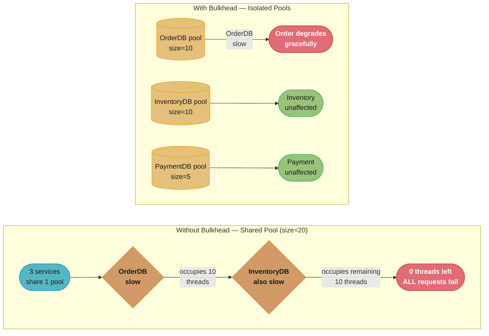
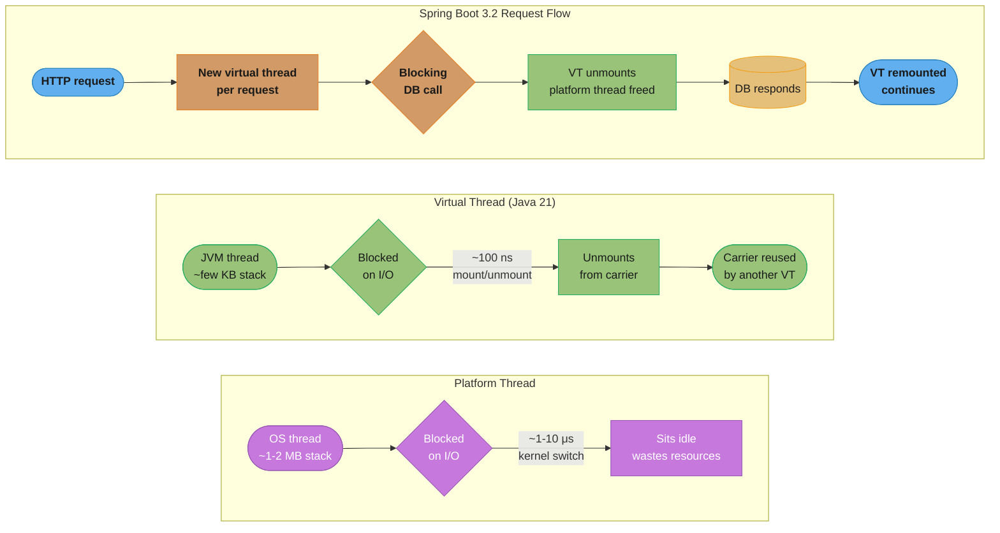
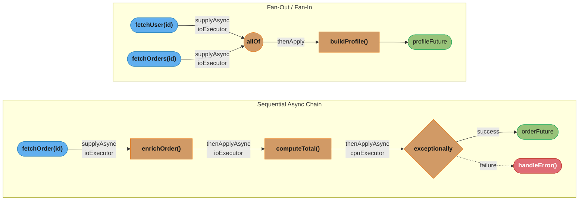
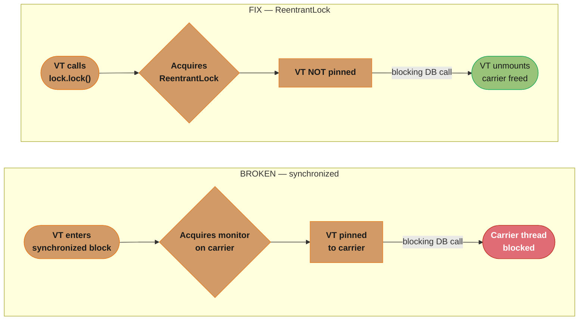
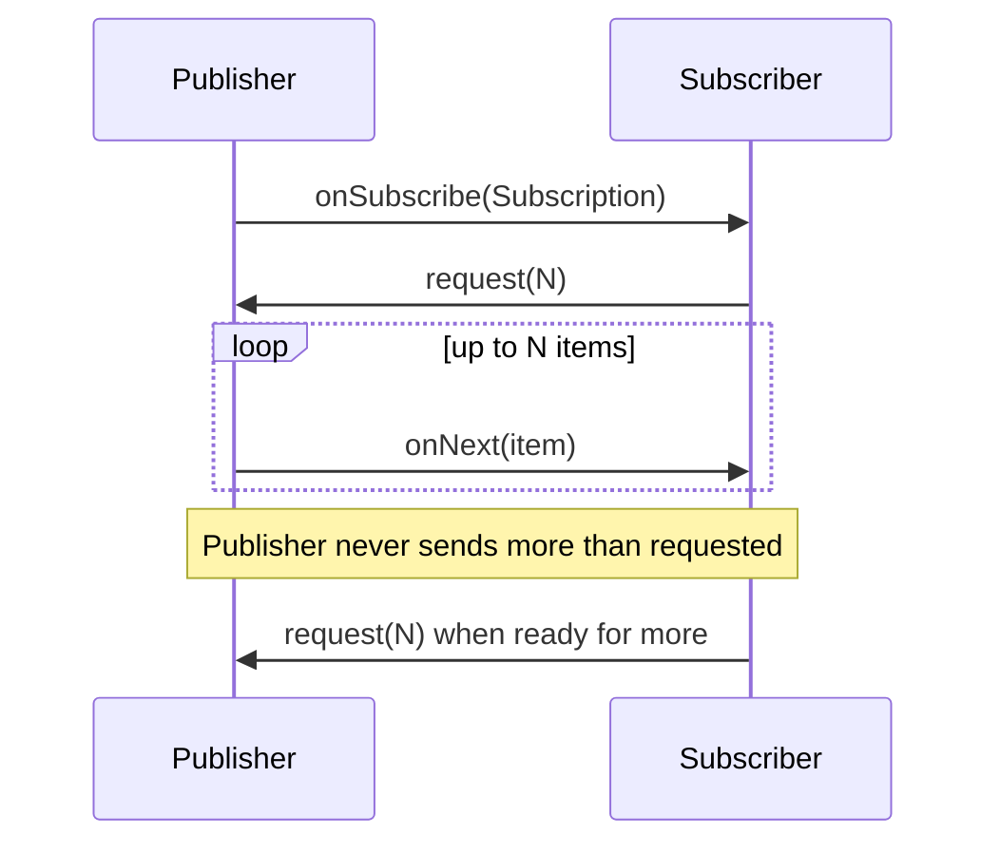

# Async & Concurrency Patterns

## 1. Concept Overview

Backend services spend most of their time waiting: waiting for database responses, external API calls, file I/O. Efficiently managing this waiting — deciding how many threads to use, what to do while waiting, how to handle failures in async chains, and how to prevent one slow dependency from blocking everything else — is the essence of backend concurrency design.

This module covers the practical engineering of async systems in Java: thread pool sizing formulas, CompletableFuture's traps and best practices, Java 21 virtual threads and their pinning pitfalls, reactive backpressure strategies, and the bulkhead pattern for isolating slow dependencies.

---

## 2. Intuition

> **One-line analogy**: A backend service handling concurrent requests is like a restaurant kitchen. The thread pool is the kitchen staff. The thread pool sizing question is "how many chefs do we need?" Too few chefs and orders queue up. Too many chefs and they trip over each other at the same stove (CPU context switches). The bulkhead is separate sections of the kitchen for different dishes — a slow pasta station does not block the fast salad station.

**Mental model**: IO-bound tasks spend most of their time waiting (not using CPU). CPU-bound tasks spend most of their time computing. The optimal thread count differs dramatically: IO-bound workloads can use many more threads than CPU cores because threads spend most of their time not using the CPU (waiting for I/O).

**Why it matters**: Thread pool misconfiguration is one of the most common causes of production failures. A thread pool that is too small causes request timeouts under load. A pool that is too large causes excessive context switching and memory pressure. Wrong thread pool for async callbacks causes subtle deadlocks and latency spikes.

**Key insight**: Java 21 virtual threads change the calculus for IO-bound work — you can have millions of virtual threads without significant overhead. But virtual threads are not magic: they cannot parallelize CPU-bound work, and pinned virtual threads (inside synchronized blocks holding monitors) cause platform thread exhaustion.

---

## 3. Core Principles

- **Thread pool sizing**: IO-bound: N = N_cpu * (1 + W/C) where W = wait time, C = CPU time. CPU-bound: N = N_cpu + 1 (one extra for OS scheduling).
- **CompletableFuture default executor**: ForkJoinPool.commonPool() — shared across the JVM, potentially impacted by other code using it. Use dedicated executors for production code.
- **Virtual threads**: Cheap, lightweight threads. One per blocking I/O operation is fine. Cannot parallelize CPU-bound work. Watch for pinning.
- **Backpressure**: In reactive streams, the consumer signals to the producer how fast it can consume. Without backpressure, fast producers overwhelm slow consumers.
- **Bulkhead**: Each dependency gets its own thread pool. A slow dependency exhausts only its pool, not the whole application.

---

## 4. Types / Architectures / Strategies

### 4.1 Thread Pool Sizing

| Workload | Formula | Example |
|---------|---------|---------|
| CPU-bound | N_cpu + 1 | 8-core server: pool size = 9 |
| IO-bound | N_cpu * (1 + W/C) | 8-core, W=50ms, C=5ms: 8 * (1 + 10) = 88 |
| Mixed | Measure, then tune | Profile wait vs compute ratio |
| Virtual threads (Java 21) | Unlimited (per-request) | One VT per blocking I/O call |

W/C is the wait-to-compute ratio. For a service that spends 50ms waiting for a DB call and 5ms processing the result, W/C = 10, and a pool of 88 threads for 8 cores keeps CPUs fully utilized.

### 4.2 Backpressure Strategies (Reactive)

| Strategy | Behavior | When to Use |
|---------|----------|-------------|
| BUFFER | Buffer excess items | Short-lived bursts with bounded buffer |
| DROP | Drop excess items | Telemetry, logs, non-critical updates |
| LATEST | Keep only newest | State updates (only latest matters) |
| ERROR | Signal overflow as error | Strict SLA, must not lose items |
| BLOCK | Block producer (if synchronous) | Bounded throughput requirement |

### 4.3 CompletableFuture Method Reference

| Method | Thread | Use Case |
|--------|--------|---------|
| thenApply(fn) | Continuation thread (or calling thread if already done) | Sync transform |
| thenApplyAsync(fn) | ForkJoinPool.commonPool() | Async transform |
| thenApplyAsync(fn, executor) | Specified executor | Async transform, controlled thread |
| thenCompose(fn→CF) | Continuation | Chain async calls |
| thenCombine(cf, fn) | Continuation | Combine two futures |
| allOf(cf1, cf2...) | None (waits for all) | Wait for multiple |
| anyOf(cf1, cf2...) | None (first to complete) | Wait for any |
| exceptionally(fn) | Continuation | Error handling |
| whenComplete(fn) | Continuation | Always-run callback |
| handle(fn) | Continuation | Process result OR exception |

---

## 5. Architecture Diagrams

### Bulkhead Thread Pool Isolation



Without bulkhead isolation, one slow dependency (OrderDB) exhausts the shared pool of 20 threads and cascades into total failure once InventoryDB also slows down; with bulkhead isolation, each dependency's own pool (10/10/5) walls off the slowness, so a slow OrderDB only degrades Order calls while Inventory and Payment keep serving traffic.

### Virtual Threads vs Platform Threads



For 1000 concurrent requests, ~1-2 MB platform-thread stacks cost ~1 GB of RAM versus ~10 MB for ~few-KB virtual-thread stacks; the unmount/remount trick (~100 ns JVM-level switch instead of a ~1-10 μs kernel context switch) is what lets Spring Boot 3.2's 200 Tomcat threads serve 10,000 concurrent requests.

**Stated plainly.** "Platform threads make you pay a megabyte to sit and wait; virtual threads make waiting nearly free, so the limit stops being memory and starts being the downstream service."

Two separate ceilings are in play. The memory ceiling is how many threads fit in RAM. The throughput ceiling is Little's Law. Platform threads hit the memory ceiling first, which is the entire reason the 200-thread Tomcat default exists.

| Symbol | What it is |
|--------|------------|
| platform thread stack | `~1 MB` reserved per thread, whether it works or waits |
| virtual thread stack | `~few KB`, heap-allocated, grows only as deep as the call stack |
| switch cost | `~1-10 us` kernel context switch vs `~100 ns` JVM unmount |
| `L = λ x W` | Concurrency = throughput x latency — the throughput ceiling |

**Walk one example.** Serving 10,000 concurrent requests, each waiting 50ms on a database:

```
  platform threads, one per request
    memory  = 10,000 x 1 MB                     = 10 GB     <- will not fit
    so Tomcat caps at 200 threads:
    lambda_max = 200 / 0.050s                   = 4,000 req/s
    request 201 waits in the accept queue

  virtual threads, one per request
    memory  = 10,000 x ~4 KB                    = ~39 MB    <- trivially fits
    the 200 carrier threads never block; they unmount at every wait
```

Watch what actually changed: virtual threads did not make any single request faster -- the database still takes 50ms. They removed the *memory* ceiling so the thread count could follow the concurrency instead of capping it. The corollary bites in production: with 10,000 virtual threads all reaching for a 10-connection HikariCP pool, the bottleneck simply relocates to the connection pool. Virtual threads move the queue; they do not delete it.

### CompletableFuture Chain



The sequential chain alternates IO and CPU executors per stage so no single pool absorbs both wait time and computation, and `exceptionally` catches a failure from any upstream stage; the fan-out/fan-in half fetches the user and their orders concurrently and joins with `allOf` only once both complete.

---

## 6. How It Works — Detailed Mechanics

### 6.1 CompletableFuture Pitfalls

```java
// BROKEN: Using default commonPool for blocking I/O
// commonPool parallelism = N_cpu - 1 (e.g., 7 on 8-core machine)
// Blocking I/O operations in commonPool deprive CPU work of threads
CompletableFuture<User> cf = CompletableFuture.supplyAsync(() -> {
    return userRepository.findById(id);  // blocking JDBC call — BAD in commonPool
});

// FIX: Use a dedicated IO executor for blocking calls
Executor ioExecutor = Executors.newFixedThreadPool(
    Runtime.getRuntime().availableProcessors() * 10  // IO-bound formula
);

CompletableFuture<User> cf = CompletableFuture.supplyAsync(() -> {
    return userRepository.findById(id);
}, ioExecutor);  // explicit executor

// BROKEN: Missing error handling causes silently swallowed exceptions
CompletableFuture<User> cf = CompletableFuture
    .supplyAsync(() -> userRepository.findById(id))
    .thenApply(user -> enrichUser(user));
// If enrichUser throws, the exception is stored but nobody sees it
// cf.join() or cf.get() would throw, but if result is not consumed... silent fail

// FIX: Always handle errors
CompletableFuture<User> cf = CompletableFuture
    .supplyAsync(() -> userRepository.findById(id))
    .thenApply(user -> enrichUser(user))
    .exceptionally(ex -> {
        log.error("Failed to get user", ex);
        return null;  // or throw, depending on requirements
    });

// BROKEN: Using thenApply for async operation (nesting instead of chaining)
CompletableFuture<CompletableFuture<Order>> nested =
    CompletableFuture.supplyAsync(() -> fetchUser(id))
    .thenApply(user -> fetchOrderAsync(user));  // returns CF inside CF — wrong

// FIX: Use thenCompose for chaining async operations
CompletableFuture<Order> chained =
    CompletableFuture.supplyAsync(() -> fetchUser(id))
    .thenCompose(user -> fetchOrderAsync(user));  // flattens nested CF

// BROKEN: Blocking in thenApply (defeats async purpose)
CompletableFuture<Order> cf = CompletableFuture
    .supplyAsync(() -> fetchUser(id))
    .thenApply(user -> {
        try { Thread.sleep(1000); } catch (InterruptedException e) {}  // WRONG
        return fetchOrder(user);  // blocking in transformation callback
    });

// FIX: Use thenApplyAsync with appropriate executor for blocking work
CompletableFuture<Order> cf = CompletableFuture
    .supplyAsync(() -> fetchUser(id))
    .thenApplyAsync(user -> fetchOrder(user), ioExecutor);  // async
```

### 6.2 Virtual Threads and Pinning



`synchronized` acquires the object monitor on the carrier thread itself, so the virtual thread cannot unmount during the blocking call and the carrier stays pinned; swapping in `ReentrantLock` removes that constraint, letting the virtual thread unmount normally and free its carrier for other work.

```java
// Java 21 virtual threads
// Enable in Spring Boot: spring.threads.virtual.enabled=true

// Virtual threads unmount from carrier thread during blocking I/O
// EXCEPTION: when inside a synchronized block
// synchronized acquires a monitor on the CARRIER thread — cannot unmount

// BROKEN: Virtual thread pinning
// If virtualThread is inside synchronized, it pins to its carrier thread
// Carrier thread is blocked, reducing available parallelism
public synchronized Response handleRequest(Request req) {
    // Virtual thread is PINNED here — cannot unmount during blocking calls
    return database.query(req.getQuery());  // carrier thread blocked during query
}

// FIX: Use ReentrantLock instead of synchronized
private final ReentrantLock lock = new ReentrantLock();

public Response handleRequest(Request req) {
    lock.lock();  // virtual thread does NOT pin on ReentrantLock
    try {
        return database.query(req.getQuery());  // unmounts during query
    } finally {
        lock.unlock();
    }
}

// Also pins: synchronized native methods, cannot be changed
// Detection: -Djdk.tracePinnedThreads=full (logs when virtual thread pins)
// Or JFR: jdk.VirtualThreadPinned event

// Thread-local variables work with virtual threads but be careful:
// With millions of virtual threads, ThreadLocals that accumulate state
// (InheritableThreadLocal with complex inheritance) can cause memory pressure.

// Structured concurrency (Java 21 preview):
try (var scope = new StructuredTaskScope.ShutdownOnFailure()) {
    Future<User> user = scope.fork(() -> fetchUser(id));
    Future<Orders> orders = scope.fork(() -> fetchOrders(id));
    scope.join().throwIfFailed();
    return buildProfile(user.get(), orders.get());
}
// If either subtask fails, the scope is cancelled — both tasks cancelled
// Clean, structured lifetime for child tasks
```

### 6.3 Reactive Backpressure



The Reactive Streams protocol is pull-based: the Subscriber tells the Publisher exactly how many items it can absorb via `request(N)`, and the Publisher is contractually bound to send at most that many `onNext` calls before waiting on the next request — this is what makes backpressure possible without an explicit acknowledgment per item.

```java
// Project Reactor backpressure strategies
Flux<Event> eventStream = eventSource.subscribe()
    // Drop oldest items when buffer overflows
    .onBackpressureDrop(dropped ->
        log.warn("Dropped event due to backpressure: {}", dropped))
    // or
    // .onBackpressureBuffer(1000)  // buffer up to 1000 items
    // .onBackpressureLatest()      // keep only latest
    // .onBackpressureError()       // throw OverflowException

    .flatMap(event -> processEvent(event), 16)  // max 16 concurrent processings
    .subscribe(
        result -> handleResult(result),
        error -> handleError(error)
    );

// Controlling concurrency in flatMap:
// .flatMap(fn, maxConcurrency)
// maxConcurrency=1: sequential (backpressure propagates)
// maxConcurrency=N: N concurrent subscriptions

// WebFlux with backpressure:
// Netty event loop → HTTP/2 window size → application buffer → DB pool
// Each layer has a maximum capacity; when full, upstream is signaled to slow down
```

### 6.4 Thread Pool Configuration

```java
// IO-bound thread pool
int ioThreads = Runtime.getRuntime().availableProcessors()
    * (1 + waitTimeMs / cpuTimeMs);  // formula
// For typical DB-heavy service (50ms wait, 5ms CPU): 8 * 11 = 88

ThreadPoolExecutor ioPool = new ThreadPoolExecutor(
    ioThreads,           // corePoolSize
    ioThreads,           // maximumPoolSize (same — fixed size)
    0L, TimeUnit.MILLISECONDS,
    new LinkedBlockingQueue<>(1000),  // bounded queue — fail fast if overwhelmed
    new ThreadFactoryBuilder()
        .setNameFormat("io-pool-%d")
        .setDaemon(true)
        .build(),
    new ThreadPoolExecutor.CallerRunsPolicy()  // or AbortPolicy to throw exception
);

// CPU-bound thread pool
int cpuThreads = Runtime.getRuntime().availableProcessors() + 1;
ThreadPoolExecutor cpuPool = new ThreadPoolExecutor(
    cpuThreads,
    cpuThreads,
    0L, TimeUnit.MILLISECONDS,
    new SynchronousQueue<>(),  // no queue — fail fast if all threads busy
    new ThreadFactoryBuilder().setNameFormat("cpu-pool-%d").build(),
    new ThreadPoolExecutor.AbortPolicy()  // throw RejectedExecutionException
);
```

**What this actually says.** "Add one extra thread for every unit of time a thread spends waiting rather than computing — because a waiting thread costs a slot but no CPU."

The ratio `waitTime / cpuTime` is the whole formula. It is a *blocking coefficient*: it asks what fraction of a task's life the thread is idle-but-occupied. CPU-bound work has a coefficient near zero and needs roughly one thread per core; I/O-bound work has a large coefficient and needs many.

| Symbol | What it is |
|--------|------------|
| `availableProcessors()` | Usable cores. `8` in the worked case below |
| `waitTimeMs` | Time per task spent blocked — DB round trip, HTTP call. `50ms` |
| `cpuTimeMs` | Time per task actually burning CPU — parsing, mapping. `5ms` |
| `1 + wait/cpu` | Threads needed per core to keep that core busy while others wait |
| `+ 1` (CPU pool) | One spare so a page fault or brief stall does not idle a core |

**Walk one example.** The DB-heavy service in the comment, on an 8-core box:

```
  blocking coefficient = wait / cpu   =  50 / 5    = 10
  threads per core     = 1 + 10                    = 11
  ioThreads            = 8 cores x 11              = 88

  sanity check -- of each 55ms task, CPU is busy only 5ms:
    88 threads x (5 / 55 CPU duty cycle) = 8.0 cores fully saturated

  the same box, CPU-bound work (wait = 0):
    1 + 0/5 = 1  ->  8 x 1 = 8, plus the spare = 9 threads
```

Those two answers -- 88 and 9 -- come from identical hardware. That gap is why a single shared pool is always wrong for a service doing both kinds of work: size it for I/O and CPU tasks thrash on context switches; size it for CPU and I/O tasks starve.

**The idea behind it.** "A pool's maximum throughput is fixed at threads divided by service time — so the bounded queue does not add capacity, it only decides how long doomed requests wait before you admit you are overloaded."

This is Little's Law, `L = λ x W`: concurrency equals arrival rate times latency. Read backwards it gives the pool's ceiling, and read forwards it turns any queue depth into a latency number. Sizing a queue without doing this arithmetic is how "we made the queue bigger" becomes "now we time out *and* waste the work."

| Symbol | What it is |
|--------|------------|
| `L` | Concurrency — requests in flight. For a saturated pool, the thread count `88` |
| `λ` | Arrival rate, requests/second |
| `W` | Service time per request: `cpuTime + waitTime = 5 + 50 = 55ms` |
| `λ_max` | Pool throughput ceiling, `threads / W` |
| queue capacity | `1000` in `LinkedBlockingQueue<>(1000)` — pure waiting room, not capacity |

**Walk one example.** The same 88-thread pool, pushed past its ceiling:

```
  ceiling  : lambda_max = 88 threads / 0.055s          = 1600 req/s
  check    : L = lambda x W = 1600 x 0.055             =   88   (matches)

  arrivals climb to 1800 req/s -- 200 req/s more than the pool can retire.
  the queue is the only place the excess can go:

    queue full (1000 tasks) wait = 1000 / 1600         = 0.625s
    total latency = 0.625 + 0.055                      = 0.680s

  compare a 50-slot queue:
    wait = 50 / 1600                                   = 0.031s
```

The lesson is counterintuitive: the *smaller* queue is the better one. Both queues serve exactly 1600 req/s -- throughput is set by threads and service time, and no queue length changes it. All the 1000-slot queue buys is 680ms of latency on requests whose callers have usually timed out already, so the pool burns capacity computing responses nobody will read. This is precisely the "unbounded queue" failure in Section 10, just with a bound: the fix is a queue short enough that rejection arrives faster than the client's timeout.

---

## 7. Real-World Examples

**Netflix Hystrix → Resilience4j**: Netflix developed Hystrix for bulkhead thread pool isolation. Each downstream dependency (user service, movie metadata, recommendations) gets its own thread pool. When recommendations become slow, they exhaust only the recommendations pool. The main request thread is unblocked quickly (the bulkhead returns a default value). Hystrix was deprecated; Resilience4j provides the same bulkhead patterns.

**Project Reactor at Pivotal/VMware**: Spring WebFlux runs on Netty's event loop threads (small pool, typically N_cpu). All I/O operations must be non-blocking — any blocking call on an event loop thread blocks all requests on that thread. Virtual threads in Spring Boot 3.2 change this: blocking calls are now acceptable because virtual threads unmount during I/O.

**LinkedIn's async framework**: LinkedIn's backend is heavily async, using CompletableFuture chains throughout. Their internal framework enforces that all blocking calls are on designated IO executor threads, with automated detection of blocking calls on event loop threads.

---

## 8. Tradeoffs

| Approach | Throughput | Latency | Complexity | Memory |
|---------|-----------|---------|------------|--------|
| Blocking + large thread pool | High | Low | Low | High (1 MB/thread) |
| Virtual threads (Java 21) | Very high | Low | Low | Low (~few KB/VT) |
| Reactive (Project Reactor) | Very high | Low | High | Low |
| async-profiler + CompletableFuture | High | Low | Medium | Medium |

| Backpressure | Data loss | Latency | Use Case |
|-------------|-----------|---------|---------|
| BUFFER | No (until full) | Low | Short bursts |
| DROP | Yes | Zero | Non-critical telemetry |
| LATEST | Yes (older items) | Zero | Real-time state |
| ERROR | No | N/A | Critical data, strict SLA |

---

## 9. When to Use / When NOT to Use

**Virtual threads**: Use for IO-bound work (database calls, HTTP calls, file IO) where you previously used a large platform thread pool. Do not use virtual threads for CPU-intensive computation — you still need a bounded CPU-bound thread pool to avoid CPU contention.

**Reactive (Project Reactor / WebFlux)**: Use when you need very high concurrency with low memory overhead, or when you are composing complex async pipelines with backpressure. Avoid for simple CRUD services — the complexity cost is not worth it.

**CompletableFuture fan-out**: Use when multiple independent async operations can be parallelized (fetch user + fetch orders simultaneously). Use thenCompose for sequential dependent calls. Always use explicit executors, not commonPool.

---

## 10. Common Pitfalls

**CompletableFuture blocking on join() in a reactive context**: Calling cf.join() inside a Flux/Mono callback blocks the event loop thread, preventing other requests from being processed. In reactive code, compose futures with thenCompose/flatMap. Never call .get() or .join() inside reactive operators.

**Virtual thread pinning in HikariCP**: HikariCP before version 5.1 used synchronized for pool operations. With virtual threads, this pinned the carrier thread during pool operations. HikariCP 5.1 (Spring Boot 3.2+) replaced synchronized with ReentrantLock, fixing the pinning issue. Verify HikariCP version when enabling virtual threads.

**Using ForkJoinPool.commonPool for blocking I/O**: The common pool has parallelism = N_cpu - 1. Using it for blocking database calls monopolizes the pool for I/O waiting, leaving no threads for legitimate CPU work (ForkJoin tasks, parallel streams). Always use a dedicated IO executor for blocking operations.

**Thread pool exhaustion from downstream slowness**: When a dependency (e.g., external payment API) becomes slow, requests pile up waiting for threads in that service's pool. If the pool is shared, it exhausts — blocking all other operations. Bulkhead isolation (separate pools per dependency) is the solution, but even bulkheaded pools can exhaust under sustained slowness. Combine bulkhead with circuit breaker.

**Unbounded queue in thread pool causing silent accumulation**: `new LinkedBlockingQueue<>()` (no capacity argument) creates an unbounded queue. Under sustained overload, tasks accumulate in the queue without bound until OOM. Always use a bounded queue and configure a rejection policy. An `AbortPolicy` (default) throws RejectedExecutionException immediately — fail fast rather than slowly filling memory.

---

## 11. Technologies & Tools

| Tool | Purpose |
|------|---------|
| Project Reactor | Reactive streams implementation (Spring WebFlux) |
| RxJava | Reactive extensions for Java |
| CompletableFuture | Built-in Java async primitives |
| Executors | Java thread pool factory |
| Resilience4j | Bulkhead, circuit breaker, retry |
| Virtual Threads (Java 21) | Lightweight threads for IO-bound work |
| Structured Concurrency (Java 21 preview) | Scoped lifecycle for concurrent tasks |
| JFR VirtualThreadPinned event | Detect virtual thread pinning |
| `jstack` | Detect thread pool exhaustion |
| Micrometer | Thread pool utilization metrics |

---

## 12. Interview Questions with Answers

**Q: How do you size a thread pool for an IO-bound service?**
Use the formula: N = N_cpu * (1 + W/C) where W is average wait time and C is average CPU time per request. For a typical service with 50ms database wait and 5ms processing on an 8-core server: N = 8 * (1 + 10) = 88 threads. This keeps all CPU cores busy while threads are waiting for I/O. For virtual threads (Java 21), you do not need to size a pool — one virtual thread per request is the model, and the JVM manages carrier thread allocation.

**Q: What is the difference between thenApply and thenCompose?**
thenApply transforms a CompletableFuture's result with a synchronous function: CF<A> → CF<B>. thenCompose chains an asynchronous function that itself returns a CompletableFuture: CF<A> → CF<B> (where the function returns CF<B>). If you use thenApply with an async function, you get CF<CF<B>> — a nested future that requires .join() to unwrap. thenCompose flattens this: always use thenCompose for functions that return CompletableFuture.

**Q: What is virtual thread pinning and how do you detect it?**
Virtual thread pinning occurs when a virtual thread is inside a synchronized block (or synchronized method). The JVM cannot unmount a virtual thread from its carrier (platform) thread while the carrier holds the object monitor. The carrier thread blocks until the synchronized block exits. With many pinned virtual threads, carrier threads are all blocked, reducing throughput to platform-thread levels. Detection: `-Djdk.tracePinnedThreads=full` logs pinning events; JFR `jdk.VirtualThreadPinned` event records them. Fix: replace synchronized with ReentrantLock.

**Q: What is the bulkhead pattern and how does it prevent cascade failures?**
The bulkhead pattern isolates thread pools per dependency. Each downstream service (database A, external API B) gets a fixed thread pool. When dependency B becomes slow and exhausts its thread pool, only calls to B are affected — calls to A, database C, and other services continue using their own pools. Without bulkhead, all dependencies share a pool: one slow dependency consumes all threads and blocks everything. Resilience4j ThreadPoolBulkhead implements this pattern.

**Q: Explain backpressure in reactive streams.**
Backpressure is a signal from consumer to producer: "I can only process N items at this rate." Without backpressure, a fast producer overwhelms a slow consumer, causing unbounded memory growth. Project Reactor implements backpressure through the Reactive Streams specification: the Subscriber requests N items at a time; the Publisher sends at most N. When the Subscriber's buffer is full, it stops requesting, and the Publisher must hold or drop items. Strategies: BUFFER (store excess), DROP (discard new items), LATEST (keep newest, drop older), ERROR (signal overflow).

**Q: What happens when ForkJoinPool.commonPool is saturated?**
The ForkJoinPool.commonPool() has a fixed parallelism equal to N_cpu - 1. When all threads are busy with blocking I/O, new tasks submitted to commonPool wait in the queue. CPU-bound parallel operations (parallel streams, ForkJoinTask) also wait. This can cause complete starvation: if IO-bound CompletableFuture tasks fill commonPool, parallel stream computations starve until those futures complete. Always use dedicated, separate thread pools for IO-bound and CPU-bound work.

**Q: How does structured concurrency differ from CompletableFuture.allOf?**
CompletableFuture.allOf() starts all futures and waits for all to complete. If one fails, the returned CF completes exceptionally but the other futures continue running until completion (or cancellation must be manual). Structured concurrency (Java 21 StructuredTaskScope) defines a scope: all forked tasks are owned by the scope. When the scope closes, all tasks must complete. ShutdownOnFailure scope cancels all tasks when any one fails. ShutdownOnSuccess cancels when any one succeeds. Lifetimes are lexically scoped — no orphaned tasks, no resource leaks from forgotten futures.

**Q: What is work stealing in ForkJoinPool?**
In a ForkJoinPool, each thread has a deque (double-ended queue) of tasks. Work stealing allows an idle thread to "steal" tasks from the tail of another thread's deque while the owner works on tasks from its own head. This reduces idle time and improves throughput when tasks have unequal sizes. ForkJoinPool is designed for recursive, divide-and-conquer tasks. It is less appropriate for IO-bound work (where threads spend most time waiting, and stealing provides no benefit).

**Q: How do you implement a timeout for a CompletableFuture?**
Java 9+ provides `orTimeout(long, TimeUnit)`: if the future does not complete within the specified time, it completes with a TimeoutException. Or `completeOnTimeout(defaultValue, long, TimeUnit)`: complete with a default value instead of exception. Internally, these use the JVM's delay mechanism (ScheduledExecutorService).
```java
CompletableFuture<User> user = CompletableFuture
    .supplyAsync(() -> fetchUser(id), ioExecutor)
    .orTimeout(5, TimeUnit.SECONDS)
    .exceptionally(ex -> defaultUser(id));
```

**Q: How do you limit concurrency in a CompletableFuture pipeline processing a list?**
For processing a stream of items with limited concurrency, use a Semaphore:
```java
Semaphore semaphore = new Semaphore(10); // max 10 concurrent
List<CompletableFuture<Result>> futures = items.stream()
    .map(item -> CompletableFuture.supplyAsync(() -> {
        semaphore.acquire();
        try {
            return process(item);
        } finally {
            semaphore.release();
        }
    }, ioExecutor))
    .toList();
CompletableFuture.allOf(futures.toArray(new CompletableFuture[0])).join();
```
Or use Project Reactor's `Flux.flatMap(fn, maxConcurrency)` for reactive pipelines.

**Q: What metrics should you monitor for a thread pool?**
Active threads (currently executing tasks), queue size (tasks waiting), completed tasks (throughput), rejected tasks (pool overloaded), thread pool utilization = active / pool_size. Alerts: queue > 0 consistently (pool is bottleneck), utilization consistently > 80% (approaching exhaustion), rejection rate > 0 (tasks being dropped). Use Micrometer's ThreadPoolTaskExecutorMetrics or register via `executor.recordStats()` for a ThreadPoolExecutor.

**Q: When would you use virtual threads instead of reactive programming?**
Use virtual threads when: you want to write simple, blocking, sequential code without reactive complexity; your service is IO-bound (database calls, HTTP calls); you are using Spring Boot 3.2+ which has first-class virtual thread support. Use reactive programming when: you need fine-grained backpressure control; you are composing complex async pipelines with error handling across many stages; you are migrating existing reactive code. Virtual threads and reactive can coexist — Spring WebFlux on virtual threads is not contradictory, but the reactive model provides additional composability.

**Q: How do you detect thread pool exhaustion in production?**
Signs: increasing request latency (tasks queuing), increasing error rate (if queue is bounded and rejects), thread dump showing all threads WAITING in queue.take() with many queued tasks. Monitor: hikaricp_connections_pending (DB pool), executor_queue_size (task queue depth), executor_active_count approaching executor_pool_size. Alert on: queue depth growing, utilization consistently above 80%, rejection count > 0. Preventive: circuit breakers that stop sending work when downstream is slow.

**Q: What is the difference between CallerRunsPolicy and AbortPolicy?**
CallerRunsPolicy: when the thread pool is exhausted (queue full, max threads busy), the task is executed by the calling thread instead of the pool thread. This provides backpressure — the caller is blocked executing the task, slowing the rate of task submission. AbortPolicy (default): throws RejectedExecutionException immediately when the pool is exhausted. Use AbortPolicy for fail-fast behavior (return 503 to client). Use CallerRunsPolicy for producer-consumer pipelines where the caller should slow down naturally.

**Q: What is the Reactive Streams specification and how does it enable backpressure?**
Reactive Streams (java.util.concurrent.Flow in Java 9+) defines four interfaces: Publisher (produces items), Subscriber (consumes items), Subscription (link between them), Processor (both). The protocol: Subscriber.onSubscribe() receives a Subscription. Subscriber calls subscription.request(N) to signal it can receive N items. Publisher calls Subscriber.onNext() at most N times. After consuming N items, Subscriber calls request(N) again. Publisher never sends more than requested — this is backpressure. The Publisher must buffer, drop, or signal error for items exceeding the requested amount.

---

## 13. Best Practices

- Size IO-bound thread pools with the formula N = N_cpu * (1 + W/C). Profile actual wait/compute ratio.
- Always use explicit executors for CompletableFuture in production — never rely on ForkJoinPool.commonPool for blocking I/O.
- Use thenCompose (not thenApply) for functions that return CompletableFuture.
- Implement bulkhead isolation with separate thread pools per downstream dependency.
- Enable virtual threads in Spring Boot 3.2+ for IO-bound services (spring.threads.virtual.enabled=true).
- Check for virtual thread pinning with -Djdk.tracePinnedThreads=full after enabling virtual threads.
- Use bounded queues in thread pools and configure rejection policies explicitly.
- Monitor thread pool queue depth and utilization in Micrometer; alert before exhaustion.

---

## 14. Case Study

**Problem**: A product detail service made 4 downstream calls per request: fetchProduct(), fetchInventory(), fetchReviews(), fetchRecommendations(). All were sequential. Average latency: 4 * 80ms = 320ms.

**Phase 1: Parallel execution with CompletableFuture**:
```java
// BEFORE (sequential):
Product product = fetchProduct(id);
Inventory inv = fetchInventory(id);
Reviews reviews = fetchReviews(id);
List<Product> recs = fetchRecommendations(id);
// Total: 4 * 80ms = 320ms

// AFTER (parallel):
CompletableFuture<Product> productFuture =
    CompletableFuture.supplyAsync(() -> fetchProduct(id), ioPool);
CompletableFuture<Inventory> invFuture =
    CompletableFuture.supplyAsync(() -> fetchInventory(id), ioPool);
CompletableFuture<Reviews> reviewsFuture =
    CompletableFuture.supplyAsync(() -> fetchReviews(id), ioPool);
CompletableFuture<List<Product>> recsFuture =
    CompletableFuture.supplyAsync(() -> fetchRecommendations(id), ioPool)
        .orTimeout(200, MILLISECONDS)
        .exceptionally(ex -> Collections.emptyList());  // degraded gracefully

CompletableFuture.allOf(productFuture, invFuture, reviewsFuture, recsFuture)
    .join();
// Total: max(80ms, 80ms, 80ms, 200ms timeout) = 200ms (limited by timeout)
// Worst case without timeout: 80ms (all four in parallel)
```

**What the formula is telling you.** "Four calls that used to add up now only overlap — so the page costs whatever the slowest single call costs, and the timeout you put on the slowest one becomes the page's latency."

This is Amdahl's law in miniature: parallelism only pays on the portion of work that is actually parallel, and the answer can never drop below the longest serial branch. Here that branch is `fetchRecommendations`, which is why capping it with `orTimeout` is not a defensive nicety -- it is the latency design.

| Symbol | What it is |
|--------|------------|
| sequential total | `L1 + L2 + L3 + L4` — each call waits for the previous one |
| parallel total | `max(L1, L2, L3, L4)` — all four in flight at once |
| `orTimeout(200ms)` | Hard cap on the recommendations branch; converts a hang into a fallback |
| `exceptionally(...)` | Degrades to an empty list rather than failing the whole page |
| `allOf(...).join()` | Waits for the last of the four to finish |

**Walk one example.** The four calls at their stated 80ms, with the recommendations branch degrading:

```
  sequential : 80 + 80 + 80 + 80          = 320ms   (the "before")
  parallel   : max(80, 80, 80, 80)        =  80ms   -> 320 / 80 = 4.0x faster

  recommendations goes bad and hangs:
    without orTimeout : max(80, 80, 80, hang)     = the page hangs too
    with orTimeout    : max(80, 80, 80, 200)      = 200ms, list empty
                                                    320 / 200 = 1.6x
```

Note the ceiling that parallelism cannot break: even at a perfect 4.0x, the page can never beat 80ms, because one call must still happen. Optimizing three of the four branches to 10ms would change the total by exactly nothing. After a fan-out, the only latency work that pays is on the slowest branch -- and the only lever that beats *that* is the timeout, which trades completeness for a bounded response.

**Phase 2: Bulkhead isolation**:
```java
// Each service gets its own thread pool (bulkhead)
Executor productPool = Executors.newFixedThreadPool(20);
Executor inventoryPool = Executors.newFixedThreadPool(20);
Executor reviewPool = Executors.newFixedThreadPool(10);
Executor recsPool = Executors.newFixedThreadPool(5);
// Recommendations can be slow without affecting product/inventory
```

**Phase 3: Enable virtual threads (Java 21)**:
- Replaced all platform thread pools with virtual thread executor.
- Each downstream call creates a virtual thread (zero-cost for blocking wait).
- Memory: 4 VTs * few KB vs 4 platform threads * 1 MB.

**Results**:
- Sequential (before): 320ms p50, 800ms p99
- Parallel CF: 80ms p50, 200ms p99 (4x improvement)
- With bulkhead: recommendations slowness no longer affects product/inventory
- With virtual threads: 10x increase in concurrent requests with same memory
