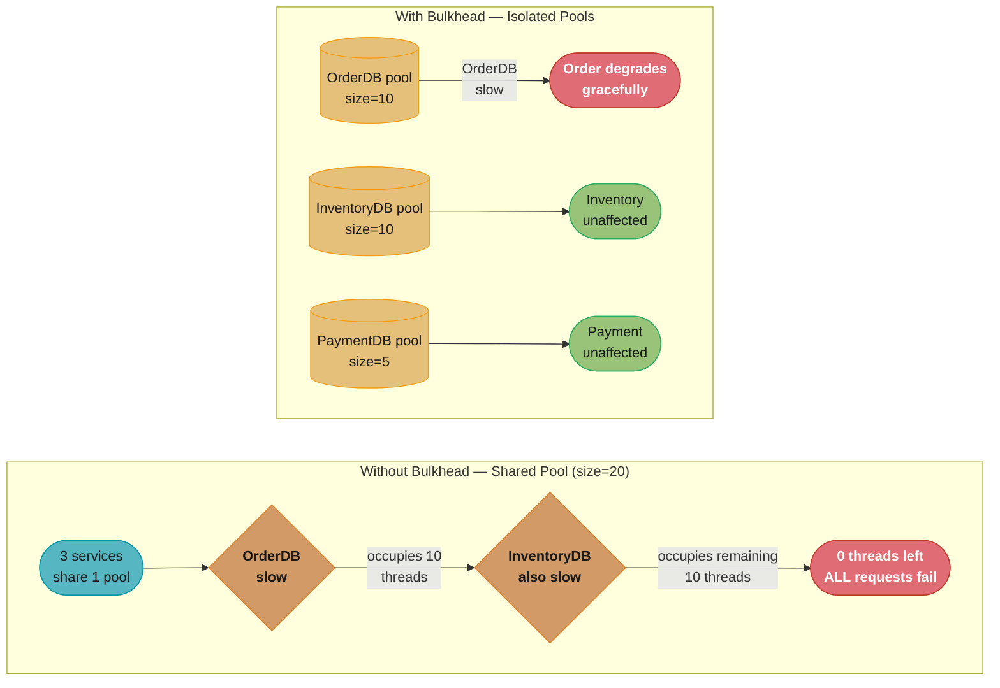
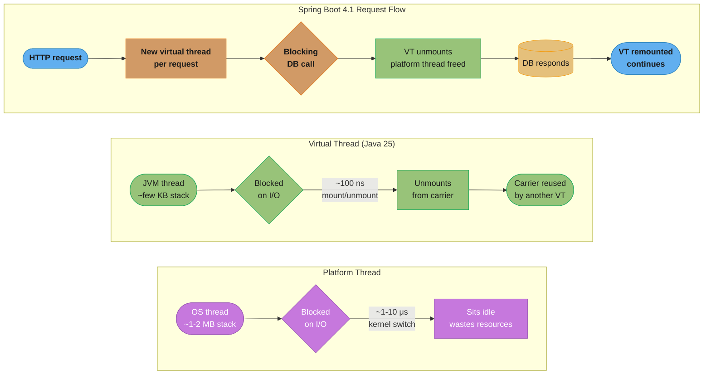
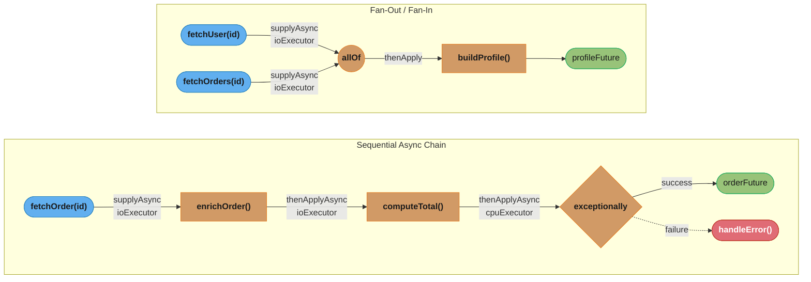
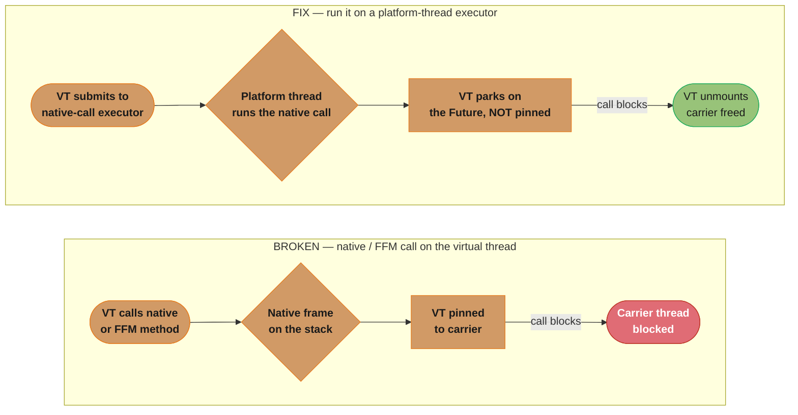
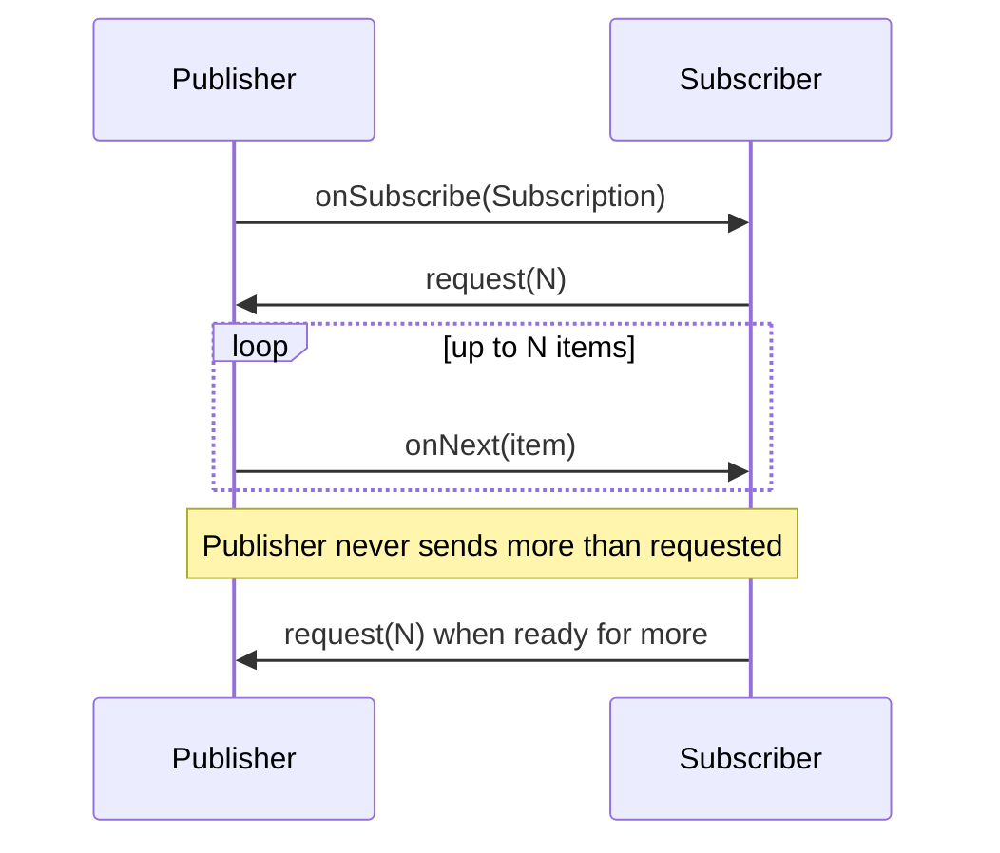

# Async & Concurrency Patterns

## 1. Concept Overview

Backend services spend most of their time waiting: waiting for database responses, external API calls, file I/O. Efficiently managing this waiting — deciding how many threads to use, what to do while waiting, how to handle failures in async chains, and how to prevent one slow dependency from blocking everything else — is the essence of backend concurrency design.

This module covers the practical engineering of async systems in Java: thread pool sizing formulas, CompletableFuture's traps and best practices, virtual threads on Java 25 and their pinning pitfalls, reactive backpressure strategies, and the bulkhead pattern for isolating slow dependencies.

---

## 2. Intuition

> **One-line analogy**: A backend service handling concurrent requests is like a restaurant kitchen. The thread pool is the kitchen staff. The thread pool sizing question is "how many chefs do we need?" Too few chefs and orders queue up. Too many chefs and they trip over each other at the same stove (CPU context switches). The bulkhead is separate sections of the kitchen for different dishes — a slow pasta station does not block the fast salad station.

**Mental model**: IO-bound tasks spend most of their time waiting (not using CPU). CPU-bound tasks spend most of their time computing. The optimal thread count differs dramatically: IO-bound workloads can use many more threads than CPU cores because threads spend most of their time not using the CPU (waiting for I/O).

**Why it matters**: Thread pool misconfiguration is one of the most common causes of production failures. A thread pool that is too small causes request timeouts under load. A pool that is too large causes excessive context switching and memory pressure. Wrong thread pool for async callbacks causes subtle deadlocks and latency spikes.

**Key insight**: Virtual threads change the calculus for IO-bound work — you can have millions of virtual threads without significant overhead. But virtual threads are not magic: they cannot parallelize CPU-bound work, and pinned virtual threads cause carrier thread exhaustion. Only native methods and foreign-function (FFM) calls pin: everything else, `synchronized` included, unmounts cleanly.

---

## 3. Core Principles

- **Thread pool sizing**: IO-bound: N = N_cpu * (1 + W/C) where W = wait time, C = CPU time. CPU-bound: N = N_cpu + 1 (one extra for OS scheduling).
- **CompletableFuture default executor**: ForkJoinPool.commonPool() — shared across the JVM, potentially impacted by other code using it. Use dedicated executors for production code.
- **Virtual threads**: Cheap, lightweight threads. One per blocking I/O operation is fine. Cannot parallelize CPU-bound work. Watch for pinning on native methods and foreign-function (FFM) calls.
- **Backpressure**: In reactive streams, the consumer signals to the producer how fast it can consume. Without backpressure, fast producers overwhelm slow consumers.
- **Bulkhead**: Each dependency gets its own thread pool. A slow dependency exhausts only its pool, not the whole application.

---

## 4. Types / Architectures / Strategies

### 4.1 Thread Pool Sizing

| Workload | Formula | Example |
|---------|---------|---------|
| CPU-bound | N_cpu + 1 | 8-core server: pool size = 9 |
| IO-bound | N_cpu * (1 + W/C) | 8-core, W=50ms, C=5ms: 8 * (1 + 10) = 88 |
| Mixed | Measure, then tune | Profile wait vs compute ratio |
| Virtual threads | Unlimited (per-request) | One VT per blocking I/O call |

W/C is the wait-to-compute ratio. For a service that spends 50ms waiting for a DB call and 5ms processing the result, W/C = 10, and a pool of 88 threads for 8 cores keeps CPUs fully utilized.

### 4.2 Backpressure Strategies (Reactive)

| Strategy | Behavior | When to Use |
|---------|----------|-------------|
| BUFFER | Buffer excess items | Short-lived bursts with bounded buffer |
| DROP | Drop each arriving item there is no demand for | Telemetry, logs, non-critical updates |
| LATEST | Keep only newest | State updates (only latest matters) |
| ERROR | Signal overflow as error | Strict SLA, must not lose items |

The first four map directly onto Reactor's `onBackpressureBuffer` / `onBackpressureDrop` / `onBackpressureLatest` / `onBackpressureError` (RxJava's `BackpressureStrategy` has the same four plus `MISSING`). Blocking the producer is a fifth option in the general sense, but neither library exposes it as a backpressure operator — it only arises when the source is a synchronous, blocking generator that simply stops producing until demand arrives.

### 4.3 CompletableFuture Method Reference

| Method | Thread | Use Case |
|--------|--------|---------|
| thenApply(fn) | Continuation thread (or calling thread if already done) | Sync transform |
| thenApplyAsync(fn) | ForkJoinPool.commonPool() | Async transform |
| thenApplyAsync(fn, executor) | Specified executor | Async transform, controlled thread |
| thenCompose(fn→CF) | Continuation | Chain async calls |
| thenCombine(cf, fn) | Continuation | Combine two futures |
| allOf(cf1, cf2...) | None (waits for all) | Wait for multiple |
| anyOf(cf1, cf2...) | None (first to complete) | Wait for any |
| exceptionally(fn) | Continuation | Error handling |
| whenComplete(fn) | Continuation | Always-run callback |
| handle(fn) | Continuation | Process result OR exception |

---

## 5. Architecture Diagrams

### Bulkhead Thread Pool Isolation


```mermaid
flowchart LR
    classDef io      fill:#61afef,stroke:#2e86c1,color:#1a1a1a,font-weight:bold
    classDef frozen  fill:#c678dd,stroke:#9b59b6,color:#fff
    classDef train   fill:#98c379,stroke:#27ae60,color:#1a1a1a
    classDef mathOp  fill:#d19a66,stroke:#e67e22,color:#1a1a1a,font-weight:bold
    classDef lossN   fill:#e06c75,stroke:#c0392b,color:#fff,font-weight:bold
    classDef req     fill:#56b6c2,stroke:#0097a7,color:#1a1a1a
    classDef base    fill:#e5c07b,stroke:#f39c12,color:#1a1a1a

    subgraph WOB["Without Bulkhead — Shared Pool (size=20)"]
        direction LR
        REQ1(["3 services<br/>share 1 pool"]) --> SLOW1{"OrderDB<br/>slow"}
        SLOW1 -->|"occupies 10<br/>threads"| SLOW2{"InventoryDB<br/>also slow"}
        SLOW2 -->|"occupies remaining<br/>10 threads"| FAIL(["0 threads left<br/>ALL requests fail"])
    end

    subgraph WB["With Bulkhead — Isolated Pools"]
        direction LR
        OP[("OrderDB pool<br/>size=10")] -->|"OrderDB<br/>slow"| DEG(["Order degrades<br/>gracefully"])
        IP[("InventoryDB pool<br/>size=10")] --> OK1(["Inventory<br/>unaffected"])
        PP[("PaymentDB pool<br/>size=5")] --> OK2(["Payment<br/>unaffected"])
    end

    class REQ1 req
    class SLOW1,SLOW2 mathOp
    class FAIL lossN
    class OP,IP,PP base
    class DEG lossN
    class OK1,OK2 train
```

Without bulkhead isolation, one slow dependency (OrderDB) exhausts the shared pool of 20 threads and cascades into total failure once InventoryDB also slows down; with bulkhead isolation, each dependency's own pool (10/10/5) walls off the slowness, so a slow OrderDB only degrades Order calls while Inventory and Payment keep serving traffic.

### Virtual Threads vs Platform Threads


```mermaid
flowchart LR
    classDef io      fill:#61afef,stroke:#2e86c1,color:#1a1a1a,font-weight:bold
    classDef frozen  fill:#c678dd,stroke:#9b59b6,color:#fff
    classDef train   fill:#98c379,stroke:#27ae60,color:#1a1a1a
    classDef mathOp  fill:#d19a66,stroke:#e67e22,color:#1a1a1a,font-weight:bold
    classDef lossN   fill:#e06c75,stroke:#c0392b,color:#fff,font-weight:bold
    classDef req     fill:#56b6c2,stroke:#0097a7,color:#1a1a1a
    classDef base    fill:#e5c07b,stroke:#f39c12,color:#1a1a1a

    subgraph PT["Platform Thread"]
        direction LR
        PT1(["OS thread<br/>~1-2 MB stack"]) --> PT2{"Blocked<br/>on I/O"}
        PT2 -->|"~1-10 μs<br/>kernel switch"| PT3["Sits idle<br/>wastes resources"]
    end

    subgraph VT["Virtual Thread (Java 25)"]
        direction LR
        VT1(["JVM thread<br/>~few KB stack"]) --> VT2{"Blocked<br/>on I/O"}
        VT2 -->|"~100 ns<br/>mount/unmount"| VT3["Unmounts<br/>from carrier"]
        VT3 --> VT4(["Carrier reused<br/>by another VT"])
    end

    subgraph SB["Spring Boot 4.1 Request Flow"]
        direction LR
        SB1(["HTTP request"]) --> SB2["New virtual thread<br/>per request"]
        SB2 --> SB3{"Blocking<br/>DB call"}
        SB3 --> SB4["VT unmounts<br/>platform thread freed"]
        SB4 --> SB5[("DB responds")]
        SB5 --> SB6(["VT remounted<br/>continues"])
    end

    class PT1,PT2,PT3 frozen
    class VT1,VT2,VT3,VT4 train
    class SB1,SB6 io
    class SB2,SB3 mathOp
    class SB4 train
    class SB5 base
```

For 1000 concurrent requests, ~1-2 MB platform-thread stacks cost ~1-2 GB of RAM versus a few MB for ~few-KB virtual-thread stacks; the unmount/remount trick — a JVM-level switch commonly estimated at ~100 ns against a kernel context switch of ~1-10 μs, so roughly two orders of magnitude cheaper — is what lets Spring Boot 4.1 serve 10,000 concurrent requests. Note that with `spring.threads.virtual.enabled=true` Tomcat swaps its bounded 200-thread pool for a virtual-thread executor — the 200 threads are not what carries the 10,000 requests; the carrier pool is the JVM's virtual-thread scheduler, whose default parallelism is `availableProcessors()`.

**Stated plainly.** "Platform threads make you pay a megabyte to sit and wait; virtual threads make waiting nearly free, so the limit stops being memory and starts being the downstream service."

Two separate ceilings are in play. The memory ceiling is how many threads fit in RAM. The throughput ceiling is Little's Law. Platform threads hit the memory ceiling first, which is the entire reason the 200-thread Tomcat default exists.

| Symbol | What it is |
|--------|------------|
| platform thread stack | `~1 MB` reserved per thread, whether it works or waits |
| virtual thread stack | `~few KB`, heap-allocated, grows only as deep as the call stack |
| switch cost | A JVM unmount is roughly two orders of magnitude cheaper than a kernel context switch. The figures usually quoted are `~100 ns` against `~1-10 us`, but both are estimates that move with CPU, kernel and working-set size, not measured constants |
| `L = λ x W` | Concurrency = throughput x latency — the throughput ceiling |

**Walk one example.** Serving 10,000 concurrent requests, each waiting 50ms on a database:

```
  platform threads, one per request
    memory  = 10,000 x 1 MB                     = 10 GB     <- will not fit
    so Tomcat caps at 200 threads:
    lambda_max = 200 / 0.050s                   = 4,000 req/s
    request 201 waits in the accept queue

  virtual threads, one per request
    memory  = 10,000 x ~4 KB                    = ~39 MB    <- trivially fits
    the carrier pool (default parallelism = 8 on this box) never blocks;
    every virtual thread unmounts at every wait
```

Watch what actually changed: virtual threads did not make any single request faster -- the database still takes 50ms. They removed the *memory* ceiling so the thread count could follow the concurrency instead of capping it. The corollary bites in production: with 10,000 virtual threads all reaching for a 10-connection HikariCP pool, the bottleneck simply relocates to the connection pool. Virtual threads move the queue; they do not delete it.

### CompletableFuture Chain


```mermaid
flowchart LR
    classDef io      fill:#61afef,stroke:#2e86c1,color:#1a1a1a,font-weight:bold
    classDef frozen  fill:#c678dd,stroke:#9b59b6,color:#fff
    classDef train   fill:#98c379,stroke:#27ae60,color:#1a1a1a
    classDef mathOp  fill:#d19a66,stroke:#e67e22,color:#1a1a1a,font-weight:bold
    classDef lossN   fill:#e06c75,stroke:#c0392b,color:#fff,font-weight:bold
    classDef req     fill:#56b6c2,stroke:#0097a7,color:#1a1a1a
    classDef base    fill:#e5c07b,stroke:#f39c12,color:#1a1a1a

    subgraph SEQ["Sequential Async Chain"]
        direction LR
        S1(["fetchOrder(id)"]) -->|"supplyAsync<br/>ioExecutor"| S2["enrichOrder()"]
        S2 -->|"thenApplyAsync<br/>ioExecutor"| S3["computeTotal()"]
        S3 -->|"thenApplyAsync<br/>cpuExecutor"| S4{"exceptionally"}
        S4 -->|"success"| S5(["orderFuture"])
        S4 -.->|"failure"| S6(["handleError()"])
    end

    subgraph FAN["Fan-Out / Fan-In"]
        direction LR
        U(["fetchUser(id)"]) -->|"supplyAsync<br/>ioExecutor"| MRG(("allOf"))
        O(["fetchOrders(id)"]) -->|"supplyAsync<br/>ioExecutor"| MRG
        MRG -->|"thenApply"| BP["buildProfile()"]
        BP --> PF(["profileFuture"])
    end

    class S1,U,O io
    class S2,S3,S4,MRG,BP mathOp
    class S5,PF train
    class S6 lossN
```

The sequential chain alternates IO and CPU executors per stage so no single pool absorbs both wait time and computation, and `exceptionally` catches a failure from any upstream stage; the fan-out/fan-in half fetches the user and their orders concurrently and joins with `allOf` only once both complete.

---

## 6. How It Works — Detailed Mechanics

### 6.1 CompletableFuture Pitfalls

```java
// BROKEN: Using default commonPool for blocking I/O
// commonPool parallelism = N_cpu - 1 (e.g., 7 on 8-core machine)
// Blocking I/O operations in commonPool deprive CPU work of threads
CompletableFuture<User> cf = CompletableFuture.supplyAsync(() -> {
    return userRepository.findById(id);  // blocking JDBC call — BAD in commonPool
});

// FIX: Use a dedicated IO executor for blocking calls
Executor ioExecutor = Executors.newFixedThreadPool(
    Runtime.getRuntime().availableProcessors() * 10  // IO-bound formula
);

CompletableFuture<User> cf = CompletableFuture.supplyAsync(() -> {
    return userRepository.findById(id);
}, ioExecutor);  // explicit executor

// BROKEN: Missing error handling causes silently swallowed exceptions
CompletableFuture<User> cf = CompletableFuture
    .supplyAsync(() -> userRepository.findById(id))
    .thenApply(user -> enrichUser(user));
// If enrichUser throws, the exception is stored but nobody sees it
// cf.join() or cf.get() would throw, but if result is not consumed... silent fail

// FIX: Always handle errors
CompletableFuture<User> cf = CompletableFuture
    .supplyAsync(() -> userRepository.findById(id))
    .thenApply(user -> enrichUser(user))
    .exceptionally(ex -> {
        log.error("Failed to get user", ex);
        return null;  // or throw, depending on requirements
    });

// BROKEN: Using thenApply for async operation (nesting instead of chaining)
CompletableFuture<CompletableFuture<Order>> nested =
    CompletableFuture.supplyAsync(() -> fetchUser(id))
    .thenApply(user -> fetchOrderAsync(user));  // returns CF inside CF — wrong

// FIX: Use thenCompose for chaining async operations
CompletableFuture<Order> chained =
    CompletableFuture.supplyAsync(() -> fetchUser(id))
    .thenCompose(user -> fetchOrderAsync(user));  // flattens nested CF

// BROKEN: Blocking in thenApply (defeats async purpose)
CompletableFuture<Order> cf = CompletableFuture
    .supplyAsync(() -> fetchUser(id))
    .thenApply(user -> {
        try { Thread.sleep(1000); } catch (InterruptedException e) {}  // WRONG
        return fetchOrder(user);  // blocking in transformation callback
    });

// FIX: Use thenApplyAsync with appropriate executor for blocking work
CompletableFuture<Order> cf = CompletableFuture
    .supplyAsync(() -> fetchUser(id))
    .thenApplyAsync(user -> fetchOrder(user), ioExecutor);  // async
```

### 6.2 Virtual Threads and Pinning


```mermaid
flowchart LR
    classDef io      fill:#61afef,stroke:#2e86c1,color:#1a1a1a,font-weight:bold
    classDef frozen  fill:#c678dd,stroke:#9b59b6,color:#fff
    classDef train   fill:#98c379,stroke:#27ae60,color:#1a1a1a
    classDef mathOp  fill:#d19a66,stroke:#e67e22,color:#1a1a1a,font-weight:bold
    classDef lossN   fill:#e06c75,stroke:#c0392b,color:#fff,font-weight:bold
    classDef req     fill:#56b6c2,stroke:#0097a7,color:#1a1a1a
    classDef base    fill:#e5c07b,stroke:#f39c12,color:#1a1a1a

    subgraph BROKEN["BROKEN — native / FFM call on the virtual thread"]
        direction LR
        B1(["VT calls native<br/>or FFM method"]) --> B2{"Native frame<br/>on the stack"}
        B2 --> B3["VT pinned<br/>to carrier"]
        B3 -->|"call blocks"| B4(["Carrier thread<br/>blocked"])
    end

    subgraph FIXED["FIX — run it on a platform-thread executor"]
        direction LR
        F1(["VT submits to<br/>native-call executor"]) --> F2{"Platform thread<br/>runs the native call"}
        F2 --> F3["VT parks on<br/>the Future, NOT pinned"]
        F3 -->|"call blocks"| F4(["VT unmounts<br/>carrier freed"])
    end

    class B1,B2,B3 mathOp
    class B4 lossN
    class F1,F2,F3 mathOp
    class F4 train
```

A virtual thread cannot unmount while a native frame sits on its stack, so a JNI call or a Foreign Function and Memory (FFM) downcall holds the carrier platform thread for the whole duration of the call. Ordinary blocking — sockets, files, `synchronized`, locks, `Thread.sleep` — unmounts cleanly; native code is the case the runtime cannot rewrite. The fix is not to remove the native call but to move it off the virtual-thread path: submit it to a small, explicitly sized platform-thread executor and let the virtual thread park on the resulting `Future`, which unmounts normally.

```java
// Virtual threads on Java 25. Enable in Spring Boot: spring.threads.virtual.enabled=true

// Virtual threads unmount from their carrier during ordinary blocking I/O,
// and since JEP 491 (JDK 24) that includes blocking inside synchronized —
// monitors are owned by the virtual thread, not by the carrier.
// What still pins: native (JNI) methods and FFM downcalls.

// BROKEN: a native call on the virtual thread pins its carrier
public Response handleRequest(Request req) {
    // Native frame on the stack -> this virtual thread CANNOT unmount.
    // Its carrier platform thread is held for the whole call.
    return nativeImageCodec.transcode(req.getPayload());  // JNI / FFM downcall
}

// FIX: run native calls on a bounded platform-thread executor
private final ExecutorService nativeCalls =
    Executors.newFixedThreadPool(8, Thread.ofPlatform().name("native-", 0).factory());

public Response handleRequest(Request req) throws InterruptedException, ExecutionException {
    // The virtual thread parks on the Future and unmounts; only one of the
    // 8 dedicated platform threads is held for the duration of the native call.
    return nativeCalls.submit(() -> nativeImageCodec.transcode(req.getPayload())).get();
}

// Detection: JFR jdk.VirtualThreadPinned event
//   (enabled by default, 20 ms threshold)

// Thread-local variables work with virtual threads but be careful:
// With millions of virtual threads, ThreadLocals that accumulate state
// (InheritableThreadLocal with complex inheritance) can cause memory pressure.

// Structured concurrency — STILL A PREVIEW API (JEP 453 in 21 through JEP 533 in 27),
// so it requires --enable-preview and the shape has changed between previews.
// A scope is opened by a static factory and given a Joiner; fork() hands back a
// Subtask, not a Future. Plain open() means "await all, or throw on the first failure".
try (var scope = StructuredTaskScope.open()) {                    // requires --enable-preview
    Subtask<User> user     = scope.fork(() -> fetchUser(id));
    Subtask<Orders> orders = scope.fork(() -> fetchOrders(id));
    scope.join();
    return buildProfile(user.get(), orders.get());
}
// If either subtask fails, the scope cancels the other and join() throws
// Clean, structured lifetime for child tasks — no orphans, no leaked futures
```

### 6.3 Reactive Backpressure


```mermaid
sequenceDiagram
    participant P as Publisher
    participant S as Subscriber

    P->>S: onSubscribe(Subscription)
    S->>P: request(N)
    loop up to N items
        P->>S: onNext(item)
    end
    Note over P,S: Publisher never sends more than requested
    S->>P: request(N) when ready for more
```

The Reactive Streams specification calls this a "dynamic push-pull" protocol, not a pure pull: the Subscriber tells the Publisher exactly how many items it can absorb via `request(N)` (the pull half, an upper bound on outstanding demand), and the Publisher then pushes at most that many `onNext` calls — this is what makes backpressure possible without an explicit acknowledgment per item. The Subscriber may signal further demand at any time, including before the current batch is exhausted, so a fast consumer never stalls waiting for a round trip.

```java
// Project Reactor backpressure strategies
Flux<Event> eventStream = eventSource.subscribe()
    // Requests unbounded demand upstream and DROPS each arriving element that
    // downstream has not requested. There is no buffer, so it is the newly
    // observed items that are discarded, never previously accepted ones.
    .onBackpressureDrop(dropped ->
        log.warn("Dropped event due to backpressure: {}", dropped))
    // or
    // .onBackpressureBuffer(1000)  // buffer up to 1000 overflow items, then cancel the source
    // .onBackpressureLatest()      // retain only the most recent observed item
    // .onBackpressureError()       // onError with Exceptions.failWithOverflow()

    .flatMap(event -> processEvent(event), 16)  // max 16 concurrent processings
    .subscribe(
        result -> handleResult(result),
        error -> handleError(error)
    );

// Controlling concurrency in flatMap:
// .flatMap(fn, maxConcurrency)
// maxConcurrency=1: sequential (backpressure propagates)
// maxConcurrency=N: N concurrent subscriptions

// WebFlux with backpressure:
// Netty event loop → HTTP/2 window size → application buffer → DB pool
// Each layer has a maximum capacity; when full, upstream is signaled to slow down
```

### 6.4 Thread Pool Configuration

```java
// IO-bound thread pool
int ioThreads = Runtime.getRuntime().availableProcessors()
    * (1 + waitTimeMs / cpuTimeMs);  // formula
// For typical DB-heavy service (50ms wait, 5ms CPU): 8 * 11 = 88

ThreadPoolExecutor ioPool = new ThreadPoolExecutor(
    ioThreads,           // corePoolSize
    ioThreads,           // maximumPoolSize (same — fixed size)
    0L, TimeUnit.MILLISECONDS,
    new LinkedBlockingQueue<>(1000),  // bounded queue — fail fast if overwhelmed
    new ThreadFactoryBuilder()
        .setNameFormat("io-pool-%d")
        .setDaemon(true)
        .build(),
    new ThreadPoolExecutor.CallerRunsPolicy()  // or AbortPolicy to throw exception
);

// CPU-bound thread pool
int cpuThreads = Runtime.getRuntime().availableProcessors() + 1;
ThreadPoolExecutor cpuPool = new ThreadPoolExecutor(
    cpuThreads,
    cpuThreads,
    0L, TimeUnit.MILLISECONDS,
    new SynchronousQueue<>(),  // no queue — fail fast if all threads busy
    new ThreadFactoryBuilder().setNameFormat("cpu-pool-%d").build(),
    new ThreadPoolExecutor.AbortPolicy()  // throw RejectedExecutionException
);
```

**What this actually says.** "Add one extra thread for every unit of time a thread spends waiting rather than computing — because a waiting thread costs a slot but no CPU."

The ratio `waitTime / cpuTime` is the whole formula. It is a *blocking coefficient*: it asks what fraction of a task's life the thread is idle-but-occupied. CPU-bound work has a coefficient near zero and needs roughly one thread per core; I/O-bound work has a large coefficient and needs many.

| Symbol | What it is |
|--------|------------|
| `availableProcessors()` | Usable cores. `8` in the worked case below |
| `waitTimeMs` | Time per task spent blocked — DB round trip, HTTP call. `50ms` |
| `cpuTimeMs` | Time per task actually burning CPU — parsing, mapping. `5ms` |
| `1 + wait/cpu` | Threads needed per core to keep that core busy while others wait |
| `+ 1` (CPU pool) | One spare so a page fault or brief stall does not idle a core |

**Walk one example.** The DB-heavy service in the comment, on an 8-core box:

```
  blocking coefficient = wait / cpu   =  50 / 5    = 10
  threads per core     = 1 + 10                    = 11
  ioThreads            = 8 cores x 11              = 88

  sanity check -- of each 55ms task, CPU is busy only 5ms:
    88 threads x (5 / 55 CPU duty cycle) = 8.0 cores fully saturated

  the same box, CPU-bound work (wait = 0):
    1 + 0/5 = 1  ->  8 x 1 = 8, plus the spare = 9 threads
```

Those two answers -- 88 and 9 -- come from identical hardware. That gap is why a single shared pool is always wrong for a service doing both kinds of work: size it for I/O and CPU tasks thrash on context switches; size it for CPU and I/O tasks starve.

**The idea behind it.** "A pool's maximum throughput is fixed at threads divided by service time — so the bounded queue does not add capacity, it only decides how long doomed requests wait before you admit you are overloaded."

This is Little's Law, `L = λ x W`: concurrency equals arrival rate times latency. Read backwards it gives the pool's ceiling, and read forwards it turns any queue depth into a latency number. Sizing a queue without doing this arithmetic is how "we made the queue bigger" becomes "now we time out *and* waste the work."

| Symbol | What it is |
|--------|------------|
| `L` | Concurrency — requests in flight. For a saturated pool, the thread count `88` |
| `λ` | Arrival rate, requests/second |
| `W` | Service time per request: `cpuTime + waitTime = 5 + 50 = 55ms` |
| `λ_max` | Pool throughput ceiling, `threads / W` |
| queue capacity | `1000` in `LinkedBlockingQueue<>(1000)` — pure waiting room, not capacity |

**Walk one example.** The same 88-thread pool, pushed past its ceiling:

```
  ceiling  : lambda_max = 88 threads / 0.055s          = 1600 req/s
  check    : L = lambda x W = 1600 x 0.055             =   88   (matches)

  arrivals climb to 1800 req/s -- 200 req/s more than the pool can retire.
  the queue is the only place the excess can go:

    queue full (1000 tasks) wait = 1000 / 1600         = 0.625s
    total latency = 0.625 + 0.055                      = 0.680s

  compare a 50-slot queue:
    wait = 50 / 1600                                   = 0.031s
```

The lesson is counterintuitive: the *smaller* queue is the better one. Both queues serve exactly 1600 req/s -- throughput is set by threads and service time, and no queue length changes it. All the 1000-slot queue buys is 680ms of latency on requests whose callers have usually timed out already, so the pool burns capacity computing responses nobody will read. This is precisely the "unbounded queue" failure in Section 10, just with a bound: the fix is a queue short enough that rejection arrives faster than the client's timeout.

---

## 7. Real-World Examples

**Netflix's per-dependency thread pools**: Netflix's API tier gives each downstream dependency (user service, movie metadata, recommendations) its own bounded thread pool. When recommendations become slow, they exhaust only the recommendations pool. The main request thread is unblocked quickly (the bulkhead returns a default value). On the JVM today this is Resilience4j's `ThreadPoolBulkhead`, one registry entry per dependency.

**Project Reactor at Pivotal/VMware**: Spring WebFlux runs on Reactor Netty's event loop threads — a small pool sized `max(availableProcessors(), 4)`. All I/O operations must be non-blocking: any blocking call on an event loop thread blocks every request multiplexed onto that thread. Note that `spring.threads.virtual.enabled=true` does **not** rescue this — that property swaps Spring's task executors and the Servlet containers (Tomcat or Jetty — Spring Boot 4 dropped Undertow, which does not implement the Jakarta Servlet 6.1 baseline) to virtual threads, but Reactor Netty keeps its own event loops. Blocking a WebFlux event loop is still fatal on Java 25; offload with `subscribeOn(Schedulers.boundedElastic())` instead.

**LinkedIn's ParSeq**: LinkedIn open-sourced ParSeq, a framework "that makes it easier to write asynchronous code in Java". It composes work as its own `Task` abstraction (with `Task.par()`, `map()`, `andThen()`) rather than as `CompletableFuture` chains, and ships execution tracing plus operation batching and retry policies. Details of how LinkedIn enforces blocking-call placement internally are not publicly documented; treat any such enforcement claim as unverified.

---

## 8. Tradeoffs

| Approach | Throughput | Latency | Complexity | Memory |
|---------|-----------|---------|------------|--------|
| Blocking + large thread pool | High | Low | Low | High (1 MB/thread) |
| Virtual threads | Very high | Low | Low | Low (~few KB/VT) |
| Reactive (Project Reactor) | Very high | Low | High | Low |
| CompletableFuture on platform-thread pools | High | Low | Medium | Medium |

| Backpressure | Data loss | Latency | Use Case |
|-------------|-----------|---------|---------|
| BUFFER | No (until full) | Low | Short bursts |
| DROP | Yes | Zero | Non-critical telemetry |
| LATEST | Yes (older items) | Zero | Real-time state |
| ERROR | No | N/A | Critical data, strict SLA |

---

## 9. When to Use / When NOT to Use

**Virtual threads**: Use for IO-bound work (database calls, HTTP calls, file IO) where you previously used a large platform thread pool. Do not use virtual threads for CPU-intensive computation — you still need a bounded CPU-bound thread pool to avoid CPU contention.

**Reactive (Project Reactor / WebFlux)**: Use when you need very high concurrency with low memory overhead, or when you are composing complex async pipelines with backpressure. Avoid for simple CRUD services — the complexity cost is not worth it.

**CompletableFuture fan-out**: Use when multiple independent async operations can be parallelized (fetch user + fetch orders simultaneously). Use thenCompose for sequential dependent calls. Always use explicit executors, not commonPool.

---

## 10. Common Pitfalls

**CompletableFuture blocking on join() in a reactive context**: Calling cf.join() inside a Flux/Mono callback blocks the event loop thread, preventing other requests from being processed. In reactive code, compose futures with thenCompose/flatMap. Never call .get() or .join() inside reactive operators.

**Assuming a library "fixed pinning" by moving off `synchronized`**: this is a widely repeated but incorrect story about HikariCP. A community PR to swap HikariCP's `synchronized` blocks for `ReentrantLock` (#2055) was **closed unmerged** in November 2024: the maintainer's position was that none of those methods can pin a virtual thread in the first place, because pinning requires *blocking while holding the monitor* and HikariCP's synchronized sections do no blocking work — plus `ReentrantLock` would add allocation and indirection. JEP 491 (JDK 24) then removed `synchronized` pinning entirely, making the migration moot. The lesson generalizes: `synchronized` alone is not a pinning bug, and no HikariCP release notes claim a pinning fix. Before rewriting a dependency, confirm with `jdk.VirtualThreadPinned` JFR events that it actually pins.

**Expecting virtual threads to raise database concurrency**: the real HikariCP interaction is that the connection pool, not the thread count, is the ceiling. Ten thousand virtual threads contending for a 10-connection pool simply relocates the queue from the thread pool to `getConnection()`, and `connectionTimeout` starts firing where thread-pool rejection used to. Size the connection pool to the database's capacity and treat virtual threads as removing only the *thread* constraint.

**Using ForkJoinPool.commonPool for blocking I/O**: The common pool has parallelism = N_cpu - 1. Using it for blocking database calls monopolizes the pool for I/O waiting, leaving no threads for legitimate CPU work (ForkJoin tasks, parallel streams). Always use a dedicated IO executor for blocking operations.

**Thread pool exhaustion from downstream slowness**: When a dependency (e.g., external payment API) becomes slow, requests pile up waiting for threads in that service's pool. If the pool is shared, it exhausts — blocking all other operations. Bulkhead isolation (separate pools per dependency) is the solution, but even bulkheaded pools can exhaust under sustained slowness. Combine bulkhead with circuit breaker.

**Unbounded queue in thread pool causing silent accumulation**: `new LinkedBlockingQueue<>()` (no capacity argument) creates an unbounded queue. Under sustained overload, tasks accumulate in the queue without bound until OOM. Always use a bounded queue and configure a rejection policy. An `AbortPolicy` (default) throws RejectedExecutionException immediately — fail fast rather than slowly filling memory.

---

## 11. Technologies & Tools

| Tool | Purpose |
|------|---------|
| Project Reactor | Reactive streams implementation (Spring WebFlux) |
| RxJava | Reactive extensions for Java |
| CompletableFuture | Built-in Java async primitives |
| Executors | Java thread pool factory |
| Resilience4j | Bulkhead, circuit breaker, retry |
| Virtual Threads | Lightweight threads for IO-bound work |
| Structured Concurrency (still preview through JDK 27) | Scoped lifecycle for concurrent tasks |
| JFR `jdk.VirtualThreadPinned` event | Detect virtual thread pinning (on by default, 20 ms threshold) |
| `jstack` | Detect thread pool exhaustion |
| Micrometer | Thread pool utilization metrics |

---

## 12. Interview Questions with Answers

**Q: How do you size a thread pool for an IO-bound service?**
**Short:** Size it with N = N_cpu × (1 + wait/compute); virtual threads need no pool sizing at all.

Use the formula: N = N_cpu * (1 + W/C) where W is average wait time and C is average CPU time per request. For a typical service with 50ms database wait and 5ms processing on an 8-core server: N = 8 * (1 + 10) = 88 threads. This keeps all CPU cores busy while threads are waiting for I/O. For virtual threads, you do not need to size a pool — one virtual thread per request is the model, and the JVM manages carrier thread allocation.

**Q: What is the difference between thenApply and thenCompose?**
**Short:** thenApply transforms a future's result synchronously, while thenCompose flattens a chained async function that returns a future.

thenApply transforms a CompletableFuture's result with a synchronous function: CF<A> → CF<B>. thenCompose chains an asynchronous function that itself returns a CompletableFuture: CF<A> → CF<B> (where the function returns CF<B>). If you use thenApply with an async function, you get CF<CF<B>> — a nested future that requires .join() to unwrap. thenCompose flattens this: always use thenCompose for functions that return CompletableFuture.

**Q: What is virtual thread pinning and how do you detect it?**
**Short:** Pinning happens when native code blocks a carrier thread, preventing the virtual thread from unmounting from it.

Pinning is when a virtual thread cannot unmount from its carrier during a blocking operation, so the carrier platform thread stays blocked and the scheduler loses a worker. With many pinned virtual threads all carriers block and throughput falls back to platform-thread levels. What pins is native code: a JNI method or a Foreign Function and Memory (FFM) downcall puts a native frame on the stack, and the runtime cannot unmount across it. The detail interviewers probe is what does *not* pin — sockets, files, `Thread.sleep`, locks, and `synchronized` all unmount cleanly, since JEP 491 moved monitor ownership from the carrier to the virtual thread itself, so the old "replace `synchronized` with `ReentrantLock`" advice buys nothing today. Detection is the JFR `jdk.VirtualThreadPinned` event, enabled by default with a 20 ms threshold. The fix for a genuinely pinning native call is to run it on a small, bounded platform-thread executor and let the virtual thread park on the `Future`.

**Q: What is the bulkhead pattern and how does it prevent cascade failures?**
**Short:** The bulkhead pattern isolates a dedicated thread pool per dependency, so one slow dependency cannot exhaust threads for others.

The bulkhead pattern isolates thread pools per dependency. Each downstream service (database A, external API B) gets a fixed thread pool. When dependency B becomes slow and exhausts its thread pool, only calls to B are affected — calls to A, database C, and other services continue using their own pools. Without bulkhead, all dependencies share a pool: one slow dependency consumes all threads and blocks everything. Resilience4j ThreadPoolBulkhead implements this pattern.

**Q: Explain backpressure in reactive streams.**
**Short:** Backpressure lets a consumer tell a producer how many items it can handle, preventing unbounded buffer growth.

Backpressure is a signal from consumer to producer: "I can only process N items at this rate." Without backpressure, a fast producer overwhelms a slow consumer, causing unbounded memory growth. Project Reactor implements backpressure through the Reactive Streams specification: the Subscriber requests N items at a time; the Publisher sends at most N. When the Subscriber's buffer is full, it stops requesting, and the Publisher must hold or drop items. Strategies: BUFFER (store excess), DROP (discard new items), LATEST (keep newest, drop older), ERROR (signal overflow).

**Q: What happens when ForkJoinPool.commonPool is saturated?**
**Short:** ForkJoinPool.commonPool has fixed parallelism of N_cpu minus one, so blocking IO tasks there can starve CPU-bound work.

The ForkJoinPool.commonPool() has a fixed parallelism equal to N_cpu - 1. When all threads are busy with blocking I/O, new tasks submitted to commonPool wait in the queue. CPU-bound parallel operations (parallel streams, ForkJoinTask) also wait. This can cause complete starvation: if IO-bound CompletableFuture tasks fill commonPool, parallel stream computations starve until those futures complete. Always use dedicated, separate thread pools for IO-bound and CPU-bound work.

**Q: How does structured concurrency differ from CompletableFuture.allOf?**
**Short:** Structured concurrency scopes forked tasks so none can outlive the scope, unlike allOf's independently running futures.

CompletableFuture.allOf() starts all futures and waits for all to complete. If one fails, the returned CF completes exceptionally but the other futures continue running until completion (or cancellation must be manual). Structured concurrency (`StructuredTaskScope`) defines a scope: all forked tasks are owned by the scope, and when the scope closes all tasks must have completed. You open a scope with the static `StructuredTaskScope.open()` and pass a `Joiner` that sets the completion policy — `Joiner.awaitAllSuccessfulOrThrow()` for "all must succeed", or a first-successful joiner for a race — and `fork()` returns a `Subtask<T>` rather than a `Future<T>`. It has been a preview API in every release from JDK 21 through JDK 27, so it still requires `--enable-preview` and is not yet safe to depend on in production. Either way lifetimes are lexically scoped — no orphaned tasks, no resource leaks from forgotten futures.

**Q: What is work stealing in ForkJoinPool?**
**Short:** Work stealing lets an idle thread take tasks from the tail of another thread's deque to reduce idle time.

In a ForkJoinPool, each thread has a deque (double-ended queue) of tasks. Work stealing allows an idle thread to "steal" tasks from the tail of another thread's deque while the owner works on tasks from its own head. This reduces idle time and improves throughput when tasks have unequal sizes. ForkJoinPool is designed for recursive, divide-and-conquer tasks. It is less appropriate for IO-bound work (where threads spend most time waiting, and stealing provides no benefit).

**Q: How do you implement a timeout for a CompletableFuture?**
**Short:** Use orTimeout to fail after a deadline, or completeOnTimeout to supply a default value on an internal JDK scheduler.

`CompletableFuture` provides `orTimeout(long, TimeUnit)`: if the future does not complete within the specified time, it completes with a TimeoutException. Or `completeOnTimeout(defaultValue, long, TimeUnit)`: complete with a default value instead of exception. Both schedule the timeout on an internal JDK delay scheduler that you do not supply or control — do not assume it is your executor, and never do blocking work in the timeout path. The concrete mechanism changed in Java 25: through Java 24 it was a package-private `CompletableFuture.Delayer` holding one daemon `ScheduledThreadPoolExecutor`, while JDK-8319447 made `ForkJoinPool` implement `ScheduledExecutorService` and routes delayed work through its `DelayScheduler`, which made cancelling an unfired timeout much cheaper. Note that `orTimeout` does not interrupt or cancel the work already in flight; it only completes the future, so the underlying task keeps running and still occupies its pool thread.
```java
CompletableFuture<User> user = CompletableFuture
    .supplyAsync(() -> fetchUser(id), ioExecutor)
    .orTimeout(5, TimeUnit.SECONDS)
    .exceptionally(ex -> defaultUser(id));
```

**Q: How do you limit concurrency in a CompletableFuture pipeline processing a list?**
**Short:** Bound the executor itself to cap concurrency, or acquire a Semaphore before submitting each task, never inside it.

The simplest correct answer is to bound the executor itself — a fixed pool of 10 already caps concurrency at 10, and no semaphore is needed. Use a Semaphore only when several pipelines share one executor and each needs its own limit. Two traps make the naive version wrong: `Semaphore.acquire()` throws the checked `InterruptedException`, which a `Supplier` lambda cannot propagate (it will not compile — use `acquireUninterruptibly()`, or catch and restore the interrupt), and acquiring *inside* the task limits nothing, because every task has already been submitted and is merely blocking a pool thread while it waits. Acquire before submitting:
```java
Semaphore semaphore = new Semaphore(10); // max 10 in flight
List<CompletableFuture<Result>> futures = items.stream()
    .map(item -> {
        semaphore.acquireUninterruptibly();   // throttles the SUBMITTER
        return CompletableFuture
            .supplyAsync(() -> process(item), ioExecutor)
            .whenComplete((r, ex) -> semaphore.release());
    })
    .toList();
CompletableFuture.allOf(futures.toArray(new CompletableFuture[0])).join();
```
Or use Project Reactor's `Flux.flatMap(fn, maxConcurrency)` for reactive pipelines.

**Q: What metrics should you monitor for a thread pool?**
**Short:** Monitor active threads, queue size, completed and rejected tasks, and utilization to catch pool exhaustion early.

Active threads (currently executing tasks), queue size (tasks waiting), completed tasks (throughput), rejected tasks (pool overloaded), thread pool utilization = active / pool_size. Alerts: queue > 0 consistently (pool is bottleneck), utilization consistently > 80% (approaching exhaustion), rejection rate > 0 (tasks being dropped). `ThreadPoolExecutor` exposes `getActiveCount()`, `getPoolSize()`, `getQueue().size()` and `getCompletedTaskCount()` directly — note it has no `recordStats()` method, and rejections are not counted for you, so wrap the `RejectedExecutionHandler` in a counter yourself. To wire this into Micrometer use `ExecutorServiceMetrics.monitor(registry, executor, "io-pool")`, which emits `executor.active`, `executor.queued`, `executor.queue.remaining`, `executor.pool.size` and `executor.completed`; for a Spring `ThreadPoolTaskExecutor`, pass its `getThreadPoolExecutor()`.

**Q: When would you use virtual threads instead of reactive programming?**
**Short:** Use virtual threads for plain blocking IO-bound code, and reactive programming when you need fine-grained backpressure control.

Use virtual threads for IO-bound services where you would rather write plain blocking, sequential code than a reactive pipeline. That covers most database-and-HTTP request handling, and Spring Boot has first-class support for it. Use reactive programming when: you need fine-grained backpressure control; you are composing complex async pipelines with error handling across many stages; you are migrating existing reactive code. Be precise about what `spring.threads.virtual.enabled=true` does: it switches Spring's task executors and the Servlet containers to virtual threads, but leaves Reactor Netty's event loops alone, so enabling it does not make blocking calls safe inside a WebFlux handler chain.

**Q: How do you detect thread pool exhaustion in production?**
**Short:** Rising latency, a growing task queue, and threads stuck in queue.take() together signal thread pool exhaustion.

Signs: increasing request latency (tasks queuing), increasing error rate (if queue is bounded and rejects), thread dump showing all threads WAITING in queue.take() with many queued tasks. Monitor: hikaricp_connections_pending (DB pool), executor_queue_size (task queue depth), executor_active_count approaching executor_pool_size. Alert on: queue depth growing, utilization consistently above 80%, rejection count > 0. Preventive: circuit breakers that stop sending work when downstream is slow.

**Q: What is the difference between CallerRunsPolicy and AbortPolicy?**
**Short:** CallerRunsPolicy makes the caller run the task itself as backpressure, while AbortPolicy fails fast with an exception.

CallerRunsPolicy: when the thread pool is exhausted (queue full, max threads busy), the task is executed by the calling thread instead of the pool thread. This provides backpressure — the caller is blocked executing the task, slowing the rate of task submission. AbortPolicy (default): throws RejectedExecutionException immediately when the pool is exhausted. Use AbortPolicy for fail-fast behavior (return 503 to client). Use CallerRunsPolicy for producer-consumer pipelines where the caller should slow down naturally.

**Q: What is the Reactive Streams specification and how does it enable backpressure?**
**Short:** Reactive Streams defines Publisher, Subscriber, Subscription, and Processor so a subscriber requests only items it can handle.

Reactive Streams (`java.util.concurrent.Flow` in the JDK) defines four interfaces: Publisher (produces items), Subscriber (consumes items), Subscription (link between them), Processor (both). The protocol: Subscriber.onSubscribe() receives a Subscription. Subscriber calls subscription.request(N) to signal it can receive N items. Publisher calls Subscriber.onNext() at most N times. After consuming N items, Subscriber calls request(N) again. Publisher never sends more than requested — this is backpressure. The Publisher must buffer, drop, or signal error for items exceeding the requested amount.

---

## 13. Best Practices

- Size IO-bound thread pools with the formula N = N_cpu * (1 + W/C). Profile actual wait/compute ratio.
- Always use explicit executors for CompletableFuture in production — never rely on ForkJoinPool.commonPool for blocking I/O.
- Use thenCompose (not thenApply) for functions that return CompletableFuture.
- Implement bulkhead isolation with separate thread pools per downstream dependency.
- Enable virtual threads in Spring Boot 4.1 for IO-bound services (spring.threads.virtual.enabled=true). It covers Spring's task executors and the Servlet containers, not Reactor Netty event loops.
- Check for virtual thread pinning with the `jdk.VirtualThreadPinned` JFR event (on by default, 20 ms threshold), and route any JNI or FFM call it flags onto a bounded platform-thread executor.
- Use bounded queues in thread pools and configure rejection policies explicitly.
- Monitor thread pool queue depth and utilization in Micrometer; alert before exhaustion.

---

## 14. Case Study

**Problem** (illustrative composite, not a published incident; the latency figures are round numbers chosen to make the arithmetic checkable): A product detail service made 4 downstream calls per request: fetchProduct(), fetchInventory(), fetchReviews(), fetchRecommendations(). All were sequential. Average latency: 4 * 80ms = 320ms.

**Phase 1: Parallel execution with CompletableFuture**:
```java
// BEFORE (sequential):
Product product = fetchProduct(id);
Inventory inv = fetchInventory(id);
Reviews reviews = fetchReviews(id);
List<Product> recs = fetchRecommendations(id);
// Total: 4 * 80ms = 320ms

// AFTER (parallel):
CompletableFuture<Product> productFuture =
    CompletableFuture.supplyAsync(() -> fetchProduct(id), ioPool);
CompletableFuture<Inventory> invFuture =
    CompletableFuture.supplyAsync(() -> fetchInventory(id), ioPool);
CompletableFuture<Reviews> reviewsFuture =
    CompletableFuture.supplyAsync(() -> fetchReviews(id), ioPool);
CompletableFuture<List<Product>> recsFuture =
    CompletableFuture.supplyAsync(() -> fetchRecommendations(id), ioPool)
        .orTimeout(200, MILLISECONDS)
        .exceptionally(ex -> Collections.emptyList());  // degraded gracefully

CompletableFuture.allOf(productFuture, invFuture, reviewsFuture, recsFuture)
    .join();
// Normal case: max(80ms, 80ms, 80ms, 80ms) = 80ms (all four in parallel)
// Recommendations degraded: max(80, 80, 80, 200ms cap) = 200ms, empty list
// Without the orTimeout cap, a hung recommendations call hangs the whole page
```

**What the formula is telling you.** "Four calls that used to add up now only overlap — so the page costs whatever the slowest single call costs, and the timeout you put on the slowest one becomes the page's latency."

This is Amdahl's law in miniature: parallelism only pays on the portion of work that is actually parallel, and the answer can never drop below the longest serial branch. Here that branch is `fetchRecommendations`, which is why capping it with `orTimeout` is not a defensive nicety -- it is the latency design.

| Symbol | What it is |
|--------|------------|
| sequential total | `L1 + L2 + L3 + L4` — each call waits for the previous one |
| parallel total | `max(L1, L2, L3, L4)` — all four in flight at once |
| `orTimeout(200ms)` | Hard cap on the recommendations branch; converts a hang into a fallback |
| `exceptionally(...)` | Degrades to an empty list rather than failing the whole page |
| `allOf(...).join()` | Waits for the last of the four to finish |

**Walk one example.** The four calls at their stated 80ms, with the recommendations branch degrading:

```
  sequential : 80 + 80 + 80 + 80          = 320ms   (the "before")
  parallel   : max(80, 80, 80, 80)        =  80ms   -> 320 / 80 = 4.0x faster

  recommendations goes bad and hangs:
    without orTimeout : max(80, 80, 80, hang)     = the page hangs too
    with orTimeout    : max(80, 80, 80, 200)      = 200ms, list empty
                                                    320 / 200 = 1.6x
```

Note the ceiling that parallelism cannot break: even at a perfect 4.0x, the page can never beat 80ms, because one call must still happen. Optimizing three of the four branches to 10ms would change the total by exactly nothing. After a fan-out, the only latency work that pays is on the slowest branch -- and the only lever that beats *that* is the timeout, which trades completeness for a bounded response.

**Phase 2: Bulkhead isolation**:
```java
// Each service gets its own thread pool (bulkhead)
Executor productPool = Executors.newFixedThreadPool(20);
Executor inventoryPool = Executors.newFixedThreadPool(20);
Executor reviewPool = Executors.newFixedThreadPool(10);
Executor recsPool = Executors.newFixedThreadPool(5);
// Recommendations can be slow without affecting product/inventory
```

**Phase 3: Enable virtual threads (Java 25)**:
- Replaced all platform thread pools with a virtual thread executor.
- Each downstream call creates a virtual thread (near-zero cost for a blocking wait).
- Memory: 4 VTs * few KB vs 4 platform threads * ~1 MB.
- Caveat: this removes only the thread ceiling. The four downstream clients and any
  connection pool behind them still cap real concurrency, and bulkhead limits must be
  re-expressed as semaphores since there is no longer a pool size to bound them.

**Results** (illustrative figures consistent with the arithmetic above, not measured production data):
- Sequential (before): 320ms p50
- Parallel CF: 80ms p50 — 320/80 = 4x, the ceiling set by the slowest branch
- Recommendations degraded: 200ms p50, bounded by `orTimeout` instead of hanging
- With bulkhead: recommendations slowness no longer affects product/inventory
- With virtual threads: per-request memory drops from ~1 MB to a few KB, so concurrency
  becomes limited by the downstream services rather than by RAM
