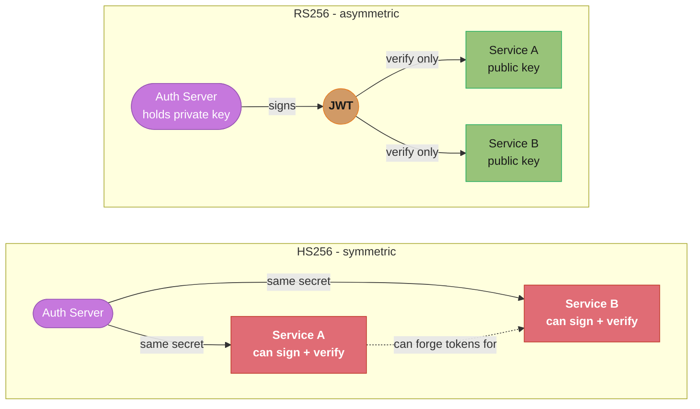
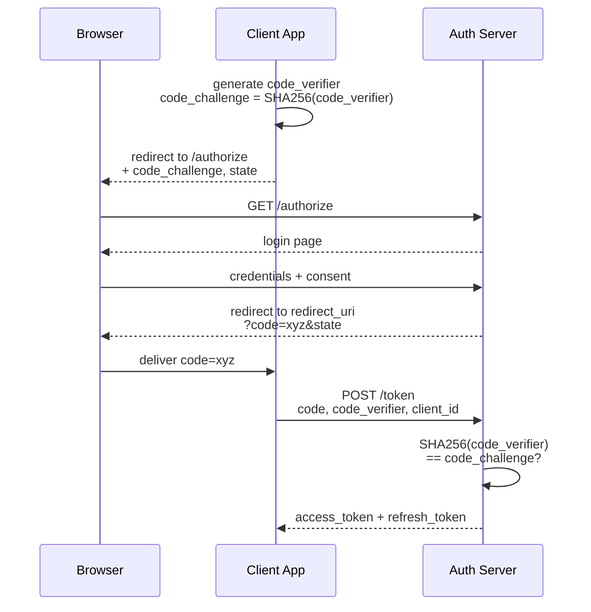
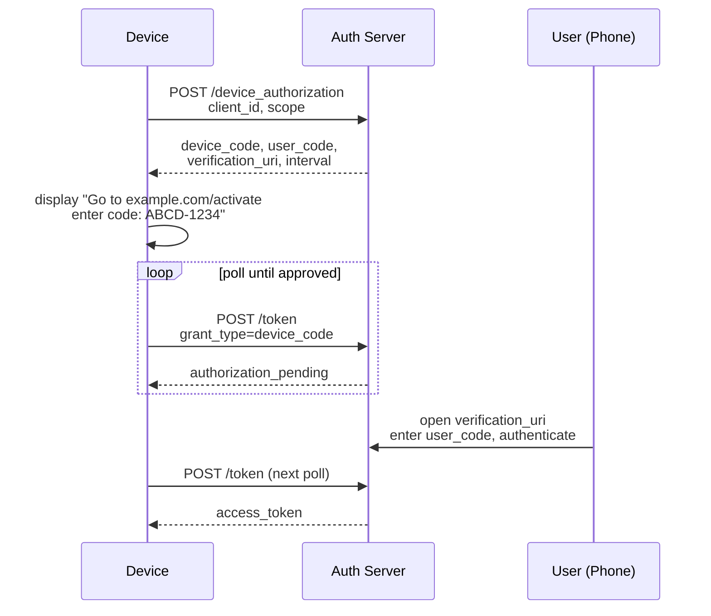
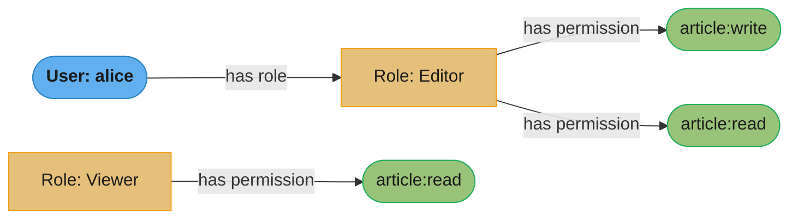
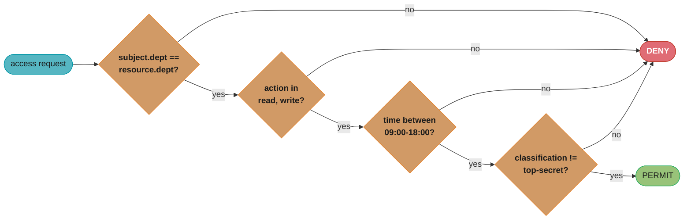
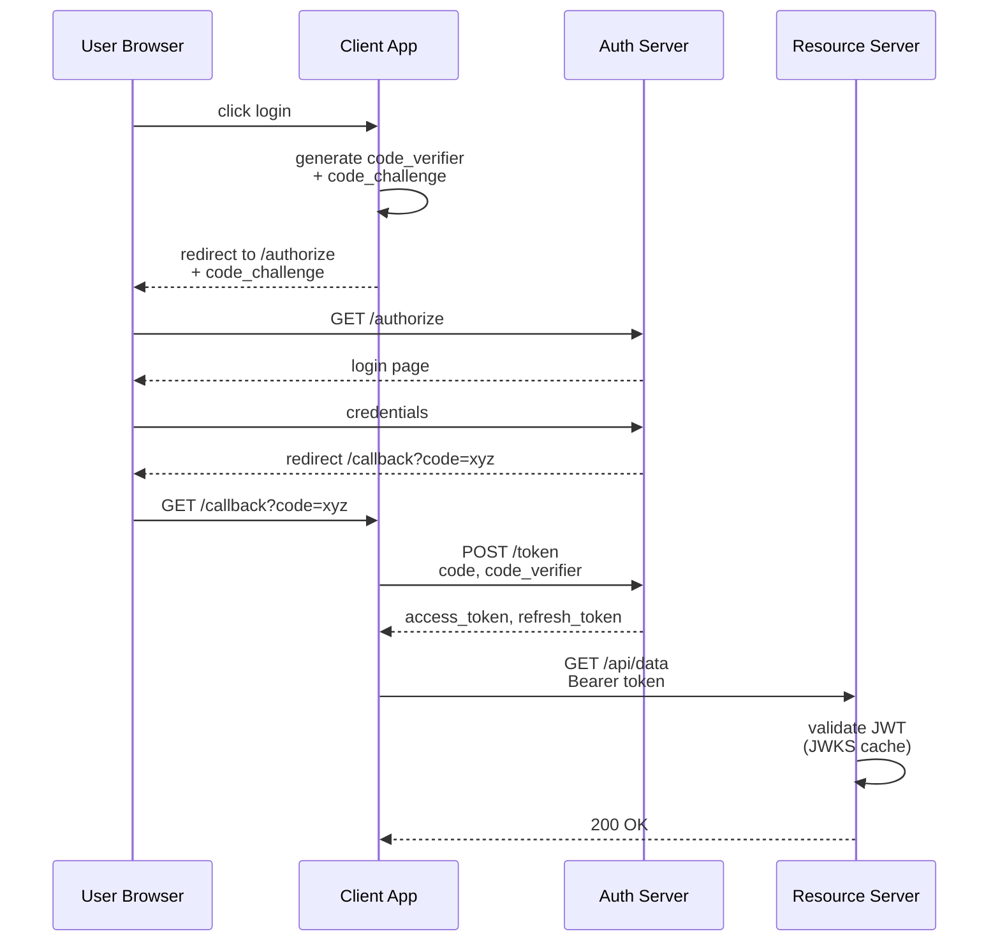
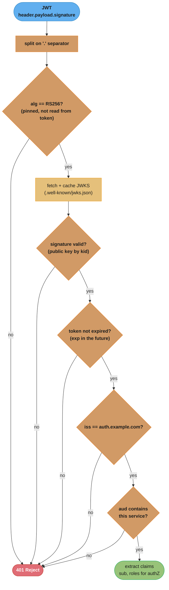
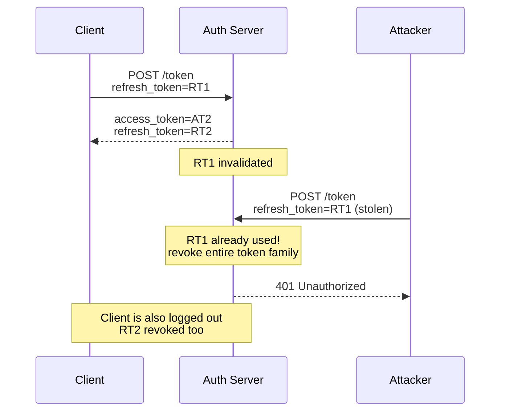
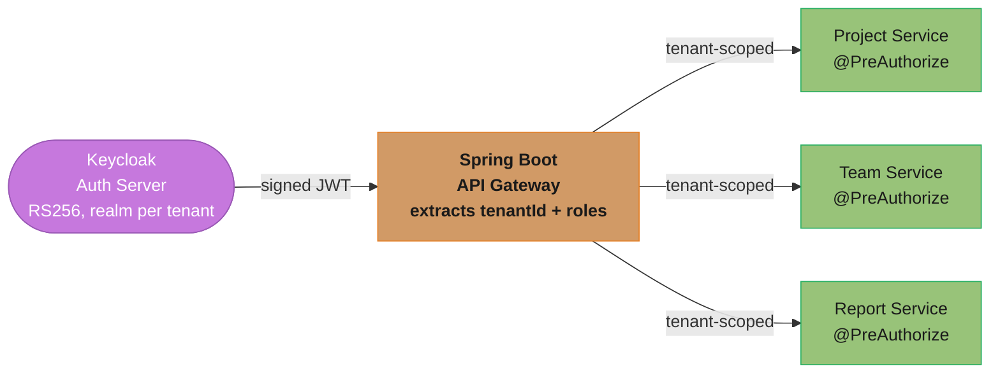

# Authentication and Authorization Systems

---

## 1. Concept Overview

Authentication answers the question "who are you?" — it verifies the identity of a caller. Authorization answers the question "what are you allowed to do?" — it verifies that the verified identity has permission to perform a requested action on a specific resource. These are distinct concerns that are often conflated, with significant security consequences when they are.

Modern backend systems rely on two dominant standards: OAuth 2.0 (RFC 6749) for delegated authorization and OpenID Connect (OIDC, built on top of OAuth 2.0) for federated authentication. JSON Web Tokens (JWT, RFC 7519) are the dominant format for access tokens and ID tokens in these flows. Role-Based Access Control (RBAC) and Attribute-Based Access Control (ABAC) are the primary models for making authorization decisions once identity is established.

---

## 2. Intuition

One-line analogy: OAuth 2.0 is like a hotel key card system. The front desk (authorization server) issues you a card (access token) that opens specific doors (resources) for a limited time — without handing you the master key (your credentials).

Mental model: separate the identity plane (who is this caller?) from the permission plane (what can this caller do?). JWT is a self-contained bearer credential — whoever holds it is treated as the identity it describes, until it expires. Opaque tokens are a reference — the server must call home to find out what they mean.

Why it matters: incorrect implementation of auth is one of the most common causes of serious security incidents. The blast radius ranges from account takeover to full system compromise. The subtle bugs — alg:none attack, missing signature validation, improper token storage, no token revocation — are not obvious to developers unfamiliar with the specifications.

Key insight: JWTs are not encrypted by default. The payload is Base64URL-encoded, not encrypted. Anyone who captures a JWT can read its claims. Use HTTPS everywhere, and do not put sensitive data (PAN, SSN) in JWT claims.

---

## 3. Core Principles

Stateless vs stateful tokens: JWT access tokens are stateless (server needs no DB lookup to validate, but cannot be revoked before expiry). Opaque tokens are stateful (server must call an introspection endpoint, but can be revoked instantly).

Short-lived access tokens: access tokens should expire in 5–60 minutes. A stolen token that expires in 15 minutes limits the attacker's window to 15 minutes.

Refresh token rotation: each use of a refresh token issues a new refresh token and invalidates the old one. If an old (already-used) refresh token is presented, revoke the entire token family — this indicates the refresh token was stolen.

Algorithm pinning: never accept a JWT whose algorithm you did not expect. Specify `RS256` explicitly; never accept `HS256` when you configured `RS256`, and never accept `none`.

Scope-limited tokens: access tokens should carry the minimum scopes needed. An API key for read-only analytics should not grant write access.

---

## 4. Types / Architectures / Strategies

### JWT (JSON Web Token)

A JWT consists of three Base64URL-encoded parts separated by dots:

```
header.payload.signature
```

Header: `{"alg":"RS256","typ":"JWT"}`
Payload: `{"sub":"user-123","email":"alice@example.com","roles":["reader"],"iat":1700000000,"exp":1700003600}`
Signature: RSA-SHA256(base64url(header) + "." + base64url(payload), privateKey)

The receiver verifies the signature using the public key. If valid, the claims are trusted. No DB call needed.

### Algorithms

| Algorithm | Type        | Key                         | Use Case                                     |
|-----------|-------------|---------------------------  |----------------------------------------------|
| HS256     | Symmetric   | Shared secret               | Internal service-to-service (same trust domain) |
| RS256     | Asymmetric  | RSA private/public key pair | Authorization server signs; resource servers verify with public key |
| ES256     | Asymmetric  | EC private/public key pair  | Same as RS256 but smaller key and signature  |
| RS512     | Asymmetric  | RSA 4096-bit                | Higher security, larger token                |

RS256 and ES256 are preferred for OAuth2 systems. The authorization server holds the private key and publishes the public key at a JWKS (JSON Web Key Set) endpoint (`/.well-known/jwks.json`). Resource servers fetch and cache the JWKS to validate tokens without calling the authorization server on every request.



*HS256's shared secret lets any verifier also forge tokens for any other service; RS256 keeps signing power solely with the Auth Server, so a compromised service can only verify, never mint.*

### OAuth 2.0 Grant Types

**Authorization Code + PKCE (most secure, use for web and mobile apps with a user):**



*Six steps, one secret: only the client that generated `code_verifier` can pass step 6's hash check, so an intercepted authorization code alone is worthless to an attacker.*

PKCE (Proof Key for Code Exchange) prevents authorization code interception. Even if the `code` is intercepted (e.g., from the redirect URI in a native app), the attacker cannot exchange it without the `code_verifier` that only the original client knows.

**Client Credentials (service-to-service, no user):**

```
POST /token
grant_type=client_credentials
client_id=service-a
client_secret=<secret>
scope=payments:write

Response: { "access_token": "...", "token_type": "Bearer", "expires_in": 3600 }
```

Used when a backend service needs to call another backend service. No user context. The client_secret must be stored securely (Vault), not in source code.

**Device Authorization Flow (TV / headless devices):**



*The device never sees the user's credentials — it just polls `/token` in a loop while the user completes authorization on a separate, trusted device.*

### OpenID Connect (OIDC)

OIDC is a thin identity layer on top of OAuth 2.0. The authorization server issues an ID token (a JWT) in addition to the access token. The ID token contains standard claims: `sub` (subject identifier), `iss` (issuer), `aud` (audience), `exp`, `iat`, `email`, `name`.

The ID token is for the client application (to know who logged in). The access token is for the resource server (to authorize API calls). Do not use the ID token as an API bearer token.

### Opaque Tokens vs JWT

| Dimension               | JWT (Self-Contained)                          | Opaque Token (Reference)                     |
|-------------------------|-----------------------------------------------|----------------------------------------------|
| Validation              | Local — verify signature + expiry             | Requires introspection endpoint call         |
| Revocation              | Cannot revoke before expiry (unless blocklist) | Revocable instantly                          |
| Payload inspection      | Claims readable by anyone who has the token   | Nothing revealed without introspection       |
| Scalability             | No introspection service needed               | Introspection service is a potential bottleneck |
| Token size              | Larger (claims + signature)                   | Smaller (random identifier only)             |

For access tokens: use JWT for stateless microservices where each service validates independently. Use opaque tokens for high-security scenarios requiring immediate revocation (financial, healthcare) or when token size matters.

### RBAC vs ABAC

RBAC (Role-Based Access Control): permissions are assigned to roles, roles are assigned to users.



*Permissions flow through roles, never directly to users — alice inherits `article:write`/`article:read` solely because she holds the Editor role.*

Simple, well-understood, scales to hundreds of roles. Does not handle context-sensitive rules easily.

ABAC (Attribute-Based Access Control): access decisions are based on attributes of the subject, the resource, the action, and the environment.

```
PERMIT IF:
  subject.department == resource.department
  AND action IN {read, write}
  AND environment.time BETWEEN 09:00 AND 18:00
  AND resource.classification != "top-secret"
```



*ABAC evaluation is a chain of AND-gates — a single failing attribute (department mismatch, disallowed action, off-hours, top-secret classification) short-circuits straight to DENY.*

Powerful for complex enterprise scenarios. Evaluated against a policy engine (OPA — Open Policy Agent). More complex to implement and audit.

---

## 5. Architecture Diagrams

### OAuth2 Authorization Code + PKCE Flow



*Four actors, one bearer token: the Client never sees the user's credentials, and the Resource Server never calls the Auth Server directly — it validates locally against the cached JWKS.*

### JWT Structure and Validation



*Each check is a hard gate — any failure returns 401 without revealing which check failed; the algorithm is pinned by the resource server and never trusted from the token's own header.*

### Refresh Token Rotation with Token Family



*Reuse of an already-rotated refresh token is itself the breach signal — the server cannot tell attacker from legitimate client, so it revokes the whole token family and logs both out.*

---

## 6. How It Works — Detailed Mechanics

### JWT Validation in Java

```java
// Using Nimbus JOSE + JWT library
// Dependency: com.nimbusds:nimbus-jose-jwt:9.37.3

@Component
public class JwtValidator {

    private final JWSVerifier verifier;
    private final String expectedIssuer = "https://auth.example.com";
    private final String expectedAudience = "payments-service";

    public JwtValidator() throws Exception {
        // Load public key from JWKS endpoint (in production, use JWKSCache with refresh)
        JWKSet jwkSet = JWKSet.load(new URL("https://auth.example.com/.well-known/jwks.json"));
        RSAKey rsaKey = (RSAKey) jwkSet.getKeys().get(0);
        this.verifier = new RSASSAVerifier(rsaKey.toRSAPublicKey());
    }

    public JWTClaimsSet validate(String rawToken) throws Exception {
        // NEVER use JWTParser.parse() alone — it does not verify the signature
        SignedJWT jwt = SignedJWT.parse(rawToken);

        // Step 1: verify algorithm is what we expect — never read it from the token's alg header blindly
        JWSHeader header = jwt.getHeader();
        if (!JWSAlgorithm.RS256.equals(header.getAlgorithm())) {
            throw new SecurityException("Unexpected algorithm: " + header.getAlgorithm());
        }

        // Step 2: verify signature
        if (!jwt.verify(verifier)) {
            throw new SecurityException("JWT signature verification failed");
        }

        JWTClaimsSet claims = jwt.getJWTClaimsSet();

        // Step 3: verify expiry
        if (claims.getExpirationTime().before(new Date())) {
            throw new SecurityException("JWT has expired");
        }

        // Step 4: verify issuer
        if (!expectedIssuer.equals(claims.getIssuer())) {
            throw new SecurityException("Unexpected issuer: " + claims.getIssuer());
        }

        // Step 5: verify audience
        if (!claims.getAudience().contains(expectedAudience)) {
            throw new SecurityException("JWT not intended for this audience");
        }

        return claims;
    }
}
```

### alg:none Attack — Broken vs Fixed

```java
// BROKEN: reading algorithm from the token header
// An attacker crafts: header={"alg":"none"}, removes signature
// parser sees alg=none, skips signature verification
JWT parsed = JWTParser.parse(token); // DO NOT USE — no signature verification
// If the library honors alg:none, the attacker's modified claims are trusted

// FIXED: always specify expected algorithms explicitly
JWSVerifier verifier = new RSASSAVerifier(publicKey); // RS256 verifier only
SignedJWT jwt = SignedJWT.parse(token);
// If token has alg=none, SignedJWT.parse() will throw PlainJWT cannot be cast to SignedJWT
// OR — explicitly reject:
if (!JWSAlgorithm.RS256.equals(jwt.getHeader().getAlgorithm())) {
    throw new SecurityException("Algorithm not permitted");
}
boolean valid = jwt.verify(verifier); // checks actual cryptographic signature
```

### Refresh Token Rotation with Redis Blocklist

```java
@Service
public class RefreshTokenService {

    private final RedisTemplate<String, String> redis;
    private final JwtTokenFactory tokenFactory;

    // Token family: all refresh tokens for a session share a familyId
    // Key: "refresh:{familyId}:{tokenId}" -> "valid"
    // When a new refresh token is issued, old key is deleted

    public TokenPair rotate(String rawRefreshToken) {
        RefreshTokenClaims claims = parseRefreshToken(rawRefreshToken);
        String familyId = claims.getFamilyId();
        String tokenId = claims.getTokenId();

        String redisKey = "refresh:" + familyId + ":" + tokenId;
        String status = redis.opsForValue().get(redisKey);

        if (status == null) {
            // Token not found — either never issued or already used
            // This could be a replay attack — revoke entire family
            revokeFamily(familyId);
            throw new SecurityException("Refresh token reuse detected — session revoked");
        }

        // Atomically delete old token and issue new one
        redis.delete(redisKey);

        String newTokenId = UUID.randomUUID().toString();
        String newRedisKey = "refresh:" + familyId + ":" + newTokenId;
        redis.opsForValue().set(newRedisKey, "valid", 30, TimeUnit.DAYS);

        String newAccessToken = tokenFactory.createAccessToken(claims.getUserId(), claims.getScopes());
        String newRefreshToken = tokenFactory.createRefreshToken(familyId, newTokenId, claims.getUserId());

        return new TokenPair(newAccessToken, newRefreshToken);
    }

    private void revokeFamily(String familyId) {
        // Scan and delete all keys matching "refresh:{familyId}:*"
        Set<String> keys = redis.keys("refresh:" + familyId + ":*");
        if (keys != null) redis.delete(keys);
    }
}
```

### RBAC with Spring Security

```java
// Role hierarchy: ADMIN > MANAGER > USER
// Defined as a Spring Bean

@Bean
public RoleHierarchy roleHierarchy() {
    RoleHierarchyImpl hierarchy = new RoleHierarchyImpl();
    hierarchy.setHierarchy("ROLE_ADMIN > ROLE_MANAGER > ROLE_USER");
    return hierarchy;
}

// Method-level authorization
@Service
public class ArticleService {

    @PreAuthorize("hasRole('USER')")
    public Article getArticle(Long id) { ... }

    @PreAuthorize("hasRole('MANAGER') or @articleOwnerCheck.isOwner(authentication, #id)")
    public void updateArticle(Long id, ArticleUpdateRequest req) { ... }

    @PreAuthorize("hasRole('ADMIN')")
    public void deleteArticle(Long id) { ... }
}

// Custom SpEL bean for ABAC-style ownership check
@Component("articleOwnerCheck")
public class ArticleOwnerCheck {
    private final ArticleRepository repo;

    public boolean isOwner(Authentication auth, Long articleId) {
        return repo.findById(articleId)
                   .map(a -> a.getAuthorId().equals(getUserId(auth)))
                   .orElse(false);
    }
}
```

### API Key Management

```java
// API keys: generated once, hashed with SHA-256 before storage
// Raw key is shown to the user once (like a password) — never stored

@Service
public class ApiKeyService {

    private static final String PREFIX = "sk_live_";

    public ApiKeyCreationResult createKey(Long userId, String name, Set<String> scopes) {
        // Generate a cryptographically random 32-byte key
        byte[] rawBytes = new byte[32];
        new SecureRandom().nextBytes(rawBytes);
        String rawKey = PREFIX + Base64.getUrlEncoder().withoutPadding().encodeToString(rawBytes);

        // Hash with SHA-256 — this is what goes in the DB
        String hashedKey = hashKey(rawKey);

        ApiKey entity = ApiKey.builder()
            .userId(userId)
            .name(name)
            .keyHash(hashedKey)
            .prefix(rawKey.substring(0, 10)) // store first 10 chars for lookup/display
            .scopes(scopes)
            .createdAt(Instant.now())
            .lastUsedAt(null)
            .build();

        apiKeyRepository.save(entity);

        // Return rawKey ONCE — never again accessible after this point
        return new ApiKeyCreationResult(rawKey, entity.getId());
    }

    public Optional<ApiKey> validate(String rawKey) {
        // Hash the incoming key and look it up
        String hash = hashKey(rawKey);
        Optional<ApiKey> key = apiKeyRepository.findByKeyHash(hash);

        // Update last-used for audit/expiry enforcement
        key.ifPresent(k -> {
            k.setLastUsedAt(Instant.now());
            apiKeyRepository.save(k);
        });

        return key;
    }

    private String hashKey(String rawKey) {
        try {
            MessageDigest digest = MessageDigest.getInstance("SHA-256");
            byte[] hash = digest.digest(rawKey.getBytes(StandardCharsets.UTF_8));
            return Base64.getEncoder().encodeToString(hash);
        } catch (NoSuchAlgorithmException e) {
            throw new IllegalStateException("SHA-256 not available", e);
        }
    }
}
```

**In plain terms.** "Thirty-two random bytes is 256 bits of entropy, which puts the key permanently out of reach of guessing — so the only way to lose it is to leak it."

That conclusion is what justifies the rest of the design. Because brute force is off the table by an absurd margin, every remaining control in this class — hashing before storage, showing the raw key once, prefixing for secret scanning — targets *disclosure*, not guessing.

| Symbol | What it is |
|--------|------------|
| `new byte[32]` | 32 bytes = 256 bits of key material |
| `SecureRandom` | CSPRNG. `java.util.Random` here would be the actual vulnerability — 48 bits of seed, predictable |
| Keyspace | `2^256` possible keys |
| Base64url of 32 bytes | `ceil(32 × 4/3)` = 43 characters, unpadded |
| `PREFIX` (`sk_live_`) | 8 identifying characters. Adds zero entropy — it is a label, not a secret |
| SHA-256 before storage | One-way. A dumped `api_keys` table yields hashes, not usable credentials |

**Walk one example.** What 256 bits actually buys, against an attacker guessing a billion keys per second:

```
  keyspace          = 2^256  ~=  1.16 x 10^77
  expected guesses  = 2^255      (half the space, on average)

  at 1,000,000,000 guesses/second:
    2^255 / 1e9 / 31,557,600 s-per-year  ~=  1.8 x 10^60 years

  Total key length: 8 (prefix) + 43 (base64url) = 51 characters
```

For contrast, an 8-character alphanumeric key — the kind hand-rolled key generators tend to
produce — has a keyspace of `62^8 ≈ 2.18 × 10^14`, which the same attacker exhausts in about
109,000 seconds, roughly **30 hours**. The gap between 30 hours and 10^60 years is entirely a
function of the byte count, which is why "32 bytes from `SecureRandom`" is the whole
recommendation and no amount of clever formatting substitutes for it.

**Why the prefix is stored separately.** `prefix(rawKey.substring(0, 10))` looks like it weakens
the key by persisting part of it in plaintext, and it would if the prefix carried entropy. It
does not: `sk_live_` is a constant plus two characters, so the searchable prefix narrows
`2^256` to roughly `2^244` — an irrelevant reduction. What it buys is real: operators can
identify a key in a UI without ever storing the secret, and GitHub's secret scanner can
recognize a leaked key on sight (Section 7). Never extend that prefix far enough to matter —
storing the first 30 characters would reveal 22 base64 characters (132 bits) and leave only 124
bits unknown.

### Token Revocation with Blocklist

```java
// For JWT: maintain a Redis set of revoked token JTIs (JWT IDs)
// Check this set on every request — adds one Redis lookup per request

@Component
public class JwtRevocationFilter extends OncePerRequestFilter {

    private final RedisTemplate<String, String> redis;
    private final JwtValidator jwtValidator;

    @Override
    protected void doFilterInternal(HttpServletRequest request,
                                    HttpServletResponse response,
                                    FilterChain chain) throws IOException, ServletException {
        String authHeader = request.getHeader("Authorization");
        if (authHeader != null && authHeader.startsWith("Bearer ")) {
            String token = authHeader.substring(7);
            try {
                JWTClaimsSet claims = jwtValidator.validate(token);
                String jti = claims.getJWTID();

                // Check revocation blocklist
                if (jti != null && Boolean.TRUE.equals(redis.hasKey("revoked:" + jti))) {
                    response.sendError(HttpServletResponse.SC_UNAUTHORIZED, "Token has been revoked");
                    return;
                }

                // Set authentication in SecurityContext
                SecurityContextHolder.getContext().setAuthentication(
                    buildAuthentication(claims)
                );
            } catch (SecurityException e) {
                response.sendError(HttpServletResponse.SC_UNAUTHORIZED, "Invalid token");
                return;
            }
        }
        chain.doFilter(request, response);
    }

    public void revokeToken(String jti, Instant expiry) {
        long ttlSeconds = expiry.getEpochSecond() - Instant.now().getEpochSecond();
        if (ttlSeconds > 0) {
            redis.opsForValue().set("revoked:" + jti, "1", ttlSeconds, TimeUnit.SECONDS);
        }
        // TTL = remaining token lifetime; after that, the token is expired anyway — no need to keep in blocklist
    }
}
```

**What this actually says.** "A revoked token only needs to be remembered until the moment it would have expired on its own — so the blocklist's size is set by your access-token lifetime, not by how many tokens you have ever revoked."

This is why short access tokens make revocation *cheap* rather than merely *safer*. The two properties are the same lever pulled once, which is the point interviewers are usually driving at when they ask "how do you revoke a JWT?"

| Symbol | What it is |
|--------|------------|
| `jti` | JWT ID — the unique per-token claim used as the blocklist key |
| `exp − now` | Remaining lifetime. The exact TTL to set on the Redis key |
| Access-token TTL | 5–60 minutes per Section 3. Simultaneously the revocation lag and the blocklist retention |
| Blocklist size | `revocation rate × TTL` — a steady-state count, not a growing set |
| Refresh calls per session | `session length ÷ TTL` — the cost side of shortening the TTL |

**Walk one example.** Both sides of the TTL choice, for an 8-hour working session:

```
  TTL     stolen-token window     refresh calls per 8h session
   5 min        5 min                    480/5   =  96
  15 min       15 min                    480/15  =  32
  30 min       30 min                    480/30  =  16
  60 min       60 min                    480/60  =   8

  Refresh load at 1,000,000 active users:
    TTL 15 min ->  32,000,000 refreshes/day  =  370 req/s
    TTL 60 min ->   8,000,000 refreshes/day  =   93 req/s
```

Halving the TTL halves the attacker's window and doubles the traffic to your token endpoint —
a clean linear trade with no free lunch, which is exactly why 15 minutes is the common landing
spot rather than 1 minute. Note that 370 req/s of refresh traffic against a single authorization
server is not trivial; it is a real capacity line item that the "just use short tokens" advice
tends to skip.

The blocklist itself stays small because of the TTL rule above. At 5,000 revocations per hour
with a 15-minute token lifetime, the steady-state resident key count is `5000/60 × 15 = 1,250`
keys — bounded, regardless of how long the system has been running. Set the TTL to a fixed
large value instead of `exp − now` and that same workload grows without limit, which is the
usual reason a "revocation is easy, just use Redis" design eventually runs the auth cache out
of memory.

---

## 7. Real-World Examples

**Spotify OAuth2 PKCE (Authorization Code):** Spotify's Web Playback SDK uses Authorization Code + PKCE for browser-based apps. No client secret is involved — the app is public. PKCE replaces the secret by proving that the same client that requested the code is the one exchanging it. This is the recommended pattern for all browser and native mobile applications as of OAuth 2.1.

**AWS Cognito (OIDC Identity Provider):** Cognito acts as an OIDC provider issuing JWTs. Resource servers (API Gateway, Spring Boot services) validate JWTs against Cognito's JWKS endpoint. The token contains `cognito:groups` claims used for RBAC decisions. Cognito supports user pools (for end users) and identity pools (for federated access to AWS resources).

**GitHub Personal Access Tokens:** GitHub API keys are prefixed (`ghp_`, `ghs_`, `gho_`) to enable automated secret scanning. GitHub scans all public commits for these prefixes and immediately notifies the owner if a token is detected. The prefix approach also allows GitHub to distinguish token types and apply appropriate policies. This is why prefix-based API keys (`sk_live_`, `pk_test_`) are a best practice.

**Google Sign-In (OIDC):** Google issues ID tokens as RS256-signed JWTs. Client applications validate these tokens against Google's JWKS endpoint at `https://www.googleapis.com/oauth2/v3/certs`. The `sub` claim is the stable Google user ID. The `hd` claim restricts to a specific hosted domain (for Google Workspace SSO). `aud` must match the application's client_id — failing to check `aud` is a common security flaw.

---

## 8. Tradeoffs

| Dimension                      | JWT (Stateless)                    | Opaque Token (Stateful)               |
|--------------------------------|------------------------------------|---------------------------------------|
| Revocation speed               | Up to token expiry (unless blocklist) | Immediate                          |
| Resource server dependency     | None (JWKS cached)                 | Introspection endpoint per request   |
| Token size                     | ~500-2000 bytes                    | ~20-40 bytes (random ID)             |
| Claims visibility              | Claims visible to anyone with token | Opaque without introspection         |
| Suitable for                   | Microservices, stateless APIs      | Financial, healthcare, sessions      |
| Rotation support               | Implicit via expiry                | Explicit via revocation              |

| Model | RBAC                               | ABAC                                       |
|-------|------------------------------------|--------------------------------------------|
| Complexity | Low — roles map to permissions | High — attribute policies, policy engine   |
| Flexibility | Medium — coarse-grained         | High — fine-grained, context-aware         |
| Auditability | Simple — role assignments       | Complex — policy evaluation trail          |
| Performance | Fast — role check in token claims | Slower — policy engine evaluation         |
| Use case | Most SaaS, API access control   | Healthcare, finance, multi-tenant platforms |

---

## 9. When to Use / When NOT to Use

**JWT access tokens:** use for stateless microservices that need to validate tokens independently without calling a central service. Use when tokens carry scopes/roles needed locally. Set expiry to 5–15 minutes for high-security, 30–60 minutes for standard APIs.

**Opaque tokens with introspection:** use when immediate revocation is mandatory (financial transactions, healthcare, government). Use when you cannot afford to have a stolen token valid for any duration.

**Authorization Code + PKCE:** use for any flow involving a human user and a web or mobile client. Required for all public clients (no client secret). Required by OAuth 2.1.

**Client Credentials:** use for machine-to-machine flows. Never use for flows where a human user is involved.

**RBAC:** use as the default authorization model. Simple, auditable, well-understood. Sufficient for most SaaS products.

**ABAC / OPA:** use when role-based checks are insufficient — multi-tenant systems where users from tenant A cannot access tenant B's data even if they have the same role, time-based access restrictions, data classification policies.

**When NOT to use JWT for sessions:** long-lived JWT sessions (days/weeks) are dangerous. If a token is stolen, it is valid until expiry. Use short-lived JWTs with refresh tokens, or use opaque session tokens with server-side state for web sessions.

---

## 10. Common Pitfalls

**Pitfall 1 — Missing audience validation:** A service validated JWT signature and expiry but did not validate the `aud` claim. An attacker obtained a valid JWT issued for service A, then used it to call service B. Both services share the same authorization server. Service B accepted the token because the signature was valid. Fix: always validate `aud` equals the expected service identifier. Each service should have a unique audience.

**Pitfall 2 — HS256 shared secret across services:** A team used HS256 with the same shared secret for all microservices. Any service that knew the secret could forge tokens for any other service. In a microservices architecture, a compromised service can mint tokens. Fix: use RS256 or ES256 — only the authorization server holds the private key; services only hold public keys.

**Pitfall 3 — Storing JWTs in localStorage:** A single-page application stored the access token in `localStorage`. A stored XSS vulnerability in the app allowed an attacker to inject a script that read `localStorage` and exfiltrated the token. Fix: store access tokens in memory (JavaScript variable). For refresh tokens requiring persistence across page loads, use `HttpOnly; Secure; SameSite=Strict` cookies — not accessible to JavaScript.

**Pitfall 4 — Infinite-lived refresh tokens:** A team issued refresh tokens with no expiry. A single phished refresh token gave the attacker permanent access until manually discovered and revoked. Fix: refresh tokens must have an expiry (recommended 30 days maximum). Use refresh token rotation — a token that has not been used in 30 days is automatically expired.

**Pitfall 5 — PKCE code_challenge with plain method:** Using `code_challenge_method=plain` makes PKCE trivial to bypass — `code_challenge == code_verifier`, so an intercepted `code_challenge` from the authorization request gives the attacker the `code_verifier` needed to exchange the code. Always use `code_challenge_method=S256`.

**Pitfall 6 — Not validating state parameter in OAuth2 callback:** The `state` parameter in OAuth2 is a CSRF token for the authorization flow itself. If the callback handler does not verify that the `state` returned from the authorization server matches the one the client generated, an attacker can trick a user into completing an OAuth2 flow with the attacker's `code` — binding the victim's app session to the attacker's identity (account takeover).

**Pitfall 7 — API keys stored in plaintext in DB:** A startup stored API keys in plaintext in the `api_keys` table. A SQL injection vulnerability exposed the table, giving the attacker every active API key. Fix: hash API keys with SHA-256 before storage. The raw key is shown once at creation. Treat API keys exactly like passwords — hash-before-store is non-negotiable.

---

## 11. Technologies and Tools

| Tool / Library                    | Purpose                                               |
|-----------------------------------|-------------------------------------------------------|
| Spring Security OAuth2 Resource Server | JWT validation, OIDC, Bearer token filter      |
| Keycloak                          | Self-hosted authorization server, OIDC/SAML           |
| Auth0                             | Managed authorization server, OIDC/SAML/social login |
| AWS Cognito                       | Managed OIDC/OAuth2 user pools for AWS apps           |
| Okta                              | Enterprise OIDC/SAML, workforce identity              |
| nimbus-jose-jwt                   | Java JWT library (used internally by Spring Security) |
| java-jwt (Auth0)                  | Alternative JWT library for Java                      |
| OPA (Open Policy Agent)           | ABAC policy engine, Rego policy language              |
| Casbin                            | Multi-model access control library (RBAC/ABAC)        |
| Redis                             | Token blocklist, refresh token family storage         |
| HashiCorp Vault                   | Secrets management, JWT issuing via JWT auth method   |

---

## 12. Interview Questions with Answers

**Q: What is the difference between OAuth 2.0 and OpenID Connect?**
OAuth 2.0 is an authorization framework — it allows an application to obtain delegated access to resources on behalf of a user. It does not define how to authenticate the user or what the user's identity is. OpenID Connect (OIDC) is an identity layer built on top of OAuth 2.0. It adds an ID token (a JWT) that contains verified identity claims (sub, email, name) and standardizes the UserInfo endpoint. In practice: use OAuth 2.0 for API access delegation, use OIDC when you need to know who the user is (login/SSO).

**Q: What is PKCE and why is it required for public clients?**
PKCE (Proof Key for Code Exchange) prevents authorization code interception attacks. A public client (browser app, mobile app) cannot hold a client secret securely — the secret would be visible in source code or the app bundle. Without a client secret, anyone who intercepts the authorization code can exchange it for tokens. PKCE replaces the secret with a per-request proof: the client generates a random `code_verifier`, sends `SHA256(code_verifier)` as `code_challenge` in the authorization request, then sends the raw `code_verifier` in the token exchange. Only the original client knows the `code_verifier`.

**Q: Explain the alg:none attack on JWT.**
JWT headers contain an `alg` field. Some early implementations read the algorithm from the token header and then performed signature verification accordingly. If a library accepted `alg: none`, an attacker could remove the signature, set `alg` to `none`, and modify any claim (e.g., change `role` from `user` to `admin`). The library would see `alg: none`, skip signature verification, and accept the modified token. Prevention: always specify the exact expected algorithm when parsing — never derive it from the token header. Use libraries that require an explicit algorithm parameter and reject `none`.

**Q: What is the difference between access tokens and refresh tokens?**
Access tokens are short-lived credentials (5–60 minutes) used to call protected APIs. They should be validated on every API call. Because they are short-lived, if stolen they are only valid briefly. Refresh tokens are long-lived credentials (days to weeks) used only to obtain new access tokens when the current one expires. They are exchanged directly with the authorization server's token endpoint, not sent to resource servers. Refresh tokens must be stored more securely than access tokens and support revocation.

**Q: How does refresh token rotation work and what does it protect against?**
In refresh token rotation, each successful use of a refresh token issues a new refresh token and immediately invalidates the old one. If an attacker steals a refresh token and uses it, two events occur: the attacker receives a new token pair, and when the legitimate client's old token is presented, the server detects a token reuse (the old token is no longer valid). At this point, the server revokes the entire token family (all refresh tokens for that session), forcing the user to re-authenticate. This limits the damage of a stolen refresh token to the window between theft and the legitimate client's next use.

**Q: What is the difference between RBAC and ABAC?**
RBAC assigns permissions to roles, and users are assigned roles. Authorization decisions are based solely on which roles the user holds — `hasRole('MANAGER')`. RBAC is simple, performant, and easy to audit. ABAC makes decisions based on attributes: the subject's attributes (department, clearance level), the resource's attributes (classification, owner, data sensitivity), the action, and the environment (time, location). ABAC is more flexible and can enforce fine-grained, context-aware policies, but requires a policy engine and is more complex to manage.

**Q: How do you revoke a JWT before it expires?**
JWTs are stateless by design and cannot be revoked by changing a flag in a database — the resource server does not look anything up. Revocation requires either: (1) maintaining a blocklist in Redis of revoked JWT IDs (`jti` claim); the resource server checks this on every request — one Redis lookup per request; (2) short expiry windows (5–15 minutes) so stolen tokens are naturally short-lived; (3) using opaque tokens instead of JWT for high-security contexts where instant revocation is required. The Redis blocklist approach is the most common for JWTs requiring revocation, with TTLs set to the remaining token lifetime to avoid unbounded growth.

**Q: How would you secure API keys?**
Generate keys using a cryptographically secure random number generator (SecureRandom in Java). Hash the key with SHA-256 before storing in the database. Return the raw key to the user exactly once (at creation); it is never retrievable again. Store only the hash in the DB — treat it like a password. Add a human-readable prefix (e.g., `sk_live_`) for easy identification in logs and for automated secret scanning tools (GitHub's secret scanning hooks on known prefixes). Scope each key to minimum required permissions. Track last-used timestamp. Allow users to delete/rotate keys. Rate limit by API key. Notify users of unusual geographic or volume patterns.

**Q: What is the difference between symmetric and asymmetric JWT signing?**
HS256 is symmetric: the same secret key is used to sign and to verify. Any party that can verify can also forge tokens. This works for a single service but fails in microservices — sharing the secret means any service can forge tokens for any other service. RS256 and ES256 are asymmetric: the authorization server signs with its private key; resource servers verify with the public key. Resource servers never have signing capability. The public key is published at a JWKS endpoint. This is the correct approach for distributed systems.

**Q: Explain the OAuth2 client credentials flow and when to use it.**
The client credentials flow is used for machine-to-machine API calls where no user is involved. A backend service authenticates using its `client_id` and `client_secret` (or a signed JWT assertion) and receives an access token scoped to what that service is allowed to do. Use it for: cron jobs calling an internal API, service A calling service B in a microservices architecture, a data pipeline accessing a storage API. Never use it when a human user's identity or delegated permissions are needed.

**Q: How does OIDC differ from SAML for SSO?**
Both enable federated SSO, but use different protocols and token formats. SAML uses XML-based assertions over HTTP POST redirects — heavy, but mature and widely supported by enterprise identity providers (Okta, ADFS, Ping). OIDC uses JSON/JWT over OAuth2 flows — lighter, REST-friendly, designed for modern web and mobile apps. SAML requires specific libraries for XML signature validation; OIDC uses standard HTTP and JWT libraries. For new systems integrating with enterprise SSO, SAML is still commonly required; for consumer or cloud-native apps, OIDC is preferred.

**Q: What is a JWT claim and which claims should you always validate?**
A JWT claim is a key-value pair in the token payload making a statement about the subject or the token itself. Always validate: `exp` (expiration time — reject expired tokens), `iat` (issued at — reject tokens with `iat` far in the past if clock skew is a concern), `iss` (issuer — must match the expected authorization server URL), `aud` (audience — must include this service's identifier), `alg` (algorithm — must match expected algorithm, validated before signature check). Additionally validate `nbf` (not before) if present. Never use a JWT that fails any of these checks.

**Q: How would you implement tenant isolation in a multi-tenant API using JWT?**
Include a `tenantId` claim in the JWT when the user authenticates. In the resource server filter, extract `tenantId` from the validated token and store it in a request-scoped context (e.g., ThreadLocal or Spring `RequestAttributes`). Every data access layer method reads `tenantId` from context and adds it as a WHERE clause condition. Use Spring Data JPA's `@Filter` or row-level security in PostgreSQL to enforce this automatically. Never accept `tenantId` as a request parameter from the client — always derive it from the token. Validate that the requested resource's `tenantId` matches the token's `tenantId` at the service layer.

**Q: What are the security implications of storing a JWT in a cookie vs localStorage?**
`localStorage` is accessible by JavaScript on the same origin. An XSS vulnerability on any page of the application can read and exfiltrate the token. Cookies with `HttpOnly` flag are not accessible to JavaScript, which prevents XSS-based token theft. However, cookies are automatically sent by the browser on cross-origin requests, making them susceptible to CSRF — mitigated with `SameSite=Strict` or `SameSite=Lax` plus a CSRF token for state-changing requests. Best practice: store access tokens in memory (JavaScript variable) for the shortest lived; use `HttpOnly; Secure; SameSite=Strict` cookies for refresh tokens that need to survive page refresh.

**Q: How do you handle token clock skew between services?**
JWT expiry (`exp`) is an absolute Unix timestamp. If the issuing server and the validating server have different system clocks, a token that is technically valid may be rejected due to a small time difference. Standard practice: accept a configurable clock skew tolerance of 30–60 seconds in the validator (`new JWTClaimsSetVerifier.Builder().maximumClockSkew(60)...`). Use NTP (Network Time Protocol) to keep server clocks synchronized within a few milliseconds — the clock skew tolerance is a fallback, not the primary mechanism. Kubernetes node clocks are typically synchronized via NTP automatically.

**Q: What is token introspection (RFC 7662) and when is it used?**
Token introspection is an endpoint on the authorization server that resource servers call to validate an opaque token: `POST /introspect, token=<opaque_token>`. The authorization server returns whether the token is active and its associated metadata (scope, sub, exp). It is used when: (1) tokens are opaque (not JWTs) and cannot be validated locally; (2) immediate revocation is required and maintaining a blocklist is impractical; (3) token metadata is too large for a JWT and must be fetched on demand. Downside: every API request requires a call to the introspection endpoint, adding latency and creating a central bottleneck. Cache introspection results with a TTL shorter than the token's expiry to reduce load.

---

## 13. Best Practices

- Always use a well-maintained JWT library. Do not implement JWT parsing from scratch. Specify the expected algorithm explicitly — never derive it from the token header.
- Issue access tokens with short expiry (15 minutes for high-security, 60 minutes for standard). Use refresh tokens with rotation for session continuity.
- Publish public keys at a JWKS endpoint. Resource services cache JWKS with a 1-hour TTL and refresh on key rotation. Support multiple simultaneous public keys to allow zero-downtime key rotation.
- Include a `jti` (JWT ID) claim in every access token to support revocation via blocklist.
- Validate all claims: `alg`, `sig`, `exp`, `iss`, `aud`. Log and return 401 on any validation failure — do not return details about which check failed to the caller.
- Use PKCE for all public clients. Require it for confidential clients as well — OAuth 2.1 mandates PKCE for all authorization code flows.
- Store API keys hashed (SHA-256) in the database. Never store plaintext. Display the raw key once, at creation.
- Implement refresh token rotation with token families. On detecting token reuse, revoke the entire family.
- For multi-tenant systems, always derive `tenantId` from the JWT — never from request parameters.
- Audit log all authentication events: login (success/failure), token issuance, token revocation, failed authorization checks, API key creation/deletion. Include userId, IP, User-Agent, and timestamp in every audit event.

---

## 14. Case Study

### Implementing OAuth2 + RBAC for a Multi-Tenant SaaS Platform

**Scenario:** a project management SaaS has three user roles (Admin, Manager, Viewer), three tenants (organizations), and an API consumed by web, mobile, and partner integrations.

**Requirements:** (1) human users authenticate via OIDC (Google, Okta, email/password); (2) partner integrations use client credentials; (3) access tokens expire in 15 minutes with refresh token rotation; (4) admins can access all resources within their tenant; managers can access their team's resources; viewers are read-only; (5) cross-tenant access is impossible regardless of role.

**Architecture:**



*Every downstream service re-checks `tenantId` independently via `@TenantFilter` even though the gateway already rejects cross-tenant requests — defense in depth, not a single trust boundary.*

**Token Claims:**

```json
{
  "sub": "user-abc123",
  "iss": "https://auth.example.com/realms/example",
  "aud": ["project-service", "team-service"],
  "tenantId": "tenant-xyz",
  "roles": ["TEAM_MANAGER"],
  "exp": 1700003600,
  "jti": "token-unique-id-001"
}
```

**Tenant Isolation at Service Layer:**

```java
@Component
public class TenantContext {
    private static final ThreadLocal<String> CURRENT_TENANT = new ThreadLocal<>();

    public static void set(String tenantId) { CURRENT_TENANT.set(tenantId); }
    public static String get() { return CURRENT_TENANT.get(); }
    public static void clear() { CURRENT_TENANT.remove(); }
}

@Component
public class TenantExtractionFilter extends OncePerRequestFilter {
    @Override
    protected void doFilterInternal(HttpServletRequest req, HttpServletResponse res, FilterChain chain)
            throws IOException, ServletException {
        Authentication auth = SecurityContextHolder.getContext().getAuthentication();
        if (auth instanceof JwtAuthenticationToken jwt) {
            String tenantId = (String) jwt.getTokenAttributes().get("tenantId");
            if (tenantId == null) {
                res.sendError(403, "No tenant context");
                return;
            }
            TenantContext.set(tenantId);
        }
        try {
            chain.doFilter(req, res);
        } finally {
            TenantContext.clear(); // must clear to avoid thread pool leakage
        }
    }
}

// Repository automatically scopes queries to current tenant
@Repository
public interface ProjectRepository extends JpaRepository<Project, Long> {
    @Query("SELECT p FROM Project p WHERE p.id = :id AND p.tenantId = :tenantId")
    Optional<Project> findByIdAndTenant(@Param("id") Long id,
                                        @Param("tenantId") String tenantId);
}
```

**Outcome:** partners use client credentials flow with a service account scoped to `projects:read` only. Human users authenticate via OIDC with 15-minute access tokens and 30-day rotating refresh tokens. Cross-tenant access is impossible by construction — the `tenantId` in the token never matches another tenant's data. A Keycloak admin policy prevents issuing tokens with a `tenantId` the user does not belong to. The `jti` is stored in Redis on logout to immediately invalidate the access token before its 15-minute expiry.
