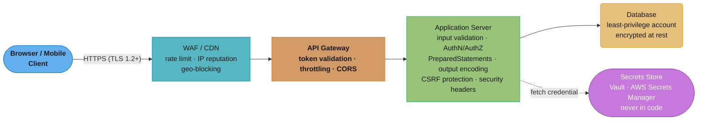
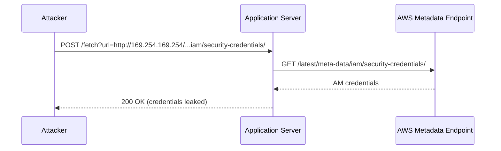
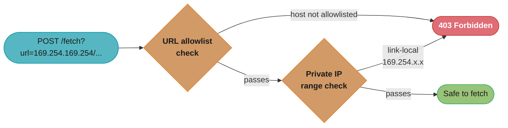
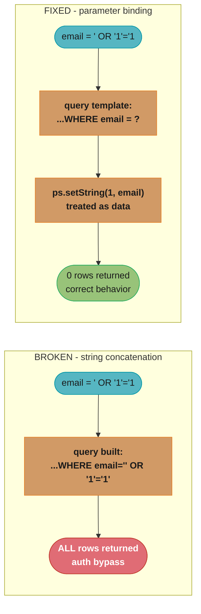
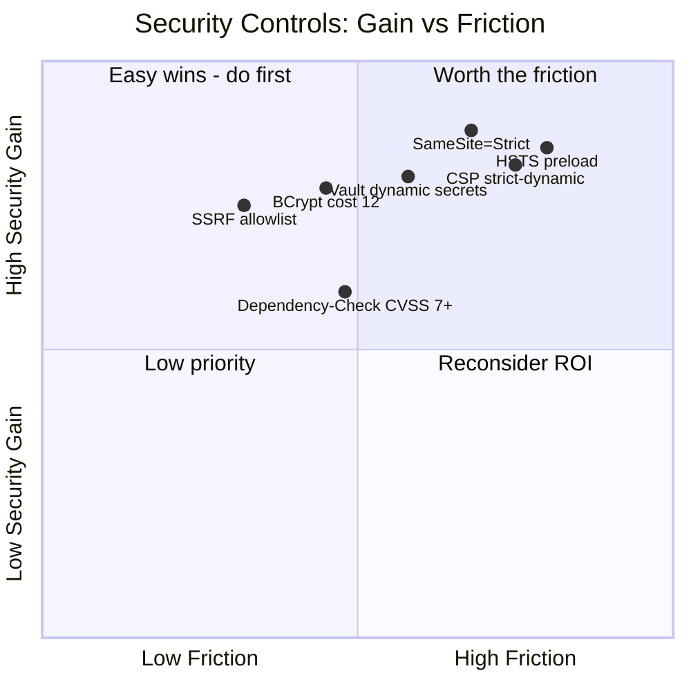
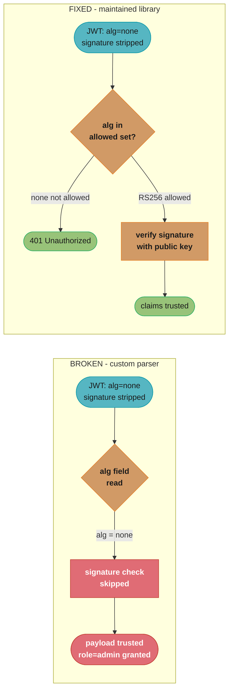
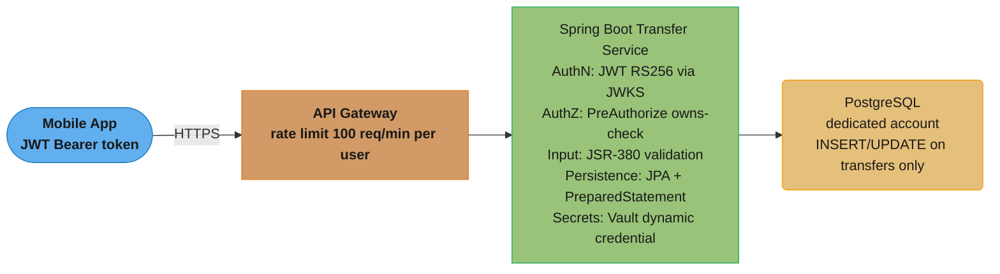

# Backend Security — OWASP Top 10 and Secure Coding

---

## 1. Concept Overview

The OWASP Top 10 is a consensus document published by the Open Web Application Security Project that lists the ten most critical security risks for web applications. The 2021 edition reflects a shift toward architectural and design-level failures alongside the classic injection and authentication weaknesses. Backend security is not a single feature — it is a cross-cutting concern that spans every layer of an application: input handling, authentication, session management, data access, configuration, dependency management, secrets handling, and HTTP transport.

The ten categories in OWASP 2021 are:

| Rank | ID  | Category                            |
|------|-----|-------------------------------------|
| 1    | A01 | Broken Access Control               |
| 2    | A02 | Cryptographic Failures              |
| 3    | A03 | Injection                           |
| 4    | A04 | Insecure Design                     |
| 5    | A05 | Security Misconfiguration           |
| 6    | A06 | Vulnerable and Outdated Components  |
| 7    | A07 | Identification and Authentication Failures |
| 8    | A08 | Software and Data Integrity Failures |
| 9    | A09 | Security Logging and Monitoring Failures |
| 10   | A10 | Server-Side Request Forgery (SSRF)  |

---

## 2. Intuition

One-line analogy: security is not a door you add at the end — it is the material from which the entire building is constructed.

Mental model: think of each OWASP category as a class of attack vector. A01 (Broken Access Control) means users can reach resources they should not. A03 (Injection) means the application confuses user-supplied data with trusted commands. A10 (SSRF) means the server itself becomes a weapon that the attacker aims at internal services.

Why it matters: a single exploited vulnerability can expose every user record, allow privilege escalation to admin, or pivot into the internal network. Data breaches average $4.45 million per incident (IBM Cost of a Data Breach 2023). Regulatory frameworks (PCI-DSS, HIPAA, GDPR) impose fines on top of that.

Key insight: most vulnerabilities are not exotic zero-days. They are well-understood, categorized, and preventable with known controls. The OWASP Top 10 exists precisely because these mistakes are made over and over in production.

---

## 3. Core Principles

Defense in depth: no single control is sufficient. Combine input validation, parameterized queries, output encoding, authentication, authorization, and monitoring.

Least privilege: every component — users, services, DB accounts, IAM roles — should have only the permissions it needs and nothing more.

Fail securely: when an error occurs, deny access by default. Do not expose stack traces or internal details to the client.

Shift left: security checks belong in development (SAST), CI pipelines (DAST, dependency scanning), and code review — not only in production monitoring.

Never trust input: treat every byte from an external source — HTTP parameters, headers, cookies, uploaded files, webhook payloads — as potentially malicious.

Keep secrets out of code: credentials, API keys, and certificates are not configuration in the twelve-factor sense. They require dedicated secret management (Vault, AWS Secrets Manager, GCP Secret Manager).

---

## 4. Types / Architectures / Strategies

### A01 — Broken Access Control

The most prevalent category. Manifestations: insecure direct object reference (IDOR), missing function-level access control, CORS misconfiguration, privilege escalation (regular user calls admin endpoint), path traversal.

Fix pattern: enforce authorization on every resource access server-side. Never rely on the client hiding a button. Use Spring Security method security (`@PreAuthorize`) or a dedicated policy engine (OPA).

### A02 — Cryptographic Failures

Transmitting or storing sensitive data without encryption. Weak algorithms (MD5, SHA-1 for passwords, DES, RC4). Hard-coded keys. Using ECB mode for symmetric encryption.

Fix pattern: TLS 1.2+ for all transport. AES-256-GCM for symmetric encryption. RSA-2048 or EC-256 for asymmetric. BCrypt, Argon2, or scrypt for passwords (never MD5/SHA for passwords). BCrypt cost factor 10 minimum, 12 recommended (adds ~300ms per hash at cost 12 on modern hardware — acceptable for login, prevents brute force).

### A03 — Injection

SQL, LDAP, OS command, XML/XPath, expression language injection. The attacker supplies data that is interpreted as a command.

### A04 — Insecure Design

Missing threat modeling, no abuse case analysis, no rate limiting on sensitive flows (password reset, OTP), business logic flaws. Cannot be fixed by a patch — requires architectural redesign.

### A05 — Security Misconfiguration

Default credentials left active, debug endpoints exposed (`/actuator/env`, `/h2-console`), verbose error messages, unnecessary features enabled, missing security headers.

### A06 — Vulnerable and Outdated Components

Using libraries with known CVEs. Log4Shell (CVE-2021-44228) was a critical RCE in Log4j used by thousands of production systems. Fix: software composition analysis (SCA) in CI — OWASP Dependency-Check, Snyk, Dependabot.

### A07 — Identification and Authentication Failures

Weak passwords permitted, credential stuffing unmitigated, no MFA, session tokens not invalidated on logout, insecure "remember me" implementation.

### A08 — Software and Data Integrity Failures

Unsigned software updates, deserialization of untrusted data (Java ObjectInputStream), insecure CI/CD pipelines (dependency confusion attacks), unsigned container images.

### A09 — Security Logging and Monitoring Failures

No audit log, no alerting on failed logins, sensitive data in logs (passwords, PAN, PII), logs stored where the attacker can tamper with them after compromise.

### A10 — Server-Side Request Forgery (SSRF)

The server is tricked into making HTTP requests to attacker-controlled URLs. Used to scan internal networks, reach cloud metadata endpoints (169.254.169.254 on AWS returns IAM credentials), and pivot to other services.

---

## 5. Architecture Diagrams

### Layered Security Controls



Each layer narrows what the previous layer lets through; the Application Server pulls its database credential from the Secrets Store at runtime instead of embedding it, so a server compromise alone does not leak a long-lived password.

### SSRF Attack Flow vs Prevention

**Attack — no prevention:**



With no allowlist or IP check, the server blindly relays the caller's URL to the AWS metadata endpoint (169.254.169.254) and hands the IAM credentials straight back to the attacker — the Capital One 2019 breach (Section 7) followed this exact path.

**Prevention — defense in depth:**



Two sequential gates — a hostname allowlist, then a private-IP-range check performed after DNS resolution — both reject the metadata-endpoint URL before any outbound fetch is attempted.

### SQL Injection — Broken vs Fixed



The same attacker-supplied string becomes executable query syntax when concatenated (broken) but stays inert bound data when passed as a parameter (fixed) — the query structure itself never changes in the fixed path.

---

## 6. How It Works — Detailed Mechanics

### SQL Injection — Broken and Fixed

```java
// BROKEN: string concatenation — never do this
public User findByEmail(String email, Connection conn) throws SQLException {
    // Attacker input: email = "' OR '1'='1' --"
    // Resulting SQL: SELECT * FROM users WHERE email = '' OR '1'='1' --'
    String sql = "SELECT * FROM users WHERE email = '" + email + "'";
    Statement stmt = conn.createStatement();
    ResultSet rs = stmt.executeQuery(sql); // returns every row
    // ...
}

// FIX: PreparedStatement with parameter binding
public User findByEmail(String email, Connection conn) throws SQLException {
    String sql = "SELECT * FROM users WHERE email = ?";
    try (PreparedStatement ps = conn.prepareStatement(sql)) {
        ps.setString(1, email); // driver escapes the value; DB treats it as data
        try (ResultSet rs = ps.executeQuery()) {
            if (rs.next()) {
                return mapRow(rs);
            }
        }
    }
    return null;
}
```

### SSRF Prevention

```java
@Service
public class UrlFetchService {

    // Allowlist: only these hosts may be fetched
    private static final Set<String> ALLOWED_HOSTS = Set.of(
        "api.partner.com",
        "cdn.example.com"
    );

    // Block link-local and RFC-1918 addresses
    private static final List<InetAddressRange> BLOCKED_RANGES = List.of(
        InetAddressRange.of("10.0.0.0/8"),
        InetAddressRange.of("172.16.0.0/12"),
        InetAddressRange.of("192.168.0.0/16"),
        InetAddressRange.of("169.254.0.0/16"),  // link-local (AWS metadata)
        InetAddressRange.of("127.0.0.0/8")      // loopback
    );

    public String fetch(String rawUrl) {
        URI uri;
        try {
            uri = new URI(rawUrl);
        } catch (URISyntaxException e) {
            throw new SecurityException("Invalid URL");
        }

        String host = uri.getHost();
        if (!ALLOWED_HOSTS.contains(host)) {
            throw new SecurityException("Host not in allowlist: " + host);
        }

        // Resolve DNS and check resolved IP against blocked ranges
        InetAddress resolved;
        try {
            resolved = InetAddress.getByName(host);
        } catch (UnknownHostException e) {
            throw new SecurityException("DNS resolution failed");
        }

        for (InetAddressRange range : BLOCKED_RANGES) {
            if (range.contains(resolved)) {
                throw new SecurityException("Resolved IP in blocked range: " + resolved);
            }
        }

        // Safe to fetch
        return httpClient.get(uri.toString());
    }
}
```

Note: always re-validate after DNS resolution, not just the hostname string. DNS rebinding attacks work by making a hostname resolve to a legitimate IP at allowlist-check time, then to an internal IP when the actual connection is made. Use a pinned connection with IP validation, or use a dedicated egress proxy.

### CSRF Protection with SameSite Cookies

```java
// Spring Security CSRF — enabled by default for stateful apps
@Configuration
@EnableWebSecurity
public class SecurityConfig {

    @Bean
    public SecurityFilterChain filterChain(HttpSecurity http) throws Exception {
        http
            // For REST APIs using JWT (stateless), CSRF can be disabled
            // For session-based apps, keep CSRF enabled
            .csrf(csrf -> csrf
                .csrfTokenRepository(CookieCsrfTokenRepository.withHttpOnlyFalse())
            )
            .sessionManagement(session -> session
                .sessionCreationPolicy(SessionCreationPolicy.IF_REQUIRED)
            );
        return http.build();
    }
}
```

```yaml
# application.yaml — set SameSite on session cookie
server:
  servlet:
    session:
      cookie:
        same-site: strict    # or lax; strict prevents CSRF from cross-site POSTs
        http-only: true      # not readable by JavaScript
        secure: true         # HTTPS only
```

SameSite=Strict: cookie is never sent in cross-origin requests. Stops CSRF completely but breaks OAuth2 redirect flows.
SameSite=Lax: cookie sent for top-level navigation GET requests, not for cross-origin POST. Adequate for most CSRF protection.

### Password Hashing with BCrypt

```java
// BCrypt cost factor 10 = ~100ms per hash (2^10 rounds)
// BCrypt cost factor 12 = ~400ms per hash (2^12 rounds) — recommended
// Never store plaintext or MD5/SHA-1 hashes of passwords

import org.springframework.security.crypto.bcrypt.BCryptPasswordEncoder;

BCryptPasswordEncoder encoder = new BCryptPasswordEncoder(12); // strength=12

String hashed = encoder.encode(rawPassword);   // stored in DB
boolean matches = encoder.matches(rawPassword, hashed); // login check

// BCrypt output includes algorithm, cost, salt, hash — all in one string:
// $2a$12$<22-char-salt><31-char-hash>
// No need to store salt separately
```

### Security Headers

```java
// Spring Security HTTP headers
http.headers(headers -> headers
    .httpStrictTransportSecurity(hsts -> hsts
        .maxAgeInSeconds(31536000)   // 1 year
        .includeSubDomains(true)
        .preload(true)
    )
    .contentTypeOptions(Customizer.withDefaults())  // X-Content-Type-Options: nosniff
    .frameOptions(frame -> frame.deny())            // X-Frame-Options: DENY
    .referrerPolicy(referrer -> referrer
        .policy(ReferrerPolicyHeaderWriter.ReferrerPolicy.STRICT_ORIGIN_WHEN_CROSS_ORIGIN)
    )
    .contentSecurityPolicy(csp -> csp
        .policyDirectives("default-src 'self'; script-src 'self'; object-src 'none'")
    )
);
```

Response headers that result:

```
Strict-Transport-Security: max-age=31536000; includeSubDomains; preload
X-Content-Type-Options: nosniff
X-Frame-Options: DENY
Referrer-Policy: strict-origin-when-cross-origin
Content-Security-Policy: default-src 'self'; script-src 'self'; object-src 'none'
```

### Secret Management with Vault

```java
// spring-cloud-vault dependency
// application.yaml:
//   spring.cloud.vault.uri: https://vault.internal:8200
//   spring.cloud.vault.authentication: kubernetes
//   spring.cloud.vault.kv.enabled: true
//   spring.cloud.vault.kv.backend: secret
//   spring.cloud.vault.kv.application-name: my-service

@Configuration
public class DatabaseConfig {

    // Vault populates this from secret/my-service — never in application.yaml
    @Value("${spring.datasource.password}")
    private String dbPassword;

    // For dynamic secrets: Vault generates a short-lived DB credential
    // and auto-renews the lease. When the service restarts, a new credential
    // is issued. Old credentials expire in 1 hour — limits blast radius.
}
```

Rules for secrets:
- Never commit secrets to source control. Add `.env` and `*.key` files to `.gitignore`.
- Never log secrets. Use `@JsonIgnore` on password fields. Mask values in configuration logging.
- Never pass secrets as CLI arguments (visible in `ps aux`). Use environment variables or file mounts.
- Rotate secrets regularly. Vault dynamic secrets do this automatically.

### Dependency Scanning

```xml
<!-- pom.xml — OWASP Dependency-Check Maven plugin -->
<plugin>
    <groupId>org.owasp</groupId>
    <artifactId>dependency-check-maven</artifactId>
    <version>9.0.9</version>
    <configuration>
        <failBuildOnCVSS>7</failBuildOnCVSS>  <!-- fail on CVSS >= 7.0 (High) -->
        <suppressionFile>owasp-suppressions.xml</suppressionFile>
    </configuration>
    <executions>
        <execution>
            <goals>
                <goal>check</goal>
            </goals>
        </execution>
    </executions>
</plugin>
```

```bash
# Run standalone
mvn dependency-check:check

# Produces: target/dependency-check-report.html
# Lists CVE IDs, CVSS scores, affected artifacts
```

---

## 7. Real-World Examples

**Equifax (2017) — A06 + A05:** Apache Struts CVE-2017-5638 was patched in March 2017. Equifax did not apply the patch. Attackers exploited it in May 2017, exfiltrating 147 million records over 76 days before detection. The failure was a combination of unpatched components (A06) and inadequate monitoring (A09).

**Capital One (2019) — A10 SSRF:** A misconfigured WAF allowed a former AWS employee to exploit an SSRF vulnerability in a self-hosted proxy. The proxy fetched the AWS EC2 metadata endpoint (169.254.169.254), returning the IAM role credentials attached to the instance. Those credentials had overly broad S3 permissions. Over 100 million credit card applications were exfiltrated.

**Log4Shell (2021) — A06 + A03:** CVE-2021-44228 in Log4j allowed unauthenticated remote code execution through JNDI lookup in log messages. Any application that logged a user-supplied string (such as the HTTP User-Agent header) was vulnerable. Hundreds of thousands of servers were exploited within days of disclosure.

**Uber (2022) — A01 Broken Access Control:** An attacker used social engineering to obtain an employee's VPN credentials, then found internal Confluence pages containing Vault credentials in plaintext notes. From there, full access to AWS, GCP, HackerOne reports, and source code. Root cause: secrets in Confluence (should be in Vault), no MFA enforcement, overly broad permissions.

---

## 8. Tradeoffs

| Control                     | Security Gain                         | Cost / Friction                              |
|-----------------------------|---------------------------------------|----------------------------------------------|
| BCrypt cost factor 12       | ~400ms prevents brute force           | Slower login; needs async path or caching    |
| SameSite=Strict cookies     | Full CSRF prevention                  | Breaks OAuth2 redirect flows                 |
| CSP strict-dynamic          | Prevents XSS script injection         | Complex policy; inline scripts break         |
| Vault dynamic DB secrets    | Credentials expire; breach limited    | More infra; lease renewal complexity         |
| SSRF allowlist              | Prevents internal recon              | Any new external dependency needs updating   |
| Dependency-Check CVSS>=7    | Catches high-severity CVEs in CI      | False positives; maintenance overhead        |
| HSTS preload                | Eliminates SSL stripping attacks      | Irreversible; hard to undo if you leave HTTPS |



Positions come directly from the Security Gain and Cost / Friction columns above — BCrypt and the SSRF allowlist sit upper-left as low-friction wins, while HSTS preload and CSP strict-dynamic sit upper-right because their payoff is high but so is the cost of getting the rollout wrong.

---

## 9. When to Use / When NOT to Use

**When to enforce all OWASP controls:** any application that processes personal data, financial data, health data, or is internet-facing. That is essentially every production backend.

**When to relax specific controls:**
- Disable CSRF only for stateless REST APIs that use JWT (no session cookie). If you use cookie-based sessions even for API clients, CSRF applies.
- Allow SameSite=Lax instead of Strict when your app participates in OAuth2 flows or third-party SSO.
- Skip bcrypt for API token hashing — use SHA-256-HMAC with a pepper instead. BCrypt is for password hashing where you cannot control the input space.

**When NOT to use MD5/SHA-1 for passwords:** never. MD5/SHA-1 are broken for password storage. Even with salting, GPU-accelerated cracking can test 10 billion MD5 hashes per second. BCrypt is designed to be slow.

**When NOT to skip dependency scanning:** never in CI for production services. Suppressions are acceptable for false positives after documented review; suppressing all CVEs is not acceptable.

---

## 10. Common Pitfalls

**Pitfall 1 — IDOR in REST APIs (A01):** An e-commerce platform allowed `GET /orders/{orderId}` without checking that the authenticated user owned that order. Attackers enumerated sequential order IDs, exposing all customers' order history. Fix: server-side ownership check on every resource access, regardless of how the ID was obtained.

**Pitfall 2 — Secrets committed to Git (A02):** A startup committed AWS credentials in `application.properties` to a public GitHub repo. GitHub's secret scanning notified them, but automated bots had already harvested the credentials within 4 minutes of the commit. The credentials were used to spin up 200 EC2 instances for cryptocurrency mining before the team rotated them. Fix: pre-commit hooks using `git-secrets` or `detect-secrets`, and git history scanning.

**Pitfall 3 — Verbose error messages expose internals (A05):** An API returned `org.postgresql.util.PSQLException: ERROR: relation "users" does not exist` in a JSON error response. This confirms the database type, table name, and ORM. Fix: catch all exceptions at a global handler, log internally, return only generic error codes to the client.

**Pitfall 4 — alg:none JWT attack (A07):** A team implemented their own JWT parser. The attacker removed the signature, changed the header to `{"alg":"none"}`, and modified the payload to gain admin role. The custom parser accepted it because it only checked the algorithm after validating the signature was "present." Fix: always use a maintained JWT library. Specify the exact allowed algorithms; never accept `none` or `HS256` when the system is configured for `RS256`.



The broken parser reads `alg` from the untrusted header and treats `none` as already verified; the fixed path checks the algorithm against an explicit allow-list before attempting verification at all, so a stripped signature is rejected outright rather than silently accepted.

**Pitfall 5 — SSRF via DNS rebinding:** An application validated the hostname against an allowlist before resolving DNS, but performed the actual HTTP request after a separate DNS resolution. An attacker set up a domain with a 0-second TTL: the first lookup returned a valid public IP (passed the allowlist check), and the second lookup returned an internal IP (used for the actual connection). Fix: resolve DNS once, validate the IP, then use the IP directly for the connection.

**Pitfall 6 — Log injection:** A logging statement `log.info("User logged in: " + username)` was exploited by an attacker who set their username to `admin\nINFO: User logged in: admin`. This injected a fake log entry. In more severe cases, if the logging system supports JNDI lookups (Log4Shell), this becomes RCE. Fix: structured logging with parameterized log statements (`log.info("User logged in: {}", username)`), never string concatenation.

---

## 11. Technologies and Tools

| Tool / Library                        | Purpose                                              |
|---------------------------------------|------------------------------------------------------|
| Spring Security 6.x                   | AuthN/AuthZ, CSRF, security headers, method security |
| OWASP Dependency-Check (Maven plugin) | SCA — finds CVEs in direct and transitive deps       |
| Snyk                                  | SCA with developer-friendly fix suggestions          |
| Dependabot (GitHub)                   | Automated dependency update PRs                      |
| HashiCorp Vault                       | Secret management, dynamic credentials, PKI          |
| AWS Secrets Manager                   | Managed secret rotation for AWS-hosted apps          |
| Trivy (Aqua Security)                 | Container image vulnerability scanning               |
| SonarQube / SonarCloud                | SAST — detects SQL injection, XSS, insecure patterns |
| OWASP ZAP / Burp Suite                | DAST — dynamic scanning of running application       |
| detect-secrets (Yelp)                 | Pre-commit secret detection in code                  |
| Helmet.js (for Node backends)         | Security headers middleware                          |
| BCryptPasswordEncoder (Spring)        | Password hashing with configurable cost factor       |
| ModSecurity / AWS WAF                 | Web Application Firewall — block common attack patterns |

---

## 12. Interview Questions with Answers

**Q: What is the difference between authentication and authorization, and how does OWASP A01 relate?**
Authentication verifies identity — who you are. Authorization verifies what you are allowed to do. A01 (Broken Access Control) specifically covers authorization failures: a user is authenticated but can access resources or perform actions beyond their permitted scope. Examples include IDOR, privilege escalation via URL manipulation, and missing function-level access checks.

**Q: Explain SQL injection with an example and give two prevention strategies.**
SQL injection occurs when user-supplied input is concatenated into an SQL query, allowing the attacker to alter the query's logic. Example: `SELECT * FROM users WHERE name = '' OR '1'='1'` returns all rows when the attacker supplies `' OR '1'='1`. Prevention: (1) use PreparedStatement with parameter binding — the driver escapes input so it is treated as data, not syntax; (2) use an ORM like Hibernate that uses parameterized queries by default. Input validation as a secondary control (allowlist characters) but never as the primary defense.

**Q: What is SSRF and how do you prevent it?**
SSRF (Server-Side Request Forgery) occurs when an attacker controls a URL that the server fetches, allowing requests to internal services, cloud metadata endpoints (169.254.169.254), or other restricted targets. Prevention: (1) allowlist of permitted target hosts; (2) block private IP ranges after DNS resolution; (3) use an egress proxy with enforced allowlist; (4) apply IMDSv2 on AWS (requires session token, so simple HTTP fetches to metadata endpoint fail).

**Q: Why should you use BCrypt for password hashing rather than SHA-256?**
SHA-256 is a fast cryptographic hash designed for high throughput — GPUs can compute 10+ billion SHA-256 hashes per second, making brute-force attacks feasible. BCrypt is a deliberately slow adaptive hash: cost factor 12 means 2^12 = 4096 rounds, yielding ~300-400ms per hash on modern hardware. GPUs cannot parallelize BCrypt efficiently due to its sequential nature. As hardware improves, increase the cost factor to maintain the same work factor. Argon2id is the current recommendation for new systems (winner of the Password Hashing Competition), but BCrypt at cost factor 12 remains secure and widely supported.

**Q: What is the alg:none attack on JWT and how do you prevent it?**
JWT headers contain an `alg` field. If a server accepts `alg: none`, an attacker can remove the signature, set `alg` to `none`, and modify claims (e.g., elevate role to admin). The server verifies a "signature" that is an empty string — which always passes. Prevention: when decoding a JWT, explicitly specify the expected algorithm(s) rather than reading it from the token header. Libraries like `java-jwt` and `nimbus-jose-jwt` accept an algorithm parameter; never use overloads that accept any algorithm.

**Q: Explain CSRF and two ways to prevent it.**
CSRF (Cross-Site Request Forgery) tricks an authenticated user's browser into submitting a state-changing request to a site where the user is logged in, without the user's knowledge. Since the browser automatically includes cookies, the server cannot distinguish the legitimate user from the attacker's forged request. Prevention: (1) SameSite=Strict or SameSite=Lax cookie attribute — browsers refuse to send the session cookie on cross-origin requests; (2) CSRF synchronizer token — a random token included in every state-changing form/request, verified server-side. For REST APIs using Bearer token authentication (no cookies), CSRF is not applicable.

**Q: What is the difference between SAST and DAST?**
SAST (Static Application Security Testing) analyzes source code or bytecode without executing the application. It runs in the IDE or CI pipeline against code at rest — detects SQL injection patterns, hardcoded secrets, insecure API usage. Examples: SonarQube, Semgrep. DAST (Dynamic Application Security Testing) tests a running application by sending attack payloads to HTTP endpoints. It finds runtime issues that SAST cannot — authentication bypasses, server-side logic flaws, misconfigured headers. Examples: OWASP ZAP, Burp Suite. Best practice: both in CI, with SAST on every commit and DAST on the deployed staging environment.

**Q: How would you manage secrets in a Spring Boot microservice deployed to Kubernetes?**
Mount secrets from a dedicated secrets manager — not from environment variables baked into container images. Options: (1) HashiCorp Vault with the Vault Agent Injector — injects secrets as files into the pod at startup; Spring Cloud Vault reads them via `spring.cloud.vault.kv`; (2) AWS Secrets Manager with AWS Secrets and Configuration Provider — mounts secrets as files via a CSI driver; (3) Kubernetes Secrets (encrypted at rest with KMS) — use External Secrets Operator to sync from Vault or AWS SM. Never hardcode secrets in `application.properties`, never log them, and set `JAVA_TOOL_OPTIONS` to mask secrets from heap dumps.

**Q: What is dependency confusion / supply chain attack and how do you defend against it?**
In a dependency confusion attack, an attacker publishes a malicious package to a public registry (npm, PyPI, Maven Central) with the same name as an internal private package, but a higher version number. Build tools that check public registries first download the malicious package. Defense: (1) pin exact versions and verify checksums; (2) use a private artifact proxy (Nexus, Artifactory) configured to prefer internal packages; (3) publish namespace-protected packages in the public registry to claim the name; (4) use Sigstore/cosign to verify artifact provenance.

**Q: Explain Content Security Policy (CSP) and when it mitigates XSS.**
CSP is an HTTP response header that specifies which sources the browser is allowed to load scripts, styles, images, and other resources from. `Content-Security-Policy: default-src 'self'; script-src 'self'` tells the browser to only execute scripts loaded from the same origin — even if an attacker injects `<script src="https://evil.com/steal.js">`, the browser refuses to load it. CSP mitigates reflected and stored XSS where the attacker can inject script tags, but does not help if the attacker can inject inline event handlers without `unsafe-inline` being blocked. The most effective CSP uses nonces or hashes instead of `unsafe-inline`.

**Q: What is the principle of least privilege and give three concrete examples in a backend system?**
Least privilege means every entity operates with only the minimum permissions required for its function. Examples: (1) Database account for the user-service has SELECT/INSERT/UPDATE on the `users` table only — not DROP, not access to other schemas; (2) IAM role for an EC2 instance running the payments service has GetSecret on the specific Secrets Manager ARN, not `secretsmanager:*`; (3) Kubernetes service account has get/list on its own ConfigMap only, not cluster-wide access. When a component is compromised, least privilege limits the blast radius to what that component actually needed.

**Q: How do you prevent log injection attacks?**
Log injection occurs when unsanitized user input is logged and the logging system interprets special characters as log delimiters (allowing fake log entries) or, in Log4j's case, as JNDI lookup expressions (enabling RCE). Prevention: (1) use parameterized logging — `log.info("User: {}", username)` instead of `log.info("User: " + username)`; (2) sanitize newline characters from input before logging (`\n`, `\r`, `%0a`, `%0d`); (3) use a JSON-structured logging format so there is no line-delimiter concept; (4) upgrade Log4j to 2.17.1+ which disables JNDI by default.

**Q: What are the risks of verbose error messages and how do you handle errors securely?**
Verbose error messages expose stack traces, class names, DB table names, SQL queries, framework versions, and internal hostnames — all of which aid an attacker during reconnaissance. Secure error handling: (1) catch all unhandled exceptions at a global handler (`@ControllerAdvice` with `@ExceptionHandler(Exception.class)`); (2) log the full stack trace internally with a correlation ID; (3) return only a generic error code and the correlation ID to the client (`{"error":"INTERNAL_ERROR","traceId":"abc123"}`); (4) never return raw exception messages or stack traces in API responses; (5) configure Spring to disable the `/error` Whitelabel Error Page in production.

**Q: What is HTTP Strict Transport Security (HSTS) and what is HSTS preloading?**
HSTS tells browsers to only access the site over HTTPS for a specified duration. The header `Strict-Transport-Security: max-age=31536000; includeSubDomains` means: for the next year, never send HTTP requests to this domain or any subdomain — upgrade them to HTTPS automatically. HSTS preloading goes further: the domain is submitted to a browser-maintained list (hstspreload.org) that is shipped with Chrome, Firefox, and Safari. Even on first visit (before the HSTS header is received), the browser uses HTTPS. This eliminates the first-connection vulnerability. Warning: preloading is very difficult to undo — all subdomains must support HTTPS before submitting.

**Q: Describe a security review checklist for a new REST API endpoint.**
(1) Authentication: is a valid token required? (2) Authorization: does server-side code verify the caller owns the resource? (3) Input validation: are all parameters validated for type, length, format, and range before use? (4) Parameterized queries: no string concatenation in SQL? (5) Output encoding: are responses correctly encoded to prevent XSS if rendered in a browser? (6) Rate limiting: is there a per-user or per-IP rate limit to prevent brute force or abuse? (7) Sensitive data: does the response include fields the caller should not see (PII, hashed passwords, internal IDs)? (8) Error handling: do errors return generic messages? (9) Logging: is there an audit log entry for sensitive actions? (10) SSRF: if this endpoint fetches external URLs, is there an allowlist?

---

## 13. Best Practices

- Treat security as a first-class NFR (non-functional requirement), not a post-launch phase.
- Enforce TLS everywhere — between all services, not just at the edge. Mutual TLS (mTLS) for service-to-service communication in zero-trust networks.
- Run OWASP Dependency-Check in CI with `failBuildOnCVSS=7`. Schedule a full scan nightly to catch newly published CVEs against existing dependencies.
- Store passwords with BCrypt at cost factor 12. Use Argon2id for new systems. Never use MD5, SHA-1, or SHA-256 alone for password storage.
- Rotate all secrets. Vault dynamic secrets are ideal — they auto-expire, limiting the blast radius of a credential leak.
- Add security headers on every response: HSTS, CSP, X-Content-Type-Options, X-Frame-Options, Referrer-Policy. Verify with securityheaders.com.
- Log security events: authentication success/failure, authorization denial, admin actions, password changes. Never log passwords, tokens, or PAN data. Store logs in a write-once, append-only sink that application code cannot modify.
- Scan container images for CVEs as part of the CI/CD pipeline (Trivy, Grype, Snyk Container).
- Perform threat modeling (STRIDE or PASTA) for new features before development begins — not after. Identify trust boundaries, entry points, and data flows.
- Run automated DAST (OWASP ZAP baseline scan) against the staging environment in CI to catch injection points and misconfigured headers.
- Keep a software bill of materials (SBOM) in CycloneDX or SPDX format; use it to quickly identify affected services when a new CVE is published.

---

## 14. Case Study

### Securing a Financial Transaction API Against OWASP Top 10

**Scenario:** A fintech startup launches a REST API for internal bank transfers. The API accepts `POST /transfers` with `{fromAccountId, toAccountId, amount}` and is exposed to mobile clients over the internet. The team must address OWASP Top 10 before going live.

**Threat Model:**



Every hop narrows trust: the gateway throttles per user, the transfer service re-derives the caller's identity from the validated JWT rather than a client-supplied field, and the database account can only INSERT/UPDATE its own table.

**Controls Implemented:**

A01 — Broken Access Control: every transfer checks server-side that the JWT subject owns `fromAccountId`. No client-supplied `userId` parameter — the authenticated identity is extracted from the token only.

```java
@PostMapping("/transfers")
@PreAuthorize("@accountAuthorizationService.isOwner(authentication, #request.fromAccountId())")
public ResponseEntity<TransferResponse> createTransfer(
        @Valid @RequestBody TransferRequest request,
        Authentication authentication) {
    // fromAccountId ownership is verified by @PreAuthorize before this method executes
    return ResponseEntity.ok(transferService.execute(request));
}
```

A02 — Cryptographic Failures: all traffic is TLS 1.3. Transfer amounts are stored with AES-256-GCM encryption at rest using AWS RDS encryption. The JWT uses RS256; private key is in Vault PKI.

A03 — Injection: Spring Data JPA generates parameterized queries. No `@Query` with string interpolation. Custom queries use `@Query` with named parameters only.

```java
@Query("SELECT t FROM Transfer t WHERE t.accountId = :accountId AND t.userId = :userId")
List<Transfer> findByAccountAndUser(@Param("accountId") Long accountId, @Param("userId") Long userId);
```

A05 — Security Misconfiguration: Spring Boot Actuator `/health` endpoint is exposed; all others are restricted to an internal management port. `server.error.include-stacktrace=never` in production profile.

A06 — Vulnerable Components: `dependency-check-maven` runs in CI. Snyk monitors the repo for new CVEs. A Dependabot configuration auto-raises PRs for patch-version upgrades weekly.

A09 — Logging Failures: every transfer creates an audit log entry (correlationId, userId, fromAccountId, toAccountId, amount, timestamp, result). Logs are shipped to an immutable S3 bucket via Kinesis Firehose. No sensitive fields (cardNumber, CVV) are logged.

A10 — SSRF: the service does not fetch external URLs. Outbound HTTP calls go only to the Vault agent (localhost:8200) and the bank's internal settlement service, accessed through a service mesh with mTLS — not via user-supplied URLs.

**Result:** the API passed a third-party penetration test with no critical or high findings. The remaining medium finding (missing `Cache-Control: no-store` on the transfer response) was remediated before launch.
