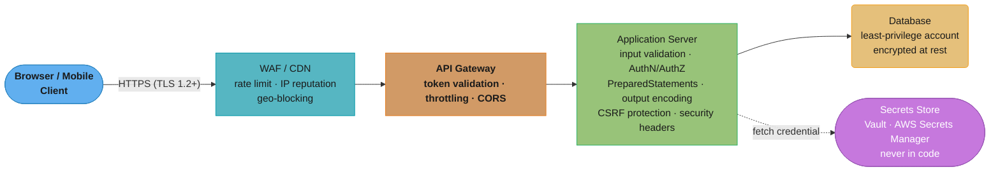
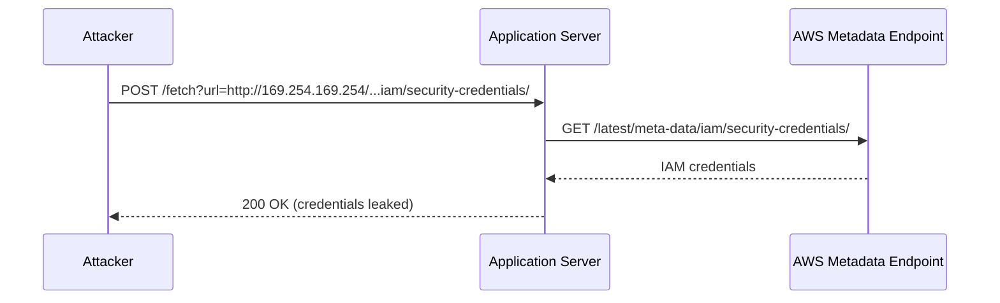
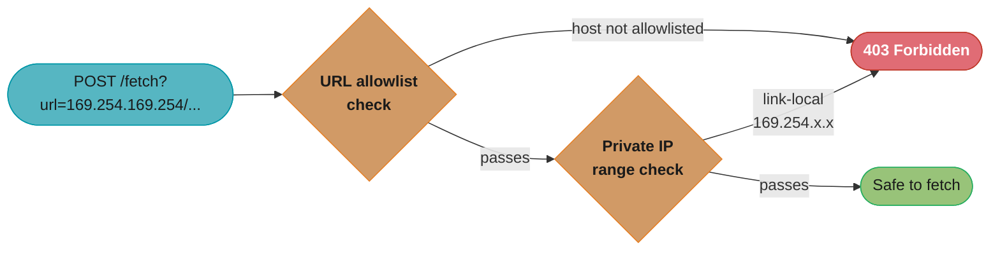
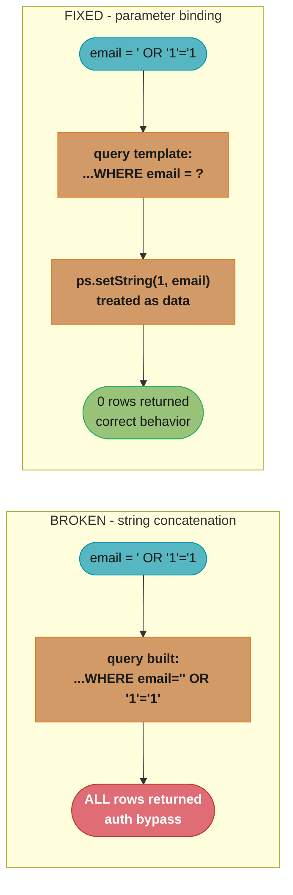
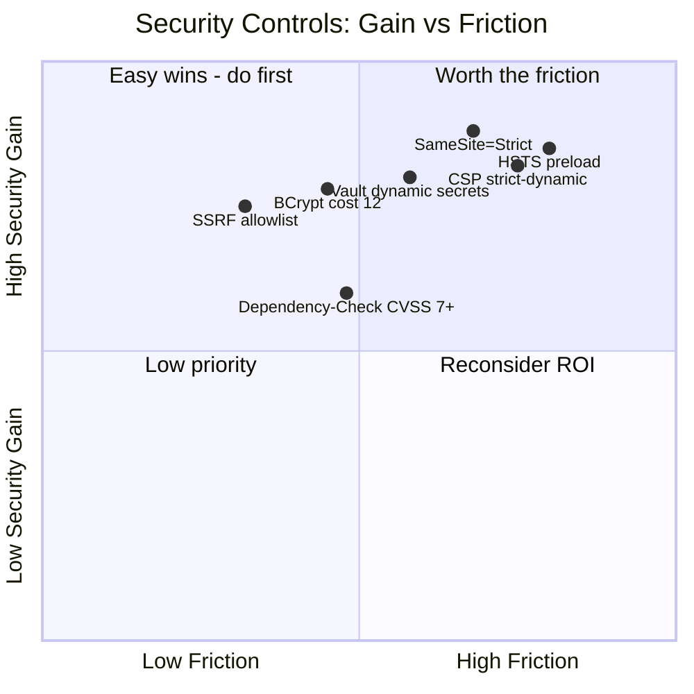
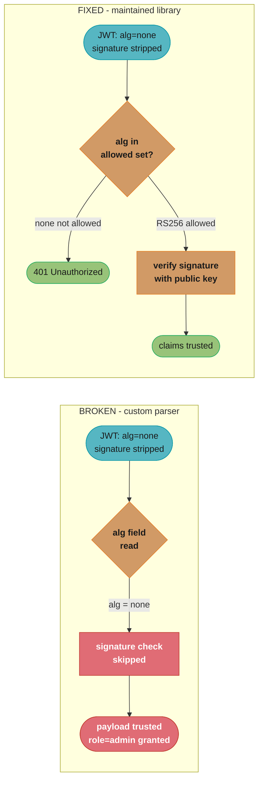
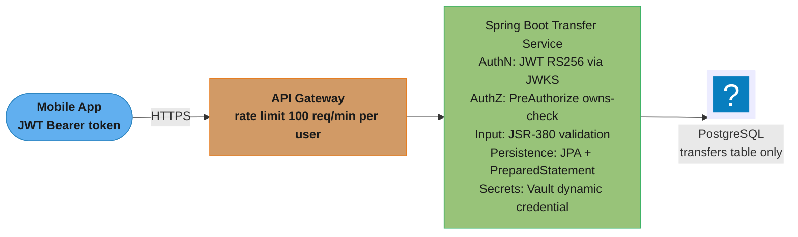

# Backend Security — OWASP Top 10 and Secure Coding

---

## 1. Concept Overview

The OWASP Top 10 is a consensus document published by the Open Worldwide Application Security Project that lists the ten most critical security risks for web applications. **The current edition is the OWASP Top 10:2025** — the eighth installment, which supersedes the widely quoted 2021 list. It keeps 2021's shift toward architectural and design-level failures, promotes configuration and supply-chain problems up the ranking, and folds SSRF into Broken Access Control. Backend security is not a single feature — it is a cross-cutting concern that spans every layer of an application: input handling, authentication, session management, data access, configuration, dependency management, secrets handling, and HTTP transport.

The ten categories in OWASP Top 10:2025 are:

| Rank | ID  | Category                                   | Where it was in 2021                              |
|------|-----|--------------------------------------------|---------------------------------------------------|
| 1    | A01 | Broken Access Control                      | A01 — now also absorbs A10 SSRF (CWE-918) and CSRF (CWE-352) |
| 2    | A02 | Security Misconfiguration                  | A05                                               |
| 3    | A03 | Software Supply Chain Failures             | A06 Vulnerable and Outdated Components, widened   |
| 4    | A04 | Cryptographic Failures                     | A02                                               |
| 5    | A05 | Injection                                  | A03                                               |
| 6    | A06 | Insecure Design                            | A04                                               |
| 7    | A07 | Authentication Failures                    | A07 Identification and Authentication Failures    |
| 8    | A08 | Software or Data Integrity Failures        | A08 Software and Data Integrity Failures          |
| 9    | A09 | Security Logging and Alerting Failures     | A09 Security Logging and Monitoring Failures      |
| 10   | A10 | Mishandling of Exceptional Conditions      | new in 2025 (CWE-209, CWE-476, CWE-636 "failing open") |

Every `A0x` label in the rest of this module is a **2025** ID. Interviewers still quote the 2021 numbering from memory, so the mapping column is worth knowing: the two traps are that Injection is no longer A03 and that SSRF no longer has a slot of its own.

---

## 2. Intuition

One-line analogy: security is not a door you add at the end — it is the material from which the entire building is constructed.

Mental model: think of each OWASP category as a class of attack vector. A01 (Broken Access Control) means users can reach resources they should not — and since 2025 it also covers SSRF, where the server itself becomes a weapon the attacker aims at internal services. A05 (Injection) means the application confuses user-supplied data with trusted commands. A10 (Mishandling of Exceptional Conditions) means the abnormal path — the error, the timeout, the missing parameter — leaks internals or fails open.

Why it matters: a single exploited vulnerability can expose every user record, allow privilege escalation to admin, or pivot into the internal network. The global average cost of a breach was $4.44 million, and the US average $10.22 million, in IBM's Cost of a Data Breach Report 2025 (the latest edition as of July 2026). Regulatory frameworks (PCI-DSS, HIPAA, GDPR) impose fines on top of that.

Key insight: most vulnerabilities are not exotic zero-days. They are well-understood, categorized, and preventable with known controls. The OWASP Top 10 exists precisely because these mistakes are made over and over in production.

---

## 3. Core Principles

Defense in depth: no single control is sufficient. Combine input validation, parameterized queries, output encoding, authentication, authorization, and monitoring.

Least privilege: every component — users, services, DB accounts, IAM roles — should have only the permissions it needs and nothing more.

Fail securely: when an error occurs, deny access by default. Do not expose stack traces or internal details to the client.

Shift left: security checks belong in development (SAST), CI pipelines (DAST, dependency scanning), and code review — not only in production monitoring.

Never trust input: treat every byte from an external source — HTTP parameters, headers, cookies, uploaded files, webhook payloads — as potentially malicious.

Keep secrets out of code: credentials, API keys, and certificates are not configuration in the twelve-factor sense. They require dedicated secret management (Vault, AWS Secrets Manager, GCP Secret Manager).

---

## 4. Types / Architectures / Strategies

### A01 — Broken Access Control

The most prevalent category: OWASP reports that 100% of applications in the 2025 dataset had some form of broken access control. Manifestations: insecure direct object reference (IDOR), missing function-level access control, CORS misconfiguration, privilege escalation (regular user calls admin endpoint), path traversal — plus, new in 2025, **SSRF (CWE-918)** and **CSRF (CWE-352)**, which OWASP folded into this category rather than giving SSRF its own slot.

Fix pattern: enforce authorization on every resource access server-side. Never rely on the client hiding a button. Use Spring Security method security (`@PreAuthorize`) or a dedicated policy engine (OPA).

**SSRF sub-case.** The server is tricked into making HTTP requests to attacker-controlled URLs, then used to scan internal networks, reach cloud metadata endpoints, and pivot to other services. On AWS the metadata endpoint is `169.254.169.254` (and `fd00:ec2::254` over IPv6); with IMDSv1 a plain `GET` to `/latest/meta-data/iam/security-credentials/` returns the instance role's credentials. AWS documents that instances accept **either IMDSv1 or IMDSv2 by default** — IMDSv2's session-token requirement only closes this path once you explicitly set `HttpTokens=required`.

Note on CORS: a permissive CORS policy is an access-control bug because it lets another origin *read* your responses. CORS is not itself an access control — it is a browser-enforced relaxation of the same-origin policy, so it protects nothing against a non-browser client (curl, a server-side proxy) and does not stop the request from reaching your server. Authorization must still be checked server-side on every request.

### A02 — Security Misconfiguration

Default credentials left active, debug endpoints exposed (`/actuator/env`, `/h2-console`), unnecessary features enabled, missing security headers, overly broad file-share and bucket ACLs, XXE via an unhardened XML parser (CWE-611). Moved up from #5 in 2021 to #2 in 2025; OWASP again found some form of misconfiguration in 100% of the applications tested.

### A03 — Software Supply Chain Failures

An expansion of 2021's "Vulnerable and Outdated Components" to the whole ecosystem: dependencies, build systems, and distribution infrastructure — so not just known-CVE libraries but also unmaintained components, compromised build steps, and typosquatted or confused package names. Log4Shell (CVE-2021-44228) was a critical RCE in Log4j used by thousands of production systems. Fix: software composition analysis (SCA) in CI — OWASP Dependency-Check, Snyk, Dependabot — plus an SBOM, pinned versions, and provenance verification (Sigstore/cosign) for what you build and ship.

### A04 — Cryptographic Failures

Transmitting or storing sensitive data without encryption. Weak algorithms (MD5, SHA-1 for passwords, DES, RC4). Hard-coded keys. Using ECB mode for symmetric encryption. Weak randomness for tokens and IDs (`java.util.Random` instead of `SecureRandom`) — the CWEs OWASP calls out most often in this category are PRNG failures.

Fix pattern: TLS 1.2+ for all transport. AES-256-GCM for symmetric encryption. RSA-2048 or EC-256 for asymmetric. Argon2id, scrypt, or BCrypt for passwords (never MD5/SHA for passwords). OWASP's Password Storage Cheat Sheet puts the BCrypt work factor at "as large as verification server performance will allow, with a **minimum of 10**"; cost 12 costs roughly 200 ms per hash on a current CPU — acceptable for login, and a large tax on offline cracking.

### A05 — Injection

SQL, LDAP, OS command, XML/XPath, expression language injection, and cross-site scripting (XSS). The attacker supplies data that is interpreted as a command. Injection fell from #3 (2021) to #5 (2025), but it still carries the largest number of CVEs of any category.

### A06 — Insecure Design

Missing threat modeling, no abuse case analysis, no rate limiting on sensitive flows (password reset, OTP), business logic flaws. Cannot be fixed by a patch — requires architectural redesign.

### A07 — Authentication Failures

Renamed in 2025 from "Identification and Authentication Failures". Weak passwords permitted, credential stuffing unmitigated, no MFA (or MFA that can be defeated by push-approval fatigue), session tokens not invalidated on logout, insecure "remember me" implementation, and **hard-coded credentials** (CWE-798, CWE-259).

### A08 — Software or Data Integrity Failures

Unsigned software updates, deserialization of untrusted data (Java ObjectInputStream), insecure CI/CD pipelines, unsigned container images. In 2025 this sits *below* A03: A03 is the supply chain as a whole, A08 is the failure to verify integrity at a specific trust boundary.

### A09 — Security Logging and Alerting Failures

Renamed in 2025 from "...Monitoring Failures" to stress that logging without alerting is near worthless. No audit log, no alerting on failed logins, sensitive data in logs (passwords, PAN, PII), logs stored where the attacker can tamper with them after compromise.

### A10 — Mishandling of Exceptional Conditions

New in 2025. The abnormal path is the unguarded one: error messages that leak internals (CWE-209), missing-parameter handling (CWE-234), null dereference (CWE-476), and **failing open** (CWE-636) — the auth filter that admits the request when the token service times out. Fix pattern: a single global error handler that returns a generic body, and explicit deny-on-error semantics in every security decision.

---

## 5. Architecture Diagrams

### Layered Security Controls


```mermaid
flowchart LR
    classDef io      fill:#61afef,stroke:#2e86c1,color:#1a1a1a,font-weight:bold
    classDef frozen  fill:#c678dd,stroke:#9b59b6,color:#fff
    classDef train   fill:#98c379,stroke:#27ae60,color:#1a1a1a
    classDef mathOp  fill:#d19a66,stroke:#e67e22,color:#1a1a1a,font-weight:bold
    classDef lossN   fill:#e06c75,stroke:#c0392b,color:#fff,font-weight:bold
    classDef req     fill:#56b6c2,stroke:#0097a7,color:#1a1a1a
    classDef base    fill:#e5c07b,stroke:#f39c12,color:#1a1a1a

    client(["Browser / Mobile<br/>Client"]) -->|"HTTPS (TLS 1.2+)"| waf["WAF / CDN<br/>rate limit · IP reputation<br/>geo-blocking"]
    waf --> gw["API Gateway<br/>token validation · throttling · CORS"]
    gw --> app["Application Server<br/>input validation · AuthN/AuthZ<br/>PreparedStatements · output encoding<br/>CSRF protection · security headers"]
    app --> db("Database<br/>least-privilege account<br/>encrypted at rest")
    app -.->|"fetch credential"| secrets(["Secrets Store<br/>Vault · AWS Secrets Manager<br/>never in code"])

    class client io
    class waf req
    class gw mathOp
    class app train
    class db base
    class secrets frozen
```

Each layer narrows what the previous layer lets through; the Application Server pulls its database credential from the Secrets Store at runtime instead of embedding it, so a server compromise alone does not leak a long-lived password.

### SSRF Attack Flow vs Prevention

**Attack — no prevention:**


```mermaid
sequenceDiagram
    participant A as Attacker
    participant S as Application Server
    participant M as AWS Metadata Endpoint

    A->>S: POST /fetch?url=http://169.254.169.254/...iam/security-credentials/
    S->>M: GET /latest/meta-data/iam/security-credentials/
    M-->>S: IAM credentials
    S-->>A: 200 OK (credentials leaked)
```

With no allowlist or IP check, the server blindly relays the caller's URL to the AWS metadata endpoint (169.254.169.254) and hands the IAM credentials straight back to the attacker — the Capital One 2019 breach (Section 7) followed this exact path.

**Prevention — defense in depth:**


```mermaid
flowchart LR
    classDef io      fill:#61afef,stroke:#2e86c1,color:#1a1a1a,font-weight:bold
    classDef frozen  fill:#c678dd,stroke:#9b59b6,color:#fff
    classDef train   fill:#98c379,stroke:#27ae60,color:#1a1a1a
    classDef mathOp  fill:#d19a66,stroke:#e67e22,color:#1a1a1a,font-weight:bold
    classDef lossN   fill:#e06c75,stroke:#c0392b,color:#fff,font-weight:bold
    classDef req     fill:#56b6c2,stroke:#0097a7,color:#1a1a1a
    classDef base    fill:#e5c07b,stroke:#f39c12,color:#1a1a1a

    reqIn(["POST /fetch?url=169.254.169.254/..."]) --> allow{"URL allowlist<br/>check"}
    allow -->|"host not allowlisted"| blocked(["403 Forbidden"])
    allow -->|"passes"| ipcheck{"Private IP<br/>range check"}
    ipcheck -->|"link-local<br/>169.254.x.x"| blocked
    ipcheck -->|"passes"| safe(["Safe to fetch"])

    class reqIn req
    class allow,ipcheck mathOp
    class blocked lossN
    class safe train
```

Two sequential gates — a hostname allowlist, then a private-IP-range check performed after DNS resolution — both reject the metadata-endpoint URL before any outbound fetch is attempted.

### SQL Injection — Broken vs Fixed


```mermaid
flowchart LR
    classDef io      fill:#61afef,stroke:#2e86c1,color:#1a1a1a,font-weight:bold
    classDef frozen  fill:#c678dd,stroke:#9b59b6,color:#fff
    classDef train   fill:#98c379,stroke:#27ae60,color:#1a1a1a
    classDef mathOp  fill:#d19a66,stroke:#e67e22,color:#1a1a1a,font-weight:bold
    classDef lossN   fill:#e06c75,stroke:#c0392b,color:#fff,font-weight:bold
    classDef req     fill:#56b6c2,stroke:#0097a7,color:#1a1a1a
    classDef base    fill:#e5c07b,stroke:#f39c12,color:#1a1a1a

    subgraph broken["BROKEN - string concatenation"]
        bIn(["email = ' OR '1'='1"]) --> bQuery["query built:<br/>...WHERE email='' OR '1'='1'"]
        bQuery --> bOut(["ALL rows returned<br/>auth bypass"])
    end

    subgraph fixed["FIXED - parameter binding"]
        fIn(["email = ' OR '1'='1"]) --> fQuery["query template:<br/>...WHERE email = ?"]
        fQuery --> fBind["ps.setString(1, email)<br/>treated as data"]
        fBind --> fOut(["0 rows returned<br/>correct behavior"])
    end

    class bIn,fIn req
    class bQuery,fQuery,fBind mathOp
    class bOut lossN
    class fOut train
```

The same attacker-supplied string becomes executable query syntax when concatenated (broken) but stays inert bound data when passed as a parameter (fixed) — the query structure itself never changes in the fixed path.

---

## 6. How It Works — Detailed Mechanics

### SQL Injection — Broken and Fixed

```java
// BROKEN: string concatenation — never do this
public User findByEmail(String email, Connection conn) throws SQLException {
    // Attacker input: email = "' OR '1'='1' --"
    // Resulting SQL: SELECT * FROM users WHERE email = '' OR '1'='1' --'
    String sql = "SELECT * FROM users WHERE email = '" + email + "'";
    Statement stmt = conn.createStatement();
    ResultSet rs = stmt.executeQuery(sql); // returns every row
    // ...
}

// FIX: PreparedStatement with parameter binding
public User findByEmail(String email, Connection conn) throws SQLException {
    String sql = "SELECT * FROM users WHERE email = ?";
    try (PreparedStatement ps = conn.prepareStatement(sql)) {
        ps.setString(1, email); // driver escapes the value; DB treats it as data
        try (ResultSet rs = ps.executeQuery()) {
            if (rs.next()) {
                return mapRow(rs);
            }
        }
    }
    return null;
}
```

### SSRF Prevention

```java
@Service
public class UrlFetchService {

    // Gate 1: only these hosts may be fetched at all
    private static final Set<String> ALLOWED_HOSTS = Set.of(
        "api.partner.com",
        "cdn.example.com"
    );

    public String fetch(String rawUrl) throws IOException {
        URI uri = URI.create(rawUrl);   // IllegalArgumentException on malformed input

        // Gate 0: scheme. Without this, file:, gopher:, ftp: and http: all get through.
        if (!"https".equalsIgnoreCase(uri.getScheme())) {
            throw new SecurityException("Only https is allowed");
        }

        // getHost() returns null for authority-less and some malformed URIs
        String host = uri.getHost();
        if (host == null || !ALLOWED_HOSTS.contains(host.toLowerCase(Locale.ROOT))) {
            throw new SecurityException("Host not in allowlist");
        }

        // Gate 2: resolve ONCE, and reject if ANY returned address is internal.
        // getByName() gives you only the first record; a name with both a public
        // and a private A record would slip through.
        InetAddress[] addrs = InetAddress.getAllByName(host);
        for (InetAddress a : addrs) {
            if (isInternal(a)) {
                throw new SecurityException("Resolved to internal address: " + a);
            }
        }

        // Gate 3: connect to the address that was just validated. Passing the
        // hostname back to the HTTP client lets it resolve a SECOND time, and
        // that second lookup is exactly what DNS rebinding targets. Pin it with a
        // custom DnsResolver (Apache HttpClient) or SocketFactory, and disable
        // redirect following - a 302 to 169.254.169.254 bypasses every gate above.
        return httpClient.get(uri, addrs[0]);   // NEVER httpClient.get(uri) alone
    }

    private static boolean isInternal(InetAddress a) {
        // JDK predicates: 0.0.0.0/::, 127.0.0.0/8 + ::1, 169.254.0.0/16 + fe80::/10
        // (the AWS IMDS address is link-local), RFC-1918, and multicast.
        if (a.isAnyLocalAddress() || a.isLoopbackAddress() || a.isLinkLocalAddress()
                || a.isSiteLocalAddress() || a.isMulticastAddress()) {
            return true;
        }
        // The JDK predicates do NOT cover these, so deny them explicitly:
        //   100.64.0.0/10  carrier-grade NAT
        //   fc00::/7       IPv6 unique-local (isSiteLocalAddress only checks fec0::/10,
        //                  so the IPv6 IMDS address fd00:ec2::254 is NOT caught by it)
        //   ::ffff:0:0/96  IPv4-mapped IPv6, a common allowlist bypass
        //   your own VPC / peered CIDRs
        return inCidr(a, "100.64.0.0/10") || inCidr(a, "fc00::/7")
                || (a instanceof Inet6Address v6 && isIPv4Mapped(v6));
    }
}
```

Three things make this a real fix rather than a decorative one. **Validate the scheme first** — an allowlist that only inspects the host lets `file:///etc/passwd` through. **Resolve once and check every returned address**, because `getByName` hands back only the first record. **Connect to the validated IP, not the hostname**: DNS rebinding works by having a name resolve to a public IP during the allowlist check and to an internal IP when the socket is actually opened, so any code path that re-resolves at connect time has already lost. Follow redirects manually and re-run all three gates on each hop, or turn redirects off. Where an egress proxy with an enforced allowlist is available, prefer it — it moves the control out of application code, where one missed call site cannot undo it.

### CSRF Protection with SameSite Cookies

```java
// Spring Security CSRF — enabled by default for stateful apps
@Configuration
@EnableWebSecurity
public class SecurityConfig {

    @Bean
    public SecurityFilterChain filterChain(HttpSecurity http) throws Exception {
        http
            // For REST APIs using JWT (stateless), CSRF can be disabled
            // For session-based apps, keep CSRF enabled
            .csrf(csrf -> csrf
                .csrfTokenRepository(CookieCsrfTokenRepository.withHttpOnlyFalse())
            )
            .sessionManagement(session -> session
                .sessionCreationPolicy(SessionCreationPolicy.IF_REQUIRED)
            );
        return http.build();
    }
}
```

```yaml
# application.yaml — set SameSite on session cookie
server:
  servlet:
    session:
      cookie:
        same-site: strict    # or lax; strict withholds the cookie on cross-site requests
        http-only: true      # not readable by JavaScript
        secure: true         # HTTPS only
```

SameSite=Strict: the cookie is sent only for requests originating from the same **site**, so a POST from `evil.com` carries no session cookie. Breaks OAuth2 redirect flows, because the return leg from the identity provider is also cross-site.
SameSite=Lax: the cookie is sent for same-site requests, plus cross-site requests that are *both* a top-level navigation *and* a safe method (GET/HEAD/OPTIONS/TRACE). This is the modern browser default when the attribute is omitted.

Two limits worth stating precisely, because both are routinely misremembered:

- **SameSite is site-scoped, not origin-scoped.** "Site" means the registrable domain, so `evil.example.com` is *same-site* with `app.example.com` — a cookie set with `SameSite=Strict` is still sent on requests that a hostile sibling subdomain originates. Conversely `app.example.com` -> `api.example.com` is cross-origin but same-site, which is why SameSite does not break that call.
- **SameSite is defense in depth, not a CSRF defense on its own.** OWASP's CSRF cheat sheet is explicit: "SameSite is useful as a defense-in-depth control but it does not replace a proper CSRF defense in most deployments." Lax blocks nothing if a state-changing operation is reachable by GET, and older or embedded browsers may not enforce the attribute at all. Keep the synchronizer token (or a signed double-submit token) as the primary control and treat SameSite as the second layer.

### Password Hashing with BCrypt

```java
// BCrypt cost factor 10 = ~55ms per hash  (2^10 rounds) — OWASP's stated minimum
// BCrypt cost factor 12 = ~210ms per hash (2^12 rounds) — a common production choice
// Timings measured single-threaded on one 2026 laptop core with a reference bcrypt
// implementation, NOT with this encoder on a server; re-measure on YOUR verification
// box and raise the cost until login latency, not the number, is what binds.
// Never store plaintext or MD5/SHA-1 hashes of passwords

import org.springframework.security.crypto.bcrypt.BCryptPasswordEncoder;

BCryptPasswordEncoder encoder = new BCryptPasswordEncoder(12); // strength=12

String hashed = encoder.encode(rawPassword);   // stored in DB
boolean matches = encoder.matches(rawPassword, hashed); // login check

// BCrypt output includes algorithm, cost, salt, hash — all in one string:
// $2a$12$<22-char-salt><31-char-hash>
// No need to store salt separately
```

**Put simply.** "The cost factor is an exponent, not a dial. Adding 1 doubles the work an attacker must do — and doubles your login time too. You are buying attacker-seconds with user-milliseconds, and the exchange rate is brutally in your favour."

This is the rare security control where a one-character config change buys a 2x defensive improvement, forever, with no code change. It is also why "bump the cost factor" is the standard response to faster hardware.

| Symbol | What it is |
|--------|------------|
| cost factor | The number after `$2a$` in the hash — `12` here. An exponent |
| `2^cost` | Key-derivation rounds actually executed. Cost 12 = 4,096 rounds |
| time per hash | Wall clock for one hash. Roughly doubles per `+1` of cost |
| logins/sec | `1 ÷ time per hash` on one core. Your *serving* cost, not the attacker's rate |

**Walk one example.** Cost 10 versus cost 12, measured single-threaded on one 2026 Apple Silicon laptop core using a reference bcrypt implementation. The *shape* — a doubling per `+1` of cost — is the fact; the absolute milliseconds are machine- and implementation-specific, and a server-class x86 core running Spring Security's own `BCryptPasswordEncoder` will land somewhere else:

```
  cost   2^cost rounds   time per hash   logins/sec on one core
  ----   -------------   -------------   ----------------------
    10           1,024         ~55 ms           18
    11           2,048        ~114 ms            8.8
    12           4,096        ~209 ms            4.8
    13           8,192        ~421 ms            2.4
    14          16,384        ~931 ms            1.1

  cost 10 -> 12 : rounds 1,024 -> 4,096  =  4x the work
                  login    55 ms -> 209 ms  = +154 ms, once, at sign-in
```

**Now put that beside the unsalted-SHA-256 alternative — on the attacker's hardware, not yours.** This is the comparison that matters, and it is easy to get wrong by pitting your server's single-core rate against a GPU. Both columns below are one NVIDIA RTX 5090 running hashcat, from Chick3nman's published v6.2.6-851 benchmark (mode 1400 SHA2-256 at 28,353.3 MH/s; mode 3200 bcrypt at 304.8 kH/s, which hashcat benchmarks at cost 5 = 32 iterations). The bcrypt figure is that result scaled linearly to cost 12's 4,096 iterations — bcrypt's cost is a straight iteration count, and the model checks out against community cost-10 runs on the same card reporting ~9,900 H/s where linear scaling predicts ~9,500:

```
  SHA-256, one RTX 5090        : 28,353,000,000 guesses/sec
  BCrypt cost 12, same GPU     :          2,381 guesses/sec
  ------------------------------------------------------------
  defensive ratio              : ~11,900,000x

  cracking an 8-char lowercase password (26^8 = 208.8 billion combinations):
    SHA-256 @ 28.353e9/sec : 208.8e9 / 28.353e9 =    7.4 seconds
    BCrypt  @ 2,381/sec    : 208.8e9 / 2,381    =    2.8 years
```

Note what the honest numbers say: cost 12 buys about seven orders of magnitude, but a *single consumer GPU* still grinds an 8-character lowercase password in under three years, and a hundred of them in about ten days. The work factor buys time for detection and rotation; it does not make a weak password safe. That is why OWASP now puts Argon2id ahead of BCrypt for new systems — its memory-hardness attacks the GPU advantage itself rather than just taxing it.

**Why the cost lives inside the hash string.** `$2a$12$...` carries its own cost factor, which is what makes upgrades possible at all: when you raise the application default from 10 to 12, existing cost-10 hashes still verify correctly (the verifier reads the cost from the stored string), and Spring Security's `DelegatingPasswordEncoder` re-hashes each user at their next successful login. Without that embedded parameter you would have to force a password reset on every account to change the cost — which is exactly the migration pain that traps teams still on a hardcoded, unversioned hashing scheme.

### Security Headers

```java
// Spring Security HTTP headers
http.headers(headers -> headers
    .httpStrictTransportSecurity(hsts -> hsts
        .maxAgeInSeconds(31536000)   // 1 year
        .includeSubDomains(true)
        .preload(true)
    )
    .contentTypeOptions(Customizer.withDefaults())  // X-Content-Type-Options: nosniff
    .frameOptions(frame -> frame.deny())            // X-Frame-Options: DENY
    .referrerPolicy(referrer -> referrer
        .policy(ReferrerPolicyHeaderWriter.ReferrerPolicy.STRICT_ORIGIN_WHEN_CROSS_ORIGIN)
    )
    .contentSecurityPolicy(csp -> csp
        .policyDirectives("default-src 'self'; script-src 'self'; "
            + "object-src 'none'; base-uri 'none'; frame-ancestors 'none'")
    )
);
```

Response headers that result:

```
Strict-Transport-Security: max-age=31536000; includeSubDomains; preload
X-Content-Type-Options: nosniff
X-Frame-Options: DENY
Referrer-Policy: strict-origin-when-cross-origin
Content-Security-Policy: default-src 'self'; script-src 'self'; object-src 'none';
                         base-uri 'none'; frame-ancestors 'none'
```

`object-src 'none'` and `base-uri 'none'` are not optional garnish — OWASP names both as required parts of a strong policy. Without `base-uri`, an injected `<base>` tag rewrites where every relative script URL resolves to, which defeats a nonce-based policy outright. `frame-ancestors 'none'` is the CSP replacement for `X-Frame-Options`; keep the older header alongside it only as a fallback for clients that ignore CSP. The `max-age=31536000` (one year) plus `includeSubDomains` plus `preload` combination is exactly what hstspreload.org requires for submission — do not emit `preload` until you mean it.

### Secret Management with Vault

```java
// spring-cloud-vault dependency
// application.yaml:
//   spring.cloud.vault.uri: https://vault.internal:8200
//   spring.cloud.vault.authentication: kubernetes
//   spring.cloud.vault.kv.enabled: true
//   spring.cloud.vault.kv.backend: secret
//   spring.cloud.vault.kv.application-name: my-service

@Configuration
public class DatabaseConfig {

    // Vault populates this from secret/my-service — never in application.yaml
    @Value("${spring.datasource.password}")
    private String dbPassword;

    // For dynamic secrets: Vault generates a short-lived DB credential
    // and auto-renews the lease. When the service restarts, a new credential
    // is issued. Old credentials expire at the end of their lease — set the
    // role's TTL explicitly (an hour or less); Vault's built-in default_lease_ttl
    // is 768h, which is far too long to limit blast radius.
}
```

Rules for secrets:
- Never commit secrets to source control. Add `.env` and `*.key` files to `.gitignore`.
- Never log secrets. Use `@JsonIgnore` on password fields. Mask values in configuration logging.
- Never pass secrets as CLI arguments (visible in `ps aux`). Use environment variables or file mounts.
- Rotate secrets regularly. Vault dynamic secrets do this automatically.

### Dependency Scanning

```xml
<!-- pom.xml — OWASP Dependency-Check Maven plugin -->
<plugin>
    <groupId>org.owasp</groupId>
    <artifactId>dependency-check-maven</artifactId>
    <version>12.2.2</version>
    <configuration>
        <failBuildOnCVSS>7</failBuildOnCVSS>  <!-- fail on CVSS >= 7.0 (High) -->
        <suppressionFile>owasp-suppressions.xml</suppressionFile>
    </configuration>
    <executions>
        <execution>
            <goals>
                <goal>check</goal>
            </goals>
        </execution>
    </executions>
</plugin>
```

```bash
# Run standalone
mvn dependency-check:check

# Produces: target/dependency-check-report.html
# Lists CVE IDs, CVSS scores, affected artifacts
```

---

## 7. Real-World Examples

**Equifax (2017) — A03 + A09:** Apache Struts CVE-2017-5638 was disclosed and patched on 7 March 2017. Equifax did not apply the patch, and a scan on 15 March failed to find the vulnerable host. Attackers reached personal data from 13 May 2017 and, per the House Oversight Committee's report, remained undetected for **76 days** until 30 July. The FTC settlement puts the exposure at 147 million people. The failure was a combination of an unpatched component (A03 in the 2025 numbering) and inadequate monitoring and alerting (A09).

**Capital One (2019) — A01 (SSRF) + A02:** A misconfigured WAF allowed a former AWS employee to exploit an SSRF vulnerability in a self-hosted proxy. The proxy fetched the AWS EC2 metadata endpoint (169.254.169.254), returning the IAM role credentials attached to the instance. Those credentials had overly broad S3 permissions. Data on roughly 100 million individuals in the United States and about 6 million in Canada was taken — largely credit-card application records. The attacker was convicted of wire fraud and CFAA violations; Capital One paid an $80 million regulatory penalty and a $190 million class settlement.

**Log4Shell (2021) — A03 + A05:** CVE-2021-44228 in Log4j allowed unauthenticated remote code execution through JNDI lookup in log messages. Any application that logged a user-supplied string (such as the HTTP User-Agent header) was vulnerable. Mass scanning and exploitation began within days of disclosure; the number of systems actually compromised was never established, and figures quoted for it are estimates rather than measurements.

**Uber (2022) — A07 + A02:** An attacker bought an Uber contractor's corporate password on the dark web (the contractor's personal device had been infected with malware) and then defeated two-factor authentication by **repeated push-approval prompts** until the contractor accepted one — Uber's own incident write-up describes exactly this sequence. Note that MFA *was* enforced; it was worn down, not absent. What happened next is the part to treat carefully: vendor analyses agree that the attacker then found a PowerShell script on an over-permissive internal network share containing hard-coded admin credentials for Uber's privileged-access-management system, which unlocked further internal tooling — but that mechanism appears in *no* primary document. Uber's own write-up does not describe it, and neither does the Cyber Safety Review Board's Lapsus$ report. Take it as the consensus reconstruction, not an established fact. Root cause pattern: hard-coded credentials (CWE-798, A07), a share ACL that was far too broad (A02), and MFA that could be satisfied by a tired human tapping "approve" — the argument for number-matching or phishing-resistant factors.

---

## 8. Tradeoffs

| Control                     | Security Gain                         | Cost / Friction                              |
|-----------------------------|---------------------------------------|----------------------------------------------|
| BCrypt cost factor 12       | ~200ms/hash taxes offline cracking    | Slower login; needs async path or caching    |
| SameSite=Strict cookies     | Blocks cross-site cookie send; layer 2 | Breaks OAuth2 redirects; no token replacement |
| CSP strict-dynamic          | Prevents XSS script injection         | Complex policy; inline scripts break         |
| Vault dynamic DB secrets    | Credentials expire; breach limited    | More infra; lease renewal complexity         |
| SSRF allowlist              | Prevents internal recon              | Any new external dependency needs updating   |
| Dependency-Check CVSS>=7    | Catches high-severity CVEs in CI      | False positives; maintenance overhead        |
| HSTS preload                | Eliminates SSL stripping attacks      | Irreversible; hard to undo if you leave HTTPS |


```mermaid
quadrantChart
    title Security Controls: Gain vs Friction
    x-axis Low Friction --> High Friction
    y-axis Low Security Gain --> High Security Gain
    quadrant-1 Worth the friction
    quadrant-2 Easy wins - do first
    quadrant-3 Low priority
    quadrant-4 Reconsider ROI
    "BCrypt cost 12": [0.45, 0.78]
    "SameSite=Strict": [0.68, 0.88]
    "CSP strict-dynamic": [0.75, 0.82]
    "Vault dynamic secrets": [0.58, 0.80]
    "SSRF allowlist": [0.32, 0.75]
    "Dependency-Check CVSS 7+": [0.48, 0.60]
    "HSTS preload": [0.80, 0.85]
```

Positions come directly from the Security Gain and Cost / Friction columns above — BCrypt and the SSRF allowlist sit upper-left as low-friction wins, while HSTS preload and CSP strict-dynamic sit upper-right because their payoff is high but so is the cost of getting the rollout wrong.

---

## 9. When to Use / When NOT to Use

**When to enforce all OWASP controls:** any application that processes personal data, financial data, health data, or is internet-facing. That is essentially every production backend.

**When to relax specific controls:**
- Disable CSRF only for stateless REST APIs that use JWT in an `Authorization` header (no session cookie). If you use cookie-based sessions even for API clients, CSRF applies.
- Allow SameSite=Lax instead of Strict when your app participates in OAuth2 flows or third-party SSO — but keep the CSRF token either way; SameSite is the second layer, not the first.
- Skip bcrypt for API token hashing — use SHA-256-HMAC with a pepper instead. BCrypt is for password hashing where you cannot control the input space; a 256-bit random token has no input space to brute-force.

**When NOT to use MD5/SHA-1 for passwords:** never. MD5/SHA-1 are broken for password storage. Even with salting, a single RTX 5090 tests roughly 220 billion MD5 hashes per second in published hashcat benchmarks, so a salt only forces the attacker to crack accounts one at a time rather than all at once. BCrypt and Argon2id are designed to be slow.

**When NOT to skip dependency scanning:** never in CI for production services. Suppressions are acceptable for false positives after documented review; suppressing all CVEs is not acceptable.

---

## 10. Common Pitfalls

**Pitfall 1 — IDOR in REST APIs (A01 Broken Access Control):** An e-commerce platform allowed `GET /orders/{orderId}` without checking that the authenticated user owned that order. Attackers enumerated sequential order IDs, exposing all customers' order history. Fix: server-side ownership check on every resource access, regardless of how the ID was obtained.

**Pitfall 2 — Secrets committed to Git (A04 + A07):** *Illustrative composite, not a specific public incident.* A team commits AWS credentials in `application.properties` to a public GitHub repo. Secret scanning notifies them, but automated harvesters continuously crawl new public commits and typically reach a leaked key long before a human reads the alert; the keys are then used to spin up compute for cryptocurrency mining. The load-bearing point is not any particular timing figure — it is that a secret pushed to a public repo must be treated as compromised from the moment of the push, so the response is *rotate first*, then clean history. Fix: pre-commit hooks using `git-secrets` or `detect-secrets`, plus git history scanning.

**Pitfall 3 — Verbose error messages expose internals (A10):** An API returned `org.postgresql.util.PSQLException: ERROR: relation "users" does not exist` in a JSON error response. This confirms the database type, table name, and ORM. Fix: catch all exceptions at a global handler, log internally, return only generic error codes to the client.

**Pitfall 4 — alg:none JWT attack (A07 Authentication Failures):** A team implemented their own JWT parser. The attacker removed the signature, changed the header to `{"alg":"none"}`, and modified the payload to gain admin role. The custom parser accepted it because it only checked the algorithm after validating the signature was "present." Fix: always use a maintained JWT library. Specify the exact allowed algorithms; never accept `none` or `HS256` when the system is configured for `RS256`.


```mermaid
flowchart LR
    classDef io      fill:#61afef,stroke:#2e86c1,color:#1a1a1a,font-weight:bold
    classDef frozen  fill:#c678dd,stroke:#9b59b6,color:#fff
    classDef train   fill:#98c379,stroke:#27ae60,color:#1a1a1a
    classDef mathOp  fill:#d19a66,stroke:#e67e22,color:#1a1a1a,font-weight:bold
    classDef lossN   fill:#e06c75,stroke:#c0392b,color:#fff,font-weight:bold
    classDef req     fill:#56b6c2,stroke:#0097a7,color:#1a1a1a
    classDef base    fill:#e5c07b,stroke:#f39c12,color:#1a1a1a

    subgraph broken["BROKEN - custom parser"]
        bJwt(["JWT: alg=none<br/>signature stripped"]) --> bCheck{"alg field<br/>read"}
        bCheck -->|"alg = none"| bAccept["signature check<br/>skipped"]
        bAccept --> bAdmin(["payload trusted<br/>role=admin granted"])
    end

    subgraph fixed["FIXED - maintained library"]
        fJwt(["JWT: alg=none<br/>signature stripped"]) --> fAllow{"alg in<br/>allowed set?"}
        fAllow -->|"none not allowed"| fReject(["401 Unauthorized"])
        fAllow -->|"RS256 allowed"| fVerify["verify signature<br/>with public key"]
        fVerify --> fOk(["claims trusted"])
    end

    class bJwt,fJwt req
    class bCheck,fAllow mathOp
    class bAccept,bAdmin lossN
    class fReject train
    class fVerify mathOp
    class fOk train
```

The broken parser reads `alg` from the untrusted header and treats `none` as already verified; the fixed path checks the algorithm against an explicit allow-list before attempting verification at all, so a stripped signature is rejected outright rather than silently accepted.

**Pitfall 5 — SSRF via DNS rebinding:** An application validated the hostname against an allowlist before resolving DNS, but performed the actual HTTP request after a separate DNS resolution. An attacker set up a domain with a 0-second TTL: the first lookup returned a valid public IP (passed the allowlist check), and the second lookup returned an internal IP (used for the actual connection). Fix: resolve DNS once, validate the IP, then use the IP directly for the connection.

**Pitfall 6 — Log injection:** A logging statement `log.info("User logged in: " + username)` was exploited by an attacker who set their username to `admin\nINFO: User logged in: admin`. This injected a fake log entry. In more severe cases, if the logging system supports JNDI lookups (Log4Shell), this becomes RCE. Fix: structured logging with parameterized log statements (`log.info("User logged in: {}", username)`), never string concatenation.

---

## 11. Technologies and Tools

| Tool / Library                        | Purpose                                              |
|---------------------------------------|------------------------------------------------------|
| Spring Security 7.x                   | AuthN/AuthZ, CSRF, security headers, method security |
| OWASP Dependency-Check (Maven plugin) | SCA — finds CVEs in direct and transitive deps       |
| Snyk                                  | SCA with developer-friendly fix suggestions          |
| Dependabot (GitHub)                   | Automated dependency update PRs                      |
| HashiCorp Vault                       | Secret management, dynamic credentials, PKI          |
| AWS Secrets Manager                   | Managed secret rotation for AWS-hosted apps          |
| Trivy (Aqua Security)                 | Container image vulnerability scanning               |
| SonarQube / SonarCloud                | SAST — detects SQL injection, XSS, insecure patterns |
| OWASP ZAP / Burp Suite                | DAST — dynamic scanning of running application       |
| detect-secrets (Yelp)                 | Pre-commit secret detection in code                  |
| Helmet.js (for Node backends)         | Security headers middleware                          |
| BCryptPasswordEncoder (Spring)        | Password hashing with configurable cost factor       |
| ModSecurity / AWS WAF                 | Web Application Firewall — block common attack patterns |

---

## 12. Interview Questions with Answers

**Q: What is the difference between authentication and authorization, and how does OWASP A01 relate?**
**Short:** Authentication verifies identity while authorization verifies permissions; OWASP A01 covers authorization failures like IDOR.

Authentication verifies identity — who you are. Authorization verifies what you are allowed to do. A01 (Broken Access Control) specifically covers authorization failures: a user is authenticated but can access resources or perform actions beyond their permitted scope. Examples include IDOR, privilege escalation via URL manipulation, and missing function-level access checks. In the 2025 edition A01 also absorbed SSRF and CSRF, on the reasoning that both are the application acting outside its intended authority; authentication failures live separately in A07.

**Q: Explain SQL injection with an example and give two prevention strategies.**
**Short:** SQL injection lets user input alter query logic; prevent it with parameterized queries or an ORM, never string concatenation.

SQL injection occurs when user-supplied input is concatenated into an SQL query, allowing the attacker to alter the query's logic. Example: `SELECT * FROM users WHERE name = '' OR '1'='1'` returns all rows when the attacker supplies `' OR '1'='1`. Prevention: (1) use PreparedStatement with parameter binding — the driver escapes input so it is treated as data, not syntax; (2) use an ORM like Hibernate that uses parameterized queries by default. Input validation as a secondary control (allowlist characters) but never as the primary defense.

**Q: What is SSRF and how do you prevent it?**
**Short:** SSRF tricks a server into fetching attacker-chosen URLs; prevent it with host allowlists and validation of the resolved IP.

SSRF (Server-Side Request Forgery) occurs when an attacker controls a URL that the server fetches, allowing requests to internal services, cloud metadata endpoints (169.254.169.254), or other restricted targets. In OWASP Top 10:2025 it no longer has its own slot — it was folded into A01 Broken Access Control as CWE-918. Prevention: (1) restrict the scheme to https before anything else; (2) allowlist of permitted target hosts; (3) resolve DNS once and reject if any returned address is private, link-local or loopback; (4) connect to that validated IP rather than re-resolving the hostname, which is what defeats DNS rebinding; (5) disable redirect following, or re-run every check on each hop; (6) use an egress proxy with an enforced allowlist; (7) set `HttpTokens=required` so the instance enforces IMDSv2, since AWS accepts IMDSv1 or IMDSv2 by default and only IMDSv2's session token stops a plain GET.

**Q: Why should you use BCrypt for password hashing rather than SHA-256?**
**Short:** BCrypt is deliberately slow and memory-hard, resisting GPU brute force far better than the fast general-purpose SHA-256 hash.

SHA-256 is a fast cryptographic hash designed for high throughput, so a single modern GPU tests tens of billions of candidates per second and brute force becomes cheap. Published hashcat benchmarks put one RTX 5090 at roughly 28 billion SHA-256 hashes/sec versus about 2,400/sec against bcrypt at cost 12 — a factor of ten million. BCrypt is a deliberately slow adaptive hash: cost factor 12 means 2^12 = 4,096 rounds, roughly 200ms per hash on a current CPU. It resists GPUs because each instance needs about 4KB of constantly-rewritten Blowfish state, which thrashes the small per-core memory a GPU gives each thread; it is memory-access-bound, not merely iterated. As hardware improves, increase the cost factor. OWASP's Password Storage Cheat Sheet sets the minimum work factor at 10 and now recommends Argon2id (m=19MiB, t=2, p=1 minimum) first for new systems, with bcrypt as an acceptable alternative — note also that bcrypt truncates input at 72 bytes.

**Q: What is the alg:none attack on JWT and how do you prevent it?**
**Short:** The alg:none attack strips a JWT's signature so an unpinned verifier accepts a forged token with no real check.

JWT headers contain an `alg` field. If a server accepts `alg: none`, an attacker can remove the signature, set `alg` to `none`, and modify claims (e.g., elevate role to admin). The server verifies a "signature" that is an empty string — which always passes. Prevention: when decoding a JWT, explicitly specify the expected algorithm(s) rather than reading it from the token header. Libraries like `java-jwt` and `nimbus-jose-jwt` accept an algorithm parameter; never use overloads that accept any algorithm.

**Q: Explain CSRF and two ways to prevent it.**
**Short:** CSRF forges a state-changing request from an authenticated user's browser; prevent it with a synchronizer token, not SameSite alone.

CSRF (Cross-Site Request Forgery) tricks an authenticated user's browser into submitting a state-changing request to a site where the user is logged in, without the user's knowledge. Since the browser automatically includes cookies, the server cannot distinguish the legitimate user from the attacker's forged request. Prevention, in priority order: (1) a CSRF synchronizer token — a random per-session token included in every state-changing request and verified server-side — or a signed double-submit token if you need to stay stateless; (2) the SameSite cookie attribute as defense in depth. Note that SameSite compares *sites* (registrable domains), not origins, so a hostile sibling subdomain is still same-site, and Lax stops nothing if a state-changing operation is reachable by GET — OWASP is explicit that SameSite does not replace a proper CSRF defense. For REST APIs using Bearer token authentication (no cookies), CSRF is not applicable.

**Q: What is the difference between SAST and DAST?**
**Short:** SAST analyzes source code without running it, while DAST attacks a running application's live HTTP endpoints.

SAST (Static Application Security Testing) analyzes source code or bytecode without executing the application. It runs in the IDE or CI pipeline against code at rest — detects SQL injection patterns, hardcoded secrets, insecure API usage. Examples: SonarQube, Semgrep. DAST (Dynamic Application Security Testing) tests a running application by sending attack payloads to HTTP endpoints. It finds runtime issues that SAST cannot — authentication bypasses, server-side logic flaws, misconfigured headers. Examples: OWASP ZAP, Burp Suite. Best practice: both in CI, with SAST on every commit and DAST on the deployed staging environment.

**Q: How would you manage secrets in a Spring Boot microservice deployed to Kubernetes?**
**Short:** Manage secrets with a dedicated secrets manager like Vault or AWS Secrets Manager, never baked into images or env vars.

Mount secrets from a dedicated secrets manager — not from environment variables baked into container images. Options: (1) HashiCorp Vault with the Vault Agent Injector — injects secrets as files into the pod at startup; Spring Cloud Vault reads them via `spring.cloud.vault.kv`; (2) AWS Secrets Manager with AWS Secrets and Configuration Provider — mounts secrets as files via a CSI driver; (3) Kubernetes Secrets (encrypted at rest with KMS) — use External Secrets Operator to sync from Vault or AWS SM. Never hardcode secrets in `application.properties` and never log them. Heap dumps are a real leak path and there is no JVM flag that masks values inside one — the controls that work are turning off `-XX:+HeapDumpOnOutOfMemoryError` in production (or writing dumps to a restricted, access-audited path), holding secrets in `char[]`/`byte[]` you overwrite after use rather than in interned `String`s, and keeping short-lived dynamic credentials so a captured dump ages out fast.

**Q: What is dependency confusion / supply chain attack and how do you defend against it?**
**Short:** Dependency confusion tricks a build into pulling a higher-versioned public package instead of an internal one of the same name.

In a dependency confusion attack, an attacker publishes a malicious package to a public registry (npm, PyPI, Maven Central) with the same name as an internal private package, but a higher version number. Build tools that check public registries first download the malicious package. Defense: (1) pin exact versions and verify checksums; (2) use a private artifact proxy (Nexus, Artifactory) configured to prefer internal packages; (3) publish namespace-protected packages in the public registry to claim the name; (4) use Sigstore/cosign to verify artifact provenance.

**Q: Explain Content Security Policy (CSP) and when it mitigates XSS.**
**Short:** CSP restricts which script and resource sources a browser will load, mitigating XSS when configured without unsafe-inline.

CSP is an HTTP response header that specifies which sources the browser is allowed to load scripts, styles, images, and other resources from. `Content-Security-Policy: default-src 'self'; script-src 'self'` tells the browser to only execute scripts loaded from the same origin — even if an attacker injects `<script src="https://evil.com/steal.js">`, the browser refuses to load it. Because `unsafe-inline` is absent, that same policy also blocks inline `<script>` blocks and inline event handlers such as `<button onclick="...">`; adding `unsafe-inline` is what re-opens them, which is why it is the single directive value never to ship. CSP mitigates reflected, stored and some DOM XSS, but an allowlist policy is bypassable: `script-src 'self'` still trusts anything served from your own origin, so a JSONP endpoint, an open file-upload path, or an injected `<base>` tag can all get attacker-controlled script executed. Hence OWASP's current guidance is a strict policy — per-response nonces (or hashes) plus `strict-dynamic`, with `object-src 'none'`, `base-uri 'none'` and `frame-ancestors` — rather than a host allowlist.

**Q: What is the principle of least privilege and give three concrete examples in a backend system?**
**Short:** Least privilege limits every component to only the permissions its function requires, containing a compromise's blast radius.

Least privilege means every entity operates with only the minimum permissions required for its function. Examples: (1) Database account for the user-service has SELECT/INSERT/UPDATE on the `users` table only — not DROP, not access to other schemas; (2) IAM role for an EC2 instance running the payments service has GetSecret on the specific Secrets Manager ARN, not `secretsmanager:*`; (3) Kubernetes service account has get/list on its own ConfigMap only, not cluster-wide access. When a component is compromised, least privilege limits the blast radius to what that component actually needed.

**Q: How do you prevent log injection attacks?**
**Short:** Log injection forges log entries from unsanitized input; prevent it with parameterized logging and structured JSON logs.

Log injection occurs when unsanitized user input is logged and the logging system reads special characters as log delimiters, letting the attacker forge entries. In Log4j's case the injected text was instead read as a JNDI lookup expression, which escalated the same bug to remote code execution. Prevention: (1) use parameterized logging — `log.info("User: {}", username)` instead of `log.info("User: " + username)`; (2) sanitize newline characters from input before logging (`\n`, `\r`, `%0a`, `%0d`); (3) use a JSON-structured logging format so there is no line-delimiter concept; (4) run a current Log4j 2.x release (2.26.x) — message lookups are gone from the layout and JNDI is disabled unless explicitly enabled, both since 2.16.0, which is the release that fixed CVE-2021-45046 after 2.15.0's fix proved incomplete.

**Q: What are the risks of verbose error messages and how do you handle errors securely?**
**Short:** Verbose error messages leak stack traces and internals to attackers; return only a generic error and a correlation ID instead.

Verbose error messages expose stack traces, class names, DB table names, SQL queries, framework versions, and internal hostnames — all of which aid an attacker during reconnaissance. Secure error handling: (1) catch all unhandled exceptions at a global handler (`@ControllerAdvice` with `@ExceptionHandler(Exception.class)`); (2) log the full stack trace internally with a correlation ID; (3) return only a generic error code and the correlation ID to the client (`{"error":"INTERNAL_ERROR","traceId":"abc123"}`); (4) never return raw exception messages or stack traces in API responses; (5) configure Spring to disable the `/error` Whitelabel Error Page in production.

**Q: What is HTTP Strict Transport Security (HSTS) and what is HSTS preloading?**
**Short:** HSTS forces browsers to use HTTPS for a domain, and preloading extends that protection to even the very first visit.

HSTS tells browsers to only access the site over HTTPS for a specified duration. The header `Strict-Transport-Security: max-age=31536000; includeSubDomains` means: for the next year, never send HTTP requests to this domain or any subdomain — upgrade them to HTTPS automatically. HSTS preloading goes further: the domain is submitted to a browser-maintained list (hstspreload.org) that is shipped with Chrome, Firefox, and Safari. Even on first visit (before the HSTS header is received), the browser uses HTTPS. This eliminates the first-connection vulnerability. Warning: preloading is very difficult to undo — all subdomains must support HTTPS before submitting.

**Q: Describe a security review checklist for a new REST API endpoint.**
**Short:** A REST endpoint review checks authentication, authorization, input validation, parameterized queries, and rate limiting together.

(1) Authentication: is a valid token required? (2) Authorization: does server-side code verify the caller owns the resource? (3) Input validation: are all parameters validated for type, length, format, and range before use? (4) Parameterized queries: no string concatenation in SQL? (5) Output encoding: are responses correctly encoded to prevent XSS if rendered in a browser? (6) Rate limiting: is there a per-user or per-IP rate limit to prevent brute force or abuse? (7) Sensitive data: does the response include fields the caller should not see (PII, hashed passwords, internal IDs)? (8) Error handling: do errors return generic messages? (9) Logging: is there an audit log entry for sensitive actions? (10) SSRF: if this endpoint fetches external URLs, is there an allowlist?

---

## 13. Best Practices

- Treat security as a first-class NFR (non-functional requirement), not a post-launch phase.
- Enforce TLS everywhere — between all services, not just at the edge. Mutual TLS (mTLS) for service-to-service communication in zero-trust networks.
- Run OWASP Dependency-Check in CI with `failBuildOnCVSS=7`. Schedule a full scan nightly to catch newly published CVEs against existing dependencies.
- Store passwords with BCrypt at cost factor 12. Use Argon2id for new systems. Never use MD5, SHA-1, or SHA-256 alone for password storage.
- Rotate all secrets. Vault dynamic secrets are ideal — they auto-expire, limiting the blast radius of a credential leak.
- Add security headers on every response: HSTS, CSP, X-Content-Type-Options, X-Frame-Options, Referrer-Policy. Verify with securityheaders.com.
- Log security events: authentication success/failure, authorization denial, admin actions, password changes. Never log passwords, tokens, or PAN data. Store logs in a write-once, append-only sink that application code cannot modify.
- Scan container images for CVEs as part of the CI/CD pipeline (Trivy, Grype, Snyk Container).
- Perform threat modeling (STRIDE or PASTA) for new features before development begins — not after. Identify trust boundaries, entry points, and data flows.
- Run automated DAST (OWASP ZAP baseline scan) against the staging environment in CI to catch injection points and misconfigured headers.
- Keep a software bill of materials (SBOM) in CycloneDX or SPDX format; use it to quickly identify affected services when a new CVE is published.

---

## 14. Case Study

### Securing a Financial Transaction API Against OWASP Top 10

**Scenario:** A fintech startup launches a REST API for internal bank transfers. The API accepts `POST /transfers` with `{fromAccountId, toAccountId, amount}` and is exposed to mobile clients over the internet. The team must address OWASP Top 10 before going live.

**Threat Model:**


```mermaid
flowchart LR
    classDef io      fill:#61afef,stroke:#2e86c1,color:#1a1a1a,font-weight:bold
    classDef frozen  fill:#c678dd,stroke:#9b59b6,color:#fff
    classDef train   fill:#98c379,stroke:#27ae60,color:#1a1a1a
    classDef mathOp  fill:#d19a66,stroke:#e67e22,color:#1a1a1a,font-weight:bold
    classDef lossN   fill:#e06c75,stroke:#c0392b,color:#fff,font-weight:bold
    classDef req     fill:#56b6c2,stroke:#0097a7,color:#1a1a1a
    classDef base    fill:#e5c07b,stroke:#f39c12,color:#1a1a1a

    app(["Mobile App<br/>JWT Bearer token"]) -->|"HTTPS"| gw["API Gateway<br/>rate limit 100 req/min per user"]
    gw --> svc["Spring Boot Transfer Service<br/>AuthN: JWT RS256 via JWKS<br/>AuthZ: PreAuthorize owns-check<br/>Input: JSR-380 validation<br/>Persistence: JPA + PreparedStatement<br/>Secrets: Vault dynamic credential"]
    svc --> db
    db@{ icon: "logos:postgresql", form: "square", label: "PostgreSQL<br/>transfers table only", pos: "b", h: 44 }

    class app io
    class gw mathOp
    class svc train
```

Every hop narrows trust: the gateway throttles per user, the transfer service re-derives the caller's identity from the validated JWT rather than a client-supplied field, and the database account can only INSERT/UPDATE its own table.

**Controls Implemented:**

A01 — Broken Access Control (including the SSRF sub-case): every transfer checks server-side that the JWT subject owns `fromAccountId`. No client-supplied `userId` parameter — the authenticated identity is extracted from the token only. On the SSRF side, the service fetches no user-supplied URLs at all; outbound HTTP goes only to the Vault agent (`localhost:8200`) and the bank's internal settlement service over a service mesh with mTLS.

```java
@PostMapping("/transfers")
@PreAuthorize("@accountAuthorizationService.isOwner(authentication, #request.fromAccountId())")
public ResponseEntity<TransferResponse> createTransfer(
        @Valid @RequestBody TransferRequest request,
        Authentication authentication) {
    // fromAccountId ownership is verified by @PreAuthorize before this method executes
    return ResponseEntity.ok(transferService.execute(request));
}
```

A04 — Cryptographic Failures: all traffic is TLS 1.3. Storage is encrypted at rest with RDS encryption, which AWS documents as AES-256 under a KMS key (the storage-layer mode is AWS's to choose — do not claim GCM for it). The JWT uses RS256; the private key is in Vault PKI.

A05 — Injection: Spring Data JPA generates parameterized queries. No `@Query` with string interpolation. Custom queries use `@Query` with named parameters only.

```java
@Query("SELECT t FROM Transfer t WHERE t.accountId = :accountId AND t.userId = :userId")
List<Transfer> findByAccountAndUser(@Param("accountId") Long accountId, @Param("userId") Long userId);
```

A02 — Security Misconfiguration: Spring Boot Actuator `/health` endpoint is exposed; all others are restricted to an internal management port.

A03 — Software Supply Chain: `dependency-check-maven` runs in CI. Snyk monitors the repo for new CVEs. A Dependabot configuration auto-raises PRs for patch-version upgrades weekly. A CycloneDX SBOM is published with every build so a new CVE can be traced to affected services in minutes.

A10 — Mishandling of Exceptional Conditions: `server.error.include-stacktrace=never` in the production profile, a single `@ControllerAdvice` returning `{"error":...,"traceId":...}`, and — the part teams forget — every security filter fails *closed*: if the JWKS endpoint is unreachable, the request is rejected rather than admitted.

A09 — Logging and Alerting Failures: every transfer creates an audit log entry (correlationId, userId, fromAccountId, toAccountId, amount, timestamp, result). Logs are shipped to an immutable S3 bucket via Kinesis Firehose, and failed-authorization spikes page on-call — logging without alerting is the failure this category was renamed to highlight. No sensitive fields (cardNumber, CVV) are logged.

**Result** (illustrative outcome for this scenario, not a published audit): the API passed a third-party penetration test with no critical or high findings. The remaining medium finding (missing `Cache-Control: no-store` on the transfer response) was remediated before launch.
