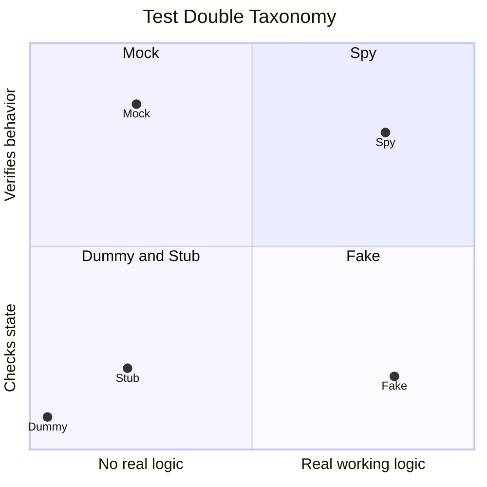
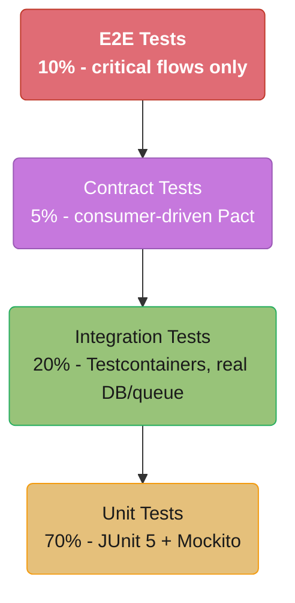
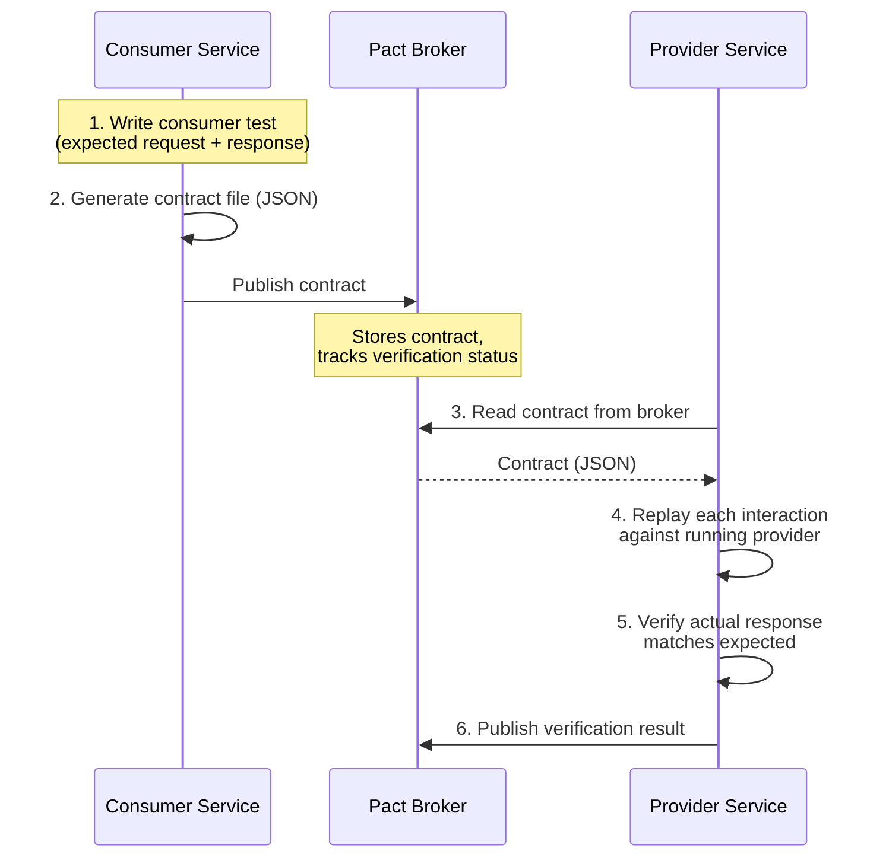

# Backend Testing Strategies

## 1. Concept Overview

Backend testing encompasses multiple complementary approaches to verify correctness, reliability, and behavior of server-side systems. The testing pyramid defines the ideal distribution: unit tests (70%) for fast feedback on individual components, integration tests (20%) for verifying interactions with infrastructure (databases, caches, queues), contract tests for verifying API compatibility across service boundaries, and end-to-end tests (10%) for critical user journeys. Each layer provides different confidence at different cost.

---

## 2. Intuition

Unit tests are like testing each LEGO brick in isolation — cheap and fast. Integration tests are like testing that two bricks snap together correctly. Contract tests are like agreeing on a blueprint before manufacturing — prevents one team's change from breaking another's assembly. End-to-end tests are like assembling the full model — expensive and slow but confirms the whole thing works. An effective test suite uses all layers, with the pyramid shape (many small, few large) keeping the suite fast enough to run on every commit.

---

## 3. Core Principles

- **Test behavior, not implementation**: a test should verify what a unit does, not how it does it internally; this allows internal refactoring without breaking tests
- **Fast feedback loop**: the entire unit test suite should run in under 30 seconds; integration tests under 5 minutes
- **Deterministic tests**: same code must produce same result every run; no time-dependent, order-dependent, or network-dependent behavior in unit tests
- **Test isolation**: each test starts from a known clean state; no shared mutable state between test methods
- **F.I.R.S.T principles**: Fast, Independent, Repeatable, Self-validating, Timely

---

## 4. Types / Architectures / Strategies

**Test doubles taxonomy**:
- **Dummy**: passed but never used; fills parameter lists (`null` or empty object)
- **Stub**: returns pre-configured answers; no verification of calls (`when(repo.findById(1)).thenReturn(Optional.of(order))`)
- **Spy**: records calls made to it; real object with call tracking (`spy(service)`)
- **Mock**: pre-programmed with expectations; verified at end (`verify(emailService).sendEmail(any())`)
- **Fake**: working implementation with shortcuts (in-memory DB replacing real PostgreSQL)



Stub and Mock both script canned behavior and look alike until the vertical axis splits them — a Stub is never verified, a Mock's expectations are checked at the end. Spy and Fake both run real logic but split the same way — a Spy is verified by call tracking, a Fake is verified by querying its resulting state.

**Testing layers in Spring**:
- `@SpringBootTest`: full application context; slow; for integration/E2E tests
- `@WebMvcTest`: only Spring MVC layer (controllers, filters, security); no service/repo beans
- `@DataJpaTest`: only JPA layer (entities, repositories, embedded H2); no web layer
- `@DataRedisTest`: only Redis auto-configuration
- `@MockBean`: replaces a bean in Spring context with a Mockito mock

---

## 5. Architecture Diagrams

**Testing Pyramid**



The pyramid narrows from a broad base of fast unit tests (70%) to a thin peak of slow, brittle E2E tests (10%) — each layer up trades speed for confidence, which is why the suite should stay bottom-heavy.

**Consumer-Driven Contract Testing with Pact**



The consumer and provider never call each other directly — the Pact Broker is the shared source of truth, so a provider change that breaks any consumer's contract fails in CI before it reaches a shared environment.

---

## 6. How It Works — Detailed Mechanics

### Unit Test — AAA Pattern with Mockito

```java
@ExtendWith(MockitoExtension.class)
class OrderServiceTest {

    @Mock
    private OrderRepository orderRepository;

    @Mock
    private PaymentGateway paymentGateway;

    @InjectMocks
    private OrderService orderService;

    @Test
    void createOrder_withValidRequest_persistsAndReturnsOrder() {
        // Arrange
        OrderRequest request = new OrderRequest("user-1", List.of(new Item("sku-1", 2)), 49.99);
        Order savedOrder = Order.builder()
            .id(UUID.randomUUID())
            .userId("user-1")
            .status(OrderStatus.PENDING)
            .totalAmount(49.99)
            .build();
        when(orderRepository.save(any(Order.class))).thenReturn(savedOrder);

        // Act
        Order result = orderService.createOrder(request);

        // Assert
        assertThat(result.getId()).isNotNull();
        assertThat(result.getStatus()).isEqualTo(OrderStatus.PENDING);
        assertThat(result.getTotalAmount()).isEqualTo(49.99);

        // Verify collaborators were called correctly
        verify(orderRepository).save(argThat(order ->
            order.getUserId().equals("user-1") &&
            order.getStatus() == OrderStatus.PENDING
        ));
        verifyNoInteractions(paymentGateway); // payment not triggered on creation
    }

    @Test
    void createOrder_whenRepositoryThrows_propagatesException() {
        // Arrange
        when(orderRepository.save(any())).thenThrow(new DataIntegrityViolationException("duplicate key"));

        // Act & Assert
        assertThatThrownBy(() -> orderService.createOrder(new OrderRequest()))
            .isInstanceOf(DataIntegrityViolationException.class);
    }
}
```

### Integration Test with Testcontainers

```java
@SpringBootTest
@Testcontainers
@ActiveProfiles("test")
class OrderRepositoryIntegrationTest {

    @Container
    static PostgreSQLContainer<?> postgres = new PostgreSQLContainer<>("postgres:15-alpine")
        .withDatabaseName("testdb")
        .withUsername("test")
        .withPassword("test");

    @Container
    static KafkaContainer kafka = new KafkaContainer(DockerImageName.parse("confluentinc/cp-kafka:7.4.0"));

    @DynamicPropertySource
    static void configureProperties(DynamicPropertyRegistry registry) {
        registry.add("spring.datasource.url", postgres::getJdbcUrl);
        registry.add("spring.datasource.username", postgres::getUsername);
        registry.add("spring.datasource.password", postgres::getPassword);
        registry.add("spring.kafka.bootstrap-servers", kafka::getBootstrapServers);
    }

    @Autowired
    private OrderRepository orderRepository;

    @Test
    @Transactional
    void save_andFindByUserId_returnsOrder() {
        Order order = Order.builder()
            .userId("user-1")
            .status(OrderStatus.PENDING)
            .totalAmount(99.0)
            .build();

        Order saved = orderRepository.save(order);

        List<Order> found = orderRepository.findByUserId("user-1");
        assertThat(found).hasSize(1);
        assertThat(found.get(0).getId()).isEqualTo(saved.getId());
    }
}
```

### Web Layer Test with @WebMvcTest

```java
@WebMvcTest(OrderController.class)
class OrderControllerTest {

    @Autowired
    private MockMvc mockMvc;

    @MockBean
    private OrderService orderService;

    @Autowired
    private ObjectMapper objectMapper;

    @Test
    void createOrder_returnsCreatedWithLocation() throws Exception {
        UUID orderId = UUID.randomUUID();
        Order order = Order.builder().id(orderId).status(OrderStatus.PENDING).build();
        when(orderService.createOrder(any())).thenReturn(order);

        mockMvc.perform(post("/api/orders")
                .contentType(MediaType.APPLICATION_JSON)
                .content(objectMapper.writeValueAsString(new OrderRequest("user-1", List.of(), 0.0))))
            .andExpect(status().isCreated())
            .andExpect(header().string("Location", containsString("/api/orders/" + orderId)))
            .andExpect(jsonPath("$.status").value("PENDING"));
    }

    @Test
    void createOrder_withInvalidRequest_returnsBadRequest() throws Exception {
        // Empty userId fails @NotBlank validation
        mockMvc.perform(post("/api/orders")
                .contentType(MediaType.APPLICATION_JSON)
                .content("{\"userId\":\"\"}"))
            .andExpect(status().isBadRequest())
            .andExpect(jsonPath("$.violations[0].field").value("userId"));
    }
}
```

### Consumer-Driven Contract Test with Pact

```java
// Consumer side: defines the expected interaction
@ExtendWith(PactConsumerTestExt.class)
@PactTestFor(providerName = "inventory-service", port = "8081")
class InventoryClientContractTest {

    @Pact(consumer = "order-service")
    public RequestResponsePact getInventoryPact(PactDslWithProvider builder) {
        return builder
            .given("product sku-1 exists with quantity 10")
            .uponReceiving("a request for inventory of sku-1")
                .path("/api/inventory/sku-1")
                .method("GET")
            .willRespondWith()
                .status(200)
                .headers(Map.of("Content-Type", "application/json"))
                .body(new PactDslJsonBody()
                    .stringValue("sku", "sku-1")
                    .integerType("quantity", 10)
                    .booleanType("available", true))
            .toPact();
    }

    @Test
    @PactTestFor(pactMethod = "getInventoryPact")
    void getInventory_returnsAvailableInventory(MockServer mockServer) {
        InventoryClient client = new InventoryClient(mockServer.getUrl());
        Inventory inventory = client.getInventory("sku-1");
        assertThat(inventory.isAvailable()).isTrue();
        assertThat(inventory.getQuantity()).isEqualTo(10);
    }
}
```

### Mutation Testing with PIT

```java
// Run PIT from Maven: mvn org.pitest:pitest-maven:mutationCoverage
// PIT applies mutations like:
//   - Change > to >= in conditionals
//   - Negate boolean returns
//   - Remove void method calls
//   - Replace arithmetic operators (+  →  -)

// A test that only checks return value = non-null will not catch these mutations
// A test that checks boundary values and specific return values WILL kill mutations

// Mutation score: killed/total should be > 80% for business-critical code
// A service with 95% line coverage but 50% mutation score has weak tests
```

### Property-Based Testing with jqwik

```java
class OrderPricingTest {

    @Property
    void totalPrice_alwaysEqualsItemSumPlusTax(@ForAll @Positive double subtotal,
                                                @ForAll @DoubleRange(min = 0, max = 0.3) double taxRate) {
        double expected = subtotal * (1 + taxRate);
        double actual = PricingCalculator.calculateTotal(subtotal, taxRate);

        // jqwik will try hundreds of random combinations
        // and shrink to minimal failing example if any assertion fails
        assertThat(actual).isCloseTo(expected, within(0.001));
    }

    @Property
    void discount_neverExceedsOriginalPrice(@ForAll @Positive double price,
                                             @ForAll @DoubleRange(min = 0, max = 1) double discountRate) {
        double discounted = PricingCalculator.applyDiscount(price, discountRate);
        assertThat(discounted).isBetween(0.0, price);
    }
}
```

---

## 7. Real-World Examples

- **Netflix**: relies heavily on property-based testing for codec and encoding logic; a property test found edge cases in video transcoding that 10,000 unit tests missed
- **Amazon**: consumer-driven contracts across hundreds of microservices; if a provider breaks a contract, the deployment pipeline fails before reaching production
- **Google**: test size annotations: small (no I/O, no sleeps, run in < 60s), medium (network to localhost, DB, < 5 min), large (any I/O, any time) — enforces the pyramid

---

## 8. Tradeoffs

| Strategy | Speed | Confidence | Isolation | Cost |
|----------|-------|------------|-----------|------|
| Unit test | Very fast (ms) | Low-medium | Full | Low |
| Integration (Testcontainers) | Slow (5-30s) | High | Moderate | Medium |
| @WebMvcTest slice | Fast (2-5s) | Medium | High | Low |
| Contract test (Pact) | Medium (10-30s) | High for API compat | Moderate | Medium |
| E2E test | Very slow (min) | Highest | None | High |
| Mutation testing | Very slow (hours) | Meta: test quality | N/A | Medium |

---

## 9. When to Use / When NOT to Use

Use unit tests for all business logic, pure functions, validation rules, and algorithm correctness. Use integration tests (Testcontainers) for repository queries, Kafka consumer/producer behavior, cache operations, and database constraints. Use contract tests when multiple teams own separate services that communicate via API — prevents breaking changes from reaching production. Use E2E tests only for critical happy paths (checkout, signup, payment) — not for every scenario.

Do NOT use `@SpringBootTest` for unit tests — it starts the full context and takes 10-30 seconds. Use `@WebMvcTest` or `@DataJpaTest` slices instead. Do NOT mock everything in an integration test — if you mock the database, you are not testing the SQL. Do NOT write tests that depend on test execution order (JUnit does not guarantee order without `@TestMethodOrder`).

---

## 10. Common Pitfalls

**Testing implementation details**: An engineer wrote tests that verified which private methods were called and in what order. When the service was refactored to be more efficient (fewer internal calls), all tests broke despite the behavior being identical. Fix: test the public interface contract, not the implementation.

**Shared state across tests**: A test class had a static `List<Order>` accumulating across test methods. Tests 1-5 passed in isolation. Test 6 failed because it expected an empty list but found 5 entries from previous tests. JUnit 5 creates a new instance per test method by default, but static fields are shared. Fix: use `@BeforeEach` to reset state, never use static mutable state.

**Slow unit tests from Spring context loading**: A developer annotated every test class with `@SpringBootTest`. The test suite grew to 500 tests. Running the full suite took 25 minutes because each `@SpringBootTest` class started a full application context (no context caching when configurations differ). Fix: use the appropriate test slice (`@WebMvcTest`, `@DataJpaTest`) and mark integration tests with a separate Maven profile.

**Missing Testcontainers resource cleanup**: Testcontainers instances declared as instance variables (not `static`) are created and destroyed per test method. A test class with 20 methods created and destroyed a PostgreSQL container 20 times — adding 10 minutes to the suite. Fix: declare containers as `static @Container` fields so they are started once per test class.

---

## 11. Technologies & Tools

| Tool | Purpose |
|------|---------|
| JUnit 5 | Test framework, lifecycle annotations, parameterized tests |
| Mockito | Mocking framework, `@Mock`, `@InjectMocks`, `verify()` |
| AssertJ | Fluent assertions, better failure messages than JUnit assertions |
| Testcontainers | Real Docker containers (PostgreSQL, Kafka, Redis) for integration tests |
| Pact | Consumer-driven contract testing framework |
| PIT (Pitest) | Mutation testing for Java |
| jqwik | Property-based testing for Java (QuickCheck-style) |
| WireMock | HTTP mock server for testing external HTTP clients |
| Spring MockMvc | MVC layer testing without starting HTTP server |
| Awaitility | Async assertion helper (`await().atMost(5, SECONDS).until(...)`) |

---

## 12. Interview Questions with Answers

**Q: What is the testing pyramid and why does it matter?**
The testing pyramid recommends a distribution: many unit tests (70%), fewer integration tests (20%), minimal E2E tests (10%). Unit tests are fast (milliseconds), isolated, and cheap to maintain. Integration tests are slower (seconds to minutes) but verify real interactions with databases, caches, and queues. E2E tests are slowest and most brittle but confirm complete user flows. The pyramid shape ensures the test suite runs in minutes, giving fast feedback. An inverted pyramid (many E2E, few unit) results in a fragile, slow suite that developers stop running.

**Q: What is the difference between a mock and a stub?**
A stub provides pre-programmed responses to method calls but does not verify how it was called — it exists only to let the code under test proceed. A mock is pre-programmed with expectations and verifies at the end that specific interactions happened. In Mockito: `when(repo.findById(1)).thenReturn(order)` is stubbing behavior. `verify(emailService).sendEmail("user@example.com")` is mock verification. The distinction matters: stubs set up state, mocks verify behavior. Use stubs when you need collaborators to return specific values; use mocks when the test's correctness depends on a specific interaction occurring.

**Q: What is consumer-driven contract testing and why is it superior to integration testing against a shared environment?**
Consumer-driven contract testing (Pact) lets each consumer team define the exact subset of the provider's API they depend on. Consumers write tests that generate a contract file describing expected request/response pairs. The provider runs tests against all consumer contracts in CI. If a provider change would break any consumer contract, the build fails before deployment. This is superior to shared-environment integration testing because: no coordination needed for test environment availability, contracts are versioned in the Pact Broker, provider changes that break consumers are caught immediately, and tests run in parallel against mock consumers.

**Q: What is mutation testing and what does mutation score tell you?**
Mutation testing automatically introduces bugs (mutations) into the source code — changing `>` to `>=`, negating booleans, removing method calls — and then runs the test suite. If the suite catches the bug (a test fails), the mutant is "killed." Mutation score = killed mutants / total mutants. A score below 70% means your tests are not sensitive enough to catch real bugs. A service can have 90% line coverage with 40% mutation score if tests only assert that methods return non-null. PIT is the standard Java mutation testing tool; it's slow (can take hours for large codebases) so run it on CI nightly, not on every commit.

**Q: When should you use @SpringBootTest vs @WebMvcTest vs @DataJpaTest?**
`@SpringBootTest` loads the entire application context including all beans, auto-configurations, and database connections. Use it for full integration tests and E2E tests but expect 10-30 second startup. `@WebMvcTest` loads only Spring MVC components: controllers, `@ControllerAdvice`, filters, security configuration, and `WebMvcConfigurer`. Service and repository beans are not created — you must `@MockBean` them. Use for testing HTTP request handling, validation, and JSON serialization. `@DataJpaTest` loads only JPA-related beans: entity manager, repositories, and an embedded or Testcontainers DB. Use for testing repository queries, entity lifecycle, and database constraints without web overhead.

**Q: What is the coordinated omission problem in performance testing?**
When measuring response time in a load test, if the system slows down and the test tool waits for each response before sending the next request, the tool naturally reduces its request rate. This masks the actual latency tail: slow responses cause a gap, then normal-speed responses follow, making the histogram look better than it is. Real users don't wait — they keep arriving regardless of system speed. Tools like wrk2, Gatling with constant arrival rate scenarios, and k6 with `constant-arrival-rate` executor avoid this by sending requests at a fixed rate regardless of pending responses. Always verify your load test tool uses a fixed arrival rate.

**Q: How do you test asynchronous behavior (e.g., Kafka consumer processing)?**
Use Awaitility for polling assertions: `await().atMost(10, SECONDS).pollInterval(500, MILLISECONDS).until(() -> orderRepository.count() == 1)`. For Kafka consumer tests, use the embedded Kafka from `spring-kafka-test` (`@EmbeddedKafka`) or a Testcontainers Kafka container for production-fidelity. Publish a test message to the topic, then assert with Awaitility that the consumer processed it. For unit tests of consumer logic, test the `@KafkaListener` method directly without Kafka infrastructure. For verifying outbox-to-Kafka flow, use Awaitility after publishing to assert the message appeared on the Kafka topic using a test consumer.

**Q: What are the key test anti-patterns to avoid?**
(1) Testing implementation: verifying internal method call sequences rather than observable output. (2) Over-mocking: mocking so much that the test only verifies Mockito configuration, not real behavior. (3) Non-deterministic tests: `Thread.sleep()`, `new Date()`, `Math.random()` in test assertions — use `Clock` injection and `Instant.now(fixedClock)`. (4) Test interdependence: tests relying on order of execution or shared state. (5) Meaningless assertions: `assertNotNull(result)` when the result could be any non-null value. (6) Ignoring or disabling tests: `@Disabled` test methods accumulate, giving a false sense of coverage.

**Q: How do you achieve test isolation with databases in integration tests?**
Three approaches: (1) `@Transactional` on test methods — Spring rolls back the transaction after each test; works well for `@DataJpaTest` but does not test rollback-related behavior. (2) `@Sql` annotation to run cleanup SQL before each test: `@Sql(scripts = "/cleanup.sql", executionPhase = BEFORE_TEST_METHOD)`. (3) Testcontainers with database-per-test-class: each test class gets a fresh schema; slower but fully isolated. For Kafka: use unique topic names per test class (include `UUID.randomUUID()` in topic name) to prevent message contamination between tests.

**Q: What is property-based testing and when should you use it?**
Property-based testing generates hundreds of random inputs satisfying defined constraints and verifies that invariants hold for all of them. Instead of `assertEquals(15, priceOf(10, 1.5))`, you assert `for all positive price p and tax rate t in [0, 0.5]: totalPrice(p, t) >= p`. Libraries like jqwik (Java) automatically shrink failing examples to the minimal case. Use it for: numeric calculations (pricing, discounts), data format parsing and serialization (any valid input should round-trip correctly), sorting and data structure invariants (sorted list always has first element <= last), and business rule boundaries (order total is always >= 0).

**Q: How do you test Spring Security configuration?**
Use `@WebMvcTest` with `@WithMockUser(roles = "ADMIN")` or `@WithMockUser(username = "user1")` annotations to simulate authenticated users. For JWT-based auth, create a `SecurityMockMvcRequestPostProcessors.jwt()` post-processor: `mockMvc.perform(get("/api/admin").with(jwt().authorities(new SimpleGrantedAuthority("ROLE_ADMIN"))))`. Test: authenticated requests to protected endpoints return 200, unauthenticated requests return 401, correctly authenticated but unauthorized requests return 403. Also test CSRF token handling for POST endpoints.

**Q: What is the difference between @Mock and @MockBean?**
`@Mock` (Mockito) creates a mock object outside the Spring context. It works in unit tests with `@ExtendWith(MockitoExtension.class)`. The mock is injected into the class under test via `@InjectMocks`. `@MockBean` (Spring Boot Test) creates a Mockito mock and registers it as a Spring bean in the application context, replacing any existing bean of that type. Use `@MockBean` in `@WebMvcTest` and `@SpringBootTest` to replace real beans (service, repository) with mocks without loading the entire application graph. `@MockBean` causes Spring to restart its context (unless the same mock configuration is cached), so use it sparingly.

**Q: What is the difference between a Fake and a Stub in the test doubles taxonomy?**
A Fake is a working implementation with shortcuts, while a Stub only returns pre-programmed answers to specific calls. An in-memory H2 database standing in for PostgreSQL is a Fake — it executes real SQL semantics, just without disk persistence. A Stub configured with `when(repo.findById(1)).thenReturn(order)` has no real logic behind it; it simply returns the value it was told to return for that one call. Choose a Fake when the test needs realistic behavior across many operations; choose a Stub when only a single canned response is needed.

**Q: Why must Testcontainers be declared as static @Container fields rather than instance fields?**
A static @Container field creates one container per test class instead of one per test method, avoiding minutes of redundant startup and teardown. JUnit 5 instantiates a new test class instance for every test method by default, so an instance-level container field would start and stop a fresh Docker container for each of the class's tests. A class with 20 test methods and an instance-level PostgreSQL container adds roughly 10 minutes of pure container churn to the suite. Declare shared infrastructure containers as static so they start once and are reused across all methods in the class.

**Q: What are Google's test size annotations and what do they enforce?**
Google's test size annotations classify tests as small, medium, or large based on the I/O and time they are allowed to use. Small tests permit no network or filesystem I/O and no sleeps, and must complete in under 60 seconds; medium tests may talk to localhost services like a database and must finish within 5 minutes; large tests may perform any I/O but are still capped at Bazel's default 900-second (15-minute) timeout for size="large" — genuinely unbounded runs need the separate "eternal" timeout tag, not the large size alone. Enforcing these sizes at the build system level keeps the fast small-test suite runnable on every commit while still allowing slower integration and end-to-end coverage. Tag tests by size so CI can run small tests on every push and reserve medium and large tests for a separate pipeline stage.

**Q: How does WireMock differ from Testcontainers when testing an external HTTP dependency?**
WireMock stubs HTTP responses in-process so tests never make a real network call, while Testcontainers spins up an actual instance of the real dependency in Docker. Use WireMock to simulate a third-party API you do not control — a payment gateway or a partner's REST service — by configuring canned JSON responses and fault scenarios like timeouts or 500s. Use Testcontainers when the dependency itself is what you own or need production-fidelity behavior for, such as PostgreSQL query semantics or Kafka consumer group rebalancing. Reach for WireMock when the goal is isolating your service from an external system's availability, not verifying that system's own behavior.

---

## 13. Best Practices

- Name tests: `methodName_givenCondition_expectedOutcome` for readability in failure reports
- Use `@ParameterizedTest` with `@MethodSource` or `@CsvSource` for boundary value testing
- Keep Testcontainers containers `static` and `@Container` so they are reused across all tests in the class
- Use `DynamicPropertySource` to inject container properties rather than hardcoded test config
- Run integration tests in a separate Maven phase/profile: `mvn test` for unit, `mvn verify` for integration
- Use `Awaitility` for all async assertions — never `Thread.sleep(1000)` in tests
- Capture test coverage in CI but treat 80% mutation score as the real quality gate, not line coverage
- Write contract tests before implementing the provider — contract-first development
- Tag slow tests with JUnit 5 `@Tag("slow")` and exclude from default `mvn test` with Surefire configuration

---

## 14. Case Study

**Problem**: A payment service had 95% line coverage but experienced production bugs after refactoring. The test suite was full of tests like `assertNotNull(result)` and `assertDoesNotThrow(() -> service.processPayment(req))`. Mutation score was 38%.

**Fix applied**:
1. Added property-based tests for the pricing engine — found 3 edge cases with decimal rounding
2. Rewrote assertions to check specific field values, not just non-null
3. Added contract tests between order-service (consumer) and payment-service (provider) — immediately caught that the payment-service was returning `"amount"` as string instead of number
4. Added Testcontainers integration tests for the idempotency key mechanism — discovered the UNIQUE constraint was missing on the table
5. Added mutation testing to the CI nightly pipeline; set a gate: merge blocked if mutation score < 70%

**Result**: After 3 sprints, mutation score reached 74%. The next two refactoring efforts produced zero production incidents. Two contract test failures caught breaking API changes before they reached staging.
