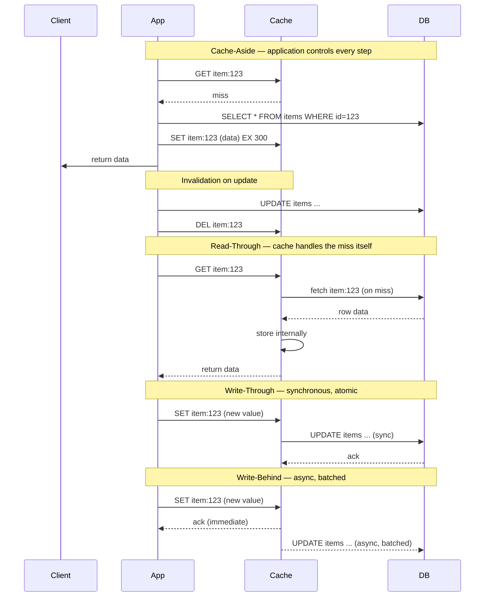
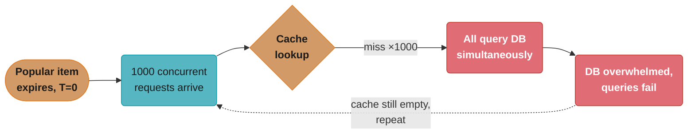
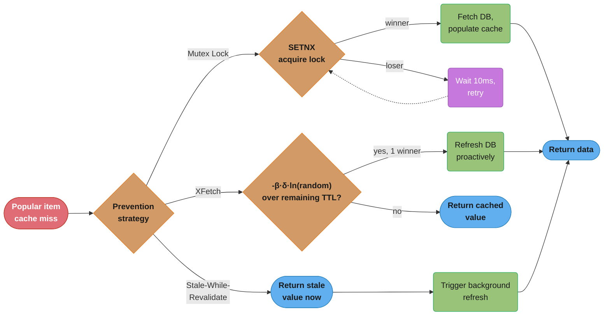
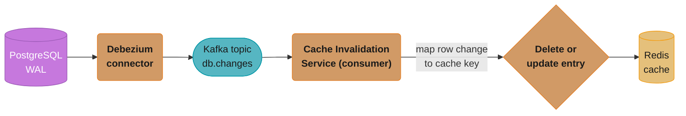
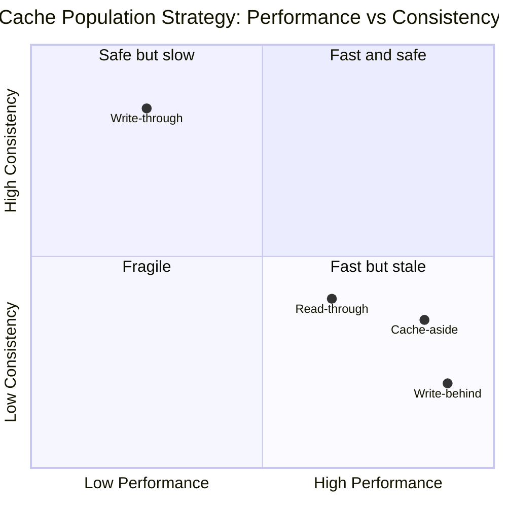
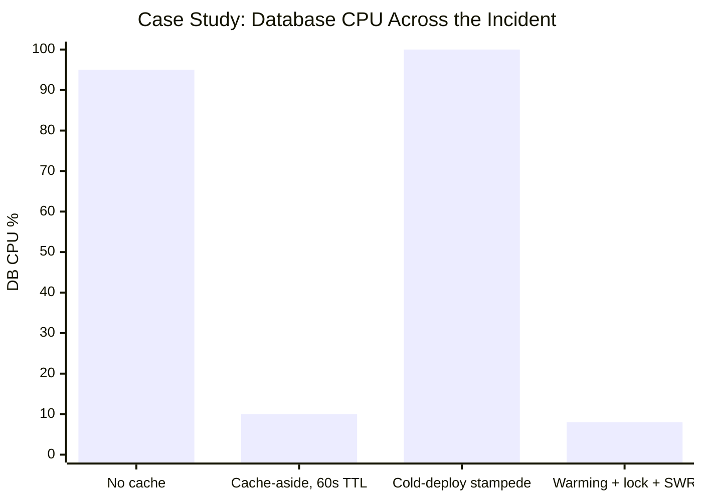

# Caching Strategies Deep Dive

## 1. Concept Overview

A cache stores the results of expensive operations so subsequent requests can be served faster. Caching is the single highest-leverage performance optimization available to most backend systems — a well-designed cache can reduce database load by 95% and cut response times from 50ms to <1ms. But caching introduces complexity: cache invalidation is one of computer science's two hard problems, and a cache stampede can destroy a database just as effectively as removing the cache entirely.

This module covers the full spectrum: cache placement strategies (aside, read-through, write-through, write-behind, refresh-ahead), Redis data structures and their optimal use cases, cache stampede prevention, eviction policies, and the practical tradeoffs between local and distributed caches.

---

## 2. Intuition

> **One-line analogy**: A cache is like a notepad next to your phone — instead of looking up the same phone number in a thick directory (database) every time you need it, you write it on your notepad (cache) after the first lookup. The notepad gets stale if the phone book changes, but for most numbers, it's accurate long enough to be useful.

**Mental model**: Cache-aside is the most common: check the cache first; if miss, fetch from database and populate the cache; return data. The application controls cache population. For read-heavy workloads where data changes infrequently, cache-aside dramatically reduces database load.

**Why it matters**: At scale, the database cannot serve every read request. Instagram's cache tier serves 99% of media metadata reads. Facebook's Memcached tier serves billions of objects per second. Without caching, any database-backed service hits capacity limits at a fraction of the required scale.

**Key insight**: The hardest problem in caching is not performance — it is correctness. Cache invalidation, thundering herd, and cache poisoning are the failure modes. A cache that returns wrong data is worse than no cache at all. Design invalidation before you design population.

---

## 3. Core Principles

- **Hit rate**: Percentage of requests served from cache. Target >90% for high-value caches. Low hit rate means the cache is not providing value.
- **Eviction**: When the cache is full, items must be evicted to make room. Policy choice (LRU, LFU, TTL) determines which items are kept.
- **TTL (Time To Live)**: Each item can expire after a fixed duration, simplifying invalidation at the cost of staleness window.
- **Cache coherence**: Multiple cache instances (distributed or local) must agree on the current value. Consistency tradeoffs are unavoidable.
- **Cold start**: When a cache starts empty (deployment, restart), all requests hit the database — a cache cold start can overwhelm the database. Warm the cache before taking traffic.

---

## 4. Types / Architectures / Strategies

### 4.1 Cache Population Strategies

| Strategy | Who populates cache | When | Best For |
|----------|-------------------|------|---------|
| Cache-aside (lazy) | Application | On cache miss | Most use cases, fine-grained control |
| Read-through | Cache library/proxy | On cache miss (transparently) | Simplifies application code |
| Write-through | Application | On every write | Strong consistency requirement |
| Write-behind (write-back) | Cache library | Async after write | Write-heavy with eventual consistency |
| Refresh-ahead | Background thread | Before expiry | Predictable access patterns |

### 4.2 Cache Invalidation Strategies

| Strategy | Description | Consistency | Complexity |
|----------|-------------|-------------|------------|
| TTL | Items expire after fixed time | Eventual (staleness = TTL) | Low |
| Event-driven | Application invalidates on write | Strong | Medium |
| Write-through | Update cache and DB together | Strong | Medium |
| Cache-busting | New key per version (e.g., user.v123) | Strong | Medium |
| Tag-based | Invalidate all items with a tag | Strong | High |
| CDC (Change Data Capture) | DB changes trigger cache invalidation | Strong | High |

### 4.3 Redis Data Structures

| Structure | Commands | Use Case |
|-----------|---------|---------|
| String | GET, SET, INCR, EXPIRE | Simple key-value, counters, rate limiting |
| Hash | HGET, HSET, HMSET, HGETALL | User objects, session data (partial updates) |
| List | LPUSH, RPUSH, LRANGE, LLEN | Activity feeds, message queues, recent items |
| Set | SADD, SMEMBERS, SINTERSTORE | Tags, unique visitors, following/followers |
| Sorted Set (ZSet) | ZADD, ZRANGEBYSCORE, ZRANK | Leaderboards, time-ordered feeds, rate limiting |
| HyperLogLog | PFADD, PFCOUNT | Approximate distinct count (±0.81% error) |
| Bloom Filter | BF.ADD, BF.EXISTS (RedisBloom) | Definitely-not-present queries (no false negatives) |
| Pub/Sub | PUBLISH, SUBSCRIBE | Lightweight real-time messaging |
| Stream | XADD, XREAD, XGROUP | Persistent, consumer-group based message log |

### 4.4 Eviction Policies

| Policy | Description | Use Case |
|--------|-------------|---------|
| noeviction | Error on write when full | Never evict (return error instead) |
| allkeys-lru | Evict LRU from all keys | General purpose, mixed TTL workload |
| volatile-lru | Evict LRU from keys with TTL | Protect permanent keys |
| allkeys-lfu | Evict least-frequently-used | Skewed access patterns |
| volatile-lfu | Evict LFU from keys with TTL | Frequently accessed permanent keys |
| allkeys-random | Random eviction | Almost never useful |
| volatile-ttl | Evict keys with shortest TTL | Self-managing TTL-based caches |

For most caches: `allkeys-lru` or `allkeys-lfu`. LFU is better for workloads where a small set of items is accessed extremely frequently (hot keys).

---

## 5. Architecture Diagrams

### Cache Patterns Comparison



All four patterns funnel through the same three participants — only who calls whom, and when, changes. Write-behind is the only pattern that acknowledges the client before the database write commits, which is exactly where its data-loss-on-crash risk comes from.

### Cache Stampede Prevention

**The problem — thundering herd:**



All 1,000 requests land inside the same expiry instant, so every one of them checks the cache before any single request can refill it — the resulting database overload feeds back into the same still-empty cache, repeating the cycle until something breaks it.

**Three prevention strategies:**



All three strategies intercept the same cache-miss moment but resolve the contention differently: the mutex lock guarantees exactly one winner while losers wait and retry, XFetch avoids locking altogether by making the refresh probabilistic as expiry nears, and stale-while-revalidate skips waiting entirely by serving the old value while a refresh runs in the background.

---

## 6. How It Works — Detailed Mechanics

### 6.1 Cache-Aside with Spring Cache Abstraction

```java
// Spring @Cacheable delegates to the configured CacheManager
@Service
public class ProductService {

    @Cacheable(
        value = "products",
        key = "#id",
        condition = "#id > 0",
        unless = "#result == null"
    )
    public Product getProduct(Long id) {
        return productRepository.findById(id).orElse(null);
        // Return value is automatically cached
    }

    @CacheEvict(value = "products", key = "#product.id")
    public Product updateProduct(Product product) {
        return productRepository.save(product);
        // Cache entry for this product evicted after save
    }

    @CachePut(value = "products", key = "#product.id")
    public Product saveProduct(Product product) {
        Product saved = productRepository.save(product);
        // Cache updated with new value (not evicted)
        return saved;
    }

    // Evict all entries in a cache
    @CacheEvict(value = "products", allEntries = true)
    public void clearProductCache() { }

    // Multiple cache operations
    @Caching(evict = {
        @CacheEvict(value = "products", key = "#id"),
        @CacheEvict(value = "product-search", allEntries = true)
    })
    public void deleteProduct(Long id) {
        productRepository.deleteById(id);
    }
}
```

### 6.2 Redis Data Structure Usage

```java
// Sorted Set for leaderboard
// Score = player's score; ZADD updates or inserts
redisTemplate.opsForZSet().add("leaderboard", playerId, score);

// Top 10 players (highest score first)
Set<String> top10 = redisTemplate.opsForZSet()
    .reverseRange("leaderboard", 0, 9);

// Player's rank (0-indexed)
Long rank = redisTemplate.opsForZSet()
    .reverseRank("leaderboard", playerId);

// Rate limiting with Sorted Set (sliding window)
String key = "rate:" + userId;
long now = System.currentTimeMillis();
long windowStart = now - 60_000; // 1-minute window

// Add current request timestamp
redisTemplate.opsForZSet().add(key, now + ":" + UUID.randomUUID(), now);
// Remove old requests outside window
redisTemplate.opsForZSet().removeRangeByScore(key, 0, windowStart);
// Count requests in window
Long count = redisTemplate.opsForZSet().zCard(key);
redisTemplate.expire(key, Duration.ofSeconds(70));

if (count > 100) {
    throw new RateLimitExceededException("Rate limit: 100 req/min");
}

// HyperLogLog for unique visitor counting
redisTemplate.opsForHyperLogLog().add("unique_visitors:" + date, userId);
Long uniqueCount = redisTemplate.opsForHyperLogLog()
    .size("unique_visitors:" + date);
// Approximate count (±0.81% error), uses only ~12 KB regardless of cardinality

// Hash for user session (partial update without serializing full object)
String sessionKey = "session:" + sessionId;
redisTemplate.opsForHash().put(sessionKey, "cart_count", "5");
redisTemplate.opsForHash().put(sessionKey, "last_activity", now.toString());
// No need to read-modify-write the entire session object
Integer cartCount = (Integer) redisTemplate.opsForHash()
    .get(sessionKey, "cart_count");
```

### 6.3 Distributed Cache Stampede Prevention with Lua

```lua
-- Atomic lock acquisition + cache check (prevents race condition)
-- Returns: cached value if found, or nil if caller should refresh and release lock

local key = KEYS[1]
local lockKey = KEYS[2]
local lockExpiry = ARGV[1]

local cached = redis.call('GET', key)
if cached then
    return cached
end

local acquired = redis.call('SET', lockKey, '1', 'NX', 'EX', lockExpiry)
if acquired then
    return '__LOCK_ACQUIRED__'
else
    return '__LOCK_WAIT__'
end
```

```java
// Java usage
public String getWithStampedeProtection(String key) {
    // Try direct cache hit
    String value = redis.get(key);
    if (value != null) return value;

    String lockKey = "lock:" + key;
    int maxRetries = 10;
    int waitMs = 50;

    for (int i = 0; i < maxRetries; i++) {
        // Try to acquire lock
        Boolean acquired = redis.setNX(lockKey, "1");
        redis.expire(lockKey, 5); // 5s lock TTL

        if (acquired) {
            try {
                // Double-check after acquiring lock
                value = redis.get(key);
                if (value != null) return value;

                // Fetch from database
                value = database.fetch(key);
                redis.setex(key, 300, value); // 300s TTL
                return value;
            } finally {
                redis.del(lockKey);
            }
        }

        // Wait for the lock holder to populate the cache
        Thread.sleep(waitMs);

        // Check if cache was populated while waiting
        value = redis.get(key);
        if (value != null) return value;
    }

    // Fallback: fetch directly from DB (prevents blocking indefinitely)
    return database.fetch(key);
}
```

### 6.4 Cache Invalidation with CDC (Change Data Capture)



Debezium tails the WAL so no application write path ever has to remember to invalidate the cache — every row change flows through Kafka to the invalidation service, which maps it to a cache key and deletes or updates the entry.

```
Configuration (Debezium):
  database.server.name: "myapp"
  table.include.list: "public.products,public.users"
  slot.name: "debezium_cache"

Kafka message on UPDATE:
  {
    "op": "u",         // update
    "before": { "id": 1, "name": "Old Name" },
    "after": { "id": 1, "name": "New Name" },
    "source": { "table": "products", "ts_ms": ... }
  }

Cache invalidation service:
  key = "product:" + after.id
  redis.del(key)  // or update if write-through
```

---

## 7. Real-World Examples

**Twitter Feed**: Twitter uses a Redis sorted set per user for their home timeline cache. When a user you follow tweets, the tweet ID is added to your timeline cache (fan-out write). Reading the timeline is a ZRANGE operation — sub-millisecond. For users with millions of followers (celebrities), Twitter skips fan-out and does fan-out on read (mixing cached timelines at read time).

**Facebook TAO**: Facebook's distributed graph cache (TAO) caches object associations (friendships, reactions, comments). TAO uses a look-aside cache with write-through invalidation. When any object changes, all relevant cache entries are invalidated. TAO handles 2+ billion requests/second globally.

**Redis for rate limiting**: Stripe, Cloudflare, and most API providers use Redis sorted sets or Lua scripts for distributed rate limiting. Lua's atomic execution prevents race conditions in the sliding window algorithm.

---

## 8. Tradeoffs

| Strategy | Consistency | Performance | Complexity |
|----------|-------------|------------|------------|
| Cache-aside | Eventual (stale until TTL) | Best (no cache write overhead) | Low |
| Read-through | Eventual | Good (cache populates on miss) | Medium |
| Write-through | Strong | Lower (extra cache write per DB write) | Medium |
| Write-behind | Eventual | Best for writes | High (data loss risk) |



None of the four strategies lands in the "fast and safe" quadrant — every real option pays for speed with staleness (cache-aside, read-through, write-behind) or pays for consistency with an extra synchronous write (write-through). Write-behind sits furthest into "fast but stale" because a crash before flush loses data outright, not just serves a stale read.

| Cache Tier | Latency | Capacity | Shared |
|-----------|---------|---------|--------|
| Local (in-process, Caffeine) | ~100ns | Limited (JVM heap) | No |
| Redis (same DC) | ~1ms | Large (RAM) | Yes |
| Redis (cross-DC) | ~50ms | Large | Yes |
| CDN edge cache | ~5ms | Very large | Yes |

---

## 9. When to Use / When NOT to Use

**Cache-aside**: Use when you need fine-grained control over what gets cached and when. Best for read-heavy data that changes infrequently. Do not use when you need strong consistency (cache may be stale between write and TTL expiry).

**Write-through**: Use when cache must always be consistent with the database (financial data, inventory counts). The performance cost is one extra write per database write — acceptable for write-rare, read-heavy data.

**Local cache (Caffeine)**: Use for immutable or slowly-changing reference data (country codes, product categories). Eliminates network hop to Redis. Do not use for data that must be consistent across multiple service instances — each instance has a separate cache.

**Redis Pub/Sub for cache invalidation**: Use to invalidate local caches across instances when source data changes. Publish invalidation events; subscribers clear their local cache. Simple and effective for low-to-medium frequency changes.

---

## 10. Common Pitfalls

**Hot key in Redis**: A single Redis key receiving millions of operations per second (e.g., counter for a viral post) becomes a bottleneck. Single-threaded Redis cannot process operations faster than ~100k/s per key. Fix: (1) local caching with short TTL (each app instance caches the hot key for 1 second); (2) Redis cluster with local in-process aggregation and periodic flush; (3) for counters, use Redis Cluster with slot migration or Cassandra counters.

**Cache stampede on startup**: Deploying a new service version cold-starts with an empty cache. The first minutes after deployment, all requests miss the cache and hit the database — potentially overwhelming it. Fix: cache warming (load popular items into cache before accepting traffic), or gradually route traffic to new instances.

**Caching mutable data without expiry**: Setting no TTL on a cache entry means stale data persists indefinitely unless explicitly evicted. A bug in invalidation logic means users see outdated data forever. Always set a TTL as a safety net, even for data with explicit invalidation (TTL is the last line of defense).

**Using allkeys-lru with varying data sizes**: LRU eviction does not consider object size. A 1-byte string and a 10-MB blob are equally "one item" in LRU. When large objects fill the cache, many small objects are evicted to make room. If small objects are accessed more frequently, this hurts hit rate. Use `maxmemory-policy allkeys-lfu` for workloads with mixed object sizes and skewed access patterns.

**Cache key collision**: Two different objects that happen to serialize to the same cache key return wrong data. Always include the entity type in the key: `product:123`, `user:123` — not just `123`. For complex keys: include all discriminating parameters and sort query parameters consistently.

---

## 11. Technologies & Tools

| Tool | Purpose |
|------|---------|
| Redis (Standalone) | Single-node cache/data structure server |
| Redis Cluster | Sharded Redis for horizontal scaling |
| Redis Sentinel | High availability for standalone Redis |
| Caffeine | High-performance in-process Java cache |
| Spring Cache | Cache abstraction (@Cacheable, @CacheEvict) |
| Spring Data Redis | RedisTemplate, ReactiveRedisTemplate |
| Jedis | Java Redis client (synchronous) |
| Lettuce | Java Redis client (async, reactive) |
| Redisson | Java Redis client with distributed objects |
| Memcached | Simple key-value cache (legacy; Redis preferred) |
| Varnish | HTTP caching proxy |
| CDN (CloudFront, Fastly) | Edge caching for static and dynamic content |

---

## 12. Interview Questions with Answers

**Q: What is cache-aside and how does it differ from read-through?**
Cache-aside (lazy loading): the application checks the cache, handles miss by fetching from DB and populating the cache. The application controls all cache interactions. Read-through: the cache itself handles misses by calling the underlying data store — the application only interacts with the cache. Cache-aside gives finer control (only populate what you need); read-through simplifies application code but requires a cache that can call the data store.

**Q: What is a cache stampede (thundering herd) and how do you prevent it?**
A cache stampede occurs when a popular cached item expires simultaneously and many concurrent requests all miss the cache, all query the database in parallel, overwhelming it. Prevention: (1) Mutex lock — only one request fetches; others wait and read the result. (2) Probabilistic early expiry (XFetch) — randomly refresh before expiry so the stampede is avoided proactively. (3) Stale-while-revalidate — serve stale content while refreshing in the background.

**Q: What Redis data structures would you use for a social media feed?**
Sorted Set (ZSet) per user: each feed item's ID is the member, timestamp is the score. ZADD for adding new items, ZREVRANGE for reading the most recent N items, ZREMRANGEBYSCORE for removing old items. For large feeds: limit the ZSet to the last 1,000 items. TRIM with ZREMRANGEBYRANK after insert. User ID as part of the key: `feed:{userId}`.

**Q: Explain the difference between LRU and LFU eviction.**
LRU (Least Recently Used) evicts the item that was accessed least recently — it assumes recently accessed items will be accessed again. LFU (Least Frequently Used) evicts the item accessed least often — it handles cases where an item was accessed frequently historically but is now rarely needed. LFU is better for skewed access patterns where a small set of hot items dominate. LRU is better for temporal locality (recent items tend to be accessed again soon).

**Q: How do you invalidate a cache when data changes?**
(1) TTL-based: set a short TTL; stale data is eventually evicted. Simple but allows staleness window. (2) Event-driven: the write path explicitly deletes/updates the cache key. Strong consistency but requires all write paths to be aware of the cache. (3) CDC (Change Data Capture): a background process (Debezium) reads DB change logs and invalidates cache keys asynchronously. Decouples invalidation from write path. (4) Write-through: cache and DB always updated together — strongest consistency.

**Q: What is a hot key in Redis and how do you solve it?**
A hot key is a single Redis key receiving disproportionately high traffic (millions of ops/second). Redis is single-threaded — one key can only be processed as fast as one core allows (~100k simple ops/s). Mitigations: (1) Local read-through cache: each app instance caches the hot key in-process for 1 second, greatly reducing Redis load. (2) Key replication: write to `hotkey:1`, `hotkey:2`, ..., `hotkey:N`; reads randomly pick one replica. (3) Redis Cluster: shard the hotkey across multiple slots. For write-heavy hot keys (counters), use local aggregation and periodic sync.

**Q: What is the difference between Redis standalone, Sentinel, and Cluster?**
Standalone: single instance, simple, not HA. Sentinel: monitoring/failover system — N Sentinel processes watch a primary+replicas; if primary dies, Sentinel elects a replica as new primary. Applications use the Sentinel endpoint for transparent failover. No horizontal scaling. Cluster: shards data across multiple primary nodes (16384 hash slots). Horizontal scale for both read and write. Requires client-side cluster awareness. Use Sentinel for HA with simple data; Cluster for horizontal scaling.

**Q: When would you use a local in-process cache vs Redis?**
Local cache (Caffeine): latency ~100 nanoseconds vs Redis ~1ms. Use for immutable or rarely-changing data (country codes, feature flags, configuration). The cache is per-instance — no sharing across instances. Cache consistency requires invalidation broadcast (Redis Pub/Sub) when data changes. Redis: use for data that must be consistent across instances (session data, rate limit counters, shared state). The network hop (~1ms) is acceptable for most use cases.

**Q: What is write-behind (write-back) caching and when is it appropriate?**
Write-behind: the application writes to the cache, and the cache writes to the database asynchronously (batched, with delay). The application gets near-instant write acknowledgment. Appropriate for: write-heavy workloads where some data loss is acceptable (analytics events, session data), or writes that can be batched efficiently (many small writes merged into one bulk insert). Not appropriate for: financial transactions, orders, any data where loss is unacceptable.

**Q: How does the XFetch algorithm prevent cache stampedes?**
XFetch (probabilistic early expiry) triggers cache refresh before the item expires. The probability of early refresh increases as the item approaches expiry: P(refresh) = -β * δ * ln(U) where β = tuning factor (default 1), δ = time to recompute the value, U = uniform random [0,1). As remaining TTL decreases, ln(U) must be smaller (U closer to 1) to trigger refresh — meaning early refresh becomes more likely. Only one request triggers early refresh (the one that "wins the lottery"). All others still get the cached value. No lock needed, no stampede.

**Q: What cache invalidation strategy does Stripe use for their API?**
Stripe uses event-driven invalidation: when an object (charge, customer, subscription) is updated, the write handler explicitly evicts the cache key. They also use short TTLs (60–300 seconds) as a safety net. For read paths, they use cache-aside. For their rate limiting implementation, they use Redis Lua scripts for atomic sliding window counters. They do not use write-through because payment objects have complex consistency requirements.

**Q: How would you design caching for product inventory counts?**
Inventory counts must be accurate (cannot oversell). Options: (1) Cache with write-through: all inventory decrements update both DB and cache atomically (using a DB transaction + cache update). (2) Don't cache inventory counts — read from DB with SELECT FOR UPDATE during checkout. (3) Cache with short TTL (5 seconds) for display purposes; always verify from DB before deducting. (4) Redis atomic DECR for inventory with a background sync to DB — Redis as the source of truth for inventory. Option 4 is used by high-scale systems (Redis DECR is atomic, preventing oversell at cache level).

**Q: What is the Vary header in HTTP caching and how does it relate to backend caches?**
The HTTP Vary header tells CDNs/proxies to cache separate responses based on specific request headers. `Vary: Accept-Encoding` means: cache one version for gzip clients and one for uncompressed. This applies to CDN/proxy caches. Backend application caches (Redis) do not use HTTP Vary — but the same concept applies: a product response for user A (with their discount) should not be returned for user B. Include the user-specific factors in the cache key: `product:{id}:user:{userId}` for personalized responses, or `product:{id}` for public responses.

**Q: How do you design a cache for user authentication tokens?**
Cache: `session:{token_hash}` → `{userId, permissions, expires_at}`. TTL = token expiry time. On each request: check cache first (Redis GET); if hit, verify expires_at and use userId. If miss: validate token cryptographically (JWT signature) or look up in DB (opaque token). Revocation: when token is revoked, delete from cache immediately. For JWT: maintain a revocation list in Redis (bloom filter for efficiency: check if token hash is in revocation set before signature verification). Cache hit rate should be >99% — nearly every authenticated request reuses a recently checked token.

**Q: What is a cache key collision and how do you prevent it?**
A cache key collision happens when two different objects are stored or read under the same cache key, so one silently overwrites or serves data meant for the other. This typically occurs when a key is built from a bare identifier — using just `123` for both a product and a user means whichever entity writes second wins, and reads for the other return the wrong object. Complex keys carry the same risk when query parameters are included in a different order or format across call sites, producing two different-looking keys for what should be the same cached value. Always prefix keys with the entity type (`product:123`, `user:123`) and normalize any parameters that form part of the key — for example, sort query parameters consistently — before building the final key string.

**Q: Why does allkeys-lru eviction hurt hit rate when cached objects vary widely in size?**
LRU eviction tracks only recency, not size, so a 10 MB blob and a 1-byte counter count as exactly one item when deciding what to evict. When large objects dominate the cache, evicting by recency alone can remove many small, frequently-accessed objects just to free enough space for one large, less-frequently-accessed one — directly hurting hit rate for the small objects that make up most of the traffic. This is worse under skewed access patterns, where a handful of hot small keys should clearly outrank a rarely-touched large object, but pure LRU has no way to express that preference. Use `maxmemory-policy allkeys-lfu` instead for workloads with mixed object sizes, since frequency-based eviction protects hot small keys regardless of how large the competing objects are.

---

## 13. Best Practices

- Always set a TTL as a safety net, even for data with explicit invalidation.
- Use cache-aside as the default strategy; layer on write-through only for consistency-critical data.
- Prevent stampedes with mutex locks or XFetch for popular items.
- Monitor cache hit rate per cache; alert if hit rate drops below 80%.
- Use Redis Lua scripts for multi-step operations that must be atomic.
- Separate local cache (Caffeine) for reference data from distributed cache (Redis) for shared state.
- Set maxmemory and eviction policy on all Redis instances — never let Redis run without eviction.
- Include entity type in cache keys to prevent collisions: `product:{id}`, `user:{id}`.

---

## 14. Case Study

**Problem**: A product recommendation service was hitting the database for every recommendation request (200ms DB query). The service received 5,000 req/s. The database was at 95% CPU.

**Initial caching**: Added Redis cache-aside with 60-second TTL. Cache key: `recommendations:{userId}`. Results: DB queries dropped to ~500/s (10% miss rate). DB CPU dropped to 10%.

**New problem at 3 AM**: Deployment of new recommendation model. Service restarted. Cold cache. 5,000 simultaneous cache misses. All hit DB. Database CPU hit 100%, 30% of queries timed out. Cascade failure.

**Solutions applied**:
1. Cache warming: before taking traffic, pre-warm cache for top-1000 most active users.
2. Stampede protection: mutex lock on cache miss. At most 1 DB query per cache key at a time.
3. Stale-while-revalidate: serve 5-minute-old recommendations while background thread refreshes. Users see slightly stale recommendations vs zero recommendations.

```java
@Cacheable(
    value = "recommendations",
    key = "#userId",
    condition = "#userId != null"
)
public List<Product> getRecommendations(String userId) {
    // Spring Cache abstraction handles cache-aside
    return recommendationEngine.compute(userId);
}

// Separate: refresh-ahead job
@Scheduled(fixedDelay = 240_000) // every 4 minutes (TTL is 5 min)
public void refreshHotUserRecommendations() {
    activeUserService.getTopActiveUsers(1000)
        .forEach(userId -> {
            List<Product> recs = recommendationEngine.compute(userId);
            cacheManager.getCache("recommendations")
                .put(userId, recs);  // update cache before TTL expiry
        });
}
```

**Final state**: Cache hit rate: 97%. DB CPU: 8%. Cold start from deployment: 2 minutes to warm top users, then normal traffic routed. Zero cascade failures in subsequent deployments.



The cache-aside rollout alone cut DB CPU from 95% to 10%, but a cold deploy with no stampede protection spiked it right back to 100% — only after adding cache warming, the mutex lock, and stale-while-revalidate did the fix hold at 8% through every subsequent deployment.
