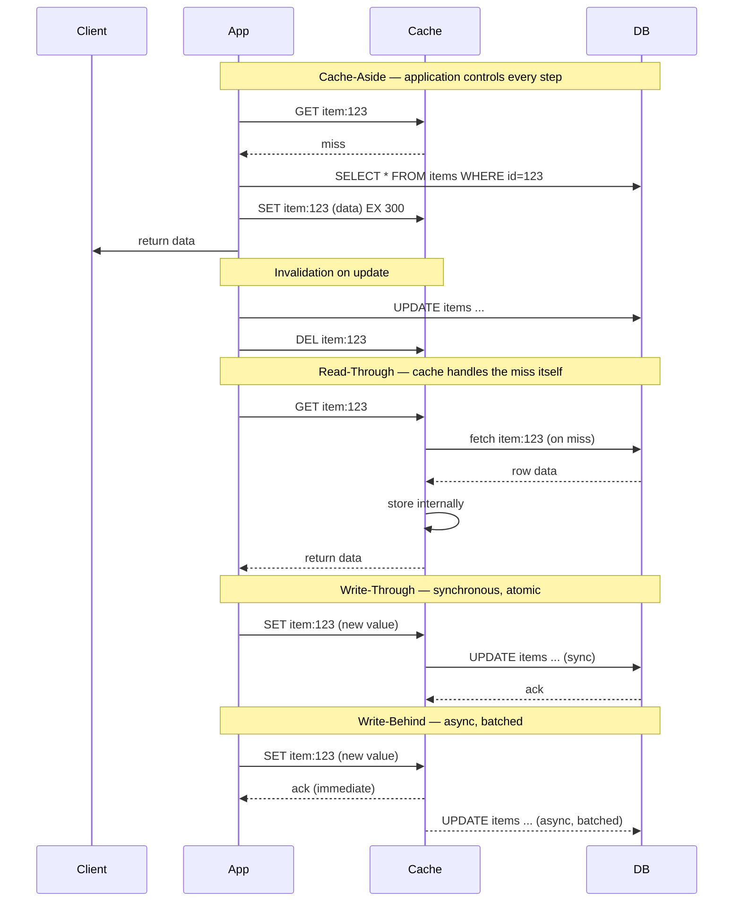
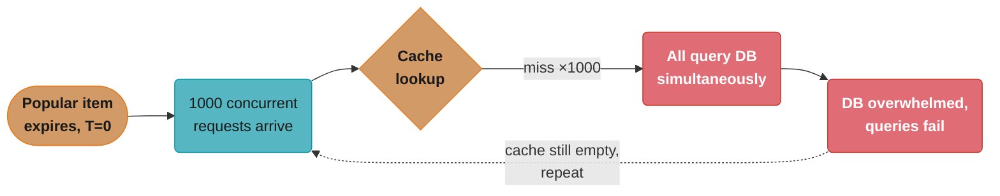
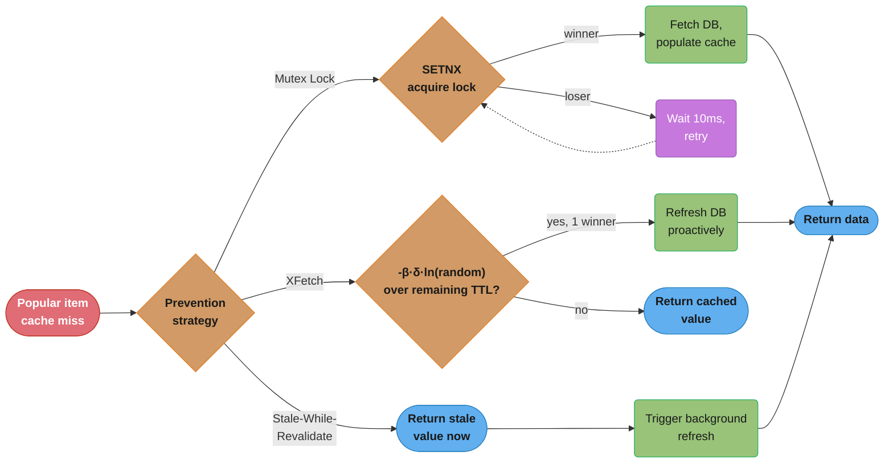
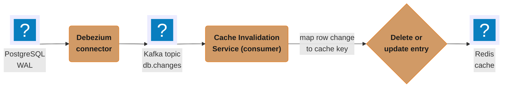
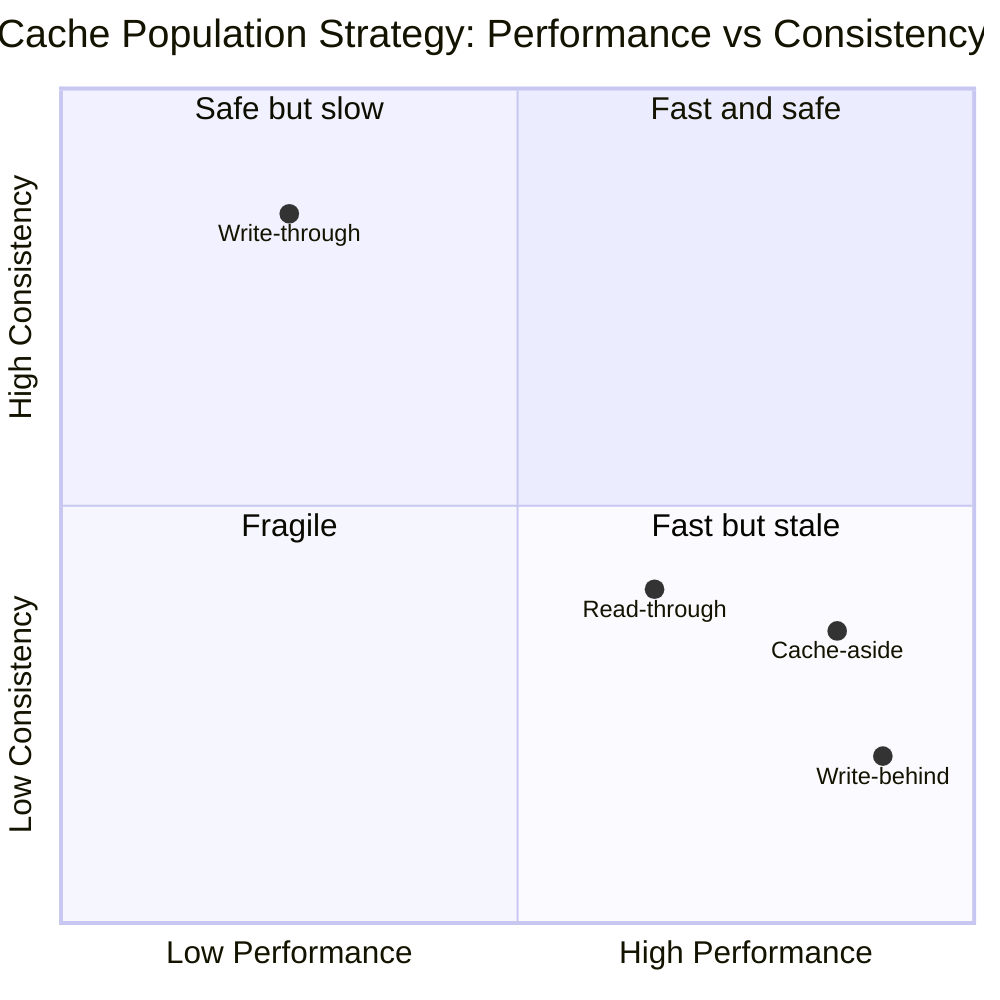
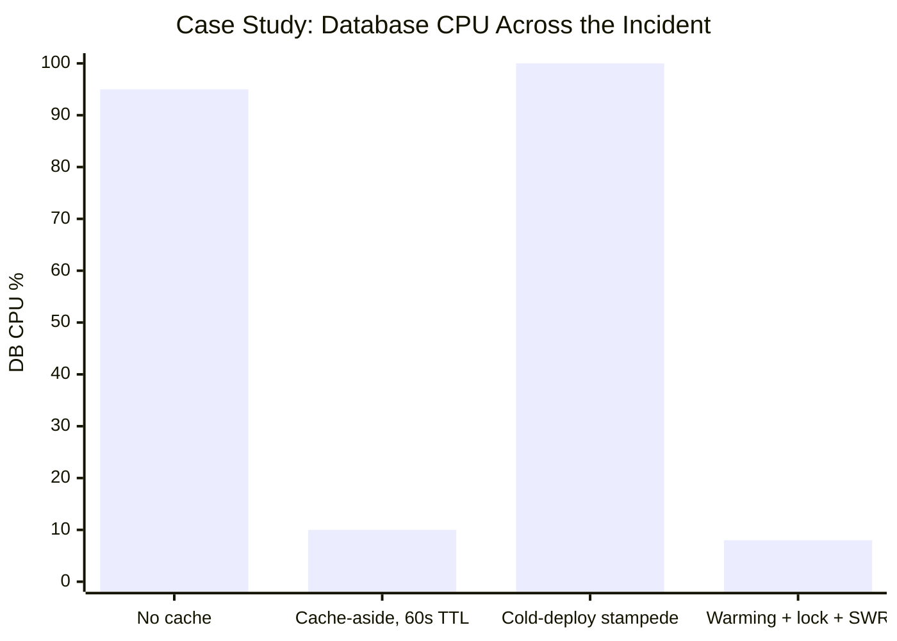

# Caching Strategies Deep Dive

<!-- tiers: principal senior -->

## 1. Concept Overview

A cache stores the results of expensive operations so subsequent requests can be served faster. Caching is the single highest-leverage performance optimization available to most backend systems — a well-designed cache can reduce database load by 95% and cut response times from 50ms to <1ms. But caching introduces complexity: cache invalidation is one of computer science's two hard problems, and a cache stampede can destroy a database just as effectively as removing the cache entirely.

This module covers the full spectrum: cache placement strategies (aside, read-through, write-through, write-behind, refresh-ahead), Redis data structures and their optimal use cases, cache stampede prevention, eviction policies, and the practical tradeoffs between local and distributed caches.

---

## 2. Intuition

> **One-line analogy**: A cache is like a notepad next to your phone — instead of looking up the same phone number in a thick directory (database) every time you need it, you write it on your notepad (cache) after the first lookup. The notepad gets stale if the phone book changes, but for most numbers, it's accurate long enough to be useful.

**Mental model**: Cache-aside is the most common: check the cache first; if miss, fetch from database and populate the cache; return data. The application controls cache population. For read-heavy workloads where data changes infrequently, cache-aside dramatically reduces database load.

**Why it matters**: At scale, the database cannot serve every read request. Facebook's memcache tier "handles billions of requests per second and holds trillions of items" (Nishtala et al., *Scaling Memcache at Facebook*, NSDI 2013), and Meta's graph cache TAO serves over a billion reads per second. Without caching, any database-backed service hits capacity limits at a fraction of the required scale.

**Key insight**: The hardest problem in caching is not performance — it is correctness. Cache invalidation, thundering herd, and cache poisoning are the failure modes. A cache that returns wrong data is worse than no cache at all. Design invalidation before you design population.

---

## 3. Core Principles

- **Hit rate**: Percentage of requests served from cache. Target >90% for high-value caches. Low hit rate means the cache is not providing value.
- **Eviction**: When the cache is full, items must be evicted to make room. Policy choice (LRU, LFU, TTL) determines which items are kept.
- **TTL (Time To Live)**: Each item can expire after a fixed duration, simplifying invalidation at the cost of staleness window.
- **Cache coherence**: Multiple cache instances (distributed or local) must agree on the current value. Consistency tradeoffs are unavoidable.
- **Cold start**: When a cache starts empty (deployment, restart), all requests hit the database — a cache cold start can overwhelm the database. Warm the cache before taking traffic.

### Reading the hit-rate number

Hit rate is the one cache metric everything else derives from. The effective latency a caller
sees is the weighted average of the two paths:

```
effective_latency = hit_rate x cache_latency + (1 - hit_rate) x db_latency
db_load           = (1 - hit_rate) x request_rate
```

**In plain terms.** "The misses do all the damage." Because the miss path is 50x slower than
the hit path, your average latency is dominated by the small slice of traffic that misses, not
by the large slice that hits — which is why the difference between a 90% and a 99% hit rate is
much bigger than it sounds.

| Symbol | What it is |
|--------|------------|
| `hit_rate` | Fraction of requests served from cache. `0.90` = 90% |
| `1 - hit_rate` | Miss rate. The fraction that falls through to the database |
| `cache_latency` | Redis round trip. Roughly `1 ms` (from §1: "<1ms") |
| `db_latency` | The uncached query. Roughly `50 ms` (from §1) |
| `request_rate` | Incoming traffic in RPS. Multiplied by the miss rate to get DB QPS |

**Walk one example.** Using `1 ms` cached, `50 ms` uncached, at 1,000 RPS:

```
  hit rate   effective latency = h x 1 + (1-h) x 50      DB load = (1-h) x 1000
  -------    ---------------------------------------     ----------------------
    80%      0.80 x 1 + 0.20 x 50  = 0.8 + 10.0 = 10.8ms      200 queries/s
    90%      0.90 x 1 + 0.10 x 50  = 0.9 +  5.0 =  5.9ms      100 queries/s
    97%      0.97 x 1 + 0.03 x 50  = 0.97 + 1.5 =  2.47ms      30 queries/s
    99%      0.99 x 1 + 0.01 x 50  = 0.99 + 0.5 =  1.49ms      10 queries/s

  80% -> 90% costs you 10 points of hit rate and buys 4.9ms.
  90% -> 99% costs you  9 points of hit rate and buys 4.4ms AND a 10x cut in DB load.
```

Both jumps are worth roughly the same latency, but the second one is what actually saves the
database: DB load scales with the *miss* rate, so the last few points of hit rate are where a
cache stops being a latency trick and starts being a capacity strategy. This is also why
"hit rate dropped from 97% to 90%" is a page-worthy alert — DB QPS just tripled.

---

## 4. Types / Architectures / Strategies

### 4.1 Cache Population Strategies

| Strategy | Who populates cache | When | Best For |
|----------|-------------------|------|---------|
| Cache-aside (lazy) | Application | On cache miss | Most use cases, fine-grained control |
| Read-through | Cache library/proxy | On cache miss (transparently) | Simplifies application code |
| Write-through | Application | On every write | Strong consistency requirement |
| Write-behind (write-back) | Cache library | Async after write | Write-heavy with eventual consistency |
| Refresh-ahead | Background thread | Before expiry | Predictable access patterns |

### 4.2 Cache Invalidation Strategies

| Strategy | Description | Consistency | Complexity |
|----------|-------------|-------------|------------|
| TTL | Items expire after fixed time | Eventual (staleness = TTL) | Low |
| Event-driven | Application invalidates on write | Near-strong — a window remains between DB commit and the evict, plus the classic re-populate race (a concurrent reader that already read the old row can SET it back after the evict) | Medium |
| Write-through | Update cache and DB together | Strong only if the cache and DB writes are made atomic; otherwise a small window | Medium |
| Cache-busting | New key per version (e.g., user.v123) | Strong (the old key is simply never read again) | Medium |
| Tag-based | Invalidate all items with a tag | Near-strong — same commit-to-evict window as event-driven | High |
| CDC (Change Data Capture) | DB changes trigger cache invalidation | Eventual — invalidation is asynchronous; staleness = log-tail + broker + consumer lag | High |

### 4.3 Redis Data Structures

| Structure | Commands | Use Case |
|-----------|---------|---------|
| String | GET, SET, INCR, EXPIRE | Simple key-value, counters, rate limiting |
| Hash | HGET, HSET, HDEL, HGETALL | User objects, session data (partial updates) |
| List | LPUSH, RPUSH, LRANGE, LLEN | Activity feeds, message queues, recent items |
| Set | SADD, SMEMBERS, SINTERSTORE | Tags, unique visitors, following/followers |
| Sorted Set (ZSet) | ZADD, ZRANGEBYSCORE, ZRANK | Leaderboards, time-ordered feeds, rate limiting |
| HyperLogLog | PFADD, PFCOUNT | Approximate distinct count (0.81% standard error) |
| Bloom Filter | BF.ADD, BF.EXISTS (built into Redis Open Source 8+; a RedisBloom module before that) | Definitely-not-present queries (no false negatives) |
| Pub/Sub | PUBLISH, SUBSCRIBE | Lightweight real-time messaging |
| Stream | XADD, XREAD, XGROUP | Persistent, consumer-group based message log |

### 4.4 Eviction Policies

Set with `maxmemory-policy`. The **default is `noeviction`** — Redis will not evict anything until you change it. Eviction only kicks in once `maxmemory` is set; `maxmemory 0` (the default on 64-bit builds) means no limit, so an untuned Redis grows until the OS kills it.

| Policy | Description | Use Case |
|--------|-------------|---------|
| noeviction (default) | Error on write when full | Never evict (return error instead) |
| allkeys-lru | Evict LRU from all keys | General purpose, mixed TTL workload |
| volatile-lru | Evict LRU from keys with TTL | Protect permanent keys |
| allkeys-lfu | Evict least-frequently-used | Skewed access patterns |
| volatile-lfu | Evict LFU from keys with TTL | Skewed access, protecting permanent keys |
| allkeys-lrm | Evict least-recently-*modified* (Redis 8.6+) | Read-heavy sets where stale-but-hot data should still age out |
| volatile-lrm | Evict LRM from keys with TTL (Redis 8.6+) | Same, protecting permanent keys |
| allkeys-random | Random eviction | Keys accessed with roughly equal frequency |
| volatile-random | Random eviction among keys with TTL | Same, protecting permanent keys |
| volatile-ttl | Evict keys with shortest remaining TTL | Self-managing TTL-based caches |

All `volatile-*` policies behave like `noeviction` if no key has a TTL — a common production surprise. LRU, LFU and LRM are all **approximated**: Redis samples `maxmemory-samples` keys (default 5) per eviction rather than maintaining a true global ordering.

For most caches: `allkeys-lru` or `allkeys-lfu`. LFU is better for workloads where a small set of items is accessed extremely frequently (hot keys).

---

## 5. Architecture Diagrams

### Cache Patterns Comparison


```mermaid
sequenceDiagram
    participant Cl as Client
    participant App as App
    participant Ca as Cache
    participant DB as DB

    Note over App,DB: Cache-Aside — application controls every step
    App->>Ca: GET item:123
    Ca-->>App: miss
    App->>DB: SELECT * FROM items WHERE id=123
    App->>Ca: SET item:123 (data) EX 300
    App->>Cl: return data
    Note over App,Ca: Invalidation on update
    App->>DB: UPDATE items ...
    App->>Ca: DEL item:123

    Note over App,DB: Read-Through — cache handles the miss itself
    App->>Ca: GET item:123
    Ca->>DB: fetch item:123 (on miss)
    DB-->>Ca: row data
    Ca->>Ca: store internally
    Ca-->>App: return data

    Note over App,DB: Write-Through — synchronous, atomic
    App->>Ca: SET item:123 (new value)
    Ca->>DB: UPDATE items ... (sync)
    DB-->>Ca: ack

    Note over App,DB: Write-Behind — async, batched
    App->>Ca: SET item:123 (new value)
    Ca-->>App: ack (immediate)
    Ca-->>DB: UPDATE items ... (async, batched)
```

All four patterns funnel through the same three participants — only who calls whom, and when, changes. Write-behind is the only pattern that acknowledges the client before the database write commits, which is exactly where its data-loss-on-crash risk comes from.

### Cache Stampede Prevention

**The problem — thundering herd:**


```mermaid
flowchart LR
    classDef io      fill:#61afef,stroke:#2e86c1,color:#1a1a1a,font-weight:bold
    classDef frozen  fill:#c678dd,stroke:#9b59b6,color:#fff
    classDef train   fill:#98c379,stroke:#27ae60,color:#1a1a1a
    classDef mathOp  fill:#d19a66,stroke:#e67e22,color:#1a1a1a,font-weight:bold
    classDef lossN   fill:#e06c75,stroke:#c0392b,color:#fff,font-weight:bold
    classDef req     fill:#56b6c2,stroke:#0097a7,color:#1a1a1a
    classDef base    fill:#e5c07b,stroke:#f39c12,color:#1a1a1a

    Expire(["Popular item<br/>expires, T=0"]) --> Burst("1000 concurrent<br/>requests arrive")
    Burst --> Check{"Cache<br/>lookup"}
    Check -->|"miss ×1000"| Hammer("All query DB<br/>simultaneously")
    Hammer --> Overload("DB overwhelmed,<br/>queries fail")
    Overload -.->|"cache still empty,<br/>repeat"| Burst

    class Expire,Check mathOp
    class Burst req
    class Hammer,Overload lossN
```

All 1,000 requests land inside the same expiry instant, so every one of them checks the cache before any single request can refill it — the resulting database overload feeds back into the same still-empty cache, repeating the cycle until something breaks it.

**Three prevention strategies:**


```mermaid
flowchart LR
    classDef io      fill:#61afef,stroke:#2e86c1,color:#1a1a1a,font-weight:bold
    classDef frozen  fill:#c678dd,stroke:#9b59b6,color:#fff
    classDef train   fill:#98c379,stroke:#27ae60,color:#1a1a1a
    classDef mathOp  fill:#d19a66,stroke:#e67e22,color:#1a1a1a,font-weight:bold
    classDef lossN   fill:#e06c75,stroke:#c0392b,color:#fff,font-weight:bold
    classDef req     fill:#56b6c2,stroke:#0097a7,color:#1a1a1a
    classDef base    fill:#e5c07b,stroke:#f39c12,color:#1a1a1a

    Miss(["Popular item<br/>cache miss"]) --> Pick{"Prevention<br/>strategy"}

    Pick -->|"Mutex Lock"| Lock{"SETNX<br/>acquire lock"}
    Lock -->|"winner"| Fetch("Fetch DB,<br/>populate cache")
    Lock -->|"loser"| Wait("Wait 10ms,<br/>retry")
    Wait -.-> Lock
    Fetch --> Return(["Return data"])

    Pick -->|"XFetch"| Formula{"-β·δ·ln(random)<br/>over remaining TTL?"}
    Formula -->|"yes, 1 winner"| Refresh("Refresh DB<br/>proactively")
    Formula -->|"no"| Cached(["Return cached<br/>value"])
    Refresh --> Return

    Pick -->|"Stale-While-<br/>Revalidate"| Stale(["Return stale<br/>value now"])
    Stale --> BG("Trigger background<br/>refresh")
    BG --> Return

    class Miss lossN
    class Pick,Lock,Formula mathOp
    class Fetch,Refresh,BG train
    class Wait frozen
    class Return,Cached,Stale io
```

All three strategies intercept the same cache-miss moment but resolve the contention differently: the mutex lock guarantees exactly one winner while losers wait and retry, XFetch avoids locking altogether by making the refresh probabilistic as expiry nears, and stale-while-revalidate skips waiting entirely by serving the old value while a refresh runs in the background.

#### Decoding the XFetch test in the diagram

The `-β·δ·ln(random)` box is the whole of XFetch (Vattani, Chierichetti & Lowenstein, *Optimal
Probabilistic Cache Stampede Prevention*, PVLDB 8(8), 2015 — their Figure 3 tests
`Time() - Δβ·log(rand()) >= expiry`). Written out, every reader that gets a cache hit evaluates:

```
refresh early  if   now - delta x beta x ln(U)  >=  expiry_time
                    \_______________________/
                       a random "lookahead" window, in the same
                       units as delta (recompute time)
```

**The idea behind it.** "Every reader rolls a die, and the closer the key gets to expiring the
more likely someone rolls a winner and rebuilds it early — so the key is almost never alive at
the instant it dies." It converts one synchronised stampede at expiry into a trickle of single
voluntary refreshes spread over the seconds before it.

| Symbol | What it is |
|--------|------------|
| `delta` (`δ`) | How long the value takes to recompute. Expensive values get a wider window |
| `beta` (`β`) | Aggressiveness knob, default `1`. Higher = refresh earlier and more often |
| `U` | A fresh uniform random draw in `[0,1)`, one per reader |
| `ln(U)` | Always negative, so `-ln(U)` is positive. Usually small, occasionally large |
| `delta x beta x -ln(U)` | The lookahead: how far into the future this reader pretends it is |

`-ln(U)` is the trick. It is drawn from an exponential distribution: mostly near zero, with a
long thin tail. So most readers pretend they are barely in the future and do nothing, while an
occasional reader pretends it is far in the future and rebuilds.

**Walk one example.** A key with a 300s TTL and `delta = 0.2s` recompute, `beta = 1`:

```
      U       -ln(U)     lookahead = 0.2 x 1 x -ln(U)   refresh if remaining TTL is under
    ------   --------    ---------------------------   --------------------------------
     0.90     0.1054              0.0211 s                       21 ms  (almost never)
     0.50     0.6931              0.1386 s                      139 ms
     0.10     2.3026              0.4605 s                      461 ms
     0.01     4.6052              0.9210 s                      921 ms  (the lottery winner)

  A reader with remaining TTL r seconds refreshes with probability e^(-r / 0.2):
  1.1% at r = 0.9s, 5.0% at r = 0.6s, 37% at r = 0.2s. At 1,000 reads/s the first
  winner therefore shows up around 0.9s before expiry — it rebuilds, the write
  resets the TTL, and every reader after it sees a fresh key again.
  Without XFetch, all 1,000 readers in the second AFTER expiry miss at once.
```

**Why `delta` is in there and what breaks without it.** The window scales with recompute cost,
so a value that takes 2s to rebuild starts trying 10x earlier than one that takes 0.2s — the
expensive keys, which are exactly the ones whose stampede would hurt most, get the most runway.
Drop `delta` and every key gets the same lookahead regardless of how costly it is to rebuild,
which under-protects the slow keys and needlessly churns the cheap ones.

---

## 6. How It Works — Detailed Mechanics

### 6.1 Cache-Aside with Spring Cache Abstraction

```java
// Spring @Cacheable delegates to the configured CacheManager
@Service
public class ProductService {

    @Cacheable(
        value = "products",
        key = "#id",
        condition = "#id > 0",
        unless = "#result == null"
    )
    public Product getProduct(Long id) {
        return productRepository.findById(id).orElse(null);
        // Return value is automatically cached
    }

    @CacheEvict(value = "products", key = "#product.id")
    public Product updateProduct(Product product) {
        return productRepository.save(product);
        // Cache entry for this product evicted after save
    }

    @CachePut(value = "products", key = "#product.id")
    public Product saveProduct(Product product) {
        Product saved = productRepository.save(product);
        // Cache updated with new value (not evicted)
        return saved;
    }

    // Evict all entries in a cache
    @CacheEvict(value = "products", allEntries = true)
    public void clearProductCache() { }

    // Multiple cache operations
    @Caching(evict = {
        @CacheEvict(value = "products", key = "#id"),
        @CacheEvict(value = "product-search", allEntries = true)
    })
    public void deleteProduct(Long id) {
        productRepository.deleteById(id);
    }
}
```

### 6.2 Redis Data Structure Usage

```java
// Sorted Set for leaderboard
// Score = player's score; ZADD updates or inserts
redisTemplate.opsForZSet().add("leaderboard", playerId, score);

// Top 10 players (highest score first)
Set<String> top10 = redisTemplate.opsForZSet()
    .reverseRange("leaderboard", 0, 9);

// Player's rank (0-indexed)
Long rank = redisTemplate.opsForZSet()
    .reverseRank("leaderboard", playerId);

// Rate limiting with Sorted Set (sliding window).
// NOTE: these four calls are four separate round trips, so concurrent requests
// can interleave and overshoot the limit. In production, wrap the identical
// sequence in a Lua script (see 6.3) so Redis executes it atomically.
String key = "rate:" + userId;
long now = System.currentTimeMillis();
long windowStart = now - 60_000; // 1-minute window

// Add current request timestamp
redisTemplate.opsForZSet().add(key, now + ":" + UUID.randomUUID(), now);
// Remove old requests outside window
redisTemplate.opsForZSet().removeRangeByScore(key, 0, windowStart);
// Count requests in window
Long count = redisTemplate.opsForZSet().zCard(key);
redisTemplate.expire(key, Duration.ofSeconds(70));

if (count > 100) {
    throw new RateLimitExceededException("Rate limit: 100 req/min");
}

// HyperLogLog for unique visitor counting
redisTemplate.opsForHyperLogLog().add("unique_visitors:" + date, userId);
Long uniqueCount = redisTemplate.opsForHyperLogLog()
    .size("unique_visitors:" + date);
// Approximate count, 0.81% standard error. At most 12 KB per key (dense
// encoding); low-cardinality keys use a smaller sparse encoding.

// Hash for user session (partial update without serializing full object)
String sessionKey = "session:" + sessionId;
redisTemplate.opsForHash().put(sessionKey, "cart_count", "5");
redisTemplate.opsForHash().put(sessionKey, "last_activity", Long.toString(now));
// No need to read-modify-write the entire session object
// Redis stores hash fields as strings — casting straight to Integer throws
// ClassCastException. Read as String and parse.
int cartCount = Integer.parseInt(
    (String) redisTemplate.opsForHash().get(sessionKey, "cart_count"));
```

### 6.3 Distributed Cache Stampede Prevention with Lua

```lua
-- Atomic lock acquisition + cache check (prevents race condition)
-- Returns: the cached value if present, else the sentinel '__LOCK_ACQUIRED__'
-- (this caller must refresh and then release the lock) or '__LOCK_WAIT__'
-- (someone else is refreshing; wait and re-read the key).

local key = KEYS[1]
local lockKey = KEYS[2]
local lockExpiry = ARGV[1]

local cached = redis.call('GET', key)
if cached then
    return cached
end

local acquired = redis.call('SET', lockKey, '1', 'NX', 'EX', lockExpiry)
if acquired then
    return '__LOCK_ACQUIRED__'
else
    return '__LOCK_WAIT__'
end
```

```java
// Java usage
public String getWithStampedeProtection(String key) throws InterruptedException {
    // Try direct cache hit
    String value = redis.get(key);
    if (value != null) return value;

    String lockKey = "lock:" + key;
    int maxRetries = 10;
    int waitMs = 50;

    for (int i = 0; i < maxRetries; i++) {
        // BROKEN — do NOT do this:
        //     Boolean acquired = redis.setNX(lockKey, "1");
        //     redis.expire(lockKey, 5);
        // Two problems. (1) SETNX and EXPIRE are separate round trips: crash in
        // between and the lock never expires, so every future request for this
        // key waits out the full retry loop forever. (2) EXPIRE runs even when
        // acquisition FAILED, so a loser keeps pushing out the winner's TTL.
        // FIX — one atomic call, and a unique token so we only delete our own lock:
        String token = UUID.randomUUID().toString();
        boolean acquired = redis.set(lockKey, token, SetArgs.nx().ex(5));

        if (acquired) {
            try {
                // Double-check after acquiring lock
                value = redis.get(key);
                if (value != null) return value;

                // Fetch from database
                value = database.fetch(key);
                redis.setex(key, 300, value); // 300s TTL
                return value;
            } finally {
                // Compare-and-delete: a plain DEL would delete someone else's
                // lock if ours had already expired mid-fetch.
                redis.eval(
                    "if redis.call('GET', KEYS[1]) == ARGV[1] "
                  + "then return redis.call('DEL', KEYS[1]) else return 0 end",
                    List.of(lockKey), token);
            }
        }

        // Wait for the lock holder to populate the cache
        Thread.sleep(waitMs);

        // Check if cache was populated while waiting
        value = redis.get(key);
        if (value != null) return value;
    }

    // Fallback after ~500ms: fetch directly from DB so no request blocks
    // indefinitely. Note this deliberately trades away the "exactly one DB
    // query per key" guarantee — if the rebuild takes longer than
    // maxRetries * waitMs, every waiter falls through to the database.
    // Size the retry budget above your p99 rebuild time, or the fallback
    // reintroduces the very stampede the lock exists to prevent.
    return database.fetch(key);
}
```

### 6.4 Cache Invalidation with CDC (Change Data Capture)


```mermaid
flowchart LR
    classDef io      fill:#61afef,stroke:#2e86c1,color:#1a1a1a,font-weight:bold
    classDef frozen  fill:#c678dd,stroke:#9b59b6,color:#fff
    classDef train   fill:#98c379,stroke:#27ae60,color:#1a1a1a
    classDef mathOp  fill:#d19a66,stroke:#e67e22,color:#1a1a1a,font-weight:bold
    classDef lossN   fill:#e06c75,stroke:#c0392b,color:#fff,font-weight:bold
    classDef req     fill:#56b6c2,stroke:#0097a7,color:#1a1a1a
    classDef base    fill:#e5c07b,stroke:#f39c12,color:#1a1a1a

    wal@{ icon: "logos:postgresql", form: "square", label: "PostgreSQL<br/>WAL", pos: "b", h: 44 }
    deb("Debezium<br/>connector")
    topic@{ icon: "logos:kafka", form: "square", label: "Kafka topic<br/>db.changes", pos: "b", h: 44 }
    cache@{ icon: "logos:redis", form: "square", label: "Redis<br/>cache", pos: "b", h: 44 }

    wal --> deb
    deb --> topic
    topic --> svc("Cache Invalidation<br/>Service (consumer)")
    svc -->|"map row change<br/>to cache key"| act{"Delete or<br/>update entry"}
    act --> cache

    class deb mathOp
    class svc,act mathOp
```

Debezium tails the WAL so no application write path ever has to remember to invalidate the cache — every row change flows through Kafka to the invalidation service, which maps it to a cache key and deletes or updates the entry.

```
Configuration (Debezium):
  database.server.name: "myapp"
  table.include.list: "public.products,public.users"
  slot.name: "debezium_cache"

Kafka message on UPDATE:
  {
    "op": "u",         // update
    "before": { "id": 1, "name": "Old Name" },
    "after": { "id": 1, "name": "New Name" },
    "source": { "table": "products", "ts_ms": ... }
  }

Cache invalidation service:
  key = "product:" + after.id
  redis.del(key)  // or update if write-through
```

---

## 7. Real-World Examples

**Twitter Feed**: As described by Twitter engineering in 2014, the home timeline was a per-user list held in a forked, customized Redis. It did *not* use a sorted set — the team added a purpose-built "hybrid list" (a linked list of ziplists) because a single huge ziplist has to be rewritten on every insert, and evicting one to find contiguous RAM stalled writes. When a followee tweets, the tweet ID is prepended to each follower's timeline (fan-out on write); reading is a range scan over the head of that list. For accounts with millions of followers, fan-out on write is skipped and those tweets are merged in at read time. Treat this as a 2014 snapshot of a system that has since been rebuilt.

**Facebook TAO**: Meta's distributed graph cache (TAO) caches objects and associations (friendships, reactions, comments). TAO is explicitly a **write-through** cache, not a look-aside one — it replaced the earlier memcache-look-aside-over-MySQL pattern precisely so that product code no longer had to hand-manage invalidation. Meta states TAO "handles over a billion read requests and millions of write requests every second."

**Redis for rate limiting**: Stripe's published rate limiter (`stripe.com/blog/rate-limiters`, 2017) and GitHub's sharded, replicated API rate limiter both run their counter logic as Redis Lua scripts; Lua's atomic execution prevents race conditions in the sliding-window/token-bucket update. Note that not every large provider centralizes on Redis: Cloudflare's WAF rate limiting keeps counters **per data center** (the `cf.colo.id` characteristic is mandatory on every rule), because an anycast edge cannot afford a round trip to a central store.

---

## 8. Tradeoffs

| Strategy | Consistency | Performance | Complexity |
|----------|-------------|------------|------------|
| Cache-aside | Eventual (stale until TTL) | Best (no cache write overhead) | Low |
| Read-through | Eventual | Good (cache populates on miss) | Medium |
| Write-through | Strong *if* the cache and DB writes are atomic | Lower (extra cache write per DB write) | Medium |
| Write-behind | Eventual | Best for writes | High (data loss risk) |


```mermaid
quadrantChart
    title Cache Population Strategy: Performance vs Consistency
    x-axis Low Performance --> High Performance
    y-axis Low Consistency --> High Consistency
    quadrant-1 Fast and safe
    quadrant-2 Safe but slow
    quadrant-3 Fragile
    quadrant-4 Fast but stale
    Cache-aside: [0.85, 0.35]
    Read-through: [0.65, 0.4]
    Write-through: [0.25, 0.85]
    Write-behind: [0.9, 0.2]
```

None of the four strategies lands in the "fast and safe" quadrant — every real option pays for speed with staleness (cache-aside, read-through, write-behind) or pays for consistency with an extra synchronous write (write-through). Write-behind sits furthest into "fast but stale" because a crash before flush loses data outright, not just serves a stale read.

| Cache Tier | Latency | Capacity | Shared |
|-----------|---------|---------|--------|
| Local (in-process, Caffeine) | ~100ns — a heap lookup, no syscall | Limited (JVM heap) | No |
| Redis (same DC) | ~1ms — one intra-DC round trip plus O(1) server work | Large (RAM) | Yes |
| Redis (cross-region) | Tens of ms, set by the RTT: CloudPing's measured p50 for `us-east-1` to `eu-west-1` is ~70ms, and `us-east-1` to `ap-southeast-1` is ~220ms | Large | Yes |
| CDN edge cache | Single-digit ms from a nearby PoP, but it is the PoP distance that decides, not the CDN | Very large | Yes |

Read this as four orders of magnitude, not four measurements. Only the cross-region row has a
published number behind it; the others are the shape of the operation — no syscall, one local
round trip, one intercontinental round trip. The lesson is the gap between the rows, and it is
why a cross-region cache read is usually slower than just querying the local database.

---

## 9. When to Use / When NOT to Use

**Cache-aside**: Use when you need fine-grained control over what gets cached and when. Best for read-heavy data that changes infrequently. Do not use when you need strong consistency (cache may be stale between write and TTL expiry).

**Write-through**: Use when cache must always be consistent with the database (financial data, inventory counts). The performance cost is one extra write per database write — acceptable for write-rare, read-heavy data.

**Local cache (Caffeine)**: Use for immutable or slowly-changing reference data (country codes, product categories). Eliminates network hop to Redis. Do not use for data that must be consistent across multiple service instances — each instance has a separate cache.

**Redis Pub/Sub for cache invalidation**: Use to invalidate local caches across instances when source data changes. Publish invalidation events; subscribers clear their local cache. Simple and effective for low-to-medium frequency changes.

---

## 10. Common Pitfalls

**Hot key in Redis**: A single Redis key receiving millions of operations per second (e.g., counter for a viral post) becomes a bottleneck. Redis executes commands on one thread, so every operation on a key is serialized behind one core — the ceiling is that core, not a fixed number. Redis's own published benchmark (which by default hammers a *single* key) reaches roughly 180k SET/s without pipelining and about 1.5M SET/s with a pipeline depth of 16 on a commodity Linux box; expect materially less than that once your values, network and TLS are real. The point stands: one key cannot be scaled by adding nodes. Fix: (1) local caching with short TTL (each app instance caches the hot key for 1 second); (2) Redis cluster with local in-process aggregation and periodic flush; (3) for counters, use Redis Cluster with slot migration or Cassandra counters.

**Cache stampede on startup**: Deploying a new service version cold-starts with an empty cache. The first minutes after deployment, all requests miss the cache and hit the database — potentially overwhelming it. Fix: cache warming (load popular items into cache before accepting traffic), or gradually route traffic to new instances.

**Caching mutable data without expiry**: Setting no TTL on a cache entry means stale data persists indefinitely unless explicitly evicted. A bug in invalidation logic means users see outdated data forever. Always set a TTL as a safety net, even for data with explicit invalidation (TTL is the last line of defense).

**Using allkeys-lru with varying data sizes**: LRU eviction does not consider object size. A 1-byte string and a 10-MB blob are equally "one item" in LRU. When large objects fill the cache, many small objects are evicted to make room. If small objects are accessed more frequently, this hurts hit rate. Use `maxmemory-policy allkeys-lfu` for workloads with mixed object sizes and skewed access patterns.

**Cache key collision**: Two different objects that happen to serialize to the same cache key return wrong data. Always include the entity type in the key: `product:123`, `user:123` — not just `123`. For complex keys: include all discriminating parameters and sort query parameters consistently.

---

## 11. Technologies & Tools

| Tool | Purpose |
|------|---------|
| Redis (Standalone) | Single-node cache/data structure server |
| Redis Cluster | Sharded Redis for horizontal scaling |
| Redis Sentinel | High availability for standalone Redis |
| Caffeine | High-performance in-process Java cache |
| Spring Cache | Cache abstraction (@Cacheable, @CacheEvict) |
| Spring Data Redis | RedisTemplate, ReactiveRedisTemplate |
| Jedis | Java Redis client (synchronous) |
| Lettuce | Java Redis client (async, reactive) |
| Redisson | Java Redis client with distributed objects |
| Memcached | Simple key-value cache — actively maintained (1.6.x, releases through 2026) and multi-threaded, so it scales a single hot key across cores better than Redis; choose Redis when you need data structures, persistence or replication |
| Varnish | HTTP caching proxy |
| CDN (CloudFront, Fastly) | Edge caching for static and dynamic content |

---

## 12. Interview Questions with Answers

**Q: What is cache-aside and how does it differ from read-through?**
**Short:** In cache-aside the application handles cache misses itself, while read-through delegates miss handling to the cache.

Cache-aside (lazy loading): the application checks the cache, handles miss by fetching from DB and populating the cache. The application controls all cache interactions. Read-through: the cache itself handles misses by calling the underlying data store — the application only interacts with the cache. Cache-aside gives finer control (only populate what you need); read-through simplifies application code but requires a cache that can call the data store.

**Q: What is a cache stampede (thundering herd) and how do you prevent it?**
**Short:** A cache stampede is many concurrent requests hitting the database at once after a popular key expires simultaneously.

A cache stampede occurs when a popular cached item expires simultaneously and many concurrent requests all miss the cache, all query the database in parallel, overwhelming it. Prevention: (1) Mutex lock — only one request fetches; others wait and read the result. (2) Probabilistic early expiry (XFetch) — randomly refresh before expiry so the stampede is avoided proactively. (3) Stale-while-revalidate — serve stale content while refreshing in the background.

**Q: What Redis data structures would you use for a social media feed?**
**Short:** A sorted set per user, scored by timestamp, is the natural Redis structure for a social media feed.

Sorted Set (ZSet) per user: each feed item's ID is the member, timestamp is the score. ZADD for adding new items, ZREVRANGE for reading the most recent N items, ZREMRANGEBYSCORE for removing old items. For large feeds: limit the ZSet to the last 1,000 items. TRIM with ZREMRANGEBYRANK after insert. User ID as part of the key: `feed:{userId}`.

**Q: Explain the difference between LRU and LFU eviction.**
**Short:** LRU evicts the least recently accessed item, while LFU evicts the least frequently accessed one, better for skewed hot keys.

LRU (Least Recently Used) evicts the item that was accessed least recently — it assumes recently accessed items will be accessed again. LFU (Least Frequently Used) evicts the item accessed least often — it handles cases where an item was accessed frequently historically but is now rarely needed. LFU is better for skewed access patterns where a small set of hot items dominate. LRU is better for temporal locality (recent items tend to be accessed again soon).

**Q: How do you invalidate a cache when data changes?**
**Short:** Invalidation options range from a simple TTL backstop to event-driven deletes, CDC-based invalidation, or write-through consistency.

(1) TTL-based: set a short TTL; stale data is eventually evicted. Simple but allows staleness window. (2) Event-driven: the write path explicitly deletes/updates the cache key. Strong consistency but requires all write paths to be aware of the cache. (3) CDC (Change Data Capture): a background process (Debezium) reads DB change logs and invalidates cache keys asynchronously. Decouples invalidation from write path. (4) Write-through: cache and DB always updated together — strongest consistency.

**Q: What is a hot key in Redis and how do you solve it?**
**Short:** A hot key overwhelms Redis's single-threaded execution for that key; fix it with local caching, replication, or Cluster sharding.

A hot key is a single Redis key receiving disproportionately high traffic (millions of ops/second). Redis executes commands on a single thread, so one key can only be processed as fast as one core allows — Redis's own single-key benchmark shows roughly 180k ops/s without pipelining and around 1.5M ops/s at pipeline depth 16, and no amount of sharding raises that, because the key lives in exactly one slot. Mitigations: (1) Local read-through cache: each app instance caches the hot key in-process for 1 second, greatly reducing Redis load. (2) Key replication: write to `hotkey:1`, `hotkey:2`, ..., `hotkey:N`; reads randomly pick one replica. (3) Redis Cluster: shard the hotkey across multiple slots. For write-heavy hot keys (counters), use local aggregation and periodic sync.

**Q: What is the difference between Redis standalone, Sentinel, and Cluster?**
**Short:** Standalone has no HA, Sentinel adds failover monitoring without scaling, and Cluster shards data for horizontal scale.

Standalone: single instance, simple, not HA. Sentinel: monitoring/failover system — N Sentinel processes watch a primary+replicas; if primary dies, Sentinel elects a replica as new primary. Applications use the Sentinel endpoint for transparent failover. No horizontal scaling. Cluster: shards data across multiple primary nodes (16384 hash slots). Horizontal scale for both read and write. Requires client-side cluster awareness. Use Sentinel for HA with simple data; Cluster for horizontal scaling.

**Q: When would you use a local in-process cache vs Redis?**
**Short:** Use a local cache for rarely-changing per-instance data, and Redis when state must stay consistent across instances.

Local cache (Caffeine): latency ~100 nanoseconds vs Redis ~1ms. Use for immutable or rarely-changing data (country codes, feature flags, configuration). The cache is per-instance — no sharing across instances. Cache consistency requires invalidation broadcast (Redis Pub/Sub) when data changes. Redis: use for data that must be consistent across instances (session data, rate limit counters, shared state). The network hop (~1ms) is acceptable for most use cases.

**Q: What is write-behind (write-back) caching and when is it appropriate?**
**Short:** Write-behind acknowledges writes instantly from the cache and persists to the database asynchronously, risking loss on crash.

Write-behind: the application writes to the cache, and the cache writes to the database asynchronously (batched, with delay). The application gets near-instant write acknowledgment. Appropriate for: write-heavy workloads where some data loss is acceptable (analytics events, session data), or writes that can be batched efficiently (many small writes merged into one bulk insert). Not appropriate for: financial transactions, orders, any data where loss is unacceptable.

**Q: How does the XFetch algorithm prevent cache stampedes?**
**Short:** XFetch has each cache reader probabilistically trigger an early refresh before expiry, so no request ever blocks.

XFetch (probabilistic early expiry) triggers cache refresh before the item expires. Each reader that gets a hit draws a fresh uniform random U in [0,1) and refreshes early if `now - β * δ * ln(U) >= expiry_time`, where β is the tuning factor (default 1) and δ is the measured time it took to recompute the value. Note that `-β * δ * ln(U)` is a *time window*, not a probability — it is an exponentially distributed "lookahead" that the reader pretends to jump forward by. As the remaining TTL shrinks, a smaller lookahead suffices, so a U closer to 1 is enough to win and early refresh becomes steadily more likely. The first winner rebuilds the value and rewrites the key, resetting the TTL, so later readers see a fresh key rather than a miss — the paper (Vattani et al., PVLDB 2015) shows this shrinks the stampede to a small residual size, not that it is provably exactly one refresher. No lock is needed and no request ever blocks.

**Q: How would you design cache invalidation for a payments API?**
**Short:** A payments cache should use event-driven invalidation with a short TTL backstop, and never write-behind for unacknowledged writes.

Use event-driven invalidation on the write path, with a short TTL as a backstop. When an object (charge, customer, subscription) is updated, the handler that commits the write explicitly evicts the cache key, so the next read repopulates from the source of truth; a 60-300 second TTL then bounds the damage from any write path that forgets to evict or any evict that fails. Reads stay cache-aside, because the caller knows which fields are safe to serve slightly stale (a customer's display name) and which must never be (an authorization decision or a balance), so those simply bypass the cache. Avoid write-behind entirely here: acknowledging a payment write before it is durable is exactly the failure mode you cannot accept. (Stripe has publicly described its Redis + Lua *rate limiter*, but not its cache invalidation strategy — do not present internal details of a specific company's cache design as known fact in an interview.)

**Q: How would you design caching for product inventory counts?**
**Short:** Inventory counts should use write-through or an atomic Redis DECR as source of truth to avoid overselling.

Inventory counts must be accurate (cannot oversell). Options: (1) Cache with write-through: all inventory decrements update both DB and cache atomically (using a DB transaction + cache update). (2) Don't cache inventory counts — read from DB with SELECT FOR UPDATE during checkout. (3) Cache with short TTL (5 seconds) for display purposes; always verify from DB before deducting. (4) Redis atomic DECR for inventory with a background sync to DB — Redis as the source of truth for inventory. Option 4 is used by high-scale systems (Redis DECR is atomic, preventing oversell at cache level).

**Q: What is the Vary header in HTTP caching and how does it relate to backend caches?**
**Short:** The Vary header names which request headers a cache must also match before it may reuse a stored response.

The HTTP Vary header names the request headers a cache must also match before it may reuse a stored response. `Vary: Accept-Encoding` means: cache one version for gzip clients and one for uncompressed. RFC 9111 section 4.1 states the rule for any cache, private browser caches included, not only shared CDN/proxy caches — a cache MUST NOT reuse a stored response with a Vary header unless every nominated request header matches the original request. Backend application caches (Redis) do not use HTTP Vary — but the same concept applies: a product response for user A (with their discount) should not be returned for user B. Include the user-specific factors in the cache key: `product:{id}:user:{userId}` for personalized responses, or `product:{id}` for public responses.

**Q: How do you design a cache for user authentication tokens?**
**Short:** Cache authentication tokens by hash with a TTL matching token expiry, and delete the entry immediately on revocation.

Cache: `session:{token_hash}` → `{userId, permissions, expires_at}`. TTL = token expiry time. On each request: check cache first (Redis GET); if hit, verify expires_at and use userId. If miss: validate token cryptographically (JWT signature) or look up in DB (opaque token). Revocation: when token is revoked, delete from cache immediately. For JWT: maintain a revocation list in Redis (bloom filter for efficiency: check if token hash is in revocation set before signature verification). Cache hit rate should be >99% — nearly every authenticated request reuses a recently checked token.

**Q: What is a cache key collision and how do you prevent it?**
**Short:** A cache key collision happens when two different objects share one key, so prefix keys by entity type to prevent it.

A cache key collision happens when two different objects are stored or read under the same cache key, so one silently overwrites or serves data meant for the other. This typically occurs when a key is built from a bare identifier — using just `123` for both a product and a user means whichever entity writes second wins, and reads for the other return the wrong object. Complex keys carry the same risk when query parameters are included in a different order or format across call sites, producing two different-looking keys for what should be the same cached value. Always prefix keys with the entity type (`product:123`, `user:123`) and normalize any parameters that form part of the key — for example, sort query parameters consistently — before building the final key string.

**Q: Why does allkeys-lru eviction hurt hit rate when cached objects vary widely in size?**
**Short:** allkeys-lru ignores object size, so evicting by recency can remove many small hot keys to free space for one large object.

LRU eviction tracks only recency, not size, so a 10 MB blob and a 1-byte counter count as exactly one item when deciding what to evict. When large objects dominate the cache, evicting by recency alone can remove many small, frequently-accessed objects just to free enough space for one large, less-frequently-accessed one — directly hurting hit rate for the small objects that make up most of the traffic. This is worse under skewed access patterns, where a handful of hot small keys should clearly outrank a rarely-touched large object, but pure LRU has no way to express that preference. Use `maxmemory-policy allkeys-lfu` instead for workloads with mixed object sizes, since frequency-based eviction protects hot small keys regardless of how large the competing objects are.

---

## 13. Best Practices

- Always set a TTL as a safety net, even for data with explicit invalidation.
- Use cache-aside as the default strategy; layer on write-through only for consistency-critical data.
- Prevent stampedes with mutex locks or XFetch for popular items.
- Monitor cache hit rate per cache, and alert on a drop relative to that cache's own baseline rather than only on an absolute floor — a fall from 97% to 90% already triples DB load (see section 3) while never crossing an 80% threshold.
- Use Redis Lua scripts for multi-step operations that must be atomic.
- Separate local cache (Caffeine) for reference data from distributed cache (Redis) for shared state.
- Set maxmemory and eviction policy on all Redis instances — never let Redis run without eviction.
- Include entity type in cache keys to prevent collisions: `product:{id}`, `user:{id}`.

---

## 14. Case Study

**Problem**: A product recommendation service was hitting the database for every recommendation request (200ms DB query). The service received 5,000 req/s. The database was at 95% CPU.

**Initial caching**: Added Redis cache-aside with 60-second TTL. Cache key: `recommendations:{userId}`. Results: DB queries dropped to ~500/s (10% miss rate). DB CPU dropped to 10%.

**New problem at 3 AM**: Deployment of new recommendation model. Service restarted. Cold cache. 5,000 simultaneous cache misses. All hit DB. Database CPU hit 100%, 30% of queries timed out. Cascade failure.

**Solutions applied**:
1. Cache warming: before taking traffic, pre-warm cache for top-1000 most active users.
2. Stampede protection: mutex lock on cache miss. One request per cache key rebuilds while the rest wait and re-read, with a bounded fallback (see 6.3) so no request blocks indefinitely — the retry budget must exceed the p99 rebuild time or the fallback lets the herd through anyway.
3. Stale-while-revalidate: TTL raised from 60 seconds to 5 minutes, and a stale entry is served while a background thread refreshes it. Users see slightly stale recommendations vs zero recommendations. (The 5-minute TTL is what the refresh-ahead job below is timed against.)

```java
@Cacheable(
    value = "recommendations",
    key = "#userId",
    condition = "#userId != null"
)
public List<Product> getRecommendations(String userId) {
    // Spring Cache abstraction handles cache-aside
    return recommendationEngine.compute(userId);
}

// Separate: refresh-ahead job
@Scheduled(fixedDelay = 240_000) // every 4 minutes (TTL is 5 min)
public void refreshHotUserRecommendations() {
    activeUserService.getTopActiveUsers(1000)
        .forEach(userId -> {
            List<Product> recs = recommendationEngine.compute(userId);
            cacheManager.getCache("recommendations")
                .put(userId, recs);  // update cache before TTL expiry
        });
}
```

**Final state**: Cache hit rate: 97%. DB CPU: 8%. Cold start from deployment: 2 minutes to warm top users, then normal traffic routed. Zero cascade failures in subsequent deployments.


```mermaid
xychart-beta
    title "Case Study: Database CPU Across the Incident"
    x-axis ["No cache", "Cache-aside, 60s TTL", "Cold-deploy stampede", "Warming + lock + SWR"]
    y-axis "DB CPU %" 0 --> 100
    bar [95, 10, 100, 8]
```

The cache-aside rollout alone cut DB CPU from 95% to 10%, but a cold deploy with no stampede protection spiked it right back to 100% — only after adding cache warming, the mutex lock, and stale-while-revalidate did the fix hold at 8% through every subsequent deployment.
