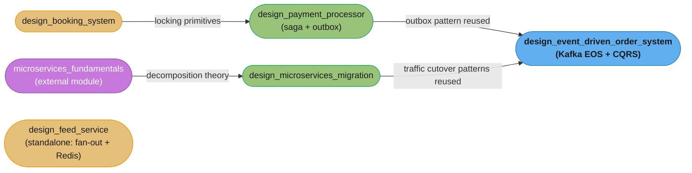

# Backend Engineering — Case Studies

Five end-to-end backend design case studies, each covering a real-world scenario with production-grade architecture, implementation tradeoffs, and interview discussion points.

---

## Quick Start

If you only have time for three case studies, read these first:

| File | Why |
|------|-----|
| [Design a Payment Processor](design_payment_processor/) | Covers the hardest backend problem — distributed saga with rollback, outbox pattern, and idempotency. These three patterns appear together in nearly every payment/order system interview. |
| [Design a Feed Service](design_feed_service/) | Teaches the canonical fan-out tradeoff (write vs read) and Redis sorted-set patterns that recur in every social/recommendation system. |
| [Design a Booking System](design_booking_system/) | Introduces the optimistic vs pessimistic locking decision under high concurrency — the core tension in any reservation or inventory system. |

---

## Full Learning Path

Grouped by primary engineering concern, not product category:

### Concurrency & Consistency

| Case Study | Primary Concern | What It Teaches |
|------------|----------------|----------------|
| [Design a Booking System](design_booking_system/) | Distributed locking, optimistic vs pessimistic concurrency | How to prevent double-booking: SELECT FOR UPDATE vs optimistic locking with version columns; when to escalate to a distributed lock (Redis Redlock); idempotency key design for retry safety. |

### Event-Driven Architecture & CQRS

| Case Study | Primary Concern | What It Teaches |
|------------|----------------|----------------|
| [Design an Event-Driven Order System](design_event_driven_order_system/) | Kafka EOS, CQRS, transactional outbox | How to achieve exactly-once order processing end-to-end: Kafka idempotent producer + transactional outbox + consumer idempotency; CQRS read model projection via Kafka Streams; DLQ handling and dead-letter replay. |

### Distributed Transactions & Saga

| Case Study | Primary Concern | What It Teaches |
|------------|----------------|----------------|
| [Design a Payment Processor](design_payment_processor/) | Saga orchestration, outbox pattern, idempotency | How to coordinate multi-service money movement without 2PC: saga orchestrator with compensating transactions; transactional outbox for reliable Kafka publish; idempotency keys scoped to request lifetime. |

### Read Scalability & Caching

| Case Study | Primary Concern | What It Teaches |
|------------|----------------|----------------|
| [Design a Feed Service](design_feed_service/) | Fan-out strategy, Redis sorted sets, cursor pagination | Fan-out-on-write vs fan-out-on-read: how follower count determines the crossover point; Redis ZADD for ranked feeds; cursor-based pagination that avoids COUNT(*) and OFFSET. |

### Service Decomposition & Migration

| Case Study | Primary Concern | What It Teaches |
|------------|----------------|----------------|
| [Design a Microservices Migration](design_microservices_migration/) | Strangler fig, traffic cutover, shared database migration | How to decompose a Java monolith without a big-bang rewrite: bounded context identification, branch-by-abstraction, feature flags for traffic routing, shared DB anti-pattern and the escape pattern. |

---

## Dependency Map

Arrows point from the case study that originates a pattern to the one that reuses it — `design_booking_system` → `design_payment_processor` → `design_event_driven_order_system` is the longest chain; `design_feed_service` has no prerequisites and can be read standalone.

---

## Interview Prep Shortcuts

| "Design X" Interview Question | Best Case Study |
|-------------------------------|----------------|
| Design a ticket reservation system | [design_booking_system](design_booking_system/) |
| Design a hotel / flight booking platform | [design_booking_system](design_booking_system/) |
| Design a payment processing system | [design_payment_processor](design_payment_processor/) |
| Design a wallet / ledger service | [design_payment_processor](design_payment_processor/) — combine with database/design_banking_ledger |
| Design a social media feed | [design_feed_service](design_feed_service/) |
| Design a notification service | [design_feed_service](design_feed_service/) — fan-out patterns apply |
| Design an order management system | [design_event_driven_order_system](design_event_driven_order_system/) |
| Design an e-commerce checkout | [design_payment_processor](design_payment_processor/) + [design_event_driven_order_system](design_event_driven_order_system/) |
| Design a monolith-to-microservices migration | [design_microservices_migration](design_microservices_migration/) |
| Design a strangler fig pattern | [design_microservices_migration](design_microservices_migration/) |

---

## Back to Backend Section

[Backend Engineering Master Index](../README.md)
