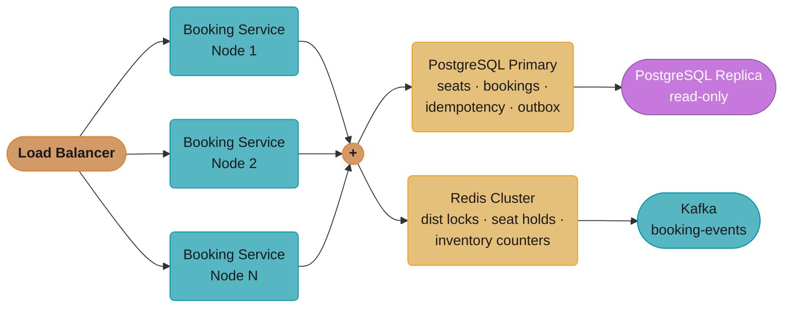
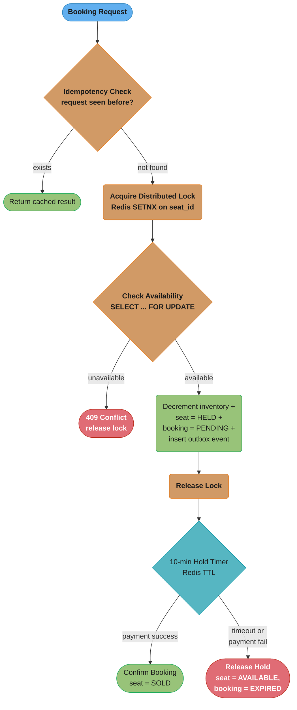
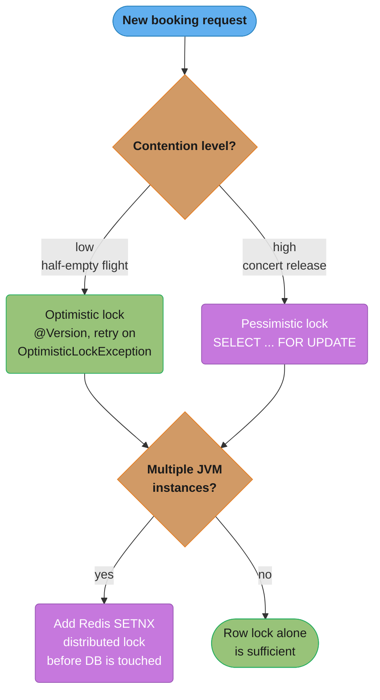
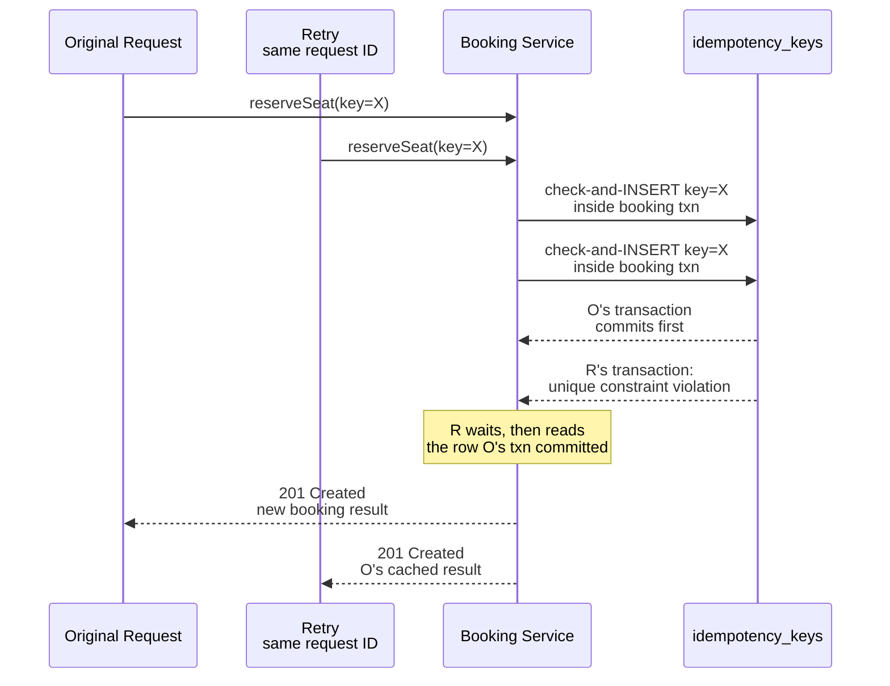

# Case Study: Seat Reservation System Under Concurrency

## Problem Statement

Build a seat reservation system for high-demand events — concert ticketing, flight seat selection, or
sporting event booking — where thousands to millions of users attempt to book the same finite inventory
simultaneously.

Core requirements:

- A seat can be reserved by exactly one customer. No overselling.
- Race condition: two users click "Book Seat 12A" at the same millisecond. Only one must succeed.
- Idempotency: a network timeout causes the client to retry. The retry must not create a second booking
  for the same request.
- Two-phase flow: RESERVE the seat (hold it for 10 minutes while the user completes payment), then
  CONFIRM on successful payment, or RELEASE if the hold expires.
- Inventory counters must be decremented atomically. Reading available count and decrementing must not
  race.

Scale targets:
- 500,000 concurrent users during a popular concert release window
- 10,000 booking requests per second at peak
- 99.9% availability; booking confirmation P99 latency under 2 seconds

---

## Architecture Overview



Stateless booking-service nodes scale horizontally behind the load balancer to absorb the 10,000 req/s peak, then converge on the same two stores — PostgreSQL for durable seat/booking/outbox rows and Redis for the distributed lock and hold TTLs — before PostgreSQL replicates to a read replica and the outbox flow lands on Kafka's `booking-events` topic.

**Two-Phase Booking State Machine**



Every request passes through the idempotency check and the distributed lock before it ever reaches the pessimistic row lock in Postgres, and the 10-minute Redis-TTL hold resolves to exactly one of two terminal states — confirmed sale or a fully released, re-bookable seat.

---

## Key Design Decisions

### 1. Locking Strategy Selection

Two valid strategies exist; the choice depends on contention level.

Optimistic locking with `@Version` is appropriate when contention is low: general seat selection on
a half-empty flight. The JPA `@Version` field increments on every update. A concurrent update fails
with `OptimisticLockException`, which is caught and retried. No database lock is held between read
and write, so throughput is high. Under high contention, repeated retries degrade to near-zero
throughput — the "thundering herd" effect makes optimistic locking impractical for concert releases.

Pessimistic locking with `SELECT ... FOR UPDATE` is appropriate for high-contention scenarios. The
database row is locked the moment it is read. Other transactions attempting to lock the same row
block until the holder commits or rolls back. This serializes access at the cost of reduced
concurrency. PostgreSQL's row-level locks mean only the specific seat row is locked, not the entire
table, so other seats are unaffected.

Distributed Redis lock is required when multiple JVM instances are running. Even with pessimistic
locking in Postgres, two application nodes could both reach the database and contend at the DB level.
A Redis SETNX (SET if Not eXists) with expiry acquires a named lock before the database is touched,
ensuring only one node proceeds for a given seat at a time. This reduces database lock contention and
provides a fast-fail path.



Contention level and node count are independent axes: contention alone picks `@Version` optimistic locking for the half-empty-flight case or `SELECT ... FOR UPDATE` pessimistic locking for the concert-release case, while a separate question — is more than one JVM instance running? — decides whether a Redis SETNX pre-check sits in front of either strategy.

### 2. Idempotency Key Table

Every booking request carries a client-generated `bookingRequestId` (UUID). Before any business
logic, the service checks the `idempotency_keys` table for this ID. If found, the previous result
is returned directly. If not found, the request is processed and the result is persisted with the
idempotency key. The check-and-insert is inside the same transaction as the booking, so concurrent
retries with the same key race to insert — only one wins; the loser gets a unique constraint
violation and waits, then reads the winning result.



The unique index on `booking_request_id` is the actual arbiter: whichever transaction commits first wins the insert, and the loser's unique-constraint violation is the signal to fall back to reading that same row instead of treating the retry as sold-out or duplicate.

### 3. Two-Phase Booking

Collecting payment inline (charge card → book seat atomically) is not possible because payment
involves an external system. The two-phase model separates concerns:

- Phase 1 RESERVE: decrement inventory, mark seat as HELD, create booking in PENDING state, set
  a Redis TTL of 600 seconds on the seat hold key. The user proceeds to the payment page.
- Phase 2 CONFIRM: on payment success callback, transition booking to CONFIRMED and seat to SOLD.
- RELEASE: a scheduled job (or Redis keyspace notification) finds expired holds and restores
  inventory. This prevents permanently lost seats from abandoned sessions.

### 4. Outbox Pattern for Booking Events

The booking service must emit a `BookingConfirmed` event to downstream services (email notification,
analytics, loyalty points). Writing to the database and publishing to Kafka in two separate
operations creates a dual-write problem: the DB write succeeds but Kafka publish fails (or vice
versa). The outbox pattern writes an event record to an `outbox` table in the same transaction as
the booking. A separate outbox poller reads unprocessed events and publishes them to Kafka, then
marks them processed. This guarantees at-least-once event delivery with no data loss.

### 5. Inventory Counter Strategy

Rather than counting available seats with `SELECT COUNT(*)` on every request (full table scan under
load), a pre-computed `available_seats` counter is maintained on the event row. Decrementing this
counter in the same transaction as seat reservation ensures atomicity. The counter also acts as a
fast-fail guard: if `available_seats = 0`, the request is rejected before acquiring any lock.

---

## Implementation

### Domain Entities

```java
@Entity
@Table(name = "seats")
public class Seat {

    @Id
    private String seatId;          // "12A", "12B", etc.

    private Long eventId;

    @Enumerated(EnumType.STRING)
    private SeatStatus status;       // AVAILABLE, HELD, SOLD

    @Version
    private Long version;           // for optimistic locking (low-contention flows)

    private String heldByUserId;
    private Instant heldUntil;

    // getters/setters omitted
}

public enum SeatStatus { AVAILABLE, HELD, SOLD }

@Entity
@Table(name = "bookings")
public class Booking {

    @Id
    @GeneratedValue(strategy = GenerationType.UUID)
    private String bookingId;

    private String bookingRequestId;   // client idempotency key
    private Long eventId;
    private String seatId;
    private String userId;

    @Enumerated(EnumType.STRING)
    private BookingStatus status;       // PENDING, CONFIRMED, EXPIRED, CANCELLED

    private Instant createdAt;
    private Instant expiresAt;
    private Instant confirmedAt;

    private String paymentTransactionId;
}

public enum BookingStatus { PENDING, CONFIRMED, EXPIRED, CANCELLED }

@Entity
@Table(name = "idempotency_keys")
public class IdempotencyKey {

    @Id
    private String requestId;           // client-supplied UUID

    private String resultJson;          // serialized BookingResponse
    private Instant createdAt;
    private Instant expiresAt;          // clean up after 24 hours
}

@Entity
@Table(name = "outbox_events")
public class OutboxEvent {

    @Id
    @GeneratedValue(strategy = GenerationType.UUID)
    private String eventId;

    private String aggregateType;       // "Booking"
    private String aggregateId;         // bookingId
    private String eventType;           // "BookingConfirmed", "BookingExpired"
    private String payload;             // JSON
    private boolean processed;
    private Instant createdAt;
}
```

### Repository Layer

```java
@Repository
public interface SeatRepository extends JpaRepository<Seat, String> {

    // Pessimistic lock: used for high-contention concert releases
    @Lock(LockModeType.PESSIMISTIC_WRITE)
    @Query("SELECT s FROM Seat s WHERE s.seatId = :seatId AND s.eventId = :eventId")
    Optional<Seat> findByIdWithPessimisticLock(
            @Param("seatId") String seatId,
            @Param("eventId") Long eventId);

    // Optimistic lock: used for low-contention flight seat selection
    @Lock(LockModeType.OPTIMISTIC)
    @Query("SELECT s FROM Seat s WHERE s.seatId = :seatId AND s.eventId = :eventId")
    Optional<Seat> findByIdWithOptimisticLock(
            @Param("seatId") String seatId,
            @Param("eventId") Long eventId);
}

@Repository
public interface EventInventoryRepository extends JpaRepository<EventInventory, Long> {

    @Modifying
    @Query("UPDATE EventInventory e SET e.availableSeats = e.availableSeats - 1 " +
           "WHERE e.eventId = :eventId AND e.availableSeats > 0")
    int decrementAvailableSeats(@Param("eventId") Long eventId);
}

@Repository
public interface IdempotencyKeyRepository extends JpaRepository<IdempotencyKey, String> {
    Optional<IdempotencyKey> findByRequestId(String requestId);
}
```

### Redis Distributed Lock

```java
@Component
public class RedisDistributedLock {

    private static final String LOCK_PREFIX = "seat_lock:";
    private static final long LOCK_TTL_SECONDS = 30;

    private final StringRedisTemplate redisTemplate;

    public RedisDistributedLock(StringRedisTemplate redisTemplate) {
        this.redisTemplate = redisTemplate;
    }

    /**
     * Attempts to acquire a lock for the given seat.
     * Uses SET NX EX which is atomic in Redis.
     *
     * @param seatId  the seat identifier
     * @param lockValue a unique value (e.g., UUID) to identify the lock holder
     * @return true if lock was acquired, false if already held
     */
    public boolean tryAcquire(String seatId, String lockValue) {
        String key = LOCK_PREFIX + seatId;
        Boolean result = redisTemplate.opsForValue()
                .setIfAbsent(key, lockValue, Duration.ofSeconds(LOCK_TTL_SECONDS));
        return Boolean.TRUE.equals(result);
    }

    /**
     * Releases the lock only if this caller still holds it.
     * Uses a Lua script to make the GET + DEL atomic.
     */
    public void release(String seatId, String lockValue) {
        String key = LOCK_PREFIX + seatId;
        String script =
            "if redis.call('get', KEYS[1]) == ARGV[1] then " +
            "  return redis.call('del', KEYS[1]) " +
            "else " +
            "  return 0 " +
            "end";
        redisTemplate.execute(
                new DefaultRedisScript<>(script, Long.class),
                Collections.singletonList(key),
                lockValue);
    }

    /**
     * Sets a hold key for a reserved seat with a 10-minute TTL.
     * Used to track seats in HELD state for expiry.
     */
    public void setSeatHold(String bookingId, String seatId, Long eventId) {
        String key = "seat_hold:" + bookingId;
        String value = eventId + ":" + seatId;
        redisTemplate.opsForValue().set(key, value, Duration.ofMinutes(10));
    }
}
```

### Booking Service

```java
@Service
@Slf4j
public class BookingService {

    private final SeatRepository seatRepository;
    private final BookingRepository bookingRepository;
    private final EventInventoryRepository inventoryRepository;
    private final IdempotencyKeyRepository idempotencyKeyRepository;
    private final OutboxEventRepository outboxEventRepository;
    private final RedisDistributedLock distributedLock;
    private final ObjectMapper objectMapper;

    // constructor injection omitted for brevity

    /**
     * Main booking entry point.
     * 1. Idempotency check
     * 2. Acquire distributed lock
     * 3. Pessimistic DB lock on seat row
     * 4. Business validation
     * 5. Atomic reservation + outbox insert
     * 6. Release distributed lock
     */
    public BookingResponse reserveSeat(BookingRequest request) {
        // Step 1: Idempotency check
        Optional<IdempotencyKey> existing =
                idempotencyKeyRepository.findByRequestId(request.getBookingRequestId());
        if (existing.isPresent()) {
            log.info("Idempotent request detected: {}", request.getBookingRequestId());
            return deserializeResponse(existing.get().getResultJson());
        }

        // Step 2: Fast-fail inventory check (no lock needed, approximate is fine here)
        EventInventory inventory = inventoryRepository.findByEventId(request.getEventId())
                .orElseThrow(() -> new EventNotFoundException(request.getEventId()));
        if (inventory.getAvailableSeats() <= 0) {
            throw new SoldOutException("Event " + request.getEventId() + " is sold out");
        }

        // Step 3: Acquire distributed lock before touching the DB
        String lockValue = UUID.randomUUID().toString();
        boolean lockAcquired = distributedLock.tryAcquire(request.getSeatId(), lockValue);
        if (!lockAcquired) {
            throw new SeatLockConflictException(
                    "Seat " + request.getSeatId() + " is currently being processed. Retry.");
        }

        try {
            return executeReservationInTransaction(request, lockValue);
        } finally {
            distributedLock.release(request.getSeatId(), lockValue);
        }
    }

    @Transactional(isolation = Isolation.READ_COMMITTED)
    protected BookingResponse executeReservationInTransaction(
            BookingRequest request, String lockValue) {

        // Step 4: Pessimistic lock on seat row
        Seat seat = seatRepository.findByIdWithPessimisticLock(
                request.getSeatId(), request.getEventId())
                .orElseThrow(() -> new SeatNotFoundException(request.getSeatId()));

        // Step 5: Validate seat is still available
        if (seat.getStatus() != SeatStatus.AVAILABLE) {
            throw new SeatUnavailableException(
                    "Seat " + request.getSeatId() + " is " + seat.getStatus());
        }

        // Step 6: Atomically decrement inventory counter
        int updated = inventoryRepository.decrementAvailableSeats(request.getEventId());
        if (updated == 0) {
            // Race condition: someone took the last seat between our fast-fail check and now
            throw new SoldOutException("Event " + request.getEventId() + " just sold out");
        }

        // Step 7: Mark seat as HELD
        seat.setStatus(SeatStatus.HELD);
        seat.setHeldByUserId(request.getUserId());
        seat.setHeldUntil(Instant.now().plus(Duration.ofMinutes(10)));
        seatRepository.save(seat);

        // Step 8: Create booking in PENDING state
        Booking booking = new Booking();
        booking.setBookingRequestId(request.getBookingRequestId());
        booking.setEventId(request.getEventId());
        booking.setSeatId(request.getSeatId());
        booking.setUserId(request.getUserId());
        booking.setStatus(BookingStatus.PENDING);
        booking.setCreatedAt(Instant.now());
        booking.setExpiresAt(Instant.now().plus(Duration.ofMinutes(10)));
        bookingRepository.save(booking);

        // Step 9: Write outbox event (same transaction — no dual-write problem)
        OutboxEvent event = new OutboxEvent();
        event.setAggregateType("Booking");
        event.setAggregateId(booking.getBookingId());
        event.setEventType("BookingReserved");
        event.setPayload(toJson(Map.of(
                "bookingId", booking.getBookingId(),
                "eventId", request.getEventId(),
                "seatId", request.getSeatId(),
                "userId", request.getUserId(),
                "expiresAt", booking.getExpiresAt().toString())));
        event.setProcessed(false);
        event.setCreatedAt(Instant.now());
        outboxEventRepository.save(event);

        // Step 10: Persist idempotency key with result
        BookingResponse response = new BookingResponse(
                booking.getBookingId(), BookingStatus.PENDING, booking.getExpiresAt());
        IdempotencyKey idempotencyKey = new IdempotencyKey();
        idempotencyKey.setRequestId(request.getBookingRequestId());
        idempotencyKey.setResultJson(toJson(response));
        idempotencyKey.setCreatedAt(Instant.now());
        idempotencyKey.setExpiresAt(Instant.now().plus(Duration.ofHours(24)));
        idempotencyKeyRepository.save(idempotencyKey);

        // Step 11: Set Redis hold key for expiry tracking
        distributedLock.setSeatHold(booking.getBookingId(), request.getSeatId(), request.getEventId());

        return response;
    }

    /**
     * Called by payment service webhook on successful payment.
     */
    @Transactional
    public void confirmBooking(String bookingId, String paymentTransactionId) {
        Booking booking = bookingRepository.findById(bookingId)
                .orElseThrow(() -> new BookingNotFoundException(bookingId));

        if (booking.getStatus() != BookingStatus.PENDING) {
            throw new InvalidBookingStateException(
                    "Cannot confirm booking in state: " + booking.getStatus());
        }
        if (Instant.now().isAfter(booking.getExpiresAt())) {
            throw new BookingExpiredException("Booking " + bookingId + " has expired");
        }

        Seat seat = seatRepository.findByIdWithPessimisticLock(
                booking.getSeatId(), booking.getEventId())
                .orElseThrow(() -> new SeatNotFoundException(booking.getSeatId()));

        seat.setStatus(SeatStatus.SOLD);
        seatRepository.save(seat);

        booking.setStatus(BookingStatus.CONFIRMED);
        booking.setConfirmedAt(Instant.now());
        booking.setPaymentTransactionId(paymentTransactionId);
        bookingRepository.save(booking);

        OutboxEvent event = new OutboxEvent();
        event.setAggregateType("Booking");
        event.setAggregateId(bookingId);
        event.setEventType("BookingConfirmed");
        event.setPayload(toJson(Map.of(
                "bookingId", bookingId,
                "seatId", booking.getSeatId(),
                "userId", booking.getUserId(),
                "paymentTransactionId", paymentTransactionId)));
        event.setProcessed(false);
        event.setCreatedAt(Instant.now());
        outboxEventRepository.save(event);
    }

    /**
     * Scheduled job: release expired holds every minute.
     * In production, use Redis keyspace notifications for lower latency.
     */
    @Scheduled(fixedDelay = 60_000)
    @Transactional
    public void releaseExpiredHolds() {
        List<Booking> expired = bookingRepository
                .findByStatusAndExpiresAtBefore(BookingStatus.PENDING, Instant.now());

        for (Booking booking : expired) {
            seatRepository.findByIdWithPessimisticLock(
                    booking.getSeatId(), booking.getEventId())
                    .ifPresent(seat -> {
                        seat.setStatus(SeatStatus.AVAILABLE);
                        seat.setHeldByUserId(null);
                        seat.setHeldUntil(null);
                        seatRepository.save(seat);
                    });

            inventoryRepository.incrementAvailableSeats(booking.getEventId());

            booking.setStatus(BookingStatus.EXPIRED);
            bookingRepository.save(booking);

            OutboxEvent event = new OutboxEvent();
            event.setAggregateType("Booking");
            event.setAggregateId(booking.getBookingId());
            event.setEventType("BookingExpired");
            event.setPayload(toJson(Map.of(
                    "bookingId", booking.getBookingId(),
                    "seatId", booking.getSeatId())));
            event.setProcessed(false);
            event.setCreatedAt(Instant.now());
            outboxEventRepository.save(event);
        }

        log.info("Released {} expired seat holds", expired.size());
    }

    private String toJson(Object obj) {
        try {
            return objectMapper.writeValueAsString(obj);
        } catch (JsonProcessingException e) {
            throw new RuntimeException("Serialization failed", e);
        }
    }

    private BookingResponse deserializeResponse(String json) {
        try {
            return objectMapper.readValue(json, BookingResponse.class);
        } catch (JsonProcessingException e) {
            throw new RuntimeException("Deserialization failed", e);
        }
    }
}
```

### Outbox Poller

```java
@Component
@Slf4j
public class OutboxEventPoller {

    private final OutboxEventRepository outboxEventRepository;
    private final KafkaTemplate<String, String> kafkaTemplate;

    @Scheduled(fixedDelay = 1000)
    @Transactional
    public void pollAndPublish() {
        List<OutboxEvent> events = outboxEventRepository
                .findTop100ByProcessedFalseOrderByCreatedAtAsc();

        for (OutboxEvent event : events) {
            try {
                kafkaTemplate.send("booking-events", event.getAggregateId(), event.getPayload())
                        .get(5, TimeUnit.SECONDS);        // synchronous send for reliability
                event.setProcessed(true);
                outboxEventRepository.save(event);
            } catch (Exception e) {
                log.error("Failed to publish outbox event {}: {}", event.getEventId(), e.getMessage());
                // Leave processed=false; will retry on next poll cycle
            }
        }
    }
}
```

### REST Controller

```java
@RestController
@RequestMapping("/api/v1/bookings")
@Validated
public class BookingController {

    private final BookingService bookingService;

    @PostMapping("/reserve")
    public ResponseEntity<BookingResponse> reserve(
            @RequestBody @Valid BookingRequest request) {
        BookingResponse response = bookingService.reserveSeat(request);
        return ResponseEntity.status(HttpStatus.CREATED).body(response);
    }

    @PostMapping("/{bookingId}/confirm")
    public ResponseEntity<Void> confirm(
            @PathVariable String bookingId,
            @RequestBody ConfirmBookingRequest request) {
        bookingService.confirmBooking(bookingId, request.getPaymentTransactionId());
        return ResponseEntity.ok().build();
    }

    @ExceptionHandler(SeatUnavailableException.class)
    public ResponseEntity<ErrorResponse> handleSeatUnavailable(SeatUnavailableException ex) {
        return ResponseEntity.status(HttpStatus.CONFLICT)
                .body(new ErrorResponse("SEAT_UNAVAILABLE", ex.getMessage()));
    }

    @ExceptionHandler(SeatLockConflictException.class)
    public ResponseEntity<ErrorResponse> handleLockConflict(SeatLockConflictException ex) {
        return ResponseEntity.status(HttpStatus.TOO_MANY_REQUESTS)
                .header("Retry-After", "1")
                .body(new ErrorResponse("LOCK_CONFLICT", ex.getMessage()));
    }
}
```

### Database Schema

```sql
CREATE TABLE events (
    event_id      BIGSERIAL PRIMARY KEY,
    name          TEXT NOT NULL,
    venue         TEXT NOT NULL,
    event_date    TIMESTAMPTZ NOT NULL
);

CREATE TABLE event_inventory (
    event_id         BIGINT PRIMARY KEY REFERENCES events(event_id),
    total_seats      INT NOT NULL,
    available_seats  INT NOT NULL CHECK (available_seats >= 0)
);

CREATE TABLE seats (
    seat_id       TEXT NOT NULL,
    event_id      BIGINT NOT NULL REFERENCES events(event_id),
    status        TEXT NOT NULL DEFAULT 'AVAILABLE',  -- AVAILABLE | HELD | SOLD
    held_by_user  TEXT,
    held_until    TIMESTAMPTZ,
    version       BIGINT NOT NULL DEFAULT 0,
    PRIMARY KEY (seat_id, event_id)
);

CREATE TABLE bookings (
    booking_id              UUID PRIMARY KEY DEFAULT gen_random_uuid(),
    booking_request_id      UUID NOT NULL,
    event_id                BIGINT NOT NULL REFERENCES events(event_id),
    seat_id                 TEXT NOT NULL,
    user_id                 TEXT NOT NULL,
    status                  TEXT NOT NULL,  -- PENDING | CONFIRMED | EXPIRED | CANCELLED
    created_at              TIMESTAMPTZ NOT NULL DEFAULT now(),
    expires_at              TIMESTAMPTZ NOT NULL,
    confirmed_at            TIMESTAMPTZ,
    payment_transaction_id  TEXT
);

-- Unique constraint enforces idempotency at DB level
CREATE UNIQUE INDEX ux_booking_request_id ON bookings(booking_request_id);

CREATE TABLE idempotency_keys (
    request_id   UUID PRIMARY KEY,
    result_json  TEXT NOT NULL,
    created_at   TIMESTAMPTZ NOT NULL DEFAULT now(),
    expires_at   TIMESTAMPTZ NOT NULL
);

CREATE TABLE outbox_events (
    event_id        UUID PRIMARY KEY DEFAULT gen_random_uuid(),
    aggregate_type  TEXT NOT NULL,
    aggregate_id    TEXT NOT NULL,
    event_type      TEXT NOT NULL,
    payload         JSONB NOT NULL,
    processed       BOOLEAN NOT NULL DEFAULT FALSE,
    created_at      TIMESTAMPTZ NOT NULL DEFAULT now()
);

CREATE INDEX ix_outbox_unprocessed ON outbox_events(created_at) WHERE processed = FALSE;
CREATE INDEX ix_seat_status ON seats(event_id, status);
CREATE INDEX ix_bookings_expiry ON bookings(expires_at) WHERE status = 'PENDING';
```

---

## Technologies Used

| Technology | Role |
|---|---|
| Spring Boot 3.2 | Application framework |
| Spring Data JPA | ORM with optimistic/pessimistic locking annotations |
| PostgreSQL 15 | Primary data store; row-level locking, CHECK constraints |
| Redis 7 | Distributed lock (SET NX EX), seat hold TTL tracking |
| Kafka 3.x | Event streaming for booking lifecycle events |
| Spring Kafka | @KafkaListener, KafkaTemplate |
| Spring Scheduler | Outbox poller, expired hold cleanup |
| HikariCP | Connection pooling (default pool size 10, tune to 20-30 for this workload) |
| Micrometer + Prometheus | Metrics: booking rate, lock contention, hold expiry rate |

---

## Tradeoffs and Alternatives

### Optimistic vs Pessimistic Locking

| Dimension | Optimistic (@Version) | Pessimistic (SELECT FOR UPDATE) |
|---|---|---|
| Contention model | Low contention (flights) | High contention (concerts) |
| Throughput | High — no DB lock held | Lower — row locked during transaction |
| Failure mode | Retry storm under contention | Queue at the DB row |
| Implementation | Spring Data @Lock(OPTIMISTIC) | Spring Data @Lock(PESSIMISTIC_WRITE) |
| Retry logic needed | Yes — catch OptimisticLockException | No |

### Distributed Lock Alternatives

Redis SETNX is simple and fast (sub-millisecond) but Redis is a single point of failure unless
Redlock (multi-node consensus) is used. Redlock requires acquiring locks on N/2+1 independent Redis
nodes, which adds latency. For this use case, a well-configured Redis Sentinel or Redis Cluster
provides adequate HA without full Redlock overhead.

Zookeeper-based distributed locks (Apache Curator) provide stronger consistency guarantees but add
operational complexity and higher latency (~5ms vs ~0.1ms for Redis).

Database-level advisory locks (Postgres `pg_advisory_lock`) avoid an extra Redis dependency but
tie lock lifetime to the DB connection, which is expensive and can exhaust the connection pool.

### Seat Hold Duration

10 minutes is standard for concert tickets (Ticketmaster uses 8-15 minutes). Too short (under
5 minutes) frustrates users entering payment details. Too long (over 15 minutes) reduces effective
inventory for other buyers during high-demand windows. The duration should be configurable per event
type and tunable in production.

### Alternative: Queue-Based Booking

Under extreme load (10 million users for 10,000 seats), a virtual waiting room (Akamai, Queue-it)
admits users in controlled batches. This converts a spike into a manageable flow and removes the
need for ultra-high-concurrency locking. The trade-off is user experience (users see a queue
position) versus the risk of overselling without throttling.

---

## Interview Discussion Points

**Q: Two users click "Book" simultaneously. Walk through exactly what happens in your system.**

User A and User B both arrive at `reserveSeat()`. Both see available_seats > 0 in the fast-fail
check. Both attempt `distributedLock.tryAcquire("12A", ...)`. Redis SET NX is atomic — exactly one
succeeds, say User A. User B gets `false` and receives a 429 with `Retry-After: 1`. User A proceeds
to the Postgres SELECT FOR UPDATE, which locks row 12A. User A validates status=AVAILABLE, decrements
inventory, marks seat HELD, creates booking, saves outbox event, saves idempotency key — all in one
transaction. User A's transaction commits, distributed lock is released. User B retries after 1
second; the distributed lock is now free, but SELECT FOR UPDATE returns seat status=HELD, so User B
gets a 409 SEAT_UNAVAILABLE.

**Q: Why do you need both a Redis distributed lock AND a Postgres pessimistic lock?**

They guard different failure modes. The Redis lock prevents multiple application nodes from even
reaching the database concurrently for the same seat, reducing DB contention by serializing at the
application tier. The Postgres pessimistic lock is the authoritative guard — it handles the case
where the Redis lock expires (e.g., the JVM pauses for GC longer than the lock TTL) and two nodes
reach the DB simultaneously. Defense in depth: Redis reduces load on Postgres; Postgres is the
safety net.

**Q: What happens if the service crashes after decrementing inventory but before committing the
booking row?**

The transaction rolls back. PostgreSQL's transactional semantics ensure that if the connection is
lost before `COMMIT`, the entire transaction is rolled back. The inventory decrement, seat status
change, booking insert, and outbox event insert all roll back atomically. The seat remains AVAILABLE
and the inventory count is restored. The client receives a connection error and retries using the
same `bookingRequestId`. Since no idempotency key was persisted (the transaction rolled back), the
retry is treated as a fresh request.

**Q: How does the outbox pattern solve the dual-write problem?**

Without the outbox, the service would do: (1) commit to Postgres, (2) publish to Kafka. If the
service crashes between steps 1 and 2, the booking exists in the DB but no event was published —
downstream services (email, analytics) never know about the booking. With the outbox, the Kafka
payload is written to the `outbox_events` table in the same transaction as the booking. If the
transaction commits, the event is guaranteed to exist. The outbox poller then publishes it to Kafka.
Even if the poller crashes, it resumes from unpublished events on restart.

**Q: How would you scale this to 10 million concurrent users for a Taylor Swift concert?**

- Virtual waiting room to throttle admission rate to what the system can handle (~10,000 TPS)
- Horizontal scaling of booking service nodes (stateless, so trivially scalable)
- Redis Cluster for distributed locking (partition locks by seat range)
- Postgres read replicas for inventory reads; primary only for writes
- Pre-warm inventory counters in Redis to avoid DB reads on the hot path
- Seat-level partitioning: route seat 12A always to shard 1, 12B to shard 2, to reduce cross-node
  lock contention
- Circuit breaker around payment service: if payment is down, queue bookings rather than failing
