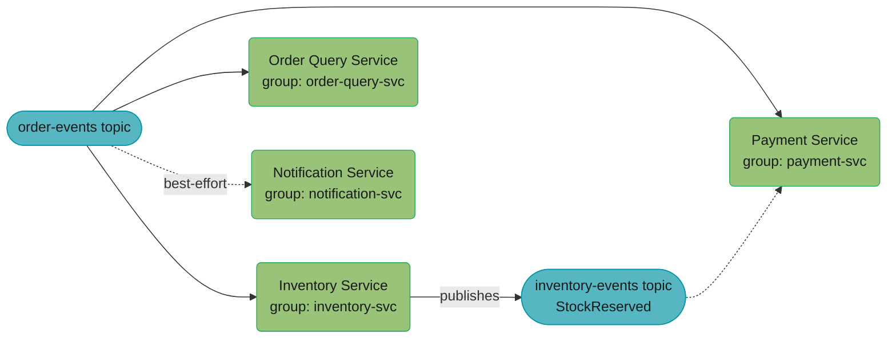
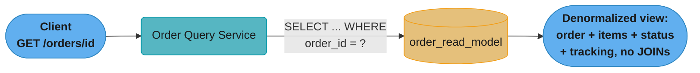
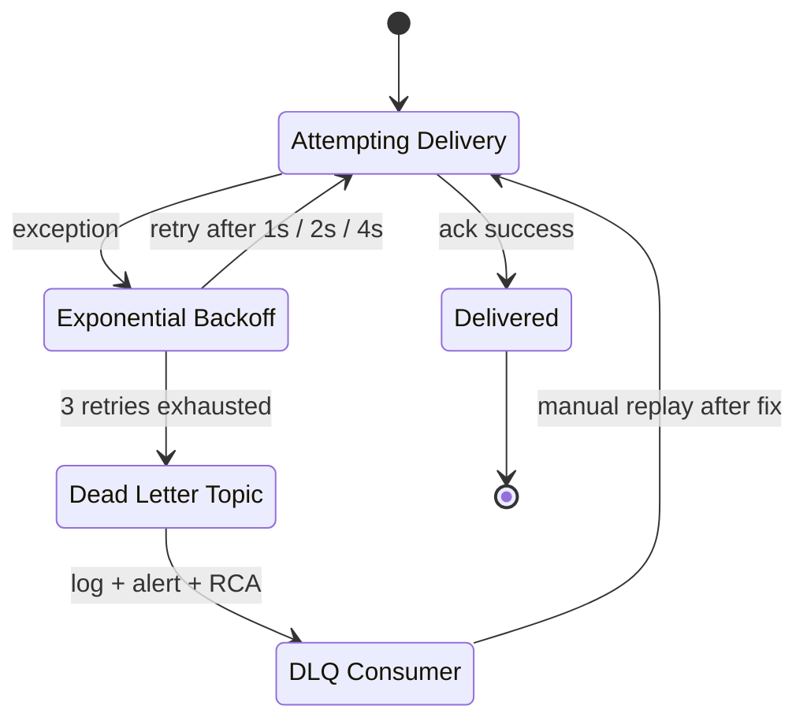
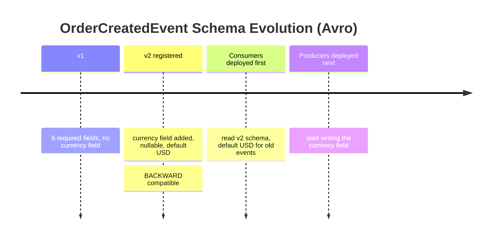
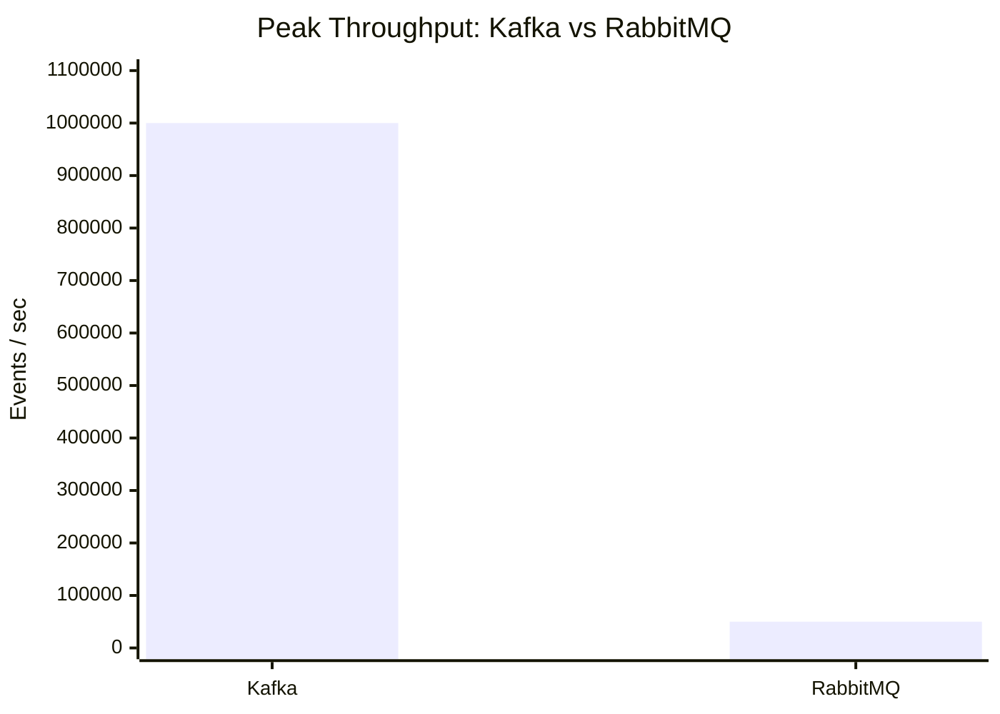

# Case Study: Event-Driven Order System

## Problem Statement

Design an order management system where the order lifecycle (Created → Inventory Reserved → Payment Processed → Shipped → Delivered) is driven by Kafka events. Multiple services consume order events. Requirements:
- Each service processes events exactly once — no double-processing on consumer restart
- CQRS read model for fast order queries without joins across services
- Schema evolution: adding fields to order events without breaking existing consumers
- DLQ handling: unprocessable messages must not block the consumer
- Exactly-once semantics from order creation to Kafka publication (transactional outbox)
- Event-carried state transfer: downstream services do not need to call back to the order service

---

## Architecture Overview

**Write Path — Commands to Events**


The order write and its outbox insert commit in one local database transaction, so a Kafka outage never loses or fabricates an event; the Outbox Relay then publishes with `orderId` as the partition key so every event for one order lands in the same partition and stays in order.

**Fan-out to Consumers**



Each service consumes `order-events` under its own consumer group so a slow consumer never blocks the others; Payment Service does not act on `order-events` alone — it also waits for the `StockReserved` event Inventory publishes to `inventory-events` — and Notification Service is wired as a non-blocking, best-effort path.

**Read Path (CQRS)**



The read path never joins across tables or calls out to Inventory or Payment: `order_read_model` already holds the complete denormalized view, at the cost of the 100-500ms replication lag from the write side described below.

**DLQ Flow**



A message escalates through 1s, 2s, then 4s of backoff before landing in the dead letter topic instead of blocking the partition; the DLQ Consumer's job is triage — log, alert, root cause — and only a manual replay re-publishes it back into the attempt cycle.

---

## Key Design Decisions

**1. Transactional Outbox + Kafka Transactional Producer**

The order service saves the Order entity and the `OrderCreatedEvent` in the same database transaction. The outbox relay uses a Kafka transactional producer to publish atomically (if Kafka publish fails, the outbox record remains unpublished, and the relay retries). This achieves exactly-once semantics from DB write to Kafka.

**2. Consumer Idempotency via event_processed Table**

Every consumer service maintains an `event_processed` table with a `(event_id, consumer_group)` unique index. Before processing, it inserts this record. If it already exists (duplicate delivery), the consumer skips processing. The insert and the business logic execute in the same `@Transactional` boundary.

**3. CQRS Read Model**

The Order Query Service subscribes to all order lifecycle events and maintains a denormalized `order_read_model` table. Queries return the complete order view without any inter-service calls. The read model accepts eventual consistency: there may be a 100-500ms lag between an event being published and the read model being updated.

**4. Schema Evolution with Avro + Schema Registry**

All events use Avro schemas registered in Schema Registry. New optional fields are added with default values — this is BACKWARD compatible. Consumers that do not have the new schema version receive the field's default value. The Schema Registry enforces BACKWARD compatibility — attempts to register incompatible schema changes are rejected.



Schema Registry enforces BACKWARD compatibility, so consumers are always upgraded before producers — old events simply default `currency` to `USD` until the newly-deployed producers start populating it. Deploying in the wrong order (producers first) would not break anything here only because the new field is optional with a default; a non-optional field addition would be rejected as an incompatible change outright.

**5. Per-Aggregate Partition Key**

All order events use `orderId` as the Kafka partition key. This guarantees that all events for the same order are processed in order by the same consumer thread (within a partition). This enables the inventory service to safely execute state-dependent logic (only reserve if not already reserved) without distributed locking.

---

## Implementation

### Avro Schema

```json
// OrderCreatedEvent.avsc — v1
{
  "type": "record",
  "name": "OrderCreatedEvent",
  "namespace": "com.company.events",
  "fields": [
    {"name": "eventId",    "type": "string"},
    {"name": "orderId",    "type": "string"},
    {"name": "userId",     "type": "string"},
    {"name": "items",      "type": {"type": "array", "items": {
      "type": "record", "name": "OrderItem",
      "fields": [
        {"name": "sku",      "type": "string"},
        {"name": "quantity", "type": "int"},
        {"name": "price",    "type": "double"}
      ]
    }}},
    {"name": "totalAmount", "type": "double"},
    {"name": "occurredOn",  "type": "long", "logicalType": "timestamp-millis"}
  ]
}

// v2: added "currency" field — BACKWARD compatible (default = "USD")
// Deploy consumers first (they read v2 schema, default "USD" for old events)
// Then deploy producers (they start writing "currency" field)
{
  "fields": [
    ... (all v1 fields),
    {"name": "currency", "type": ["null", "string"], "default": null}
  ]
}
```

### Order Service — Transactional Outbox

```java
@Service
@RequiredArgsConstructor
public class OrderService {

    private final OrderRepository orderRepository;
    private final OutboxEventRepository outboxRepository;

    @Transactional
    public Order createOrder(CreateOrderRequest request) {
        Order order = Order.builder()
            .id(UUID.randomUUID())
            .userId(request.getUserId())
            .status(OrderStatus.PENDING)
            .items(request.getItems())
            .totalAmount(request.getTotalAmount())
            .build();

        orderRepository.save(order);

        // Event saved in SAME transaction — atomic
        OrderCreatedEvent event = OrderCreatedEvent.newBuilder()
            .setEventId(UUID.randomUUID().toString())
            .setOrderId(order.getId().toString())
            .setUserId(order.getUserId())
            .setItems(toAvroItems(order.getItems()))
            .setTotalAmount(order.getTotalAmount())
            .setOccurredOn(Instant.now().toEpochMilli())
            .build();

        outboxRepository.save(OutboxEvent.builder()
            .aggregateId(order.getId().toString())
            .aggregateType("Order")
            .eventType("OrderCreatedEvent")
            .payload(serializeAvro(event))
            .schemaId(schemaRegistry.getSchemaId("OrderCreatedEvent"))
            .build());

        return order;
    }
}
```

### Inventory Consumer with Idempotency

```java
@Component
@RequiredArgsConstructor
public class InventoryOrderEventConsumer {

    private final EventProcessedRepository processedRepo;
    private final InventoryService inventoryService;

    @KafkaListener(
        topics = "order-events",
        groupId = "inventory-svc",
        containerFactory = "kafkaListenerContainerFactory"
    )
    @Transactional
    public void handleOrderCreated(ConsumerRecord<String, byte[]> record) {
        String eventId = extractEventId(record);  // from Avro payload or header

        // Idempotency check — INSERT OR SKIP
        int inserted = processedRepo.insertIfNotExists(eventId, "inventory-svc");
        if (inserted == 0) {
            log.info("Event {} already processed by inventory-svc, skipping", eventId);
            return;
        }

        // Deserialize (schema evolution handled by Avro reader with default for missing fields)
        OrderCreatedEvent event = deserializeAvro(record.value(), OrderCreatedEvent.class);

        // Business logic (in same transaction as idempotency insert)
        inventoryService.reserveStock(event.getOrderId().toString(), event.getItems());

        // Publish StockReserved event via outbox
        publishStockReservedEvent(event.getOrderId().toString());
    }
}
```

### CQRS Read Model Update

```java
@Component
@RequiredArgsConstructor
@ProcessingGroup("order-read-model")
public class OrderReadModelProjection {

    private final OrderReadModelRepository readModelRepo;

    @EventHandler
    @Transactional
    public void on(OrderCreatedEvent event) {
        OrderReadModel model = OrderReadModel.builder()
            .orderId(event.getOrderId().toString())
            .userId(event.getUserId().toString())
            .status("PENDING")
            .totalAmount(event.getTotalAmount())
            .currency(event.getCurrency() != null ? event.getCurrency().toString() : "USD")
            .items(toReadModelItems(event.getItems()))
            .createdAt(Instant.ofEpochMilli(event.getOccurredOn()))
            .build();

        readModelRepo.save(model);
    }

    @EventHandler
    @Transactional
    public void on(OrderShippedEvent event) {
        readModelRepo.findByOrderId(event.getOrderId().toString()).ifPresent(model -> {
            model.setStatus("SHIPPED");
            model.setTrackingNumber(event.getTrackingNumber().toString());
            model.setShippedAt(Instant.ofEpochMilli(event.getOccurredOn()));
            readModelRepo.save(model);
        });
    }
}
```

### DLQ Configuration

```java
@Configuration
public class KafkaConfig {

    @Bean
    public ConcurrentKafkaListenerContainerFactory<String, byte[]> kafkaListenerContainerFactory(
            ConsumerFactory<String, byte[]> consumerFactory,
            KafkaTemplate<String, byte[]> kafkaTemplate) {

        var factory = new ConcurrentKafkaListenerContainerFactory<String, byte[]>();
        factory.setConsumerFactory(consumerFactory);

        // DLQ: after 3 retries, send to order-events.DLT
        DefaultErrorHandler errorHandler = new DefaultErrorHandler(
            new DeadLetterPublishingRecoverer(kafkaTemplate,
                (record, ex) -> new TopicPartition(record.topic() + ".DLT", record.partition())
            ),
            new ExponentialBackOffWithMaxRetries(3) {{
                setInitialInterval(1000);   // 1s, 2s, 4s then DLT
                setMultiplier(2.0);
                setMaxInterval(10000);
            }}
        );

        // Schema errors: send straight to DLQ without retry
        errorHandler.addNotRetryableExceptions(SerializationException.class);

        factory.setCommonErrorHandler(errorHandler);
        return factory;
    }
}
```

### Order Query API (CQRS Read Side)

```java
@RestController
@RequiredArgsConstructor
@RequestMapping("/api/orders")
public class OrderQueryController {

    private final OrderReadModelRepository readModelRepo;

    @GetMapping("/{orderId}")
    public ResponseEntity<OrderView> getOrder(@PathVariable String orderId) {
        return readModelRepo.findByOrderId(orderId)
            .map(OrderView::from)
            .map(ResponseEntity::ok)
            .orElse(ResponseEntity.notFound().build());
    }

    @GetMapping
    public ResponseEntity<Page<OrderView>> getOrdersByUser(
            @RequestParam String userId,
            @RequestParam(defaultValue = "0") int page,
            @RequestParam(defaultValue = "20") int size) {

        // Cursor-based pagination by createdAt DESC
        return ResponseEntity.ok(
            readModelRepo.findByUserIdOrderByCreatedAtDesc(userId, PageRequest.of(page, size))
                .map(OrderView::from)
        );
    }
}
```

---

## Technologies Used

| Technology | Usage |
|------------|-------|
| Apache Kafka 3.6 | Event streaming backbone, partitioned by orderId |
| Avro + Confluent Schema Registry | Typed event schemas with BACKWARD compatibility |
| Spring Kafka | `@KafkaListener`, transactional consumer, DLQ via `DefaultErrorHandler` |
| PostgreSQL | Outbox table, read model, idempotency table |
| Spring Data JPA | Repository layer for all persistence |
| Spring Boot Actuator | Consumer lag metrics via Micrometer Kafka binder |
| KEDA | Kubernetes autoscaler based on Kafka consumer lag metric |

---

## Tradeoffs and Alternatives

**Event-Carried State Transfer vs Thin Events**:
Fat events (carrying full order data) allow consumers to process events without calling back to the order service. This reduces coupling and eliminates cascading failures. The tradeoff is larger event payloads (increased Kafka storage and network) and tighter schema coupling. Thin events (just `orderId`) require consumers to fetch the full order — this is the "query on read" pattern, which creates temporal coupling (order service must be available when consumers process the event).

**Eventual Consistency in Read Model**:
The CQRS read model has a lag of 100-500ms between event publication and read model update. During this window, `GET /orders/{id}` may return 404 for a newly created order. Mitigation: the `POST /orders` response includes the full order resource, so the client has the data without needing to immediately query. For the redirect-after-create pattern, add an optimistic cache in the controller that holds the just-created order for 1 second.

**Kafka vs RabbitMQ**:
Kafka was chosen for: replay capability (rebuild the read model by replaying all events from offset 0), high throughput (1M events/s vs ~50K for RabbitMQ), and retention-based storage (7 days). RabbitMQ would provide lower latency per message and complex routing, but no replay capability — the read model would be unrebuildable from events after a failure.



Kafka's log-based design sustains roughly 20x RabbitMQ's peak throughput (1M events/sec vs ~50K), which is why it wins here despite RabbitMQ's lower per-message latency and richer routing — the gap becomes decisive once `order-events` needs to support full-history replay to rebuild the read model.

---

## Interview Discussion Points

- **How do you handle the case where the order read model is corrupted by a bug in an event handler?** Fix the bug, reset the projection (`@ResetHandler` deletes all rows in `order_read_model`), and replay all events from offset 0 using Kafka's `earliest` offset reset. The read model is rebuilt from the authoritative event log.

- **How do you ensure ordering of events per order?** Partition key = `orderId`. All events for the same order go to the same partition, processed by the same consumer thread in order. This guarantees that `OrderShipped` is processed after `OrderCreated` for the same order.

- **What happens when Schema Registry is unavailable?** Avro producer and consumer fail if they cannot reach Schema Registry for new schema IDs. Mitigation: cache schema IDs locally (`SchemaRegistryClient.register()` result is cached in memory). For short outages (< minutes), the cache prevents failures. Configure `max.schemas.per.subject` and schema caching TTL appropriately.

- **How do you monitor consumer health?** Consumer lag via `kafka-consumer-groups.sh --describe` or Burrow. Alert when lag exceeds 10,000 messages (indicates consumer is falling behind). KEDA `ScaledObject` automatically adds consumer pods when lag grows. p99 processing time per event via Micrometer `Timer` around the consumer method.

- **How do you replay DLQ messages after fixing the bug?** Write a `DlqReplayTool` that reads from `order-events.DLT`, re-publishes messages to `order-events` with a small delay between messages to avoid overwhelming the consumer. Monitor consumer lag during replay.
