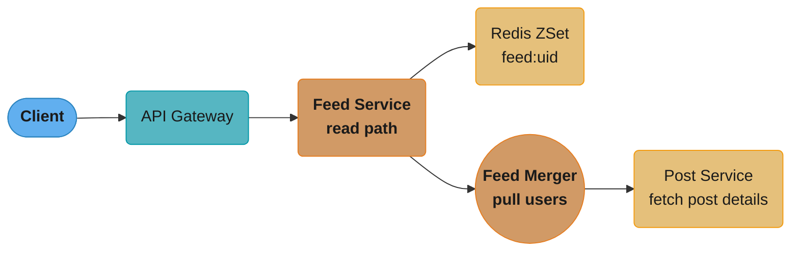
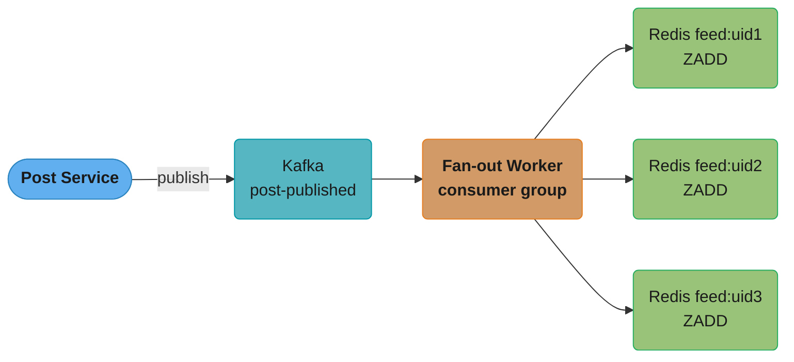
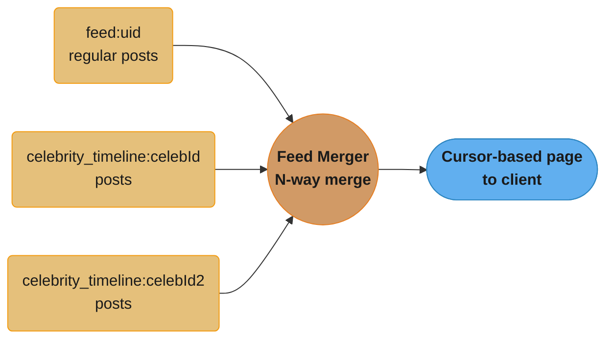
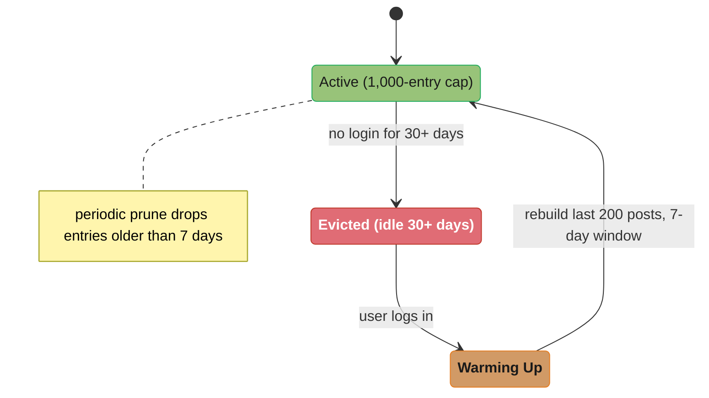
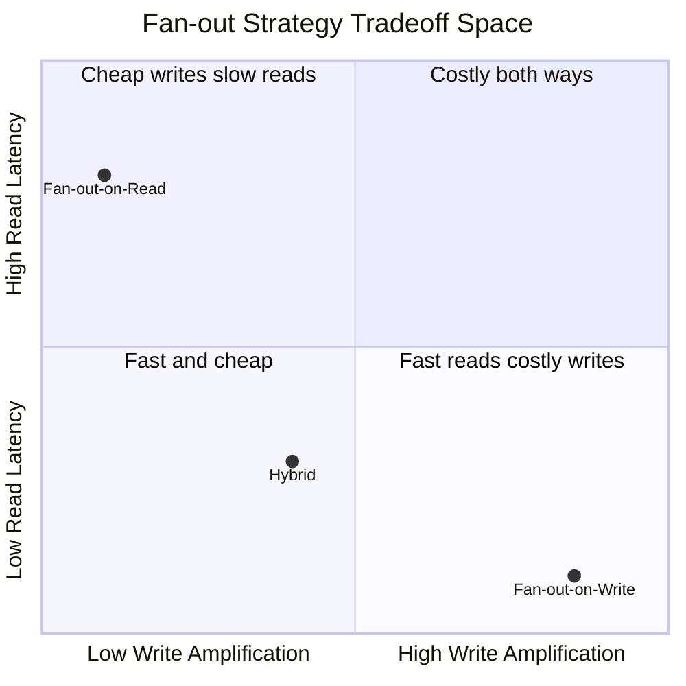

# Case Study: Social Media Home Feed Service

## Problem Statement

Build a home feed service for a social media platform at Twitter/Instagram scale. When a user opens
the app, they see a personalized, reverse-chronological (or ranked) stream of posts from accounts
they follow.

Core requirements:

- Feed must load in under 200ms at P99.
- Users may follow up to 5,000 accounts.
- Celebrities may have 50 million followers.
- New posts must appear in followers' feeds within 5 seconds of publishing.
- Feed supports cursor-based pagination (infinite scroll).
- At 500 million daily active users with 3 feed loads per day = 1.5 billion feed read requests/day
  (~17,000 reads/second average, 50,000+ at peak).

The core challenge: a single post by a celebrity with 10 million followers, if delivered via
fan-out-on-write, requires 10 million Redis ZSet inserts in near real-time. That is write
amplification at an extreme scale. A naive fan-out-on-read for a user following 5,000 accounts
requires reading 5,000 sorted timelines and merging them — that is read amplification at an extreme
scale.

---

## Architecture Overview

The read path routes through the API Gateway into the Feed Service, which serves the pre-built ZSet
directly or merges in celebrity timelines through the Feed Merger before Post Service hydrates full
post details.



**Write Path — Fan-out-on-write** (regular users, < 10,000 followers): the Fan-out Worker consumes
`post-published` events and ZADDs the new post ID into every follower's own feed ZSet.



**Write Path — Fan-out-on-read** (celebrities, >= 10,000 followers): the post is written once to the
celebrity's own timeline — no per-follower fan-out occurs.


**Read Path — Hybrid Merge** for a user following celebrities: the pre-built feed ZSet and each
followed celebrity's timeline are merged N-way by timestamp before the cursor-based page is returned.



**Database Layer** — schema and Redis key structures backing the feed (kept as a reference listing,
not a topology diagram):

```
  PostgreSQL:
    follows(follower_id, followee_id, created_at)
    posts(post_id, author_id, content, created_at, media_url)
    users(user_id, follower_count, following_count)

  Redis:
    feed:{userId}              — ZSet: score=epoch_ms, member=postId (last 1000 items)
    celebrity_timeline:{uid}  — ZSet: celebrity's own posts (last 1000 items)
    post:{postId}              — Hash: cached post details (text, author, media)
    user:{userId}:following:celebrities — Set: celebrity IDs this user follows
```

---

## Key Design Decisions

### 1. Hybrid Fan-out Strategy

The system classifies accounts as "celebrities" when their follower count exceeds a configurable
threshold (default 10,000). The threshold is checked at post-publish time.

Regular users (< 10,000 followers): fan-out-on-write. The fan-out worker reads the author's
follower list from the database and writes the new post ID into every follower's Redis ZSet feed.
Each follower's feed is always pre-computed and ready to serve with a single Redis ZREVRANGE.

Celebrity users (>= 10,000 followers): fan-out-on-read. The post is written only to the celebrity's
own `celebrity_timeline:{uid}` ZSet. No fan-out occurs at write time. At read time, the feed service
identifies which celebrities the requesting user follows, fetches pages from each celebrity's
timeline, and merges them with the user's pre-built feed ZSet. An N-way merge by timestamp
(priority queue) produces the final feed page.

### 2. Redis ZSet as Feed Store

`ZADD feed:{userId} <timestamp_ms> <postId>` stores postIds sorted by timestamp. Reading a page is
`ZREVRANGEBYSCORE feed:{userId} <cursor_ts> -inf LIMIT 0 20` — O(log N + page_size). No offset
arithmetic; the score (timestamp) is the cursor. The ZSet is bounded to the last 1,000 post IDs
per user via `ZREMRANGEBYRANK feed:{userId} 0 -1001` after each fan-out insertion. Older posts are
served from the database if the user scrolls back far enough (rare in practice).

### 3. Cursor-Based Pagination

Offset-based pagination (`LIMIT 20 OFFSET 100`) is dangerous at scale: each page requires scanning
and discarding the first 100 rows, which gets slower the deeper you go and produces unstable results
when new posts arrive. Cursor-based pagination uses the score (timestamp) of the last item returned
as the next page's upper boundary. The client passes `cursor=<last_post_timestamp_ms>` and the
server executes `ZREVRANGEBYSCORE ... <cursor> -inf LIMIT 0 20`. This is O(log N) regardless of page
depth and stable across concurrent inserts.

### 4. Post Detail Hydration

The feed ZSet stores only post IDs. The feed service hydrates post details (text, author, media) in
a separate step. Post details are cached in Redis Hash structures (`post:{postId}`) with a 24-hour
TTL. A cache miss fetches from the Post service database. Hydration is parallelized: the service
fetches all 20 post IDs in the page with a Redis `MGET` pipeline or parallel async calls, keeping
the total hydration latency under 10ms.

### 5. Feed Cache Eviction

To prevent unbounded Redis memory growth, the ZSet is capped at 1,000 entries per user. Entries
older than 7 days are periodically removed with `ZREMRANGEBYSCORE feed:{userId} -inf
<7_days_ago_epoch>`. For users who are inactive for more than 30 days, the entire feed ZSet is
evicted. On their next login, the feed is rebuilt by reading the most recent posts from followed
accounts — an on-demand warm-up query.

A feed ZSet cycles between an active, periodically pruned state and full eviction after 30 days of
inactivity; the next login triggers an on-demand warm-up that rebuilds the last 200 posts from a
7-day lookback before the feed returns to active.



---

## Implementation

### Domain Model

```java
public record Post(
        String postId,
        String authorId,
        String authorUsername,
        String content,
        String mediaUrl,
        Instant createdAt,
        long likeCount,
        long replyCount
) {}

public record FeedPage(
        List<Post> posts,
        String nextCursor,          // null if no more pages
        boolean hasMore
) {}
```

### Fan-out Worker (Kafka Consumer)

```java
@Component
@Slf4j
public class FanOutWorker {

    private static final int CELEBRITY_THRESHOLD = 10_000;
    private static final int MAX_FEED_SIZE = 1_000;

    private final StringRedisTemplate redis;
    private final FollowRepository followRepository;
    private final UserRepository userRepository;

    @KafkaListener(
            topics = "post-published",
            groupId = "feed-fanout-group",
            concurrency = "8"             // 8 consumer threads for parallelism
    )
    public void onPostPublished(
            @Payload PostPublishedEvent event,
            Acknowledgment ack) {

        try {
            User author = userRepository.findById(event.getAuthorId())
                    .orElseThrow(() -> new UserNotFoundException(event.getAuthorId()));

            if (author.getFollowerCount() >= CELEBRITY_THRESHOLD) {
                handleCelebrityPost(event);
            } else {
                handleRegularPost(event);
            }
            ack.acknowledge();
        } catch (Exception e) {
            log.error("Fan-out failed for post {}: {}", event.getPostId(), e.getMessage());
            // Do not ack — Kafka will redeliver. Circuit-breaker handles repeated failures.
            throw e;
        }
    }

    /**
     * Celebrity post: write only to the celebrity's own timeline ZSet.
     * No fan-out to followers.
     */
    private void handleCelebrityPost(PostPublishedEvent event) {
        String timelineKey = "celebrity_timeline:" + event.getAuthorId();
        double score = event.getCreatedAt().toEpochMilli();

        redis.opsForZSet().add(timelineKey, event.getPostId(), score);
        // Keep celebrity timeline bounded to last 1000 posts
        redis.opsForZSet().removeRange(timelineKey, 0, -(MAX_FEED_SIZE + 1));

        log.debug("Celebrity post {} added to timeline {}", event.getPostId(), event.getAuthorId());
    }

    /**
     * Regular post: fan-out to all followers' feed ZSets.
     * Processed in batches to avoid a single massive DB query.
     */
    private void handleRegularPost(PostPublishedEvent event) {
        double score = event.getCreatedAt().toEpochMilli();
        int batchSize = 500;
        long offset = 0;

        while (true) {
            List<String> followerIds = followRepository
                    .findFollowerIds(event.getAuthorId(), offset, batchSize);

            if (followerIds.isEmpty()) break;

            // Use Redis pipeline to batch all ZADD commands
            redis.executePipelined((RedisCallback<Object>) connection -> {
                for (String followerId : followerIds) {
                    byte[] key = ("feed:" + followerId).getBytes();
                    connection.zAdd(key, score, event.getPostId().getBytes());
                    // Trim to MAX_FEED_SIZE: remove rank 0 to (size - MAX_FEED_SIZE - 1)
                    connection.zRemRangeByRank(key, 0, -(MAX_FEED_SIZE + 1));
                }
                return null;
            });

            log.debug("Fan-out batch: post={}, followers={}", event.getPostId(), followerIds.size());

            if (followerIds.size() < batchSize) break;
            offset += batchSize;
        }
    }
}
```

### Feed Service (Read Path)

```java
@Service
@Slf4j
public class FeedService {

    private static final int DEFAULT_PAGE_SIZE = 20;
    private static final int MAX_CELEBRITY_TIMELINES = 50; // cap for merge complexity

    private final StringRedisTemplate redis;
    private final PostService postService;
    private final FollowRepository followRepository;

    /**
     * Returns a page of feed posts for the given user.
     *
     * @param userId     the requesting user
     * @param cursor     timestamp cursor (null for first page = start from now)
     * @param pageSize   number of posts (default 20)
     */
    public FeedPage getFeed(String userId, String cursor, int pageSize) {
        long upperBound = cursor != null
                ? Long.parseLong(cursor) - 1   // exclusive upper bound
                : Long.MAX_VALUE;

        // 1. Fetch posts from the user's pre-built feed ZSet (regular accounts)
        List<ScoredPost> regularPosts = fetchFromFeedZSet(userId, upperBound, pageSize * 2);

        // 2. Fetch posts from celebrity timelines the user follows
        List<String> followedCelebrities = getFollowedCelebrities(userId);
        List<ScoredPost> celebrityPosts = fetchCelebrityPosts(followedCelebrities, upperBound, pageSize * 2);

        // 3. N-way merge by timestamp (descending)
        List<ScoredPost> merged = mergeSortedLists(regularPosts, celebrityPosts);

        // 4. Take the top pageSize items
        List<ScoredPost> page = merged.stream()
                .limit(pageSize)
                .collect(Collectors.toList());

        if (page.isEmpty()) {
            return new FeedPage(Collections.emptyList(), null, false);
        }

        // 5. Hydrate post details (parallelized)
        List<String> postIds = page.stream().map(ScoredPost::postId).collect(Collectors.toList());
        List<Post> posts = postService.getPostsByIds(postIds);

        // 6. Compute next cursor
        long nextCursorValue = page.get(page.size() - 1).score();
        String nextCursor = merged.size() > pageSize ? String.valueOf(nextCursorValue) : null;

        return new FeedPage(posts, nextCursor, nextCursor != null);
    }

    private List<ScoredPost> fetchFromFeedZSet(String userId, long upperBound, int limit) {
        String key = "feed:" + userId;
        Set<ZSetOperations.TypedTuple<String>> results =
                redis.opsForZSet().reverseRangeByScoreWithScores(
                        key,
                        Double.NEGATIVE_INFINITY,
                        upperBound,
                        0,
                        limit);

        if (results == null) return Collections.emptyList();

        return results.stream()
                .map(t -> new ScoredPost(t.getValue(), t.getScore().longValue()))
                .collect(Collectors.toList());
    }

    private List<String> getFollowedCelebrities(String userId) {
        String key = "user:" + userId + ":following:celebrities";
        Set<String> members = redis.opsForSet().members(key);
        if (members == null || members.isEmpty()) {
            // Cache miss: load from DB and cache
            List<String> celebrities = followRepository.findFollowedCelebrities(userId);
            if (!celebrities.isEmpty()) {
                redis.opsForSet().add(key, celebrities.toArray(new String[0]));
                redis.expire(key, Duration.ofHours(1));
            }
            return celebrities;
        }
        return new ArrayList<>(members);
    }

    private List<ScoredPost> fetchCelebrityPosts(
            List<String> celebrityIds, long upperBound, int limitPerCelebrity) {

        if (celebrityIds.isEmpty()) return Collections.emptyList();

        // Cap the number of celebrity timelines to merge
        List<String> celebsToMerge = celebrityIds.stream()
                .limit(MAX_CELEBRITY_TIMELINES)
                .collect(Collectors.toList());

        List<ScoredPost> allCelebrityPosts = new ArrayList<>();
        for (String celebId : celebsToMerge) {
            String key = "celebrity_timeline:" + celebId;
            Set<ZSetOperations.TypedTuple<String>> results =
                    redis.opsForZSet().reverseRangeByScoreWithScores(
                            key,
                            Double.NEGATIVE_INFINITY,
                            upperBound,
                            0,
                            limitPerCelebrity);
            if (results != null) {
                results.forEach(t -> allCelebrityPosts.add(
                        new ScoredPost(t.getValue(), t.getScore().longValue())));
            }
        }
        return allCelebrityPosts;
    }

    /**
     * N-way merge: combines two pre-sorted (descending by score) lists.
     * Uses a PriorityQueue for general N-way merge across all sources.
     */
    private List<ScoredPost> mergeSortedLists(List<ScoredPost> a, List<ScoredPost> b) {
        List<ScoredPost> combined = new ArrayList<>(a.size() + b.size());
        combined.addAll(a);
        combined.addAll(b);

        // Sort descending by score (timestamp)
        combined.sort(Comparator.comparingLong(ScoredPost::score).reversed());

        // Deduplicate post IDs (a post could appear in both a regular feed and a celebrity timeline
        // if the celebrity is also followed as a regular account edge case)
        Set<String> seen = new LinkedHashSet<>();
        List<ScoredPost> deduped = new ArrayList<>();
        for (ScoredPost sp : combined) {
            if (seen.add(sp.postId())) {
                deduped.add(sp);
            }
        }
        return deduped;
    }

    public record ScoredPost(String postId, long score) {}
}
```

### Post Service with Parallelized Hydration

```java
@Service
public class PostService {

    private final StringRedisTemplate redis;
    private final PostRepository postRepository;
    private final ObjectMapper objectMapper;

    /**
     * Fetches post details for a list of post IDs.
     * Checks Redis first (pipeline MGET), falls back to DB for misses.
     * Returns posts in the same order as input postIds.
     */
    public List<Post> getPostsByIds(List<String> postIds) {
        if (postIds.isEmpty()) return Collections.emptyList();

        // Build cache keys
        List<String> cacheKeys = postIds.stream()
                .map(id -> "post:" + id)
                .collect(Collectors.toList());

        // Pipeline MGET for all keys in one round trip
        List<Object> cachedValues = redis.executePipelined((RedisCallback<Object>) conn -> {
            for (String key : cacheKeys) {
                conn.get(key.getBytes());
            }
            return null;
        });

        // Identify cache misses
        List<String> missedIds = new ArrayList<>();
        for (int i = 0; i < postIds.size(); i++) {
            if (cachedValues.get(i) == null) {
                missedIds.add(postIds.get(i));
            }
        }

        // Fetch misses from DB
        Map<String, Post> dbPosts = Collections.emptyMap();
        if (!missedIds.isEmpty()) {
            dbPosts = postRepository.findAllById(missedIds).stream()
                    .collect(Collectors.toMap(Post::postId, p -> p));

            // Write misses back to cache (pipeline SET with TTL)
            Map<String, Post> finalDbPosts = dbPosts;
            redis.executePipelined((RedisCallback<Object>) conn -> {
                for (Map.Entry<String, Post> entry : finalDbPosts.entrySet()) {
                    String key = "post:" + entry.getKey();
                    byte[] value = serialize(entry.getValue());
                    conn.setEx(key.getBytes(), 86_400, value);  // 24-hour TTL
                }
                return null;
            });
        }

        // Assemble result in original order
        List<Post> result = new ArrayList<>(postIds.size());
        for (int i = 0; i < postIds.size(); i++) {
            String rawCached = (String) cachedValues.get(i);
            if (rawCached != null) {
                result.add(deserialize(rawCached));
            } else {
                Post dbPost = dbPosts.get(postIds.get(i));
                if (dbPost != null) result.add(dbPost);
                // If still null, post was deleted — skip
            }
        }
        return result;
    }

    private byte[] serialize(Post post) {
        try {
            return objectMapper.writeValueAsBytes(post);
        } catch (JsonProcessingException e) {
            throw new RuntimeException(e);
        }
    }

    private Post deserialize(String json) {
        try {
            return objectMapper.readValue(json, Post.class);
        } catch (JsonProcessingException e) {
            throw new RuntimeException(e);
        }
    }
}
```

### Feed REST Controller

```java
@RestController
@RequestMapping("/api/v1/feed")
public class FeedController {

    private final FeedService feedService;

    /**
     * GET /api/v1/feed?cursor=<timestamp>&pageSize=20
     *
     * First page: omit cursor (or cursor=null)
     * Subsequent pages: pass cursor returned in previous response
     */
    @GetMapping
    public ResponseEntity<FeedPage> getFeed(
            @AuthenticationPrincipal UserPrincipal principal,
            @RequestParam(required = false) String cursor,
            @RequestParam(defaultValue = "20") int pageSize) {

        pageSize = Math.min(pageSize, 50);   // cap at 50 to prevent abuse
        FeedPage page = feedService.getFeed(principal.getUserId(), cursor, pageSize);

        return ResponseEntity.ok()
                .cacheControl(CacheControl.maxAge(5, TimeUnit.SECONDS))
                .body(page);
    }
}
```

### Feed Warm-up on User Login

```java
@Component
@Slf4j
public class FeedWarmUpService {

    private static final int WARM_UP_POST_COUNT = 200;

    private final StringRedisTemplate redis;
    private final FollowRepository followRepository;
    private final PostRepository postRepository;

    /**
     * Called when a previously-inactive user logs in and their feed ZSet is missing.
     * Runs asynchronously — the UI shows a loading state.
     */
    @Async("feedWarmUpExecutor")
    public void warmUpFeed(String userId) {
        String feedKey = "feed:" + userId;

        // Check if feed already exists
        Long size = redis.opsForZSet().size(feedKey);
        if (size != null && size > 0) return;

        log.info("Warming up feed for inactive user {}", userId);

        // Fetch accounts followed by this user
        List<String> followedIds = followRepository.findFolloweeIds(userId);

        if (followedIds.isEmpty()) return;

        // Fetch most recent posts from followed accounts (last 7 days, max 200 posts)
        Instant since = Instant.now().minus(Duration.ofDays(7));
        List<Post> recentPosts = postRepository.findRecentPostsByAuthors(
                followedIds, since, WARM_UP_POST_COUNT);

        if (recentPosts.isEmpty()) return;

        // Populate feed ZSet
        redis.executePipelined((RedisCallback<Object>) conn -> {
            byte[] key = feedKey.getBytes();
            for (Post post : recentPosts) {
                double score = post.createdAt().toEpochMilli();
                conn.zAdd(key, score, post.postId().getBytes());
            }
            conn.expire(key, 7 * 24 * 3600L);
            return null;
        });

        log.info("Feed warm-up complete for user {}: {} posts loaded", userId, recentPosts.size());
    }
}
```

---

## Technologies Used

| Technology | Role |
|---|---|
| Spring Boot 3.2 | Application framework |
| Redis 7 (Cluster) | Feed ZSet storage, celebrity timelines, post detail cache |
| Spring Data Redis | RedisTemplate, ZSetOperations, pipeline support |
| Kafka 3.x | `post-published` topic for async fan-out |
| Spring Kafka | @KafkaListener with concurrency, manual Acknowledgment |
| PostgreSQL 15 | Persistent store for posts, follows, user data |
| Spring Data JPA | Follow and post persistence |
| Spring Security | User principal extraction for feed ownership |
| @Async + ThreadPoolTaskExecutor | Feed warm-up on login |
| Micrometer | Metrics: fan-out latency, feed hit rate, celebrity merge latency |

---

## Tradeoffs and Alternatives

### Fan-out-on-Write vs Fan-out-on-Read vs Hybrid

| Dimension | Fan-out-on-Write | Fan-out-on-Read | Hybrid |
|---|---|---|---|
| Read latency | Single Redis ZREVRANGE: ~1ms | N timeline reads + merge: ~10–50ms | ~5–15ms |
| Write amplification | High: O(followers) per post | None at write time | Low for celebrities |
| Celebrity problem | 10M followers = 10M ZSet writes | Acceptable (1 timeline) | Celebrity uses pull |
| Feed freshness | Near-real-time | Real-time | Near-real-time |
| Implementation complexity | Low | Medium | High |
| Chosen for this design | Regular users only | Not used stand-alone | Yes |

Fan-out-on-write buys near-instant reads (~1ms) at the cost of high write amplification; fan-out-on-read
flips that trade; the hybrid design sits closer to the fast-and-cheap corner because it only pays the
read-side merge cost for celebrity follows.



### Redis vs Cassandra for Feed Storage

Redis ZSet is ideal for the feed because sorted set operations (ZADD, ZREVRANGEBYSCORE) are
O(log N) and feed reads are single-key operations that map to one node in Redis Cluster. Cassandra
with a time-series data model (partition key = userId, clustering key = timestamp) is a valid
alternative at extremely large scales (billions of users) where Redis memory cost becomes prohibitive.
Cassandra stores data on disk and is cheaper per GB but has higher read latency (~5ms vs ~0.5ms).

### Activity Stream vs Materialized Timeline

This design uses a materialized timeline (feed ZSet pre-built at write time). An activity stream
approach stores a single log of all activities and fans out at read time via a query engine. Activity
streams are simpler to write but harder to read at scale. Materialized timelines trade write cost
for read speed, which is the right tradeoff given that reads outnumber writes by ~10:1 in social feeds.

---

## Interview Discussion Points

**Q: A celebrity with 10 million followers posts a photo. How long does fan-out take with your system,
and how do you handle it?**

With the hybrid model, celebrity posts skip fan-out entirely. The post is written to
`celebrity_timeline:{celebId}` — a single Redis ZSet write taking under 1ms. No 10M ZADD operations.
At read time, when a user who follows this celebrity loads their feed, the feed service fetches the
last 20 posts from the celebrity's timeline and merges them with the user's pre-built feed ZSet using
an N-way merge. The merge adds approximately 10–20ms to read latency, which is acceptable. If a user
follows 50 celebrities, the merge overhead is still bounded because each celebrity timeline ZREVRANGE
is O(log N + page_size).

**Q: How do you guarantee feed consistency — that no posts are missed and no duplicates appear?**

Duplicates are prevented by the deduplication step in the N-way merge, using a LinkedHashSet to
track seen post IDs (preserving order). Missed posts are a harder guarantee. Fan-out-on-write can
miss followers if the fan-out worker fails mid-batch. The Kafka consumer does not acknowledge until
the entire fan-out batch completes; a failure causes redelivery and the fan-out is retried from the
beginning (idempotent because ZADD is idempotent — re-adding the same member with the same score is
a no-op). The only true gap is if the Kafka topic has a very short retention and the consumer is
far behind — this is an operational concern, not a design one.

**Q: Explain cursor-based pagination vs offset-based. Why does offset fail for social feeds?**

Offset pagination (`LIMIT 20 OFFSET 40`) works by skipping 40 rows and returning 20. With Redis
ZREVRANGEBYSCORE, there is no "skip 40" concept; you scan from the start of the sorted set each
time. More importantly, offset is unstable: if new posts are published while the user is scrolling,
the positions shift and offset-40 at time T+1 returns different posts than offset-40 at time T,
causing duplicates or skips. Cursor-based pagination uses the score (timestamp) of the last seen
post as the next query's upper bound. Regardless of new posts arriving, the cursor points to a
fixed position in the timeline and the next page starts cleanly after the last post seen.

**Q: How would you add ranking/relevance scoring instead of pure reverse-chronological order?**

The ZSet score is currently the post's creation timestamp. To add ranking, replace the score with a
computed relevance score: `score = base_timestamp + engagement_boost + affinity_boost`. Engagement
boost increases the score when a post has high likes/comments shortly after posting. Affinity boost
increases it for authors the user interacts with frequently. The fan-out worker writes the initial
score; a background ranker re-scores recent posts periodically using ZADD (which updates the score
if the member already exists). Pure re-scoring applies only within the feed window (last 48 hours);
older posts keep their timestamp-based score. This is how Instagram Explore and TikTok's initial
hybrid model worked before moving to full ML ranking.
