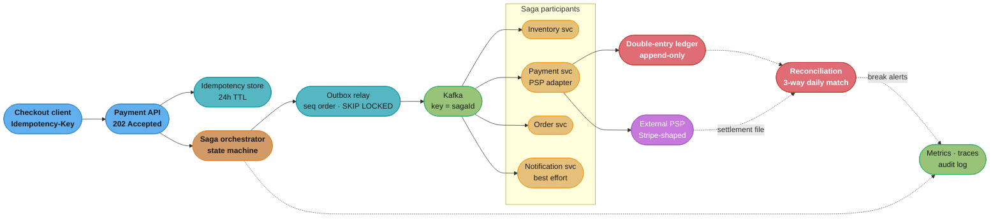
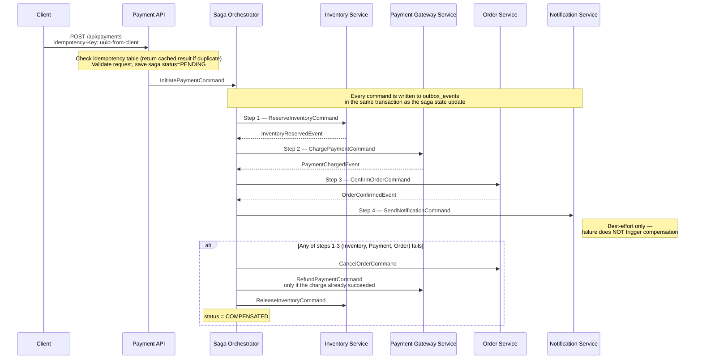
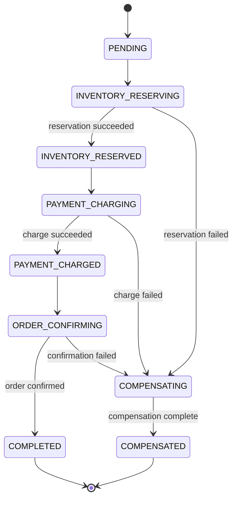

# Case Study: Payment Processor with Saga Orchestration

## Intuition

> **Design intuition**: A payment processor is not a service that moves money. It is a service that *remembers* money movement so precisely that any two parties who disagree — you, the PSP, the card network, the merchant, the customer's bank — can be shown, from an immutable record, which one of them is wrong. The distributed-systems work (saga, outbox, idempotency) exists only to make that record trustworthy while four services and one external gateway all try to fail at different moments.

**Key insight for this design**: every other domain treats a duplicate as a performance problem. Payments treats it as a *financial* problem, and the asymmetry is brutal — a lost read costs a retry, a duplicated charge costs a refund, a chargeback fee, a support ticket, and a customer. So the whole architecture is organized around one question: **for every side effect that touches money, what is the key that makes the second attempt a no-op?** Idempotency keys answer it at the API edge, the PSP's own idempotency layer answers it at the gateway, `transfer_id` uniqueness answers it in the ledger, and the outbox answers it for the messages in between. Where no such key exists, the system must not be allowed to retry.

The second insight follows from the first: **the ledger is the product; the saga is plumbing.** You can rewrite the orchestrator, swap Kafka for SQS, or replace the PSP — none of that changes what you owe anyone. Get the ledger's invariants wrong and no amount of orchestration correctness saves you.

---

## 1. Requirements Clarification

### Functional Requirements

- Accept a payment request for an e-commerce order that spans four services: order management, inventory reservation, payment gateway, notification.
- Authorize and capture against an external PSP (Stripe-shaped API), and support **capture-after-authorization** so inventory can be reserved before money moves.
- Compensate correctly on any partial failure: release inventory, cancel the order, refund a charge that already succeeded.
- Maintain a **double-entry ledger** of every money movement — captures, refunds, PSP fees, chargebacks, merchant payouts — that reconciles to the PSP's own records daily.
- Expose full payment state to the merchant dashboard and to support agents (what happened, when, why it failed).
- Support refunds (full and partial) and chargeback ingestion from the PSP webhook stream.
- Produce a complete, append-only audit trail of every state transition.
- Multi-currency: at minimum USD, EUR, GBP, JPY — currencies with different ISO 4217 minor-unit exponents must round-trip exactly.
- Daily merchant payout run that debits the payable balance and emits a payout instruction.

### Non-Functional Requirements

| Requirement | Target | Why this number |
|---|---|---|
| Sustained throughput | 1,000 payment requests/sec at seasonal peak | 8x the 125 req/sec daily average; the Black-Friday hour |
| API latency | p99 < 500 ms for the synchronous accept | The API returns `202 Accepted` after persisting saga state, not after the PSP call |
| End-to-end settle | p99 < 8 s from accept to `COMPLETED` | Bounded by the PSP authorization round trip (p99 ~2 s) plus three internal hops |
| Double-charge rate | 0 tolerated; measured, not assumed | Every duplicate is a refund plus a support cost |
| Ledger correctness | debits = credits on every transfer, enforced in the database | Not an application invariant — a `CHECK`-equivalent constraint |
| Durability | Zero acknowledged payments lost; RPO 0 for the ledger | Synchronous replica commit on the ledger cluster |
| Availability | 99.95% monthly for the accept path (21.9 min/month) | A PSP outage must degrade to queueing, not to 5xx |
| Reconciliation | Ledger vs PSP settlement file matched within 24 h, unmatched < 0.01% | Below this, manual investigation is tractable |
| Audit retention | 12 months of audit logs, 3 months immediately queryable | PCI DSS v4.0.1 Requirement 10.5.1 |
| Financial-record retention | 7 years for ledger postings | Tax/accounting and acquirer-contract driven, **not** a PCI number |

### Clarifying Questions to Ask in the Interview

| Question | Why it changes the design |
|---|---|
| Are we the merchant of record, or a PSP/marketplace holding funds for others? | Merchant-of-record needs no merchant-payable sub-ledger; a marketplace needs one per seller plus a payout engine |
| Do we store PANs, or is the card tokenized by the PSP? | Storing PANs pulls the entire service into PCI DSS scope; PSP tokenization keeps us at a far smaller assessment |
| Is authorization separate from capture, or is it a one-shot sale? | Auth-then-capture is what lets inventory reserve first, and it introduces auth-expiry as a failure mode |
| Single PSP or multi-PSP routing? | Multi-PSP means per-PSP idempotency namespaces and a reconciliation job per PSP |
| Are refunds allowed to exceed the original capture? | Determines whether the ledger needs a negative-balance guard on the merchant payable account |
| What is the acceptable behaviour during a total PSP outage? | Queue-and-retry (eventual capture) vs hard-fail changes the whole API contract |

### Out of Scope

- Fraud scoring, 3-D Secure / SCA challenge flow orchestration (assumed delegated to the PSP; the SCA thresholds are noted where they affect retry semantics).
- Card issuing, PIN/EMV terminal handling, ISO 8583 message construction — we speak HTTPS to a PSP, not raw 8583 to an acquirer.
- The merchant's own accounting integration (we emit a settlement file, we do not post to their GL).
- Currency conversion and treasury/FX hedging.

---

## 2. Scale Estimation

### Traffic

```
Payment attempts/day:        10,800,000
Average TPS:                 10,800,000 / 86,400 = 125 req/sec
Diurnal peak (3x):           375 req/sec
Seasonal peak (8x average):  1,000 req/sec       <- the stated NFR

Authorization approval rate: 85%  (industry-typical for card-not-present retail)
Captured payments/day:       10,800,000 x 0.85 = 9,180,000
Average ticket:              USD 38.00 blended
Daily GMV:                   9,180,000 x $38.00 = $348,840,000
Annual GMV:                  $348.84M x 365      = $127.3B

Refund rate:      3.0% of captures  ->   275,400/day
Chargeback rate:  0.05% of captures ->     4,590/day
Merchants:        50,000 (one payout run each per day)
```

The 1,000 req/sec figure is the number the design must survive, but note what it *is*: one hour a year. Sizing steady-state hardware for it wastes 8x the money; sizing for 375 req/sec and admitting the seasonal hour into a queue is the cheaper architecture, and it is why the accept path returns `202` instead of blocking on the PSP.

### Ledger Storage Growth

The ledger is append-only — no `UPDATE`, no `DELETE`, ever. A correction is a new reversing pair. That makes growth a pure function of transaction count, which is exactly what makes it predictable.

```
Postings per event (double-entry, so always an even, balanced set):
  capture     4  (DR psp_clearing / CR merchant_payable, DR merchant_payable / CR fee_revenue)
  refund      4
  chargeback  4
  payout      2

Postings/day = 9,180,000 x 4   (captures)     = 36,720,000
             +   275,400 x 4   (refunds)      =  1,101,600
             +     4,590 x 4   (chargebacks)  =     18,360
             +    50,000 x 2   (payouts)      =    100,000
                                              -------------
                                                37,939,960  -> ~38M postings/day
```

Row size, computed against the real PostgreSQL heap layout (8 kB default page, 24-byte `PageHeaderData`, 4-byte `ItemIdData` line pointer, 23-byte `HeapTupleHeaderData`):

```
postings row:
  id             BIGINT         8
  transfer_id    UUID          16
  account_id     BIGINT         8
  amount_minor   BIGINT         8   signed: debit positive, credit negative
  currency       SMALLINT       2   ISO 4217 numeric code
  entry_type     SMALLINT       2
  posted_at      TIMESTAMPTZ    8
  effective_at   TIMESTAMPTZ    8
                              ----
  user data                     60
  tuple header, 23 MAXALIGNed   24
  row padded to an 8-byte boundary (84 -> 88)     4
  line pointer in the page                        4
                                                ----
  heap bytes per posting                          92

Index overhead (three btrees, as bytes per heap row at realistic fill):
  PRIMARY KEY (id)          monotonic,   ~90% fill    22
  (account_id, posted_at)   scattered,   ~70% fill    40
  (transfer_id)             random UUID, ~70% fill    40
                                                    ----
  index bytes per posting                            102

Total per posting: 92 + 102 = 194 bytes

Daily:   38,000,000 x 194 =  7.37 GB/day
Yearly:  7.37 x 365       =  2.69 TB/year
7 years: 2.69 x 7         = 18.8 TB
```

### What the 7-Year Compliance Window Actually Costs

Two retention clocks run, and conflating them is a common interview error. **PCI DSS v4.0.1 Requirement 10.5.1** governs *audit logs*: retain at least 12 months, with the most recent 3 months immediately available for analysis. The **7-year** figure on *financial records* comes from tax, accounting and acquirer-contract obligations, not from PCI. Set each from its own source.

```
Assumed rates (us-east-1; verify current pricing before quoting):
  RDS gp3 storage                       $0.115 / GB-month
  S3 Glacier Instant Retrieval          $0.004 / GB-month

Tier 1 - months 0-12, hot in PostgreSQL (queryable by support, joinable):
  2,690 GB x $0.115                                    =   $309/month
  synchronous replica (storage billed again)           =   $309/month
  automated backups + 35-day PITR (~1x primary)        =   $256/month

Tier 2 - years 2-7, Parquet + zstd in S3, queried via Athena:
  raw 6 x 2.69 TB                       = 16.1 TB
  ~6x columnar compression on narrow numeric columns   =  2.69 TB
  2,690 GB x $0.004                                    =    $11/month
                                                          -----------
Total                                                     $885/month
                                                          $10,620/year
```

`$10,620 / 3.35B captures per year` is **$0.0000032 per captured payment** — about three ten-thousandths of a cent, or 0.0000083% of annual GMV.

So the storage is free, effectively. **The cost of a 7-year window is operational, and it is not small**: a 2.7 TB partition per year means `VACUUM` and index maintenance on tables that no longer fit in RAM, a restore that takes hours instead of minutes, and a schema migration run against seven years of history. The design answer is monthly range partitions on `posted_at` with `DETACH PARTITION` at the 12-month boundary — dropping a partition is a catalog operation, deleting 2.7 TB of rows is a week of autovacuum.

### Working Sets That Are Not the Ledger

```
Idempotency table (24-hour TTL, so steady state = one day of attempts):
  10,800,000 rows x ~351 bytes (key + saga_id + status + JSONB response + timestamps)
    heap                                   3.79 GB
    PK on the 36-char key                  0.61 GB
    expires_at btree                       0.30 GB
                                        ----------
                                           4.70 GB   -> fits in shared_buffers on a
                                                        db.r7g.2xlarge (64 GB) with room

Outbox (deleted after publish; the churn, not the size, is the problem):
  6 events per saga x 10.8M sagas = 64,800,000 rows/day inserted AND deleted
  at ~400 bytes/row -> 25.9 GB/day of dead tuples through one table
```

That outbox churn is the number that surprises people. 64.8M dead tuples a day through a single table out-runs a default autovacuum configuration, the table bloats, and the `WHERE published_at IS NULL` partial index degrades until the relay's poll query starts doing 200 ms sequential scans. See §10 for the fix.

### PSP Call Budget — the External Rate Limit Is a Real Constraint

Stripe documents a global limit of **100 requests/second in live mode** (25 in sandbox, and 25/sec for individual endpoints unless noted), returning **HTTP 429** with a `Stripe-Rate-Limited-Reason` header, and explicitly recommends exponential backoff with jitter.

```
Average PSP calls needed:      125 authorizations/sec
Peak PSP calls needed:       1,000 authorizations/sec
Single-account live-mode ceiling: 100/sec   -> short by 10x at peak
                                          -> short even at the DAILY AVERAGE
Sharded across 12 PSP accounts: 1,200/sec   -> 20% headroom at peak
```

This is not a footnote — it invalidates the naive design, and note *how* it invalidates it: a single account's 100/sec ceiling sits below our 125/sec daily average, so an outbox-and-drain strategy never drains. This is a baseline problem wearing a peak problem's clothes. The architecture must shard across PSP accounts (12 gives 1,200/sec aggregate with headroom), negotiate a raised limit, or route across multiple PSPs. The outbox is what makes the overflow *safe*, not what makes it *fast* — and authorizations expire, so a queue that grows for hours is not a capacity plan.

---

## 3. High-Level Architecture



Solid arrows are the synchronous accept path; dotted arrows are the asynchronous correctness machinery. The two red nodes — ledger and reconciliation — are the ones that determine whether the business is solvent; everything else determines whether it is fast.

### Saga Command/Event Flow

The saga orchestrator drives a single payment through four services via command/event pairs — each hop is durable (outbox-backed) so a crash mid-flow can always resume from persisted state instead of losing the command.



The API returns `202 Accepted` right after saving the saga as `PENDING`; every subsequent command/event pair (Steps 1-3) is durably queued through the outbox before the orchestrator advances state, and the `alt` block shows the compensation branch — notification (Step 4) is intentionally outside it since it never triggers a rollback.

### Saga State Machine

The orchestrator's status column walks this exact lifecycle, and all three failure-prone steps converge on the same `COMPENSATING` state rather than each needing its own rollback path.



`COMPENSATED` (not a reset back to `PENDING`) is the terminal failure state — like `COMPLETED`, it exits the lifecycle, so the crash-recovery job in §8 only ever resubmits commands for sagas still stuck in one of the non-terminal states in between.

**Shared primitives.** Backend's `case_studies/` has no `cross_cutting/` directory; by the convention documented in [`../README.md`](../README.md), the shared primitives live as deep-dive modules in the section itself. This case study leans on eight of them:

| Primitive used here | Deep dive |
|---|---|
| Idempotency keys, saga, 2PC alternatives | [`../../distributed_transactions_and_consistency/README.md`](../../distributed_transactions_and_consistency/README.md) |
| Transactional outbox, inbox, DLQ, poison pill | [`../../messaging_patterns/README.md`](../../messaging_patterns/README.md) |
| Retry with jitter, circuit breaker, bulkhead | [`../../fault_tolerance_patterns/README.md`](../../fault_tolerance_patterns/README.md) |
| Partitioning, consumer groups, EOS semantics | [`../../kafka_deep_dive/README.md`](../../kafka_deep_dive/README.md) |
| Pool sizing, leak detection, PgBouncer | [`../../connection_pooling_deep_dive/README.md`](../../connection_pooling_deep_dive/README.md) |
| SLO/SLI, correlation IDs, Micrometer | [`../../observability_and_monitoring/README.md`](../../observability_and_monitoring/README.md) |
| B+tree, WAL, MVCC, partitioning, VACUUM | [`../../database_internals_and_indexing/README.md`](../../database_internals_and_indexing/README.md) |
| Ledger-first storage design at DB level | [`../../../database/case_studies/design_banking_ledger/README.md`](../../../database/case_studies/design_banking_ledger/README.md) |

---

## 4. Component Deep Dives

### 4.1 The Money Model — a Double-Entry Ledger with Database-Enforced Invariants

Every money movement is a **transfer** composed of two or more **postings** that sum to zero. Balances are *derived* from postings, never stored as a mutable column. This is the oldest idea in the design and the one people most often skip.

```sql
-- Chart of accounts. An account is a (owner, purpose, currency) triple.
CREATE TABLE ledger_accounts (
    id           BIGSERIAL PRIMARY KEY,
    account_key  TEXT NOT NULL,           -- 'merchant_payable:m_42', 'fee_revenue'
    currency     SMALLINT NOT NULL,       -- ISO 4217 NUMERIC: 840 USD, 392 JPY, 414 KWD
    account_type TEXT NOT NULL,           -- ASSET | LIABILITY | REVENUE | EXPENSE
    UNIQUE (account_key, currency)
);

-- A transfer is the unit of atomicity AND the unit of idempotency for the ledger.
CREATE TABLE ledger_transfers (
    id            UUID PRIMARY KEY,
    external_ref  TEXT NOT NULL,          -- saga_id, psp charge id, chargeback id
    transfer_type TEXT NOT NULL,          -- CAPTURE | REFUND | FEE | CHARGEBACK | PAYOUT
    pending       BOOLEAN NOT NULL DEFAULT FALSE,  -- two-phase: authorized, not captured
    posted_at     TIMESTAMPTZ NOT NULL DEFAULT NOW(),
    -- The ledger's own idempotency guard: a replayed CAPTURE for the same charge
    -- cannot create a second transfer, however the message got redelivered.
    UNIQUE (transfer_type, external_ref)
);

CREATE TABLE ledger_postings (
    id            BIGSERIAL,
    transfer_id   UUID NOT NULL REFERENCES ledger_transfers(id),
    account_id    BIGINT NOT NULL REFERENCES ledger_accounts(id),
    amount_minor  BIGINT NOT NULL,        -- signed: debit > 0, credit < 0
    currency      SMALLINT NOT NULL,
    entry_type    SMALLINT NOT NULL,
    posted_at     TIMESTAMPTZ NOT NULL DEFAULT NOW(),
    effective_at  TIMESTAMPTZ NOT NULL,   -- the date it belongs to, which may differ
    PRIMARY KEY (id, posted_at)
) PARTITION BY RANGE (posted_at);

CREATE INDEX idx_postings_account_time ON ledger_postings (account_id, posted_at);
CREATE INDEX idx_postings_transfer     ON ledger_postings (transfer_id);

-- Append-only, enforced by the grant, not by a code review.
REVOKE UPDATE, DELETE ON ledger_postings FROM app_writer;
```

**Invariant 1 — every transfer sums to zero, per currency.** A `CHECK` constraint cannot span rows, so this is a deferred constraint trigger that fires once at commit:

```sql
CREATE OR REPLACE FUNCTION assert_transfer_balances() RETURNS TRIGGER AS $$
DECLARE unbalanced RECORD;
BEGIN
    SELECT currency, SUM(amount_minor) AS net
      INTO unbalanced
      FROM ledger_postings
     WHERE transfer_id = NEW.transfer_id
     GROUP BY currency
    HAVING SUM(amount_minor) <> 0
     LIMIT 1;

    IF FOUND THEN
        RAISE EXCEPTION 'transfer % unbalanced in currency %: net = %',
            NEW.transfer_id, unbalanced.currency, unbalanced.net;
    END IF;
    RETURN NULL;
END;
$$ LANGUAGE plpgsql;

CREATE CONSTRAINT TRIGGER trg_transfer_balances
    AFTER INSERT ON ledger_postings
    DEFERRABLE INITIALLY DEFERRED
    FOR EACH ROW EXECUTE FUNCTION assert_transfer_balances();
```

`DEFERRABLE INITIALLY DEFERRED` is load-bearing: the first posting of a pair is, by definition, unbalanced. The check must run at `COMMIT`, after all postings of the transfer are in.

**Invariant 2 — no cross-currency posting inside one transfer.** An FX conversion is *two* transfers linked by a conversion account, never one transfer with a USD leg and a EUR leg. The `GROUP BY currency` above enforces this by making each currency balance independently.

**Invariant 3 — amounts are integers in minor units, and the exponent is per-currency.** ISO 4217 assigns JPY an exponent of **0**, USD/EUR/GBP **2**, and KWD/BHD **3** (CLF is 4). A schema that hard-codes `DECIMAL(12,2)` sends `1000 JPY` as `10.00` — off by a factor of 100 — and cannot represent `10.500 KWD` at all. Storing `amount_minor BIGINT` plus the currency code, and resolving the exponent only at display, makes the arithmetic exact and the bug impossible.

A single $38.00 capture at a 2.9% + $0.30 processing rate produces this balanced set (`38.00 x 0.029 = 1.102`, `+ 0.30 = 1.402`, rounded to `140` minor units):

| account | debit | credit | effect |
|---|---:|---:|---|
| `psp_clearing:USD` | 3800 | | money the PSP owes us |
| `merchant_payable:m_42:USD` | | 3800 | money we owe the merchant |
| `merchant_payable:m_42:USD` | 140 | | we claw back the fee |
| `fee_revenue:USD` | | 140 | our revenue |
| **sum** | **3940** | **3940** | **net 0** |

The merchant's payable balance nets to 3,660 minor units — $36.60 — which is exactly what a payout run will move.

**Two-phase transfers for auth-then-capture.** The `pending` flag on `ledger_transfers` mirrors what a purpose-built ledger database does natively: TigerBeetle's two-phase transfers reserve an amount in phase one and then *post* or *void* it in phase two, with a database-managed timeout that auto-voids an expired reservation and returns the full amount. Modelling an authorization the same way means an expired auth is a ledger event, not a forgotten row.

### 4.2 The Idempotency-Key Lifecycle

The key is client-generated (UUIDv4) and travels in the `Idempotency-Key` header. Stripe's contract — which is the one most PSPs copy — is worth stating precisely, because three of its properties dictate the design:

1. Keys are retained for **at least 24 hours** and may be pruned after; a key reused after pruning starts a *new* request.
2. Incoming parameters are compared against the original, and the API **errors if they differ**, to catch accidental key reuse.
3. A request that conflicts with another executing **concurrently** is not saved as an idempotent result at all — the guarantee is a replay of a *finished* first request, not a lock over an in-flight one.

Property 3 is the sharp edge. A lookup-then-insert has a window where two duplicates both miss the row. The lifecycle therefore has four states, and only one of them is served from cache:

| State | How it is reached | Response to a duplicate arriving now |
|---|---|---|
| `absent` | first ever request with this key | proceed; `INSERT` claims the key |
| `in_flight` | row inserted, saga not yet acknowledged | `409 Conflict` — do **not** start a second saga |
| `completed` | saga accepted, response body cached | replay the cached status + body byte-for-byte |
| `expired` | 24 h elapsed, row swept | treated as `absent` — a new saga starts |

```java
@RestController
@RequiredArgsConstructor
@RequestMapping("/api/payments")
public class PaymentController {

    private final PaymentSagaOrchestrator sagaService;
    private final PaymentIdempotencyRepository idempotencyRepo;

    @PostMapping
    @Transactional   // saga row and idempotency row must commit together, or neither
    public ResponseEntity<PaymentResponse> initiatePayment(
            @RequestHeader("Idempotency-Key") String idempotencyKey,
            @Valid @RequestBody PaymentRequest request) {

        Optional<PaymentIdempotency> existing = idempotencyRepo.findById(idempotencyKey);
        if (existing.isPresent()) {
            PaymentIdempotency cached = existing.get();
            // Same key, different body = a client bug. Fail loudly rather than
            // replaying a response that does not describe what was just asked for.
            if (!cached.getRequestFingerprint().equals(fingerprint(request))) {
                return ResponseEntity.unprocessableEntity().build();
            }
            return ResponseEntity.status(cached.getResponseStatus())
                .body(cached.getResponseBody());
        }

        PaymentSaga saga = sagaService.initiateSaga(request);
        PaymentResponse response = PaymentResponse.accepted(saga.getId());

        // The read above is NOT enough alone: two concurrent requests with the same key
        // both miss it. saveAndFlush forces the INSERT now, so the loser of the race hits
        // the PRIMARY KEY constraint and the whole request — saga row included — rolls
        // back instead of starting a second saga. It surfaces as 409, matching how Stripe
        // declines to dedupe a request that is still executing.
        idempotencyRepo.saveAndFlush(PaymentIdempotency.builder()
            .idempotencyKey(idempotencyKey)
            .requestFingerprint(fingerprint(request))
            .sagaId(saga.getId())
            .responseStatus(202)
            .responseBody(response)
            .build());

        return ResponseEntity.accepted().body(response);
    }

    @ExceptionHandler(DataIntegrityViolationException.class)
    public ResponseEntity<Void> onDuplicateInFlightKey(DataIntegrityViolationException e) {
        return ResponseEntity.status(HttpStatus.CONFLICT).build();
    }

    /** SHA-256 over the canonicalized (sorted-key) JSON body. */
    private String fingerprint(PaymentRequest request) { /* ... */ return ""; }
}
```

```sql
CREATE TABLE payment_idempotency (
    idempotency_key     VARCHAR(255) PRIMARY KEY,   -- Stripe caps keys at 255 chars
    request_fingerprint CHAR(64) NOT NULL,          -- SHA-256 hex of canonical body
    saga_id             UUID NOT NULL REFERENCES payment_sagas(id),
    response_status     INTEGER NOT NULL,
    response_body       JSONB,
    created_at          TIMESTAMPTZ NOT NULL DEFAULT NOW(),
    expires_at          TIMESTAMPTZ NOT NULL DEFAULT NOW() + INTERVAL '24 hours'
);

CREATE INDEX idx_idempotency_expires ON payment_idempotency(expires_at);
```

Airbnb's payments team published the canonical write-up of this pattern ("Avoiding double payments in a distributed payments system"), including the detail that idempotency keys make excellent **shard keys** — high cardinality, even distribution — which is how the table scales past one node. Ours does not need to yet: 4.7 GB of steady-state working set fits comfortably in a single instance's buffer cache.

### 4.3 BROKEN -> FIXED: The Non-Idempotent Retry That Double-Charges

This is the failure the whole domain is organized against. The broken code is not exotic; it is what a competent engineer writes on the first pass.

**BROKEN** — a retry annotation on a method with a money side effect:

```java
@Service
@RequiredArgsConstructor
public class PspChargeClient {

    private final PspApi psp;

    // BROKEN. @Retryable retries on ANY RestClientException, and a read timeout is a
    // RestClientException. The request may well have succeeded on the PSP side.
    @Retryable(retryFor = RestClientException.class,
               maxAttempts = 3,
               backoff = @Backoff(delay = 200, multiplier = 2))
    public ChargeResult charge(PaymentSaga saga) {
        return psp.createCharge(CreateChargeRequest.builder()
            .amountMinor(saga.getAmountMinor())
            .currency(saga.getCurrency())
            .source(saga.getPaymentMethodToken())
            .build());          // <-- no idempotency key on the wire
    }
}
```

The failure sequence, all of it ordinary:

```
t=0.00s  POST /v1/charges           -> PSP receives it
t=0.35s  PSP authorizes the card    -> the cardholder's bank places a hold
t=0.40s  PSP begins writing its response
t=2.00s  an ALB idle timeout / TLS reset drops the response in flight
t=2.00s  our client sees SocketTimeoutException (a RestClientException)
t=2.20s  @Retryable fires attempt 2 -> a SECOND, unrelated authorization
t=2.55s  PSP authorizes again       -> the customer now has two holds
t=2.60s  we record charge_id from attempt 2 only
```

The saga now holds exactly one `charge_id`. Compensation, if it ever runs, refunds that one. The other authorization is **orphaned** — invisible to the orchestrator, invisible to the ledger, and visible to precisely one person: the cardholder looking at their statement. It surfaces as a support ticket or, worse, as a chargeback, and Visa gives the cardholder up to **120 days** from the transaction processing date to file one (longer for undelivered-goods reason codes, up to 540 days from the transaction date).

**FIXED** — a deterministic, attempt-invariant idempotency key, plus a timeout policy that reads instead of re-posting:

```java
@Service
@RequiredArgsConstructor
public class PspChargeClient {

    private static final Duration PSP_TIMEOUT = Duration.ofSeconds(20);
    private static final int MAX_ATTEMPTS = 4;

    private final PspApi psp;

    /**
     * Deterministic and attempt-invariant: every retry of THIS saga step presents the
     * SAME key, so the PSP deduplicates instead of re-authorizing. Derive it from
     * durable saga state — never from UUID.randomUUID(), never from a timestamp.
     */
    private static String chargeKey(PaymentSaga saga) {
        return "chg_" + saga.getId();          // one charge per saga, by construction
    }

    public ChargeResult charge(PaymentSaga saga) {
        String key = chargeKey(saga);
        CreateChargeRequest body = CreateChargeRequest.builder()
            .amountMinor(saga.getAmountMinor())
            .currency(saga.getCurrency())
            .source(saga.getPaymentMethodToken())
            .build();

        RuntimeException last = null;
        for (int attempt = 1; attempt <= MAX_ATTEMPTS; attempt++) {
            try {
                // Same key on every attempt. A finished first request is replayed
                // verbatim - status code and body - including a failure.
                return psp.createCharge(key, body, PSP_TIMEOUT);

            } catch (PspConflictException e) {
                // 409: the original request is STILL EXECUTING. The PSP will not
                // dedupe an in-flight duplicate, so backing off is the only safe move.
                // Retrying immediately here re-creates the broken behaviour.
                last = e;
                sleepWithJitter(attempt);

            } catch (PspRateLimitedException e) {
                // 429 against the documented 100 req/sec live-mode ceiling.
                last = e;
                sleepWithJitter(attempt);

            } catch (SocketTimeoutException | ConnectException e) {
                // The dangerous case: we do not know whether the charge happened.
                // Do NOT blind-retry the POST. Ask the PSP what it did with this key.
                Optional<ChargeResult> settled = psp.findChargeByIdempotencyKey(key);
                if (settled.isPresent()) {
                    return settled.get();      // it happened; adopt it, do not repeat it
                }
                last = new PspUnknownStateException(e);
                sleepWithJitter(attempt);
            }
        }
        // Exhausted. Leave the saga in PAYMENT_CHARGING so the sweeper in §8 owns it.
        // Never mark it FAILED here: "we timed out" is not "the card was not charged".
        throw new PspIndeterminateException(key, last);
    }

    private void sleepWithJitter(int attempt) {
        long base = Math.min(200L << attempt, 5_000L);
        long jitter = ThreadLocalRandom.current().nextLong(base / 2);
        try { Thread.sleep(base / 2 + jitter); }
        catch (InterruptedException ie) { Thread.currentThread().interrupt(); }
    }
}
```

Three details carry the fix, and each one is a separate interview answer:

- **The key is derived, not generated.** `"chg_" + saga.getId()` is recomputable after a process restart, which is what makes a retry *by a different pod, an hour later* still deduplicate. A `UUID.randomUUID()` inside the method is a new key on every attempt and buys nothing.
- **Timeout is not failure.** A `SocketTimeoutException` means "unknown", and the only correct response to unknown is to *query*, then retry — never to assume either outcome. Marking the saga `FAILED` on a timeout is how you refund a charge that was never made, or fail to refund one that was.
- **A 409 must back off, not spin.** Because the PSP explicitly does not dedupe a concurrent duplicate, a tight 409 retry loop is functionally the same bug wearing a helmet.

The corresponding fix on our side of the wire is that the ledger's `UNIQUE (transfer_type, external_ref)` makes even a successful double-adopt harmless: two `CAPTURE` transfers for the same `charge_id` cannot both exist.

### 4.4 The Transactional Outbox for PSP Commands

Every saga state update and its outgoing command commit in one local transaction. Nothing is published to Kafka by application code.

```sql
CREATE TABLE outbox_events (
    id           UUID PRIMARY KEY DEFAULT gen_random_uuid(),
    seq          BIGSERIAL NOT NULL,               -- insertion order; UUIDs do not sort
    aggregate_id VARCHAR(36) NOT NULL,             -- sagaId; becomes the Kafka key
    event_type   VARCHAR(200) NOT NULL,
    payload      JSONB NOT NULL,
    published_at TIMESTAMPTZ
);

-- The relay reads and publishes in seq order; ordering by the random UUID id would
-- deliver a saga's commands out of order.
CREATE INDEX idx_outbox_unpublished ON outbox_events(seq) WHERE published_at IS NULL;
```

```java
@Component
@RequiredArgsConstructor
public class OutboxRelay {

    private static final int BATCH = 500;

    private final JdbcTemplate jdbc;
    private final KafkaTemplate<String, String> kafka;

    @Scheduled(fixedDelay = 50)   // 50 ms poll: 500 rows x 20 polls/s = 10,000 events/s
    @Transactional
    public void drain() {
        // FOR UPDATE SKIP LOCKED lets N relay workers share one table with no
        // coordination and no double-publish: a row locked by worker A is simply
        // invisible to worker B for the duration of A's transaction.
        List<OutboxRow> batch = jdbc.query("""
            SELECT id, seq, aggregate_id, event_type, payload
              FROM outbox_events
             WHERE published_at IS NULL
             ORDER BY seq
             LIMIT ?
               FOR UPDATE SKIP LOCKED
            """, OUTBOX_MAPPER, BATCH);

        for (OutboxRow row : batch) {
            // Kafka key = sagaId keeps every command for one saga on one partition,
            // which is what preserves per-saga ordering across the whole pipeline.
            kafka.send(topicFor(row.eventType()), row.aggregateId(), row.payload())
                 .join();   // synchronous: the UPDATE below must not outrun the broker
        }

        if (!batch.isEmpty()) {
            jdbc.update("UPDATE outbox_events SET published_at = NOW() WHERE id = ANY(?)",
                        batch.stream().map(OutboxRow::id).toArray(UUID[]::new));
        }
    }
}
```

**The outbox gives at-least-once, never exactly-once.** If the broker acknowledges and the process dies before the `UPDATE` commits, the next poll republishes. That is by design and it is why every consumer needs its own inbox/dedupe table keyed on the event id — the outbox guarantees *no event is lost and none is fabricated*, and the consumer guarantees *no event is applied twice*. Together those two properties are what people mean by "effectively once".

**Why poll rather than `@TransactionalEventListener(AFTER_COMMIT)`.** The listener runs in the application process after the DB commit; if the process dies in that window the event is gone with no record it ever existed. The outbox row survives the crash. The polling cost is the 50 ms average publish latency, and the alternative that removes it is CDC — Debezium tailing the PostgreSQL WAL — at the cost of a Kafka Connect cluster to operate.

### 4.5 Saga Orchestrator

```java
@Service
@RequiredArgsConstructor
public class PaymentSagaOrchestrator {

    private final PaymentSagaRepository sagaRepository;
    private final OutboxEventRepository outboxRepository;
    private final PaymentAuditLogRepository auditLog;

    @Transactional
    public PaymentSaga initiateSaga(PaymentRequest request) {
        PaymentSaga saga = PaymentSaga.builder()
            .id(UUID.randomUUID())
            .orderId(request.getOrderId())
            .userId(request.getUserId())
            .amountMinor(request.getAmountMinor())
            .currency(request.getCurrency())
            .status(SagaStatus.PENDING)
            .build();

        sagaRepository.save(saga);
        appendAuditLog(saga, null, SagaStatus.PENDING, "Saga initiated");

        // First command out. It goes to the outbox, not to Kafka.
        publishCommand(saga, new ReserveInventoryCommand(
            saga.getId(), request.getOrderId(), request.getItems()));
        saga.setStatus(SagaStatus.INVENTORY_RESERVING);
        sagaRepository.save(saga);

        return saga;
    }

    @KafkaListener(topics = "inventory-reply-topic")
    @Transactional
    public void onInventoryReply(InventoryReplyEvent event) {
        PaymentSaga saga = sagaRepository.findById(event.getSagaId())
            .orElseThrow(() -> new SagaNotFoundException(event.getSagaId()));
        if (!event.isSuccess()) {
            startCompensation(saga, "Inventory reservation failed: " + event.getFailureReason());
            return;
        }
        SagaStatus previous = saga.getStatus();
        saga.setStatus(SagaStatus.INVENTORY_RESERVED);
        appendAuditLog(saga, previous, SagaStatus.INVENTORY_RESERVED, "Inventory reserved");

        publishCommand(saga, new ChargePaymentCommand(
            saga.getId(), saga.getAmountMinor(), saga.getCurrency()));
        saga.setStatus(SagaStatus.PAYMENT_CHARGING);
        sagaRepository.save(saga);
    }

    @KafkaListener(topics = "payment-gateway-reply-topic")
    @Transactional
    public void onPaymentGatewayReply(PaymentGatewayReplyEvent event) {
        PaymentSaga saga = sagaRepository.findById(event.getSagaId()).orElseThrow();
        if (!event.isSuccess()) {
            startCompensation(saga, "Payment charge failed: " + event.getFailureReason());
            return;
        }
        saga.setStatus(SagaStatus.PAYMENT_CHARGED);
        // Persist the gateway charge id — the refund compensation cannot be issued
        // without it, and reconciliation cannot match the settlement line without it.
        saga.setChargeId(event.getChargeId());
        appendAuditLog(saga, SagaStatus.PAYMENT_CHARGING, SagaStatus.PAYMENT_CHARGED,
            "Payment charged: " + event.getChargeId());

        publishCommand(saga, new ConfirmOrderCommand(saga.getId(), saga.getOrderId()));
        saga.setStatus(SagaStatus.ORDER_CONFIRMING);
        sagaRepository.save(saga);
    }

    @KafkaListener(topics = "order-reply-topic")
    @Transactional
    public void onOrderReply(OrderReplyEvent event) {
        PaymentSaga saga = sagaRepository.findById(event.getSagaId()).orElseThrow();
        if (!event.isSuccess()) {
            startCompensation(saga, "Order confirmation failed: " + event.getFailureReason());
            return;
        }
        saga.setStatus(SagaStatus.COMPLETED);
        appendAuditLog(saga, SagaStatus.ORDER_CONFIRMING, SagaStatus.COMPLETED,
            "Order confirmed");

        // Notification is best-effort — this is the one publishCommand with no matching
        // entry in startCompensation, because a bounced email must never roll back a
        // payment that succeeded.
        publishCommand(saga, new SendNotificationCommand(
            saga.getId(), saga.getUserId(), saga.getOrderId()));
        sagaRepository.save(saga);
    }

    // Called by the listeners above via self-invocation, which bypasses the Spring proxy:
    // this @Transactional is inert on those paths and the work simply joins the listener's
    // transaction. That is the behaviour we want here, but do not read the annotation as
    // giving compensation a transaction of its own.
    @Transactional
    public void startCompensation(PaymentSaga saga, String reason) {
        // Capture the previous status BEFORE mutating it, or the audit row records
        // COMPENSATING -> COMPENSATING and loses the step that actually failed.
        SagaStatus previous = saga.getStatus();
        saga.setStatus(SagaStatus.COMPENSATING);
        saga.setFailureReason(reason);
        appendAuditLog(saga, previous, SagaStatus.COMPENSATING, reason);

        // Compensate in reverse order of execution: order -> payment -> inventory.
        publishCommand(saga, new CancelOrderCommand(saga.getId(), saga.getOrderId()));
        if (saga.wasPaymentCharged()) {
            // Mandatory: if the charge succeeded and order confirmation then failed,
            // omitting this leaves the customer charged for a cancelled order.
            publishCommand(saga, new RefundPaymentCommand(saga.getId(), saga.getChargeId(),
                saga.getAmountMinor(), saga.getCurrency()));
        }
        if (saga.wasInventoryReserved()) {
            publishCommand(saga, new ReleaseInventoryCommand(saga.getId(), saga.getOrderId()));
        }
        sagaRepository.save(saga);
    }

    private void publishCommand(PaymentSaga saga, Object command) {
        // Save to outbox in the SAME transaction as the saga state update.
        outboxRepository.save(OutboxEvent.builder()
            .aggregateId(saga.getId().toString())
            .eventType(command.getClass().getSimpleName())
            .payload(toJson(command))
            .build());
    }

    private void appendAuditLog(PaymentSaga saga, SagaStatus previous, SagaStatus next,
                                String detail) {
        auditLog.save(PaymentAuditEntry.builder()
            .sagaId(saga.getId())
            .eventType("STATUS_TRANSITION")
            .previousStatus(previous)
            .newStatus(next)
            .details(Map.of("detail", detail, "timestamp", Instant.now()))
            .build());
    }
}
```

```sql
CREATE TABLE payment_sagas (
    id             UUID PRIMARY KEY,
    order_id       UUID NOT NULL,
    user_id        VARCHAR(36) NOT NULL,
    amount_minor   BIGINT NOT NULL,                -- integer minor units, see 4.1
    currency       SMALLINT NOT NULL,              -- ISO 4217 numeric
    status         VARCHAR(50) NOT NULL,           -- PENDING, INVENTORY_RESERVING, ...
    current_step   VARCHAR(100),
    charge_id      VARCHAR(100),                   -- PSP charge id; required to refund
    failure_reason TEXT,
    created_at     TIMESTAMPTZ NOT NULL DEFAULT NOW(),
    updated_at     TIMESTAMPTZ NOT NULL DEFAULT NOW()
);

-- The sweeper's query in §8 lives or dies on this index.
CREATE INDEX idx_sagas_stuck ON payment_sagas (status, updated_at)
    WHERE status NOT IN ('COMPLETED', 'COMPENSATED');

-- Append-only; this is the compliance evidence discussed in §11.
CREATE TABLE payment_audit_log (
    id              BIGSERIAL PRIMARY KEY,
    saga_id         UUID NOT NULL,
    event_type      VARCHAR(100) NOT NULL,
    previous_status VARCHAR(50),
    new_status      VARCHAR(50),
    details         JSONB,
    occurred_at     TIMESTAMPTZ NOT NULL DEFAULT NOW()
);
```

### 4.6 The Reconciliation Engine

Reconciliation is the only component that can tell you the rest of the system is wrong. It performs a **three-way match** each day: our ledger, the PSP's settlement file, and our bank statement.

```java
public record ReconciliationBreak(
        String externalRef,
        BreakType type,
        long ledgerMinor,
        long pspMinor,
        Instant firstSeen) {

    public enum BreakType {
        MISSING_IN_LEDGER,   // PSP charged; we have no transfer  <- the dangerous one
        MISSING_IN_PSP,      // we booked a capture the PSP never made
        AMOUNT_MISMATCH,     // both exist, amounts differ (usually FX or fee rounding)
        DUPLICATE_IN_PSP     // two PSP charges map to one saga  <- the §4.3 bug, escaped
    }
}

@Service
@RequiredArgsConstructor
public class ReconciliationEngine {

    private final LedgerTransferRepository transfers;
    private final SettlementFileReader settlementReader;
    private final BreakRepository breaks;

    /** Runs at 03:00 UTC against the prior settlement day. */
    public List<ReconciliationBreak> reconcile(LocalDate settlementDate) {
        Map<String, Long> psp = settlementReader.read(settlementDate).stream()
            .collect(Collectors.toMap(SettlementLine::chargeId, SettlementLine::grossMinor));

        Map<String, Long> ours = transfers.findCapturesForDate(settlementDate).stream()
            .collect(Collectors.toMap(LedgerTransfer::externalRef, LedgerTransfer::grossMinor));

        List<ReconciliationBreak> found = new ArrayList<>();

        for (var e : psp.entrySet()) {
            Long mine = ours.get(e.getKey());
            if (mine == null) {
                // The PSP moved money we have no record of. Until this is resolved the
                // business does not know its own cash position. Page, do not email.
                found.add(new ReconciliationBreak(e.getKey(),
                    BreakType.MISSING_IN_LEDGER, 0, e.getValue(), Instant.now()));
            } else if (!mine.equals(e.getValue())) {
                found.add(new ReconciliationBreak(e.getKey(),
                    BreakType.AMOUNT_MISMATCH, mine, e.getValue(), Instant.now()));
            }
        }

        ours.keySet().stream()
            .filter(ref -> !psp.containsKey(ref))
            .map(ref -> new ReconciliationBreak(ref,
                    BreakType.MISSING_IN_PSP, ours.get(ref), 0, Instant.now()))
            .forEach(found::add);

        breaks.saveAll(found);
        return found;
    }
}
```

A break is never silently auto-corrected. It is written to a `reconciliation_breaks` table with an age, and the SLO is on the **age of the oldest unresolved break** (target: none older than 48 hours), not on the count — a hundred one-hour breaks is a normal Monday, one three-week break is an unmeasured liability.

---

## 5. Design Decisions & Tradeoffs

| Decision | Chosen | Alternative | Rationale |
|---|---|---|---|
| Cross-service consistency | Saga with orchestration | Two-phase commit | 2PC's coordinator is a single point of failure and all participants block while it is down; worse, the external PSP is not an XA resource and never will be. Saga trades atomicity for explicit, auditable compensation |
| Saga style | Orchestration | Choreography | Payment compensation logic is genuinely complex and must be traceable for compliance; a central state machine is one place to look. Cost: the orchestrator is a coupled component |
| API shape | `202 Accepted` + async result | Synchronous, block until settled | Synchronous holds an HTTP connection for 5-10 s across four services; at 1,000 req/sec that is 5,000-10,000 concurrent connections for no correctness benefit |
| Balance storage | Derived from postings | Mutable `balance` column | A stored balance can drift from its own history with no way to detect which is right. Derived balances cannot lie; the cost is a rollup/snapshot table for fast reads |
| Amount type | `BIGINT` minor units + currency code | `DECIMAL(12,2)` | ISO 4217 exponents differ by currency (JPY 0, USD 2, KWD 3); a hard-coded scale of 2 is silently wrong for JPY and cannot represent KWD at all |
| Ledger mutability | Append-only, `UPDATE`/`DELETE` revoked | Correct rows in place | An in-place correction destroys the evidence needed to explain the error to an auditor or a regulator |
| Command publication | Transactional outbox | Publish inside the transaction | A `kafka.send()` inside `@Transactional` can succeed while the transaction rolls back, fabricating an event for state that does not exist |
| PSP charge dedupe | Deterministic key from `sagaId` | Fresh UUID per attempt | A fresh key deduplicates nothing; the key must survive a process restart to be worth anything |
| Idempotency conflict | `409` on in-flight duplicate | Block and wait for the first | Blocking ties up a connection for the duration of a PSP call and converts one slow request into two |
| Notification failure | No compensation | Compensate the whole saga | Refunding a successful payment because an email bounced is a worse outcome than a missing email |

**Effectively-once, not exactly-once.** The PSP is called with a `sagaId`-derived idempotency key, so a retry after a timeout returns the original result rather than charging again. Combined with the API-layer key and the ledger's `UNIQUE (transfer_type, external_ref)`, this gives *effectively-once* charging. It is not exactly-once: delivery remains at-least-once and deduplication is what makes the repeats harmless. No mainstream gateway promises more — Stripe's contract is a replay of the first stored response, bounded by a 24-hour key lifetime, and it explicitly does not cover a duplicate arriving while the first request is still executing. Treat the guarantee as "at most one charge per key, for as long as the key lives", and reconcile against the gateway's own records rather than assuming the invariant holds.

**Compensation is a semantic undo, not a rollback.** A refund is a *new* transaction that credits the cardholder, not a deletion of the charge. Stripe states plainly that the processing fees from the original transaction are not returned on a refund, so a charge-then-refund round trip leaves the merchant down the original fee even though the customer is made whole. On a $38.00 order that is $1.40 of pure loss per compensated saga; at even a 0.5% compensation rate across 9.18M daily captures that is 45,900 x $1.40 = **$64,260 per day**. Compensation rate is a financial metric, not an availability metric.

| Dimension | Orchestration (chosen) | Choreography |
|---|---|---|
| Where the flow lives | One state machine, greppable | Distributed across N services' event handlers |
| Failure of the coordinator | No new sagas progress | Unaffected |
| Adding a fifth step | Edit one class | Edit two services and hope |
| Debugging "where did payment X stop" | One `SELECT` | Correlate logs across four services |
| Compliance evidence | Explicit state transitions in one table | Reconstructed from an event log |

| Dimension | Outbox + poller | Outbox + Debezium CDC | Publish in-transaction |
|---|---|---|---|
| Events lost on crash | Never | Never | Yes, silently |
| Publish latency added | ~50 ms (poll interval) | ~5 ms | 0 |
| Operational surface | A `@Scheduled` method | A Kafka Connect cluster | None |
| Table churn | 64.8M rows/day inserted + deleted | Same | None |
| Ordering guarantee | `ORDER BY seq` | WAL order | Whatever the broker saw |

---

## 6. Real-World Implementations

**Stripe** publishes the idempotency contract that most of this design is written against. Keys are accepted on `POST` only (`GET` and `DELETE` are idempotent by definition), capped at **255 characters**, retained for **at least 24 hours**, and the documentation recommends V4 UUIDs with an explicit warning not to embed sensitive data such as email addresses in the key. Two behaviours drive real design decisions: the idempotency layer compares incoming parameters against the original request and **errors if they differ**, and a request conflicting with another executing concurrently is not saved as an idempotent result at all. On rate limits, Stripe documents **100 requests/second in live mode**, 25 in sandbox, 25/sec on individual endpoints, returns **429** with a `Stripe-Rate-Limited-Reason` header, and recommends exponential backoff with randomness to avoid a thundering herd. On refunds, Stripe states the processing fees from the original transaction are not returned.

**Airbnb** published the best-known engineering account of this exact problem, "Avoiding double payments in a distributed payments system" (Jon Chew, Airbnb Tech Blog). Their generic idempotency framework sits in front of the payments microservices, and the operational detail worth stealing is that they shard the idempotency store *by the idempotency key itself* — the keys are high-cardinality and evenly distributed, which makes them close to an ideal shard key.

**Adyen** exposes **authorization adjustment** as a first-class API, which is the acknowledgement that an authorization is a mutable reservation with a clock on it, not a done deal. Card-network authorization validity is not open-ended: the commonly cited window for card-not-present transactions is around **7 days**, and Visa offers an optional Extended Authorization Service that lets qualifying merchants submit up to 30 days after authorization, priced at a 0.08% fee on approved authorization requests. Exact windows vary by network, region, MCC and authorization type, so read the current network rules rather than hard-coding a constant — but the design consequence is fixed: an auth-then-capture flow needs an expiry sweeper, because an authorization that expires uncaptured is money you thought you had and do not.

**TigerBeetle** is a purpose-built OLTP database whose *schema is* double-entry accounting — accounts hold debits and credits, every transfer moves value between exactly two accounts, and the engine enforces the balance invariant rather than trusting the application. Its **two-phase transfers** are the model for §4.1's `pending` flag: phase one reserves an amount with an attached timeout, phase two posts or voids it, and if the timeout elapses first the reservation expires and the amount returns automatically. A pending transfer can be posted or voided exactly once. That is precisely the auth/capture/void/expiry lifecycle, implemented at the storage layer.

**Modern Treasury** has published a multi-part engineering series on scaling ledgers ("How to Scale a Ledger") whose central argument is the one in §4.1: immutability plus double-entry is what makes reconciliation tractable, and a mutable balance column is what makes it impossible.

**Visa and the card networks** define the outer constraints that no amount of good architecture escapes. Chargebacks: a cardholder generally has **120 days** from the transaction processing date to file, and merchants get **30 days** to respond at each dispute phase. Message formats: **ISO 8583** remains the working standard for card authorization, and while networks are integrating **ISO 20022** into newer infrastructure, the two currently coexist — ISO 20022 has not replaced ISO 8583 in card authorization flows, and bridging (including wrapping 8583 in 20022 envelopes) is the common interim pattern. Do not tell an interviewer that card auth "has moved to ISO 20022."

**PSD2 / SCA in Europe** adds a retry-relevant rule. The low-value exemption applies only when the transaction is under **EUR 30** *and* fewer than **5** transactions have occurred since the last strong authentication *and* the cumulative value since the last SCA is under **EUR 100**. A retry that the PSP treats as a new transaction can therefore tip a customer over a counter and trigger an unexpected authentication challenge — another reason the idempotency key must be attempt-invariant.

---

## 7. Technologies & Tools

| Technology | Version | Usage |
|---|---|---|
| Java | 25 (LTS) | Language; virtual threads for the PSP-call fan-out |
| Spring Boot | 4.1.x | REST API, Kafka consumers, declarative transactions |
| Spring Framework | 7.x | `@Transactional`, `RestClient` for the PSP adapter |
| Spring Kafka | 4.x | `@KafkaListener`, `KafkaTemplate` for command publication |
| Spring Data JPA | — | Saga state, idempotency table, audit log persistence |
| PostgreSQL | 18 | Saga state, outbox, and the partitioned ledger; deferred constraint triggers |
| PgBouncer | 1.24+ | Transaction-mode pooling in front of the ledger cluster |
| Apache Kafka | 4.2+ (KRaft) | Command bus; 48 partitions keyed by `sagaId` |
| Debezium | 3.x | Optional CDC alternative to the outbox poller |
| Resilience4j | 2.4+ (`resilience4j-spring-boot4`) | Circuit breaker + bulkhead around the PSP client |
| Micrometer | 1.17+ | Saga transition counters, per-step latency, break-age gauge |
| OpenTelemetry | 1.x | Distributed traces carrying `sagaId` as the correlation id |
| Flyway | 11.x | Ledger migrations, expand-contract only (never a destructive DDL on postings) |
| Testcontainers | 1.20+ | Postgres + Kafka + a WireMock PSP for saga integration tests |
| Toxiproxy | 2.x | Injecting the exact timeout that produces the §4.3 bug, in CI |

---

## 8. Operational Playbook

### SLOs and the Alerts That Matter

| SLI | SLO | Alert threshold | Page? |
|---|---|---|---|
| Accept-path availability | 99.95%/month | error budget burn > 2%/hour | yes |
| Accept-path p99 latency | < 500 ms | > 800 ms for 5 min | no |
| Sagas stuck > 5 min | < 0.01% of in-flight | > 0.1% for 10 min | yes |
| Outbox lag (oldest unpublished row) | < 2 s | > 30 s | yes |
| Duplicate-charge count | 0 | any non-zero | yes, immediately |
| Oldest unresolved reconciliation break | < 48 h | > 24 h | no; > 72 h yes |
| `MISSING_IN_LEDGER` breaks | 0 | any non-zero | yes, immediately |

Note which two alerts page instantly at a count of one. Both mean money moved without a matching record, and both are unbounded liabilities until closed.

### Runbook 1 — Daily Reconciliation

Runs at 03:00 UTC against the prior settlement day.

1. Fetch the PSP settlement file (retry with backoff; a missing file is itself an alert at 05:00).
2. Load our `CAPTURE`/`REFUND`/`FEE` transfers for the same settlement date.
3. Three-way match: ledger vs settlement file vs bank statement credit.
4. Classify every non-match into the four `BreakType` values from §4.6.
5. Auto-resolve only the mechanically explainable class: `AMOUNT_MISMATCH` within one minor unit attributable to fee rounding, where `abs(ledger - psp) <= 1`. Everything else is human-owned.
6. Post an aggregate to `#payments-recon` with counts by type and the age of the oldest open break.
7. Any `MISSING_IN_LEDGER` or `DUPLICATE_IN_PSP` pages the on-call immediately, regardless of amount. Amount is not the signal; existence is.

Expected steady state at our volume: fewer than 0.01% of 9.18M daily captures unmatched, which is **fewer than 918 lines** for a human to look at, and in practice a few dozen once timing-window breaks (a capture at 23:59:58 landing in the next settlement day) are excluded.

### Runbook 2 — The Stuck-Payment Queue

A saga is *stuck* if it is in a non-terminal state and has not been updated in 5 minutes.

```sql
SELECT id, status, current_step, charge_id, updated_at, NOW() - updated_at AS stuck_for
  FROM payment_sagas
 WHERE status NOT IN ('COMPLETED', 'COMPENSATED')
   AND updated_at < NOW() - INTERVAL '5 minutes'
 ORDER BY updated_at
 LIMIT 500;
```

The sweeper runs every 60 seconds and resubmits the current step's command through the outbox. Because every consumer is idempotent, a resubmit is safe: releasing already-released inventory is a no-op, cancelling an already-cancelled order is a no-op, and a refund replayed under the same PSP idempotency key returns the original refund rather than issuing a second.

Triage by state, because the states are not equally dangerous:

| Stuck state | What it means | Action |
|---|---|---|
| `PENDING`, `INVENTORY_RESERVING` | No money has moved | Resubmit freely; after 3 attempts, compensate |
| `PAYMENT_CHARGING` | **Unknown**: the card may or may not be charged | Never auto-fail. Query the PSP by idempotency key first, adopt the result, then advance |
| `ORDER_CONFIRMING` | Money moved, order not confirmed | Resubmit; after 3 attempts compensate, which issues a refund |
| `COMPENSATING` | A refund/release is outstanding | Resubmit indefinitely with backoff; escalate at 1 hour. Never abandon |

Escalation: a saga stuck longer than 1 hour is moved to a `payments_manual_review` table, the customer-facing status flips to "processing — we will email you", and a human owns it. **Do not build an auto-cancel at the 1-hour mark**; the states where money is in flight are exactly the states where an automated guess is wrong half the time.

### Runbook 3 — PSP Outage

Symptoms: PSP error rate > 20% for 60 s, or p99 latency > 15 s, or a burst of `429`s exceeding the documented 100 req/sec live-mode ceiling.

Immediate, automatic:
1. Resilience4j circuit breaker opens on the PSP client at 50% failure rate over a 100-call sliding window; half-open probes every 30 s with 3 permitted calls.
2. `ChargePaymentCommand` consumers stop consuming rather than fail fast — commands accumulate in the Kafka partition, which is a durable queue. The accept path keeps returning `202`.
3. The customer-facing status for affected sagas becomes `PROCESSING`, never `FAILED`.

Immediate, human (within 5 minutes):
1. Confirm against the PSP's status page whether this is scoped to one endpoint, one region, or global.
2. If a secondary PSP is configured, flip the routing flag. **The idempotency key must be namespaced per PSP** (`chg_<pspId>_<sagaId>`) or the failover will present a key the new PSP has never seen while the primary may still process the original — the one situation that can genuinely double-charge across providers.
3. If no secondary exists, decide the drain policy and publish the number. At the 375 req/sec diurnal rate with the PSP fully down, backlog grows at **22,500 per minute**; a 30-minute outage leaves **675,000** queued authorizations. Draining against the sharded 1,200/sec aggregate ceiling while live traffic continues at 375/sec gives a net 825/sec: `675,000 / 825 = 818 s`, about **14 minutes**. Had you not sharded, the single-account 100/sec ceiling would sit below even the 125/sec daily average and the queue would never drain at all.

Resolution:
1. Drain with a rate limiter pinned below the PSP's ceiling, not at it — you are competing with your own retries.
2. Re-run reconciliation for the outage window rather than waiting for 03:00.
3. Check the authorization-expiry sweeper: authorizations taken before the outage may have aged past their validity window during it.

### Runbook 4 — The Ledger and the PSP Disagree

This is the runbook that separates a payments engineer from a distributed-systems engineer. **The rule is: the PSP is authoritative for what happened to the card; the ledger is authoritative for what we owe. Never "fix" one to match the other.**

| Break | Likely cause | Procedure |
|---|---|---|
| `MISSING_IN_LEDGER` | The §4.3 retry bug, or a consumer that acked before committing | Do **not** refund reflexively. Look up the PSP charge's idempotency key: if it matches an existing `chg_<sagaId>` this is a duplicate authorization — refund the extra and file against §4.3. If it matches no saga, book a correcting transfer into `suspense:unidentified_receipts` so the ledger balances and the amount is *visible*, then investigate whether goods shipped |
| `MISSING_IN_PSP` | A `PAYMENT_CHARGED` transition written from a timeout treated as success | Query the PSP by key to confirm the charge truly does not exist, then post a **reversing** transfer (never a delete). The order has almost certainly shipped; chasing or absorbing it is a business call, and the ledger's only job is to state the number correctly |
| `DUPLICATE_IN_PSP` | The §4.3 bug, escaped to production | Refund the later charge, keep the earlier, treat the count as a P1 metric. One is an incident |
| `AMOUNT_MISMATCH` beyond rounding | Currency-exponent bug before anything else | A JPY amount off by exactly 100x or a KWD amount off by 10x is §4.1's ISO 4217 trap, and it affects every transaction in that currency, not one |

Two rules bind all four. **Suspense is a real account, not a hiding place** — it carries an age SLO of its own. And **never `INSERT` a backdated posting to make the day look clean**: the correcting transfer is dated today with an `effective_at` of the original date, which is exactly what `effective_at` is for.

### Runbook 5 — Outbox Relay Stalled

Symptoms: `outbox_lag_seconds` > 30, sagas visibly frozen mid-flow, no Kafka producer errors.

1. Check for a long-running transaction holding rows: `SELECT pid, state, NOW() - xact_start FROM pg_stat_activity WHERE xact_start < NOW() - INTERVAL '1 minute'`. `FOR UPDATE SKIP LOCKED` skips *locked* rows, but a transaction that grabbed 500 rows and then hung holds them until it ends.
2. Check table bloat: `SELECT n_live_tup, n_dead_tup FROM pg_stat_user_tables WHERE relname = 'outbox_events'`. At 64.8M rows/day of churn, a dead-tuple ratio above 5:1 means autovacuum is losing and the partial index scan has degraded.
3. Mitigation: raise relay worker count (safe — `SKIP LOCKED` needs no coordination) and set aggressive per-table autovacuum (`autovacuum_vacuum_scale_factor = 0.01`, `autovacuum_vacuum_cost_delay = 0`).
4. Permanent fix: partition `outbox_events` by hour and `DROP PARTITION` after publication instead of deleting rows. A dropped partition creates no dead tuples at all.

---

## 9. Common Pitfalls & War Stories

Four of the five below are publicly reported incidents with sources. The fifth is written explicitly as a composite scenario, not as a real company's outage.

**1. Compensating a step that never committed — Revolut, reported 2023 (loss: ~$20M net).** The *Financial Times* reported, and multiple outlets covered, that a flaw arising from discrepancies between Revolut's US and European systems caused funds to be **refunded using Revolut's own money when some transactions were declined**. Criminal groups worked out the pattern and industrialized it — encouraging people to attempt expensive purchases that would be declined, then withdrawing the erroneous refunds from ATMs. The problem was first detected in late 2021; roughly **$23M was taken in total and about $20M was not recovered — close to two-thirds of Revolut's 2021 annual net profit** — and it surfaced when a US partner bank noticed it was holding less cash than expected.

This is the single most instructive payments failure for this design, because the shape is exactly a compensation bug: a *decline* is a step that did not commit, and issuing a refund for it credits real money against a debit that never happened. Two defences in this architecture would have caught it. First, the compensation guard `if (saga.wasPaymentCharged())` — a refund is only ever emitted for a charge the saga durably recorded as successful. Second, the ledger's sum-to-zero invariant plus daily three-way reconciliation: a refund with no matching capture is a `MISSING_IN_PSP` break on day one, not a discovery months later via a partner bank's cash position. Reconciliation is not bookkeeping hygiene; it is fraud detection with a one-day SLA.

**2. The single point of failure nobody tested — Visa Europe, 1 June 2018 (impact: 5.2M failed transactions).** A component within a switch in Visa's primary data centre suffered what Visa's own letter to the UK Treasury Committee called a "very rare partial failure" that **prevented the backup switch from activating**. The outage ran from 14:35 on 1 June to 00:45 the next day — roughly 10 hours. **5.2 million card transactions failed across Europe, 2.4 million of them in the UK, affecting 1.7 million cards; at peak, around 35% of attempted transactions failed.** Visa acknowledged that software to automatically detect such a failure was not in place.

The lesson is not "have a backup" — Visa had one. It is that a *partial* failure is a different failure mode from a clean one, and it is the one that defeats failover. In this design that maps to the PSP circuit breaker: a PSP returning 500s trips it, but a PSP accepting connections and answering in 90 seconds may not. Configure the breaker on **slow-call rate**, not only on error rate, and rehearse the partial-degradation case in a GameDay.

**3. Migration under a correctness constraint — TSB, April 2018 (fine: £48.65M, redress: £32.7M).** TSB migrated customer data to a new banking platform. The data itself migrated successfully; the platform then failed immediately. **All branches and a significant proportion of TSB's 5.2 million customers were affected, and it took until December 2018 to return to business as usual.** In December 2022 the FCA fined TSB £29.75M and the PRA £18.9M — **£48.65M total, after a 30% settlement discount** — for operational resilience failings, on top of £32.7M already paid in customer redress.

The applicable rule for a payment processor is that the ledger cannot be migrated the way a product catalogue can. Expand-contract only, dual-write with a shadow reconciliation running against both stores, and a cutover gate that is a *reconciliation result* rather than a smoke test. If old ledger and new ledger do not agree to the minor unit on a full replay of a day's postings, the cutover does not happen.

**4. The confirmation flow that moved $900M — Citigroup/Revlon, 11 August 2020 (unrecovered: ~$500M).** Citi intended to send a $7.8M interest payment and to route the $894M principal to an internal wash account. Operators working in Oracle Flexcube did not set the fields the manual required; the interface's default behaviour sent the **full ~$900M** to Revlon's lenders. Citi's "six-eyes" control — three people approving — did not catch it, because all three misread the same screen the same way. In February 2021 a court ruled the lenders could keep a large portion, leaving Citi roughly **$500M** down.

Three humans approving the same misleading screen is one review, not three. The design implication for any payout or refund path here is that the approval must display the *effect* — "debit merchant_payable:m_42 by 89,400,000,000 minor units (USD 894,000,000.00)" — not the input fields, and any payout above a threshold should require a second approver on a *differently rendered* confirmation. It is also the argument for the ledger's derived-balance model: a preview that recomputes the resulting balance from postings will show the operator an $894M hole before it exists.

**5. Reconciliation drift — composite scenario, not a real company incident.** *The following is an illustrative composite built from the failure modes above, not a report of any specific organization's outage.* A processor adds a new PSP for a single European corridor. The new PSP reports settlement amounts **net of fees**; the existing one reports **gross**, with fees on separate lines. The reconciliation job, written against the gross format, classifies every new-corridor line as `AMOUNT_MISMATCH` — and because the deltas are small and fee-shaped, the auto-resolve rule from Runbook 1 quietly absorbs them. Three weeks later, at 4,000 transactions/day through the corridor with an average $1.40 fee, the merchant-payable balance is overstated by `21 x 4,000 x $1.40 = $117,600`, and the first anyone hears of it is a merchant disputing a payout. The specific defect is that an auto-resolve rule was allowed to apply to a *population* rather than to individually explainable cases. The fix is a guard: if auto-resolve fires on more than 0.1% of a day's lines, it stops auto-resolving and pages instead.

### Pitfalls Without a War Story

- **Marking a saga `FAILED` on a PSP timeout.** A timeout is "unknown". Recording it as failure is how you tell a customer their payment did not go through while their bank tells them it did.
- **Storing money in a floating-point type.** `double` cannot represent `0.10`; sum a million of them and the ledger will not balance. `BIGINT` minor units or `NUMERIC` — never `float`/`double`/`REAL`.
- **Retrying a `409` in a tight loop.** The PSP returns it precisely because the original is still executing; hammering it makes the window longer, not shorter.
- **Letting the idempotency key encode a timestamp or attempt number.** Then it is not the same key on retry and it deduplicates nothing.
- **Storing the CVV "just for retries".** PCI DSS Requirement 3.3.1 prohibits storing sensitive authentication data after authorization — card verification code, PIN blocks, full magnetic-stripe data — with a narrow exception for issuers. There is no retry justification that survives an assessment.
- **A `SELECT SUM(amount_minor)` balance query with no rollup.** Correct on day one, a 2.7 TB scan by month twelve. Materialize daily account snapshots and sum only the postings since the last snapshot.
- **Assuming the settlement file arrives.** It is a file, on someone else's schedule. Alert on its absence, not only on its contents.

---

## 10. Capacity Planning

### Ledger Database

```
Write rate:
  38M postings/day / 86,400              =   440 postings/sec average
  x3 diurnal peak                        = 1,320 postings/sec
  x8 seasonal peak (over average)        = 3,520 postings/sec
  4 postings per transfer                ->   880 transfers/sec at seasonal peak
                                             (110 transfers/sec average)

Heap pages dirtied at seasonal peak:
  usable page payload = 8192 - 24 (PageHeaderData)        = 8,168 bytes
  bytes per posting in-page = 88 (row) + 4 (line pointer) =    92
  postings per 8 kB page = 8,168 / 92                     =    88
  3,520 / 88                                              =    40 heap pages/sec

WAL:
  per transfer: 4 rows x 88 bytes + index WAL + commit record  ~ 1.5 kB
  average: 110 transfers/sec x 1.5 kB      = 0.165 MB/s -> 14.3 GB/day
  with full-page writes after checkpoints (~3x observed) ->  43 GB/day
  seasonal peak: 880 x 1.5 kB x 3          = 4.0 MB/s -> 32 Mbps of
                                              cross-region replication
```

Provision **gp3 at 16,000 IOPS** against a measured seasonal-peak requirement of roughly 5,000 (heap + index + WAL fsync with group commit) — 3x headroom, because the failure mode of an under-provisioned ledger volume is a commit queue, and a commit queue on the money path is an outage. Note that RDS gp3 volumes of 400 GiB and above include a 12,000 IOPS / 500 MB/s baseline at no extra charge, which the 2.7 TB hot tier comfortably exceeds; the incremental cost of the remaining 4,000 IOPS is small.

Partitioning: monthly range partitions on `posted_at`. At 7.37 GB/day that is **~224 GB per monthly partition** — small enough that an index rebuild or a partition-level `VACUUM FULL` is a maintenance-window operation rather than a project. `DETACH PARTITION` at 12 months, export to Parquet, `DROP`.

### Connection Pools

Size by Little's Law first, then sanity-check against the HikariCP pool-sizing formula.

```
Little's Law:  L = lambda x W   (concurrent in-flight = arrival rate x service time)

Orchestrator DB work:
  6 DB transactions per saga (initiate, 3 step transitions + audit, completion)
  seasonal peak 1,000 sagas/sec x 6            = 6,000 DB tx/sec
  mean DB transaction time                     = 4 ms
  L = 6,000 x 0.004                            = 24 concurrent transactions
  x3 for p99 skew and lock waits               = 72 server-side connections needed

HikariCP formula sanity check on a 16-vCPU Postgres node:
  connections = (core_count x 2) + effective_spindle_count
              = (16 x 2) + 1                   = 33
```

72 needed, 33 useful. That gap is the entire argument for **PgBouncer in transaction pooling mode**: 12 application instances x 20 client connections = 240 client connections multiplexed onto `default_pool_size = 40` server connections. Transaction mode is safe here because nothing in the write path holds a session-level artefact — no session temp tables, no advisory locks held across statements, no `SET` that must survive a commit. (If you add a session-scoped `SET`, transaction pooling will silently misbehave; that is the trade.)

Per-instance HikariCP: `maximumPoolSize = 20`, `minimumIdle = 5`, `connectionTimeout = 3000` (fail fast — a 30 s pool wait on the money path just converts a fast error into a slow one), `leakDetectionThreshold = 20000`.

### Kafka

```
Message rate at seasonal peak:
  1,000 sagas/sec x 6 commands/saga            = 6,000 msg/sec

Consumer throughput per thread:
  each message = 1 DB transaction (~4 ms) + deserialization + produce of the reply
  theoretical 250 msg/sec; at 60% efficiency   = 150 msg/sec per thread

Threads required: 6,000 / 150                   = 40 consumer threads
Partitions must be >= consumer threads          -> 48 partitions
  (48 = 16 instances x 3 threads, divides evenly; headroom to 7,200 msg/sec)
```

Partition key is `sagaId`, which puts every command for one payment on one partition and gives per-saga ordering for free. It also means a hot saga cannot be parallelized — correct, since a saga is inherently sequential — and that partition count is a *ceiling* on orchestrator parallelism that cannot be raised without a rebalance. Choose 48 now rather than 12.

Retention on command topics: 7 days, so a consumer group can be reset and replayed through a full week of history during an incident. At 6,000 msg/sec peak, average ~750 msg/sec, 400 bytes/msg: `750 x 400 x 86,400 x 7 = 181 GB` per replica, x3 replication factor = **544 GB** of broker storage for the command topics.

### Outbox Relay

```
Peak publish demand:                            6,000 events/sec
One relay worker: batch 500 every 50 ms       = 10,000 events/sec theoretical
At 40% efficiency (Kafka round trip + UPDATE) =  4,000 events/sec effective
Workers needed: 6,000 / 4,000                 =  2 (run 3 for HA)
```

Because `FOR UPDATE SKIP LOCKED` needs no coordination, adding workers is the entire scaling story — until the poll query itself becomes the bottleneck, which happens through bloat rather than volume (Runbook 5).

### Cost Summary at Steady State

```
Ledger cluster (primary + sync replica, db.r7g.4xlarge class)   ~ $2,900/month
Ledger storage (2.7 TB hot, x2 for replica)                     ~   $618/month
Backups + PITR                                                  ~   $256/month
Archive (2.69 TB compressed, Glacier Instant Retrieval)         ~    $11/month
Kafka (3 brokers + 544 GB)                                      ~ $1,400/month
Orchestrator + API (12 instances)                               ~ $1,700/month
                                                                --------------
                                                                ~ $6,885/month

Against $127.3B of annual GMV: 0.00006% of processed volume.
Against the $64,260/day cost of a 0.5% compensation rate: the entire
monthly infrastructure bill is recovered by preventing 2.6 hours of
avoidable refunds ($6,885 / $64,260 x 24 h).
```

That last line is the one to say out loud in an interview. In payments, correctness engineering is not overhead competing with infrastructure spend — it *is* the cheaper line item, by an order of magnitude.

---

## 11. Interview Discussion Points

**Q: How do you prevent double-charging if the client retries?**

Three independent layers, because any one of them can be defeated. (1) At the API edge, a client-supplied `Idempotency-Key` with a `PRIMARY KEY` on it: the lookup handles a retry that arrives after the first request committed, and the unique constraint handles the harder case where two duplicates are in flight at once and both miss the lookup — the loser's insert is rejected and the whole request, saga row included, rolls back rather than starting a second saga. (2) At the PSP boundary, a deterministic key derived from the saga id, so a retry after a timeout replays the original response instead of authorizing again. (3) In the ledger, `UNIQUE (transfer_type, external_ref)`, so even if a duplicate charge somehow occurs, it cannot be booked twice. Then measure it: a `duplicate_charge_total` counter that pages at one. The layers are defence in depth precisely because each has a documented hole — the API key expires at 24 hours, the PSP explicitly does not dedupe a concurrent duplicate, and the ledger constraint only fires if the duplicate reaches it with the same external ref.

**Q: A charge request to the PSP times out. What is the correct next action, and what is the tempting wrong one?**

The tempting wrong action is to retry the `POST`, and the second-most tempting is to mark the saga failed. Both are wrong for the same reason: a timeout tells you nothing about whether the card was charged. The correct sequence is (a) query the PSP for the charge by the idempotency key you sent, (b) if it exists, adopt that result and advance the saga, (c) if it does not, retry the same request with the same key and a jittered backoff, and (d) if attempts are exhausted, leave the saga in `PAYMENT_CHARGING` so the stuck-payment sweeper owns it — never transition it to a terminal state. The general principle is that "unknown" is a first-class outcome in payments and needs its own code path; systems that collapse it into either success or failure are the systems that double-charge or that silently ship goods for free.

**Q: Why a double-entry ledger instead of a `balance` column you increment?**

Because a balance column can drift from its own history and there is no way to tell which is right. With derived balances the postings are the truth, the balance is a projection, and any disagreement between a cached rollup and a recomputation is immediately detectable and immediately explainable. Double-entry adds a second property: the sum-to-zero invariant per transfer is checkable on every single write, which makes it the cheapest bug and fraud detector in the system — a code path that creates money out of nothing fails at commit rather than at audit. The cost is write amplification (four rows instead of one update) and a snapshot table so balance reads do not scan history. Both are cheap. TigerBeetle exists as a whole database built on the premise that this invariant should be enforced by the storage engine rather than trusted to the application.

**Q: What happens if the orchestrator crashes mid-saga?**

Nothing is lost, because no state lives in the orchestrator. Saga state is in PostgreSQL, and every outgoing command was written to `outbox_events` in the same transaction as the state update — so at the moment of the crash, either both the state change and the command exist or neither does. On restart, a sweeper scans for sagas in non-terminal states not updated in more than 5 minutes and resubmits the current step's command. Every consumer is idempotent, so a resubmit is a no-op if the step already ran. The one state that needs special handling is `PAYMENT_CHARGING`, where a blind resubmit is safe only because the PSP key is deterministic; if it were not, the crash-recovery path itself would be a double-charge generator.

**Q: How do you ensure compensation still runs if the orchestrator crashes during compensation?**

Same mechanism, and this is why `COMPENSATING` is a persisted state rather than an in-memory flag. On restart, sagas in `COMPENSATING` have their compensation commands resubmitted; the sweeper never gives up on them, unlike forward steps which compensate after three attempts. Compensation commands are designed to be idempotent: releasing already-released inventory is a no-op, cancelling an already-cancelled order is a no-op, and a refund replayed under the same PSP idempotency key returns the original refund rather than issuing a second one. The escalation rule is that a saga in `COMPENSATING` for more than an hour goes to manual review — an outstanding refund is a liability that ages, so it gets a human, not an auto-abandon.

**Q: Why is a refund not a rollback?**

Because the original transaction already committed at a party you do not control. A refund is a new, forward transaction that credits the cardholder; the charge remains on the record and on the statement. Three consequences follow. First, the money is not symmetric: Stripe documents that processing fees from the original transaction are not returned, so a charge-then-refund cycle costs the merchant the original fee — $1.40 on a $38 order at 2.9% + $0.30. Second, timing is not symmetric: a refund can take days to appear on the cardholder's statement while the charge appeared instantly. Third, the ledger must show both events, never a deletion, because "we charged and then refunded" and "we never charged" are different facts and only one of them is true. Saga compensation is a *semantic* undo, and in payments the semantics cost money.

**Q: Your PSP has a documented 100 requests/second rate limit and you need 1,000 authorizations/second at peak. What do you do?**

Acknowledge first that this invalidates the naive design — an interviewer asking this wants to see whether you noticed. Four options, in order of preference. (1) Shard across multiple PSP accounts or connected accounts and hash the merchant id to one, which multiplies the ceiling linearly; the constraint is that the idempotency key must then be namespaced per account. (2) Negotiate a raised limit, which is a real commercial lever at this volume. (3) Route across multiple PSPs, which additionally buys outage failover, at the cost of per-PSP reconciliation and per-PSP key namespaces. (4) Absorb the overflow in the outbox and drain at 100/sec — but do the arithmetic before offering it: a one-hour peak at 1,000/sec against a 100/sec drain leaves 3.24M queued authorizations and a nine-hour drain, and authorizations expire, so this is a safety valve, not a capacity plan. The general lesson is that a third party's rate limit is a hard architectural constraint, not an operational detail to discover in production.

**Q: How do you scale the orchestrator, and what limits it?**

The orchestrator is stateless — all state is in the database — so instances scale horizontally. The real limit is Kafka partition count: commands are keyed by `sagaId` to guarantee per-saga ordering, and a consumer group can have at most one active consumer per partition, so 48 partitions caps orchestrator parallelism at 48 consumer threads regardless of how many pods you run. That number must be chosen up front, because raising it later means a rebalance and, more subtly, changes which partition a given `sagaId` hashes to — in-flight sagas can end up with commands split across two partitions and lose their ordering. The secondary limit is database connections: at peak the orchestrator needs 72 concurrent server-side connections against a 16-vCPU node whose useful ceiling is around 33 by the HikariCP formula, which is why PgBouncer in transaction mode sits in between.

**Q: What is the audit log for, and how long must you keep it?**

Three purposes: compliance evidence, dispute investigation, and latency analysis per saga step. The named obligation to cite is **PCI DSS Requirement 10**, which covers logging and monitoring all access to system components and cardholder data, and whose **10.5.1** requires at least 12 months of audit log history with the most recent 3 months immediately available for analysis. Be precise about scope, though: that is a logging-and-access obligation, not a "reconstruct every payment" one. An append-only transition log satisfies it and gives you the reconstruction for free. The 7-year figure people reach for is a *financial-record* retention driven by tax, accounting and acquirer contract — a different clock on different data. Beyond Requirement 10, what applies depends on the card schemes, the acquirer agreement and the jurisdiction, so set your period from your own obligations rather than copying one from a design document.

**Q: Reconciliation says the PSP charged a customer $38 and your ledger has no record of it. Walk me through what you do.**

First, do not refund and do not insert a backdated posting; both destroy information. Establish the facts in order: pull the PSP charge and read its idempotency key. If the key matches an existing saga's `chg_<sagaId>`, this is a duplicate authorization from a retry — refund the extra, and file the incident against the retry path, because it will recur. If the key matches nothing, the request never reached durable orchestrator state, which usually means a consumer acknowledged before committing. Either way, immediately book a correcting transfer into a `suspense:unidentified_receipts` account, dated today with `effective_at` set to the original settlement date, so the ledger balances and the amount is visible rather than missing. Then determine whether the customer received goods, which is a business decision, not an engineering one. The invariant to state clearly: **the PSP is authoritative for what happened to the card, the ledger is authoritative for what we owe, and you never edit one to match the other** — you post a new transfer that explains the difference.

**Q: Why store amounts as integer minor units rather than `DECIMAL(12,2)`?**

Because the number of decimal places is a property of the currency, not of the schema. ISO 4217 assigns JPY an exponent of 0, USD/EUR/GBP 2, KWD and BHD 3, and CLF 4. A hard-coded `DECIMAL(12,2)` sends 1000 JPY as `10.00` — wrong by 100x — and cannot represent 10.500 KWD at all. Storing `amount_minor BIGINT` alongside the ISO 4217 numeric currency code, and applying the exponent only at display and at the PSP boundary, makes every intermediate operation exact integer arithmetic. It also makes the sum-to-zero check trivially exact and fast. `DECIMAL` is also exact, so this is not the float argument; the argument is that a fixed scale of 2 is a per-currency bug waiting for your first Japanese customer. And to say the obvious explicitly: never `float` or `double` — `0.10` has no exact binary representation and a ledger built on it will not balance.

**Q: Why saga orchestration rather than choreography or two-phase commit?**

2PC is out on the facts: the external PSP is not an XA resource, and even among the internal services the coordinator is a single point of failure whose loss leaves every participant holding locks. Between saga styles, orchestration wins here for reasons specific to payments rather than general taste. Compensation logic is genuinely complex — the refund step is conditional on whether the charge succeeded, and the order of compensation matters — and in choreography that logic is smeared across four services' event handlers where no one can read it end to end. Compliance also wants an explicit state machine it can point at, and a support agent answering "where did payment X stop" wants one `SELECT`, not a log correlation across four services. The price is real: the orchestrator is a coupled component, and while it is down no new saga makes progress. That price is acceptable because the orchestrator is stateless and replicated, and because a payment that pauses is far better than a payment whose state nobody can determine.

**Q: How do you test any of this?**

By injecting the exact failure that produces the bug, in CI, not by hoping. Three layers. (1) Property tests on the ledger: generate random transfer sets, assert that debits equal credits per currency after every commit and that recomputed balances equal snapshot balances. (2) Integration tests with Testcontainers (Postgres + Kafka + a WireMock PSP) plus Toxiproxy, where the canonical test is "kill the response after the PSP has authorized" — that is the §4.3 scenario, and it must produce exactly one charge. Add "kill the orchestrator between the outbox insert and the Kafka publish" and assert the relay republishes. (3) A continuous shadow reconciliation in staging that runs the real three-way match against synthetic settlement files, including a file with the wrong fee convention, because the reconciler's own bugs are invisible by construction. The rule of thumb: any failure mode you have not deliberately injected is one you will meet first in production, at the worst hour of the year.

---

*Production lesson*: The saga, the outbox and the idempotency table are not three patterns; they are one answer applied at three boundaries — **for every side effect that touches money, name the key that makes the second attempt a no-op.** Where that key exists, retry freely. Where it does not, do not retry at all; record "unknown", and let reconciliation resolve it against the party that actually knows. Every large public payments failure in §9 is, at bottom, a system that acted on a guess where it should have recorded an unknown.
