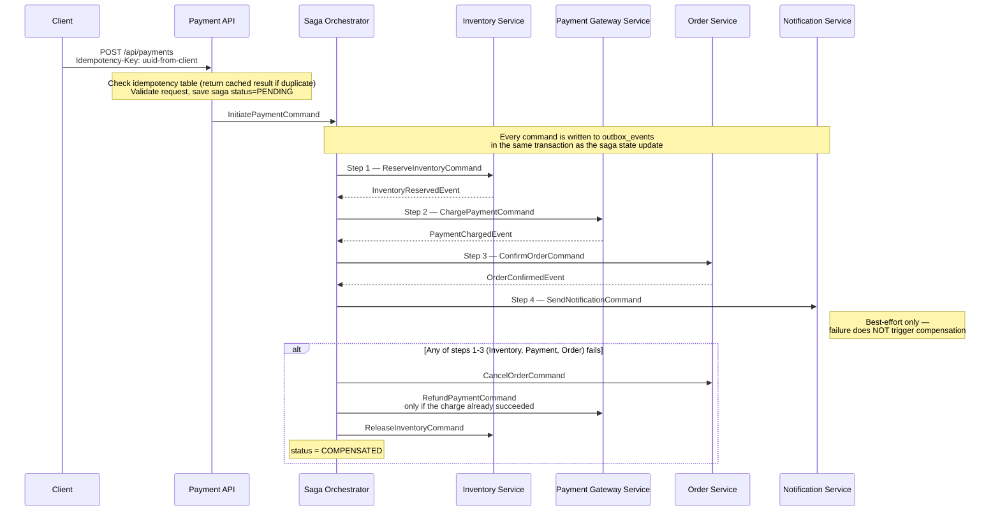
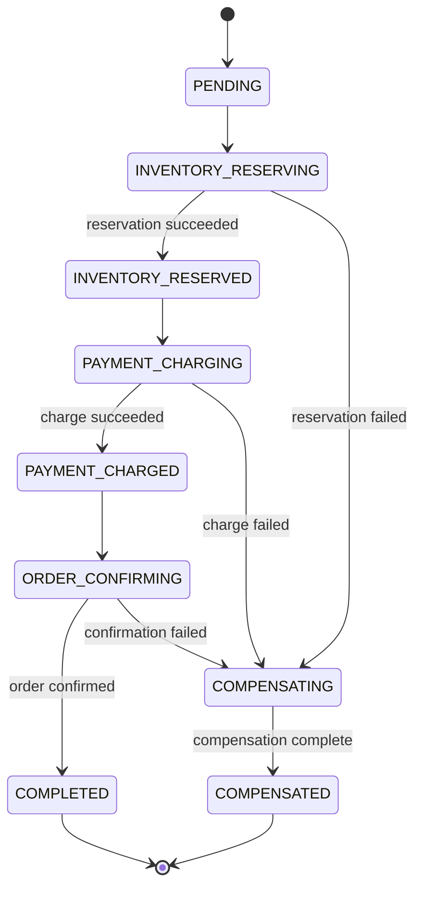

# Case Study: Payment Processor with Saga Orchestration

## Problem Statement

Design a payment processing system for an e-commerce platform that handles payment flows spanning multiple services: order management, payment gateway, inventory reservation, and notification. The system must guarantee:
- No double-charges — even if the client retries or a service crashes mid-flow
- No partial states — if payment fails, inventory must be released and order must be cancelled
- Complete audit trail of every state transition
- Ability to handle partial failures (payment succeeds, notification fails) without rolling back the entire saga
- Throughput of 1000 payment requests per second at p99 < 500ms

The core challenge: a payment flow touches at least 4 services and 4 databases. Traditional 2PC (two-phase commit) across these services is impractical — the coordinator is a single point of failure and all participants block during coordinator failure.

---

## Architecture Overview

The saga orchestrator drives a single payment through four services via command/event pairs — each hop is durable (outbox-backed) so a crash mid-flow can always resume from persisted state instead of losing the command.



The API returns `202 Accepted` right after saving the saga as `PENDING`; every subsequent command/event pair (Steps 1-3) is durably queued through the outbox before the orchestrator advances state, and the `alt` block shows the compensation branch — notification (Step 4) is intentionally outside it since it never triggers a rollback.

**Saga State Machine:** the orchestrator's status column walks this exact lifecycle, and all three failure-prone steps converge on the same `COMPENSATING` state rather than each needing its own rollback path.



`COMPENSATED` (not a reset back to `PENDING`) is the terminal failure state — like `COMPLETED`, it exits the lifecycle, so the crash-recovery job described in the Interview Discussion Points below only ever resubmits commands for sagas still stuck in one of the non-terminal states in between.

---

## Key Design Decisions

**1. Saga Orchestration vs Choreography**

Orchestration chosen because: payment flow has complex compensation logic that is difficult to trace in choreography, a central orchestrator makes the flow state visible and auditable, and payment workflows have strict compliance requirements that benefit from explicit state machines.

**2. Idempotency Key Table**

Every payment request includes a client-generated idempotency key (UUID). Before processing, the API layer checks the `payment_idempotency` table. If the key exists, it returns the cached response (the exact same response as the original request). This stops a client retry that arrives *after* the first request committed. A retry that arrives while the first is still in flight sees no row yet, so the lookup alone is not sufficient — the primary key on `idempotency_key` is what actually serializes the duplicate, and the loser is rejected rather than starting a second saga. The idempotency key has a 24-hour TTL, matching the minimum retention Stripe documents for its own keys.

**3. Outbox Pattern for Command Publishing**

Every saga state update and corresponding command publication happen atomically: the saga state is updated in the DB AND the command is written to the `outbox_events` table in the same `@Transactional` method. The outbox relay publishes commands to Kafka in `seq` order. This ensures no command is lost if Kafka is temporarily unavailable.

**4. Compensating Transactions**

Each saga step has a defined compensating transaction:
- Inventory reservation → Release inventory
- Payment charge → Issue refund
- Order confirmation → Cancel order
- Notification → No compensation (best-effort, non-critical)

Compensating transactions must be idempotent (safe to retry) and do not have to be perfect undos (e.g., a refund is a new transaction that credits the cardholder, not a deletion of the original charge). The refund case shows why "not a perfect undo" is literal rather than pedantic: Stripe has not returned the processing fee on refunds since 2019, so a charge-then-refund round trip leaves the merchant down the original fee even though the customer is made whole.

**5. External Payment Gateway Idempotency**

Calls to the external payment gateway (Stripe-like API) include the `sagaId` as the idempotency key. If the saga retries the charge step after a timeout, the gateway returns the same result for the same idempotency key rather than charging twice — Stripe, for example, saves the status code and body of the first request under that key and replays them, including the failures. Two limits are worth knowing: replaying only starts once the first request has finished, so a retry fired while the original is still executing is rejected as a conflict rather than deduplicated, and the key is only guaranteed for 24 hours, after which the same key is treated as a fresh request.

---

## Implementation

### Schema

```sql
-- Saga state table
CREATE TABLE payment_sagas (
    id              UUID PRIMARY KEY,
    order_id        UUID NOT NULL,
    user_id         VARCHAR(36) NOT NULL,
    amount          DECIMAL(12, 2) NOT NULL,
    currency        VARCHAR(3) NOT NULL DEFAULT 'USD',
    status          VARCHAR(50) NOT NULL,          -- PENDING, INVENTORY_RESERVING, ...
    current_step    VARCHAR(100),
    charge_id       VARCHAR(100),                  -- gateway charge id; required to refund
    failure_reason  TEXT,
    created_at      TIMESTAMPTZ NOT NULL DEFAULT NOW(),
    updated_at      TIMESTAMPTZ NOT NULL DEFAULT NOW()
);

-- Idempotency table
CREATE TABLE payment_idempotency (
    idempotency_key VARCHAR(200) PRIMARY KEY,
    saga_id         UUID NOT NULL REFERENCES payment_sagas(id),
    response_status INTEGER NOT NULL,
    response_body   JSONB,
    created_at      TIMESTAMPTZ NOT NULL DEFAULT NOW(),
    expires_at      TIMESTAMPTZ NOT NULL DEFAULT NOW() + INTERVAL '24 hours'
);

CREATE INDEX idx_idempotency_expires ON payment_idempotency(expires_at);

-- Audit log (immutable, append-only)
CREATE TABLE payment_audit_log (
    id              BIGSERIAL PRIMARY KEY,
    saga_id         UUID NOT NULL,
    event_type      VARCHAR(100) NOT NULL,
    previous_status VARCHAR(50),
    new_status      VARCHAR(50),
    details         JSONB,
    occurred_at     TIMESTAMPTZ NOT NULL DEFAULT NOW()
);

-- Outbox events
CREATE TABLE outbox_events (
    id              UUID PRIMARY KEY DEFAULT gen_random_uuid(),
    seq             BIGSERIAL NOT NULL,            -- insertion order; UUIDs do not sort
    aggregate_id    VARCHAR(36) NOT NULL,
    event_type      VARCHAR(200) NOT NULL,
    payload         JSONB NOT NULL,
    published_at    TIMESTAMPTZ
);
-- The relay reads and publishes in seq order; ordering by the random UUID id would
-- deliver a saga's commands out of order.
CREATE INDEX idx_outbox_unpublished ON outbox_events(seq) WHERE published_at IS NULL;
```

### Payment API with Idempotency Check

```java
@RestController
@RequiredArgsConstructor
@RequestMapping("/api/payments")
public class PaymentController {

    private final PaymentSagaOrchestrator sagaService;
    private final PaymentIdempotencyRepository idempotencyRepo;

    @PostMapping
    @Transactional   // saga row and idempotency row must commit together, or neither
    public ResponseEntity<PaymentResponse> initiatePayment(
            @RequestHeader("Idempotency-Key") String idempotencyKey,
            @Valid @RequestBody PaymentRequest request) {

        // Check if already processed
        Optional<PaymentIdempotency> existing = idempotencyRepo.findById(idempotencyKey);
        if (existing.isPresent()) {
            PaymentIdempotency cached = existing.get();
            return ResponseEntity.status(cached.getResponseStatus())
                .body(cached.getResponseBody());
        }

        // New request — start saga
        PaymentSaga saga = sagaService.initiateSaga(request);

        PaymentResponse response = PaymentResponse.accepted(saga.getId());

        // Store idempotency record. The read above is NOT enough on its own: two
        // concurrent requests carrying the same key both miss it. saveAndFlush forces
        // the INSERT now, so the loser of the race hits the PRIMARY KEY constraint and
        // the whole request — saga row included — rolls back instead of starting a
        // second saga. The violation surfaces as 409, matching how Stripe rejects a
        // second in-flight request on a key already in progress.
        idempotencyRepo.saveAndFlush(PaymentIdempotency.builder()
            .idempotencyKey(idempotencyKey)
            .sagaId(saga.getId())
            .responseStatus(202)
            .responseBody(response)
            .build());

        return ResponseEntity.accepted().body(response);
    }

    @ExceptionHandler(DataIntegrityViolationException.class)
    public ResponseEntity<Void> onDuplicateInFlightKey(DataIntegrityViolationException e) {
        return ResponseEntity.status(HttpStatus.CONFLICT).build();
    }
}
```

### Saga Orchestrator

```java
@Service
@RequiredArgsConstructor
public class PaymentSagaOrchestrator {

    private final PaymentSagaRepository sagaRepository;
    private final OutboxEventRepository outboxRepository;
    private final PaymentAuditLogRepository auditLog;

    // Step transitions as explicit state machine
    private static final Map<SagaStatus, SagaStatus> NEXT_STATUS = Map.of(
        SagaStatus.PENDING,               SagaStatus.INVENTORY_RESERVING,
        SagaStatus.INVENTORY_RESERVING,   SagaStatus.INVENTORY_RESERVED,
        SagaStatus.INVENTORY_RESERVED,    SagaStatus.PAYMENT_CHARGING,
        SagaStatus.PAYMENT_CHARGING,      SagaStatus.PAYMENT_CHARGED,
        SagaStatus.PAYMENT_CHARGED,       SagaStatus.ORDER_CONFIRMING,
        SagaStatus.ORDER_CONFIRMING,      SagaStatus.COMPLETED
    );

    @Transactional
    public PaymentSaga initiateSaga(PaymentRequest request) {
        PaymentSaga saga = PaymentSaga.builder()
            .id(UUID.randomUUID())
            .orderId(request.getOrderId())
            .userId(request.getUserId())
            .amount(request.getAmount())
            .status(SagaStatus.PENDING)
            .build();

        sagaRepository.save(saga);
        appendAuditLog(saga, null, SagaStatus.PENDING, "Saga initiated");

        // Emit first command via outbox
        publishCommand(saga, new ReserveInventoryCommand(saga.getId(), request.getOrderId(), request.getItems()));
        saga.setStatus(SagaStatus.INVENTORY_RESERVING);
        sagaRepository.save(saga);

        return saga;
    }

    @KafkaListener(topics = "inventory-reply-topic")
    @Transactional
    public void onInventoryReply(InventoryReplyEvent event) {
        PaymentSaga saga = sagaRepository.findById(event.getSagaId())
            .orElseThrow(() -> new SagaNotFoundException(event.getSagaId()));

        if (event.isSuccess()) {
            SagaStatus previous = saga.getStatus();
            saga.setStatus(SagaStatus.INVENTORY_RESERVED);
            appendAuditLog(saga, previous, SagaStatus.INVENTORY_RESERVED, "Inventory reserved");

            // Proceed to next step
            publishCommand(saga, new ChargePaymentCommand(saga.getId(), saga.getAmount(), saga.getCurrency()));
            saga.setStatus(SagaStatus.PAYMENT_CHARGING);
            sagaRepository.save(saga);
        } else {
            startCompensation(saga, "Inventory reservation failed: " + event.getFailureReason());
        }
    }

    @KafkaListener(topics = "payment-gateway-reply-topic")
    @Transactional
    public void onPaymentGatewayReply(PaymentGatewayReplyEvent event) {
        PaymentSaga saga = sagaRepository.findById(event.getSagaId())
            .orElseThrow();

        if (event.isSuccess()) {
            saga.setStatus(SagaStatus.PAYMENT_CHARGED);
            // Persist the gateway charge id — the refund compensation cannot be issued without it.
            saga.setChargeId(event.getChargeId());
            appendAuditLog(saga, SagaStatus.PAYMENT_CHARGING, SagaStatus.PAYMENT_CHARGED,
                "Payment charged: " + event.getChargeId());

            publishCommand(saga, new ConfirmOrderCommand(saga.getId(), saga.getOrderId()));
            saga.setStatus(SagaStatus.ORDER_CONFIRMING);
            sagaRepository.save(saga);
        } else {
            // Payment failed — compensate inventory reservation
            startCompensation(saga, "Payment charge failed: " + event.getFailureReason());
        }
    }

    @KafkaListener(topics = "order-reply-topic")
    @Transactional
    public void onOrderReply(OrderReplyEvent event) {
        PaymentSaga saga = sagaRepository.findById(event.getSagaId()).orElseThrow();

        if (event.isSuccess()) {
            saga.setStatus(SagaStatus.COMPLETED);
            appendAuditLog(saga, SagaStatus.ORDER_CONFIRMING, SagaStatus.COMPLETED, "Order confirmed");

            // Notification is best-effort — failure does not trigger compensation
            publishCommand(saga, new SendNotificationCommand(saga.getId(), saga.getUserId(), saga.getOrderId()));
            sagaRepository.save(saga);
        } else {
            startCompensation(saga, "Order confirmation failed: " + event.getFailureReason());
        }
    }

    // Called by the listeners above via self-invocation, which bypasses the Spring proxy:
    // this @Transactional is inert on those paths and the work simply joins the listener's
    // transaction. That is the behaviour we want here, but do not read the annotation as
    // giving compensation a transaction of its own.
    @Transactional
    public void startCompensation(PaymentSaga saga, String reason) {
        // Capture the previous status BEFORE mutating it, or the audit row records
        // COMPENSATING -> COMPENSATING and loses the step that actually failed.
        SagaStatus previous = saga.getStatus();
        saga.setStatus(SagaStatus.COMPENSATING);
        saga.setFailureReason(reason);
        appendAuditLog(saga, previous, SagaStatus.COMPENSATING, reason);

        // Compensate in reverse order of execution: order -> payment -> inventory.
        publishCommand(saga, new CancelOrderCommand(saga.getId(), saga.getOrderId()));
        if (saga.wasPaymentCharged()) {
            // Mandatory: if the charge succeeded and order confirmation then failed,
            // omitting this leaves the customer charged for a cancelled order.
            publishCommand(saga, new RefundPaymentCommand(saga.getId(), saga.getChargeId(),
                saga.getAmount(), saga.getCurrency()));
        }
        if (saga.wasInventoryReserved()) {
            publishCommand(saga, new ReleaseInventoryCommand(saga.getId(), saga.getOrderId()));
        }
        sagaRepository.save(saga);
    }

    private void publishCommand(PaymentSaga saga, Object command) {
        // Save to outbox in SAME transaction as saga state update
        outboxRepository.save(OutboxEvent.builder()
            .aggregateId(saga.getId().toString())
            .eventType(command.getClass().getSimpleName())
            .payload(toJson(command))
            .build());
    }

    private void appendAuditLog(PaymentSaga saga, SagaStatus previous, SagaStatus next, String detail) {
        auditLog.save(PaymentAuditEntry.builder()
            .sagaId(saga.getId())
            .eventType("STATUS_TRANSITION")
            .previousStatus(previous)
            .newStatus(next)
            .details(Map.of("detail", detail, "timestamp", Instant.now()))
            .build());
    }
}
```

---

## Technologies Used

| Technology | Usage |
|------------|-------|
| Spring Boot 4.1 | REST API, Kafka consumers, transaction management |
| Spring Kafka | `@KafkaListener`, `KafkaTemplate` for command publishing |
| Spring Data JPA | Saga state, idempotency table, audit log persistence |
| PostgreSQL | Transactional storage for saga state and outbox |
| Apache Kafka | Command bus between orchestrator and services |
| Outbox pattern | Atomic command publication with state transitions |
| Resilience4j | Retry + circuit breaker around external payment gateway |
| Micrometer | Saga state transition metrics, p99 latency per step |

---

## Tradeoffs and Alternatives

**Orchestration vs Choreography**:
Orchestration provides a single place to see and manage the entire payment flow. The orchestrator's state machine is explicit and auditable. The downside: the orchestrator is a coupled component — if it is down, no new payment sagas can progress. Choreography would have each service react to events independently (more resilient to orchestrator failure) but tracing a payment flow requires correlating events across multiple services.

**2PC Alternative**:
Two-phase commit would provide stronger consistency (all-or-nothing) but the coordinator failure leaves all participants blocked. In a distributed system with external services (payment gateway), 2PC is impractical. The saga pattern achieves eventual consistency with explicit compensation.

**Synchronous vs Asynchronous**:
The payment flow could be fully synchronous (API waits for all steps to complete, returns final status). This is simpler but requires holding the HTTP connection open for potentially 5-10 seconds across multiple service calls. The asynchronous approach returns 202 Accepted immediately and delivers the final result via webhook or polling — better for reliability and user experience.

**Effectively-Once Charge Guarantee**:
The external payment gateway is called with `sagaId` as the idempotency key. If the saga retries the charge step after a timeout, the gateway returns the same charge ID rather than charging again. Combined with the saga's own idempotency key at the API layer, this gives *effectively-once* charging, not exactly-once: the delivery is still at-least-once and deduplication is what makes the repeats harmless. No mainstream gateway promises more — Stripe's idempotency contract is a replay of the first stored response, bounded by a 24-hour key lifetime, and it explicitly does not cover a duplicate that arrives while the first request is still executing. Treat the guarantee as "at most one charge per key, for as long as the key lives", and reconcile against the gateway's own records rather than assuming the invariant holds.

---

## Interview Discussion Points

- **How do you prevent double-charging if the client retries?** Idempotency key table at the API layer: first check, return cached response if key exists. The lookup handles retries that arrive after the first request committed; the primary key on `idempotency_key` handles the harder case of two duplicates in flight at once, where both miss the lookup and the loser's insert is rejected. The key expires after 24 hours.

- **What happens if the orchestrator crashes mid-saga?** The saga state is persisted in PostgreSQL. On restart, a `@Scheduled` job scans for sagas in non-terminal states that have not been updated in > 5 minutes and resubmits the current step's command. Kafka consumer idempotency in each service prevents double-processing.

- **How do you ensure the compensation transactions are executed even if the orchestrator crashes during compensation?** Same recovery mechanism: on restart, sagas in COMPENSATING state have their compensation commands re-submitted. Compensation commands are idempotent: releasing already-released inventory is a no-op, cancelling an already-cancelled order is a no-op, and a refund replayed under the same gateway idempotency key returns the original refund instead of issuing a second one.

- **What is the audit log used for?** Compliance evidence, debugging, and analytics. Payment operators are generally expected to be able to reconstruct the history of any individual payment on demand, which is what an append-only transition log gives you; it also lets you trace exactly what happened for a disputed charge, and measure saga step latency to identify bottlenecks. Which specific regime applies and what it demands depends on the card schemes, the acquirer contract and the jurisdiction, so treat the retention period here as a placeholder to be set from your own obligations rather than a figure carried over from this design.

- **How do you scale the orchestrator?** The orchestrator is stateless (all state in DB). Multiple instances can run simultaneously. Each Kafka consumer group has one active consumer per partition. Partition key = `sagaId` ensures one saga is always processed by the same consumer instance (partition affinity), preventing concurrent processing of the same saga.
