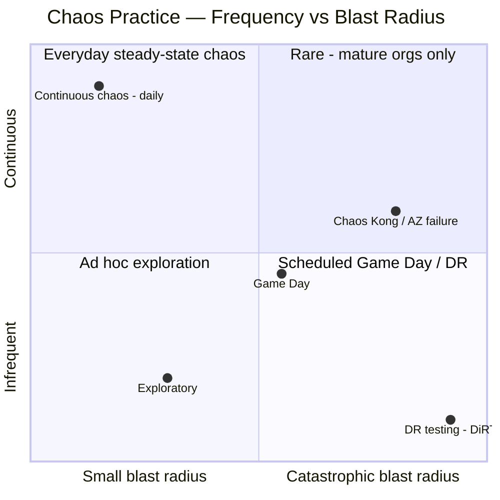
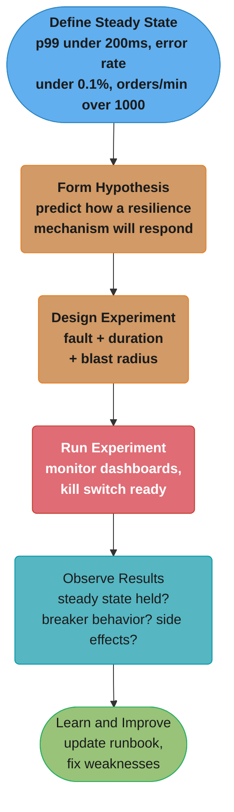
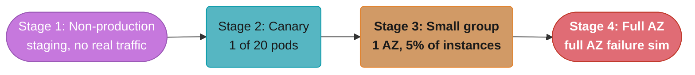
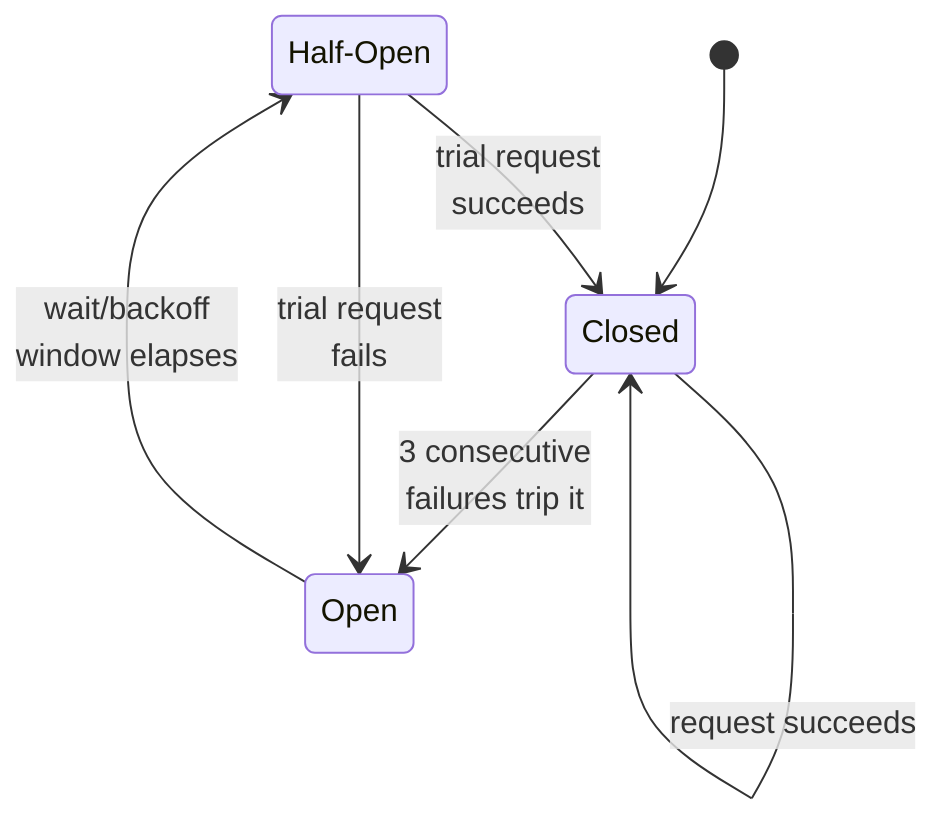

# Chaos Engineering

## 1. Concept Overview

Chaos engineering is the practice of intentionally introducing failures into a system to verify that it can withstand turbulent conditions in production. It is not random destruction — it is a disciplined, hypothesis-driven experiment. You define what "normal" looks like (steady-state), hypothesize that the system will remain normal under a specific fault condition, inject that fault, observe, and learn. The goal is to discover weaknesses before they become incidents.

---

## 2. Intuition

Fire drills do not cause fires — they reveal whether people know what to do when fire happens. Chaos engineering is the software equivalent: running controlled drills to discover whether resilience mechanisms (circuit breakers, retries, fallbacks, replicas) actually work as designed. Most outages are not caused by catastrophic failures; they are caused by cascading failures triggered by small degradations that resilience mechanisms failed to catch.

Key insight: systems fail in ways their designers never anticipated. Chaos engineering surfaces those failure modes in a controlled way before users discover them.

---

## 3. Core Principles

1. **Build a hypothesis around steady-state behavior**: define what normal looks like in measurable terms (p99 latency < 200ms, error rate < 0.1%, throughput > 500 RPS)
2. **Vary real-world events**: inject realistic faults (network latency, process crash, dependency failure) not toy failures
3. **Run experiments in production** (gradually): staging doesn't reflect production traffic patterns; start with small blast radius in production
4. **Automate experiments to run continuously**: one-time chaos doesn't account for system changes; recurring experiments catch regressions
5. **Minimize blast radius**: start with a single instance, a small percentage of traffic, a non-critical service; expand only after confidence

---

## 4. Types / Architectures / Strategies

**Fault injection taxonomy**:

| Category | Fault | Method |
|----------|-------|--------|
| Network | Latency injection | tc netem delay 100ms 20ms (normal distribution) |
| Network | Packet loss | tc netem loss 10% |
| Network | Bandwidth limit | tc tbf rate 1mbit |
| Network | DNS failure | iptables block DNS port 53 |
| Network | Connection reset | iptables drop + tc netem corrupt |
| Process | Kill process | kill -9 / SIGKILL |
| Process | CPU spike | stress-ng --cpu 4 --timeout 60s |
| Process | Memory pressure | stress-ng --vm 2 --vm-bytes 512M |
| Process | Disk full | fallocate -l 10G /tmp/filler |
| Application | Exception injection | Aspect-based fault injection |
| Application | Slow response | Add Thread.sleep() via bytecode agent |
| Application | Dependency unavailable | Block downstream port |
| Infrastructure | Kill VM instance | AWS FIS TerminateInstances |
| Infrastructure | AZ failure | Revoke security group for one AZ |

**Experiment types by scope**:
- Game Day: scheduled team chaos experiment with runbook, on-call team present
- Continuous chaos: automated recurring experiments (Chaos Monkey kills random instances daily)
- Exploratory: unplanned experiments to test a specific hypothesis after observing a near-miss



*Continuous chaos and DR testing sit at opposite corners of the same plane — one trades blast radius for frequency, the other trades frequency for blast radius. Netflix's Chaos Kong (Section 7) is the rare practice mature enough to push toward both axes at once.*

---

## 5. Architecture Diagrams



*Every chaos run traces this loop once: a measurable steady state (p99 under 200ms, error rate under 0.1%, orders/min over 1000) anchors the hypothesis, the experiment is scoped and injected, and the outcome — confirmed or rejected — feeds directly back into the runbook and the circuit breaker thresholds.*



*Blast radius widens one deliberate step at a time — from a risk-free staging run to a full availability-zone failure — so confidence is earned before the next stage runs against real production traffic.*

---

## 6. How It Works — Detailed Mechanics

### Steady-State Definition

```yaml
# steady_state.yaml — Chaos Toolkit format
steady-state-hypothesis:
  title: "API is healthy"
  probes:
    - name: "p99-latency-acceptable"
      type: probe
      tolerance: true
      provider:
        type: http
        url: "http://prometheus:9090/api/v1/query"
        params:
          query: "histogram_quantile(0.99, rate(http_server_requests_seconds_bucket[1m])) < 0.200"
        method: GET
      pauses:
        after: 2

    - name: "error-rate-low"
      type: probe
      tolerance: true
      provider:
        type: http
        url: "http://prometheus:9090/api/v1/query"
        params:
          query: "rate(http_server_requests_seconds_count{status=~'5..'}[1m]) / rate(http_server_requests_seconds_count[1m]) < 0.01"
        method: GET
```

### Network Latency Injection (Linux tc netem)

```bash
# Add 100ms latency with 20ms jitter (normal distribution) to eth0
tc qdisc add dev eth0 root netem delay 100ms 20ms distribution normal

# Verify
tc qdisc show dev eth0

# Add packet loss (10%)
tc qdisc change dev eth0 root netem delay 100ms loss 10%

# Remove fault (kill switch)
tc qdisc del dev eth0 root

# In a Kubernetes init container or chaos agent pod:
# Requires NET_ADMIN capability
# securityContext:
#   capabilities:
#     add: ["NET_ADMIN"]
```

### Chaos Toolkit Experiment

```json
{
  "version": "1.0.0",
  "title": "Inventory service latency does not affect checkout",
  "description": "Add 200ms latency to inventory service, verify checkout maintains SLO",
  "steady-state-hypothesis": {
    "title": "Checkout API is healthy",
    "probes": [
      {
        "name": "checkout-p99-acceptable",
        "type": "probe",
        "tolerance": true,
        "provider": {
          "type": "process",
          "path": "scripts/check-p99.sh",
          "arguments": ["200"]
        }
      }
    ]
  },
  "method": [
    {
      "name": "inject-inventory-latency",
      "type": "action",
      "provider": {
        "type": "python",
        "module": "chaosaws.ec2.actions",
        "func": "stop_instances",
        "arguments": {
          "instance_ids": ["i-1234567890abcdef0"],
          "az": "us-east-1a"
        }
      },
      "pauses": {
        "after": 300
      }
    }
  ],
  "rollbacks": [
    {
      "name": "start-instances",
      "type": "action",
      "provider": {
        "type": "python",
        "module": "chaosaws.ec2.actions",
        "func": "start_instances",
        "arguments": {
          "instance_ids": ["i-1234567890abcdef0"]
        }
      }
    }
  ]
}
```

### Spring Boot Chaos Monkey (Codecentric)

```yaml
# application-chaos.yaml
chaos:
  monkey:
    enabled: true
    watcher:
      service: true        # inject into @Service beans
      rest-controller: true
    assaults:
      level: 5             # 1=low frequency, 10=every request
      latency-active: true
      latency-range-start: 1000  # 1000ms - 3000ms random latency
      latency-range-end: 3000
      exceptions-active: false
      kill-application-active: false
```

```java
// Enable dynamically at runtime via Actuator:
// POST /actuator/chaosmonkey/enable
// POST /actuator/chaosmonkey/assaults
// {
//   "latencyActive": true,
//   "latencyRangeStart": 500,
//   "latencyRangeEnd": 1500,
//   "watchedCustomServices": ["com.example.InventoryService"]
// }
```

### AWS Fault Injection Simulator (FIS)

```json
{
  "description": "Kill 20% of order-service ECS tasks",
  "targets": {
    "order-service-tasks": {
      "resourceType": "aws:ecs:task",
      "resourceTags": {
        "service": "order-service",
        "environment": "production"
      },
      "selectionMode": "PERCENT(20)"
    }
  },
  "actions": {
    "kill-tasks": {
      "actionId": "aws:ecs:stop-task",
      "parameters": {},
      "targets": {
        "Tasks": "order-service-tasks"
      }
    }
  },
  "stopConditions": [
    {
      "source": "aws:cloudwatch:alarm",
      "value": "arn:aws:cloudwatch:us-east-1:123456789:alarm:OrderServiceErrorRateHigh"
    }
  ]
}
```

### Game Day Runbook Template

```
Game Day Runbook — [Service] [Fault Type] — [Date]

HYPOTHESIS:
  If [specific fault], then [expected system behavior],
  because [resilience mechanism] is in place.

STEADY STATE METRICS (baseline, measured 30 min before):
  - Checkout p99: ___ms
  - Error rate: ___%
  - Orders/minute: ___

EXPERIMENT:
  Fault: [description]
  Blast radius: [% of traffic / # of instances]
  Duration: [X minutes]
  Rollback trigger: error rate > 2% OR p99 > 500ms

TEAM:
  Chaos operator: [name] — executes fault injection
  Monitor lead: [name] — watches dashboards
  On-call: [name] — ready to rollback/fix

EXECUTION LOG:
  T+0:00 — Verified steady state
  T+0:05 — Injected fault: [description]
  T+0:06 — [observed behavior]
  T+0:10 — [circuit breaker state / error rate]
  T+0:15 — Removed fault
  T+0:17 — Recovery to steady state

OUTCOME:
  [ ] Hypothesis CONFIRMED: system behaved as expected
  [ ] Hypothesis REJECTED: [describe unexpected behavior]

ACTION ITEMS:
  1. [Fix: describe]  Owner: [name]  Due: [date]
```

---

## 7. Real-World Examples

- **Netflix**: Chaos Monkey (2011) randomly terminates EC2 instances during business hours. Engineers designed Netflix to handle instance loss because it happened routinely. Extended to Chaos Kong (AZ-level failure) and Chaos Gorilla (region-level failure). Result: Netflix survived a major AWS US-East-1 outage while competitors went down.
- **Amazon**: GameDay exercises since 2004; a quarterly exercise where teams simulate failure scenarios; discovered that some fallback paths had never been exercised and had silent bugs
- **LinkedIn**: Found that a key caching layer had a thundering herd problem only visible when the cache restarted — chaos experiment discovered this before a production incident
- **Google**: DiRT (Disaster Recovery Testing) — annual multi-day exercise testing recovery from catastrophic failures; discovered documentation gaps and untested runbooks

---

## 8. Tradeoffs

| Approach | Pros | Cons |
|----------|------|------|
| Staging-only chaos | Safe, no user impact | Staging traffic != production patterns, may miss issues |
| Production with low blast radius | Realistic, finds real issues | Risk of user impact if kill switch fails |
| Continuous automated chaos | Always on, catches regressions | Requires mature monitoring to detect impact |
| Game Day (scheduled) | Team learns, runbooks tested | Infrequent, may miss between events |
| Process-level faults | Easy to implement | May not reflect real failure modes |
| Network-level faults | Realistic, test timeout paths | Requires privileged access, harder to implement |

---

## 9. When to Use / When NOT to Use

Use chaos engineering when: the system has resilience mechanisms (circuit breakers, retries, failover) that have never been tested under real conditions; after each major architecture change; before high-traffic events (Black Friday, product launches); as part of incident response improvement.

Do NOT run chaos experiments without: clear steady-state metrics and monitoring, a kill switch to stop the experiment immediately, on-call team ready to respond, explicit blast radius limits, and post-experiment rollback procedure. Do NOT run destructive chaos (dropping production databases, purging queues) outside of carefully controlled DR exercises.

---

## 10. Common Pitfalls

**No kill switch**: A team ran a chaos experiment that injected CPU pressure on all order-service pods simultaneously. The experiment script had a bug and did not stop after 5 minutes. CPU pressure continued for 45 minutes, causing the checkout service to time out. With no kill switch, engineers had to manually SSH into each pod. Fix: always implement an automated rollback trigger (stop if error rate > threshold) and a one-command manual kill switch.

**Testing the wrong thing**: A team ran chaos experiments killing random instances. Their circuit breakers activated correctly. They concluded the system was resilient. Six months later, a slow dependency (not a down dependency) caused a thread pool exhaustion failure. Their chaos experiments only tested fast failures; slow failures (200ms → 5000ms latency) were never tested. Fix: inject latency degradation, not just instance kills.

**Chaos without observability**: A team ran a chaos experiment and observed "nothing bad happened." But they had no metrics to confirm steady state was maintained. They may have had elevated error rates that went unnoticed. Fix: define and verify steady-state metrics before, during, and after every experiment. No metrics = no chaos engineering.

**Over-broad blast radius too early**: A startup ran its first chaos experiment killing 50% of production services simultaneously on a Friday afternoon. The combination of failure modes caused a cascading failure not anticipated by any single fault. Production was down for 2 hours. Fix: chaos experiments should start with 1 instance, in staging, during low-traffic hours, with the on-call team available.

---

## 11. Technologies & Tools

| Tool | Type | Notes |
|------|------|-------|
| Chaos Toolkit | Open-source experiment runner | Python, JSON/YAML experiments, plugin architecture |
| Chaos Monkey for Spring Boot | Library | Inject latency/exceptions into Spring beans |
| AWS Fault Injection Simulator (FIS) | Managed service | EC2, ECS, RDS, EKS faults with CloudWatch stop conditions |
| Gremlin | Commercial SaaS | Comprehensive fault library, team collaboration features |
| LitmusChaos | Kubernetes-native | CRD-based experiments, Argo Workflow integration |
| ChaosBlade | Open-source | Network, CPU, memory, process, container faults |
| tc netem | Linux kernel | Network emulation (latency, loss, corruption, reordering) |
| stress-ng | Linux tool | CPU, memory, I/O stress generation |

---

## 12. Interview Questions with Answers

**Q: What is chaos engineering and how does it differ from random testing?**
Chaos engineering is a disciplined, hypothesis-driven practice of injecting known fault conditions into a system to verify that resilience mechanisms work as designed. It is not random destruction. Each experiment starts with a steady-state hypothesis (measurable baseline of normal behavior), injects a specific realistic fault, and observes whether the system maintains steady state. Random testing has no hypothesis and no learning objective. Chaos engineering is closer to a scientific experiment: you predict the outcome and learn whether your prediction was correct.

**Q: What is the steady-state hypothesis and why is it essential?**
The steady-state hypothesis defines what "normal" looks like in measurable, objective terms — for example, "p99 checkout latency < 200ms and error rate < 0.1% over any 1-minute window." It is measured before and after the experiment, and continuously during. Without a steady-state definition, you cannot determine whether the experiment affected user experience. The hypothesis also defines the abort criteria: if steady state is violated during the experiment, the kill switch triggers. Teams that skip steady-state definition end up running experiments with unknown outcomes.

**Q: How do you minimize blast radius in chaos experiments?**
Start with the smallest possible scope: one replica of one service, in a staging environment, during off-peak hours. Expand gradually: canary instance (1 of 20 pods), one availability zone, eventually full production. Use traffic shadowing or feature flags to limit which users are affected. Set automated stop conditions: if Prometheus alert fires (error rate > 1%), the chaos agent automatically removes the fault. Define the maximum acceptable blast radius before starting and do not exceed it in a single experiment.

**Q: What is a Game Day and how do you run one?**
A Game Day is a scheduled chaos exercise where the on-call team, engineers, and SREs gather to simulate failure scenarios together. Before: define hypothesis, establish steady-state baseline, prepare runbook with rollback steps, brief all participants on the plan and their roles. During: chaos operator injects faults; monitor lead watches dashboards; others observe behavior. After: compare actual behavior to hypothesis, document timeline, identify action items. Game Days serve two purposes: discovering system weaknesses and training the team to respond to incidents under controlled conditions.

**Q: What types of faults should you inject first?**
Start with the most realistic failure modes for your system. For a service that calls three external dependencies, start with: one dependency returning 500 errors, then one dependency with 500ms added latency, then one dependency completely unreachable. These are the most common production failure patterns. Network partitions and instance failures come next. CPU and memory pressure are useful for validating autoscaling and GC behavior. Avoid starting with catastrophic faults (entire region down) until you have confidence in smaller-scope resilience.

**Q: How does chaos engineering relate to resilience patterns like circuit breakers?**
Circuit breakers, bulkheads, retries, and fallbacks are designed resilience mechanisms. Chaos engineering tests whether they actually work in practice. Engineers often configure circuit breakers but never see them open in production. A chaos experiment that makes a dependency respond with 100% errors for 2 minutes validates: does the circuit breaker open? At what failure rate? How long does it stay open? Does it transition to half-open correctly? Are fallback responses returned to users? Without chaos testing, circuit breakers can have misconfigured thresholds that never trigger, or fallback paths that have silent bugs.

**Q: What is the difference between chaos engineering and disaster recovery testing?**
Chaos engineering focuses on small, targeted fault injection to test resilience mechanisms and discover unknown weaknesses. It runs frequently (weekly or continuously) with limited blast radius. Disaster recovery testing validates recovery procedures for catastrophic failures (data center loss, complete service outage, database corruption). DR testing validates RTOs (Recovery Time Objective) and RPOs (Recovery Point Objective). DR tests run infrequently (quarterly or annually), involve the entire operations team, and often involve actual data restoration from backups. Chaos engineering is ongoing operational practice; DR testing is periodic validation of catastrophic recovery procedures.

**Q: How do you handle chaos experiments that go wrong?**
Every experiment must have a documented rollback procedure executable in under 2 minutes. For network faults: `tc qdisc del dev eth0 root`. For killed processes: `kubectl scale deployment order-service --replicas=5`. For AWS FIS experiments: the stop condition automatically triggers rollback. For Spring Boot Chaos Monkey: `POST /actuator/chaosmonkey/disable`. The kill switch must be tested before the experiment (verify rollback works in staging). If the kill switch itself fails, the on-call team must know how to recover manually. All experiments must have an abort trigger based on steady-state violation metrics.

**Q: What makes a good chaos engineering culture?**
Blameless postmortems where findings from chaos experiments are shared openly. Treating chaos experiment failures as system weaknesses to fix, not human failures. Having engineering teams run their own chaos experiments rather than a separate "chaos team" — ownership of resilience belongs to service teams. Celebrating discovered weaknesses: finding a circuit breaker misconfiguration via chaos is much better than finding it during a real incident. Continuous chaos experiments integrated into deployment pipelines so that every significant deployment is validated under fault conditions.

**Q: What should automatically trigger an abort during a chaos experiment, rather than relying on a human to notice?**
Wire the experiment's stop condition to the same steady-state metrics the hypothesis is built on, so the platform aborts the moment those metrics breach threshold. AWS FIS's `stopConditions` block in §6 references a CloudWatch alarm ARN directly — the moment that alarm transitions to ALARM state, FIS automatically halts the experiment and can trigger the configured rollback with no human intervention, closing exactly the gap the §10 "no kill switch" incident fell into, where CPU pressure ran unattended for 45 minutes. Chaos Toolkit's steady-state-hypothesis probes are re-evaluated after the method runs, but a stricter setup polls them continuously at a short interval during the fault injection itself, not only at the end, so a spike gets caught in seconds. The design principle: abort conditions should be at least as sensitive as the alerting thresholds already in production, since a chaos experiment is deliberately manufacturing the exact condition those alerts exist to catch.

**Q: What does tc netem's delay parameter with a normal distribution actually simulate, and why not just add a fixed delay?**
A fixed delay adds exactly the same latency to every packet, while a normal-distribution delay adds jittered latency that better mimics real network variance. The command in §6, `tc qdisc add dev eth0 root netem delay 100ms 20ms distribution normal`, adds a mean 100ms delay with a 20ms standard deviation, so packets cluster around 100ms but spread across roughly 60-140ms and occasionally further, which is how real WAN and cross-AZ paths actually behave due to queuing and routing variance. A fixed 100ms delay on every packet is easier to reason about but tests a scenario that rarely occurs in production and can hide bugs that only manifest under variance, since a naive fixed-timeout client might pass a fixed-delay test while still failing intermittently against jittered real-world latency. Running `tc qdisc del dev eth0 root` removes the rule immediately, which is why this technique doubles as both the fault injection and its own instant kill switch, with no application restart needed.

**Q: How do you choose between AWS FIS, Chaos Toolkit, and Chaos Monkey for a given chaos experiment?**
Pick AWS FIS for AWS-native faults with built-in CloudWatch stop conditions, Chaos Toolkit for portable cross-environment experiments, and Chaos Monkey for continuous, always-on instance termination. AWS FIS, shown in §6, is right when the fault targets AWS-managed resources directly, since it integrates natively with IAM and CloudWatch alarms as stop conditions, but it is AWS-only and does not reach application-level fault injection without pairing it with something else. Chaos Toolkit is cloud-agnostic and experiment-as-code, with the JSON experiment in §6 defining steady-state probes, a method, and rollbacks in one portable file, making it the better choice for version-controlled, repeatable experiments independent of cloud provider. Chaos Monkey, and its Spring Boot port shown in §6, is purpose-built for continuous background chaos like random instance termination, and is less suited to a carefully scoped one-off Game Day than the other two; mature programs typically run all three together.

**Q: What fields does a Game Day runbook need, and why is the timestamped execution log important?**
A runbook needs a falsifiable hypothesis, a pre-experiment steady-state baseline, a scoped experiment definition with a rollback trigger, named roles, and a timestamped execution log. The template in §6 separates the hypothesis, a specific prediction of the form "if X then Y because Z," from steady-state metrics captured 30 minutes before the experiment, because without a pre-recorded baseline there is no way to tell whether an observed metric during the experiment was caused by the injected fault or was already drifting for an unrelated reason. The execution log's timestamps matter because reconstructing a precise timeline afterward is valuable, letting the team verify a circuit breaker's configured threshold actually matches its real-world trigger point rather than just confirming it eventually opened. Skipping the action items section with a named owner and due date is the most common reason Game Days produce interesting observations but no lasting improvement.

**Q: What does running chaos experiments continuously in a CI/CD pipeline add beyond periodic Game Days?**
Continuous chaos catches resilience regressions introduced by routine code changes within hours instead of waiting for the next scheduled Game Day. A Game Day validates resilience at a point in time, but the codebase keeps changing afterward — a refactor that removes a timeout, a new dependency added without a circuit breaker — and none of those regressions surface again until the next scheduled exercise, which per the quadrant chart in §4 might be months away. Wiring a lightweight chaos experiment into the deployment pipeline itself, injecting latency into a key dependency during canary analysis per the §13 best practice and gating promotion on the canary's error rate, catches a resilience regression on the same deploy that introduced it, while the change is still fresh and easy to roll back. The tradeoff is that continuous chaos experiments must be small, fast, and fully automated end to end, since a human watching a dashboard does not scale to running on every deploy.

**Q: Why must observability maturity come before starting a chaos engineering program, not alongside it?**
Without reliable metrics, a chaos experiment cannot distinguish between the system tolerating the injected fault and the system failing silently in a way nobody is measuring. The steady-state hypothesis pattern used throughout this module, p99 latency, error rate, and throughput queried from Prometheus in §6, is only meaningful if those metrics are already trustworthy in normal operation before any fault is deliberately injected on top. A team with immature observability that runs an experiment and sees no alerts fire cannot tell whether the system was actually resilient or whether the failure mode simply is not instrumented, which is precisely the failure mode in the §10 "chaos without observability" pitfall. Practically, get latency, error rate, and saturation metrics reliably dashboarded and alerting correctly first, then layer chaos experiments on top, since running chaos first just produces confident-sounding conclusions built on data nobody can trust.

**Q: What is the practical difference between injecting a fault at the network layer versus the application layer, and when does each better validate a hypothesis?**
Network-layer faults like tc netem test the real transport path including OS-level timeouts and retries, while application-layer faults test the code's own handling logic in isolation. A network-layer fault like the 200ms delay used in the §14 ML-API case study exercises the entire path a real request takes, DNS resolution, TCP handshake behavior, and the HTTP client's own socket timeout, so it validates a hypothesis end to end and is closer to how a real degradation presents in production, but it requires privileged access and is harder to scope to one specific call. An application-layer fault, Spring Boot Chaos Monkey's latency settings watching `@Service` beans per §6, is injected directly into the method call, skipping the network stack entirely, which is fast to set up and easy to target at the cost of not exercising the real HTTP client's timeout configuration. The fault taxonomy in §4 lists network, process, application, and infrastructure layers specifically because each catches a different class of bug, and a mature program rotates through all four rather than always reaching for the easiest one to set up.

---

## 13. Best Practices

- Document every experiment in a runbook before running it
- Test the rollback procedure in staging before running in production
- Run chaos experiments during business hours when engineers are available to respond
- Start with single-instance faults before multi-instance faults
- Rotate chaos experiments across different fault types, not just instance kills
- Share chaos experiment results in engineering-wide retrospectives — broadcast learning
- Treat failed chaos experiments (hypothesis rejected) as high-priority bugs
- Integrate chaos into deployment pipelines: run lightweight experiments as part of canary analysis
- Measure chaos experiment coverage: which services have been tested? Which fault types?

---

## 14. Case Study

**Problem**: An e-commerce platform's recommendation service called a third-party ML API. In production, the ML API occasionally had 2-3 second response time spikes. The recommendation service used a synchronous HTTP client with a 30-second timeout. During ML API latency spikes, the recommendation service's thread pool exhausted, causing the product page service to also hang (no bulkhead isolation). Engineers suspected this but had never validated it.

**Chaos experiment**:
1. Steady state: product page p99 < 300ms, error rate < 0.1%
2. Hypothesis: "If ML API has 2s latency, product pages continue to load quickly using the cached fallback recommendations"
3. Experiment: injected 2000ms latency to ML API using WireMock stub + traffic routing
4. Observed: product page p99 jumped to 28000ms, error rate hit 35% — hypothesis REJECTED
5. Root cause: recommendation service had no circuit breaker, no timeout shorter than 30s, no fallback to cached recommendations

**Fix applied**:
- Added Resilience4j circuit breaker on ML API client
- Set timeout to 500ms (fast fail)
- Added fallback returning cached popular recommendations from Redis
- Added bulkhead (separate thread pool for ML API calls)

**Validation chaos experiment (re-run)**:
- Steady state held during 2s ML API latency injection
- Circuit breaker opened after 3 consecutive failures
- Users received cached recommendations, product pages loaded normally
- p99 remained at 280ms during the full 10-minute experiment



*The chaos re-run exercised exactly this machine: 3 consecutive failures tripped Closed to Open, the fallback held p99 at 280ms while Open, and a single successful trial request in Half-Open is what closes the loop again.*
