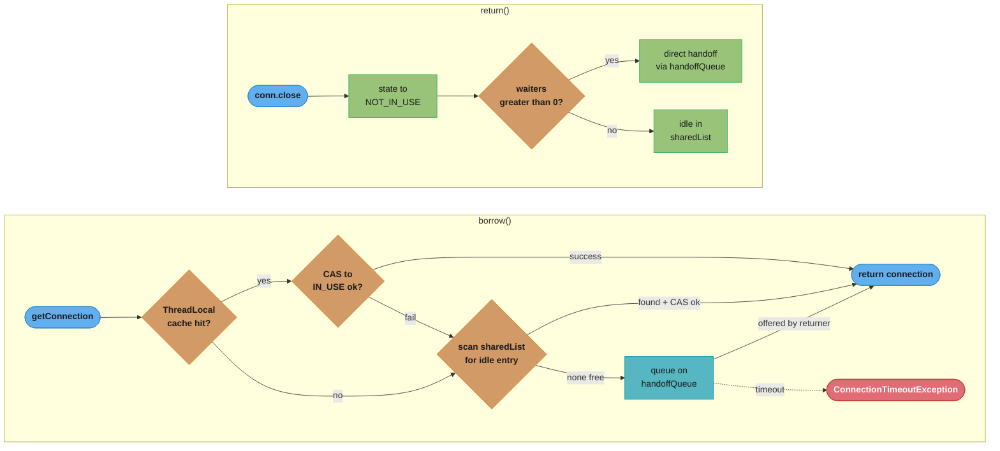
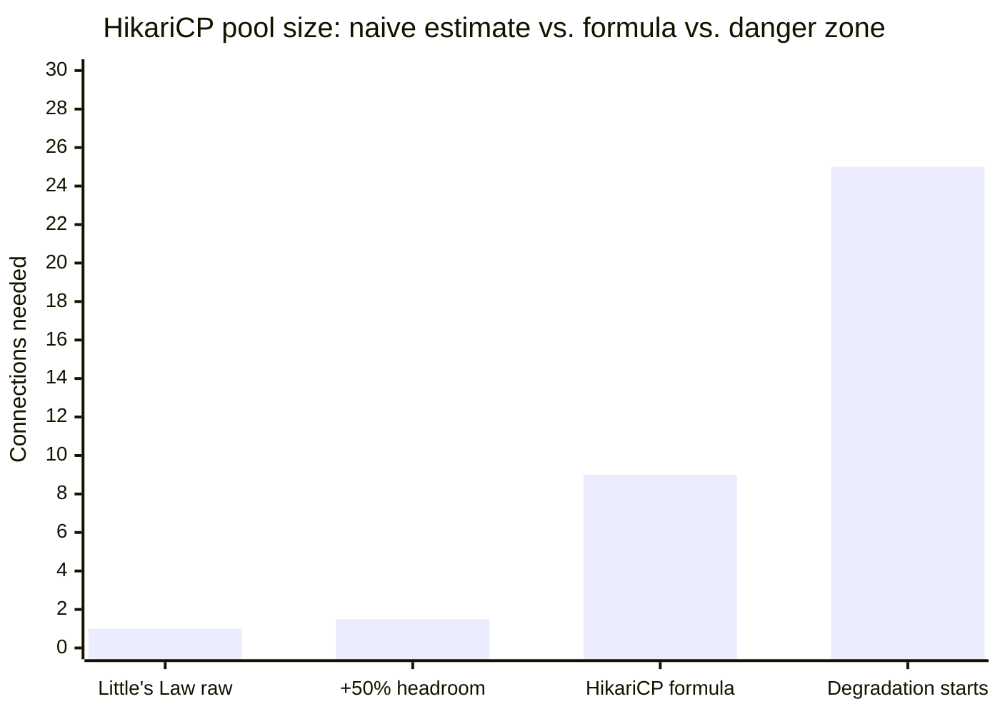
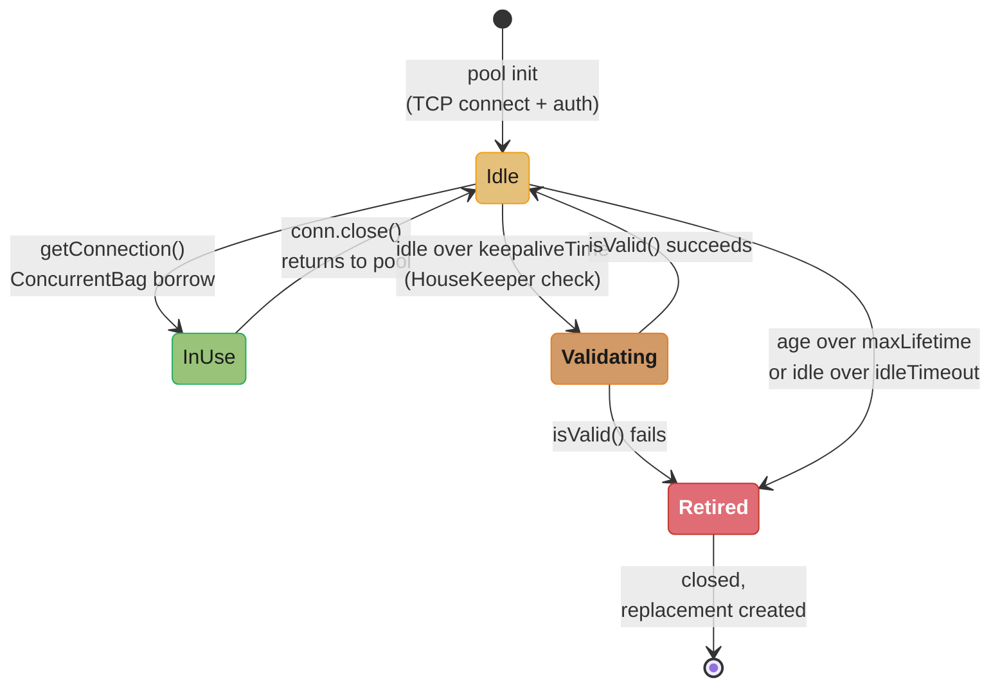
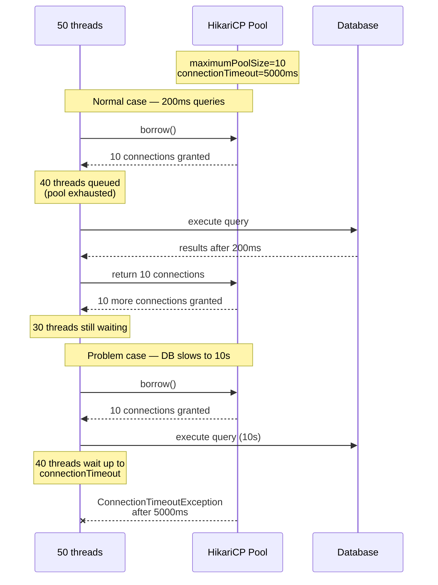
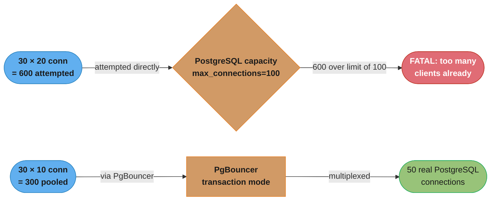

# Connection Pooling Deep Dive

## 1. Concept Overview

A connection pool maintains a set of pre-established database connections that are reused across requests. Creating a TCP connection, performing the TLS handshake, and completing the database authentication handshake takes 20–100ms. For a service handling 1,000 requests/second, creating a new connection per request would spend more time on connection overhead than on actual queries.

HikariCP is the fastest, most widely used JDBC connection pool for Java. Spring Boot auto-configures HikariCP. Understanding its internals — the ConcurrentBag pool data structure, pool sizing formulas, connection validation, and leak detection — is essential for avoiding connection exhaustion, timeout cascades, and subtle connection bugs.

---

## 2. Intuition

> **One-line analogy**: A connection pool is like a taxi dispatch service. Instead of building a new taxi for every passenger (creating a new DB connection per query), you maintain a fleet of taxis (pool of connections) that are borrowed, used, and returned. The dispatcher (pool) tracks which taxis are available and assigns them to passengers efficiently.

**Mental model**: The pool holds N connections. A thread needing a connection calls getConnection(), which returns an available connection from the pool in microseconds. When done, the thread calls close() — which does NOT close the TCP connection but returns it to the pool. If all N connections are checked out, getConnection() waits until a connection is returned or the connectionTimeout (default 30s) expires.

**Why it matters**: Pool sizing is one of the most misunderstood configuration parameters. Bigger is not better — too many connections cause database-side context switching and memory pressure. Too few cause connection timeout under load. HikariCP's default of 10 is deliberately conservative, based on research that shows database performance often degrades beyond (core_count * 2) + spindle_count connections.

**Key insight**: The formula `pool_size = (core_count * 2) + effective_spindle_count` (where effective_spindle_count = 1 for SSDs) comes from Little's Law applied to queuing theory. For a 4-core database with SSD: optimal pool = (4 * 2) + 1 = 9 connections per application server. This is shockingly small for most engineers who expect "more connections = more parallelism."

---

## 3. Core Principles

- **Borrow-use-return**: Connections are borrowed from the pool, used for a single operation or transaction, then returned.
- **Validation**: Connections can become stale (closed by firewall, DB server restart). Pools validate before handing out.
- **Pool sizing**: Constrained by database's capacity, not application desire. More connections than the DB can handle degrades performance.
- **Leak detection**: If a connection is borrowed but not returned (leaked), the pool eventually exhausts. HikariCP can detect this.
- **Connection lifetime**: Long-lived connections accumulate state (prepared statement caches, settings). Connections should be recycled periodically.

---

## 4. Types / Architectures / Strategies

### 4.1 Connection Pool Options for Java

| Pool | Performance | Features | Use Case |
|------|-------------|---------|---------|
| HikariCP | Fastest | Minimal but complete | Spring Boot default, all JDBC |
| Apache DBCP2 | Good | Many config options | Legacy projects |
| c3p0 | Dated | Extensive logging | Old projects, do not use for new |
| Tomcat Pool | Good | Tomcat-integrated | Embedded Tomcat, no Spring Boot |
| Vibur | Good | Monitoring focus | Specific use cases |

HikariCP benchmarks show it handles 100,000s of borrow/return operations per second with near-zero overhead.

### 4.2 HikariCP Key Configuration Parameters

| Parameter | Default | Description |
|-----------|---------|-------------|
| maximumPoolSize | 10 | Maximum connections in pool |
| minimumIdle | same as maximumPoolSize | Minimum idle connections maintained |
| connectionTimeout | 30,000 ms | Max wait for connection before exception |
| idleTimeout | 600,000 ms | Idle connection removed after this (min 10s) |
| maxLifetime | 1,800,000 ms | Connection max age (30 min) — must be < DB/firewall timeout |
| keepaliveTime | 0 (disabled) | Interval for keepalive test on idle connections |
| leakDetectionThreshold | 0 (disabled) | Warn if connection held longer than this |
| connectionTestQuery | null | Query to test connection (use isValid() for JDBC4) |
| validationTimeout | 5,000 ms | Timeout for isValid() check |

### 4.3 PgBouncer Connection Modes

| Mode | Behavior | Use Case |
|------|----------|---------|
| Session | Connection held for entire client session | Stateful sessions (SET, PREPARE) |
| Transaction | Connection returned to pool after each transaction | Most backend services |
| Statement | Connection returned after each statement | Pure read workloads, stateless |

Transaction mode with PgBouncer multiplexes many application connections to a small number of PostgreSQL connections — critical for applications with thousands of connection pool threads.

---

## 5. Architecture Diagrams

### HikariCP ConcurrentBag Internals



*A `borrow()` call checks the thread's own cache first (lock-free on a repeat hit), then scans the shared list with a single CAS, and only queues on the handoff queue once every connection is checked out; this three-tier design is why borrow/return complete in microseconds with no synchronized blocks.*

### Pool Sizing and Little's Law



*Little's Law (L = λ × W: average connections in use = throughput in queries/second times average query duration in seconds) on 100 req/s at 10ms each gives L = 100 × 0.010 = 1 connection in use on average, and a naive 50% safety margin only reaches 1.5 — both under-provision for bursts. The HikariCP formula, (cores × 2) + spindles = (4 × 2) + 1 = 9, lands with real headroom, well below the ~20-30 connection point where PostgreSQL performance starts to degrade from locking and context switching; 10 connections at that rate comfortably serves ~1000 req/s at 10ms per query.*

### Connection Lifecycle



*A connection cycles between Idle and InUse on every borrow/return; the HouseKeeper thread is what moves it sideways into Validating (idle past keepaliveTime) or forward into Retired (past maxLifetime or idleTimeout), checking every 30 seconds independent of application traffic.*

---

## 6. How It Works — Detailed Mechanics

### 6.1 Spring Boot HikariCP Configuration

```yaml
# application.yml
spring:
  datasource:
    url: jdbc:postgresql://localhost:5432/mydb
    username: app
    password: secret
    driver-class-name: org.postgresql.Driver
    hikari:
      maximum-pool-size: 10          # database's capacity, not application desire
      minimum-idle: 5                # keep warm connections for fast borrowing
      connection-timeout: 5000       # fail fast: 5s wait max (not 30s default)
      idle-timeout: 600000           # remove idle after 10 minutes
      max-lifetime: 1740000          # 29 minutes (< firewall/LB 30-min timeout)
      keepalive-time: 60000          # keepalive test every 60s
      leak-detection-threshold: 10000 # warn if connection held > 10s
      pool-name: MyApp-DB
      # PostgreSQL specific: test connection validity
      connection-test-query: SELECT 1  # only if JDBC driver doesn't support isValid()
      data-source-properties:
        cachePrepStmts: true
        prepStmtCacheSize: 250
        prepStmtCacheSqlLimit: 2048
        useServerPrepStmts: true
```

### 6.2 Connection Validation

```java
// HikariCP validation strategy:
// 1. JDBC4 isValid(timeoutSeconds): preferred, no round-trip needed for some drivers
// 2. connectionTestQuery: fallback for older drivers

// When validation runs:
//   - On borrow: if connection was idle > 500ms (configurable via connectionInitSql)
//   - For keepaliveTime: periodic validation of idle connections
//   - If isValid() fails: connection is closed, new connection created

// BROKEN: NOT validating connections (default before HikariCP 4.x):
// Silent failures when network partition occurs and connections become stale
// Symptom: "Connection is closed" or "Broken pipe" errors in application

// FIX: keepaliveTime sends periodic keepalive:
hikariConfig.setKeepaliveTime(60_000); // 60 seconds
// Any connection idle > 60s gets a validation test
// Failed connections are removed and replaced

// Also: maxLifetime recycling prevents accumulation of ancient connections:
hikariConfig.setMaxLifetime(1_740_000); // 29 minutes
// Connections approaching maxLifetime are retired gracefully
// New connections created to replace them
// Stagger retirement to avoid replacing all connections simultaneously
```

### 6.3 Leak Detection

```java
// Enable leak detection:
hikariConfig.setLeakDetectionThreshold(10_000); // 10 seconds

// When a connection is borrowed, HikariCP starts a timer.
// If the connection is not returned within 10s, HikariCP logs:
//
// [WARN] Connection leak detection triggered for com.example.OrderService,
//        stack trace follows
//        java.lang.Exception: Apparent connection leak detected
//            at com.example.OrderService.processOrder(OrderService.java:42)
//            at ...
//
// The connection is NOT forcibly closed (it continues to be used).
// The warning tells you WHERE the leak is occurring.

// Common leak patterns:
// 1. Exception thrown before conn.close() without try-with-resources
Connection conn = dataSource.getConnection();
// If this throws, conn is never closed:
ResultSet rs = conn.createStatement().executeQuery(sql);
// FIX: use try-with-resources
try (Connection conn = dataSource.getConnection()) {
    // conn.close() called automatically
}

// 2. Spring @Transactional holding connection for entire method
// Including time spent calling external APIs, waiting for user input, etc.
@Transactional
public void longRunningProcess() {
    Order order = orderRepo.findById(id);  // connection borrowed here
    externalPaymentApi.charge(order);      // connection STILL HELD during HTTP call
    orderRepo.save(order);                 // 100ms HTTP call held the connection
}
// FIX: split into: fetch → process → save as separate transactions
// or use @Transactional only around the save
```

### 6.4 Pool Exhaustion Scenario



*The pool behaves identically in both runs — grant up to `maximumPoolSize`, queue the rest — but a 200ms query drains and refills the pool every cycle while a 10s query holds all 10 connections past the 5000ms `connectionTimeout`, turning healthy queuing into `ConnectionTimeoutException` for every waiter. The fix is never to enlarge the pool blindly: watch `hikaricp_connections_pending` — a value pinned near maximumPoolSize means the query, not the pool, is the real bottleneck.*

---

## 7. Real-World Examples

**Stack Overflow**: Famously used with default PostgreSQL and SQL Server settings. Their blog documented that a 4-core web server with pool size 10 per instance handled their entire traffic. Most engineers are shocked — 10 connections per web server is often sufficient.

**PgBouncer at scale**: Companies with thousands of microservice instances (each with a 10-connection HikariCP pool) would create 10,000+ connections to PostgreSQL — far exceeding its capacity (recommended max: 100-200). PgBouncer in transaction mode multiplexes 10,000 application connections to 50 PostgreSQL connections, enabling microservices scale without PostgreSQL connection limit issues.

---

## 8. Tradeoffs

| Pool Size | Behavior | Performance |
|-----------|----------|-------------|
| Too small (<5) | High wait times under moderate load | Poor throughput |
| Optimal (formula) | Low wait times, low DB overhead | Best |
| Too large (>50 per DB server) | DB context switching, lock contention | Degrades |

| Validation Strategy | Reliability | Overhead |
|--------------------|------------|---------|
| No validation | Risk of stale connections | Zero |
| isValid() on borrow | Catches all stale connections | 1 extra round-trip |
| keepaliveTime periodic | Catches idle stale connections | Low (only idle) |
| maxLifetime recycling | Prevents accumulation | Low (amortized) |

---

## 9. When to Use / When NOT to Use

**HikariCP directly**: Use for any Java application connecting to a relational database. The default Spring Boot configuration is HikariCP — do not change unless you have a specific reason.

**PgBouncer in front of PostgreSQL**: Use when you have many application servers (>20) each with a connection pool, and your connection count approaches PostgreSQL's limit. PostgreSQL supports up to ~200-500 connections before performance degrades.

**Increase pool size**: Only after profiling confirms pool wait time is the bottleneck. Use `hikaricp_connections_pending` Micrometer metric. Increasing pool size blindly often makes the database the bottleneck instead.

---

## 10. Common Pitfalls

**maxLifetime longer than load balancer/firewall timeout**: AWS RDS, Azure Database, and cloud proxies close idle connections after a timeout (typically 1800–3600 seconds). If maxLifetime is 30 minutes (1,800,000 ms) and the load balancer timeout is 1800 seconds (1,800,000 ms), connections may be closed by the LB exactly as HikariCP tries to retire them — causing connection errors. Set maxLifetime to at least 30 seconds below the firewall/LB timeout: `maxLifetime = LB_timeout_ms - 30_000`.

**Holding connections across external service calls**: A `@Transactional` method that calls an external HTTP API holds a database connection for the entire duration of the HTTP call. If the external call is slow (500ms), 10 active requests hold all 10 pool connections while waiting for HTTP — blocking all other database operations. Fix: minimize the code inside @Transactional to only the database operations; perform external calls outside the transaction.

**minimumIdle causing connection thrashing**: If minimumIdle is set to 0 (no warm connections), every incoming request must create a new connection. Connection creation takes 20-100ms, adding latency to the first request after an idle period. Keep minimumIdle equal to expected steady-state concurrent connections.

**Ignoring connectionTimeout in error handling**: When the pool exhausts, HikariCP throws CannotGetJdbcConnectionException with cause HikariPool$PoolTimeoutException. Many applications treat all DataAccessException as retriable — retrying a pool exhaustion exception will not help (the pool is still exhausted). Detect this specific exception and return 503 Service Unavailable rather than retrying.

---

## 11. Technologies & Tools

| Tool | Purpose |
|------|---------|
| HikariCP | High-performance JDBC connection pool |
| PgBouncer | PostgreSQL connection pooler (proxy) |
| ProxySQL | MySQL connection pooler |
| `hikaricp_*` metrics | Micrometer gauges for pool monitoring |
| `jcmd <pid> VM.native_memory` | View total memory including connection pool buffers |
| `ss -tn` | View actual TCP connections to database |
| `SELECT * FROM pg_stat_activity` | View PostgreSQL connections from DB side |
| `SHOW PROCESSLIST` | View MySQL connections |

---

## 12. Interview Questions with Answers

**Q: What is a connection pool and why is it necessary?**
A connection pool pre-establishes and maintains a set of database connections for reuse. Creating a JDBC connection involves TCP handshake, TLS (if SSL is enabled), authentication (username/password), session setup — totaling 20–100ms. For applications handling 100+ requests/second, creating a connection per request is prohibitively expensive. A pool reduces this to microseconds per borrow by reusing established connections.

**Q: How does HikariCP's ConcurrentBag work?**
ConcurrentBag is a custom concurrent data structure optimized for borrow/return patterns. It uses three tiers: a ThreadLocal list of previously used connections (first check for fast, uncontested borrow), a CopyOnWriteArrayList of all connections (scanned with CAS operations), and a SynchronousTransferQueue for threads waiting when all connections are in use (direct handoff from returning thread to waiter without queue traversal). This design minimizes lock contention and achieves microsecond borrow times.

**Q: What is the optimal database connection pool size?**
The HikariCP formula is: `pool_size = (core_count * 2) + effective_spindle_count`. For a 4-core database server with SSD (effective_spindle = 1), optimal pool ≈ 9 connections per application server. This is based on research showing that more connections than ~2x cores causes database context switching overhead that reduces overall throughput. The default HikariCP maximumPoolSize of 10 is deliberately conservative and appropriate for most workloads.

**Q: What happens when the connection pool exhausts?**
When all connections are in use (count == maximumPoolSize), new borrow requests wait up to connectionTimeout (default 30s). If no connection becomes available within that time, HikariCP throws CannotGetJdbcConnectionException. The application should treat this as a 503 Service Unavailable, not a retriable error. Pool exhaustion indicates either the pool is too small (increase if DB can handle it) or queries are too slow (optimize queries or fix downstream issue).

**Q: How does HikariCP detect connection leaks?**
When leakDetectionThreshold is set (e.g., 10000 ms), HikariCP starts a timer when a connection is borrowed. If the connection is not returned within the threshold, HikariCP logs a warning with the stack trace of where the connection was borrowed. This identifies code paths that hold connections too long (transaction spanning external HTTP calls, forgot close, caught exception before finally). The connection continues to function; the leak detection only warns.

**Q: What is the maxLifetime setting and why is it important?**
maxLifetime sets the maximum age of a connection in the pool. When a connection reaches its maxLifetime, HikariCP retires it and creates a new one. This prevents accumulation of ancient connections that may have accumulated state, and prevents connections from being closed mid-request by load balancers or firewalls that have their own idle connection timeouts. maxLifetime must be set shorter than the database firewall or load balancer idle timeout to avoid getting a connection closed just as it is being handed out.

**Q: What is PgBouncer and when should you use it?**
PgBouncer is a PostgreSQL connection pooler that sits between application servers and PostgreSQL. In transaction mode, it borrows a PostgreSQL connection only for the duration of a transaction and returns it immediately — allowing thousands of application connections to multiplex through tens of PostgreSQL connections. Use PgBouncer when you have many application server instances, each with its own HikariCP pool, and the total connection count would exceed PostgreSQL's maximum (~100-500 connections for good performance).

**Q: How should HikariCP be configured to work behind AWS RDS?**
AWS RDS has a connection idle timeout (default varies, but commonly 3600s for RDS Proxy, shorter for direct connections). Configure: `maxLifetime = 1740000` (29 min, safely below RDS's 30-min idle timeout), `keepaliveTime = 60000` (60s keepalive prevents idle connection death from RDS side), `connectionTimeout = 5000` (fail fast, do not wait 30s). For RDS Proxy: the proxy manages connection pooling, so application pool can be smaller; ensure `maxLifetime` < RDS Proxy's `connectionBorrowTimeout`.

**Q: What metrics should you monitor for a HikariCP pool?**
Key Micrometer metrics: `hikaricp_connections` (total), `hikaricp_connections_active` (in use), `hikaricp_connections_idle` (available), `hikaricp_connections_pending` (waiting threads), `hikaricp_connections_creation_seconds` (time to create connections), `hikaricp_connections_acquire_seconds` (time to borrow from pool). Alert on: pending > 0 consistently (pool exhaustion starting), acquire_seconds p99 > 100ms (contention), active approaching pool size (near exhaustion).

**Q: Why should you avoid holding connections during external service calls?**
Database connections are a scarce resource (pool of 10). If a `@Transactional` method calls an external HTTP API that takes 500ms, the connection is held idle during that 500ms. With 10 connections and 500ms lock time, the service can only process 10 / 0.5 = 20 requests/second through this code path — even if the database could handle 1,000. This is connection pool starvation from external latency. Keep transactions short: fetch data, close transaction, call external service, open new transaction to save results.

**Q: How does connection validation work in HikariCP?**
HikariCP validates connections before handing them out if the connection has been idle for more than 500ms. Validation uses JDBC4's `Connection.isValid(timeoutSeconds)` which is a lightweight network round-trip to check liveness. If `isValid()` returns false, the connection is closed and a new one is created. For drivers that do not support JDBC4 isValid(), set `connectionTestQuery = "SELECT 1"`. With `keepaliveTime` set, HikariCP also validates idle connections periodically, proactively replacing stale ones before they are borrowed.

**Q: What causes "Apparent connection leak detected" in HikariCP?**
This warning fires when a borrowed connection is not returned within `leakDetectionThreshold` milliseconds. Common causes: (1) Code path exits via exception without closing the connection (fix: try-with-resources); (2) Long-running transaction (heavy computation or external calls inside @Transactional, fix: minimize transaction scope); (3) Forgotten close in unit tests (fix: @Transactional on test method or explicit cleanup). The stack trace in the warning points to the exact location where the connection was borrowed.

**Q: How does read replica routing work with connection pooling?**
Use separate HikariCP pools — one for the primary (read-write), one per read replica (read-only). Route read-only queries (SELECT without transaction) to the read pool and writes to the primary pool. In Spring: configure two DataSources and use an AbstractRoutingDataSource with a ThreadLocal to switch. Alternatively, PgBouncer or ProxySQL can do read/write splitting at the proxy layer based on SQL parsing. Ensure the read pool's maxLifetime is shorter than the replication lag threshold (a connection pointing to a replica that has fallen behind should be detected).

**Q: How do you tell whether a connection pool is too small versus the queries simply being too slow?**
The `hikaricp_connections_pending` metric is the tell: it stays above zero only when the pool itself is undersized, not when queries are simply slow. A healthy 200ms-query workload drains and refills a 10-connection pool every cycle without any pending threads. The same pool serving a query that suddenly takes 10 seconds holds all 10 connections past the default 5000ms connectionTimeout, so every waiter times out — a symptom that looks identical to "pool too small" until you check how long the query itself is taking. Blindly enlarging the pool when queries are the real bottleneck only adds more concurrent slow queries competing for the database's CPU, locks, and disk, making the underlying problem worse; profile the slow query first, and only increase pool size after confirming query duration is normal and wait time is still the limiting factor.

**Q: What causes "FATAL: sorry, too many clients already" and how do you fix it without redesigning every service?**
This PostgreSQL error means total connection attempts across all app instances exceeded max_connections, and the fix is a pooling proxy like PgBouncer, not smaller per-service pools. In one production case, 30 instances each running a 20-connection HikariCP pool attempted 600 connections against a PostgreSQL server configured with max_connections=100 — six times over the limit — and every excess attempt failed with this exact error. Deploying PgBouncer in transaction mode let the applications keep their existing pool sizes while multiplexing the real traffic down to 50 actual PostgreSQL connections, because PgBouncer only holds a real connection for the duration of one transaction rather than one client session. Put a pooling proxy in front of PostgreSQL before assuming the fix is a bigger database instance or smaller application pools.

**Q: What happens if you set HikariCP's minimumIdle to 0?**
Setting minimumIdle to 0 means the pool keeps no warm connections ready, so a request arriving after any idle period pays the full cost of creating a new connection first. Connection creation involves a TCP handshake, optional TLS negotiation, and database authentication — 20 to 100ms — which becomes added latency on the first request after any idle gap instead of being hidden ahead of time. This connection thrashing is worst for bursty traffic patterns, where the pool repeatedly drains to zero idle connections and then pays the creation cost again for the next burst. Keep minimumIdle equal to maximumPoolSize, HikariCP's own recommended default, so the pool maintains warm connections sized to expected steady-state concurrency.

---

## 13. Best Practices

- Start with pool size = (DB core count * 2) + 1 per application server. Adjust based on metrics.
- Always set maxLifetime 30 seconds below any load balancer or firewall idle timeout.
- Enable leakDetectionThreshold = 10000 in all non-production environments to catch leaks early.
- Enable keepaliveTime = 60000 on connections that may sit idle through NAT timeouts.
- Monitor hikaricp_connections_pending; alert if consistently > 0.
- Use try-with-resources for all Connection, Statement, and ResultSet objects.
- Keep @Transactional methods short; no external API calls inside transactions.
- Use PgBouncer in transaction mode for PostgreSQL-backed microservices with many instances.

---

## 14. Case Study

See the [Java case study: design_connection_pool](../java/case_studies/design_connection_pool.md) for a full implementation from scratch. The backend production scenario:

**Production incident**: A payment service running 30 instances, each with a 20-connection HikariCP pool, was connecting to a PostgreSQL 12 server with max_connections=100. Under normal load: 30 instances * 20 connections = 600 connections attempted. PostgreSQL was refusing connections at max_connections, causing `org.postgresql.util.PSQLException: FATAL: sorry, too many clients already`.

**Root cause**: Pool size (20) was set based on "enough headroom" rather than the database capacity formula. 30 * 20 = 600 far exceeds PostgreSQL's safe limit.

**Fix**: Deployed PgBouncer in transaction mode. Application continues to use 20-connection pools. PgBouncer forwards transactions to only 50 PostgreSQL connections. Total PostgreSQL connections: 50 (constant). Application pools: 600 (unchanged). PgBouncer acts as a multiplexer.

**Longer term**: Reduced HikariCP pool to 10 per instance based on the formula (PostgreSQL on 4-core server: (4*2)+1 = 9 ≈ 10 per instance). With PgBouncer: 30 * 10 = 300 connections through PgBouncer → 50 real PostgreSQL connections. 80% reduction in DB connection overhead.



*Connecting the fleet directly overwhelms PostgreSQL's max_connections=100 — 600 attempted connections exceed it 6x and every excess attempt fails with `FATAL: sorry, too many clients already`. Routing through PgBouncer in transaction mode instead multiplexes application-side pools down to a constant 50 real PostgreSQL connections, the 80% reduction in DB connection overhead described above.*
