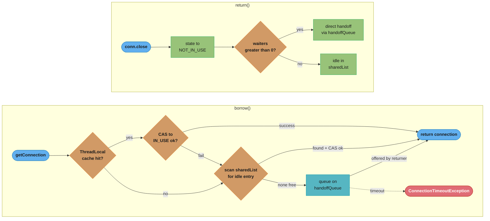
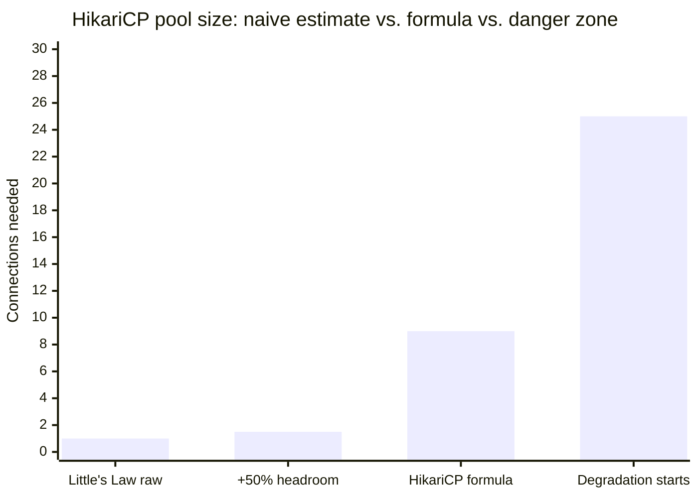
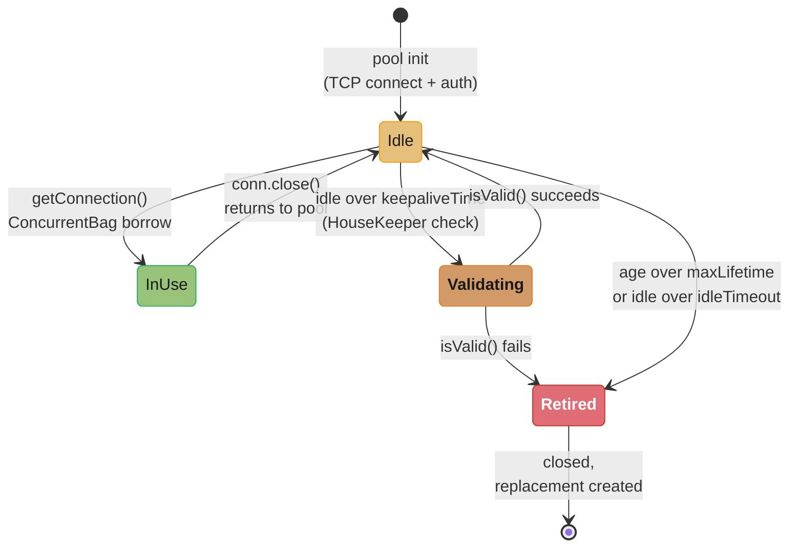
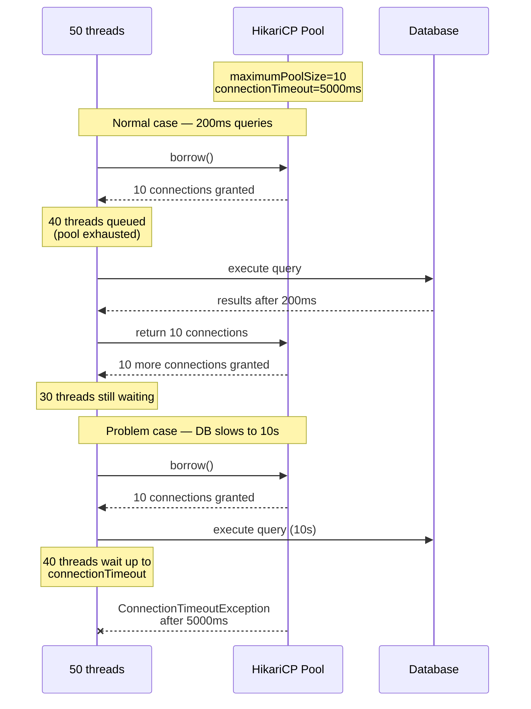
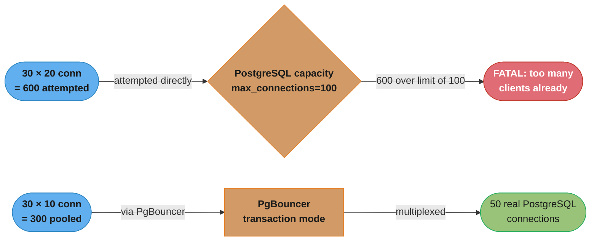

# Connection Pooling Deep Dive

## 1. Concept Overview

A connection pool maintains a set of pre-established database connections that are reused across requests. Creating a TCP connection, performing the TLS handshake, and completing the database authentication handshake takes 20–100ms. For a service handling 1,000 requests/second, creating a new connection per request would spend more time on connection overhead than on actual queries.

HikariCP is the fastest, most widely used JDBC connection pool for Java. Spring Boot auto-configures HikariCP. Understanding its internals — the ConcurrentBag pool data structure, pool sizing formulas, connection validation, and leak detection — is essential for avoiding connection exhaustion, timeout cascades, and subtle connection bugs.

---

## 2. Intuition

> **One-line analogy**: A connection pool is like a taxi dispatch service. Instead of building a new taxi for every passenger (creating a new DB connection per query), you maintain a fleet of taxis (pool of connections) that are borrowed, used, and returned. The dispatcher (pool) tracks which taxis are available and assigns them to passengers efficiently.

**Mental model**: The pool holds N connections. A thread needing a connection calls getConnection(), which returns an available connection from the pool in microseconds. When done, the thread calls close() — which does NOT close the TCP connection but returns it to the pool. If all N connections are checked out, getConnection() waits until a connection is returned or the connectionTimeout (default 30s) expires.

**Why it matters**: Pool sizing is one of the most misunderstood configuration parameters. Bigger is not better — too many connections cause database-side context switching and memory pressure. Too few cause connection timeout under load. HikariCP's default of 10 is deliberately conservative, matching the empirical rule on the PostgreSQL project's "Number Of Database Connections" wiki page: throughput peaks near (core_count * 2) + effective_spindle_count active connections.

**Key insight**: The formula `pool_size = (core_count * 2) + effective_spindle_count` is that PostgreSQL wiki rule, which HikariCP's "About Pool Sizing" wiki adopts verbatim — it is an empirical starting point, not a derivation from Little's Law. `effective_spindle_count` is 0 when the working set is fully cached and rises toward the real spindle count as the cache hit rate falls; the PostgreSQL wiki states plainly that "there hasn't been any analysis so far regarding how well the formula works with SSDs," so do not treat "1 for SSD" as an established constant. HikariCP's own worked example is a 4-core box with one disk: (4 * 2) + 1 = 9, "call it 10 as a nice round number." This is shockingly small for most engineers who expect "more connections = more parallelism."

**In plain terms.** "The number of connections you actually need is throughput multiplied by how long each query holds one — and the database's core count, not your traffic, sets the ceiling on how many are useful."

Little's Law (`L = λ × W`) tells you the *demand* side; the HikariCP formula tells you the *supply* side. Pool sizing is the smaller of "enough for the arrival rate" and "not more than the database can execute in parallel."

| Symbol | What it is |
|--------|------------|
| `L` | Average number of connections busy at any instant — what the pool must cover |
| `λ` | Arrival rate, queries per second |
| `W` | Average time one query holds a connection, in **seconds** (10ms = `0.010`) |
| `core_count` | CPU cores on the **database** server, not the application server (hyperthreads excluded) |
| `effective_spindle_count` | `0` when the working set is fully cached, rising toward the real spindle count as the cache hit rate falls (unanalysed for SSD) |

**Walk one example.** A service at 100 req/s against a 4-core PostgreSQL box with one disk, 10ms queries:

    Little's Law (demand)
      L = lambda x W = 100 x 0.010 s        = 1.0 connections busy on average
      naive "+50% headroom"                  = 1.5 connections

    HikariCP formula (supply ceiling)
      pool = (core_count x 2) + spindles
           = (4 x 2) + 1                     = 9 connections

    what 9 connections can actually absorb
      capacity = pool / W = 9 / 0.010 s      = 900 req/s sustained

Provisioning the Little's Law answer of 1 connection would collapse on the first burst, because `L` is a *mean* and arrivals are not uniform. Provisioning 50 would not help either: past roughly `cores × 2`, extra connections do not add parallelism, they add context switches and lock contention on the database. The "danger zone" marker in the chart below is an illustrative point on that curve, not a published PostgreSQL threshold — neither the PostgreSQL nor the HikariCP wiki names a specific connection count at which degradation begins.

---

## 3. Core Principles

- **Borrow-use-return**: Connections are borrowed from the pool, used for a single operation or transaction, then returned.
- **Validation**: Connections can become stale (closed by firewall, DB server restart). Pools validate before handing out.
- **Pool sizing**: Constrained by database's capacity, not application desire. More connections than the DB can handle degrades performance.
- **Leak detection**: If a connection is borrowed but not returned (leaked), the pool eventually exhausts. HikariCP can detect this.
- **Connection lifetime**: Long-lived connections accumulate state (prepared statement caches, settings). Connections should be recycled periodically.

---

## 4. Types / Architectures / Strategies

### 4.1 Connection Pool Options for Java

| Pool | Performance | Features | Use Case |
|------|-------------|---------|---------|
| HikariCP | Fastest | Minimal but complete | Spring Boot default, all JDBC |
| Apache DBCP2 | Good | Many config options | Legacy projects |
| c3p0 | Dated | Extensive logging | Old projects, do not use for new |
| Tomcat Pool | Good | Tomcat-integrated | Legacy Tomcat deployments; Spring Boot's documented second choice if HikariCP is absent |
| Vibur | Good | Monitoring focus | Specific use cases |

HikariCP benchmarks show it handles 100,000s of borrow/return operations per second with near-zero overhead.

### 4.2 HikariCP Key Configuration Parameters

| Parameter | Default | Description |
|-----------|---------|-------------|
| maximumPoolSize | 10 | Maximum connections in pool |
| minimumIdle | same as maximumPoolSize | HikariCP explicitly recommends *not* setting this — leave it as a fixed-size pool |
| connectionTimeout | 30,000 ms | Max wait for connection before exception (min 250 ms) |
| idleTimeout | 600,000 ms | Idle connection removed after this (min 10s) |
| maxLifetime | 1,800,000 ms | Connection max age (30 min) — must be < DB/firewall timeout (min 30s) |
| keepaliveTime | 120,000 ms (2 min) since HikariCP 6.2.1; 0 (disabled) in 4.0.0–6.2.0 | Keepalive test on idle connections (min 30s, must be < maxLifetime) |
| leakDetectionThreshold | 0 (disabled) | Warn if connection held longer than this (min 2,000 ms when enabled) |
| connectionTestQuery | none | Legacy drivers only — HikariCP "strongly recommends not setting this" if the driver supports JDBC4 `isValid()` |
| validationTimeout | 5,000 ms | Timeout for isValid() check (min 250 ms) |

Defaults above are from the HikariCP 7.x README and `HikariConfig` source. Spring Boot 4.1 manages HikariCP 7.0.2, but older Spring Boot 3.x lines manage HikariCP 5.x, where `keepaliveTime` still defaulted to 0 — check the version your build actually resolves before assuming keepalive is on.

### 4.3 PgBouncer Connection Modes

| Mode | Behavior | Use Case |
|------|----------|---------|
| Session (default `pool_mode`) | Connection held for entire client session | Stateful sessions (SET, PREPARE, LISTEN, advisory locks) |
| Transaction | Connection returned to pool after each transaction | Most backend services |
| Statement | Connection returned after each statement; multi-statement transactions are disallowed | Autocommit-only, stateless workloads |

Transaction mode with PgBouncer multiplexes many application connections to a small number of PostgreSQL connections — critical for applications with thousands of connection pool threads.

**What transaction mode actually breaks.** PgBouncer's own feature matrix marks these as never available under transaction pooling: `SET`/`RESET`, `LISTEN`, `WITH HOLD` cursors, `PREPARE`/`DEALLOCATE`, `PRESERVE ROWS`/`DELETE ROWS` temp tables, the `LOAD` statement, and session-level advisory locks. One exception is worth knowing: since PgBouncer 1.21, *protocol-level* named prepared statements (what JDBC's `useServerPrepStmts` issues) are tracked and do work in transaction and statement mode when `max_prepared_statements` is non-zero — its default is 200. SQL-level `PREPARE` is still unsupported. `default_pool_size` defaults to 20 server connections per user/database pair.

---

## 5. Architecture Diagrams

### HikariCP ConcurrentBag Internals


```mermaid
flowchart LR
    classDef io      fill:#61afef,stroke:#2e86c1,color:#1a1a1a,font-weight:bold
    classDef frozen  fill:#c678dd,stroke:#9b59b6,color:#fff
    classDef train   fill:#98c379,stroke:#27ae60,color:#1a1a1a
    classDef mathOp  fill:#d19a66,stroke:#e67e22,color:#1a1a1a,font-weight:bold
    classDef lossN   fill:#e06c75,stroke:#c0392b,color:#fff,font-weight:bold
    classDef req     fill:#56b6c2,stroke:#0097a7,color:#1a1a1a
    classDef base    fill:#e5c07b,stroke:#f39c12,color:#1a1a1a

    subgraph BorrowPath["borrow()"]
        direction LR
        A([getConnection]) --> B{ThreadLocal<br/>cache hit?}
        B -->|yes| C{CAS to<br/>IN_USE ok?}
        C -->|success| R([return connection])
        C -->|fail| D
        B -->|no| D{scan sharedList<br/>for idle entry}
        D -->|found + CAS ok| R
        D -->|none free| W[queue on<br/>handoffQueue]
        W -->|offered by returner| R
        W -.->|timeout| F([ConnectionTimeoutException])
    end

    subgraph ReturnPath["return()"]
        direction LR
        X([conn.close]) --> Y[state to<br/>NOT_IN_USE]
        Y --> Z{waiters<br/>greater than 0?}
        Z -->|yes| H[direct handoff<br/>via handoffQueue]
        Z -->|no| S[idle in<br/>sharedList]
    end

    class A,R,X io
    class B,C,D,Z mathOp
    class W req
    class F lossN
    class Y,H,S train
```

*A `borrow()` call checks the thread's own cache first (lock-free on a repeat hit), then scans the shared list with a single CAS, and only queues on the handoff queue once every connection is checked out; this three-tier design is why borrow/return complete in microseconds with no synchronized blocks.*

### Pool Sizing and Little's Law


```mermaid
xychart-beta
    title "HikariCP pool size: naive estimate vs. formula vs. danger zone"
    x-axis ["Little's Law raw", "+50% headroom", "HikariCP formula", "Degradation starts"]
    y-axis "Connections needed" 0 --> 30
    bar [1, 1.5, 9, 25]
```

*Little's Law (L = λ × W: average connections in use = throughput in queries/second times average query duration in seconds) on 100 req/s at 10ms each gives L = 100 × 0.010 = 1 connection in use on average, and a naive 50% safety margin only reaches 1.5 — both under-provision for bursts. The HikariCP formula, (cores × 2) + spindles = (4 × 2) + 1 = 9, lands with real headroom; 10 connections at that rate comfortably serves 10 / 0.010 = ~1000 req/s at 10ms per query. The fourth bar is an illustrative marker for "far past the formula, where locking and context switching dominate" — neither the PostgreSQL nor the HikariCP wiki publishes a specific connection count at which degradation begins, so do not quote 25 as a measured threshold.*

### Connection Lifecycle


```mermaid
stateDiagram-v2
    classDef io      fill:#61afef,stroke:#2e86c1,color:#1a1a1a,font-weight:bold
    classDef frozen  fill:#c678dd,stroke:#9b59b6,color:#fff
    classDef train   fill:#98c379,stroke:#27ae60,color:#1a1a1a
    classDef mathOp  fill:#d19a66,stroke:#e67e22,color:#1a1a1a,font-weight:bold
    classDef lossN   fill:#e06c75,stroke:#c0392b,color:#fff,font-weight:bold
    classDef req     fill:#56b6c2,stroke:#0097a7,color:#1a1a1a
    classDef base    fill:#e5c07b,stroke:#f39c12,color:#1a1a1a

    [*] --> Idle: pool init<br/>(TCP connect + auth)
    Idle --> InUse: getConnection()<br/>ConcurrentBag borrow
    InUse --> Idle: conn.close()<br/>returns to pool
    Idle --> Validating: idle over keepaliveTime<br/>(HouseKeeper check)
    Validating --> Idle: isValid() succeeds
    Validating --> Retired: isValid() fails
    Idle --> Retired: age over maxLifetime<br/>or idle over idleTimeout
    Retired --> [*]: closed,<br/>replacement created

    class Idle base
    class InUse train
    class Validating mathOp
    class Retired lossN
```

*A connection cycles between Idle and InUse on every borrow/return; the HouseKeeper thread is what moves it sideways into Validating (idle past keepaliveTime) or forward into Retired (past maxLifetime or idleTimeout), checking every 30 seconds independent of application traffic.*

---

## 6. How It Works — Detailed Mechanics

### 6.1 Spring Boot HikariCP Configuration

```yaml
# application.yml
spring:
  datasource:
    url: jdbc:postgresql://localhost:5432/mydb
    username: app
    password: secret
    driver-class-name: org.postgresql.Driver
    hikari:
      maximum-pool-size: 10          # database's capacity, not application desire
      minimum-idle: 10               # = maximumPoolSize; HikariCP recommends a fixed-size pool
      connection-timeout: 5000       # fail fast: 5s wait max (not 30s default)
      idle-timeout: 600000           # remove idle after 10 minutes
      max-lifetime: 1740000          # 29 minutes (< firewall/LB 30-min timeout)
      keepalive-time: 60000          # keepalive test every 60s (min allowed 30000)
      leak-detection-threshold: 10000 # warn if connection held > 10s (min allowed 2000)
      pool-name: MyApp-DB
      # Do NOT set connection-test-query with the PostgreSQL driver: it supports JDBC4
      # isValid(), and HikariCP strongly recommends leaving this unset in that case.
      # connection-test-query: SELECT 1  # legacy drivers without isValid() only
      data-source-properties:
        cachePrepStmts: true
        prepStmtCacheSize: 250
        prepStmtCacheSqlLimit: 2048
        useServerPrepStmts: true
```

### 6.2 Connection Validation

```java
// HikariCP validation strategy:
// 1. JDBC4 isValid(timeoutSeconds): preferred, no round-trip needed for some drivers
// 2. connectionTestQuery: fallback for older drivers

// When validation runs:
//   - On borrow: if connection was idle > 500ms. That window is HikariPool's
//     ALIVE_BYPASS_WINDOW_MS, overridable only via the JVM system property
//     -Dcom.zaxxer.hikari.aliveBypassWindowMs=<ms> (it is NOT a HikariConfig setter).
//   - For keepaliveTime: periodic validation of idle connections, driven by the
//     HouseKeeper task (period 30s, -Dcom.zaxxer.hikari.housekeeping.periodMs)
//   - If isValid() fails: connection is closed, new connection created

// BROKEN: relying on borrow-time validation alone. keepaliveTime did not exist
// before HikariCP 4.0.0, and defaulted to 0 (disabled) from 4.0.0 through 6.2.0;
// 6.2.1 changed the default to 2 minutes. On any pool older than that, a connection
// silently killed by a firewall or failover is only discovered when someone borrows it.
// Symptom: "Connection is closed" or "Broken pipe" errors in application

// FIX: keepaliveTime sends periodic keepalive:
hikariConfig.setKeepaliveTime(60_000); // 60 seconds
// Any connection idle > 60s gets a validation test
// Failed connections are removed and replaced

// Also: maxLifetime recycling prevents accumulation of ancient connections:
hikariConfig.setMaxLifetime(1_740_000); // 29 minutes
// Connections approaching maxLifetime are retired gracefully
// New connections created to replace them
// Stagger retirement to avoid replacing all connections simultaneously
```

### 6.3 Leak Detection

```java
// Enable leak detection:
hikariConfig.setLeakDetectionThreshold(10_000); // 10 seconds

// When a connection is borrowed, HikariCP starts a timer.
// If the connection is not returned within 10s, HikariCP logs:
//
// [WARN] Connection leak detection triggered for com.example.OrderService,
//        stack trace follows
//        java.lang.Exception: Apparent connection leak detected
//            at com.example.OrderService.processOrder(OrderService.java:42)
//            at ...
//
// The connection is NOT forcibly closed (it continues to be used).
// The warning tells you WHERE the leak is occurring.

// Common leak patterns:
// 1. Exception thrown before conn.close() without try-with-resources
Connection conn = dataSource.getConnection();
// If this throws, conn is never closed:
ResultSet rs = conn.createStatement().executeQuery(sql);
// FIX: use try-with-resources
try (Connection conn = dataSource.getConnection()) {
    // conn.close() called automatically
}

// 2. Spring @Transactional holding connection for entire method
// Including time spent calling external APIs, waiting for user input, etc.
@Transactional
public void longRunningProcess() {
    Order order = orderRepo.findById(id);  // connection borrowed here
    externalPaymentApi.charge(order);      // connection STILL HELD during HTTP call
    orderRepo.save(order);                 // 100ms HTTP call held the connection
}
// FIX: split into: fetch → process → save as separate transactions
// or use @Transactional only around the save
```

### 6.4 Pool Exhaustion Scenario


```mermaid
sequenceDiagram
    participant T as 50 threads
    participant P as HikariCP Pool
    participant D as Database

    Note over P: maximumPoolSize=10<br/>connectionTimeout=5000ms

    Note over T,P: Normal case — 200ms queries
    T->>P: borrow()
    P-->>T: 10 connections granted
    Note over T: 40 threads queued<br/>(pool exhausted)
    T->>D: execute query
    D-->>T: results after 200ms
    T->>P: return 10 connections
    P-->>T: 10 more connections granted
    Note over T: 30 threads still waiting

    Note over T,P: Problem case — DB slows to 10s
    T->>P: borrow()
    P-->>T: 10 connections granted
    T->>D: execute query (10s)
    Note over T: 40 threads wait up to<br/>connectionTimeout
    P--xT: ConnectionTimeoutException<br/>after 5000ms
```

*The pool behaves identically in both runs — grant up to `maximumPoolSize`, queue the rest — but a 200ms query drains and refills the pool every cycle while a 10s query holds all 10 connections past the 5000ms `connectionTimeout`, turning healthy queuing into `ConnectionTimeoutException` for every waiter. The fix is never to enlarge the pool blindly: watch `hikaricp_connections_pending` — a value pinned near maximumPoolSize means the query, not the pool, is the real bottleneck.*

**What this actually says.** "A queued thread waits one full query duration for every 10 threads ahead of it — so whether you get served or get an exception is decided entirely by query latency, never by how deep the queue is."

The queue drains in *waves* of `maximumPoolSize`. That gives an exact test for whether a pool is too small: compute the wait for the last thread in line and compare it to `connectionTimeout`.

| Symbol | What it is |
|--------|------------|
| `N` | Concurrent threads demanding a connection (50 here) |
| `P` | `maximumPoolSize` — threads served per wave (10 here) |
| `W` | Query duration; how long one wave lasts |
| `wave(k)` | `ceil(k / P)` — which wave the k-th thread is served in |
| `wait(k)` | `(wave(k) - 1) × W` — how long that thread sits pending |
| `connectionTimeout` | Wall clock a waiter tolerates before `ConnectionTimeoutException` (5000ms) |

**Walk one example.** The two runs in the diagram, 50 threads against a 10-connection pool:

    healthy run, W = 200 ms
      waves needed        = 50 / 10                = 5 waves
      last thread's wave  = 5, so wait             = (5 - 1) x 200 ms = 800 ms
      800 ms < 5000 ms timeout                     -> everyone served, 0 errors
      total drain time    = 5 x 200 ms             = 1000 ms

    degraded run, W = 10 s (same pool, same 50 threads)
      waves that fit in the timeout = 5000 / 10000 = 0.5 waves
      -> wave 1 has not even finished when the clock runs out
      every one of the 40 queued threads           -> ConnectionTimeoutException

    how many waiters this pool COULD serve at 200 ms
      waves within timeout = 5000 / 200            = 25
      threads servable     = 25 x 10               = 250

The last line is the point: at 200ms the same 10-connection pool absorbs 250 concurrent threads inside the timeout, so 50 threads was never a sizing problem. Only `W` changed. Enlarging the pool to 50 during the degraded run would put 50 ten-second queries on the database at once instead of 10, which is how a slow-query incident becomes a database outage.

---

## 7. Real-World Examples

**Oracle Real-World Performance group**: the demonstration HikariCP's pool-sizing wiki cites is the strongest public evidence that smaller pools win. Dropping the connection count from 2,048 to 96 — with no other change — took application response time from ~100ms to ~2ms, which HikariCP describes as "over 50x improvement." The same wiki works the formula for "your little 4-Core i7 server with one hard disk": `9 = ((4 * 2) + 1)`, "call it 10 as a nice round number." That, not any traffic estimate, is where HikariCP's default of 10 comes from.

**PgBouncer at scale**: Companies with thousands of microservice instances (each with a 10-connection HikariCP pool) would create 10,000+ connections to PostgreSQL — far beyond `max_connections`, whose documented default is 100. PgBouncer in transaction mode multiplexes those application connections down to a small server-side pool (`default_pool_size` defaults to 20 per user/database pair), enabling microservices scale without PostgreSQL connection limit issues.

**Read it like this.** "The database never sees your pool size — it sees your pool size times your instance count, and that product is what has to fit under `max_connections`."

This is the single most common way a per-service configuration that looks conservative in isolation takes down a shared database. Nothing in the application's own config hints at the problem; the number only exists at the fleet level.

| Symbol | What it is |
|--------|------------|
| `I` | Number of application instances, including canaries and instances mid-deploy |
| `P` | `maximumPoolSize` on **one** instance |
| `total_conns` | `I × P` — connections the fleet will attempt against the database |
| `max_connections` | Hard PostgreSQL ceiling; attempts beyond it are refused, not queued |
| `I_safe` | `max_connections / P` — instances you may run before the ceiling breaks |

**Walk one example.** The illustrative payment-service fleet from the case study in section 14, with PostgreSQL left at its documented default `max_connections = 100`:

    per-instance config looks harmless
      P = 20 connections                    ("plenty of headroom" for one service)

    the number the database actually sees
      total_conns = I x P = 30 x 20         = 600 attempted
      600 / 100                             = 6.0x over max_connections

    how many instances that pool size ever allowed
      I_safe = 100 / 20                     = 5 instances
      instance 6 onward                     -> FATAL: sorry, too many clients already

    after halving the pool to the formula's 9-10
      total_conns = 30 x 10                 = 300 attempted
      I_safe      = 100 / 10                = 10 instances -> still 3x short

Halving the pool moves the cliff from 5 instances to 10; it does not reach 30. That is why the fix is a pooling proxy rather than tuning: PgBouncer in transaction mode holds a real PostgreSQL connection only for the duration of a transaction, so 300 idle-most-of-the-time application connections collapse onto ~50 real ones — a fan-in ratio of `300 / 50 = 6:1`. Autoscaling makes this worse quietly, because `I` grows while `P` stays in a config file nobody re-reads.

---

## 8. Tradeoffs

| Pool Size | Behavior | Performance |
|-----------|----------|-------------|
| Too small (<5) | High wait times under moderate load | Poor throughput |
| Optimal (formula) | Low wait times, low DB overhead | Best |
| Too large (several multiples of the formula) | DB context switching, lock contention | Degrades |

| Validation Strategy | Reliability | Overhead |
|--------------------|------------|---------|
| No validation | Risk of stale connections | Zero |
| isValid() on borrow | Catches all stale connections | 1 extra round-trip |
| keepaliveTime periodic | Catches idle stale connections | Low (only idle) |
| maxLifetime recycling | Prevents accumulation | Low (amortized) |

---

## 9. When to Use / When NOT to Use

**HikariCP directly**: Use for any Java application connecting to a relational database. The default Spring Boot configuration is HikariCP — do not change unless you have a specific reason.

**PgBouncer in front of PostgreSQL**: Use when you have many application servers (>20) each with a connection pool, and your connection count approaches PostgreSQL's limit. `max_connections` defaults to 100 and is a hard ceiling — attempts past it are refused, not queued — and PostgreSQL's own docs warn that raising it raises shared-memory allocation with it. There is no published connection count at which PostgreSQL "starts to degrade"; treat the (cores × 2) + spindles rule as the target for *active* connections and size `max_connections` above it only with a pooler in the path.

**Increase pool size**: Only after profiling confirms pool wait time is the bottleneck. Use `hikaricp_connections_pending` Micrometer metric. Increasing pool size blindly often makes the database the bottleneck instead.

---

## 10. Common Pitfalls

**maxLifetime longer than load balancer/firewall timeout**: cloud proxies and load balancers close idle connections after their own timeout — AWS RDS Proxy's documented `IdleClientTimeout` default is 1,800 seconds (30 minutes), and it separately enforces a non-configurable 24-hour maximum client-connection life. If maxLifetime is 30 minutes (1,800,000 ms) and the load balancer timeout is 1800 seconds (1,800,000 ms), connections may be closed by the LB exactly as HikariCP tries to retire them — causing connection errors. Set maxLifetime to at least 30 seconds below the firewall/LB timeout: `maxLifetime = LB_timeout_ms - 30_000`.

**Put simply.** "Retire the connection yourself, with a safety margin, before anything on the network path decides to retire it for you."

The failure mode is a race, not a leak: if both sides expire the connection at the same instant, HikariCP can hand a borrower a socket the load balancer closed microseconds earlier, and the error surfaces as a user-facing request failure rather than a pool log line.

| Symbol | What it is |
|--------|------------|
| `LB_timeout_ms` | Idle timeout of the load balancer, firewall, NAT, or RDS Proxy in the path |
| `maxLifetime` | Age at which HikariCP retires a connection on its own terms |
| `margin` | `LB_timeout_ms - maxLifetime` — the gap that keeps the two from colliding |
| `keepaliveTime` | How often an idle connection is probed so it never *looks* idle to the LB |

**Walk one example.** The default HikariCP settings against RDS Proxy's default 30-minute idle client timeout:

    the collision (defaults)
      LB_timeout  = 1,800,000 ms   (30 min)
      maxLifetime = 1,800,000 ms   (HikariCP default, also 30 min)
      margin      = 1,800,000 - 1,800,000     = 0 ms   <- race condition

    the rule applied
      maxLifetime = LB_timeout - 30,000
                  = 1,800,000 - 30,000        = 1,770,000 ms

    what this module's config actually uses
      maxLifetime = 1,740,000 ms   (29 min)
      margin      = 1,800,000 - 1,740,000     = 60,000 ms  (2x the minimum)

The 29-minute value in section 6.1 is deliberately more conservative than the `- 30,000` floor: 60 seconds of margin also covers clock skew between the application host and the proxy, and one missed `keepaliveTime` probe at 60,000 ms. Note the ordering constraint that follows — `keepaliveTime` must be well under `maxLifetime`, or a connection is retired before it is ever probed.

**Holding connections across external service calls**: A `@Transactional` method that calls an external HTTP API holds a database connection for the entire duration of the HTTP call. If the external call is slow (500ms), 10 active requests hold all 10 pool connections while waiting for HTTP — blocking all other database operations. Fix: minimize the code inside @Transactional to only the database operations; perform external calls outside the transaction.

```
throughput  = P / T_hold
utilization = query_time / T_hold
```

**The idea behind it.** "Your maximum request rate through a code path is the pool size divided by how long that path *holds* a connection — including every millisecond it holds one while doing nothing."

Hold time, not query time, is the denominator. A transaction that spends 5ms querying and 500ms waiting on HTTP occupies a connection for all 505ms, and the pool cannot tell the difference.

| Symbol | What it is |
|--------|------------|
| `P` | `maximumPoolSize` (10) |
| `T_hold` | Seconds a connection is checked out, **not** seconds of query execution |
| `throughput` | `P / T_hold` — the hard ceiling this code path can sustain |
| `utilization` | `query_time / T_hold` — the fraction of hold time doing real database work |

**Walk one example.** A `@Transactional` method with a 5ms query wrapped around a 500ms HTTP call:

    external call INSIDE the transaction
      T_hold      = 5 ms query + 500 ms HTTP  = 505 ms  = 0.505 s
      throughput  = 10 / 0.505                ~ 19.8 req/s (~20)
      utilization = 5 / 505                   = 0.99%   <- 99% of the pool is idle-but-held

    external call moved OUTSIDE the transaction
      T_hold      = 5 ms                      = 0.005 s
      throughput  = 10 / 0.005                = 2000 req/s
      utilization = 5 / 5                     = 100%

    speedup from moving one line of code
      2000 / 20                               = 100x

No database work changed and no connection was added; only the checkout window moved. This is why "the database is slow" is so often wrong — at 20 req/s the database in this example is 99% idle, and adding read replicas or a bigger instance would improve nothing. Watch `hikaricp_connections_acquire_seconds` alongside actual query timings: a large gap between them is exactly this pattern.

**minimumIdle causing connection thrashing**: If minimumIdle is set to 0 (no warm connections), every incoming request must create a new connection. Connection creation takes 20-100ms, adding latency to the first request after an idle period. HikariCP's documented advice is to leave minimumIdle unset, which makes it equal maximumPoolSize and gives you a fixed-size pool "for maximum performance and responsiveness to spike demands."

**Ignoring connectionTimeout in error handling**: When the pool exhausts, HikariCP itself throws `java.sql.SQLTransientConnectionException` with the message `<poolName> - Connection is not available, request timed out after Nms (total=…, active=…, idle=…, waiting=…)`; Spring's `DataSourceUtils` then wraps it in `CannotGetJdbcConnectionException`. (There is no `HikariPool$PoolTimeoutException` class — do not catch by that name.) Many applications treat all DataAccessException as retriable — retrying a pool exhaustion exception will not help (the pool is still exhausted). Detect this specific exception and return 503 Service Unavailable rather than retrying.

---

## 11. Technologies & Tools

| Tool | Purpose |
|------|---------|
| HikariCP | High-performance JDBC connection pool |
| PgBouncer | PostgreSQL connection pooler (proxy) |
| ProxySQL | MySQL connection pooler |
| `hikaricp_*` metrics | Micrometer gauges for pool monitoring |
| `jcmd <pid> VM.native_memory` | JVM native memory breakdown — requires `-XX:NativeMemoryTracking=summary` at startup |
| `ss -tn` | View actual TCP connections to database |
| `SELECT * FROM pg_stat_activity` | View PostgreSQL connections from DB side |
| `SHOW PROCESSLIST` | View MySQL connections |

---

## 12. Interview Questions with Answers

**Q: What is a connection pool and why is it necessary?**
**Short:** A connection pool reuses pre-established DB connections, avoiding the 20-100ms cost of creating one per request.

A connection pool pre-establishes and maintains a set of database connections for reuse. Creating a JDBC connection involves TCP handshake, TLS (if SSL is enabled), authentication (username/password), session setup — totaling 20–100ms. For applications handling 100+ requests/second, creating a connection per request is prohibitively expensive. A pool reduces this to microseconds per borrow by reusing established connections.

**Q: How does HikariCP's ConcurrentBag work?**
**Short:** ConcurrentBag borrows via a thread-local list, then a CAS-scanned shared list, then a SynchronousQueue handoff.

ConcurrentBag is a custom concurrent data structure optimized for borrow/return patterns. It uses three tiers: a `ThreadLocal<List<Object>>` of previously used connections (first check for fast, uncontested borrow), a `CopyOnWriteArrayList` of all connections (scanned with CAS operations), and a `java.util.concurrent.SynchronousQueue` handoff queue for threads waiting when all connections are in use (direct handoff from returning thread to waiter without queue traversal). This design minimizes lock contention and achieves microsecond borrow times.

**Q: What is the optimal database connection pool size?**
**Short:** HikariCP's formula is (core_count * 2) + effective_spindle_count, an empirical rule, not a queuing-theory derivation.

The HikariCP formula is: `pool_size = (core_count * 2) + effective_spindle_count`. It is an empirical rule taken from the PostgreSQL project's "Number Of Database Connections" wiki page, not a queuing-theory derivation, and that page notes the formula has not been analysed for SSDs. HikariCP's own worked example is a 4-core server with one disk: (4 * 2) + 1 = 9, rounded up to 10 — which is exactly where the default maximumPoolSize of 10 comes from. The supporting evidence HikariCP cites is the Oracle Real-World Performance demo, where cutting connections from 2,048 to 96 alone dropped response time from ~100ms to ~2ms.

**Q: What happens when the connection pool exhausts?**
**Short:** Borrow requests wait up to connectionTimeout, then HikariCP throws SQLTransientConnectionException.

When all connections are in use (count == maximumPoolSize), new borrow requests wait up to connectionTimeout (default 30s). If no connection becomes available within that time, HikariCP throws `java.sql.SQLTransientConnectionException` ("Connection is not available, request timed out after Nms"), which Spring wraps in `CannotGetJdbcConnectionException`. The application should treat this as a 503 Service Unavailable, not a retriable error. Pool exhaustion indicates either the pool is too small (increase if DB can handle it) or queries are too slow (optimize queries or fix downstream issue).

**Q: How does HikariCP detect connection leaks?**
**Short:** leakDetectionThreshold starts a timer on borrow and logs the stack trace if the connection isn't returned in time.

When leakDetectionThreshold is set (e.g., 10000 ms), HikariCP starts a timer when a connection is borrowed. If the connection is not returned within the threshold, HikariCP logs a warning with the stack trace of where the connection was borrowed. This identifies code paths that hold connections too long (transaction spanning external HTTP calls, forgot close, caught exception before finally). The connection continues to function; the leak detection only warns.

**Q: What is the maxLifetime setting and why is it important?**
**Short:** maxLifetime retires connections at a max age to avoid stale state and load-balancer idle-timeout disconnects.

maxLifetime sets the maximum age of a connection in the pool. When a connection reaches its maxLifetime, HikariCP retires it and creates a new one. This prevents accumulation of ancient connections that may have accumulated state, and prevents connections from being closed mid-request by load balancers or firewalls that have their own idle connection timeouts. maxLifetime must be set shorter than the database firewall or load balancer idle timeout to avoid getting a connection closed just as it is being handed out.

**Q: What is PgBouncer and when should you use it?**
**Short:** PgBouncer is a PostgreSQL proxy that multiplexes many app connections onto few real ones in transaction mode.

PgBouncer is a PostgreSQL connection pooler that sits between application servers and PostgreSQL. In transaction mode, it borrows a PostgreSQL connection only for the duration of a transaction and returns it immediately — allowing thousands of application connections to multiplex through tens of PostgreSQL connections. Use PgBouncer when you have many application server instances, each with its own HikariCP pool, and the total connection count would exceed `max_connections`, whose PostgreSQL default is 100. The cost is that transaction mode permanently disables session-scoped features: `SET`/`RESET`, `LISTEN`, `WITH HOLD` cursors, SQL-level `PREPARE`/`DEALLOCATE`, session-level advisory locks and persistent temp tables.

**Q: How should HikariCP be configured to work behind AWS RDS?**
**Short:** Set HikariCP's maxLifetime below RDS Proxy's 1,800-second idle timeout, with a keepalive and a fast connectionTimeout.

RDS Proxy's idle client connection timeout defaults to 1,800 seconds (30 minutes), so set HikariCP's maxLifetime safely below it. Configure: `maxLifetime = 1740000` (29 min, leaving 60s of margin under that default), `keepaliveTime = 60000` (60s keepalive so an idle connection never looks idle to the proxy), `connectionTimeout = 5000` (fail fast, do not wait 30s). RDS Proxy additionally enforces a non-configurable 24-hour maximum life on client connections, and AWS explicitly advises configuring your pool's maximum connection life below both limits. Do not tie maxLifetime to `ConnectionBorrowTimeout` — that setting (default 120 seconds) governs how long the proxy waits for one of its own pooled connections to free up, not how long a client may sit idle.

**Q: What metrics should you monitor for a HikariCP pool?**
**Short:** Watch pool saturation, borrow wait time, and connection churn via HikariCP's Micrometer metrics.

Watch three things: pool saturation, borrow wait time, and connection churn. Key Micrometer metrics: `hikaricp_connections` (total), `hikaricp_connections_active` (in use), `hikaricp_connections_idle` (available), `hikaricp_connections_pending` (waiting threads), `hikaricp_connections_creation_seconds` (time to create connections), `hikaricp_connections_acquire_seconds` (time to borrow from pool). Alert on: pending > 0 consistently (pool exhaustion starting), acquire_seconds p99 > 100ms (contention), active approaching pool size (near exhaustion).

**Q: Why should you avoid holding connections during external service calls?**
**Short:** Holding a connection during an external call starves the pool, capping throughput far below the database's real capacity.

Database connections are a scarce resource (pool of 10). If a `@Transactional` method calls an external HTTP API that takes 500ms, the connection is held idle during that 500ms. With 10 connections and 500ms lock time, the service can only process 10 / 0.5 = 20 requests/second through this code path — even if the database could handle 1,000. This is connection pool starvation from external latency. Keep transactions short: fetch data, close transaction, call external service, open new transaction to save results.

**Q: How does connection validation work in HikariCP?**
**Short:** HikariCP validates connections idle over 500ms via JDBC4's isValid() before handing them out.

HikariCP validates connections before handing them out if the connection has been idle for more than 500ms. Validation uses JDBC4's `Connection.isValid(timeoutSeconds)` which is a lightweight network round-trip to check liveness. If `isValid()` returns false, the connection is closed and a new one is created. For drivers that do not support JDBC4 isValid(), set `connectionTestQuery = "SELECT 1"`. With `keepaliveTime` set, HikariCP also validates idle connections periodically, proactively replacing stale ones before they are borrowed.

**Q: What causes "Apparent connection leak detected" in HikariCP?**
**Short:** It fires when a borrowed connection isn't returned within leakDetectionThreshold, usually from a missing close or a long transaction.

This warning fires when a borrowed connection is not returned within `leakDetectionThreshold` milliseconds. Common causes: (1) Code path exits via exception without closing the connection (fix: try-with-resources); (2) Long-running transaction (heavy computation or external calls inside @Transactional, fix: minimize transaction scope); (3) Forgotten close in unit tests (fix: @Transactional on test method or explicit cleanup). The stack trace in the warning points to the exact location where the connection was borrowed.

**Q: How does read replica routing work with connection pooling?**
**Short:** Use separate HikariCP pools per primary and replica, routing reads and writes based on measured replica lag.

Use separate HikariCP pools — one for the primary (read-write), one per read replica (read-only). Route read-only queries (SELECT without transaction) to the read pool and writes to the primary pool. In Spring: configure two DataSources and use an AbstractRoutingDataSource with a ThreadLocal to switch. Alternatively, PgBouncer or ProxySQL can do read/write splitting at the proxy layer based on SQL parsing. Do not try to express staleness tolerance through maxLifetime — connection age says nothing about replica lag; measure lag directly (`pg_last_xact_replay_timestamp()` on PostgreSQL, `Seconds_Behind_Master` on MySQL) and route reads back to the primary when it exceeds your tolerance.

**Q: How do you tell whether a connection pool is too small versus the queries simply being too slow?**
**Short:** Compare query duration to wait time; pending requests alongside normal query times mean the pool itself is undersized.

Compare query duration against pool wait time — `hikaricp_connections_pending` rises in both cases, so only a normal query time alongside a high wait proves the pool itself is undersized. A healthy 200ms-query workload drains and refills a 10-connection pool every cycle with little or no pending backlog. The same pool serving a query that suddenly takes 10 seconds holds all 10 connections past the default 5000ms connectionTimeout, so every waiter times out — a symptom that looks identical to "pool too small" until you check how long the query itself is taking. Blindly enlarging the pool when queries are the real bottleneck only adds more concurrent slow queries competing for the database's CPU, locks, and disk, making the underlying problem worse; profile the slow query first, and only increase pool size after confirming query duration is normal and wait time is still the limiting factor.

**Q: What causes "FATAL: sorry, too many clients already" and how do you fix it without redesigning every service?**
**Short:** Total connections across app instances exceeded PostgreSQL's max_connections; fix it with a pooling proxy like PgBouncer.

This PostgreSQL error means total connection attempts across all app instances exceeded max_connections, and the fix is a pooling proxy like PgBouncer, not smaller per-service pools. In the illustrative scenario in section 14, 30 instances each running a 20-connection HikariCP pool attempted 600 connections against a PostgreSQL server left at the default max_connections=100 — six times over the limit — and every excess attempt failed with this exact error. Deploying PgBouncer in transaction mode let the applications keep their existing pool sizes while multiplexing the real traffic down to 50 actual PostgreSQL connections, because PgBouncer only holds a real connection for the duration of one transaction rather than one client session. Put a pooling proxy in front of PostgreSQL before assuming the fix is a bigger database instance or smaller application pools.

**Q: What happens if you set HikariCP's minimumIdle to 0?**
**Short:** With no warm idle connections kept, every request after an idle gap pays the full 20-100ms connection creation cost.

Setting minimumIdle to 0 means the pool keeps no warm connections ready, so a request arriving after any idle period pays the full cost of creating a new connection first. Connection creation involves a TCP handshake, optional TLS negotiation, and database authentication — 20 to 100ms — which becomes added latency on the first request after any idle gap instead of being hidden ahead of time. This connection thrashing is worst for bursty traffic patterns, where the pool repeatedly drains to zero idle connections and then pays the creation cost again for the next burst. Keep minimumIdle equal to maximumPoolSize, HikariCP's own recommended default, so the pool maintains warm connections sized to expected steady-state concurrency.

---

## 13. Best Practices

- Start with pool size = (DB core count * 2) + effective spindle count per application server, and multiply by instance count before comparing against `max_connections`. Adjust based on metrics.
- Always set maxLifetime 30 seconds below any load balancer or firewall idle timeout.
- Enable leakDetectionThreshold = 10000 in all non-production environments to catch leaks early.
- Enable keepaliveTime = 60000 on connections that may sit idle through NAT timeouts.
- Monitor hikaricp_connections_pending; alert if consistently > 0.
- Use try-with-resources for all Connection, Statement, and ResultSet objects.
- Keep @Transactional methods short; no external API calls inside transactions.
- Use PgBouncer in transaction mode for PostgreSQL-backed microservices with many instances.

---

## 14. Case Study

See the [Java case study: design_connection_pool](../../java/case_studies/design_connection_pool.md) for a full implementation from scratch. The backend production scenario:

**Illustrative incident** (a composite scenario built from the arithmetic, not a published case): a payment service running 30 instances, each with a 20-connection HikariCP pool, connecting to a PostgreSQL server left at the default max_connections=100. Under normal load: 30 instances * 20 connections = 600 connections attempted. PostgreSQL refuses connections past max_connections, causing `org.postgresql.util.PSQLException: FATAL: sorry, too many clients already`.

**Root cause**: Pool size (20) was set based on "enough headroom" rather than the database capacity formula. 30 * 20 = 600 far exceeds PostgreSQL's safe limit.

**Fix**: Deployed PgBouncer in transaction mode. Application continues to use 20-connection pools. PgBouncer forwards transactions to only 50 PostgreSQL connections. Total PostgreSQL connections: 50 (constant). Application pools: 600 (unchanged). PgBouncer acts as a multiplexer.

**Longer term**: Reduced HikariCP pool to 10 per instance based on the formula (PostgreSQL on a 4-core server with one disk: (4*2)+1 = 9 ≈ 10 per instance). With PgBouncer: 30 * 10 = 300 connections through PgBouncer → 50 real PostgreSQL connections, a 6:1 fan-in and 250/300 = 83% fewer real connections than the client side opens.


```mermaid
flowchart LR
    classDef io      fill:#61afef,stroke:#2e86c1,color:#1a1a1a,font-weight:bold
    classDef frozen  fill:#c678dd,stroke:#9b59b6,color:#fff
    classDef train   fill:#98c379,stroke:#27ae60,color:#1a1a1a
    classDef mathOp  fill:#d19a66,stroke:#e67e22,color:#1a1a1a,font-weight:bold
    classDef lossN   fill:#e06c75,stroke:#c0392b,color:#fff,font-weight:bold
    classDef req     fill:#56b6c2,stroke:#0097a7,color:#1a1a1a
    classDef base    fill:#e5c07b,stroke:#f39c12,color:#1a1a1a

    A(["30 × 20 conn<br/>= 600 attempted"]) -->|attempted directly| B{"PostgreSQL capacity<br/>max_connections=100"}
    B -->|600 over limit of 100| C(["FATAL: too many<br/>clients already"])

    D(["30 × 10 conn<br/>= 300 pooled"]) -->|via PgBouncer| E["PgBouncer<br/>transaction mode"]
    E -->|multiplexed| F(["50 real PostgreSQL<br/>connections"])

    class A,D io
    class B mathOp
    class C lossN
    class E mathOp
    class F train
```

*Connecting the fleet directly overwhelms PostgreSQL's max_connections=100 — 600 attempted connections exceed it 6x and every excess attempt fails with `FATAL: sorry, too many clients already`. Routing through PgBouncer in transaction mode instead multiplexes application-side pools down to a constant 50 real PostgreSQL connections — the 6:1 fan-in, 83% fewer real connections, described above.*
