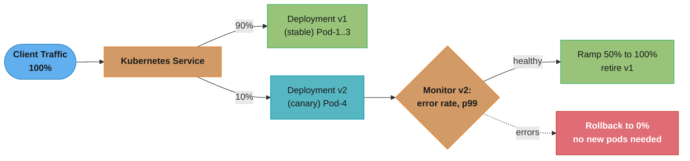
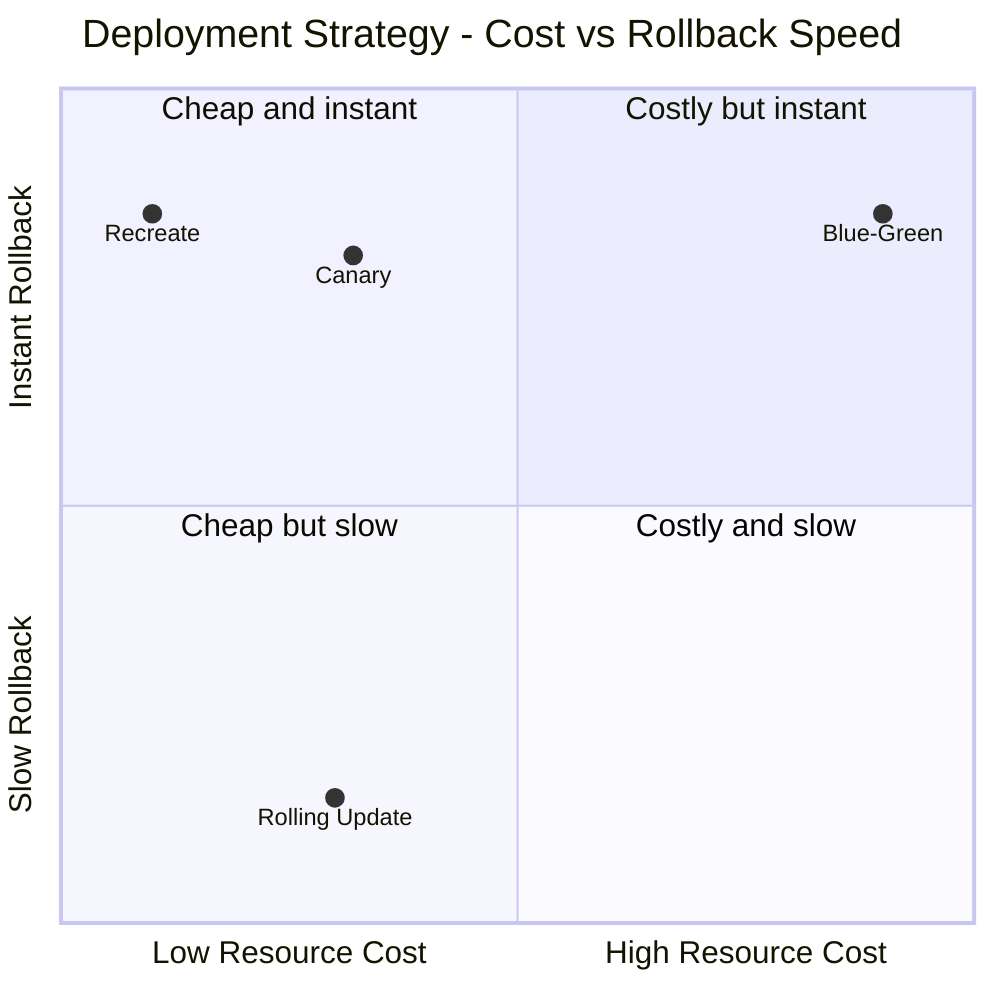
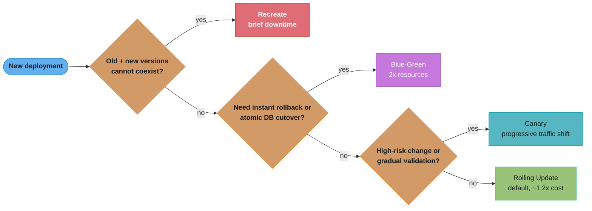

# Container and Deployment Patterns

## 1. Concept Overview

Container and deployment patterns address how to package, configure, and deploy backend services reliably and repeatedly. Docker multi-stage builds produce minimal, secure container images. Kubernetes deployment strategies (rolling update, blue-green, canary) control how new versions replace old ones with varying tradeoffs of speed, risk, and resource cost. Health probes gate traffic and trigger restarts. Resource requests and limits govern scheduling and throttling behavior. These patterns collectively enable zero-downtime deployments and predictable system behavior.

---

## 2. Intuition

A deployment without a strategy is like replacing airplane engines mid-flight without a plan. Rolling update replaces one engine at a time. Blue-green lands the plane on a parallel runway, switches passengers, then takes off again. Canary sends 1% of passengers on the new plane first to check it works. Each has different risk and resource tradeoffs. In Kubernetes, you choose based on: how much downtime is acceptable, how quickly you need rollback, and how much extra compute you can afford.

---

## 3. Core Principles

- **Immutable infrastructure**: containers are never modified after build; if config changes, build a new image; this ensures reproducibility
- **12-factor configuration**: all configuration via environment variables, not baked into the image; the same image runs in dev, staging, and production
- **Fast startup, graceful shutdown**: containers should start in seconds (JVM optimizations, CRaC, GraalVM native) and drain in-flight requests before stopping
- **Minimal images**: smaller images = smaller attack surface, faster pulls; use distroless or JRE-only base images
- **Separate concerns**: readiness (traffic gate) and liveness (restart trigger) serve different purposes

---

## 4. Types / Architectures / Strategies

**Deployment strategies**:
- **Recreate**: terminate all old pods, create all new pods; downtime during transition; simple; use for stateful migrations
- **RollingUpdate**: replace pods incrementally (maxUnavailable=0 + maxSurge=1 for zero downtime); default; gradual
- **Blue-green**: maintain two identical environments; switch traffic at once; instant rollback by switching back
- **Canary**: route small % to new version; monitor error rate; gradually increase percentage; progressive delivery

**Image base choices**:
- `eclipse-temurin:21-jre`: OpenJDK JRE, ~180MB
- `eclipse-temurin:21-jre-alpine`: Alpine-based, ~120MB
- `gcr.io/distroless/java21`: no shell, no package manager, ~75MB; minimal attack surface
- GraalVM native: binary executable, ~50MB, < 100ms startup; no JVM

---

## 5. Architecture Diagrams

**Docker Multi-Stage Build**

```mermaid
flowchart LR
    classDef io      fill:#61afef,stroke:#2e86c1,color:#1a1a1a,font-weight:bold
    classDef frozen  fill:#c678dd,stroke:#9b59b6,color:#fff
    classDef train   fill:#98c379,stroke:#27ae60,color:#1a1a1a
    classDef mathOp  fill:#d19a66,stroke:#e67e22,color:#1a1a1a,font-weight:bold
    classDef lossN   fill:#e06c75,stroke:#c0392b,color:#fff,font-weight:bold
    classDef req     fill:#56b6c2,stroke:#0097a7,color:#1a1a1a
    classDef base    fill:#e5c07b,stroke:#f39c12,color:#1a1a1a

    subgraph ST1["Stage 1: Builder (JDK)"]
        jdk(["FROM ...21-jdk"]) --> pomCache["COPY pom.xml<br/>+ go-offline<br/>cached layer"]
        pomCache --> srcBuild["COPY src<br/>mvn package<br/>rebuilds on change"]
        srcBuild --> extract["layertools<br/>extract"]
    end

    subgraph ST2["Stage 2: Runtime (JRE only)"]
        jre(["FROM ...21-jre"]) --> stableLayers["COPY deps + loader<br/>layers, rarely change"]
        stableLayers --> appLayer["COPY application<br/>layer, smallest,<br/>changes most"]
        appLayer --> entry(["ENTRYPOINT<br/>JarLauncher"])
    end

    extract -.-> jre
    entry --> result(["~180MB image<br/>vs ~800MB w/ JDK"])

    class jdk,jre base
    class pomCache,stableLayers frozen
    class srcBuild,appLayer train
    class extract mathOp
    class entry,result io
```


*The builder stage compiles with the full JDK toolchain; the runtime stage copies only compiled layers into a JRE-only image, ordered from least-changing (dependencies) to most-changing (application code) to maximize Docker layer-cache reuse — this ordering is what takes the final image from ~800MB down to ~180MB.*

**Canary Deployment (Istio)**


*Istio's VirtualService splits traffic by weight (90/10 here); monitoring the canary's error rate and p99 latency decides whether to ramp toward 100% and retire v1, or roll back to 0% — with no new pods required either way.*

---

## 6. How It Works — Detailed Mechanics

### Dockerfile Multi-Stage Build

```dockerfile
# Stage 1: Build the application
FROM eclipse-temurin:21-jdk-jammy AS builder

WORKDIR /build

# Copy dependency declaration first (layer cache — only invalidated when pom.xml changes)
COPY pom.xml .
COPY .mvn .mvn
COPY mvnw .
RUN ./mvnw dependency:go-offline -B

# Copy source (layer invalidated when source changes)
COPY src ./src

# Build the JAR and extract layers (Spring Boot Layertools)
RUN ./mvnw package -DskipTests -B && \
    java -Djarmode=layertools -jar target/*.jar extract --destination target/extracted

# Stage 2: Runtime image — only what's needed to run
FROM eclipse-temurin:21-jre-jammy AS runtime

# Non-root user (security best practice)
RUN groupadd --system spring && useradd --system --gid spring spring
USER spring:spring

WORKDIR /app

# Copy extracted layers in dependency order (least → most frequently changing)
COPY --from=builder /build/target/extracted/dependencies/ ./
COPY --from=builder /build/target/extracted/spring-boot-loader/ ./
COPY --from=builder /build/target/extracted/snapshot-dependencies/ ./
COPY --from=builder /build/target/extracted/application/ ./

# JVM flags for container awareness
ENV JAVA_OPTS="-XX:MaxRAMPercentage=75.0 \
               -XX:+UseContainerSupport \
               -XX:+OptimizeStringConcat \
               -Djava.security.egd=file:/dev/./urandom"

EXPOSE 8080

ENTRYPOINT ["sh", "-c", "java $JAVA_OPTS org.springframework.boot.loader.launch.JarLauncher"]
```

### Kubernetes Deployment with Rolling Update

```yaml
apiVersion: apps/v1
kind: Deployment
metadata:
  name: order-service
  namespace: production
spec:
  replicas: 5
  strategy:
    type: RollingUpdate
    rollingUpdate:
      maxUnavailable: 0    # no pod goes down before a replacement is ready
      maxSurge: 1          # at most 1 extra pod at a time (6 pods during rollout)
  selector:
    matchLabels:
      app: order-service
  template:
    metadata:
      labels:
        app: order-service
        version: "1.2.3"
    spec:
      terminationGracePeriodSeconds: 60   # must be > Spring's graceful timeout

      containers:
        - name: order-service
          image: company/order-service:1.2.3
          ports:
            - containerPort: 8080

          # Resource requests and limits
          resources:
            requests:
              cpu: "500m"         # 0.5 CPU guaranteed for scheduling
              memory: "512Mi"     # 512MB guaranteed
            limits:
              # CPU limit OMITTED intentionally:
              # CPU throttling (CFS cgroups) causes latency spikes even with available CPU
              # Only set CPU limits in environments where noisy neighbor is a real concern
              memory: "1Gi"       # OOM kill if exceeded; must set = prevents unbounded growth

          env:
            - name: JAVA_OPTS
              value: "-XX:MaxRAMPercentage=75.0 -XX:+UseContainerSupport"
            - name: SPRING_PROFILES_ACTIVE
              value: "production"
            - name: DB_PASSWORD
              valueFrom:
                secretKeyRef:
                  name: db-credentials
                  key: password

          # Startup probe: allow up to 5 minutes for slow JVM startup
          startupProbe:
            httpGet:
              path: /actuator/health/liveness
              port: 8080
            failureThreshold: 30    # 30 * 10s = 5 minutes max
            periodSeconds: 10

          # Liveness: is JVM alive? Only check trivial health
          livenessProbe:
            httpGet:
              path: /actuator/health/liveness
              port: 8080
            periodSeconds: 10
            failureThreshold: 3

          # Readiness: ready to serve traffic? Check dependencies
          readinessProbe:
            httpGet:
              path: /actuator/health/readiness
              port: 8080
            periodSeconds: 5
            failureThreshold: 3

          # Graceful shutdown: stop accepting new requests, drain in-flight
          lifecycle:
            preStop:
              exec:
                command: ["/bin/sleep", "10"]  # wait for iptables to propagate
```

### Pod Disruption Budget

```yaml
# Ensure at least 3 pods are always available during voluntary disruptions
# (node drains, cluster upgrades, rolling updates)
apiVersion: policy/v1
kind: PodDisruptionBudget
metadata:
  name: order-service-pdb
spec:
  minAvailable: 3  # or use maxUnavailable: "20%"
  selector:
    matchLabels:
      app: order-service
```

### Horizontal Pod Autoscaler with Custom Metric (KEDA)

```yaml
# Standard HPA — scale on CPU
apiVersion: autoscaling/v2
kind: HorizontalPodAutoscaler
metadata:
  name: order-service-hpa
spec:
  scaleTargetRef:
    apiVersion: apps/v1
    kind: Deployment
    name: order-service
  minReplicas: 3
  maxReplicas: 20
  metrics:
    - type: Resource
      resource:
        name: cpu
        target:
          type: Utilization
          averageUtilization: 70  # scale when average CPU > 70%
  behavior:
    scaleDown:
      stabilizationWindowSeconds: 300  # wait 5 min before scaling down
      policies:
        - type: Pods
          value: 1
          periodSeconds: 60            # remove 1 pod per minute (slow scale-down)
    scaleUp:
      stabilizationWindowSeconds: 0    # scale up immediately
      policies:
        - type: Pods
          value: 4
          periodSeconds: 60            # add up to 4 pods per minute

---
# KEDA ScaledObject — scale on Kafka consumer lag
apiVersion: keda.sh/v1alpha1
kind: ScaledObject
metadata:
  name: order-processor-scaler
spec:
  scaleTargetRef:
    name: order-processor
  minReplicaCount: 1
  maxReplicaCount: 30
  triggers:
    - type: kafka
      metadata:
        bootstrapServers: kafka:9092
        consumerGroup: order-processor-group
        topic: order-events
        lagThreshold: "100"  # 1 replica per 100 messages of lag
```

### Blue-Green Deployment

```yaml
# Blue deployment (current production)
apiVersion: apps/v1
kind: Deployment
metadata:
  name: order-service-blue
spec:
  replicas: 5
  template:
    metadata:
      labels:
        app: order-service
        slot: blue

---
# Green deployment (new version — staged, not yet serving traffic)
apiVersion: apps/v1
kind: Deployment
metadata:
  name: order-service-green
spec:
  replicas: 5
  template:
    metadata:
      labels:
        app: order-service
        slot: green

---
# Service points to blue initially
apiVersion: v1
kind: Service
metadata:
  name: order-service
spec:
  selector:
    app: order-service
    slot: blue  # switch to "green" for cutover — instant, one field change

# Cutover: kubectl patch service order-service -p '{"spec":{"selector":{"slot":"green"}}}'
# Rollback: kubectl patch service order-service -p '{"spec":{"selector":{"slot":"blue"}}}'
```

### 12-Factor App Configuration

```yaml
# All configuration via environment variables — no config in image
# The same image deploys to dev/staging/production with different env vars

apiVersion: v1
kind: ConfigMap  # non-sensitive configuration
metadata:
  name: order-service-config
data:
  SPRING_DATASOURCE_URL: "jdbc:postgresql://postgres:5432/orderdb"
  SPRING_KAFKA_BOOTSTRAP_SERVERS: "kafka:9092"
  APP_FEATURE_NEW_CHECKOUT: "false"
  LOGGING_LEVEL_COM_COMPANY: "INFO"

---
apiVersion: v1
kind: Secret  # sensitive configuration (encrypted at rest in etcd)
metadata:
  name: order-service-secrets
type: Opaque
data:
  DB_PASSWORD: <base64-encoded>
  JWT_SECRET: <base64-encoded>
  REDIS_PASSWORD: <base64-encoded>
```

---

## 7. Real-World Examples

- **Google**: runs billions of containers; pioneered Kubernetes from internal Borg/Omega systems; canary deployments are standard for all Google services
- **Netflix**: Spinnaker for deployment pipelines; automated canary analysis (ACA) uses Kayenta to compare canary vs baseline metrics; automatic rollback on regression
- **Amazon**: blue-green deployments for all critical services; CodeDeploy supports traffic shifting with Lambda hooks for pre/post deployment validation
- **Cloudflare**: distroless containers with Go binaries; no shell access to running containers; all debugging via observability tooling, not exec

---

## 8. Tradeoffs

| Strategy | Downtime | Rollback Speed | Resource Cost | Complexity |
|----------|----------|----------------|---------------|------------|
| Recreate | Yes (brief) | Instant | 1x | Low |
| Rolling Update | Zero | Minutes (roll forward) | ~1.2x | Low |
| Blue-Green | Zero | Instant (switch selector) | 2x | Medium |
| Canary | Zero | Instant (set weight to 0%) | ~1.2x | High |

**Visualizing the tradeoff space** (resource cost vs. rollback speed):


*Rolling Update and Canary carry the same ~1.2x resource cost, but only Canary gets instant rollback (set weight to 0%) — Rolling Update must roll forward again, costing minutes. Blue-Green's instant rollback costs a full 2x in standing resources, the premium for keeping two complete environments live.*

---

## 9. When to Use / When NOT to Use

Use **RollingUpdate** (default) for most deployments — low risk, zero downtime, minimal extra resources.

Use **Blue-Green** when: you need instant rollback capability, the deployment includes a database schema change that must be atomic with the application change, or you cannot tolerate the partial-state period during rolling updates (some pods running old version, some new).

Use **Canary** when: deploying high-risk changes, validating new features on a small percentage of users before full exposure, or running A/B tests. Requires Istio or Argo Rollouts for percentage-based traffic splitting.

Use **Recreate** only when: old and new versions cannot run simultaneously (incompatible DB schema, singleton-requiring stateful process).

**Decision path** (the guidance above, as a flow):


*Rolling Update sits at the end of the chain — you land there only after ruling out an incompatible-version migration (Recreate), a need for instant atomic rollback (Blue-Green), and a high-risk change that needs gradual exposure (Canary).*

Do NOT set CPU limits on JVM applications unless absolutely necessary — CFS (Completely Fair Scheduler) CPU throttling causes latency spikes and p99 degradation even when physical CPU is available. Set CPU requests (for scheduling) but omit CPU limits.

---

## 10. Common Pitfalls

**CPU limits causing latency spikes**: A team set `cpu: limit: 500m` on a Spring Boot service. Under moderate load, the service experienced p99 latency spikes of 500ms every 100ms (exactly matching CFS quota period of 100ms). The JVM's GC, JIT compilation, and request handling would occasionally need more than 500m CPU for a brief burst, causing throttling. Fix: remove CPU limits entirely; use CPU requests only. CPU requests ensure scheduling fairness; limits add throttling that hurts latency-sensitive services.

**Memory limit set too low causing OOM**: A team set `memory: limit: 512Mi` but did not set `MaxRAMPercentage`. The JVM defaulted to allocating 25% of total host RAM (e.g., 8GB) for heap = 2GB heap in a 512Mi container. The container was OOM-killed repeatedly. Fix: always set `-XX:MaxRAMPercentage=75.0 -XX:+UseContainerSupport` on containerized JVMs. This tells the JVM to use 75% of the container's memory limit for heap, not the host's total RAM.

**No preStop sleep with rolling update**: During a rolling update, old pods received connection refused errors for 2-3 seconds after shutdown. iptables rules from kube-proxy take time to propagate to load balancers. The pod stopped accepting connections before all load balancers were updated. Fix: add `lifecycle.preStop.exec: ["/bin/sleep", "10"]` — this sleeps 10 seconds before SIGTERM, giving iptables propagation time.

**Blue-green with database migrations**: A team deployed a new service version with additive DB migrations (new columns) alongside the blue-green deployment. After switching to green, they ran `ALTER TABLE` to remove the columns that blue required. In the next incident, they rolled back to blue — but blue was reading columns that no longer existed. Fix: use expand-contract pattern for DB migrations; never run destructive migrations until the old version is fully decommissioned.

---

## 11. Technologies & Tools

| Tool | Purpose |
|------|---------|
| Docker | Container build and runtime |
| Kubernetes | Container orchestration |
| Helm | Kubernetes package manager, templated deployments |
| Argo Rollouts | Advanced canary and blue-green deployments |
| KEDA | Kubernetes event-driven autoscaler (Kafka, RabbitMQ, etc.) |
| Skaffold | Local Kubernetes development workflow |
| Trivy | Container image vulnerability scanning |
| GraalVM | Native image compilation for fast startup |
| CRaC (Coordinated Restore at Checkpoint) | JVM checkpoint/restore for fast warm startup |

---

## 12. Interview Questions with Answers

**Q: What is a Docker multi-stage build and why do you use it?**
A multi-stage build uses multiple `FROM` instructions in a Dockerfile, each creating an intermediate image. You build the application in a JDK image (full development tools), then copy only the compiled artifacts to a JRE-only runtime image. The final image does not contain the JDK, Maven, source code, or test dependencies — only the JRE and the compiled JAR. This reduces image size from ~800MB (JDK) to ~180MB (JRE-only), reduces attack surface (no compiler/package manager in production), and speeds up image pulls. Layer caching: copy `pom.xml` and download dependencies before copying source code; the dependency layer is cached and only re-built when `pom.xml` changes.

**Q: What is the difference between maxUnavailable and maxSurge in rolling updates?**
`maxUnavailable` sets the maximum number of pods that can be unavailable during the rolling update. Setting it to 0 means no pod goes down until a replacement is ready and passing readiness checks — guarantees zero downtime but requires capacity for surge pods. `maxSurge` sets the maximum number of extra pods beyond the desired replica count. Setting `maxUnavailable=0, maxSurge=1` means: start a new pod (6 total), wait for it to be ready, then terminate an old pod (back to 5) — one pod at a time, always at least 5 healthy. `maxUnavailable=1, maxSurge=0` means: terminate one old pod first (4 total), then start a replacement — faster but with temporarily reduced capacity.

**Q: What is the difference between CPU requests and CPU limits in Kubernetes?**
CPU requests are used by the scheduler to find a node with sufficient available CPU — the pod is guaranteed this amount. CPU limits are enforced by CFS (Completely Fair Scheduler) cgroups at runtime: if a container exceeds its limit within a CFS period (100ms), it is throttled until the next period. For JVM applications, GC and JIT compilation cause brief CPU spikes. With a CPU limit set too low, these spikes trigger throttling, causing latency spikes visible as high p99 latency. Best practice for latency-sensitive JVM services: set CPU requests (for scheduling fairness) but omit CPU limits. Set memory limits always (prevent unbounded growth; OOM kill is predictable and recoverable via restart).

**Q: How should you size JVM heap in a Kubernetes container?**
Always use `-XX:+UseContainerSupport` (default in Java 11+) to make the JVM container-aware — it reads cgroup memory limits instead of host total RAM. Set `-XX:MaxRAMPercentage=75.0` to allocate 75% of the container's memory limit to the heap. Reserve 25% for: JVM overhead (metaspace, code cache, JIT buffers), off-heap memory (direct buffers, Netty allocations), and OS/container overhead. Example: 1GB container limit → 768MB heap, 256MB for JVM overhead. Without these flags on Java < 11 or with UseContainerSupport disabled, the JVM sees the host's 64GB RAM and tries to use 16GB for heap, causing immediate OOM kill.

**Q: What is a Pod Disruption Budget (PDB) and why is it important?**
A PDB specifies the minimum number (or percentage) of pods of a replicated application that must be available at any time. During voluntary disruptions (node drains for maintenance, cluster upgrades, rolling updates), Kubernetes respects PDBs: it will not drain a node if doing so would violate the PDB. Without a PDB, a node drain can terminate all pods of a deployment simultaneously if they all happen to be on the same node — causing a complete outage. Set `minAvailable` to at least the majority of replicas: for 5 replicas, set `minAvailable=3`. This ensures at least 3 pods are always serving traffic during any rolling operation.

**Q: When would you choose blue-green over rolling update deployment?**
Blue-green is preferred when: you need instant rollback capability (switch selector back in < 1 second vs rolling forward with rolling update taking minutes), you have database schema changes that are tightly coupled to the application version (both must cut over at the same time), your service cannot tolerate having two versions running simultaneously (conflicting session formats, incompatible API versions with shared state), or you are running acceptance tests against the new version in production before switching traffic. The cost is maintaining 2x the compute resources during the deployment. For most stateless services with backward-compatible changes, rolling update is simpler and equally safe.

**Q: How does HPA work and what are common pitfalls?**
HPA (Horizontal Pod Autoscaler) queries the metrics API (CPU from metrics-server, custom metrics from Prometheus Adapter or KEDA) every 15 seconds, calculates the desired replica count, and adjusts. Formula: `desiredReplicas = ceil(currentReplicas * (currentMetric / targetMetric))`. Common pitfalls: (1) flapping — CPU oscillates around the target, causing constant scale up/down; fix with `stabilizationWindowSeconds=300` for scale-down. (2) Slow reaction — by default HPA reacts in 15s intervals; for bursty traffic, set `scaleUp.stabilizationWindowSeconds=0` and high `maxSurge`. (3) Scale-down thrashing during rolling updates — temporarily inflated pod count confuses HPA; HPA should not overlap with deployment rollouts. (4) Not working with Karpenter/cluster autoscaler — HPA must add replicas before cluster autoscaler can add nodes; configure adequate pending pod time.

**Q: What is the 12-factor app methodology and which factors are most important for containerized Java services?**
The 12-factor app is a methodology for building cloud-native applications. The most critical factors for containerized Java services: Factor III (Config via environment variables — no config in image; inject via Kubernetes ConfigMap/Secret), Factor VI (Processes — stateless; store session in Redis, not in-memory), Factor IX (Disposability — fast startup for rapid scaling; graceful shutdown for zero-downtime deploys), Factor X (Dev/Prod parity — use Testcontainers to have dev/test match production infrastructure), Factor XI (Logs as streams — write to stdout/stderr; let the container platform capture and ship logs). These directly affect deployment reliability, scalability, and operability.

---

## 13. Best Practices

- Use Spring Boot's layered JAR feature for optimal Docker layer caching (`jarmode=layertools`)
- Set `JAVA_OPTS` via environment variable (not hardcoded in Dockerfile) for runtime tuning
- Scan images with Trivy in CI pipeline: `trivy image --exit-code 1 --severity HIGH,CRITICAL company/order-service:1.0.0`
- Run containers as non-root user (UID 1000) to limit container escape blast radius
- Use `readOnlyRootFilesystem: true` in SecurityContext where possible
- Pin base image versions to digest: `FROM eclipse-temurin:21-jre-jammy@sha256:...` for reproducibility
- Set `terminationGracePeriodSeconds` 2x the expected maximum request processing time
- Use `topologySpreadConstraints` to spread pods across AZs — prevents all pods on one failing AZ
- Label all deployments with `version` for canary traffic splitting and Kiali visualization

---

## 14. Case Study

**Problem**: A checkout service had 99.5% availability but needed 99.95% for SLA compliance. Root causes: rolling updates caused 5-second latency spikes during pod replacement (no preStop hook), CPU limits caused 10x p99 latency spikes during Black Friday (GC throttled by CFS), and a single-AZ deployment caused 30-minute outage during an AZ failure.

**Fixes applied**:
1. Added `preStop: sleep 10` — latency spikes during deploys dropped to zero
2. Removed CPU limits, set only CPU requests — p99 latency improved from 850ms to 80ms under full load
3. Added `topologySpreadConstraints` with `maxSkew=1` across AZs — pods automatically distributed across 3 AZs
4. Added `PodDisruptionBudget` with `minAvailable=3` out of 5 replicas — cluster upgrades no longer cause concurrent pod terminations
5. Switched from `maxUnavailable=1` to `maxUnavailable=0, maxSurge=1` — zero pods down during rolling updates

**Result**: Availability improved to 99.98% over the next quarter. Black Friday handled 3x normal load with p99 latency < 100ms throughout.
