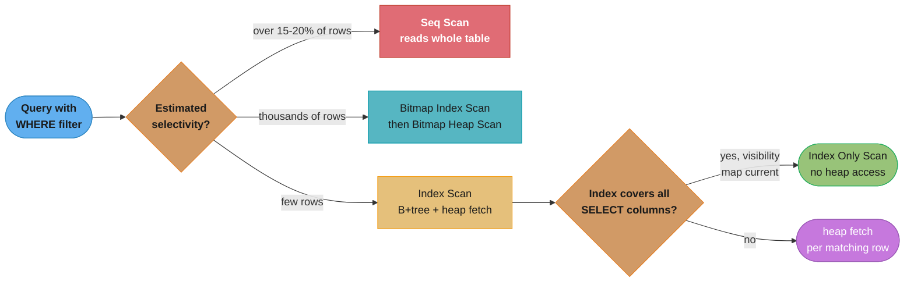
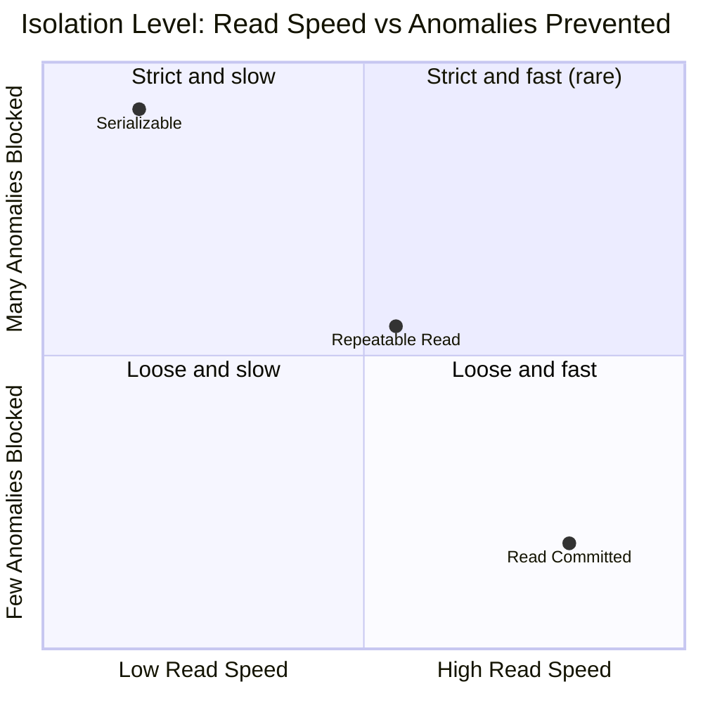

# Database Internals & Indexing

## 1. Concept Overview

Understanding how databases store and retrieve data is essential for writing efficient queries, designing appropriate indexes, and diagnosing performance problems. Modern relational databases (PostgreSQL, MySQL) are built on a foundation of B+trees for indexes, Write-Ahead Logging (WAL) for durability, and Multi-Version Concurrency Control (MVCC) for isolation. Knowing these internals transforms you from a developer who runs EXPLAIN and hopes for the best into one who can predict query behavior and design schemas for performance.

---

## 2. Intuition

> **One-line analogy**: A database is like a library — the B+tree index is the card catalog (look up by Dewey Decimal number), MVCC is like every patron getting a photocopy of the page they need so nobody waits while someone else is editing the original, and WAL is the librarian's notebook that records every change before applying it so nothing is lost if the power goes out.

**Mental model**: A B+tree index is a sorted tree where all data lives in leaf nodes, connected in a linked list for range scans. Finding a row by primary key traverses from root to leaf in O(log N) steps — for a table with 1 billion rows, that is ~30 comparisons. A sequential table scan reads every page — potentially millions of pages for a large table.

**Why it matters**: A missing index on a foreign key column turns a 1ms join into a 5-second sequential scan. Over-indexing slows writes because every INSERT/UPDATE/DELETE must update all indexes. Understanding MVCC explains why long-running transactions cause "bloat" (dead row versions accumulating) and why VACUUM is necessary.

**Key insight**: The query planner's decisions are based on statistics (row counts, value distributions). Stale statistics cause catastrophically wrong plans. `ANALYZE` (PostgreSQL) or `ANALYZE TABLE` (MySQL) updates statistics. The most common cause of a suddenly slow query is outdated statistics after a large data load.

---

## 3. Core Principles

- **B+tree**: All data in leaf nodes; internal nodes are just routing nodes. Leaf nodes linked for range scans. Height ~4 for tables up to hundreds of millions of rows.
- **WAL**: Every modification is written to the write-ahead log before being applied to the data file. On crash recovery, replay WAL from the last checkpoint. Guarantees durability.
- **MVCC**: Readers do not block writers; writers do not block readers. Each transaction sees a consistent snapshot of the database as it was at the start of the transaction (or at the start of each statement, depending on isolation level). Old row versions are kept until no active transaction can see them, then VACUUM reclaims the space.
- **Buffer pool**: Database keeps frequently accessed pages in memory (the buffer pool). A cache miss means reading from disk (SSD: ~100 microseconds, spinning disk: ~5ms). Maximizing buffer pool hit rate is critical.
- **Heap file**: The main data file — rows stored in pages (typically 8 KB). Rows within a page are not ordered by any key unless the table is a clustered index.

---

## 4. Types / Architectures / Strategies

### 4.1 Index Types (PostgreSQL)

| Type | Use Case | Notes |
|------|---------|-------|
| B-tree | Default; equality, range, ORDER BY, LIKE 'prefix%' | Most common |
| Hash | Equality only | Cannot be used for range queries or ORDER BY |
| GIN (Generalized Inverted Index) | JSONB containment, array contains, full-text | Multi-key data |
| BRIN (Block Range Index) | Very large, naturally ordered data (time-series, sequential IDs) | Tiny size, low precision |
| GiST | Geometric data, range types, full-text | Extensible |
| SP-GiST | Non-balanced tree structures | Less common |
| Bloom | Set membership for many columns | Probabilistic, rare use |

### 4.2 Index Design Patterns

| Pattern | Example | Benefit |
|---------|---------|---------|
| Covering index | INDEX ON orders(user_id, status, amount) | Index-only scan avoids heap |
| Partial index | INDEX ON users(email) WHERE deleted_at IS NULL | Smaller index, skips deleted rows |
| Multi-column index | INDEX ON orders(user_id, created_at) | Both columns used in query |
| Expression index | INDEX ON users(lower(email)) | Index case-insensitive search |
| Composite index column order | Most selective or equality columns first | Improves filter performance |

### 4.3 MVCC Snapshot Levels (PostgreSQL)

| Isolation Level | Snapshot Taken | Visible Data |
|----------------|---------------|-------------|
| READ COMMITTED | Per statement | Committed data at statement start |
| REPEATABLE READ | Per transaction | Committed data at transaction start |
| SERIALIZABLE | Per transaction (SSI) | As if transactions ran serially |

---

## 5. Architecture Diagrams

### B+Tree Structure

```
Root Node (height=3 example):
     [30  |  60]
    /      |      \
 [10|20] [40|50] [70|80]  <- Internal nodes (routing only)
  |  |    |  |    |  |
Leaf nodes (linked list):
[1,2,..][10,11,..][20,..][30,..][40,..][50,..][60,..][70,..][80,..][90,..]
← → ← →   (linked for range scans: scan from 30 to 60 in sorted order)

Finding row with key=45:
  Root: 45 >= 30, 45 < 60 → go to middle child
  Internal: 45 >= 40, 45 < 50 → go to [40|50] child
  Leaf: scan for key=45 → found
  → pointer to row in heap file

Tree height for N rows:
  B = branching factor (~100 for 8KB pages, 8 byte integer keys)
  Height = ceil(log_B(N))
  N=1M:   height=3 (100^3 = 1M)
  N=1B:   height=4.5 ≈ 5 (100^5 = 10B)
  N=1T:   height=6 (100^6 = 1T)
  → Practically all B+trees are height 3-4
```

**In plain terms.** "Each level of the tree multiplies how many rows you can reach by the
branching factor, so height grows like a logarithm — which is a very polite way of saying it
barely grows at all." Going from a million rows to a trillion is a *million-fold* increase in
data and costs you three extra page reads. That flatness is the entire reason indexes work.

| Symbol | What it is |
|--------|------------|
| `N` | Rows in the table |
| `B` | Branching factor: how many child pointers fit in one page. `~100` here |
| `log_B(N)` | How many times you must multiply by `B` to reach `N`. The tree's depth |
| `ceil(...)` | Round up — you cannot have 4.5 levels, so 4.5 becomes a real height of 5 |
| Height | Page reads per lookup. **Not** comparisons — this is the number that costs I/O |

`B` comes from page geometry, not from tuning: an 8 KB page divided by a 16-byte entry
(8-byte integer key + 8-byte child pointer) is `8192 / 16 = 512` slots in theory, and roughly
`100` in practice once you account for page headers, per-tuple overhead, and PostgreSQL's
policy of leaving pages partly empty so future inserts do not force an immediate split.

**Walk one example.** Watch the table size explode while the height crawls:

```
      N          log_100(N)      height = ceil(...)     rows reachable = 100^height
  ----------   ------------    --------------------   ---------------------------
    1,000,000        3.0                3                    100^3 = 1,000,000
1,000,000,000        4.5                5                    100^5 = 10,000,000,000
1,000,000,000,000    6.0                6                    100^6 = 1,000,000,000,000

  N grows 1,000,000x from the first row to the last.   Height grows from 3 to 6.
```

**Walk the cost that actually matters.** Height is page reads; multiply by SSD latency and
compare against reading the whole table:

```
  1 billion rows, ~100 rows per 8 KB heap page, SSD page read ~100 microseconds

  index lookup   5 page reads      x 100 us  =        500 us   =  0.0005 s
  seq scan       1e9 / 100
                 = 10,000,000 pages x 100 us  = 1,000,000,000 us = 1,000 s

  Ratio: 1,000 s / 0.0005 s = 2,000,000x.
```

Note the difference between the `~30 comparisons` in §2 and the `5` here: `log2(1,000,000,000)
= 29.9` is the count of *in-memory key comparisons*, which are essentially free. The `5` is the
count of *page fetches*, which are not. B+trees are shaped the way they are — very wide, very
shallow — specifically to trade cheap comparisons for expensive I/O.

### WAL and Checkpoint

```mermaid
flowchart LR
    classDef io      fill:#61afef,stroke:#2e86c1,color:#1a1a1a,font-weight:bold
    classDef frozen  fill:#c678dd,stroke:#9b59b6,color:#fff
    classDef train   fill:#98c379,stroke:#27ae60,color:#1a1a1a
    classDef mathOp  fill:#d19a66,stroke:#e67e22,color:#1a1a1a,font-weight:bold
    classDef lossN   fill:#e06c75,stroke:#c0392b,color:#fff,font-weight:bold
    classDef req     fill:#56b6c2,stroke:#0097a7,color:#1a1a1a
    classDef base    fill:#e5c07b,stroke:#f39c12,color:#1a1a1a

    subgraph W["Write"]
        direction LR
        w1(["Lock row<br/>MVCC version"]) --> w2["Append to<br/>WAL buffer"]
        w2 --> w3["Write page to<br/>buffer pool"]
        w3 --> w4(["Return success"])
    end

    subgraph F["Commit fsync"]
        direction LR
        f1{"COMMIT<br/>issued?"} -->|"yes"| f2["Flush WAL<br/>to disk"]
        f2 --> f3(["Durable:<br/>commit confirmed"])
    end

    subgraph K["Checkpoint<br/>periodic or manual"]
        direction LR
        k1["Flush dirty pages<br/>to data files"] --> k2["Record<br/>checkpoint LSN"]
        k2 --> k3["Recycle WAL segments<br/>before that LSN"]
    end

    subgraph R["Crash Recovery"]
        direction LR
        r1(["Restart<br/>after crash"]) --> r2["Find last<br/>checkpoint LSN"]
        r2 --> r3["Replay WAL to<br/>current end"]
        r3 --> r4(["Consistent state"])
    end

    w4 --> f1
    f3 -.-> k1
    k3 -.-> r1
    f3 -.->|"replica streams +<br/>replays continuously"| standby(["Hot standby"])

    class w1,w4 io
    class w2,f1,f2,k2,r2,r3 mathOp
    class w3,k1 base
    class f3,r4 train
    class k3,standby frozen
    class r1 lossN
```



The write path only needs the WAL buffer to return success; the fsync that makes a commit durable happens separately, on COMMIT. Checkpoints and crash recovery run on their own cadence — recovery always replays forward from the last checkpoint LSN, and a hot standby just performs that same replay continuously instead of waiting for a crash.

### MVCC Row Versioning

```
PostgreSQL MVCC row header:
  xmin: transaction ID that inserted this version
  xmax: transaction ID that deleted/updated this version (0 if current)
  ctid: physical location of this row version

Example: UPDATE user SET name='Bob' WHERE id=1

Before:
  Row v1: xmin=100, xmax=0,   id=1, name='Alice'  ← current version

After UPDATE (new transaction ID=200):
  Row v1: xmin=100, xmax=200, id=1, name='Alice'  ← old version (dead)
  Row v2: xmin=200, xmax=0,   id=1, name='Bob'    ← new version (current)

Transaction T1 (started before UPDATE, xact ID=150):
  Sees Row v1 (xmin=100 committed before T1's snapshot, xmax=200 not yet committed)
  "Bob" is invisible to T1

Transaction T2 (started after UPDATE commits):
  Sees Row v2 (xmin=200 committed before T2's snapshot)
  "Alice" version is invisible (xmax committed)

VACUUM reclaims Row v1 when no active transaction can see it
Dead tuples accumulate until VACUUM runs → table bloat
```

---

## 6. How It Works — Detailed Mechanics

### 6.1 Index Scan Types

```sql
-- Seq Scan: reads every row in the table
EXPLAIN SELECT * FROM orders WHERE status = 'pending';
-- Seq Scan on orders (cost=0.00..12345.00 rows=1000 ...)
-- Used when: no index on status, or selectivity too low (>15-20% of rows)

-- Index Scan: traverses B+tree, then fetches rows from heap
EXPLAIN SELECT * FROM orders WHERE id = 123;
-- Index Scan using orders_pkey on orders (cost=0.43..8.45 rows=1 ...)
-- Used when: highly selective (few rows match), fetches multiple columns

-- Bitmap Index Scan: builds bitmap of matching pages, then fetches heap pages
EXPLAIN SELECT * FROM orders WHERE user_id = 456;
-- Bitmap Heap Scan on orders
--   Recheck Cond: (user_id = 456)
--   -> Bitmap Index Scan on orders_user_id_idx
-- Used when: moderate selectivity (thousands of rows), avoids random I/O
-- Multiple bitmap scans can be combined with BitmapAnd/BitmapOr

-- Index Only Scan: reads only from index, no heap access
EXPLAIN SELECT id, status FROM orders WHERE user_id = 456;
-- (if index on (user_id, id, status) exists)
-- Index Only Scan using orders_user_id_idx on orders
-- requires visibility map to be up-to-date (VACUUM)
```



The planner picks among these four scan shapes purely from estimated selectivity — a low-selectivity filter is cheaper as a full sequential scan than as scattered random I/O, while a highly selective one is worth a B+tree traversal, and only a covering index with a current visibility map earns the index-only fast path.

### 6.2 Covering Indexes

```sql
-- Query: find all pending orders for user 456 with their amounts
SELECT id, amount, created_at
FROM orders
WHERE user_id = 456
  AND status = 'pending'
ORDER BY created_at DESC
LIMIT 10;

-- Without covering index:
-- Index Scan on orders_user_id_idx → heap fetches for each row (random I/O)

-- With covering index:
CREATE INDEX orders_user_status_covering
  ON orders (user_id, status, created_at DESC)
  INCLUDE (id, amount);
-- Index Only Scan → no heap access at all

-- The INCLUDE clause (PostgreSQL 11+) adds columns to the leaf level only
-- without including them in the B-tree ordering
-- Allows: queries that need non-key columns satisfied index-only
```

### 6.3 Index Bloat and VACUUM

```sql
-- Index bloat: dead row versions create dead entries in B-tree
-- VACUUM reclaims dead rows from heap; VACUUM ANALYZE also updates stats

-- Check for table bloat (approximate):
SELECT schemaname, tablename,
       pg_size_pretty(pg_total_relation_size(schemaname||'.'||tablename)) AS total,
       pg_size_pretty(pg_relation_size(schemaname||'.'||tablename)) AS data,
       round(100 * pg_relation_size(schemaname||'.'||tablename) /
             pg_total_relation_size(schemaname||'.'||tablename)::numeric) AS data_pct
FROM pg_tables
WHERE schemaname = 'public'
ORDER BY pg_total_relation_size(schemaname||'.'||tablename) DESC;

-- Autovacuum settings (critical for busy tables):
-- autovacuum_vacuum_scale_factor=0.02: vacuum when 2% of table is dead
-- autovacuum_analyze_scale_factor=0.005: analyze when 0.5% of table changed
-- For very large tables, reduce scale_factor and increase autovacuum_workers

-- Force VACUUM on a table (non-blocking):
VACUUM ANALYZE orders;

-- VACUUM FULL: reclaims space (shrinks file) but LOCKS the table
-- Only use VACUUM FULL during maintenance windows
VACUUM FULL orders;  -- locks table!

-- Check autovacuum activity:
SELECT schemaname, relname, n_dead_tup, last_autovacuum, last_autoanalyze
FROM pg_stat_user_tables
WHERE n_dead_tup > 10000
ORDER BY n_dead_tup DESC;
```

### 6.4 Statistics and Query Planner

```sql
-- Statistics stored in pg_statistic, viewed via pg_stats
SELECT tablename, attname, n_distinct, correlation, most_common_vals
FROM pg_stats
WHERE tablename = 'orders';

-- n_distinct: estimated number of distinct values
--   positive: actual count
--   negative: fraction of rows (e.g., -0.01 = 1% distinct = 100 distinct values for 10k rows)
-- correlation: correlation between physical order and logical order
--   1.0: perfectly correlated (sequential access fast)
--   0.0: random order (heap fetches after index scan are random I/O)

-- Increase statistics target for columns with poor estimates:
ALTER TABLE orders ALTER COLUMN user_id SET STATISTICS 500;
-- Default is 100 samples. 500 gives better histograms for skewed data.

-- After statistics update:
ANALYZE orders;
```

---

## 7. Real-World Examples

**PostgreSQL GIN index for JSONB**: Applications storing flexible attributes as JSONB can use GIN index with the jsonb_path_ops operator class for efficient containment queries:
```sql
CREATE INDEX idx_products_attrs ON products USING GIN (attributes jsonb_path_ops);
SELECT * FROM products WHERE attributes @> '{"color": "red", "size": "L"}';
-- GIN finds all documents containing both key-value pairs efficiently
```

**BRIN index for time-series**: A table with 10 billion sensor readings ordered by timestamp can use a BRIN index that is ~1000x smaller than a B-tree while still providing good performance for range queries on timestamp (because physical order correlates with timestamp order):
```sql
CREATE INDEX idx_readings_ts ON sensor_readings USING BRIN (recorded_at);
-- Index size: ~128 KB vs ~2 GB for B-tree on 10B rows
-- Works because rows are naturally inserted in time order
```

---

## 8. Tradeoffs

| Index Type | Read speed | Write overhead | Size | Selectivity Required |
|-----------|-----------|---------------|------|---------------------|
| B-tree | O(log N) | Medium | Medium | >1 row selectivity |
| Hash | O(1) | Low | Medium | Equality only |
| GIN | Fast for containment | High (expensive to maintain) | Large | Multi-key containment |
| BRIN | Fast if correlated | Very low | Tiny | Range, correlated data |

| Isolation Level | Read performance | Anomalies prevented |
|----------------|----------------|-------------------|
| Read Committed | Best | Dirty reads |
| Repeatable Read | Good | Dirty reads, non-repeatable reads |
| Serializable | Worst (SSI overhead) | All anomalies |



The two tables above plot onto one curve: Read Committed is fastest but blocks only dirty reads, Serializable blocks every anomaly but pays SSI overhead, and Repeatable Read sits between the two.

---

## 9. When to Use / When NOT to Use

**B-tree index**: Use as the default for all columns used in WHERE, JOIN, ORDER BY, GROUP BY. Do not index very low-cardinality columns (status with 3 values, boolean) unless combined with other high-selectivity columns in a multi-column index or as a partial index.

**GIN index**: Use for JSONB, array, and full-text search columns. Do not use on simple scalar columns — B-tree is faster and smaller.

**Partial index**: Use when a query always filters by a common condition (e.g., WHERE deleted_at IS NULL). A partial index is smaller than a full index and focuses only on the queried rows.

**Covering index**: Use for high-frequency queries where you can list all required columns in the index. Eliminates heap access entirely (index-only scan) — significant for queries executed millions of times per day.

---

## 10. Common Pitfalls

**Missing index on foreign key**: In PostgreSQL, foreign keys do not automatically create an index on the referencing column. A query `SELECT * FROM orders WHERE user_id = 456` does a sequential scan if there is no index on `orders.user_id`. Every foreign key should have an index unless you have measured that the table is small enough that seq scan is faster.

**Outdated statistics causing wrong plan**: After a large bulk load (importing 10M rows), the planner may have statistics from before the load (showing 100K rows). The planner chooses a plan optimized for a small table — perhaps a hash join that works well at 100K but fails catastrophically at 10M. Always run `ANALYZE tablename` after bulk loads.

**Left-most prefix rule violation**: A multi-column index `INDEX ON orders(user_id, status, created_at)` is used for: `WHERE user_id=?`, `WHERE user_id=? AND status=?`, `WHERE user_id=? AND status=? AND created_at=?`. It is NOT used for: `WHERE status=?` alone or `WHERE created_at=?` alone. Always put the most frequently filtered column first in multi-column indexes.

**Long transactions blocking VACUUM**: MVCC keeps dead row versions until no active transaction can see them. A long-running transaction (e.g., a batch job that runs for hours inside a transaction) prevents VACUUM from reclaiming dead rows, causing table bloat. The `idle in transaction` state is especially dangerous. Monitor with `SELECT pid, now() - pg_stat_activity.xact_start, state FROM pg_stat_activity WHERE xact_start IS NOT NULL` and kill transactions idle in transaction for more than a few minutes.

**Transaction ID wraparound**: PostgreSQL uses 32-bit transaction IDs (2 billion). If a database reaches 2 billion transactions without VACUUM, it enters "emergency mode" and refuses connections to force VACUUM. Monitor: `SELECT datname, age(datfrozenxid) FROM pg_database ORDER BY 2 DESC;` Alert if age > 1.5 billion.

---

## 11. Technologies & Tools

| Tool | Purpose |
|------|---------|
| `EXPLAIN ANALYZE` | Query execution plan with actual timing |
| `pg_stat_statements` | Query frequency and average timing statistics |
| `pg_stat_user_tables` | Table statistics (dead rows, vacuum info) |
| `pg_stat_user_indexes` | Index usage statistics (detect unused indexes) |
| `pgBadger` | PostgreSQL log analysis and slow query report |
| `auto_explain` | Log slow query execution plans automatically |
| `pg_toast_*` | TOAST table for large values |
| `pgTune` | PostgreSQL configuration calculator |
| `Percona Monitoring` | MySQL/PostgreSQL monitoring with query analysis |
| `Hibernate Statistics` | JPA/Hibernate N+1 and query count tracking |

---

## 12. Interview Questions with Answers

**Q: Describe the structure of a B+tree index and how it enables efficient queries.**
A B+tree has internal nodes (routing only, store keys for navigation) and leaf nodes (store all key-value pairs with pointers to the heap row, linked in a doubly-linked list). To find a row, traverse from root to leaf in O(log N) steps. For range scans: find the first matching leaf, then traverse the linked list. For a 1-billion row table with branching factor 100, height is ~5 — all lookups require ~5 page reads regardless of table size. This makes B-tree indexes extremely efficient for both equality and range queries.

**Q: What is WAL (Write-Ahead Logging) and why is it important?**
WAL is a durability mechanism: every database modification is first written to the WAL (a sequential append-only log) before being applied to data files. If the server crashes, on restart the database replays WAL from the last checkpoint to recover all committed transactions. WAL enables: crash recovery (replay lost changes), streaming replication (replicas receive and replay WAL), point-in-time recovery (replay WAL to any past point), and logical decoding (CDC tools like Debezium read WAL).

**Q: Explain MVCC and how it enables concurrent reads without blocking writes.**
MVCC (Multi-Version Concurrency Control) stores multiple versions of each row — one for the current state and old versions for active transactions that read an earlier snapshot. When a row is updated, the old version (with xmax set to the updating transaction ID) coexists with the new version (with xmin set to the same). Readers choose which version to see based on their transaction snapshot. Since readers access old versions, they never block writers who create new versions. The tradeoff: dead row versions accumulate until VACUUM reclaims them.

**Q: What is the difference between an Index Scan and an Index Only Scan?**
An Index Scan traverses the B+tree to find row pointers, then fetches each matching row from the heap file (potentially random I/O). An Index Only Scan satisfies the query entirely from the index — no heap fetch. This requires: (1) all columns in the SELECT list are in the index (covering index); (2) the visibility map confirms the heap page is all-visible (so the planner does not need to check MVCC visibility from the heap). Index Only Scans are dramatically faster for large result sets that hit many heap pages.

**Q: What is a covering index and when should you create one?**
A covering index includes all columns needed by a query — the key columns (in the B-tree order) plus any additional columns via INCLUDE. When an index-only scan is possible, the database reads only the index (sequential), not the heap (random I/O). Create covering indexes for high-frequency queries with a predictable column set. Trade-off: larger indexes with more write overhead. In PostgreSQL, use INCLUDE for non-key columns: `CREATE INDEX ON orders(user_id, status) INCLUDE (amount, created_at)`.

**Q: What is table bloat and how is it caused?**
Table bloat is the accumulation of dead row versions (from UPDATEs and DELETEs) that have not been reclaimed by VACUUM. MVCC keeps dead versions until no active transaction can see them. Until VACUUM runs, dead rows remain in the heap and indexes, wasting space and slowing sequential scans. Bloat causes: slow sequential scans (scanning dead rows), slow index scans (more pages), wasted disk space. Prevention: ensure autovacuum is tuned aggressively for busy tables (smaller scale_factor thresholds).

**Q: What is the difference between a partial index and a covering index?**
A partial index indexes only a subset of rows (rows matching a WHERE condition). Example: `CREATE INDEX ON users(email) WHERE deleted_at IS NULL` — indexes only non-deleted users. Reduces index size and is only used by queries that include the partial index's condition. A covering index includes all columns needed by a query to enable index-only scans. These are orthogonal — you can have a partial covering index: `CREATE INDEX ON orders(user_id, created_at) INCLUDE (amount) WHERE status = 'active'`.

**Q: How does the query planner decide between Seq Scan and Index Scan?**
The planner estimates the cost of each plan based on: table size (pages), number of matching rows (from statistics/histograms), page read costs (random vs sequential), and whether pages are in the buffer pool. If a query matches >15-20% of rows (low selectivity), a sequential scan is often cheaper than random I/O from index scans. The planner uses statistics (from ANALYZE) to estimate row counts. Outdated statistics cause wrong plan choices. Random page cost (random_page_cost) is set at 4.0 for spinning disks and 1.1 for SSDs — this significantly affects when the planner prefers index over seq scan.

**Q: What is the visibility map and why does it matter for Index Only Scans?**
The visibility map is a per-page bitmap recording whether every row on a page is visible to all current transactions. VACUUM sets the visibility map after cleaning dead rows. For an Index Only Scan, if a page's visibility map bit is set, the planner knows any row version on that page is visible — no need to check the heap for MVCC visibility. If the bit is not set, the planner falls back to fetching the heap page to verify visibility, degrading to a regular Index Scan. Stale visibility maps (from infrequent VACUUM) prevent Index Only Scans.

**Q: Explain transaction ID wraparound in PostgreSQL.**
PostgreSQL uses 32-bit transaction IDs (xids). The comparison function is modular arithmetic: a transaction is "newer" if its xid is within 2 billion of the current xid. Once a table's oldest unfrozen transaction (datfrozenxid) is more than 2 billion transactions behind the current xid, the database cannot distinguish old from new and enters emergency mode (refuses all writes). Prevention: autovacuum freezes old row versions by replacing their xmin with a special FrozenTransactionId. Monitor with `SELECT age(datfrozenxid) FROM pg_database` — alert at 1.5 billion.

**Q: What is a GIN index and when should you use it?**
GIN (Generalized Inverted Index) is designed for multi-valued data: arrays, JSONB, full-text tsvectors. An inverted index maps each element value to the rows containing it — like a book's index mapping words to page numbers. For a JSONB column, GIN can quickly find all rows containing `{"color": "red"}` by looking up "color=red" in the inverted index. Use GIN for JSONB containment queries, array element containment, and full-text search. GIN is expensive to update (entire document must be re-indexed on update) — use where reads dominate writes.

**Q: How does BRIN work and when is it appropriate?**
BRIN (Block Range Index) stores the minimum and maximum values for each contiguous range of heap pages (block range, default 128 pages). For a query `WHERE timestamp BETWEEN X AND Y`, BRIN checks which block ranges could contain matching rows and scans only those. Effective only when data is physically ordered by the indexed column (timestamps inserted in order, sequential IDs). BRIN is tiny (bytes per block range vs bytes per row for B-tree) — a 10 billion row time-series table has a BRIN index of ~100 KB vs ~10 GB for B-tree. Use BRIN for append-only time-series tables; use B-tree for random-access patterns.

**Q: What is the difference between VACUUM and VACUUM FULL?**
VACUUM removes dead row versions, reclaims space for reuse within the same table file, and updates the visibility map. It does NOT return space to the OS. It takes a lightweight lock (non-blocking for reads/writes). VACUUM FULL rewrites the entire table into a new file (defragmenting it), returning space to the OS. It takes an exclusive lock (blocks all access). VACUUM FULL is rarely needed — use it only to recover disk space after deleting large portions of a table, and only during maintenance windows.

**Q: How do you find and fix unused indexes?**
```sql
-- Find indexes with no scans since last stats reset
SELECT schemaname, relname, indexrelname, idx_scan, idx_tup_read, idx_tup_fetch,
       pg_size_pretty(pg_relation_size(indexrelid)) as index_size
FROM pg_stat_user_indexes
JOIN pg_index ON indexrelid = pg_stat_user_indexes.indexrelid
WHERE idx_scan = 0
  AND indisunique = false  -- keep unique indexes
ORDER BY pg_relation_size(indexrelid) DESC;
-- After verifying, drop unused indexes (they slow writes without benefiting reads)
DROP INDEX CONCURRENTLY idx_unused;  -- CONCURRENTLY avoids table lock
```

**Q: What causes an execution plan to suddenly change from Index Scan to Seq Scan?**
Most common causes: (1) Table grew significantly and selectivity of the queried column dropped below the planner's threshold for index preference. (2) Statistics became stale after a bulk load — planner underestimates row count, chooses wrong join type or access method. (3) `random_page_cost` too high for SSD — planner overestimates cost of index scan. (4) `seq_page_cost` too low. (5) A new autovacuum ran that updated statistics differently. Fix: run ANALYZE, check pg_stats for the column, adjust random_page_cost for SSDs (1.1), and consider adding hints via pg_hint_plan if needed.

**Q: What is the difference between the heap file and an index in PostgreSQL?**
The heap file is the main data file — it stores all rows, in insertion order (no sorting). Pages are 8 KB. Rows within a page are referenced by ctid (page number + slot offset). An index is a separate B-tree (or other structure) that stores (indexed_key, ctid) pairs in sorted order. When a row is updated, both the heap and all indexes must be updated. The heap grows as rows are inserted/updated (old versions stay until VACUUM); indexes also accumulate dead entries. They must be VACUUMed together.

---

## 13. Best Practices

- Add indexes to all foreign key columns immediately — PostgreSQL does not do this automatically.
- Run ANALYZE after any bulk data load before executing queries.
- Use EXPLAIN (ANALYZE, BUFFERS) to see actual row counts vs estimates; large discrepancies indicate stale stats.
- Set random_page_cost = 1.1 for SSD storage (default 4.0 assumes spinning disk).
- Monitor pg_stat_user_indexes for unused indexes weekly and drop them.
- Monitor table bloat monthly with a bloat query; tune autovacuum for high-update tables.
- Use partial indexes for common filtered subsets (active records, non-deleted rows).
- Prefer INCLUDE covering indexes over selecting unnecessary key columns.

---

## 14. Case Study

**Problem**: A reporting query `SELECT user_id, COUNT(*), SUM(amount) FROM orders WHERE created_at > NOW() - INTERVAL '30 days' GROUP BY user_id ORDER BY SUM(amount) DESC LIMIT 100` was running for 45 seconds on a 100M row orders table.

**EXPLAIN ANALYZE output**:
```
Sort  (cost=... rows=50000) (actual rows=45823 loops=1)
  -> HashAggregate (cost=...) (actual rows=45823 loops=1)
       -> Seq Scan on orders  (cost=0.00..2450000.00 rows=2500000)
                              (actual rows=2498765 loops=1)
          Filter: (created_at > ...)
          Rows Removed by Filter: 97501235
```

**Analysis**: Sequential scan of all 100M rows, filtering 97.5M, processing 2.5M. No index on `created_at`.

**Fix**:
```sql
-- Create partial index on recent data + BRIN for full history
CREATE INDEX CONCURRENTLY idx_orders_created_recent
  ON orders (created_at DESC, user_id, amount)
  WHERE created_at > '2023-01-01';  -- adjust to cover all typical queries

-- After index creation, EXPLAIN shows:
-- Index Scan using idx_orders_created_recent
-- Rows: 2,498,765 → same, but no seq scan of 97M rows
-- Time: 45s → 2.1s

-- Further: add covering index for the specific query shape:
CREATE INDEX CONCURRENTLY idx_orders_created_covering
  ON orders (created_at)
  INCLUDE (user_id, amount);
-- Time: 2.1s → 0.8s (index-only scan for recent 30 days)
```

**Result**: Query time 45s → 0.8s (56x improvement). Autovacuum configured to run more aggressively on the orders table to keep the visibility map fresh for Index Only Scans.
