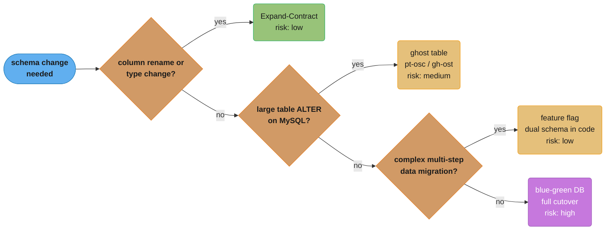
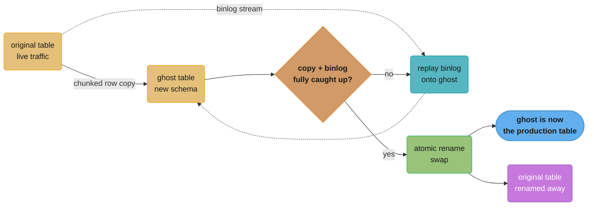

# Database Migrations

## 1. Concept Overview

Database migrations are version-controlled schema changes that transform the database structure from one state to another. As applications evolve, schemas must evolve — new tables, columns, indexes, constraints. Migrations must be: reversible (to support rollbacks), tested (to prevent production disasters), and zero-downtime-compatible (to avoid service interruptions during deployment). The tools that manage migrations (Flyway, Liquibase) provide versioning, checksums, and execution tracking.

Zero-downtime migration is the hardest part: deploying a schema change while old and new application code runs simultaneously requires backward-compatible changes. The expand-contract (parallel change) pattern is the professional approach for renaming columns, changing types, or restructuring data.

---

## 2. Intuition

> **One-line analogy**: Database migrations are like home renovations — you need a detailed plan before starting, you must ensure the house is livable during construction (not just after), and some changes (like moving a load-bearing wall) must be done in stages to avoid the structure collapsing.

**Mental model**: Each migration is a numbered script. Flyway/Liquibase tracks which scripts have run (in a history table). Migrations run in order, once. The state of the database is deterministic from the migration history. Rolling back means running a reverse migration or restoring from backup — not undoing in place.

**Why it matters**: A wrong migration in production can lock tables for minutes (ALTER TABLE in MySQL without online DDL), corrupt data (wrong type cast), or break running services (dropping a column before deploying the code that removes its usage). Most production database incidents are caused by migrations, not application code.

**Key insight**: Application deployments and schema changes are independent axes. At any point during a rolling deployment, old and new code run simultaneously. Your schema must be compatible with both. The expand-contract pattern enforces this: first add the new schema (compatible with both old and new code), then migrate data, then deploy new code that uses the new schema, then remove the old schema.

---

## 3. Core Principles

- **Versioned migrations**: Each migration has a unique version number. Applied in order. Once applied, never modified.
- **Checksum integrity**: Flyway checksums each migration file. Modifying an applied migration causes Flyway to refuse to run and alert.
- **Idempotent repeatable migrations**: Views, stored procedures, and functions that must always reflect the latest version use repeatable migrations (prefixed R__, re-run when checksum changes).
- **Backward compatibility**: During rolling deployments, old code and new code run simultaneously. Schema changes must not break old code.
- **Offline DDL vs online DDL**: Some ALTER TABLE operations take an exclusive lock (lock the table, block all reads/writes). Use online DDL tools (pt-online-schema-change, gh-ost, native online DDL) for large tables.

---

## 4. Types / Architectures / Strategies

### 4.1 Flyway vs Liquibase

| Feature | Flyway | Liquibase |
|---------|--------|-----------|
| Primary format | SQL (preferred), Java | XML, YAML, JSON, SQL |
| Rollback | Pro feature (manual undo scripts) | Built-in changeset rollback |
| Changesets | Versioned migrations (V1__, V2__) | Named changesets with IDs |
| Checksum | Per-file checksum | Per-changeset checksum |
| Schema history table | flyway_schema_history | databasechangelog |
| Enterprise features | Flyway Teams: undo, versioned schema, drift detection | Liquibase Pro: quality checks |
| Spring Boot integration | Auto-configured | Auto-configured |
| Community | Large | Large |
| Best for | Greenfield, SQL-focused | Enterprise, XML-pref teams |

### 4.2 Zero-Downtime Migration Strategies

| Strategy | Description | Risk | Use When |
|----------|-------------|------|---------|
| Expand-Contract | Add new, keep old, migrate, remove old | Low | Column rename, type change |
| Ghost table (pt-osc, gh-ost) | Copy-as-you-go with triggers | Medium | Large table ALTER |
| Blue-Green DB | Two databases, cutover | High | Major restructuring |
| Feature flag | Code supports both schemas behind flag | Low | Complex data migration |



Walking the table above as a decision path: default to expand-contract for an ordinary column rename or type change, and reach for ghost-table copying, a feature flag, or a full blue-green cutover only when the change does not fit that low-risk case.

---

## 5. Architecture Diagrams

### Expand-Contract (Parallel Change) Pattern

```mermaid
flowchart LR
    classDef io      fill:#61afef,stroke:#2e86c1,color:#1a1a1a,font-weight:bold
    classDef frozen  fill:#c678dd,stroke:#9b59b6,color:#fff
    classDef train   fill:#98c379,stroke:#27ae60,color:#1a1a1a
    classDef mathOp  fill:#d19a66,stroke:#e67e22,color:#1a1a1a,font-weight:bold
    classDef lossN   fill:#e06c75,stroke:#c0392b,color:#fff,font-weight:bold
    classDef req     fill:#56b6c2,stroke:#0097a7,color:#1a1a1a
    classDef base    fill:#e5c07b,stroke:#f39c12,color:#1a1a1a

    Start(["rename phone to<br/>phone_number<br/>100M rows · zero downtime"]) -->|"Week 1"| P1("PHASE 1 — EXPAND<br/>V15: ADD COLUMN phone_number<br/>new code dual-writes both")
    P1 -->|"Week 2"| P2("PHASE 2 — MIGRATE<br/>V16: backfill phone_number<br/>from phone, batched")
    P2 -->|"Week 3"| P3("PHASE 3 — SWAP<br/>new code reads/writes<br/>phone_number only")
    P3 -->|"Week 4"| P4("PHASE 4 — CONTRACT<br/>V17: DROP COLUMN phone")
    P4 --> Done(["zero downtime achieved<br/>no code ever saw<br/>a missing column"])

    class Start,Done io
    class P1 base
    class P2 mathOp
    class P3 train
    class P4 frozen
```



Each phase ships as its own Flyway migration (V15 to V17); old and new application code stay compatible with the schema at every step, and `phone` is dropped only in the final phase, once nothing references it, matching the 4-week rollout described above.

### Flyway Migration File Structure

```
src/main/resources/db/migration/
  V1__create_users.sql
  V2__create_orders.sql
  V3__add_user_email_index.sql
  V4__add_order_status.sql
  V5__rename_phone_expand.sql      <- phase 1 of rename
  V6__migrate_phone_data.sql       <- phase 2 of rename
  V7__rename_phone_contract.sql    <- phase 4 of rename
  V8__add_payment_table.sql
  R__views.sql                     <- repeatable: re-run when changed
  U8__add_payment_table.sql        <- undo migration (Flyway Teams)

flyway_schema_history table:
  version | description           | checksum   | success | installed_on
  1       | create users          | 1234567890 | true    | 2024-01-01
  2       | create orders         | 0987654321 | true    | 2024-01-02
  ...
  8       | add payment table     | 1122334455 | true    | 2024-05-01
```

---

## 6. How It Works — Detailed Mechanics

### 6.1 Flyway Configuration (Spring Boot)

```yaml
# application.yml
spring:
  flyway:
    enabled: true
    locations: classpath:db/migration
    baseline-on-migrate: true     # if existing DB without migration history
    baseline-version: 0
    validate-on-migrate: true     # fail if checksums changed (default true)
    out-of-order: false           # disallow running older versions after newer
    table: flyway_schema_history  # custom history table name
    placeholders:
      schema: myapp               # ${schema} in SQL files
```

```sql
-- V1__create_users.sql
-- Comments allowed; single transaction for the entire file
CREATE TABLE users (
    id          BIGSERIAL PRIMARY KEY,
    email       VARCHAR(255) NOT NULL UNIQUE,
    name        VARCHAR(255) NOT NULL,
    created_at  TIMESTAMP    NOT NULL DEFAULT CURRENT_TIMESTAMP,
    deleted_at  TIMESTAMP
);

CREATE INDEX idx_users_email ON users(email);
CREATE INDEX idx_users_created ON users(created_at DESC);
```

### 6.2 Safe Zero-Downtime Migration Patterns

```sql
-- SAFE: Adding a nullable column (no table rewrite in PostgreSQL)
ALTER TABLE orders ADD COLUMN discount_amount DECIMAL(10,2);

-- SAFE: Adding a column with a default value in PostgreSQL 11+
-- (Previously required table rewrite for DEFAULT; now metadata-only)
ALTER TABLE orders ADD COLUMN processed BOOLEAN NOT NULL DEFAULT FALSE;

-- SAFE: Adding an index CONCURRENTLY (no table lock)
-- Runs in background, slower, but does not block reads/writes
CREATE INDEX CONCURRENTLY idx_orders_status ON orders(status);

-- SAFE: Adding a NOT NULL constraint via check constraint + validate
-- (Immediate constraint is table lock; this approach is non-blocking)
-- Step 1: Add as NOT VALID (no table scan, no lock, metadata only)
ALTER TABLE orders ADD CONSTRAINT orders_user_id_not_null
  CHECK (user_id IS NOT NULL) NOT VALID;
-- Step 2: Validate existing rows (ShareUpdateExclusiveLock — allows reads/writes)
ALTER TABLE orders VALIDATE CONSTRAINT orders_user_id_not_null;

-- SAFE: Adding a foreign key constraint (same NOT VALID pattern)
ALTER TABLE orders ADD CONSTRAINT fk_orders_users
  FOREIGN KEY (user_id) REFERENCES users(id) NOT VALID;
ALTER TABLE orders VALIDATE CONSTRAINT fk_orders_users;

-- UNSAFE: ALTER COLUMN type (full table rewrite)
ALTER TABLE orders ALTER COLUMN status TYPE VARCHAR(50);  -- locks table
-- SAFER approach: expand-contract pattern or cast-compatible type change
```

### 6.3 gh-ost for Large Table Alterations



gh-ost copies rows into a new ghost table in chunks while replaying the MySQL binlog to keep it in sync, then atomically renames the tables once caught up — no triggers and no long-held lock, unlike a plain `ALTER TABLE`.

```bash
# gh-ost creates a ghost table, copies rows, uses MySQL binlog for changes
# Zero downtime for ALTER TABLE on large tables

gh-ost \
  --user="ghuser" \
  --password="ghpass" \
  --host="mysql-primary" \
  --database="myapp" \
  --table="orders" \
  --alter="ADD COLUMN discount_code VARCHAR(50), ADD INDEX idx_discount_code(discount_code)" \
  --execute \
  --max-load=Threads_running=25 \     # pause if DB load exceeds threshold
  --critical-load=Threads_running=50 \ # abort if critical threshold exceeded
  --chunk-size=1000 \                  # rows per batch copy
  --throttle-control-replicas="mysql-replica:3306" \  # monitor replica lag
  --max-lag-millis=1500 \              # pause if replica lag exceeds 1.5s
  --ok-to-drop-table \
  --initially-drop-ghost-table

# PostgreSQL: pg_repack (online table bloat removal) or native DDL
# PostgreSQL 12+: Most ADD COLUMN DEFAULT is metadata-only (no table rewrite)
# PostgreSQL: CREATE INDEX CONCURRENTLY (non-blocking)
```

### 6.4 Testing Migrations in CI

```java
// Spring Boot test: run migrations against in-memory H2 or Testcontainers PostgreSQL
@SpringBootTest
@ActiveProfiles("test")
class MigrationTest {

    // Flyway runs automatically via Spring Boot auto-configuration
    @Test
    void allMigrationsApplyCleanly() {
        // If we get here, all migrations ran without error
        // Flyway throws FlywayException on migration failure
    }
}

// Testcontainers for real PostgreSQL behavior:
@TestConfiguration
public class TestDatabaseConfig {

    @Bean
    @Primary
    public DataSource testDataSource() {
        PostgreSQLContainer<?> container = new PostgreSQLContainer<>("postgres:15")
            .withDatabaseName("testdb")
            .withUsername("test")
            .withPassword("test");
        container.start();

        return DataSourceBuilder.create()
            .url(container.getJdbcUrl())
            .username(container.getUsername())
            .password(container.getPassword())
            .build();
    }
}

// Verify schema state after migration:
@Test
void v15MigrationAddsPhoneNumberColumn() {
    // After running all migrations up to V15:
    boolean columnExists = jdbcTemplate.queryForObject(
        "SELECT COUNT(*) > 0 FROM information_schema.columns " +
        "WHERE table_name = 'users' AND column_name = 'phone_number'",
        Boolean.class);
    assertThat(columnExists).isTrue();
}
```

---

## 7. Real-World Examples

**GitHub zero-downtime migrations**: GitHub uses the expand-contract pattern consistently. Their blog post "gh-ost: triggerless online schema migrations for MySQL" describes how they built gh-ost to migrate hundreds of gigabyte tables with no downtime. Key insight: MySQL's LOCK=NONE for DDL has limitations; a proper ghost table approach works at any scale.

**Stripe schema evolution**: Stripe runs thousands of service deployments per week. Their philosophy: schema migrations are deployed before application code that uses new columns. Old columns are never dropped until confirmed to be unused by all deployed versions. They use a 90-day retention window — no column is dropped unless it has been unused for 90+ days (to account for any rollback scenario).

---

## 8. Tradeoffs

| Approach | Downtime | Complexity | Risk | Use Case |
|----------|---------|------------|------|---------|
| Simple ALTER TABLE | Seconds to minutes (lock) | Low | Medium | Small tables (<1M rows) |
| Expand-contract | Zero | High | Low | Any size, production |
| gh-ost / pt-osc | Zero | Medium | Medium | Large MySQL tables |
| Blue-green DB | Minutes (cutover) | Very high | High | Major restructuring |

| Migration tool | SQL support | Rollback | Spring integration |
|---------------|-------------|---------|-------------------|
| Flyway | Excellent | Manual (Undo in Pro) | Excellent |
| Liquibase | Good | Built-in | Excellent |

---

## 9. When to Use / When NOT to Use

**Expand-contract**: Use for any production schema change on a table with more than 100K rows, where the application has zero-downtime requirements. Do not skip it because it feels slow — one bad migration can cause hours of downtime.

**CREATE INDEX CONCURRENTLY**: Always use CONCURRENTLY for adding indexes to large production tables. The cost is longer index build time; the benefit is no table lock. Exception: primary key creation or unique constraint creation that requires validation cannot always use CONCURRENTLY.

**Flyway vs Liquibase**: Use Flyway when your team is comfortable with SQL and you want simplicity. Use Liquibase when you need database-independent migrations, multiple formats, or built-in rollback.

---

## 10. Common Pitfalls

**Modifying an applied migration file**: Flyway checksums migration files. Editing V5__migration.sql after it has run causes the checksum to no longer match, and Flyway throws `Migration checksum mismatch` on the next startup. Never modify applied migrations. Create a new migration to fix any errors.

**Missing CONCURRENTLY on index creation**: `CREATE INDEX ON orders(status)` takes a ShareLock on the table — blocks all writes while building. On a table with millions of rows, this can take minutes. All writes queue behind the lock. In production, always use `CREATE INDEX CONCURRENTLY`.

**DROP COLUMN without checking application usage**: Dropping a column while old application code still reads from it causes SQL errors on SELECT queries that name the column. The safe sequence: (1) deploy new code that does not reference the column; (2) verify old version is completely removed; (3) run the DROP COLUMN migration. Use usage tracking (query logging, code review) to confirm no references.

**Long-running migration holding a transaction**: Running a migration that updates millions of rows in a single transaction (`UPDATE users SET ... WHERE TRUE`) holds a transaction open for minutes, blocking other operations. Break large data migrations into batches with committed transactions between batches.

**Running migrations from multiple application instances simultaneously**: When deploying to a cluster, multiple instances may attempt to run Flyway simultaneously. Flyway uses an advisory lock (or lock table row) to prevent concurrent migration runs. However, if the lock mechanism fails or is bypassed (e.g., two separate schema-creation scripts), migrations can be duplicated or corrupted. Ensure only one instance runs Flyway on startup (e.g., run migrations in the Kubernetes init container, not in all pod startups).

---

## 11. Technologies & Tools

| Tool | Purpose |
|------|---------|
| Flyway | Java-first SQL migration tool |
| Liquibase | XML/YAML/SQL migration tool |
| gh-ost | GitHub's online MySQL schema tool |
| pt-online-schema-change | Percona's MySQL online schema change |
| `pg_repack` | PostgreSQL online table/index defragmentation |
| `flyway migrate` | CLI or Maven/Gradle plugin |
| `liquibase update` | CLI or build plugin |
| Testcontainers | Real DB for migration testing in CI |
| `pg_dump --schema-only` | Export schema for review |
| `ALTER TABLE ... NOT VALID` | PostgreSQL constraint without full table scan |

---

## 12. Interview Questions with Answers

**Q: What is the expand-contract pattern for zero-downtime migrations?**
Expand-contract (also called parallel change) is a three-phase approach: (1) Expand: add the new schema element (new column, table) while keeping the old. Deploy code that writes to both. (2) Migrate: backfill existing data to the new schema. (3) Contract: deploy code that reads/writes only the new schema; remove the old schema. This ensures that at every point, both the old and new application code can function correctly. It eliminates the race condition where a migration removes a column before all instances of the old code are updated.

**Q: How does Flyway track which migrations have been applied?**
Flyway maintains a `flyway_schema_history` table in the target database. Each row records: version number, description, script filename, checksum (SHA-256 of the file content), whether it succeeded, and the timestamp. On application startup, Flyway reads this table, compares against the available migration files, and applies any pending migrations in version order. If a migration file's checksum does not match the stored checksum, Flyway throws an error — preventing silent script modifications.

**Q: What is CREATE INDEX CONCURRENTLY and when must you use it?**
`CREATE INDEX CONCURRENTLY` builds an index without taking an exclusive table lock. It performs multiple passes: first scan creates the index structure without blocking writes; subsequent passes catch up with changes made during the first scan. The downside: takes significantly longer than regular CREATE INDEX. Always use CONCURRENTLY for adding indexes to production tables with significant write traffic — a regular CREATE INDEX on a busy table blocks all writes until the index builds, potentially causing timeouts and cascading failures.

**Q: How do you handle a migration that fails in production?**
(1) Flyway marks failed migrations as failed in the history table. The application will not start until the migration is repaired. (2) Fix the issue: if the migration partially applied, manually revert the partial change and mark it repaired (`flyway repair`). (3) Create a corrected migration with a new version number (do NOT modify the failed migration file — its checksum is tracked). (4) In testing environments: `flyway clean` + remigrate is acceptable; never run `flyway clean` in production (drops all tables).

**Q: What is the difference between Flyway's versioned and repeatable migrations?**
Versioned migrations (V1__, V2__) are applied once, in order, and never re-applied. Repeatable migrations (R__views.sql) are re-applied whenever their checksum changes. Use repeatable for database objects that should always reflect their latest definition: views, stored procedures, functions, and seed data. Every time R__views.sql changes, Flyway re-runs it, replacing the previous version of the views.

**Q: How do you safely add a NOT NULL column to a large table?**
Direct ALTER TABLE ADD COLUMN NOT NULL DEFAULT X requires rewriting the entire table in older databases. PostgreSQL 11+ makes this metadata-only if there is a DEFAULT. For other databases or NULL-with-backfill scenarios: (1) Add the column as nullable: `ALTER TABLE t ADD COLUMN new_col TYPE`. (2) Backfill in batches: `UPDATE t SET new_col = default_val WHERE new_col IS NULL LIMIT 10000` (repeat until done). (3) Add NOT NULL constraint as NOT VALID (no lock): `ALTER TABLE t ADD CONSTRAINT chk_not_null CHECK (new_col IS NOT NULL) NOT VALID`. (4) Validate: `ALTER TABLE t VALIDATE CONSTRAINT chk_not_null` (ShareUpdateExclusiveLock, allows reads/writes).

**Q: How would you rename a column with zero downtime?**
Use expand-contract: (1) Add the new column name. (2) Update application code to write to both the old and new column. (3) Backfill: update all rows where the new column is null to copy from the old. (4) Deploy code that reads from the new column only (writes to both). (5) Deploy code that reads and writes only the new column (drop writes to old). (6) Drop the old column once no running instances reference it.

**Q: What is gh-ost and how does it enable online schema changes in MySQL?**
gh-ost creates a "ghost" table with the desired new schema, copies rows from the original table to the ghost table, and simultaneously applies changes from MySQL's binary log (binlog) to keep the ghost table in sync. When the copy and sync are complete, gh-ost atomically swaps the original and ghost table names. Unlike triggers (used by pt-osc), gh-ost reads the binlog independently — no write amplification from triggers. It includes throttling mechanisms (pause on high load, replica lag) to prevent impacting production traffic.

**Q: How do you test database migrations in a CI pipeline?**
(1) Unit: test each migration file's SQL syntax with a real database (Testcontainers PostgreSQL/MySQL). (2) Integration: run the full migration sequence against a clean schema; verify table structure, indexes, and constraints match expectations. (3) Data migration: if the migration transforms data, load representative test data, run the migration, assert the transformed data is correct. (4) Rollback: if using Liquibase with rollback, test the rollback script. (5) Performance: for large-table migrations, test execution time on a copy of production data.

**Q: What is flyway repair and when do you use it?**
`flyway repair` does two things: (1) removes any failed migration records from the schema history table so the migration can be re-run after fixing the SQL; (2) realigns checksums for applied migrations that you have modified in place (only for resolving drift in non-production environments). Use repair when a migration failed partway and you have cleaned up the partial effects manually. Never repair checksums on production unless you fully understand the consequences.

**Q: How do you run Flyway in a Kubernetes deployment without running it in every pod?**
Use an init container that runs `flyway migrate` before the main container starts. Only the init container runs migrations. All main application pods start only after the init container succeeds. This prevents race conditions from multiple pods running migrations simultaneously. The Kubernetes Job resource is an alternative: run migrations as a one-time job before rolling out the main Deployment. Ensure the migration user has `flyway_schema_history` write permissions; the application user can have read-only schema access.

**Q: What are baseline migrations in Flyway?**
Baseline is for databases that already have a schema (pre-Flyway). When `baseline-on-migrate` is true, if Flyway finds no history table and the database is not empty, it creates the history table and marks all existing migrations up to `baseline-version` as already applied — without executing them. This allows Flyway to manage a pre-existing database. All migrations after the baseline version will run normally. Never use baseline on a fresh empty database; that is the default starting scenario for Flyway.

---

## 13. Best Practices

- Never modify an already-applied migration file — create a new one.
- Always use CREATE INDEX CONCURRENTLY for production indexes.
- Use expand-contract for any column rename or type change in production.
- Run migrations from a single init container or migration job, not from each application instance.
- Include migration tests in CI with Testcontainers running the real database engine.
- Break large data migrations (UPDATE ALL rows) into batches of 1,000–10,000 rows with COMMIT between batches.
- Add NOT NULL constraints as NOT VALID first, then validate separately to avoid table locks.
- Document each migration's purpose with a comment at the top of the SQL file.

---

## 14. Case Study

**Problem**: An order management system needed to rename the `customer_name` column to `buyer_name` and change its type from VARCHAR(100) to TEXT, across a 200M row `orders` table in production. Zero downtime required.

**Plan**:
```sql
-- V20__expand_buyer_name.sql
-- Phase 1: ADD new column (metadata-only for TEXT, no table rewrite)
ALTER TABLE orders ADD COLUMN buyer_name TEXT;
CREATE INDEX CONCURRENTLY idx_orders_buyer_name ON orders(buyer_name);

-- V21__migrate_buyer_name_data.sql
-- Phase 2: Backfill in batches (run separately, not in migration transaction)
-- (This migration calls a custom Flyway Java callback that does batched updates)
-- Or: use a separate batch job outside migration:
-- UPDATE orders SET buyer_name = customer_name WHERE buyer_name IS NULL LIMIT 10000;
-- (repeat 20,000 times for 200M rows, ~2 rows/ms = ~28 hours for 200M)

-- V22__contract_buyer_name.sql (deployed after code switches to buyer_name)
-- Phase 3: Contract: drop old column
DROP INDEX CONCURRENTLY idx_orders_customer_name;
ALTER TABLE orders DROP COLUMN customer_name;
```

**Code changes**:
- V20 deployed: writes to both `customer_name` and `buyer_name` (dual-write)
- V21 data migration complete (backfilled all rows)
- New code deployed: reads from `buyer_name` only, writes to both
- After full rollout: writes to `buyer_name` only
- V22 deployed: `customer_name` dropped

**Outcome**: Zero downtime. 200M rows backfilled over 28 hours using a background job. No table locks taken during business hours. Entire migration completed over 2 weeks with full rollback capability at each step.
