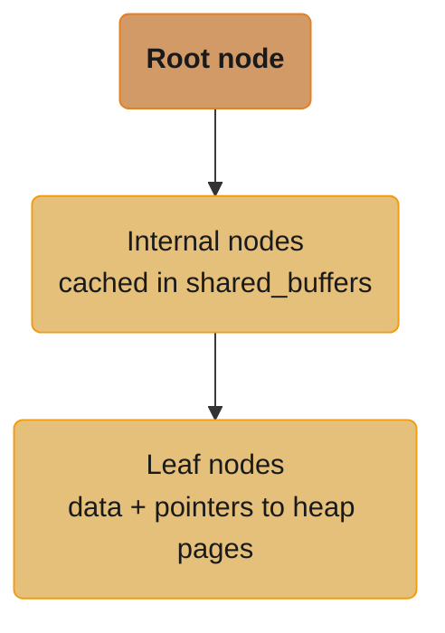
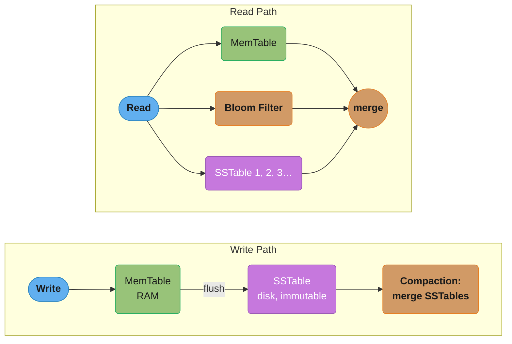
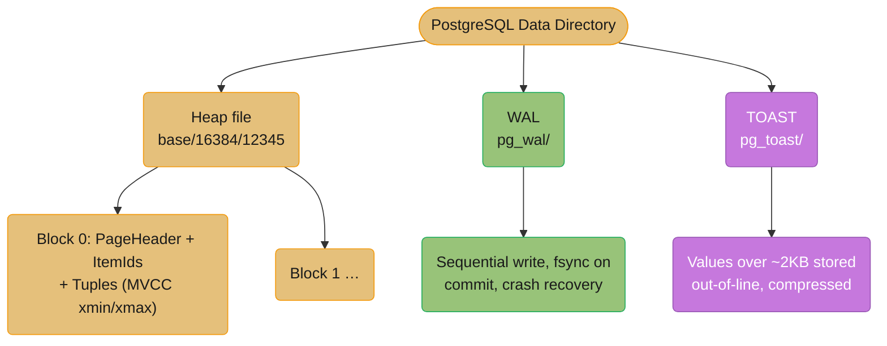
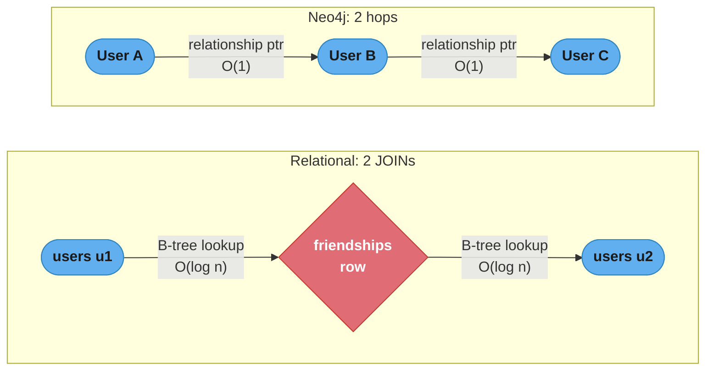
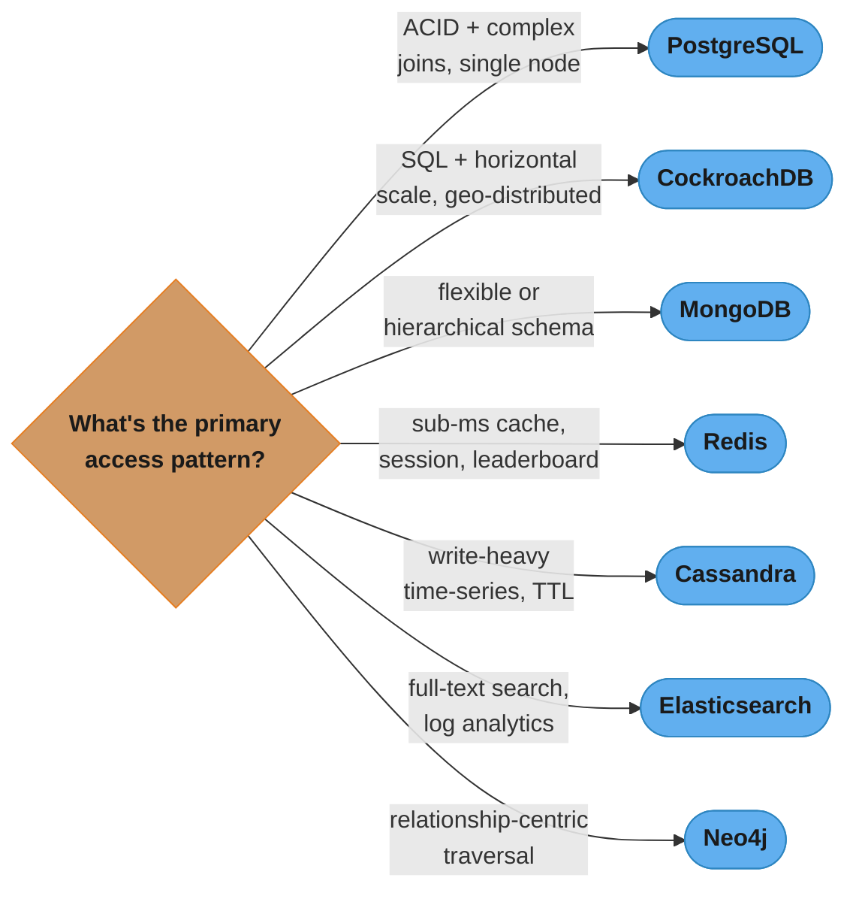

# Database Types — Deep Dive

## 1. Concept Overview

Modern backend systems use multiple database types, each optimized for different access patterns, data models, and consistency requirements. Relational databases excel at complex queries with strong consistency. Document stores handle flexible schemas and hierarchical data. Key-value stores provide sub-millisecond lookups. Wide-column stores scale writes horizontally. Time-series databases compress and query temporal data. Search engines support full-text and faceted search. Graph databases traverse relationships in O(1) per hop. NewSQL provides relational semantics with horizontal scalability. Understanding the internal mechanics of each type is essential for choosing correctly and debugging performance problems.

---

## 2. Intuition

Every database is a set of engineering tradeoffs encoded in its storage engine. A relational DB optimizes for query flexibility (B+tree indexes on any column, JOINs across tables) at the cost of horizontal scale. Cassandra optimizes for write throughput and availability at the cost of query flexibility (no JOINs, no ad-hoc queries). Redis optimizes for read latency (in-memory) at the cost of data size (RAM-bound). Understanding why each database makes these tradeoffs tells you when to use which.

---

## 3. Core Principles

- **Access patterns drive selection**: choose the database that makes your most common queries efficient; never choose on hype or familiarity alone
- **Storage engines encode tradeoffs**: B+tree = read-optimized; LSM-tree = write-optimized; columnar = analytics-optimized
- **Polyglot persistence**: production systems use 3-5 database types; each domain's data lives in the most appropriate store
- **Operational cost matters**: exotic databases have steeper operational curves; account for team expertise, managed service availability, and debugging tools
- **Data model determines query flexibility**: normalize for flexibility, denormalize for performance; wide-column stores require knowing access patterns at schema design time

---

## 4. Types / Architectures / Strategies

| Database Type | Storage Engine | Consistency | Horizontal Scale | Ideal Use Case |
|--------------|---------------|-------------|-----------------|----------------|
| Relational (PostgreSQL) | B+tree heap + WAL | ACID | Vertical + read replicas | Complex queries, financial transactions |
| Document (MongoDB) | B-tree + WiredTiger | Tunable (majority) | Sharding | Flexible schema, hierarchical data |
| Key-Value (Redis) | In-memory skiplist/hash | Eventual (async replication) | Cluster (16384 slots) | Caching, session, leaderboards |
| Key-Value (DynamoDB) | LSM-tree (proprietary) | Tunable (eventual/strong) | Fully managed | Serverless, known access patterns |
| Wide-Column (Cassandra) | LSM-tree (SSTables) | Tunable (ONE to ALL) | Ring-based consistent hash | Write-heavy, time-series, IoT |
| Time-Series (InfluxDB) | TSM (columnar) | Eventual | Sharding | Metrics, monitoring, IoT telemetry |
| Time-Series (TimescaleDB) | PostgreSQL + chunks | ACID | Vertical + partitioning | SQL + time-series, DevOps metrics |
| Search (Elasticsearch) | Lucene inverted index | Near real-time (1s refresh) | Shards + replicas | Full-text search, log analytics |
| Graph (Neo4j) | Native graph storage | ACID (Enterprise Raft) | Limited (sharding hard) | Social networks, fraud, recommendations |
| NewSQL (CockroachDB) | RocksDB + Raft | Serializable | Auto-sharding | SQL + horizontal scale |

---

## 5. Architecture Diagrams

**B+tree (PostgreSQL, MySQL InnoDB):** writes require random I/O (update in-place), but reads are fast via O(log n) binary search — internal index pages are cached in memory (`shared_buffers`), which is why this engine wins for read-heavy, random-access workloads.



**LSM-tree (Cassandra, RocksDB, LevelDB):** writes are always sequential I/O (MemTable to SSTable), which wins for write-heavy, append-mostly workloads — the tradeoff is read amplification, since a read may have to check the MemTable, a Bloom filter, and several immutable SSTables before merging results.



**PostgreSQL on-disk layout:** tuples live in 8KB heap blocks carrying MVCC (`xmin`/`xmax`) metadata, the WAL (`pg_wal/`) captures every commit with sequential writes for crash recovery, and TOAST (`pg_toast/`) stores values over about 2KB out-of-line and compressed.



---

## 6. How It Works — Detailed Mechanics

### Relational Databases — PostgreSQL Internals

**InnoDB (MySQL)**:
- Clustered primary key: the primary key IS the B+tree leaf node; the row data is in the leaf
- Secondary indexes: leaf contains primary key value (not row pointer); secondary index lookup = secondary B+tree → primary key → primary B+tree (double lookup)
- MVCC: uses undo log to store old row versions; read view at transaction start determines visibility
- Redo log (InnoDB redo): WAL for durability; ib_logfile0 + ib_logfile1 (circular); `innodb_flush_log_at_trx_commit=1` for durability
- Buffer pool: `innodb_buffer_pool_size` = 70-80% of RAM; LRU with young/old sublists; adaptive hash index

**PostgreSQL**:
- Heap file: rows stored in 8KB pages; no clustering by default; HOT (Heap Only Tuple) update avoids index update when non-indexed columns change
- MVCC: xmin/xmax in each tuple; visibility determined by transaction snapshot (xid < snapshot_xmin = visible, xid > snapshot_xmax = invisible)
- WAL: pg_wal directory; sequential writes only; `fsync=on` per commit; `full_page_writes=on` for partial page protection; WAL archiving for PITR (Point-In-Time Recovery)
- VACUUM: reclaims dead tuple space; updates visibility map and free space map; `autovacuum_vacuum_threshold + autovacuum_vacuum_scale_factor * n_live_tup` triggers autovacuum
- `shared_buffers`: 25% of RAM is a common starting point; stores hot pages in memory; managed by buffer manager with clock sweep replacement
- `effective_cache_size`: planner hint for total cacheable memory (shared_buffers + OS page cache); typically set to 75% of RAM

```sql
-- Check table bloat (dead tuples)
SELECT relname, n_dead_tup, n_live_tup,
       round(n_dead_tup::numeric / nullif(n_live_tup + n_dead_tup, 0) * 100, 2) AS dead_pct
FROM pg_stat_user_tables
WHERE n_dead_tup > 0
ORDER BY dead_pct DESC;

-- Check index hit rate (should be > 99%)
SELECT sum(idx_blks_hit) / (sum(idx_blks_hit) + sum(idx_blks_read)) AS idx_hit_rate
FROM pg_statio_user_indexes;
```

**PostgreSQL concrete limits**:
- Max row size: 1.6GB (TOAST)
- Max database size: unlimited
- Max columns per table: 1600
- Max index size: 32TB
- Recommended autovacuum trigger: dead_tuple_ratio > 20%
- `shared_buffers`: 25% of RAM
- `effective_cache_size`: 75% of RAM

### Document Databases — MongoDB WiredTiger

**WiredTiger storage engine**:
- B-tree for indexes (not LSM); WiredTiger uses a combination: in-memory cache B-tree + checkpoints to disk
- MVCC: document-level multi-version concurrency; snapshot isolation for transactions
- Block compression: snappy by default; zstd for better ratio; `block_compressor=zstd`
- Cache: `wiredTigerCacheSizeGB = max(0.5GB, (totalRAM_GB - 1) * 0.5)` default; tune to 50-70% of RAM

**BSON format**:
- Binary JSON with type codes embedded: 0x01=double, 0x02=string (UTF-8 + length), 0x07=ObjectId (4-byte ts + 5-byte random + 3-byte counter), 0x08=bool, 0x09=datetime, 0x10=int32, 0x12=int64, 0x03=embedded document, 0x04=array
- ObjectId is 12 bytes: time-sortable, globally unique without coordination
- Each document embeds field names → storage overhead vs relational (field names in every document)

**Replica sets**:
- Primary election via Raft-like protocol; primary handles all writes; secondaries replicate via oplog (capped collection, circular)
- `writeConcern: majority` = wait for acknowledgment from majority of replica set members
- `readConcern: majority` = read only data confirmed on majority (linearizable)
- Oplog default size: 5% of available disk space; min 990MB

**Sharding**:
- Shard key design is critical: high cardinality (avoid hot shards), even write distribution, query isolation (queries should target one shard)
- Hash sharding: even distribution but kills range queries
- Range sharding: supports range queries but risks hot shards if key is monotonically increasing (e.g., timestamp)
- `mongos` router: queries go to mongos → looks up shard key in config servers → routes to appropriate shard
- Jumbo chunks: chunk too large to split (all documents have same shard key value); causes hotspot

**MongoDB concrete limits**:
- Max document size: 16MB
- Default WiredTiger cache: `max(50% RAM - 1GB, 256MB)`
- Oplog default: 5% of disk
- Max number of indexes per collection: 64

### Key-Value Stores — Redis Internals

**Data structures and their encodings**:
- String: SDS (Simple Dynamic String) — stores length + buffer; no null termination issue; O(1) length; up to 512MB
- Hash (small): listpack (formerly ziplist) — contiguous memory, compact; switches to hashtable at `hash-max-listpack-entries=128` entries or `hash-max-listpack-value=64` bytes
- Hash (large): hashtable — separate chaining, rehashing in background (incremental rehash)
- List: quicklist — doubly-linked list of listpack nodes (compressed intermediate nodes)
- Set (integer): intset — sorted array of integers, compact; switches to hashtable at 512 integers
- ZSet (small): listpack; switches to skiplist + hashtable at `zset-max-listpack-entries=128`
- ZSet (large): skiplist (O(log n) range queries) + hashtable (O(1) score lookup)
- HyperLogLog: probabilistic cardinality estimation; 12KB memory for up to 2^64 unique items; error rate 0.81%
- Bloom Filter: probabilistic membership test; false positives possible, false negatives impossible

**Persistence**:
- RDB (Redis Database): point-in-time snapshot; `fork()` + copy-on-write; `save 900 1` (every 900s if 1 change); `bgsave`; compact file but data loss between snapshots
- AOF (Append-Only File): log every write operation; `appendfsync always/everysec/no`; `everysec` = max 1s data loss; `AOF rewrite` (bgrewriteaof) rewrites AOF from current state to compact it
- RDB + AOF hybrid: RDB snapshot in AOF file as base, incremental AOF after snapshot

**Replication and Cluster**:
- Replication: async by default; `WAIT numreplicas timeout` for sync wait
- Cluster: 16384 hash slots; `CRC16(key) % 16384` assigns key to slot; each node handles a slot range; MOVED redirect = key on different node; ASK redirect = slot migrating
- Cluster requires `cluster-require-full-coverage=yes` by default (cluster stops if any slot has no healthy node)

**Redis concrete numbers**:
- Single-threaded event loop: handles 100K+ ops/sec; Redis 6.0 added I/O threads for network (up to 8 threads for I/O, still single-threaded for commands)
- Max connected clients: 10,000 (configurable)
- Max database index: 16 (DB 0-15)
- Max key expiration precision: milliseconds (PEXPIRE/PTTL)

### Key-Value Stores — DynamoDB

**Architecture**:
- LSM-tree-based storage; rows partitioned by hash of partition key → physical partition
- Partition limit: 10GB storage, 3000 RCU + 1000 WCU per partition
- Adaptive capacity: automatically redistributes throughput to hot partitions
- `DAX` (DynamoDB Accelerator): in-memory cache with microsecond read latency; sits between app and DynamoDB

**Access patterns**:
- Must know access patterns before designing table schema (opposite of relational DB)
- Single-table design: multiple entity types in one table; partition key = entity type + ID, sort key = sub-entity
- `GSI` (Global Secondary Index): alternate partition key; eventually consistent reads; separate throughput from base table
- `LSI` (Local Secondary Index): alternate sort key for same partition key; strongly consistent reads possible; must be defined at table creation

**DynamoDB concrete numbers**:
- Item max size: 400KB
- Partition throughput: 3000 RCU + 1000 WCU
- DynamoDB Streams retention: 24 hours

**Put simply.** "You are not billed for requests, you are billed for 4 KB read blocks and 1 KB write blocks — and those blocks are rounded up per item, then capped per physical partition."

The rounding and the per-partition cap are what turn a capacity number into a latency incident. A table can be provisioned for enormous throughput and still throttle, because the ceiling that matters is the one on a single partition, not the one on the table.

| Symbol | What it is |
|--------|------------|
| RCU | Read capacity unit — one strongly consistent read of up to 4 KB per second, or two eventually consistent reads |
| WCU | Write capacity unit — one write of up to 1 KB per second |
| `ceil(size / 4KB)` | RCUs a single read consumes. A 4.1 KB item costs 2 RCUs, not 1.025 |
| `ceil(size / 1KB)` | WCUs a single write consumes |
| 3000 RCU / 1000 WCU | The per-*partition* ceiling. Independent of what the table is provisioned for |
| Adaptive capacity | AWS lending idle capacity from cold partitions to a hot one — mitigation, not a guarantee |

**Walk one example.** The same partition, three item sizes:

```
  Reads, 3000 RCU per partition:
    4 KB item   ceil(4/4)  = 1 RCU    ->  3000 strong reads/s   (6000 eventual)
    12 KB item  ceil(12/4) = 3 RCU    ->  1000 strong reads/s
    400 KB item ceil(400/4)= 100 RCU  ->    30 strong reads/s

  Writes, 1000 WCU per partition:
    1 KB item   ceil(1/1)  = 1 WCU    ->  1000 writes/s
    2.5 KB item ceil(2.5/1)= 3 WCU    ->   333 writes/s
```

Now the hot-partition trap. Provision the table at 40,000 WCU and route every write to one
partition key: `1000 / 40000 = 2.5%` of the capacity you are paying for is reachable, and the
other 97.5% sits idle while clients receive `ProvisionedThroughputExceededException`. The
throttle is not a table-level signal, so dashboards showing plenty of unused table capacity
look healthy throughout. The fix is always the same shape as Cassandra's — widen the partition
key (add a suffix, a bucket, a shard number) so the load spreads across many partitions and
each stays under its own 3000/1000 ceiling.

### Wide-Column Stores — Apache Cassandra

**Data model**:
- Keyspace (database) → Table → Partition → Row
- Primary key = partition key (required) + clustering columns (optional)
- Partition key: hashed to determine which node(s) own the data
- Clustering columns: sort order within a partition (stored sorted on disk)
- Each partition is a sorted log of rows; queries efficient only if they match partition key

**Write path**:
1. Write to CommitLog (append-only, sequential I/O for durability)
2. Write to MemTable (in-memory sorted structure per table)
3. Flush MemTable to SSTable (immutable, sorted, on disk) when threshold reached
4. SSTable files accumulate; compaction merges them

**Read path**:
1. Check MemTable (in memory)
2. Check Bloom filter per SSTable (fast false-negative-free membership check)
3. Check partition key index (sparse index — maps keys to SSTable file offsets)
4. Read from SSTable data file(s)
5. Merge results (newest wins for same row/column)

**Compaction strategies**:
- STCS (Size-Tiered Compaction Strategy): groups similarly-sized SSTables; good for write-heavy; space-amplification during compaction
- LCS (Leveled Compaction Strategy): fixed-size levels; reads more efficient (fewer SSTables to check); higher write amplification; good for read-heavy
- TWCS (Time-Window Compaction Strategy): SSTables grouped by time window; expired windows deleted atomically; ideal for time-series data with TTL

**Consistency levels**:
- `ONE`: write/read acknowledged by 1 replica; lowest latency, highest availability, weakest consistency
- `QUORUM`: write/read acknowledged by `floor(RF/2)+1` replicas (RF=3 → 2 nodes); balanced
- `ALL`: all replicas; strongest consistency, lowest availability
- `LOCAL_QUORUM`: quorum within local DC only; preferred for multi-DC to avoid cross-DC latency

**What it means.** "If the set of nodes you wrote to and the set you read from are guaranteed to overlap in at least one node, then every read is guaranteed to see the latest write."

Consistency here is not a property of any single node — it is a property of two *sets* being forced to intersect. That is the entire trick, and it is why the rule is stated as an inequality rather than a configuration flag.

| Symbol | What it is |
|--------|------------|
| RF | Replication factor — how many copies of each row exist |
| `floor(RF/2)+1` | Quorum size: strict majority. For RF=3 that is 2 nodes |
| W | How many replicas must acknowledge a write before it is called successful |
| R | How many replicas must answer a read before it is returned |
| `W + R > RF` | The overlap condition. Satisfy it and read-your-writes holds; violate it and stale reads are legal |
| `RF − W` | How many node failures a write can survive |

**Walk one example.** Why two majorities cannot miss each other, and what each setting costs:

```
  RF = 3, quorum = floor(3/2)+1 = 2

  W=2, R=2   ->  W+R = 4 > 3     overlap guaranteed    strongly consistent
  W=1, R=1   ->  W+R = 2 < 3     no overlap forced     stale reads possible
  W=3, R=1   ->  W+R = 4 > 3     consistent, but any one node down blocks all writes
  W=1, R=3   ->  W+R = 4 > 3     consistent, but any one node down blocks all reads

  Failure tolerance at W=R=QUORUM:
    RF=3  quorum 2   survives 1 node down
    RF=5  quorum 3   survives 2 nodes down
    RF=7  quorum 4   survives 3 nodes down
```

Pigeonhole is the proof: with only 3 replicas, a write touching 2 and a read touching 2 must
share at least one node, because `2 + 2 = 4` boxes cannot fit in 3 slots without a collision.
The overlapping node holds the newest timestamp, and Cassandra's last-write-wins reconciliation
picks it. This is also why `ONE/ONE` is not "slightly weaker" but *categorically* different —
`1 + 1 = 2 ≤ 3` means there exists a legal execution where the read hits neither node that
took the write.

`LOCAL_QUORUM` is the same inequality applied per datacenter: it satisfies `W+R > RF` within
the local DC (avoiding a cross-DC round trip on every operation) while giving up the global
guarantee. A read in DC-B may not see a write that only reached DC-A's local quorum.

**Cassandra concrete numbers**:
- Recommended max partition size: 100MB; max rows per partition: 2 billion (theoretical)
- Default `gc_grace_seconds`: 864000 (10 days); tombstones not deleted until after this period
- Default bloom filter FP rate: 0.1% (1 in 1000 reads hits a wrong SSTable)
- CommitLog segment size: 32MB default
- MemTable flush threshold: 1/4 of heap committed to MemTable

**Anti-patterns**:
```
// BROKEN: allow filtering = full partition scan
SELECT * FROM orders WHERE status = 'PENDING' ALLOW FILTERING;

// FIX: include status in partition key or use a materialized view
// Design: partition key = (status, date) → direct lookup

// BROKEN: unbounded collection (a list with millions of items per row)
// This creates a single massive partition → hotspot
UPDATE user_activity SET events = events + [new_event] WHERE user_id = ?;
// After millions of events, partition is hundreds of MB

// FIX: use time-bucketed partition key
// PRIMARY KEY ((user_id, bucket_month), event_time)
```

### Time-Series Databases — InfluxDB, TimescaleDB, Prometheus

**InfluxDB 2.x / IOx**:
- Data model: measurement + tag set (indexed) + field set (not indexed) + timestamp
- Tags: string key-value pairs; indexed via inverted index; used for filtering; low cardinality required
- Fields: numeric or string values; not indexed; high cardinality OK
- TSM (Time-Structured Merge Tree): similar to LSM; columnar encoding per field per time range
- InfluxDB 3.0 (IOx): Apache Parquet on object storage; Apache Arrow for in-memory; columnar OLAP queries; ~10x compression vs IOx predecessor

**TimescaleDB**:
- PostgreSQL extension; hypertable = regular PostgreSQL table partitioned into time-based chunks
- Default chunk interval: 7 days; each chunk is an independent table segment
- Chunk exclusion: query planner automatically skips chunks outside the query's time range
- Columnar compression (per chunk): 90-95% compression typical; TimescaleDB converts chunks to columnar format after a configurable delay (e.g., compress chunks older than 7 days)
- Continuous aggregates: PostgreSQL materialized views that auto-refresh from the hypertable

**Prometheus TSDB**:
- Pull-based: Prometheus scrapes `/metrics` endpoints every `scrape_interval` (default 15s)
- TSDB: 2-hour in-memory blocks; WAL for recent data; persisted blocks compressed with Gorilla encoding
- Gorilla encoding: delta-of-delta for timestamps (seconds between timestamps changes slowly); XOR encoding for float64 values (consecutive values differ by small XOR)
- Typical compression: ~1.37 bytes/sample vs 12 bytes/sample uncompressed (8.7x compression)
- Remote write: Prometheus → Thanos/Cortex/VictoriaMetrics for long-term storage and global queries
- PromQL: `rate(http_requests_total[5m])` = per-second rate over 5-minute window; `histogram_quantile(0.99, ...)` for percentiles from histograms

**Time-series concrete numbers**:
- Prometheus Gorilla encoding: ~1.37 bytes/sample
- TimescaleDB compression: 90-95% vs uncompressed
- InfluxDB IOx Parquet: ~10x compression
- Prometheus default retention: 15 days; scrape interval: 15s

### Search Engines — Elasticsearch / OpenSearch

**Lucene internals (the core)**:
- Inverted index: maps terms → posting list (sorted list of docIDs + term frequency + positions)
- Segment: immutable set of indexes (inverted index, DocValues, stored fields, norms); Lucene is a collection of segments
- Segment merge: small segments merged into larger ones (tiered merge policy); reduces per-read segment count
- DocValues: column-oriented storage for numeric/keyword fields; used for sorting, aggregations, scripting; on-disk, memory-mapped; efficient for operations that scan many documents
- BKD trees: k-d tree variant for numeric and geo range queries; replaces outdated block tree for ranges
- BM25 scoring: `score = IDF * tf_normalized`; IDF = `log(1 + (N - n + 0.5) / (n + 0.5))`; tf normalization uses field length

**Elasticsearch architecture**:
- Index = collection of shards; `number_of_shards` fixed at creation (changing requires reindex)
- Routing: `shard = hash(_routing) % number_of_shards` (default `_routing = _id`)
- Translog: WAL per shard; `index.translog.sync_interval=5s` (default); `fsync=request` for full durability
- Refresh: new documents become searchable after `index.refresh_interval=1s`; before refresh, documents are in translog but not in segments
- Primary shard: handles writes; replica shard: copies of primary for redundancy + read scaling

**Query execution**:
1. Client sends to coordinating node
2. Coordinating node fans out to all shards (all primary or replica shards)
3. Each shard executes query locally, returns top-N docIDs + scores
4. Coordinating node merges results (priority queue), fetches documents for top-N hits
5. Returns to client

**Fielddata vs DocValues**:
- DocValues: on-disk, memory-mapped columnar storage; built at index time; efficient
- Fielddata: loaded into heap on-demand for text fields; NOT recommended for high-cardinality fields (memory exhaustion); use only for text analysis scripts
- Circuit breaker: `indices.fielddata.circuit_breaker.limit=60%` heap prevents OOM from fielddata

**Elasticsearch concrete numbers**:
- Recommended max shard size: 50GB
- Recommended max shards per node: 20 per GB of heap (e.g., 30GB heap → 600 shards max)
- Refresh interval: 1s (makes documents searchable)
- Translog fsync: 5s (default, durability tradeoff)
- Max document size: 2GB (practical limit much lower due to memory)

### Graph Databases — Neo4j

**Native graph storage**:
- Node record: 15 bytes — flags (1) + first relationship (4) + first property (4) + labels (4) + extra (2)
- Relationship record: 34 bytes — flags + start node + end node + relationship type + next relationship for start node + next relationship for end node + first property
- Each node stores pointer to its first relationship; each relationship stores pointers to next relationship in start-node and end-node chains
- Index-free adjacency: traversal from node A to neighbors = follow relationship pointer chain; O(1) per hop vs JOIN (O(log n) per join)

**Why graph traversal is O(1) per hop**:
```
Relational JOIN traversal (finding friends of friends):
  SELECT u2.* FROM users u1
  JOIN friendships f1 ON u1.id = f1.user1_id
  JOIN users u2 ON f1.user2_id = u2.id
  WHERE u1.id = 123
  -- This requires index lookup O(log n) on friendships table
  -- For friends-of-friends (2 hops): two JOIN operations
  -- For 6-hop traversal: cost grows with data size

Neo4j traversal (finding friends of friends):
  MATCH (u:User {id: 123})-[:FRIENDS_WITH*2]->(fof:User) RETURN fof
  -- Follows relationship pointers directly from node record
  -- O(1) per hop regardless of total graph size
  -- Cost depends on local neighborhood, not global data size
```

Each relational hop re-runs a B-tree index lookup (cost tied to total data size), while Neo4j follows a relationship pointer stored directly on the node record, so each hop stays O(1) regardless of how large the graph grows:



**Graph algorithms (GDS library)**:
- PageRank: importance score based on incoming link quality and quantity
- Community detection (Louvain): groups densely connected nodes
- Shortest path (Dijkstra, A*): minimum cost path between two nodes
- Betweenness centrality: nodes that lie on many shortest paths
- Recommendation: collaborative filtering via graph walks

**Neo4j concrete numbers**:
- Node record: 15 bytes
- Relationship record: 34 bytes
- Node labels and relationship types stored in label store (fixed size)
- Max nodes: 2^35 (~34 billion)
- Max relationships: 2^35 (~34 billion)
- APOC library: 450+ procedures for utility operations
- GDS library: graph algorithms natively in Neo4j

### NewSQL — CockroachDB, TiDB, Spanner

**CockroachDB**:
- Built on RocksDB (LSM-tree) per node
- Raft consensus per "range" (64MB key-range slices); each range has 3 replicas on different nodes
- MVCC for transactions: each write has a timestamp; read at a specific timestamp sees consistent snapshot
- Serializable isolation by default (PostgreSQL is read committed by default)
- Geo-partitioning: constrain specific rows to specific geographic regions (data residency compliance)
- Wire-compatible with PostgreSQL: use existing PostgreSQL drivers
- Changefeed: CDC stream for downstream consumers (Kafka, cloud storage)

**Google Spanner**:
- TrueTime API: combination of GPS receivers and atomic clocks; uncertainty interval ~1-7ms; `TT.now()` returns `[earliest, latest]` interval
- External consistency: if transaction T1 commits before T2 starts (by wall clock), then commit timestamp(T1) < commit timestamp(T2); enables globally consistent snapshots
- F1 SQL database built on Spanner replaced MySQL at Google; handles 4.6 million queries per second
- Interleave: parent-child table co-location: `INTERLEAVE IN PARENT orders ON DELETE CASCADE` keeps order items on the same split as the order

**TiDB**:
- MySQL wire-compatible; separates compute (TiDB nodes, stateless SQL layer) from storage (TiKV, Raft-based key-value)
- TiFlash: columnar replica of TiKV for HTAP (Hybrid Transactional/Analytical Processing) — real-time analytics without ETL
- Percolator transaction model: two-phase commit using timestamps from TSO (Timestamp Oracle); optimistic concurrency

**NewSQL concrete numbers**:
- CockroachDB range size: 64MB; Raft heartbeat: 200ms
- Spanner TrueTime uncertainty: ~1-7ms; globally consistent reads at any timestamp
- TiKV region size: 96MB default; split at 144MB

---

## 7. Real-World Examples

- **Instagram**: migrated from PostgreSQL to Cassandra for user feed (write-heavy, time-ordered); kept PostgreSQL for user account data (relational, strong consistency)
- **Uber**: uses multiple databases: MySQL for transactional data, Cassandra for geospatial and time-series, Elasticsearch for search, Redis for caching; ~100 different database deployments across their microservices
- **GitHub**: PostgreSQL for all primary data; Elasticsearch for code search; Redis for caching and pub/sub; switched from MySQL to vitess (sharded MySQL) for scale
- **Twitter**: Timeline delivery uses Redis sorted sets for ~4 billion users' feeds; Manhattan (proprietary key-value on SSD) for tweet storage; replaced MySQL for most use cases
- **LinkedIn**: Voldemort (key-value), Espresso (document), Venice (read-only derived data); chose different engines per data access pattern

---

## 8. Tradeoffs

```
Full Comparison Matrix
========================

| Feature          | PostgreSQL | MongoDB | Redis  | Cassandra | Elasticsearch | Neo4j  | CockroachDB |
|-----------------|-----------|---------|--------|-----------|---------------|--------|-------------|
| Write throughput | Medium     | High    | Very High | Very High | Medium    | Low-Med | Medium     |
| Read latency     | Low        | Low     | Sub-ms | Low       | Low           | Very Low | Low       |
| Query complexity | High (SQL) | Medium  | Low    | Low       | Medium        | High (Cypher) | High |
| Horizontal scale | Read replicas | Sharding | Cluster | Ring | Shards   | Limited | Auto      |
| Consistency      | ACID       | Tunable | Eventual | Tunable | Near-real-time | ACID | Serializable |
| Schema           | Rigid      | Flexible | None   | Semi-rigid | Flexible  | Flexible | Rigid     |
| Joins            | Yes        | No      | No     | No        | No (nested)   | Traversal | Yes    |
| Transactions     | Full ACID  | Multi-doc | No   | LWT only  | No            | ACID   | Full ACID   |
| Best use case    | Financial  | Content | Cache  | IoT/Log   | Search        | Social | Global SQL  |
```

---

## 9. When to Use / When NOT to Use

A quick decision guide distilled from the detailed use-cases below — always validate against the full when-to-use/when-not-to-use guidance that follows.



**Relational (PostgreSQL)**: use for financial transactions (ACID required), systems with complex queries and ad-hoc reporting, data with complex relationships and referential integrity constraints. Do NOT use when horizontal write scaling is required (partitioned writes across many nodes), when schema changes must happen without downtime at very large scale, or when the primary access pattern is always by a single key.

**Document (MongoDB)**: use for content management, product catalogs with variable attributes, user profiles with nested objects, or when schema evolves frequently (add new fields without migrations). Do NOT use when you need complex multi-document transactions frequently, when data has strong relational integrity requirements, or when documents naturally normalize into many small related pieces.

**Key-Value (Redis)**: use for caching, session storage, rate limiting, pub/sub messaging, leaderboards, and distributed locks. Do NOT use as a primary database for data that cannot fit in RAM, for complex queries, or for data that must survive a full server restart without RDB/AOF persistence.

**Wide-Column (Cassandra)**: use for time-series data, audit logs, IoT sensor data, write-heavy workloads with TTL, and any use case requiring linear write scalability across many nodes. Do NOT use when you need ad-hoc queries, JOINs, or when access patterns are unknown at schema design time.

**Search (Elasticsearch)**: use for full-text search, log analytics, faceted filtering, and autocomplete. Do NOT use as a primary data store (no ACID, eventual consistency, complex to operate), for financial transactions, or as a cache replacement.

**Graph (Neo4j)**: use for social networks, fraud detection, recommendation engines, knowledge graphs, and dependency analysis where relationships are first-class. Do NOT use for simple CRUD operations, bulk data ingestion (Cassandra/Kafka are better), or when the data is not relationship-centric.

**NewSQL (CockroachDB)**: use when you need SQL semantics with horizontal scalability, geo-distributed deployment, or when you have outgrown a single PostgreSQL node but need strong consistency. Do NOT use when latency is critical (Raft consensus adds RTT per write), when the team lacks operational expertise, or when a single PostgreSQL instance is sufficient.

---

## 10. Common Pitfalls

**Using PostgreSQL for high-cardinality time-series**: A monitoring platform stored 50 million metrics per day in a PostgreSQL `metrics` table with columns `(metric_name, timestamp, value)`. After 6 months, the table had 9 billion rows. VACUUM could not keep up with dead tuple accumulation. Query performance for "show me the last hour of CPU usage" degraded to 30 seconds despite a `(metric_name, timestamp)` index. Fix: migrate time-series data to TimescaleDB (hypertable with 1-hour chunks) or InfluxDB. Same query: 50ms.

**Cassandra with hot partition**: A team used `user_id` as the partition key for a social media timeline. One user with 10 million followers received millions of writes per second to a single partition. This single partition overwhelmed one node. Fix: use composite partition key `(user_id, time_bucket)` where `time_bucket = floor(timestamp / (24 * 3600))` — daily buckets distribute writes across time.

**Elasticsearch fielddata OOM**: A team added aggregations on a high-cardinality `user_email` text field. Elasticsearch loaded all unique email addresses into heap as fielddata. With 100 million users, fielddata consumed 8GB of heap, triggering GC storms and OOM. Fix: use `keyword` type (not `text`) for fields used in aggregations; keyword fields use DocValues (on-disk, memory-mapped) instead of fielddata.

**MongoDB without write concern on critical data**: A MongoDB cluster had a primary and two secondaries. `writeConcern: w=1` (default) acknowledged writes on the primary only. During a primary failover, 30 seconds of writes that were acknowledged by the old primary but not yet replicated were lost when the old primary was demoted and its writes rolled back. Fix: use `writeConcern: {w: "majority", j: true}` for critical data — wait for majority acknowledgment AND journal flush.

**Redis data eviction during cache stampede**: A team cached session data in Redis with LRU eviction. At peak load, Redis hit `maxmemory` limit and started evicting LRU keys. Evicted sessions caused all evicted users to hit the database simultaneously for re-authentication. The database was overwhelmed. Fix: (1) use a larger Redis instance or Redis Cluster to avoid memory pressure; (2) use TTL-based eviction (allkeys-ttl) with staggered TTLs to avoid simultaneous expiry; (3) implement probabilistic early expiry (XFetch) to refresh hot keys before they expire.

---

## 11. Technologies & Tools

| Database | Key Tools | Managed Options |
|----------|-----------|----------------|
| PostgreSQL | pgAdmin, pg_stat_statements, EXPLAIN ANALYZE, pgBadger, pgBouncer | AWS RDS, Google Cloud SQL, Supabase |
| MongoDB | MongoDB Atlas, mongodump, mongostat, mongotop, Compass | MongoDB Atlas |
| Redis | redis-cli, redis-benchmark, RedisInsight, RedisGears | AWS ElastiCache, Redis Cloud |
| Cassandra | nodetool, cqlsh, DataStax OpsCenter, cassandra-stress | AWS Keyspaces, Astra DB (DataStax) |
| Elasticsearch | Kibana, Elasticsearch Head, Curator | AWS OpenSearch, Elastic Cloud |
| Neo4j | Neo4j Browser, APOC, GDS library, Bloom | Neo4j Aura |
| InfluxDB | InfluxDB UI, Telegraf (agent), Chronograf | InfluxDB Cloud |
| TimescaleDB | psql, pgAdmin (it is PostgreSQL), timescaledb-tune | Timescale Cloud |
| CockroachDB | CockroachDB Console, CockroachDB SQL shell | CockroachDB Serverless |

---

## 12. Interview Questions with Answers

**Q: What is the difference between a B+tree and an LSM-tree and what does each optimize for?**
A B+tree is a balanced tree where all data is in leaf nodes. Writes require random I/O (find the right page, update it, write it back). Reads are efficient (O(log n) binary search). B+trees are optimized for read-heavy, random access workloads. LSM-tree (Log-Structured Merge Tree) writes are always sequential (append to MemTable → flush to SSTable). This makes writes extremely fast. Reads are slower because they may need to check multiple SSTables. LSM-trees are optimized for write-heavy, append-mostly workloads. PostgreSQL uses B+tree; Cassandra, RocksDB, and DynamoDB use LSM-tree variants.

**Q: What is MVCC and how does it work in PostgreSQL?**
MVCC (Multi-Version Concurrency Control) allows reads and writes to proceed concurrently without blocking each other. PostgreSQL stores `xmin` (transaction ID that created the row) and `xmax` (transaction ID that deleted/updated the row) in every tuple. When a transaction reads, it creates a snapshot of currently active transaction IDs. A row is visible to the transaction if `xmin` is committed and less than the snapshot's `xmax`, and `xmax` is either 0 (not deleted) or not yet committed. Updates do not modify rows in-place; they create new row versions with the old version having `xmax` set. Dead row versions (old versions no longer visible to any snapshot) are reclaimed by VACUUM.

**Q: Why is Cassandra better than PostgreSQL for write-heavy time-series data?**
Cassandra's LSM-tree storage engine makes writes sequential — every write goes to the CommitLog (sequential I/O) and the MemTable (in-memory), regardless of which partition is being written. There is no read-modify-write cycle. At 100K writes/sec, Cassandra spreads load across a ring of nodes by partition key. PostgreSQL writes require B+tree page lookups (random I/O) plus WAL writes. For truly high-cardinality time-series (millions of unique metrics), PostgreSQL's VACUUM struggles to keep up with dead tuple accumulation. Cassandra's TTL-based deletion (tombstones that TWCS compaction removes entirely) is cleaner for time-bounded data.

**Q: What is the cardinality problem in Elasticsearch and how do you avoid it?**
Cardinality in Elasticsearch refers to the number of unique values for a field. High-cardinality fields (user IDs, email addresses, request IDs) in aggregations cause two problems: (1) Fielddata — loading all unique values from a text field into heap causes OOM; fixed by using `keyword` type which uses DocValues (on-disk). (2) Metric labels — using high-cardinality values as aggregation terms returns thousands of buckets, causing memory pressure on coordinating nodes. Solutions: use `keyword` type for fields used in aggregations, avoid aggregating on user IDs, use cardinality aggregation (HyperLogLog-based) for counting unique values rather than terms aggregation.

**Q: What is index-free adjacency in Neo4j and why does it matter for graph traversal?**
In a relational database, finding A's friends requires a JOIN on the friendships table — an index lookup that is O(log n) where n is the total number of relationships. For depth-2 traversal (friends of friends), cost is O(n log n). This grows with total data size, not local graph density. Neo4j uses index-free adjacency: each node record stores a pointer to its first relationship. Each relationship record stores pointers to the next relationship for both the start and end nodes. Traversal follows these pointers directly — O(1) per hop regardless of graph size. For a 6-hop social network query, Neo4j's cost is proportional to the traversed subgraph, not the total database size. At millions of nodes, the difference between O(1) and O(log n) per hop compounds to orders of magnitude.

**Q: When would you choose MongoDB over PostgreSQL?**
Choose MongoDB when: the data is naturally hierarchical with varying attributes per document (product catalog with different specifications per category), schema evolves rapidly with frequent additive changes (new fields added without coordinating migrations), documents are typically read and written as whole units without cross-document joins, or the access pattern is always by document ID or a small set of known query patterns. Choose PostgreSQL when: complex multi-table queries are common, referential integrity is required, the data model is highly normalized, ad-hoc reporting queries are needed, or strong ACID transactions across multiple entities are required. Avoid MongoDB for financial data or any case where complex transactions and foreign key constraints are needed.

**Q: What is the Cassandra partition key and why is design critical?**
The partition key determines which node stores a row and how data is physically organized on disk. A good partition key has three properties: (1) high cardinality (many unique values to distribute data across many nodes — avoid low-cardinality keys like `status='ACTIVE'`), (2) even write distribution (avoid keys that all map to the same hash range — e.g., sequential IDs can hot-spot), (3) query isolation (the most common queries should specify the full partition key to target a single node). A bad partition key creates a "hot partition" — one node receives all writes while others are idle, defeating Cassandra's linear scalability. The worst pattern: using a timestamp as the partition key — all recent writes go to one partition.

**Q: What is Redis Cluster and what are its limitations?**
Redis Cluster distributes data across multiple nodes using 16384 hash slots. Each key is assigned a slot via `CRC16(key) % 16384`. Each cluster node is responsible for a range of slots. When a client connects to the wrong node, it receives a MOVED redirect to the correct node. Limitations: (1) Multi-key operations (MGET, MSET, sorted set unions) only work if all keys hash to the same slot — use hash tags `{user:123}` to force co-location; (2) Lua scripts must touch keys on the same slot; (3) Maximum 1000 nodes (practical limit is lower); (4) `cluster-require-full-coverage=yes` means if any slot loses all its replicas, the entire cluster refuses writes; (5) Adding/removing nodes requires slot migration which has temporary double memory usage.

**Q: How does Spanner achieve external consistency across globally distributed nodes?**
Spanner uses TrueTime, a globally synchronized clock provided by Google's infrastructure (GPS receivers + atomic clocks at each data center). TrueTime provides a time interval `[earliest, latest]` with ~1-7ms uncertainty. When committing a transaction, Spanner waits until `TT.now().earliest` is past the commit timestamp — this "commit wait" ensures that the commit timestamp is definitely in the past. Any subsequent transaction that starts observably later (from any node's perspective) will have a higher timestamp. This property (if transaction T1 commits before T2 starts, then commit_ts(T1) < commit_ts(T2)) is external consistency — stronger than serializability. It enables globally consistent snapshots at any timestamp.

**Q: What is HTAP and which databases support it?**
HTAP (Hybrid Transactional/Analytical Processing) is the ability to run both OLTP (transactional) and OLAP (analytical) workloads on the same data without ETL delay. Traditional architectures copy data from the OLTP database to a data warehouse via ETL, introducing hours of latency. HTAP databases maintain both row-oriented (for fast transactional reads/writes) and column-oriented (for fast analytical scans) representations simultaneously. TiDB with TiFlash: TiKV (row-oriented) + TiFlash (columnar replica, real-time sync from TiKV); analytical queries route to TiFlash. SingleStore (MemSQL): in-memory row store + columnar store. TimescaleDB: PostgreSQL row storage + columnar compression for recent-to-historical data. Use HTAP when you need real-time analytics on operational data without the delay of traditional ETL pipelines.

**Q: What is the difference between Redis RDB and AOF persistence, and which should you use?**
RDB (Redis Database Backup) creates point-in-time snapshots by forking the process and writing the current dataset to disk. It is compact and fast to restore but can lose up to `save_interval` seconds of data (e.g., 15 minutes with `save 900 1`). AOF (Append Only File) logs every write command. With `appendfsync everysec`, you lose at most 1 second of data on crash. AOF files grow large and require periodic rewriting (bgrewriteaof). AOF is slower for write-intensive workloads but provides much better durability. For a cache that can be rebuilt from the source of truth: disable persistence (`save ""`, no AOF). For session storage or rate-limiting counters: AOF with `everysec`. For data that cannot be lost: AOF with `appendfsync always` (highest durability, lowest throughput).

**Q: How do you decide between a relational database and a document database for a new service?**
Ask three questions: (1) What are the access patterns? If every query retrieves one document (by ID or known key), a document DB is well-suited. If queries JOIN multiple entities or require ad-hoc filtering on many attributes, relational is better. (2) How stable is the schema? Frequent additive changes (new optional fields) favor document DBs (no migration). Structural changes or strict schema validation favor relational. (3) What are the consistency requirements? Multi-document transactions in MongoDB work but are slower than single-document operations. If business logic requires atomic updates across multiple related entities, relational ACID transactions are more natural. For a product catalog: document DB (variable attributes per category). For an order system with inventory, payment, and shipping: relational.

**Q: What is consistent hashing in the context of Cassandra, and how do virtual nodes work?**
Consistent hashing assigns each node a position on a circular token ring from 0 to 2^64-1. Each key is hashed to a token, and the key belongs to the first node clockwise from that token. When a node is added, it takes responsibility for a portion of an existing node's range — only those keys need to be moved. Without virtual nodes (vnodes): each node has one token position; adding a node only distributes load from one neighboring node; uneven data distribution when nodes have different capacities. With vnodes (default in Cassandra 3.0+, `num_tokens=256`): each node is assigned 256 small, non-contiguous token ranges distributed around the ring; adding a node takes small pieces from many nodes; better load balance and faster rebalancing.

**Q: What is the CAP theorem and how does it apply to database selection?**
CAP theorem states that a distributed system can guarantee at most two of: Consistency (all nodes see the same data simultaneously), Availability (every request receives a response), and Partition tolerance (system continues operating despite network splits). Since network partitions are inevitable in distributed systems, the real choice is C vs A during a partition. CP systems (CockroachDB, HBase): during a partition, refuse writes rather than risk inconsistency; prioritize correctness. AP systems (Cassandra with ONE consistency level, DynamoDB with eventual consistency): during a partition, accept writes that may be inconsistent with other partitions; fix inconsistencies later via reconciliation. In practice, modern systems are tunable: Cassandra with QUORUM is CP; Cassandra with ONE is AP. Choose based on whether your use case tolerates stale reads or wrong data.

**Q: What is write amplification and why does it matter for SSDs?**
Write amplification is the ratio of actual data written to storage vs data the application intended to write. LSM-tree compaction multiplies writes: data written once to MemTable is flushed to L0, then merged to L1, then L2, etc. A Cassandra write may be written 10-30x due to compaction. SSDs have finite write endurance (typically 200-1000 TB written over device lifetime). High write amplification from a Cassandra cluster with LCS compaction can burn through SSD write endurance in years rather than the device's rated lifetime. Mitigation: choose TWCS or STCS over LCS for write-heavy workloads (lower write amplification); use higher-endurance SSD tiers for Cassandra nodes; monitor `disk_compaction_bytes_written` per node.

---

## 13. Best Practices

- Profile your access patterns before choosing a database; most wrong database choices come from familiarity bias
- Use polyglot persistence: PostgreSQL for transactional data, Redis for caching, Elasticsearch for search, Cassandra for time-series — each for its strengths
- For Cassandra: design tables around queries, not around entities; one table per query pattern
- For Elasticsearch: keep shard sizes between 10-50GB; fewer large shards perform better than many small shards
- For Redis Cluster: use hash tags `{entity_id}` to co-locate related keys on the same slot when multi-key operations are needed
- For PostgreSQL: run `pg_stat_statements` in production always; review top queries by `total_exec_time` weekly
- For MongoDB: use `writeConcern: majority` for critical data; never use `w: 0` (fire and forget) for important writes
- For Cassandra: monitor partition sizes with `nodetool cfstats` and tombstone counts; large partitions and tombstone accumulation are the two most common production problems
- Plan for schema evolution from day one: use Avro/Protobuf with schema registry for Kafka events, additive migrations for relational, schema-less flexibility with validation in document stores

---

## 14. Case Study

**Problem**: A startup began with PostgreSQL for everything. After 18 months, they hit these problems:
- Product search (full-text + faceted filtering): slow ILIKE queries, complex JSONB queries
- User feed (write to 10K followers on post): PostgreSQL writes could not keep up at 500 posts/sec
- Session storage (1M concurrent users): 1M SELECT queries per second on sessions table caused connection pool exhaustion
- IoT sensor data (50K readings/sec): time-series writes caused table bloat and autovacuum lag

**Polyglot persistence solution**:
1. **User accounts, orders, payments**: kept in PostgreSQL — ACID, relational, joins needed
2. **Product search**: migrated to Elasticsearch — full-text search, faceted filters by brand/price/category; sync from PostgreSQL via Debezium CDC
3. **User feed**: migrated to Redis Sorted Sets — `ZADD feed:{userId} timestamp postId`; fan-out service writes to followers' sorted sets; `ZREVRANGE` for feed retrieval
4. **Session storage**: migrated to Redis Strings — `SET session:{token} userId EX 3600`; 1M sessions in ~200MB RAM; sub-millisecond lookup
5. **IoT sensor data**: migrated to TimescaleDB — PostgreSQL hypertable with 1-hour chunks; 7-day chunks compressed to columnar format (95% compression); continuous aggregates for per-minute averages

**Result**: PostgreSQL load dropped 90%. Each new database handles its workload efficiently. Total infrastructure cost increased 15% (new databases), but overall system performance improved 10x.

---

## Cross-References

- [Database Internals and Indexing](../database_internals_and_indexing/README.md)
- [Query Optimization](../query_optimization/README.md)
- [Caching Strategies Deep Dive](../caching_strategies_deep_dive/README.md)
- [Kafka Deep Dive](../kafka_deep_dive/README.md)
- [Distributed Transactions and Consistency](../distributed_transactions_and_consistency/README.md)
