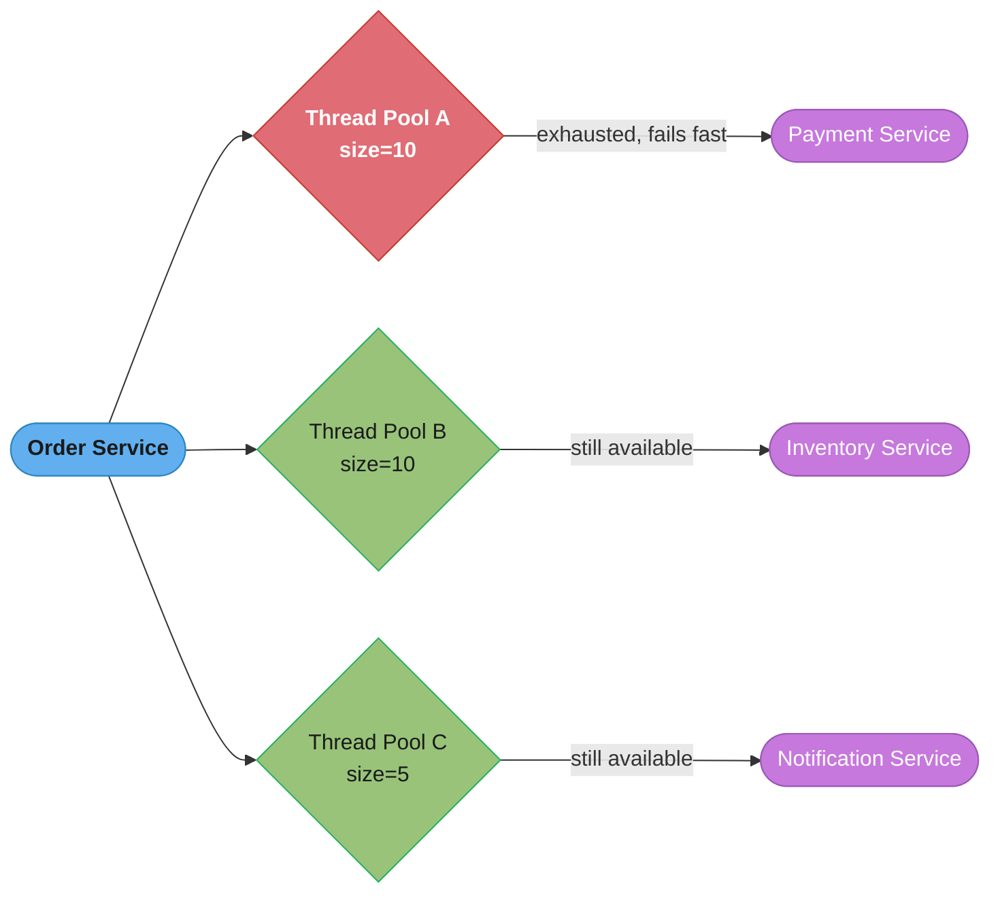
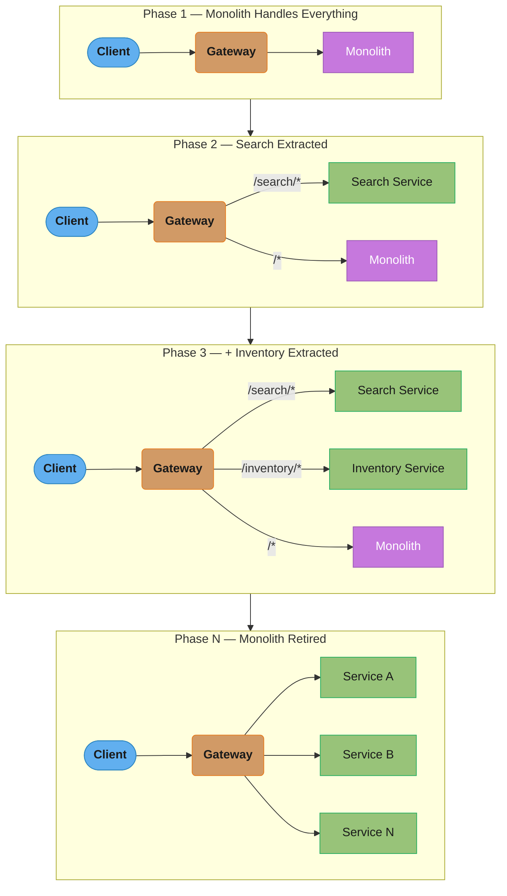
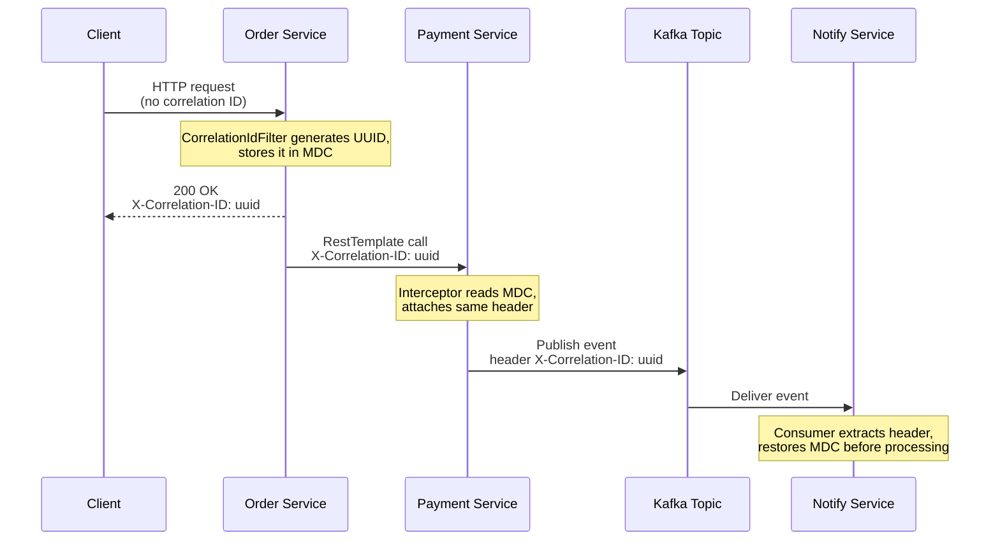
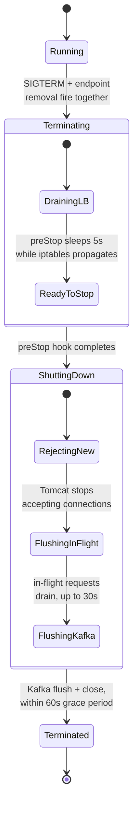

# Distributed System Operational Patterns

## 1. Concept Overview

Operational patterns are proven architectural solutions for managing the operational challenges of distributed systems: isolating failures through resource partitioning (bulkhead), attaching reusable infrastructure capabilities alongside services (sidecar, ambassador), preventing legacy systems from polluting clean domain models (anti-corruption layer), incrementally migrating monoliths (strangler fig), correlating requests across services for debugging (correlation ID), centralizing runtime configuration (distributed configuration), and controlling feature exposure (feature flags).

---

## 2. Intuition

A ship's hull is divided into watertight compartments (bulkheads) — if one compartment floods, the others are unaffected. In software, a bulkhead isolates thread pools or connection pools so one slow dependency cannot cascade to consume all resources. Similarly, a strangler fig tree grows around a host tree, eventually replacing it — the software pattern does the same with monolith code: new functionality grows around the old, gradually replacing it, until the old code is fully replaced and removed.

---

## 3. Core Principles

- **Fail fast and in isolation**: when a resource limit is hit, immediately return an error rather than queuing requests that will eventually time out
- **Incremental migration**: never do a big-bang rewrite; migrate functionality piece by piece with the ability to roll back each piece
- **Externalize all configuration**: no configuration in Docker images; configuration injected at runtime via environment variables or config stores
- **Trace every request**: every request from entry to exit should carry a correlation ID for cross-service debugging
- **Make feature exposure independent from deployment**: deploy code to production without exposing it to users; control exposure via feature flags

---

## 4. Types / Architectures / Strategies

**Bulkhead implementations**:
- Thread pool bulkhead: each downstream service has its own thread pool; exhausting one pool does not affect others
- Semaphore bulkhead: limit concurrent calls to a dependency via semaphore; lighter than thread pool but no thread isolation
- Process-level bulkhead: separate processes for different tenants or workloads; strongest isolation

**Strangler fig migration strategies**:
- Path-based routing: API gateway routes specific URL paths to new service, rest to monolith
- Feature-flag-based routing: same path, behavior toggled by feature flag
- Traffic weighting: 10% → 50% → 100% of traffic to new service while monitoring error rates

---

## 5. Architecture Diagrams

**Bulkhead Pattern — Thread Pool Isolation**


*Order Service isolates each downstream dependency behind its own thread pool. When Payment Service turns slow, only Thread Pool A (size 10) exhausts and fails fast — Inventory and Notification traffic keeps flowing through their separate pools (size 10 and size 5). Without this isolation, one slow dependency would exhaust all threads and cause a full outage.*

**Strangler Fig Migration**


*Each phase peels one more bounded context off the monolith and adds a new gateway route for it — Search first (read-only, lowest risk), then Inventory — until Phase N routes 100% of traffic to independently deployable services and the monolith is retired.*

---

## 6. How It Works — Detailed Mechanics

### Bulkhead with Resilience4j

```java
@Configuration
public class BulkheadConfig {

    @Bean
    public BulkheadRegistry bulkheadRegistry() {
        // Thread pool bulkhead for Payment service calls
        ThreadPoolBulkheadConfig paymentConfig = ThreadPoolBulkheadConfig.custom()
            .maxThreadPoolSize(10)
            .coreThreadPoolSize(5)
            .queueCapacity(20)              // queue 20 requests when all threads busy
            .keepAliveDuration(Duration.ofMillis(20))
            .build();

        // Thread pool bulkhead for Inventory service calls (separate pool)
        ThreadPoolBulkheadConfig inventoryConfig = ThreadPoolBulkheadConfig.custom()
            .maxThreadPoolSize(10)
            .coreThreadPoolSize(5)
            .queueCapacity(10)
            .build();

        return BulkheadRegistry.of(Map.of(
            "paymentService", paymentConfig,
            "inventoryService", inventoryConfig
        ));
    }
}

@Service
@RequiredArgsConstructor
public class OrderService {

    private final PaymentClient paymentClient;
    private final ThreadPoolBulkheadRegistry bulkheadRegistry;

    public CompletableFuture<PaymentResult> processPayment(PaymentRequest request) {
        ThreadPoolBulkhead paymentBulkhead = bulkheadRegistry.bulkhead("paymentService");

        return ThreadPoolBulkhead.decorateSupplier(paymentBulkhead,
            () -> paymentClient.charge(request))
            .get()  // CompletableFuture
            .exceptionally(ex -> {
                if (ex.getCause() instanceof BulkheadFullException) {
                    // Thread pool exhausted — fail fast, return degraded response
                    return PaymentResult.degraded("Payment service busy");
                }
                throw new RuntimeException(ex);
            });
    }
}
```

### Sidecar Pattern in Kubernetes

```yaml
# Pod with main container + log shipper sidecar
apiVersion: v1
kind: Pod
metadata:
  name: order-service-pod
spec:
  volumes:
    - name: shared-logs
      emptyDir: {}

  containers:
    # Main application container
    - name: order-service
      image: order-service:1.0.0
      ports:
        - containerPort: 8080
      volumeMounts:
        - name: shared-logs
          mountPath: /var/log/app

    # Sidecar: log shipping agent
    # Reads logs from shared volume, ships to centralized logging system
    - name: fluentd-sidecar
      image: fluent/fluentd:v1.16
      volumeMounts:
        - name: shared-logs
          mountPath: /var/log/app
          readOnly: true
      env:
        - name: FLUENTD_OUTPUT_HOST
          value: "elasticsearch.logging.svc.cluster.local"

    # Sidecar: config sync agent
    # Polls Vault/Consul for config changes, writes to shared volume
    - name: config-sync
      image: vault-agent:1.14
      volumeMounts:
        - name: app-config
          mountPath: /vault/secrets
```

### Anti-Corruption Layer (ACL)

```java
// Legacy system has its own model (LegacyOrderDTO with different field names)
// Our domain model should not be polluted with legacy concepts

// BROKEN: importing legacy model into domain
@Service
public class OrderService {
    public Order createOrder(LegacyOrderDTO legacyDto) {  // WRONG: legacy type in domain
        Order order = new Order();
        order.setClientId(legacyDto.getCust_no());   // legacy naming leaks in
        order.setAmount(legacyDto.getOrder_total_amount());
        return order;
    }
}

// FIX: ACL translates between models at the boundary
@Component
public class LegacyOrderAdapter {
    // Translates legacy model to our domain model
    public Order toDomain(LegacyOrderDTO legacyDto) {
        return Order.builder()
            .userId(translateCustomerId(legacyDto.getCust_no()))
            .totalAmount(Money.of(legacyDto.getOrder_total_amount(), legacyDto.getCurrency()))
            .items(legacyDto.getLine_items().stream()
                .map(this::toOrderItem)
                .collect(Collectors.toList()))
            .build();
    }

    private String translateCustomerId(String legacyCustNo) {
        // Map legacy format (CUST-00123) to our format (UUID)
        return customerMappingRepository.findNewIdByLegacyId(legacyCustNo);
    }
}

@Service
public class OrderService {
    private final LegacyOrderAdapter adapter;

    public Order createOrder(LegacyOrderDTO legacyDto) {
        Order order = adapter.toDomain(legacyDto); // ACL at boundary
        return orderRepository.save(order);
    }
}
```

### Correlation ID Propagation

```java
// Filter: generate or extract correlation ID at service entry point
@Component
@Order(Ordered.HIGHEST_PRECEDENCE)
public class CorrelationIdFilter extends OncePerRequestFilter {

    public static final String CORRELATION_ID_HEADER = "X-Correlation-ID";
    public static final String REQUEST_ID_KEY = "requestId";
    public static final String SERVICE_NAME_KEY = "serviceName";

    @Value("${spring.application.name}")
    private String serviceName;

    @Override
    protected void doFilterInternal(HttpServletRequest request,
                                    HttpServletResponse response,
                                    FilterChain chain) throws ServletException, IOException {
        String correlationId = Optional.ofNullable(request.getHeader(CORRELATION_ID_HEADER))
            .filter(h -> !h.isBlank())
            .orElse(UUID.randomUUID().toString());

        MDC.put(REQUEST_ID_KEY, correlationId);
        MDC.put(SERVICE_NAME_KEY, serviceName);
        response.addHeader(CORRELATION_ID_HEADER, correlationId);

        try {
            chain.doFilter(request, response);
        } finally {
            MDC.clear();
        }
    }
}

// Propagate to downstream HTTP calls via RestTemplate/WebClient interceptor
@Bean
public RestTemplate restTemplate() {
    RestTemplate template = new RestTemplate();
    template.getInterceptors().add((request, body, execution) -> {
        String correlationId = MDC.get(CorrelationIdFilter.REQUEST_ID_KEY);
        if (correlationId != null) {
            request.getHeaders().add(CorrelationIdFilter.CORRELATION_ID_HEADER, correlationId);
        }
        return execution.execute(request, body);
    });
    return template;
}

// Propagate to Kafka messages
@Bean
public ProducerFactory<String, String> producerFactory() {
    return new DefaultKafkaProducerFactory<>(producerProps()) {
        @Override
        public Producer<String, String> createProducer() {
            return new Producer<>() {
                public Future<RecordMetadata> send(ProducerRecord<String, String> record) {
                    String correlationId = MDC.get(CorrelationIdFilter.REQUEST_ID_KEY);
                    if (correlationId != null) {
                        record.headers().add(
                            CorrelationIdFilter.CORRELATION_ID_HEADER,
                            correlationId.getBytes()
                        );
                    }
                    return super.send(record);
                }
            };
        }
    };
}
```

One correlation ID must survive the trip from the entry filter through an outbound HTTP call to an async Kafka hop:


*The filter generates the ID once and echoes it back to the client; the RestTemplate interceptor forwards it on the synchronous HTTP hop, and the Kafka header carries it across the asynchronous hop so the consumer can restore it into MDC before processing — the same ID traces the whole request across both sync and async boundaries.*

### Spring Cloud Config Server

```yaml
# Config server application.yaml
spring:
  application:
    name: config-server
  cloud:
    config:
      server:
        git:
          uri: https://github.com/company/config-repo
          search-paths: "{application}/{profile}"
          clone-on-start: true
          timeout: 4

# Client application.yaml
spring:
  config:
    import: optional:configserver:http://config-server:8888
  cloud:
    config:
      label: main
      fail-fast: true
      retry:
        max-attempts: 6
        initial-interval: 1000

# @RefreshScope — beans refreshed on /actuator/refresh POST
@RefreshScope
@Component
public class FeatureConfig {
    @Value("${feature.new-checkout-flow.enabled:false}")
    private boolean newCheckoutFlowEnabled;
}
```

### Feature Flags with Unleash

```java
@Service
@RequiredArgsConstructor
public class CheckoutService {

    private final Unleash unleash;
    private final ClassicCheckoutHandler classicHandler;
    private final NewCheckoutHandler newHandler;

    public CheckoutResult checkout(CheckoutRequest request) {
        // Context allows user-based, percentage-based, or environment-based toggles
        UnleashContext context = UnleashContext.builder()
            .userId(request.getUserId())
            .addProperty("region", request.getRegion())
            .build();

        if (unleash.isEnabled("new-checkout-flow", context)) {
            return newHandler.process(request);    // gradual rollout
        }
        return classicHandler.process(request);   // fallback
    }
}
```

### Graceful Shutdown

```java
// Spring Boot 2.3+ — enable graceful shutdown
// server.shutdown=graceful
// spring.lifecycle.timeout-per-shutdown-phase=30s

@Component
public class GracefulShutdownHandler {

    private final KafkaProducer<?, ?> kafkaProducer;

    // Called during Spring context close (SIGTERM received)
    @PreDestroy
    public void shutdown() {
        log.info("Graceful shutdown initiated");
        // Flush all pending Kafka messages (wait up to 5s)
        kafkaProducer.flush();
        kafkaProducer.close(Duration.ofSeconds(5));
        log.info("Kafka producer closed");
        // Spring Boot handles HTTP: stops accepting new requests,
        // waits for in-flight requests to complete (up to timeout-per-shutdown-phase)
    }
}
```

```yaml
# Kubernetes: allow 30s for graceful shutdown
spec:
  template:
    spec:
      terminationGracePeriodSeconds: 60  # must be > Spring's timeout-per-shutdown-phase
      containers:
        - lifecycle:
            preStop:
              exec:
                command: ["/bin/sleep", "5"]  # sleep 5s before SIGTERM
                # Kubernetes stops sending traffic immediately when pod is terminating
                # but iptables rules may take a few seconds to propagate
                # The preStop sleep ensures no in-flight requests are dropped
```

SIGTERM and endpoint removal fire at the same instant, which is exactly why the preStop sleep is needed:


*Kubernetes sends SIGTERM and removes the pod from Service endpoints in parallel, so the preStop sleep is what buys time for iptables to finish propagating before the process is signaled. Only after preStop completes does Spring's graceful shutdown reject new connections, drain in-flight requests, and flush the Kafka producer — all inside the 60s `terminationGracePeriodSeconds` budget.*

---

## 7. Real-World Examples

- **Netflix**: bulkhead pattern is foundational to their Hystrix library (now deprecated in favor of Resilience4j); separate thread pools for each downstream service dependency
- **Amazon**: strangler fig pattern used for every major service extraction from their monolith over 10 years; each service extracted independently with traffic gradually shifted
- **Spotify**: feature flags used for every new feature; deploy to 100% of users with flag off, gradually enable; emergency kill switch for any feature
- **LinkedIn**: anti-corruption layer between their internal domain models and external data feeds (member data from multiple acquisition systems); prevents legacy schemas from polluting core domain

---

## 8. Tradeoffs

| Pattern | Pros | Cons |
|---------|------|------|
| Bulkhead | Fault isolation, prevents cascade | More thread pools = more memory overhead |
| Sidecar | Separation of concerns, no app changes | Extra container, coordination complexity |
| ACL | Clean domain model | Translation overhead, mapping maintenance |
| Strangler fig | Zero downtime migration | Dual maintenance period, routing complexity |
| Feature flags | Decouple deploy from release | Flag debt, testing matrix explosion |
| Distributed config | Centralized, dynamic | Config server becomes critical dependency |

---

## 9. When to Use / When NOT to Use

Use bulkheads when a service has multiple downstream dependencies with different SLAs — prevents the slowest dependency from cascading. Use sidecar for operational concerns (logging, tracing, config sync) that are cross-cutting and should not require code changes. Use ACL when integrating with legacy systems or third-party APIs that have different domain models. Use strangler fig for any migration from a monolith — never do a big-bang rewrite.

Do NOT use too many feature flags simultaneously — each flag doubles the code paths to test, and stale flags become technical debt. Clean up flags after full rollout. Do NOT use distributed config for security-sensitive values without encryption — use HashiCorp Vault for secrets.

---

## 10. Common Pitfalls

**Forgetting preStop hook in Kubernetes**: Without a preStop sleep, Kubernetes sends SIGTERM at the same time as removing the pod from Service endpoints. iptables rules take 1-2 seconds to propagate. During this window, the load balancer continues routing traffic to the terminating pod, which immediately closes connections. Active requests get connection reset errors. Fix: add `preStop: sleep 5` to allow iptables to propagate before the process starts shutting down.

**Strangler fig with shared database**: A team extracted the Inventory service but left it reading from the monolith's database to avoid data migration work. Now two services share one DB — the worst anti-pattern. When the monolith does a schema migration, the Inventory service breaks. Fix: data must move with the service; use CDC (Debezium) to sync data from monolith DB to inventory DB during the transition period, then cut over.

**Feature flag explosion**: A team accumulated 200 active feature flags over 2 years. Testing each release required checking all combinations. Some flags controlled other flags. A wrong flag combination caused a production incident. Fix: treat each feature flag as technical debt; set expiry dates on flags at creation time; automate removal of flags that have been 100% enabled for > 30 days.

**Config server as SPOF**: The config server went down during a deployment. All services that tried to start could not fetch their configuration. A bad actor cascaded into all services failing to start. Fix: (1) enable `spring.cloud.config.fail-fast=false` for non-critical config, (2) enable config caching on the client (if server unreachable, use last-known-good config), (3) run config server in HA mode with multiple replicas.

---

## 11. Technologies & Tools

| Tool | Purpose |
|------|---------|
| Resilience4j | Circuit breaker, bulkhead, retry, rate limiter |
| Spring Cloud Config | Git-backed centralized configuration server |
| HashiCorp Vault | Secret management with dynamic secrets |
| Kubernetes ConfigMap/Secret | Container-native configuration injection |
| Unleash | Open-source feature flag server |
| LaunchDarkly | Commercial feature flag platform |
| Spring Cloud Gateway | API gateway for strangler fig routing |
| Consul | Service discovery + KV store + distributed config |

---

## 12. Interview Questions with Answers

**Q: What is the bulkhead pattern and how does it differ from a circuit breaker?**
The bulkhead pattern isolates resources to prevent a failure in one area from exhausting resources needed by other areas. In software, this means separate thread pools or connection pools per downstream service. If one dependency is slow, only its thread pool fills up; other dependencies remain available. A circuit breaker monitors failure rates for a specific dependency and opens (stops sending requests) when the failure rate exceeds a threshold. They complement each other: circuit breakers detect and stop failures, bulkheads limit the blast radius when failures do occur. Use both: circuit breaker for fast failure detection, bulkhead for resource isolation.

**Q: What is the strangler fig pattern and what are the key implementation steps?**
The strangler fig pattern incrementally replaces a monolith by building new functionality as separate services and routing traffic to them, gradually strangling the monolith. Steps: (1) introduce a facade (API gateway or reverse proxy) in front of the monolith — all traffic routes through it to the monolith initially; (2) identify the first bounded context to extract (choose high-value, low-coupling); (3) build the new service independently with its own data store; (4) route specific paths/features to the new service via the gateway; (5) migrate data using CDC sync during the parallel-run period; (6) cut over and decommission monolith code. Critical: each step must be independently rollbackable (change routing back at the gateway).

**Q: What is an anti-corruption layer (ACL) and when do you need it?**
An ACL is a translation layer that converts between a legacy system's (or external system's) data model and your internal domain model. You need it when integrating with systems that have different naming conventions, data formats, or domain concepts that would pollute your clean domain if imported directly. Without an ACL, legacy field names (`cust_no`, `order_total_amount`) leak into your domain classes, and future changes to the legacy system require changes throughout your codebase. The ACL encapsulates all translation logic in one place; your domain never imports legacy types.

**Q: How do you propagate correlation IDs across service boundaries including async messaging?**
HTTP: implement `OncePerRequestFilter` that reads `X-Correlation-ID` from incoming request (or generates a UUID if absent), puts it in MDC, and adds it to the outgoing response header. Inject the correlation ID into outgoing HTTP calls via RestTemplate interceptor or WebClient filter. Kafka: when publishing, add the correlation ID as a Kafka message header. When consuming, extract the header and put it in MDC before processing. Async tasks: capture `MDC.getCopyOfContextMap()` before submitting to an executor, restore it at the start of the task. The key constraint: the same correlation ID must flow through the entire request path across all services.

**Q: What is the difference between sidecar and ambassador patterns?**
Both patterns deploy a helper container alongside the main application, but they serve different purposes. The sidecar extends or enhances the main application's capabilities: log shipping, config sync, distributed tracing agent, service mesh proxy. The sidecar is specific to this application's infrastructure needs. The ambassador acts as a proxy for outbound connections from the main application: it handles retry logic, circuit breaking, and service discovery on behalf of the main container. Ambassador is useful when the main container is a legacy application that cannot be modified — the ambassador adds modern networking capabilities transparently. In practice, Envoy in a service mesh acts as both sidecar (receives inbound) and ambassador (handles outbound).

**Q: What is graceful shutdown and why is the preStop hook important in Kubernetes?**
Graceful shutdown ensures that when a pod is terminated, it completes in-flight requests before shutting down. In Spring Boot, `server.shutdown=graceful` stops the Tomcat acceptor from accepting new connections and waits for active requests to complete (up to `timeout-per-shutdown-phase`). The Kubernetes preStop hook is important because Kubernetes sends SIGTERM to the container and simultaneously removes the pod from Service endpoints. iptables rules take 1-5 seconds to propagate across all nodes. Without a preStop sleep (typically 5-10 seconds), traffic continues arriving at the pod from load balancers that haven't yet received the endpoint update, resulting in connection reset errors for in-flight requests.

**Q: How do you implement feature flags safely at scale?**
Use a dedicated feature flag service (Unleash, LaunchDarkly) that evaluates flags server-side based on context (user ID, percentage, environment). The application makes an SDK call that evaluates the flag locally against downloaded rules — no network call per request. Implement per-user or percentage-based targeting for gradual rollouts. Each flag must have: an owner, a description, an expected removal date, and a default value for when the flag service is unavailable. Use flags for dark launches (deployed but off), canary releases (10% of users), and kill switches (disable a misbehaving feature without a deployment). Clean up flags after full rollout — stale flags are technical debt.

**Q: Why can correlation IDs leak between messages inside a Kafka consumer's poll loop?**
MDC is a ThreadLocal, and Kafka consumer threads are reused across every polled record, so a stale correlation ID persists into the next message unless explicitly cleared. The listener container thread pulls a batch and processes records sequentially on the same thread; if the consumer sets `MDC.put("requestId", id)` at the start of processing but only calls `MDC.clear()` in a try/finally around the whole poll loop rather than around each record, an exception thrown mid-batch skips the clear and the remaining records inherit the wrong correlation ID. A realistic incident pattern: a batch of 500 records where record 12 throws, the per-record finally block never runs, and the remaining 488 records log under record 12's correlation ID, making the trace graph show one giant fan-out instead of 488 independent traces. Fix: wrap `MDC.put`/`MDC.clear()` around each individual record inside the `@KafkaListener` method, not around the whole batch, and always clear in a finally block — treat MDC hygiene per-message the same way the `CorrelationIdFilter` in §6 treats it per-HTTP-request.

**Q: How does Spring Cloud Config's @RefreshScope actually refresh a running bean without a restart?**
`@RefreshScope` wraps the bean in a proxy that Spring destroys and recreates on next access after a refresh event, rather than mutating the live instance in place. Calling `POST /actuator/refresh` (or a Spring Cloud Bus message broadcast to `/actuator/bus-refresh` across all instances) triggers a `RefreshScopeRefreshedEvent`; the proxy's target bean is discarded and Spring lazily reconstructs it from the environment on the next method call, re-reading whatever `@Value` or `@ConfigurationProperties` fields it declares. This only refreshes beans explicitly annotated `@RefreshScope` — a `@Value` field on a plain `@Component` is bound once at startup and never changes, which is the single most common reason a "config refresh" silently does nothing. Prefer Spring Cloud Bus over calling `/actuator/refresh` on every instance individually — at 50+ instances, sequential curl loops take minutes and leave the fleet in an inconsistent state mid-rollout.

**Q: Why is it dangerous to put @RefreshScope directly on a DataSource bean?**
Refreshing a `@RefreshScope` DataSource destroys the underlying connection pool and recreates it, silently dropping every in-flight connection and query on that pool. HikariCP's DataSource is a heavyweight object holding live TCP connections, prepared statement caches, and a background housekeeper thread; when the refresh proxy discards it, any transaction mid-flight on a borrowed connection gets an abrupt SQLException, and a service handling 200 requests per second can see hundreds of failed transactions in the single second the pool is torn down and rebuilt. The safer pattern is to scope only lightweight values — feature flags, timeout thresholds, log levels — with `@RefreshScope`, and rotate database credentials via a short-lived token mechanism (IAM database authentication, Vault dynamic secrets with a renewal thread) instead of a config refresh. If a pool genuinely must be rebuilt for a credential change, roll it one instance at a time behind the load balancer, never via a fleet-wide broadcast.

**Q: What is a feature flag kill switch and how does it differ from a gradual-rollout flag?**
A kill switch is a feature flag whose sole purpose is fast, one-way disablement of a misbehaving feature, not staged exposure. A rollout flag is designed to move gradually from 0% to 100% over days or weeks with monitoring gates in between, and it is expected to be deleted once the feature is fully live; a kill switch is designed to stay in the codebase indefinitely, defaults to enabled, and its only job is to let an on-call engineer flip it to off in seconds during an incident without a deployment. The critical implementation detail: a kill switch must be evaluated on every request with minimal caching, since Unleash SDKs poll for updated rules every 15 seconds by default, and a kill switch that takes 5 minutes to propagate defeats the purpose during an active incident. Wire kill switches into the same alerting dashboards as circuit breakers so the on-call runbook lists the flag name next to the metric it protects.

**Q: How do you prevent feature flag debt before it reaches the 200-flag state described in §10?**
Treat every flag as a ticket with a mandatory expiry date, and fail the audit if a flag survives past that date without an explicit decision to keep or remove it. At creation time, require an owner, a removal date typically 30-60 days after 100% rollout, and a linked ticket; a nightly job can query the flag service's API and open a ticket automatically for any flag that has sat at 100% or 0% for more than 30 days. The testing-matrix explosion the pitfall describes — 200 flags, some controlling other flags — is best prevented structurally: forbid flags that gate other flags, and cap the number of simultaneously active non-kill-switch flags at roughly 20-30 per service so the combinatorial test surface stays tractable. Automating removal, a bot that deletes the flag and its dead code path once telemetry shows zero reads at the old value, is more reliable than relying on engineers to remember cleanup.

**Q: What is the precise sequence of events when Kubernetes and Spring Boot coordinate a graceful shutdown?**
Kubernetes and Spring Boot run six ordered steps: SIGTERM plus endpoint removal, preStop sleep, connection-accept stop, in-flight drain, Kafka flush, then JVM exit. The subtlety is that step order matters more than any individual timeout: if the Kafka producer's `flush()` call (bounded to 5 seconds in the `@PreDestroy` handler in §6) ran before Tomcat finished draining in-flight HTTP requests, a request that itself publishes to Kafka could be cut off mid-handler by a producer that is already closing, throwing an IllegalStateException instead of publishing the event. The correct order — readiness fails first to stop new traffic, then HTTP drain, then background resource shutdown last — is why `spring.lifecycle.timeout-per-shutdown-phase` must be shorter than `terminationGracePeriodSeconds` minus the preStop sleep: 60s total minus 5s preStop leaves 55s, so a 30s Spring timeout leaves 25s of margin for the Kafka flush and any custom `@PreDestroy` hooks. Getting this budget wrong is the difference between a clean shutdown and a burst of errors on every deploy.

**Q: When should cross-cutting infrastructure logic live in a sidecar instead of a shared library?**
Choose a sidecar when the concern must deploy on its own schedule or span multiple languages, and a library when it needs in-process, sub-millisecond access to app state. A shared library, a Java JAR for MDC correlation-ID filters, say, is compiled into the application, so every service must bump its dependency version and redeploy to pick up a fix — with 15 teams on one codebase, as in the case study in §14, that is 15 separate deploys for one logging bug fix. A sidecar (the Fluentd or config-sync containers in §6) ships as its own container image with its own release cadence and can be upgraded fleet-wide by bumping one image tag, no application code touched, and it works identically whether the main container is Java, Go, or Python. The cost is resource overhead — a sidecar reserves its own CPU and memory requests per pod, multiplied across the whole fleet — so infrastructure plumbing goes in a sidecar while anything needing shared in-process data structures stays a library.

**Q: What is the sizing formula for a thread pool bulkhead, and why does under-sizing cause false failures?**
Size a thread pool bulkhead to expected peak concurrent calls to that dependency plus roughly 20 percent headroom, not to the calling service's total request rate. The Resilience4j configuration in §6 sets `maxThreadPoolSize=10` and `coreThreadPoolSize=5` for the payment bulkhead with `queueCapacity=20`, meaning at most 30 payment calls can be in flight or queued before `BulkheadFullException` fires, regardless of how much spare JVM capacity exists for other work. If real concurrent demand for Payment Service peaks at 12 rather than 10, the bulkhead rejects healthy requests as if Payment Service itself were failing, which surfaces in dashboards as a self-inflicted availability drop rather than a true dependency outage. The fix is measuring actual peak concurrency from production traces rather than guessing, sizing to that peak plus 20% headroom, and alerting separately on bulkhead-full rejections versus real downstream errors.

**Q: When should you use a semaphore bulkhead instead of a thread pool bulkhead?**
Use a semaphore bulkhead when call latency is low and you just want to cap concurrency cheaply, and a thread pool bulkhead when you need true isolation from a slow dependency. A semaphore bulkhead wraps the call with `Semaphore.tryAcquire()` on the caller's own thread — no new thread is created, so overhead is a handful of nanoseconds per call, but a hanging call still occupies one of the caller's own request-handling threads until it times out. A thread pool bulkhead submits the call to a dedicated executor, so if Payment Service hangs for 30 seconds, only the payment pool's threads block; the caller's own request thread returns immediately with a `CompletableFuture` and stays free to serve other requests. For a service on Java 21 virtual threads, semaphore bulkheads are usually enough since a stuck virtual thread costs kilobytes, not a full platform-thread stack; for a traditional 200-thread Tomcat pool, the extra hop of a thread pool bulkhead is worth it to protect that limited budget.

---

## 13. Best Practices

- Size thread pool bulkheads based on expected concurrency per dependency + 20% headroom
- Use separate circuit breakers and bulkheads per downstream service, not one shared instance
- Document strangler fig migration with a public decision log — capture why each service was extracted when
- Run preStop hooks for at least `terminationGracePeriodSeconds / 2` to allow clean draining
- Version all configuration changes in Git (Spring Cloud Config is backed by Git for audit trail)
- Set feature flag defaults to the safe/off state — flag service outage should not enable incomplete features
- Use gradual rollout percentages with monitoring gates: pause at 1%, 10%, 50% to check error rates
- Add ACL integration tests against a WireMock stub of the legacy system — validate translation logic

---

## 14. Case Study

**Problem**: An e-commerce monolith was causing deployment bottlenecks — 15 teams modified the same codebase, deployments took 3 hours, a bug in one domain (search) required redeploying the entire platform including payments and checkout.

**Strangler fig execution**:
1. Introduced Spring Cloud Gateway in front of monolith (zero functional change, one routing rule: all traffic → monolith)
2. Extracted Search service first (no DB writes, read-only, lowest risk): routed `/search/**` to new Elasticsearch-backed service after 2 weeks parallel run; monolith search code deleted
3. Extracted Inventory service: ran Debezium CDC sync from monolith DB to inventory DB for 4 weeks; validated consistency; cut over to inventory service for write operations; DB sync stopped
4. Added per-service deployment pipelines; Search and Inventory now deploy independently in 20 minutes
5. Continued extracting 2 services per quarter

**After 12 months**: 6 services extracted, monolith reduced to 40% of original size. Deployment frequency for extracted services increased from 2x/month to 10x/week. Mean time to recovery (MTTR) for incidents in extracted services decreased from 2 hours to 20 minutes.
