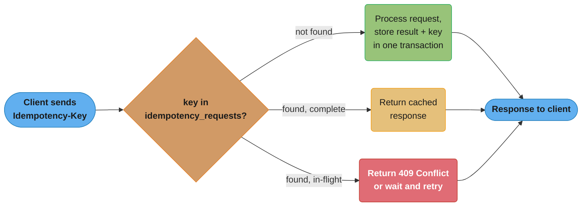
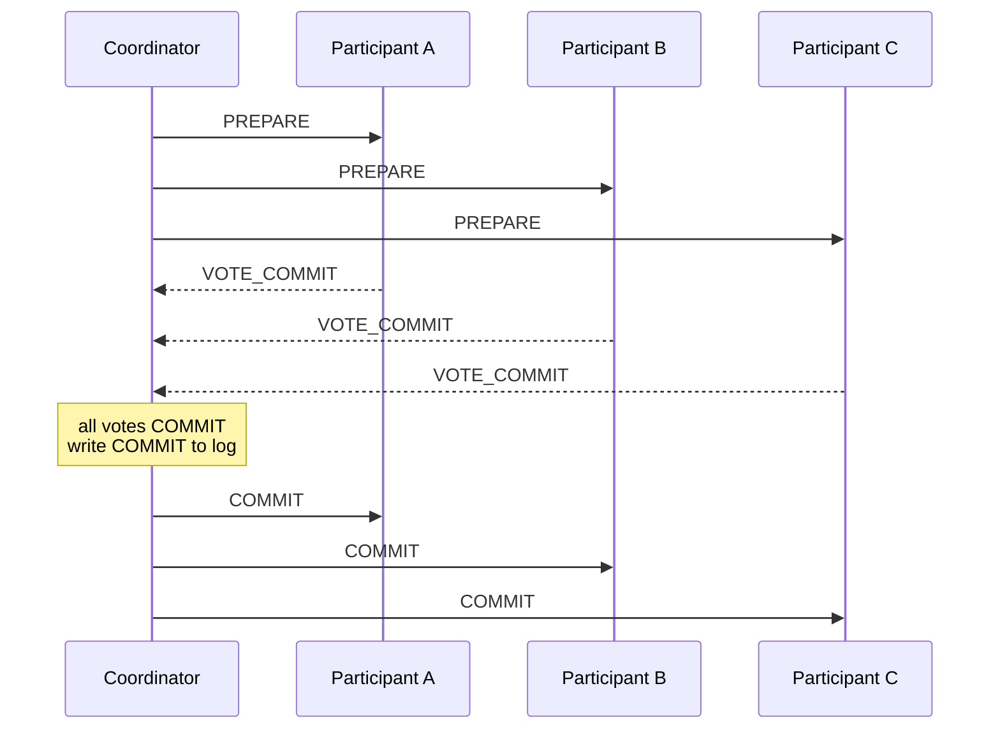
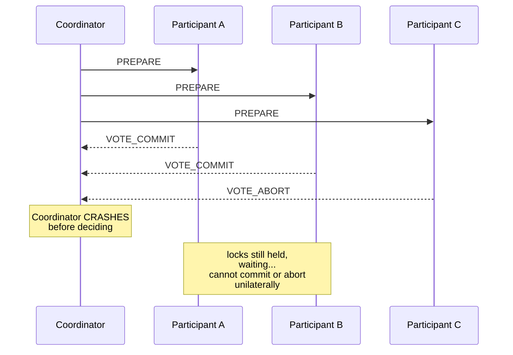
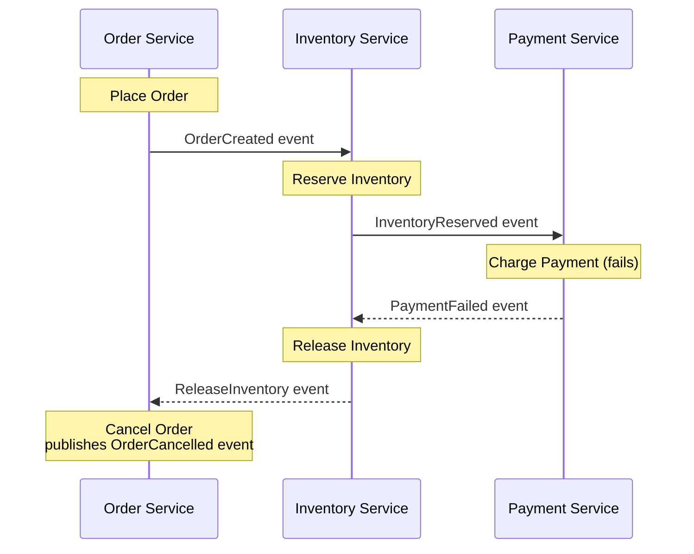
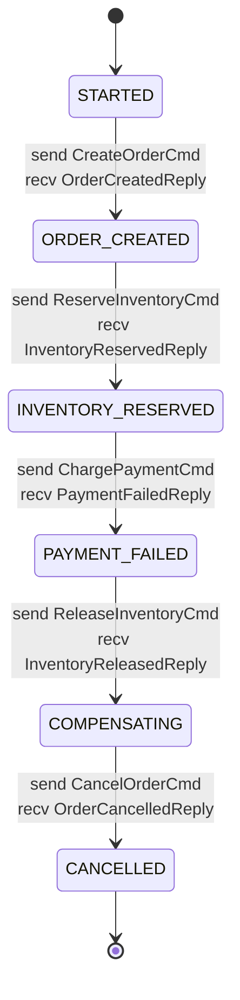
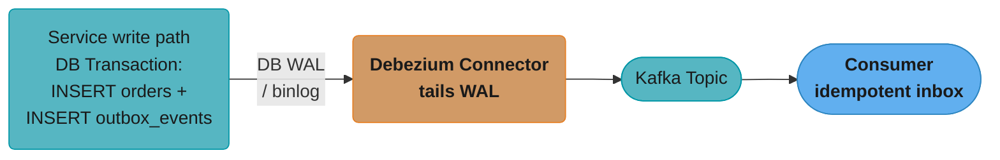
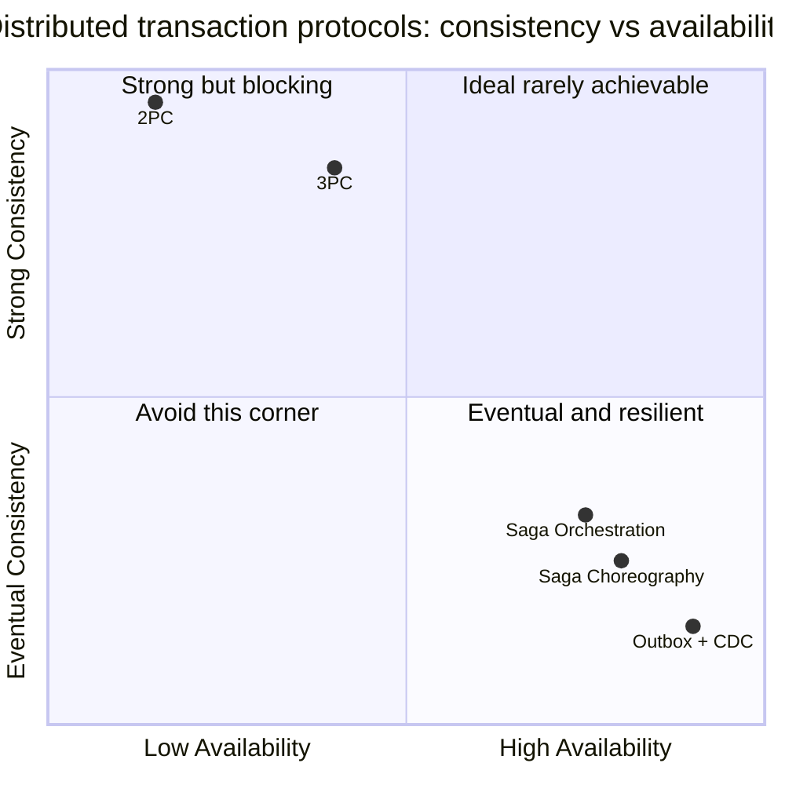
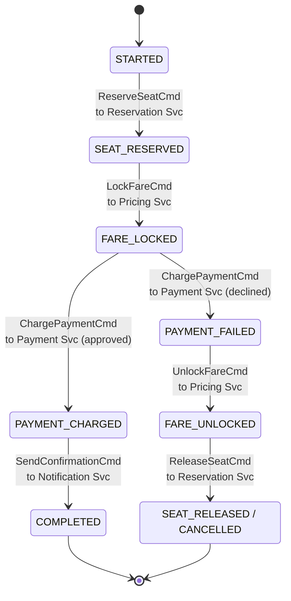

# Distributed Transactions and Consistency

**Cross-references:**
- [Spring Transactions](../../spring/spring_transactions/README.md)
- [Kafka Deep Dive](../kafka_deep_dive/README.md)
- [Messaging Patterns](../messaging_patterns/README.md)
- [Event-Driven Fundamentals](../event_driven_fundamentals/README.md)

---

## 1. Concept Overview

Distributed transactions coordinate data mutations that span multiple databases, services, or nodes, ensuring that a logical unit of work either fully completes or fully rolls back — even when any participant can fail independently.

In a monolith backed by a single relational database, the database engine handles ACID atomicity. Once a system is decomposed into microservices, each service owns its own datastore. A business operation such as "debit account A and credit account B across two different services" can no longer rely on a single database transaction. Network partitions, node crashes, and message loss mean that some participants may commit while others do not, leaving the system in an inconsistent state.

The core tension is: strong consistency (all nodes agree immediately) conflicts with availability and partition tolerance (CAP theorem). Distributed transaction protocols attempt to resolve this tension with varying tradeoffs between correctness guarantees, availability, and complexity.

Key concerns:
- **Atomicity across services**: either all local transactions commit or all are compensated.
- **Durability of intermediate state**: surviving coordinator crashes without losing intent.
- **Eventual vs. immediate consistency**: tolerating temporary inconsistency in exchange for availability.
- **Idempotency**: compensating transactions and message consumers must be safe to re-execute.

---

## 2. Intuition

**One-line analogy**: A distributed transaction is like a multi-party contract signing — all parties must sign before the contract is valid, but if one party's pen runs dry mid-process, you need a clear procedure to either get everyone to sign again or to legally void the partial signatures already collected.

**Mental model**: Imagine a bank wire transfer spanning three correspondent banks. Each bank applies a hold on funds, confirms the hold to a central clearing coordinator, and only releases/moves money after every bank confirms. If one bank's network drops after applying the hold but before confirming, the coordinator must decide: wait indefinitely (blocking) or adopt a timeout-and-abort policy with compensating reversals.

**Why it matters**: Payment systems, order fulfillment, inventory reservation, and any workflow touching more than one bounded context require a strategy here. Getting it wrong means double charges, phantom inventory, or permanently inconsistent ledgers.

**Key insight**: No distributed transaction protocol is free. The goal is to pick the protocol whose failure modes are acceptable for the business domain — and to design compensating actions that are idempotent, retryable, and "approximately correct" when perfect reversal is impossible.

---

## 3. Core Principles

**1. Atomicity at the saga level, not the DB level**
In microservices, you abandon 2-phase commit across service boundaries and instead sequence local ACID transactions with explicit compensation logic.

**2. Idempotency is non-negotiable**
Every step — forward and compensating — must be safe to apply multiple times. Message delivery guarantees are at-least-once; if step 3 is retried, it must not double-charge a customer.

**3. Compensating transactions are first-class design artifacts**
Compensation is not a rollback. A payment already sent to an external processor cannot be "un-sent". Compensation issues a refund — a new forward operation that semantically reverses the effect. Designs that do not account for compensation complexity fail in production.

**4. Transactional outbox over dual writes**
Never write to a database AND publish to a message broker in the same code path without the outbox pattern. Any crash between the two operations produces divergence: data committed to DB but event never published, or event published but DB write rolled back.

**5. Exactly-once is a myth at the transport layer; achieve it with idempotent consumers**
Brokers offer at-most-once (fire-and-forget) or at-least-once (acknowledged delivery with retry). Exactly-once semantics at the application layer are achieved by storing a deduplication/idempotency key alongside the processing result in a transactional write.

**6. Eventual consistency is a contract, not an accident**
Services that tolerate eventual consistency must communicate this clearly to users: "Your order is being processed" rather than "Your order is confirmed." Read-your-writes, monotonic reads, and causal consistency are progressively stronger guarantees that may require sticky sessions, version vectors, or read-from-primary routing.

---

## 4. Types / Architectures / Strategies

### 4.1 Two-Phase Commit (2PC)

The canonical distributed commit protocol.

**Phase 1 — Prepare (Voting phase)**
The coordinator sends a `PREPARE` message to all participants. Each participant:
1. Acquires all necessary locks.
2. Writes an undo log entry (so it can abort if needed).
3. Writes a redo log entry (so it can commit if instructed).
4. Replies `VOTE_COMMIT` or `VOTE_ABORT`.

**Phase 2 — Commit/Abort (Decision phase)**
- If all votes are `VOTE_COMMIT`: coordinator writes `COMMIT` to its log, sends `COMMIT` to all participants, participants release locks.
- If any vote is `VOTE_ABORT`: coordinator sends `ABORT`, participants roll back using undo logs and release locks.

**Coordinator crash scenarios**

| Crash point | Effect |
|---|---|
| Before sending PREPARE | Participants never voted; safe abort on timeout |
| After some PREPAREs sent, before all | Some participants locked and waiting; coordinator recovers and re-sends or aborts |
| After all votes received, before writing COMMIT to log | Recovery: coordinator sees no decision log; aborts the transaction |
| After writing COMMIT to log, before sending to participants | Recovery: coordinator re-sends COMMIT to all participants (idempotent) |
| After sending COMMIT to some but not all | Recovery: re-sends to remaining participants; they apply COMMIT idempotently |

**The blocking problem**
A participant that voted `VOTE_COMMIT` cannot unilaterally abort. It holds locks and waits. If the coordinator crashes after the prepare phase, the participant is blocked until the coordinator recovers. In a system with hundreds of participants and an SLA of 100ms, a coordinator failure can hold locks for minutes, causing cascading timeouts. This is why 2PC is rarely acceptable in microservices.

**Why 2PC is rarely used in microservices**
- Participants hold locks across a network round-trip (2× latency minimum).
- Coordinator is a single point of failure.
- Recovery requires the coordinator log to be durable and accessible.
- Heterogeneous services (different databases, messaging systems) rarely expose the XA interface needed for 2PC.
- P in CAP: 2PC is not partition-tolerant; if a participant cannot reach the coordinator, it blocks.

**Read it like this.** "Every participant must hold its locks for the full width of two network round trips, because it cannot know the outcome until the slowest participant has voted and the coordinator has told everyone."

The "2× latency minimum" line is doing a lot of work. It is not the coordinator's latency budget that hurts — it is that the number becomes the *lock hold time* on every row the transaction touched, and lock hold time is the denominator of contended throughput.

| Symbol | What it is |
|--------|------------|
| RTT | One network round trip between coordinator and a participant |
| Phase 1 | PREPARE out, votes back. One RTT, paced by the *slowest* participant |
| Phase 2 | COMMIT/ABORT out, acks back. One more RTT |
| `2 × RTT` | Minimum lock hold time at every participant. The number that matters |
| Blocking window | If the coordinator dies after phase 1, lock hold becomes "until coordinator recovery" — unbounded |
| Contended throughput | `1 / lock hold time` — serial transactions per second on any single hot row |

**Walk one example.** A 10 ms RTT between services, against the 100 ms SLA named above:

```
  Phase 1 (PREPARE + votes)     10 ms
  Phase 2 (COMMIT + acks)       10 ms
  ------------------------------------
  Lock hold per participant     20 ms      vs ~1 ms for a purely local transaction  = 20x

  Against a 100 ms SLA:  100 - 20 = 80 ms left for all business logic

  Throughput on one contended row:
    local  1 ms hold  ->  1000 / 1   = 1,000 txn/s
    2PC   20 ms hold  ->  1000 / 20  =    50 txn/s      20x collapse

  Coordinator crashes after phase 1, recovers in 5 minutes:
    lock hold = 300,000 ms  =  15,000x the normal hold
```

Note that the participant count barely moves the first number — 3 participants or 100, it is
still two round trips, paced by the slowest voter. What the participant count changes is the
*probability* of the last row: every additional participant is another process that can vanish
mid-protocol, and another set of locks frozen when the coordinator does. The 20 ms is the
advertised price; the 300,000 ms is the one that ends up in the incident review, and no timeout
setting on the participant side can shorten it, because a participant that voted `VOTE_COMMIT`
has surrendered its right to decide.


### 4.2 Three-Phase Commit (3PC)

Adds a `PRE-COMMIT` phase between prepare and commit to allow participants to determine the coordinator's decision even if it crashes.

**Phases**: `PREPARE` → `PRE-COMMIT` (ack that coordinator decided COMMIT) → `COMMIT`

**What it solves**: In 2PC, a participant in the prepared state cannot distinguish between "coordinator crashed before deciding" and "coordinator decided ABORT". In 3PC, if a participant has received `PRE-COMMIT`, it knows the coordinator decided COMMIT, so it can complete the commit independently.

**What it does NOT solve**: 3PC assumes a synchronous network with bounded message delays. In the presence of network partitions, two groups of participants can independently decide different outcomes (split-brain). 3PC is therefore not partition-tolerant and is rarely used in practice.

### 4.3 Saga Pattern

A saga is a sequence of local transactions. Each local transaction updates a single service's database and publishes an event or sends a command. If step N fails, steps N-1 through 1 are compensated in reverse order.

**Choreography-based saga**
- No central coordinator.
- Each service listens for events and publishes events.
- Service A completes its local transaction → publishes `OrderCreated` → Service B listens → completes its work → publishes `InventoryReserved` → Service C listens, etc.
- Compensation: Service C publishes `PaymentFailed` → Service B listens and publishes `InventoryReleased` → Service A listens and publishes `OrderCancelled`.

Pros: loose coupling, no single point of failure.
Cons: difficult to track overall saga state, cyclic event dependencies are hard to reason about, debugging requires correlating events across many service logs, business logic is scattered.

**Orchestration-based saga**
- A central saga orchestrator sends commands to services and receives replies.
- The orchestrator maintains an explicit state machine for the saga.
- All business logic for the workflow is in one place.
- Easier to monitor, debug, and add compensations.

Pros: centralized state, clear workflow visibility, straightforward error handling.
Cons: orchestrator is a central dependency (though it can be replicated and stateless with persistent state in DB), risk of anemic services if orchestrator absorbs too much domain logic.

**Compensating transaction design rules**
1. Compensations must be idempotent: if the compensation message is delivered twice, the second delivery must have no additional effect.
2. Compensations must be retryable: network failures during compensation must not leave the saga in a partially compensated state.
3. Compensations may be approximate: a "cancel subscription" compensation might not restore a user's deleted data; the business must accept this semantic limitation.
4. Never compensate a compensation: if compensating transaction T_i fails after several retries, alert an operator for manual intervention rather than trying to compensate the compensation.
5. Design forward recovery as well: before compensating, consider whether retrying the failed forward step is safer (e.g., a transient downstream timeout).

### 4.4 Transactional Outbox Pattern

Solves the dual-write problem between a database and a message broker.

**The dual-write problem (broken pattern)**
```java
// BROKEN: crash between DB commit and broker publish loses the event
orderRepository.save(order);          // commits
messageBroker.publish(orderCreated);  // if this fails, event is lost forever
```

**The fix: transactional outbox**
```java
// CORRECT: both writes happen in one DB transaction
@Transactional
public void placeOrder(Order order) {
    orderRepository.save(order);
    outboxRepository.save(new OutboxEvent(
        UUID.randomUUID(),
        "OrderCreated",
        serialize(order),
        Instant.now()
    ));
    // Both committed atomically. Event will be published by relay.
}
```

A separate **relay process** polls the `outbox_events` table and publishes to the broker, then marks records as published (or deletes them). The relay guarantees at-least-once delivery; consumers must be idempotent.

**CDC alternative**: Change Data Capture tools (Debezium) tail the database write-ahead log (WAL/binlog) and stream row changes to Kafka without polling. This avoids polling overhead and captures changes with sub-second latency, but adds operational complexity (Kafka Connect cluster, connector configuration, schema registry).

### 4.5 Transactional Inbox (Idempotent Consumer)

The flip side of the outbox: the consumer side.

When a service receives an event, it must process it exactly once. At-least-once delivery from the broker means the same event may arrive multiple times (network retry, consumer restart, rebalance).

**Pattern**: before processing, attempt to insert the message's idempotency key into an `inbox_events` table within the same transaction that applies the business operation. If the insert fails (duplicate key), skip processing. If both succeed, commit atomically.

```sql
CREATE TABLE inbox_events (
    idempotency_key VARCHAR(64) PRIMARY KEY,
    received_at     TIMESTAMP NOT NULL,
    processed_at    TIMESTAMP
);

-- Unique index on idempotency_key prevents double-processing
CREATE UNIQUE INDEX idx_inbox_key ON inbox_events(idempotency_key);
```

### 4.6 Idempotency Keys for API Requests

HTTP APIs that trigger mutations (payment, order placement) must be safe to retry from clients.

**Pattern**:
1. Client generates a UUID v4 and sends it in `Idempotency-Key: <uuid>` header.
2. Server checks a `idempotency_requests` table for this key.
3. If found and processing is complete, return the cached response immediately.
4. If found and processing is in-flight, return `409 Conflict` (or wait and retry).
5. If not found, process the request, store the result alongside the key in a single transaction.



The single lookup is the whole pattern: a new key falls through to normal processing, a completed key short-circuits to the stored response, and an in-flight key — the retry racing its own original request — gets a 409 instead of double-processing, which is exactly how Stripe's production implementation (section 7) behaves for 24 hours per key.

Idempotency keys should expire after a reasonable window (24 hours for payments, 7 days for long-running orders) to prevent unbounded table growth.

### 4.7 Delivery Semantics

| Semantic | Mechanism | Risk | Use Case |
|---|---|---|---|
| At-most-once | Fire-and-forget; no retry | Data loss on failure | Metrics, telemetry, notifications |
| At-least-once | Retry until ack; idempotent consumer required | Duplicate processing | Payments, inventory, orders |
| Exactly-once | Idempotent consumer + transactional inbox | Complexity, latency | Financial ledgers, billing |

Note: Kafka's "exactly-once semantics" (EOS) with transactions and idempotent producers prevents duplicates within the Kafka cluster, but the end-to-end guarantee still requires idempotent consumer logic when writing to external systems.

---

## 5. Architecture Diagrams

### 2PC Flow — Normal and Failure Case

**Normal flow — every participant votes to commit:**



All three participants vote `VOTE_COMMIT`, so the coordinator durably logs the decision before fanning out `COMMIT` — the happy path most 2PC discussions stop at.

**Coordinator crash after PREPARE, before the decision is sent:**



A and B already voted `VOTE_COMMIT` and are holding locks when the coordinator crashes; with no decision to act on, they block until it recovers — this is the blocking problem that makes 2PC unsuitable once participants span independently-operated microservices.

### Saga Choreography Flow



Each service reacts only to the events it subscribes to — there is no central coordinator watching the whole flow, so when Charge Payment fails the compensation cascades in reverse (Payment to Inventory to Order), exactly as section 4.3 describes.

### Saga Orchestration Flow



The orchestrator sends exactly one command and waits for exactly one reply per transition; Order Service, Inventory Svc, and Payment Svc never talk to each other directly, only to this state machine — which is what makes the workflow easy to monitor and debug.

### Transactional Outbox + CDC Flow



Debezium tails the WAL/binlog directly instead of polling the outbox table, so the order write and its outbox insert commit in one local transaction while the CDC connector streams changes to Kafka with sub-100ms latency and zero added query load on the database.

---

## 6. How It Works — Detailed Mechanics

### 6.1 Outbox Pattern with Spring / JPA

```java
// OutboxEvent entity
@Entity
@Table(name = "outbox_events")
public class OutboxEvent {

    @Id
    private UUID id;

    @Column(nullable = false)
    private String eventType;

    @Column(nullable = false, columnDefinition = "TEXT")
    private String payload;

    @Column(nullable = false)
    private Instant createdAt;

    @Column(nullable = false)
    private boolean published;

    // standard constructors, getters, setters
}

// Service layer — atomic write of domain entity + outbox record
@Service
@RequiredArgsConstructor
public class OrderService {

    private final OrderRepository orderRepository;
    private final OutboxEventRepository outboxRepository;
    private final ObjectMapper objectMapper;

    @Transactional  // single DB transaction — both writes commit or both roll back
    public Order placeOrder(PlaceOrderRequest request) {
        Order order = new Order(request.getCustomerId(), request.getItems());
        orderRepository.save(order);

        OutboxEvent outboxEvent = new OutboxEvent();
        outboxEvent.setId(UUID.randomUUID());
        outboxEvent.setEventType("OrderCreated");
        outboxEvent.setPayload(serialize(order));
        outboxEvent.setCreatedAt(Instant.now());
        outboxEvent.setPublished(false);
        outboxRepository.save(outboxEvent);

        return order;
    }

    private String serialize(Object obj) {
        try {
            return objectMapper.writeValueAsString(obj);
        } catch (JsonProcessingException e) {
            throw new RuntimeException("Serialization failed", e);
        }
    }
}

// Relay process — polls outbox and publishes to broker
@Component
@RequiredArgsConstructor
public class OutboxRelay {

    private final OutboxEventRepository outboxRepository;
    private final KafkaTemplate<String, String> kafkaTemplate;

    @Scheduled(fixedDelay = 500)  // poll every 500ms
    @Transactional
    public void publishPendingEvents() {
        List<OutboxEvent> pending = outboxRepository
            .findTop100ByPublishedFalseOrderByCreatedAtAsc();

        for (OutboxEvent event : pending) {
            kafkaTemplate.send("domain-events", event.getId().toString(), event.getPayload())
                .addCallback(
                    result -> markPublished(event.getId()),
                    ex -> log.error("Failed to publish event {}", event.getId(), ex)
                );
        }
    }

    private void markPublished(UUID id) {
        outboxRepository.markAsPublished(id, Instant.now());
    }
}
```

```sql
-- Outbox table DDL
CREATE TABLE outbox_events (
    id          UUID        PRIMARY KEY,
    event_type  VARCHAR(100) NOT NULL,
    payload     TEXT        NOT NULL,
    created_at  TIMESTAMPTZ NOT NULL DEFAULT now(),
    published   BOOLEAN     NOT NULL DEFAULT FALSE,
    published_at TIMESTAMPTZ
);

CREATE INDEX idx_outbox_unpublished ON outbox_events (created_at)
    WHERE published = FALSE;
```

### 6.2 Saga Orchestrator with Explicit State Machine

```java
// Saga state enum
public enum OrderSagaState {
    STARTED,
    ORDER_CREATED,
    INVENTORY_RESERVED,
    PAYMENT_CHARGED,
    COMPLETED,
    PAYMENT_FAILED,
    INVENTORY_RELEASING,
    ORDER_CANCELLING,
    CANCELLED,
    FAILED
}

// Saga entity persisted to DB
@Entity
@Table(name = "order_sagas")
public class OrderSaga {

    @Id
    private UUID sagaId;

    private UUID orderId;

    @Enumerated(EnumType.STRING)
    private OrderSagaState state;

    private Instant createdAt;
    private Instant updatedAt;
    private int failureCount;
    private String failureReason;
}

// Orchestrator service
@Service
@RequiredArgsConstructor
public class OrderSagaOrchestrator {

    private final OrderSagaRepository sagaRepository;
    private final CommandGateway commandGateway;   // sends commands to downstream services

    @Transactional
    public void start(UUID orderId, PlaceOrderRequest request) {
        OrderSaga saga = new OrderSaga(UUID.randomUUID(), orderId, OrderSagaState.STARTED);
        sagaRepository.save(saga);
        commandGateway.send(new CreateOrderCommand(saga.getSagaId(), request));
    }

    @Transactional
    public void onOrderCreated(UUID sagaId, UUID orderId) {
        OrderSaga saga = sagaRepository.findById(sagaId).orElseThrow();
        saga.setState(OrderSagaState.ORDER_CREATED);
        sagaRepository.save(saga);
        commandGateway.send(new ReserveInventoryCommand(sagaId, orderId));
    }

    @Transactional
    public void onInventoryReserved(UUID sagaId) {
        OrderSaga saga = sagaRepository.findById(sagaId).orElseThrow();
        saga.setState(OrderSagaState.INVENTORY_RESERVED);
        sagaRepository.save(saga);
        commandGateway.send(new ChargePaymentCommand(sagaId, saga.getOrderId()));
    }

    @Transactional
    public void onPaymentFailed(UUID sagaId, String reason) {
        OrderSaga saga = sagaRepository.findById(sagaId).orElseThrow();
        saga.setState(OrderSagaState.PAYMENT_FAILED);
        saga.setFailureReason(reason);
        sagaRepository.save(saga);
        // Begin compensation
        commandGateway.send(new ReleaseInventoryCommand(sagaId, saga.getOrderId()));
    }

    @Transactional
    public void onInventoryReleased(UUID sagaId) {
        OrderSaga saga = sagaRepository.findById(sagaId).orElseThrow();
        saga.setState(OrderSagaState.ORDER_CANCELLING);
        sagaRepository.save(saga);
        commandGateway.send(new CancelOrderCommand(sagaId, saga.getOrderId()));
    }

    @Transactional
    public void onOrderCancelled(UUID sagaId) {
        OrderSaga saga = sagaRepository.findById(sagaId).orElseThrow();
        saga.setState(OrderSagaState.CANCELLED);
        sagaRepository.save(saga);
    }
}
```

### 6.3 Idempotent Consumer with Transactional Inbox

```java
@Service
@RequiredArgsConstructor
public class InventoryEventConsumer {

    private final InboxRepository inboxRepository;
    private final InventoryService inventoryService;

    @KafkaListener(topics = "domain-events", groupId = "inventory-service")
    @Transactional
    public void handle(ConsumerRecord<String, String> record) {
        String idempotencyKey = record.topic() + "-" + record.partition() + "-" + record.offset();

        // Attempt to claim this event — throws DataIntegrityViolationException on duplicate
        if (inboxRepository.existsByIdempotencyKey(idempotencyKey)) {
            log.info("Duplicate event, skipping: {}", idempotencyKey);
            return;
        }

        // Record the inbox entry and apply business logic in one transaction
        inboxRepository.save(new InboxEvent(idempotencyKey, Instant.now()));
        DomainEvent event = deserialize(record.value());

        if ("OrderCreated".equals(event.getType())) {
            inventoryService.reserve(event.getOrderId(), event.getItems());
        }
    }
}
```

### 6.4 Broken 2PC vs. Saga Compensation

```java
// BROKEN: attempting 2PC across microservices via XA — not feasible in practice
// XA requires all resources to implement the XA interface (javax.transaction.xa.XAResource)
// External payment processors, NoSQL stores, and most microservice REST APIs do NOT.
@Transactional  // this @Transactional only covers a single DataSource
public void brokenTransfer(UUID fromAccount, UUID toAccount, BigDecimal amount) {
    // This does NOT coordinate across two separate microservice DBs
    accountServiceClient.debit(fromAccount, amount);   // remote HTTP call — OUTSIDE transaction scope
    paymentServiceClient.credit(toAccount, amount);    // if this fails, debit is NOT rolled back
}

// FIX: Saga with compensating transaction
@Transactional
public void startTransferSaga(UUID sagaId, UUID fromAccount, UUID toAccount, BigDecimal amount) {
    TransferSaga saga = new TransferSaga(sagaId, fromAccount, toAccount, amount, SagaState.STARTED);
    sagaRepository.save(saga);

    // Step 1: debit source account (local transaction in account service)
    commandGateway.send(new DebitAccountCommand(sagaId, fromAccount, amount));
}

// If credit fails, issue compensating debit reversal
@Transactional
public void onCreditFailed(UUID sagaId) {
    TransferSaga saga = sagaRepository.findById(sagaId).orElseThrow();
    // Compensating transaction: reverse the debit
    commandGateway.send(new ReverseDebitCommand(sagaId, saga.getFromAccount(), saga.getAmount()));
    saga.setState(SagaState.COMPENSATING);
    sagaRepository.save(saga);
}
```

### 6.5 Delivery Semantics Comparison — Concrete Numbers

| Semantic | Kafka Config | Throughput Impact | Duplicate Risk |
|---|---|---|---|
| At-most-once | `acks=0`, no retry | Highest — no ack wait | High data loss |
| At-least-once | `acks=all`, `retries=MAX_INT`, idempotent=false | Medium | Low; duplicates possible |
| Exactly-once (producer) | `enable.idempotence=true`, `acks=all`, `transactional.id=x` | ~15% overhead | None within Kafka cluster |
| End-to-end exactly-once | Above + transactional inbox in consumer | Additional DB write per message | None |

---

## 7. Real-World Examples

**Amazon**: Order placement spans inventory, payment, fulfillment, and notification services. Amazon uses orchestration-based sagas. Compensation for a failed payment releases reserved inventory and cancels the order record. Each step has explicit dead-letter handling for compensation failures, which route to manual review queues.

**Uber**: Trip fare calculation and driver payout span payment processors, driver payout services, and tax computation. Uber's money platform uses the outbox pattern with Kafka CDC to guarantee event publication. Idempotency keys on external payment API calls prevent double charges during retries.

**Stripe**: Every API call that creates a charge or transfer accepts an `Idempotency-Key` header. Stripe stores the request fingerprint and response for 24 hours. Duplicate requests within that window return the original response without reprocessing. This is the production-grade idempotency key pattern.

**Google Spanner**: Uses TrueTime and 2PC for cross-shard transactions, but the coordinator is co-located with the transaction leader replica, minimising blocking duration to sub-10ms under normal operation. This works because Spanner controls both the coordinator and all participants within its own infrastructure — not feasible for cross-organisation microservices.

**Netflix**: Uses the outbox pattern + Debezium + Kafka for event-driven choreography between microservices. The outbox table is in the same PostgreSQL database as the service's domain tables. Debezium uses PostgreSQL logical replication (wal2json plugin) to stream changes with sub-100ms latency.

---

## 8. Tradeoffs

### Protocol Comparison

| Protocol | Consistency | Availability | Blocking | Partition Tolerance | Complexity |
|---|---|---|---|---|---|
| 2PC | Strong | Low (coordinator SPOF) | Yes — on coordinator crash | No | Medium |
| 3PC | Strong | Medium | Reduced | No | High |
| Saga (Choreography) | Eventual | High | No | Yes | Medium (distributed logic) |
| Saga (Orchestration) | Eventual | High (orchestrator is stateless) | No | Yes | Medium (centralised logic) |
| Outbox + CDC | Eventual | High | No | Yes | Low–Medium |



Plotting the table above onto the CAP tension named in section 1 shows the split cleanly: 2PC and 3PC buy strong consistency by giving up availability (coordinator SPOF, blocking on crash), while every saga variant and outbox + CDC land in the eventual-and-resilient corner — no protocol here reaches the empty top-right quadrant, because nothing escapes the tradeoff.

### Consistency Model Comparison

| Model | Guarantee | Latency | Implementation |
|---|---|---|---|
| Linearizability | Reads see the most recent write globally | Highest | Consensus (Raft/Paxos), 2PC |
| Sequential consistency | All nodes see operations in same order | High | Total-order broadcast |
| Causal consistency | Causally related ops seen in order | Medium | Vector clocks, causal tokens |
| Read-your-writes | You always see your own writes | Low–Medium | Sticky sessions or sync replication |
| Eventual consistency | All nodes converge given no new writes | Lowest | Async replication |

### BASE vs. ACID

| Property | ACID | BASE |
|---|---|---|
| Atomicity | All or nothing per transaction | Not guaranteed across services |
| Consistency | DB constraints always valid | Application-level invariants, eventually |
| Isolation | Serializable to read-committed | Not isolated by default; conflicts possible |
| Durability | Committed writes survive crashes | Durable per service; cross-service durability via sagas |
| Availability | Lower (locks, coordinator wait) | Higher (no blocking protocols) |

---

## 9. When to Use / When NOT to Use

### When to Use 2PC
- All participants implement XA (e.g., multiple relational databases owned by the same team).
- Operations are short-lived (sub-second) and participant availability is high.
- Strong consistency is a hard requirement and distributed partition probability is low (same data center).
- Example: transferring funds between two schemas in the same PostgreSQL instance (not actually distributed, but XA-capable setups like Oracle RAC).

### When NOT to Use 2PC
- Cross-organisation services or third-party APIs (no XA support).
- High-availability requirements — coordinator failure blocks all participants.
- Long-running operations (inventory holds of minutes/hours).
- Any scenario involving heterogeneous datastores (Redis + PostgreSQL + Kafka).

### When to Use Sagas
- Microservices architecture where each service owns its own database.
- Business operations span 3 or more services.
- Long-running workflows (order fulfillment over hours/days).
- When you can define meaningful compensating transactions for all steps.

### When NOT to Use Sagas
- When a compensating transaction does not exist or is impractical (e.g., launching a missile — there is no "undo").
- When strict isolation is required (saga intermediate states are visible to other requests during execution — this is the ACI[D] problem; sagas sacrifice isolation).
- Simple two-table updates within a single service — use a local ACID transaction instead.

### When to Use the Outbox Pattern
- Any time a service writes to a database and must publish an event to a message broker.
- This is essentially always the correct approach; dual writes should never be used.

### When NOT to Use Orchestration Sagas
- When the number of services in the flow is small (2–3) and choreography is simpler to reason about.
- When the orchestrator introduces a new dependency that creates circular coupling.

---

## 10. Common Pitfalls

### Pitfall 1: Dual Write Without Outbox — The Production Nightmare

A team at a mid-size e-commerce company shipped order placement with this code:

```java
// BROKEN production code — dual write
@Transactional
public Order placeOrder(PlaceOrderRequest req) {
    Order order = orderRepository.save(new Order(req));
    kafkaTemplate.send("order-events", order.getId().toString(), serialize(order));
    return order;
}
```

On Black Friday, a Kafka broker rolled over for a leader election. For approximately 90 seconds, `kafkaTemplate.send()` threw a `TimeoutException`. The `@Transactional` boundary did not roll back the DB write because the Kafka send was non-transactional. Result: approximately 4,200 orders in the database with no corresponding events. The inventory service never reserved stock. Orders showed as "confirmed" to customers but had no inventory allocation. The resolution required a reconciliation job running over 6 hours.

Fix: transactional outbox. The DB write and the outbox record commit atomically. The relay/CDC process publishes events independently.

### Pitfall 2: Non-Idempotent Compensating Transactions

A payment team built a saga with this compensation:

```java
// BROKEN: compensation is not idempotent
public void compensateCharge(UUID orderId) {
    paymentService.refund(orderId, amount);  // no idempotency key
}
```

When the compensation command was retried (the first attempt timed out in transit), the payment processor issued two refunds. The customer received double the refund. The loss was approximately $180,000 before the oncall engineer noticed the billing anomaly.

Fix: pass an idempotency key derived from the saga ID and step:

```java
public void compensateCharge(UUID sagaId, UUID orderId) {
    String idempotencyKey = "compensation-" + sagaId + "-refund";
    paymentService.refund(orderId, amount, idempotencyKey);
}
```

### Pitfall 3: Saga Without Dead-Letter Handling for Compensations

A team assumed compensating transactions always succeed. A saga entered the `COMPENSATING` state and sent a `ReleaseInventoryCommand`. The inventory service was down for 20 minutes. The saga message queue had no dead-letter configuration. After 3 retries with exponential backoff, the command was dropped silently. The saga was stuck in `COMPENSATING` state indefinitely, inventory was never released, and the order was never formally cancelled in the order service.

Fix: every compensation command must have a dead-letter queue. A monitoring alert must fire if a saga has been in a compensating state for more than N minutes. Manual operator workflows must exist for stuck sagas.

### Pitfall 4: Large Outbox Table Causing Read Latency

A team's outbox relay polled `SELECT * FROM outbox_events WHERE published = FALSE ORDER BY created_at` every 500ms. Over 3 months, the outbox table accumulated 50 million rows (the `published = TRUE` rows were never deleted). The query took 8 seconds due to a full table scan. The partial index on `published = FALSE` was not created; instead a regular index on `published` was used, which the query planner ignored for low-selectivity columns.

Fix:
1. Create a partial index: `CREATE INDEX idx_outbox_unpublished ON outbox_events (created_at) WHERE published = FALSE`.
2. Schedule a cleanup job: `DELETE FROM outbox_events WHERE published = TRUE AND published_at < NOW() - INTERVAL '7 days'`.

**Put simply.** "An outbox table without a retention policy is not a queue, it is an append-only log of everything that ever happened — and the relay's scan cost grows with the log, not with the backlog."

The subtle part is that the relay only ever *cares about* the unpublished rows, which stay a tiny constant. It is the rows it does not care about that destroy it, because without a partial index the planner still has to walk them.

| Symbol | What it is |
|--------|------------|
| Poll interval | `fixedDelay = 500` ms — how often the relay scans for unpublished rows |
| Publish latency | `0` to one full interval. Averages half the interval |
| Ingest rate | Events written per second by the application |
| Table size | `ingest rate × retention` — governed entirely by the cleanup job |
| Partial index | `... WHERE published = FALSE` — indexes only the rows the relay reads |
| Selectivity | Fraction of rows matching the predicate. Below roughly 1%, a plain index is useful; near 100% the planner ignores it |

**Walk one example.** The incident's own numbers, and what retention changes:

```
  Publish latency added by polling:
    average  =  500 ms / 2  =  250 ms
    worst    =  500 ms

  Table growth, 50,000,000 rows over 3 months (90 days):
    per day     =  50,000,000 / 90        =  555,556 rows/day
    per second  =  50,000,000 / 7,776,000 =      6.4 rows/s

  With 7-day retention instead of forever:
    resident rows  =  555,556 x 7  =  3,888,889
    reduction      =  50,000,000 / 3,888,889  =  12.9x smaller
```

A sustained 6.4 rows/second is a trivially small write rate — which is the whole lesson. Nothing
about the traffic was extreme; the table reached 50 million rows purely because nothing ever
deleted from it, and an 8-second full scan every 500 ms means the relay is permanently behind,
overlapping its own runs and pinning the database. Both fixes are needed and they fix different
things: the partial index makes the *scan* cheap regardless of table size, and the retention job
makes the *table* small. Ship only the index and storage grows without bound; ship only the
cleanup and you are still one traffic spike away from the planner abandoning a low-selectivity
index again.

### Pitfall 5: Missing Idempotency on Forward Steps

A saga's `ReserveInventoryCommand` consumer was not idempotent. During a Kafka consumer group rebalance, the same message was delivered twice within 200ms. Two goroutines in the inventory service processed the command concurrently, each checking stock availability and reserving — both succeeded. The inventory for one item was double-reserved, causing an oversell.

Fix: transactional inbox (idempotency key insert before processing). All saga command consumers must be idempotent.

---

## 11. Technologies & Tools

### Saga Orchestration Frameworks

| Tool | Language | Description |
|---|---|---|
| Axon Framework | Java | Full CQRS + event sourcing + saga orchestration, built-in saga lifecycle management |
| Temporal | Go/Java/Python/TypeScript | Durable workflow engine; saga logic written as code with automatic retry/compensation |
| Conductor (Netflix) | Java | Workflow engine with visual designer; JSON-DSL for orchestration |
| Apache Camel Saga EIP | Java | Lightweight saga support in Camel route DSL |
| Spring State Machine | Java | State machine framework; useful for saga orchestrator state management |
| Eventuate Tram | Java | Library by Chris Richardson specifically for the saga pattern + outbox pattern |

### CDC / Outbox Relay

| Tool | Description |
|---|---|
| Debezium | Open-source CDC connector for PostgreSQL, MySQL, MongoDB, Oracle; runs on Kafka Connect |
| Maxwell's Daemon | MySQL binlog CDC; simpler than Debezium, fewer connectors |
| Postgres logical replication + custom | Using wal2json or pgoutput plugins with a custom relay consumer |
| AWS DMS | Managed CDC service for databases hosted on AWS |

### Message Brokers

| Broker | Delivery | Ordering | Retention | Ideal For |
|---|---|---|---|---|
| Apache Kafka | At-least-once (EOS available) | Per partition | Configurable (log) | High-throughput event streaming, outbox relay |
| RabbitMQ | At-least-once or at-most-once | Per queue | Message TTL | Task queues, saga commands |
| AWS SQS | At-least-once (FIFO: exactly-once) | FIFO queues | 14 days max | AWS-native microservices |
| AWS SNS + SQS | At-least-once | No guarantee (fan-out) | SQS retention | Event fan-out to multiple consumers |

### Distributed Transaction Databases

| Database | Protocol | Notes |
|---|---|---|
| Google Spanner | External consistency via TrueTime | Globally distributed, millisecond-latency 2PC |
| CockroachDB | Serializable via Raft + MVCC | Open-source Spanner-like, PostgreSQL-compatible |
| TiDB | Percolator (2PC with TSO) | MySQL-compatible, HTAP |
| YugabyteDB | Distributed SQL, Raft | PostgreSQL-compatible wire |

---

## 12. Interview Questions with Answers

**Q1: What is the blocking problem in 2PC and why does it make 2PC unsuitable for microservices?**
In 2PC, once a participant votes `VOTE_COMMIT`, it cannot unilaterally abort — it must hold all its locks until it hears the coordinator's decision. If the coordinator crashes after the prepare phase, participants are blocked indefinitely, holding locks that prevent other transactions from proceeding. In a microservices environment, services are independently deployable and may use different datastores that do not expose an XA interface. The coordinator is a single point of failure, network partitions can leave participants waiting for minutes, and lock hold times across network round-trips degrade throughput unacceptably for most SLAs.

**Q2: How does the saga pattern achieve atomicity without distributed locking?**
A saga replaces distributed atomic commits with a sequence of local transactions and compensating transactions. Each service performs an ACID local transaction and publishes an event or responds to a command. If any step fails, all previously completed steps are reversed by executing their compensating transactions in reverse order. There are no distributed locks; intermediate states are visible (sacrificing isolation), and compensating transactions must be idempotent to handle retries. The guarantee achieved is ACD (Atomicity, Consistency, Durability) without Isolation — sometimes called the ACI problem of sagas.

**Q3: What is the difference between choreography and orchestration sagas? When would you choose each?**
In a choreography saga, each service reacts to domain events published by the previous step, with no central coordinator. The workflow emerges from event subscriptions. In an orchestration saga, a central orchestrator explicitly sends commands to each service and receives replies, maintaining the workflow state in a persistent state machine. Choreography favors loose coupling and suits simpler linear flows with 3–4 steps. Orchestration suits complex workflows with many branches, conditional paths, and compensation sequences, because all business logic is in one place and much easier to debug and monitor. Most production-grade payment and order fulfillment systems use orchestration.

**Q4: Why is dual write dangerous and how does the transactional outbox pattern solve it?**
Dual write means writing to a database and publishing to a message broker in two separate operations. Any crash between them leaves the two systems inconsistent — the DB committed but the event never published, or the event was published but the DB write was rolled back. The outbox pattern solves this by writing both the domain entity and an `outbox_events` record in a single local ACID database transaction. A separate relay process reads the unpublished outbox records and publishes them to the broker, then marks them published. Because the relay uses at-least-once publishing and consumers are idempotent, the system achieves end-to-end exactly-once semantics.

**Q5: What is Change Data Capture (CDC) and how does Debezium work?**
CDC captures every insert, update, and delete from a database by tailing its write-ahead log or binary log — the same log the database uses for replication. Debezium connects as a logical replication client to PostgreSQL (using the pgoutput or wal2json output plugin) or as a binlog consumer for MySQL. It reads row-level change events and publishes them to Kafka topics. This means applications do not need to poll an outbox table; Debezium detects changes within milliseconds of the WAL flush with sub-100ms latency. It requires no application code changes for the outbox emit step — only the outbox table structure matters.

**Q6: What makes a compensating transaction "approximately correct" rather than a true rollback?**
A true database rollback is a physical undo: the exact bytes written are removed, as if the operation never happened. A compensating transaction is a new forward operation with the opposite business effect. "Approximately correct" means the end business state is acceptable, but some side effects cannot be reversed. For example, if step 3 sent a confirmation email to a customer and step 4 fails, the compensation cannot "un-send" the email. The order is cancelled (compensated at the DB level), but the customer received a confirmation that is now incorrect. The business must decide whether to send a follow-up cancellation email or accept the inconsistency. Compensation design must explicitly document these irreversible side effects.

**Q7: What are idempotency keys and how should they be scoped and expired?**
An idempotency key is a client-generated unique identifier (typically UUID v4) attached to a mutating request. The server uses this key to detect and deduplicate retries, returning the original response without reprocessing. Keys should be scoped per operation type (not reused across different endpoint types). They should be stored with the operation's result in a single atomic transaction. Expiry should match the retry window: 24 hours for payment APIs (matching typical client retry timeouts), 7 days for long-running workflows. After expiry, the same key can be used for a genuinely new request. Keys stored without TTL cause unbounded table growth.

**Q8: What is the difference between at-least-once, at-most-once, and exactly-once delivery, and how do you achieve each in Kafka?**
At-most-once delivery means messages may be lost but are never duplicated; achieved by committing consumer offsets before processing (`enable.auto.commit=true` with short intervals, or manual pre-processing commit). At-least-once means messages are never lost but may be duplicated; achieved with `acks=all`, `retries=MAX_INT`, and committing offsets only after successful processing. Exactly-once within Kafka is achieved with idempotent producers (`enable.idempotence=true`, which adds sequence numbers to prevent broker-side duplication) and Kafka transactions (`transactional.id`, `isolation.level=read_committed`). End-to-end exactly-once with external systems (databases) requires the transactional inbox pattern because Kafka transactions do not span external systems.

**Q9: How do you handle a saga that is stuck in the compensating state?**
First, all compensation commands must be sent to queues with configured dead-letter queues (DLQs) and retry policies (exponential backoff with max retries). A scheduled monitoring job should query for sagas in COMPENSATING state for longer than a threshold (e.g., 30 minutes) and alert an oncall engineer. The system should provide an operator console to manually trigger individual compensation commands or mark a saga as FAILED after human review. For truly unrecoverable compensations (downstream service permanently gone), the saga is marked FAILED with audit trail, and a data reconciliation report is generated for manual resolution. The key principle: never silently drop compensation failures.

**Q10: What is causal consistency and when is it not sufficient?**
Causal consistency guarantees that if operation B is causally dependent on operation A (B happened after A, and B's author saw A's result), then all observers see A before B. It is not sufficient when independent concurrent writes must be reconciled — causal consistency does not impose an order on causally unrelated operations. Example: if user A and user B both independently update their profile photos at the same time, causal consistency does not guarantee all nodes see these updates in the same order. For applications requiring a global total order of operations (financial ledgers, counter increments), linearizability or sequential consistency is required, at higher latency cost.

**Q11: How does the transactional inbox prevent double-processing in a Kafka consumer?**
Before processing a message, the consumer attempts to insert a record with the message's idempotency key (derived from topic + partition + offset) into an `inbox_events` table within the same database transaction that applies the business operation. If the insert succeeds and the business operation succeeds, both commit atomically. If the message is redelivered (consumer rebalance, retry), the insert fails with a unique constraint violation; the consumer catches this exception and skips processing. Because the inbox insert and business operation are in the same local transaction, there is no window where one can commit without the other.

**Q12: What is the ACI problem of sagas (isolation) and how do microservices deal with it?**
Sagas execute as a sequence of local transactions; between steps, intermediate state is committed to each service's database and is visible to other requests. Unlike a database transaction with SERIALIZABLE isolation, there is no saga-level isolation. This creates anomalies: a second request might read the inventory reservation made in step 2 of a saga, but the saga later compensates step 2 (reverses the reservation). The second request made a decision based on state that no longer exists — a "dirty read" at the saga level. Mitigations include: semantic locking (reserving records with a PENDING status that other operations treat as unavailable), optimistic locking with version numbers, and commutative operations that are safe to reorder.

**Q13: Compare the operational complexity of Debezium CDC outbox vs. polling outbox.**
The polling outbox is simpler to operate: one scheduled job, no external infrastructure beyond the existing DB and broker. It introduces polling latency (500ms to 5s typical), load on the DB with repeated queries, and potential for stale reads if the partial index is not properly maintained. Debezium CDC requires Kafka Connect infrastructure (at least 3 nodes for production HA), connector management, schema registry for Avro/Protobuf serialization, WAL retention configuration (PostgreSQL `wal_level=logical`, `max_replication_slots`, `max_wal_senders`), and slot lag monitoring (unbounded WAL growth if the slot consumer falls behind). In exchange, Debezium achieves sub-100ms latency, zero polling DB load, and supports any table change not just the outbox. Choose polling for simplicity and low volume; choose CDC for latency-sensitive, high-volume, or multi-table change capture.

**Q14: What is semantic locking in the context of sagas, and give a concrete example?**
Semantic locking is an application-level lock that signals to other transactions that a record is in a pending state as part of an in-flight saga. Unlike a database lock, it is implemented by setting a status field. For example, when a saga begins an inventory reservation, the inventory record is set to `status = PENDING_RESERVATION`. Other sagas or queries that attempt to reserve the same inventory check for this status and either wait (polling) or fail fast (return "temporarily unavailable"). When the saga completes or compensates, the status changes to `RESERVED` or `AVAILABLE`. This prevents concurrent sagas from operating on the same resource simultaneously without database-level locking.

**Q15: What happens to in-flight sagas during a rolling deployment of the orchestrator service?**
If the orchestrator is stateless (saga state persisted entirely in the database), a rolling deployment is safe: new orchestrator instances pick up saga processing by reading state from the DB. The key requirements are: (1) saga state transitions must be optimistically locked (version column) to prevent two instances from processing the same saga concurrently during overlap, (2) all commands and events must carry the saga ID so any orchestrator instance can handle replies, (3) idempotency keys prevent duplicate command dispatch if a timeout triggers a retry and a new instance also attempts the same step. Frameworks like Temporal handle this with native workflow state management and versioning to support backward-compatible changes to running workflow logic.

---

## 13. Best Practices

**1. Always use the transactional outbox pattern.** Never write to a database and publish to a broker in two separate operations. This rule has no exceptions in production microservices.

**2. Design compensating transactions before forward transactions.** If you cannot define an idempotent, retryable compensation for a step, reconsider whether that step belongs in a saga or whether the business process needs to be redesigned.

**3. Use correlation IDs and structured logging across all saga steps.** Every command, event, and compensation must carry the saga ID and correlation ID. Centralised logging (ELK, Splunk, Loki) must support querying by saga ID to reconstruct the full execution history.

**4. Set explicit timeouts and dead-letter queues for every saga step.** A saga command that times out should go to a DLQ with alerting. Never let a saga block indefinitely.

**5. Monitor saga state distribution.** Dashboards should show sagas by state: STARTED, IN_PROGRESS, COMPENSATING, CANCELLED, COMPLETED, FAILED. A spike in COMPENSATING or FAILED states indicates a downstream service degradation.

**6. Version saga state machines.** When adding steps to a saga, ensure that in-flight sagas using the old state machine can complete. Use explicit state machine versioning or make the orchestrator backward-compatible with older saga records.

**7. Prefer orchestration for anything beyond 3 services.** The debugging and auditing benefits of a centralised orchestrator outweigh the loose-coupling benefits of choreography for complex flows.

**8. Use idempotency keys on all external API calls.** Payment processors, SMS gateways, and email services must receive idempotency keys on every request. Retries without idempotency keys cause double-charges, double-sends, and duplicate side effects.

**9. Implement a saga reconciliation job.** Run a daily or hourly job that queries for sagas in terminal-pending states (COMPENSATING for more than 1 hour, STARTED for more than 24 hours) and pages an operator. This is a safety net, not a primary mechanism.

**10. Test compensation paths explicitly.** Inject failures at each step in integration tests and verify that compensation produces the expected final state. Compensation paths are rarely exercised in development and are most likely to contain bugs.

---

## 14. Case Study

### Airline Seat Booking Saga

**Context**: An airline booking system decomposes into four services: Reservation Service (holds seats), Pricing Service (locks fare), Payment Service (charges card), and Notification Service (sends confirmation email). A booking must atomically reserve a seat, lock the price, and charge the customer. Any failure must fully compensate.

**Architecture**:



The happy path (STARTED to COMPLETED) and the compensation path (PAYMENT_FAILED to CANCELLED) share the same FARE_LOCKED branch point — ChargePaymentCmd is the one step with two outcomes, and the production numbers below show it fails 2–5% of the time versus under 0.5% for the seat and fare steps.

**Key design decisions**:

1. **Semantic locking on seat**: The seat record has a `status` field: `AVAILABLE`, `PENDING` (during saga), `RESERVED`. Other bookings cannot reserve a `PENDING` seat. The `PENDING` status times out after 15 minutes if no resolution occurs, returning the seat to `AVAILABLE`.

2. **Outbox in Reservation Service**: The seat reservation update and the `SeatReservedEvent` in the outbox are committed in one transaction. Debezium streams the outbox event to Kafka. The orchestrator consumes `SeatReservedEvent` and advances state.

3. **Idempotent payment**: `ChargePaymentCmd` carries `idempotencyKey = sagaId + "-payment"`. The Payment Service stores this key with the charge record. Retries caused by orchestrator timeout return the original charge response.

4. **Notification is non-compensatable**: Sending a confirmation email cannot be undone. If payment succeeds but notification fails, the orchestrator retries the notification up to 5 times, then marks the saga COMPLETED_WITH_NOTIFICATION_FAILURE and queues a background retry job. It does NOT compensate the payment.

5. **Fare lock expiry**: Price locks expire in 10 minutes on the Pricing Service side. The orchestrator must complete the payment step within this window. If the payment step takes more than 8 minutes (timeout approaching), the orchestrator aborts and compensates rather than risking a race with fare expiry.

**Saga state table DDL**:

```sql
CREATE TABLE booking_sagas (
    saga_id         UUID        PRIMARY KEY,
    booking_ref     VARCHAR(20) NOT NULL,
    flight_id       UUID        NOT NULL,
    seat_id         UUID        NOT NULL,
    customer_id     UUID        NOT NULL,
    fare_amount     NUMERIC(10,2) NOT NULL,
    state           VARCHAR(50) NOT NULL,
    failure_reason  TEXT,
    created_at      TIMESTAMPTZ NOT NULL DEFAULT now(),
    updated_at      TIMESTAMPTZ NOT NULL DEFAULT now(),
    version         BIGINT      NOT NULL DEFAULT 0  -- optimistic lock
);

CREATE INDEX idx_booking_sagas_state ON booking_sagas (state, updated_at)
    WHERE state NOT IN ('COMPLETED', 'CANCELLED');
```

**Failure rate and compensation statistics** (typical production numbers):
- Seat reservation failure: <0.1% (inventory conflicts)
- Fare lock failure: <0.5% (pricing service restarts)
- Payment failure: 2–5% (declined cards, processor timeouts)
- Notification failure: <1% (email gateway issues)
- Compensation success rate for payment failures: 99.8%
- Manual operator intervention required: <0.2% of all bookings

**Lesson learned**: The team initially used choreography. After 3 months, the event dependency graph had grown to 14 event types across 4 services, with 6 different compensation paths. Debugging a failed booking required correlating 8–12 events across 4 service logs. Migrating to orchestration reduced mean time to resolution for booking issues from 45 minutes to 6 minutes.
