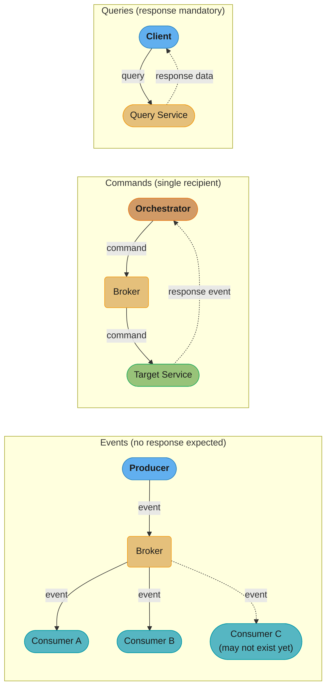
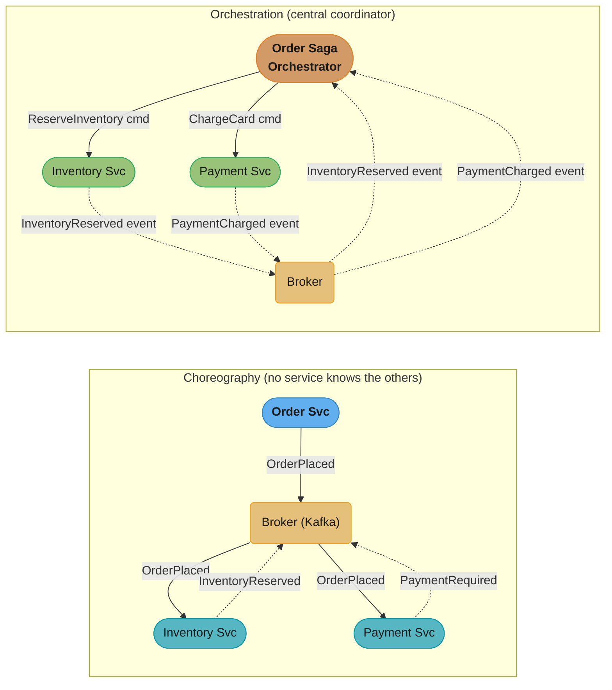
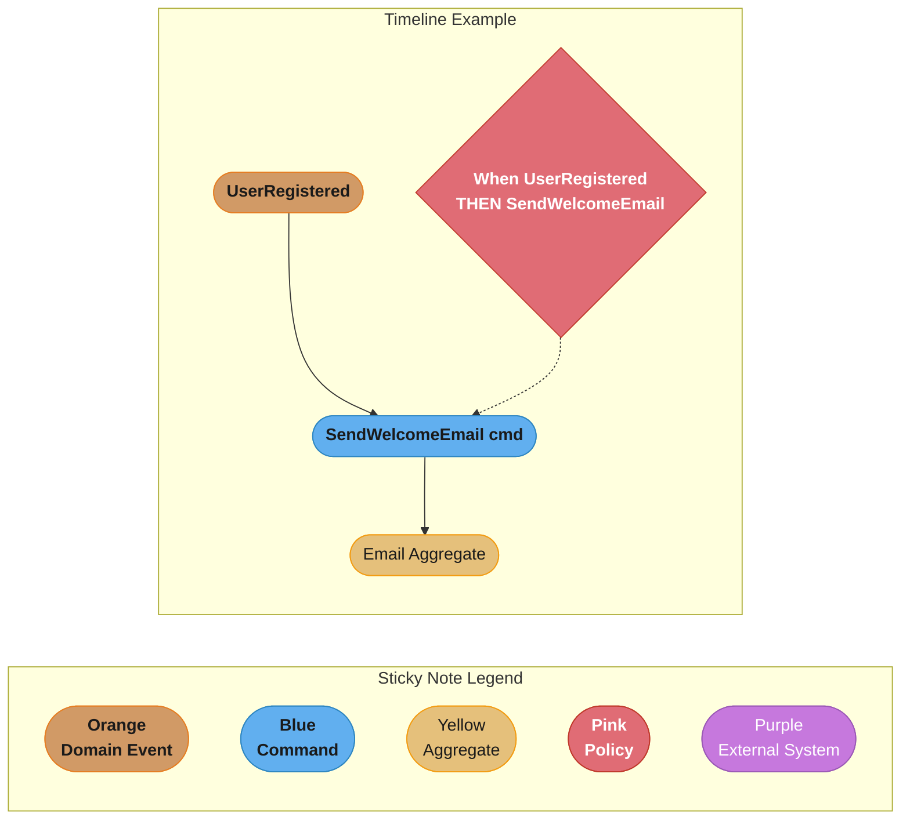
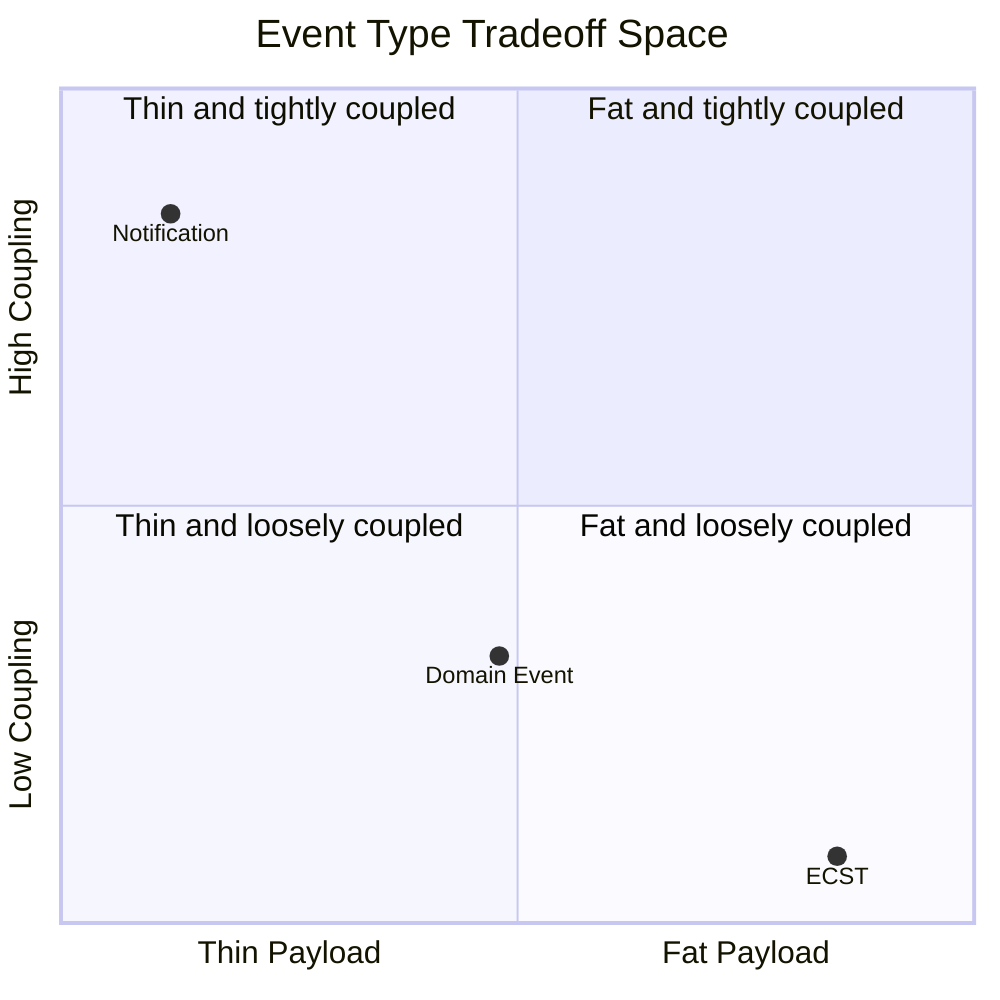
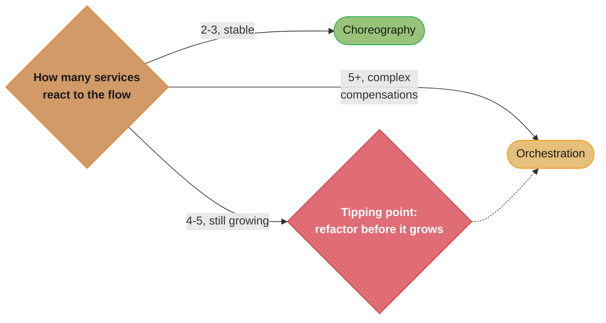
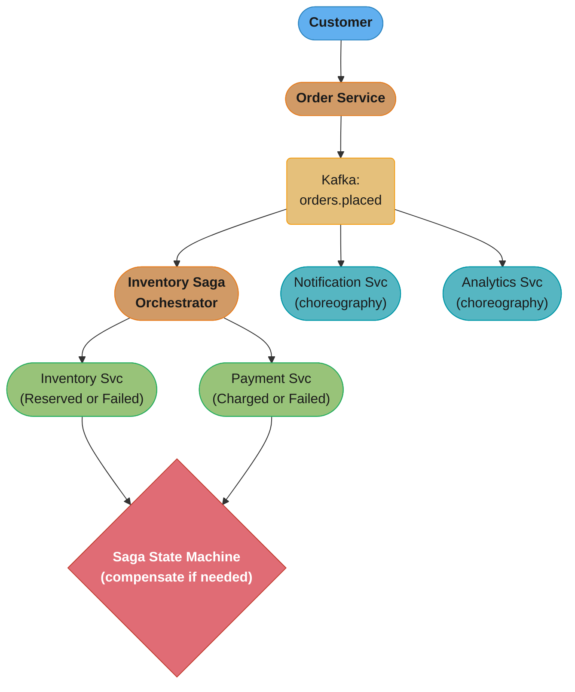

# Event-Driven Fundamentals

---

## 1. Concept Overview

Event-driven architecture (EDA) is a software design paradigm in which system components communicate by producing and consuming events — records of things that have already happened. Rather than components calling each other directly (request/response), they emit facts into a shared channel and other components react to those facts independently.

EDA decouples producers from consumers in time, space, and logic. A producer does not know who will consume its event, when, or how many consumers exist. Consumers do not know who produced the event or why.

The paradigm encompasses three distinct message types — events, commands, and queries — each with different semantics, directional intent, and response expectations. Understanding the distinction is prerequisite to designing correct systems.

---

## 2. Intuition

One-line analogy: An event is a newspaper — printed once, read by anyone who picks it up, no response expected. A command is a work order — directed at a specific worker, execution expected. A query is a phone call asking for information — a response is mandatory.

Mental model: Think of events as immutable facts written in past tense. "OrderPlaced", "PaymentProcessed", "UserRegistered". They describe history. Commands are instructions: "PlaceOrder", "ProcessPayment", "RegisterUser". They describe intent.

Why it matters: Conflating events with commands leads to systems that are tightly coupled, brittle under failure, and hard to evolve. A system that treats "OrderPlaced" as a command directed at the inventory service is really synchronous RPC dressed up as messaging.

Key insight: Events transfer ownership of reaction to the consumer. The producer's responsibility ends at emission. This enables systems to scale independently, fail independently, and evolve independently.

---

## 3. Core Principles

**Events describe facts, not instructions.** An event records that something occurred. It carries no expectation of who responds, how quickly, or whether anyone responds at all.

**Commands have a single intended recipient.** A command is directed at a specific service or component. It may or may not be delivered via a message broker, but semantically it targets one handler.

**Queries expect a synchronous or asynchronous response.** Queries are read-only. They do not change state. CQS (Command-Query Separation) and CQRS (Command-Query Responsibility Segregation) formalize this separation at the method and architecture level respectively.

**Consumers are autonomous.** In a choreographed system, each consumer decides how to react to an event based on its own business logic. No central coordinator tells it what to do.

**Temporal decoupling enables resilience.** Because a producer emits and forgets, it does not block on consumer availability. A message broker buffers the event until the consumer is ready.

**Idempotency is mandatory.** Events may be delivered more than once (at-least-once delivery is the norm). Consumers must handle duplicate delivery without side effects.

**Schema evolution must be deliberate.** Events are contracts. Once published to other services, removing fields or changing types breaks consumers. Backward and forward compatibility must be planned from the start.

---

## 4. Types / Architectures / Strategies

### Message Types

**Event (Domain Event)**
- Past tense. Describes a state change that has already occurred within a bounded context.
- No expectation of response.
- Example: `OrderPlaced`, `InventoryReserved`, `PaymentFailed`
- Source of truth for choreography.

**Command**
- Imperative. Instructs a recipient to perform an action.
- Expects execution (and possibly a result event or response).
- Example: `PlaceOrder`, `ReserveInventory`, `ChargeCard`
- Used in orchestration sagas where an orchestrator directs participants.

**Query**
- Read-only request for data.
- Expects a data response.
- Example: `GetOrderById`, `ListUserOrders`
- In CQRS, queries are separated from the write model entirely.

### Event Taxonomy

**Domain Event**
- Internal to a bounded context.
- Rich with domain meaning.
- Never published externally in raw form — an integration event is derived from it.
- Example: `OrderAggregate` emits `OrderPlacedDomainEvent` internally.

**Integration Event**
- Published across bounded context or service boundaries.
- Deliberately designed for external consumers.
- Versioned and schema-stable.
- Example: `OrderPlacedIntegrationEvent` published to Kafka topic `orders.placed`.

**Notification Event (Thin Event)**
- Contains only identifiers, no payload data.
- Consumer must call back to the producer to fetch the current state.
- Advantage: no stale data in event, consumer always gets latest state.
- Disadvantage: introduces coupling back to producer API, chattier.
- Example: `{ "eventType": "OrderUpdated", "orderId": "abc-123" }`

**Event-Carried State Transfer (ECST)**
- Contains full current state of the aggregate at the time of the event.
- Consumer does not need to call back to producer.
- Advantage: fully decoupled, consumer can build its own projection.
- Disadvantage: large payloads, stale state if consumer is slow to process.
- Example: `OrderPlacedEvent` with all order fields, line items, addresses.

### Interaction Patterns

**Choreography**
- Services react to events autonomously.
- No central coordinator.
- Each service subscribes to relevant topics and decides its own reaction.
- Advantages: simple for small flows, no single point of failure.
- Disadvantages: hard to trace end-to-end flow, business logic scattered across services.

**Orchestration**
- A central Saga Orchestrator (or Process Manager) coordinates the flow.
- Orchestrator sends commands to participants and listens for response events.
- Advantages: centralized business logic, easy to trace, compensations explicit.
- Disadvantages: orchestrator is a coordination bottleneck, potential single point of failure if not distributed.

---

## 5. Architecture Diagrams

### Events vs Commands vs Queries



Events broadcast to every subscriber with no response expected — a Consumer C that may not exist yet can still be added later without touching the producer; commands target exactly one recipient and expect execution; queries are point-to-point and always return data.

### Choreography vs Orchestration



Choreography fans the same event out to every subscriber and no service is aware of the others; orchestration centralizes the flow behind a saga orchestrator that issues commands and blocks on response events, trading autonomy for one place to see the full saga state.

### Event Envelope Structure

```
┌──────────────────────────────────────────────────────────┐
│                     EVENT ENVELOPE                       │
├──────────────────────────────────────────────────────────┤
│ eventId       : UUID (globally unique)                   │
│ eventType     : "com.example.order.OrderPlaced"          │
│ occurredOn    : ISO-8601 timestamp (UTC)                  │
│ aggregateId   : "order-abc-123"                          │
│ aggregateType : "Order"                                  │
│ version       : 1                                        │
│ correlationId : trace ID spanning the whole flow         │
│ causationId   : eventId of the event that caused this    │
├──────────────────────────────────────────────────────────┤
│ payload       : { domain-specific fields }               │
└──────────────────────────────────────────────────────────┘
```

### Event Storming Legend



The legend's sticky-note colors carry straight into the timeline: the orange UserRegistered domain event triggers the blue SendWelcomeEmail command under a pink policy rule, landing on the yellow Email aggregate.

---

## 6. How It Works — Detailed Mechanics

### Event Envelope in Java

```java
public class EventEnvelope<T> {
    private final String eventId;          // UUID.randomUUID().toString()
    private final String eventType;        // "com.example.order.OrderPlaced"
    private final Instant occurredOn;      // Instant.now() — UTC
    private final String aggregateId;      // business identifier
    private final String aggregateType;    // "Order"
    private final int version;             // schema version, starts at 1
    private final String correlationId;    // MDC trace ID
    private final String causationId;      // eventId of triggering event
    private final T payload;

    // immutable — all fields set via constructor, no setters
    public EventEnvelope(String eventType, String aggregateId,
                         String aggregateType, int version,
                         String correlationId, String causationId,
                         T payload) {
        this.eventId = UUID.randomUUID().toString();
        this.occurredOn = Instant.now();
        this.eventType = Objects.requireNonNull(eventType);
        this.aggregateId = Objects.requireNonNull(aggregateId);
        this.aggregateType = Objects.requireNonNull(aggregateType);
        this.version = version;
        this.correlationId = correlationId;
        this.causationId = causationId;
        this.payload = Objects.requireNonNull(payload);
    }
}
```

### Domain Event vs Integration Event Separation

```java
// DOMAIN EVENT — internal to bounded context, rich
public class OrderPlacedDomainEvent {
    private final Order order;           // full aggregate reference
    private final User user;             // related aggregate reference
    // ... used only within the Order bounded context
}

// INTEGRATION EVENT — published externally, deliberately thin
public class OrderPlacedIntegrationEvent {
    private final String orderId;
    private final String customerId;
    private final BigDecimal totalAmount;
    private final String currency;
    private final List<OrderItemDto> items;  // DTOs, not domain objects
    private final Instant placedAt;
    // schema version explicitly managed
    private final int schemaVersion = 1;
}
```

### Choreography: Simple Order Flow

```java
// Inventory Service — subscribes autonomously, no knowledge of who published
@KafkaListener(topics = "orders.placed", groupId = "inventory-service")
public void onOrderPlaced(OrderPlacedIntegrationEvent event) {
    inventoryService.reserve(event.getOrderId(), event.getItems());
    // publishes InventoryReservedEvent or InventoryFailedEvent
    eventPublisher.publish(new InventoryReservedEvent(event.getOrderId()));
}

// Payment Service — also subscribes, fully independent
@KafkaListener(topics = "orders.placed", groupId = "payment-service")
public void onOrderPlaced(OrderPlacedIntegrationEvent event) {
    // payment service reacts independently — no coupling to inventory
    paymentService.initiatePayment(event.getOrderId(), event.getTotalAmount());
}
```

### Backward and Forward Compatibility

```
BACKWARD COMPATIBILITY (new schema can read data written with old schema)
  Old schema:  { "orderId": "123", "amount": 100 }
  New schema:  { "orderId": "123", "amount": 100, "currency": "USD" }  ← added with default
  Rule: ONLY add new optional fields with defaults. NEVER remove required fields.

FORWARD COMPATIBILITY (old schema can read data written with new schema)
  New schema produces: { "orderId": "123", "amount": 100, "currency": "USD", "region": "US" }
  Old consumer reads:  { "orderId": "123", "amount": 100 }  ← ignores unknown "region" field
  Rule: consumers must tolerate and IGNORE unknown fields.
```

```java
// Jackson configuration for forward compatibility (ignore unknown fields)
@JsonIgnoreProperties(ignoreUnknown = true)
public class OrderPlacedIntegrationEvent {
    private String orderId;
    private BigDecimal amount;
    // new field added by producer — old consumers won't break
    // private String currency;  // old consumers just ignore this
}
```

### Event Storming Process

```
1. CHAOTIC EXPLORATION (60 min)
   - Everyone writes Domain Events on orange stickies (past tense, verb-noun)
   - No discussion, no order, just dump all events onto the wall
   - "OrderPlaced", "PaymentFailed", "ItemShipped", "AccountBlocked"

2. ENFORCE THE TIMELINE (30 min)
   - Arrange events left-to-right in rough chronological order
   - Identify parallel flows (multiple columns)
   - Surface duplicates and synonyms

3. MARK PAIN POINTS (15 min)
   - Red stickies on events that are unclear, controversial, or problematic
   - These are the most valuable discovery points

4. ADD COMMANDS (30 min)
   - Blue stickies: what triggered each event?
   - PlaceOrder → OrderPlaced
   - ProcessPayment → PaymentProcessed or PaymentFailed

5. ADD AGGREGATES (20 min)
   - Yellow stickies: group commands and events by the aggregate that owns them
   - Order aggregate owns: PlaceOrder, ConfirmOrder, CancelOrder

6. ADD POLICIES (20 min)
   - Pink stickies: "When [event] THEN [command]" — automation rules
   - "When PaymentFailed THEN NotifyCustomer"
   - "When InventoryReserved AND PaymentCharged THEN ShipOrder"

7. ADD EXTERNAL SYSTEMS (15 min)
   - Purple stickies: external systems that trigger commands or receive events
   - "Stripe" → PaymentCharged event
   - "SendGrid" receives NotifyCustomer command
```

---

## 7. Real-World Examples

**Netflix — Choreography at scale**: Netflix uses a choreography model with Kafka where hundreds of services subscribe to event streams. The `video-encoded` event triggers subtitle generation, thumbnail creation, CDN propagation, and recommendation updates — all independently. No orchestrator coordinates this.

**Uber — Orchestration for critical flows**: Uber's trip dispatch uses orchestration-style sagas. The "MatchRider" orchestrator sends commands to geolocation, driver-matching, and ETA services and compensates if any step fails. The financial criticality and compensation complexity justify an orchestrator.

**Amazon — Event-Carried State Transfer for order events**: Amazon's fulfillment pipeline uses fat events (ECST) so downstream systems (warehouse, logistics, customer notifications) can build their own projections without calling back to the order service. Order events carry full item details, shipping addresses, and pricing.

**Airbnb — Event storming for service decomposition**: Airbnb used event storming workshops to identify bounded contexts when decomposing their monolith. The exercise revealed that "Booking" and "Payment" were distinct aggregates with different lifecycles, leading to separate services.

---

## 8. Tradeoffs

| Dimension | Choreography | Orchestration |
|-----------|-------------|---------------|
| Coupling | Low — services don't know each other | Medium — orchestrator knows all participants |
| Traceability | Difficult — flow spans many services | Easy — one place to see full saga state |
| Coordination failure | Distributed — no single point | Orchestrator is a single coordination concern |
| Business logic location | Scattered across consumers | Centralized in orchestrator |
| Suitable for | Simple, stable flows (3 services) | Complex flows with many compensations |
| Testing | Hard to test end-to-end | Easier — test orchestrator directly |

| Event Type | Data in Payload | Consumer Coupling | Staleness Risk |
|------------|-----------------|-------------------|----------------|
| Notification (thin) | ID only | High (must call back) | None |
| Domain event | Rich domain data | Low | Low (immediate) |
| ECST (fat event) | Full state | Very low | Medium (consumer lag) |



Payload size and consumer coupling move in opposite directions: thin notification events keep consumers coupled to the producer's API (a call-back is mandatory), while fat ECST events decouple consumers at the cost of larger, staler payloads — domain events sit in between.

| Message Type | Direction | Response Expected | State Change |
|--------------|-----------|-------------------|--------------|
| Event | Broadcast | No | Already happened |
| Command | Targeted | Execution | Requested |
| Query | Point-to-point | Data | No |

---

## 9. When to Use / When NOT to Use

**Use event-driven architecture when:**
- Services need to be independently deployable and scalable.
- Multiple downstream systems must react to the same business fact.
- You need an audit log of all state changes.
- You want to decouple the rate of production from the rate of consumption.
- Business processes naturally model as workflows with long-running compensation.

**Do NOT use event-driven architecture when:**
- You need a synchronous response within the same user request (use request/response).
- Your flow has only two services and will never grow (synchronous HTTP is simpler).
- The team lacks experience with eventual consistency and will not invest in observability (distributed tracing, consumer lag monitoring).
- Transactions must be strictly serializable across services (EDA does not provide this — use a monolith or a distributed transaction protocol with full understanding of its costs).
- The problem is simple CRUD with no real domain logic (event sourcing CQRS on a to-do app is massive accidental complexity).

**Use choreography when:**
- The flow has 2–3 services and is well-understood and stable.
- You want maximum autonomy and fault tolerance.
- You can invest in distributed tracing (Jaeger, Zipkin) to recover observability.

**Use orchestration when:**
- The flow spans 5+ services.
- Compensation logic is complex.
- Business requirements demand a clear audit of saga progress.
- Regulatory compliance requires explicit workflow state storage.



Service count is the practical signal for picking a pattern: 2-3 stable services favor choreography, 5+ services with real compensation logic favor orchestration, and 4-5 growing services is the tipping point Pitfall 4 warns about — refactor before the flow becomes unreadable.

---

## 10. Common Pitfalls

**Pitfall 1 — Commands disguised as events.**
A team named their Kafka messages "PlaceOrderEvent" and "SendEmailEvent". These are commands, not events. Consumers treated them as facts and did not validate pre-conditions. Result: emails were sent for orders that were subsequently rejected in the same millisecond by a validation race. Fix: events describe what happened; validate invariants before emitting.

**Pitfall 2 — Fat events with stale data causing ghost writes.**
A logistics team published ECST events containing full order state including the shipping address. The notification service consumed events asynchronously with up to 30 seconds of lag. In that window, the customer updated the shipping address. The notification service sent a confirmation email with the old address. Fix: for address-critical flows, use notification events and fetch current state, or use optimistic locking with event timestamps to detect staleness.

**Pitfall 3 — Missing correlationId / causationId.**
An e-commerce platform had a production incident where a payment was charged twice. The investigation required reconstructing which `OrderPlaced` event triggered which `ChargeCard` command. Without correlationId and causationId in the event envelope, the tracing was impossible. The incident took 6 hours to diagnose. Fix: always propagate correlationId from the triggering context; set causationId to the eventId of the parent event.

**Pitfall 4 — Choreography spaghetti in complex flows.**
A team started with a choreographed flow of 3 services. Over 18 months it grew to 11 services. Each service subscribed to 4–6 topics. No engineer could draw the complete flow from memory. When a business rule changed, 4 different services needed updating with no single place to reason about correctness. Fix: refactor complex choreographed flows into orchestrated sagas once the number of participants exceeds 4–5.

**Pitfall 5 — No dead-letter handling.**
A team deployed consumers with no DLQ configuration. When a downstream database went down, consumers threw exceptions and auto-committed offsets anyway (misconfigured). 4,000 events were silently dropped. Fix: never auto-commit until processing succeeds. Always configure DLQ for failed messages.

**Pitfall 6 — Schema changes without backward compatibility.**
A producer team renamed the field `customerId` to `userId` in an integration event. They versioned the Avro schema but forgot to check BACKWARD compatibility in Schema Registry. Old consumer versions broke immediately on deploy. Fix: enforce Schema Registry compatibility checks in CI/CD pipeline before any schema change is merged.

---

## 11. Technologies and Tools

**Message Brokers**
- Apache Kafka — high-throughput, durable, replay-capable. De facto standard for integration events at scale. KRaft mode removes ZooKeeper dependency (Kafka 3.3+ production-ready).
- RabbitMQ — smart broker with routing, exchange types (direct, topic, fanout, headers). Better for complex routing logic. No native replay.
- Amazon SQS/SNS — managed, serverless. SQS for point-to-point queuing, SNS for fan-out. No consumer groups or replay.
- Amazon EventBridge — event bus with schema registry, archive, replay, and cross-account routing.
- Apache Pulsar — multi-tenant, geo-replication, tiered storage. Suitable for multi-region event streaming.

**Schema Management**
- Confluent Schema Registry — Avro, Protobuf, JSON Schema. Compatibility enforcement modes: BACKWARD, FORWARD, FULL, NONE.
- AWS Glue Schema Registry — managed schema registry for AWS ecosystem.

**Event Storming**
- Miro, MURAL — remote collaboration boards for digital event storming.
- Physical sticky notes — preferred for co-located teams for tactile engagement.
- EventStorming.com — Alberto Brandolini's original methodology documentation.

**Observability**
- Jaeger, Zipkin — distributed tracing. Propagate correlationId as trace ID.
- Confluent Control Center / Kafdrop — consumer lag monitoring.
- Datadog, Grafana — dashboards for consumer lag, DLQ depth, event processing latency.

**Frameworks**
- Axon Framework — Java framework for event-driven microservices, CQRS, event sourcing.
- Spring Cloud Stream — abstraction over Kafka/RabbitMQ with binder model.
- MassTransit (.NET) — saga orchestration and choreography with RabbitMQ/Azure Service Bus.

---

## 12. Interview Questions with Answers

**Q: What is the difference between an event, a command, and a query?**
An event is a record of something that has already happened — it is past tense, has no single intended recipient, and expects no response. A command is an instruction directed at a specific service — it expects execution. A query is a read-only request for data — it expects a data response and must not change state. This distinction is the foundation of CQS (Command-Query Separation) at the method level and CQRS at the architectural level.

**Q: What are the four types of events in event taxonomy?**
Domain events are internal to a bounded context and carry rich domain meaning. Integration events are published across service boundaries and are deliberately schema-stable for external consumers. Notification events (thin events) carry only identifiers and require consumers to call back for current state. Event-Carried State Transfer events carry the full current state of the aggregate and eliminate the need to call back, at the cost of larger payloads and potential staleness under consumer lag.

**Q: What is the difference between choreography and orchestration?**
In choreography, services react autonomously to events with no central coordinator — each service subscribes to relevant topics and decides its reaction independently. In orchestration, a central saga orchestrator sends commands to participant services and listens for response events to drive the flow forward. Choreography is simpler for small stable flows; orchestration is preferable for complex multi-step flows where compensation logic is significant and traceability is required.

**Q: What fields must an event envelope contain?**
The mandatory fields are: eventId (UUID for deduplication), eventType (fully qualified string), occurredOn (UTC timestamp), aggregateId (the business identifier of the aggregate that changed), aggregateType, version (schema version), correlationId (trace ID spanning the entire distributed flow), causationId (eventId of the event that caused this one to be emitted), and payload (domain-specific content). The correlationId and causationId are frequently omitted in early implementations and cause severe debugging pain in production incidents.

**Q: Why must event consumers tolerate unknown fields?**
This is the principle of forward compatibility. When a producer adds a new field to an event schema, old consumers that have not yet been deployed with the new schema must not break. Jackson's `@JsonIgnoreProperties(ignoreUnknown = true)` and Avro's schema evolution rules both support this. If consumers throw on unknown fields, every schema change requires coordinated simultaneous deployment of all consumers before the producer, which defeats the purpose of decoupled services.

**Q: What is the difference between backward and forward schema compatibility?**
Backward compatibility means the new version of a schema can read data written with the old schema — achieved by only adding optional fields with defaults, never removing required fields. Forward compatibility means the old version of a schema can read data written with the new schema — achieved because consumers ignore unknown fields. Full compatibility (FULL mode in Schema Registry) requires both. In practice, always aim for FULL compatibility for integration events.

**Q: What is event storming and when do you use it?**
Event storming is a collaborative workshop technique invented by Alberto Brandolini where business and technical stakeholders collaboratively map domain events on a timeline using color-coded sticky notes. Orange stickies are domain events, blue are commands, yellow are aggregates, pink are policies, and purple are external systems. It is used when designing new services, decomposing a monolith, or aligning business and technical understanding of a complex domain. A well-run event storming session can surface bounded context boundaries and aggregate designs in a day that would take weeks of documentation-only analysis.

**Q: What is the notification event pattern and when should you use it over ECST?**
A notification event carries only the aggregate identifier (and event type), no payload data. The consumer must call back to the producer's API to fetch current state. Use it when the consumer always needs the absolute latest state (not the state at the time of the event), when events are high-frequency and payload size matters, or when multiple events for the same aggregate may be batched and only the final state matters. Use ECST (Event-Carried State Transfer) when you want maximum consumer autonomy and can tolerate slight staleness.

**Q: How do you handle long-running choreographed flows that span many services?**
You add a Process Manager (also called a Saga) that listens to events and tracks the overall flow state, but still communicates via events rather than direct commands. At the point where a choreographed flow has grown beyond 4–5 services, the alternative is to refactor to an orchestrated saga with an explicit state machine. The key signal is when engineers can no longer confidently describe the full flow without reading multiple codebases — that is the tipping point for orchestration.

**Q: What is the causationId and why is it important?**
The causationId is the eventId of the event that caused the current event to be emitted. It creates a causal chain: `UserRegistered` (causationId: null) → `WelcomeEmailSent` (causationId: UserRegistered.eventId) → `EmailDeliveryConfirmed` (causationId: WelcomeEmailSent.eventId). Combined with correlationId (which spans the entire flow), this allows you to reconstruct exactly what happened and why during incident investigation. Without causationId, you know what happened but not why.

**Q: How do you trace an end-to-end event flow in a choreographed system?**
Inject the correlationId as the distributed trace ID in every event envelope. Configure your message consumers to extract the correlationId and set it as the active span in your distributed tracing system (Jaeger, Zipkin, OpenTelemetry). All log statements, database queries, and outgoing events in that consumer execution are tagged with the same correlationId. In Jaeger, you can then search by correlationId and see the entire trace spanning all services, topics, and time delays.

**Q: What is the risk of publishing domain events as integration events directly?**
Domain events are optimized for internal bounded context semantics. They may reference domain objects, use internal identifiers, carry fields meaningful only within the context, or change structure frequently as the domain evolves. Publishing them directly to external consumers creates tight coupling between your internal model and external contracts. The fix is the anti-corruption layer: internal domain events are translated to explicitly versioned, deliberately designed integration events at the boundary of the context.

**Q: How do you decide event granularity — fine-grained vs coarse-grained events?**
Fine-grained events (`OrderItemAdded`, `ShippingAddressUpdated`) give consumers maximum flexibility to react only to what changed, but increase event volume and complexity. Coarse-grained events (`OrderUpdated` carrying full state) are simpler to consume but trigger unnecessary processing when consumers only care about specific changes. The rule of thumb: use fine-grained events for high-value business facts that many consumers react to differently; use coarse-grained ECST events when most consumers need the full state anyway.

**Q: What is the difference between a policy and a reaction in event storming?**
A policy (pink sticky) is an automation rule: "When [event] THEN [command]". It is a business rule, not a technical one. "When PaymentFailed THEN NotifyCustomer AND CancelOrder." A reaction is the technical implementation of a policy — the consumer code that executes when the event arrives. The distinction matters in event storming because policies belong on the business level and should be validated with domain experts, not assumed by engineers.

**Q: How does CQRS relate to events, commands, and queries?**
CQRS separates the write model (command side) from the read model (query side) at the architectural level. Commands flow to the write model which validates business invariants, changes state, and emits domain events. Those events are consumed by projectors that build denormalized read models optimized for specific query patterns. Queries flow only to the read models and never touch the write model. This enables the write side to be strongly consistent and the read side to be eventually consistent, independently scalable, and freely denormalized.

---

## 13. Best Practices

- **Name events in past tense**: `OrderPlaced` not `PlaceOrder`. Past tense signals a fact; imperative signals a command. This single naming rule prevents the most common confusion in event-driven systems.

- **Include schema version in every event**: embed `schemaVersion: 1` in the envelope. When you evolve the schema, increment the version. Consumers can branch on version if needed during migration periods.

- **Always set correlationId from the incoming request**: in REST handlers, generate a UUID if none is present in the request headers. Propagate it into every event emitted during that request lifecycle. This is the single most valuable observability practice.

- **Never delete events from an event log**: events are immutable facts. If a business error occurred (fraudulent order), emit a compensating event (`OrderCancelled`) rather than deleting the original `OrderPlaced` event.

- **Design integration events with external consumers as the primary concern**: run an internal event storming with the consuming teams before finalizing the integration event schema. Their query patterns determine what fields must be in the event.

- **Enforce Schema Registry compatibility checks in CI**: block PRs that introduce non-compatible schema changes. The schema is a contract; breaking it without coordination is equivalent to changing a REST API without versioning.

- **Configure DLQ on every consumer from day one**: never deploy a consumer without a dead-letter destination. Unprocessable messages must be captured, not silently discarded.

- **Test consumers for idempotency explicitly**: write unit tests that deliver the same event twice and assert that the business outcome occurs exactly once. This catches the majority of at-least-once delivery bugs before production.

- **Prefer choreography for 2–3 service flows, orchestration for 5+ service flows**: this threshold is not absolute, but the traceability cost of choreography grows super-linearly with the number of participants.

- **Separate domain events from integration events in your codebase**: have a `domain.events` package for internal events and an `integration.events` package for external events. Add a translation layer at the boundary.

---

## 14. Case Study

### Event-Driven Order Fulfillment Platform

**Scenario**: A mid-size e-commerce company processes 50,000 orders per day. The monolithic order service is being decomposed into microservices. The business requires that when an order is placed, inventory must be reserved, payment must be charged, and the customer must be notified — all reliably, even if any single service is temporarily unavailable.

**Architecture Decision**: The team chose a hybrid model: choreography for the notification flow (simple, fire-and-forget) and orchestration for the inventory-payment saga (compensations are complex, must track saga state).

**Event Flow Design**:



The order event fans out to three independent consumers; only the inventory-payment branch funnels back into a saga state machine that can trigger compensation, while notification and analytics stay fire-and-forget.

**Event Envelope Design**:
```java
// Integration event published to orders.placed
public class OrderPlacedIntegrationEvent {
    private final String eventId;
    private final String eventType = "OrderPlaced";
    private final int schemaVersion = 1;
    private final Instant occurredOn;
    private final String correlationId;
    private final String orderId;
    private final String customerId;
    private final BigDecimal totalAmount;
    private final String currency;
    private final List<OrderItemDto> items;
}
```

**Outcomes**:
- Inventory service outages no longer affect order placement — orders queue in Kafka, inventory reserves when it recovers.
- Consumer lag monitoring (Grafana dashboard on Kafka consumer group lag) alerts the team when any consumer falls behind by more than 10,000 messages.
- The notification service is independently deployable and scalable — during peak season, it scales to 10 instances consuming from `orders.placed` in parallel.
- Schema Registry with FULL compatibility mode prevents any engineer from accidentally publishing a schema change that breaks consumers — the CI pipeline rejects non-compatible changes before merge.
- The first major incident: a developer removed the `currency` field from the integration event (considered it redundant). Schema Registry rejected the change in CI. The field was retained with a default of `"USD"` for backward compatibility. Estimated production impact if it had shipped: payment service failures for all non-USD orders.
