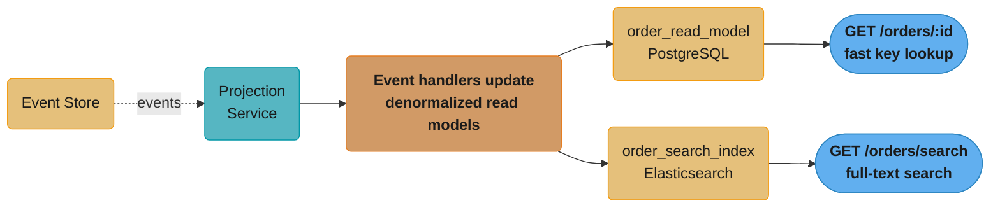
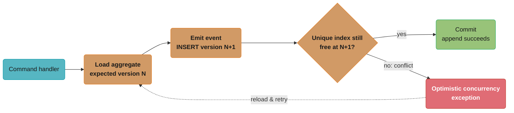

# Event Sourcing and CQRS

## 1. Concept Overview

Event sourcing is a persistence pattern where the application state is derived from an ordered, immutable log of events rather than storing the current state directly. Instead of `UPDATE orders SET status = 'SHIPPED'`, you append `OrderShipped{orderId, timestamp, trackingNumber}`. Current state is reconstructed by replaying events from the beginning. CQRS (Command Query Responsibility Segregation) separates the write model (commands that change state) from the read model (queries that return data), allowing each to be optimized independently. Event sourcing and CQRS are complementary and frequently combined.

---

## 2. Intuition

A bank ledger never modifies past entries — it appends new transactions (credits, debits). The account balance at any point is the sum of all transactions up to that point. Event sourcing applies this principle to all domain state: every change is a fact recorded in the ledger, never overwritten. You can reconstruct any past state and derive new projections from the same event history.

CQRS recognizes that reading data and writing data have different requirements. Writes need strict consistency and business rules. Reads need speed, flexibility, and different shapes (list view, detail view, reporting view). Separating them lets you optimize each path independently.

---

## 3. Core Principles

- **Events are immutable facts**: once written, an event never changes; it represents something that happened
- **Aggregate owns its event stream**: each aggregate instance has its own ordered sequence of events
- **State is derived**: current state is always computable from the event log; it is never a primary record
- **Commands can fail, events cannot**: a command (`CreateOrder`) may be rejected; an event (`OrderCreated`) is a fact that has already occurred
- **CQRS — separate models**: the command model enforces invariants; the read model is denormalized for query performance

---

## 4. Types / Architectures / Strategies

**Event sourcing variants**:
- Pure event sourcing: all state from event replay; no separate state table
- Hybrid: event sourcing for aggregates, separate read-optimized projections
- Snapshot-based: store periodic snapshots to avoid full replay from event 1

**CQRS variants**:
- Simple CQRS: same DB, separate read/write service layers
- Separate stores: command side (event store), query side (read DB, Elasticsearch, Redis)
- Full async CQRS: commands go to command service, events flow to projection service asynchronously

**Projection types**:
- Synchronous projection: event handler updates read model in same transaction (strong consistency)
- Asynchronous projection: event handler publishes to bus, projection service subscribes (eventual consistency)
- Catch-up subscription: projection replays all historical events then switches to live events

---

## 5. Architecture Diagrams

**Event Sourcing — Write Path**

```mermaid
flowchart LR
    classDef io      fill:#61afef,stroke:#2e86c1,color:#1a1a1a,font-weight:bold
    classDef frozen  fill:#c678dd,stroke:#9b59b6,color:#fff
    classDef train   fill:#98c379,stroke:#27ae60,color:#1a1a1a
    classDef mathOp  fill:#d19a66,stroke:#e67e22,color:#1a1a1a,font-weight:bold
    classDef lossN   fill:#e06c75,stroke:#c0392b,color:#fff,font-weight:bold
    classDef req     fill:#56b6c2,stroke:#0097a7,color:#1a1a1a
    classDef base    fill:#e5c07b,stroke:#f39c12,color:#1a1a1a

    client([Client]) -->|"POST /orders"| cmdHandler(Order Command<br/>Handler)
    cmdHandler --> loadAgg(Load aggregate<br/>replay events)
    loadAgg --> validate{Validate<br/>invariants}
    validate --> emit(Emit new events)
    emit --> store(Event Store)
    store --> v1(v1: OrderCreated)
    v1 --> v2(v2: ItemAdded)
    v2 --> v3(v3: OrderConfirmed)
    v3 --> v4(v4: OrderShipped)

    class client io
    class cmdHandler req
    class loadAgg,emit,validate mathOp
    class store base
    class v1,v2,v3,v4 frozen
```



The command handler replays `orders-stream-123`'s existing events to rebuild the aggregate, validates invariants, then appends the next one — v1 through v4 are the immutable, strictly ordered stream for a single order.

**CQRS — Read Path**



Projections consume the event stream asynchronously and fan out into denormalized, independently-optimized read models — one for key lookups, one for full-text search.

---

## 6. How It Works — Detailed Mechanics

### Aggregate with Event Sourcing (Axon Framework)

```java
@Aggregate
public class OrderAggregate {

    @AggregateIdentifier
    private String orderId;
    private OrderStatus status;
    private String userId;
    private List<OrderItem> items = new ArrayList<>();
    private BigDecimal totalAmount;

    // Required no-arg constructor for Axon Framework
    protected OrderAggregate() {}

    // Command handler: validates, then applies event
    @CommandHandler
    public OrderAggregate(CreateOrderCommand command) {
        if (command.getItems().isEmpty()) {
            throw new IllegalArgumentException("Order must have at least one item");
        }
        // Do NOT set state here — apply the event
        apply(new OrderCreatedEvent(
            command.getOrderId(),
            command.getUserId(),
            command.getItems(),
            command.getTotalAmount()
        ));
    }

    @CommandHandler
    public void handle(ConfirmOrderCommand command) {
        if (status != OrderStatus.PENDING) {
            throw new IllegalStateException("Can only confirm PENDING orders");
        }
        apply(new OrderConfirmedEvent(orderId, Instant.now()));
    }

    @CommandHandler
    public void handle(ShipOrderCommand command) {
        if (status != OrderStatus.CONFIRMED) {
            throw new IllegalStateException("Can only ship CONFIRMED orders");
        }
        apply(new OrderShippedEvent(orderId, command.getTrackingNumber(), Instant.now()));
    }

    // Event sourcing handlers: reconstruct state from events
    // These are called BOTH when loading from store AND when applying new events
    @EventSourcingHandler
    public void on(OrderCreatedEvent event) {
        this.orderId = event.getOrderId();
        this.userId = event.getUserId();
        this.items = new ArrayList<>(event.getItems());
        this.totalAmount = event.getTotalAmount();
        this.status = OrderStatus.PENDING;
    }

    @EventSourcingHandler
    public void on(OrderConfirmedEvent event) {
        this.status = OrderStatus.CONFIRMED;
    }

    @EventSourcingHandler
    public void on(OrderShippedEvent event) {
        this.status = OrderStatus.SHIPPED;
    }
}
```

### Projection — Updating Read Model

```java
@Component
@ProcessingGroup("order-projection")
public class OrderProjection {

    private final OrderReadRepository readRepository;

    @EventHandler
    public void on(OrderCreatedEvent event) {
        OrderReadModel readModel = OrderReadModel.builder()
            .orderId(event.getOrderId())
            .userId(event.getUserId())
            .status("PENDING")
            .totalAmount(event.getTotalAmount())
            .itemCount(event.getItems().size())
            .createdAt(Instant.now())
            .build();
        readRepository.save(readModel);
    }

    @EventHandler
    public void on(OrderConfirmedEvent event) {
        readRepository.findById(event.getOrderId()).ifPresent(order -> {
            order.setStatus("CONFIRMED");
            order.setConfirmedAt(event.getConfirmedAt());
            readRepository.save(order);
        });
    }

    @EventHandler
    public void on(OrderShippedEvent event) {
        readRepository.findById(event.getOrderId()).ifPresent(order -> {
            order.setStatus("SHIPPED");
            order.setTrackingNumber(event.getTrackingNumber());
            order.setShippedAt(event.getShippedAt());
            readRepository.save(order);
        });
    }

    // Reset projection: replay all events from event store
    @ResetHandler
    public void onReset() {
        readRepository.deleteAll();
    }
}
```

### Event Store Schema (Custom Implementation)

```sql
CREATE TABLE event_store (
    id              BIGSERIAL PRIMARY KEY,
    aggregate_id    VARCHAR(36) NOT NULL,
    aggregate_type  VARCHAR(100) NOT NULL,
    event_type      VARCHAR(200) NOT NULL,
    event_version   INTEGER NOT NULL,          -- monotonically increasing per aggregate
    occurred_on     TIMESTAMPTZ NOT NULL DEFAULT NOW(),
    correlation_id  VARCHAR(36),
    causation_id    VARCHAR(36),
    payload         JSONB NOT NULL,
    metadata        JSONB NOT NULL DEFAULT '{}'
);

-- Unique constraint ensures no two events have same version for same aggregate
-- This is the optimistic concurrency check
CREATE UNIQUE INDEX idx_event_store_aggregate_version
    ON event_store(aggregate_id, event_version);

-- Query for aggregate replay
SELECT * FROM event_store
WHERE aggregate_id = $1
ORDER BY event_version ASC;
```

**Optimistic Concurrency Check — Version Conflict and Retry**



The unique index on `(aggregate_id, event_version)` from the schema above is what makes this possible: two command handlers racing to append the same next version collide at the database level, and only one `INSERT` succeeds — the loser reloads the aggregate and retries.

### Snapshot Pattern

```java
@Component
public class OrderAggregateSnapshotTrigger {

    private static final int SNAPSHOT_THRESHOLD = 50; // snapshot every 50 events

    @EventHandler
    public void on(OrderCreatedEvent event, @SequenceNumber long sequenceNumber) {
        if (sequenceNumber % SNAPSHOT_THRESHOLD == 0 && sequenceNumber > 0) {
            // Axon's snapshotter will store current aggregate state
            // Next load will: read snapshot + only events AFTER snapshot version
            snapshotTrigger.scheduleSnapshot(OrderAggregate.class, event.getOrderId());
        }
    }
}
```

**What it means.** "Loading an aggregate costs one event replay per event since it was created — so write down the state every 50 events and the cost stops growing with the aggregate's age."

Without a snapshot, load time is `O(total events)` and therefore increases forever. With one, it is bounded by the threshold and never exceeds it, no matter how old the aggregate gets. The threshold does not make replay faster; it makes replay *constant*.

| Symbol | What it is |
|--------|------------|
| `sequenceNumber` | The aggregate's event count so far — its version |
| `SNAPSHOT_THRESHOLD` (50) | Write a snapshot every 50 events |
| `sequenceNumber % 50 == 0` | Fires exactly on the multiples. The `> 0` guard skips version 0 |
| Events replayed on load | `sequenceNumber − (latest snapshot version)` — at most `threshold − 1` |
| Worst-case replay | 49 events, reached just before the next snapshot fires |
| Average replay | `(threshold − 1) / 2` = 24.5 events |

**Walk one example.** The same aggregate at three ages, with and without snapshots:

```
  version    no snapshot        with threshold 50
              (replay all)      snapshot at    replay
     49            49                 0          49        worst case
    120           120               100          20
  1,000         1,000             1,000           0        best case
 10,000        10,000            10,000           0

  Bound:  replay <= 50 - 1 = 49 events, forever
  A 10,000-event aggregate:  10,000 / 49  =  204x fewer events to load
```

**Why the threshold is a genuine tradeoff, not a bigger-is-better dial.** Lowering it shortens
replay but multiplies snapshot writes and snapshot-table storage:

```
  threshold     avg replay     snapshots written per 10,000 events
      10            4.5                    1,000
      50           24.5                      200
     500          249.5                       20
```

Going from 50 to 10 buys 20 events of replay and costs 5x the snapshot writes — a bad trade,
since replaying 25 in-memory events is microseconds while each snapshot is a serialization plus
a database write. Going from 50 to 500 saves 90% of the writes but pushes average replay to 250
events, which starts to show up in aggregate load latency on hot entities. 50–100 is the usual
landing spot precisely because the cost curves cross there. Also note the snapshot is a
*derived* cache, never a source of truth: the primary key `(aggregate_id, snapshot_version)`
lets you keep several and delete any of them freely, because the event log can always
regenerate the state.

### Snapshot Table

```sql
CREATE TABLE aggregate_snapshots (
    aggregate_id      VARCHAR(36) NOT NULL,
    aggregate_type    VARCHAR(100) NOT NULL,
    snapshot_version  INTEGER NOT NULL,           -- last event version included in snapshot
    state             JSONB NOT NULL,             -- serialized aggregate state
    created_at        TIMESTAMPTZ NOT NULL DEFAULT NOW(),
    PRIMARY KEY (aggregate_id, snapshot_version)
);

-- Loading with snapshot:
-- 1. SELECT * FROM aggregate_snapshots WHERE aggregate_id = $1 ORDER BY snapshot_version DESC LIMIT 1
-- 2. SELECT * FROM event_store WHERE aggregate_id = $1 AND event_version > $snapshot_version ORDER BY event_version ASC
-- 3. Apply snapshot state, then replay remaining events
```

### Event Upcasting (Schema Evolution)

```java
// Original event: OrderCreatedEvent v1 had no "currency" field
// New event: OrderCreatedEvent v2 added "currency" with default "USD"

// BROKEN: modifying old events in the store
// NEVER do this — events are immutable

// FIX: event upcaster transforms old format to new format at read time
@Component
public class OrderCreatedEventUpcaster implements SingleEventUpcaster {

    @Override
    public boolean canUpcast(IntermediateEventRepresentation representation) {
        return representation.getType().getName().equals("OrderCreatedEvent")
            && representation.getType().getRevision().equals("1");
    }

    @Override
    public IntermediateEventRepresentation doUpcast(IntermediateEventRepresentation representation) {
        return representation.upcastPayload(
            new MetaData(Map.of("revision", "2")),
            JsonNode.class,
            payload -> {
                ObjectNode node = (ObjectNode) payload;
                if (!node.has("currency")) {
                    node.put("currency", "USD"); // add default for old events
                }
                return node;
            }
        );
    }
}
```

### Temporal Queries (Point-in-Time State)

```java
// Reconstruct order state as it was on a specific date
public OrderState getOrderStateAt(String orderId, Instant pointInTime) {
    List<StoredEvent> events = eventStore.readEvents(orderId).stream()
        .filter(event -> event.getOccurredOn().isBefore(pointInTime))
        .collect(Collectors.toList());

    OrderAggregate aggregate = new OrderAggregate();
    events.forEach(event -> aggregate.apply(event.getPayload()));
    return OrderState.from(aggregate);
}
```

---

## 7. Real-World Examples

- **Axon Framework**: Java framework purpose-built for CQRS + event sourcing; used by enterprises for banking, insurance, e-commerce; AxonServer provides event store + message bus
- **EventStoreDB**: purpose-built event store by the creators of the event sourcing pattern; stream-per-aggregate model, catch-up subscriptions, competing consumer groups for projections
- **Microsoft**: uses event sourcing for Azure Resource Manager — every resource operation (create, update, delete) is an event; enables audit trail and resource history
- **Jet.com**: used CQRS + event sourcing for the pricing engine — commands update price models, events project to read-optimized price tables queried by millions of product lookups per minute

---

## 8. Tradeoffs

| Aspect | Event Sourcing | Traditional State |
|--------|----------------|-------------------|
| Audit trail | Built-in, complete | Requires separate audit table |
| Temporal queries | Native | Complex, requires history tables |
| Schema evolution | Upcasters required | ALTER TABLE |
| Read performance | Requires projections | Direct query |
| Write performance | Append-only (fast) | UPDATE with locking |
| Query flexibility | Limited (must project) | Full SQL |
| Complexity | High | Low |
| Debugging | Easy (replay events) | Harder (state snapshots) |
| Eventual consistency | Inherent (async projections) | Optional |

---

## 9. When to Use / When NOT to Use

Use event sourcing for: domains requiring a complete audit trail (finance, compliance, healthcare), systems where understanding "what happened and why" is as important as current state, systems that need temporal queries (past state at any point in time), domains with complex business workflows spanning multiple state transitions.

Do NOT use event sourcing for: simple CRUD applications without complex business rules, systems where the operational overhead (event store, projections, upcasters) outweighs the benefit, small teams without experience with eventual consistency and projection design, reporting-heavy systems where SQL joins are the primary access pattern.

---

## 10. Common Pitfalls

**Mutable events**: An engineer realized that an event was emitted with incorrect data and directly updated the event in the event store database. This corrupted the event log — all projections rebuilt from the event store now had inconsistent state. The only valid fixes are: emit a compensating event, or if absolutely necessary, delete and recreate from a point before the bad event with extreme care. Events are immutable; treat them as append-only.

**Putting business logic in event sourcing handlers**: Event sourcing handlers (`@EventSourcingHandler`) should only update aggregate state — no DB calls, no external calls, no conditional branching beyond assignment. One team put a discount calculation in the event handler which called a pricing service. When replaying events for projection rebuild, the pricing service was called thousands of times, causing rate limiting failures. Fix: all business logic belongs in command handlers; event handlers are pure state assignment.

**No snapshots for high-event aggregates**: A shopping cart aggregate accumulated events for each item add/remove/quantity-change. After 6 months in production, some carts had 5000 events. Loading a cart required replaying 5000 events, taking 800ms. Fix: add snapshots every 50 events. After adding snapshots, cart load time was 12ms.

**Eventual consistency in read models causing UX bugs**: After placing an order, the user was redirected to the order detail page. The GET /orders/:id endpoint read from the CQRS read model. The projection was processed asynchronously (500ms lag). Users saw "Order not found" for 500ms after placing. Fix: either use synchronous projection for the new order (write-through to read model in same transaction), or implement "read your own writes" using the event store directly for the first read.

---

## 11. Technologies & Tools

| Tool | Purpose |
|------|---------|
| Axon Framework | Java CQRS + event sourcing framework with Spring integration |
| AxonServer | Event store + message bus for Axon Framework |
| EventStoreDB | Purpose-built event store with native subscriptions |
| Spring Data JDBC | Lightweight persistence for event store tables |
| Jackson | Event serialization/deserialization |
| Avro + Schema Registry | Typed event schemas with evolution support |
| Apache Kafka | Event distribution to projections across services |
| PostgreSQL | Event store backend (append-only pattern) |

---

## 12. Interview Questions with Answers

**Q: What is event sourcing and how does it differ from traditional state persistence?**
In traditional state persistence, you store the current state of an entity and update it in-place: `UPDATE orders SET status = 'SHIPPED'`. In event sourcing, you store the sequence of events that led to the current state and never update records: you append `OrderShipped{orderId, trackingNumber, shippedAt}`. Current state is derived by replaying all events for an aggregate from the beginning. The difference is that traditional persistence answers "what is the current state?" while event sourcing answers "what happened and how did we get here?"

**Q: What is CQRS and why would you use it?**
CQRS separates the write model (command side) from the read model (query side). The command model enforces business invariants and maintains consistency. The read model is denormalized and optimized for specific query patterns — no joins, no complex aggregations at query time. You use CQRS when: reads and writes have vastly different load patterns (10:1 or higher read-to-write ratio), reads require different shapes than the write model (list view vs detail view vs reporting), or different consistency requirements exist (reads can be eventually consistent, writes must be strongly consistent).

**Q: What is an aggregate in the context of event sourcing?**
An aggregate is a cluster of domain objects treated as a single unit for data consistency. It is the boundary of transactional consistency — all changes within an aggregate are atomic. In event sourcing, each aggregate has its own ordered event stream. The aggregate root is the only entry point for modifying the aggregate — all commands go through it. The aggregate validates business invariants before emitting events. Examples: `Order` aggregate (contains OrderItems, ShippingAddress, PaymentDetails), `BankAccount` aggregate (contains transactions, balance).

**Q: What are snapshots in event sourcing and when should you use them?**
A snapshot is a point-in-time serialization of an aggregate's state, stored alongside the event log. When loading an aggregate, instead of replaying all events from the beginning, you load the most recent snapshot and only replay events that occurred after the snapshot's version. Use snapshots when: aggregate has more than 50-100 events (replay time > 50ms), or for aggregates with high event velocity. The snapshot threshold is typically 50-100 events. Snapshots trade storage space (snapshot table) for faster aggregate loading. They do not change the event log — events remain the source of truth.

**Q: How do you handle schema evolution in event sourcing?**
Events are immutable once written, so you cannot change their schema retroactively. Use event upcasters: a transformer that converts old event format to new format at read time. When loading events, the upcaster chain runs before the event reaches the aggregate or projection. An upcaster matches events by type and revision, transforms the payload (adds a new field with default value, renames a field, splits one event into two), and outputs the new format. Rules: adding optional fields is backward-compatible; removing or renaming fields requires an upcaster; changing semantics requires a new event type and a migration strategy.

**Q: What is the difference between choreography and orchestration in event-driven systems?**
Choreography: each service reacts to domain events published by other services and takes action. There is no central coordinator — services are loosely coupled through events. Example: `OrderCreated` event → InventoryService reserves stock → publishes `StockReserved` → PaymentService charges → publishes `PaymentCompleted`. Orchestration: a central saga orchestrator sends commands to services and waits for replies, managing the workflow state machine. Example: `OrderSagaOrchestrator` sends `ReserveInventoryCommand` to InventoryService, receives `StockReservedEvent`, then sends `ChargePaymentCommand`. Choreography is more loosely coupled but harder to trace; orchestration makes the flow explicit and visible but introduces a coupled coordinator.

**Q: How do you implement "read your own writes" consistency with CQRS?**
By default, CQRS with async projections means a write followed immediately by a read may not see the written data. Solutions: (1) Return the new state directly from the command handler response — skip the read model for the immediate redirect. (2) Synchronous projection: update the read model in the same transaction as the command (strong consistency, same DB required). (3) Wait-for-projection: after command, poll the read model with a timeout until the new entity appears (Awaitility-style in the UI). (4) Client-side cache: the frontend holds the just-written data locally and uses it for the immediate display without a round-trip.

**Q: What is event replay and what are its use cases?**
Event replay is re-processing historical events from the event store. Use cases: (1) Build a new projection from existing data — e.g., add a new read model for a reporting dashboard by replaying all events from the beginning. (2) Fix a corrupted projection — if a bug in an event handler caused incorrect read model state, fix the bug, delete the read model, replay all events. (3) Temporal queries — replay events up to a specific timestamp to reconstruct historical state. (4) Debugging — replay events to reproduce a specific state and investigate a bug. Event replay is one of event sourcing's most powerful capabilities — it makes the event log a complete historical record that can be re-interpreted.

**Q: What is the optimistic concurrency check in an event store?**
When a command handler loads an aggregate, it knows the current version (the version of the last event). When saving new events, it includes the expected version. The event store checks: is the current version of the aggregate in storage still equal to the expected version? If another process appended an event between load and save, the version will not match, and the save fails with an optimistic concurrency exception. The command handler then retries: reload the aggregate (now with the new event), re-validate invariants, re-apply the command. This is identical to JPA's `@Version`-based optimistic locking but for event streams.

**Q: How does CQRS relate to microservices?**
In a microservices architecture, each service naturally has its own write model (its aggregate) and can publish events that other services project into their own read models. Order service owns `OrderAggregate` and publishes `OrderCreated`, `OrderShipped` events. ShippingService subscribes to `OrderShipped` and maintains its own shipment read model. ReportingService subscribes to all order events and builds denormalized reporting tables. Each service owns its read model, denormalized for its specific queries. This avoids cross-service JOINs and lets each service's read model be independently scaled and optimized.

**Q: What is the Axon Framework and what problems does it solve?**
Axon Framework is a Java framework for implementing CQRS and event sourcing. It provides: `@Aggregate` annotation for aggregates with automatic event sourcing, `@CommandHandler` for command handling, `@EventSourcingHandler` for state reconstruction, `@EventHandler` for projections, `CommandGateway` for dispatching commands, `QueryGateway` for querying projections, and AxonServer as the event store and message routing infrastructure. It solves the boilerplate of: event serialization, aggregate loading (snapshot + replay), optimistic concurrency, event publishing, and projection catch-up. It integrates natively with Spring Boot.

**Q: What is the difference between a command and an event in event sourcing?**
A command is a request to do something and can be rejected, while an event is a statement of fact that has already happened and can never be rejected or undone. `CreateOrderCommand` might fail validation and be refused by the aggregate, but `OrderCreatedEvent` — once emitted and persisted — is an immutable record that the order was in fact created. Commands are named in the imperative (`ShipOrder`), events are named in the past tense (`OrderShipped`), and this naming convention is a direct expression of the difference. Design your domain model so that only aggregates emit events after validating a command, never the reverse.

**Q: How do you handle GDPR "right to be forgotten" requests when the event log is immutable?**
Crypto-shredding encrypts each subject's data with a per-subject key and deletes only that key to forget them, leaving the event log physically intact but unreadable. The events themselves remain present, satisfying the append-only, auditable nature of the log, but their personal-data fields become cryptographically inaccessible garbage once the key is gone. An alternative for less strict cases is to keep PII only in the read-model projections, which can be deleted normally, and reference subjects in the event log by an opaque ID instead of raw PII. Design events with PII isolated into a small, separately-encrypted payload from day one, because retrofitting crypto-shredding onto years of existing events is a major migration.

**Q: What is a compensating event and when do you use it instead of modifying history?**
A compensating event is a new event appended to the stream that corrects the effect of an earlier one, rather than editing or deleting the original event. Use it whenever a past event turns out to have been wrong — a rounding bug, a duplicate charge, a bad manual data entry — because events are immutable and the only valid way to fix history is to add a new fact on top of it, not rewrite the old one. In the financial platform case study, a rounding error in `MoneyWithdrawn` was corrected by emitting `BalanceCorrectionApplied` events for affected accounts, which became part of the permanent audit trail alongside the original error. Reach for a compensating event any time the fix itself needs to be visible and auditable, not silently applied.

**Q: How do you decide aggregate boundaries in event sourcing?**
An aggregate boundary should enclose exactly the data that must change together atomically and consistently within a single transaction, and nothing more. Model the aggregate around a true invariant — an `Order` aggregate enforces that its total always equals the sum of its items, so items and total must be inside the same aggregate — while data that can tolerate eventual consistency, like a shipping carrier's tracking updates, belongs in a separate aggregate or a projection instead. Aggregates that grow too large accumulate long event streams and create contention, since every command against the aggregate is serialized through its optimistic concurrency check; splitting an overgrown aggregate into smaller ones relieves both problems. Favor small aggregates bounded by real transactional invariants over large aggregates modeled after a whole business entity.

**Q: How do you make projection event handlers idempotent so replay or at-least-once delivery doesn't corrupt the read model?**
Make every projection handler an idempotent upsert keyed by the event's unique ID, so processing the same event twice produces the same read-model state as processing it once. Store the last-processed event ID (or version) alongside the read model row and skip any incoming event whose ID has already been recorded, rather than assuming the message bus delivers each event exactly once. Use `INSERT ... ON CONFLICT DO UPDATE` (or equivalent upsert) instead of separate INSERT and UPDATE statements, since a redelivered `OrderCreatedEvent` should not throw a duplicate-key error or create a second row. This idempotency is what makes projection rebuilds and at-least-once message delivery safe, both of which are core to how event sourcing systems recover from failures.

---

## 13. Best Practices

- Keep events in the past tense and named after domain facts: `OrderPlaced`, not `PlaceOrder`
- Include all data needed to process the event in the payload — avoid callbacks to other services from event handlers
- Version your events from day one: include `revision` metadata so upcasters can be added later
- Keep aggregate event streams short — if an aggregate has complex behavior with many event types, split into smaller aggregates
- Use separate event buses for internal aggregate events (within service) and integration events (across services)
- Test aggregates with the given-when-then pattern: given[events that set up state], when[command], then[expected new events]
- Implement projection reset capability from day one — you will need to rebuild projections
- Never call external services from `@EventSourcingHandler` methods — they must be pure state setters

---

## 14. Case Study

**Problem**: A financial platform needed a complete audit trail of all account balance changes for regulatory compliance. The existing system stored only current account state. Auditors required the ability to reconstruct account state at any point in the last 7 years.

**Solution with event sourcing**:
- `AccountAggregate` with events: `AccountOpened`, `MoneyDeposited`, `MoneyWithdrawn`, `TransferInitiated`, `TransferCompleted`, `AccountFrozen`
- EventStoreDB as event store: streams per account ID, immutable events, 7-year retention
- Two projections: `current_balance` table (fast balance lookups), `transaction_history` table (paginated transaction list)
- Temporal query API: `GET /accounts/{id}/balance?at=2023-01-01T00:00:00Z` replays events up to timestamp
- Snapshot every 200 events (accounts rarely exceed this)

**Compliance outcome**: Auditors queried any past balance in < 100ms (snapshot + replay). Regulatory audit passed with complete traceability from account open to current state. One bug was discovered: a rounding error in `MoneyWithdrawn` for currencies with 3 decimal places. Because events were immutable, they emitted `BalanceCorrectionApplied` events for affected accounts rather than modifying history — the correction itself became part of the audit trail.
