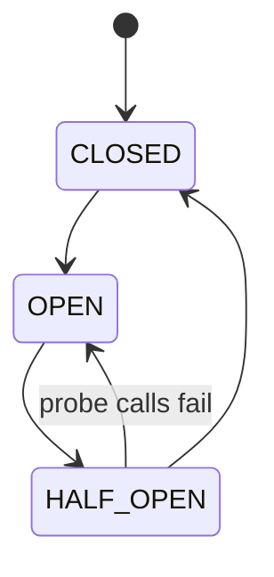
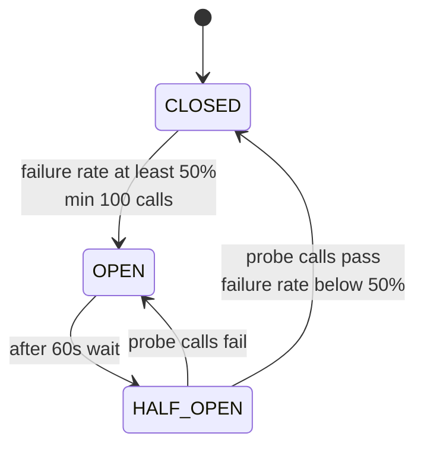
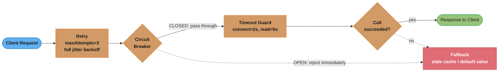
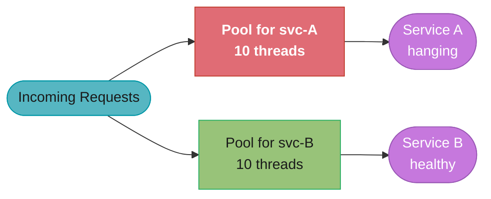
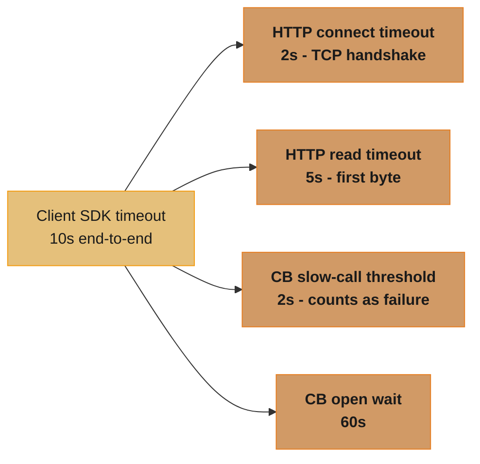
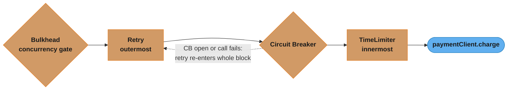
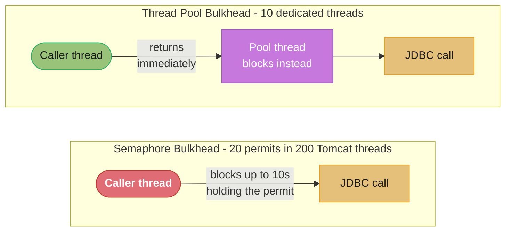
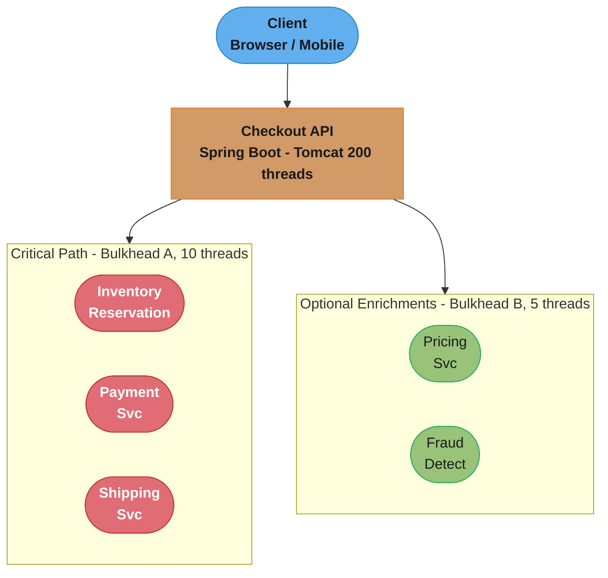

# Fault Tolerance Patterns

## 1. Concept Overview

Fault tolerance patterns are design strategies that allow a distributed system to continue operating correctly — or degrade gracefully — when one or more of its dependencies fail. In microservices and distributed architectures, partial failure is the norm, not the exception. Any service that makes a network call will eventually encounter timeouts, errors, and cascading failures. Without explicit fault tolerance, a single slow downstream dependency can exhaust all threads in a thread pool, bring down the entire service, and cascade that failure upstream.

The core patterns covered here are:

- **Circuit Breaker** — detect repeated failures and stop calling a failing dependency until it recovers
- **Retry with Jitter** — retry transient failures without amplifying load with synchronized retry storms
- **Bulkhead** — isolate failures by partitioning resources so one failing integration cannot consume all available capacity
- **Timeout Hierarchy** — enforce explicit time limits at every integration boundary
- **Fallback** — return a degraded but acceptable response when the primary path fails

---

## 2. Intuition

One-line analogy: A circuit breaker in your house cuts the circuit when a fault is detected to prevent the wiring from catching fire — and it only resets after you physically go check whether the fault has been fixed.

Mental model: Imagine a water treatment plant. If one pipe bursts, isolation valves (bulkheads) prevent the entire system from flooding. Pressure relief valves (circuit breakers) open when pressure exceeds safe limits. Engineers (retry logic) go back and try the repair after a cool-down period, but they don't all rush back at the exact same second (jitter).

Why it matters: The 2021 Facebook outage took down WhatsApp, Instagram, and Facebook itself because a BGP configuration change caused a cascading failure that the internal systems had no circuit breaking for. The retry storms from millions of clients hammering reconnecting servers made recovery orders of magnitude slower.

Key insight: Fault tolerance is about failing fast and failing gracefully, not about preventing failures entirely. A system that detects failure quickly and returns a stale cache entry is worth more than one that hangs for 30 seconds before returning a 500 error.

---

## 3. Core Principles

**Fail fast, not slow.** A request that times out after 30 seconds while holding a thread and a database connection is far more damaging than one that returns a 503 in 50ms. Fast failure preserves capacity.

**Isolate failure domains.** One integration should never be able to exhaust capacity needed for unrelated integrations. A payment service slow-down should not block product catalog reads.

**Recover automatically.** Systems must be able to probe whether a dependency has recovered without human intervention. The HALF_OPEN state in the circuit breaker pattern does exactly this.

**Retry only what is safe to retry.** Idempotent operations (GET, PUT with a stable ID) are generally safe to retry. Non-idempotent operations (POST that creates a resource, a payment debit) require careful deduplication before retrying.

**Degrade gracefully.** A system that returns a slightly stale response, a default value, or a cached result is better than one that returns a hard error. Users tolerate degraded functionality; they do not tolerate blank pages.

**Use timeouts everywhere.** Every network call, every database query, every external API call needs an explicit timeout. The default timeout for many libraries is infinite. Infinite timeouts are the primary cause of thread pool exhaustion in production.

---

## 4. Types / Architectures / Strategies

### Circuit Breaker States

The circuit breaker operates as a finite state machine with three states:


*Three states cycle continuously — CLOSED to OPEN to HALF_OPEN to CLOSED — and a failed probe in HALF_OPEN sends the breaker back to OPEN instead of resetting.*

**CLOSED (normal operation)**
All requests flow through. The circuit breaker monitors the failure rate over a sliding window. When the failure rate exceeds `failureRateThreshold` (default: 50%) over at least `minimumNumberOfCalls` (default: 100), the circuit transitions to OPEN.

**OPEN (failure detected)**
All requests are immediately rejected with `CallNotPermittedException` without calling the downstream service. The circuit stays open for `waitDurationInOpenState` (default: 60 seconds). This gives the downstream service time to recover without being hammered with requests.

**HALF_OPEN (probing for recovery)**
After the wait duration expires, the circuit allows `permittedNumberOfCallsInHalfOpenState` (default: 10) probe requests through. If the failure rate among those probes is below the threshold, the circuit transitions back to CLOSED. If it is still above, the circuit returns to OPEN for another wait cycle.

### Sliding Window Types

**COUNT_BASED:** Tracks the last N calls. The failure rate is computed over the last `slidingWindowSize` calls. Simpler and lower memory overhead. Does not account for bursts of traffic (100 calls in 1 second vs. 100 calls in 1 hour have equal weight).

**TIME_BASED:** Tracks calls in the last N seconds. More accurate for bursty traffic patterns. Higher memory overhead because the number of calls in a window is unbounded.

### Retry Strategies

**Fixed delay:** Wait a constant duration between each attempt. Simple but dangerous in distributed systems — if all clients start retrying at the same time, they all retry at the same fixed interval, creating synchronized retry waves that can overwhelm a recovering service.

**Exponential backoff:** Double the delay on each attempt: 100ms, 200ms, 400ms, 800ms. Reduces retry storms compared to fixed delay, but if all clients start at the same time (e.g., after a service restart), they still retry in synchronized waves.

**Exponential backoff with full jitter:** Randomize the delay in the range [0, min(cap, base * 2^attempt)]. This is the gold standard. It fully desynchronizes retries across thousands of clients.

**Exponential backoff with equal jitter:** Halfway between exponential and full jitter: base/2 + random(0, base/2). Guarantees a minimum wait but still decorrelates retries.

### Bulkhead Strategies

**Semaphore bulkhead:** Limits the number of concurrent calls to a dependency. When the semaphore count is exhausted, new calls are rejected immediately (or wait for a configurable duration). Very lightweight — no threads involved. Suitable for non-blocking code.

**Thread pool bulkhead:** Executes each call to a dependency in a dedicated, isolated thread pool. When the pool is saturated, new calls are rejected. Adds a thread-switch overhead (~100 microseconds) but provides complete isolation — a hung downstream call cannot even hold a thread from the shared server thread pool.

### Fallback Strategies

**Cached response:** Return the last successful response from a local or distributed cache. Works well for read-heavy data (product catalog, user profile, configuration). Requires TTL tuning to avoid stale data becoming dangerous.

**Default value:** Return a safe, static default. Example: return `isFeatureEnabled = false` if the feature flag service is down. Works for non-critical enrichments.

**Degraded mode:** Return a partial response with reduced functionality. Example: return a product list without personalized recommendations if the recommendation engine is unavailable.

**Fail open / fail closed:** For authorization systems, decide whether a failure grants access (fail open) or denies access (fail closed). Security-critical systems should always fail closed.

---

## 5. Architecture Diagrams

### Circuit Breaker State Machine


*The 50% failure-rate threshold (over a 100-call minimum) trips CLOSED to OPEN; after the 60s wait, HALF_OPEN probes decide whether to close again or reopen — the HALF_OPEN-to-OPEN edge is the transition most implementations forget to test (see Pitfall 6, §10).*

### Request Flow with Circuit Breaker + Retry + Fallback


*Retry wraps the circuit breaker, which wraps the timeout guard — matching the decoration order in §6 — so an OPEN breaker and a timed-out call both funnel into the same fallback path.*

### Bulkhead Isolation


*Service A hangs and exhausts its own 10-thread pool, but Service B's separate 10-thread pool keeps serving traffic untouched. Without bulkheads, Service A would instead exhaust the shared pool of 200 threads and starve Service B too.*

### Timeout Hierarchy


*Each inner timeout must fire strictly before the one that wraps it: the 5s read timeout must trip before the 10s SDK budget expires, and the circuit breaker's 2s slow-call threshold must trip before the 5s read timeout — otherwise slow-call protection never engages (Pitfall 4, §10).*

---

## 6. How It Works — Detailed Mechanics

### Resilience4j Circuit Breaker Configuration

```java
import io.github.resilience4j.circuitbreaker.CircuitBreaker;
import io.github.resilience4j.circuitbreaker.CircuitBreakerConfig;
import io.github.resilience4j.circuitbreaker.CircuitBreakerRegistry;

import java.io.IOException;
import java.time.Duration;
import java.util.concurrent.TimeoutException;

CircuitBreakerConfig config = CircuitBreakerConfig.custom()
    // Sliding window type: COUNT_BASED tracks last N calls
    // TIME_BASED tracks calls in last N seconds
    .slidingWindowType(CircuitBreakerConfig.SlidingWindowType.COUNT_BASED)
    .slidingWindowSize(100)               // track last 100 calls
    .minimumNumberOfCalls(20)             // need at least 20 calls before evaluating
    .failureRateThreshold(50)             // open when >= 50% fail
    .slowCallRateThreshold(80)            // also open when >= 80% are slow
    .slowCallDurationThreshold(Duration.ofSeconds(2)) // "slow" = > 2s
    .waitDurationInOpenState(Duration.ofSeconds(60))  // stay open for 60s
    .permittedNumberOfCallsInHalfOpenState(10)        // probe with 10 calls
    .automaticTransitionFromOpenToHalfOpenEnabled(true)
    .recordExceptions(IOException.class, TimeoutException.class)
    // Do not count business exceptions as failures
    .ignoreExceptions(BusinessException.class)
    .build();

CircuitBreakerRegistry registry = CircuitBreakerRegistry.of(config);
CircuitBreaker circuitBreaker = registry.circuitBreaker("payment-service");

// Decorate a supplier
Supplier<PaymentResponse> decoratedSupplier = CircuitBreaker
    .decorateSupplier(circuitBreaker, () -> paymentClient.charge(request));

// Execute with fallback
Try.ofSupplier(decoratedSupplier)
    .recover(CallNotPermittedException.class, ex -> getCachedResponse(request))
    .recover(IOException.class, ex -> getDefaultResponse(request))
    .get();
```

**In plain terms.** "Over the last 100 calls, once at least 20 have happened, if half of them
failed then stop calling and come back in a minute."

Every one of those knobs is a guard against a different way the breaker misbehaves. The window
sets how much history counts, the minimum stops a two-call sample from tripping it, the
threshold sets how bad is bad enough, and the wait duration sets how long the downstream gets
to recover unbothered.

| Symbol | What it is |
|--------|------------|
| `slidingWindowSize = 100` | How many recent calls the failure rate is computed over |
| `minimumNumberOfCalls = 20` | Floor before the rate is even evaluated. Below this the breaker stays CLOSED no matter what |
| `failureRateThreshold = 50` | Percent of the window that must fail to trip. `50` means half |
| `slowCallDurationThreshold = 2s` | A call slower than this counts as slow even if it succeeds |
| `slowCallRateThreshold = 80` | Percent slow calls that also trips the breaker |
| `waitDurationInOpenState = 60s` | How long OPEN rejects everything before probing |
| `permittedNumberOfCallsInHalfOpenState = 10` | Probe budget on the way back to CLOSED |

**Walk one example.** A service at 1000 rps that starts failing half its calls:

```
  calls seen so far :   2 failed / 2 total  = 100% fail rate
                        but 2 < minimumNumberOfCalls (20) -> NOT evaluated, stays CLOSED

  calls seen so far :  10 failed / 20 total =  50% fail rate
                        20 >= 20 and 50 >= 50 -> trips OPEN

  OPEN for 60s at 1000 rps :  60 x 1000 = 60,000 calls rejected instantly
                              downstream receives ZERO load for a full minute

  HALF_OPEN probe budget   :  10 calls
                              10 x 50% = 5 failures reopens it
                              4 or fewer failures -> back to CLOSED
```

Drop `minimumNumberOfCalls` to its default of 100 on a low-traffic service and the opposite
failure appears: 30 failures out of 30 calls is a 100% failure rate the breaker never acts on,
because it is still waiting for call number 100. The minimum is a statistical-significance
guard in both directions.

### Resilience4j Metrics Events

```java
// Listen to state transitions for alerting
circuitBreaker.getEventPublisher()
    .onStateTransition(event -> {
        log.warn("Circuit breaker {} transitioned from {} to {}",
            event.getCircuitBreakerName(),
            event.getStateTransition().getFromState(),
            event.getStateTransition().getToState());
        meterRegistry.counter("circuit_breaker.state_transition",
            "name", event.getCircuitBreakerName(),
            "from", event.getStateTransition().getFromState().name(),
            "to",   event.getStateTransition().getToState().name())
            .increment();
    });
```

### Retry with Exponential Backoff and Full Jitter

BROKEN — fixed delay causes synchronized retry storms:

```java
// BROKEN: all clients that started failing at t=0 will retry at exactly
// t+1s, t+2s, t+3s. When the service restarts, a thundering herd of
// synchronized retries arrives, immediately overloading the recovering service.
RetryConfig broken = RetryConfig.custom()
    .maxAttempts(3)
    .waitDuration(Duration.ofSeconds(1))  // fixed delay: t+1s, t+2s, t+3s
    .retryExceptions(IOException.class)
    .build();
```

FIX — full jitter fully desynchronizes retries:

```java
// FIX: exponential backoff with full jitter
// delay = random(0, min(cap, base * 2^attempt))
// attempt 0: random(0, 100ms)
// attempt 1: random(0, 200ms)
// attempt 2: random(0, 400ms)
// capped at 10s

RetryConfig retryConfig = RetryConfig.custom()
    .maxAttempts(3)
    .intervalFunction(IntervalFunction.ofExponentialRandomBackoff(
        Duration.ofMillis(100),  // base delay
        2.0,                     // multiplier
        Duration.ofSeconds(10))) // cap
    .retryOnException(e -> e instanceof IOException || e instanceof TimeoutException)
    .retryOnResult(response -> response.getStatusCode() == 429)  // also retry on rate limit
    .build();

// Manual implementation for clarity:
long jitteredDelay(int attempt, long baseMs, long capMs) {
    long exponential = (long) (baseMs * Math.pow(2, attempt));
    long capped = Math.min(capMs, exponential);
    return ThreadLocalRandom.current().nextLong(0, capped);
}
```

**What this actually says.** "Pick the ceiling that doubles every attempt, then throw a dart
anywhere between zero and that ceiling."

The exponent grows the *window*; the random pick spreads clients *inside* the window. Both
halves are load-bearing. Exponential alone still fires every client at the same instant —
it just moves that instant further out.

| Symbol | What it is |
|--------|------------|
| `baseMs` | First-attempt ceiling, `100`ms here. Sets the scale of the whole schedule |
| `attempt` | Zero-indexed retry number. `0` is the first retry, not the original call |
| `2^attempt` | The doubling. `1, 2, 4, 8, ...` |
| `capMs` | Hard ceiling, `10s`. Stops the doubling from reaching hours by attempt 20 |
| `min(cap, base * 2^attempt)` | The ceiling actually in force for this attempt |
| `random(0, ceiling)` | Full jitter. Uniform pick, so the expected delay is half the ceiling |

**Walk one example.** The three attempts this config allows, and where clients land:

```
                 base x 2^attempt    ceiling after cap    delay drawn from   mean delay
  attempt 0       100 x 1 =  100          100 ms          [0, 100)             50 ms
  attempt 1       100 x 2 =  200          200 ms          [0, 200)            100 ms
  attempt 2       100 x 4 =  400          400 ms          [0, 400)            200 ms

  worst-case added latency :  100 + 200 + 400 =  700 ms
  expected added latency   :   50 + 100 + 200 =  350 ms

  10,000 clients all failing at t=0, attempt 0:
    fixed delay 1s  ->  all 10,000 arrive in the same millisecond at t=1000ms
    full jitter     ->  10,000 spread uniformly over 100 ms = ~100 per ms
```

That last pair is the whole point. The retry count is identical; only the *arrival shape*
changed, and a recovering service survives 100 requests per millisecond where 10,000 at once
kills it again.

### Retry Amplification Across a Call Chain

Retries multiply, they do not add. With `r` total attempts allowed at every hop of an `n`-hop
chain, one user request can become `r^n` requests at the deepest service.

```
  total requests at depth n  =  r ^ n
```

**Read it like this.** "Every layer that retries multiplies the layer below it, so three
polite retries at three layers is a 27x hammer at the bottom."

Each team sets `maxAttempts(3)` locally and considers it conservative. Nobody owns the
product, which is why the deepest service — usually the database — is the one that dies.

| Symbol | What it is |
|--------|------------|
| `r` | Total attempts per hop, including the original. `maxAttempts(3)` means `r = 3` |
| `n` | Number of chained services that each independently retry |
| `r^n` | Requests reaching the deepest service per one user request |

**Walk one example.** The same `maxAttempts(3)` at every hop, under 1000 rps of user traffic:

```
  hops n     amplification r^n     load at the deepest service (user traffic 1000 rps)
    1              3^1 =   3                 3,000 rps
    2              3^2 =   9                 9,000 rps
    3              3^3 =  27                27,000 rps
    4              3^4 =  81                81,000 rps

  A database sized for 1000 rps sees 27,000 rps at n = 3. It does not recover;
  every retry it fails generates three more.
```

The defence is to retry at exactly one layer — usually the outermost, closest to the user —
and set `maxAttempts(1)` everywhere else, or to spend a shared retry budget (retry only while
retries are under ~10% of total traffic) rather than a per-call count.

### Bulkhead Configuration

```java
// Semaphore bulkhead — lightweight, no thread overhead
BulkheadConfig semaphoreBulkhead = BulkheadConfig.custom()
    .maxConcurrentCalls(25)          // max 25 concurrent calls to this service
    .maxWaitDuration(Duration.ofMillis(100))  // wait up to 100ms for a permit
    .build();

// Thread pool bulkhead — full isolation, but adds thread switch overhead
ThreadPoolBulkheadConfig threadPoolBulkhead = ThreadPoolBulkheadConfig.custom()
    .maxThreadPoolSize(10)      // dedicated thread pool of 10 threads
    .coreThreadPoolSize(5)
    .queueCapacity(20)          // queue up to 20 waiting requests
    .keepAliveDuration(Duration.ofMillis(20))
    .build();

// Choosing between them:
// Semaphore: use when calling code is already async/reactive (non-blocking)
// Thread pool: use when calling code is synchronous and you want complete isolation
```

**The idea behind it.** "A concurrency limit is a throughput limit in disguise — divide the
permits by how long each call holds one and you have the requests per second you just capped
yourself at."

This is Little's Law read backwards. You configure `maxConcurrentCalls` because it sounds like
a safety number, but what you actually chose was a hard rps ceiling, and nobody notices until
traffic reaches it.

| Symbol | What it is |
|--------|------------|
| `maxConcurrentCalls = 25` | Permits in flight at once. The `L` in Little's Law |
| `latency` | How long one call holds its permit. The `W` |
| `throughput = permits / latency` | The `L / W` rearrangement — your actual rps ceiling |
| `maxWaitDuration = 100ms` | How long a caller waits for a permit before being rejected |
| `queueCapacity = 20` | Thread-pool variant: requests parked ahead of the 10 threads |

**Walk one example.** The two bulkheads in this config, at a 200 ms downstream latency:

```
  semaphore bulkhead
    25 permits / 0.200 s per call  =  125 rps ceiling
    at 150 rps offered, 25 rps have no permit -> rejected after waiting 100 ms

  thread pool bulkhead
    10 threads  / 0.200 s per call =   50 rps ceiling
    queue of 20 requests drains at 50 rps -> 20 / 50 = 0.400 s = 400 ms of queue wait
    a request that queues therefore sees 400 + 200 = 600 ms, not 200 ms

  now the pitfall-5 case: JDBC call blocking 10 s, 20 permits
    20 permits / 10 s = 2 rps ceiling
    the other 180 Tomcat threads are parked on the semaphore, still consumed
```

The queue is the term people add for comfort and regret later. A queue does not raise
throughput at all — it is fixed at `threads / latency` — it only converts rejection into
latency. Set `queueCapacity` to zero if you would rather shed load than serve 600 ms responses.

### Composing All Patterns Together


*Decoration order is nesting order, not call order: Bulkhead gates entry, Retry is outermost around Circuit Breaker, and Circuit Breaker wraps TimeLimiter around the actual call — so every retry re-enters the whole circuit-breaker-protected block below it, and the breaker's failure count updates on each attempt.*

```java
@Service
public class ResilientPaymentService {

    private final CircuitBreaker circuitBreaker;
    private final Retry retry;
    private final Bulkhead bulkhead;
    private final TimeLimiter timeLimiter;
    private final PaymentClient paymentClient;
    private final PaymentCacheService cacheService;

    public PaymentResponse charge(PaymentRequest request) {
        // Decoration order matters:
        // TimeLimiter wraps the actual call (innermost)
        // CircuitBreaker wraps TimeLimiter
        // Retry wraps CircuitBreaker (outermost — retries the whole CB-protected call)
        // Bulkhead enforces concurrency limits before any of the above

        Supplier<CompletableFuture<PaymentResponse>> futureSupplier =
            () -> CompletableFuture.supplyAsync(() -> paymentClient.charge(request));

        Supplier<CompletableFuture<PaymentResponse>> timeLimited =
            TimeLimiter.decorateFutureSupplier(timeLimiter, futureSupplier);

        Supplier<CompletableFuture<PaymentResponse>> cbProtected =
            CircuitBreaker.decorateSupplier(circuitBreaker, timeLimited);

        Supplier<CompletableFuture<PaymentResponse>> retried =
            Retry.decorateSupplier(retry, cbProtected);

        Supplier<CompletableFuture<PaymentResponse>> bulkheaded =
            Bulkhead.decorateSupplier(bulkhead, retried);

        return Try.ofSupplier(bulkheaded)
            .flatMap(f -> Try.of(f::get))
            .recover(ex -> cacheService.getLastSuccessful(request.getUserId()))
            .getOrElseThrow(ex -> new ServiceUnavailableException("Payment service unavailable", ex));
    }
}
```

### Timeout Hierarchy in Practice

```java
// Why all three timeouts are necessary:
// 1. Connect timeout: prevents hanging during TCP handshake (firewall drop)
// 2. Read timeout: prevents hanging waiting for a slow response after connecting
// 3. Circuit breaker slow-call threshold: counts slow calls as failures even if
//    they eventually succeed, to trip the breaker before the retry/timeout layer does

OkHttpClient httpClient = new OkHttpClient.Builder()
    .connectTimeout(2, TimeUnit.SECONDS)   // TCP connect must complete in 2s
    .readTimeout(5, TimeUnit.SECONDS)      // must receive first byte within 5s
    .writeTimeout(5, TimeUnit.SECONDS)     // must finish sending request within 5s
    .callTimeout(10, TimeUnit.SECONDS)     // total end-to-end limit (includes retries in OkHttp)
    .build();

// Scenario: connect succeeds in 1s, but server accepts connection and then
// does nothing (e.g., stuck in GC). Without readTimeout, this hangs forever.
// With readTimeout=5s, the call fails after 6s (1s connect + 5s read).
// The circuit breaker's slowCallDurationThreshold=2s means this call is
// counted as slow even if it eventually returns data in 3s.
```

**Stated plainly.** "Each timeout must be strictly smaller than the one wrapping it, or the
outer layer fires first and the inner one never gets to do its job."

The ordering is the entire design. Timeouts are not independent knobs; they are a nested
budget, and any inversion silently disables a layer you believe is protecting you.

| Symbol | What it is |
|--------|------------|
| `connectTimeout = 2s` | TCP handshake budget. Catches a firewall silently dropping SYNs |
| `readTimeout = 5s` | Budget for the first response byte after connecting |
| `callTimeout = 10s` | Total end-to-end wall clock, retries included |
| `slowCallDurationThreshold = 2s` | Breaker's "slow" line. Must sit *below* `readTimeout` |
| worst single attempt | `connectTimeout + readTimeout` — the two run in sequence |

**Walk one example.** The budget in this config, and where it runs out:

```
  worst single attempt   :  2 s connect  +  5 s read   =  7 s
  3 attempts of that     :  7 x 3                      = 21 s
  callTimeout            :                               10 s

  10 s < 21 s  ->  the call is killed mid-attempt-2. The third retry never happens,
                   and the caller sees a timeout, not a retry-exhausted error.

  the pitfall-4 inversion:
    readTimeout 3 s  ,  slowCallDurationThreshold 5 s
    every call dies at 3 s, so no call ever reaches 5 s
    slow-call counter increments : 0, forever
    slowCallRateThreshold is dead config
```

The fix is to make the inequality explicit and check it in a test:
`slowCallDurationThreshold < readTimeout < callTimeout`, and
`callTimeout >= maxAttempts x (connectTimeout + readTimeout)` if you actually want every retry
to get its chance.

---

## 7. Real-World Examples

### Netflix and the Origin of Hystrix

Netflix built Hystrix in 2011 after discovering that a single failing downstream service could bring down their entire API server. One of their services had an infinite default timeout on HTTP connections. A single slow database node caused all 400 threads in the thread pool to hang waiting for a response that never came. The API server appeared healthy (it was accepting connections) but was not processing any requests. The fix was Hystrix, which introduced circuit breaking and thread pool bulkheads to the JVM ecosystem. Hystrix was eventually deprecated in 2018 in favor of Resilience4j.

### Amazon's Retry Storms During EC2 Recovery

During the 2011 US-East EC2 outage, Amazon's EBS service experienced a feedback loop where retry storms from customers amplified the load on a recovering system, turning what would have been a 30-minute outage into a multi-day event. The synchronized retry behavior from tens of thousands of instances retrying at fixed intervals overwhelmed the storage nodes as they attempted to restart. AWS subsequently published best practices requiring exponential backoff with full jitter for all AWS SDK retries.

### DoorDash Bulkhead Failure Pattern

DoorDash's order fulfillment service suffered an outage in 2022 where their restaurant availability lookup service (which enriches order data) started returning slow responses. Because there was no bulkhead between the availability service client and the order placement client, the shared thread pool was exhausted. New order placement requests — which did not even need availability data — were rejected. Post-incident, they introduced semaphore bulkheads with strict limits (15 concurrent calls) per downstream integration.

### Google's Client-Side Throttling

Google's internal SRE book describes a scenario where a cascading failure in their ad serving system was caused by retry amplification. A 10% failure rate, with clients retrying 3 times each, resulted in a 30% increase in total requests — which pushed the failure rate higher, causing more retries in a feedback loop. The fix was client-side adaptive throttling, where clients track their own accept rate and self-throttle before sending requests that are statistically likely to be rejected.

---

## 8. Tradeoffs

### Circuit Breaker: COUNT_BASED vs. TIME_BASED Sliding Window

| Dimension            | COUNT_BASED                          | TIME_BASED                            |
|----------------------|--------------------------------------|---------------------------------------|
| Memory usage         | Fixed: O(windowSize)                 | Variable: O(calls per window second)  |
| Traffic sensitivity  | Insensitive to time distribution     | Accounts for bursty traffic patterns  |
| Accuracy             | Equal weight to old and recent calls | Recent calls dominate                 |
| Best for             | Steady-state traffic                 | Bursty or variable traffic            |

### Retry Strategies Comparison

| Strategy                    | Desynchronization | Minimum Wait Guarantee | Complexity |
|-----------------------------|-------------------|------------------------|------------|
| Fixed delay                 | None              | Yes                    | Low        |
| Exponential backoff         | Low               | Yes                    | Low        |
| Full jitter                 | High              | No (can be 0)          | Medium     |
| Equal jitter                | Medium            | Yes (base/2)           | Medium     |
| Decorrelated jitter         | Very high         | No                     | High       |

### Bulkhead: Semaphore vs. Thread Pool

| Dimension           | Semaphore Bulkhead           | Thread Pool Bulkhead             |
|---------------------|------------------------------|----------------------------------|
| Thread overhead     | Zero                         | One thread per concurrent call   |
| Isolation           | Partial (borrows caller thread) | Full (own thread pool)         |
| Async compatibility | Ideal for reactive/async     | Required for blocking calls      |
| Hung call impact    | Ties up a caller thread      | Ties up only pool thread         |
| Latency overhead    | Negligible                   | ~100 microseconds context switch |

### Hystrix vs. Resilience4j

| Dimension              | Hystrix (deprecated)            | Resilience4j                        |
|------------------------|---------------------------------|-------------------------------------|
| Threading model        | Thread-per-command (heavy)      | Lightweight, decorator-based        |
| Reactive support       | RxJava only                     | Project Reactor, RxJava, plain Java |
| Maintenance            | In maintenance mode since 2018  | Actively maintained                 |
| Modularity             | Monolithic jar                  | Individual modules (pick what you need) |
| Metrics integration    | Archaius + Servo                | Micrometer (Prometheus, Datadog, etc.) |
| Spring Boot support    | Spring Cloud Netflix (legacy)   | Spring Cloud CircuitBreaker SPI     |
| Configuration          | Code + properties files         | Code, YAML, or @Bean config         |

---

## 9. When to Use / When NOT to Use

### Use circuit breakers when:
- Calling any synchronous remote dependency (HTTP, gRPC, database, cache)
- The dependency has known failure modes (timeouts, 5xx errors, connection refused)
- Recovery from failures is automatic (service restarts, auto-scaling)
- You have a fallback strategy available

### Do NOT use circuit breakers when:
- The operation is idempotent and cheap enough that retrying without a breaker is fine
- You are calling a local in-process method (circuit breakers add overhead for no reason)
- You need the call to fail immediately without any state management (just use timeouts)

### Use retry with jitter when:
- The failure is transient (network blip, rate limit, leader election in progress)
- The operation is idempotent or you have deduplication at the receiver
- You have seen intermittent 429, 503, or IO errors in production logs

### Do NOT retry when:
- The error is permanent (400 Bad Request, 404 Not Found, authentication failure)
- The operation is non-idempotent and you have no deduplication token
- The circuit breaker is OPEN — retrying into an open circuit wastes time

### Use bulkheads when:
- One integration is known to be unstable or slow (legacy service, third-party API)
- You have multiple downstream integrations sharing a common thread pool
- You need SLA isolation (critical path must not be affected by non-critical path)

### Use fallbacks when:
- The data is available from a secondary source (cache, database, config file)
- The degraded response is better than a hard error for the user
- You have defined and tested the fallback path in production

---

## 10. Common Pitfalls

### Pitfall 1: Retrying Non-Idempotent Operations (Production War Story)

An e-commerce company's order service used a retry decorator on all outbound HTTP calls globally. One day, the payment processor began intermittently returning 503 after successfully processing the payment (the response was lost in a network partition). The retry logic retried the request, which succeeded again — charging the customer twice. The incident affected 3,400 orders before the on-call engineer disabled retries for the payment path. The fix: never apply retry decorators globally. Tag payment endpoints with a `@NonRetryable` annotation or use idempotency keys with the payment processor so duplicate submissions are detected server-side.

### Pitfall 2: Circuit Breaker Without Fallback (Cascading Failure)

A team deployed circuit breakers on all downstream calls but did not implement fallbacks. When the product recommendation service went down, the circuit breaker opened correctly and stopped calling the service. However, the API returned a 500 error to all clients because no fallback was configured. The 500s triggered the circuit breaker on the API gateway level, which then marked the entire product API as degraded. The recommendation service being down brought down the product catalog. The fix: always test the fallback path in staging with a chaos engineering tool before deploying circuit breakers.

### Pitfall 3: Forgetting `minimumNumberOfCalls` (Flapping Circuit Breaker)

A team set `failureRateThreshold=50%` but left `minimumNumberOfCalls` at the default of 100. On service startup, the first two health-check calls failed (the downstream service was slow to start). The failure rate was 100%, but only 2 calls had been made. The circuit breaker opened immediately, blocking all real traffic for 60 seconds on every deployment. The fix: always set `minimumNumberOfCalls` to a value that represents a statistically meaningful sample size for your traffic level (typically 20–50 for low-traffic services).

### Pitfall 4: Timeout Mismatch (Silent Data Loss)

A team configured a read timeout of 3 seconds on their HTTP client but a circuit breaker slow-call threshold of 5 seconds. The HTTP client would time out and throw an IOException at 3 seconds, which was recorded as a failure. But the circuit breaker's slow-call counter was never triggered because calls never lasted 5 seconds — they failed at 3 seconds. This meant the "slow call" protection was completely bypassed. The fix: always set `slowCallDurationThreshold` less than the HTTP read timeout. If the read timeout is 3s, set slowCallDurationThreshold to 2s or less.

### Pitfall 5: Semaphore Bulkhead in a Blocking Thread Model

A team used a semaphore bulkhead (maxConcurrentCalls=20) for a blocking JDBC database call in a Tomcat-based Spring MVC application (200 threads default). Each JDBC call could block for up to 10 seconds under load. With 20 permits, only 20 threads could call the database at once. The other 180 Tomcat threads were queueing or blocking on the semaphore. Because the semaphore bulkhead ties up the caller's thread, it provided no actual isolation — the caller threads were still consumed. The fix: use a thread pool bulkhead with its own dedicated executor so that the JDBC call is executed in an isolated pool and the Tomcat threads are not held.


*With a semaphore bulkhead, the Tomcat caller thread itself blocks for up to 10s per JDBC call — 20 permits still leaves 180 of the 200 Tomcat threads queueing. A thread pool bulkhead lets the caller thread return immediately; only the isolated pool thread blocks, which is why it — not the semaphore — provides real isolation.*

### Pitfall 6: Not Testing the HALF_OPEN State

Most teams test CLOSED and OPEN states but never test HALF_OPEN. In one incident, a bug in a custom `CircuitBreakerStatePredicator` caused the circuit to immediately transition back to OPEN when the first probe call in HALF_OPEN returned a slow (but successful) response. Because `slowCallRateThreshold` was 0% in HALF_OPEN (the team had not configured it separately), a single 3-second probe call tripped the circuit again. The service never recovered automatically and required a deployment to fix. The fix: write integration tests that simulate HALF_OPEN probe behavior, including slow-but-successful responses.

---

## 11. Technologies & Tools

| Technology            | Role                                                          | Notes                                       |
|-----------------------|---------------------------------------------------------------|---------------------------------------------|
| Resilience4j          | Circuit breaker, retry, bulkhead, time limiter, rate limiter  | Lightweight, modular, Micrometer integration |
| Spring Cloud CircuitBreaker | Abstraction layer over Resilience4j (or Sentinel)       | Use when you want to swap implementations   |
| Hystrix               | Circuit breaker (Netflix OSS)                                 | Deprecated 2018, do not use for new projects |
| Sentinel (Alibaba)    | Circuit breaking + flow control + hotspot detection           | Popular in Chinese tech stack                |
| Failsafe              | Retry, circuit breaker, timeout, hedge                        | Lightweight alternative to Resilience4j     |
| Polly (.NET)          | .NET equivalent of Resilience4j                               | Reference architecture for .NET services    |
| AWS SDK               | Built-in retry with exponential jitter on all AWS API calls   | Configurable via ClientConfiguration        |
| Istio / Envoy         | Circuit breaking and retry at the service mesh layer          | No code changes required; config-driven     |
| Chaos Monkey          | Injects faults to test resilience (Netflix)                   | Use to validate circuit breaker behavior    |
| Chaos Toolkit         | Open-source chaos engineering                                 | Run fault injection in CI/CD pipelines      |

### Spring Boot Integration (application.yaml)

```yaml
resilience4j:
  circuitbreaker:
    instances:
      payment-service:
        sliding-window-type: COUNT_BASED
        sliding-window-size: 100
        minimum-number-of-calls: 20
        failure-rate-threshold: 50
        slow-call-rate-threshold: 80
        slow-call-duration-threshold: 2s
        wait-duration-in-open-state: 60s
        permitted-number-of-calls-in-half-open-state: 10
        automatic-transition-from-open-to-half-open-enabled: true
        record-exceptions:
          - java.io.IOException
          - java.util.concurrent.TimeoutException
        ignore-exceptions:
          - com.example.BusinessException
  retry:
    instances:
      payment-service:
        max-attempts: 3
        wait-duration: 100ms
        enable-exponential-backoff: true
        exponential-backoff-multiplier: 2
        exponential-max-wait-duration: 10s
        retry-exceptions:
          - java.io.IOException
  bulkhead:
    instances:
      payment-service:
        max-concurrent-calls: 25
        max-wait-duration: 100ms
  timelimiter:
    instances:
      payment-service:
        timeout-duration: 5s
        cancel-running-future: true
```

---

## 12. Interview Questions with Answers

**Q: What are the three states of a circuit breaker and what triggers each transition?**
CLOSED is the normal state where all requests pass through; it transitions to OPEN when the failure rate exceeds the threshold over the minimum required calls. OPEN rejects all requests immediately without calling the downstream service; it transitions to HALF_OPEN after the `waitDurationInOpenState` expires. HALF_OPEN allows a limited number of probe calls through; it transitions back to CLOSED if the probe failure rate is below the threshold, or back to OPEN if it is still above. The most commonly forgotten transition is HALF_OPEN back to OPEN, which requires the probe calls to still be failing.

**Q: Why is fixed-delay retry dangerous in distributed systems?**
Fixed-delay retry causes synchronized retry storms. If 10,000 clients all encounter a failure at the same time (e.g., a brief service restart), they all retry at exactly t+1s, t+2s, t+3s. This creates a thundering herd that can overwhelm the recovering service with 10,000 simultaneous requests every second, potentially preventing it from ever recovering. The fix is exponential backoff with full jitter, which desynchronizes retries by randomizing the delay across the range [0, exponential_cap].

**Q: What is the difference between COUNT_BASED and TIME_BASED sliding windows?**
COUNT_BASED tracks the last N calls regardless of when they happened; TIME_BASED tracks all calls that occurred in the last N seconds. COUNT_BASED is simpler and has fixed memory overhead but treats a single failure in 1 second the same as a single failure spread over 10 minutes. TIME_BASED is more accurate for bursty traffic and gives more weight to recent failures, but has variable memory usage because the number of calls in a window depends on traffic volume.

**Q: When should you use a semaphore bulkhead vs. a thread pool bulkhead?**
Use a semaphore bulkhead when your code is already non-blocking or reactive, since it only limits concurrency without adding threads. The semaphore bulkhead does not actually isolate the caller's thread — if the call blocks, the caller's thread is still tied up, just limited in count. Use a thread pool bulkhead when making blocking synchronous calls (JDBC, blocking HTTP clients) and you need full thread isolation. The thread pool bulkhead executes the call in a separate thread pool, so a hung downstream call only consumes a thread in that pool, not in the main application thread pool.

**Q: Why do you need both a connect timeout and a read timeout? Is one sufficient?**
They protect against different failure modes. A connect timeout fires if the TCP handshake takes too long — this catches firewall drops, unreachable hosts, and network partitions that prevent the connection from being established. A read timeout fires if the connection is established but the server stops sending data — this catches servers that accept connections but hang internally (e.g., during a GC pause, deadlock, or resource exhaustion). A service can connect in 100ms but then hang for 30 seconds without sending any data. Without a read timeout, this hangs the calling thread indefinitely.

**Q: How does the circuit breaker's slow-call threshold interact with timeouts?**
The `slowCallDurationThreshold` must be set lower than the HTTP client's read timeout. If the HTTP read timeout fires at 5 seconds and throws an IOException, the call is recorded as a failure. The slow-call counter is never triggered because the call never lasted long enough to be classified as slow — it was classified as failed. To have slow-call rate protection work correctly, the slow-call threshold should be set to a value less than the read timeout (e.g., slowCallDurationThreshold=2s with readTimeout=5s).

**Q: What is a retry storm and how do you prevent it?**
A retry storm occurs when a large number of clients simultaneously retry requests to a recovering service, overwhelming it before it can fully start serving traffic. The recovery attempt fails under load, which triggers more retries, creating a feedback loop. Prevention strategies: full jitter on backoff delays to desynchronize retries; circuit breakers to stop retrying once the failure rate is high enough; server-side rate limiting to shed excess retry load; and exponential backoff caps to limit maximum retry frequency.

**Q: How do you make retries safe for non-idempotent operations?**
Use idempotency keys. The client generates a unique UUID per logical operation and sends it with every attempt. The server stores processed idempotency keys (in Redis or a database) with a TTL and returns the cached response if it receives a key it has already processed. This allows the client to safely retry on network errors without risk of double processing. Payment processors like Stripe, Braintree, and Adyen all support idempotency keys. A secondary approach is to make the operation idempotent by design: instead of "debit $50", send "debit $50 for order-id-123" with a unique order ID that is rejected on duplicate submission.

**Q: What happens when a Resilience4j circuit breaker is OPEN and a request comes in?**
The circuit breaker throws `CallNotPermittedException` immediately, without making any network call. The exception propagates up the call stack. If a fallback is configured (via `.recover(CallNotPermittedException.class, ...)` in `Try` or via `@CircuitBreaker(fallbackMethod=...)` in Spring), the fallback is invoked. If no fallback is configured, the exception propagates to the caller. Metrics are recorded: the circuit breaker emits a `call.not.permitted` event which Micrometer exposes as `resilience4j.circuitbreaker.calls` with `kind=not_permitted`.

**Q: How should you configure circuit breakers for startup and warmup scenarios?**
Set `minimumNumberOfCalls` high enough that the circuit breaker does not trip on the first few calls during startup. A common mistake is leaving `minimumNumberOfCalls=1` (or a low value), causing the circuit to open immediately if the first health-check call to a warming-up service fails. For services that take 10–30 seconds to warm up, combine: a startup health gate (don't accept traffic until the service is ready), a higher `minimumNumberOfCalls` (e.g., 50), and `waitDurationInOpenState` long enough for the downstream service to fully start (e.g., 90s vs. default 60s).

**Q: What is the Bulkhead pattern's relationship to Amdahl's Law?**
Amdahl's Law states that parallelism is limited by the sequential portion of a program. In the context of bulkheads, if one integration's thread pool is saturated, the overall system throughput is limited by that bottleneck regardless of how many threads other components have. Bulkheads enforce explicit capacity partitions so that one slow integration cannot capture more than its allotted share of resources. This is directly analogous to Amdahl's sequential bottleneck — without bulkheads, one synchronous dependency can serialize all requests through a single bottleneck.

**Q: What is the difference between a fallback and a compensating transaction?**
A fallback is an immediate alternative response that is returned when the primary call fails — it does not undo anything, it just provides a substitute result. A compensating transaction is a business-level mechanism that undoes a previously committed operation when a subsequent operation in the same saga fails (e.g., if payment succeeded but inventory reservation failed, the compensating transaction refunds the payment). Fallbacks are a resilience pattern; compensating transactions are a data consistency pattern in distributed transactions and sagas.

**Q: How does Resilience4j differ from Hystrix architecturally?**
Hystrix uses a thread-per-command model: each command type runs in its own dedicated thread pool, which provides isolation but adds significant thread overhead (thousands of threads for services with many integration points). Resilience4j uses a lightweight decorator model with no threads of its own — it wraps your existing callables with metrics and state management using Java 8 functional interfaces. Resilience4j is modular (you can include only circuit breaker, or only retry, without pulling in the rest), integrates natively with Micrometer, and supports reactive types (Mono, Flux) natively. Hystrix's reactive support was limited to RxJava 1.x.

**Q: How do you test circuit breaker behavior in integration tests?**
Use Resilience4j's `CircuitBreakerRegistry` to manually transition the circuit breaker to OPEN for testing fallback paths. Use WireMock or MockServer to simulate downstream failures (502, 503, connection refused, slow responses via response delays). Test all three states explicitly: CLOSED with success, CLOSED with failures accumulating, OPEN with fallback, HALF_OPEN with probe failures (stays OPEN), and HALF_OPEN with probe successes (transitions to CLOSED). Use Testcontainers with Toxiproxy to simulate network failures in realistic container-to-container calls.

**Q: What is adaptive throttling and when does it outperform static circuit breakers?**
Adaptive throttling (Google's approach) tracks the ratio of accepted to total requests from the client side and self-throttles before sending requests that are statistically likely to be rejected. The formula is: `throttle_probability = max(0, (requests - K * accepts) / (requests + 1))` where K is typically 2. When the server starts rejecting requests, the client automatically reduces its request rate proportionally. This is superior to static circuit breakers in scenarios with partial degradation — if the server is rejecting 30% of requests, adaptive throttling reduces client load by 30% proportionally, whereas a static circuit breaker only trips after the failure rate exceeds a fixed threshold (e.g., 50%).

---

## 13. Best Practices

**Configure per-integration, not globally.** Circuit breaker settings that work for a high-throughput payment service (slidingWindowSize=100, minimumNumberOfCalls=20) are wrong for a low-traffic admin endpoint (use smaller windows). Use `CircuitBreakerRegistry` with named configurations per downstream service.

**Always implement and test fallbacks.** A circuit breaker without a fallback merely converts a slow failure into a fast failure. Define the fallback strategy for every circuit breaker at design time, not after an incident.

**Set `minimumNumberOfCalls` appropriately for your traffic.** For a service that receives 10 requests per minute, set `minimumNumberOfCalls=5`, not the default 100. At 10 req/min, you would need 10 minutes of failures before the circuit trips with the default.

**Monitor circuit breaker state transitions as a critical alert.** A circuit breaker transitioning to OPEN is a production alert — it means your service has detected that a downstream dependency is failing at rate above your threshold. Wire state transitions to PagerDuty/OpsGenie, not just Grafana dashboards.

**Use idempotency keys for all retried mutating operations.** Generate a UUID per logical operation at the originating client and send it in a header (e.g., `Idempotency-Key: uuid`). Log the key at every layer for traceability.

**Set slow-call thresholds below read timeouts.** If your read timeout is 5 seconds, set `slowCallDurationThreshold` to 2–3 seconds so that slow calls contribute to circuit breaker state changes before the timeout fires.

**Use thread pool bulkheads for blocking calls.** Semaphore bulkheads do not prevent thread exhaustion in blocking code — they just limit how many threads can block on that specific call. For blocking JDBC or blocking HTTP calls, use thread pool bulkheads with dedicated pools.

**Test chaos scenarios in staging.** Use Chaos Monkey for Spring Boot, Toxiproxy, or Chaos Toolkit to inject latency, connection drops, and partial failures in staging environments. Verify that circuit breakers trip, fallbacks activate, and the system recovers without human intervention.

**Document the expected behavior for each circuit breaker.** Teams that are on-call need to know: what does it mean when `payment-service` circuit breaker opens? What is the fallback? What alert fires? How do you manually reset it if needed? Put this in a runbook linked from the alert.

---

## 14. Case Study

### E-Commerce Checkout Service: Multi-Layer Fault Tolerance

**Problem:** A large e-commerce platform's checkout service calls five downstream services: inventory reservation, pricing, payment, shipping quote, and fraud detection. Each service has different reliability characteristics. Payment is a third-party provider with an SLA of 99.5% (up to 43.8 hours of downtime per year). Fraud detection is a machine learning service that occasionally has elevated latency during model reloads. The checkout service was experiencing complete outages whenever payment or fraud detection degraded.

**Architecture:**


*Bulkhead A (10 threads) isolates the no-fallback critical path — inventory, payment, shipping — from Bulkhead B (5 threads); a slow fraud-detection model reload can never block checkout. This split is what took the error rate during downstream degradation from 100% to under 3% (see Results below).*

**Key Design Decisions:**

1. Critical path (inventory, payment, shipping) and optional enrichments (pricing, fraud) are in separate thread pool bulkheads. Fraud detection going slow cannot impact payment processing.

2. Payment circuit breaker: COUNT_BASED, window=50, failureRateThreshold=40%, waitDuration=30s. Tighter thresholds because payment failures have direct revenue impact.

3. Fraud detection circuit breaker: TIME_BASED, window=30s, failureRateThreshold=60%, slowCallThreshold=3s. Looser thresholds because fraud detection is a best-effort enrichment.

4. Fallbacks:
   - Payment: no fallback — fail the checkout if payment is unavailable. Return 503 with `Retry-After: 30` header.
   - Fraud detection: fallback to rule-based scoring (static rules in memory). Log a metric `fraud.fallback.activated` to track how often ML scoring is bypassed.
   - Pricing: fallback to cached price from Redis with a max-age of 5 minutes.

5. Retry policy: payment calls are not retried (non-idempotent without idempotency key support from the current vendor). Inventory and shipping calls use exponential backoff with full jitter, max 2 retries.

**Implementation Sketch:**

```java
@Configuration
public class ResilienceConfig {

    @Bean
    public CircuitBreaker paymentCircuitBreaker(CircuitBreakerRegistry registry) {
        CircuitBreakerConfig config = CircuitBreakerConfig.custom()
            .slidingWindowType(CircuitBreakerConfig.SlidingWindowType.COUNT_BASED)
            .slidingWindowSize(50)
            .minimumNumberOfCalls(10)
            .failureRateThreshold(40)
            .waitDurationInOpenState(Duration.ofSeconds(30))
            .permittedNumberOfCallsInHalfOpenState(5)
            .recordExceptions(IOException.class, TimeoutException.class)
            .build();
        CircuitBreaker cb = registry.circuitBreaker("payment", config);
        cb.getEventPublisher().onStateTransition(e ->
            alertingService.criticalAlert("Payment CB: " + e.getStateTransition()));
        return cb;
    }

    @Bean
    public ThreadPoolBulkhead criticalPathBulkhead(ThreadPoolBulkheadRegistry registry) {
        return registry.bulkhead("critical-path",
            ThreadPoolBulkheadConfig.custom()
                .maxThreadPoolSize(10)
                .coreThreadPoolSize(5)
                .queueCapacity(15)
                .build());
    }
}
```

**Results:** After deploying this architecture, the checkout service's error rate during downstream degradation events dropped from 100% (complete outage) to under 3% (only payment-dependent checkouts fail when the payment provider is down). Mean time to detection of downstream failures dropped from 4 minutes (human-observed from dashboards) to under 30 seconds (circuit breaker opens and fires an alert). Recovery from fraud detection ML model reloads became invisible to users — the static rule fallback handles traffic for the 15–45 seconds the model takes to reload.
