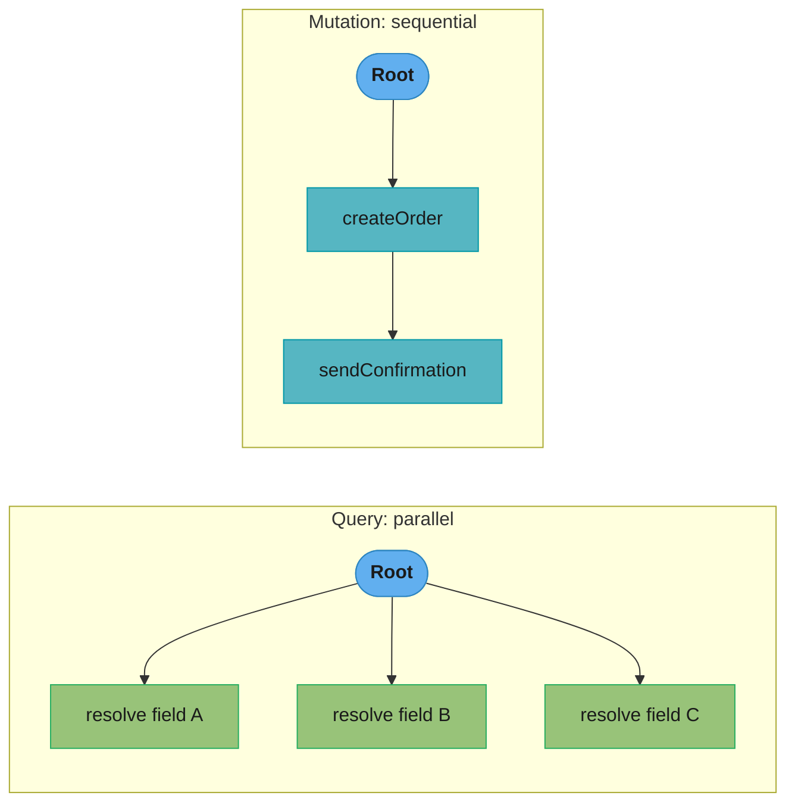
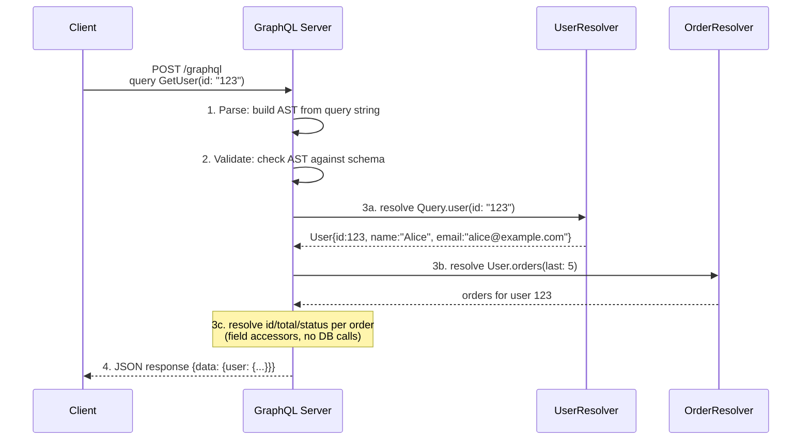
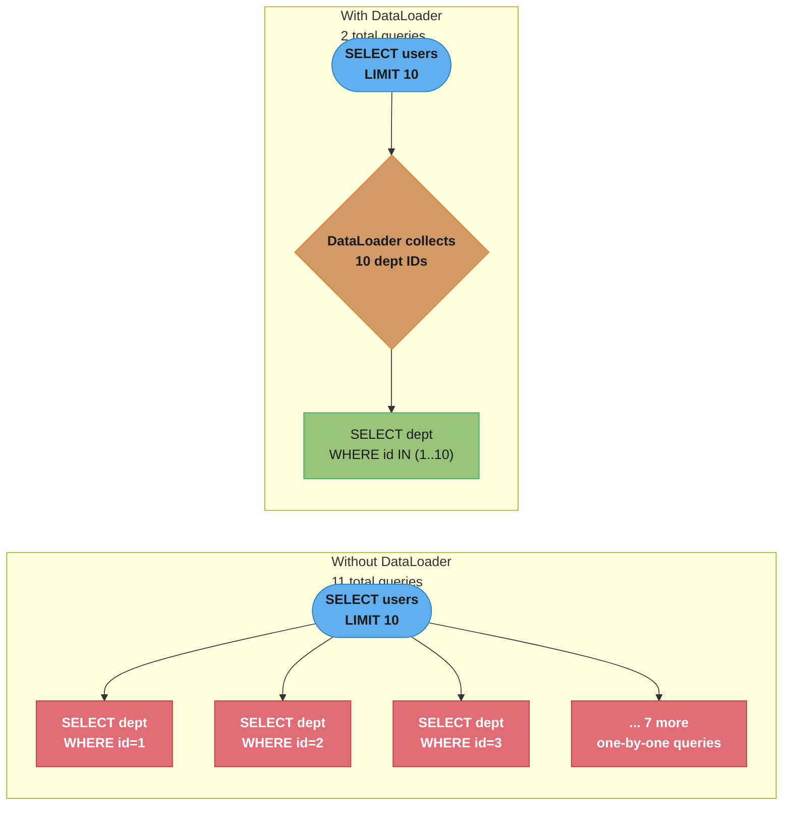
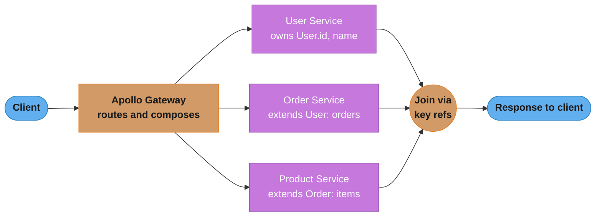
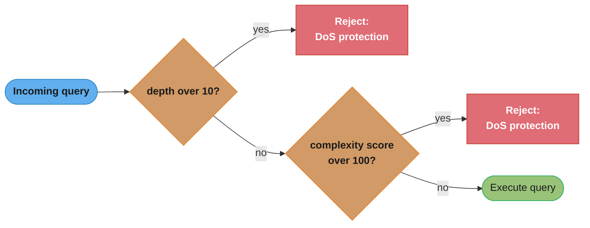
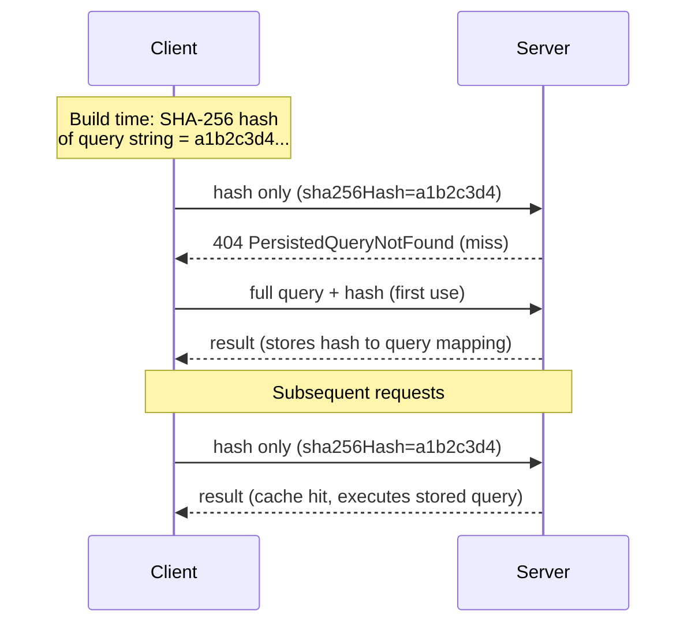

# GraphQL

## 1. Concept Overview

GraphQL is a query language for APIs and a runtime for executing those queries, developed by Facebook (Meta) in 2012 and open-sourced in 2015. Unlike REST, where the server defines what data each endpoint returns, GraphQL lets clients specify exactly what fields they need. This eliminates over-fetching (getting more data than needed) and under-fetching (needing multiple requests to get enough data).

GraphQL defines a strongly-typed schema as the contract between client and server. Clients send queries declaring the shape of data they want, mutations to change data, and subscriptions for real-time updates. The server executes queries by calling field resolvers and assembles the response matching the query shape.

---

## 2. Intuition

> **One-line analogy**: REST is a set of fixed restaurant menu items — you order what's on the menu and get exactly that, even if you only wanted the garnish. GraphQL is a custom order system — you specify exactly what you want (just the title, author, and first 3 comments of a post), and the kitchen prepares exactly that.

**Mental model**: The GraphQL schema defines all available types and fields. A client query is a tree selecting specific fields from that schema. The server executes the query by traversing this tree, calling resolvers for each field. Resolvers fetch data from databases, other APIs, or caches. The result mirrors the structure of the query.

**Why it matters**: Mobile apps particularly benefit from GraphQL — they can request only the fields needed for a specific view, reducing payload size and parse time on resource-constrained devices. For complex data models with many relationships, GraphQL eliminates the N+1 round-trip problem common in REST (one request for the root resource, then N requests for related resources).

**Key insight**: GraphQL's main operational challenges are not in the query language but in the runtime: the N+1 resolver problem (each field resolver independently queries the database), preventing abuse via unbounded queries, and schema evolution across many clients.

---

## 3. Core Principles

- **Schema-first**: The type system defines all available types, fields, and operations. Clients can only query what the schema allows.
- **Client-specified queries**: Clients declare exactly the shape of data they need — not the server.
- **Strongly typed**: Every field has a type. The runtime validates queries against the schema before execution.
- **Hierarchical**: Queries mirror the shape of the response. Nested fields are resolved by nested resolvers.
- **Introspection**: Clients can query the schema itself (field names, types, descriptions) to enable tooling and documentation.
- **Single endpoint**: Typically all GraphQL operations go to POST /graphql — a departure from REST's resource-based URL design.

---

## 4. Types / Architectures / Strategies

### 4.1 Schema Types

| Type | Description | Example |
|------|-------------|---------|
| Object type | Named set of fields | `type User { id: ID!, name: String! }` |
| Scalar | Leaf values | String, Int, Float, Boolean, ID, custom |
| Enum | Named constants | `enum Status { ACTIVE, INACTIVE }` |
| Interface | Abstract type (fields must be present) | `interface Node { id: ID! }` |
| Union | One of multiple types | `union SearchResult = User \| Post` |
| Input type | Object used as argument | `input CreateUserInput { name: String! }` |
| List | Array of a type | `[User]`, `[User!]!` |
| Non-null | Field cannot be null | `String!` |

### 4.2 Operations

| Operation | Purpose | Execution |
|-----------|---------|-----------|
| Query | Fetch data (read-only) | Parallel field resolution possible |
| Mutation | Modify data | Sequential (one at a time per spec) |
| Subscription | Real-time updates | WebSocket or SSE-based |



Per the GraphQL spec, query root fields may resolve in parallel, but mutation root fields execute strictly one after another — the reason `createOrder` is guaranteed to finish before `sendConfirmation` starts.

### 4.3 Schema Composition Approaches

| Approach | Description | Use Case |
|----------|-------------|---------|
| Schema stitching | Merge multiple schemas at gateway level | Legacy; more manual |
| Federation (Apollo) | Distributed schema with reference resolver pattern | Modern microservices |
| Monolithic schema | Single service owns entire schema | Simpler, fewer moving parts |

---

## 5. Architecture Diagrams

### GraphQL Request Lifecycle



The server treats one query as a four-stage pipeline — parse to an AST, validate against the schema, execute field resolvers (each independently callable), then collect results into a response tree that mirrors the query shape.

### N+1 Problem and DataLoader Solution

Query: list 10 users with their departments (`{ users { id name department { name } } }`).



Without batching, resolving each user's department independently fans out into 10 extra one-by-one queries (11 total); DataLoader collects every pending department ID and fetches them in a single `WHERE id IN (...)` query (2 total).

**The idea behind it.** "Query count grows with your result set instead of with your schema depth — so the cost of a page is set by how many rows it happens to return, not by how the query was written."

The name "N+1" hides the important property: N is not a constant you control at development time. It is the page size a client picked at runtime, which is why this bug passes every test written against three seed rows and then melts under a production page of 500.

| Symbol | What it is |
|--------|------------|
| 1 | The root query that fetches the list of users |
| N | One query per returned user, issued independently by the child field resolver |
| `1 + N` | Total round trips without batching |
| 2 | Total with DataLoader — the root query plus one batched `WHERE id IN (...)` |
| Batch window | The tick during which DataLoader accumulates pending keys before firing one query |
| Request cache | DataLoader's per-request memo, so a department requested by 10 users is fetched once |

**Walk one example.** Assume a modest 2 ms per database round trip:

```
                       queries       round-trip cost
  N = 10   no loader    1 + 10 = 11    11 x 2 ms  =  22 ms
           DataLoader            2      2 x 2 ms  =   4 ms

  N = 100  no loader   1 + 100 = 101   101 x 2 ms = 202 ms
           DataLoader            2      2 x 2 ms  =   4 ms
```

Note what the DataLoader column does: it stays at 2 queries and 4 ms while N grows tenfold.
The batched path is `O(1)` in round trips and the naive path is `O(N)`, so the gap is not a
constant speedup to be weighed against complexity — it widens without bound as clients ask for
larger pages. That asymmetry is why the Common Pitfalls section calls DataLoader mandatory
rather than recommended: there is no page size at which the naive resolver becomes acceptable
again, and the failure arrives on the day a client raises `first:` from 10 to 500.

### Apollo Federation Architecture



The gateway composes the three services' schemas, routes each field to the service that owns it, and joins the partial results back together using each type's `@key` reference.

---

## 6. How It Works — Detailed Mechanics

### 6.1 Schema Definition Language (SDL)

```graphql
schema {
  query: Query
  mutation: Mutation
  subscription: Subscription
}

type Query {
  user(id: ID!): User
  users(filter: UserFilter, first: Int, after: String): UserConnection!
  searchUsers(query: String!): [SearchResult!]!
}

type Mutation {
  createUser(input: CreateUserInput!): CreateUserPayload!
  updateUser(id: ID!, input: UpdateUserInput!): User!
  deleteUser(id: ID!): Boolean!
}

type Subscription {
  userUpdated(id: ID!): User!
}

type User {
  id: ID!
  name: String!
  email: String!
  createdAt: DateTime!
  orders(last: Int, before: String): OrderConnection!
  # Deprecated field
  legacyId: String @deprecated(reason: "Use id instead")
}

type UserConnection {
  edges: [UserEdge!]!
  pageInfo: PageInfo!
  totalCount: Int!
}

type UserEdge {
  cursor: String!
  node: User!
}

type PageInfo {
  hasNextPage: Boolean!
  hasPreviousPage: Boolean!
  startCursor: String
  endCursor: String
}

input CreateUserInput {
  name: String!
  email: String!
}

union SearchResult = User | Organization

interface Timestamped {
  createdAt: DateTime!
  updatedAt: DateTime!
}

scalar DateTime
scalar EmailAddress
```

### 6.2 DataLoader Implementation (Java)

```java
// DataLoader batches and caches resolver calls within a single request
@Component
public class DepartmentDataLoader {

    private final DepartmentRepository deptRepo;

    // Called by DataLoader when batch is ready
    public CompletableFuture<List<Department>> load(List<Long> ids) {
        return CompletableFuture.supplyAsync(() ->
            deptRepo.findAllById(ids)
        );
    }

    // Register DataLoader in GraphQL context
    public DataLoader<Long, Department> create() {
        BatchLoader<Long, Department> batchLoader = ids -> {
            List<Department> depts = deptRepo.findAllById(ids);
            // Must return results in same order as ids
            Map<Long, Department> byId = depts.stream()
                .collect(Collectors.toMap(Department::getId, d -> d));
            return CompletableFuture.completedFuture(
                ids.stream().map(byId::get).collect(Collectors.toList())
            );
        };
        return DataLoader.newDataLoader(batchLoader,
            DataLoaderOptions.newOptions().setCachingEnabled(true));
    }
}

// Resolver uses DataLoader
@Component
public class UserResolver implements GraphQLResolver<User> {

    public CompletableFuture<Department> department(
            User user, DataFetchingEnvironment env) {
        DataLoader<Long, Department> loader =
            env.getDataLoader("department");
        // This call is deferred — DataLoader batches all pending loads
        return loader.load(user.getDepartmentId());
    }
}
```

### 6.3 Query Complexity and Depth Limiting

Every incoming query is checked against two independent gates before execution — either one tripping rejects the query outright:



`MaxQueryDepthInstrumentation` and `MaxQueryComplexityInstrumentation` must both be configured — a query can be shallow but expensive (wide fan-out) or deep but cheap, so either limit alone leaves a DoS gap.

```java
// Prevent DoS via deeply nested or expensive queries
@Configuration
public class GraphQLSecurityConfig {

    @Bean
    public Instrumentation queryComplexityInstrumentation() {
        return new MaxQueryComplexityInstrumentation(
            100  // maximum complexity score
        );
        // Each field has a default complexity of 1
        // Custom: @Directive or FieldComplexityCalculator
    }

    @Bean
    public Instrumentation queryDepthInstrumentation() {
        return new MaxQueryDepthInstrumentation(
            10  // maximum nesting depth
        );
    }
}

// Example: this query would be rejected
// {
//   users {              depth 1
//     friends {          depth 2
//       friends {        depth 3
//         friends {      depth 4
//           friends {    depth 5
//             ...        ...
//           }
//         }
//       }
//     }
//   }
// }
```

**Stated plainly.** "Depth counts how far the query nests; complexity counts how many nodes it will actually materialize — and only the second one tracks what the server has to pay."

The two limits exist because neither is sufficient alone, and the reason is arithmetic: nesting is additive but fan-out is *multiplicative*. Five levels of nesting is a small number; five levels of nesting each returning 100 items is not.

| Symbol | What it is |
|--------|------------|
| Depth | Nesting levels from the root selection to the deepest leaf. `users → friends → friends` is depth 3 |
| `MaxQueryDepthInstrumentation(10)` | Reject any query nesting deeper than 10 levels |
| Complexity score | Sum of per-field weights across every node the query is projected to resolve. Default weight 1 |
| `MaxQueryComplexityInstrumentation(100)` | Reject any query scoring above 100 |
| `FieldComplexityCalculator` | Custom weighting, so an expensive field can cost more than 1 |
| Page-size multiplier | The `first:`/`limit:` argument, which multiplies every field weight beneath it |

**Walk one example.** One recursive `friends` field, 100 per page, and the node count at each level:

```
  depth 1    100^1 =             100 nodes    cumulative           100
  depth 2    100^2 =          10,000          cumulative        10,100
  depth 3    100^3 =       1,000,000          cumulative     1,010,100
  depth 4    100^4 =     100,000,000          cumulative   101,010,100
  depth 5    100^5 =  10,000,000,000          cumulative 10,101,010,100
```

Five levels — well inside a depth limit of 10 — asks the server for ten billion nodes from a
query that fits comfortably on one screen. That is the DoS: the attacker spends a few hundred
bytes and the server spends its entire heap. Conversely, a query that selects 200 scalar fields
off a single object is depth 2 and utterly harmless in nesting terms, yet doubles the complexity
budget of 100.

**Why the complexity limit is the one that actually protects you.** Depth limiting is a blunt
guard against unbounded recursion; complexity limiting is the one that prices fan-out. Configure
both, because they fail in opposite directions — a wide-but-shallow query slips past the depth
check, and a deep-but-narrow one slips past a naive complexity count. Also make sure your
calculator multiplies by the pagination argument rather than counting fields flatly: without
that multiplier the 100^5 query above scores as though it returned a single node, and the limit
you configured provides no protection at all.

### 6.4 Persisted Queries



The client sends only a hash at runtime; on a miss the server asks for the full query once, then remembers it under that hash for every later request.

Benefits:
- GET requests (cacheable by CDN) for queries with persisted hashes
- Reduced request payload size
- Security: reject arbitrary query strings (only allow registered hashes)

---

## 7. Real-World Examples

**Facebook (Meta)**: GraphQL was created at Facebook and powers the Facebook mobile app. The driving need was mobile clients with different data requirements than web clients. Instead of a dedicated mobile API and a web API, one GraphQL schema serves both with clients requesting only what they need.

**GitHub API v4**: GitHub's GraphQL API replaced multiple REST endpoints. A query that previously required 4 REST calls (user info, repos list, repo details, contributor stats) can be expressed as one GraphQL query. The API uses cursor-based pagination (Relay-style connections), introspection for tooling, and rate limiting based on query complexity.

**Shopify Storefront API**: Shopify exposes its storefront data via GraphQL, used by millions of stores. They use query complexity limits, persisted queries for production apps, and Apollo Federation for their microservices.

---

## 8. Tradeoffs

| Aspect | GraphQL | REST |
|--------|---------|------|
| Over/under-fetching | Eliminated (client specifies) | Inherent (fixed response) |
| Caching | Complex (POST, variable responses) | Simple (GET + URL-based) |
| N+1 queries | Requires DataLoader | Handled at endpoint |
| Learning curve | Higher | Lower |
| Tooling | Excellent (GraphiQL, Apollo Studio) | Excellent (curl, Postman) |
| Error handling | Non-standard (HTTP 200 with errors) | Standard HTTP codes |
| File uploads | Not in spec (workarounds exist) | Native multipart |
| Type safety | Strong (introspection) | Optional (OpenAPI) |
| Schema evolution | Good (additive only) | Version-based |

---

## 9. When to Use / When NOT to Use

**Use GraphQL when**: Multiple clients (mobile, web, third parties) with different data requirements; complex data models with many relationships; rapid iteration where API shape changes frequently; you want a single API for multiple consumer types.

**Do not use GraphQL when**: Simple CRUD API with few consumers; highly cacheable public APIs where HTTP GET caching is critical; file upload/download is the primary use case; your team lacks GraphQL expertise (operational complexity is high); you need strict HTTP-level caching at CDN layer.

---

## 10. Common Pitfalls

**N+1 queries without DataLoader**: Every field resolver in GraphQL executes independently. Without DataLoader, resolving 100 user objects and their departments results in 101 database queries. DataLoader is not optional for production GraphQL — it is mandatory. Every resolver that loads related data must use a DataLoader.

**HTTP 200 for all errors**: GraphQL returns HTTP 200 even when there are errors in the response, with an `errors` array alongside `data`. This breaks monitoring tools expecting non-2xx for errors, breaks circuit breakers, and confuses logging. Add instrumentation to propagate error presence to HTTP 4xx/5xx when no data is returned.

**Missing query depth/complexity limits**: A malicious client can send an exponentially complex query (nested friends of friends of friends) that exhausts server resources. Always configure MaxQueryDepthInstrumentation and MaxQueryComplexityInstrumentation before going to production.

**Exposing internal schema via introspection in production**: Introspection reveals your entire schema — all types, fields, and descriptions. This is a recon goldmine for attackers. Disable introspection in production (`introspection: false` in server config) or restrict it to authenticated requests.

**Schema changes without deprecation**: Removing a field breaks all clients using it. Always deprecate with `@deprecated(reason: "...")` and monitor usage via metrics before removing. Use Apollo Studio or similar schema management to track field usage.

---

## 11. Technologies & Tools

| Tool | Purpose |
|------|---------|
| Apollo Server | Node.js GraphQL server |
| Netflix DGS | Java Spring Boot GraphQL framework |
| graphql-java | Core Java GraphQL implementation |
| Apollo Client | JavaScript/TypeScript GraphQL client |
| urql | Lightweight GraphQL client |
| DataLoader | Batching/caching for N+1 prevention |
| Apollo Federation | Distributed schema composition |
| Apollo Router | Rust-based federation gateway |
| GraphiQL | In-browser GraphQL IDE |
| Apollo Studio | Schema management, observability |
| `graphql-code-generator` | Generate types from schema |

---

## 12. Interview Questions with Answers

**Q: What is GraphQL and what problem does it solve?**
GraphQL is an API query language and runtime that lets clients specify exactly what data they need. It solves over-fetching (REST returns fixed response shapes with more data than needed) and under-fetching (needing multiple REST calls for a single view). Clients describe the shape of the data they want; the server returns exactly that structure. This makes GraphQL particularly useful for mobile clients and complex data models.

**Q: What is the N+1 problem in GraphQL and how do you solve it?**
When resolving a list of objects with a related field (e.g., 10 users and their departments), each field resolver executes independently — causing 1 query for users and 10 queries for departments = 11 total. DataLoader solves this by batching all pending loads within a single request execution: after resolving all 10 users, DataLoader collects all 10 department IDs and fetches them in one SELECT IN query. DataLoader also caches within the request so duplicate IDs are fetched once.

**Q: How does GraphQL handle errors differently from REST?**
GraphQL always returns HTTP 200, with a `data` field for results and an `errors` array for errors. Errors include a message, locations in the query, and a path to the failing field. Partial responses are possible: some fields may resolve successfully while others fail. This differs fundamentally from REST where HTTP status codes communicate success/failure. For monitoring, you must parse the errors array, not rely on HTTP status codes.

**Q: What are GraphQL subscriptions and how are they implemented?**
Subscriptions are real-time operations where the server pushes updates to clients. They are typically implemented over WebSocket (using graphql-ws or subscriptions-transport-ws protocols). The client subscribes with a subscription operation; the server publishes events when underlying data changes (via a pub/sub system like Redis). In production, you need a stateful connection manager — WebSocket connections cannot be horizontally scaled without shared state (Redis pub/sub or similar).

**Q: What is the difference between schema stitching and Apollo Federation?**
Schema stitching merges multiple GraphQL schemas at the gateway level using shared types and remote execution. It is older, requires more manual configuration, and can create tight coupling. Apollo Federation is a specification for a distributed graph where each service owns part of the schema and can extend types defined in other services using @key and @external directives. The Apollo Router (or Gateway) composes them automatically. Federation is the modern approach for microservices.

**Q: How do you prevent abuse of GraphQL with malicious queries?**
Depth limiting (MaxQueryDepthInstrumentation — reject queries deeper than N levels), complexity limiting (MaxQueryComplexityInstrumentation — reject queries with score > threshold, where each field has a weight), query whitelisting / persisted queries (only allow registered query hashes in production), rate limiting (by IP or user), and disabling introspection in production. Never run GraphQL without at least depth and complexity limits.

**Q: What are persisted queries and why are they used?**
Persisted queries associate a hash (SHA-256 of the query string) with the full query on the server. Clients send only the hash at runtime. Benefits: (1) reduced request size; (2) GET requests with hash + variables are cacheable by CDN (unlike POST with full query body); (3) security — reject any query not in the registry, preventing query injection; (4) performance — queries can be pre-validated and pre-analyzed. Used in production by most large GraphQL deployments.

**Q: How do you implement pagination in GraphQL?**
Relay-style connections are the standard: a Connection type with edges (cursor + node) and pageInfo (hasNextPage, endCursor). Query: `users(first: 20, after: "cursor")`. This enables cursor-based pagination, consistent even with concurrent writes. Simple pagination: `users(limit: 20, offset: 0)` is simpler but has offset performance problems at scale. Use Relay connections for user-facing paginated lists; offset for admin interfaces.

**Q: What is GraphQL introspection and should you disable it?**
Introspection allows clients to query the schema itself: what types exist, what fields they have, what arguments each field takes. It powers GraphiQL, Apollo Sandbox, and code generators. In production, disable it for public APIs to prevent schema reconnaissance: `GraphQL.newGraphQL().introspection(false)`. For internal APIs with authenticated access, it's acceptable to leave enabled. Always ensure query depth limits are set before enabling introspection to prevent introspection-based DoS.

**Q: How does GraphQL handle schema evolution compared to REST?**
GraphQL schemas evolve additively: add new fields, types, and operations freely — existing clients are unaffected (they only request what they know about). Deprecate old fields with @deprecated. Never remove a field without checking usage metrics first. Breaking changes (removing fields, changing types, renaming arguments) require versioning. Unlike REST, GraphQL has no built-in versioning mechanism — additive evolution is the primary strategy. Apollo Studio tracks field usage to safely identify when deprecated fields can be removed.

**Q: What is the difference between queries and mutations in GraphQL execution?**
Queries can execute root-level resolvers in parallel (the spec allows this for optimization). Mutations execute sequentially — the spec requires that each root-level mutation completes before the next starts. This ensures mutations like `createOrder` followed by `sendConfirmation` execute in order. Nested resolvers within a single mutation execute normally (DataLoader still batches). For multiple independent mutations, clients should send separate requests.

**Q: How do you design a GraphQL schema for a social network feed?**
Define a FeedItem interface with implementing types (Post, Story, Share, AdUnit). The feed query: `feed(userId: ID!, first: Int!, after: String): FeedConnection!` uses cursor-based pagination. FeedItems include only the fields needed for the feed list view; full post content is in a separate Post type fetched on demand. Use DataLoader for author resolution, reaction counts (batched to a counting service), and media metadata. Subscriptions for real-time new items.

**Q: How do you implement file uploads in GraphQL, given it's not part of the spec?**
File uploads sit outside the core GraphQL spec, handled instead by the multipart request convention or a presigned-URL pattern. The multipart approach lets a client send a mutation and binary file parts together in one `multipart/form-data` POST, supported by Apollo Server and graphql-java through community libraries, but it complicates caching and CDN behavior since the request is no longer a plain JSON POST. The presigned-URL pattern has a mutation return a signed upload URL, and the client uploads the file directly to object storage, so the binary data never passes through the GraphQL server at all. Prefer presigned URLs for production systems with large or frequent uploads, and reserve multipart requests for small, occasional file attachments.

**Q: What is the difference between a GraphQL union and an interface type?**
A union lists a set of unrelated object types with no shared fields, while an interface requires every implementing type to share a common set of fields. `union SearchResult = User | Organization` lets a query return either type with no fields in common between them, so the client must use an inline fragment (`... on User`) to select fields from either branch. `interface Timestamped { createdAt: DateTime! }` requires every implementing type to expose `createdAt`, so a client can query that field directly on the interface without an inline fragment, and only needs fragments for fields specific to one implementation. Use a union for genuinely unrelated result types like search results, and an interface when multiple types share a meaningful common contract.

**Q: What are custom scalars in GraphQL and how do you implement one?**
A custom scalar is a leaf type beyond String, Int, Float, Boolean, and ID that adds validation and serialization rules for a specific value shape, such as `DateTime` or `EmailAddress`. You implement one by providing three functions to the runtime: `serialize` (converts the internal server value to the wire format sent to the client), `parseValue` (converts a client-supplied variable into the internal server representation), and `parseLiteral` (converts a value written inline in the query string). A `DateTime` scalar might serialize a `java.time.Instant` to an ISO-8601 string and reject any input that fails ISO-8601 parsing during `parseValue`, giving validation for free at the schema boundary instead of in every resolver. Define custom scalars for any value type that has format rules you would otherwise repeat as ad hoc validation across many fields.

**Q: How do you implement field-level authorization in GraphQL?**
Field-level authorization is enforced per-field, either inside a resolver or via a directive like `@auth(role: "ADMIN")` applied in the schema. Because a single GraphQL query can traverse many types and fields owned by different parts of the domain, endpoint-level authorization — the REST model of "can this user call this URL" — does not translate directly; a `user` query might be public, but a nested `user.ssn` field might require an admin role. A custom `@auth` directive wraps the field's data-fetcher with a permission check, returning null or a field-level error for unauthorized access without failing the rest of the query. Implement authorization directives early in schema design, since retrofitting per-field checks onto an already-large schema means auditing every resolver individually.

---

## 13. Best Practices

- Always use DataLoader for resolving related entities — no exceptions.
- Set MaxQueryDepthInstrumentation (10 recommended) and MaxQueryComplexityInstrumentation (100–200 recommended) before going to production.
- Disable introspection in production or restrict it to authenticated requests.
- Use persisted queries in production for security and CDN cacheability.
- Follow Relay connection spec for paginated lists.
- Deprecate, never remove fields; monitor usage with Apollo Studio or similar.
- Return structured errors with error codes in extensions: `{"code": "NOT_FOUND", "field": "userId"}`.
- Use Input types for mutations (not inline arguments) to enable clean schema evolution.

---

## 14. Case Study

**Problem**: A mobile app for a content platform was making 5 REST API calls on launch: GET /user/profile, GET /feed?page=1, GET /user/notifications, GET /user/stats, GET /feed/recommendations. Each call was sequential (each needed the user ID from the previous), adding up to 800ms on first launch over a 4G connection.

**Analysis**: The five endpoints were defined around server convenience (separate microservices), not client needs. The mobile app needed specific fields from each, but each endpoint returned full objects.

**Migration to GraphQL**:
```graphql
query AppLaunch($userId: ID!) {
  user(id: $userId) {
    name
    avatarUrl
    unreadNotificationCount
    stats {
      followers
      following
      postsCount
    }
  }
  feed(userId: $userId, first: 10) {
    edges {
      node {
        id
        author { name avatarUrl }
        content
        likeCount
        commentCount
      }
    }
    pageInfo { hasNextPage endCursor }
  }
  recommendations(userId: $userId, first: 5) {
    id
    title
    thumbnailUrl
  }
}
```

One request, returning only the fields the mobile app needed. DataLoader batched all author lookups. The gateway fan-out to the three microservices in parallel.

**Results**:
- Launch API calls: 5 → 1
- Launch latency: 800ms → 180ms (all three services queried in parallel)
- Payload size: 12 KB combined → 3.8 KB (only requested fields)
- Developer experience: frontend team could iterate on data requirements without backend API changes

**Tradeoff accepted**: GraphQL caching is more complex (POST requests, variable responses). Solution: persisted queries with GET requests for the AppLaunch query, enabling CDN caching with 30s TTL.
