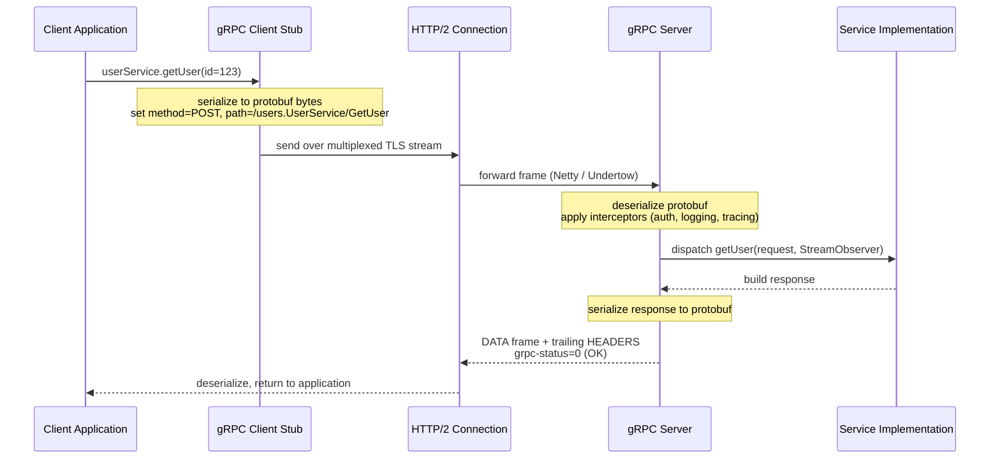
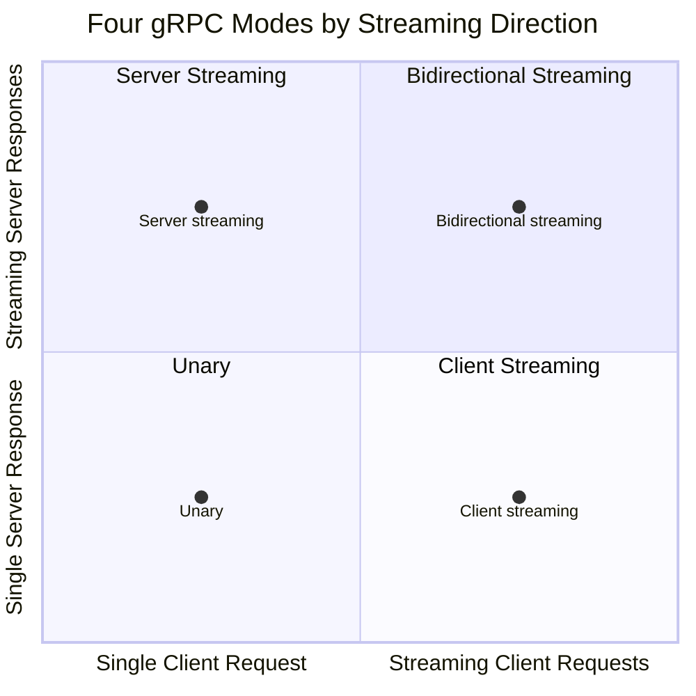
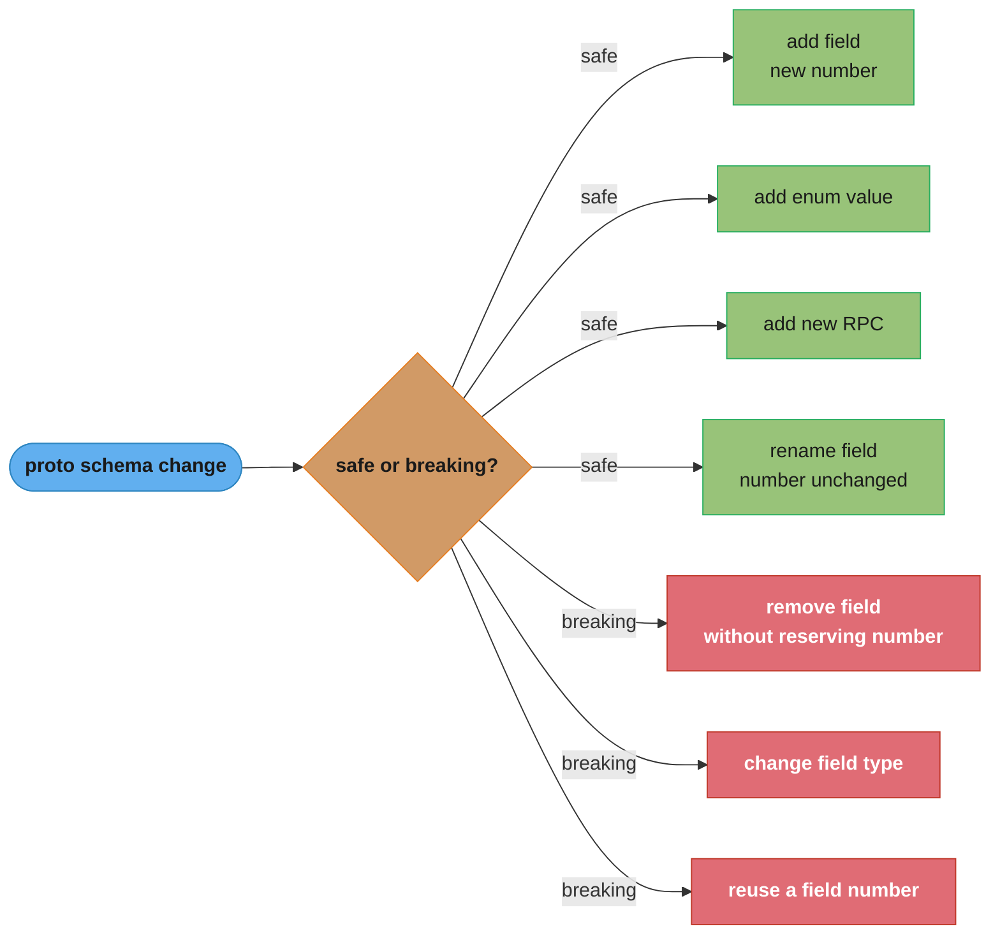
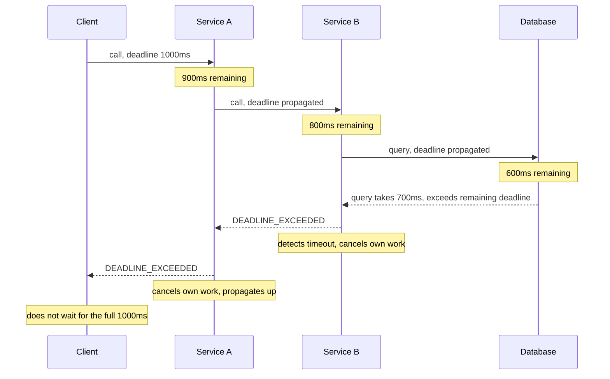

# gRPC & Protocol Buffers

## 1. Concept Overview

gRPC is a high-performance, open-source remote procedure call (RPC) framework developed by Google. It uses Protocol Buffers (protobuf) as the interface definition language and serialization format, and HTTP/2 as the transport. gRPC generates type-safe client and server stubs from .proto files in 10+ languages, making it ideal for polyglot microservice communication.

Protocol Buffers serialize structured data into a compact binary format — typically 3–10x smaller than equivalent JSON and 20–100x faster to parse. gRPC provides four communication modes (unary, server-streaming, client-streaming, bidirectional), built-in deadline propagation, interceptors (middleware), and a health-checking protocol. It is the primary choice for internal service-to-service communication at Google, Netflix, and most large-scale microservices deployments.

---

## 2. Intuition

> **One-line analogy**: gRPC is a strongly-typed telephone system — you define the conversation protocols upfront in a contract (.proto), everyone speaks the same language (protobuf), and the connection is both efficient and reliable (HTTP/2 multiplexing). REST is like sending letters — flexible, but verbose, slow, and you can send anything without checking if it makes sense.

**Mental model**: Define services and messages in .proto files. Run protoc to generate stubs. The generated code handles serialization, HTTP/2 framing, and connection management. Your client calls generated method stubs; the framework handles everything else. The server implements generated service interfaces.

**Why it matters**: For internal microservice APIs, gRPC provides strong typing (catch schema mismatches at compile time), efficient serialization (reduces bandwidth and CPU), streaming (server push, bidirectional), and built-in deadline/cancellation propagation (critical for distributed systems). The main tradeoff is human-readability — you cannot debug with curl.

**Key insight**: The biggest operational advantage of gRPC is not performance but schema enforcement. Protobuf's field numbering rules and compatibility guarantees make breaking changes harder to accidentally introduce than with JSON-based REST.

---

## 3. Core Principles

- **Contract-first**: .proto files are the API contract, not documentation.
- **Binary serialization**: Protobuf encodes fields by number, not name — more efficient and forward/backward compatible.
- **HTTP/2 transport**: Streams, multiplexing, header compression, flow control all from HTTP/2.
- **Deadline propagation**: Deadlines cascade across service calls; if the client cancels, downstream services should stop work.
- **Interceptors**: Cross-cutting concerns (logging, auth, tracing, retry) are added via interceptors, not business logic.
- **Health checking**: Standardized health checking protocol (grpc.health.v1.Health) for load balancers and orchestrators.

---

## 4. Types / Architectures / Strategies

### 4.1 Four RPC Modes

| Mode | Client | Server | Use Case |
|------|--------|--------|---------|
| Unary | Single request | Single response | Standard request-response |
| Server streaming | Single request | Stream of responses | Real-time data, file download |
| Client streaming | Stream of requests | Single response | File upload, bulk data |
| Bidirectional streaming | Stream of requests | Stream of responses | Chat, real-time collaboration |

### 4.2 Protobuf Field Types

| Proto type | Wire type | Notes |
|------------|-----------|-------|
| int32/int64 | Varint | Negative numbers inefficient (use sint32/sint64) |
| sint32/sint64 | Varint (zigzag) | Efficient for negative numbers |
| bool | Varint | |
| fixed32/sfixed32 | 32-bit | Use when values always > 2^28 |
| fixed64/sfixed64 | 64-bit | |
| float | 32-bit | |
| double | 64-bit | |
| string | Length-delimited | UTF-8 |
| bytes | Length-delimited | Arbitrary binary |
| message | Length-delimited | Nested message |
| repeated | Multiple values | Array |
| map | Key-value pairs | Key must be scalar; not nested maps |

---

## 5. Architecture Diagrams

### gRPC Architecture



A single unary call traced end-to-end: the stub serializes the request onto one multiplexed HTTP/2 stream, the server deserializes and runs interceptors before dispatch, and the response returns as a DATA frame followed by trailing HEADERS carrying `grpc-status: 0`.

### Four RPC Modes by Streaming Direction



The four modes from the Section 4.1 table are not four unrelated cases — they are every combination of two independent yes/no choices, does the client stream and does the server stream, and only bidirectional streaming sends and receives concurrently on the same call.

### Protobuf Wire Format

```
Message: Person { name: "Alice", age: 30 }

Proto definition:
  message Person {
    string name = 1;
    int32  age  = 2;
  }

Wire encoding (bytes):
  Field 1, wire type 2 (length-delimited):
    Tag: (1 << 3) | 2 = 0x0A
    Length: 5 (length of "Alice")
    Data: 41 6C 69 63 65 ("Alice" in UTF-8)

  Field 2, wire type 0 (varint):
    Tag: (2 << 3) | 0 = 0x10
    Value: 30 = 0x1E

Full encoding: 0A 05 41 6C 69 63 65 10 1E (9 bytes)
JSON equivalent: {"name":"Alice","age":30} (24 bytes)

Note: Field names are NOT in the wire format.
      The receiver uses field numbers (1, 2) to identify fields.
      This is why field numbers must never be reused.
```

### Protobuf Schema Evolution: Safe vs. Breaking Changes



Additive changes stay wire-compatible because the field number never moves; removing a field without reserving it, changing a field's type, or reusing a number breaks old clients silently — exactly what `buf breaking --against` catches in CI.

### Deadline Propagation



The 700ms database query blows the 600ms budget it was handed, so DEADLINE_EXCEEDED unwinds Service B, then Service A, then the client immediately — without propagation, only the client would time out while Service A, Service B, and the database keep working for nothing.

---

## 6. How It Works — Detailed Mechanics

### 6.1 .proto Service Definition

```protobuf
syntax = "proto3";
package users;
option java_package = "com.example.users.proto";
option java_multiple_files = true;

import "google/protobuf/timestamp.proto";
import "google/protobuf/empty.proto";

message User {
  int64 id = 1;
  string email = 2;
  string name = 3;
  google.protobuf.Timestamp created_at = 4;
  repeated string roles = 5;
  UserStatus status = 6;
}

enum UserStatus {
  USER_STATUS_UNSPECIFIED = 0;  // always include unspecified as 0
  USER_STATUS_ACTIVE = 1;
  USER_STATUS_INACTIVE = 2;
}

message GetUserRequest {
  int64 id = 1;
}

message ListUsersRequest {
  int32 page_size = 1;   // max items to return
  string page_token = 2; // cursor from previous response
  string filter = 3;     // optional filter expression
}

message ListUsersResponse {
  repeated User users = 1;
  string next_page_token = 2;
}

service UserService {
  // Unary RPC
  rpc GetUser (GetUserRequest) returns (User);

  // Server streaming: client requests, server streams users
  rpc ListUsers (ListUsersRequest) returns (stream User);

  // Client streaming: client streams user IDs for batch lookup
  rpc GetUsersBatch (stream GetUserRequest) returns (ListUsersResponse);

  // Bidirectional streaming
  rpc WatchUsers (stream GetUserRequest) returns (stream User);
}
```

### 6.2 Java Server Implementation (Spring Boot + gRPC)

```java
@GrpcService
public class UserGrpcService extends UserServiceGrpc.UserServiceImplBase {

    private final UserRepository userRepository;

    @Override
    public void getUser(GetUserRequest request,
                        StreamObserver<User> responseObserver) {
        try {
            com.example.domain.User user = userRepository
                .findById(request.getId())
                .orElseThrow(() -> new StatusRuntimeException(
                    Status.NOT_FOUND.withDescription(
                        "User " + request.getId() + " not found")));

            responseObserver.onNext(userMapper.toProto(user));
            responseObserver.onCompleted();
        } catch (StatusRuntimeException e) {
            responseObserver.onError(e);
        }
    }

    @Override
    public void listUsers(ListUsersRequest request,
                          StreamObserver<User> responseObserver) {
        // Server streaming: send users one by one
        userRepository.findAll(request.getFilter()).forEach(user -> {
            // Check if client cancelled
            if (!Context.current().isCancelled()) {
                responseObserver.onNext(userMapper.toProto(user));
            }
        });
        responseObserver.onCompleted();
    }
}
```

### 6.3 Interceptors

```java
// Server-side authentication interceptor
public class AuthInterceptor implements ServerInterceptor {

    @Override
    public <Req, Resp> ServerCall.Listener<Req> interceptCall(
            ServerCall<Req, Resp> call,
            Metadata headers,
            ServerCallHandler<Req, Resp> next) {

        String token = headers.get(
            Metadata.Key.of("authorization", ASCII_STRING_MARSHALLER));

        if (token == null || !tokenService.validate(token)) {
            call.close(Status.UNAUTHENTICATED
                .withDescription("Invalid token"), new Metadata());
            return new ServerCall.Listener<>() {};
        }

        // Add identity to context for business logic
        Context ctx = Context.current().withValue(
            USER_IDENTITY_KEY, tokenService.extract(token));
        return Contexts.interceptCall(ctx, call, headers, next);
    }
}

// Client-side retry interceptor
public class RetryInterceptor implements ClientInterceptor {

    @Override
    public <Req, Resp> ClientCall<Req, Resp> interceptNewCall(
            MethodDescriptor<Req, Resp> method,
            CallOptions callOptions) {
        // Delegate to channel; retry policy configured in service config
        return channel.newCall(method, callOptions);
    }
}
```

### 6.4 Error Handling — gRPC Status Codes

| Status Code | Equivalent HTTP | Meaning |
|-------------|----------------|---------|
| OK | 200 | Success |
| CANCELLED | 499 | Client cancelled the call |
| UNKNOWN | 500 | Unknown error |
| INVALID_ARGUMENT | 400 | Client specified invalid argument |
| DEADLINE_EXCEEDED | 504 | Deadline expired |
| NOT_FOUND | 404 | Resource not found |
| ALREADY_EXISTS | 409 | Resource already exists |
| PERMISSION_DENIED | 403 | Insufficient permissions |
| UNAUTHENTICATED | 401 | Not authenticated |
| RESOURCE_EXHAUSTED | 429 | Quota exhausted / rate limited |
| FAILED_PRECONDITION | 400 | System not in required state |
| UNAVAILABLE | 503 | Service temporarily unavailable |
| INTERNAL | 500 | Internal server error |

---

## 7. Real-World Examples

**Google internal use**: gRPC was extracted from Google's internal Stubby RPC system. All internal Google services communicate via gRPC. The framework handles load balancing, health checking, retries, and deadline propagation automatically.

**Netflix gRPC adoption**: Netflix migrated internal APIs from REST+JSON to gRPC, reporting 60% CPU reduction in some services (from binary parsing vs JSON parsing) and 15-30% latency reduction on p99.

**Kubernetes API server**: kubectl and controllers communicate with the API server via a mix of REST (for human-facing operations) and gRPC (for internal watch streams — the low-latency change notification mechanism).

---

## 8. Tradeoffs

| Aspect | gRPC | REST+JSON |
|--------|------|-----------|
| Schema | Enforced (.proto) | Optional (OpenAPI) |
| Serialization | Binary (compact, fast) | Text (readable, slow) |
| Browser support | gRPC-Web needed | Native |
| Streaming | Built-in (4 modes) | SSE/WebSocket add-on |
| Debugging | Harder (binary) | Easy (curl, browser) |
| Code generation | Required | Optional |
| Ecosystem | Excellent for Go/Java/C++ | Universal |
| Firewall traversal | HTTP/2 port 443 | HTTP/1.1 port 80/443 |
| Metadata | gRPC metadata (headers) | HTTP headers |

---

## 9. When to Use / When NOT to Use

**Use gRPC when**: Internal microservice APIs, polyglot services needing type-safe contracts, streaming use cases (real-time, bidirectional), mobile clients where bandwidth is constrained, or when you need deadline propagation across service chains.

**Do not use gRPC when**: Public APIs consumed by browsers directly (requires gRPC-Web proxy), teams unfamiliar with protobuf toolchain, debuggability is critical and team lacks gRPC tooling, or you need CORS support for browser clients.

---

## 10. Common Pitfalls

**Reusing field numbers in proto evolution**: Removing a field and reusing its number for a new field breaks backward compatibility. Clients running old stubs will interpret the new field as the old field. Always reserve removed field numbers: `reserved 3, 5 to 7;` and `reserved "old_field_name";`

**Not setting deadlines on the client**: Without a deadline, a gRPC call can hang indefinitely if the server is slow or the network drops the FIN. Every production gRPC call must have a deadline. Use `stub.withDeadlineAfter(5, TimeUnit.SECONDS)` or configure a default deadline via the stub factory.

**Forgetting to check context cancellation in server streaming**: In a server-streaming RPC, if the client cancels, `Context.current().isCancelled()` becomes true. If your streaming loop does not check this, it continues computing and sending results to a cancelled context — wasting server resources. Check cancellation in the streaming loop.

**gRPC default max message size**: gRPC defaults to 4 MB max inbound message size. Services that stream large messages (bulk exports, media metadata) will receive RESOURCE_EXHAUSTED errors. Configure `maxInboundMessageSize` on the channel/server. Better: redesign to stream smaller messages.

**gRPC-Web vs gRPC**: Browsers cannot use HTTP/2 Trailers (gRPC uses HTTP/2 trailing HEADERS for the grpc-status). gRPC-Web is a proxy protocol (Envoy or grpc-web proxy) that translates browser HTTP requests to gRPC. It only supports unary and server-streaming (no client or bidirectional streaming). Plan the proxy layer if browser clients are needed.

---

## 11. Technologies & Tools

| Tool | Purpose |
|------|---------|
| `protoc` | Protocol Buffer compiler |
| `protoc-gen-grpc-java` | Java gRPC code generator plugin |
| `grpcurl` | Command-line gRPC client (like curl for gRPC) |
| `evans` | Interactive gRPC client with REPL |
| `grpc-health-probe` | Kubernetes health check for gRPC services |
| `buf` | Modern protobuf toolchain (linting, breaking change detection) |
| `grpc-gateway` | Transcodes gRPC to REST/JSON (Go) |
| Envoy Proxy | gRPC-Web transcoding, load balancing, retries |
| `grpc-spring-boot-starter` | Spring Boot gRPC integration |
| Bloomrpc / Kreya | GUI gRPC client |

---

## 12. Interview Questions with Answers

**Q: What is gRPC and how does it differ from REST?**
gRPC is an RPC framework using Protocol Buffers for serialization and HTTP/2 for transport. It differs from REST in: using a binary format (compact, fast) vs JSON (human-readable), having strict schema enforcement via .proto files vs optional OpenAPI, built-in streaming support (4 modes) vs REST's single request-response, and generated type-safe stubs vs manual HTTP client code. gRPC is preferred for internal service-to-service communication; REST for public/browser-facing APIs.

**Q: Explain Protocol Buffers wire format and field numbering.**
Protobuf serializes each field as a tag-value pair. The tag encodes both the field number (1–536,870,911) and the wire type (0=varint, 1=64-bit, 2=length-delimited, 5=32-bit). Field names are not in the wire format — only numbers. This means field numbers must never be reused after a field is removed (doing so causes old clients to misinterpret new fields). Varint encoding uses variable-length encoding: values 0–127 fit in 1 byte.

**Q: What are the four gRPC RPC modes?**
Unary: one request, one response (like REST). Server-streaming: one request, stream of responses (useful for real-time data, large result sets). Client-streaming: stream of requests, one response (useful for bulk uploads, aggregation). Bidirectional streaming: both sides stream independently (useful for real-time chat, collaborative editing, game state sync). All modes use HTTP/2 streams, just with different DATA frame patterns.

**Q: How does deadline propagation work in gRPC?**
The client sets a deadline (absolute timestamp). gRPC encodes the remaining deadline as `grpc-timeout` in the request metadata. The downstream service receives the deadline and propagates it to its own outbound calls. If any service in the chain exceeds the deadline, it returns DEADLINE_EXCEEDED. The parent service, on receiving DEADLINE_EXCEEDED from its child, also cancels its work and propagates the error. This prevents resource waste in partial-failure scenarios.

**Q: What is a gRPC interceptor?**
An interceptor is middleware that runs before/after RPC handling. Server interceptors wrap service method invocations; client interceptors wrap outbound calls. Common uses: authentication (extract and validate JWT from metadata), distributed tracing (inject/extract trace context), logging (log request/response), metrics (record call latency and error rates), retry with backoff. Interceptors chain and each calls next.interceptCall() to pass control.

**Q: How do you handle errors in gRPC?**
gRPC uses Status codes (similar to HTTP but gRPC-specific). Return a StatusRuntimeException on the server with the appropriate code (NOT_FOUND, INVALID_ARGUMENT, UNAUTHENTICATED, etc.). The gRPC framework sends it as trailing metadata grpc-status and grpc-message. For structured error details, use the google.rpc.Status type with google.rpc.ErrorInfo, google.rpc.BadRequest etc. from the googleapis/googleapis error.proto definitions. On the client, catch StatusRuntimeException and inspect the Status.

**Q: What is the Health Checking Protocol in gRPC?**
Google defined a standard health checking service (grpc.health.v1.Health) with a single Check RPC that returns SERVING, NOT_SERVING, or SERVICE_UNKNOWN. Kubernetes liveness/readiness probes use grpc-health-probe, which calls this service. Load balancers use it for backend health checks. Implement it by registering HealthStatusManager on the server and calling setStatus() when the service starts/stops.

**Q: How do you evolve a protobuf schema without breaking clients?**
Safe changes: add new optional fields with new numbers, add new enum values, add new RPCs, rename a field (changes the name only, not the number — no wire impact). Breaking changes: remove a field (old clients send it; new server ignores — OK for requests; old clients may expect it in response), change a field's type, reuse a field number. Best practice: use `buf breaking --against` in CI to automatically detect breaking changes.

**Q: What is the difference between proto2 and proto3?**
Proto3 is the current version. Key differences: proto3 has no required fields (all are optional), default values are the zero value (cannot distinguish set vs unset unless using google.protobuf.FieldMask or wrapper types), proto3 supports JSON mapping by default. Proto2 had required fields (dangerous — adding a required field to a message breaks all old senders), had explicit optional with default values, and had extension ranges. Use proto3 for all new projects.

**Q: What is gRPC-Web and when do you need it?**
gRPC-Web is a variant of the gRPC protocol that browsers can use. Browsers cannot use HTTP/2 trailers (gRPC uses trailers for the grpc-status code), so gRPC-Web encodes trailing metadata in a special data frame. An Envoy sidecar or nginx gRPC-Web proxy translates between gRPC and gRPC-Web. gRPC-Web only supports unary and server-streaming; bidirectional streaming is not supported. Use gRPC-Web when browser clients need to call gRPC services directly.

**Q: How does gRPC handle load balancing?**
gRPC supports both client-side and proxy load balancing. Client-side: the gRPC channel resolves DNS, gets all backend IPs, and applies a load balancing policy (round-robin, pick-first). This is common with Kubernetes headless services. Proxy load balancing: a proxy (Envoy, Nginx, AWS NLB) receives all connections and distributes them. With HTTP/2, a single gRPC connection multiplexes many RPCs — L4 load balancers see one connection per client; L7 load balancers can distribute individual RPCs.

**Q: What is the maximum message size in gRPC and how do you change it?**
The default maximum inbound message size is 4 MB (4,194,304 bytes). The maximum outbound message size has no default limit. Change via: server-side: `ServerBuilder.maxInboundMessageSize(50 * 1024 * 1024)` (50 MB). Client-side: `ManagedChannelBuilder.maxInboundMessageSize(50 * 1024 * 1024)`. Better approach for large payloads: stream messages to avoid sending one large message; or store data in object storage and pass a reference URI in the message.

**Q: Describe a scenario where gRPC bidirectional streaming provides value REST cannot easily match.**
A real-time bidirectional order matching engine: traders send market orders and receive execution notifications in real-time. REST would require polling (latency), WebSocket (adds complexity and library overhead), or SSE (unidirectional only). gRPC bidirectional streaming provides full-duplex communication with protobuf efficiency and built-in flow control. Each side streams independently — the trader sends new orders, the server sends execution confirmations and market data updates — over one persistent connection with back-pressure from HTTP/2 flow control.

**Q: What is the grpc reflection protocol?**
gRPC reflection allows clients to query the server for service definitions at runtime, without having the .proto files. Tools like `grpcurl` and `evans` use reflection to discover available services and methods. Enable it on the server with ProtoReflectionService. Disable in production if you do not want to expose your API schema to clients (reflection is informational only — it does not grant access, but may expose schema information to attackers).

**Q: How do you implement retries in gRPC?**
gRPC supports a service config JSON with retry policy: `maxAttempts` (max total attempts), `initialBackoff`, `maxBackoff`, `backoffMultiplier`, and `retryableStatusCodes` (e.g., UNAVAILABLE, DEADLINE_EXCEEDED). This is specified in the service config loaded by the name resolver. For Java, configure via ManagedChannelBuilder with a default service config. Retries are transparent to the application code — the channel handles them. Only retry idempotent RPCs or explicitly idempotent operations.

---

## 13. Best Practices

- Always set deadlines on every gRPC call in production.
- Use `buf` for proto linting and breaking change detection in CI.
- Reserve removed field numbers: `reserved 3; reserved "old_field";`
- Implement the Health Checking Protocol on every gRPC server.
- Use interceptors for cross-cutting concerns — do not put auth/logging in business logic.
- Prefer proto3 for all new services; avoid required fields.
- Use status codes precisely — INVALID_ARGUMENT for client errors, INTERNAL for server errors; avoid UNKNOWN.
- Document .proto services with comments — they appear in generated code and grpcurl output.
- For high-throughput streaming, respect back-pressure: check `isReady()` before sending on streaming observers.

---

## 14. Case Study

**Problem**: A financial data service was sending 10-second JSON batch updates (200 KB per update) to 500 subscriber services over REST, causing 100 MB/s of bandwidth usage and significant JSON parsing CPU overhead.

**Migration to gRPC bidirectional streaming**:
```protobuf
message MarketUpdate {
  int64 timestamp = 1;
  repeated PricePoint prices = 2;

  message PricePoint {
    string symbol = 1;
    double bid = 2;
    double ask = 3;
    int64 volume = 4;
  }
}

message SubscribeRequest {
  repeated string symbols = 1;
}

service MarketDataService {
  rpc StreamPrices (SubscribeRequest) returns (stream MarketUpdate);
}
```

**Results after migration**:
- Protobuf serialization: 200 KB JSON → 34 KB protobuf (83% reduction)
- Parsing CPU: 40% reduction (protobuf vs JSON parsing)
- Latency: each update delivered within 50ms vs 10s batch polling
- Connection overhead: 500 persistent HTTP/2 streams vs 500 * 6 polling connections/minute
- Total bandwidth: 100 MB/s → 17 MB/s

**Lessons**: gRPC streaming is particularly valuable for high-frequency, structured data. Binary serialization pays off most when messages have many numeric fields. The migration required updating 500 subscriber services to use generated stubs — feasible because all were internal Java services with access to the proto repository.
