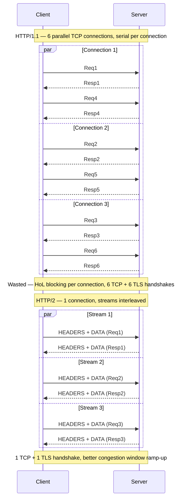
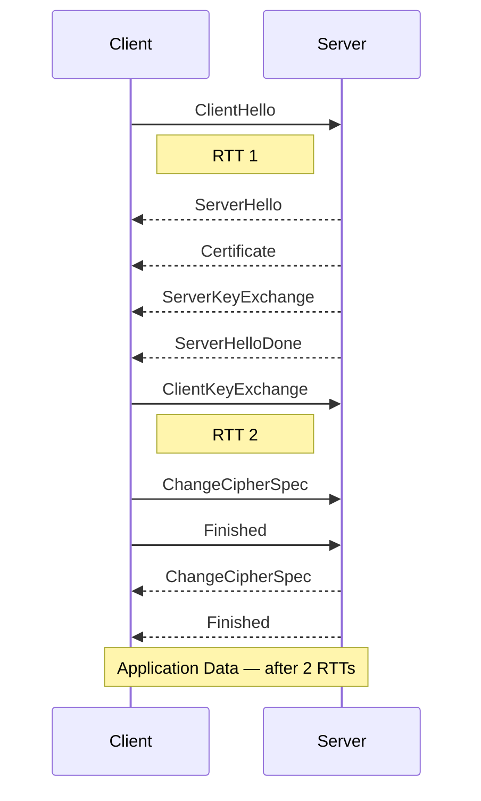
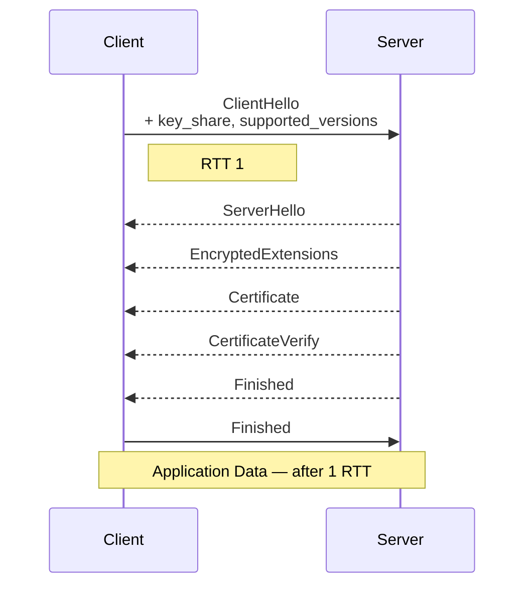
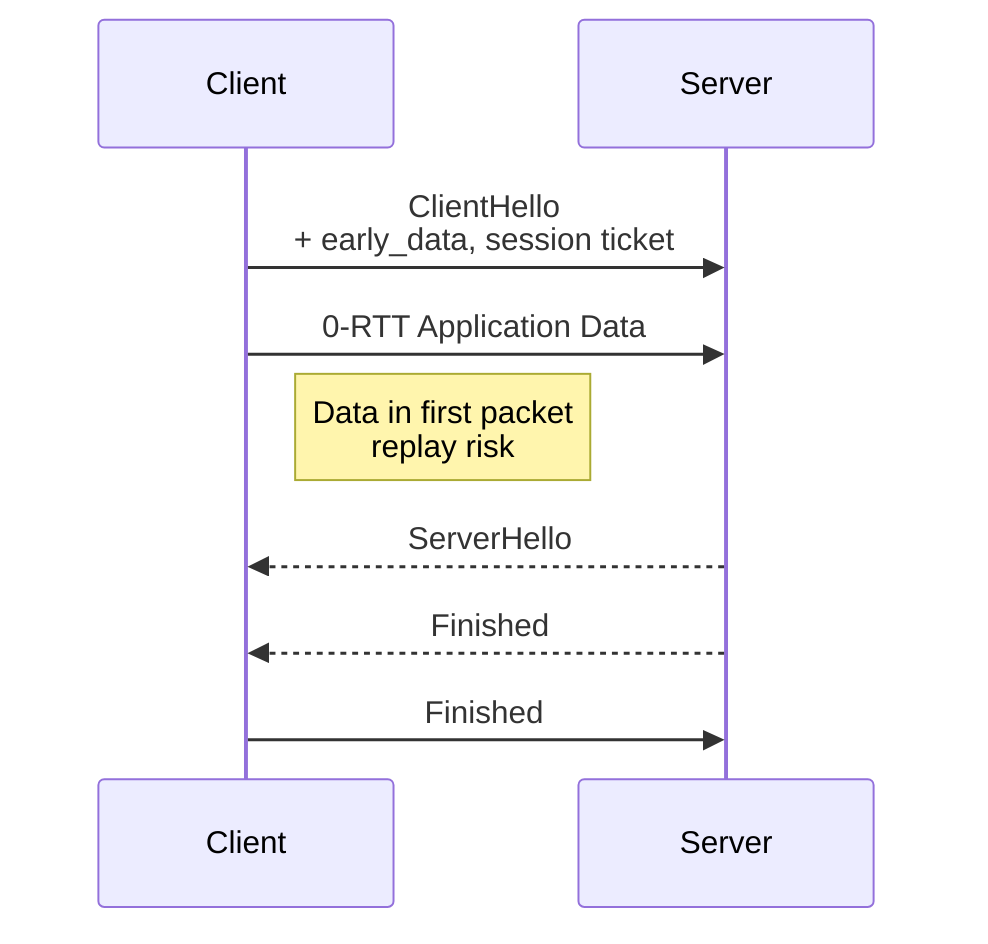
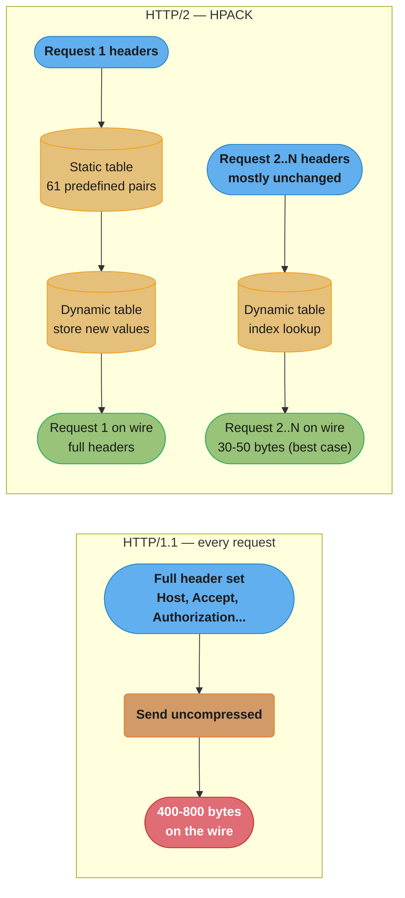
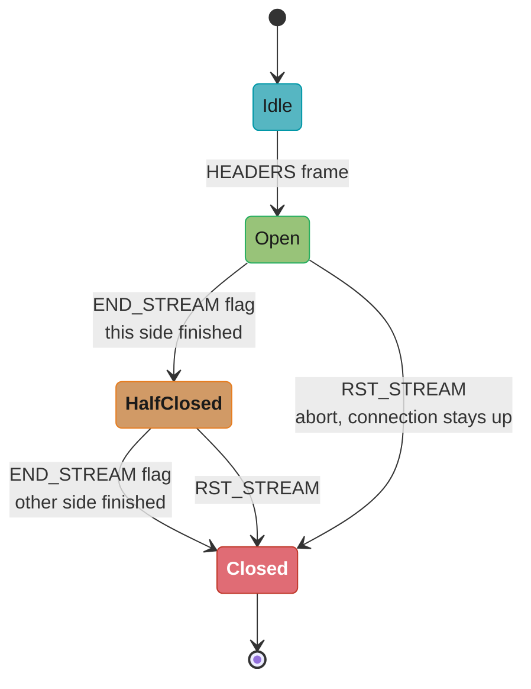
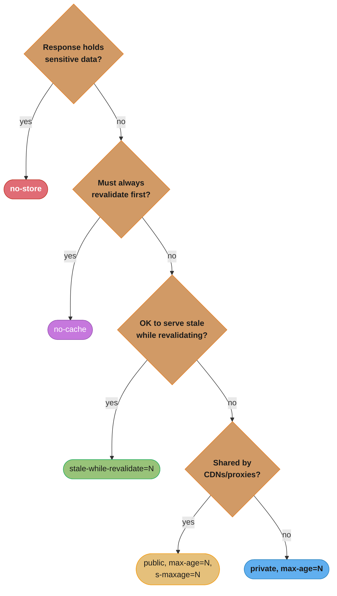
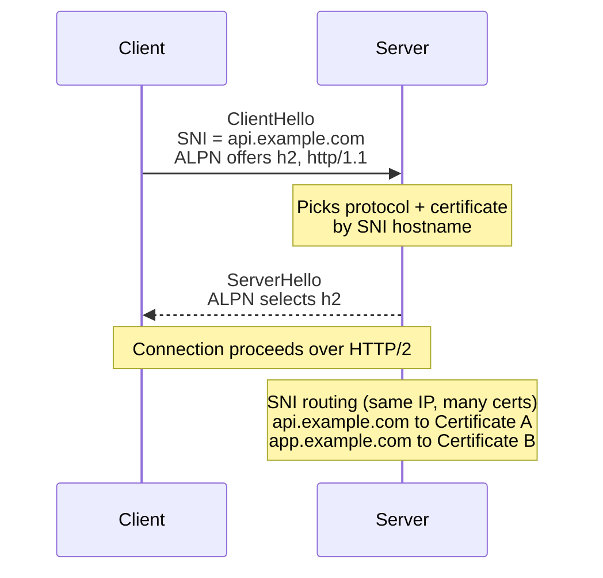

# HTTP Protocols

<!-- study-paths
senior: README.md
files this module contributes to each curated path; omit a tier to leave it out
-->
## 1. Concept Overview

HTTP (Hypertext Transfer Protocol) is the application-layer protocol underpinning the web and virtually all backend API communication. Understanding how HTTP has evolved from HTTP/1.0 through HTTP/2 and HTTP/3 — and how TLS secures it — is essential for backend engineers designing APIs, configuring load balancers, debugging latency issues, and making informed infrastructure decisions.

HTTP/1.1 added persistent connections and chunked transfer but remained fundamentally serial. HTTP/2 multiplexed requests over a single TCP connection, compressed headers, and introduced server push. HTTP/3 moved to QUIC, eliminating TCP's head-of-line blocking. TLS evolved from SSL 3.0 through TLS 1.3, with the 1.3 handshake reducing latency by one full round trip.

---

## 2. Intuition

> **One-line analogy**: HTTP/1.1 is one checkout lane per customer — efficient, but sequential. HTTP/2 is like a modern bank with one customer representative and multiple service windows simultaneously active. HTTP/3 is like that same bank, but now operating by radio communication so the representative can handle customers even while moving between offices.

**Mental model**: Each HTTP version solves a specific bottleneck of the previous version. HTTP/1.1 solved the overhead of new TCP connections per request. HTTP/2 solved the need for multiple parallel TCP connections (which browsers opened up to 6 per domain). HTTP/3 solved TCP's head-of-line blocking when packets are lost. Each improvement reflects a real performance bottleneck observed at web scale.

**Why it matters**: Most backend performance issues involve HTTP semantics: missing cache headers causing redundant requests, HTTP/2 header compression reducing bandwidth, TLS 1.2 vs 1.3 adding an extra RTT, or missing keep-alive causing thousands of new TCP connections under load. Getting HTTP right is table stakes for senior backend engineers.

**Key insight**: HTTP/2 over a lossy connection can perform worse than HTTP/1.1 with multiple connections. By multiplexing all traffic into one TCP stream, a single lost TCP segment stalls all HTTP/2 requests. HTTP/3's move to QUIC solves this fundamental architectural problem.

---

## 3. Core Principles

- **Request-response**: HTTP is fundamentally request-response, though HTTP/2 enables concurrent requests on one connection and HTTP/3 stream independence removes *transport-level* HoL blocking (loss on one QUIC stream no longer stalls the others; loss within a stream, and QPACK dynamic-table references, can still block that stream — RFC 9204 §2).
- **Stateless**: Each request contains all information needed to process it. Sessions are implemented via cookies or tokens — not TCP connection state.
- **Header-driven semantics**: Content-Type, Accept, Cache-Control, Authorization — HTTP behavior is controlled by headers, not protocol version (mostly).
- **Caching**: HTTP caching (ETag, Cache-Control, Vary) can eliminate server load for identical requests. A well-cached API can serve 90% of requests from cache.
- **TLS layering**: HTTPS is HTTP over TLS. TLS provides authentication (certificate), confidentiality (encryption), and integrity (MAC). ALPN negotiates the HTTP version during TLS handshake.

---

## 4. Types / Architectures / Strategies

### 4.1 HTTP Version Comparison

| Feature | HTTP/1.0 | HTTP/1.1 | HTTP/2 | HTTP/3 |
|---------|---------|---------|--------|--------|
| Current spec | RFC 1945 (informational) | RFC 9112 + 9110/9111 | RFC 9113 | RFC 9114 |
| Persistent connections | No | Yes (default) | Yes (required) | Yes (QUIC) |
| Multiplexing | No | No (pipelining, rarely used) | Yes (streams) | Yes (QUIC streams) |
| Header compression | No | No | HPACK (RFC 7541) | QPACK (RFC 9204) |
| Server push | No | No | Spec'd; off by default in Chrome since 106 | Spec'd (RFC 9114 §4.6); not implemented by major browsers |
| Transport | TCP | TCP | TCP | QUIC (UDP, RFC 9000) |
| HoL blocking | Per connection | Per connection | Application-layer HoL removed; TCP-layer HoL remains | Transport HoL removed; per-stream loss and QPACK blocked streams remain |
| TLS | Optional | Optional | Practical requirement | Mandatory (TLS 1.3, RFC 9001) |
| Binary framing | No | No | Yes | Yes |

The HTTP core is split across three June 2022 documents: RFC 9110 defines the version-independent semantics (methods, status codes, header fields, conditional requests), RFC 9111 defines caching, and RFC 9112 defines the HTTP/1.1 message syntax. RFC 9113 defines HTTP/2 and RFC 9114 defines HTTP/3.

### 4.2 TLS Version Comparison

| TLS Version | Status | Handshake RTTs | Notes |
|-------------|--------|---------------|-------|
| SSL 3.0 | Deprecated (RFC 7568, POODLE) | 2 RTTs | Broken, never use |
| TLS 1.0 | MUST NOT be used (RFC 8996, 2021) | 2 RTTs | RC4, BEAST vulnerable |
| TLS 1.1 | MUST NOT be used (RFC 8996, 2021) | 2 RTTs | Disabled by default across Chrome/Firefox/Safari/Edge during 2020 |
| TLS 1.2 | Still widely used (RFC 5246) | 2 RTTs (or 1 with session resumption) | AES-GCM, ChaCha20 |
| TLS 1.3 | Current standard (RFC 8446, 2018) | 1 RTT (0-RTT on resumption) | Forward secrecy required — static RSA and static DH key exchange removed |

---

## 5. Architecture Diagrams

### HTTP/1.1 vs HTTP/2 Multiplexing



HTTP/1.1 buys parallelism with six separate serial connections; HTTP/2 gets the same three-way concurrency from interleaved streams on a single connection — the multiplexing win described in Section 2, at the cost of sharing one TCP path.

### TLS 1.2 vs TLS 1.3 Handshake

**TLS 1.2 (2 RTTs):**



**TLS 1.3 (1 RTT):**



**TLS 1.3 Session Resumption (0-RTT):**



TLS 1.3 collapses the handshake from 2 RTTs to 1 by folding the key exchange into the first ClientHello/ServerHello pair, and 0-RTT resumption skips the round trip entirely by replaying a prior session's key — at the cost of replay exposure for that first flight of data.

### HPACK Header Compression (HTTP/2)



HPACK's dynamic table turns the Authorization header into a one-time cost: sent in full on request 1 and added to the table, then referenced by a 2-byte index on every request after. The byte figures above are the *best case* — a header set that is entirely repeated and fully indexed — and 400-800 down to 30-50 implies roughly 92% compression, which you should not expect on average. The number to plan against is Cloudflare's measurement across its own network: **76% compression on ingress headers and 69% on egress**. Because requests are header-heavy and responses are body-heavy, that ingress figure was worth 53% of total ingress traffic while the egress figure moved total egress HTTP/2 traffic by only 1.4%. Header compression is a request-side win.

---

## 6. How It Works — Detailed Mechanics

### 6.1 HTTP/2 Frame Types

HTTP/2 is a binary framing protocol. All HTTP/2 frames have a 9-byte header:
- Length: 24 bits (max 16 MB per frame; default max 16 KB enforced by SETTINGS)
- Type: 8 bits (DATA, HEADERS, PRIORITY, RST_STREAM, SETTINGS, PUSH_PROMISE, PING, GOAWAY, WINDOW_UPDATE, CONTINUATION)
- Flags: 8 bits
- Stream Identifier: 31 bits (0 = connection-level)

```
HTTP/2 Frame:
  +-----------------------------------------------+
  |                Length (24)                    |
  +---------------+---------------+---------------+
  |   Type (8)    |   Flags (8)   |
  +-+-------------+---------------+-------------------------------+
  |R|                 Stream Identifier (31)                      |
  +=+=============================================================+
  |                   Frame Payload (0...)                      ...
  +---------------------------------------------------------------+
```

Key frames:
- **HEADERS**: carries HTTP headers (request line + headers, HPACK compressed)
- **DATA**: carries request/response body
- **SETTINGS**: negotiates connection parameters (max concurrent streams, initial window, max header list size)
- **WINDOW_UPDATE**: flow control — increases available window
- **RST_STREAM**: aborts a stream without closing connection
- **GOAWAY**: graceful shutdown — in-flight streams can complete; no new streams accepted

The frame types above drive a per-stream state machine (the 8-bit Flags field carries the END_STREAM flag that moves a stream toward closed):



A stream moves Idle to Open on the first HEADERS frame, to HalfClosed once one side sends its END_STREAM flag, and to Closed when both sides finish — or straight to Closed via RST_STREAM, which aborts only that one stream while the TCP connection stays up for every other stream on it.

### 6.2 HTTP Caching Headers

```http
# Server response with caching directives:
HTTP/1.1 200 OK
Cache-Control: max-age=3600, public
ETag: "abc123xyz"
Last-Modified: Thu, 01 Jan 2026 00:00:00 GMT
Vary: Accept-Encoding, Accept-Language

# Cache-Control directives (core set: RFC 9111 section 5.2):
# max-age=N      : cache for N seconds
# public         : cacheable by CDNs/proxies
# private        : MUST NOT be stored by a shared cache (browser-only)
# no-cache       : may be stored, but MUST be revalidated before reuse
# no-store       : MUST NOT be stored at all, request or response
# s-maxage=N     : shared-cache duration (overrides max-age for shared caches)
#
# Extension directives — defined OUTSIDE RFC 9111, support is not universal:
# immutable      : resource will never change, skip revalidation (RFC 8246)
# stale-while-revalidate=N : serve stale while revalidating in background (RFC 5861)

# Conditional request (ETag-based revalidation):
GET /api/users/123 HTTP/1.1
If-None-Match: "abc123xyz"

# Response if unchanged:
HTTP/1.1 304 Not Modified
ETag: "abc123xyz"
# No body — saves bandwidth

# Vary header:
# Tells ANY cache -- shared and private/browser alike -- to store separate
# responses for different values of the listed request headers
Vary: Accept-Encoding
# Browser requesting gzip gets a different cache entry than one requesting br
```

Picking the right directive follows a strict precedence — sensitivity rules out storage entirely, mandatory revalidation skips straight to `no-cache`, and only genuinely cacheable responses get to choose a duration and audience:



`no-store` is reserved for genuinely sensitive data (bank statements); `no-cache` stores but forces revalidation; everything else is a tradeoff between freshness (`max-age`/`stale-while-revalidate`) and audience (`public`+`s-maxage` for CDNs vs `private` for the browser only).

### 6.3 ALPN and SNI

ALPN (Application-Layer Protocol Negotiation) is a TLS extension that allows the client to advertise supported application protocols during the TLS ClientHello. The server selects the best match. This enables HTTPS to negotiate HTTP/1.1 vs HTTP/2 vs HTTP/3 in a single TLS handshake.



Both fields travel in the same ClientHello/ServerHello pair — ALPN settles the protocol version, SNI lets the server pick which certificate to present — before either side has exchanged a single encrypted byte.

### 6.4 HSTS (HTTP Strict Transport Security)

```http
Strict-Transport-Security: max-age=31536000; includeSubDomains; preload
```

HSTS tells browsers to only use HTTPS for this domain for the next `max-age` seconds. If preload is specified and the domain is submitted to browsers' preload lists, the browser will use HTTPS on the very first visit (before any HTTP response). This prevents SSL stripping attacks.

### 6.5 HTTP Methods and Idempotency

| Method | Safe | Idempotent | Body | Use Case |
|--------|------|-----------|------|----------|
| GET | Yes | Yes | No | Retrieve resource |
| HEAD | Yes | Yes | No | GET without body (check headers) |
| OPTIONS | Yes | Yes | No | CORS preflight, capabilities |
| PUT | No | Yes | Yes | Replace resource completely |
| DELETE | No | Yes | No | Delete resource |
| POST | No | No | Yes | Create resource, submit data |
| PATCH | No | No | Yes | Partial update |
| TRACE | Yes | Yes | No | Loopback of the request path (usually disabled) |
| CONNECT | No | No | No | Tunnel establishment (proxies) |

Safe and idempotent per RFC 9110 Table 7: safe = GET, HEAD, OPTIONS, TRACE; idempotent = those four plus PUT and DELETE. PATCH is defined in RFC 5789, is not in Table 7, and is neither safe nor idempotent. The "Body" column above records what the method *defines a use for* — RFC 9110 says a client SHOULD NOT generate content in GET, HEAD or DELETE, and permits content on OPTIONS (with a Content-Type) while defining no use for it.

Idempotent: sending the same request N times has the same effect as sending it once. This property is critical for retry logic in distributed systems.

---

## 7. Real-World Examples

**Nginx HTTP/2 configuration**:
```nginx
server {
    listen 443 ssl;
    http2 on;            # nginx >= 1.25.1
    server_name api.example.com;

    ssl_protocols TLSv1.2 TLSv1.3;
    ssl_ciphers ECDHE-ECDSA-AES128-GCM-SHA256:ECDHE-RSA-AES128-GCM-SHA256;
    ssl_prefer_server_ciphers on;
    ssl_session_cache shared:SSL:10m;
    ssl_session_timeout 1d;

    # Enable HSTS
    add_header Strict-Transport-Security "max-age=31536000" always;

    # Hint critical sub-resources with 103 Early Hints (nginx >= 1.29.0;
    # the directive takes a condition string, not on/off):
    #   early_hints $early_hints;
}
```

**Spring Boot configuring caching headers**:
```java
@GetMapping("/api/products/{id}")
public ResponseEntity<Product> getProduct(
        @PathVariable Long id,
        WebRequest request) {

    Product product = productService.findById(id);
    String etag = '"' + product.getVersion() + '"';

    if (request.checkNotModified(etag)) {
        return ResponseEntity.status(304).build();  // 304 Not Modified
    }

    return ResponseEntity.ok()
        .eTag(etag)
        .cacheControl(CacheControl.maxAge(1, TimeUnit.HOURS).cachePublic())
        .lastModified(product.getUpdatedAt())
        .body(product);
}
```

---

## 8. Tradeoffs

| HTTP Version | Connection overhead | HoL blocking | CPU (parsing) | Browser support | Site adoption |
|-------------|---------------------|-------------|----------------|---------|---------|
| HTTP/1.1 | High (multiple connections) | Per connection | Low | Universal | Universal fallback |
| HTTP/2 | Low (1 connection) | TCP-layer only | Medium (HPACK) | 96.7% | 34.8% |
| HTTP/3 | Low (QUIC) | Per-stream + QPACK only | Higher (QUIC, userspace) | 92.4% | 40.0% |

Browser support from caniuse.com; site adoption from W3Techs, July 2026 (W3Techs counts each site at its highest negotiated version, which is why HTTP/3 now exceeds HTTP/2 there). Both figures move — treat them as a snapshot, not a constant.

| TLS Version | RTTs | Security | Performance |
|-------------|------|---------|-------------|
| TLS 1.2 | 2 | Acceptable | Standard |
| TLS 1.3 | 1 (0 on resume) | Strong (mandatory PFS) | Better |

---

## 9. When to Use / When NOT to Use

**HTTP/2**: Use for all modern APIs. The single-connection model with HPACK compression reduces bandwidth and improves latency for mobile clients. To get critical sub-resources to the client early, use `<link rel="preload">` or a 103 Early Hints response — no major browser implements HTTP/2 or HTTP/3 push.

**HTTP/3**: Use for public-facing endpoints serving mobile or high-latency users. Requires infrastructure support (UDP on port 443). Fall back gracefully to HTTP/2. Not needed for internal service-to-service communication on reliable networks.

**TLS 1.3**: Use for all new deployments. Disable TLS 1.0 and 1.1 — RFC 8996 (BCP 195) says they MUST NOT be used or negotiated. PCI DSS does not name a TLS version; it requires "strong cryptography" and its FAQ states that SSL and early TLS (TLS 1.0/1.1) do not qualify, which is what forces TLS 1.2 or higher in card environments. TLS 1.2 is acceptable but should be upgraded.

**no-store vs no-cache**: Use `no-store` only when responses must never be stored (sensitive data like bank statements). Use `no-cache` when responses can be stored but must be revalidated — this enables conditional GET (304) optimization.

---

## 10. Common Pitfalls

**HTTP/2 and load balancers**: Some legacy load balancers only support HTTP/1.1 between themselves and backends. They terminate HTTP/2 from clients but speak HTTP/1.1 to backends — losing multiplexing benefits at the LB-backend hop. Verify that your LB supports HTTP/2 for upstream connections.

**Vary header causing cache fragmentation**: `Vary: User-Agent` makes every cache — CDN *and* browser, since RFC 9111 binds Vary for any cache, not just shared ones — store a separate response for every User-Agent string, potentially thousands of entries for the same resource. `Vary: *` is worse in a different way: RFC 9111 §4.1 says a stored response whose Vary value contains `*` "always fails to match", so the response may still be stored but can never be reused, guaranteeing a miss on every request. Use `Vary: Accept-Encoding` for compressed responses and nothing else for most APIs.

**HPACK dynamic table size and header size limits**: HTTP/2 has a `SETTINGS_HEADER_TABLE_SIZE` (default 4096 octets) and servers enforce `SETTINGS_MAX_HEADER_LIST_SIZE`. Spring Boot's `server.max-http-request-header-size` defaults to 8KB, but the Spring Boot docs warn that the limit is applied differently per server: Netty applies it to each individual header, while Tomcat applies it to the combined size of the request line plus all header names and values — so the same 8KB setting is far stricter on Tomcat. Applications with large cookies or JWT tokens in headers can hit this limit and receive 431 (Request Header Fields Too Large).

**Missing Content-Type on REST responses**: HTTP/1.1 clients that receive JSON without `Content-Type: application/json` may treat the response as text. Proxies may not compress it. Always set Content-Type explicitly.

**Certificate pinning and rotation**: Mobile apps that pin the server certificate will break when the certificate is rotated. Use public key pinning (pin the SubjectPublicKeyInfo hash) rather than certificate pinning, and always ship a backup pin. Certificate pinning is generally not recommended for most APIs — use HSTS and certificate transparency instead.

---

## 11. Technologies & Tools

| Tool | Purpose |
|------|---------|
| `curl -v --http2` | Test HTTP/2 connection |
| `curl --http3` | Test HTTP/3 (requires curl with QUIC support) |
| `nghttp2` | HTTP/2 client/server debugging |
| `h2c` (Go) | Simple HTTP/2 test server |
| Chrome DevTools Network tab | Inspect HTTP versions, timing, headers |
| `openssl s_client` | TLS handshake inspection |
| `ssllabs.com` | TLS configuration grading |
| Mozilla Observatory | Security headers checker |
| `mkcert` | Local development TLS certificates |
| `caddy` | HTTP/3-ready web server with auto-TLS |
| Wireshark | HTTP/2 frame dissector |

---

## 12. Interview Questions with Answers

**Q: What are the main improvements HTTP/2 provides over HTTP/1.1?**
**Short:** HTTP/2 adds stream multiplexing, HPACK header compression, binary framing, and per-stream flow control over HTTP/1.1.

HTTP/2 adds four things HTTP/1.1 lacks: stream multiplexing, HPACK header compression, binary framing, and per-stream flow control. Multiplexing puts many concurrent streams on one TCP connection, removing the need for the ~6 parallel connections per origin browsers used to open. HPACK sends a repeated header like Authorization as a short table reference after the first request; Cloudflare measured 76% compression on ingress headers and 69% on egress headers across its edge, cutting total ingress traffic by 53%. Binary framing replaces line-oriented text parsing with fixed 9-byte frame headers. HTTP/1.1 pipelining was supposed to solve serialization but was so broken in practice it was almost never enabled.

**Q: Explain the head-of-line blocking problem in HTTP/2.**
**Short:** HTTP/2 removes application-layer head-of-line blocking, but a lost TCP segment still stalls every multiplexed stream.

HTTP/2 multiplexes all streams over one TCP connection. If a TCP segment is lost, TCP's in-order delivery guarantee means no data from any stream can be delivered to the application until the lost segment is retransmitted and received. All HTTP/2 streams stall, even those whose data arrived successfully. This is TCP-level HoL blocking; RFC 9113 states outright that "TCP head-of-line blocking is not addressed by this protocol." HTTP/2 removed only the *application-layer* HoL blocking of HTTP/1.1, where a slow response blocked the whole connection. HTTP/3 removes the transport-level case by running over QUIC, where each stream is independently sequenced — though loss inside one stream still blocks that stream, and QPACK dynamic-table references can block a stream until the referenced insert arrives.

**Q: How does TLS 1.3 reduce latency compared to TLS 1.2?**
**Short:** TLS 1.3 cuts the handshake to 1 RTT and supports 0-RTT resumption, versus TLS 1.2's 2-RTT handshake.

TLS 1.2 requires 2 RTTs for a full handshake (1 RTT for TCP, 2 for TLS = 3 RTTs before data). TLS 1.3 reduced this to 1 RTT for TLS (2 RTTs total). TLS 1.3 also supports 0-RTT session resumption (sending application data in the first packet). TLS 1.3 mandatory forward secrecy eliminated export-grade ciphers and simplified cipher suite negotiation, improving security alongside performance.

**Q: What is ALPN and why is it needed?**
**Short:** ALPN lets a client advertise supported protocols in the TLS ClientHello so the server can select HTTP/2 without an extra round trip.

ALPN (Application-Layer Protocol Negotiation) is a TLS extension allowing the client to advertise supported application protocols (h2, http/1.1, h3) in the ClientHello. The server picks the best supported protocol and includes it in the ServerHello. Without ALPN, a client would need a separate round trip to negotiate the application protocol, or use a different port per protocol. ALPN enables HTTP/2 to be selected during the TLS handshake on port 443.

**Q: What does the HTTP Cache-Control: max-age directive do, and how does it differ from Expires?**
**Short:** Cache-Control max-age counts freshness from serving time and takes precedence over the legacy absolute-date Expires header.

Cache-Control: max-age=N specifies that the response is fresh for N seconds from when it was served. Expires provides an absolute date-time. max-age takes precedence over Expires when both are present. Prefer Cache-Control because it is relative to serving time (robust to clock skew), and because Expires is a legacy header from HTTP/1.0.

**Q: What is an ETag and how does it enable conditional requests?**
**Short:** An ETag identifies a resource version so a client's If-None-Match request can get a bodyless 304 when nothing changed.

An ETag is a server-generated identifier representing the version of a resource (hash, version number, or timestamp). The server includes it in the response: `ETag: "abc123"`. On subsequent requests, the client sends `If-None-Match: "abc123"`. If the resource hasn't changed, the server responds 304 Not Modified with no body — saving bandwidth. ETags must change whenever the resource changes.

**Q: What is SNI and why is it necessary for modern HTTPS?**
**Short:** SNI lets a client send the target hostname in the ClientHello so one IP can serve different certificates per hostname.

SNI (Server Name Indication) is a TLS extension where the client includes the target hostname in the ClientHello (before TLS is established). This allows a server to present different certificates for different hostnames on the same IP address. Without SNI, a server could only host one certificate per IP — impractical when IPv4 addresses are scarce. CDNs, hosting providers, and cloud load balancers all depend on SNI for multi-tenant certificate management.

**Q: What does the HSTS header do and what is the preload list?**
**Short:** HSTS forces browsers to upgrade to HTTPS locally, and the preload list protects even a domain's first-time visitors.

HSTS (Strict-Transport-Security) tells browsers to only connect via HTTPS for the duration specified by max-age. If a user types http://example.com, the browser upgrades to HTTPS locally before making any network request — preventing SSL stripping. The preload list is a browser-shipped list of domains that must always use HTTPS, protecting even first-time visitors before any HSTS header is received.

**Q: What is the difference between HTTP 301 and 302 redirects, and how do they affect caching?**
**Short:** A 301 redirect is cacheable and permanent, while a 302 redirect is temporary and re-checked against the original URL each time.

301 (Moved Permanently) is cacheable and instructs browsers to update bookmarks. Subsequent requests go directly to the new URL. 302 (Found, temporary redirect) is not permanently cacheable — the browser asks the original URL each time (though some browsers cache 302 with a short duration). Use 301 for permanent moves (old API versions, www to non-www). Use 302 for temporary moves or feature flags. Incorrect use of 301 makes rollbacks painful (cached redirect).

**Q: How does HTTP/2 server push work, and why was it deprecated in Chrome?**
**Short:** HTTP/2 server push was deprecated because servers couldn't tell what the browser already cached, wasting bandwidth for little gain.

HTTP/2 server push allowed a server to proactively send resources (CSS, JS) to the client before it requests them, using PUSH_PROMISE frames. In theory, this eliminated round trips for critical resources. In practice, servers couldn't know what was already in the browser cache — they would push resources the browser already had, wasting bandwidth. Chrome's removal notice reported push was used by only about 1.25% of HTTP/2 sites and that analysis showed no clear net performance gain, with regressions in many cases; Chrome 106 (stable September 2022) disabled HTTP/2 and gQUIC push by default. Push is still specified for HTTP/3 in RFC 9114 but no major browser implements it. Use `<link rel="preload">` or 103 Early Hints instead.

**Q: What are the HTTP methods and which are idempotent?**
**Short:** GET, HEAD, OPTIONS, TRACE, PUT, and DELETE are idempotent per RFC 9110, while POST, CONNECT, and PATCH are not.

Per RFC 9110 Table 7, GET, HEAD, OPTIONS, TRACE, PUT and DELETE are idempotent — sending the request N times has the same effect as sending it once. POST and CONNECT are not idempotent, and neither is PATCH (defined separately in RFC 5789), so submitting the same POST twice creates two resources. Safe methods — GET, HEAD, OPTIONS, TRACE — do not modify server state; every safe method is also idempotent, but not the reverse (PUT and DELETE are idempotent and unsafe). Idempotency is critical for retry logic in distributed systems — safely retrying a PUT or DELETE after a network failure cannot create inconsistency.

**Q: What is the Vary header and when does it cause problems?**
**Short:** The Vary header stores a separate cached response per listed header value, and overusing it can destroy cache hit rates.

The Vary header tells caches to store separate responses for different values of the listed headers. It binds any cache, shared and private alike — RFC 9111 does not restrict it to CDNs and proxies. `Vary: Accept-Encoding` causes caches to store different responses for gzip, br, and uncompressed clients. `Vary: User-Agent` causes caches to store thousands of responses per URL (one per User-Agent), destroying cache hit rates. `Vary: *` does not forbid storage — RFC 9111 §4.1 says such a stored response "always fails to match", so it can never be selected for reuse, which is a permanent miss rather than a ban on caching. Only include headers in Vary that genuinely produce different responses.

**Q: What is the difference between HTTP long polling and WebSocket?**
**Short:** Long polling holds an HTTP request open until data arrives, while WebSocket upgrades to a persistent bidirectional connection.

Long polling: the client sends an HTTP request; the server holds it open until data is available (or timeout), then responds; the client immediately sends another request. It uses standard HTTP semantics but creates connection churn and overhead. WebSocket: the client upgrades the connection (101 Switching Protocols), and then both sides can send frames at any time over the persistent connection. WebSocket has lower overhead per message, better performance, but requires explicit infrastructure support (load balancers, proxies).

**Q: How does HTTP/2 flow control work?**
**Short:** HTTP/2 flow control uses per-stream and per-connection windows that grow via WINDOW_UPDATE frames as data is processed.

HTTP/2 has flow control at two levels: per-connection and per-stream. Each stream has an initial window size (default 65,535 bytes). When the receiver processes DATA frames, it sends WINDOW_UPDATE frames to increase the window. The sender cannot send more data than the window allows. Connection-level flow control aggregates all streams. This prevents a fast sender from overwhelming a slow receiver's buffers, analogous to TCP's receive window but at the application layer.

**Q: What is the HTTP/2 SETTINGS frame and what can it configure?**
**Short:** The HTTP/2 SETTINGS frame configures parameters like HEADER_TABLE_SIZE, MAX_CONCURRENT_STREAMS, and INITIAL_WINDOW_SIZE at connection setup.

SETTINGS frames are exchanged at connection setup and can be sent anytime to update settings. Key parameters, with the RFC 9113 §6.5.2 defaults: HEADER_TABLE_SIZE (HPACK dynamic table size, default 4096 octets), ENABLE_PUSH (server push, default 1, set 0 to disable), MAX_CONCURRENT_STREAMS (no limit initially; the RFC recommends servers advertise at least 100, and 100-1000 is typical in practice), INITIAL_WINDOW_SIZE (flow control window, default 65,535 octets, max 2^31-1), MAX_FRAME_SIZE (default 16,384 octets, valid range 2^14 to 2^24-1), MAX_HEADER_LIST_SIZE (advisory, unlimited by default). Setting these too low costs you either 431 Request Header Fields Too Large or stream-level REFUSED_STREAM resets, not 429 — 429 is application rate limiting and has nothing to do with SETTINGS.

---

## 13. Best Practices

- Disable TLS 1.0 and 1.1 everywhere. Require TLS 1.2 minimum; prefer TLS 1.3.
- Enable HSTS with max-age of at least 1 year (31,536,000 seconds) on all production domains.
- Use HPACK compression benefits by keeping headers consistent between requests (same header order, same values where possible).
- Set `Cache-Control: no-store` only for genuinely sensitive responses (bank account data). Use `no-cache` for resources that should be revalidated but can be stored.
- Always include a strong ETag for resources that support conditional GET — eliminates bandwidth for unchanged resources.
- Configure HTTP/2 on both client and server sides of your infrastructure, including LB-to-backend connections.
- Set `Content-Type` on all responses; never rely on content sniffing.
- Monitor HTTP/2 stream errors (RST_STREAM frames) in server metrics — they indicate client or server behavior issues.

---

## 14. Case Study

> **This case study is an illustrative composite**, not a published incident report. The protocol mechanics and the round-trip arithmetic below are exact and reproducible; the app, the timings and the "measured" before/after figures are constructed to make the mechanics concrete.

**Problem**: A mobile API had slow load times on first launch despite fast database queries and minimal processing. Cold start on mobile was 3.5–5 seconds. Warm launch (subsequent) was 200ms.

**Investigation**:
1. A proxy capture showed roughly 600ms elapsing before the first response byte on a 150ms-RTT mobile link.
2. After TLS, 8 HTTP/1.1 requests to 2 domains (6 to api.example.com, 2 to cdn.example.com), each on its own connection.
3. Every request carried an oversized header set: an 800-byte JWT in the `Authorization` request header plus ~400 bytes of debugging headers from a dev-mode build accidentally shipped to prod, so ~1.2 KB of headers per request, uncompressed, on every one of the 8 requests.

**Root Cause**: Three compounding issues:
1. TLS 1.2 needs 2 RTTs, on top of TCP's 1 RTT, so 3 x 150ms = 450ms of handshake before the first byte of the first request can even be sent.
2. HTTP/1.1 opened 6 connections to api.example.com. Those handshakes run **concurrently**, so the wall-clock cost is one handshake, not six — the real penalty is that each connection starts its own congestion window at the RFC 6928 initial window of 10 segments (~14.6 KB) and has to ramp from scratch, and that only 6 of the 8 requests fit in the first wave.
3. ~1.2 KB of uncompressed headers x 8 requests = ~9.6 KB of uplink header bytes per cold start, sent on connections whose windows have not yet opened.

```
TTFB = (TCP + TLS + request) x RTT

  TCP     = 1 RTT   <- three-way handshake
  TLS 1.2 = 2 RTTs  <- full handshake before first encrypted byte
  request = 1 RTT   <- first request/response round trip
```

**Stated plainly.** "Six parallel connections do not cost six handshakes of wall clock — they overlap. What they do cost is six cold congestion windows and six sets of uncompressed headers."

That distinction is the whole lesson. The naive model — multiply the handshake by the connection count — overstates the handshake and hides where the time actually goes.

| Symbol | What it is |
|--------|------------|
| RTT (150 ms) | One round trip on the mobile link — set by radio latency, not bandwidth |
| TCP = 1 RTT, TLS 1.2 = 2 RTTs | Round trips before the first encrypted application byte |
| 6 connections | HTTP/1.1's per-origin parallelism limit in browsers (de facto, not spec'd) |
| Initial window | 10 segments / ~14.6 KB per *new* connection (RFC 6928) — paid once per connection |

**Walk one example.** Price the before and after on the same 150 ms link:

```
  BEFORE -- HTTP/1.1 + TLS 1.2, 6 connections opened in parallel
    TCP handshake            1 RTT x 150 ms  =  150 ms
    TLS 1.2 handshake        2 RTT x 150 ms  =  300 ms
    first request/response   1 RTT x 150 ms  =  150 ms
    ------------------------------------------------------
    time to first byte                       =  600 ms
    the 6 handshakes OVERLAP: 6 x 450 ms of work, ~450 ms of wall clock
    only 6 of the 8 requests fit the first wave; the last 2
      wait for a connection to free up               = +150 ms
    ------------------------------------------------------
    all 8 responses started by                       =  750 ms

  AFTER -- HTTP/2 + TLS 1.3, 1 connection, all 8 requests multiplexed
    TCP handshake            1 RTT x 150 ms  =  150 ms
    TLS 1.3 handshake        1 RTT x 150 ms  =  150 ms
    all 8 requests in one round trip         =  150 ms
    ------------------------------------------------------
    all 8 responses started by               =  450 ms
    warm start with TLS 1.3 0-RTT resumption =  150 ms  (TCP only)

    round-trip saving on a cold start = 750 - 450       =  300 ms
      of which the TLS 1.2 -> 1.3 bump                  =  150 ms
      of which killing the second request wave          =  150 ms
```

So round trips account for ~300 ms, and that is the *only* part of the win this arithmetic derives. The rest is bytes and congestion windows, not handshakes: 8 KB of the ~9.6 KB uplink header total disappears once the debug headers are dropped and HPACK indexes the JWT, and a single connection's window ramps once and stays warm for all 8 requests instead of six windows each starting cold at ~14.6 KB. **Connection consolidation still beats the TLS version bump — but through congestion-window sharing and header compression, not through saved handshakes.** That ranking is invisible if you model six parallel handshakes as six serial ones.

**Fixes applied**:
1. Migrated to TLS 1.3 with session resumption: handshake reduced from 2 RTTs to 1 (300ms to 150ms), 0-RTT on resume.
2. Enabled HTTP/2 on the API server: 6 connections collapsed to 1, all 8 requests multiplexed on one already-ramped congestion window.
3. Removed debug headers from production requests: ~1.2 KB down to ~800 bytes per request.
4. HPACK then indexed the repeated JWT: request 1 carries it in full, requests 2-8 reference it in a couple of bytes, so ~9.6 KB of header bytes per cold start drops to roughly 1 KB.

**Results** — deliberately only what the ledger above derives, with no headline app-level percentage:
- Network time until all 8 responses have started, cold: **750ms → 450ms**, a 300ms / 40% cut. Every millisecond of that is traceable to a line in the walk-through.
- Warm start once TLS 1.3 0-RTT resumption applies: **450ms → 150ms**, the TCP handshake alone.
- Uplink header bytes per cold start: **~9.6 KB → ~1 KB**, roughly 90% less, which is also what stops the request wave stalling behind a cold congestion window.
- The app's end-to-end 3.5s cold start also contains rendering, asset fetch and client-side work that this ledger says nothing about, so no whole-app percentage is quoted. Quoting one off a network-layer change is exactly the error the ledger exists to prevent — if you want that number, measure the app, not the protocol.

**Lesson**: On a high-latency link, count round trips *and* count cold congestion windows — they are different costs and the second one is usually larger. Parallel connections hide their handshakes behind each other but cannot hide their slow starts or their duplicated headers, which is exactly what HTTP/2 multiplexing and HPACK remove.
