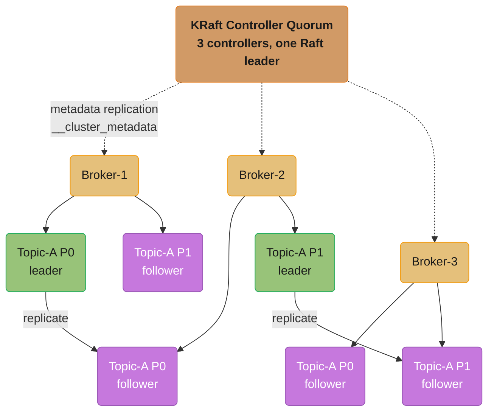
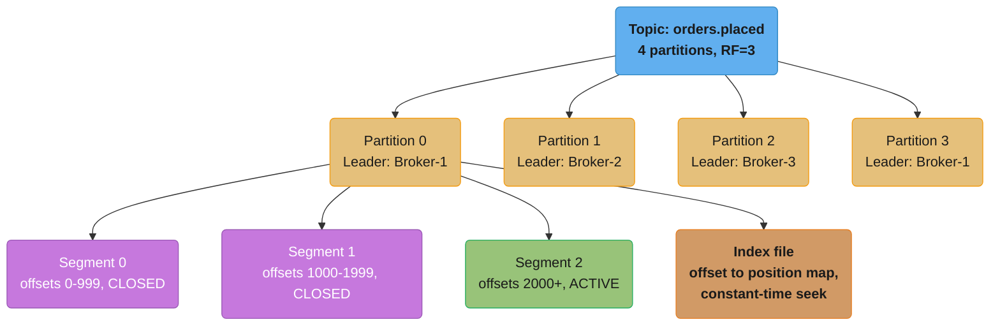
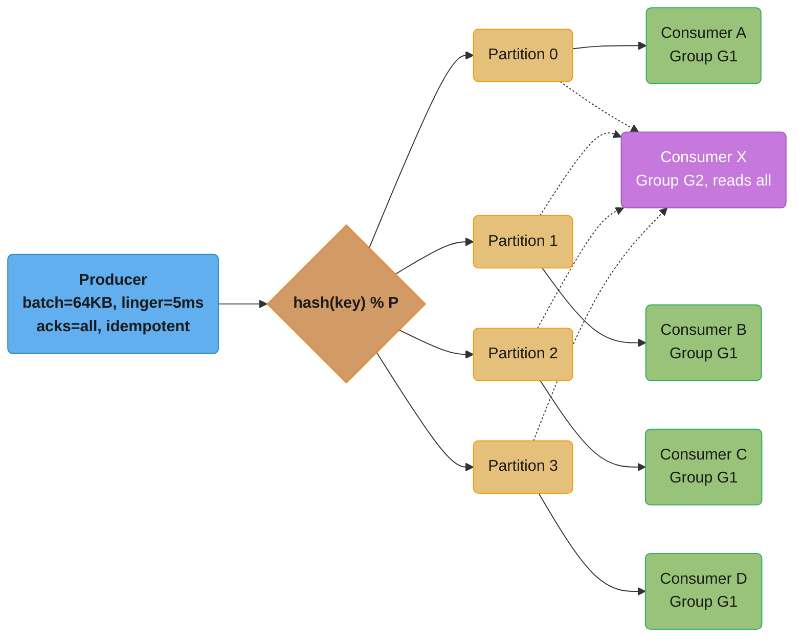
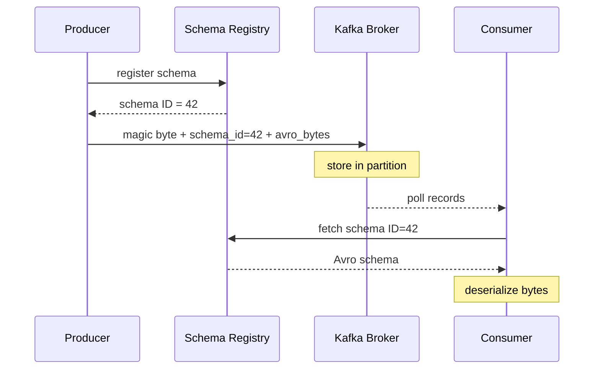
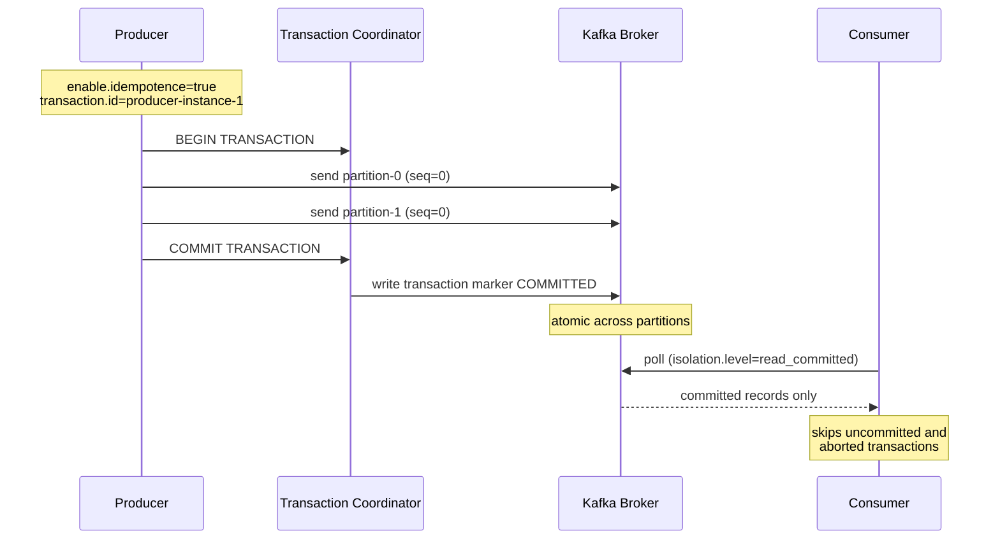
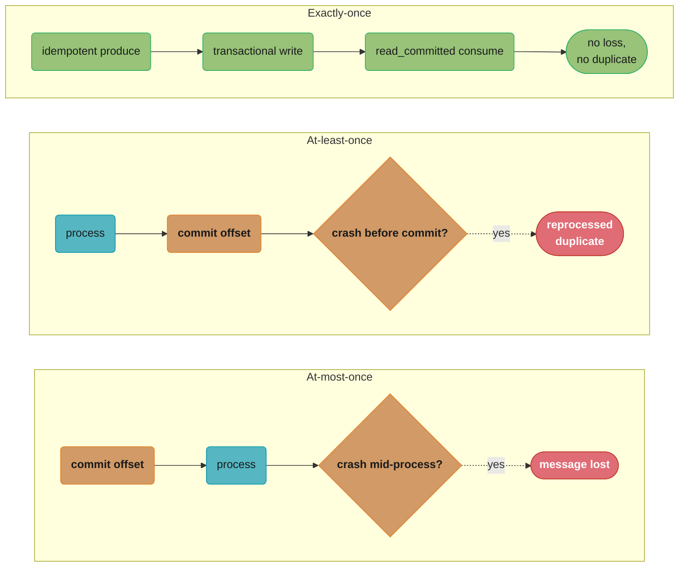
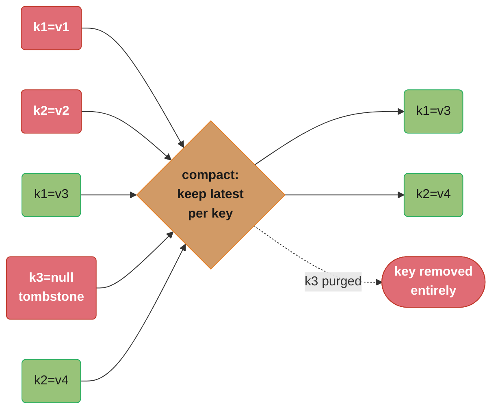
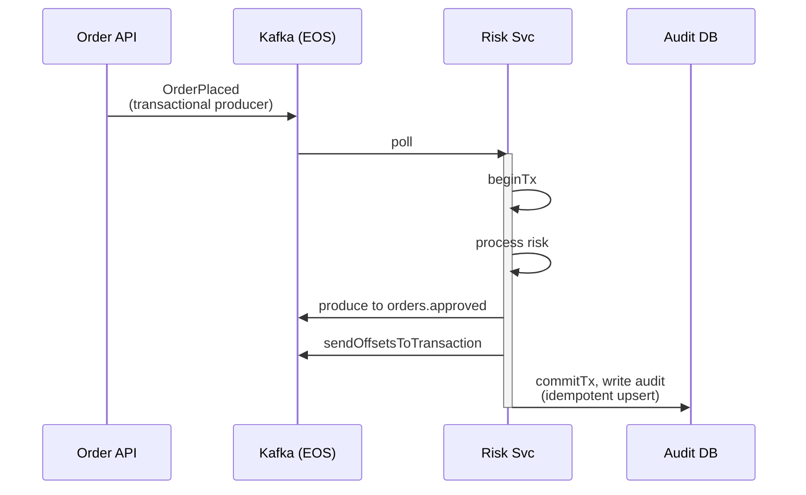

# Kafka Deep Dive

---

## 1. Concept Overview

Apache Kafka is a distributed, durable, high-throughput event streaming platform. It was originally built at LinkedIn to handle activity streams and operational metrics, open-sourced in 2011, and is now the de facto backbone for event-driven architectures at scale.

Kafka's fundamental design choices differ radically from traditional message brokers: the broker is "dumb" (it does not route or transform messages), the consumer is "smart" (it tracks its own position in the log), messages are immutable and retained on disk for configurable periods, and consumers can replay the stream from any point. These choices make Kafka ideal for event streaming, event sourcing, CQRS projections, audit logs, and stream processing.

Cluster metadata lives inside Kafka itself, in KRaft (Kafka Raft Metadata) mode. A quorum of controller nodes replicates every piece of cluster state — topics, partitions, configs, broker registrations, ACLs — through an internal Raft log, so a Kafka cluster has no external coordination service to run, secure, patch, or size. Each node declares its role with `process.roles` and finds the quorum through `controller.quorum.bootstrap.servers`.

**This module targets Kafka 4.x** (latest release at time of writing: 4.3.1, June 2026). Every default quoted below is the Kafka 4.x default — several are commonly misremembered (`acks` is `all`, `enable.idempotence` is `true`, `linger.ms` is `5`).

---

## 2. Intuition

One-line analogy: Kafka is a commit log — an infinitely extensible journal of facts that anyone can read, at any position, at any time, without the journal caring who you are.

Mental model: Imagine a distributed append-only logbook. Every writer appends entries at the end. Every reader has a bookmark (offset) indicating the last entry they read. Readers advance their bookmark at their own pace. The logbook retains entries for a configurable period. Multiple readers can have different bookmarks — one might be reading today's entries, another re-reading entries from last week for a reprocessing job.

Why it matters: Kafka decouples producers and consumers in time, space, and scale. A producer publishing 1 million events per second does not need to wait for any consumer. A consumer that was offline for 6 hours can replay from exactly where it left off. A new service can be added tomorrow and process the event history back to any point.

Key insight: Kafka's durability and replay capability transform it from a message queue into a system of record for event streams. The log is the database.

---

## 3. Core Principles

**The log is the source of truth.** Kafka's core abstraction is the append-only, immutable log. Topics are divided into partitions, each a separate ordered log. Once written, records are never modified.

**Consumers pull, brokers do not push.** Consumers control the rate of consumption via the poll loop. This prevents broker-side back-pressure complexity and allows consumers to slow down, batch, or pause without signaling the broker.

**Partitioning enables parallelism.** A topic with P partitions can be consumed in parallel by up to P consumers within the same consumer group. One consumer per partition is the maximum parallelism.

**Replication provides durability.** Each partition has a leader and zero or more followers. `replication.factor=3` means the partition data is stored on 3 brokers. The ISR (In-Sync Replicas) set tracks which followers are fully caught up.

**Offsets are consumer-side state.** Kafka stores committed offsets in the `__consumer_offsets` internal topic. Consumers commit their progress; the broker does not track what each consumer has read.

**Exactly-once semantics require coordination.** At-most-once: commit before processing (risk loss). At-least-once: commit after processing (risk duplicates). Exactly-once: requires idempotent producer + transactional API + `isolation.level=read_committed` on consumers.

---

## 4. Types / Architectures / Strategies

### Node Roles (KRaft)

Every node sets `process.roles` to one of three values, and the choice is the main cluster-topology decision you make at install time.

**`process.roles=controller` — dedicated controller**
- Joins the Raft quorum that owns all cluster metadata, stored in the internal `__cluster_metadata` topic.
- One controller is the Raft leader (the active controller); the rest replicate its log and stand by.
- Quorum size is odd — 3 controllers tolerate 1 failure, 5 tolerate 2.
- Metadata is a replicated log every broker already caches, so controller failover is near-constant time rather than a full metadata reload that grows with cluster size.

**`process.roles=broker` — dedicated broker**
- Serves produce and fetch traffic, hosts partition replicas, and follows the metadata log to learn assignments.
- Discovers the quorum via `controller.quorum.bootstrap.servers` and talks to it over the listener named in `controller.listener.names`.

**`process.roles=broker,controller` — combined**
- One JVM does both jobs. Convenient for local development, test clusters, and small footprints.
- **Not supported for production workloads** — a broker under GC pressure or heavy fetch load is also the node holding metadata consensus. Give controllers their own JVMs in any critical deployment.

Because metadata is a Raft log rather than an external store, partition counts scale far past what an external coordinator allowed: Confluent's lab test ran 2 million partitions on a single KRaft cluster.

### Topic Retention Strategies

**Delete policy (default)**
- Records are deleted after `retention.ms` (default: 7 days) or when the log reaches `retention.bytes`.
- Suitable for event streams where old data is no longer relevant.

**Compact policy (log compaction)**
- Kafka retains the latest value for each key indefinitely.
- Records with null values (tombstones) delete the key entirely.
- The compacted topic always contains the latest state for every key.
- Suitable for KTable in Kafka Streams, changelog topics, configuration stores.
- Compaction runs asynchronously — recent records are always available even during compaction.

### Producer Delivery Semantics

**acks=0** — fire and forget. Producer does not wait for any broker acknowledgement. Maximum throughput, zero durability. Suitable only for metrics where occasional loss is acceptable.

**acks=1** — leader acknowledges. The partition leader writes to its local log and responds. Followers may not have replicated before the leader fails. Risk: message loss on leader failure before replication.

**acks=all (or acks=-1)** — the leader waits for the full current ISR to acknowledge. **This is the default since Kafka 3.0**, because `enable.idempotence` now defaults to `true` and idempotence requires `acks=all`. Note the interaction: setting `acks=0`/`acks=1` without explicitly setting `enable.idempotence` silently *disables* idempotence; setting `enable.idempotence=true` alongside `acks=1` throws a `ConfigException`.

`min.insync.replicas` (broker/topic config, **default 1**) is the separate floor: it does not change how many replicas the producer waits for, it rejects the write with `NotEnoughReplicasException` when the ISR has fewer members than the floor. With RF=3 and `min.insync.replicas=2`, `acks=all` gives zero message loss as long as `unclean.leader.election.enable` stays at its default `false`.

### Consumer Group Rebalancing Strategies

Kafka 4.x has two rebalance *protocols* (`group.protocol`, default `classic`), and the classic protocol has two *assignment styles*.

**Eager rebalancing — still the effective default in the classic protocol**
- All consumers stop consuming (revoke all partitions).
- Coordinator reassigns all partitions.
- All consumers resume.
- Downside: full stop-the-world pause during rebalance; in large groups this is seconds, not milliseconds.
- Common misconception: cooperative rebalancing is *not* on by default. KIP-726 landed in Kafka 3.0 and made `partition.assignment.strategy` default to the ordered list `RangeAssignor, CooperativeStickyAssignor` — since the list is preference-ordered and `RangeAssignor` is first, an unconfigured consumer still rebalances eagerly. You must set `CooperativeStickyAssignor` explicitly.

**Cooperative-sticky rebalancing (Kafka 2.4+, opt-in)**
- Only partitions that need to move are revoked.
- Other consumers continue processing uninterrupted.
- Implemented via `CooperativeStickyAssignor`.
- Reduces rebalance impact in large consumer groups.

**New consumer group protocol, KIP-848 (`group.protocol=consumer`) — GA in Kafka 4.0**
- Moves assignment from the client-side leader to the broker-side group coordinator; JoinGroup/SyncGroup rounds are replaced by a continuous heartbeat and server-driven reconciliation.
- Rebalances are incremental by construction — there is no stop-the-world phase and no assignor to pick client-side.
- Enabled server-side by default (`group.coordinator.rebalance.protocols` defaults to `classic,consumer,streams`), but **consumers must opt in**: `group.protocol` still defaults to `classic`. It is expected to become the default in a future major release, not yet.

---

## 5. Architecture Diagrams

### Kafka Cluster Architecture (KRaft Mode)



Three controllers form a Raft quorum (orange) that replicates cluster metadata to every broker over the internal `__cluster_metadata` topic; each partition has one leader (green, writable) replicating to two followers (purple) spread across the other brokers, matching `replication.factor=3`.

### Topic, Partition, Segment Structure



orders.placed splits into 4 independently ordered partitions; within Partition 0, closed segments (purple) are immutable on disk, only the newest segment (green) accepts writes, and the index file gives O(1) offset-to-position lookups.

### Producer → Topic → Consumer Group Flow



hash(key) % P routes each record to exactly one of 4 partitions; consumer group G1 assigns one consumer per partition for maximum parallelism (solid, green), while group G2 independently re-reads all 4 partitions for analytics (dotted, purple) without interfering with G1.

### Schema Registry Integration



The producer registers its Avro schema once and gets back numeric ID 42; every message on the wire carries only that ID plus a magic byte, so the consumer fetches (and caches) the schema before deserializing the payload.

### Exactly-Once Semantics (EOS) Architecture



The producer wraps writes to multiple partitions in one transaction; the coordinator commits atomically by writing a COMMITTED marker to every affected partition, so read_committed consumers only ever see fully committed data, never a partial or aborted write.

### Delivery Semantics: Commit Ordering and Failure Modes



At-most-once commits before processing so a mid-process crash silently drops the message; at-least-once commits after processing so the same crash causes a reprocessed duplicate; exactly-once removes the race entirely by combining an idempotent producer, a transactional write, and read_committed consumption.

### Log Compaction Mechanics



Compaction keeps only the newest physical record per key — k1's and k2's superseded values (red) are discarded once a newer one lands — while k3's tombstone (null value) removes the key from the log entirely, leaving a compact snapshot of current state.

---

## 6. How It Works — Detailed Mechanics

### Producer Configuration

```java
Properties props = new Properties();
props.put(ProducerConfig.BOOTSTRAP_SERVERS_CONFIG, "kafka:9092");
props.put(ProducerConfig.KEY_SERIALIZER_CLASS_CONFIG, StringSerializer.class);
props.put(ProducerConfig.VALUE_SERIALIZER_CLASS_CONFIG, KafkaAvroSerializer.class);

// Delivery guarantee (all three are already the Kafka 4.x defaults —
// stated explicitly here so the intent survives a config-management diff)
props.put(ProducerConfig.ACKS_CONFIG, "all");                    // DEFAULT since 3.0; full ISR must confirm
props.put(ProducerConfig.ENABLE_IDEMPOTENCE_CONFIG, true);       // DEFAULT since 3.0; dedupes retries per session
props.put(ProducerConfig.MAX_IN_FLIGHT_REQUESTS_PER_CONNECTION, 5); // DEFAULT 5; idempotence requires <= 5

// Throughput tuning
props.put(ProducerConfig.LINGER_MS_CONFIG, 5);                   // DEFAULT since 4.0 (was 0 in 3.x)
props.put(ProducerConfig.BATCH_SIZE_CONFIG, 65536);              // 64 KB batch (default is 16384 = 16 KB)
props.put(ProducerConfig.BUFFER_MEMORY_CONFIG, 33554432);        // 32 MB send buffer (this IS the default)
props.put(ProducerConfig.COMPRESSION_TYPE_CONFIG, "snappy");     // default is "none"; snappy = low CPU

// Schema Registry
props.put("schema.registry.url", "http://schema-registry:8081");
props.put("specific.avro.reader", true);

// Retries — both of these are already the defaults (retries = 2147483647,
// delivery.timeout.ms = 120000). delivery.timeout.ms, not retries, is the real bound.
props.put(ProducerConfig.RETRIES_CONFIG, Integer.MAX_VALUE);     // retry until the delivery timeout
props.put(ProducerConfig.DELIVERY_TIMEOUT_MS_CONFIG, 120000);    // 2 min total timeout
```

### Transactional Producer (Exactly-Once)

```java
props.put(ProducerConfig.TRANSACTIONAL_ID_CONFIG, "order-producer-" + instanceId);
props.put(ProducerConfig.ENABLE_IDEMPOTENCE_CONFIG, true);

KafkaProducer<String, OrderEvent> producer = new KafkaProducer<>(props);
producer.initTransactions();

try {
    producer.beginTransaction();

    // Send to multiple partitions atomically
    producer.send(new ProducerRecord<>("orders.placed", order.getId(), orderPlacedEvent));
    producer.send(new ProducerRecord<>("audit.log", order.getId(), auditEvent));

    producer.commitTransaction();
} catch (ProducerFencedException | OutOfOrderSequenceException e) {
    // Fatal: close and restart producer
    producer.close();
} catch (KafkaException e) {
    producer.abortTransaction();  // clean rollback
}
```

### Consumer Configuration

```java
Properties props = new Properties();
props.put(ConsumerConfig.BOOTSTRAP_SERVERS_CONFIG, "kafka:9092");
props.put(ConsumerConfig.GROUP_ID_CONFIG, "order-fulfillment-service");
props.put(ConsumerConfig.KEY_DESERIALIZER_CLASS_CONFIG, StringDeserializer.class);
props.put(ConsumerConfig.VALUE_DESERIALIZER_CLASS_CONFIG, KafkaAvroDeserializer.class);

// Cooperative-sticky rebalancing — must be set explicitly. The default is the
// ordered list "RangeAssignor, CooperativeStickyAssignor", and Range (eager) wins.
props.put(ConsumerConfig.PARTITION_ASSIGNMENT_STRATEGY_CONFIG,
    CooperativeStickyAssignor.class.getName());
// Kafka 4.x alternative: drop the assignor entirely and opt into KIP-848 instead,
// which has no client-side assignor at all:
// props.put(ConsumerConfig.GROUP_PROTOCOL_CONFIG, "consumer");  // default is "classic"

// Polling (both values are the defaults; restated because they are coupled)
props.put(ConsumerConfig.MAX_POLL_RECORDS_CONFIG, 500);          // default 500
props.put(ConsumerConfig.MAX_POLL_INTERVAL_MS_CONFIG, 300000);   // default 300000 = 5 min

// Exactly-Once: read only committed data (default is read_uncommitted)
props.put(ConsumerConfig.ISOLATION_LEVEL_CONFIG, "read_committed");

// Reset: where to start if no committed offset exists (default is "latest")
props.put(ConsumerConfig.AUTO_OFFSET_RESET_CONFIG, "earliest");

// NEVER auto-commit in production for at-least-once guarantees (default is true)
props.put(ConsumerConfig.ENABLE_AUTO_COMMIT_CONFIG, false);

props.put("schema.registry.url", "http://schema-registry:8081");
```

### Poll Loop with Manual Commit

```java
KafkaConsumer<String, OrderPlacedEvent> consumer = new KafkaConsumer<>(props);
consumer.subscribe(List.of("orders.placed"));

try {
    while (running) {
        ConsumerRecords<String, OrderPlacedEvent> records =
            consumer.poll(Duration.ofMillis(100));

        for (ConsumerRecord<String, OrderPlacedEvent> record : records) {
            try {
                processOrder(record.value());
            } catch (NonRetryableException e) {
                // send to DLQ, continue — do not let one bad message block the partition
                sendToDlq(record, e);
            }
        }

        // Commit only after all records in the batch are processed
        // commitSync blocks until broker confirms — guarantees at-least-once
        consumer.commitSync();

        // Alternative: commitAsync for higher throughput, with retry callback
        // consumer.commitAsync((offsets, exception) -> {
        //     if (exception != null) log.error("Commit failed", exception);
        // });
    }
} finally {
    // commitSync on close to flush final offsets before leaving group
    consumer.commitSync();
    consumer.close();
}
```

### Kafka Streams: KStream and KTable

```java
StreamsBuilder builder = new StreamsBuilder();

// KStream: unbounded stream of events (one record per event occurrence)
KStream<String, OrderPlacedEvent> orders =
    builder.stream("orders.placed", Consumed.with(Serdes.String(), orderSerde));

// KTable: changelog stream, latest value per key (like a database table)
KTable<String, CustomerProfile> customers =
    builder.table("customers.profiles", Consumed.with(Serdes.String(), customerSerde));

// Stateful join: enrich order stream with customer profile
KStream<String, EnrichedOrder> enrichedOrders = orders.join(
    customers,
    (order, customer) -> new EnrichedOrder(order, customer),
    Joined.with(Serdes.String(), orderSerde, customerSerde)
);

// Windowed aggregation: count orders per customer per hour
KTable<Windowed<String>, Long> ordersPerHour = orders
    .groupByKey()
    .windowedBy(TimeWindows.ofSizeWithNoGrace(Duration.ofHours(1)))
    .count(Materialized.as("orders-per-hour-store"));  // backed by RocksDB

// Output enriched orders to downstream topic
enrichedOrders.to("orders.enriched", Produced.with(Serdes.String(), enrichedOrderSerde));

KafkaStreams streams = new KafkaStreams(builder.build(), streamsConfig);
streams.start();
```

### GlobalKTable vs KTable

```java
// KTable: each Streams instance holds only the partitions assigned to it
// Suitable for large tables, co-partitioned joins
KTable<String, InventoryItem> inventory =
    builder.table("inventory.items");

// GlobalKTable: ALL partitions replicated to EVERY Streams instance
// Enables joins without co-partitioning requirement
// Suitable for small-to-medium reference data tables (country codes, configs)
// Warning: replicated to every instance — do not use for large tables
GlobalKTable<String, ProductCatalog> catalog =
    builder.globalTable("product.catalog");

// Join KStream with GlobalKTable — no co-partitioning required
KStream<String, EnrichedOrder> enriched = orders.join(
    catalog,
    (key, order) -> order.getProductId(),  // key extractor for GlobalKTable lookup
    (order, product) -> new EnrichedOrder(order, product)
);
```

### Log Compaction

```java
// Topic configured for compaction (retain latest value per key)
// AdminClient configuration:
Map<String, String> configs = new HashMap<>();
configs.put("cleanup.policy", "compact");           // default is "delete"
configs.put("min.cleanable.dirty.ratio", "0.1");    // compact at 10% dirty; default is 0.5
configs.put("segment.ms", "3600000");               // 1 h segment roll; default is 604800000 (7 d)

NewTopic compactedTopic = new NewTopic("product.prices", 12, (short) 3)
    .configs(configs);

// Tombstone: null value deletes the key from the compacted log
producer.send(new ProducerRecord<>("product.prices", "product-123", null));
```

### Consumer Lag Monitoring

```bash
# Check consumer group lag via CLI
kafka-consumer-groups.sh \
  --bootstrap-server kafka:9092 \
  --describe \
  --group order-fulfillment-service

# Output:
# GROUP                      TOPIC          PARTITION  CURRENT-OFFSET  LOG-END-OFFSET  LAG
# order-fulfillment-service  orders.placed  0          10000           10050           50
# order-fulfillment-service  orders.placed  1          9800            10050           250
# order-fulfillment-service  orders.placed  2          10001           10050           49
# order-fulfillment-service  orders.placed  3          9950            10050           100
```

---

## 7. Real-World Examples

**LinkedIn — Kafka's origin**: LinkedIn built Kafka to handle activity stream data (page views, likes, searches) and open-sourced it in 2011. LinkedIn's published figures are **7 trillion messages per day** spread across **100+ clusters, 4,000+ brokers, 100,000+ topics and 7 million partitions** — the scale is the fleet, not any single cluster. The unified log architecture replaced point-to-point pipelines between dozens of data systems. LinkedIn also runs a patched fork (releases carry an `-li` suffix) with fixes ahead of upstream.

**Uber — Real-time surge pricing**: GPS events from riders and drivers flow into Kafka, and stream processing jobs compute supply/demand aggregates per geospatial cell in near real-time. Two details usually get stated wrong: Uber's stream processing runs on **Apache Flink** (via their AthenaX SQL platform) — they evaluated Kafka Streams and chose Flink — and the spatial partitioning uses Uber's own **H3 hexagonal grid**, not geohash. Uber has not published a per-second event rate for the surge pipeline specifically; treat any such figure as unsourced.

**Netflix — Change Data Capture to Kafka**: Netflix built its **own** CDC framework, **DBLog** ("DBLog: A Watermark Based Change-Data-Capture Framework", Netflix Tech Blog, 2019), after evaluating Maxwell, SpinalTap, Yelp's MySQL Streamer and Debezium. DBLog reads the MySQL binlog and publishes changes so downstream services can keep read caches, search indexes, and analytics pipelines in sync with the database of record. Netflix's watermark-based chunked-snapshot technique was later adopted *by* Debezium (incremental snapshots), which is the likely source of the common "Netflix uses Debezium" claim.

**Robinhood — Exactly-Once Financial Events**: Robinhood has publicly described writing stock purchase events to Kafka and Postgres, with downstream services consuming them via Kafka Streams under exactly-once semantics, and a sub-one-second trade confirmation SLA across 5-10 Kafka hops. Note the precise guarantee: the idempotent producer dedupes *retries* within a session, and transactions make a multi-partition write plus its consumer offsets atomic — neither makes an external side effect exactly-once.

**Confluent Schema Registry in Production** *(illustrative composite, not a published incident)*: a breaking schema change (removing a required field from an Avro schema) takes down a downstream consumer service during trading hours. The recovery pattern is to enable BACKWARD compatibility enforcement in Schema Registry and have CI reject non-compatible schema PRs before they reach production.

---

## 8. Tradeoffs

| Configuration | Latency | Throughput | Durability | Default in 4.x? | Use Case |
|--------------|---------|------------|------------|-----------------|----------|
| acks=0 | Lowest | Highest | None | No — also disables idempotence | Metrics, logs (loss-tolerant) |
| acks=1 | Low | High | Leader only | No — also disables idempotence | Semi-important events |
| acks=all + min.insync=2 | Higher | Medium | High | acks=all yes, min.insync.replicas=1 by default | Business events, financial |

| Rebalancing Strategy | Stop-the-World | Complexity | Availability | Default? |
|---------------------|---------------|------------|--------------|----------|
| Eager (Range/RoundRobin) | Full pause | Low | since 0.9 | Yes — `RangeAssignor` is first in the default list |
| Cooperative-Sticky | Partial — only moved partitions | Medium | 2.4+ | No — must set `CooperativeStickyAssignor` |
| KIP-848 (`group.protocol=consumer`) | None — broker-driven, incremental | Low for the client | GA in 4.0 | No — `group.protocol` defaults to `classic` |

Compression ratios below are directional only; the achieved ratio depends entirely on payload shape (repetitive JSON/Avro compresses far better than binary or already-compressed data). Benchmark on your own records rather than budgeting off these.

| Compression | CPU Cost | Ratio | Latency | Best For |
|------------|---------|-------|---------|----------|
| none | None | 1x | Lowest | Dev/test (this is the default) |
| snappy | Low | Modest | Low | Throughput-optimized pipelines |
| lz4 | Low | Modest | Very low | Latency-sensitive pipelines |
| gzip | High | Highest | Higher | Storage-constrained, cold data |
| zstd | Medium | High | Low | Best balance: use in production |

| `process.roles` | Nodes needed | Blast radius of one node | Production? |
|-----------------|--------------|--------------------------|-------------|
| `controller` + `broker` (dedicated) | 3 controllers + N brokers | A broker GC pause cannot stall metadata consensus | Yes — the recommended layout |
| `broker,controller` (combined) | N nodes total | Fetch load and metadata consensus share one JVM and one heap | No — dev and test only |

---

## 9. When to Use / When NOT to Use

**Use Kafka when:**
- You need durable, replayable event streams.
- Multiple independent consumers must process the same events (fan-out).
- Throughput requirements exceed millions of messages per day.
- You need event sourcing or CQRS projection rebuilding (replay from offset 0).
- You need stream processing with Kafka Streams or ksqlDB.
- You need to decouple producer and consumer rate (back-pressure buffering).

**Do NOT use Kafka when:**
- You need complex routing logic (RabbitMQ with exchange types is better).
- You need request/reply semantics with short timeouts (use gRPC or REST).
- Your team is small and operational overhead of a Kafka cluster is not justified (use Amazon SQS or RabbitMQ).
- Messages must be delivered to specific consumers based on content-based routing (RabbitMQ headers exchange or SNS filter policies are simpler).
- You need sub-millisecond latency. Kafka's floor is single-digit milliseconds end-to-end even when heavily tuned — Confluent's published tier-1-bank trading case study reports sustaining **sub-5 ms p99** at 1.6 M msg/sec with sub-5 KB messages, and that took dedicated tuning. Ordinary untuned deployments sit well above that.

**Use log compaction when:**
- The topic represents the latest state of a key (product prices, user preferences).
- Consumers need to rebuild current state on startup without processing full history.

**Use delete policy when:**
- Events are time-bounded and older events are irrelevant after the retention window.
- Topic represents a stream of discrete occurrences, not state.

---

## 10. Common Pitfalls

**Pitfall 1 — Consumer group imbalance causing hot partitions.**
A team deployed 8 consumer instances but their topic had only 4 partitions. Four consumers were idle, contributing nothing. The other four each processed one partition. Throughput did not scale with additional consumers. Fix: the number of partitions is the maximum parallelism for a consumer group. Partition count can only be increased (not decreased) without repartitioning. Plan partition count based on target peak throughput divided by per-consumer throughput capacity.

**What the formula is telling you.** "Partitions are the only unit of parallelism a consumer group has. Adding consumers beyond the partition count adds cost and zero throughput — the extras sit assigned to nothing."

The sizing rule is a ceiling function, and rounding it the wrong way is the difference between meeting your SLA and quietly falling behind.

| Symbol | What it is |
|--------|------------|
| target peak throughput | Records/sec you must absorb at the worst moment, not the average |
| per-consumer capacity | Records/sec one consumer instance can actually process |
| partition count | `ceil(target ÷ per-consumer capacity)`. The parallelism ceiling |
| effective consumers | `min(consumer instances, partitions)`. The extras are dead weight |

**Walk one example.** The 8-consumer / 4-partition deployment above, priced out:

```
  per-consumer capacity = 5,000 records/sec

  BROKEN -- 4 partitions, 8 consumers deployed
    effective consumers = min(8, 4) = 4
    actual capacity     = 4 x 5,000 = 20,000 records/sec
    idle consumers      = 8 - 4     = 4      (50% of the fleet wasted)
    doubling the fleet bought exactly 0 extra records/sec

  SIZED -- start from the target instead
    target peak         = 60,000 records/sec
    partitions needed   = ceil(60,000 / 5,000)  = 12
    with 2x headroom for growth                 = 24 partitions
    consumers to deploy today = 12  (capacity 60,000/sec, room to scale to 24)
```

Note the asymmetry that makes this a genuine design decision: **consumers can be scaled up and down freely, partitions effectively only go up.** Increasing partitions later rehashes keys to different partitions, which breaks per-key ordering and forces repartitioning of any Kafka Streams state store keyed on those records. That is why the 2x-to-5x headroom multiplier exists — you are buying the option to scale consumers later without a migration.

**Pitfall 2 — Auto-commit with processing errors causing data loss.**
A team used `enable.auto.commit=true` (the default). When a consumer processed 500 records and one threw a NullPointerException, the exception was caught and logged, but the auto-commit timer had already committed the offset. The failed record was silently lost. Fix: always disable auto-commit in business event consumers. Use `commitSync()` only after all records in the batch are confirmed processed.

**Pitfall 3 — max.poll.interval.ms exceeded causing rebalances.**
A consumer batch included a record that triggered a slow external HTTP call (5 seconds per record). With 500 records per poll, one poll took 2500 seconds. The default `max.poll.interval.ms=300000` (5 minutes) was exceeded. The broker assumed the consumer was dead, triggered a rebalance, reassigned the partition to another instance, which re-processed the same records. Fix: reduce `max.poll.records` to a size that can be processed within `max.poll.interval.ms`. For slow processing, use asynchronous processing with manual flow control, or increase the interval.

**Pitfall 4 — Using string keys with high cardinality causing partition skew.**
A team used the full UUID of the user as the partition key. With 12 partitions and 10,000 active users, the hash distribution should be even. However, 90% of their traffic came from 50 enterprise accounts. All enterprise account events hashed to 3 partitions, creating a severe skew. Fix: choose partition keys that distribute load evenly — consider composite keys or a tier-based routing key rather than raw entity IDs for power-law distributed workloads.

**Pitfall 5 — Schema evolution without compatibility check breaking consumers.**
A producer team changed an Avro field type from `string` to `long` (the field held a numeric ID). They registered the new schema without checking compatibility. Every consumer service was on a fixed schema version and began throwing `SchemaParseException` immediately. The incident lasted 47 minutes. Fix: enforce Schema Registry compatibility mode (BACKWARD or FULL) and add schema compatibility verification as a mandatory CI check before any schema change is merged.

**Pitfall 6 — Not configuring min.insync.replicas with acks=all.**
A team set `acks=all` believing they had full durability. However, `min.insync.replicas` defaulted to 1. With a 3-broker cluster, `acks=all` with `min.insync.replicas=1` means only the leader needs to acknowledge — identical to `acks=1`. When the leader failed before replication, messages were lost. Fix: set `min.insync.replicas=2` for a 3-replica topic. This ensures data is on at least 2 brokers before the producer receives an acknowledgement.

**Pitfall 7 — Ignoring consumer lag until it cascades.**
A streaming pipeline had consistent 0-lag during normal operations. During a Black Friday traffic spike, producers sent 10x normal volume. Consumers could not keep up and lag grew to 50 million records over 6 hours. Downstream systems dependent on near-real-time data (inventory, pricing) were serving 6-hour-old state. Fix: set lag-based autoscaling (HPA on consumer group lag in Kubernetes via KEDA) with alerting thresholds at 10k records lag. Treat consumer lag as a primary SLA metric, not an afterthought.

**Read it like this.** "Lag is a bathtub. It fills at whatever rate production exceeds consumption, and it drains at whatever rate consumption exceeds production — and a tub that took six hours to fill does not empty the moment you turn the tap down."

The dangerous property is that lag is an *integral*, not a rate. A small, steady deficit looks harmless on a per-second dashboard and is catastrophic by dinnertime.

| Symbol | What it is |
|--------|------------|
| lag | `Log End Offset - Committed Offset`. Records produced but not yet processed |
| deficit | `produce rate - consume rate`. Positive = the tub is filling |
| fill time | How long the deficit has been running. Lag = deficit × time |
| drain rate | `consume rate - produce rate` once you have scaled up. Must be positive |
| staleness | `lag ÷ consume rate`. How old the data your consumers emit actually is |

**Walk one example.** Recover the hidden deficit from the two numbers in the incident, then price the recovery:

```
  observed: lag reached 50,000,000 records over 6 hours

  deficit = 50,000,000 / (6 x 3600 s)
          = 50,000,000 / 21,600 s
          = 2,315 records/sec

  That is the entire cause -- a 2,315/sec shortfall. Not dramatic. Not visible
  on a throughput graph. It simply never stopped.

  DRAINING IT -- how much surplus capacity you add decides the recovery time:

    surplus capacity   drain time = 50,000,000 / surplus
    ----------------   -----------------------------------
       2,315/sec         21,598 s  =  6.0 hours   (just breaking even)
       5,000/sec         10,000 s  =  2.8 hours
      10,000/sec          5,000 s  =  1.4 hours
      25,000/sec          2,000 s  =  0.6 hours
```

**Why the 10,000-record alert threshold is the whole fix.** At a 2,315/sec deficit, lag crosses 10,000 records in `10,000 / 2,315 = 4.3 seconds`. The alert fires almost immediately — hours before any human notices stale prices — and KEDA scales consumers while the backlog is still four seconds deep instead of six hours deep. Compare that to the drain table above: catching it at 10,000 records costs seconds of recovery; catching it at 50 million costs hours even with 10x surplus capacity. **The threshold is not tuned to what is "bad" — it is tuned to fire while the backlog is still cheap to clear.**

Note also the staleness column implied here: with a 20,000/sec consumer group, a 50-million-record backlog means the freshest record a consumer touches is `50,000,000 / 20,000 = 2,500 seconds` old — about 42 minutes — and that gap keeps growing as long as the deficit persists. This is the arithmetic that turns "consumer lag" from an ops metric into an SLA violation you can put a number on.

---

## 11. Technologies and Tools

**Kafka Ecosystem**
- Apache Kafka — core broker; cluster metadata is owned by the built-in KRaft controller quorum. Brokers, Connect and the CLI tools require Java 17+; clients and Streams require Java 11+.
- Kafka Streams — embedded Java library for stateful stream processing. No separate cluster required.
- ksqlDB — SQL-like query engine for Kafka streams. Suitable for simpler aggregations without full Java code.
- Kafka Connect — scalable framework for source and sink connectors. 200+ connectors available (JDBC, Elasticsearch, S3, Debezium CDC).
- Kafka MirrorMaker 2 — cross-cluster replication for disaster recovery and geo-replication.

**Schema Management**
- Confluent Schema Registry — supports Avro, Protobuf, JSON Schema. REST API for schema management. Compatibility modes: NONE, BACKWARD, BACKWARD_TRANSITIVE, FORWARD, FORWARD_TRANSITIVE, FULL, FULL_TRANSITIVE.
- AWS Glue Schema Registry — managed equivalent for AWS deployments. Integrates with MSK (Managed Streaming for Kafka).

**Managed Kafka**
- Confluent Cloud — fully managed Kafka with enterprise features (RBAC, audit logs, cluster linking).
- Amazon MSK — managed Kafka on AWS. MSK Serverless for unpredictable workloads.
- Aiven for Kafka — managed Kafka across AWS, GCP, Azure.

**Monitoring**
- Confluent Control Center — commercial UI for consumer lag, broker health, Schema Registry. Ships separately from Confluent Platform as `confluent-control-center-next-gen` (2.0+) on its own release cadence, and stores its metrics in Prometheus rather than an internal Kafka Streams pipeline.
- Kafdrop — open-source web UI for topic/message inspection.
- Burrow (LinkedIn) — consumer lag monitoring with rule-based alerting.
- KEDA (Kubernetes) — event-driven autoscaling based on Kafka consumer group lag.
- JMX metrics exposed by brokers — integrate with Prometheus via JMX Exporter.

**Spring Integration**
- Spring Kafka (`spring-kafka`) — `@KafkaListener`, `KafkaTemplate`, `KafkaTransactionManager`.
- Spring Cloud Stream — binder abstraction for Kafka and RabbitMQ. Handlers are plain `Supplier<T>` / `Function<T,R>` / `Consumer<T>` beans, bound to destinations by `spring.cloud.stream.function.definition`.

---

## 12. Interview Questions with Answers

**Q: What is the role of a partition in Kafka and how does it enable parallelism?**
A partition is the fundamental unit of parallelism and ordering in Kafka. Each topic is split into N partitions, each an independent ordered log stored on a single broker (the partition leader). Within a consumer group, each partition is consumed by exactly one consumer at a time. Therefore, a topic with 12 partitions can be consumed by at most 12 consumers in parallel within one group. Ordering is guaranteed within a partition but not across partitions. Choose a partition key (e.g., orderId) that maps the records you need ordered together to the same partition.

**Q: What is the ISR (In-Sync Replicas) and how does it relate to acks=all?**
The ISR is the set of replicas that are fully caught up with the partition leader within `replica.lag.time.max.ms` (default 30 seconds). With `acks=all`, the producer waits for all replicas in the ISR to confirm the write. If `min.insync.replicas=2` and the ISR has 3 replicas, all 3 must confirm. If one broker is slow and falls out of the ISR, the producer only waits for the remaining ISR members (as long as ISR size >= min.insync.replicas). If the ISR shrinks below `min.insync.replicas`, the producer receives a `NotEnoughReplicasException`.

**Q: What is the difference between at-most-once, at-least-once, and exactly-once delivery semantics in Kafka?**
At-most-once commits the offset before processing — if processing fails, the message is lost but never duplicated. At-least-once commits after processing — if the consumer crashes after processing but before committing, the message is reprocessed on restart, potentially causing duplicates. Exactly-once is achieved by combining three features: `enable.idempotence=true` on the producer (eliminates duplicates caused by producer retries), `transactional.id` + `producer.beginTransaction()` / `commitTransaction()` for atomic multi-partition writes, and `isolation.level=read_committed` on consumers so they only see committed data. Without all three, you cannot guarantee exactly-once. Scope matters and is the most common interview trap: a Kafka transaction spans Kafka partitions and the `__consumer_offsets` entries only. It is **not** a distributed transaction — it cannot atomically include a write to Postgres, an HTTP call, or an email send, so every external side effect still needs its own idempotency key.

**Q: What does enable.idempotence=true do in the producer?**
The idempotent producer assigns a producer ID (PID) and a monotonically increasing sequence number to each message. The broker tracks the last sequence number per (PID, partition). If the producer retries a message (e.g., due to a network timeout), the broker detects the duplicate sequence number and discards the duplicate, returning success to the producer. This eliminates duplicates caused by producer retries within a single producer session. Two things people get wrong: it has been the **default since Kafka 3.0**, so you are already running it unless a conflicting `acks`/`retries` setting silently switched it off; and the PID is reassigned on producer restart, so idempotence is per-session only. It also constrains config — `acks` must be `all`, `retries` > 0, and `max.in.flight.requests.per.connection` <= 5; explicitly enabling idempotence alongside a conflicting value throws `ConfigException`. For cross-session deduplication, use transactional producers or consumer-side idempotency.

**Q: What is log compaction and when would you use it instead of the default delete policy?**
Log compaction retains the latest value for each record key indefinitely, deleting older records with the same key. A null value (tombstone) causes the key to be deleted entirely after the compaction runs. Use it for topics that represent current state rather than event history — for example, a `product.prices` topic where only the latest price matters, or a Kafka Streams changelog topic backing a state store. Use the delete policy when events are time-bounded and older events are irrelevant after a retention period.

**Q: What is the difference between KStream and KTable in Kafka Streams?**
A KStream represents an unbounded stream of events where each record is an independent fact. Multiple records with the same key coexist and are all processed. A KTable represents a changelog stream where each record is an update to a keyed value — only the latest value per key matters, similar to a database table. Internally, a KTable is backed by a state store (RocksDB by default). Use KStream for event processing (every occurrence matters). Use KTable for current-state lookups (latest value per key). A KStream can be aggregated into a KTable.

**Q: What is a GlobalKTable and when should you use it instead of a KTable?**
A GlobalKTable is replicated to every Kafka Streams instance in the application, regardless of which partitions that instance is assigned. This means any instance can join any record against a GlobalKTable without co-partitioning requirements. Use it for small-to-medium reference data (country codes, product catalog with <100k entries) that every instance needs. Never use GlobalKTable for large tables — the full dataset is stored locally on every instance. For large tables with co-partitioned keys, use a regular KTable join.

**Q: Explain the producer batching mechanism and how to tune it.**
The producer accumulates records in an in-memory batch per partition and sends when the batch fills or `linger.ms` elapses, whichever comes first. `batch.size` defaults to 16384 (16 KB). `linger.ms` **defaults to 5 in Kafka 4.x** — it was 0 through 3.x and was changed by KIP-1030, on the reasoning that the efficiency gain from larger batches usually produces similar or lower end-to-end latency despite the added wait. With `linger.ms=0` each record is sent as soon as possible (low latency, poor batching). For throughput-optimized pipelines: set `batch.size=65536` (64 KB), `linger.ms=5–20`, and enable compression. For genuinely latency-sensitive pipelines you can drop `linger.ms` toward 0-1, but measure rather than assume — under multi-producer load Confluent found a small linger (5-10 ms) actually improved p99.

**Q: What is cooperative-sticky rebalancing and why is it better than eager rebalancing?**
In eager rebalancing, all consumers in a group revoke all partitions simultaneously, then the coordinator reassigns all partitions. This causes a full stop-the-world pause — no consumer processes any message during the rebalance, and in large groups that is seconds. In cooperative-sticky rebalancing (`CooperativeStickyAssignor`), only the partitions that need to move are revoked, and only the affected consumers pause briefly. Unaffected consumers continue processing uninterrupted. The rebalance runs in multiple rounds. The trap: it is NOT the default. KIP-726 (Kafka 3.0) set `partition.assignment.strategy` to the preference-ordered list `RangeAssignor, CooperativeStickyAssignor`, and because `RangeAssignor` is first, an unconfigured 4.x consumer still rebalances eagerly. In Kafka 4.0+ the stronger option is the KIP-848 protocol (`group.protocol=consumer`), which makes assignment broker-driven and incremental with no client-side assignor at all — also opt-in.

**Q: What is the Schema Registry and what compatibility modes does it support?**
The Schema Registry is a centralized service that stores and enforces schemas for Kafka messages. Producers register a schema and receive a numeric schema ID; the ID and serialized bytes are published to Kafka. Consumers fetch the schema by ID and deserialize. Compatibility modes: BACKWARD — new schema can read data written with old schema (safe: add optional fields with defaults); FORWARD — old schema can read data written with new schema (safe: only add fields that old consumers will ignore); FULL — both backward and forward; BACKWARD_TRANSITIVE / FORWARD_TRANSITIVE / FULL_TRANSITIVE — check against all historical versions, not just the latest. Use FULL_TRANSITIVE for the strongest guarantee.

**Q: How does Kafka handle message ordering guarantees?**
Kafka guarantees order within a single partition. Records with the same partition key always land in the same partition (hash(key) % numPartitions) and are consumed in order by the assigned consumer. There is no ordering guarantee across partitions. To maintain order for an entity (e.g., all events for order-123), always use the entity ID as the partition key. With `enable.idempotence=true`, setting `max.in.flight.requests.per.connection=5` (up from 1) is safe because the idempotent producer reorders retried batches correctly using sequence numbers.

**Q: What is the purpose of the transaction.id configuration in the producer?**
The `transaction.id` is a static, application-assigned identifier that enables the broker to fence zombie producers. If a producer instance crashes and a new instance starts with the same `transaction.id`, the broker increments the producer epoch and rejects writes from the old instance (the zombie). This prevents two producer instances from writing to the same transactional stream simultaneously, which would break the exactly-once guarantee. The `transaction.id` must be unique per partition subset the producer writes to and stable across restarts.

**Q: How would you implement a consumer that processes messages exactly once, end-to-end?**
You need: producer-side EOS (`enable.idempotence=true`, `transactional.id`, `acks=all`) to guarantee the event is written exactly once to Kafka. Consumer-side `isolation.level=read_committed` so the consumer only reads committed transactional records. If the consumer writes results to Kafka (Kafka-to-Kafka), use consumer-producer transactions: `consumer.poll()`, process, `producer.beginTransaction()`, produce result, send offsets with `producer.sendOffsetsToTransaction(offsets, groupMetadata)`, `producer.commitTransaction()`. This atomically commits both the result and the offset. If the consumer writes to an external database, use idempotent upserts keyed on the Kafka record's offset+partition as the idempotency key.

**Q: What metrics should you monitor in a production Kafka deployment?**
Producer metrics: `record-error-rate` (should be 0), `record-send-rate`, `request-latency-avg`. Consumer metrics: consumer group lag per partition (most critical — alert at 10k+ records), `fetch-rate`, `commit-rate`. Broker metrics: `UnderReplicatedPartitions` (should be 0 — indicates ISR degradation), `ActiveControllerCount` (should be 1), `OfflinePartitionsCount` (should be 0), disk utilization, network throughput, `RequestHandlerAvgIdlePercent` (below 30% indicates broker is overloaded). Topic metrics: message rate per partition, bytes in/out per broker.

**Q: What is the difference between consumer group rebalancing and partition reassignment?**
Consumer group rebalancing is a runtime event triggered when a consumer joins or leaves a group, or when partition count changes. It redistributes partition assignments among the live consumers in the group without moving data. Partition reassignment (via `kafka-reassign-partitions.sh` or Admin API) is an administrative operation that moves partition replicas between brokers — it physically copies partition data to new brokers. Partition reassignment is used for broker decommissioning, rack-aware rebalancing, or restoring replication factor after broker failure.

**Q: How does KRaft manage cluster metadata, and what does each node role do?**
KRaft keeps all cluster metadata inside Kafka itself, in an internal Raft log replicated by a quorum of controller nodes. The quorum elects one active controller as its Raft leader; metadata — topics, partitions, configs, broker registrations, ACLs — lives in the internal `__cluster_metadata` topic, and every broker tails that log and caches it locally. Each node sets `process.roles` to `controller`, `broker`, or `broker,controller`, and brokers reach the quorum via `controller.quorum.bootstrap.servers` on the listener named by `controller.listener.names`. Failover is near-constant time rather than a metadata reload that grows with cluster size, because a new active controller only has to replay a log every node already holds, and partition counts scale into the millions (Confluent lab-tested 2 million on one cluster). The production rule interviewers look for: run dedicated controllers, since a combined `broker,controller` node puts fetch load and metadata consensus in the same JVM and heap.

**Q: What is the significance of the linger.ms and batch.size settings together?**
These two settings jointly control when the producer sends a batch. `batch.size` sets the maximum size of a batch in bytes — the batch is sent immediately when full. `linger.ms` sets the maximum time the producer waits for the batch to fill before sending regardless of size. They work together: with `batch.size=64KB` and `linger.ms=5`, the producer sends when either 64KB is accumulated OR 5ms elapses, whichever comes first. At high throughput, batches fill quickly (batch.size dominates — near-zero extra latency). At low throughput, linger.ms governs (adds up to 5ms latency but groups more records together for compression efficiency). Setting both `linger.ms=0` and a large `batch.size` is counterproductive — batches will rarely fill.

**Q: How do you monitor and alert on consumer lag in production?**
Consumer lag = Log End Offset - Consumer Committed Offset per partition. Monitor it via JMX (`kafka.consumer:type=consumer-fetch-manager-metrics,client-id=*,attribute=records-lag-max`), Burrow (LinkedIn's consumer lag monitor), or by querying the Kafka Admin API. Export to Prometheus via the Kafka JMX Exporter. Set Grafana alerts: warn at 10,000 records lag, critical at 100,000. For Kubernetes deployments, use KEDA (Kubernetes Event-Driven Autoscaling) with the Kafka scaler to automatically scale consumer pod count based on lag. Treat lag as a latency SLA — if your SLA is 30-second processing freshness, 300,000 records at 10,000 records/sec processing speed means 30 seconds of lag before SLA breach.

---

## 13. Best Practices

- **Set min.insync.replicas=2 on every business-event topic**: `acks` already defaults to `all` in Kafka 4.x, but `min.insync.replicas` still defaults to **1**, and `acks=all` against a one-member ISR is exactly as weak as `acks=1`. The topic-level floor is the half of the pair nobody sets.

- **Do not let a config change silently disable idempotence**: `enable.idempotence` defaults to `true`, but setting `acks=1` (or `acks=0`, or `retries=0`) without explicitly enabling idempotence turns it off with no error. Set both explicitly so any conflict fails loudly with `ConfigException`.

- **Use cooperative-sticky rebalancing in all new consumer deployments**: it is not the default — the default assignor list is `RangeAssignor, CooperativeStickyAssignor` and Range (eager) wins, so you must set `CooperativeStickyAssignor` explicitly. On Kafka 4.0+, evaluate `group.protocol=consumer` (KIP-848) instead, which removes client-side assignment entirely.

- **Set transaction.id to a stable, unique identifier per producer instance**: for Kubernetes deployments, use a combination of the pod name and a stable hash. This enables the broker to fence zombie producers on restart.

- **Never use auto.offset.reset=latest in production for business-critical consumers**: if your consumer group is new or has lost its committed offsets, `latest` silently drops all messages produced while the consumer was down. Use `earliest` and implement idempotent processing instead.

- **Enforce Schema Registry compatibility in CI**: use the Confluent Maven plugin or a REST API check in your PR pipeline to verify schema compatibility before any schema change is merged. A compatibility failure in CI is a 10-minute fix; in production it is a 30–60-minute incident.

- **Size partitions based on target throughput, not current throughput**: adding partitions later requires repartitioning downstream state stores in Kafka Streams. Plan for 2x–5x current peak throughput when setting initial partition count.

- **Monitor UnderReplicatedPartitions as a P1 alert**: this metric indicates that a partition replica is not in sync. It is the earliest warning of broker degradation and data durability risk before an actual outage.

- **Use compression in production**: `compression.type` defaults to `none`, so this is always an explicit choice. Enable `snappy` or `zstd`; on repetitive Avro/JSON payloads the reduction in broker disk usage and network I/O typically outweighs the CPU cost, but the achieved ratio is entirely payload-dependent — measure it on your own records rather than budgeting off a quoted multiple.

- **Design for consumer idempotency even with EOS**: exactly-once semantics in Kafka apply to Kafka-to-Kafka flows. Any external side effects (database writes, HTTP calls, emails) must be idempotent because consumer restarts can re-execute processing logic.

- **Use separate consumer groups for separate concerns**: do not share a consumer group between a real-time processing pipeline and a batch analytics job. They have different throughput, latency, and replay requirements. Sharing a group prevents either from scaling independently.

---

## 14. Case Study

### Real-Time Order Processing Pipeline with Exactly-Once Semantics

*(Illustrative worked scenario — the company, timeline and measured figures below are constructed to exercise the mechanics, not a published case study.)*

**Scenario**: A fintech company processes stock trade orders. Each order triggers inventory reservation, risk assessment, and audit logging. Duplicate processing of a trade (double execution) or missed processing (silent loss) both cause regulatory and financial consequences. The team must achieve exactly-once processing end-to-end.

**Architecture**:



The risk service polls OrderPlaced, evaluates it, and produces the approval event plus its own consumer offsets inside one transaction, so a crash at any point before commitTx simply replays the same batch with zero duplicate audit writes.

**Producer Configuration**:
```java
props.put(ProducerConfig.ACKS_CONFIG, "all");                       // default in 4.x
props.put(ProducerConfig.ENABLE_IDEMPOTENCE_CONFIG, true);          // default in 4.x
props.put(ProducerConfig.TRANSACTIONAL_ID_CONFIG, "order-api-" + podOrdinal);
props.put(ProducerConfig.MAX_IN_FLIGHT_REQUESTS_PER_CONNECTION, 5); // default 5
// min.insync.replicas=2 set at topic level -- the broker default is 1, so this
// is the only line here that is NOT already the platform default.
```

**Consumer + Produce Transaction**:
```java
consumer.subscribe(List.of("orders.placed"));
producer.initTransactions();

while (running) {
    ConsumerRecords<String, TradeOrder> records = consumer.poll(Duration.ofMillis(100));
    if (records.isEmpty()) continue;

    producer.beginTransaction();
    try {
        for (ConsumerRecord<String, TradeOrder> record : records) {
            RiskDecision decision = riskEngine.evaluate(record.value());
            ProducerRecord<String, RiskDecision> result =
                new ProducerRecord<>("orders.approved", record.key(), decision);
            producer.send(result);
        }
        // Atomically commit offsets AND produced records
        producer.sendOffsetsToTransaction(
            getOffsets(records),
            consumer.groupMetadata()
        );
        producer.commitTransaction();
    } catch (Exception e) {
        producer.abortTransaction();
        // records will be reprocessed from last committed offset
    }
}
```

**Schema Evolution**:
- `TradeOrder` Avro schema registered with `FULL_TRANSITIVE` compatibility.
- When the team needed to add a `regulatoryRegion` field (initially absent), they added it with a default value of `"UNKNOWN"`. All existing messages deserialized correctly with the default. All new messages carried the field explicitly.
- Schema Registry CI check: any PR touching `.avsc` files triggers a `GET /compatibility/subjects/{subject}/versions/latest` check against the registry staging environment. Non-compatible schemas fail the build.

**Outcomes** *(illustrative figures for this constructed scenario — not measured public data)*:
- No duplicate trade executions attributable to producer retries or consumer restarts, because every write is inside a transaction and the audit path is an idempotent upsert.
- Consumer lag monitored via KEDA: at peak trading hours (market open), consumer pods autoscale from 4 to 16 based on a lag threshold of 5,000 records.
- Rebalancing during rolling deployments: switching from the default eager `RangeAssignor` to `CooperativeStickyAssignor` shrinks partition unavailability from a whole-group pause to only the partitions actually moving. On Kafka 4.0+, `group.protocol=consumer` removes the client-side assignment round entirely.

**Note on the guarantee's boundary**: the transaction covers the `orders.approved` write plus the consumer offsets. The audit-DB write is outside it, which is why it must be an idempotent upsert keyed on `(topic, partition, offset)` — no Kafka transaction can make a Postgres write atomic with a Kafka write.
