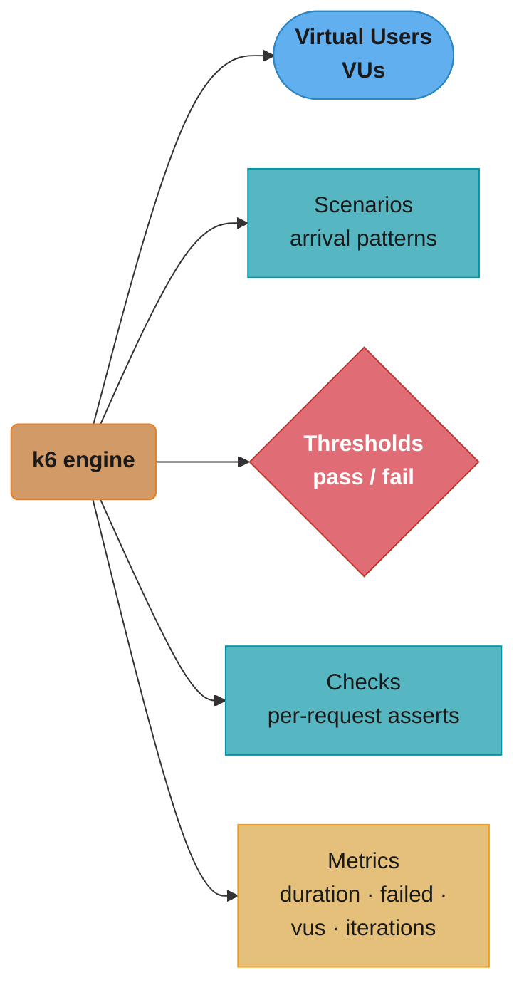
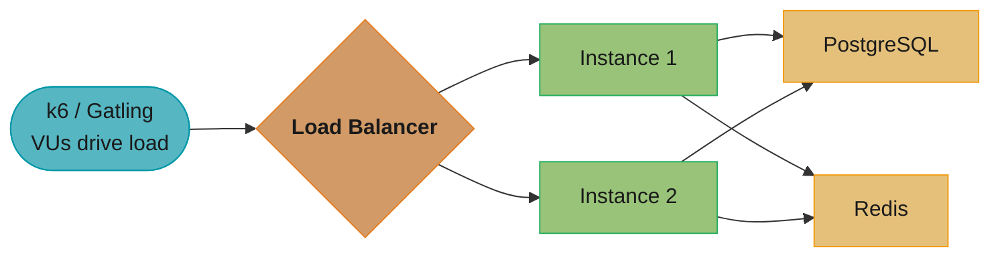
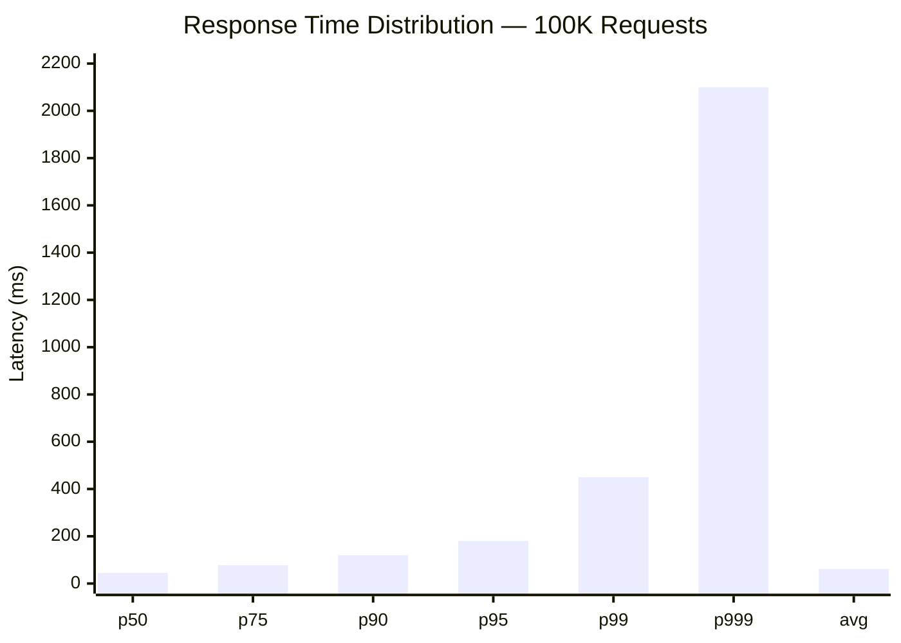
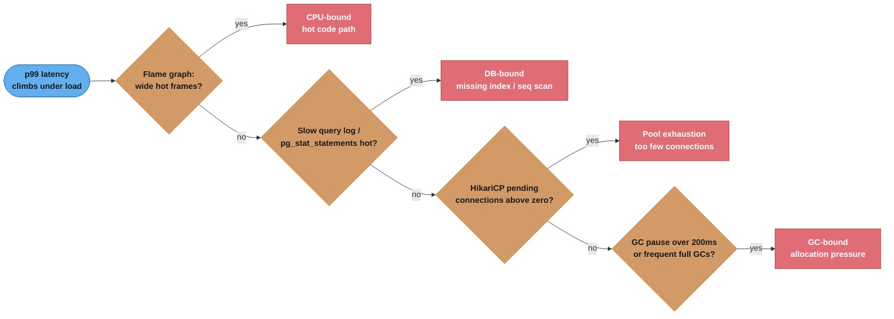
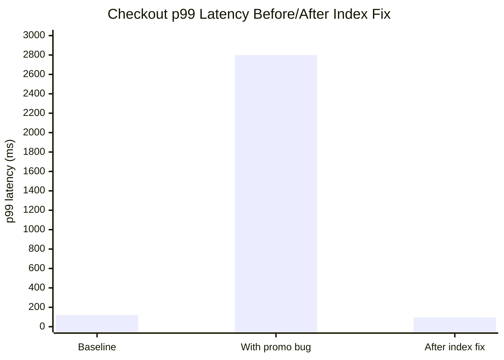

# Load and Performance Testing

## 1. Concept Overview

Performance testing is the practice of applying synthetic load to a system to measure behavior under known conditions — throughput, latency percentiles, error rate, and resource utilization. Load testing validates behavior under expected production load. Stress testing finds the breaking point. Soak testing reveals slow degradation over hours. Spike testing measures resilience to sudden traffic bursts. Performance tests answer "how does the system behave?" while functional tests answer "does the system behave correctly?"

---

## 2. Intuition

You would not launch a bridge without testing it under load. You would apply increasing weight, watch where it flexes, and find the failure mode before it happens with real traffic. The same principle applies to APIs. A service that handles 100 requests per second in dev may collapse at 1000 in production because of an unindexed database query that scales O(n) with data size. Performance testing finds these cliffs before users do.

Key insight: performance problems are almost always caused by a small number of bottlenecks — a missing index, connection pool exhaustion, an O(n²) loop on a critical path. The goal is to find and fix these rather than over-provision hardware.

---

## 3. Core Principles

- **Test in isolation**: performance test a specific service or endpoint, not the entire system, to identify the specific bottleneck
- **Warm up the JVM**: first 1-2 minutes of a JVM process involve JIT compilation — do not include ramp-up period in measurements
- **Use realistic data**: production-representative data sizes, access patterns, and distribution (Pareto: 20% of users generate 80% of traffic)
- **Measure percentiles**: p50, p95, p99, p999 — averages hide outliers that affect 1 in 100 or 1 in 1000 users
- **Automate in CI**: catch performance regressions before they merge

---

## 4. Types / Architectures / Strategies

| Test Type | Load Pattern | Goal | Duration |
|-----------|-------------|------|---------|
| Load | Gradual ramp to expected peak | Verify behavior at normal load | 30 min - 2 hours |
| Stress | Ramp past capacity | Find breaking point, failure mode | 1-4 hours |
| Soak | Sustained expected load | Memory leaks, slow degradation | 8-24 hours |
| Spike | Sudden 10x traffic burst | Resilience, auto-scaling behavior | 30 min |
| Volume | Normal RPS with huge data sets | Query performance at scale | Varies |
| Breakpoint | Ramp until error rate > 1% | Find maximum sustainable RPS | 1-2 hours |

---

## 5. Architecture Diagrams



*k6 separates who arrives (VUs) and how (Scenarios) from what passes: Checks count per-request assertions without failing fast, while Thresholds are the actual pass/fail gate. Both read from the same Metrics stream — http_req_duration, http_req_failed, vus, iterations.*



*The load generator's VUs drive traffic through the load balancer to both instances, which share a single PostgreSQL and Redis. Monitor four layers together during the run: API (p50/p95/p99/p999, error rate, RPS), JVM (GC pause, heap, thread count), DB (connections, slow query log, lock waits), and System (CPU%, memory, network/disk I/O).*

---

## 6. How It Works — Detailed Mechanics

### k6 Load Test Script

```javascript
import http from 'k6/http';
import { check, sleep } from 'k6';
import { Rate, Trend } from 'k6/metrics';

// Custom metrics
const orderCreateRate = new Rate('order_create_success');
const orderCreateDuration = new Trend('order_create_duration');

export const options = {
  // Scenario: ramp up, steady state, ramp down
  stages: [
    { duration: '2m', target: 50 },   // ramp up to 50 VUs
    { duration: '10m', target: 50 },  // stay at 50 VUs
    { duration: '2m', target: 100 },  // spike to 100 VUs
    { duration: '5m', target: 100 },  // stay at 100 VUs
    { duration: '2m', target: 0 },    // ramp down
  ],

  // Pass/fail criteria — build fails if violated
  thresholds: {
    'http_req_duration': ['p(99)<200', 'p(95)<100'],  // p99 < 200ms, p95 < 100ms
    'http_req_failed': ['rate<0.01'],                  // error rate < 1%
    'order_create_success': ['rate>0.99'],             // 99% of orders succeed
  },
};

const BASE_URL = __ENV.BASE_URL || 'http://localhost:8080';

// Setup: runs once before all VUs, returns data shared across VUs
export function setup() {
  const loginRes = http.post(`${BASE_URL}/api/auth/login`, JSON.stringify({
    username: 'testuser',
    password: 'testpass',
  }), { headers: { 'Content-Type': 'application/json' } });
  return { token: loginRes.json('token') };
}

// Default function: runs for each VU iteration
export default function(data) {
  const headers = {
    'Content-Type': 'application/json',
    'Authorization': `Bearer ${data.token}`,
  };

  // Create order
  const createStart = new Date();
  const createRes = http.post(`${BASE_URL}/api/orders`, JSON.stringify({
    userId: `user-${__VU}`,  // __VU = virtual user number
    items: [{ sku: 'SKU-001', quantity: 1 }],
  }), { headers });

  orderCreateDuration.add(new Date() - createStart);

  const createOk = check(createRes, {
    'order created': (r) => r.status === 201,
    'has order id': (r) => r.json('id') !== null,
  });
  orderCreateRate.add(createOk);

  if (createOk) {
    const orderId = createRes.json('id');

    // Get order
    const getRes = http.get(`${BASE_URL}/api/orders/${orderId}`, { headers });
    check(getRes, {
      'order retrieved': (r) => r.status === 200,
      'order status correct': (r) => r.json('status') === 'PENDING',
    });
  }

  sleep(1); // think time between iterations
}
```

### k6 Constant Arrival Rate (avoids coordinated omission)

```javascript
export const options = {
  scenarios: {
    constant_rate: {
      executor: 'constant-arrival-rate',
      rate: 100,          // 100 iterations per second
      timeUnit: '1s',
      duration: '10m',
      preAllocatedVUs: 150,  // pre-allocate VUs for requests
      maxVUs: 300,           // max VUs if preAllocated exhausted
    },
  },
};
// Unlike constant-vus, this sends 100 req/s regardless of response time
// When system slows, k6 will spin up more VUs to maintain the rate
// This reflects real-world traffic (arrivals don't wait for prior responses)
```

### Gatling Simulation

```scala
class OrderSimulation extends Simulation {

  val httpProtocol = http
    .baseUrl("http://localhost:8080")
    .acceptHeader("application/json")
    .contentTypeHeader("application/json")

  val feeder = csv("orders.csv").random  // CSV with userId, sku columns

  val createOrderScenario = scenario("Create Order")
    .feed(feeder)
    .exec(
      http("Create Order")
        .post("/api/orders")
        .body(StringBody("""{"userId":"${userId}","items":[{"sku":"${sku}","quantity":1}]}"""))
        .check(status.is(201))
        .check(jsonPath("$.id").saveAs("orderId"))
    )
    .pause(1)  // think time
    .exec(
      http("Get Order")
        .get("/api/orders/${orderId}")
        .check(status.is(200))
        .check(jsonPath("$.status").is("PENDING"))
    )

  setUp(
    createOrderScenario.inject(
      rampUsersPerSec(10).to(100).during(2.minutes),
      constantUsersPerSec(100).during(10.minutes)
    )
  ).protocols(httpProtocol)
    .assertions(
      global.responseTime.percentile3.lt(200),  // p99 < 200ms
      global.failedRequests.percent.lt(1)        // error rate < 1%
    )
}
```

### Percentile Analysis



*Latency climbs non-linearly toward the tail: p50-p90 stay under 120ms while p99 (450ms) and especially p999 (2100ms) expose the 1-in-100 and 1-in-1000 worst cases that the 62ms average hides entirely — both p95 and p99 still clear their 200ms / 500ms SLOs.*

```
Rule: NEVER alert or SLO on averages.
      A p999 of 2100ms means 100 users/minute at 100K RPS experience > 2 second latency.

Coordinated omission check:
  If test tool used 50 VUs and each waited for response before next request:
  - When system slows to 450ms p99, 50 VUs * (1000ms/450ms) = ~111 RPS (not 1000 RPS)
  - Latency histogram only has samples at those 111 req/s, missing the queued-up requests
  - Fix: use constant-arrival-rate in k6 or open-model injection in Gatling
```

### Identifying Bottlenecks

```bash
# During load test, correlate these signals:

# 1. CPU-bound: flame graph shows compute (sorting, serialization, regex)
java -agentpath:/async-profiler/libasyncProfiler.so=start,event=cpu,file=/tmp/profile.html \
  -jar service.jar
# View /tmp/profile.html — wide frames at the top = hot code paths

# 2. DB-bound: check slow query log
# PostgreSQL: log queries > 100ms
SET log_min_duration_statement = 100;
SELECT query, calls, mean_exec_time, stddev_exec_time
FROM pg_stat_statements
ORDER BY mean_exec_time DESC LIMIT 20;

# 3. Connection pool exhaustion: HikariCP metrics
# management.metrics.enable.hikaricp=true
# Alert: hikaricp.connections.pending > 0 for > 5 seconds

# 4. GC pressure: JVM flags during load test
-Xlog:gc*:file=/tmp/gc.log:time,uptime:filecount=5,filesize=20m
# Look for: long GC pauses (> 200ms), frequent full GCs, allocation rate > 500MB/s
```



*Each "no" pushes the search to the next signal — flame graph, then slow-query log, then HikariCP pool metrics, then GC log — the same order as the four checks above; the first "yes" is usually the real bottleneck.*

---

## 7. Real-World Examples

- **Twitter**: migrated from Ruby to Java partly after performance testing showed the JVM handles 10x more requests per server at same latency; now handles 600K TPS at peak
- **LinkedIn**: performance regression testing catches p99 regressions > 10% before merge; reduced production incidents by 40%
- **Stripe**: runs 24/7 soak tests in a shadow environment; found a memory leak in a JSON parser that only appeared after 6 hours under load

---

## 8. Tradeoffs

| Tool | Language | Strengths | Weaknesses |
|------|----------|-----------|------------|
| k6 | JavaScript | Modern, CI-friendly, scenarios, cloud execution | No Java DSL |
| Gatling | Scala | Excellent reports, Scala DSL expressive, open-model | Scala learning curve |
| JMeter | Java/XML | Mature, GUI, wide plugin ecosystem | XML config verbose, GUI-driven |
| wrk2 | C | Extremely high RPS, constant rate, low overhead | Limited scripting |
| Locust | Python | Python scripting, distributed, real-time UI | Higher resource usage |

---

## 9. When to Use / When NOT to Use

Run load tests before: any major launch, after significant architectural changes, when adding new high-traffic endpoints, after database schema changes on hot tables.

Do NOT run load tests against production without traffic shadowing or canary isolation. Do NOT use load test results from a developer laptop — JVM on underpowered hardware will show different bottlenecks than production. Do NOT use a single-instance test environment for soak tests — horizontal scaling behavior will differ.

Use soak tests specifically for detecting: memory leaks (heap growing 1MB/hour × 168 hours = 168MB), connection leaks (connection pool fills over time), thread leaks, and database query plan degradation as tables grow.

---

## 10. Common Pitfalls

**Testing without warmup**: A team ran a 5-minute load test and reported p99 latency of 350ms. Production p99 was 80ms. The test included the first 2 minutes of JVM startup where the JIT had not yet compiled hot methods. Fix: run a 2-minute ramp-up period before collecting measurements, or use `--no-thresholds` for the ramp-up phase in k6.

**Using averages in SLOs**: An SLO defined as "average response time < 100ms" passed while p99 was 2 seconds. The average was pulled down by the 95% of fast requests, masking the 1-in-20 slow requests. Fix: always define SLOs on percentiles (p95 < 200ms, p99 < 500ms).

**Not reproducing production data distribution**: A load test used 100 users with clean databases. In production with 10 million orders, ORDER BY created_at on a 100M-row table caused a 5-second query. The load test never caught it. Fix: run performance tests with production-scale data volumes, ideally restored from a production snapshot.

**Capacity planning from single-instance tests**: A team saw 1 instance handled 1000 RPS at 60% CPU and concluded they needed 2 instances for 1500 RPS. In production, 2 instances handled only 1200 RPS because the database (a single instance) was the bottleneck at 600 QPS per app instance. Fix: performance test the entire stack under realistic architecture.

---

## 11. Technologies & Tools

| Tool | Purpose |
|------|---------|
| k6 | Modern load testing, scripted in JavaScript, CI-native |
| Gatling | Scala-based simulation, detailed HTML reports |
| JMeter | Traditional load testing, GUI + distributed mode |
| async-profiler | CPU/allocation flamegraphs during load tests |
| JFR (Java Flight Recorder) | JVM-level event recording during load tests |
| Prometheus + Grafana | Real-time metrics dashboards during load tests |
| pg_stat_statements | PostgreSQL query performance statistics |
| k6 Cloud | Distributed k6 execution and results storage |

---

## 12. Interview Questions with Answers

**Q: What is the difference between load testing and stress testing?**
Load testing validates system behavior at expected production load — you simulate the peak RPS you expect on a busy day and verify that latency and error rate meet SLOs. Stress testing pushes beyond capacity to find the breaking point and understand failure mode. Does the service fail fast (circuit breaker opens, returns 503 quickly), fail slowly (timeout after 30 seconds), or fail silently (returns incorrect data)? Stress tests inform capacity planning: if the service breaks at 3000 RPS and you expect 1000 RPS, you have a 3x headroom — healthy. If it breaks at 1200 RPS, you need more capacity.

**Q: What is the coordinated omission problem?**
When a load test uses a virtual-user (VU) model, each VU sends one request and waits for the response before sending the next. If the server slows down and takes 1 second per request, a 100-VU test only sends 100 RPS instead of the intended 1000 RPS. The slow period is under-sampled because fewer requests arrive. The latency histogram looks better than real production behavior where arrivals continue regardless of server speed. The fix is to use a constant arrival rate model (k6's `constant-arrival-rate` executor, Gatling's `constantUsersPerSec`) which maintains the target RPS even when the server is slow.

**Q: How do you identify a database bottleneck during a load test?**
Monitor connection pool metrics (active connections, pending connections) — if pending connections exceed 0 for sustained periods, the pool is exhausted. Check `pg_stat_activity` for long-running queries. Enable `pg_stat_statements` and query it for highest mean execution time. Check `pg_locks` for lock contention. Correlate GC pauses (JVM) vs DB query time (application timer) to determine if latency spikes are JVM-side or DB-side. A definitive signal: if adding more application instances does not improve throughput (RPS stays flat), the bottleneck is shared infrastructure (DB, Redis, external API).

**Q: What metrics should you track during a performance test?**
Application layer: request rate (RPS), latency percentiles (p50, p95, p99, p999), error rate by type (4xx vs 5xx), active concurrent connections. JVM layer: heap usage, GC pause duration and frequency, GC allocation rate (MB/s), thread states (blocked threads indicate lock contention). Database: active connections, query execution time, lock wait events, index hit rate (should be > 99%), I/O wait. Operating system: CPU utilization (> 80% = CPU bound), memory (swap = bad), network bandwidth, disk I/O latency. The combination tells you where the bottleneck is.

**Q: How do you implement performance regression detection in CI?**
Establish a baseline: run a 10-minute load test at fixed RPS (e.g., 500 RPS) on the main branch and record p50/p95/p99. On each PR, run the same test and compare. Fail the build if p99 regresses more than 10% vs baseline, or error rate increases by more than 0.1%. Store results in a time-series database (InfluxDB) with build metadata (commit SHA, branch, date). Gatling's CI plugin outputs a baseline comparison report. k6 threshold assertions fail the exit code so CI pipelines can detect failures natively. Run performance tests in a separate, dedicated environment with production-equivalent resources.

**Q: What is a soak test and what does it detect?**
A soak test runs a sustained load (typically 60-80% of peak capacity) for an extended period (8-24 hours). It detects slow degradation that only becomes visible over time: memory leaks (heap grows by 10MB/hour, eventually causes OOM after 10 hours), connection leaks (connection pool gradually fills as connections are not returned to pool), thread leaks (thread count grows monotonically), database file handle leaks, and performance cliffs where query plans degrade as table statistics change. Load tests miss these because they are too short. A service that passes a 30-minute load test may fail after 12 hours in production.

**Q: How do you interpret a flamegraph from a performance profile?**
A flamegraph shows the call stack of CPU samples. The x-axis is time (proportional width = % of CPU time spent in that method and its callees). The y-axis is stack depth. Wide frames at the top of the stack are hot code paths — the wider, the more CPU time spent. Find the widest frames that are application code (not JVM internals). If `JsonSerializer.serialize()` is 30% wide, JSON serialization is a bottleneck — consider a faster library (Jackson streaming API vs ObjectMapper). If `DatabaseConnectionPool.acquire()` is 20% wide, connection pool contention is the issue. If GC-related frames are wide, memory allocation is the problem.

**Q: What is your process for capacity planning from load test results?**
Run the breakpoint test to find the maximum sustainable RPS (where error rate first exceeds 1%). Calculate required headroom: if you expect 10K RPS peak and one instance handles 3K RPS at 60% CPU, you need ceil(10000/3000) = 4 instances, plus 20% spare = 5 instances. Account for: gradual traffic ramp (HPA needs 2-3 minutes to add instances), traffic skew (some instances may receive 2x average), headroom for unexpected spikes (provision for 150% of expected peak). Validate by running the load test against the capacity-planned cluster. Re-run quarterly or when traffic doubles.

---

## 13. Best Practices

- Always use constant arrival rate scenarios (not VU-based) for production-representative load tests
- Include a 2-minute warmup in load test scripts before starting SLO measurement
- Parameterize test data with feeders (CSV, JSON) to avoid cache artifacts skewing results
- Run load tests from a separate machine or cloud environment — the test tool itself consumes CPU
- Monitor the load generator's resource usage — if k6 is CPU-bound, it throttles itself and the results are invalid
- Co-locate load test execution with CI: k6 Cloud, Gatling Enterprise, or self-hosted k6 with InfluxDB output
- Set `--out influxdb=http://influxdb:8086/k6` in k6 to stream results to Grafana in real time
- Keep load test scripts in the same repository as the service code — reviewed and version-controlled
- Annotate Grafana dashboards with deployment markers (vertical lines when a deploy happened)

---

## 14. Case Study

**Problem**: A checkout service handled 500 RPS in production without issues. After adding a promotional discount feature, load testing at 500 RPS showed p99 latency jumping from 120ms to 2800ms.

**Investigation during load test**:
1. HikariCP metrics showed `hikaricp.connections.pending` spiking to 8 during the load test
2. `pg_stat_statements` showed a new query: `SELECT * FROM promotions WHERE user_id = ? AND active = true ORDER BY created_at` — mean exec time 240ms
3. `EXPLAIN ANALYZE` showed a sequential scan on the `promotions` table (500K rows)
4. The promotions query was executed once per checkout request but was never profiled in unit tests

**Fix**: Added composite index `(user_id, active, created_at)`. Re-ran load test: p99 dropped to 95ms. Breakpoint test: service now handles 2200 RPS before degradation.



*One missing index turned a 120ms p99 into 2800ms at the same 500 RPS — a 23x collapse — the composite index brought it back to 95ms and raised breakpoint capacity to 2200 RPS.*

**Lesson**: One missing index on a new query path collapsed p99 by 23x. Performance test caught it before production launch. The fix took 30 minutes; production impact would have been a complete checkout outage during peak.
