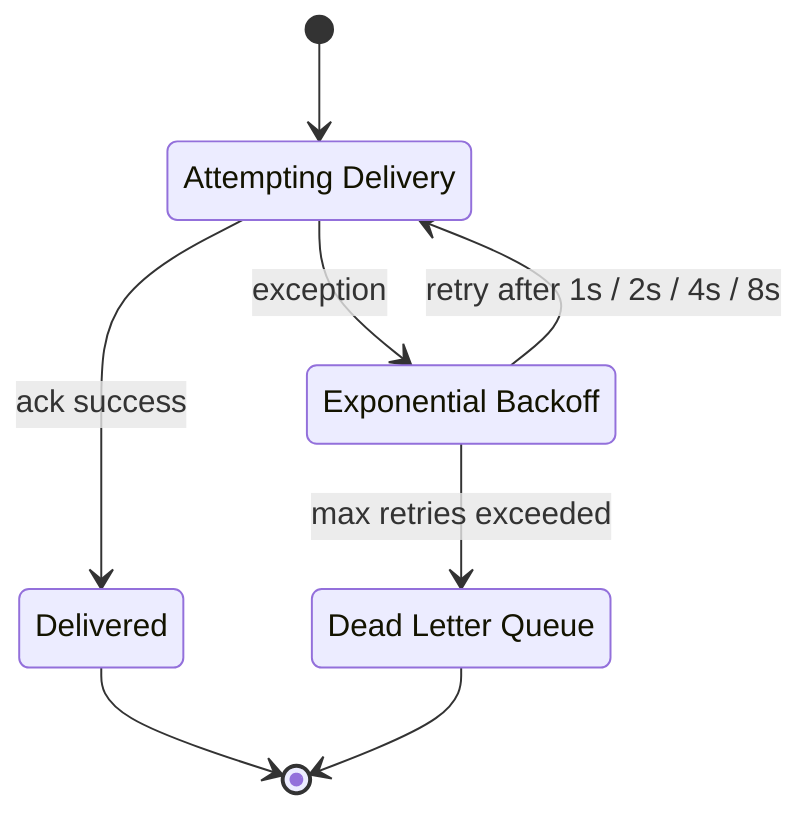
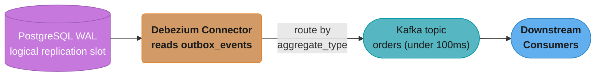
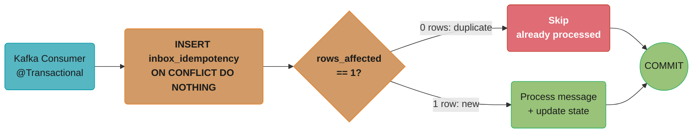
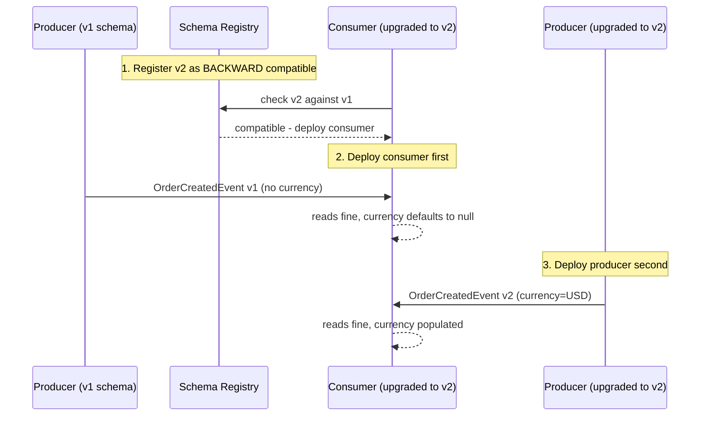

# Messaging Patterns

## 1. Concept Overview

Messaging patterns solve the fundamental challenges of reliable asynchronous communication between services: how to ensure a message is published exactly when a business operation completes, how to avoid processing the same message twice, how to handle messages that repeatedly fail processing, and how to evolve message schemas without breaking consumers. The outbox pattern, transactional inbox, dead letter queue, and schema evolution strategies address these challenges systematically.

---

## 2. Intuition

Imagine a bank that mails a withdrawal receipt only after the money is debited. If the teller sends the mail before debiting, the mail may go out but the debit may fail. If the teller debits first and then the mail system is down, the customer gets no receipt. The outbox pattern solves this: the teller writes the withdrawal AND a note to "send receipt" in the same ledger entry. A separate mail clerk reads the ledger and sends the mail. The mail and the debit are now atomic.

---

## 3. Core Principles

- **Atomicity between state change and event publication**: never publish an event outside the transaction that changes business state
- **At-least-once delivery is the default**: design consumers to be idempotent — processing the same message twice must produce the same result as processing it once
- **Poison pills are inevitable**: some messages will always fail; the system must handle them without blocking healthy messages
- **Schema evolution is continuous**: consumers and producers deploy independently; schemas must evolve backward-compatibly

---

## 4. Types / Architectures / Strategies

**Outbox implementation approaches**:
- **Polling relay**: a scheduled job polls the `outbox_events` table for unpublished events and publishes them; simple but introduces polling latency (typically 1-10 seconds)
- **CDC (Change Data Capture) via Debezium**: reads the database's transaction log (WAL/binlog) and emits change events; near-real-time (< 100ms), no polling overhead

**Inbox/deduplication approaches**:
- **Idempotency key table**: store processed message IDs; INSERT before processing, skip if duplicate key
- **Conditional processing**: check preconditions before processing (e.g., only process if order is in PENDING status); inherently idempotent for many domain operations
- **Natural idempotency**: some operations are naturally idempotent (SET status = 'SHIPPED' is safe to repeat; INCREMENT quantity by 1 is NOT)

**Dead letter queue strategies**:
- **Exponential backoff**: retry immediately, then after 1s, 2s, 4s, 8s... until max retries; then move to DLQ
- **Separate DLQ per source**: avoids DLQ processing from one topic affecting another
- **DLQ consumer**: monitoring, alerting, root cause analysis, manual replay after fix

**What it means.** "Wait twice as long before each retry, so a downstream service that is already struggling gets exponentially more breathing room instead of a steady hammering from every consumer at once."

The doubling is the point, and so is where it stops. Both the total time-to-DLQ and the load you inflict on the failing dependency are fixed by the retry count — pick it deliberately, not by accepting a library default.

| Symbol | What it is |
|--------|------------|
| attempt `n` | Which try this is. Attempt 0 is the original, unretried delivery |
| delay | `2^(n-1)` seconds — 1, 2, 4, 8, doubling every attempt |
| max retries | Where the sequence stops and the message goes to the DLQ |
| time-to-DLQ | Sum of all delays. How long a poison message occupies a consumer |

**Walk one example.** The `1s, 2s, 4s, 8s` schedule above, plus what happens if you keep doubling:

```
  attempt   delay      cumulative wait        cumulative in minutes
  -------   --------   --------------------   ---------------------
     0      0 s        0 s                     0.0
     1      1 s        1 s                     0.0
     2      2 s        3 s                     0.1
     3      4 s        7 s                     0.1
     4      8 s        15 s                    0.2      <- DLQ at 4 retries
     5      16 s       31 s                    0.5
     6      32 s       63 s                    1.1
     7      64 s       127 s                   2.1
     8      128 s      255 s                   4.2
     9      256 s      511 s                   8.5
    10      512 s      1,023 s                17.1

  the pattern: cumulative wait after n retries = 2^n - 1 seconds
    n = 4  ->  2^4 - 1 =    15 s
    n = 10 ->  2^10 - 1 = 1,023 s
```

**The `2^n - 1` shortcut is worth memorizing** — the total wait is always one second short of the next delay in the sequence, because doubling means every prior delay summed together is just under the current one. It lets you answer "how long before this lands in the DLQ?" without adding anything up.

**Why the retry count matters more than it looks.** Going from 4 retries to 10 does not make you 2.5x more patient — it makes you **68x** more patient (1,023 s vs 15 s). Meanwhile each retried message holds a consumer thread or a partition's progress for that whole window. With 4 retries a poison message costs 15 seconds of a partition's throughput; with 10 it costs 17 minutes, and a few hundred poison messages arriving together will stall the topic entirely. That is the failure mode that makes "just bump the retries" a dangerous instinct.

**Why jitter is added on top.** Pure exponential backoff synchronizes retries: every consumer that failed at the same instant retries at exactly 1s, 2s, 4s together, so the recovering downstream service is hit by a thundering herd at each step instead of a smooth trickle. Adding random jitter (retry at a uniformly random point in `[0, 2^(n-1)]`) spreads the same total load across the interval. Without it, backoff delays the herd rather than dissolving it.



Each failure escalates the wait — 1s, 2s, 4s, 8s — before the next attempt; once retries are exhausted the message moves to the DLQ instead of blocking healthy messages queued behind it.

---

## 5. Architecture Diagrams

**Outbox Pattern (Polling Relay)**

```mermaid
flowchart LR
    classDef io      fill:#61afef,stroke:#2e86c1,color:#1a1a1a,font-weight:bold
    classDef frozen  fill:#c678dd,stroke:#9b59b6,color:#fff
    classDef train   fill:#98c379,stroke:#27ae60,color:#1a1a1a
    classDef mathOp  fill:#d19a66,stroke:#e67e22,color:#1a1a1a,font-weight:bold
    classDef lossN   fill:#e06c75,stroke:#c0392b,color:#fff,font-weight:bold
    classDef req     fill:#56b6c2,stroke:#0097a7,color:#1a1a1a
    classDef base    fill:#e5c07b,stroke:#f39c12,color:#1a1a1a

    orderSvc("Order Service<br/>@Transactional") -->|"INSERT order +<br/>INSERT outbox event<br/>same DB txn"| db[("orders +<br/>outbox_events")]
    db -->|"SELECT unpublished<br/>LIMIT 100"| relay("Outbox Relay<br/>polls every 500ms")
    relay -->|"publish"| topic(["Kafka topic<br/>order-events"])
    relay -.->|"UPDATE published_at"| db
    topic --> consumers(["Downstream<br/>Consumers"])

    class orderSvc req
    class db base
    class relay mathOp
    class topic req
    class consumers io
```



The order write and its outbox insert commit in one local transaction, so a Kafka outage never loses or fabricates an event — the relay polling every 500ms is the only component that talks to Kafka, and the dotted edge marks its `published_at` update as the confirmation step.

**The idea behind it.** "A polling relay's maximum throughput is its batch size divided by its poll interval — nothing else. Two config values you probably copied from a blog post are silently setting the ceiling for your entire event pipeline."

This is the calculation nobody runs until the outbox table is millions of rows deep and growing, because the relay looks perfectly healthy the whole time: it polls on schedule, it publishes successfully, it just cannot keep up.

| Symbol | What it is |
|--------|------------|
| `LIMIT 100` | Rows the relay claims per poll — the batch size |
| 500 ms | Poll interval — how often the relay wakes up |
| relay ceiling | `batch ÷ interval`. Hard maximum events/sec, regardless of load |
| publish latency | Worst-case wait before an event reaches Kafka, roughly one interval |

**Walk one example.** The configuration drawn above, and what it can and cannot absorb:

```
  relay ceiling = 100 rows / 0.5 s = 200 events/sec
                = 720,000 events/hour

  ORDER RATE 150/sec -- fits
    drains every poll, outbox table stays near empty
    publish latency = up to 500 ms

  ORDER RATE 500/sec -- does not fit
    deficit = 500 - 200 = 300 events/sec accumulating
    after 1 hour  : 300 x 3600     = 1,080,000 unpublished rows
    after 8 hours : 300 x 28,800   = 8,640,000 unpublished rows
    publish latency at hour 8 = 8,640,000 / 200 = 43,200 s = 12 hours stale

  RAISING THE CEILING -- two independent levers:
    batch 100 -> 500,  interval 500 ms         =  1,000 events/sec   (5x)
    batch 100,         interval 500 -> 100 ms  =  1,000 events/sec   (5x)
    batch 500,         interval 100 ms         =  5,000 events/sec  (25x)
```

The two levers are not equivalent even though they multiply the same way. **Larger batches cost you nothing per event but raise worst-case publish latency to a full interval; shorter intervals cut latency but multiply the query load on the database** — at 100 ms the relay is issuing 10 `SELECT ... FOR UPDATE SKIP LOCKED` queries per second per relay instance, forever, whether or not there is anything to publish. That polling floor is exactly the cost Debezium removes by tailing the WAL instead: it has no interval and therefore no ceiling of this shape, which is why the CDC variant reaches sub-100ms publish latency with zero idle database load.

**Outbox Pattern (CDC with Debezium)**



Debezium tails the WAL directly instead of polling the outbox table, cutting publish latency from the relay's 500ms-1s down to under 100ms with no added database load.

**Transactional Inbox (Deduplication)**



The INSERT's `ON CONFLICT DO NOTHING` is the dedup check: a redelivered message affects zero rows and returns without touching business state, while a new message processes and commits atomically with its idempotency record in the same transaction.

---

## 6. How It Works — Detailed Mechanics

### Outbox Table Schema

```sql
CREATE TABLE outbox_events (
    id              UUID PRIMARY KEY DEFAULT gen_random_uuid(),
    aggregate_type  VARCHAR(100) NOT NULL,   -- "Order", "Payment"
    aggregate_id    VARCHAR(36) NOT NULL,    -- aggregate root ID
    event_type      VARCHAR(200) NOT NULL,   -- "OrderCreated", "PaymentProcessed"
    payload         JSONB NOT NULL,
    metadata        JSONB NOT NULL DEFAULT '{}',
    occurred_on     TIMESTAMPTZ NOT NULL DEFAULT NOW(),
    published_at    TIMESTAMPTZ                          -- NULL = not yet published
);

CREATE INDEX idx_outbox_unpublished ON outbox_events(occurred_on) WHERE published_at IS NULL;
```

### Outbox Pattern — JPA Implementation

```java
@Service
@RequiredArgsConstructor
public class OrderService {

    private final OrderRepository orderRepository;
    private final OutboxEventRepository outboxEventRepository;

    @Transactional  // both saves in ONE transaction — atomic
    public Order createOrder(CreateOrderRequest request) {
        Order order = Order.builder()
            .id(UUID.randomUUID())
            .userId(request.getUserId())
            .status(OrderStatus.PENDING)
            .totalAmount(request.getTotalAmount())
            .build();

        orderRepository.save(order);

        // Outbox event saved in SAME transaction
        OutboxEvent event = OutboxEvent.builder()
            .aggregateType("Order")
            .aggregateId(order.getId().toString())
            .eventType("OrderCreated")
            .payload(serializeToJson(new OrderCreatedEvent(
                order.getId(), order.getUserId(), order.getTotalAmount()
            )))
            .build();

        outboxEventRepository.save(event);

        return order;
        // Transaction commits: both order AND outbox event are persisted
        // If Kafka is down, order is still saved; relay will publish when Kafka recovers
    }
}
```

### Outbox Polling Relay

```java
@Component
@RequiredArgsConstructor
public class OutboxRelayJob {

    private final OutboxEventRepository outboxEventRepository;
    private final KafkaTemplate<String, String> kafkaTemplate;
    private final ObjectMapper objectMapper;

    @Scheduled(fixedDelay = 500)  // every 500ms
    @Transactional
    public void relayOutboxEvents() {
        List<OutboxEvent> pending = outboxEventRepository
            .findTop100ByPublishedAtIsNullOrderByOccurredOnAsc();

        for (OutboxEvent event : pending) {
            String topic = resolveKafkaTopic(event.getAggregateType());
            String partitionKey = event.getAggregateId(); // same aggregate = same partition = ordered

            kafkaTemplate.send(topic, partitionKey, event.getPayload())
                .addCallback(
                    result -> markPublished(event),
                    failure -> log.error("Failed to publish event {}: {}", event.getId(), failure.getMessage())
                );
        }
    }

    private void markPublished(OutboxEvent event) {
        event.setPublishedAt(Instant.now());
        outboxEventRepository.save(event);
    }

    private String resolveKafkaTopic(String aggregateType) {
        return switch (aggregateType) {
            case "Order" -> "order-events";
            case "Payment" -> "payment-events";
            default -> throw new IllegalArgumentException("Unknown aggregate type: " + aggregateType);
        };
    }
}
```

### Debezium CDC Connector Configuration

```json
{
  "name": "outbox-connector",
  "config": {
    "connector.class": "io.debezium.connector.postgresql.PostgresConnector",
    "database.hostname": "postgres",
    "database.port": "5432",
    "database.user": "debezium",
    "database.password": "${file:/secrets/postgres-password}",
    "database.dbname": "orderdb",
    "plugin.name": "pgoutput",
    "slot.name": "debezium_outbox_slot",
    "table.include.list": "public.outbox_events",

    "transforms": "outbox",
    "transforms.outbox.type": "io.debezium.transforms.outbox.EventRouter",
    "transforms.outbox.table.field.event.id": "id",
    "transforms.outbox.table.field.event.key": "aggregate_id",
    "transforms.outbox.table.field.event.type": "event_type",
    "transforms.outbox.route.by.field": "aggregate_type",
    "transforms.outbox.route.topic.replacement": "${routedByValue}-events",

    "key.converter": "org.apache.kafka.connect.storage.StringConverter",
    "value.converter": "io.confluent.connect.avro.AvroConverter",
    "value.converter.schema.registry.url": "http://schema-registry:8081"
  }
}
```

### Transactional Inbox — Consumer with Deduplication

```java
@Component
@RequiredArgsConstructor
public class OrderEventConsumer {

    private final InboxRepository inboxRepository;
    private final InventoryService inventoryService;

    @KafkaListener(topics = "order-events", groupId = "inventory-consumer-group")
    @Transactional
    public void consume(ConsumerRecord<String, String> record) {
        String messageId = record.headers().lastHeader("messageId") != null
            ? new String(record.headers().lastHeader("messageId").value())
            : record.topic() + "-" + record.partition() + "-" + record.offset();

        // Attempt to insert deduplication record
        boolean isNew = inboxRepository.insertIfNotExists(messageId);

        if (!isNew) {
            log.info("Duplicate message {} - skipping", messageId);
            return; // idempotent: already processed
        }

        // Process the message (in same transaction as inbox record)
        OrderCreatedEvent event = deserialize(record.value(), OrderCreatedEvent.class);
        inventoryService.reserveStock(event.getOrderId(), event.getItems());
        // Both inboxRepository insert AND inventory update commit atomically
    }
}
```

```sql
-- Inbox table
CREATE TABLE inbox_idempotency (
    message_id   VARCHAR(200) PRIMARY KEY,
    processed_at TIMESTAMPTZ NOT NULL DEFAULT NOW()
);

-- Repository method
INSERT INTO inbox_idempotency (message_id)
VALUES (:messageId)
ON CONFLICT (message_id) DO NOTHING
RETURNING message_id;
-- Returns row if inserted (new), returns empty if duplicate
```

### Dead Letter Queue (DLQ) — Kafka Configuration

```java
@Configuration
public class KafkaConsumerConfig {

    @Bean
    public ConcurrentKafkaListenerContainerFactory<String, String> kafkaListenerContainerFactory(
            ConsumerFactory<String, String> consumerFactory) {

        ConcurrentKafkaListenerContainerFactory<String, String> factory =
            new ConcurrentKafkaListenerContainerFactory<>();
        factory.setConsumerFactory(consumerFactory);

        // Dead letter publishing with retry
        DefaultErrorHandler errorHandler = new DefaultErrorHandler(
            new DeadLetterPublishingRecoverer(kafkaTemplate,
                (record, exception) -> new TopicPartition(
                    record.topic() + ".DLT",  // dead-letter topic name convention
                    record.partition()
                )
            ),
            new FixedBackOff(1000L, 3L)  // retry 3 times with 1s delay
        );

        // Non-retryable exceptions — go straight to DLT
        errorHandler.addNotRetryableExceptions(
            JsonParseException.class,       // bad payload, retry won't help
            IllegalArgumentException.class  // invalid data, retry won't help
        );

        factory.setCommonErrorHandler(errorHandler);
        return factory;
    }
}
```

### Message Schema Evolution with Avro

```json
// v1: OrderCreatedEvent
{
  "type": "record",
  "name": "OrderCreatedEvent",
  "namespace": "com.example.events",
  "fields": [
    {"name": "orderId", "type": "string"},
    {"name": "userId", "type": "string"},
    {"name": "totalAmount", "type": "double"}
  ]
}

// v2: Added optional "currency" field (BACKWARD compatible — v1 reader can read v2 data)
{
  "type": "record",
  "name": "OrderCreatedEvent",
  "namespace": "com.example.events",
  "fields": [
    {"name": "orderId", "type": "string"},
    {"name": "userId", "type": "string"},
    {"name": "totalAmount", "type": "double"},
    {"name": "currency", "type": ["null", "string"], "default": null}
  ]
}
```

```yaml
# Schema Registry compatibility mode
# Set per-subject or globally

# BACKWARD: new schema reads old data (deploy consumers first, then producers)
# FORWARD:  old schema reads new data (deploy producers first, then consumers)
# FULL:     both directions (safest, most restrictive)
# NONE:     no compatibility checking (dangerous in production)

# Set subject-level compatibility:
curl -X PUT http://schema-registry:8081/config/order-events-value \
  -H "Content-Type: application/json" \
  -d '{"compatibility": "BACKWARD"}'
```



BACKWARD compatibility means the upgraded v2 consumer can read both the old v1 payload — currency defaults to null — and the new v2 payload once producers catch up, which is why consumers must deploy before producers, never the reverse.

---

## 7. Real-World Examples

- **Uber**: outbox pattern for all trip lifecycle events; Debezium CDC from MySQL to Kafka; processes billions of events per day
- **Zalando**: open-sourced their outbox-based approach (Nakadi event bus); all microservice communication via durable events with schema registry
- **Confluent**: Schema Registry as a standard component in Kafka deployments; Avro evolution used by thousands of companies for inter-service contracts
- **Amazon**: SQS dead letter queues built into the platform; SQS + SNS fan-out for pub/sub at scale across AWS services

---

## 8. Tradeoffs

| Pattern | Pros | Cons |
|---------|------|------|
| Polling relay outbox | Simple, no extra infrastructure | Polling latency (500ms-1s), additional DB load |
| CDC outbox (Debezium) | Near-real-time, no polling | Requires replication slot, additional Debezium infra |
| Transactional inbox | Strong deduplication guarantee | Extra DB table, INSERT per message |
| Conditional dedup | No extra table | Only works for naturally idempotent operations |
| Exponential backoff retry | Handles transient failures | Delays for genuinely unprocessable messages |
| DLQ | Isolates bad messages | Requires DLQ monitoring and replay tooling |

| Broker | Throughput | Ordering | Replay | Routing | Best For |
|--------|-----------|---------|--------|---------|---------|
| Kafka | 1M+ msg/s | Per-partition | Yes (offset) | By partition key | Event streaming, audit log, high throughput |
| RabbitMQ | ~50K msg/s | Per queue | Limited | Complex (exchanges) | Task queues, RPC, complex routing |
| SQS | Elastic | FIFO queues | No (visibility timeout) | Topics via SNS | Serverless, AWS-native, decoupled tasks |

---

## 9. When to Use / When NOT to Use

Use the outbox pattern whenever a service must publish an event as a side effect of a database transaction. Any direct `kafkaTemplate.send()` outside a transaction creates a dual-write problem — either the DB write or the Kafka write may succeed while the other fails.

Use the transactional inbox whenever downstream message processing must be exactly-once (payment processing, inventory decrement, financial ledger updates). For idempotent operations like updating a cache or sending a notification, simpler deduplication (check-then-act) may be sufficient.

Use Kafka when: you need replay capability, high throughput (> 50K msg/s), ordered processing per entity, or log-based event streaming. Use RabbitMQ when: you need complex routing (header-based, topic patterns), low latency message delivery, or per-message TTL. Use SQS when: you are fully on AWS, need serverless-friendly messaging, or want managed FIFO ordering without Kafka operational overhead.

---

## 10. Common Pitfalls

**Publishing events outside the transaction (dual-write)**:
```java
// BROKEN: kafkaTemplate.send() is OUTSIDE the @Transactional boundary
// The DB commit and Kafka publish are two separate operations
// If Kafka is down at send time, the event is lost permanently
@Transactional
public Order createOrder(CreateOrderRequest request) {
    Order order = orderRepository.save(buildOrder(request));
    kafkaTemplate.send("order-events", order.getId().toString(), toJson(order)); // WRONG
    return order;
}

// FIX: use the outbox pattern — insert event into outbox table within the same transaction
@Transactional
public Order createOrder(CreateOrderRequest request) {
    Order order = orderRepository.save(buildOrder(request));
    outboxEventRepository.save(buildOutboxEvent(order)); // SAME transaction
    return order; // relay will publish to Kafka asynchronously
}
```

**Missing DLQ monitoring**: A team added a DLQ but never monitored it. Over 3 months, 12,000 unprocessable messages accumulated (a bug in the JSON schema had been deployed to production). When the bug was discovered, replaying 12,000 messages caused a spike that overwhelmed downstream services. Fix: alert when DLQ depth > 0; review DLQ messages daily; replay in controlled batches.

**Outbox table growing unbounded**: The outbox relay ran but forgot to delete or mark processed events. After 6 months, the `outbox_events` table had 50 million rows. The `SELECT ... WHERE published_at IS NULL` query did a sequential scan despite the partial index (index was not maintained when rows were only updated, not deleted). Fix: either DELETE processed rows after 7 days, or verify the partial index on `WHERE published_at IS NULL` is used by EXPLAIN.

**Using wrong Avro compatibility mode**: A team set compatibility to NONE. A producer added a new required field without a default. All existing consumers that did not have the new schema version crashed on deserialization. Fix: always use BACKWARD compatibility (consumers can read newer schema with defaults for missing fields), deploy consumers before producers.

---

## 11. Technologies & Tools

| Tool | Purpose |
|------|---------|
| Debezium | CDC from PostgreSQL/MySQL WAL to Kafka |
| Kafka Connect | Source/sink connectors framework |
| Schema Registry (Confluent) | Avro/Protobuf/JSON schema versioning |
| Spring Kafka | KafkaTemplate, @KafkaListener, error handling |
| Testcontainers Kafka | Integration testing with real Kafka |
| RabbitMQ | AMQP broker with exchange-based routing |
| AWS SQS / SNS | Managed message queue and pub/sub |
| KEDA | Kubernetes autoscaler based on Kafka consumer lag |

---

## 12. Interview Questions with Answers

**Q: What is the dual-write problem and how does the outbox pattern solve it?**
The dual-write problem occurs when a service must write to two systems atomically — for example, update a database and publish a Kafka message. These two writes cannot be wrapped in a single ACID transaction spanning different systems. If the DB write succeeds but Kafka publish fails, the event is lost (downstream services miss the update). If Kafka publish succeeds but DB write fails (or rolls back), a phantom event is published for a transaction that never happened. The outbox pattern solves this by writing the event to an `outbox_events` table in the same DB transaction as the business data. A separate relay (polling or CDC) then reads the outbox and publishes to Kafka. The relay can retry until success — events are published at least once after the DB transaction commits.

**Q: What is exactly-once delivery and how do you achieve it with Kafka?**
Exactly-once delivery means each message is processed precisely once, producing the same result as if processed once — no duplicates, no losses. Achieving this requires coordination at producer, broker, and consumer levels. Producer: `enable.idempotence=true` (sequence numbers prevent duplicates from retries), transactional API for atomic multi-partition writes. Broker: `acks=all`, `min.insync.replicas=2`. Consumer: `isolation.level=read_committed` (skip uncommitted transactional messages). Application level: transactional inbox with deduplication table. Full end-to-end exactly-once within Kafka Streams is achievable with `processing.guarantee=exactly_once_v2`. Across service boundaries (Kafka + external DB), exactly-once requires the transactional outbox + inbox pattern.

**Q: What is a dead letter queue and how should you handle messages in it?**
A DLQ (dead letter topic/queue) receives messages that have exhausted all retry attempts. Messages end up in the DLQ because they are unprocessable: bad payload format, invalid data, downstream service unavailable for too long, or application bugs. DLQ consumers should: (1) log and alert on every DLQ message — DLQ depth > 0 is always an alert condition, (2) analyze root cause — is it a bad message, an application bug, or an infrastructure issue, (3) after fixing the root cause, replay DLQ messages back to the original topic in controlled batches. Never delete DLQ messages until you understand why they failed. Keep DLQ messages for at least 7 days.

**Q: What is the transactional inbox pattern and when is it necessary?**
The transactional inbox stores a record of processed message IDs in the same database as the application state, with the deduplication INSERT and business logic update in the same transaction. If the consumer crashes after processing but before committing the Kafka offset, Kafka will redeliver the message. Without an inbox, the business logic runs twice (double charge, double inventory decrement). With the inbox, the second processing attempt finds the message_id already in the inbox table and skips processing. It is necessary for non-idempotent operations: financial transactions, inventory decrements, counters, and any operation where "process twice" has different results than "process once."

**Q: What is Avro BACKWARD compatibility and why should you default to it?**
BACKWARD compatibility means a newer schema version can read data written with an older schema version. When you add an optional field with a default value, new consumers can read old messages (the field defaults to null/0) and new messages (the field has a value). Deploy consumers first with the new schema (they can read old messages with defaults), then deploy producers that start writing the new field. This is the standard deployment order: consumers before producers. FORWARD compatibility means the opposite (old schema reads new data) — needed when you must deploy producers first. FULL is both directions and is the safest but most restrictive.

**Q: What is the difference between Kafka and RabbitMQ for event-driven architectures?**
Kafka is log-based: messages are retained for a configured duration (default 7 days) and consumers maintain their own offset. Any consumer can replay from any offset. Kafka preserves order within a partition. Throughput is very high (1M+ msg/s per cluster). Kafka is ideal for event streaming, audit logs, and scenarios requiring replay. RabbitMQ is queue-based: messages are removed from the queue once acknowledged. Complex routing is available (topic exchanges, header exchanges). Throughput is lower (~50K msg/s) but latency is lower (push-based vs poll-based). RabbitMQ is better for task queues, RPC patterns, and complex routing requirements. Use Kafka when you need replay and high throughput; use RabbitMQ when you need complex routing and low latency task distribution.

**Q: How do you handle message ordering with Kafka when multiple consumers process in parallel?**
Kafka guarantees ordering within a partition, not across partitions. To maintain order for a specific entity (e.g., all events for order-123), always use the entity ID as the partition key: `kafkaTemplate.send(topic, orderId.toString(), payload)`. All events for the same order will go to the same partition, processed in order by the same consumer thread. For consumers, within a partition, messages are processed sequentially. Across partitions, messages are processed in parallel. Never change the partition count of an existing topic — it changes the hash mapping and breaks ordering guarantees for existing consumers until they process through the re-partitioned data.

**Q: What happens when the Debezium CDC connector loses its replication slot?**
PostgreSQL creates a replication slot for Debezium to read WAL changes. If Debezium is down for too long, PostgreSQL cannot clean up WAL files because Debezium's slot is holding them. This causes disk space to fill up. If disk fills, PostgreSQL stops accepting writes — a production outage. Mitigations: (1) set `max_slot_wal_keep_size` in PostgreSQL to limit WAL retention per slot; (2) monitor replication slot lag — alert when lag exceeds 1GB; (3) if Debezium is down for more than a few hours, manually drop the slot and let Debezium reinitialize (this causes the outbox relay approach to be safer as a fallback). Always monitor `pg_replication_slots` in production.

**Q: When would you choose CDC-based outbox relay over a polling relay, and vice versa?**
Choose CDC when you need near-real-time publishing and can operate replication infrastructure, and choose polling when simplicity matters more than sub-second latency. The polling relay in §6 runs every 500ms via `@Scheduled(fixedDelay = 500)` and selects up to 100 rows from the outbox table on every tick, trivial to operate since it needs no new infrastructure, but it adds continuous read load to the database and caps latency at roughly 500ms-1s in the best case. Debezium tails the PostgreSQL WAL directly through a logical replication slot and pushes changes to Kafka in under 100ms with zero polling load, but it requires running and monitoring Kafka Connect, managing a replication slot, and a steeper operational learning curve. Uber (§7) runs Debezium at billions-of-events-per-day scale specifically because polling latency would be unacceptable there, while a lower-volume internal service publishing a few thousand events a day is often better served by the simpler relay.

**Q: What is the difference between Avro's BACKWARD, FORWARD, and FULL compatibility modes, and when do you need FORWARD specifically?**
BACKWARD lets new schemas read old data, FORWARD lets old schemas read new data, and FULL requires both directions to hold at once. BACKWARD compatibility, the module's documented default, requires deploying consumers before producers, since the new consumer schema must read data written under the old producer schema; FORWARD compatibility is the mirror image, needed when an operational constraint forces producers to deploy first, such as a shared upstream team that cannot coordinate a synchronized consumer rollout. FULL compatibility is the safest choice for a widely shared topic like `order-events` with a dozen consumer teams, because it removes the deployment-order coordination problem entirely at the cost of the most restrictive evolution rules, typically only adding optional fields with defaults in either direction. `NONE` disables checking altogether, and as the pitfall in §10 shows, is how a missing-default required field crashes every consumer still on the old schema.

**Q: Why does a fixed retry policy waste time and resources on poison-pill messages?**
A poison pill can never succeed no matter how many times it is retried, so applying the same backoff schedule as a transient failure just delays quarantining it while wasting cycles. The error handler in §6 distinguishes the two explicitly: `FixedBackOff(1000L, 3L)` retries any exception three times with a 1-second delay, appropriate for a transient failure like a momentary 503, but `addNotRetryableExceptions` for `JsonParseException` and `IllegalArgumentException` routes those straight to the dead-letter topic on the first attempt, since malformed JSON will fail identically on attempt four as on attempt one. Applying a uniform retry policy to both categories means every poison pill consumes three retry attempts and several seconds of consumer-thread time before reaching the DLQ, and at high poison-pill volume that wasted time can meaningfully reduce throughput on healthy messages queued behind it in the same partition. The practical rule: classify exceptions into retryable versus non-retryable at the error-handler level up front, rather than discovering the distinction from retry metrics later.

**Q: What does a safe DLQ replay procedure actually involve beyond just re-publishing the messages?**
A safe replay fixes the root cause first, replays in small rate-limited batches, and relies on the same idempotency mechanism that protects normal traffic. Before replaying anything, confirm the root cause is actually fixed, since replaying thousands of messages that fail for the same reason, the exact scenario in the §10 pitfall, just refills the DLQ and wastes the operation. Replay through the transactional inbox or idempotency-key mechanism from §6, not around it, so a message that was partially processed before the original failure is safely deduplicated rather than double-applied, and replay in controlled batches at an explicit rate limit rather than all at once, watching downstream error rate between batches since those services were sized for steady-state traffic, not a replay burst layered on top of live traffic. Keep a replay log of which message IDs were replayed, when, and by whom, since DLQ replay is exactly the kind of operation that needs an audit trail if something goes wrong a second time.

**Q: What is the claim-check pattern and why can't you just put a large payload directly on a Kafka message?**
The claim-check pattern stores a large payload in blob storage and publishes only a small reference to it on the message bus, instead of the payload itself. Kafka's default `message.max.bytes` is 1MB, and even where brokers are reconfigured larger, every byte published is replicated to every in-sync replica and retained for the topic's full retention window, commonly 7 days, so attaching a multi-megabyte file directly to millions of events multiplies storage and network cost across the cluster for data nobody queries by key. The claim-check pattern instead uploads the payload to S3 first, then publishes a message with just the URL, content type, and checksum, the same shape as the "keep outbox events small" guidance in §13, and the consumer fetches the actual payload only when it needs it. This also decouples the payload's lifecycle from the bus's retention policy, since an S3 lifecycle rule can expire the blob independently of how long the reference message is retained in Kafka.

**Q: What size threshold should trigger switching a message from inline payload to claim-check, and how do you avoid orphaned blobs?**
A common threshold is somewhere between 100KB and 1MB, past which the inline payload meaningfully degrades broker throughput and consumer memory. Below roughly 100KB, most teams keep the payload inline, since the extra network round trip to fetch from S3 costs more in latency than it saves in broker load; above roughly 1MB, the inline cost in replication overhead and consumer heap pressure usually outweighs the extra hop. The orphaned-blob risk is real: if the producer uploads to S3 successfully but crashes before publishing the reference message, that blob is never referenced by anyone — mitigate with an S3 lifecycle policy that expires any object after a few days unless a "committed" tag is set post-processing, or by uploading the blob inside the same outbox transaction pattern used for the reference event itself. Treat the reference message's Kafka retention and the blob's S3 lifecycle as two separate, explicitly configured clocks rather than assuming one implies the other.

**Q: How long should you retain rows in the inbox_idempotency table, and what happens if you never clean it up?**
Retain inbox rows only as long as redelivery is plausible for that message, typically a few days, then delete them on a scheduled job. Kafka redelivers a message only when a consumer fails to commit its offset after processing, so this window is bounded by how long a consumer can be down or crash-looping before someone notices, and 3-7 days of retention comfortably covers realistic redelivery scenarios without keeping rows forever. The outbox table's unbounded-growth pitfall in §10, 50 million rows after 6 months with sequential scans despite a partial index, applies identically to the inbox table, since every processed message adds a row that is never revisited after its retention window, and the primary key index itself grows large enough to slow every insert's uniqueness check. Fix: a nightly job deleting rows older than 7 days, sized to run in off-peak hours since deleting millions of rows at once can generate significant WAL traffic and autovacuum pressure.

**Q: How do you preserve per-entity ordering with a partition key while avoiding a hot partition for a high-volume aggregate?**
Split the high-volume aggregate's events across a bounded set of sub-keys, and only guarantee ordering within each sub-key rather than across the whole aggregate. Using the raw aggregate ID as the partition key, as recommended above for the general case, breaks down when one aggregate generates disproportionate volume, such as one enterprise customer whose order events dwarf every other customer combined, creating a hot partition that one consumer thread cannot keep up with while other partitions sit idle. A common mitigation is a composite key like the order ID combined with an event sequence number modulo 4, spreading that aggregate's events across 4 partitions instead of 1 and restoring parallelism at the cost of only guaranteeing order within each sub-stream, acceptable when the consumer's logic does not require strict cross-sub-key ordering. The key discipline is deciding up front which ordering guarantee is actually needed, since retrofitting a sub-key scheme after consumers assume total order is a breaking change requiring a coordinated migration.

---

## 13. Best Practices

- Always use partition key = aggregate ID for ordered event processing per entity
- Purge processed outbox records after 7 days to prevent unbounded table growth
- Use separate DLQ topics per source topic (not a shared catch-all DLQ)
- Monitor outbox table depth and DLQ depth as operational metrics in Grafana
- Implement the outbox relay with idempotent Kafka producer (`enable.idempotence=true`)
- Use `BACKWARD` schema compatibility in Schema Registry as the default
- Test consumer restart and redelivery scenarios in integration tests (Testcontainers)
- Keep outbox events small — store only the event envelope; if large payloads are needed, store in S3 and reference the URL
- Document which services consume each event in an event catalog or API documentation

---

## 14. Case Study

**Problem**: An inventory service processed `OrderCreated` events from Kafka. During a deployment, the service was restarted mid-processing. Kafka redelivered the last uncommitted batch. Without deduplication, the inventory was decremented twice for the same order. Customer orders were fulfilled but the inventory count went negative.

**Fix applied**:
1. Added `inbox_idempotency` table with `message_id PRIMARY KEY`
2. Wrapped Kafka consumer in `@Transactional` with inbox INSERT + inventory decrement in same transaction
3. Added monitoring: alert on `inbox_idempotency` table size growing faster than expected (indicates duplicates)
4. Added integration test: process same message twice, assert inventory decremented exactly once

**Root cause analysis also found**: The OrderService was using `kafkaTemplate.send()` outside the `@Transactional` boundary. If the DB commit succeeded but Kafka publish failed, the event was lost. Fixed with the outbox pattern — now events are published at-least-once, consumer handles deduplication for exactly-once semantics.
