# Microservices Fundamentals

---

## 1. Concept Overview

Microservices architecture decomposes a system into small, independently deployable services, each owning a specific business capability and its data. Each service runs in its own process, communicates over a network, and is deployed independently of other services.

The core promise is organizational and operational: teams can develop, deploy, and scale services independently. The cost is distributed systems complexity: network partitions, eventual consistency, distributed tracing, and operational overhead that a monolith avoids entirely.

Understanding microservices means understanding when NOT to use them as much as when to use them.

---

## 2. Intuition

One-line analogy: a city divided into specialized districts (banking district, hospital district, market district) where each district has its own rules, staff, and storage — versus one giant building that does everything.

Mental model: each microservice is a small application that owns a database, exposes an API, and can be deployed by a team of 6-8 people without coordinating with other teams.

Why it matters: Conway's Law states that organizations produce systems that mirror their communication structures. If you have 10 independent product teams, a monolith forces all 10 teams to coordinate deployments, schema migrations, and releases. Microservices let each team ship independently.

Key insight: the unit of deployment is the unit of independent scaling and independent team ownership. A payment service that handles Black Friday spikes should scale independently of a user-profile service that has steady traffic.

---

## 3. Core Principles

**Single Responsibility per Service**
Each service owns exactly one bounded context. It does one thing well. The user service manages users, not orders.

**Database Per Service**
Each service owns its data store. No other service queries that database directly. This is the hardest rule to follow and the most important.

**Smart Endpoints, Dumb Pipes**
Services contain business logic. The communication infrastructure (HTTP, message broker) is kept simple. The intelligence lives in the services, not the middleware.

**Decentralized Governance**
Teams choose their own technology stack. One service can use PostgreSQL, another Cassandra, another MongoDB — whichever fits the access pattern.

**Design for Failure**
Every network call can fail. Services must handle downstream failures gracefully via timeouts, retries, circuit breakers, and fallbacks.

**Evolutionary Design**
Services should be designed to be replaced, not just modified. If a service becomes too complex, split it. If two services are always deployed together, merge them.

---

## 4. Types / Architectures / Strategies

### Decomposition Strategies

**By Business Capability**
Identify what the business does and create one service per capability. An e-commerce system has: catalog management, order management, payment processing, inventory management, shipping, notifications. Each is a distinct business capability with clear ownership.

**By Bounded Context (Domain-Driven Design)**
A bounded context is a linguistic boundary where a model applies uniformly. The word "account" means different things in the banking context (balance, transactions) versus the user context (credentials, profile). Each bounded context becomes a service. Bounded contexts communicate via well-defined interfaces, translating between their models at the boundary.

**By Subdomain**
DDD identifies core subdomains (competitive advantage — invest heavily), supporting subdomains (necessary but not differentiating — build simply), and generic subdomains (commodity — buy or use open source). Core subdomains warrant careful microservice design. Generic subdomains should use SaaS (email via SendGrid, payments via Stripe).

**Strangler Fig Pattern**
Incrementally migrate a monolith to microservices. Route traffic for specific features through an API gateway. Implement those features as new microservices behind the gateway. Once a feature is fully migrated, remove it from the monolith. Over time, the monolith "strangles" as its responsibilities shrink to zero.

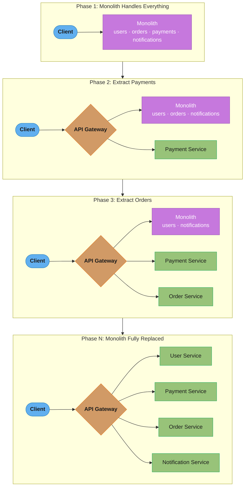
*Each phase peels one capability out from behind the API Gateway; the monolith's remaining responsibility list shrinks every phase until Phase N replaces it entirely.*

### Communication Patterns

**Synchronous (REST / gRPC)**
Request-response. Caller blocks until response. Use when the caller needs the result immediately to continue processing (e.g., creating an order requires a real-time inventory check).

**Asynchronous (Kafka / RabbitMQ / SQS)**
Fire and forget or consume from queue. Caller does not block. Use for eventual consistency, high throughput, decoupling (e.g., order placed event triggers notifications, analytics, loyalty points — none block the order creation).

---

## 5. Architecture Diagrams

### Microservices vs Monolith

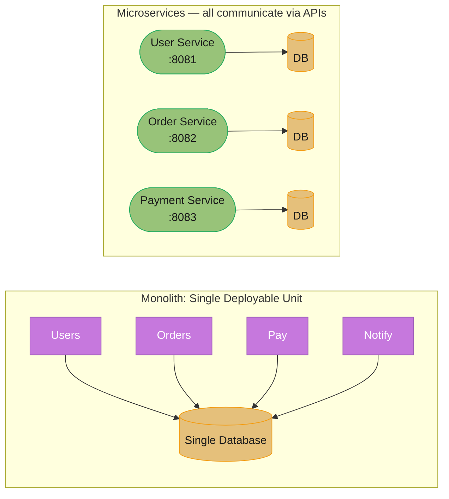
*The monolith bundles every capability behind one process and one shared database; each microservice owns its own port and database, and the two sides talk only through APIs.*

### Database Per Service Pattern

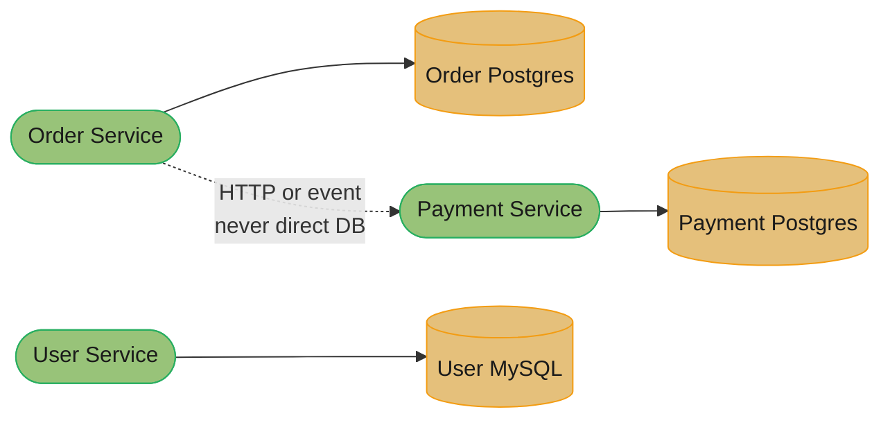
*Rule: Service A never connects to Service B's database directly — it calls Service B's API (or reacts to its events) to get data.*

### Strangler Fig Migration

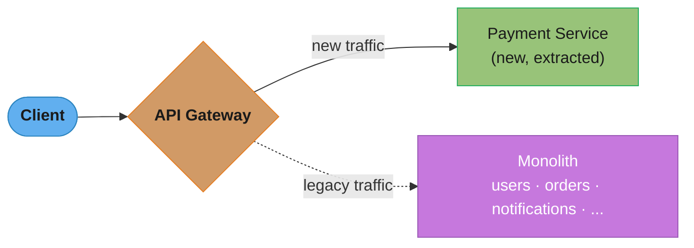
*The gateway is the single fork point: new, extracted capabilities get solid routes while everything not yet migrated keeps falling through to the monolith.*

### Sync vs Async Communication

**Synchronous (REST/gRPC)**

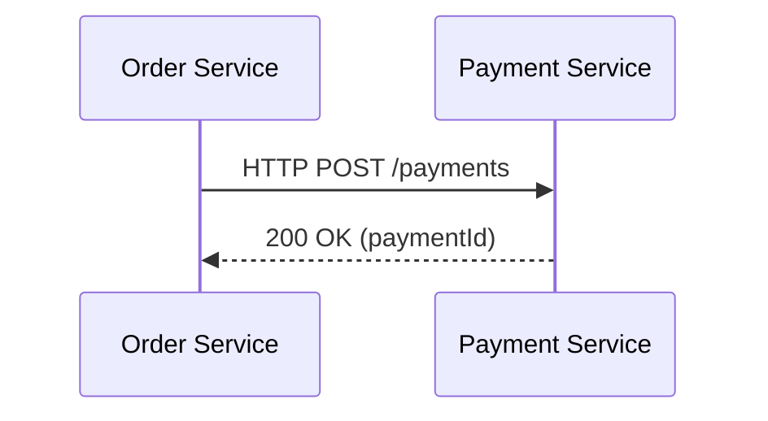
*Order Service blocks on the call — it cannot proceed until Payment Service replies.*

**Asynchronous (Event-Driven)**

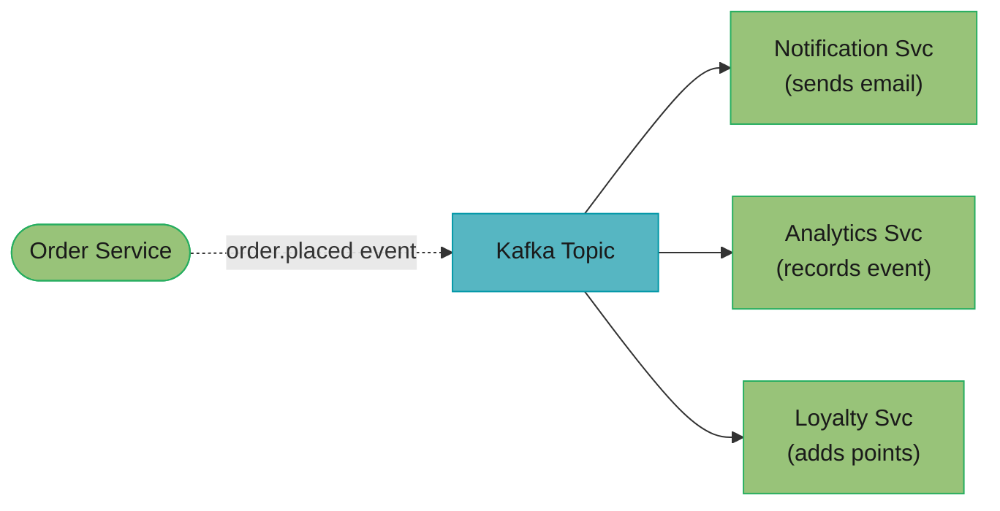
*Order Service publishes once and returns immediately; three independent consumers react on their own schedule without blocking order creation.*

---

## 6. How It Works — Detailed Mechanics

### Bounded Context in Practice

```java
// In the Order bounded context, a "Customer" is:
public class Customer {
    private CustomerId id;
    private ShippingAddress defaultAddress;
    private List<OrderId> orderHistory;
    // NO password, NO email preferences — that's the User context's concern
}

// In the User bounded context, a "Customer" is:
public class User {
    private UserId id;
    private String email;
    private String hashedPassword;
    private NotificationPreferences preferences;
    // NO order history — that's the Order context's concern
}

// They share a customer ID (correlation ID) but maintain separate models.
```

### Service Discovery and Communication

```java
// Order Service calling Payment Service via REST
@Service
public class OrderService {

    private final RestClient restClient;
    private final CircuitBreaker circuitBreaker;

    public OrderResult placeOrder(PlaceOrderCommand command) {
        // 1. Validate order
        Order order = Order.create(command);

        // 2. Reserve inventory (sync — need confirmation before proceeding)
        InventoryReservation reservation = inventoryClient.reserve(
            command.getItems(), Duration.ofMinutes(15));

        // 3. Process payment (sync — need payment result)
        PaymentResult payment = circuitBreaker.executeSupplier(
            () -> paymentClient.charge(command.getPaymentDetails(), order.getTotal())
        );

        // 4. Save order
        Order savedOrder = orderRepository.save(order.withPayment(payment));

        // 5. Publish event (async — notifications, analytics don't block order creation)
        eventPublisher.publish(new OrderPlacedEvent(savedOrder.getId(),
            savedOrder.getCustomerId(), savedOrder.getTotal()));

        return OrderResult.success(savedOrder.getId());
    }
}
```

### Event-Driven Decoupling

```java
// Notification Service subscribes to order events — completely decoupled
@KafkaListener(topics = "order.placed", groupId = "notification-service")
public void onOrderPlaced(OrderPlacedEvent event) {
    User user = userServiceClient.getById(event.getCustomerId());
    emailService.sendOrderConfirmation(user.getEmail(), event.getOrderId());
}

// If Notification Service is down, Kafka retains the message.
// Order Service is unaffected.
```

### Distributed Transaction Problem

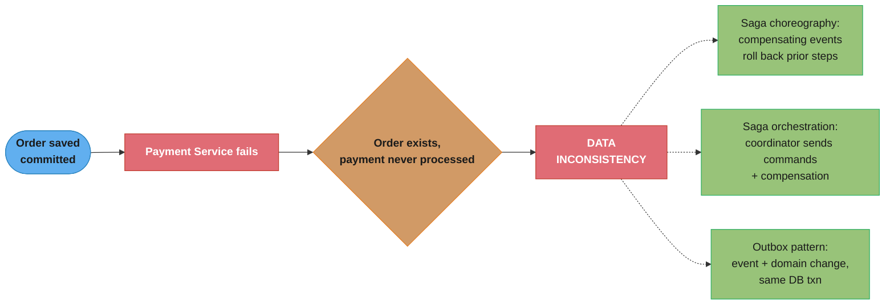
*A partial failure between the order commit and the payment call leaves the system inconsistent; Saga (choreography or orchestration) and the outbox pattern are the three standard fixes, guaranteeing at-least-once delivery without a distributed transaction.*

### Outbox Pattern (Prevents Lost Events)

```java
@Transactional
public Order placeOrder(PlaceOrderCommand cmd) {
    Order order = orderRepository.save(Order.create(cmd));

    // Write event to outbox IN THE SAME TRANSACTION as the order save.
    // If this transaction commits, both the order and the outbox entry exist.
    // If it rolls back, neither exists. No lost events.
    OutboxEvent outboxEvent = OutboxEvent.builder()
        .aggregateId(order.getId().toString())
        .eventType("OrderPlaced")
        .payload(serialize(new OrderPlacedEvent(order)))
        .build();
    outboxRepository.save(outboxEvent);

    return order;
}

// Separate relay process (e.g., Debezium CDC or scheduled job)
// reads outbox table and publishes to Kafka, then marks events as published.
```

---

## 7. Real-World Examples

**Amazon**: each product page aggregates data from ~150 microservices. Product info, reviews, pricing, inventory, recommendations — all separate services. A failure in recommendations does not break add-to-cart.

**Netflix**: decomposed DVD rental monolith to 700+ microservices after a database corruption incident in 2008 took down the entire service. Each microservice runs in AWS, auto-scales independently, and has its own circuit breaker.

**Uber**: started as a monolith ("God app"). By 2014, the monolith had 15-second build times and deployments required all teams to coordinate. Decomposed to services per domain: dispatch, mapping, payments, driver, rider.

**Shopify**: stayed on a Rails monolith but uses "modular monolith" architecture with strict module boundaries enforced by Packwerk. Proves microservices are not the only path to maintainability.

---

## 8. Tradeoffs

| Dimension | Monolith | Microservices |
|---|---|---|
| Operational complexity | Low — one deployment unit | High — dozens of services, infra per service |
| Development speed (early) | Fast — no network, shared code | Slow — need service contracts, infra |
| Development speed (at scale) | Slow — coordination overhead | Fast — teams deploy independently |
| Data consistency | Easy — single DB ACID | Hard — eventual consistency, sagas |
| Distributed tracing | Not needed | Required — correlation IDs, Jaeger/Zipkin |
| Technology flexibility | Low — one stack | High — polyglot persistence and languages |
| Testing | Simpler — single process | Complex — contract tests, integration environments |
| Latency | In-process calls (ns) | Network calls (ms) — adds up with deep call chains |
| Fault isolation | One bug can crash all | Failure in one service contained |
| Team autonomy | Low — shared codebase | High — team owns service end-to-end |

---

## 9. When to Use / When NOT to Use

**Use microservices when:**
- You have multiple teams (10+ engineers) who need to deploy independently.
- You have clear, stable domain boundaries — the domain is well-understood.
- Different parts of your system have drastically different scaling requirements.
- You need technology flexibility (e.g., ML inference service in Python, API in Java).
- You can tolerate eventual consistency in most workflows.

**Do NOT use microservices when:**
- You are in early-stage product development: domain boundaries are not yet clear. Microservices carved from an unclear domain will be wrong and expensive to fix.
- You have a small team (fewer than 10 engineers): the operational overhead of running 20 services consumes engineering time that should go toward product.
- Your domain requires strong consistency across multiple business entities: distributed transactions are expensive and complex.
- You lack DevOps maturity: Kubernetes, service mesh, distributed tracing, and log aggregation are prerequisites. Without them, microservices become a debugging nightmare.
- You are migrating from a monolith without a clear strangler fig plan: a "big bang" rewrite to microservices almost always fails.

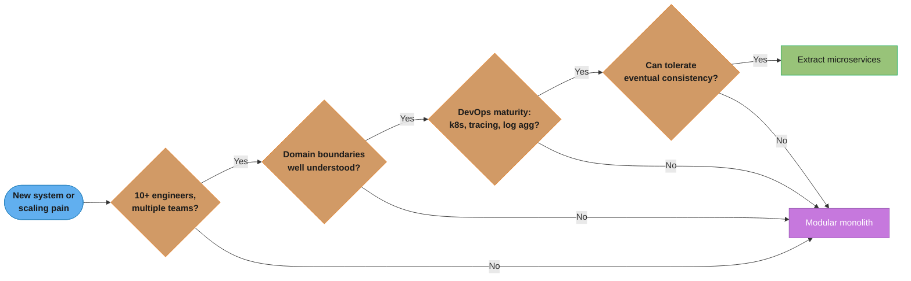
*Each gate mirrors one bullet from the lists above; failing any single gate routes to a modular monolith rather than a premature microservices split.*

**Start with a modular monolith**: enforce module boundaries (clear interfaces, no cross-module DB access) from day one. When a module consistently needs independent scaling or a separate team, extract it as a service with a clear boundary already established.

---

## 10. Common Pitfalls

**The Distributed Monolith**
The most dangerous anti-pattern. Services are deployed separately but are tightly coupled: ServiceA calls ServiceB synchronously, which calls ServiceC synchronously, which calls ServiceD. All share a database via a common library. You get all the complexity of microservices (network failures, distributed tracing, deployment coordination) with none of the benefits (independent deployment, team autonomy). Symptoms: you must deploy all services together; a schema change requires coordinating five teams; a timeout in ServiceD takes down ServiceA.

Production war story: a financial services company split their monolith into 12 "microservices" over 18 months. Each service called three others synchronously. Average call chain depth was 6 hops. A database query optimization in ServiceH required changes in ServiceA through ServiceG because all services shared the same "shared-models" library. Deployments still required coordinating all 12 teams. They had built a distributed monolith with 10x the operational complexity.

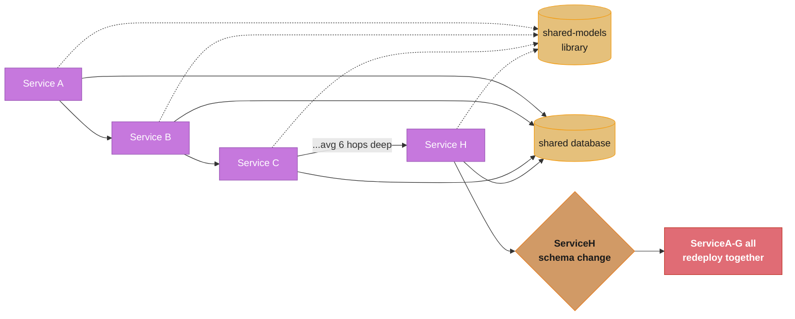
*Deployed separately but wired together by synchronous chains, a shared database, and a shared library — this 12-service system had all the network complexity of microservices with none of the independent-deployment benefit; one team's schema change forced seven other teams to redeploy.*

**Premature Decomposition**
Splitting services before domain boundaries are understood. Six months later you need to move a field from ServiceA to ServiceB, but now you have 200 consumers of ServiceA's API and a database migration that requires coordinating two teams. A monolith refactoring would have been a two-hour PR.

**Chatty Services (Nano-Services)**
Services so small that a single user action requires 20 sequential service calls. Each hop adds 5-20ms of network latency. A checkout flow that calls inventory, pricing, coupon, tax, payment, fraud, shipping, notification, loyalty, analytics — 10 sequential hops — adds 50-200ms to every checkout. Merge cohesive nano-services or use async/parallel calls.

**Shared Database**
Two services reading and writing the same database. This is a shared deployment unit pretending to be microservices. Schema changes become a cross-team coordination event. One service's heavy query degrades another service's performance. The database becomes the monolith.

**Missing Correlation IDs**
A bug is reported: "the payment page is slow sometimes." You have 15 services. Without correlation IDs propagated through every log line and trace, you cannot find which service is slow. Every service's logs show successful calls. You spend two days bisecting the call chain manually.

---

## 11. Technologies & Tools

| Category | Tools |
|---|---|
| Service framework | Spring Boot, Quarkus, Micronaut, Dropwizard |
| Sync communication | REST (HTTP/1.1, HTTP/2), gRPC (Protocol Buffers, HTTP/2 streaming) |
| Async messaging | Apache Kafka, RabbitMQ, AWS SQS/SNS, Google Pub/Sub |
| Service discovery | Kubernetes Services (kube-dns), Consul, Eureka (Netflix OSS) |
| API gateway | Spring Cloud Gateway, Kong, AWS API Gateway, Nginx, Envoy |
| Distributed tracing | Jaeger, Zipkin, AWS X-Ray, Micrometer Tracing + OpenTelemetry |
| Log aggregation | ELK stack (Elasticsearch, Logstash, Kibana), Grafana Loki, Splunk |
| Circuit breaker | Resilience4j, Hystrix (deprecated), Istio (service mesh level) |
| Saga orchestration | Temporal, Apache Camel, custom Kafka-based state machine |
| Container orchestration | Kubernetes, AWS ECS, Nomad |
| Service mesh | Istio, Linkerd, Consul Connect |

---

## 12. Interview Questions with Answers

**Q: What is the difference between a microservice and a monolith, and when would you choose one over the other?**
A monolith is a single deployable unit where all business logic runs in one process sharing a database. A microservice architecture decomposes the system into independently deployable services, each owning its data. Choose a monolith for early-stage products, small teams (under 10 engineers), or when domain boundaries are not yet clear. Choose microservices when you have multiple teams needing independent deployments, well-understood domain boundaries, and varying scaling requirements. The modular monolith is a pragmatic middle ground.

**Q: What is the database-per-service pattern and why is it critical?**
Each service owns its own database and no other service accesses it directly. This is critical because it enforces loose coupling at the data layer. Without it, a schema change in one team's database breaks another team's queries, creating de facto deployment coupling. It is the hardest microservices rule to follow because it forces you to handle data aggregation at the API level, deal with eventual consistency, and implement patterns like sagas for cross-service transactions.

**Q: What is a distributed monolith and how do you avoid it?**
A distributed monolith is a system deployed as separate services but tightly coupled via synchronous call chains, shared databases, or shared code libraries. It has the worst properties of both architectures: the complexity of distributed systems with the coupling of a monolith. Avoid it by enforcing database-per-service, preferring asynchronous communication for non-blocking workflows, keeping shared libraries to pure utilities (no domain logic), and measuring actual deployment independence (can a team deploy without coordinating with another team?).

**Q: Explain the strangler fig pattern.**
The strangler fig pattern migrates a monolith incrementally by routing new or extracted features behind an API gateway to new microservices, while the monolith handles remaining features. Over time, features are extracted one by one until the monolith is fully replaced. This avoids the risk of a big-bang rewrite. The key is to start with the strangler fig from day one — retroactively adding a gateway to a tightly coupled monolith is itself a large project.

**Q: How do you handle data consistency across services when you cannot use a single ACID transaction?**
Use the Saga pattern. In a choreography-based saga, each service publishes an event on success; downstream services listen and react, publishing their own events or compensation events on failure. In an orchestration-based saga, a central coordinator sends commands to services and handles compensation. The outbox pattern ensures events are reliably published: write the event to a local outbox table in the same transaction as the domain change, then relay the outbox to the message broker asynchronously. This guarantees at-least-once delivery without distributed transactions.

**Q: What is a bounded context in DDD and how does it map to a microservice?**
A bounded context is a boundary within which a domain model is consistent and unambiguous. The word "order" in the order context means one thing (items, shipping address, status); in the inventory context it may mean something else. Each bounded context should map to one microservice (or a small cluster of services). The mapping ensures teams have clear ownership and domain models do not bleed across service boundaries.

**Q: What is the difference between REST and gRPC for inter-service communication?**
REST uses HTTP/1.1 or HTTP/2 with JSON. gRPC uses HTTP/2 with Protocol Buffers (binary serialization). gRPC is faster (binary encoding, header compression, multiplexing) and supports streaming. REST is easier to debug and more universally supported. Use gRPC for internal, high-throughput service-to-service calls where you control both sides. Use REST for public APIs or when client libraries in all languages are required. gRPC requires a schema (proto file), which enforces API contracts and enables code generation.

**Q: How do you decompose a monolith using business capabilities?**
Identify what the business does, not how the code is organized. A typical e-commerce system has capabilities: product catalog, order management, payment processing, inventory, shipping, customer management, notifications, search. Each capability becomes a service candidate. Validate by asking: does this capability have a clear owner? Does it have well-defined inputs and outputs? Can it be deployed independently? Would different teams reasonably own it? If yes to all, it is a valid service boundary.

**Q: What is the two-pizza team rule and why does it matter for microservices?**
Amazon's rule: if a team cannot be fed by two pizzas (6-8 people), it is too large. In microservices, this means one team owns one service end-to-end: development, deployment, on-call. Too many people on one service creates coordination overhead. Too few and you cannot sustain the operational burden. The rule enforces that each service is small enough for a small team to own completely, driving autonomous deployment and clear accountability.

**Q: How do you handle a scenario where Service A needs data owned by Service B?**
Option 1: Service A calls Service B's API at request time (synchronous). Simple but creates a runtime dependency — if B is down, A is degraded. Option 2: Service A subscribes to events from Service B and maintains a read-model (local cache of B's data). A is independent at request time but data is eventually consistent. Option 3: API composition at the gateway level aggregates data from A and B for the client. The right choice depends on consistency requirements: if A needs real-time data from B for a critical operation, use synchronous; if A needs reference data for display, use async with local read-model.

**Q: What are the main challenges when testing microservices?**
Unit testing individual services is straightforward. Integration testing is harder: you need contract tests (Pact) to verify service A's API calls match service B's contract without standing up both services. End-to-end testing requires a full environment with all services running. Consumer-driven contract testing (Pact) addresses the integration test problem: the consumer defines the contract, the provider verifies it, without both needing to be deployed simultaneously. Testcontainers enables integration tests with real databases and message brokers.

**Q: What is the purpose of an API gateway in a microservices architecture?**
The API gateway is the single entry point for all clients. It handles cross-cutting concerns: routing (path to service mapping), authentication and authorization (JWT validation before requests reach services), rate limiting, SSL termination, request/response transformation, and observability. It prevents each individual service from re-implementing auth, rate limiting, and logging. A gateway also enables the BFF pattern (Backend For Frontend) where separate gateway instances serve mobile, web, and partner clients with tailored request/response shapes.

**Q: How do synchronous call chains cause latency problems in microservices?**
If Service A calls B, B calls C, C calls D, all synchronously, the total latency is the sum of all hops: 20ms + 15ms + 30ms + 25ms = 90ms plus overhead. A ten-hop chain with 20ms average per hop adds 200ms to every request — before any business logic. Solutions: fan-out parallel calls where possible (A calls B and C simultaneously if they are independent), use async messaging to decouple non-critical downstream processing, aggregate at the gateway level, or co-locate services that are always called together (which may indicate they belong in the same bounded context).

**Q: What is the outbox pattern and why is it needed?**
Without the outbox pattern, a service might save data to the database and then publish an event to Kafka. If the application crashes between the two operations, the data is saved but the event is never published — downstream services never learn of the change. The outbox pattern solves this by writing the event to an "outbox" table in the same local database transaction as the domain change. A separate relay process reads the outbox and publishes to Kafka. The relay guarantees at-least-once delivery. Consumers must be idempotent.

**Q: How do you observe and debug a microservices system in production?**
Three pillars: logs, metrics, traces. Logs: structured JSON logs with correlation ID (X-Correlation-ID) and service name in every line, aggregated to a central store (ELK, Loki). Metrics: each service exposes /actuator/prometheus; Prometheus scrapes and Grafana dashboards show latency, error rate, and throughput per service. Traces: Micrometer Tracing or OpenTelemetry generates a trace ID for each request, propagated to all downstream services via headers. Jaeger or Zipkin visualizes the full call tree with timing. Without all three, debugging a multi-service latency issue is nearly impossible.

---

## 13. Best Practices

- Start with a well-structured monolith or modular monolith. Extract services only when domain boundaries are proven and team ownership is clear.
- Enforce database-per-service from day one. Shared databases are the hardest coupling to undo.
- Define service contracts explicitly using OpenAPI (REST) or Protocol Buffers (gRPC). Version your APIs.
- Implement correlation IDs at the API gateway. Every log line in every service must include the correlation ID.
- Prefer asynchronous communication for operations that do not require an immediate response: notifications, analytics, audit logs, loyalty points.
- Implement the circuit breaker pattern on all synchronous downstream calls. Use Resilience4j with timeouts, retries with exponential backoff, and fallbacks.
- Use the outbox pattern for reliable event publishing. Never fire-and-forget to a message broker in the same transaction as a DB write.
- Apply the strangler fig pattern for monolith migration. Never attempt a big-bang rewrite.
- Size services by team, not by lines of code. A service should be owned by one team of 6-8 people.
- Instrument services with health endpoints: /actuator/health/readiness and /actuator/health/liveness for Kubernetes probes.
- Test with consumer-driven contract tests (Pact) to catch API breaking changes before deployment.

---

## 14. Case Study

### E-Commerce Platform Migration: Monolith to Microservices via Strangler Fig

**Context**: A retail platform with 50 engineers running on a 6-year-old Rails monolith. The monolith has 400k lines of code, 15-minute test suites, and requires all teams to coordinate releases. Black Friday requires vertically scaling the entire monolith because the product catalog and checkout have different peak times.

**Phase 1: Identify bounded contexts**
Domain workshop with business and engineering identifies: product catalog, order management, payment processing, inventory, customer, notifications, search, shipping. Payment processing is the highest-risk and highest-value extraction — it also has the clearest boundary and its own compliance team.

**Phase 2: Extract Payment Service (3 months)**
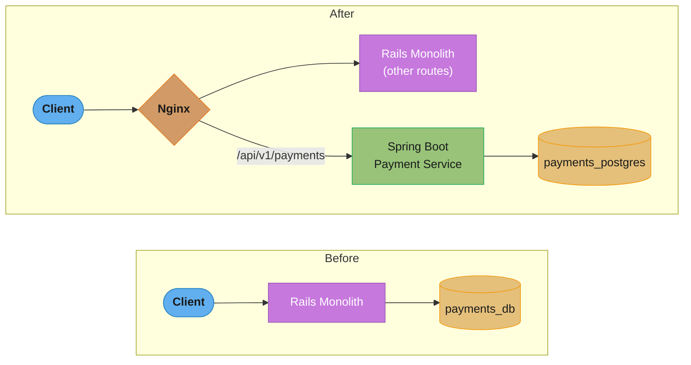

A Nginx routing rule forwards `/api/v1/payments/**` to the new Spring Boot Payment Service. The monolith's payment code is removed over two weeks. The payment team now deploys independently.

**Phase 3: Extract Order Service (2 months)**
Order Service calls Payment Service synchronously (needs payment result to confirm order). Order Service publishes `order.placed` events to Kafka. The Notification Service (still in monolith initially) subscribes to these events.

**Phase 4: Event-driven Notification extraction (1 month)**
Notification Service extracted, subscribes to Kafka events from Order, Payment, Shipping services. Monolith no longer sends emails directly.

**Architecture after 12 months**:
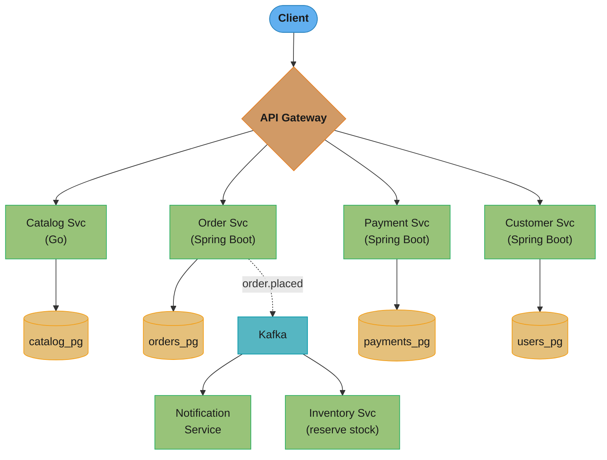
*Twelve months in: four gateway-routed services each own their database, and the order.placed event fans out to two more downstream consumers — the monolith is gone from this path entirely.*

**Results**:
- Payment team deploys 4 times per day independently (was once per week).
- Product catalog scaled to 40 instances during Black Friday; order service to 20; notification to 5. Previously the entire monolith had to scale uniformly.
- Deployment time per service: 8 minutes (was 45 minutes for full monolith release).
- Remaining monolith: search and shipping — scheduled for extraction in next quarter.

**Lessons**:
- The outbox pattern was essential for order-to-notification reliability. The first implementation used direct Kafka publish after DB save; a crash during load testing lost 300 events.
- Shared "common-models" library was a mistake. It became a coupling point: a change in OrderStatus required deploying three services simultaneously. Domain models are now owned by each service.
- API contract tests (Pact) caught three breaking API changes before they reached production.
