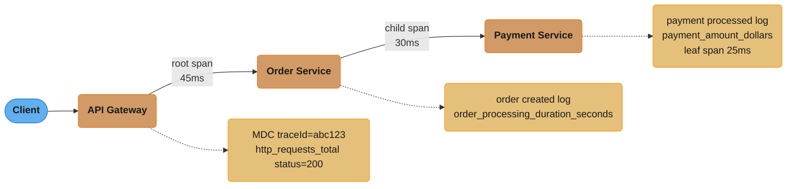
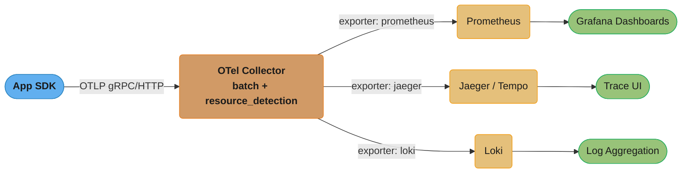
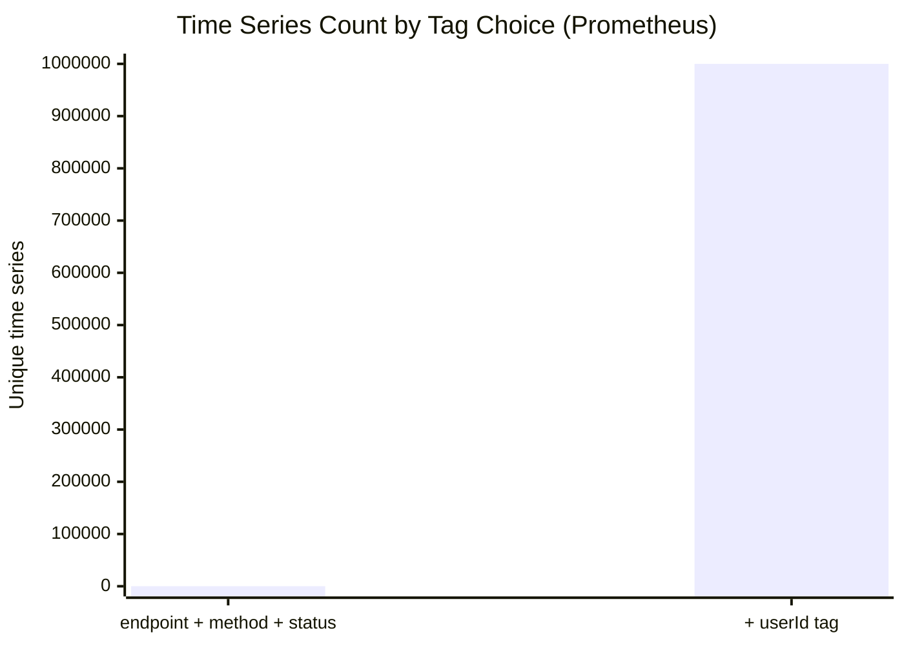
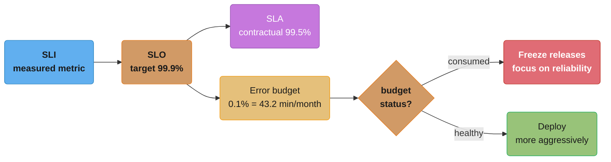

# Observability and Monitoring

## 1. Concept Overview

Observability is the ability to understand the internal state of a system by examining its external outputs. The three pillars are metrics (aggregated numeric measurements), logs (discrete timestamped events), and distributed traces (request flows across service boundaries). Monitoring asks "is the system working?" Observability asks "why is the system not working?"

---

## 2. Intuition

A car dashboard is monitoring: speed, fuel, temperature gauges tell you something is wrong. Observability is having a complete engine diagnostic system — not just warning lights but the ability to drill from "engine hot" → which cylinder → which sensor → what the temperature was 30 seconds before failure. In distributed systems, you need both: dashboards for known failure modes, and the ability to investigate unknown failure modes you haven't anticipated.

Key insight: you cannot observe what you do not instrument. Instrumentation must be added before incidents, not during them.

---

## 3. Core Principles

- **Instrumentation as code**: metrics, logs, and traces are first-class concerns, not afterthoughts
- **Correlation**: a single request ID that ties a log entry, a metric data point, and a trace span together
- **Cardinality discipline**: high-cardinality dimensions (user IDs, request IDs) belong in trace span tags or log fields, never in metric labels
- **Sampling for traces**: recording every span is too expensive; head-based sampling (decide at trace root) vs tail-based sampling (decide after completion, keep slow/error traces)
- **Alerting on symptoms, not causes**: alert on "p99 latency > 500ms" (user-visible symptom), not "CPU > 80%" (cause — may not affect users)

---

## 4. Types / Architectures / Strategies

**Metrics**
- Counter: monotonically increasing value (requests_total, errors_total)
- Gauge: current instantaneous value (active_connections, heap_used_bytes)
- Timer (Histogram): latency distribution with configurable percentile buckets
- DistributionSummary: distribution of non-time values (request payload size)

**Logs**
- Unstructured: plain text — hard to parse at scale
- Structured: JSON fields — machine-queryable, essential for log aggregation
- Levels: TRACE (verbose debug), DEBUG (developer debug), INFO (notable events), WARN (unexpected but handled), ERROR (requires attention)

**Distributed Traces**
- Span: single operation with name, start time, duration, tags (key-value), logs (events within span), status
- Trace: directed acyclic graph of spans representing a single request's journey
- Context propagation: pass trace/span IDs via headers so downstream services attach child spans

**Pull vs Push Metrics**
- Pull (Prometheus): scraper fetches /actuator/prometheus endpoint on interval; simpler, no agent needed
- Push (StatsD, InfluxDB line protocol): services push metrics to collector; good for short-lived jobs, lambdas

---

## 5. Architecture Diagrams

**Request Flow with Observability**

A single request fans out all three pillars at every hop — the API Gateway, Order Service, and Payment Service each emit their own MDC correlation ID, metric, and trace span alongside the call they make downstream.



**OpenTelemetry Pipeline**

The OTel Collector ingests OTLP from the app SDK, batches and enriches it, then fans out to three specialized backends — Prometheus for metrics, Jaeger/Tempo for traces, and Loki for logs — each feeding its own UI.



---

## 6. How It Works — Detailed Mechanics

### Micrometer Metric Types

```java
@Service
public class OrderService {

    private final Counter orderCounter;
    private final Timer orderTimer;
    private final DistributionSummary orderValueSummary;

    public OrderService(MeterRegistry registry) {
        // Counter: only goes up, use .increment()
        this.orderCounter = Counter.builder("orders.created")
            .tag("region", "us-east-1")
            .description("Total orders created")
            .register(registry);

        // Timer: measures latency + counts calls
        this.orderTimer = Timer.builder("order.processing.duration")
            .tag("service", "order")
            .publishPercentiles(0.5, 0.95, 0.99)  // client-side percentiles (memory overhead)
            .publishPercentileHistogram()           // server-side histogram for Prometheus
            .sla(Duration.ofMillis(100), Duration.ofMillis(200), Duration.ofMillis(500))
            .register(registry);

        // DistributionSummary: for non-time distributions (order value)
        this.orderValueSummary = DistributionSummary.builder("order.value.dollars")
            .baseUnit("dollars")
            .publishPercentileHistogram()
            .register(registry);
    }

    public Order createOrder(OrderRequest request) {
        orderCounter.increment();
        return orderTimer.record(() -> {
            Order order = processOrder(request);
            orderValueSummary.record(order.getTotalAmount());
            return order;
        });
    }
}
```

### Cardinality Trap — The Anti-Pattern

```java
// BROKEN: userId as tag explodes cardinality
// 1M users = 1M unique time series = Prometheus OOM
Counter.builder("api.requests")
    .tag("userId", userId)  // NEVER do this
    .register(registry);

// FIX: userId belongs in trace tags or log MDC, not metric labels
Counter.builder("api.requests")
    .tag("endpoint", "/api/orders")
    .tag("method", "POST")
    .tag("status", "200")    // only low-cardinality labels
    .register(registry);

// userId goes in the trace span
Span currentSpan = tracer.currentSpan();
if (currentSpan != null) {
    currentSpan.tag("user.id", userId);  // trace tag, not metric label
}
```



*A bounded label set (endpoint, method, status) stays in the dozens of series; adding `userId` as a tag creates one series per user — 1M users means 1M unique time series, exactly the Prometheus-OOM math in the code comment above.*

### MDC Correlation ID — Spring Filter

```java
@Component
@Order(Ordered.HIGHEST_PRECEDENCE)
public class CorrelationIdFilter extends OncePerRequestFilter {

    private static final String CORRELATION_ID_HEADER = "X-Correlation-ID";
    private static final String TRACE_ID_KEY = "traceId";
    private static final String CORRELATION_ID_KEY = "correlationId";

    @Override
    protected void doFilterInternal(HttpServletRequest request,
                                    HttpServletResponse response,
                                    FilterChain filterChain) throws ServletException, IOException {
        String correlationId = request.getHeader(CORRELATION_ID_HEADER);
        if (correlationId == null || correlationId.isBlank()) {
            correlationId = UUID.randomUUID().toString();
        }

        // MDC is ThreadLocal — set once, available throughout request processing
        MDC.put(CORRELATION_ID_KEY, correlationId);
        // traceId comes from OpenTelemetry auto-instrumentation
        // MDC.put(TRACE_ID_KEY, Span.current().getSpanContext().getTraceId());

        response.setHeader(CORRELATION_ID_HEADER, correlationId);

        try {
            filterChain.doFilter(request, response);
        } finally {
            MDC.clear(); // CRITICAL: clear MDC to prevent thread pool contamination
        }
    }
}
```

### Structured Logging Configuration

```yaml
# logback-spring.xml — JSON output for log aggregators
logging:
  pattern:
    console: "%d{ISO8601} [%thread] %-5level %logger{36} traceId=%X{traceId} correlationId=%X{correlationId} - %msg%n"

# For JSON structured logging, add logstash-logback-encoder:
# <encoder class="net.logstash.logback.encoder.LogstashEncoder"/>
# Outputs: {"@timestamp":"...","level":"INFO","traceId":"abc123","correlationId":"req456","message":"..."}
```

### OpenTelemetry Manual Instrumentation

```java
@Service
public class PaymentService {

    private final Tracer tracer;

    public PaymentService(OpenTelemetry openTelemetry) {
        this.tracer = openTelemetry.getTracer("payment-service", "1.0.0");
    }

    public PaymentResult processPayment(PaymentRequest request) {
        Span span = tracer.spanBuilder("processPayment")
            .setAttribute("payment.currency", request.getCurrency())
            .setAttribute("payment.provider", request.getProvider())
            .startSpan();

        try (Scope scope = span.makeCurrent()) {
            // All log messages in this scope automatically include trace context
            log.info("Processing payment amount={}", request.getAmount());

            PaymentResult result = callPaymentGateway(request);

            span.setAttribute("payment.status", result.getStatus());
            span.setStatus(StatusCode.OK);
            return result;
        } catch (Exception e) {
            span.recordException(e);
            span.setStatus(StatusCode.ERROR, e.getMessage());
            throw e;
        } finally {
            span.end(); // always end span
        }
    }
}
```

### SLO/SLI/SLA Definitions

```
SLI (Service Level Indicator): the measured metric
  Example: success_rate = (requests with status < 500) / total_requests over 30-day rolling window

SLO (Service Level Objective): target for the SLI
  Example: success_rate >= 99.9% over 30 days

SLA (Service Level Agreement): contractual commitment with penalties
  Example: if success_rate < 99.5% in any month, customer gets service credit

Error Budget:
  SLO = 99.9% → error budget = 0.1% of time
  30 days * 24h * 60m * 0.001 = 43.2 minutes/month of allowed downtime/errors

  If error budget is consumed → freeze feature releases, focus on reliability
  If error budget is healthy → deploy more aggressively
```

**Stated plainly.** "Perfect reliability is not the goal — 99.9% means you have explicitly
bought yourself 43.2 minutes a month to be broken in, and the only question is whether you
spend it on incidents or on shipping." The error budget turns an abstract percentage into a
concrete, spendable quantity, which is what makes it an engineering decision instead of an
argument.

| Symbol | What it is |
|--------|------------|
| `SLO` | The target success rate, e.g. `0.999`. What you promise yourselves |
| `1 - SLO` | The error budget as a fraction. `0.001` for a 99.9% SLO |
| window minutes | `30 x 24 x 60 = 43,200` minutes in a 30-day month |
| `(1 - SLO) x window` | The budget in real minutes — the number you actually manage |
| burn rate | How many times faster than `1x` you are consuming it right now |

**Walk one example.** Each extra nine costs you a factor of ten:

```
     SLO       1 - SLO     budget = 43,200 min x (1 - SLO)      per day
  ---------   ---------   --------------------------------   ------------
   99%         0.01        43,200 x 0.01    = 432.0 min       14.4 min
   99.9%       0.001       43,200 x 0.001   =  43.2 min        1.44 min
   99.95%      0.0005      43,200 x 0.0005  =  21.6 min        0.72 min
   99.99%      0.0001      43,200 x 0.0001  =   4.32 min       0.14 min

  As a request count instead of minutes, at 10M requests/month and a 99.9% SLO:
    10,000,000 x 0.001 = 10,000 failed requests allowed for the whole month.
```

**Why burn rate, not the raw remaining budget, is what you alert on.** Spending the budget
evenly over the month is `1x` burn — that is the plan, not an incident. What matters is the
slope:

```
  burn rate   budget lasts   720 h / rate      verdict
  ---------   ------------------------------   -------------------------------
     1x       720 / 1  = 720 hours (30 days)   on plan, ship freely
     3x       720 / 3  = 240 hours (10 days)   ticket someone, not a page
    14.4x     720 / 14.4 = 50 hours (~2 days)  page now, budget gone this week
```

Without the burn-rate framing you either alert on any error (constant noise) or on the budget
being already gone (too late to act). Multi-window burn-rate alerting — a fast window to catch
a sharp spike, a slow window to catch a steady leak — is the Google SRE workbook's answer.



*The 99.9% SLO leaves a 0.1% error budget, which converts to a hard number — 43.2 minutes per month — and that number drives a binary release decision: freeze when the budget is spent, ship aggressively while it is healthy.*

### Prometheus Alerting Rules

```yaml
# alert on p99 latency (symptom), not CPU (cause)
groups:
  - name: api-slos
    rules:
      - alert: ApiHighLatency
        expr: |
          histogram_quantile(0.99,
            rate(http_server_requests_seconds_bucket{job="order-service"}[5m])
          ) > 0.5
        for: 2m
        labels:
          severity: warning
        annotations:
          summary: "p99 latency {{ $value | humanizeDuration }} exceeds 500ms"

      - alert: ApiErrorRateHigh
        expr: |
          rate(http_server_requests_seconds_count{status=~"5.."}[5m]) /
          rate(http_server_requests_seconds_count[5m]) > 0.01
        for: 1m
        labels:
          severity: critical
        annotations:
          summary: "Error rate {{ $value | humanizePercentage }} exceeds 1%"
```

### Spring Boot Actuator + Micrometer Setup

```yaml
# application.yaml
management:
  endpoints:
    web:
      exposure:
        include: health, info, prometheus, metrics
  endpoint:
    health:
      show-details: always
  metrics:
    tags:
      application: ${spring.application.name}
      environment: ${spring.profiles.active:default}
    distribution:
      percentiles-histogram:
        http.server.requests: true
      percentiles:
        http.server.requests: 0.5, 0.95, 0.99
      slo:
        http.server.requests: 100ms, 200ms, 500ms
```

---

## 7. Real-World Examples

- **Netflix**: RED method dashboards (Rate, Errors, Duration) per microservice; Hollow for in-memory data cache with metrics per dataset
- **Google**: Four Golden Signals (latency, traffic, errors, saturation); internal Monarch TSDB for metrics
- **Uber**: M3 (open-source TSDB for aggregated metrics), Jaeger (open-source distributed tracer originated at Uber), structured logging with correlation IDs across 4000+ microservices
- **Cloudflare**: tail-based sampling for traces — only retain traces with errors or high latency, reducing storage 99%

---

## 8. Tradeoffs

| Approach | Pros | Cons |
|----------|------|------|
| Pull metrics (Prometheus) | Simple, service-pull, no agent | Short-lived jobs may not be scraped |
| Push metrics (StatsD) | Works for lambdas/batch jobs | Requires agent, coordination |
| Head-based sampling | Low overhead, simple | May miss rare errors in sampled-out traces |
| Tail-based sampling | Keeps important traces | High memory (buffer entire trace before decision) |
| Client-side percentiles | No extra computation | Fixed percentiles, cannot re-aggregate |
| Server-side histograms | Flexible percentile computation | Larger cardinality in Prometheus |
| Structured JSON logs | Machine-queryable, enriched | Larger log volume, less human-readable |

---

## 9. When to Use / When NOT to Use

**Use structured logging** when logs go to an aggregation system (ELK, Loki, Splunk). Use plain text only for local development.

**Use distributed tracing** when you have multiple services and need to track a request's path. Overhead is ~1-5% with sampling; acceptable in production.

**Do NOT** put high-cardinality values (userId, orderId, requestId) in metric labels. This explodes cardinality and crashes Prometheus. Put them in log fields or trace span tags.

**Do NOT** alert on CPU/memory utilization alone. Alert on user-visible symptoms (latency, error rate). CPU alerts create noise; p99 latency alerts indicate real user impact.

**Do NOT** use synchronous log appenders (FileAppender without async wrapper) in high-throughput paths. Use AsyncAppender with buffer; accept potential log loss on crash.

---

## 10. Common Pitfalls

**Cardinality explosion in production**: An engineer added `tag("requestPath", request.getPath())` to a Micrometer counter. The path included resource IDs (`/orders/12345/items`). Within 24 hours, Prometheus had 50 million unique time series, consumed all available heap, and crashed. Recovery required restarting Prometheus and rolling back the instrumentation. Rule: only use static, known-set values as metric tags.

**MDC leaking between requests**: Developer forgot `MDC.clear()` in the finally block of a filter. ThreadLocal MDC context from one request leaked to the next request processed by the same thread. Logs for request B showed the correlation ID of request A. The fix is always `MDC.clear()` in a `finally` block.

**Tracing overhead without sampling**: Adding OpenTelemetry without configuring a sampler defaults to recording every span. A service receiving 50K RPS × 20 spans per request = 1 million spans per second. The OTLP exporter became a bottleneck and caused 100ms latency increases. Always configure `OTEL_TRACES_SAMPLER=parentbased_traceidratio` with a rate like `0.01` (1%) in production.

**Alert fatigue from CPU-based alerts**: Team had 50 CPU > 80% alerts per week. None of them indicated user impact. Engineers stopped looking at alerts. Critical incidents were missed in the noise. Solution: delete CPU alerts, replace with p99 latency and error rate alerts. Alerts dropped to 2 per week, all indicating real user impact.

---

## 11. Technologies & Tools

| Tool | Purpose |
|------|---------|
| Micrometer | Metrics facade (Prometheus, Datadog, InfluxDB backends) |
| Spring Boot Actuator | Exposes /actuator/prometheus, /health, /info |
| Prometheus | Pull-based metrics TSDB, PromQL query language |
| Grafana | Dashboard and alerting UI |
| OpenTelemetry (OTel) | Vendor-neutral instrumentation SDK + collector |
| Jaeger / Zipkin | Distributed trace storage and UI |
| Grafana Tempo | Cost-effective trace storage (no indexes) |
| Grafana Loki | Log aggregation (indexed labels only, log content not indexed) |
| ELK Stack | Elasticsearch + Logstash + Kibana for log search |
| Datadog / New Relic | Commercial APM (all three pillars + profiling) |
| async-profiler | Continuous profiling (complements observability) |

---

## 12. Interview Questions with Answers

**Q: What are the three pillars of observability and how do they differ?**
Metrics are aggregated numeric measurements (counters, gauges, histograms) with low cardinality labels — cheap to store, fast to query, but lose per-request detail. Logs are discrete timestamped events with arbitrary fields — rich detail but expensive to index and query at scale. Distributed traces track a single request's path through multiple services — essential for latency attribution but require context propagation and sampling to be practical. The key is to use all three together: metrics for alerting, traces for diagnosis, logs for detailed investigation.

**Q: Why is cardinality so important in metrics?**
Each unique combination of label values creates a separate time series. A metric with labels `{status="200", method="GET", userId="12345"}` creates one series per user. With 1 million users, that's 1 million time series. Prometheus stores each series in memory; high cardinality exhausts heap, increases scrape latency, and can crash the TSDB. Solution: only use low-cardinality, finite-set values as metric labels. High-cardinality values belong in trace span attributes or structured log fields.

**Q: What is the difference between head-based and tail-based sampling in distributed tracing?**
Head-based sampling makes the decision at the trace root (the first span): sample this trace or not. It has low overhead since downstream services inherit the decision. However, it samples blindly — a 1% rate may miss the one slow request in 1000. Tail-based sampling buffers the entire trace and makes the decision after all spans arrive: always keep error traces and traces over p99 latency threshold, sample normal traces at 1%. It has higher memory cost but ensures important traces are always retained. Jaeger Collector supports tail-based sampling via the adaptive sampler.

**Q: How do you propagate trace context across service boundaries?**
The trace context (trace ID, span ID, sampling flag) is injected into outgoing requests as HTTP headers. B3 propagation uses `X-B3-TraceId`, `X-B3-SpanId`, `X-B3-ParentSpanId`, `X-B3-Sampled`. W3C TraceContext (standardized) uses a single `traceparent: 00-{traceId}-{parentSpanId}-{flags}` header. OpenTelemetry Java auto-instrumentation handles propagation automatically for RestTemplate, WebClient, HttpClient, and Kafka. For custom transports, use `W3CTraceContextPropagator.inject(context, carrier, setter)` manually.

**Q: What is the difference between SLI, SLO, and SLA?**
SLI (Service Level Indicator) is the actual measured metric — e.g., 99.95% of requests returned 2xx status in the last 30 days. SLO (Service Level Objective) is the internal target — e.g., maintain 99.9% success rate. SLA (Service Level Agreement) is the contractual commitment with customers, with defined remedies for violations — e.g., if monthly availability drops below 99.5%, customers receive a 25% service credit. SLOs should be stricter than SLAs to give an error budget buffer. The error budget (1 - SLO = 0.1%) determines how aggressively you can deploy changes.

**Q: How do you implement MDC-based correlation ID propagation across async boundaries?**
MDC is ThreadLocal, so it does not propagate across thread switches automatically. When using `CompletableFuture.supplyAsync()` or `@Async`, the new thread has a blank MDC. Solution: copy MDC context explicitly. Create a wrapper: `Map<String, String> context = MDC.getCopyOfContextMap(); CompletableFuture.supplyAsync(() -> { MDC.setContextMap(context); try { return doWork(); } finally { MDC.clear(); } })`. Spring's `TaskDecorator` interface allows configuring a thread pool to automatically copy MDC: implement `TaskDecorator` and set it on the `ThreadPoolTaskExecutor`.

**Q: What is the coordinated omission problem in performance monitoring?**
When measuring latency, if the system under test is too slow, the measurement tool may wait before sending the next request. This makes the system appear faster than it is because slow requests prevent new requests from piling up. Real users do not wait — they keep arriving regardless. Tools like wrk2 and Gatling use a constant arrival rate to avoid this. When analyzing latency percentiles from load tests, verify the test tool was sending at a constant rate, not waiting for each response before sending the next.

**Q: How would you instrument a Kafka consumer for observability?**
Track consumer lag via `kafka.consumer.fetch-manager-metrics` exposed through Micrometer's Kafka metrics binder. Alert when `records-lag-max` exceeds threshold (e.g., > 10000 messages). For tracing, extract the B3/W3C trace context from Kafka message headers using `TextMapGetter` and create a child span per message. For logging, put the topic, partition, offset, and key in MDC. Monitor: messages consumed per second, processing duration per message (Timer), error rate (Counter), and consumer group rebalances.

**Q: What log level should you use for which scenarios?**
TRACE: every method entry/exit, variable values — development only, never production (too verbose). DEBUG: conditional decision points, cache hit/miss, DB query parameters — can enable in production temporarily for debugging with dynamic log level via `/actuator/loggers`. INFO: meaningful business events (order created, user logged in, payment processed) — always on in production. WARN: unexpected but handled situations (retry attempt, degraded mode, deprecated API call) — always on. ERROR: unexpected failures requiring attention (unhandled exception, external service down, data corruption) — triggers alerts. Never log sensitive data (passwords, tokens, PII) at any level.

**Q: How does distributed tracing work with async messaging (Kafka)?**
When a service publishes to Kafka, it injects the trace context into Kafka message headers using OpenTelemetry's `TextMapSetter`. When the consumer reads the message, it extracts the context using `TextMapGetter` and creates a new root span with a `FOLLOWS_FROM` link to the producer span (not a parent-child relationship, since the consumer may run minutes later). This links the producer and consumer traces in the UI for async correlation. Micrometer Tracing handles this automatically with Spring Kafka when using the OTel bridge.

**Q: What is the difference between Grafana Loki and Elasticsearch for logs?**
Elasticsearch indexes every field of every log entry — enabling fast full-text search on any field. This makes it powerful but expensive: indexing overhead, high disk usage (inverted index), and significant memory. Loki only indexes configured labels (service, environment, log level) and stores log content as compressed chunks. Querying log content requires scanning compressed chunks (slower for regex across large volumes). Loki is 10x cheaper to operate than Elasticsearch for log aggregation where most queries filter by label first. Choose Elasticsearch for compliance log search (complex queries), Loki for operational troubleshooting (label-filtered queries).

**Q: How do you avoid creating dashboards that look healthy during incidents?**
Avoid using averages — a p50 latency of 50ms looks fine even if p99 is 5 seconds (5% of users experience 5s latency). Always show p95 and p99. Avoid success-rate dashboards that aggregate across services — a healthy service can mask a broken one. Show error rates per service and endpoint. Include the error budget burn rate — if the error budget is burning 3x faster than expected, alert before the SLO is breached. Use multi-window burn rate alerts (short window for fast detection, long window for sustained burn) per the Google SRE workbook.

**Q: What is OpenTelemetry and why was it created?**
OpenTelemetry (OTel) is a vendor-neutral CNCF project providing a single SDK for metrics, traces, and logs that can export to any observability backend (Prometheus, Jaeger, Datadog, etc.). Before OTel, each vendor had its own SDK — switching from Jaeger to Zipkin required code changes. OTel's auto-instrumentation Java agent instruments popular frameworks (Spring MVC, Kafka, JDBC, gRPC, Redis) with zero code changes using bytecode manipulation. The OTel Collector acts as a pipeline: receives OTLP from services, processes (batch, filter, enrich), exports to multiple backends simultaneously.

**Q: How do you monitor JVM health in production?**
Key JVM metrics via Micrometer: `jvm.memory.used` / `jvm.memory.max` per pool (heap, non-heap, G1 Eden, G1 Old Gen), `jvm.gc.pause` (duration and count per GC cause), `jvm.threads.live` / `jvm.threads.daemon` / `jvm.threads.states` (BLOCKED count indicates contention), `jvm.classes.loaded`. Alert on: heap usage > 80% of max (GC pressure), GC pause time increasing trend, BLOCKED thread count > 0 (deadlock risk), metaspace > 90% (class loading leak). Correlate GC pauses with latency spikes in Grafana by overlaying JVM metrics on API latency panels.

**Q: What happens if you forget to clear MDC after a request finishes?**
MDC is backed by a ThreadLocal, so an uncleared value leaks into whichever request the same pooled thread handles next, not just the one that set it. Application servers reuse a fixed-size thread pool across requests rather than spawning a new thread per request, so a filter that populates MDC but skips the cleanup leaves stale correlation IDs sitting on that thread for the next unrelated request to inherit. In production this shows up as request B's logs carrying request A's correlation ID or trace ID, making log-based incident investigation actively misleading rather than just incomplete. Always populate MDC inside a try block and clear it in a matching finally block — `MDC.clear()` must run regardless of whether the request succeeded, failed, or threw.

**Q: What happens if you enable OpenTelemetry auto-instrumentation without configuring a sampler?**
Without an explicit sampler, OpenTelemetry records every single span by default, and at high request volume the exporter itself can become the bottleneck. A service handling 50,000 requests per second with 20 spans per request produces roughly 1 million spans per second, and one team saw their OTLP exporter saturate under that load, adding 100ms of latency across the entire service. The overhead is easy to miss in staging because it only appears at production traffic volume, by which point every request is paying the tracing tax. Always set `OTEL_TRACES_SAMPLER=parentbased_traceidratio` with a rate such as 0.01 to 0.1 in production, and confirm the sampling decision propagates consistently downstream so a trace isn't fragmented across services.

---

## 13. Best Practices

- Use `@Timed` on Spring MVC controllers and service methods for automatic latency histograms
- Always add `application` and `environment` tags globally in `MeterRegistryCustomizer`
- Log at INFO level for every significant state transition (order created, payment initiated, shipment dispatched)
- Never log authentication tokens, passwords, credit card numbers, or PII at any level — use masking patterns
- Use `AsyncAppender` in Logback to avoid blocking request threads on disk I/O
- Set OTel Java agent's sampler to `parentbased_traceidratio` with `OTEL_TRACES_SAMPLER_ARG=0.1` (10%) in production
- Create SLO-based dashboards first, then drill-down dashboards for investigation
- Burn rate alerts (consuming error budget faster than 1x) are better than threshold alerts
- Validate alerting is working with synthetic monitors (always-on requests from external locations)
- Store metrics for 15 days at full resolution, 1 year at 5-minute resolution (downsampling in Prometheus with recording rules or Thanos)

---

## 14. Case Study

**Problem**: An e-commerce platform had 15 microservices with no distributed tracing, plain-text unstructured logs, and only basic CPU/memory metrics. During Black Friday, the checkout flow was 10x slower than normal but no alert fired because no checkout-specific metrics existed.

**Instrumentation rollout**:
1. Added OpenTelemetry Java agent to all services via Kubernetes pod spec: `-javaagent:/otel-javaagent.jar` with `OTEL_EXPORTER_OTLP_ENDPOINT=http://otel-collector:4317`
2. Added `X-Correlation-ID` filter generating UUIDs, MDC propagation, logback JSON encoder
3. Switched to Grafana Loki for logs, Grafana Tempo for traces, Prometheus for metrics
4. Created SLO dashboards: checkout success rate (target 99.9%), checkout p99 latency (target < 2s)
5. Implemented error budget burn rate alerts: fire when burning 3x budget (30-day budget exhausted in 720/3 = 240 hours, i.e. breach within 10 days)

**Next Black Friday result**: An alert fired 45 minutes before p99 latency breached SLO. Traces showed that 95% of slow checkouts had a 1.8-second span at the inventory service. Logs showed "lock wait timeout exceeded" in the inventory DB. The root cause was a missing index on `inventory.product_id` causing full table scans under high write load. Index added in 10 minutes, latency normalized. No user-visible outage.
