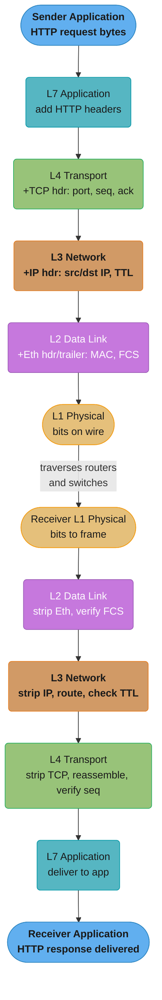
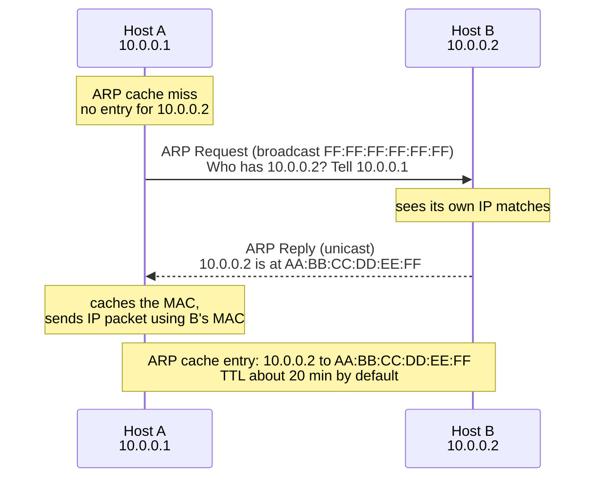
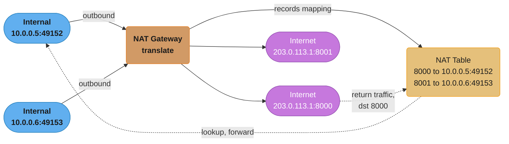
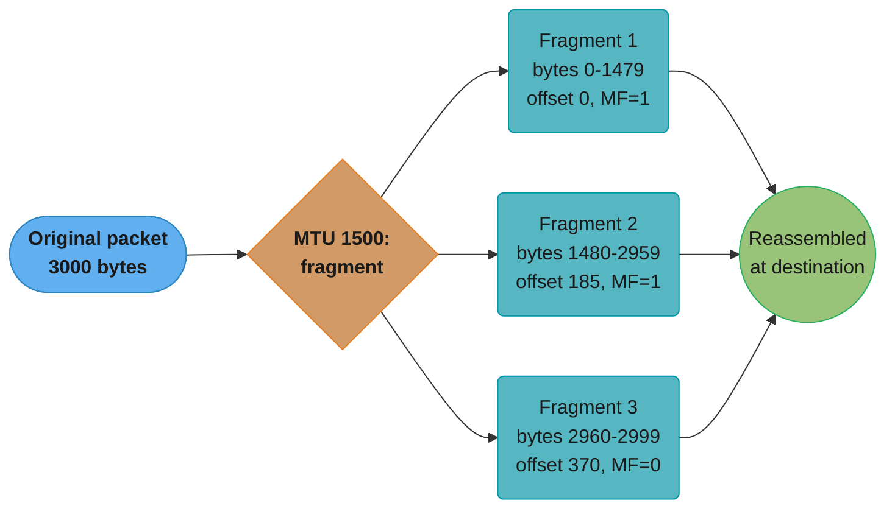
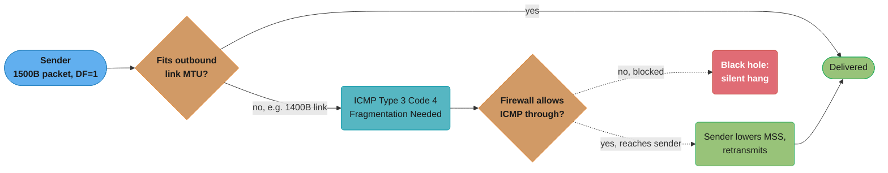
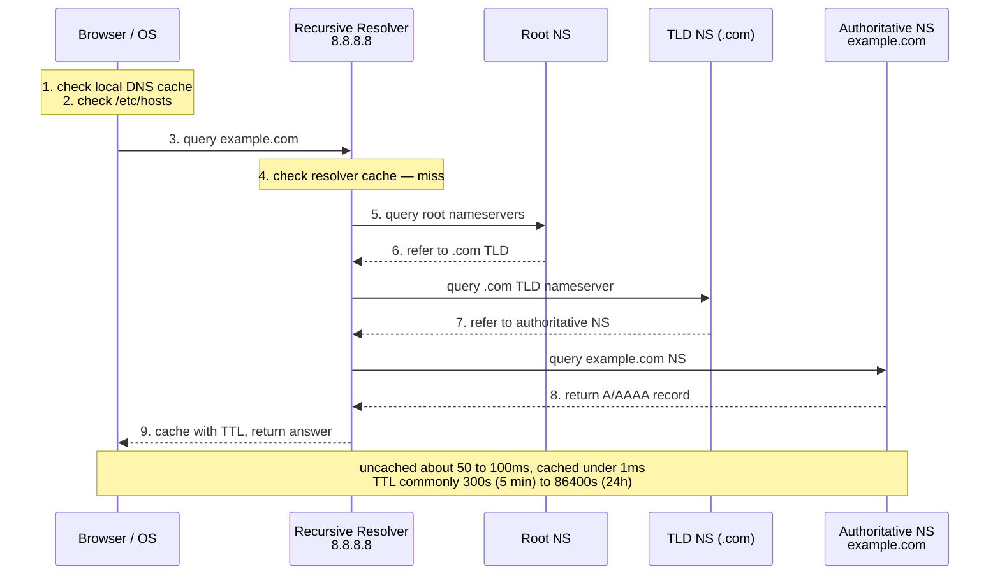
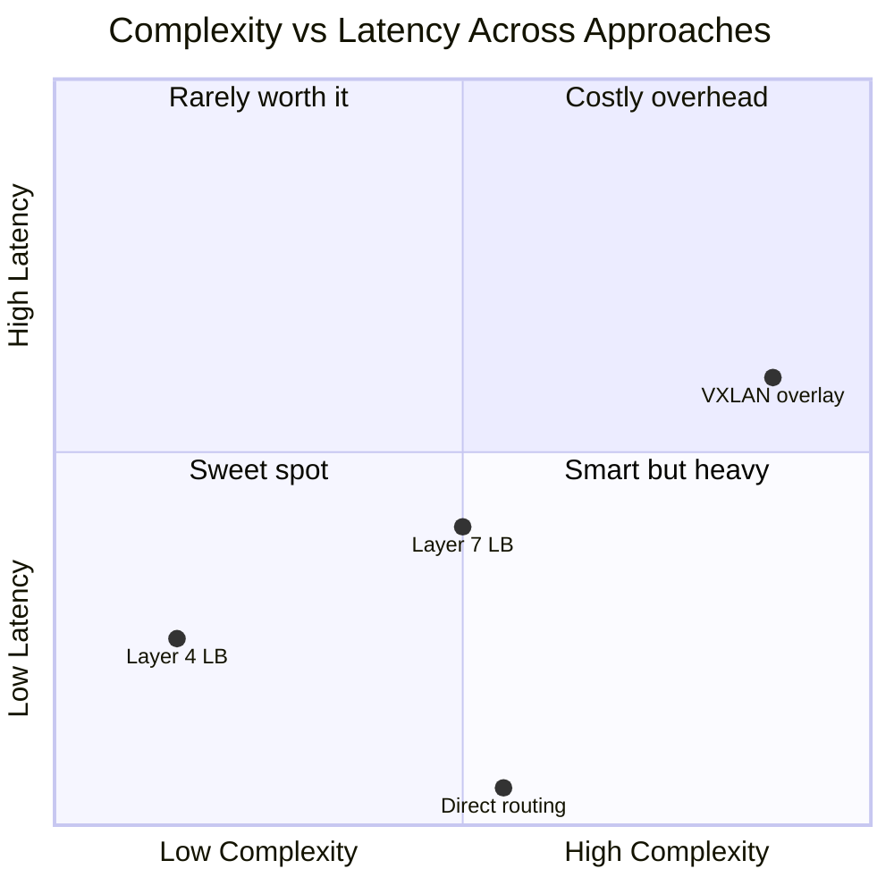

# OSI Model & Networking

## 1. Concept Overview

The OSI (Open Systems Interconnection) model is a conceptual framework that standardizes how network communication functions are divided into seven distinct layers. Each layer has a specific purpose and communicates only with the layers directly above and below it. The TCP/IP model collapses these into a 4-layer practical stack. Understanding both models is essential for diagnosing network issues, understanding protocol behavior, and designing systems that interact correctly with infrastructure.

Every byte transmitted across the internet passes through all layers twice — down the stack at the sender, up the stack at the receiver. A single HTTP request encapsulates data through Ethernet frames, IP packets, TCP segments, and finally application-layer bytes.

---

## 2. Intuition

> **One-line analogy**: The OSI model is like an international postal system — each layer handles a specific concern: the application writes a letter (Layer 7), the transport layer puts it in an envelope with delivery guarantees (Layer 4), the network layer addresses it for routing across countries (Layer 3), and the data link layer handles local delivery within a city block (Layer 2).

**Mental model**: Think of encapsulation as nesting dolls. Each layer wraps the payload from the layer above with its own header (and sometimes trailer), adding addressing, error checking, or sequencing information. When the packet arrives at the destination, each layer strips its header and passes the payload up.

**Why it matters**: When a backend service has connection timeouts, you need to know whether the problem is at Layer 3 (routing failure), Layer 4 (TCP handshake timeout), or Layer 7 (application-level timeout). Network engineers and backend engineers speak different languages unless both understand the OSI model.

**Key insight**: The OSI model is a reference model — real protocols often span layers or skip layers. Ethernet operates at Layers 1 and 2. IP operates at Layer 3. TCP/UDP at Layer 4. TLS at Layer 5/6. HTTP at Layer 7.

---

## 3. Core Principles

- **Encapsulation**: Each layer adds its header to the payload from the layer above. Data flows down the stack at sender, up at receiver.
- **Layer independence**: Each layer uses services from the layer below and provides services to the layer above, without knowing the internal implementation of other layers.
- **Protocol Data Unit (PDU)**: Each layer has a name for its PDU — Layer 7: data, Layer 4: segment (TCP)/datagram (UDP), Layer 3: packet, Layer 2: frame, Layer 1: bits.
- **Peer communication**: Logically, Layer N at the sender communicates with Layer N at the receiver via the protocol at that layer, even though physically data traverses all layers.

---

## 4. Types / Architectures / Strategies

### 4.1 OSI 7-Layer Model

| Layer | Name | PDU | Protocols | Role |
|-------|------|-----|-----------|------|
| 7 | Application | Data | HTTP, HTTPS, FTP, SMTP, DNS, DHCP | User-facing services, application logic |
| 6 | Presentation | Data | TLS/SSL, JPEG, ASCII, gzip | Data encoding, encryption, compression |
| 5 | Session | Data | RPC, NetBIOS, SMB | Session management, dialog control |
| 4 | Transport | Segment/Datagram | TCP, UDP, SCTP | End-to-end delivery, flow control, error recovery |
| 3 | Network | Packet | IP (v4/v6), ICMP, IGMP | Logical addressing, routing across networks |
| 2 | Data Link | Frame | Ethernet, Wi-Fi (802.11), ARP, VLAN | Node-to-node delivery on the same network segment |
| 1 | Physical | Bits | Ethernet cables, fiber, Wi-Fi signals | Bit transmission over physical medium |

### 4.2 TCP/IP 4-Layer Model (Practical)

| TCP/IP Layer | Maps to OSI Layers | Key Protocols |
|--------------|-------------------|---------------|
| Application | 5, 6, 7 | HTTP, DNS, SMTP, TLS |
| Transport | 4 | TCP, UDP |
| Internet | 3 | IP, ICMP, ARP |
| Network Access | 1, 2 | Ethernet, Wi-Fi |

### 4.3 Important Layer-3 Concepts

- **IP Addressing**: IPv4 (32-bit), IPv6 (128-bit). Classless Inter-Domain Routing (CIDR) for prefix notation (e.g., 192.168.1.0/24).
- **Routing**: Routers forward packets based on routing tables. Static routes vs. dynamic routing (OSPF, BGP).
- **ICMP**: Internet Control Message Protocol — used for diagnostics (ping = ICMP Echo Request/Reply, traceroute = ICMP TTL exceeded).
- **TTL (Time To Live)**: Each router decrements TTL by 1. When TTL reaches 0, packet is dropped and ICMP "TTL exceeded" is sent back.

### 4.4 Important Layer-2 Concepts

- **MAC Address**: 48-bit hardware address, unique per NIC. Used for local delivery.
- **ARP (Address Resolution Protocol)**: Resolves IP to MAC within a subnet. ARP request is broadcast; ARP reply is unicast.
- **Switch**: Operates at Layer 2. Maintains a MAC address table (CAM table) mapping ports to MAC addresses. Avoids flooding after learning.
- **VLAN**: Virtual LAN — logical segmentation of Layer 2 networks. Tagged in Ethernet frame (802.1Q, 4-byte VLAN tag).

---

## 5. Architecture Diagrams

### Packet Encapsulation Lifecycle



Each layer adds a header on the way down the sender's stack (encapsulation) and strips the matching header in the same order climbing back up the receiver's stack (decapsulation) — the nesting-dolls model from Section 2 made concrete.

### ARP Resolution



Host A broadcasts the ARP request to the whole subnet, but only Host B — the owner of 10.0.0.2 — replies with a unicast ARP reply; Host A then caches the mapping for about 20 minutes before repeating the broadcast.

### NAT Traversal



The NAT gateway rewrites each internal source IP:port to a shared public IP with a unique external port and remembers the mapping in its translation table, so return traffic addressed to port 8000 is looked up and forwarded back to 10.0.0.5:49152.

---

## 6. How It Works — Detailed Mechanics

### 6.1 MTU and Fragmentation

Maximum Transmission Unit (MTU) is the largest frame the data link layer can carry. Ethernet MTU is 1500 bytes (excluding Ethernet header). IP header is 20 bytes minimum, TCP header is 20 bytes minimum. This leaves 1460 bytes for TCP payload — the MSS (Maximum Segment Size).

If an IP packet exceeds the MTU of a link, IP fragments it:



Reassembly happens only at the destination host, never at intermediate routers — each fragment carries the offset shown above so the receiver can reorder the 1480/1480/40-byte pieces back into the original 3000-byte packet.

Path MTU Discovery (PMTUD): TCP uses the DF (Don't Fragment) bit. If a router cannot forward and must fragment, it sends ICMP "Fragmentation Needed" back. The sender reduces its packet size. Blocked ICMP causes "black hole" connections.



PMTUD depends on the ICMP Fragmentation-Needed message reaching the sender; block it at the firewall and the sender never learns to shrink its segments, producing the exact silent-hang failure diagnosed in the Case Study (Section 14) below.

### 6.2 ICMP

ICMP messages have a type and code:
- Type 0: Echo Reply (ping response)
- Type 3: Destination Unreachable (code 0=network, 1=host, 3=port, 4=fragmentation needed)
- Type 8: Echo Request (ping)
- Type 11: Time Exceeded (traceroute mechanism)

Traceroute exploits TTL: sends packets with TTL=1, then TTL=2, etc. Each router decrements TTL; when it reaches 0, sends ICMP TTL Exceeded back, revealing that router's IP.

### 6.3 DNS Resolution Chain



Only a cache miss at the client or resolver escalates all the way to root and TLD nameservers; the recursive resolver caches the final answer for the record's TTL, which is why lowering TTL to 60-300s ahead of a migration is standard practice (see Best Practices below).

### 6.4 Subnetting

```
IP: 192.168.10.0/24
Network bits: 24
Host bits: 8
Usable hosts: 2^8 - 2 = 254 (subtract network and broadcast addresses)
Network address: 192.168.10.0
Broadcast: 192.168.10.255
First host: 192.168.10.1
Last host: 192.168.10.254

/16: 65534 hosts
/24: 254 hosts
/28: 14 hosts (common for cloud subnets)
/30: 2 hosts (point-to-point links)
/32: single host
```

---

## 7. Real-World Examples

**CDN Edge Nodes**: CloudFront, Fastly, and Akamai deploy edge nodes close to users. DNS returns the nearest edge IP (geo-based routing). The edge node terminates the TCP connection locally, reducing RTT for TLS handshake and initial bytes. The edge then fetches from origin over a persistent connection with TCP window tuning.

**Load Balancer Types by OSI Layer**:
- Layer 4 LB (TCP/UDP): Routes based on IP and port. Faster, cannot inspect HTTP headers. AWS NLB is Layer 4.
- Layer 7 LB (HTTP): Reads HTTP headers, cookies, URL path. Can do content-based routing, SSL termination. AWS ALB is Layer 7.

**Kubernetes Networking**: Each pod gets its own IP address (from a virtual Layer 3 network). Pods on the same node communicate via a virtual bridge (Layer 2). Cross-node: overlay networks (VXLAN, Geneve) encapsulate packets in UDP, adding virtual Layer 2 over Layer 3.

---

## 8. Tradeoffs

| Approach | Latency | Reliability | Complexity |
|----------|---------|-------------|------------|
| Layer 4 LB | Lower (no parsing) | High | Low |
| Layer 7 LB | Slightly higher | High + smart routing | Medium |
| Overlay network (VXLAN) | 5-10% overhead | High | High |
| Direct routing | Lowest | Medium | Medium |



Direct routing wins on latency but needs direct reachability between endpoints; Layer 4 load balancing is the low-complexity, low-latency default; VXLAN's 5-10% encapsulation overhead pushes it into the high-complexity, high-latency corner.

| Protocol | Stateful | Reliable | Ordered | Use Case |
|----------|----------|----------|---------|----------|
| TCP | Yes | Yes | Yes | HTTP, databases, file transfer |
| UDP | No | No | No | DNS, video, gaming |
| QUIC | Yes (per stream) | Yes | Per stream | HTTP/3 |

---

## 9. When to Use / When NOT to Use

**Layer 4 load balancing**: Use when you need maximum throughput and the protocol is not HTTP (databases, Redis, MQTT, raw TCP services). Do not use when you need HTTP-level routing, header manipulation, or WebSocket stickiness based on cookies.

**Layer 7 load balancing**: Use for HTTP services requiring path-based routing, sticky sessions, SSL termination, or authentication offloading. The additional CPU cost of parsing HTTP is negligible at modern hardware speeds.

**VLANs**: Use to segment traffic on the same physical switch infrastructure. Do not use VLANs as a security boundary alone — they can be bypassed by VLAN hopping attacks; use firewalls at segment boundaries.

---

## 10. Common Pitfalls

**ARP cache poisoning**: An attacker sends gratuitous ARP replies mapping a legitimate IP to their MAC. All traffic destined for that IP goes to the attacker. Defense: Dynamic ARP Inspection (DAI) on managed switches.

**ICMP filtering breaks PMTUD**: Many firewall policies block ICMP. This breaks Path MTU Discovery. TCP connections succeed but hang when transferring large payloads because the sender keeps trying to send 1500-byte packets that get silently dropped at a link with smaller MTU. Symptom: small HTTP requests work, large file uploads or downloads hang forever. Fix: allow ICMP Type 3 Code 4 (Fragmentation Needed) through firewalls, or configure TCP MSS clamping (iptables `--clamp-mss-to-pmtu`).

**DNS TTL too high during migration**: A service migrating from IP A to IP B with TTL=86400 will have clients stuck on the old IP for up to 24 hours. Standard practice: lower TTL to 60–300s several hours before a migration, migrate, then restore TTL after confirming success.

**Broadcast storms**: A misconfigured switch loop causes frames to circulate indefinitely, consuming all bandwidth. Spanning Tree Protocol (STP) prevents loops by blocking redundant links. Without STP, a single broadcast storm can take down an entire network segment.

**NAT connection table exhaustion**: A NAT gateway has a maximum number of concurrent connections in its translation table. Under heavy load, new connections are dropped silently. Common in cloud environments when using a single NAT gateway for thousands of pods. Symptom: intermittent connection failures, no obvious server-side error.

---

## 11. Technologies & Tools

| Tool | Purpose |
|------|---------|
| `tcpdump` | Packet capture at the command line |
| `Wireshark` | GUI packet capture and protocol analysis |
| `netstat` / `ss` | View active connections, listening ports, socket state |
| `ip` / `ifconfig` | Network interface configuration |
| `traceroute` / `tracepath` | Trace packet path, discover MTU |
| `nmap` | Port scanning, OS detection, service fingerprinting |
| `dig` / `nslookup` | DNS query tools |
| `ping` | ICMP reachability test |
| `iperf3` | Network throughput testing |
| `mtr` | Combined traceroute + ping for continuous monitoring |
| `ethtool` | NIC driver statistics, hardware offload settings |

---

## 12. Interview Questions with Answers

**Q: What are the 7 layers of the OSI model and what does each do?**
Physical (bits on wire), Data Link (frame delivery within segment, MAC), Network (IP routing between networks), Transport (end-to-end delivery with TCP/UDP), Session (session management), Presentation (encoding, encryption), Application (HTTP, DNS, user-facing protocols). In practice, TCP/IP collapses Session and Presentation into Application.

**Q: What is the difference between a hub, switch, and router?**
A hub is a Layer 1 device — it broadcasts all traffic to all ports. A switch is a Layer 2 device — it forwards frames only to the MAC address destination, learning the MAC-to-port mapping. A router is a Layer 3 device — it forwards packets between different networks using IP routing tables.

**Q: How does ARP work and what is a gratuitous ARP?**
ARP resolves an IP address to a MAC address within a subnet. A host broadcasts "who has IP X?" and the owner replies with its MAC. A gratuitous ARP is an unsolicited ARP reply announcing an IP-to-MAC mapping — used by hosts to update ARP caches during IP changes (e.g., failover) or by attackers for ARP poisoning.

**Q: What is MTU and why does it matter for backend services?**
MTU is the maximum frame size a link can carry. Ethernet MTU is 1500 bytes. TCP MSS is 1460 bytes (1500 - 20 IP - 20 TCP). If PMTUD is broken (ICMP filtered), large TCP transfers silently hang. Backend services doing bulk data transfers should verify MTU discovery works end-to-end.

**Q: What is the difference between a Layer 4 and Layer 7 load balancer?**
A Layer 4 LB routes TCP/UDP flows based on IP:port without inspecting payload — faster and protocol-agnostic. A Layer 7 LB parses the application protocol (HTTP headers, URLs, cookies) — enables intelligent routing but has higher CPU overhead. Use Layer 7 for HTTP services needing content-based routing or SSL termination.

**Q: How does DNS resolution work, and what is a DNS TTL?**
A client queries a recursive resolver, which follows the chain: root → TLD → authoritative nameserver. The authoritative server returns the record with a TTL. The resolver caches the result for TTL seconds. Clients should not cache TTLs longer than the record specifies. Before migration, lower TTL to 60–300s to enable fast cutover.

**Q: What is IP fragmentation and when does it occur?**
When an IP packet exceeds the MTU of the outgoing link, IP fragments it into multiple smaller packets (if the DF bit is not set). Reassembly happens at the destination. Fragmentation is expensive and fragmented UDP is common in DNS over UDP (responses >512 bytes, though EDNS0 allows up to ~4096 bytes).

**Q: What is NAT and what are its limitations?**
NAT (Network Address Translation) allows multiple internal hosts to share a single public IP by maintaining a port-mapping table. Limitations: breaks protocols that embed IP addresses in payload (FTP active mode, SIP), connection table exhaustion under high load, complicates peer-to-peer connectivity, prevents unsolicited inbound connections (which is also a benefit).

**Q: What is ICMP and why should backends care about it?**
ICMP carries control messages: ping (Echo Request/Reply), traceroute (TTL Exceeded), and — critically for backends — Fragmentation Needed (Type 3 Code 4) for PMTUD. Blocking all ICMP at firewalls breaks PMTUD, causing mysterious connection hangs for large payloads. Only block ICMP flood attacks, not diagnostic ICMP.

**Q: What is a VLAN and how does it differ from a subnet?**
A VLAN is a Layer 2 logical segmentation — it separates broadcast domains on the same physical switch infrastructure using 802.1Q tags in Ethernet frames. A subnet is a Layer 3 construct — an IP address range. VLANs typically correspond to subnets but they are distinct concepts. Traffic between VLANs must pass through a Layer 3 router or firewall.

**Q: What is the difference between unicast, multicast, and broadcast?**
Unicast: one sender, one receiver (specific MAC/IP). Broadcast: one sender, all receivers in a segment (MAC: FF:FF:FF:FF:FF:FF, IP: 255.255.255.255 or subnet broadcast). Multicast: one sender, a group of receivers that have subscribed (MAC range 01:00:5E:xx:xx:xx, IP range 224.0.0.0–239.255.255.255). Switches flood broadcasts; multicast requires IGMP snooping to avoid flooding.

**Q: How does traceroute work?**
Traceroute sends UDP or ICMP packets with incrementing TTL values (1, 2, 3, ...). Each router that decrements TTL to 0 sends back an ICMP "TTL Exceeded" message revealing its IP. This maps the path. Each hop typically shows 3 probes for RTT measurement. Firewalls that block ICMP cause "* * *" in the output.

**Q: What is the CAM table on a network switch?**
The Content Addressable Memory (CAM) table maps MAC addresses to switch ports. When a frame arrives, the switch records source MAC → incoming port. When forwarding, it looks up destination MAC. If not found, it floods the frame out all ports except the incoming one. CAM table overflow (via MAC flooding attack) causes the switch to flood all traffic like a hub.

**Q: What is BGP and why does it matter for backend engineers?**
BGP (Border Gateway Protocol) is the routing protocol that runs the internet — it exchanges reachability information between autonomous systems (large networks like ISPs, cloud providers). Backend engineers care because anycast routing (used by CDNs, DNS providers, Cloudflare) uses BGP to route requests to the geographically nearest node sharing the same IP prefix.

**Q: What happens at the network level when you type a URL in a browser?**
DNS resolution (recursive lookup to get IP), TCP three-way handshake to the server IP on port 443, TLS handshake (certificate verification, key exchange), HTTP request sent within TLS session, server processes request and sends HTTP response, TCP connection kept alive for reuse. Total: involves Layers 1–7 sequentially with ARP for the next-hop MAC, IP routing at each gateway, and TCP/TLS at the edge.

---

## 13. Best Practices

- Configure TCP MSS clamping on network equipment to handle PMTUD failures from ICMP-blocking firewalls.
- Use `/28` or `/24` subnets for cloud deployments; reserve at least one subnet per availability zone.
- Keep DNS TTLs at 300s during normal operations; lower to 60s before planned migrations; restore after.
- Enable Dynamic ARP Inspection on managed switches in production environments.
- Use Layer 7 load balancers for HTTP services to enable health checks at the application level.
- Monitor NAT gateway connection table utilization in cloud environments with high pod counts.
- Use `ss -s` to get socket statistics in production — it shows connection counts by state without listing all connections like `netstat`.

---

## 14. Case Study

**Problem**: A Java microservice was reliably transferring small JSON payloads (<1 KB) but consistently timed out when transferring bulk export files (>1 MB) between two data centers connected via a VPN gateway.

**Investigation**:
1. `ping` worked fine — ICMP Echo Request/Reply returned in ~15ms.
2. Small HTTP requests worked fine.
3. `traceroute` showed 5 hops, all responding.
4. `tcpdump` on the sender showed the first 3 TCP segments sent, then silence — no ACK from receiver.

**Root Cause**: The VPN gateway had an MTU of 1400 bytes (VPN encapsulation overhead reduced the effective MTU). The sender's TCP was using MSS of 1460 (assuming standard 1500-byte Ethernet MTU). ICMP Type 3 Code 4 (Fragmentation Needed) messages from the VPN gateway were being dropped by the data center firewall (blanket "block all ICMP" rule). PMTUD was completely broken.

**Fix**:
1. Allowed ICMP Type 3 Code 4 through the firewall.
2. Added TCP MSS clamping on the VPN interface: `iptables -t mangle -A FORWARD -p tcp --tcp-flags SYN,RST SYN -j TCPMSS --clamp-mss-to-pmtu`
3. Long-term: updated security group rules to explicitly allow ICMP Fragmentation Needed from all trusted infrastructure ranges.

**Lesson**: Never block all ICMP. ICMP Type 3 Code 4 is not a security risk — it is critical infrastructure for TCP. A blanket ICMP block is a common misconfiguration that creates mysterious production issues.
