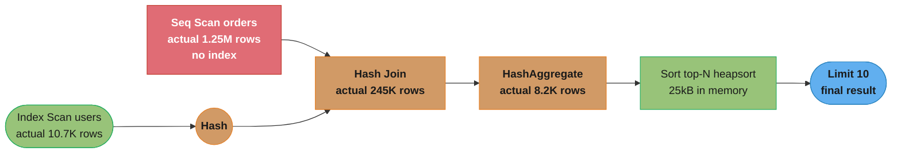
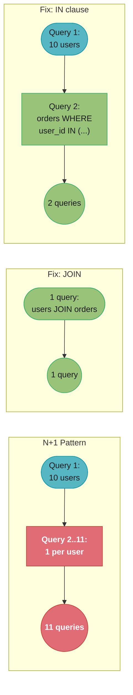
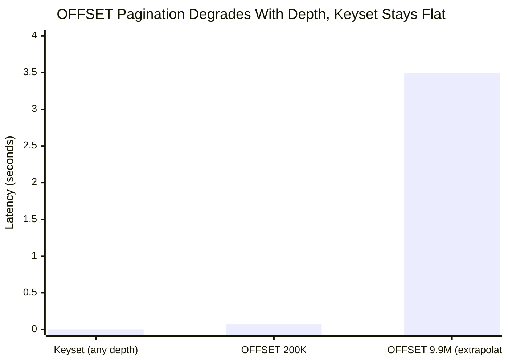

# Query Optimization

<!-- study-paths
senior: README.md
files this module contributes to each curated path; omit a tier to leave it out
-->
## 1. Concept Overview

Writing a correct SQL query is the beginning. Writing a query that scales to millions of rows, stays fast as data grows, and does not destroy database performance under load requires understanding how the database executes queries, what makes certain patterns catastrophically expensive, and how to diagnose problems in production. Query optimization is the skill that separates a developer who makes the database slow from one who keeps it fast.

This module covers EXPLAIN ANALYZE plan reading, the N+1 detection and fix workflow, pagination strategies at scale, batch insert patterns, and prepared statement plan caching.

---

## 2. Intuition

> **One-line analogy**: A query is a request to the database; the execution plan is the database's chosen route. EXPLAIN ANALYZE is the GPS that shows you the route it actually took, how long each road segment took, and whether it got stuck in traffic (seq scan through millions of rows). Optimization is about finding a faster route.

**Mental model**: The query planner generates multiple candidate plans and chooses the one with the lowest estimated cost. EXPLAIN shows the plan and estimated costs. EXPLAIN ANALYZE executes the query and shows actual rows and timing. The gap between estimated and actual rows is your first diagnostic signal — large gaps indicate stale statistics or complex predicates the planner misestimates.

**Why it matters**: A query that returns the same result in 1ms (index seek) or 30 seconds (sequential scan of 50M rows) is the single biggest performance lever in a backend system. A single missing index can push a service's database CPU from 5% to 95%. The N+1 problem can turn a sub-second page load into a 10-second ordeal. These are fixable with knowledge.

**Key insight**: The most common production performance problem is not an algorithm — it is missing indexing, wrong query shape, or N+1. Profile first, optimize second. Do not guess what is slow.

---

## 3. Core Principles

- **Selectivity**: The fraction of rows matching a predicate. A highly selective predicate (few matching rows) favours an index scan; an unselective one (most rows match) favours a sequential scan. Selectivity is only an *input*, though — the planner compares the **total estimated cost** of each whole plan, so a highly selective predicate can still get a seq scan (tiny table, or the index scan's random I/O outweighs the win) and an unselective one can still get an index scan (cheap `random_page_cost`, index-only scan, or a required sort order). There is no built-in "more than N% of the rows means sequential scan" constant.
- **Cost units**: `seq_page_cost` is 1.0 by definition and `random_page_cost` defaults to 4.0; `cpu_tuple_cost` 0.01, `cpu_index_tuple_cost` 0.005, `cpu_operator_cost` 0.0025. Because the index/seq crossover falls out of those numbers, lowering `random_page_cost` (SSD-backed storage) moves it — measured on a 1.25M-row uncorrelated column: the switch to Seq Scan happened past roughly 62% of rows at `random_page_cost=1.1`, roughly 40% at the default 4.0, and roughly 25% at 10.0.
- **Join algorithms**: Hash join (build hash table from smaller side, probe with larger), Merge join (both inputs sorted), Nested loop join (for small inputs). Wrong join choice causes catastrophic slowdown.
- **Push predicates early**: Filter as early as possible in the plan to minimize rows flowing through subsequent operations.
- **Statistics**: The planner uses column statistics (histograms, n_distinct, correlation). Stale statistics → wrong cardinality estimates → wrong plans.

---

## 4. Types / Architectures / Strategies

### 4.1 EXPLAIN Node Types

| Node | Description | Good/Bad |
|------|-------------|---------|
| Seq Scan | Full table scan | Fine for small tables, and correct whenever its total cost beats every index plan — there is no fixed row-percentage cutoff |
| Index Scan | B-tree traverse + heap fetch | Good when few rows match, or when the index also supplies the required sort order |
| Bitmap Heap Scan | Bitmap of pages, then heap fetch in physical order | Good for moderate selectivity — trades random heap I/O for sequential |
| Index Only Scan | B-tree only; skips the heap **only for pages the visibility map marks all-visible** | Best case, but check `Heap Fetches:` — a table not recently vacuumed still visits the heap |
| Hash Join | Build hash table from smaller side | Good for large unsorted inputs |
| Merge Join | Merge two sorted inputs | Good if inputs already sorted |
| Nested Loop | For each outer row, scan inner | Good when outer is small |
| Sort | In-memory or disk sort | Watch for disk spills |
| Hash Aggregate | Group-by using hash table | Watch for memory pressure |
| Gather/Gather Merge | Parallel query aggregation | Modern parallelism |

### 4.2 N+1 Detection Tools

| Tool | What it Shows |
|------|--------------|
| Hibernate Statistics | Total query count, per-query counts |
| p6spy | SQL intercept with stack trace |
| datasource-proxy | Slow query logging, query counting |
| Spring Boot Actuator + p6spy | Query count per HTTP request |
| pg_stat_statements | Top queries by total time, execution count |
| MySQL slow_query_log | Queries exceeding threshold |

### 4.3 Batch Insert Strategies (Fastest to Slowest)

| Strategy | Throughput | Notes |
|---------|-----------|-------|
| COPY (PostgreSQL) | Highest | Single-statement bulk path with far less per-row overhead. It does **not** bypass WAL — the docs' no-WAL case needs `wal_level = minimal` *and* the COPY to run in the same transaction as the `CREATE TABLE`/`TRUNCATE`. Measured on the default `wal_level = replica`, a 200,000-row COPY still generated ~4.8 MB of WAL |
| multi-row VALUES INSERT | Very high | `INSERT INTO t VALUES (a),(b),(c),...` |
| JDBC batch execute | High | Groups statements into fewer round trips; same WAL volume |
| Individual INSERTs | Low | One round-trip per row |

Run `ANALYZE` on the table after any bulk load — the planner's statistics are stale until you do.

---

## 5. Architecture Diagrams

### EXPLAIN ANALYZE Output Anatomy

```sql
EXPLAIN (ANALYZE, BUFFERS, FORMAT TEXT)
SELECT u.name, COUNT(o.id) AS order_count
FROM users u
JOIN orders o ON u.id = o.user_id
WHERE u.created_at > '2024-01-01'
GROUP BY u.id, u.name
ORDER BY order_count DESC
LIMIT 10;

-- Output. This plan is SYNTHESIZED to teach the anatomy, not captured from a server: the
-- structure, the nesting and the cost relationships are correct and internally consistent
-- (every parent's startup cost exceeds its child's total), but no run produced these exact
-- numbers. Read it for how to walk a plan; run your own for figures you intend to quote.
-- Note the nesting: every child sits one level deeper than its parent.
Limit  (cost=5678.34..5678.36 rows=10) (actual time=234.123..234.125 rows=10)
  -> Sort  (cost=5678.34..5698.34 rows=8000) (actual time=234.123..234.124 rows=10)
        Sort Key: (count(o.id)) DESC
        Sort Method: top-N heapsort  Memory: 25kB          <- efficient
        -> HashAggregate  (cost=5234.00..5314.00 rows=8000)
                          (actual time=233.789..233.950 rows=8213)
              -> Hash Join  (cost=1234.00..4234.00 rows=200000)
                            (actual time=56.789..200.456 rows=245678)
                    Hash Cond: (o.user_id = u.id)
                    -> Seq Scan on orders o                <- reads every row
                          (actual rows=1245678 loops=1)
                    -> Hash  (cost=1100.00..1100.00 rows=10720)
                          -> Index Scan on users u         <- index used
                                (actual rows=10720 loops=1)
                                Index Cond: (created_at > '2024-01-01')

Reading the output:
  (cost=X..Y):  estimated startup cost X, total cost Y
  (actual time=A..B): actual startup ms A, total ms B
  rows=N: estimated rows. actual rows=M: actual rows.
  Large gap between N and M → bad statistics or complex predicate
```

**A Seq Scan is not automatically the bug.** The reflex fix here — `CREATE INDEX ON orders (user_id)` —
does nothing for *this* query, and that was verified rather than assumed: on a PostgreSQL 16.9
instance holding 100,000 users and 1,250,000 orders, adding `orders(user_id)` left the plan
byte-for-byte identical (still `Seq Scan on orders` feeding a `Hash Join`). The reason is that the
`created_at` predicate keeps ~59% of the users, so the join has to touch essentially every order
row; 59,000 index descents cost far more than one 83 MB sequential read, and the planner is
comparing those two *total costs*, not applying a selectivity rule of thumb.

The same index becomes decisive the moment the driving predicate narrows. Tightening the filter to
333 users on the same data flipped the plan to `Nested Loop` + `Index Scan using orders_user_id_idx`
(`loops=333`) and execution time from 680 ms to 30 ms. **The index was never missing — the
predicate was never selective.** Before prescribing an index, check whether the plan's *other* rows
are the real cost: in the measured run the Seq Scan itself accounted for 68 ms of 680 ms, while the
`HashAggregate` spilling to disk (`Batches: 5  Disk Usage: 3848kB`) accounted for most of the rest,
and raising `work_mem` — not adding an index — was what removed the spill.

**The idea behind it.** "`cost` is what the planner *guessed* before running anything, `actual`
is what really happened — and the single most useful thing in the whole plan is the ratio
between the two." You are not reading a performance report; you are auditing whether the
planner's model of your data still matches reality.

| Symbol | What it is |
|--------|------------|
| `cost=X..Y` | Estimated startup cost `X` and total cost `Y`, in arbitrary planner units |
| `actual time=A..B` | Real milliseconds: `A` to produce the first row, `B` to produce the last |
| `rows=N` | The planner's **estimate** of rows this node emits |
| `actual rows=M` | What the node actually emitted |
| `M / N` | Estimation error. Near `1` is healthy; orders of magnitude off is the bug |
| `loops=L` | How many times this node ran. Reported times are **per loop**, not totals |

Cost units are not milliseconds and not comparable across machines — `1.0` is defined as one
sequential page fetch. Never chase a cost number down; only ever compare two costs from the
same plan, or compare `rows` against `actual rows`.

**Walk one example.** Auditing the estimates in the plan above, node by node:

```
  node                   rows= (est)   actual rows      M / N       verdict
  --------------------   -----------   -------------   --------   -------------------
  Hash (users)                10,720          10,720     1.000     statistics perfect
  Hash Join                  200,000         245,678     1.228     acceptable drift
  HashAggregate                8,000           8,213     1.027     fine
  Seq Scan on orders               -       1,245,678         -     widest node

  Total actual time = 234.125 ms. Every estimate above is accurate, so this is
  NOT a stale-statistics problem -- the planner knew exactly what it was doing.
```

That distinction is the point of the audit. Estimates close to actuals mean the planner knew
what it was doing and simply had no cheaper option — so the fix is a rewrite, a narrower
predicate, more `work_mem`, or accepting the plan; an index only helps if it changes the *cost*
comparison, which is why you re-run EXPLAIN after creating one instead of assuming. Estimates
off by 100x or 1000x mean the planner was *misinformed*, and the fix is `ANALYZE`, a raised
`default_statistics_target` (default 100), or an extended statistics object, not a new index.

**Why `loops` is the field that catches people out.** A node showing `actual time=0.8..0.9`
with `loops=1000` did not take 0.9 ms — it took `0.9 x 1000 = 900` ms. PostgreSQL reports
per-loop averages, so a nested loop's inner side always looks harmless until you multiply. This
is exactly how an N+1 hides inside a single plan.

### EXPLAIN Plan Execution Flow



Execution flows bottom-up through the plan tree, matching the "read innermost first" rule above: the two leaf scans run first — Index Scan on users is fast at 10,720 rows, while Seq Scan on orders is the widest node at 1.25M rows — then Hash Join, HashAggregate, Sort, and Limit narrow the 245,678 joined rows down to the 10 rows actually returned. Width is not the same as blame: as the measured run above showed, the seq scan can be the biggest row count in the plan and still be the cheapest way to get those rows.

### N+1 Problem Pattern and Fix



The N+1 pattern issues one query per user — 11 total for 10 users, the red hot path — while JOIN FETCH collapses everything into a single query and the IN-clause variant lands at 2 queries; both fixes (green) beat the pattern 5-11x.

---

## 6. How It Works — Detailed Mechanics

### 6.1 N+1 Detection and Fix with Spring Data JPA

```java
// BROKEN: N+1 — one query per user to load orders
@Entity
public class User {
    @OneToMany(mappedBy = "user", fetch = FetchType.LAZY)  // LAZY by default
    private List<Order> orders;
}

// Service method that triggers N+1:
@Service
public class UserService {
    public List<UserDto> getUsersWithOrders() {
        List<User> users = userRepository.findAll();  // Query 1: SELECT users
        return users.stream()
            .map(user -> {
                user.getOrders();  // Query 2..N+1: SELECT orders WHERE user_id=?
                return toDto(user);
            })
            .toList();
    }
}

// Fix 1: JOIN FETCH in JPQL
@Query("SELECT u FROM User u LEFT JOIN FETCH u.orders WHERE u.active = true")
List<User> findActiveUsersWithOrders();

// Fix 2: @EntityGraph
@EntityGraph(attributePaths = "orders")
List<User> findByActive(boolean active);

// Fix 3: Batch size (compromise — N/batchSize + 1 queries instead of N+1)
@OneToMany(mappedBy = "user", fetch = FetchType.LAZY)
@BatchSize(size = 50)  // load orders in batches of 50 users
private List<Order> orders;

// Fix 4: Separate query with IN clause (avoids Cartesian product for multiple collections)
@Query("SELECT u FROM User u WHERE u.active = true")
List<User> findActiveUsers();

@Query("SELECT o FROM Order o WHERE o.userId IN :userIds")
List<Order> findOrdersByUserIds(@Param("userIds") List<Long> userIds);

// Query counts for the four shapes above, as a function of N parent rows:
//   N+1 (broken)     : 1 + N
//   JOIN FETCH       : 1
//   @BatchSize(size) : 1 + ceil(N / size)
//   IN clause        : 2

// Service:
List<User> users = userRepository.findActiveUsers();
List<Long> userIds = users.stream().map(User::getId).toList();
Map<Long, List<Order>> ordersByUserId = orderRepository
    .findOrdersByUserIds(userIds)
    .stream()
    .collect(Collectors.groupingBy(Order::getUserId));

users.forEach(user ->
    user.setOrders(ordersByUserId.getOrDefault(user.getId(), List.of()))
);
```

**What it means.** "N+1 is not slow because any one query is slow — every query in it is fast.
It is slow because the count of network round trips grows with your result set." A 2 ms query
is fine; five hundred of them, one after another, each paying a full round trip before the next
can be issued, is a second of latency that no index will fix.

| Symbol | What it is |
|--------|------------|
| `N` | Parent rows returned by the first query. Grows with page size and data |
| `1` | The parent query itself. Irreducible — you always pay it |
| `ceil(N / size)` | `@BatchSize` collapses N child lookups into this many `IN` queries |
| round trip | Per-query network + parse + plan cost. `~2 ms` on a same-AZ Postgres |
| total latency | `queries x round_trip`. The `queries` factor is the one you control |

**Walk one example.** A page of `N = 500` active users, 2 ms per round trip:

```
  strategy            queries                    latency = queries x 2 ms
  -----------------   ------------------------   ------------------------
  N+1 (broken)        1 + 500          = 501            1,002 ms
  @BatchSize(50)      1 + ceil(500/50) =  11               22 ms
  IN clause           2                =   2                4 ms
  JOIN FETCH          1                =   1                2 ms

  N+1 vs JOIN FETCH: 501x fewer queries, 1,002 ms -> 2 ms.
```

The scaling behaviour is what matters more than the absolute numbers. Double the page size and
N+1 doubles its latency; the other three do not move at all. This is why an N+1 always ships
clean — with 5 rows in the dev database it costs `6 x 2 = 12` ms and nobody notices.

**Why `@BatchSize` is the compromise and not the answer.** It is `1 + ceil(N/size)`, so it never
reaches 1 — it just makes the growth 50x flatter. Its advantage is that it needs no query
rewrite, only an annotation, and it dodges the Cartesian-product blowup that `JOIN FETCH`
causes when an entity has two collections fetched at once (`|orders| x |addresses|` rows for
every user). Reach for `JOIN FETCH` with one collection, the `IN`-clause split with several.

### 6.2 Detecting N+1 with Statistics

```java
// Enable Hibernate statistics logging
// application.yml:
spring:
  jpa:
    properties:
      hibernate:
        generate_statistics: true

// Or use datasource-proxy to count queries per HTTP request:
@Bean
public DataSource dataSource() {
    return ProxyDataSourceBuilder.create(actualDataSource)
        .name("DB-Query")
        .logQueryToSysOut()
        .countQuery()  // count queries
        .build();
}

// Query count assertion in tests:
@Test
public void getUsersWithOrders_shouldNot_triggerNPlusOne() {
    int queryCount = queryCountInterceptor.getQueryCount();
    userService.getUsersWithOrders();
    int newCount = queryCountInterceptor.getQueryCount();
    assertThat(newCount - queryCount).isLessThanOrEqualTo(2);  // 1 for users, 1 for orders
}
```

### 6.3 Pagination Performance

```sql
-- OFFSET pagination: performance degrades with deep pages
-- Page 1: fast
SELECT * FROM orders ORDER BY created_at DESC LIMIT 20 OFFSET 0;
-- Page 100: slow (skip 2000 rows)
SELECT * FROM orders ORDER BY created_at DESC LIMIT 20 OFFSET 2000;
-- Page 10000: very slow (skip 200000 rows)
SELECT * FROM orders ORDER BY created_at DESC LIMIT 20 OFFSET 200000;
-- Database must produce rows 0-200019, then discard 0-199999

-- KEYSET pagination: O(1) regardless of depth
-- First page:
SELECT * FROM orders ORDER BY created_at DESC, id DESC LIMIT 20;
-- Returns: last row's (created_at, id) = ('2024-05-01', 456)

-- Next page (use cursor from last item):
SELECT * FROM orders
WHERE (created_at, id) < ('2024-05-01', 456)  -- composite comparison
ORDER BY created_at DESC, id DESC
LIMIT 20;

-- DO NOT use the OR rewrite. It returns the same rows but is NOT the same plan:
SELECT * FROM orders
WHERE created_at < '2024-05-01'
   OR (created_at = '2024-05-01' AND id < 456)   -- planner cannot turn OR into an Index Cond
ORDER BY created_at DESC, id DESC
LIMIT 20;

-- Required index for keyset:
CREATE INDEX ON orders (created_at DESC, id DESC);
```

**Measured (PostgreSQL 16.9, 1.25M `orders` rows, warm cache, index above present).** Numbers are
hardware- and cache-dependent — what transfers is the *shape*, not the milliseconds:

| Query | Plan | Rows scanned | Buffers | Time |
|---|---|---|---|---|
| `LIMIT 20 OFFSET 0` | Index Scan | 20 | 23 | 0.04 ms |
| `LIMIT 20 OFFSET 200000` | Index Scan | 200,020 | 200,771 | 71 ms |
| `LIMIT 20 OFFSET 1200000` | Index Scan | 1,200,020 | 1,204,519 | 399 ms |
| keyset, **row comparison** `(created_at, id) < (?, ?)` | Index Scan, cursor as `Index Cond` | 20 | 23 | **0.16 ms** |
| keyset, **OR rewrite** (same cursor, same data) | Index Scan + `Filter`, 1,200,001 `Rows Removed by Filter` | 1,200,020 | 1,204,520 | **571 ms** |

Two things fall out of that table. First, OFFSET is linear in the offset — cost per row is constant,
so 6x the offset is 6x the time, and no index removes it because the rows genuinely have to be
produced and thrown away. Second, **the row-comparison form of keyset pagination is the load-bearing
detail.** The OR rewrite is not "more readable, same effect": PostgreSQL can push `(a, b) < (?, ?)`
into the index as an `Index Cond` and seek straight to the cursor, but it cannot do that with the
equivalent `OR`, which degrades to scanning the index from the top and discarding 1.2M rows in a
`Filter`. On this data that is a 3,600x difference — and it is exactly the class of "fix" that looks
right in review and disappears in the plan.



*Plotted from the measured table above, not from the anecdote: 0.16ms for keyset and 71ms at OFFSET 200,000 on a warm, correctly indexed 1.25M-row table. The third bar is the only extrapolation — OFFSET is linear in the offset, so 49.5x the depth gives 71ms x 49.5 = ~3.5s. Keyset stays flat at any depth because it is a single index seek on the cursor; OFFSET grows linearly with depth. Absolute values move with row width, cache state and storage, so read the shape rather than the numbers.*

### 6.4 Batch Inserts with JDBC and Spring

```java
// BROKEN: individual inserts (one round trip per row)
orders.forEach(order -> orderRepository.save(order));  // N queries

// FIX 1: Spring Data JPA saveAll (uses batching if configured)
// application.yml:
spring:
  jpa:
    properties:
      hibernate:
        jdbc:
          batch_size: 100     # batch INSERT statements
          batch_versioned_data: true  # batch UPDATE/DELETE with versioning
          order_inserts: true         # group inserts by entity type
          order_updates: true

// Then: saveAll() batches 100 at a time
orderRepository.saveAll(orders);  // batchSize inserts at a time

// FIX 2: Direct JDBC batch for maximum performance
@Autowired
private JdbcTemplate jdbcTemplate;

public void batchInsert(List<Order> orders) {
    String sql = "INSERT INTO orders (user_id, amount, status, created_at) " +
                 "VALUES (?, ?, ?, ?)";

    jdbcTemplate.batchUpdate(sql, new BatchPreparedStatementSetter() {
        @Override
        public void setValues(PreparedStatement ps, int i) throws SQLException {
            Order order = orders.get(i);
            ps.setLong(1, order.getUserId());
            ps.setBigDecimal(2, order.getAmount());
            ps.setString(3, order.getStatus());
            ps.setTimestamp(4, Timestamp.from(order.getCreatedAt()));
        }
        @Override
        public int getBatchSize() { return orders.size(); }
    });
}

// For very large inserts (millions of rows): use COPY with PostgreSQL.
// CopyManager.copyIn(String, Reader) is declared "throws SQLException, IOException" --
// both must be handled or rethrown or this will not compile.
public void bulkCopy(List<Order> orders) throws SQLException, IOException {
    Connection conn = dataSource.getConnection();
    CopyManager copyManager = new CopyManager((BaseConnection) conn);
    StringBuilder sb = new StringBuilder();
    for (Order order : orders) {
        sb.append(order.getUserId()).append('\t')
          .append(order.getAmount()).append('\t')
          .append(order.getStatus()).append('\n');
    }
    copyManager.copyIn(
        "COPY orders (user_id, amount, status) FROM STDIN",
        new StringReader(sb.toString())
    );
}
```

### 6.5 Prepared Statement Plan Caching

```java
// PreparedStatement: SQL parsed and planned once, executed many times
// Avoids repeated parse+plan overhead for identical query shapes

// BROKEN: String concatenation defeats PreparedStatement
String sql = "SELECT * FROM orders WHERE user_id = " + userId;  // SQL injection risk + no caching
Statement stmt = conn.createStatement();
stmt.executeQuery(sql);

// FIX: PreparedStatement with parameter binding
String sql = "SELECT * FROM orders WHERE user_id = ?";
PreparedStatement ps = conn.prepareStatement(sql);  // no server round trip yet (pgJDBC)
ps.setLong(1, userId);
ps.executeQuery();

// PostgreSQL server-side prepared statements -- what actually happens:
//  - prepareStatement() alone sends nothing; pgJDBC uses the unnamed extended-protocol
//    statement (parse+bind+execute per call) at first.
//  - Only after the SAME PreparedStatement has been executed prepareThreshold times
//    (default 5) on the SAME physical connection does the driver switch to a named
//    server-side statement and reuse it. Cross-connection reuse requires the pool to
//    hand back the same physical connection.
//  - HikariCP deliberately does NOT cache statements ("an anti-pattern" per its README);
//    all statement/plan caching here is the driver's and the server's, not the pool's.
//  - Server side: the first 5 executions get custom (parameter-specific) plans; then a
//    generic plan is built and used only if its estimated cost is not much higher than
//    the average custom-plan cost. Override with plan_cache_mode.

// Spring JdbcTemplate uses PreparedStatement internally.
// Pass bind values as varargs after the RowMapper -- query(String, RowMapper, Object...):
jdbcTemplate.query(
    "SELECT * FROM orders WHERE user_id = ?",
    rowMapper,
    userId
);

// Check server-side prepared statements:
SELECT * FROM pg_prepared_statements;
```

---

## 7. Real-World Examples

**Query budgets as a regression gate**: The durable practice in large Rails and Spring codebases is to instrument every controller action or HTTP handler with a query counter and fail the build when an endpoint exceeds its budget. The point is that an N+1 is invisible in a code review and obvious in a counter, so the counter is where you enforce it — any endpoint over budget gets an architectural fix (eager load, batched `IN`, denormalized read model), not a band-aid. Ruby ecosystems use Bullet or Prosopite for this; JVM ecosystems use datasource-proxy or p6spy (see section 6.2).

**Offset pagination cliff** (illustrative composite, not a public incident report): an "export all records" feature works fine in development with 1,000 records. In production with 10M records the last pages (`OFFSET 9,900,000 LIMIT 100`) take tens of seconds each and time out, because every one of those pages re-produces and discards ~9.9M rows. Migrating to keyset pagination makes each page cost the same as the first.

---

## 8. Tradeoffs

| Pagination | Consistency | Performance at scale | Jump to page |
|------------|------------|---------------------|-------------|
| OFFSET | Poor | O(OFFSET) — degrades | Yes |
| Keyset | Good | O(1) | No |
| Cursor (keyset variant) | Good | O(1) | No |

| N+1 Fix | Performance | Memory | Complexity |
|---------|------------|--------|------------|
| JOIN FETCH | Best (1 query) | Higher (Cartesian for multiple collections) | Low |
| Separate IN query | Good (2 queries) | Medium | Medium |
| @BatchSize | Acceptable (N/batch+1) | Low | Low |

---

## 9. When to Use / When NOT to Use

**JOIN FETCH**: Use for loading a single collection with a fixed bounded size. Avoid for multiple collections (creates Cartesian product multiplying row count). For `User + Orders + Tags`, use separate IN queries, not JOIN FETCH for both collections simultaneously.

**Keyset pagination**: Use for any API that returns sequential data that clients page through (activity feeds, transaction history, search results). Avoid if users need to jump to arbitrary page numbers (admin reports, export with known page count).

**JDBC batch updates**: Use for bulk operations (data migrations, import jobs, bulk status updates). Do not use for single-row updates in transactional business logic — the benefit is amortizing round-trip overhead, which only matters at batch scale.

---

## 10. Common Pitfalls

**Eager loading causing Cartesian product**: Loading a User with both orders (100 per user) and tags (20 per user) via JOIN FETCH produces 100 * 20 = 2,000 duplicate rows per user. Hibernate deduplicates them in memory, but the query transferred 2,000 rows where you needed 120. Use separate queries with IN for multiple collections.

**N+1 hidden by LazyInitializationException fix**: When Hibernate throws LazyInitializationException (session closed, lazy collection accessed), the common "fix" is changing fetch to EAGER. This solves the exception but creates a permanent N+1 (now eager-loading the collection everywhere, even when not needed). The right fix is JOIN FETCH or EntityGraph scoped to the query that needs the data.

**Query inside a loop**: Even without ORM, a query inside a for loop is N+1:
```java
// BROKEN: query inside loop
for (Long userId : userIds) {
    List<Order> orders = jdbcTemplate.query(
        "SELECT * FROM orders WHERE user_id = ?", orderRowMapper, userId);  // N queries
}

// BROKEN FIX: a single '?' cannot bind a List. Plain JdbcTemplate binds it as one
// value and you get "operator does not exist: bigint = record" or a silent wrong result.
// jdbcTemplate.query("SELECT * FROM orders WHERE user_id IN (?)", rm, userIds);

// FIX: named parameter, expanded by NamedParameterJdbcTemplate into IN (?,?,?...)
List<Order> orders = namedJdbcTemplate.query(
    "SELECT * FROM orders WHERE user_id IN (:userIds)",
    Map.of("userIds", userIds),
    orderRowMapper);  // 1 query

// Chunk userIds (e.g. 1,000 at a time) for very large lists: each distinct list length
// is a distinct SQL text, so unbounded IN lists also blow out the plan cache.
```

**Sort without index causes sort spill to disk**: `ORDER BY last_name, first_name` on a 10M row table without an index on those columns does an in-memory sort (up to `work_mem` bytes). If the sort exceeds work_mem, PostgreSQL spills to disk — dramatically slower. EXPLAIN output shows "Sort Method: external merge Disk: 45678kB". Fix: add index on the sorted columns, or increase work_mem for specific queries (`SET LOCAL work_mem = '256MB'` inside a transaction).

**Type mismatch on an indexed column — but know which engine does what**: The pitfall is real and the two major engines fail in opposite directions, so the generic advice "a quoted number breaks the index" is wrong for PostgreSQL. In **PostgreSQL** a bare literal is untyped at parse time, so `WHERE user_id = '123'` on a `bigint` column resolves the literal to `bigint` and uses the index normally (verified: `Index Cond: (user_id = '123'::bigint)`); if the value instead arrives with an explicit text type — a JDBC `setString` on an integer column, since pgJDBC's default `stringtype=varchar` — PostgreSQL does not silently cast per row, it raises `ERROR: operator does not exist: bigint = character varying`. What *does* silently cost you the index in PostgreSQL is a function or cast applied to the **column**: `WHERE created_at::date = DATE '2023-06-01'` gets a Parallel Seq Scan, while the sargable range form `created_at >= '2023-06-01' AND created_at < '2023-06-02'` uses the index. In **MySQL** the classic trap is the reverse: comparing an indexed *string* column to a *number* (`WHERE str_col = 1`) compares both as floats, and the manual states outright that "MySQL cannot use an index on the column to look up the value quickly". Always bind with the column's own type, and never wrap the indexed column in a function.

---

## 11. Technologies & Tools

| Tool | Purpose |
|------|---------|
| `EXPLAIN (ANALYZE, BUFFERS)` | Query plan with actual timing and buffer usage |
| `pg_stat_statements` | Top queries by total time and execution count |
| `auto_explain` | Auto-log slow query plans to PostgreSQL logs |
| `pgBadger` | Parse PostgreSQL logs, generate slow query reports |
| `datasource-proxy` | Java DataSource proxy for query counting |
| `p6spy` | SQL interceptor with stack traces |
| `Hibernate generate_statistics` | Query count and timing statistics |
| `EXPLAIN ANALYZE` in DBeaver/DataGrip | GUI plan visualization |
| depesz EXPLAIN | Online PostgreSQL plan formatter |
| `pg_hint_plan` (PostgreSQL) / `USE INDEX` (MySQL) | Per-query plan hints. PostgreSQL has no native hint syntax — the extension is the only per-query mechanism |

---

## 12. Interview Questions with Answers

**Q: How do you read a PostgreSQL EXPLAIN ANALYZE output?**
**Short:** Read EXPLAIN ANALYZE from the innermost node outward, comparing estimated versus actual rows to spot stale statistics.

Each line is a plan node (operation). Read from the innermost (deepest indentation) outward — inner nodes execute first. Key fields: cost=X..Y (estimated startup..total cost), rows=N (estimated), actual time=A..B ms (measured startup..total), actual rows=M. Large gap between rows=N (estimated) and actual rows=M indicates outdated statistics. The widest actual time lines are bottlenecks — note that `actual time` is per loop, so multiply by `loops` before comparing nodes. Look for Sort or Aggregate nodes reporting Disk usage (they exceeded work_mem), Hash nodes with `Batches > 1`, and Seq Scans on large tables — but a Seq Scan is only a defect if an index plan would genuinely be cheaper, so confirm by creating the index and re-running EXPLAIN rather than assuming.

**Q: What is the N+1 problem and how do you detect it in a Spring application?**
**Short:** N+1 means one query for entities plus one query per related collection, detectable by counting SQL statements per request.

N+1: a query fetches N entities (1 query), then for each entity fetches a related collection (N queries) = N+1 queries total. In JPA, this occurs with LAZY-loaded collections accessed outside the repository. Detection: enable `hibernate.generate_statistics=true`, use datasource-proxy to count queries per HTTP request, or use p6spy to log all SQL with stack traces. In tests, assert a maximum query count per operation.

**Q: How would you fix N+1 for a User with Orders in Spring Data JPA?**
**Short:** Fix N+1 with JOIN FETCH or an @EntityGraph for a single collection, and separate IN-clause queries for multiple collections.

Option 1: `@Query("SELECT u FROM User u LEFT JOIN FETCH u.orders WHERE u.id IN :ids")` — JOIN FETCH fetches users and orders in one query. Option 2: `@EntityGraph(attributePaths = "orders")` on the repository method. Option 3: For multiple collections (orders + tags), use separate queries with IN: fetch all users, collect IDs, `SELECT o FROM Order o WHERE o.userId IN :userIds`, map by userId in Java. Avoid JOIN FETCH for multiple collections simultaneously (Cartesian product).

**Q: What is the performance cliff with OFFSET pagination?**
**Short:** OFFSET pagination generates and discards every skipped row, so its cost grows linearly with page depth unlike keyset pagination.

OFFSET N requires the database to generate all rows 0 through N+LIMIT-1 and discard 0 through N-1. For OFFSET 1,000,000 LIMIT 20, the database generates 1,000,020 rows and discards 1,000,000. Performance is O(OFFSET) — doubling the page number doubles the query time. At deep pages (export, large dataset), this becomes unbearably slow. Keyset pagination avoids this: `WHERE id > last_id LIMIT 20` uses the index directly, O(1) regardless of depth.

**Q: How does keyset pagination work?**
**Short:** Keyset pagination uses the last row's sort values as a row-comparison cursor, letting the index seek directly at O(1) cost.

Keyset pagination uses the values from the last row of the current page as the cursor for the next page. For a list sorted by `(created_at DESC, id DESC)`, the next page query is: `WHERE (created_at, id) < (last_created_at, last_id) ORDER BY created_at DESC, id DESC LIMIT 20`. The composite WHERE condition acts as a cursor. Write it as a **row comparison**, not as `a < ? OR (a = ? AND b < ?)` — PostgreSQL pushes `(a, b) < (?, ?)` into the index as an `Index Cond` and seeks straight to the cursor, but the OR form becomes a `Filter` over a full index scan (measured: 0.16 ms vs 571 ms at a 1.2M-row-deep cursor). An index on (created_at DESC, id DESC) then makes this O(1). The tradeoff: cannot jump to arbitrary pages — you can only page forward (or backward with reversed comparison).

**Q: What JDBC patterns should you use for bulk inserts?**
**Short:** Bulk-load with COPY or LOAD DATA INFILE, or batch JDBC statements, and always run ANALYZE after a large load.

Best performance: COPY (PostgreSQL) or LOAD DATA INFILE (MySQL), which strip the per-row statement overhead. Note what COPY does *not* do: it does not bypass the WAL. The PostgreSQL docs' no-WAL case requires `wal_level = minimal` *and* the COPY running in the same transaction as the `CREATE TABLE` or `TRUNCATE`; on the default `wal_level = replica` a 200,000-row COPY still generated ~4.8 MB of WAL in a measured run. For general use: JDBC batch execute (`PreparedStatement.addBatch(); executeBatch()`) groups statements for fewer round trips. With Hibernate: set `hibernate.jdbc.batch_size=100`, `hibernate.order_inserts=true`, and use `saveAll()`. Never: loop calling `save()` individually — this is N round trips for N rows. Run `ANALYZE` after any bulk load.

**Q: How does a PreparedStatement improve performance?**
**Short:** A PreparedStatement lets the database plan a query once and reuse that plan across repeated executions of the same shape.

PreparedStatement separates query planning from execution, so the same query shape is parsed and planned once instead of on every call. The nuance interviewers probe is that `prepareStatement(sql)` does not itself talk to the server in pgJDBC: the driver only promotes the statement to a named server-side prepared statement after it has been executed `prepareThreshold` times (default 5) on the same physical connection, and HikariCP contributes nothing here because it deliberately does no statement caching of its own. Once a server-side statement exists, PostgreSQL runs the first five executions with custom, parameter-specific plans, then builds a generic plan and adopts it only if its estimated cost is not much higher than the average custom-plan cost (`plan_cache_mode` overrides this; `pg_prepared_statements.generic_plans`/`custom_plans` shows what it chose). Benefits: (1) eliminates repeated parse and plan overhead for the same query shape; (2) prevents SQL injection, since parameters cannot change the query structure.

**Q: What is a Cartesian product in JPA and when does it occur?**
**Short:** JOIN FETCHing multiple collections at once multiplies the result set, producing rows Hibernate must deduplicate in memory.

When JOIN FETCHing multiple collections on the same entity (e.g., `User FETCH JOIN orders FETCH JOIN tags`), the SQL JOIN multiplies the result set: each user row is combined with each order and each tag. A user with 100 orders and 20 tags produces 100 * 20 = 2,000 rows, which Hibernate deduplicates in memory. The network traffic and memory used is 2,000 rows even though only 120 entities exist. Fix: use separate queries for each collection, connected via IN clause.

**Q: How do you find slow queries in production?**
**Short:** Find slow queries with pg_stat_statements' aggregated execution stats or a slow query log filtering by minimum duration.

PostgreSQL: (1) Enable `pg_stat_statements` — aggregates all executed queries with total time, execution count, and average time. `SELECT query, total_exec_time/calls AS avg_ms, calls FROM pg_stat_statements ORDER BY total_exec_time DESC LIMIT 20`. (2) `log_min_duration_statement = 1000` logs all queries taking >1s. (3) `auto_explain` automatically logs plans for slow queries. MySQL: slow query log with `long_query_time`. Application: micrometer timer on repository methods, distributed tracing span for DB calls.

**Q: What is the work_mem setting and when does it cause disk spills?**
**Short:** work_mem caps memory per sort or hash operation, and exceeding it forces PostgreSQL to spill the operation to disk.

`work_mem` (PostgreSQL) is the memory available per sort or hash operation per query execution. If a sort exceeds work_mem, PostgreSQL spills to disk (external merge sort). EXPLAIN ANALYZE shows "Sort Method: external merge Disk: XKIB". Signs of work_mem pressure: sorts and hash joins taking unexpectedly long, high temp file usage in pg_stat_database. Fix: increase work_mem for specific queries (`SET LOCAL work_mem = '256MB'`), or add an index to eliminate the sort, or redesign the query. Be careful: work_mem is per-operation per-query, and a complex query can have many operations.

**Q: What query hints are available in PostgreSQL?**
**Short:** PostgreSQL has no native per-query hints, only planner GUCs that discourage a plan type rather than forbid it outright.

PostgreSQL has no native per-query hints, only the `enable_*` planner GUCs, and those *discourage* rather than disable. Setting `enable_seqscan = off` adds a huge penalty (the plan's cost jumps to `10000000000.00..10000023147.00` in a measured run) so an index plan wins if one exists — but with no alternative the planner still emits the Seq Scan; the docs say plainly that "it is impossible to suppress sequential scans entirely". Same for `enable_hashjoin`, `enable_nestloop`, `enable_sort`. These are per-session GUCs, not global server settings, so `SET LOCAL enable_nestloop = off` inside a transaction is the safe scoping — but they are still blunt, because they apply to every node in the query, not the one you meant. For real per-query hints use the `pg_hint_plan` extension: `/*+ SeqScan(orders) */` or `/*+ IndexScan(orders orders_user_id_idx) */`. For most cases, fixing statistics (`ANALYZE`, a higher `default_statistics_target`, extended statistics) or correcting `random_page_cost` for your storage is better than any hint.

**Q: How do you count queries in a Spring test to prevent N+1 regression?**
**Short:** Count queries in tests with a datasource-proxy wrapper asserting a maximum SQL execution count per operation.

Use datasource-proxy or a custom JDBC connection wrapper. Configure a QueryCountHolder ThreadLocal that counts SQL executions. In tests:
```java
QueryCountHolder.clear();
userService.getUsersWithOrders();
assertThat(QueryCountHolder.getGrandTotal()).isLessThanOrEqualTo(2);
// 1 query for users, 1 for orders = max 2
```
This prevents regression: if someone adds a lazy access that triggers N+1, the test fails. Run these in all repository/service integration tests.

**Q: What is the difference between INNER JOIN and LEFT JOIN performance-wise?**
**Short:** An INNER JOIN gives the planner more freedom to reorder joins and push predicates than an outer join constrains it to.

INNER JOIN returns only rows matching on both sides; LEFT JOIN returns every left row, null-extending the unmatched ones. The performance difference is not that one is inherently faster on the same rows — it is that INNER JOIN gives the planner more freedom. Inner joins are commutative and associative, so the planner can reorder them freely and push predicates down through them; an outer join fixes which side must be preserved, so it constrains join order and blocks some pushdowns. The practical rule: if you write a LEFT JOIN and then filter on the right table's columns in the WHERE clause, you have written an INNER JOIN with extra steps — the WHERE discards the null-extended rows anyway. PostgreSQL can often detect and convert that case, but writing INNER JOIN explicitly states the intent and guarantees the freer plan space.

**Q: How do you debug a query that is suddenly slow in production?**
**Short:** Debug a sudden slowdown by re-running EXPLAIN ANALYZE BUFFERS, checking row estimates, index usage, and lock contention.

Systematic approach: (1) Get the execution plan from production: `EXPLAIN (ANALYZE, BUFFERS) <query>`. (2) Compare estimated vs actual rows — large gap = stale statistics. Run `ANALYZE tablename`. (3) Check if an index is being used: look for Seq Scan where an Index Scan is expected. (4) Check buffer hit rate in EXPLAIN BUFFERS output: low hit rate = working set exceeds buffer pool. (5) Check for lock contention: `SELECT * FROM pg_locks JOIN pg_stat_activity ON pg_locks.pid = pg_stat_activity.pid WHERE granted = false`. (6) Compare with a known-good plan: `EXPLAIN (ANALYZE)` from before the slowdown and compare cardinality estimates.

**Q: Why is switching a LAZY collection to EAGER a bad fix for LazyInitializationException?**
**Short:** Switching a LAZY collection to EAGER turns an occasional N+1 into a permanent one on every query against that entity.

Changing to EAGER stops the exception but converts an occasional N+1 into a permanent one, because every query that loads the parent entity now also loads the collection whether or not it's needed. LazyInitializationException happens when a lazy collection is accessed after the Hibernate session that could fetch it has already closed; switching the mapping to EAGER "fixes" that specific stack trace, but it does so by eager-loading the collection on every single query against that entity type, everywhere in the codebase, forever. The correct fix is scoped to the query that actually needs the data — a `JOIN FETCH` or `@EntityGraph` on that specific repository method — leaving the mapping itself LAZY for every other query path. Reserve EAGER mappings for the rare case where a collection is genuinely needed on nearly every load of its parent, and default to LAZY plus targeted fetch strategies everywhere else.

**Q: Why might `WHERE user_id = '123'` fail to use an index even though user_id is indexed?**
**Short:** An indexed column loses its index only when a function, cast, or mismatched bind type is applied to the column, not the literal.

In PostgreSQL that exact query does not fail — the quoted literal is untyped at parse time and resolves to the column's type, so the index is used. Verified on PostgreSQL 16.9 against a `bigint` column with a b-tree index, the plan is a Bitmap Index Scan with `Index Cond: (user_id = '123'::bigint)`. The failure mode people are reaching for is a *bind parameter* whose type is already fixed to text before the planner sees it — a JDBC `setString` on an integer column, since pgJDBC sends `varchar` by default — but PostgreSQL does not silently cast per row in that case either; it refuses outright with `ERROR: operator does not exist: bigint = character varying`. So the honest answer has three parts. In PostgreSQL, what actually costs you the index is a function or cast applied to the **column** rather than the literal: `WHERE created_at::date = DATE '2023-06-01'` plans as a Parallel Seq Scan, while the sargable rewrite `created_at >= '2023-06-01' AND created_at < '2023-06-02'` uses the index. In MySQL, the trap runs the other way — an indexed *string* column compared to a *number* forces a float comparison and the manual states the index cannot be used. And in either engine the fix is the same: bind with the column's own type (`setLong`, not `setString`; JPA infers this from the entity field) and never wrap the indexed column in a function or a cast.

---

## 13. Best Practices

- Run EXPLAIN ANALYZE (not just EXPLAIN) — EXPLAIN estimates can be misleading without actuals.
- After any large data operation (bulk insert, delete, ETL), run ANALYZE on affected tables.
- Always use PreparedStatement (never string concatenation) for security and performance.
- Detect N+1 in integration tests with query count assertions; prevent regressions.
- Use keyset pagination for all user-facing paginated endpoints from day one.
- Set a batch_size in Hibernate for all bulk operations; never loop with individual saves.
- Use pg_stat_statements to find the top 10 queries by total execution time — these are the best optimization targets.
- Do not optimize without profiling — find the actual bottleneck first.

---

## 14. Case Study

**Problem** (illustrative walkthrough; the numbers are internally consistent, not a published incident): An order management system had a "Get Orders with Customer Details" endpoint taking 8 seconds to return 50 orders. The dashboard auto-refreshed roughly once a second for about 200 concurrent managers, so ~200 requests/s x 51 queries per request ≈ **10,200 DB queries/s**.

**Where every latency below comes from.** All of them are *derived from the query-count model*, not captured from a server, and it is worth seeing the derivation so you can check the arithmetic rather than trust the figures. The endpoint issues 51 serial round trips, and at ~10,200 queries/s the database is saturated at 85% CPU, so each round trip costs roughly `8,000ms / 51 ≈ 157ms` — overwhelmingly queueing delay, not query work. That is the single number the rest follows from, and it is also why the fixes compound: collapsing 51 round trips to 1 removes 98% of them *and* takes the database out of saturation, so the one surviving query returns in ~180ms instead of the 157ms it cost while queued behind fifty others.

**Investigation**:
1. datasource-proxy logging showed 51 queries per request (50 orders + 1 for order list).
2. Classic N+1: `orderRepository.findByStatus("open")` (1 query), then for each order `customerRepository.findById(order.getCustomerId())` (50 queries).
3. Each customer fetch was a separate round-trip to the DB.

**Fix 1: JOIN FETCH**:
```java
@Query("SELECT o FROM Order o JOIN FETCH o.customer WHERE o.status = :status")
List<Order> findByStatusWithCustomer(@Param("status") String status);
```
Result: 51 queries → 1 query. 8s → 180ms.

**Fix 2: Cache customer data** (customers change rarely):
```java
@Cacheable(value = "customers", key = "#id")
public Customer getCustomer(Long id) { return customerRepo.findById(id).orElseThrow(); }
```
Subsequent requests: 1 query (orders) + cache hits (customers). 180ms → 25ms.

**Fix 3: Pagination**:
Original endpoint returned all open orders (up to 10,000). Added cursor-based pagination (20 per page). Most managers only look at page 1. Query time stable regardless of total open orders.

**Final result**: ~10,200 DB queries/s → ~200 queries/s (51 queries per request down to 1, at the same ~200 requests/s). p99 latency 8s → 90ms. Database CPU 85% → 12%.
