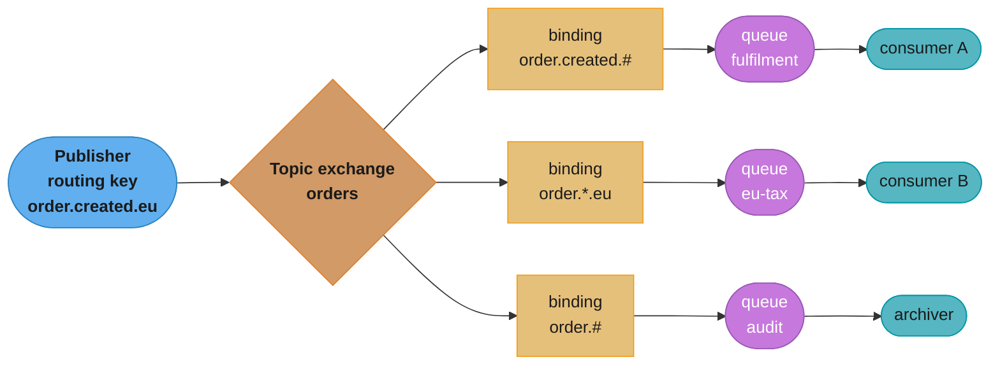
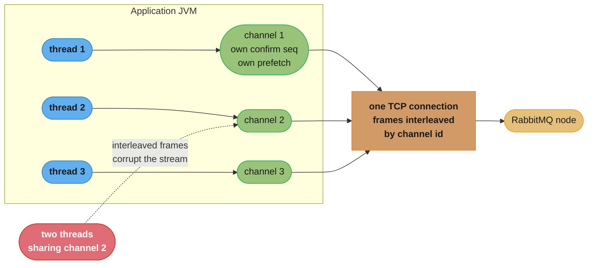
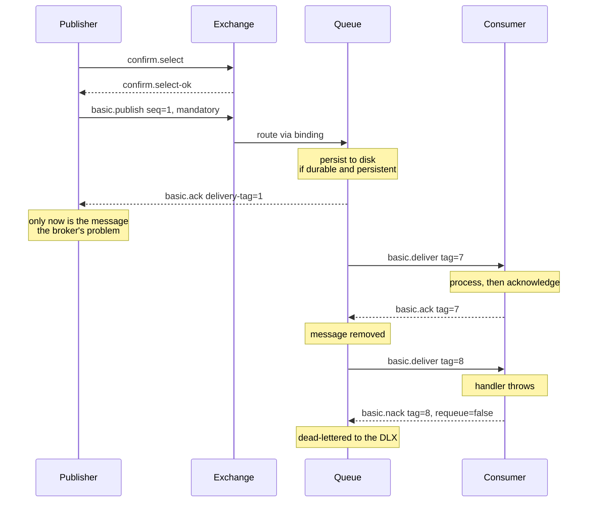
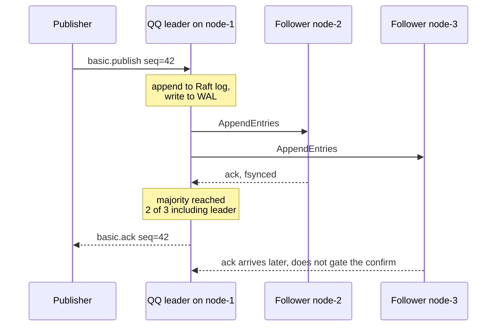
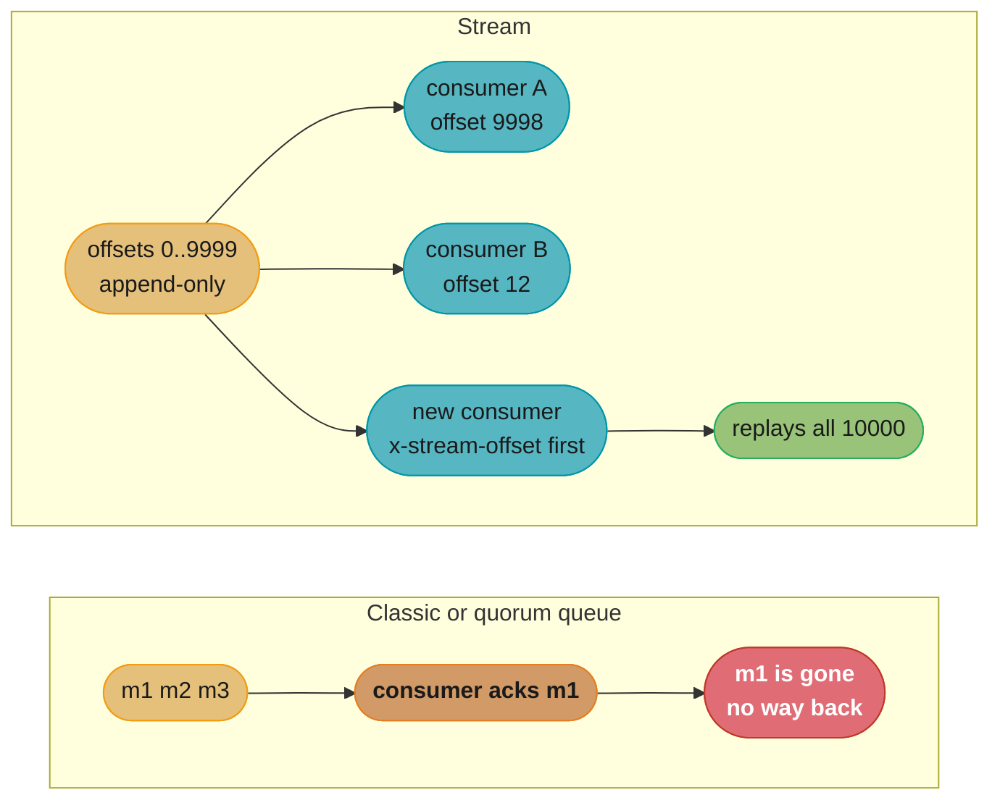
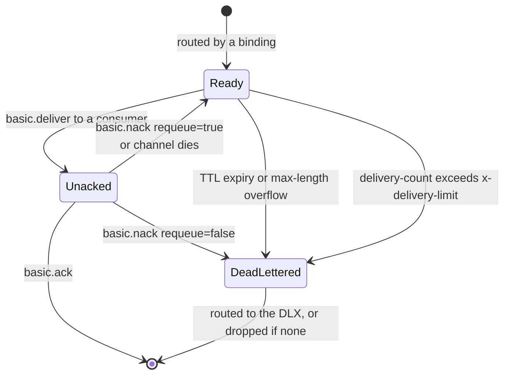
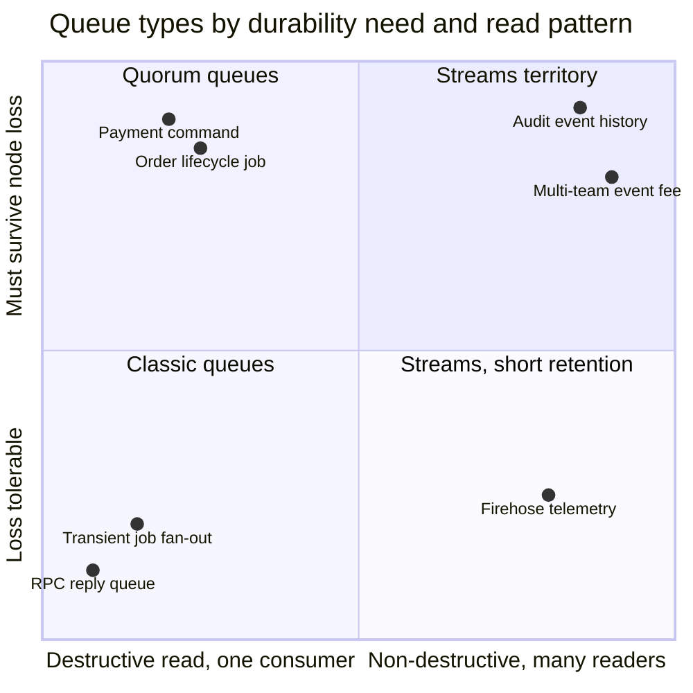
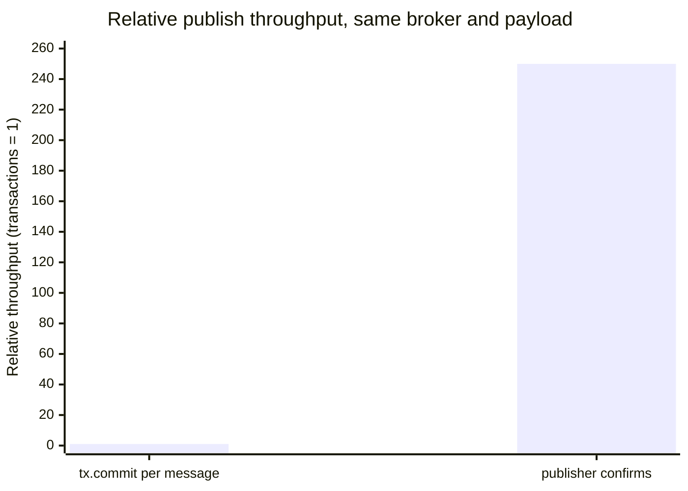
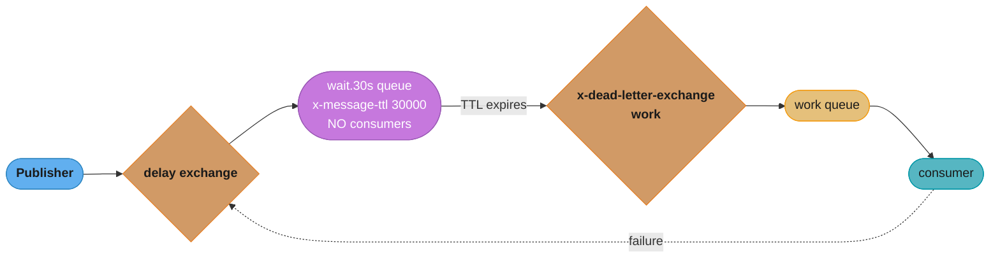

# RabbitMQ Deep Dive

---

## 1. Concept Overview

RabbitMQ is a message broker written in Erlang/OTP. Its native protocol is AMQP 0-9-1, a binary wire protocol whose defining idea is that **the producer never names a destination**. A publisher hands a message to an *exchange* together with a *routing key*; the exchange consults its *bindings* and decides which queues, if any, get a copy. Routing is broker-side configuration, changeable at runtime, invisible to the application code on either end.

That single design choice is the whole difference between RabbitMQ and a partitioned log. [Kafka](../kafka_deep_dive/kafka_deep_dive.md) is a dumb broker with a smart consumer: the broker appends bytes to a partition and the consumer owns its offset. RabbitMQ is a smart broker with a dumb consumer: the broker owns the routing table, tracks per-message delivery state, pushes messages to consumers, and remembers which of them have been acknowledged. Everything else — per-message TTL, dead-lettering, priorities, competing consumers without a partition count — falls out of the broker holding that state.

**This module targets RabbitMQ 4.3.x** (latest patch at time of writing: **4.3.4**, released 23 July 2026; the 4.2 series reached end of community support on 31 July 2026). The 4.x line is not a cosmetic increment over 3.13, and the changes matter enough that most RabbitMQ material written before September 2024 now teaches things the broker will refuse to do:

- **Classic queue mirroring was removed in 4.0.** There is no `ha-mode` policy any more. A classic queue is a single-node, non-replicated queue, full stop. Replication is quorum queues (Raft) or streams (Raft-replicated log).
- **Streams shipped in 3.9 and super streams in 3.11.** RabbitMQ has had non-destructive, replayable, offset-addressed reads for years. "RabbitMQ cannot replay" is a statement about *classic and quorum queues*, not about RabbitMQ.
- **Khepri replaced Mnesia.** Khepri became the default metadata store for new clusters in 4.2 and the *only* metadata store in 4.3. Mnesia is gone, and with it the entire `cluster_partition_handling` family — `ignore`, `pause_minority`, `autoheal`, `pause_if_all_down`. Those keys are still accepted in `rabbitmq.conf` and have **no effect**.
- **Classic queue storage v1 is gone.** CQv2 has been the storage engine since the 4.0 auto-migration; 4.3 removed the v1 code entirely, so declaring a queue with `x-queue-version: 1` or `x-queue-mode` now fails.
- **AMQP 1.0 is native.** In 3.13 it was a plugin that translated every AMQP 1.0 message into an AMQP 0-9-1 message and used roughly 15 Erlang processes per session; since 4.0 it is a first-class protocol using a single Erlang process per session, publishing straight to exchanges and consuming straight from queues.

The rest of this page is written against that broker, not the one in the tutorials.

---

## 2. Intuition

**One-line analogy:** RabbitMQ is a post office. You do not address an envelope to a mailbox; you address it to a *street address* and hand it to the sorting office, which owns the map from addresses to mailboxes and can be re-mapped without telling you.

**Mental model:** Picture three separate objects that people routinely collapse into one. The **exchange** is the sorting table — stateless, holds nothing, only routes. The **binding** is a rule taped to the table: "anything whose label matches `order.*.eu` goes into bin 7." The **queue** is the bin — it holds messages, it has an owner node, it has a length, it can fill up. A producer only ever sees the sorting table. A consumer only ever sees a bin. Neither knows the rules, and the rules can be rewritten while both are running.

Now add the accounting. When the post office hands an envelope to a courier, it does not forget the envelope: it keeps a carbon copy marked *out for delivery* until the courier signs for it (`basic.ack`). If the courier's van crashes (the TCP connection drops), every unsigned envelope goes back in the bin automatically. That per-message, per-consumer bookkeeping is what a log-based broker deliberately refuses to do, and it is exactly what buys you competing consumers, redelivery, and dead-lettering without a partition count.

**Why it matters:** most backend work is not "stream a firehose of events." It is "fan a job out to a pool of workers, retry it if a worker dies, give up after N attempts, and route it somewhere different when a header says `priority=platinum`." A partitioned log makes all four of those into application code. RabbitMQ makes them into broker configuration.

**Key insight:** RabbitMQ's cost and its capability are the same thing — **per-message state on the broker**. That state is why a message can be individually acknowledged, individually expired, individually dead-lettered and individually redelivered, and it is also why throughput per queue is bounded by a single Erlang process doing that bookkeeping. You do not scale a RabbitMQ queue by making it bigger; you scale it by having more of them, or by switching to a queue type that stopped doing the bookkeeping (streams).

---

## 3. Core Principles

**Producers publish to exchanges, never to queues.** The apparent exception — publishing with a queue name as the routing key — is the *default exchange*, a direct exchange with an implicit binding for every queue in the vhost. It is still an exchange.

**The connection is expensive; the channel is cheap.** One TCP connection carries many channels, each a virtual, independently flow-controlled session multiplexed over the same socket. Opening a connection per operation is the single most common RabbitMQ performance bug.

**Acknowledgement is per message, and it is the unit of delivery accounting.** A message delivered but not acknowledged is *unacked*: still owned by the queue, invisible to other consumers, automatically requeued if the channel or connection dies. Nothing in the system is offset-based except streams.

**Durability is three independent switches, and all three must be on.** A durable exchange, a durable queue, and a persistent message (`delivery_mode=2`, or `durable=true` in AMQP 1.0). Miss any one and the message does not survive a broker restart. Miss *publisher confirms* on top of that and you do not even know whether it made it to disk.

**Replication is Raft or nothing.** Quorum queues and streams replicate through Raft and require an online majority. Classic queues do not replicate at all. There is no third option since 4.0.

**Backpressure is built in and it is coarse.** When a node crosses the memory or disk watermark, a cluster-wide alarm blocks every *publishing* connection until the pressure clears. Consumers keep running. The broker's answer to overload is always "stop the producers," which means your publisher must be prepared to block on a socket write.

**The broker will not deduplicate for you.** RabbitMQ offers at-most-once and at-least-once. Exactly-once end-to-end does not exist here — or anywhere else, once a side effect leaves the broker's transaction boundary. Idempotent consumers are not optional; they are the design.

---

## 4. Types / Architectures / Strategies

### Exchange types

| Type | Routing decision | Typical use |
|------|------------------|-------------|
| `direct` | Binding key equals routing key, exact string match | Work distribution by job class; the default exchange is a direct exchange |
| `fanout` | Ignore the routing key, copy to every bound queue | Broadcast, cache invalidation, per-consumer private queues |
| `topic` | Dot-separated word pattern with `*` and `#` wildcards | Hierarchical event routing (`order.created.eu`) |
| `headers` | Match on message headers via `x-match: all` or `any`, routing key ignored | Content-based routing where the key would need too many dimensions |
| `x-consistent-hash` (plugin) | Hash the routing key or a header, distribute across bound queues by binding weight | Sharding one logical stream of work across N queues while keeping per-key ordering |
| `x-modulus-hash` (core since 4.3) | `hash(routing key) mod (number of bindings)`, ignoring weights | Deterministic sharding when you want Kafka-style partition arithmetic |
| `x-local-random` (plugin) | Pick one bound queue at random, preferring a local node | Latency-sensitive RPC where any worker will do |
| `x-delayed-message` (plugin) | Hold the message for `x-delay` ms, then route as the configured underlying type | Scheduled delivery without the TTL+DLX head-of-line trap |

Exchanges can also bind to *other exchanges* (exchange-to-exchange bindings), which is how you build a two-stage topology: one fanout that every service binds to for audit, feeding a topic exchange that does the real routing.

### Queue types — the whole list, as of 4.3

**Classic queues.** Single node, no replication, CQv2 storage. The queue lives on the node where it was declared; if that node is down, the queue is unavailable and (if durable) recovers when the node returns. Cheapest per-message cost, lowest latency, no data-safety story beyond the local disk. Correct choice for transient work, per-consumer reply queues, and anything you can afford to lose.

**Quorum queues.** Replicated FIFO queues built on Raft, introduced in 3.8 and the default recommendation since 4.0. A queue is a Raft cluster of members (default 3, via `x-quorum-initial-group-size`); one is the leader, the rest are followers. Every enqueue and every acknowledgement is a Raft log entry, committed once a majority has it on disk. Durable-only, no exclusive or server-named queues, no global QoS. This is what replaced mirrored classic queues.

**Streams.** An append-only, Raft-replicated log with **non-destructive reads**. Consuming does not delete; retention does. Consumers attach at an offset, a timestamp, or a relative interval and can rewind at will. Accessible over AMQP 0-9-1 (as a queue with `x-queue-type: stream`) or over the dedicated binary stream protocol, which is where the throughput and the server-side offset tracking live. **Super streams** partition a logical stream across several ordinary streams, giving Kafka-style scale-out with per-partition ordering.

**Streams are the reason "RabbitMQ cannot replay" is a false statement about the product.** It is a true statement about classic and quorum queues, which is a different sentence.

### Delivery-guarantee strategies

| Strategy | Publisher side | Consumer side | Guarantee |
|----------|----------------|---------------|-----------|
| Fire and forget | No confirms | `autoAck=true` | At most once, both ends |
| Safe consume only | No confirms | Manual ack after processing | At-least-once delivery, but publishes can vanish |
| Safe publish only | Publisher confirms | `autoAck=true` | Broker durability, consumer loss |
| Production default | Publisher confirms (async, windowed) | Manual ack after processing, bounded prefetch | At-least-once end to end; consumer must be idempotent |
| Transactional | `tx.select` / `tx.commit` | Manual ack | Same guarantee as confirms, ~250x lower publish throughput |

### Cluster topologies

- **Single node.** Legitimate for development and for genuinely disposable workloads. Everything is available until the node is not.
- **Three-node cluster, quorum queues.** The standard shape. Tolerates one node loss for both metadata (Khepri Raft) and data (quorum queue Raft). Odd node counts only — a four-node cluster tolerates exactly as many failures as a three-node one and costs more.
- **Five-node cluster.** Tolerates two simultaneous losses. Worth it when your maintenance window and your failure budget overlap.
- **Multi-cluster with Shovel or Federation.** Two independent clusters linked by a message-moving process, not a stretched cluster. The correct answer for cross-region, because a Raft quorum across regions puts a WAN round trip in every commit.

---

## 5. Architecture Diagrams

### The AMQP 0-9-1 object model



One publish produces three deliveries because three bindings match the same routing key. The publisher named none of the queues and does not know they exist; adding a fourth consumer is a binding change on the broker, not a deploy.

### Connections, channels, and where thread-safety lives



Three threads, three channels, one socket: legal and fast. Two threads on one channel is the bug — a publish is a *sequence* of frames (method, header, body) and a second thread interleaving its own frames on the same channel id corrupts the stream, which is why every client documents the channel as not thread-safe.

### Publisher confirms and consumer acknowledgements, end to end



Two independent accounting systems share one word. The publisher-side `basic.ack` means "the broker has taken responsibility"; the consumer-side `basic.ack` means "the application has finished with it." A delivery tag is scoped to a single channel and is never global.

### Quorum queue write path (Raft)



The confirm is released when a *majority* has the entry durably, not when all replicas do — which is why one slow node costs latency variance rather than availability, and why an even member count buys nothing.

### Stream reads are non-destructive; queue reads are not



In the top row acknowledgement is deletion. In the bottom row acknowledgement only moves a cursor, so three consumers sit at three unrelated offsets and a brand-new consumer can start from the beginning of retained history.

### Message lifecycle, including the poison-message exit



Four distinct paths reach the dead-letter exchange, and only one of them is an explicit reject — the other three fire without the application doing anything, which is why a DLQ that suddenly fills is as likely to be a TTL or a length limit as a bug in a handler.

### Choosing a queue type



The vertical axis is the only one that removes classic queues from consideration, and the horizontal axis is the only one that removes quorum queues. Most production disagreements about queue type are actually disagreements about which axis the workload sits on.

### Where the throughput actually goes



RabbitMQ's own documentation states that using AMQP 0-9-1 transactions to guarantee delivery decreases throughput by a factor of 250 compared with confirms. Both give the same durability guarantee; one of them costs a synchronous commit round trip per message.

---

## 6. How It Works — Detailed Mechanics

### The connection handshake and what gets negotiated

An AMQP 0-9-1 connection opens with a protocol header, then a `connection.start` / `connection.start-ok` SASL exchange, then `connection.tune` / `connection.tune-ok`, then `connection.open`. The tune step is where three limits are agreed: the maximum channel number, the maximum frame size, and the heartbeat interval. The rule is the same for all three: **if either side proposes 0 the larger value wins, otherwise the smaller wins** — so a client asking for "unlimited" gets whatever the server configured, and a client asking for a small value always gets it.

Heartbeats default to **60 seconds**, with frames sent roughly every half-interval (about every 30 s) and the peer declared unreachable after **two missed heartbeats**. The docs' guidance for most environments is a lower value, in the 5-20 second range, because 60 s means a dead TCP connection can hold unacked messages hostage for two minutes before the broker requeues them.

```java
ConnectionFactory factory = new ConnectionFactory();
factory.setHost("rabbit-1");
factory.setRequestedHeartbeat(20);           // seconds; server default is 60
factory.setConnectionTimeout(10_000);        // TCP connect timeout, ms
factory.setAutomaticRecoveryEnabled(true);   // reconnect and re-declare topology
factory.setNetworkRecoveryInterval(5_000);
factory.setTopologyRecoveryEnabled(true);    // re-declare exchanges/queues/bindings/consumers

// One connection per process, shared. NOT one per request.
Connection connection = factory.newConnection("order-service-publisher");
```

### Channels: what they are, and why one is not thread-safe

A channel is a lightweight virtual session multiplexed over the connection. Every frame carries a channel id, and the broker keeps per-channel state: the current prefetch window, the publisher-confirm sequence number, the transaction state, and the set of delivery tags currently outstanding. Channels are cheap on the wire and *not free on the broker* — each one is Erlang processes and memory — so both extremes are wrong. Opening a channel per message is churn; RabbitMQ's own guidance is that a channel-open rate consistently above **100/second** signals bad connection management, and `channel_max` plus `channel_max_per_node` exist to cap the damage.

The non-thread-safety is structural, not an implementation detail. Publishing one message means writing three frames in order on the same channel id:

```
+---------------------------+
| Method frame              |  basic.publish (exchange, routing key, flags)
+---------------------------+
| Content header frame      |  body size, delivery_mode, headers, expiration
+---------------------------+
| Content body frame(s)     |  payload, split at the negotiated frame_max
+---------------------------+
```

If two threads publish on one channel, their frames interleave and the broker sees a header frame where it expected a body frame. It closes the connection with a framing error. Nothing in the protocol lets the broker recover, and nothing in the client can serialise it for you without becoming a lock that destroys the concurrency you wanted. The rule is one channel per thread, or a channel pool with strict checkout.

The second, subtler reason: **prefetch and confirm sequence numbers are per channel**. Two consumers sharing a channel share one prefetch window, so a bounded prefetch of 50 means 50 across both, not 50 each — and one slow consumer starves the other.

### The default exchange, and why "publishing to a queue" is a lie

Every vhost has a nameless direct exchange to which every queue is automatically bound using its own name as the binding key. So this:

```java
channel.basicPublish("", "email.outbound", props, body);
```

is not "publish to queue `email.outbound`." It is "publish to the default exchange with routing key `email.outbound`, which happens to have an implicit binding to the queue of that name." The distinction bites in exactly one place and it is a place people hit: **you cannot bind anything to the default exchange, and you cannot change its behaviour.** The moment you want a second consumer of the same message, you have to introduce a real exchange, and every publisher has to change. Publishing through a named exchange from day one costs nothing and keeps that door open.

### Topic-exchange binding-key matching, step by step

Routing keys for topic exchanges are dot-separated words, up to 255 bytes total. Binding keys use the same shape with two wildcards:

- `*` matches **exactly one** word.
- `#` matches **zero or more** words.

Match the routing key `order.created.eu.priority` against a binding table:

```
routing key:  order . created . eu . priority
              ------  --------- ---- ----------
                w1       w2      w3      w4

  binding key                 matches?  why
  --------------------------  --------  -------------------------------------
  order.created.eu.priority   yes       exact string equality
  order.#                     yes       # absorbs w2 w3 w4
  order.*.eu.*                yes       * = created, * = priority
  order.*                     NO        * is exactly one word, w2..w4 remain
  #.priority                  yes       # absorbs w1 w2 w3, then priority
  order.created.#             yes       # absorbs eu and priority
  order.#.priority            yes       # absorbs created and eu
  #                           yes       # absorbs everything; a fanout in disguise
  order.created               NO        binding is shorter, no wildcard to absorb
```

The trap in that table is line 4. `order.*` looks like a prefix match and is not one; `*` is *exactly* one word, so `order.*` matches `order.created` and never matches `order.created.eu`. Teams reach for `order.*` intending "all order events," get partial routing in production, and conclude the exchange is broken. The prefix match is `order.#`.

Internally, RabbitMQ evaluates this against a trie rather than testing every binding. Under Khepri, 4.3 replaced the topic routing projection with a trie backed by an `ordered_set` ETS table (projection v4), which is what makes topic exchanges with tens of thousands of bindings viable rather than merely legal.

### Headers exchanges and `x-match`

A headers exchange ignores the routing key entirely and matches on the message's header table. The binding carries an `x-match` argument:

- `x-match: all` — every non-`x-` header in the binding must be present in the message with an equal value (logical AND).
- `x-match: any` — at least one must match (logical OR).
- `x-match: all-with-x` / `any-with-x` — same, but headers whose names begin with `x-` are also considered.

```java
Map<String, Object> binding = new HashMap<>();
binding.put("x-match", "all");
binding.put("region", "eu");
binding.put("tier", "platinum");
channel.queueBind("eu-platinum", "orders-headers", "", binding);
// A message with headers {region=eu, tier=platinum, source=web} matches.
// A message with headers {region=eu} does not.
```

Headers exchanges are the right answer when the routing dimensions are genuinely independent (region × tier × channel) and encoding them into a dotted key would produce a combinatorial explosion of binding patterns. They are slower than topic exchanges — there is no trie, matching is a scan of the binding set — so do not reach for one when a topic key would do.

### Publisher confirms: the protocol, not the API

`confirm.select` puts a channel into confirm mode. From then on every published message gets a monotonically increasing sequence number on that channel, and the broker replies `basic.ack` once it has taken responsibility: for a transient message that means routed and enqueued; for a persistent message on a durable queue it means written to disk; for a quorum queue it means committed by a Raft majority. A `basic.nack` means the broker could not take responsibility — the message is lost and it is your job to republish.

Confirms are **asynchronous and can be batched**: the `multiple` flag on an ack means "and every sequence number below this one." That is what makes them fast, and it is what makes the naive usage slow:

```java
// SLOW - one synchronous round trip per message. This is confirms used as if
// they were transactions, and it throws away most of the 250x advantage.
channel.confirmSelect();
for (Order o : orders) {
    channel.basicPublish("orders", key(o), PERSISTENT, serialize(o));
    channel.waitForConfirmsOrDie(5_000);
}
```

```java
// FAST - asynchronous, windowed. Track outstanding sequence numbers, retire them
// on ack, republish on nack, and bound the window so memory cannot run away.
channel.confirmSelect();
ConcurrentNavigableMap<Long, Order> outstanding = new ConcurrentSkipListMap<>();

channel.addConfirmListener(
    (seqNo, multiple) -> {                      // ack
        if (multiple) outstanding.headMap(seqNo, true).clear();
        else outstanding.remove(seqNo);
    },
    (seqNo, multiple) -> {                      // nack - broker refused responsibility
        Collection<Order> lost = multiple
            ? outstanding.headMap(seqNo, true).values()
            : List.of(outstanding.get(seqNo));
        lost.forEach(this::republishWithBackoff);
        if (multiple) outstanding.headMap(seqNo, true).clear();
        else outstanding.remove(seqNo);
    });

for (Order o : orders) {
    while (outstanding.size() >= MAX_INFLIGHT) Thread.onSpinWait();  // bound the window
    long seq = channel.getNextPublishSeqNo();
    outstanding.put(seq, o);
    channel.basicPublish("orders", key(o), PERSISTENT, serialize(o));
}
channel.waitForConfirmsOrDie(30_000);   // drain at the end of the batch
```

The `MAX_INFLIGHT` bound is the part people omit. Without it, a broker that stops confirming (memory alarm) lets the publisher buffer the entire backlog in `outstanding` until the JVM dies — the broker's backpressure reaches your socket but never reaches your data structure.

### Transactions, and where the 250x comes from

AMQP 0-9-1 has real transactions: `tx.select`, then publishes and acks, then `tx.commit` or `tx.rollback`. They are rarely the right tool. RabbitMQ's documentation states plainly that using them to guarantee delivery is "unnecessarily heavyweight and decrease throughput by a factor of 250."

The mechanism explains the number. A `tx.commit` is a **synchronous round trip that fsyncs**: the publisher blocks until the broker has durably committed everything in the transaction and replied `tx.commit-ok`. There is no pipelining and no batching across transactions, so the achievable rate is bounded by `1 / (network RTT + fsync latency)` — with a 1 ms RTT and a 3 ms fsync that is about 250 messages per second per channel regardless of how fast the broker is. Confirms invert this: publish continuously, let acks stream back out of order and in batches, and the rate is bounded by throughput rather than latency.

Two further limitations make transactions the wrong default even when the rate is acceptable. They are **per channel**, so they cannot span a publish and a database write; and they do **not** span multiple RabbitMQ nodes, so they are not distributed transactions. If you need atomicity between your database and your broker, the answer is the [transactional outbox](../messaging_patterns/messaging_patterns.md), not `tx.select`.

### The mandatory flag, `basic.return`, and alternate exchanges

A message published to an exchange with **no matching binding is silently discarded**. This is by design and it is the most common "my message vanished" incident. Two mechanisms surface it:

```java
// 1. mandatory=true - broker returns the message instead of dropping it
channel.addReturnListener((replyCode, replyText, exchange, routingKey, props, body) ->
    log.error("unroutable: exchange={} key={} reason={}", exchange, routingKey, replyText));
channel.basicPublish("orders", "order.created.mars", true /* mandatory */, PERSISTENT, body);
```

```java
// 2. alternate-exchange - broker routes unroutable messages to a catch-all instead
Map<String, Object> args = Map.of("alternate-exchange", "orders.unrouted");
channel.exchangeDeclare("orders", "topic", true, false, args);
channel.exchangeDeclare("orders.unrouted", "fanout", true);
channel.queueDeclare("orders.unrouted.q", true, false, false, null);
channel.queueBind("orders.unrouted.q", "orders.unrouted", "");
```

Use both. `mandatory` tells the publisher immediately; the alternate exchange keeps the payload for forensics. Note the interaction with confirms: an unroutable message is still **acked** by the broker, because "I took responsibility and decided it goes nowhere" is a successful outcome from the protocol's point of view. A confirm listener alone will never tell you about a routing-key typo.

### Consumer acknowledgements: ack, nack, reject, and the `multiple` flag

| Method | Meaning | `multiple` / `requeue` |
|--------|---------|------------------------|
| `basic.ack` | Processed successfully, remove it | `multiple=true` acks every outstanding tag up to and including this one |
| `basic.nack` | Failed | `multiple` supported; `requeue=true` puts it back, `requeue=false` dead-letters or drops it |
| `basic.reject` | Failed, single message only | No `multiple`; `requeue` as above |
| `basic.recover` | Redeliver everything unacked on this channel | Blunt; used on reconnect paths |

`basic.nack` is a RabbitMQ extension to AMQP 0-9-1 — `basic.reject` is the standard method and lacks the `multiple` flag, which is the entire reason `nack` exists.

The important operational fact: **an unacked message is not lost and not available.** It sits in the queue's unacked set, counted separately from `messages_ready`, invisible to every other consumer, until either an ack/nack arrives, the channel or connection closes (automatic requeue), or `consumer_timeout` fires. A consumer that forgets to ack does not crash; it silently drains the queue into a limbo set and the queue stops delivering once the prefetch window fills.

### `consumer_timeout`, and what a long handler costs you

If a consumer does not acknowledge a delivery within `consumer_timeout` — **default 30 minutes (1,800,000 ms)** — the broker closes that channel with a `PRECONDITION_FAILED` error and requeues every delivery outstanding on it. Not just the slow one: *every* delivery on that channel, including the ones the consumer had already finished but not yet acked.

That is a duplicate-processing amplifier. A handler that takes 35 minutes with a prefetch of 100 loses the channel and redelivers up to 100 messages, most of which were already processed. The fixes, in order of preference: make the handler faster; reduce prefetch so fewer messages are collateral; move the long work off the delivery thread and ack immediately with your own state tracking; and only then raise `consumer_timeout`. Raising it globally is a config that hides the shape of your workload from you.

```ini
# rabbitmq.conf - raise only with a reason you can state
consumer_timeout = 3600000   # 1 hour, in milliseconds
```

### Prefetch (`basic.qos`) arithmetic

`basic.qos(prefetch)` caps the number of *unacknowledged* deliveries the broker will push to a channel (or, with `global=true`, share across the connection — a mode quorum queues do not support at all). It is the only flow-control knob most applications ever need, and both extremes are pathological.

```
  prefetch = 0 (default: unlimited)
    Broker pushes the entire queue at the first consumer that connects.
    That consumer buffers everything in memory; the second consumer gets nothing.
    Consumer OOMs, connection drops, all of it requeues, repeat.

  prefetch = 1
    Perfectly fair: no consumer holds a second message until it acks the first.
    Also serial: every message costs a full network round trip before the
    next one is even sent. On a 1 ms RTT link the ceiling is ~1000 msg/s
    per consumer no matter how fast the handler is.

  prefetch = 100..300  (RabbitMQ's documented guidance for optimal throughput)
    The broker keeps the consumer's pipeline full while the ack for message N
    is still in flight, so the round trip is amortised.
```

Size it from latency, not from taste:

```
  prefetch >= (round-trip latency + processing time) / processing time

  Example - fast handler, ordinary network:
    processing time = 2 ms, RTT = 1 ms
    prefetch >= (1 + 2) / 2 = 1.5  ->  2 keeps the pipe full,
    but round it up generously; 100 costs almost nothing at 2 ms handlers.

  Example - slow handler, external HTTP call:
    processing time = 2 s, RTT = 1 ms
    prefetch >= (0.001 + 2) / 2 = 1.0005  ->  prefetch 1 or 2 is CORRECT here.
    A prefetch of 250 would park 249 messages in one worker's memory for
    over 8 minutes while its peers idle - and blow consumer_timeout.
```

**The fairness failure is the one that reaches production.** Spring AMQP's listener containers default to `DEFAULT_PREFETCH_COUNT = 250`. With ten workers and a burst of 500 messages, the first two workers to connect take all 500 and the other eight sit idle — the broker cannot know the first worker is slow, only that its window is not full. Symptom: queue depth falls slowly, CPU on eight pods is flat, and adding pods changes nothing.

### Classic queues today: CQv2, non-replicated, and the "lazy" question

The classic queue you get in 4.3 is not the one most blog posts describe.

**There is no mirroring.** `ha-mode`, `ha-params`, `ha-sync-mode` policies were removed in 4.0. A classic queue has exactly one copy, on one node.

**There is only CQv2.** Version 1 storage was auto-migrated on upgrade to 4.0 and the code was removed in 4.3; declaring a queue with `x-queue-version: 1` now fails. CQv2 stores messages in per-queue segment files with a separate message store for larger payloads, rather than embedding everything in the index.

**"Lazy mode" is no longer a mode.** `x-queue-mode: lazy` was the old way to say "do not keep message bodies in memory, page them to disk immediately." CQv2's behaviour is effectively that by default — bodies go to disk and are not held in RAM waiting to be consumed — so the argument became redundant and was removed with CQv1; setting `x-queue-mode` now fails the declare. The practical consequence is a good one: a classic queue that grows to millions of messages no longer produces the memory-alarm cliff that made lazy queues necessary in the first place. It also means the old performance advice "turn lazy off for low-latency queues" no longer has a switch to flip.

**Transient queues are being retired too.** Non-durable, non-exclusive queues are a deprecated feature that 4.3 **rejects by default**. Permitting them requires `deprecated_features.permit.transient_nonexcl_queues = true` on every node plus a restart, which is a strong hint to stop declaring them.

### Quorum queues: the Raft log, the WAL, and segment files

A quorum queue is a Raft cluster. Declaring one creates *members* — default 3, set with `x-quorum-initial-group-size` — one of which is elected leader. Enqueues, acknowledgements, and returns are all Raft log entries.

```java
Map<String, Object> args = new HashMap<>();
args.put("x-queue-type", "quorum");
args.put("x-quorum-initial-group-size", 3);
args.put("x-delivery-limit", 5);                    // poison-message cap; default is 20
args.put("x-dead-letter-exchange", "orders.dlx");
args.put("x-dead-letter-strategy", "at-least-once"); // requires x-overflow reject-publish
args.put("x-overflow", "reject-publish");
channel.queueDeclare("orders.processing", true, false, false, args);
```

The write path has two disk stages. Entries land first in the **write-ahead log**, shared by all Raft clusters on the node — one sequential append stream, which is what lets many quorum queues share one disk efficiently. When the current WAL file reaches its limit (**512 MB** by default) it is flushed into per-queue segment files. RabbitMQ's guidance is to size RAM at **at least 3x the effective WAL size**, because the WAL is memory-mapped and the flush needs headroom.

That WAL is also why quorum queues changed the fsync story. Mirrored classic queues fsynced per queue, so N busy queues meant N interleaved fsync streams fighting the same device. Quorum queues batch many queues' entries into one sequential WAL, so a quorum queue is often *faster* than a mirrored classic queue for durable, confirmed, acknowledged workloads even though it does strictly more work per message. The catch is the flip side: quorum queues write **everything** to disk before doing anything else, so disk latency is directly in the publish-confirm path. Slow disks show up as latency variance, not as errors.

### Quorum queue memory: not what people expect

The persistent myth is "quorum queues are memory hungry." The reality is the opposite of the old mirrored-queue behaviour, and the number is small and predictable.

**Quorum queues never keep message bodies in memory.** What they hold is an in-memory index: roughly **32+ bytes of metadata per message, independent of message size**. The documented rule of thumb is **at least 1 MB of memory for every 30,000 messages** in the queue.

```
  10,000,000 messages backed up in a quorum queue, 10 KB each:

    body memory   = 0 bytes            (bodies are on disk, always)
    index memory  = 10,000,000 / 30,000 x 1 MB
                  ~= 333 MB per member

  The same 10 million messages in a pre-4.0 mirrored classic queue would have
  fought the memory watermark on every mirror. This is why "quorum queues use
  more memory" is backwards: they use bounded, size-independent memory, and
  a classic queue's memory use tracked the payload.
```

4.3 improved this further with compact message references in the new (8th) version of the quorum queue state machine, roughly halving per-message overhead, along with recovery snapshots and snapshot throttling. The practical planning rule stands: **budget quorum queue memory against message count, never against message bytes** — and treat a deep queue as an index-memory problem, not a payload problem.

Two constraints follow from the Raft design and surprise people: quorum queues cannot be non-durable, exclusive, or server-named, and they do not support **global QoS** (`basic.qos` with `global=true`). Client libraries that set global QoS by default will fail against a quorum queue.

### Poison messages: `x-delivery-limit` and `delivery-count`

A message that always fails is a poison message, and with `requeue=true` it loops forever, blocking the queue head and burning CPU. Quorum queues solve this in the broker: every delivery increments a `delivery-count` stored in the Raft log, and when it exceeds `x-delivery-limit` the message is dead-lettered (or dropped if there is no DLX).

**Since 4.0 the default `x-delivery-limit` is 20**, and it is based on `delivery-count` rather than the older `acquired-count`. Setting `-1` disables the limit, which the docs advise against for the obvious reason.

```java
// BROKEN - infinite redelivery loop. The message has a malformed date; every
// consumer in the pool picks it up, throws, requeues it, and picks it up again.
// The queue never drains and the DLQ stays empty because nothing rejects it.
try {
    process(msg);
    channel.basicAck(tag, false);
} catch (Exception e) {
    channel.basicNack(tag, false, true);   // requeue=true, unconditionally
}
```

```java
// FIXED - distinguish retryable from permanent, and let the broker cap the rest.
try {
    process(msg);
    channel.basicAck(tag, false);
} catch (TransientException e) {
    channel.basicNack(tag, false, true);   // genuinely worth retrying
} catch (Exception e) {
    channel.basicNack(tag, false, false);  // permanent: straight to the DLX
}
// plus, on the queue: x-delivery-limit = 5, so even a mis-classified
// TransientException cannot loop more than five times.
```

4.3 added **delayed retry for quorum queues** with configurable increasing backoff, which removes the last reason to build a retry ladder out of TTL queues for this queue type.

Classic queues have no delivery limit. If you are on classic queues, the cap has to live in your consumer — count redeliveries in a header, or track them externally.

### Dead-letter exchanges and the four reasons

A queue with `x-dead-letter-exchange` republishes messages to that exchange when any of four things happen, recorded in the `x-death` header array:

| Reason | Trigger |
|--------|---------|
| `rejected` | `basic.nack` or `basic.reject` with `requeue=false` |
| `expired` | Per-message TTL (`expiration`) or queue TTL (`x-message-ttl`) elapsed |
| `maxlen` | Queue hit `x-max-length` or `x-max-length-bytes` with `x-overflow: drop-head` or `reject-publish-dlx` |
| `delivery_limit` | `delivery-count` exceeded `x-delivery-limit` (quorum queues) |

The routing key is preserved unless `x-dead-letter-routing-key` overrides it, which is what makes the DLX-loop mistake so easy: if your DLX is a fanout and your DLQ is also configured to dead-letter to that same exchange, a rejected message cycles forever. Give the DLQ no DLX of its own.

Dead-lettering is **at-most-once by default** — the republish to the DLX is not transactional with the removal from the source queue, so a node failure at the wrong moment loses the message. Quorum queues support `x-dead-letter-strategy: at-least-once`, which makes the hand-off durable at the cost of requiring `x-overflow: reject-publish` on the source queue.

### The TTL + DLX delay trick, and the trap in it

The classic way to schedule a message for later delivery, with no plugin:



A message published into `wait.30s` has no consumer, expires after 30 s, and is dead-lettered into the real work queue. Chain queues with 30 s / 5 min / 30 min TTLs and you have an exponential-backoff retry ladder built entirely from broker configuration.

**The trap: message TTL in a queue is evaluated at the head only.** Messages leave the queue in publish order, so a message with a 30-second TTL sitting behind a message with a 30-minute TTL waits 30 minutes. Per-message `expiration` values in a shared delay queue therefore do not work the way the name suggests. Two correct patterns:

1. **One queue per delay tier** with a queue-level `x-message-ttl` — every message in a given queue has the same TTL, so head-of-line ordering is also TTL ordering. This is the pattern in the diagram.
2. **The `rabbitmq_delayed_message_exchange` plugin**, which holds messages in the exchange with an `x-delay` header and releases each at its own time, correctly and independently. Note its limitation: delayed messages live on one node's disk in the exchange, so they do not replicate — a node loss loses the pending schedule.

For quorum queues on 4.3, prefer the new native delayed retry over either of these for the *retry* use case; keep TTL+DLX or the plugin for genuine business scheduling.

### Streams: the log-based queue type

A stream is declared like any other queue and is an entirely different data structure underneath — an append-only, Raft-replicated log with retention rather than consumption-driven deletion.

```java
Map<String, Object> args = new HashMap<>();
args.put("x-queue-type", "stream");
args.put("x-max-length-bytes", 20_000_000_000L);   // 20 GB retention cap
args.put("x-max-age", "7D");                        // or age-based: Y M D h m s
args.put("x-stream-max-segment-size-bytes", 500_000_000L);
channel.queueDeclare("events.orders", true, false, false, args);
```

Reading over AMQP 0-9-1 requires two things people forget, and the broker enforces both: **a prefetch must be set** (an unbounded QoS against a stream would push the entire log), and **the consumer must be in manual-ack mode**.

```java
channel.basicQos(100);                        // mandatory for stream consumers
Map<String, Object> consumerArgs = new HashMap<>();
consumerArgs.put("x-stream-offset", "first"); // first | last | next | <long> | <timestamp> | "1h"
channel.basicConsume("events.orders", false, consumerArgs, deliverCallback, cancelCallback);
```

`x-stream-offset` is the replay control:

| Value | Starts at |
|-------|-----------|
| `first` | The oldest message still retained |
| `last` | The start of the last written chunk |
| `next` | Only messages written from now on (this is the default) |
| A long, e.g. `4500` | That absolute offset |
| A timestamp | The first message written at or after that POSIX time |
| An interval string, e.g. `"1h"`, `"7D"` | Relative to now |

Here the consumer's `basic.ack` does **not** delete anything. It advances a cursor and refreshes the prefetch credit. Deletion happens only through retention (`x-max-age`, `x-max-length-bytes`), which means a stream's disk usage is a *capacity decision you make up front*, not an emergent property of consumer health. A stopped consumer on a stream costs you nothing; a stopped consumer on a queue eventually costs you the queue.

Over the dedicated **stream protocol** you additionally get server-side offset tracking (the broker stores each named consumer's offset inside the stream itself as non-message data), much higher throughput than AMQP 0-9-1 framing allows, and — since 4.2 — SQL-like server-side **filter expressions**, so a selective consumer stops pulling messages it will discard.

### Super streams: partitioning a stream

A super stream is a logical stream made of N ordinary streams, each on a different node. The producer picks a partition by routing key hash; each partition preserves order; a consumer group with **single active consumer** gets exactly one consumer per partition. This is Kafka's partition model, arrived at from the other direction, and it is available since 3.11.

```
  super stream "orders" with 3 partitions
  ---------------------------------------
    hash(customer-7) % 3 = 0  ->  orders-0   (node-1)  ordered
    hash(customer-2) % 3 = 1  ->  orders-1   (node-2)  ordered
    hash(customer-9) % 3 = 2  ->  orders-2   (node-3)  ordered

  Consumer parallelism ceiling = 3, exactly as with Kafka partitions.
  Ordering guarantee = per partition, exactly as with Kafka partitions.
  Repartitioning later rehashes keys, exactly as with Kafka partitions.
```

If you find yourself designing a super stream, stop and price a comparison against Kafka honestly — you have chosen the shape of problem Kafka was built for. The reasons to stay are real, though: you already run RabbitMQ, the same broker also serves your task queues and RPC, and you want AMQP routing in front of the log.

### Queue length limits and overflow behaviour

An unbounded queue is a disk-exhaustion incident waiting for a consumer outage. Two caps and three overflow behaviours bound it:

```java
Map<String, Object> args = new HashMap<>();
args.put("x-queue-type", "quorum");
args.put("x-max-length", 1_000_000);                 // message count cap
args.put("x-max-length-bytes", 2_000_000_000L);      // total payload cap; whichever hits first
args.put("x-overflow", "reject-publish");            // drop-head | reject-publish | reject-publish-dlx
channel.queueDeclare("orders.processing", true, false, false, args);
```

| `x-overflow` | Behaviour at the cap | Who finds out |
|--------------|----------------------|---------------|
| `drop-head` (default) | Silently discard the **oldest** message to make room | Nobody, unless a DLX is configured — dead-letter reason `maxlen` |
| `reject-publish` | Refuse the new message; the publisher gets a `basic.nack` | The publisher, immediately, if confirms are on |
| `reject-publish-dlx` | Refuse the new message *and* dead-letter it | The publisher and the DLQ |

The default is the dangerous one for business data: `drop-head` throws away the *oldest* message, which in a FIFO work queue is the one that has been waiting longest and is most likely to be someone's overdue order. For anything that matters, use `reject-publish` and let backpressure reach the publisher, where it can be handled. `drop-head` is correct for exactly one shape of workload — a metrics or telemetry stream where the newest sample supersedes the oldest.

Note the interaction with quorum queues: `x-dead-letter-strategy: at-least-once` requires `x-overflow: reject-publish`, because a durable dead-letter hand-off cannot coexist with silently dropping the head.

### Priorities, and why a large `x-max-priority` is a mistake

A classic queue declared with `x-max-priority: N` maintains N internal sub-queues and delivers from the highest non-empty one. Quorum queues support priorities too, and 4.3's new state machine added strict priority handling with per-priority message counts, correct redelivery ordering, and priority-aware expiration.

The mistake is treating the priority range like a scheduling score:

```
  x-max-priority = 255        -> the queue maintains 255 internal structures.
                                 Per-message cost and memory both rise, and you
                                 will never use more than a handful of levels.

  x-max-priority = 5          -> the sane range. RabbitMQ's own guidance is a
                                 small number of levels.

  x-max-priority = 0/absent   -> plain FIFO, cheapest.
```

Two behaviours surprise people regardless of the range. **Priority does not preempt.** A message already delivered to a consumer stays there; a newly-arrived priority-10 message waits behind whatever is in flight, so with a prefetch of 250 it waits behind up to 250 low-priority messages. **Priority does not apply across queues.** If high-priority work matters, the more reliable design is a separate queue with its own dedicated consumers, not a priority level inside a shared one — that way the high-priority path has its own capacity rather than competing for the same prefetch window.

### Policies versus queue arguments, and which one wins

The same setting can be applied two ways, and the difference matters at 3am.

**Queue arguments** (`x-message-ttl`, `x-max-length`, `x-dead-letter-exchange`, …) are set at declare time and are **immutable**. Changing one means deleting and recreating the queue, which means draining it first.

**Policies** match queues by a name pattern and apply settings at runtime, to existing queues, without a redeclare:

```bash
rabbitmqctl set_policy dlx-all "^orders\." \
  '{"dead-letter-exchange":"orders.dlx","max-length":1000000,"overflow":"reject-publish"}' \
  --apply-to queues --priority 10
```

Note the naming: in a policy the key is `dead-letter-exchange`, without the `x-` prefix. Two rules decide the outcome when both exist:

1. **Only one policy applies to a queue** — the matching one with the highest `priority`. Policies do not merge. A second policy that matches the same queue with a lower priority contributes nothing, which is the most common "my policy is not working" cause.
2. **Where a queue argument and a policy set the same thing, the queue argument wins.** So a queue declared with `x-max-length: 1000` ignores a policy setting `max-length: 1000000` forever, silently.

And the setting that cannot be policied at all: **`x-queue-type`**. A queue's type is fixed at declaration. There is no policy, no `rabbitmqctl` command and no management-UI button that converts a classic queue to a quorum queue — the migration is always declare-new, move-consumers, move-publishers, delete-old. Setting `default_queue_type` on a vhost changes what *new* queues get when the client does not specify, which is worth doing on day one and does nothing for what already exists:

```bash
rabbitmqctl update_vhost_metadata / --default-queue-type quorum
```

### Direct reply-to: RPC without a reply queue

Request/reply over a message broker normally needs a reply destination, and both obvious ways to get one are bad: a temporary queue per request produces exactly the topology churn that makes brokers slow, and one shared reply queue means every client receives and filters every other client's replies.

Direct reply-to removes the queue entirely. The client consumes from the pseudo-queue `amq.rabbitmq.reply-to` and sets that as the `reply_to` property; the broker routes the responder's reply straight back to the requesting channel.

```java
// Requester
String replyTo = "amq.rabbitmq.reply-to";
channel.basicConsume(replyTo, true /* auto-ack is REQUIRED here */, (tag, delivery) -> {
    String correlationId = delivery.getProperties().getCorrelationId();
    pending.remove(correlationId).complete(delivery.getBody());
}, tag -> {});

AMQP.BasicProperties props = new AMQP.BasicProperties.Builder()
    .replyTo(replyTo)
    .correlationId(UUID.randomUUID().toString())
    .expiration("5000")            // per-message TTL, so an abandoned request self-cleans
    .build();
channel.basicPublish("", "rpc.pricing", props, request);
```

Three constraints, all of which are correct for RPC and wrong for anything else. Consumption must be in **auto-ack mode**. Replies are **never persistent** and are lost if the requesting client disconnects. And the responder must publish the reply to the default exchange with the `reply_to` value as the routing key — which it should do without inspecting it, because treating `reply_to` as an arbitrary routing key from an untrusted client is a routing-injection hazard. RabbitMQ 4.2 extended direct reply-to to AMQP 1.0, so an AMQP 1.0 client can now do cross-protocol RPC against an AMQP 0-9-1 responder.

### Message properties the broker actually reads

Most of the AMQP 0-9-1 property table is opaque metadata that RabbitMQ carries and never inspects. Five entries are different, and confusing the two groups causes real bugs:

| Property | Broker behaviour |
|----------|------------------|
| `delivery_mode` | **Read.** `2` = persistent, `1` = transient. This is the message half of the three durability switches |
| `expiration` | **Read.** Per-message TTL in milliseconds, as a *string*. Subject to the head-of-queue evaluation trap |
| `priority` | **Read.** Only meaningful on a queue declared with `x-max-priority` |
| `user_id` | **Read and validated.** If set, it must equal the connection's authenticated username or the broker rejects the publish with `PRECONDITION_FAILED` |
| `reply_to` | **Read** only in the direct reply-to case; otherwise it is a convention between your services |
| `content_type`, `content_encoding`, `correlation_id`, `message_id`, `timestamp`, `type`, `app_id`, `headers` | **Opaque.** Carried verbatim, never interpreted (except `headers`, which a headers exchange matches on) |

`user_id` is the one worth knowing about because it fails closed. A service that copies properties from an inbound message onto an outbound one — a common pattern in relays and retry handlers — will propagate the original publisher's `user_id` and get rejected the moment the two connections authenticate as different users. Strip it, or set it deliberately.

`expiration` being a string is the other one. `props.expiration("60000")` is correct; passing an integer through a client that does not coerce it produces a message the broker refuses.

### Sharding a hot queue with a consistent-hash exchange

One queue is one Erlang process. When that process saturates, no number of consumers helps — the ceiling is the queue itself. The fix is to make more queues and route deterministically across them, which the consistent-hash exchange does while preserving per-key ordering:

```bash
rabbitmq-plugins enable rabbitmq_consistent_hash_exchange
```

```java
// The exchange hashes the routing key (or a header, with hash-header) and picks
// a bound queue by weight. Same key -> same queue -> ordering preserved per key.
Map<String, Object> exArgs = Map.of("hash-header", "customer-id");
channel.exchangeDeclare("orders.sharded", "x-consistent-hash", true, false, exArgs);

for (int i = 0; i < 8; i++) {
    Map<String, Object> qArgs = Map.of("x-queue-type", "quorum", "x-delivery-limit", 5);
    channel.queueDeclare("orders.shard." + i, true, false, false, qArgs);
    channel.queueBind("orders.shard." + i, "orders.sharded", "1");  // binding key = weight
}
```

The binding key is a **weight**, not a pattern — `"1"` on every binding means equal distribution, and `"2"` on one gives it twice the share. `x-modulus-hash`, which moved from the sharding plugin into core in 4.3, does the simpler thing: `hash(routing key) mod (number of bindings)`, ignoring weights, which is exactly Kafka's partition arithmetic.

The tradeoff is the one Kafka users already know, and it is worth naming before you build this: you have just introduced a partition count. Changing the number of shards later rehashes keys onto different queues, so in-flight per-key ordering breaks across the change. Pick a shard count with headroom, or accept a drain-and-cut-over migration when you grow.

### Virtual hosts, permissions, and multi-tenancy

A vhost is a complete namespace: its own exchanges, queues, bindings, policies, and permissions. Two vhosts can both have an exchange called `orders` and they share nothing but the Erlang node. This is the unit of isolation for multi-tenancy, and for separating environments on one cluster.

```bash
rabbitmqctl add_vhost orders-prod --description "order pipeline" --default-queue-type quorum
rabbitmqctl add_user order-service '...'
rabbitmqctl set_permissions -p orders-prod order-service \
  "^orders\..*"      \
  "^orders\..*"      \
  "^orders\..*"
#  ^configure         ^write            ^read     -- three regexes, in that order
```

The three regexes are `configure` (declare and delete), `write` (publish to, and bind), and `read` (consume from, and bind). They are matched against **resource names**, so `write` on an exchange means "may publish to it" and `read` on a queue means "may consume from it" — which is why a service that only publishes still needs `write` on the exchange *and* nothing else, and a bind operation needs `write` on the destination plus `read` on the source.

Two operational notes. **A vhost is a Khepri-backed metadata object**, so creating one requires a metadata majority — you cannot provision a vhost on the minority side of a partition. And vhosts do not isolate *resources*: two vhosts on one node share the same memory watermark, the same disk, and the same alarm. A noisy tenant in vhost A blocks publishers in vhost B, because alarms are node- and cluster-wide. Real tenant isolation is separate clusters, not separate vhosts.

### Flow control: credit between Erlang processes

Inside the broker, a message travels through a chain of Erlang processes — reader, channel, queue — and each link is **credit-based**. A sender starts with a fixed credit allowance, spends one per message, and stops when it runs out; the receiver grants more credit as it catches up. When a queue process cannot keep up, it stops granting credit to the channel, which stops granting credit to the reader, which stops reading from the socket. TCP backpressure does the rest.

The observable symptom is a connection in the **`flow`** state in the management UI or `rabbitmqctl list_connections`. The docs describe this as a connection that "is experiencing blocking and unblocking several times a second, in order to keep the rate of message ingress at one that the rest of the server ... can handle." That is *not* an error and *not* an alarm. It means exactly one thing: **something downstream of this connection is slower than the connection is fast.**

Diagnosing it is a matter of walking the chain: if channels are in flow but queues are not, the bottleneck is the channel process (often too many bindings, or a slow exchange type); if queue processes are the ones withholding credit, the bottleneck is the queue — disk for quorum queues, or a single overloaded queue process for classic ones. The fix for a saturated queue process is almost never "tune it"; it is to shard the work across more queues, because one queue is one Erlang process and that process is your ceiling.

### Resource alarms: memory and disk

Two watermarks stop the broker from dying:

| Alarm | Default | Effect |
|-------|---------|--------|
| Memory high watermark | `vm_memory_high_watermark.relative = 0.6` — about **60% of available RAM** | Block all publishing connections cluster-wide |
| Free disk space | `disk_free_limit` = **50 MB** | Block all publishing connections cluster-wide |

Both alarms are **cluster-wide**: one node over the limit blocks publishers on every node. Both block only connections that publish; connections that merely consume keep receiving deliveries, which is the whole point — draining is how the alarm clears.

The 50 MB disk default is not a production value. The documented recommendation is to set `disk_free_limit.absolute` to roughly the amount of RAM installed, on the theory that a node under memory pressure can page that much to disk faster than your monitoring interval:

```ini
# rabbitmq.conf
vm_memory_high_watermark.relative = 0.6      # this is already the default
disk_free_limit.absolute = 32GB              # match installed RAM; 50MB default is far too low
```

The failure mode this prevents is worth stating: at the 50 MB default, a node can go from "healthy" to "disk full, Erlang VM cannot write, node down" inside a single 60-second scrape interval. You do not get an alarm you can act on; you get an outage with an alarm attached.

From the client's point of view, an alarm arrives as `connection.blocked` (AMQP 0-9-1 extension). Register a listener and *do something* with it — most clients let the publish call block on a full TCP buffer, which means a blocked broker turns into a stalled thread pool in your service with no log line to explain it.

```java
connection.addBlockedListener(
    reason -> log.error("PUBLISHER BLOCKED by broker alarm: {}", reason),
    () -> log.warn("publisher unblocked"));
```

### Clustering and Khepri: what a partition actually does now

Cluster metadata — vhosts, users, exchanges, queues, bindings, policies, feature flags — lives in **Khepri**, a Raft-based store. Khepri became the default for new clusters in 4.2 and the only option in 4.3, when Mnesia was removed.

The consequence is a genuine simplification, and it deletes an entire category of RabbitMQ folklore. **Partition handling strategies are gone.** `cluster_partition_handling` with `ignore`, `pause_minority`, `autoheal`, or `pause_if_all_down` existed because Mnesia could accept conflicting writes on both sides of a partition and then need a story for reconciling them. Raft cannot: a minority has no quorum, so it simply cannot commit. Those config keys are still *accepted* in `rabbitmq.conf` in 4.3 and **have no effect**; the release notes recommend removing them.

What a partition does now, by object type:

| Object | Minority side | Majority side |
|--------|---------------|---------------|
| Metadata (Khepri) | Read-only at best; no declares, no policy changes, no user changes | Fully operational |
| Quorum queue with leader in majority | Unavailable — publishes and consumes fail or block | Elects/keeps a leader, keeps serving |
| Quorum queue with leader in minority | Leader steps down, unavailable | New leader elected from the majority members |
| Stream | Cannot write; already-replicated data is still readable from a reachable replica | Writable, readable |
| Classic queue | Available if its one node is on this side, unavailable otherwise — it never replicated, so a partition does not split it | Same |

The practical rule this leaves you with is short: **run an odd number of nodes, keep a majority reachable, and never stretch a cluster across a WAN.** Cross-region is Shovel or Federation between two independent clusters, because Raft commits at the speed of the slowest majority member and a cross-region majority puts inter-region RTT into every publisher confirm.

### Queue leader placement

Where a quorum queue's leader lives determines which node absorbs its write load. The `queue_leader_locator` setting (per-policy or global) chooses:

- `client-local` — the leader goes on the node the declaring client is connected to. Fast for that client, and a reliable way to pile every leader onto whichever node your deployment happens to connect to first.
- `balanced` — the default in 4.x; picks the node hosting the fewest queues, breaking ties sensibly.

If your cluster shows one node at 80% CPU and two at 10%, check leader distribution before you check anything else. `rabbitmq-queues quorum_status <queue>` shows the current leader per queue.

### Shovel and Federation

Both move messages between brokers; they are not interchangeable.

**Shovel** is a broker-side client: it consumes from a source queue on broker A and republishes to an exchange on broker B, with its own acknowledgement and reconnection logic. It is a point-to-point pipe, configured statically or dynamically, and it is the right tool for one-directional transfer — draining a DLQ into a central cluster, migrating a queue during a cutover, or bridging a legacy broker. 4.2 added a "local" shovel protocol for efficient intra-cluster moves.

**Federation** links *exchanges* or *queues* across brokers and propagates the topology: a federated exchange on the downstream broker recreates the upstream's bindings so only messages someone actually wants cross the link. That makes it the right tool for fan-out across regions where each region has different interests, and it tolerates the upstream being unreachable.

Rule of thumb: **Shovel when you know both endpoints and the direction; Federation when you want the bindings to decide what crosses the link.**

### Operations: the commands that matter

```bash
# Cluster and node state
rabbitmqctl cluster_status
rabbitmqctl status                       # memory breakdown, file descriptors, uptime

# Health checks, in increasing strictness - use these as probes, not `status`
rabbitmq-diagnostics ping                        # is the Erlang VM alive
rabbitmq-diagnostics check_running               # is the RabbitMQ app booted
rabbitmq-diagnostics check_local_alarms          # any alarm on THIS node
rabbitmq-diagnostics check_port_connectivity
rabbitmq-diagnostics check_virtual_hosts
rabbitmq-diagnostics node_health_check           # deprecated - too aggressive, avoid

# What is actually going on
rabbitmqctl list_queues name type messages messages_ready messages_unacknowledged \
                        consumers memory --vhost /
rabbitmqctl list_connections name state channels user peer_host
rabbitmqctl list_channels name number prefetch_count messages_unacknowledged
rabbitmqctl list_consumers queue_name channel_pid ack_required prefetch_count

# Quorum queue specifics
rabbitmq-queues quorum_status orders.processing        # leader, members, commit index
rabbitmq-queues check_if_node_is_quorum_critical       # would draining this node lose quorum?
rabbitmq-queues grow rabbit@node-4 all                 # add a member to every QQ
rabbitmq-queues shrink rabbit@node-2                   # remove members before decommissioning

# Streams
rabbitmq-streams stream_status events.orders
rabbitmq-streams add_replica events.orders rabbit@node-4

# Feature flags - mandatory before a major upgrade
rabbitmqctl list_feature_flags
rabbitmqctl enable_feature_flag all
```

`check_if_node_is_quorum_critical` is the one to wire into your rolling-restart automation. It answers the only question that matters before you take a node down: **if this node stops, does any quorum queue lose its majority?** A rolling restart that ignores it will, on a three-node cluster with a node already down, take the cluster's queues offline one confident `systemctl restart` at a time.

### Runbook: a queue that is not draining

The single most common RabbitMQ page is "queue depth is climbing." Four different faults produce that one symptom and they need opposite responses, so the diagnosis order matters more than any individual command.

```
  STEP 1 - is anyone consuming at all?
    rabbitmqctl list_queues name messages_ready messages_unacknowledged consumers
      consumers = 0            -> nobody is attached. Deploy problem, crash loop,
                                  or a consumer that connected to the wrong vhost.
      consumers > 0            -> go to step 2.

  STEP 2 - are consumers receiving but not finishing?
      ready climbing, unacked FLAT and LOW   -> consumers are attached but not
                                                being given work. Go to step 3.
      ready climbing, unacked HIGH and FLAT  -> handlers are stuck. Thread dump the
                                                consumer; expect a hung external call.
                                                consumer_timeout will fire eventually
                                                and requeue the lot.
      ready climbing, unacked CYCLING        -> redelivery loop. Check x-death and
                                                delivery-count; a poison message.

  STEP 3 - why is the broker not handing out work?
    rabbitmqctl list_consumers queue_name prefetch_count
      prefetch_count = 0 on one consumer -> unbounded prefetch; it took everything.
      single_active_consumer on the queue -> by design; only one gets deliveries.
      all windows full, handlers fast     -> the queue process itself is the
                                             bottleneck. Check step 4.

  STEP 4 - is the broker the bottleneck?
    rabbitmqctl list_connections name state        -> any in `flow`?
    rabbitmq-diagnostics check_local_alarms        -> memory or disk alarm?
    rabbitmq-queues quorum_status <queue>          -> leader stable, or re-electing?
      flow + no alarm  -> downstream slowness; usually disk on quorum queues.
      alarm            -> publishers are already blocked; fix the resource first.
      leader churn     -> a node is unhealthy or the disk cannot keep up with Raft.
```

Two anti-actions worth naming. **Do not purge the queue** to make the graph look better — you have just deleted the evidence and the work. **Do not raise `consumer_timeout`** as a first response to step 2's "handlers are stuck" branch; the timeout is reporting a real problem and raising it only delays the requeue storm.

### The management plugin's real cost

`rabbitmq_management` is the web UI and HTTP API. It is not free. It runs a statistics-collection pipeline that aggregates per-object metrics from every node, and on a cluster with tens of thousands of queues, channels, and connections that aggregation is measurable CPU and memory on the node that does it.

Three things to do about it:

1. **Set `management_agent.disable_metrics_collector = true`** on nodes that should not participate, or raise `collect_statistics_interval` (default 5000 ms) if you only need coarse data.
2. **Do not scrape the management HTTP API for Prometheus.** Use `rabbitmq_prometheus`, which exposes metrics at `/metrics` from the node's own state without the aggregation pipeline. Its per-object mode (`/metrics/detailed`) is expensive on purpose and should be scraped rarely, if at all.
3. **Never poll `/api/queues` in a loop from monitoring.** On a large cluster that single endpoint can dominate broker CPU. If you need per-queue depth, use `rabbitmq_prometheus`'s aggregated series and accept the granularity.

### Several protocols, one set of queues

RabbitMQ is not an AMQP 0-9-1 broker with adapters bolted on; since 4.0 it is a multi-protocol broker whose protocols share the same exchanges and queues. A message published over MQTT can be consumed over AMQP 0-9-1, because the MQTT topic is mapped onto the `amq.topic` exchange and normal bindings apply.

| Protocol | How it reaches the broker | What it is for | Cost to know about |
|----------|---------------------------|----------------|--------------------|
| AMQP 0-9-1 | Core, always on | The default for backend services; the only protocol with the full exchange/binding model exposed | None |
| AMQP 1.0 | Core since 4.0 (was a translating plugin in 3.13) | Interop with other AMQP 1.0 brokers and cloud services; standardised wire format | 4.2 made messages without an explicit durability header non-durable, per spec |
| Stream protocol | `rabbitmq_stream` plugin | The high-throughput path to streams: server-side offset tracking, filter expressions, batching | A separate port and separate client libraries |
| MQTT 3.1.1 / 5.0 | `rabbitmq_mqtt` plugin | IoT device fleets, huge connection counts, QoS 0/1 | MQTT topics map onto `amq.topic`; wildcards differ (`+` and `#`, slash-separated) |
| STOMP | `rabbitmq_stomp`, `rabbitmq_web_stomp` | Browser and WebSocket messaging; the external relay behind Spring's WebSocket support | Text protocol, lowest throughput of the set |

The MQTT topic mapping is the detail that makes the multi-protocol claim real and also trips people: MQTT separates topic levels with `/` and AMQP with `.`, so the broker translates between them. An MQTT topic `sensors/floor3/temp` becomes the AMQP routing key `sensors.floor3.temp`, which an ordinary topic binding like `sensors.#` will match. A literal `.` in an MQTT topic level therefore does something you did not intend, and is worth banning in your device naming convention.

### Upgrades, feature flags, and the Khepri migration

RabbitMQ upgrades are gated by **feature flags**: a cluster will not let a node join or upgrade past a version whose required flags are not enabled. The 4.3 path is strict — you can only upgrade from 4.2.x, and you must first enable `rabbitmq_4.2.0`, `khepri_db`, and `quorum_queue_non_voters`.

```bash
# On 4.2.x, BEFORE touching 4.3
rabbitmqctl list_feature_flags name state
rabbitmqctl enable_feature_flag khepri_db          # do this deliberately, not during the boot
rabbitmqctl enable_feature_flag all
rabbitmqctl list_feature_flags name state | grep -v enabled   # must be empty
```

Enabling `khepri_db` migrates all metadata from Mnesia to Khepri. Doing it as an explicit step on a healthy 4.2 cluster is a controlled operation you can watch; letting a 4.3 node do it during boot means the migration happens inside your upgrade window, on a node that is not yet serving traffic, with no easy way back. The release notes recommend the explicit route for exactly that reason.

A realistic 3.13 → 4.3 path is therefore three hops, not one: 3.13.7 → latest 4.1.x → latest 4.2.x (enable all flags including `khepri_db`) → 4.3.x. Between the first and second hop, you must have already migrated off mirrored classic queues, because 4.0 removes them.

---

## 7. Real-World Examples

**Celery and the Python task-queue ecosystem.** RabbitMQ is Celery's reference broker and the default that Celery's own documentation recommends over Redis for reliability. The mapping is direct: a Celery task is an AMQP message, a Celery queue is an AMQP queue bound to the default (or a named `direct`) exchange, task routing (`task_routes`) becomes routing keys, and `acks_late=True` is Celery's name for "acknowledge after the handler returns" — which is exactly the at-least-once contract described in §6, with the same duplicate-processing consequence. Celery's prefetch multiplier interacts with `basic.qos` the same way: the effective prefetch is the multiplier times the worker concurrency, and the fairness failure in §6 shows up in Celery as "one worker holds all the tasks."

**Spring AMQP and Spring Cloud Stream.** `spring-amqp` gives you `RabbitTemplate`, `@RabbitListener`, and `SimpleMessageListenerContainer` / `DirectMessageListenerContainer`. Two defaults are worth knowing before you ship: the listener container's prefetch defaults to **250** (`DEFAULT_PREFETCH_COUNT`), and publisher confirms are **off** unless you set `spring.rabbitmq.publisher-confirm-type=correlated`. Spring Cloud Stream's RabbitMQ binder is the abstraction layer above it, and the fact that the same `Function<T,R>` bean can be bound to either RabbitMQ or Kafka is genuinely useful for the *shape* of the code and genuinely misleading about the *semantics* — a Kafka binding replays and a RabbitMQ queue binding does not. See [`spring/spring_messaging`](../../spring/spring_messaging/spring_messaging.md).

**RabbitMQ as the STOMP relay behind WebSockets.** Spring's built-in simple STOMP broker keeps subscriptions in the memory of one JVM, so the moment you run two instances, a message published on instance A never reaches a subscriber on instance B. Enabling `rabbitmq_stomp` and pointing the application at RabbitMQ as an external relay moves subscription state into the broker and makes horizontal scaling work. This is one of the most common production reasons a team that "does not need a message broker" ends up running one.

**Cross-region with Shovel, not a stretched cluster.** A pattern seen repeatedly: an EU cluster and a US cluster, each three nodes, each with local quorum queues, linked by dynamic Shovels that move specific queues' traffic one way. Each region survives the other being unreachable, and neither pays WAN latency on a publisher confirm. The alternative — one six-node cluster spanning both regions — puts a cross-Atlantic round trip inside every Raft commit and turns a transient link problem into a metadata-store outage on the minority side.

**The mirrored-queue migration.** Between 3.13 and 4.0 every RabbitMQ operator running HA had the same forced project: `ha-mode` policies stopped existing. The migration is well-trodden — declare new quorum queues alongside, move consumers first (so the new queues start draining), then move publishers, then delete the old mirrored queues once they reach zero depth. The two things that catch people are behavioural, not procedural: quorum queues reject non-durable/exclusive/server-named declares, and they do not support global QoS, so client code that worked against a mirrored queue can fail at declare or consume time.

**IoT fleets sharing a broker with backend services.** A common shape: tens of thousands of devices connect over MQTT with QoS 1, publishing telemetry to topics like `sensors/floor3/temp`. The `rabbitmq_mqtt` plugin maps those onto the `amq.topic` exchange with `/` translated to `.`, so the backend consumes them as ordinary AMQP 0-9-1 messages through bindings like `sensors.#` — no bridge process, no protocol translation service. What makes this work operationally is the separation of concerns it allows: device-facing topics land in a stream with age-based retention for the analytics team, while a small set of alerting bindings feed a quorum queue with real consumers. What makes it fail is connection count — MQTT fleets bring file-descriptor and Erlang-process pressure that AMQP workloads never do, so size `ulimit -n` and monitor socket usage as first-class metrics rather than as an afterthought.

**Managed RabbitMQ and the version-lag tax.** Teams on Amazon MQ for RabbitMQ regularly discover that the managed version trails upstream and that plugins are restricted — which turns "just enable the delayed-message-exchange plugin" into a design constraint rather than a task. The pattern worth internalising: on a managed broker, check the supported version and the plugin allowlist *before* the design settles on a feature, because the features most likely to be unavailable (community plugins, the newest queue-type behaviour) are exactly the ones that are hard to work around later. This is not an argument against managed brokers; it is an argument for reading the constraint sheet during design instead of during implementation.

**Benchmark figures, and how to read them.** Two numbers are worth carrying, both with their conditions attached:

- RabbitMQ's own documentation cites a quorum queue sustaining **30,000 msg/s with 1 KB messages while replicating to all three nodes of a cluster** — that is durable, replicated, confirmed throughput on one queue.
- Confluent's OpenMessaging benchmark, run on three `i3en.2xlarge` brokers with 3x replication, 1 KB messages, four producers and four consumers over 100 partitions, reported **Kafka 605 MB/s vs RabbitMQ 38 MB/s** peak stable throughput.

The second number needs three caveats before it means anything: it is vendor-run by Kafka's commercial sponsor; RabbitMQ was measured with **mirrored classic queues**, a queue type that no longer exists; and it compares 100 Kafka partitions against RabbitMQ queues, which is a comparison of aggregate parallelism, not of per-unit efficiency. It is directionally honest — Kafka's per-message cost is lower by design — and quantitatively obsolete. Anyone quoting it in 2026 without saying "mirrored queues" is quoting a benchmark of software you cannot install.

---

## 8. Tradeoffs

### Queue type selection

| Dimension | Classic | Quorum | Stream |
|-----------|---------|--------|--------|
| Replication | None (single node) | Raft, majority commit | Raft, majority commit |
| Read semantics | Destructive (ack deletes) | Destructive (ack deletes) | **Non-destructive** (ack moves a cursor) |
| Replay | No | No | **Yes** — offset, timestamp, or interval |
| Consumers per message | Exactly one | Exactly one | Unlimited, independently positioned |
| Message ordering | FIFO per queue | FIFO per queue | Strict log order per stream/partition |
| Memory per message | Bounded by CQv2 paging | ~32+ bytes index, size-independent | Page cache only |
| Poison-message cap | None (build it yourself) | `x-delivery-limit`, default 20 | N/A — no redelivery concept |
| Priorities | Yes | Yes, strict 0-31 (4.3) | No |
| Per-message TTL | Yes | Yes | No — retention is stream-wide |
| Survives node loss | No | Yes (majority) | Yes (majority) |
| Best for | Transient work, RPC replies, disposable | Business events, jobs that must not be lost | Event history, fan-out, replay, audit |

### Publisher durability

| Approach | Throughput | Failure surfaced? | Cost |
|----------|-----------|-------------------|------|
| No confirms, transient message | Highest | Nothing is surfaced | Silent loss on any broker hiccup |
| No confirms, persistent message | High | Nothing is surfaced | Loss window between accept and fsync |
| Synchronous confirms per message | ~1 RTT per message | Yes, immediately | Throughput bounded by latency, not capacity |
| Async windowed confirms | Near line rate | Yes, out of band | Requires outstanding-set bookkeeping in the publisher |
| `tx.select` / `tx.commit` | **~250x lower** than confirms | Yes | Same guarantee as confirms for 250x the cost |

### Consumer prefetch

| Prefetch | Throughput | Fairness | Memory at the consumer | Blast radius of a crash |
|----------|-----------|----------|------------------------|-------------------------|
| 0 (unlimited) | High until it collapses | None — first consumer takes everything | Unbounded | Whole queue requeued |
| 1 | Bounded by RTT | Perfect | One message | One message |
| 10-50 | Good | Good with slow handlers | Small | Up to 50 redelivered |
| 100-300 (documented guidance) | Best for fast handlers | Poor with slow handlers | Moderate | Up to 300 redelivered |
| 250 (Spring AMQP default) | Best for fast handlers | **Poor** — the common production surprise | Moderate | Up to 250 redelivered |

### RabbitMQ vs Kafka, as an engineering decision

Not a table of adjectives. Five structural differences, each of which decides a class of problem:

| Question | RabbitMQ | Kafka |
|----------|----------|-------|
| Who decides where a message goes? | The broker, via exchange type and bindings — changeable at runtime without touching producers | The producer, via topic and partition key — a routing change is a code change |
| What is the unit of delivery accounting? | One message, tracked per consumer, ack/nack/redeliver | One offset per partition per group; there is no per-message state |
| How does consumer parallelism scale? | Competing consumers on one queue — add workers freely, no ceiling from broker topology | One consumer per partition per group; parallelism is capped by partition count |
| What happens to a message that always fails? | `x-delivery-limit` dead-letters it; the queue keeps draining | It blocks the partition until your code moves it aside |
| Can a new consumer read history? | Only with streams | Always, up to retention |

**Where streams narrow the gap, and where they do not.** A super stream gives you the partitioned, replayable, offset-addressed log — the thing that used to be the honest reason to pick Kafka. What it does not give you is Kafka's ecosystem gravity: Kafka Streams, Connect and its connector catalogue, Schema Registry, ksqlDB, and the operational literature of every company that has run it at scale. So the decision has moved:

- **Pick RabbitMQ** when routing topology is the requirement, when work distribution with per-message retry is the requirement, when you need per-message TTL or priorities, when consumer count must exceed any partition count, or when you need low-latency point-to-point RPC. Also pick it when you already run it and streams are *good enough* for the one replay use case that appeared — running one broker beats running two.
- **Pick Kafka** when the log is the system of record, when you need stream processing (Flink, Kafka Streams) on the data, when multiple independent teams will attach unknown future consumers to the same history, or when your throughput ceiling is genuinely in the millions of messages per second.
- **The honest tiebreaker is operational, not technical.** RabbitMQ is one Erlang cluster with a web UI; Kafka is a KRaft quorum plus brokers plus, usually, Schema Registry and Connect. If nobody on the team can name what `min.insync.replicas` does, that is a real input to the decision.

### Queue length overflow behaviour

| `x-overflow` | What is lost | Publisher notified? | Right for |
|--------------|--------------|---------------------|-----------|
| `drop-head` (default) | The **oldest** message — the one that waited longest | No | Telemetry where the newest sample supersedes the oldest |
| `reject-publish` | Nothing; the new message is refused | Yes, via `basic.nack` | Business data — backpressure reaches the publisher |
| `reject-publish-dlx` | Nothing; refused *and* dead-lettered | Yes, and the DLQ has it | Business data where you also want the payload retained |

### Where to put the routing decision

| Approach | Change cost | Ordering | Parallelism ceiling |
|----------|-------------|----------|---------------------|
| One queue, competing consumers | None | None across consumers | The queue's own Erlang process |
| Topic exchange, one queue per concern | Broker-side binding change, no deploy | Per queue | Per queue |
| Consistent-hash exchange, N shard queues | Reshard = rehash = drain and cut over | Per key, preserved | N queues, and you chose N |
| Super stream, N partitions | Repartition = rehash = migration | Per partition | N partitions |

The bottom two rows are the same tradeoff Kafka makes, arrived at from the RabbitMQ side. If your design ends up there, that is a signal worth acting on — not necessarily to switch, but to make the comparison explicitly rather than by accident.

### Cluster sizing

| Nodes | Failures tolerated | Notes |
|-------|--------------------|-------|
| 1 | 0 | Development, or genuinely disposable workloads |
| 3 | 1 | The standard production shape |
| 4 | 1 | **Strictly worse than 3** — same tolerance, more cost, more replication traffic |
| 5 | 2 | Worth it when maintenance and failure windows overlap |
| 7+ | 3 | Rare; Raft commit latency grows with the majority size |

---

## 9. When to Use / When NOT to Use

**Use RabbitMQ when:**
- Routing is a requirement, not an afterthought — content-based, pattern-based, or header-based, and changeable without redeploying producers.
- You are distributing work to a pool of competing consumers and need per-message retry, redelivery, and a poison-message cap from the broker rather than from your code.
- You need per-message TTL, scheduled delivery, or priorities.
- Consumer count must scale independently of any topology decision made months earlier.
- You need low-latency request/reply over messaging (direct reply-to gives you RPC without a reply queue per request).
- Multiple protocols must meet on one broker — AMQP 0-9-1, AMQP 1.0, MQTT, STOMP.

**Use RabbitMQ streams when:**
- You need replay or multiple independent consumers over the same history, and the volumes and ecosystem needs do not justify a second broker technology.
- You want an audit or event log alongside the task queues you already run on RabbitMQ.
- Fan-out is large and the consumers are heterogeneous — a stream serves 50 consumers at 50 offsets without 50 copies of the data.

**Do NOT use RabbitMQ when:**
- The log *is* the system of record and you need indefinite retention with stream processing on top. That is Kafka's shape; streams do the storage but not the ecosystem.
- You need throughput in the millions of messages per second through a single logical destination. One queue is one Erlang process; the way past that is sharding, and at some scale sharding a broker is a worse job than running Kafka.
- You need exactly-once delivery. Nobody offers it end to end; RabbitMQ does not pretend to, and Kafka's transactions are exactly-once *within Kafka*, not to your database.
- You need a stretched cluster across regions. Raft plus WAN is a latency and availability problem, not a configuration problem. Use two clusters and Shovel/Federation.
- Messages are large (hundreds of MB). Use object storage and publish a reference — the claim-check pattern.
- You want a database. A queue with a million messages in it is a symptom, not a feature.

**Do NOT use classic queues when:**
- The data must survive a node loss. They do not replicate and there is no `ha-mode` any more. This is the single most common piece of stale RabbitMQ knowledge in production today.

**Do NOT use quorum queues when:**
- You need non-durable, exclusive, or server-named queues (RPC reply queues, per-connection temporary queues) — quorum queues cannot be any of those.
- Your client library sets global QoS, which quorum queues do not support.
- The workload is genuinely disposable and the extra Raft write per message buys nothing.

---

## 10. Common Pitfalls

**Pitfall 1 — Connection per message.**
A Python service opened a `BlockingConnection`, published one message, and closed it, inside a request handler. Under load the broker showed thousands of connections per minute and its CPU sat at 90% doing nothing but TLS handshakes and connection setup. Each AMQP connection costs a TCP handshake, an optional TLS handshake, a SASL exchange, and several Erlang processes on the broker; the actual publish is a rounding error next to that. Fix: one long-lived connection per process, a channel per thread (or a small channel pool), and `automaticRecovery` to handle reconnects. The measurable signal is `connection_created` rate in the management UI — if it is not near zero in steady state, this is your bug.

**Pitfall 2 — Sharing a channel across threads.**
A Java service used a single `Channel` field on a Spring singleton and published from the HTTP request threads. It worked in staging with one user and produced `UNEXPECTED_FRAME` connection errors under concurrency, roughly once per thousand publishes, each one killing the connection and every consumer on it. The cause is in §6: a publish is three frames on one channel id, and two threads interleaving them corrupts the stream. Fix: `ThreadLocal<Channel>`, a pooled channel with strict checkout, or a client abstraction that owns the serialisation (Spring's `RabbitTemplate` handles this for you — the bug is almost always hand-rolled code).

**Pitfall 3 — Unbounded prefetch turning ten workers into one.**
Ten consumer pods, one queue, no `basic.qos` call. The first pod to connect received the entire 40,000-message backlog into its client-side buffer; the other nine received nothing and reported healthy. Memory on the first pod climbed until the OOM killer took it, at which point all 40,000 messages requeued and the next pod repeated the exercise. Fix: always call `basic.qos`, sized from §6's formula. The diagnostic is `rabbitmqctl list_consumers` — if one consumer's `prefetch_count` is 0, you have found it.

**Pitfall 4 — Assuming `ha-mode` still does something.**
A team upgraded from 3.13 to 4.x, kept their `ha-all` policy in place, saw no errors, and believed their queues were replicated. They were not: the policy key was simply ignored, and every classic queue had exactly one copy. The outage arrived four months later with a node failure, and the post-mortem finding was that the HA policy had done nothing since the upgrade. Fix: after any 4.x upgrade, run `rabbitmqctl list_queues name type` and confirm the `type` column says `quorum` (or `stream`) for everything that matters. A policy that references a removed feature is not an error; it is a no-op, which is worse.

**Pitfall 5 — Per-message TTL in a shared delay queue.**
A retry mechanism published messages into one `retry` queue with per-message `expiration` values of 10 s, 60 s, and 600 s, expecting each to pop out at its own time. It does not work: **TTL is evaluated at the head of the queue only**, so a 10-second message queued behind a 600-second message waits ten minutes. The symptom was a retry latency distribution with a long, inexplicable tail. Fix: one queue per delay tier with a queue-level `x-message-ttl`, or the delayed-message-exchange plugin, or — on 4.3 quorum queues — native delayed retry.

**Pitfall 6 — The dead-letter loop.**
A DLQ was itself configured with `x-dead-letter-exchange` pointing back at the same DLX used by the main queue. A rejected message dead-lettered into the DLQ, and because the DLQ's own policy applied, it dead-lettered again, forever. Broker CPU rose steadily, the `x-death` header grew to thousands of entries, and message size grew with it until the connection frame limit was hit. Fix: a DLQ has no DLX. Also cap it — `x-max-length` on the DLQ with `x-overflow: drop-head` — so a runaway producer cannot fill the disk with messages nobody is reading.

**Pitfall 7 — The unroutable-message black hole.**
A routing key was changed from `order.created` to `orders.created` in a producer deploy. The exchange had no matching binding, so RabbitMQ discarded every message. Publisher confirms were enabled and every message was **acked**, because the broker successfully decided the message goes nowhere. No error was logged anywhere. The gap was discovered three hours later by a downstream team noticing zero throughput. Fix: publish with `mandatory=true` and log every `basic.return`, *and* configure an `alternate-exchange` so the payloads survive; then alert on the depth of the unroutable queue. Confirms alone cannot detect this class of bug — that is the lesson.

**Pitfall 8 — `consumer_timeout` amplifying a slow handler.**
A video-transcoding consumer took 40 minutes per message with a prefetch of 20. At the 30-minute default, the broker closed the channel with `PRECONDITION_FAILED` and requeued all 20 deliveries — including the 12 that had already been transcoded and uploaded. The pipeline produced duplicate outputs and never made forward progress, because each attempt timed out the same way. Fix, in order: reduce prefetch to 1 so the blast radius is one message; move the transcode off the delivery thread and ack immediately, tracking completion in your own store; raise `consumer_timeout` only as the last resort and only with a documented reason.

**Pitfall 9 — Polling `/api/queues` from monitoring.**
A Prometheus job scraped the management HTTP API's `/api/queues` endpoint every 15 seconds against a cluster with roughly 40,000 queues. The aggregation required to answer that endpoint dominated one node's CPU, and the node that happened to serve the requests fell behind on its Raft duties, causing quorum queue leader elections. The monitoring was the outage. Fix: `rabbitmq_prometheus` at `/metrics` (aggregated, cheap), reserve `/metrics/detailed` for infrequent or on-demand use, and raise `collect_statistics_interval` if you still need the management UI.

**Pitfall 10 — Restarting nodes without checking quorum criticality.**
An automated OS-patching job rolled through a three-node cluster restarting one node at a time with a 60-second gap. One node was already down for unrelated reasons. The job restarted a second node, quorum was lost, every quorum queue became unavailable, and the Khepri metadata store went read-only cluster-wide. Fix: gate every restart on `rabbitmq-diagnostics check_if_node_is_quorum_critical` and require it to pass before proceeding; wait for the restarted node to rejoin and report `check_running` plus healthy quorum status before touching the next one. A fixed sleep is not a health check.

**Pitfall 11 — Budgeting quorum queue memory against payload size.**
A capacity plan allocated RAM as "expected backlog x average message size," reasoning that a 10-million-message backlog of 10 KB messages needed 100 GB. That is the *classic mirrored queue* model and it is wrong for quorum queues, which never hold bodies in memory: the real figure is the index, roughly 1 MB per 30,000 messages, so about 333 MB. The team over-provisioned by two orders of magnitude on RAM and under-provisioned on disk and disk *throughput*, which is what quorum queues actually consume. Fix: budget quorum queue memory against message **count**, and budget disk IOPS against the confirmed publish rate.

**Pitfall 12 — A policy that never applied.**
An operator added a `dlx-orders` policy setting `dead-letter-exchange` on `^orders\.` and confirmed it appeared in `list_policies`. Rejected messages still vanished. Two independent causes were both present. First, the queues had been declared with an explicit `x-dead-letter-exchange` argument years earlier pointing at a since-deleted exchange, and **a queue argument beats a policy** for the same setting, silently. Second, a broader `^.*` policy with a higher `priority` was matching the same queues, and **only one policy applies** — they do not merge. Fix: check `rabbitmqctl list_queues name policy effective_policy_definition arguments`, which shows both the applied policy and the arguments that override it. If you take one habit from this: never set as a queue argument anything you might later want to change at runtime.

**Pitfall 13 — `drop-head` quietly deleting the oldest orders.**
A queue was capped with `x-max-length: 50000` to stop a runaway producer filling the disk, with no `x-overflow` setting. During a four-hour consumer outage the queue hit the cap and, at the default `drop-head`, began discarding the *oldest* message on every new arrival. When consumers came back the queue was full and looked healthy; roughly 90,000 orders from the start of the outage were gone, with no DLX configured to catch them and no error anywhere. Fix: `x-overflow: reject-publish` for anything that is not disposable telemetry, so the cap becomes backpressure on the publisher instead of silent deletion of the work that has been waiting longest — and always give a capped queue a DLX so `maxlen` dead-letters are visible.

**Pitfall 14 — Copying message properties and hitting `user_id` validation.**
A retry service consumed from a DLQ and republished with the original message's properties copied verbatim. It worked in staging, where one credential was used everywhere, and failed in production with `PRECONDITION_FAILED` on every republish, because the broker **validates** `user_id` against the connection's authenticated username and the retry service authenticated as a different user. The symptom was confusing — the channel closed, the consumer reconnected, redelivered, and closed again, producing a tight crash loop with no message loss and no progress. Fix: when relaying, copy the properties you mean to carry (`content_type`, `correlation_id`, `headers`) and rebuild the rest; never blanket-copy the property table across an authentication boundary.

---

## 11. Technologies and Tools

**Broker and core**
- **RabbitMQ** — the broker. Current series 4.3.x (4.3.4 at time of writing). Requires Erlang/OTP 27.0 as a minimum for 4.3, with OTP 27.x as the supported maximum; OTP 28 is supported for brand-new clusters only. Keep the same Erlang major version across every node in a cluster.
- **Khepri** — the Raft-based metadata store, default for new clusters in 4.2 and the only store in 4.3. Replaces Mnesia and, with it, the entire partition-handling-strategy configuration family.
- **Ra** — the Erlang Raft implementation underneath both Khepri and quorum queues. You do not configure it directly, but its WAL settings (`raft.wal_max_size_bytes`, default 512 MB) are the knobs behind quorum queue disk behaviour.

**Plugins worth knowing**
- `rabbitmq_management` — web UI and HTTP API. Useful; not a monitoring backend (see Pitfall 9).
- `rabbitmq_prometheus` — the correct metrics source. `/metrics` is aggregated and cheap; `/metrics/detailed` is per-object and deliberately expensive.
- `rabbitmq_stream` / `rabbitmq_stream_management` — the dedicated binary stream protocol listener, server-side offset tracking, and filter expressions.
- `rabbitmq_shovel` / `rabbitmq_shovel_management` — point-to-point message transfer between brokers.
- `rabbitmq_federation` / `rabbitmq_federation_management` — binding-aware exchange and queue federation across brokers.
- `rabbitmq_delayed_message_exchange` — the `x-delayed-message` exchange type. Community plugin, not bundled; note that scheduled messages are held on one node and do not replicate.
- `rabbitmq_consistent_hash_exchange` — weighted hash-based sharding across bound queues.
- `rabbitmq_stomp` / `rabbitmq_web_stomp` — STOMP over TCP and over WebSocket; this is what makes RabbitMQ the external relay behind Spring WebSocket messaging.
- `rabbitmq_mqtt` / `rabbitmq_web_mqtt` — MQTT 3.1.1 and 5.0, for IoT fleets sharing the broker with backend services.
- `rabbitmq_auth_backend_oauth2` — JWT-based authentication and authorisation against an external identity provider.

**CLI**
- `rabbitmqctl` — node and cluster control, users, vhosts, policies, feature flags.
- `rabbitmq-diagnostics` — health checks and observability. `check_running`, `check_local_alarms`, `check_port_connectivity` are the probe-worthy ones; `node_health_check` is deprecated.
- `rabbitmq-queues` — quorum queue operations: `quorum_status`, `grow`, `shrink`, `check_if_node_is_quorum_critical`.
- `rabbitmq-streams` — stream operations: `stream_status`, `add_replica`, `delete_replica`.
- `rabbitmq-plugins` — enable/disable plugins.
- **rabbitmqadmin v2** — the standalone Rust CLI over the HTTP API, for scripting topology and exports. The v1 Python script's download endpoint was removed in 4.3.
- **rabbitmq-perf-test** — the official Java load generator. Parameterise message size, publish rate, consumer count, prefetch, confirm window, and queue type; it is the only honest way to get a throughput number for *your* hardware and *your* payload.

**Client libraries**
- Java: `amqp-client` (the official RabbitMQ Java client), `spring-amqp` / `spring-rabbit`, `stream-client` for the stream protocol.
- Python: `pika` (blocking, synchronous), `aio-pika` (asyncio), `kombu` (the messaging layer under Celery).
- Go: `amqp091-go` (official), `rabbitmq-stream-go-client`.
- .NET: `RabbitMQ.Client`.
- Node.js: `amqplib`.

**Deployment and managed offerings**
- **RabbitMQ Cluster Kubernetes Operator** — CRD-driven cluster lifecycle, plus the Messaging Topology Operator for declaring exchanges, queues, bindings and policies as Kubernetes resources.
- **Amazon MQ for RabbitMQ** — AWS-managed RabbitMQ. Note that it trails upstream on versions and restricts plugins.
- **CloudAMQP** — managed RabbitMQ across the major clouds, with per-plan node counts and its own monitoring layer.
- **VMware Tanzu RabbitMQ** — the commercial distribution, which is where long-term support past a series' community end-of-life comes from.

**Cross-references**
- [`backend/kafka_deep_dive`](../kafka_deep_dive/kafka_deep_dive.md) — the log-based alternative, and the other half of every "which broker" conversation.
- [`backend/messaging_patterns`](../messaging_patterns/messaging_patterns.md) — outbox, inbox, DLQ, poison pill, schema evolution.
- [`backend/event_driven_fundamentals`](../event_driven_fundamentals/event_driven_fundamentals.md) — events vs commands, choreography vs orchestration.
- [`spring/spring_messaging`](../../spring/spring_messaging/spring_messaging.md) — `@RabbitListener`, `RabbitTemplate`, container tuning.
- [`backend/distributed_transactions_and_consistency`](../distributed_transactions_and_consistency/distributed_transactions_and_consistency.md) — why the outbox pattern, not `tx.select`, is the answer to database/broker atomicity.

---

## 12. Interview Questions with Answers

**Q: Does RabbitMQ support message replay?**
**Short:** Yes, through streams; classic and quorum queues are destructive-read, but streams keep an offset-addressed log you can rewind.

Yes — this is the most commonly wrong answer about RabbitMQ. Classic and quorum queues are destructive-read: an acknowledged message is deleted and there is no cursor to rewind. But **streams**, which shipped in RabbitMQ 3.9, are an append-only, Raft-replicated log with non-destructive reads. A stream consumer sets `x-stream-offset` to `first`, `last`, `next`, an absolute offset, a POSIX timestamp, or a relative interval like `"1h"`, and acknowledging only advances a cursor rather than deleting anything. Retention (`x-max-age`, `x-max-length-bytes`) is what removes data, not consumption. So "RabbitMQ cannot replay" is a true statement about two of its three queue types and a false statement about the product; if someone asserts it flatly, the follow-up question is which queue type they mean.

**Q: What replaced classic mirrored queues, and when did they disappear?**
**Short:** RabbitMQ 4.0 removed classic queue mirroring entirely; quorum queues and streams replaced it, both replicating through Raft.

Classic queue mirroring — the `ha-mode`, `ha-params`, `ha-sync-mode` policy family — was removed in RabbitMQ 4.0. A classic queue in 4.x is a single-node, non-replicated queue with exactly one copy of the data. Replication is now quorum queues (a Raft-replicated FIFO queue, introduced in 3.8) or streams (a Raft-replicated log). The dangerous part of this removal is that it is silent: an `ha-all` policy left in place after an upgrade is simply ignored, so a cluster can look configured for HA and have zero replicated queues. After any 4.x upgrade, run `rabbitmqctl list_queues name type` and verify the `type` column rather than trusting the policy list.

**Q: Why is an AMQP channel not thread-safe?**
**Short:** Publishing is a sequence of frames on one channel id, so two threads interleaving frames corrupts the stream and the broker closes the connection.

Because a single logical publish is three frames written in order on the same channel id — a method frame, a content header frame, and one or more body frames. If two threads publish concurrently on one channel their frames interleave, the broker receives a header frame where it expects a body frame, and it terminates the connection with a framing error. There is no protocol-level recovery. There is a second, quieter reason too: prefetch windows, publisher-confirm sequence numbers, and transaction state are all per channel, so sharing one channel between two consumers means sharing one prefetch window. The rule is one channel per thread, or a pool with strict checkout; connections are the expensive object and are safe to share, channels are the cheap object and are not.

**Q: How do publisher confirms differ from AMQP transactions, and why are transactions about 250 times slower?**
**Short:** Confirms are asynchronous and batched; a transaction commit is a synchronous fsync round trip per message, so the rate is bounded by latency.

They give the same durability guarantee and cost wildly different amounts. RabbitMQ's documentation states that using transactions to guarantee delivery decreases throughput by a factor of 250. The reason is structural: `tx.commit` blocks the publisher until the broker has durably committed and replied, so the achievable rate is `1 / (RTT + fsync latency)` — with a 1 ms round trip and a 3 ms fsync that is roughly 250 messages per second per channel regardless of broker capacity. Publisher confirms invert this: the publisher keeps sending, the broker acknowledges asynchronously and can acknowledge many sequence numbers at once with the `multiple` flag, so throughput is bounded by capacity rather than latency. Use confirms asynchronously with a bounded in-flight window; using `waitForConfirms` after every message reintroduces exactly the round trip you were avoiding.

**Q: What does prefetch actually control, and what goes wrong at each extreme?**
**Short:** It caps unacknowledged deliveries per channel; unlimited starves other consumers, and 1 caps throughput at one round trip per message.

`basic.qos(prefetch)` limits how many unacknowledged deliveries the broker will push to a channel. At the default of 0 the broker pushes the entire backlog at the first consumer that connects, which buffers it all in memory, starves every peer, and requeues everything when it runs out of heap. At 1 you get perfect fairness and serial throughput — every message costs a full round trip before the next one is sent, so a 1 ms link caps you near 1,000 msg/s per consumer regardless of handler speed. RabbitMQ's documented guidance is that values in the 100-300 range usually give optimal throughput, but that is guidance for *fast* handlers; the right size is roughly `(RTT + processing time) / processing time`, which for a two-second handler comes out at 1 or 2. Spring AMQP defaults to 250, which is why "we added workers and nothing got faster" is such a common RabbitMQ report.

**Q: A message was published, confirms were on, the broker acked it, and no consumer ever saw it. What happened?**
**Short:** It was unroutable — no binding matched, so the broker discarded it and still acked, because deciding it goes nowhere is a successful outcome.

Almost certainly a routing-key or binding mismatch. A message published to an exchange with no matching binding is silently discarded, and critically the broker still sends `basic.ack`, because from the protocol's point of view it took responsibility and correctly determined the message routes nowhere. Publisher confirms cannot detect this class of bug at all. The two mechanisms that can are the `mandatory` flag, which makes the broker return the message to the publisher as a `basic.return` you can log, and the `alternate-exchange` exchange argument, which routes unroutable messages to a catch-all exchange so the payload survives for forensics. Use both, and alert on the depth of the unroutable queue.

**Q: What is the default x-delivery-limit on a quorum queue and why does it exist?**
**Short:** 20 since RabbitMQ 4.0; it caps redeliveries so a poison message is dead-lettered instead of looping forever.

The default is 20, based on the message's `delivery-count` (which replaced the older `acquired-count` basis in 4.0). Every delivery increments the count in the Raft log, and once it exceeds the limit the message is dead-lettered, or dropped if the queue has no dead-letter exchange. It exists because `basic.nack` with `requeue=true` on a permanently-failing message creates an infinite loop: the message returns to the queue head, the next consumer picks it up, throws the same exception, and requeues it — burning CPU, blocking the queue, and never reaching the DLQ. Setting `-1` disables the limit and is not recommended. Classic queues have no equivalent, so on classic queues the cap has to live in your consumer code.

**Q: Are quorum queues memory hungry?**
**Short:** No — they never hold message bodies in RAM, only a size-independent index of roughly 1 MB per 30,000 messages.

This is backwards, and it comes from mirrored classic queues. Quorum queues never keep message bodies in memory; everything goes to disk. What they hold in RAM is an index of roughly 32-plus bytes of metadata per message, independent of message size — the documented rule of thumb is at least 1 MB for every 30,000 messages in the queue. Ten million backed-up 10 KB messages therefore cost about 333 MB of index per member, not 100 GB of payload. RabbitMQ 4.3's eighth-generation quorum queue state machine cut that further with compact message references, roughly halving per-message overhead. The planning consequence is specific: budget quorum queue **memory** against message count and budget **disk throughput** against confirmed publish rate, because disk latency is directly in the confirm path.

**Q: What happens to a RabbitMQ cluster during a network partition in version 4.3?**
**Short:** The minority side simply cannot commit — Khepri and quorum queues are Raft, so the old partition-handling strategies were removed as unnecessary.

Raft decides it, and there is nothing to configure. Metadata lives in Khepri, a Raft store that is the only metadata store as of 4.3, and quorum queues and streams are Raft too — so a minority side has no quorum, cannot commit, and goes read-only or unavailable while the majority keeps serving. The entire `cluster_partition_handling` family (`ignore`, `pause_minority`, `autoheal`, `pause_if_all_down`) existed because Mnesia could accept conflicting writes on both sides and then needed a reconciliation story; Raft cannot, so those strategies were removed. The keys are still accepted in `rabbitmq.conf` and have no effect, and the release notes recommend deleting them. The operational rule that remains is to run an odd node count, keep a majority reachable, and never stretch a cluster across a WAN.

**Q: How do you schedule a message for delivery in 30 minutes without a plugin, and what is the trap?**
**Short:** Publish into a consumer-less queue with a queue-level TTL that dead-letters into the real queue; the trap is that TTL is only evaluated at the queue head.

Declare a queue with `x-message-ttl: 1800000` and an `x-dead-letter-exchange` pointing at the real work exchange, and give it no consumers. Messages sit there, expire, and are dead-lettered into the work queue 30 minutes later. Chain several such queues and you have an exponential-backoff retry ladder made entirely of broker configuration. The trap is that **message TTL is evaluated at the head of the queue only**: a message with a 10-second per-message `expiration` sitting behind one with a 600-second expiration waits the full 600 seconds, because messages leave in publish order. So per-message TTL in a shared delay queue does not do what its name suggests. Use one queue per delay tier with a queue-level TTL, or the `rabbitmq_delayed_message_exchange` plugin, which schedules each message independently — at the cost of holding pending messages on one node without replication.

**Q: Why did adding more consumer pods not increase throughput?**
**Short:** Usually unbounded or oversized prefetch — the first consumers claimed the whole backlog, so the new pods had nothing to receive.

The usual cause is prefetch, not capacity. With `basic.qos` unset (prefetch 0) or set high, the first consumers to connect fill their windows with the entire backlog and the broker has nothing left to give the new pods — from its side every consumer's window is legitimately full. The symptom is distinctive: queue depth falls slowly, most pods show near-zero CPU, and scaling out changes nothing. Diagnose with `rabbitmqctl list_consumers queue_name channel_pid prefetch_count`, which shows the per-consumer window directly. Two other causes are worth ruling out: a single-active-consumer setting on the queue, which deliberately allows only one consumer at a time, and the fact that one queue is one Erlang process — if the queue process itself is the bottleneck, no consumer count helps and you need to shard across queues.

**Q: What is the difference between a message being ready and unacknowledged?**
**Short:** Ready means available for delivery; unacknowledged means delivered to a consumer, still owned by the queue, and invisible to everyone else.

`messages_ready` are available for delivery to any consumer. `messages_unacknowledged` have been delivered but not yet acked: still owned by the queue, counted against the consumer's prefetch window, and invisible to every other consumer. They return to ready in exactly three cases — a `basic.nack`/`basic.reject` with `requeue=true`, the channel or connection closing (automatic requeue), or `consumer_timeout` firing. The operational significance is that a growing unacked count with a flat ready count means consumers are receiving and not finishing: a hung handler, a forgotten ack path on an exception branch, or a handler slower than `consumer_timeout`. Alert on unacked separately from depth; the two failures look identical on a total-message graph and have completely different causes.

**Q: What is consumer_timeout, what is its default, and what does it do when it fires?**
**Short:** 30 minutes by default; the broker closes the whole channel with PRECONDITION_FAILED and requeues every delivery outstanding on it.

`consumer_timeout` is the maximum time a delivery may stay unacknowledged, defaulting to 30 minutes (1,800,000 ms). When it expires the broker does not just requeue the slow message — it closes the entire channel with a `PRECONDITION_FAILED` error and requeues **every** delivery outstanding on that channel, including messages the consumer had already processed but not yet acked. That makes it a duplicate-processing amplifier: a 35-minute handler with a prefetch of 100 loses the channel and redelivers up to 100 messages. Fix it in this order — make the handler faster, reduce prefetch so the blast radius is smaller, move the long work off the delivery thread and ack immediately while tracking completion yourself, and only then raise the timeout with a documented reason.

**Q: Does RabbitMQ support exactly-once delivery?**
**Short:** No. It offers at-most-once and at-least-once, so the consumer must be idempotent; nothing about a broker makes an external side effect exactly-once.

No, and neither does anything else once a side effect leaves the broker's transaction boundary. RabbitMQ gives you at-most-once (auto-ack) and at-least-once (manual ack after processing). The duplicate window is unavoidable: if a consumer processes a message and crashes before its ack reaches the broker, the message is requeued and processed again, and no protocol change can close that gap because the ack and the side effect cannot be made atomic across two systems. The design answer is an idempotent consumer — a business key or message id recorded in the same database transaction as the effect, with a uniqueness constraint that makes the second attempt a no-op. Kafka's transactions are sometimes offered as a counter-example, but they are exactly-once *within Kafka*, not from Kafka to your database.

**Q: What are the four reasons a message gets dead-lettered?**
**Short:** Rejected with requeue=false, TTL expiry, queue length or byte overflow, and exceeding x-delivery-limit on a quorum queue.

Rejection (`basic.nack` or `basic.reject` with `requeue=false`), expiry (per-message `expiration` or queue-level `x-message-ttl`), overflow (`x-max-length` or `x-max-length-bytes` reached with `drop-head` or `reject-publish-dlx`), and delivery-limit exhaustion on a quorum queue. Each is recorded in the `x-death` header array with the reason, the source queue, the original routing key, and a count. This matters operationally because only the first of the four involves your code doing anything: a DLQ that suddenly fills is at least as likely to be a TTL you forgot or a length cap you hit as it is a handler bug, and the `x-death` reason tells you which in one look. Note also that dead-lettering is at-most-once by default — quorum queues offer `x-dead-letter-strategy: at-least-once`, which requires `x-overflow: reject-publish` on the source queue.

**Q: How does a topic exchange match order.created.eu against the binding key order.*?**
**Short:** It does not match. `*` means exactly one word, so `order.*` matches only two-word keys; the prefix match is `order.#`.

It does not match, and this is the single most common routing bug. In a topic binding key, `*` matches **exactly one** dot-separated word and `#` matches **zero or more**. So `order.*` matches `order.created` and `order.shipped` but never `order.created.eu`, which has three words. The binding people actually want is `order.#`. Working through the same routing key: `order.#` matches, `order.*.eu` matches, `#.eu` matches, `order.created.#` matches, and `order.created` alone does not because the binding is shorter with no wildcard to absorb the remainder. Internally RabbitMQ evaluates this against a trie rather than scanning bindings, and 4.3 replaced the Khepri topic routing projection with a trie backed by an `ordered_set` ETS table, which is what keeps topic exchanges with tens of thousands of bindings fast.

**Q: What are the three switches required for a message to survive a broker restart?**
**Short:** A durable exchange, a durable queue, and a persistent message — plus publisher confirms if you want to know it worked.

A durable exchange, a durable queue, and a persistent message (`delivery_mode=2` in AMQP 0-9-1, or `durable=true` in AMQP 1.0 — note that 4.2 changed AMQP 1.0 messages without an explicit durability header to default to non-durable, per spec). Miss any one and the message is gone on restart. And durability alone is not a guarantee to the *publisher*: without publisher confirms, `basic.publish` is fire-and-forget and returns before the broker has written anything, so a broker crash in that window loses the message with no error anywhere. The complete recipe is all three switches plus asynchronous confirms with a bounded in-flight window and republish on nack. For quorum queues the confirm additionally means a Raft majority has the entry on disk, which is a materially stronger statement than "written to one node."

**Q: When would you pick a stream over a quorum queue?**
**Short:** When multiple consumers need the same messages, when you need replay, or when a slow consumer must not cost you the data.

When the read pattern is fan-out or replay rather than work distribution. A quorum queue delivers each message to exactly one consumer and deletes it on ack; a stream serves the same message to any number of consumers at any number of independent offsets and deletes only by retention policy. So: multiple independent teams reading the same event history, rebuilding a projection from the beginning, an audit log, or any case where a stopped consumer must not cause a backlog you have to clean up — a stream's disk usage is a capacity decision made up front, while a queue's is an emergent property of consumer health. Pick the quorum queue when each message is a unit of work that exactly one worker must do, when you need per-message TTL or priorities, or when you need broker-side redelivery and a poison-message cap, none of which a stream has.

**Q: What is a super stream and how does it compare to Kafka partitions?**
**Short:** A logical stream split across several ordinary streams by routing-key hash, with the same parallelism ceiling and per-partition ordering as Kafka.

A super stream, available since RabbitMQ 3.11, is a logical stream composed of N ordinary streams on different nodes. Producers hash the routing key to pick a partition, each partition preserves order internally, and a consumer group using single active consumer gets exactly one consumer per partition. The correspondence to Kafka is close to exact: consumer parallelism is capped by partition count, ordering holds per partition and not globally, and repartitioning later rehashes keys just as it does in Kafka. The difference that remains is ecosystem, not mechanics — Kafka brings Streams, Connect, Schema Registry and a large body of operational practice. If you are designing a super stream, price an honest comparison against Kafka; the legitimate reasons to stay are that you already run RabbitMQ and that you want AMQP routing in front of the log.

**Q: How does RabbitMQ apply backpressure when the broker cannot keep up?**
**Short:** Credit-based flow control between internal Erlang processes stops the reader from reading the socket, and TCP backpressure does the rest.

Internally through credit. A message passes through a chain of Erlang processes — connection reader, channel, queue — and each link grants the one before it a bounded credit allowance. When a queue process falls behind it stops granting credit to the channel, which stops granting credit to the reader, which stops reading from the socket, at which point TCP backpressure reaches the publisher. The visible symptom is a connection in the `flow` state in the management UI or `rabbitmqctl list_connections`, which is not an error — it means something downstream of that connection is slower than the connection is fast. Diagnose by walking the chain: channels in flow but queues healthy points at the channel process, often too many bindings or an expensive exchange type; queues withholding credit points at disk for quorum queues or at a saturated single queue process, whose only real fix is sharding across more queues.

**Q: What are the memory and disk alarms, and what are their defaults?**
**Short:** Memory at 60% of available RAM and free disk at 50 MB; either one blocks every publishing connection cluster-wide while consumers keep running.

The memory high watermark defaults to `vm_memory_high_watermark.relative = 0.6`, about 60% of available RAM, and the free disk limit defaults to just 50 MB. Crossing either triggers a **cluster-wide** alarm that blocks all publishing connections while leaving consuming connections untouched, which is the point — draining is how the alarm clears. That 50 MB disk default is not a production value: the documented recommendation is `disk_free_limit.absolute` set to roughly the installed RAM, because a node under memory pressure can page that much to disk between two monitoring scrapes and go from healthy to hard-down inside one interval. On the client side an alarm arrives as `connection.blocked`; register a blocked listener and log it, otherwise a blocked broker shows up in your service as threads mysteriously stuck on a socket write with no explanation.

**Q: What is Khepri and why does it matter to an operator?**
**Short:** The Raft-based metadata store that replaced Mnesia — default for new clusters in 4.2, the only option in 4.3, and the reason partition strategies are gone.

Khepri is RabbitMQ's metadata store, holding vhosts, users, exchanges, queues, bindings, policies and feature flags. It became the default for new clusters in 4.2 and the only supported store in 4.3, when Mnesia was removed. Operationally it changes three things. First, metadata now requires an online majority — a minority-side node cannot declare a queue or change a policy. Second, the entire partition-handling-strategy configuration is gone, because Raft makes split-brain impossible rather than recoverable. Third, upgrading is gated: enable the `khepri_db` feature flag deliberately on a healthy 4.2 cluster rather than letting a 4.3 node run the Mnesia-to-Khepri migration during boot, inside your upgrade window, on a node not yet serving traffic.

**Q: What is the difference between Shovel and Federation?**
**Short:** A Shovel is a broker-side client moving messages point-to-point; Federation links exchanges or queues and propagates bindings so only wanted messages cross.

A Shovel is a broker-hosted AMQP client: it consumes from a source queue on one broker and republishes to an exchange on another, with its own acks and reconnection logic. It is a directional pipe you configure explicitly, which makes it right for draining a DLQ into a central cluster, migrating a queue during a cutover, or bridging a legacy broker; 4.2 added a "local" protocol for efficient intra-cluster moves. Federation links exchanges or queues across brokers and **propagates the topology** — a federated exchange recreates upstream bindings so only messages someone downstream actually wants cross the link. Rule of thumb: Shovel when you know both endpoints and the direction, Federation when you want the bindings to decide what crosses. Both are also the correct answer to cross-region, in place of stretching one Raft cluster across a WAN.

**Q: Why is a four-node RabbitMQ cluster a worse choice than a three-node one?**
**Short:** Raft tolerates failures by majority, so both tolerate exactly one loss — the fourth node adds cost and replication traffic for nothing.

Because Raft availability is decided by majority, and the majority of four is three, exactly as the majority of three is two. Both clusters tolerate exactly one node failure; the four-node cluster costs an extra machine, an extra replica's worth of write traffic if you grow quorum queues onto it, and a marginally slower commit path. Even node counts are strictly dominated. The general rule is to size by how many simultaneous failures you must survive: three nodes for one, five for two, seven for three, and rarely more than that because Raft commit latency grows with the size of the majority you must reach. The same arithmetic applies at the queue level through `x-quorum-initial-group-size`, whose default of 3 is the right answer on almost every cluster.

**Q: How do you migrate from classic mirrored queues to quorum queues without downtime?**
**Short:** Declare the quorum queues alongside, move consumers first so they drain, then move publishers, then delete the old queues at zero depth.

Run both side by side and cut over in the right order. Declare the new quorum queues with new names and bind them to the same exchange, then move **consumers** first so the new queues start being drained, then move publishers so new traffic lands in the new queues, then wait for the old mirrored queues to reach zero depth and delete them. Moving publishers first would strand messages in a queue nobody is reading. Two behavioural differences catch people mid-migration rather than at planning time: quorum queues reject non-durable, exclusive and server-named declares, so RPC reply queues and per-connection temporary queues have to stay classic; and quorum queues do not support global QoS, so a client library that sets `basic.qos` with `global=true` fails at consume time. Test the declare path and the consume path before the cutover, not the publish path alone.

**Q: What does the mandatory flag do and how does it interact with publisher confirms?**
**Short:** It makes the broker return an unroutable message instead of discarding it; confirms alone still ack unroutable messages, so they cannot detect the problem.

`mandatory=true` tells the broker that if the message cannot be routed to at least one queue, it must send it back to the publisher as a `basic.return` rather than discarding it silently. It interacts with confirms in a way that surprises people: an unroutable message is still **acked**, because the broker did take responsibility and correctly determined the message routes nowhere, so a confirm listener alone will never surface a routing-key typo. The return arrives on a separate callback and — importantly — is delivered *before* the ack for that sequence number, so a publisher that treats an ack as unconditional success must check for a preceding return. The belt-and-braces production setup is `mandatory=true` with a logging return listener, plus an `alternate-exchange` on the exchange so the payloads themselves land somewhere inspectable.

**Q: What happened to lazy queues in RabbitMQ 4.x?**
**Short:** They stopped being a mode — CQv2 pages messages to disk by default, so `x-queue-mode` became redundant and now fails the declare.

`x-queue-mode: lazy` told a classic queue not to hold message bodies in memory and to page them to disk immediately, which was the standard defence against a deep queue triggering the memory alarm. CQv2 storage does that by default — bodies go to disk rather than sitting in RAM waiting for a consumer — so the argument became redundant, and it was removed along with the CQv1 code in 4.3; setting `x-queue-mode` or `x-queue-version: 1` now fails the declare outright. The practical effect is good: a classic queue growing into the millions no longer produces the memory cliff that made lazy mode necessary. The practical effect for operators is that the old tuning advice, "turn lazy off for low-latency queues," no longer has a switch to flip, and any config-management template still setting `x-queue-mode` will break on the upgrade.

**Q: How do you get a throughput number you can actually trust for RabbitMQ?**
**Short:** Run rabbitmq-perf-test on your own hardware with your own message size, queue type, ack mode and prefetch — published numbers without conditions are meaningless.

Measure it yourself with `rabbitmq-perf-test`, the official load generator, because a RabbitMQ throughput figure is meaningless without its conditions. The variables that move the number by an order of magnitude are message size, queue type, persistence, whether publisher confirms are on, whether consumers ack manually, prefetch, and the number of queues involved. For an anchor: RabbitMQ's documentation cites a quorum queue sustaining 30,000 msg/s with 1 KB messages while replicating to all three nodes of a cluster — durable, replicated, confirmed, on one queue. Treat vendor comparisons especially carefully; the widely-quoted Confluent OpenMessaging result of 605 MB/s Kafka against 38 MB/s RabbitMQ was run against **mirrored classic queues**, a queue type that no longer exists in any supported release.

**Q: Where should you enforce ordering in RabbitMQ?**
**Short:** In the queue and the consumer — a single queue is FIFO, but ordering breaks the moment you add a second consumer or requeue a message.

A single queue delivers in FIFO order, but that guarantee evaporates under two very common conditions. Competing consumers break it: two consumers on one queue process messages concurrently and finish in arbitrary order. Requeueing breaks it too — a `basic.nack` with `requeue=true` puts the message back near the head, behind messages published after it. So if per-entity ordering matters, you need one consumer per ordered stream, which means routing all of an entity's messages to the same queue: use a consistent-hash or `x-modulus-hash` exchange keyed on the entity id, with one consumer (or single active consumer) per queue. That is exactly Kafka's partition model rebuilt from RabbitMQ parts, and noticing that is a useful signal — if strict per-key ordering at volume is the core requirement rather than an edge case, compare against Kafka or a super stream before building it.

**Q: What is direct reply-to and why is it better than a reply queue per request?**
**Short:** A pseudo-queue that lets a client receive RPC replies with no queue declared at all, avoiding the churn of creating one per request.

Direct reply-to is a broker feature that gives RPC a reply path without creating any queue. The client consumes from the pseudo-queue `amq.rabbitmq.reply-to` and sets that as the `reply_to` property; the broker routes the responder's reply straight back to that client's channel. The alternative patterns are both worse: declaring and deleting a temporary queue per request produces exactly the topology churn that makes brokers slow, and a single shared reply queue with correlation-id filtering means every client receives and discards every other client's replies. RabbitMQ 4.2 extended direct reply-to to AMQP 1.0, which makes cross-protocol RPC possible. One caveat that catches people: replies sent this way are always non-persistent and are lost if the requesting client disconnects, which is correct for RPC and wrong for anything you needed durably.

**Q: Why does one node in the cluster sit at 80 percent CPU while the others idle?**
**Short:** Almost always quorum queue leader concentration — check `queue_leader_locator` and rebalance, since all writes go through the leader.

The most likely cause is leader concentration. Every write to a quorum queue goes through its Raft leader, so if most leaders live on one node, that node absorbs most of the write load while the followers do comparatively little. It happens naturally with `queue_leader_locator = client-local`, which places the leader wherever the declaring client was connected — and deployments tend to connect everything to the same node first. The default in 4.x is `balanced`, which picks the node hosting the fewest queues. Diagnose with `rabbitmq-queues quorum_status <queue>` per queue, or the management UI's node column, and rebalance. The other candidates worth ruling out are the management plugin's statistics aggregation on a large cluster, and a single hot queue whose Erlang process is simply saturated — one queue is one process, and no amount of hardware splits it.

**Q: What is the correct upgrade path from RabbitMQ 3.13 to 4.3?**
**Short:** Three hops through 4.1 and 4.2 with all feature flags enabled at each stop, and migrating off mirrored queues before leaving 3.13.

Not one jump. RabbitMQ 4.3 can only be upgraded to from 4.2.x, so a realistic path is 3.13.7 to the latest 4.1.x, then to the latest 4.2.x, then to 4.3.x, running `rabbitmqctl enable_feature_flag all` and verifying it at each stop. Before leaving 3.13 you must have migrated off classic mirrored queues, because 4.0 removes them. Before going to 4.3 you must have enabled `rabbitmq_4.2.0`, `khepri_db` and `quorum_queue_non_voters`, and enabling `khepri_db` deliberately on a healthy 4.2 cluster is much safer than letting a booting 4.3 node run the Mnesia-to-Khepri migration for you. Check the Erlang requirement at each hop too — 4.3 needs OTP 27.0 as a minimum with 27.x as the supported maximum, and OTP 28 only on brand-new clusters.

**Q: Why can a message be lost even with a durable queue and a persistent message?**
**Short:** Because without publisher confirms the publish is fire-and-forget — the broker may crash before the write reaches disk and nothing reports an error.

Because durability describes what the broker does after it accepts the message, and without publisher confirms nothing tells you it accepted it. `basic.publish` is asynchronous and returns immediately; the message may still be in a socket buffer, in the broker's memory, or queued for an fsync that has not happened. A broker crash in that window loses it with no exception anywhere in the publisher. Enabling `confirm.select` closes the gap by making the broker report when it has taken responsibility — written to disk for a persistent message on a durable queue, or committed by a Raft majority for a quorum queue. The other two ways to lose a "durable" message are worth naming: an unroutable message is discarded and still acked, and a `tx.commit`-free transient message on a durable queue is not persisted at all because all three durability switches must be on.

**Q: What is single active consumer and when do you need it?**
**Short:** A queue setting that lets only one registered consumer receive at a time, with automatic failover — it buys strict ordering with a hot standby.

`x-single-active-consumer` allows many consumers to register on a queue but delivers to only one at a time; when that one disconnects or is cancelled, another takes over automatically. You need it whenever strict processing order matters more than parallelism, because competing consumers are precisely what breaks FIFO. It gives you ordering plus a hot standby, without the failover gap you would get by running literally one consumer. On streams and super streams it does more work: it coordinates a named consumer group so exactly one consumer is active per partition, which is what makes super-stream ordering usable. The cost is obvious and should be stated when you choose it — throughput is capped at one consumer, so if the queue backs up, adding consumers does nothing by design.

**Q: How should you monitor RabbitMQ, and what should you alarm on?**
**Short:** Scrape rabbitmq_prometheus, not the management API, and alarm on unacked growth, consumer count zero, alarms firing, and quorum criticality.

Scrape `rabbitmq_prometheus` at `/metrics`, never poll the management plugin's `/api/queues` in a loop — on a large cluster that endpoint's aggregation can dominate broker CPU and has itself caused outages. The signals worth paging on are: any resource alarm active (memory or disk), a queue with zero consumers that is receiving messages, `messages_unacknowledged` growing while `messages_ready` is flat (consumers receiving and not finishing), file-descriptor and socket usage near their limits, and `rabbitmq-diagnostics check_if_node_is_quorum_critical` returning true. Queue depth alone is a poor alarm — a deep queue with healthy drain rate is fine and a shallow one with no consumers is not — so alarm on the *rate of change* and on consumer presence rather than on depth. Wire `check_if_node_is_quorum_critical` into your rolling-restart automation as a gate, because a fixed sleep between restarts is not a health check.

**Q: You set a policy on a queue and nothing changed. What are the two reasons?**
**Short:** A queue argument with the same setting always beats a policy, and only the single highest-priority matching policy applies since policies never merge.

Two independent causes, and both are silent. First, **a queue argument beats a policy** for the same setting: a queue declared with `x-max-length: 1000` ignores a policy setting `max-length: 1000000` forever, and arguments are immutable so the only fix is a redeclare. Second, **only one policy applies to a queue** — the matching one with the highest `priority` — because policies do not merge; a second matching policy at a lower priority contributes nothing at all. Diagnose with `rabbitmqctl list_queues name policy effective_policy_definition arguments`, which shows the applied policy alongside the arguments overriding it. And note the setting no policy can ever change: `x-queue-type` is fixed at declare time, so there is no way to convert a classic queue to a quorum queue in place.

**Q: What does x-overflow drop-head do, and why is the default dangerous?**
**Short:** It discards the oldest message to make room, silently — deleting the work that has waited longest, which is rarely what you want.

`x-overflow` decides what happens when a queue hits `x-max-length` or `x-max-length-bytes`. The default, `drop-head`, discards the **oldest** message to make room for the new one — in a FIFO work queue that is the item that has been waiting longest and is most likely to be someone's overdue order, and it happens with no error and no notification unless a dead-letter exchange is configured to catch the `maxlen` reason. `reject-publish` refuses the new message instead and nacks the publisher, turning the cap into real backpressure; `reject-publish-dlx` also dead-letters the refused message. Use `reject-publish` for anything that matters and reserve `drop-head` for telemetry where the newest sample genuinely supersedes the oldest. Note also that `x-dead-letter-strategy: at-least-once` on a quorum queue requires `reject-publish`, because durable dead-lettering cannot coexist with silently dropping the head.

**Q: Do virtual hosts isolate tenants?**
**Short:** They isolate namespaces and permissions, not resources — memory and disk alarms are node-wide, so a noisy tenant blocks publishers everywhere.

Only partly, and the gap is the part that causes incidents. A vhost gives each tenant its own exchanges, queues, bindings, policies and permissions, and two vhosts can both have an exchange called `orders` with no interaction. What a vhost does **not** isolate is resources: every vhost on a node shares the same memory watermark, the same disk, the same file descriptors, and the same alarms — and alarms are cluster-wide, so one tenant filling a queue blocks publishers in every other tenant's vhost. Vhosts are also Khepri-backed metadata objects, so provisioning one requires a metadata majority. Use vhosts for namespacing and access control; if the requirement is genuine blast-radius isolation between tenants, that means separate clusters.

**Q: How do you use message priorities correctly?**
**Short:** Declare a small `x-max-priority` and expect no preemption — a separate queue with dedicated consumers is the more reliable way to protect urgent work.

Declare the queue with `x-max-priority` set to a **small** number of levels — a handful, never 255, since each level costs internal structure and memory and nobody uses more than a few. Then expect two things that surprise people. Priority **does not preempt**: a message already delivered stays with its consumer, so an urgent message arriving at a pool with prefetch 250 can wait behind up to 250 low-priority messages per consumer. And priority is **per queue**, so it does nothing about contention with work in other queues. RabbitMQ 4.3 improved the quorum queue story here with strict priorities, per-priority message counts, correct redelivery ordering and priority-aware expiration. Even so, when urgent work must have guaranteed capacity, the more reliable design is a separate queue with its own dedicated consumers rather than a priority level competing for the same prefetch window.

**Q: What is the claim-check pattern and when do you need it with RabbitMQ?**
**Short:** Store a large payload in object storage and publish only a reference, keeping big blobs out of the broker's memory and Raft log.

Instead of putting a large payload in the message, write it to object storage and publish a small message containing the key. The consumer fetches the object. You need it as soon as messages get into the hundreds of kilobytes and certainly at megabytes, because a broker is a poor blob store in three specific ways: a large body is framed and buffered through several Erlang processes, a quorum queue writes the entire body into a Raft log that is replicated to every member, and the negotiated `frame_max` forces large bodies to be split and reassembled. The trade you accept is an extra round trip on the consumer side and a lifecycle problem — the object must outlive the message including all its retries and any time it spends in the DLQ, so tie the object's retention to your dead-letter policy rather than to the expected processing time.

**Q: What changed for AMQP 1.0 in RabbitMQ 4.x?**
**Short:** It became a native protocol instead of a translating plugin, using one Erlang process per session rather than roughly fifteen.

In 3.13 AMQP 1.0 was a plugin that translated every message into an AMQP 0-9-1 message and used roughly 15 Erlang processes per session. Since 4.0 it is native: clients publish directly to exchanges as AMQP 1.0 targets and consume directly from queues as sources, with a single Erlang process per session, which is a large reduction in both memory and CPU per connection. Two behavioural details matter when you migrate a client. First, 4.2 changed messages without an explicit durability header to default to **non-durable**, per the specification, so clients that relied on the old implicit behaviour must now set `durable=true` explicitly or silently lose persistence. Second, 4.2 added direct reply-to for AMQP 1.0, which makes cross-protocol RPC between AMQP 1.0 and AMQP 0-9-1 clients workable.

**Q: Your DLQ is filling up with thousands of messages an hour. How do you diagnose it?**
**Short:** Read the `x-death` header first — it names which of the four dead-letter reasons fired, and three of the four are not handler bugs.

Start with the `x-death` header on a sample message, which records the reason, the source queue, the original routing key and a count. That single field distinguishes the four causes, and only one of them is a handler bug: `rejected` means your code called nack with `requeue=false`; `expired` means a TTL you configured elapsed before anyone consumed it; `maxlen` means the source queue hit a length or byte cap; `delivery_limit` means a quorum queue's `x-delivery-limit` was exhausted by repeated redelivery. A sudden DLQ flood is very often `expired` or `maxlen` — a consumer outage plus a TTL, or a producer spike plus a length cap — rather than anything wrong with the handler. Once you know the reason, also check that the DLQ itself has no dead-letter exchange of its own and has a length cap, because a DLX loop is the other way this counter runs away.

---

## 13. Best Practices

**Connections and channels**
- One long-lived connection per process; a channel per thread or a bounded channel pool. Never a connection per message.
- Enable automatic connection *and* topology recovery so exchanges, queues, bindings and consumers are re-declared after a reconnect.
- Set the heartbeat lower than the 60-second default — 20 seconds is a reasonable production value — so a dead TCP connection releases its unacked messages promptly.
- Give every connection a client-provided name. `list_connections` with anonymous entries is useless during an incident.

**Publishing**
- Always publish through a named exchange, never through the default exchange, even when there is one queue today.
- Enable publisher confirms and use them asynchronously with a bounded in-flight window and a republish-on-nack path.
- Always set `mandatory=true` and log returns, and configure an `alternate-exchange`. Confirms cannot detect unroutable messages.
- Register a `connection.blocked` listener and log it loudly; otherwise a broker alarm becomes an unexplained thread stall in your service.
- Never use `tx.select` for durability. It buys nothing over confirms and costs roughly 250x the throughput.

**Consuming**
- Always call `basic.qos`. Size it from `(RTT + processing time) / processing time`, not from a default.
- Manual ack, after the work is done and committed. Auto-ack is at-most-once and should be a deliberate choice.
- Make every consumer idempotent, keyed on a business id or message id recorded in the same transaction as the side effect.
- Distinguish transient from permanent failures. `requeue=true` only for genuinely retryable errors; permanent failures go straight to the DLX.
- Keep handlers well inside `consumer_timeout`. If you cannot, move the work off the delivery thread rather than raising the timeout.

**Topology**
- Quorum queues for anything that must survive a node loss; classic for transient work and RPC replies; streams for replay and fan-out.
- Set `x-delivery-limit` explicitly rather than relying on the default of 20, and give every important queue a dead-letter exchange.
- A DLQ has no DLX of its own and does have a length cap.
- Declare topology through code or the Messaging Topology Operator, never by hand in the management UI — a queue nobody can recreate from source is an outage waiting for a rebuild.
- Prefer `order.#` over `order.*` unless you genuinely mean exactly one word.
- Cap every queue with `x-max-length` or `x-max-length-bytes`, and set `x-overflow: reject-publish` unless the data is genuinely disposable. The `drop-head` default deletes the oldest message, silently.
- Express anything you might want to change later as a **policy**, not a queue argument. Arguments are immutable and beat policies for the same setting.
- Set `default_queue_type` on each vhost so a client that forgets `x-queue-type` gets a quorum queue rather than a non-replicated classic one.
- Keep `x-max-priority` small — a handful of levels, never 255 — and prefer a separate queue with its own consumers when high-priority work needs guaranteed capacity.
- Use direct reply-to (`amq.rabbitmq.reply-to`) for RPC. A temporary queue per request is topology churn; a shared reply queue makes every client filter everyone else's replies.
- Do not blanket-copy message properties when relaying. `user_id` is validated by the broker against the connection's authenticated user and will fail closed.

**Clustering and operations**
- Odd node counts only. Three for one failure, five for two. Never four.
- Never stretch a cluster across regions. Two clusters plus Shovel or Federation.
- Gate every rolling restart on `rabbitmq-diagnostics check_if_node_is_quorum_critical` and wait for the restarted node to rejoin before touching the next.
- Raise `disk_free_limit.absolute` to roughly the installed RAM. The 50 MB default is not a production value.
- Monitor with `rabbitmq_prometheus`, not by polling `/api/queues`. Alarm on unacked growth, zero consumers on an active queue, alarms firing, and quorum criticality.
- Enable all feature flags after every upgrade and verify with `rabbitmqctl list_feature_flags`, before the next upgrade needs them.
- Remove dead configuration after upgrading: `ha-*` policies, `cluster_partition_handling`, `x-queue-mode`. They are silently ignored, which is worse than an error.

---

## 14. Case Study

### Order-processing pipeline that lost messages and could not explain why

**Context.** A retail platform ran order processing on a three-node RabbitMQ cluster upgraded from 3.13 to 4.1 six months earlier. The topology was one topic exchange `orders`, four queues (`fulfilment`, `payments`, `notifications`, `analytics`), and consumer pools in Kubernetes. Peak volume was roughly 2,000 orders per minute. Two symptoms brought them in: roughly one order in 5,000 never reached fulfilment, and once a week a single node's CPU pinned at 95% while the other two idled.

**What the audit found.**

```
  1. list_queues name type  ->  all four queues report `classic`
     The `ha-all` policy from the 3.13 era was still present in the policy list
     and had been a no-op since the 4.0 upgrade. Nothing was replicated.

  2. No basic.qos call anywhere in the consumer code.
     list_consumers showed prefetch_count = 0 on every consumer.

  3. Publishers used basicPublish with no confirm.select and no mandatory flag.

  4. The notifications consumer nacked with requeue=true in a bare catch block.

  5. Queue leaders were irrelevant (classic queues), but all four queues had been
     declared by the same pod at deploy time, so all four lived on node-1.
     That was the 95% CPU node.
```

**The broken publisher, which is where the lost orders came from:**

```java
// BROKEN - three independent ways to lose an order, none of which log anything.
public void publishOrder(Order order) {
    Channel channel = this.sharedChannel;              // (a) shared across request threads
    channel.basicPublish(
        "orders",
        "order.created." + order.region(),
        null,                                          // (b) not persistent
        mapper.writeValueAsBytes(order));              // (c) no confirms, no mandatory
}
```

Each defect produced a different loss mode. (a) produced sporadic `UNEXPECTED_FRAME` connection drops under concurrency, each one killing every consumer sharing that connection. (b) meant that even on a durable queue nothing survived a node restart. (c) meant that when the region field picked up a new value — `order.created.apac`, for which nobody had added a binding — every one of those messages was discarded by the broker and acked at the TCP level with no error. That last one accounted for the 1-in-5,000: it was not random, it was every APAC order.

**The fix.**

```java
// FIXED - a channel per thread, persistent messages, async confirms, mandatory,
// and an alternate exchange so an unbound routing key is visible instead of silent.
private final ThreadLocal<Channel> channels = ThreadLocal.withInitial(this::newConfirmChannel);

private Channel newConfirmChannel() {
    Channel ch = connection.createChannel();
    ch.confirmSelect();
    ch.addConfirmListener(this::onAck, this::onNack);
    ch.addReturnListener((code, text, ex, key, props, body) ->
        alerts.unroutable(ex, key, text));             // fires loudly on order.created.apac
    return ch;
}

public void publishOrder(Order order) throws IOException {
    Channel ch = channels.get();
    long seq = ch.getNextPublishSeqNo();
    outstanding.put(seq, order);                       // bounded map; blocks at MAX_INFLIGHT
    ch.basicPublish("orders", "order.created." + order.region(),
                    true,                              // mandatory
                    MessageProperties.PERSISTENT_BASIC,
                    mapper.writeValueAsBytes(order));
}
```

Topology changes, applied as a migration rather than in place:

```bash
# 1. Declare quorum replacements alongside the classic queues.
rabbitmqadmin declare queue name=fulfilment.q vhost=/ durable=true \
  arguments='{"x-queue-type":"quorum","x-quorum-initial-group-size":3,
              "x-delivery-limit":5,"x-dead-letter-exchange":"orders.dlx"}'
rabbitmqadmin declare binding source=orders destination=fulfilment.q \
  routing_key='order.created.#'

# 2. Alternate exchange, so an unbound routing key is captured, not discarded.
rabbitmqadmin declare exchange name=orders.unrouted type=fanout durable=true
rabbitmqadmin declare queue name=orders.unrouted.q durable=true \
  arguments='{"x-max-length":100000,"x-overflow":"drop-head"}'
rabbitmqadmin declare binding source=orders.unrouted destination=orders.unrouted.q

# 3. Consumers first, then publishers, then delete the old queues at zero depth.
# 4. Remove the dead 3.13-era policy that had been lying to everyone.
rabbitmqctl clear_policy ha-all
```

Consumer changes: `basicQos(50)` sized from a 25 ms average handler on a sub-millisecond link, manual ack after the database commit, and the bare catch replaced with a transient/permanent split so only genuinely retryable failures requeue — backed by `x-delivery-limit: 5` so a mis-classification cannot loop.

**Outcome.**

| Metric | Before | After |
|--------|--------|-------|
| Orders lost | ~1 in 5,000 (all APAC) | 0 over the following quarter |
| Unroutable messages | Silently discarded | Captured in `orders.unrouted.q`, alerted within seconds |
| Queue replication | None (four classic queues on node-1) | Quorum, 3 members, leaders spread by `balanced` |
| Peak node CPU | 95% on node-1, ~10% on the others | 35-45% across all three |
| `UNEXPECTED_FRAME` drops | Several per day | 0 |
| Consumer utilisation | 2 of 12 pods doing all the work | Even across 12 pods |

**What made this a case study rather than a bug report** is that the most damaging finding produced no error anywhere. Unroutable messages were acked. The `ha-all` policy was accepted. Both looked like success. The two habits that would have caught either one cost nothing to adopt: publish with `mandatory=true` and an alternate exchange from day one, and after every major upgrade verify behaviour with `list_queues name type` rather than trusting that a configuration which is still accepted is still doing something.
