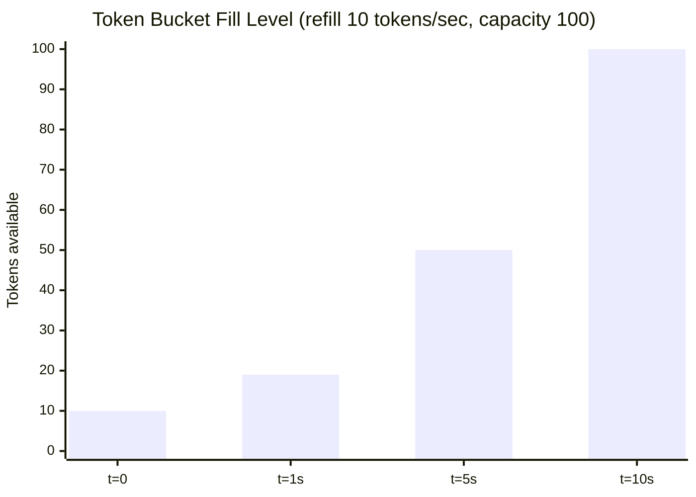
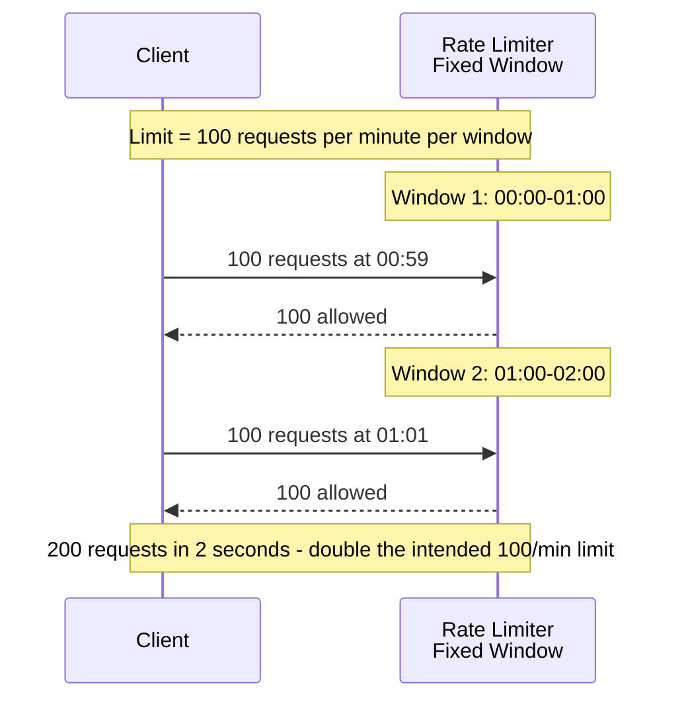
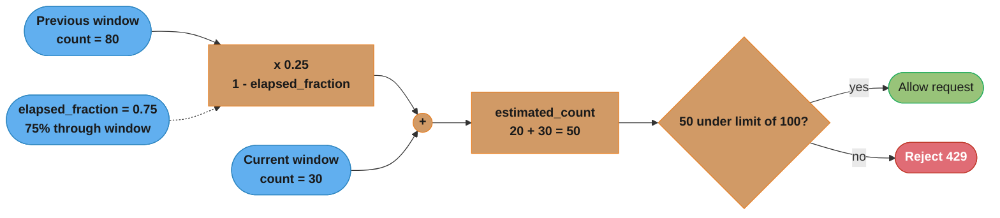
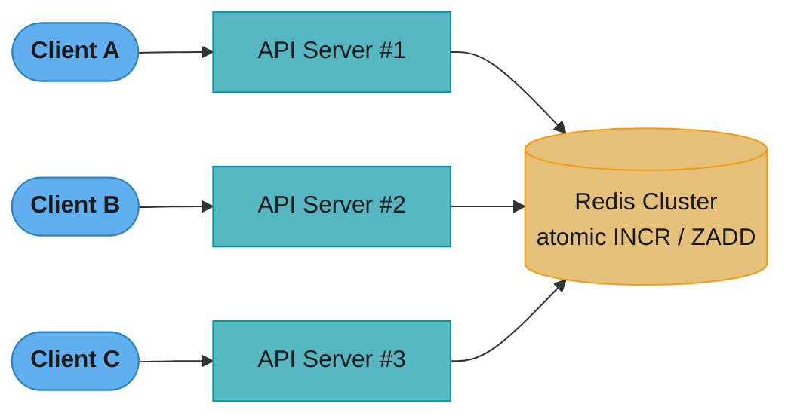
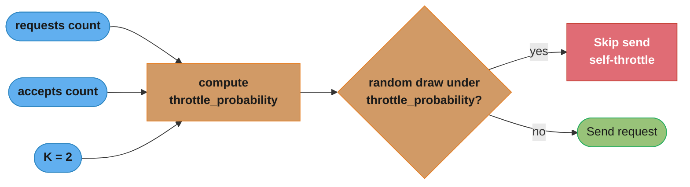
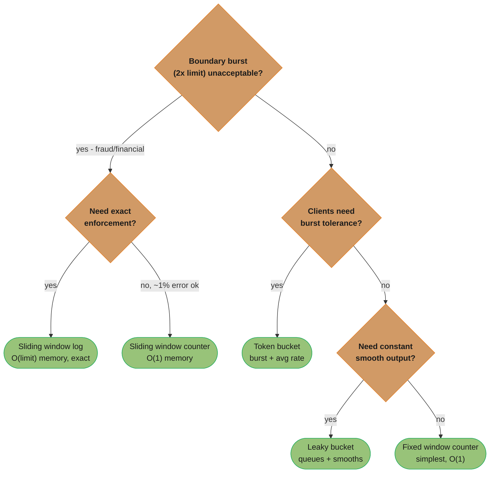
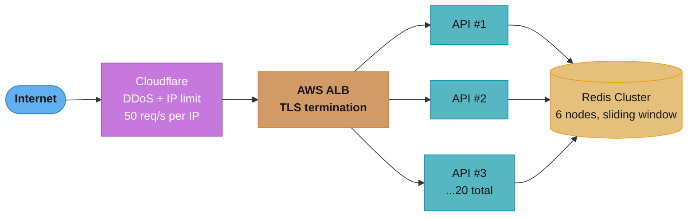

# Rate Limiting In Depth

## 1. Concept Overview

Rate limiting is the practice of controlling how many requests a client can make to a service within a given time window. Without rate limiting, a single misbehaving client — whether an automated bot, a buggy application, a denial-of-service attacker, or a legitimate customer that grew unexpectedly fast — can consume all available capacity and starve other clients. Rate limiting is also the primary mechanism for enforcing API pricing tiers: free users get 100 requests per minute, paid users get 10,000, enterprise users get 1,000,000.

Rate limiting is distinct from load shedding (dropping all traffic above a threshold regardless of source) and circuit breaking (stopping calls to a failing downstream service). Rate limiting controls how much traffic a specific identity is allowed to generate.

The five canonical algorithms are:

- **Token bucket** — burst-friendly, natural for API throttling
- **Leaky bucket** — smooths traffic to a constant output rate
- **Fixed window counter** — simplest, but vulnerable to boundary bursts
- **Sliding window log** — exact, but memory-intensive
- **Sliding window counter** — hybrid approximation, practical for high-scale systems

---

## 2. Intuition

One-line analogy: A highway on-ramp traffic light (metering signal) lets one car through every 3 seconds — regardless of how many cars are waiting — to prevent the freeway from becoming a parking lot.

Mental model: The token bucket is a bucket with a hole in it. Tokens (permits) accumulate in the bucket at a fixed rate. Each request consumes one token. When the bucket is full, new tokens are discarded (the burst has a hard cap at bucket capacity). When the bucket is empty, requests are rejected. The bucket allows bursts up to its capacity but enforces a long-run average rate equal to the token refill rate.

Why it matters: In 2020, a misconfigured API client at a financial institution accidentally created an infinite retry loop that sent 2 million requests per minute to a third-party data provider. Without rate limiting, the provider's entire API was unusable for all customers for 4 hours. With a per-client rate limit of 10,000 requests per minute and automatic throttling, the blast radius would have been contained to that one client.

Key insight: Rate limiting that is only applied at the edge (API gateway) without client-side adaptive throttling is incomplete. Clients that receive 429 errors and immediately retry add more load rather than less. A complete rate limiting system includes server-side enforcement and client-side backoff.

---

## 3. Core Principles

**Enforce at the closest point to the source.** Apply rate limits at the API gateway or load balancer before requests reach application servers. Requests that hit application code have already consumed network bandwidth, load balancer capacity, and connection pool resources.

**Use different limits for different identities.** Rate limit by API key (most common for APIs), by IP address (for unauthenticated endpoints), by user ID (for authenticated endpoints), or by organization. A single user generating 1,000 requests per minute should not affect other users.

**Define tiered limits.** Free tier: 100 req/min. Standard tier: 1,000 req/min. Enterprise tier: 50,000 req/min. Rate limits are a product decision as much as an engineering one.

**Return informative headers.** Clients need to know their current limit, how many requests they have remaining, and when the limit resets. Without this information, clients implement aggressive polling to detect when the limit has lifted, making the problem worse.

**Design for distributed enforcement.** In a multi-instance deployment, a counter stored in a single instance's memory is inaccurate — other instances do not see it. Use a shared store (Redis) with atomic operations for accurate distributed rate limiting.

**Separate read and write limits.** Write operations (POST, PUT, DELETE) are more expensive and have side effects. Apply tighter rate limits to writes than to reads.

---

## 4. Types / Architectures / Strategies

### Token Bucket

A bucket holds up to `capacity` tokens. Tokens are added at `refillRate` tokens per second. Each request consumes one token (or more for expensive operations). If the bucket has tokens, the request is allowed and a token is consumed. If the bucket is empty, the request is rejected (or queued).

Allows burst traffic up to `capacity`. Long-run average throughput is capped at `refillRate`. This is the natural fit for APIs where occasional bursts are acceptable but sustained high rates must be limited.

### Leaky Bucket

Requests enter a queue (bucket) from the top. The queue drains at a fixed `outflowRate` requests per second. If the queue is full, new requests overflow (are rejected). The outflow is perfectly smooth — `outflowRate` requests per second, no more, no less.

Useful for smoothing bursty traffic before sending it to a downstream service that cannot handle bursts (e.g., a legacy system that processes messages at a fixed rate). The tradeoff is that it adds latency (requests queue before being processed) and discards bursts rather than serving them quickly.

### Fixed Window Counter

Divide time into fixed-size windows (e.g., 1-minute slots: 00:00–01:00, 01:00–02:00). Count requests per identity per window. Reset the counter at the window boundary.

Simple to implement and understand. However, vulnerable to the boundary burst problem: a client can send `limit` requests in the last second of one window and `limit` requests in the first second of the next window — effectively `2 * limit` requests in 2 seconds, which violates the intent of the limit.

### Sliding Window Log

Maintain a log (sorted set) of request timestamps for each identity. On each request, remove all timestamps older than `windowSize`, count remaining entries, and reject if count >= limit. Otherwise, add the current timestamp and allow.

Exact — there is no boundary burst problem. Memory-intensive: each request is stored as a timestamp. For a limit of 1,000 requests per minute with 1 million users, this is up to 1 billion timestamps in memory. Only practical for low-traffic services or when combined with aggressive TTLs.

### Sliding Window Counter (Hybrid)

Combine two adjacent fixed windows to approximate a sliding window without storing individual timestamps. The formula is:

```
current_count = previous_window_count * (1 - elapsed_fraction) + current_window_count
```

Where `elapsed_fraction` is how far into the current window we are (0.0 to 1.0). This approximation is accurate to within ~1% in practice and requires only two counters per identity instead of per-request storage.

**What the formula is telling you.** "Keep whatever fraction of the previous window still
overlaps the last 60 seconds, and add everything in the current one."

It is a straight-line guess: assume the previous window's requests were spread evenly across
it, so the portion still inside the sliding window is proportional to how little of the new
window has elapsed. Two integers replace a per-request timestamp log.

| Symbol | What it is |
|--------|------------|
| `previous_window_count` | Total requests counted in the window that just closed |
| `current_window_count` | Requests so far in the window now open |
| `elapsed_fraction` | How far into the current window you are, `0.0` to `1.0` |
| `1 - elapsed_fraction` | The share of the previous window still inside the sliding view |
| `current_count` | The estimate compared against the limit |

**Walk one example.** Previous window 80, current window 30, limit 100, as the window advances:

```
   elapsed_fraction   prev x (1 - frac)   + current   =  estimate    vs limit 100
        0.00            80 x 1.00 = 80        30          110          REJECT
        0.25            80 x 0.75 = 60        30           90          allow
        0.50            80 x 0.50 = 40        30           70          allow
        0.75            80 x 0.25 = 20        30           50          allow
        1.00            80 x 0.00 =  0        30           30          allow

  The old window's weight bleeds off linearly instead of vanishing at a boundary.
  That single change is what removes the 2x boundary burst.
```

The approximation's error comes entirely from the even-spread assumption. If the previous
window's 80 requests all landed in its *first* second, the true overlap is zero but the
formula still charges you 60 at `frac = 0.25` — it over-counts, so it fails closed. That is
the right direction to be wrong in for a limiter.

### Adaptive Throttling (Client-Side)

Google's approach from SRE: clients track their own accept rate and self-throttle based on the server's observed rejection ratio.

```
throttle_probability = max(0, (requests - K * accepts) / (requests + 1))
```

Where K is typically 2. When the server starts rejecting requests, clients automatically reduce their send rate. This prevents retry amplification: clients that receive 429 errors do not immediately retry — they probabilistically skip sending new requests.

---

## 5. Architecture Diagrams

### Token Bucket



*At t=0 the bucket holds 10 tokens after 1 request is consumed. A 20-request burst at t=1s drains the refilled 19 tokens to 0 (1 rejected). By t=5s a 50-request burst is fully absorbed. By t=10s the bucket is capped at its 100-token capacity, so only 100 of 101 requests are allowed.*

### Fixed Window Boundary Burst



*A client sends 100 requests in the final second of Window 1 and 100 more in the first second of Window 2 — the hard counter reset at the boundary lets 200 requests through in 2 seconds, double the intended 100/min limit.*

**Read it like this.** "A fixed window promises `limit` per window, but what a client can
actually extract in one continuous stretch is `2 x limit`, because two full windows can be
adjacent to the boundary."

The limiter is not broken — it never let more than 100 through in either window. The bug is
that "window" and "any 60-second interval" are different things, and the client gets to choose
which interval to aim at.

| Symbol | What it is |
|--------|------------|
| `limit` | Requests permitted per window, `100` here |
| `windowSize` | Window length, `60` s |
| `2 x limit` | Worst-case requests in one continuous span across the boundary |
| intended rate | `limit / windowSize` — the rate you thought you configured |
| achieved rate | `2 x limit / burstSpan` — what a boundary-aware client gets |

**Walk one example.** Limit 100 per 60 s, a client that knows where the boundary is:

```
  intended sustained rate :  100 / 60 s        =   1.67 requests/second

  00:59.0   100 requests  ->  window 1 counter 0 -> 100, all allowed
  01:00.0   counter resets to 0
  01:01.0   100 requests  ->  window 2 counter 0 -> 100, all allowed

  achieved  :  200 requests in a 2-second span  =  100 requests/second

  100 / 1.67  =  60x the intended rate, and the limiter reports zero violations
```

The `2x` is the headline, but the burst-span ratio is the number that actually hurts: the
shorter the client makes the span around the boundary, the higher the instantaneous rate,
while the "2x per window" framing stays constant. That is why a downstream service sized for
1.67 rps still falls over.

### Sliding Window Counter Approximation



*Worked example at 01:45 (75% through the 60-second window): the previous window's 80 requests are discounted by 25%, added to the current window's 30, yielding an estimated count of 50 — under the limit of 100, so the request is allowed.*

### Distributed Rate Limiting with Redis



*All three API servers share one counter in Redis; a Lua script executes `ZADD` + `ZREMRANGEBYSCORE` + `ZCARD` atomically, so no race condition is possible across instances.*

### Rate Limit Response Headers

```
HTTP/1.1 200 OK
X-RateLimit-Limit: 1000
X-RateLimit-Remaining: 847
X-RateLimit-Reset: 1698765432       (Unix timestamp when window resets)
X-RateLimit-Policy: 1000;w=60       (RFC draft: limit=1000, window=60s)

HTTP/1.1 429 Too Many Requests
X-RateLimit-Limit: 1000
X-RateLimit-Remaining: 0
X-RateLimit-Reset: 1698765432
Retry-After: 23                     (seconds until requests are accepted again)
```

### Adaptive Throttling (Client-Side)



*The client tracks its own requests and accepts; as the server's rejection rate rises, `throttle_probability` climbs and a per-request random draw decides whether to self-throttle — stopping the retry storm on the client side before the server is overwhelmed. K=2 tolerates roughly a 33% server rejection rate before the client begins throttling itself.*

---

## 6. How It Works — Detailed Mechanics

### Token Bucket Implementation (Java)

```java
import java.util.concurrent.atomic.AtomicLong;
import java.util.concurrent.locks.ReentrantLock;

public class TokenBucket {
    private final long capacity;
    private final double refillRatePerNano;  // tokens per nanosecond
    private AtomicLong tokens;
    private volatile long lastRefillTime;
    private final ReentrantLock lock = new ReentrantLock();

    public TokenBucket(long capacity, long refillRatePerSecond) {
        this.capacity = capacity;
        this.refillRatePerNano = (double) refillRatePerSecond / 1_000_000_000L;
        this.tokens = new AtomicLong(capacity);
        this.lastRefillTime = System.nanoTime();
    }

    public boolean tryAcquire() {
        return tryAcquire(1);
    }

    public boolean tryAcquire(int tokensRequested) {
        lock.lock();
        try {
            refill();
            long current = tokens.get();
            if (current >= tokensRequested) {
                tokens.set(current - tokensRequested);
                return true;
            }
            return false;
        } finally {
            lock.unlock();
        }
    }

    private void refill() {
        long now = System.nanoTime();
        long elapsed = now - lastRefillTime;
        long newTokens = (long) (elapsed * refillRatePerNano);
        if (newTokens > 0) {
            tokens.set(Math.min(capacity, tokens.get() + newTokens));
            lastRefillTime = now;
        }
    }
}
```

**In plain terms.** "You may spend what has piled up in the bucket all at once, but you can
only ever earn it back at the refill rate."

Two numbers, two independent guarantees: `capacity` is the biggest burst you tolerate, and
`refillRate` is the sustained rate you are actually willing to serve. Conflating them is the
usual configuration mistake.

| Symbol | What it is |
|--------|------------|
| `capacity` | Maximum tokens the bucket holds. Equals the largest single burst allowed |
| `refillRatePerSecond` | Tokens added per second. The long-run throughput ceiling |
| `elapsed x refillRatePerNano` | Tokens earned since the last refill — computed lazily, not by a timer |
| `Math.min(capacity, ...)` | The cap. Tokens earned above `capacity` are thrown away |
| `tokensRequested` | Cost of this call. Expensive endpoints can charge more than 1 |

**Walk one example.** `capacity = 100`, `refillRate = 10/s`, a client that opens at full tilt:

```
  t = 0.0 s   bucket full at 100.  Client sends a 100-request burst.
              100 allowed instantly.  bucket -> 0

  t = 0.0 s   client keeps pushing at 60 rps, bucket empty
              earns  10 tokens/s , spends 60 tokens/s
              allowed rate settles at exactly 10 rps ; 50 rps rejected

  refill from empty back to full :  100 tokens / 10 per s  =  10.0 s
              so a second 100-burst is only available 10 s after the first
```

Note what `refill()` does *not* do: there is no background thread. Tokens are computed from
elapsed time on the next request, which is why an idle client costs nothing and why the
`Math.min(capacity, ...)` clamp exists — an hour of idleness would otherwise mint 36,000
tokens and let one client replay a whole hour of quota in a single second.

### Redis Lua Script — Sliding Window Log (Exact)

```lua
-- Sliding window log using Redis sorted set
-- KEYS[1]: rate limit key (e.g., "ratelimit:user:123")
-- ARGV[1]: current timestamp in milliseconds
-- ARGV[2]: window size in milliseconds  (e.g., 60000 for 60 seconds)
-- ARGV[3]: max allowed requests in window
-- Returns: 1 = allowed, 0 = rejected, also returns remaining count

local key     = KEYS[1]
local now     = tonumber(ARGV[1])
local window  = tonumber(ARGV[2])
local limit   = tonumber(ARGV[3])

-- Remove all timestamps that are outside the current window
redis.call('ZREMRANGEBYSCORE', key, 0, now - window)

-- Count how many requests are in the current window
local count = redis.call('ZCARD', key)

if count < limit then
    -- Add current request timestamp as score and a unique member
    -- Using now + random suffix to handle multiple requests at the same millisecond
    redis.call('ZADD', key, now, now .. ':' .. redis.call('INCR', key .. ':seq'))
    -- Set expiry to avoid orphaned keys
    redis.call('PEXPIRE', key, window)
    return {1, limit - count - 1}  -- allowed, remaining after this request
else
    return {0, 0}  -- rejected, 0 remaining
end
```

### Redis Lua Script — Sliding Window Counter (Approximate, Low Memory)

```lua
-- Sliding window counter: uses two fixed-window counters + interpolation
-- KEYS[1]: current window key  (e.g., "ratelimit:user:123:1698765420")
-- KEYS[2]: previous window key (e.g., "ratelimit:user:123:1698765360")
-- ARGV[1]: current window start timestamp (seconds)
-- ARGV[2]: window size in seconds
-- ARGV[3]: limit

local curr_key    = KEYS[1]
local prev_key    = KEYS[2]
local window_start = tonumber(ARGV[1])
local window_size  = tonumber(ARGV[2])
local limit        = tonumber(ARGV[3])
local now          = tonumber(ARGV[4])  -- current unix timestamp in seconds

-- Fraction of current window that has elapsed
local elapsed_fraction = (now - window_start) / window_size

-- Counts in each window (default 0 if key doesn't exist)
local curr_count = tonumber(redis.call('GET', curr_key) or 0)
local prev_count = tonumber(redis.call('GET', prev_key) or 0)

-- Weighted estimate: previous window contributes less as we advance into current window
local estimated = math.floor(prev_count * (1 - elapsed_fraction) + curr_count)

if estimated < limit then
    -- Increment current window counter
    redis.call('INCR', curr_key)
    redis.call('EXPIRE', curr_key, window_size * 2)
    return {1, limit - estimated - 1}
else
    return {0, 0}
end
```

### Spring Boot Rate Limiting Filter with Redis

```java
@Component
@Order(1)
public class RateLimitingFilter extends OncePerRequestFilter {

    private static final String RATE_LIMIT_SCRIPT =
        "local key = KEYS[1]\n" +
        "local now = tonumber(ARGV[1])\n" +
        "local window = tonumber(ARGV[2])\n" +
        "local limit = tonumber(ARGV[3])\n" +
        "redis.call('ZREMRANGEBYSCORE', key, 0, now - window)\n" +
        "local count = redis.call('ZCARD', key)\n" +
        "if count < limit then\n" +
        "  redis.call('ZADD', key, now, now .. ':' .. math.random())\n" +
        "  redis.call('PEXPIRE', key, window)\n" +
        "  return {1, limit - count - 1}\n" +
        "else return {0, 0} end";

    private final RedisTemplate<String, String> redisTemplate;
    private final DefaultRedisScript<List> script;
    private final RateLimitProperties properties;

    @Override
    protected void doFilterInternal(HttpServletRequest request,
                                    HttpServletResponse response,
                                    FilterChain filterChain) throws IOException, ServletException {

        String clientKey = resolveClientKey(request);
        RateLimitTier tier = properties.getTierFor(clientKey);

        long now = System.currentTimeMillis();
        long windowMs = tier.getWindowSeconds() * 1000L;
        String redisKey = "ratelimit:" + clientKey;

        List<Long> result = redisTemplate.execute(script,
            List.of(redisKey),
            String.valueOf(now),
            String.valueOf(windowMs),
            String.valueOf(tier.getLimit()));

        boolean allowed = result.get(0) == 1L;
        long remaining = result.get(1);
        long resetAt = (now / windowMs + 1) * windowMs / 1000;

        response.setHeader("X-RateLimit-Limit", String.valueOf(tier.getLimit()));
        response.setHeader("X-RateLimit-Remaining", String.valueOf(remaining));
        response.setHeader("X-RateLimit-Reset", String.valueOf(resetAt));

        if (!allowed) {
            long retryAfterSeconds = (resetAt - now / 1000);
            response.setHeader("Retry-After", String.valueOf(retryAfterSeconds));
            response.setStatus(HttpStatus.TOO_MANY_REQUESTS.value());
            response.setContentType(MediaType.APPLICATION_JSON_VALUE);
            response.getWriter().write("{\"error\":\"rate_limit_exceeded\"," +
                "\"retry_after\":" + retryAfterSeconds + "}");
            return;
        }

        filterChain.doFilter(request, response);
    }

    private String resolveClientKey(HttpServletRequest request) {
        // Priority: API key header > authenticated user ID > IP address
        String apiKey = request.getHeader("X-API-Key");
        if (apiKey != null) return "apikey:" + apiKey;

        String userId = SecurityContextHolder.getContext()
            .getAuthentication() != null ?
            SecurityContextHolder.getContext().getAuthentication().getName() : null;
        if (userId != null) return "user:" + userId;

        return "ip:" + getClientIp(request);
    }

    private String getClientIp(HttpServletRequest request) {
        String forwarded = request.getHeader("X-Forwarded-For");
        if (forwarded != null) return forwarded.split(",")[0].trim();
        return request.getRemoteAddr();
    }
}
```

### Nginx Rate Limiting Configuration

```nginx
# Define rate limit zones
# Zone "api_limit": keyed by $http_x_api_key, 10MB state space, 100 req/s limit
# 10MB can hold approximately 160,000 entries (each entry ~64 bytes)
http {
    limit_req_zone $http_x_api_key zone=api_limit:10m rate=100r/s;
    limit_req_zone $binary_remote_addr zone=ip_limit:10m rate=10r/s;
    limit_req_zone $http_x_api_key zone=write_limit:10m rate=10r/s;

    # Return 429 (not 503) for rate limit rejections
    limit_req_status 429;

    server {
        listen 443 ssl;

        # Apply read rate limit with burst buffer
        # burst=200: allow up to 200 excess requests to queue
        # nodelay: serve burst requests immediately (don't delay them)
        #          without nodelay, burst requests are served at 1/rate intervals
        location /api/ {
            limit_req zone=api_limit burst=200 nodelay;
            limit_req zone=ip_limit burst=20 nodelay;
            proxy_pass http://backend;
        }

        # Tighter limits for write operations
        location ~* ^/api/(users|orders|payments) {
            if ($request_method ~* "^(POST|PUT|PATCH|DELETE)$") {
                limit_req zone=write_limit burst=10 nodelay;
            }
            proxy_pass http://backend;
        }

        # Add rate limit headers to responses
        add_header X-RateLimit-Limit $limit_req_status always;
    }
}
```

### Adaptive Throttling (Client-Side)

```java
public class AdaptiveThrottler {
    // Google SRE adaptive throttling
    // throttle_probability = max(0, (requests - K * accepts) / (requests + 1))
    // K = 2 is recommended. Lower K = more aggressive throttling.
    // K = 1 = client allows ~50% acceptance rate before throttling
    // K = 2 = client allows ~33% rejection rate before throttling

    private static final double K = 2.0;
    private static final int WINDOW_SECONDS = 120;

    private final AtomicLong totalRequests = new AtomicLong(0);
    private final AtomicLong acceptedRequests = new AtomicLong(0);
    private final ScheduledExecutorService scheduler;

    public AdaptiveThrottler() {
        this.scheduler = Executors.newSingleThreadScheduledExecutor();
        // Reset counters every 2 minutes to use a sliding approximation
        scheduler.scheduleAtFixedRate(this::decay, WINDOW_SECONDS, WINDOW_SECONDS, TimeUnit.SECONDS);
    }

    public boolean shouldSendRequest() {
        long requests = totalRequests.get();
        long accepts  = acceptedRequests.get();

        if (requests == 0) return true;  // no history, send

        double throttleProbability = Math.max(0.0,
            (requests - K * accepts) / (requests + 1.0));

        boolean throttled = ThreadLocalRandom.current().nextDouble() < throttleProbability;

        if (!throttled) {
            totalRequests.incrementAndGet();
        }
        return !throttled;
    }

    public void recordResult(boolean accepted) {
        if (accepted) {
            acceptedRequests.incrementAndGet();
        }
    }

    private void decay() {
        // Exponential decay: halve counters every window
        totalRequests.updateAndGet(v -> v / 2);
        acceptedRequests.updateAndGet(v -> v / 2);
    }
}
```

---

## 7. Real-World Examples

### GitHub API: Multi-Tier Rate Limiting

GitHub's REST API uses multiple simultaneous rate limits. Unauthenticated requests: 60 requests per hour per IP. Authenticated requests: 5,000 requests per hour per user. GitHub Apps: 5,000 per hour per installation, scalable up to 15,000 per hour based on the number of repositories. Search API: 10 requests per minute (separate pool). GraphQL API: based on query complexity points (not request count). GitHub also uses secondary rate limiting that fires on too many concurrent requests or too many requests in a short window, even if the hourly limit has not been reached. All limits are returned via `X-RateLimit-*` headers on every response.

### Stripe API: Idempotency-Aware Rate Limiting

Stripe limits to 100 read requests per second and 100 write requests per second per API key. Critically, Stripe's rate limiting treats idempotent retries (same `Idempotency-Key`) differently from new requests. A retry with the same idempotency key does not count against the rate limit if the original response is still cached on Stripe's end (24-hour cache). This allows clients to safely retry failed payment requests without worrying about hitting rate limits during error recovery.

### Twitter/X API: Tiered Limits with Context

Twitter's API uses a combination of rate limiting by endpoint (some endpoints have per-15-minute windows, others have per-day limits), by authentication type (app-only bearer token gets higher limits than user tokens), and by access tier (Free, Basic, Pro, Enterprise). The v2 API returns `x-rate-limit-limit`, `x-rate-limit-remaining`, and `x-rate-limit-reset` on every response. Hitting the search endpoint limit returns a `429` with a `x-rate-limit-reset` timestamp, and clients that hammer the endpoint with retries before the reset time are temporarily blocked at the infrastructure level.

### Redis at Slack

Slack uses Redis-based rate limiting for their message delivery pipeline. Each user's message send rate is tracked in Redis with a sliding window counter. When a user (or more commonly, a Slack bot) sends messages too rapidly, their message queue is throttled. The rate limiter is implemented with Lua scripts for atomicity and uses Redis Cluster with consistent hashing to distribute load. A key implementation detail: Slack tracks rate limits per Slack workspace (team), not per user account, so that one active workspace cannot starve another on the same infrastructure.

---

## 8. Tradeoffs

### Algorithm Comparison

| Algorithm                | Burst Handling | Boundary Burst Problem | Memory per Identity | Accuracy  | Implementation Complexity |
|--------------------------|----------------|------------------------|---------------------|-----------|---------------------------|
| Token bucket             | Yes            | No                     | O(1)                | Exact      | Medium                    |
| Leaky bucket             | No (smoothing) | No                     | O(queue_depth)      | Exact      | Medium                    |
| Fixed window counter     | Partial        | Yes (2x burst)         | O(1)                | Approximate | Low                      |
| Sliding window log       | Yes            | No                     | O(limit)            | Exact      | Medium                    |
| Sliding window counter   | Partial        | Minimal (~1% error)    | O(1)                | ~99% accurate | Medium               |

### Rate Limiting Location Comparison

| Location         | Pros                                                | Cons                                                    |
|------------------|-----------------------------------------------------|---------------------------------------------------------|
| Client-side only | Zero network round-trips                            | Unenforceable — malicious clients bypass                |
| API Gateway      | Enforced before reaching app servers                | Gateway becomes a bottleneck; needs distributed state   |
| Application code | Access to business context (user tier, plan type)   | Adds latency to every request; complex distributed state |
| Service mesh     | No code changes required; policy-driven             | Coarse-grained (per service, not per user/endpoint)     |

### Redis vs. In-Memory Rate Limiting

| Dimension              | In-Memory (per instance)    | Redis (shared)                        |
|------------------------|-----------------------------|---------------------------------------|
| Latency                | Sub-microsecond             | 0.5–1ms round-trip                    |
| Accuracy               | Inaccurate (per-instance)   | Accurate across all instances         |
| Failure mode           | Survives Redis outage       | Rate limiting fails open or closed    |
| Complexity             | Simple                      | Requires Lua scripts for atomicity    |
| Horizontal scaling     | Limits scale proportionally | Single global limit enforced          |

---

## 9. When to Use / When NOT to Use



*A quick decision guide synthesized from the rules below: start with whether a 2x boundary burst is tolerable, then branch on exactness, burst tolerance, and output smoothness to land on one of the five algorithms.*

### Token Bucket — Use when:
- API clients legitimately need burst capacity (e.g., a user refreshing many widgets at login)
- You want to allow short bursts while enforcing a long-run average rate
- You are rate limiting by API key with tiered burst sizes (free: burst=10, paid: burst=100)

### Leaky Bucket — Use when:
- You need to smooth traffic before sending to a downstream system with no burst tolerance
- You are implementing a queue-based smoothing layer, not a client-facing rate limit
- Output rate must be exactly constant (e.g., billing batch jobs at exactly 100 operations/sec)

### Fixed Window — Use when:
- Simplicity is paramount and the 2x boundary burst is acceptable (e.g., internal admin tools)
- You need the lowest possible implementation complexity for non-critical endpoints

### Sliding Window — Use when:
- Boundary burst behavior is unacceptable (financial transactions, fraud prevention)
- You need exact enforcement (use sliding window log) or high-accuracy approximation (use sliding window counter)

### Do NOT use per-instance in-memory rate limiting when:
- Your service runs on more than one instance behind a load balancer
- The rate limit is important enough that under-counting by N instances matters
- You need accurate accounting for billing or compliance purposes

### Do NOT enforce rate limits without proper headers when:
- You have API clients who need to implement their own backoff
- You want to avoid turning a 429 response into an immediate retry storm

---

## 10. Common Pitfalls

### Pitfall 1: The Race Condition in Non-Atomic Counter Increments (Production War Story)

An API platform team implemented rate limiting using a non-atomic Redis GET-then-SET pattern:

```java
// BROKEN: non-atomic GET + conditional SET creates a race condition
Long count = redisTemplate.opsForValue().get(key);
if (count == null || count < limit) {
    redisTemplate.opsForValue().increment(key);  // NOT atomic with the check above
    filterChain.doFilter(request, response);      // allow
} else {
    response.setStatus(429);
}
```

Under high concurrency, 50 threads could all read `count = 999`, all decide the limit (1000) had not been reached, and all increment — resulting in a final count of 1049 for that window. In production, this allowed clients to exceed their rate limit by up to 300% under sustained load. The fix: use a Lua script or Redis `MULTI/EXEC` transaction to make the check-and-increment atomic.

```java
// FIX: atomic increment + check with Lua script
Long newCount = redisTemplate.execute(incrementScript, List.of(key), String.valueOf(limit));
if (newCount == null || newCount > limit) {
    response.setStatus(429);
    return;
}
filterChain.doFilter(request, response);
```

### Pitfall 2: Rate Limiting on IP Address Behind a NAT or Proxy

A SaaS company applied rate limits of 100 requests per minute per IP address. A large enterprise customer had 500 employees behind a corporate NAT gateway — all sharing the same public IP address. The entire enterprise was effectively limited to 100 req/min shared across all 500 users. The first 3–4 active users would exhaust the budget and the rest would receive 429 errors for the remainder of the minute. The fix: for authenticated endpoints, always rate limit by user ID or API key, not by IP address. Use IP-based rate limiting only for unauthenticated endpoints as a DDoS protection backstop.

### Pitfall 3: Ignoring `Retry-After` and Triggering Retry Storms

A mobile application received a 429 response and immediately retried with a 1-second fixed delay. Under load, this meant every throttled client was retrying at t+1s, t+2s, t+3s simultaneously. The retries added 20–30% additional load on top of the organic traffic, pushing more clients into the rate limited state, generating more retries — a classic feedback loop. The fix: parse the `Retry-After` header and add jitter. If `Retry-After: 30`, wait 30 seconds plus random(0, 10) seconds before retrying.

### Pitfall 4: Clock Skew in Distributed Systems Corrupting Window Boundaries

A team used a fixed window counter keyed on Unix timestamp rounded to the minute (e.g., `ratelimit:user123:1698765420`). When they deployed across two data centers in different regions, a 3-second clock skew between data center clocks caused some requests to be counted in the wrong window. At the boundary of a minute, one data center's clock rolled over while another did not. Requests near the boundary were counted in different windows depending on which data center served them, effectively doubling the burst capacity. The fix: use Redis server time (`TIME` command) as the authoritative clock source instead of the application server clock. All Lua scripts should call `redis.call('TIME')` internally.

### Pitfall 5: Rate Limiting Without Observability

A team deployed rate limiting but did not add metrics. Three weeks later, a legitimate paying enterprise customer complained that their integration was intermittently failing with unexplained errors. Investigation revealed they had been hitting the rate limit (which was set at the free-tier level by mistake) for 3 weeks. Because there was no alert on high 429 rates per API key, no one noticed. The fix: emit a metric `rate_limit.rejected` tagged with `tier`, `endpoint`, and `client_id` (masked for privacy). Alert when any single client hits the rate limit more than 5% of the time in a 5-minute window — that signals either misconfiguration or a client that needs to upgrade to a higher tier.

### Pitfall 6: Leaky Bucket Adding Unacceptable Latency

A team used a leaky bucket to smooth requests to a third-party payment processor. The outflow rate was 50 requests per second (their contracted limit). Under normal load (30 req/s), requests queued briefly and were processed within 20ms. Under a burst of 200 requests, the queue filled and requests waited up to 4 seconds to be processed. But the HTTP client on the calling service had a 2-second timeout. Requests were accepted by the leaky bucket, queued for 3–4 seconds, and then the HTTP client timed out — resulting in the worst of both worlds: the requests consumed a queue slot but never completed. The fix: set the leaky bucket queue depth to `outflow_rate * max_acceptable_wait_seconds`. If max wait is 1 second and outflow rate is 50/s, set queue depth to 50. Reject (429) immediately when the queue is full instead of queuing indefinitely.

---

## 11. Technologies & Tools

| Technology                   | Role                                                         | Notes                                               |
|------------------------------|--------------------------------------------------------------|-----------------------------------------------------|
| Redis + Lua                  | Distributed atomic rate limiting (sliding window)            | Single-threaded Lua execution guarantees atomicity  |
| Redis `INCR` + `EXPIRE`      | Simple fixed window counter                                  | Simplest approach; prone to boundary burst          |
| Nginx `limit_req`            | Edge rate limiting before reaching application               | `limit_req_zone`, `burst`, `nodelay`                |
| HAProxy `stick-table`        | Connection-level and request-level rate limiting             | More complex config than Nginx                      |
| Bucket4j                     | Java in-memory and Redis-backed token bucket                 | Good for application-level limiting                 |
| Resilience4j `RateLimiter`   | Per-service rate limiting in application code                | Integrates with circuit breaker / retry              |
| Spring Cloud Gateway         | Built-in `RequestRateLimiter` filter using Redis             | Plug-and-play for Spring microservices              |
| AWS API Gateway               | Managed rate limiting (10,000 req/s per account, configurable) | Per-stage and per-method limits                  |
| Cloudflare Rate Limiting      | Edge-level rate limiting with geo-awareness                  | DDoS protection + API limiting in one              |
| Kong                         | API gateway with rate limiting plugin                        | Supports Redis backend for distributed limiting     |
| Envoy                        | Rate limiting via external RLS (Rate Limit Service)          | Integrates with Lyft's `ratelimit` service          |

### Bucket4j with Spring Boot

```java
@Configuration
public class RateLimiterConfig {

    @Bean
    public Map<String, Bucket> userBuckets() {
        return new ConcurrentHashMap<>();
    }

    // Per-user token bucket: 100 tokens, refilled at 100/minute
    public Bucket getBucketForUser(String userId) {
        return userBuckets().computeIfAbsent(userId, k ->
            Bucket.builder()
                .addLimit(Bandwidth.classic(100,
                    Refill.greedy(100, Duration.ofMinutes(1))))
                .build()
        );
    }
}

@Service
public class RateLimitService {
    private final RateLimiterConfig config;

    public boolean tryConsume(String userId) {
        Bucket bucket = config.getBucketForUser(userId);
        ConsumptionProbe probe = bucket.tryConsumeAndReturnRemaining(1);
        // probe.getRemainingTokens() for X-RateLimit-Remaining header
        // probe.getNanosToWaitForRefill() for Retry-After header
        return probe.isConsumed();
    }
}
```

---

## 12. Interview Questions with Answers

**Q: What is the boundary burst problem with fixed window counters and how do sliding windows solve it?**
In a fixed window counter, a client can send `limit` requests in the last millisecond of one window and `limit` requests in the first millisecond of the next window — effectively `2 * limit` requests in a very short time. This happens because the counter resets hard at the boundary. A sliding window tracks requests over a rolling window ending at the current moment, so the window always contains at most `limit` requests in the most recent `windowSize` duration, regardless of where the clock boundary falls.

**Q: Explain the token bucket algorithm. How does it differ from a leaky bucket?**
The token bucket accumulates tokens at a fixed rate up to a maximum capacity. Each request consumes one or more tokens. Requests are allowed when tokens are available and rejected when the bucket is empty. This allows bursts up to the bucket capacity while enforcing a long-run average equal to the refill rate. The leaky bucket processes requests at a constant outflow rate regardless of input rate — it does not allow bursts, it smooths them by queueing. Token bucket: variable output, constant average, burst-friendly. Leaky bucket: constant output, no burst, smoothing-focused.

**Q: How do you implement atomic rate limiting in Redis without race conditions?**
Use a Lua script. Redis executes Lua scripts atomically in a single-threaded manner, making the entire check-and-update a single uninterruptible operation. The alternative is Redis transactions (`MULTI/EXEC`), but they do not prevent other clients from modifying keys between `WATCH` and `EXEC`, requiring retry logic. Lua scripts are the correct approach: wrap `ZREMRANGEBYSCORE`, `ZCARD`, `ZADD`, and `PEXPIRE` in a single Lua script loaded with `SCRIPT LOAD` and called with `EVALSHA`.

**Q: Why is rate limiting by IP address problematic for enterprise customers?**
Enterprise customers often have hundreds or thousands of employees behind a shared corporate NAT or proxy, meaning all their traffic originates from a single public IP address. Applying per-IP rate limits treats the entire enterprise as a single user. The correct approach is to rate limit by API key or authenticated user ID for all authenticated traffic, and only fall back to IP-based limiting for unauthenticated endpoints as a DDoS backstop.

**Q: What rate limit response headers should you return and what do each mean?**
`X-RateLimit-Limit`: the maximum requests allowed in the window. `X-RateLimit-Remaining`: how many requests the client can still make in the current window. `X-RateLimit-Reset`: Unix timestamp when the window resets and the full limit is available again. `Retry-After`: on a 429 response, the number of seconds the client must wait before retrying. These headers allow well-behaved clients to pre-emptively back off before exhausting their limit and to retry at exactly the right time rather than polling.

**Q: How would you rate limit a GraphQL API where requests have variable cost?**
Assign a cost to each field and operation based on complexity (number of database queries it triggers, depth of nested resolvers, number of objects returned). Limit by total cost points per window rather than by request count. For example, a simple field lookup costs 1 point; a paginated list query costs 10 points per page; a query that fetches nested relationships costs multiplicatively. A client with a budget of 1,000 points per minute can make many simple queries but only a few complex ones. GitHub's GraphQL API uses this exact approach.

**Q: What is the sliding window counter approximation and what is its error bound?**
The sliding window counter uses two adjacent fixed-window counters and a weighted average: `estimated = prev_count * (1 - elapsed_fraction) + curr_count`, where `elapsed_fraction` is how far through the current window we are. This assumes traffic was uniformly distributed in the previous window. The maximum error is about 1–2% in practice for typical traffic distributions, because actual traffic is rarely perfectly uniform. The error is worst at the exact window boundary and decreases as the window progresses.

**Q: How does Google's adaptive throttling work and why is it superior to static rate limiting for preventing cascading failures?**
Google's adaptive throttling tracks requests and accepts on the client side. The client probabilistically skips sending requests when `throttle_probability = max(0, (requests - K * accepts) / (requests + 1))` is high. When the server starts rejecting requests, the client automatically reduces its send rate proportionally — before the server is overwhelmed with retries. Static server-side rate limiting returns 429 errors, which well-behaved clients retry after a delay. Adaptive throttling prevents the retry storm itself: clients that are already seeing rejections do not send new requests, reducing load automatically.

**Q: How do you handle rate limiting for long-polling or streaming connections?**
Standard request count rate limiting does not work well for long-lived connections. Instead, rate limit by bandwidth (bytes per second), by number of concurrent connections per identity, or by the number of events emitted per second. For WebSocket connections, rate limit the initial handshake (connection rate limiting) and then rate limit messages within the connection. A client that maintains 100 WebSocket connections to circumvent per-connection rate limits should be detected and limited at the identity level by tracking total concurrent connections per API key.

**Q: What is the difference between rate limiting and throttling?**
Rate limiting enforces a hard cap: once the limit is exceeded, requests are rejected with a 429. Throttling slows requests down: it artificially delays processing (e.g., sleeping before processing) to stay within capacity. Rate limiting is more common for API quotas because it is simple and deterministic for clients. Throttling is used in queue-based systems and leaky bucket implementations where requests are deferred rather than dropped. In practice, the terms are often used interchangeably in API contexts.

**Q: How would you implement rate limiting across multiple data centers without requiring cross-DC synchronization on every request?**
Use a two-level approach: a local Redis cluster per data center enforces a fraction of the total limit (`total_limit / num_datacenters`). Each data center enforces its local fraction without cross-DC calls. Periodically synchronize counts across data centers (every 5–10 seconds) to rebalance. This means clients can exceed the global limit by up to `(N-1) / N * limit` in the worst case during a synchronization interval, but eliminates cross-DC latency on every request. This is the approach used by Cloudflare and Fastly for their edge rate limiting.

**Q: What happens to your rate limiter when Redis is unavailable?**
You must decide: fail open (allow all requests when Redis is down) or fail closed (reject all requests when Redis is down). Fail open is typically correct for API rate limiting: a brief Redis outage should not take down the entire API. However, fail open during an extended outage may allow abuse. A good compromise: fail open for authenticated users (who have agreed to terms of service) and fail closed for unauthenticated endpoints (to prevent DDoS amplification during outages). Always alert immediately when Redis is unreachable so the outage is detected quickly.

**Q: What happens when clients ignore Retry-After and retry with a fixed delay?**
Fixed-delay retries synchronize into a wave, so every throttled client hammers the API again at the same instant instead of spreading their retries out. A mobile application that retried exactly 1 second after every 429 added 20 to 30 percent extra load on top of organic traffic, pushing more clients into the rate-limited state and triggering more retries in a self-reinforcing feedback loop. The retry storm can end up costing more capacity than the traffic spike that triggered throttling in the first place. Parse the `Retry-After` header and add random jitter — wait the specified duration plus a random 0 to 10 seconds — instead of retrying on a fixed schedule.

**Q: Why is observability critical for a rate limiter, and what should you alert on?**
Without metrics on rejections, a misconfigured or wrong-tier rate limit can silently fail a paying customer for weeks before anyone notices. One team only discovered that an enterprise account had been mistakenly capped at the free tier's limit after the customer complained — three weeks of intermittent failures had gone unnoticed because no alert existed for elevated 429 rates on a single client. Rate limit rejections are a signal worth watching in their own right, not just an error code to return: a spike can mean misconfiguration, an abusive client, or a legitimate customer who needs to upgrade tiers. Emit a `rate_limit.rejected` metric tagged by tier, endpoint, and client ID, and alert when any single client is rejected more than 5 percent of the time within a 5-minute window.

**Q: How can clock skew between data centers break a fixed-window rate limiter?**
A fixed window counter keyed by a rounded timestamp assigns requests to the wrong window whenever two data centers' clocks disagree, doubling the effective burst at the boundary. One team saw a 3-second clock skew between two data center clocks cause requests near a minute boundary to land in different windows depending on which data center happened to serve them, doubling the effective limit for clients whose requests split across both. Application server clocks are not reliably synchronized enough for window boundaries that matter, especially across regions. Use Redis's own `TIME` command as the authoritative clock inside the Lua script rather than trusting each application server's local clock.

**Q: Why can a leaky bucket rate limiter make latency worse instead of smoothing it?**
If the bucket's queue is deeper than the caller's own timeout allows, requests get queued, wait, and time out anyway — wasting a slot on a request that never completes. A queue tuned for a 50 requests-per-second outflow rate could make requests wait up to 4 seconds under a 200-request burst, but if the calling HTTP client has only a 2-second timeout, those requests are "successfully" queued yet still fail from the caller's perspective. This is worse than rejecting immediately, because the request consumed capacity and added latency without ever producing a usable response. Size queue depth as `outflow_rate * max_acceptable_wait_seconds` and reject with a 429 immediately once the queue is full instead of queuing indefinitely.

---

## 13. Best Practices

**Use different rate limit windows for different purposes.** A burst limit (10 requests per second) prevents automated scrapers. A sustained limit (1,000 requests per hour) prevents excessive API usage. A daily limit (10,000 requests per day) enforces pricing tiers. Deploy all three simultaneously for important APIs.

**Always return `Retry-After` in 429 responses.** Clients that receive 429 without a Retry-After header will either implement their own (potentially aggressive) backoff or poll continuously. Providing `Retry-After` makes clients predictable and reduces retry load.

**Log rate limit rejections with client identity.** Each 429 response should log the client key, the endpoint, the limit, and the current count. This data is essential for: detecting misconfigured clients, identifying limits that need adjustment, and building dashboards that show which API consumers are approaching their limits.

**Provide a "warning" threshold.** When a client has used 80% of their rate limit, return a header like `X-RateLimit-Warning: approaching_limit`. This allows proactive clients to self-throttle before hitting the limit and receiving errors.

**Test rate limit behavior explicitly.** Write integration tests that exercise the rate limit boundary: N-1 requests (allowed), Nth request (allowed), N+1 request (rejected with 429), waiting for window reset (allowed again). These tests catch atomicity bugs and off-by-one errors that are common in rate limiter implementations.

**Separate rate limiting from authorization.** Rate limiting determines how much a client can do; authorization determines what they are allowed to do. Keep these concerns in separate filters/middlewares. A client that is authenticated but rate limited should receive a 429, not a 401 or 403.

**Use consistent key naming in Redis.** Use a scheme like `ratelimit:{type}:{identity}:{endpoint}:{window}` (e.g., `ratelimit:apikey:abc123:POST:/orders:60`). This makes debugging rate limit issues in Redis straightforward and allows targeted inspection of specific clients.

---

## 14. Case Study

### High-Traffic Public API: Multi-Tier Rate Limiting at Scale

**Problem:** A public data API serving 50 million requests per day across 100,000 registered API keys with three tiers: Free (100 req/min), Standard (5,000 req/min), Enterprise (custom). The API runs on 20 Spring Boot instances behind an AWS Application Load Balancer. The engineering team needs accurate cross-instance rate limiting, burst tolerance for paying customers, and protection against DDoS from unauthenticated endpoints.

**Architecture:**



*Three defense layers: the external Cloudflare edge filters bots by IP before origin, the ALB terminates TLS and routes to 20 Spring Boot instances, and every instance enforces tier limits against a shared 6-node Redis cluster (3 primary, 3 replica) averaging 0.8ms latency (2ms p99).*

**Rate Limiting Implementation:**

Three layers of rate limiting:
1. Cloudflare edge: IP-based, 50 req/s per IP (catches bots and scanners before they touch origin)
2. Spring Boot filter: per-API-key sliding window counter in Redis (enforces tier limits)
3. Application layer: per-user-per-endpoint limits for expensive operations (search: 10 req/min even for Enterprise)

**Tier Configuration:**

```yaml
rate-limiting:
  tiers:
    free:
      requests-per-minute: 100
      burst: 20
      daily-limit: 1000
    standard:
      requests-per-minute: 5000
      burst: 500
      daily-limit: 100000
    enterprise:
      requests-per-minute: 50000
      burst: 5000
      daily-limit: -1  # unlimited
  expensive-endpoints:
    /api/search:
      requests-per-minute: 10  # all tiers
    /api/export:
      requests-per-minute: 2   # all tiers
```

**Key Design Decisions:**

1. Sliding window counter (not log) for tier limits: O(1) memory per key vs. O(limit) for sliding window log. At 100,000 API keys, sliding window log would require 500 million Redis entries at peak; sliding window counter requires 200,000 entries (two per key).

2. Lua scripts for all Redis operations: eliminates race conditions completely. Scripts are loaded once at startup with `SCRIPT LOAD` and called via `EVALSHA`.

3. Separate daily limit counter: the per-minute counter is a sliding window; the daily counter is a fixed window (reset at midnight UTC). Both must pass for a request to be allowed.

4. Rate limit metadata in Redis: each API key's tier is cached in Redis alongside the counter (`ratelimit:meta:apikey` with TTL=5min) to avoid a database lookup on every request. Cache is invalidated when the customer upgrades their tier.

**Results:**
- Rate limiter adds 1.2ms average latency (0.8ms Redis round-trip + 0.4ms Lua execution)
- Zero race conditions: atomic Lua scripts eliminate all boundary violations
- During a credential leak incident, the compromised API key's burst of 50,000 requests in 10 seconds was blocked after 100 requests (free tier limit). Without rate limiting, the leak would have scraped 50,000 records.
- Cloudflare layer blocked 98% of a 2-million-req/s DDoS, Nginx `limit_req` blocked the remaining 2%, zero requests reached origin servers.
