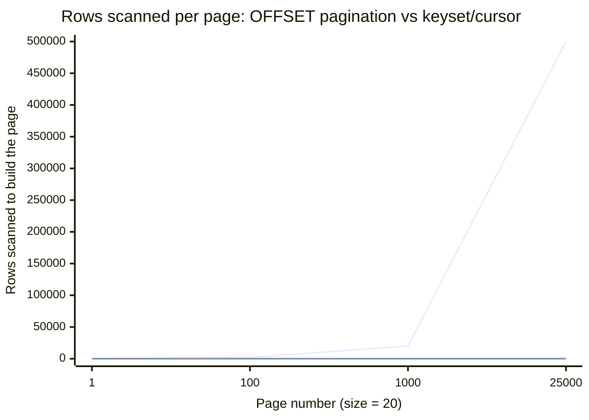
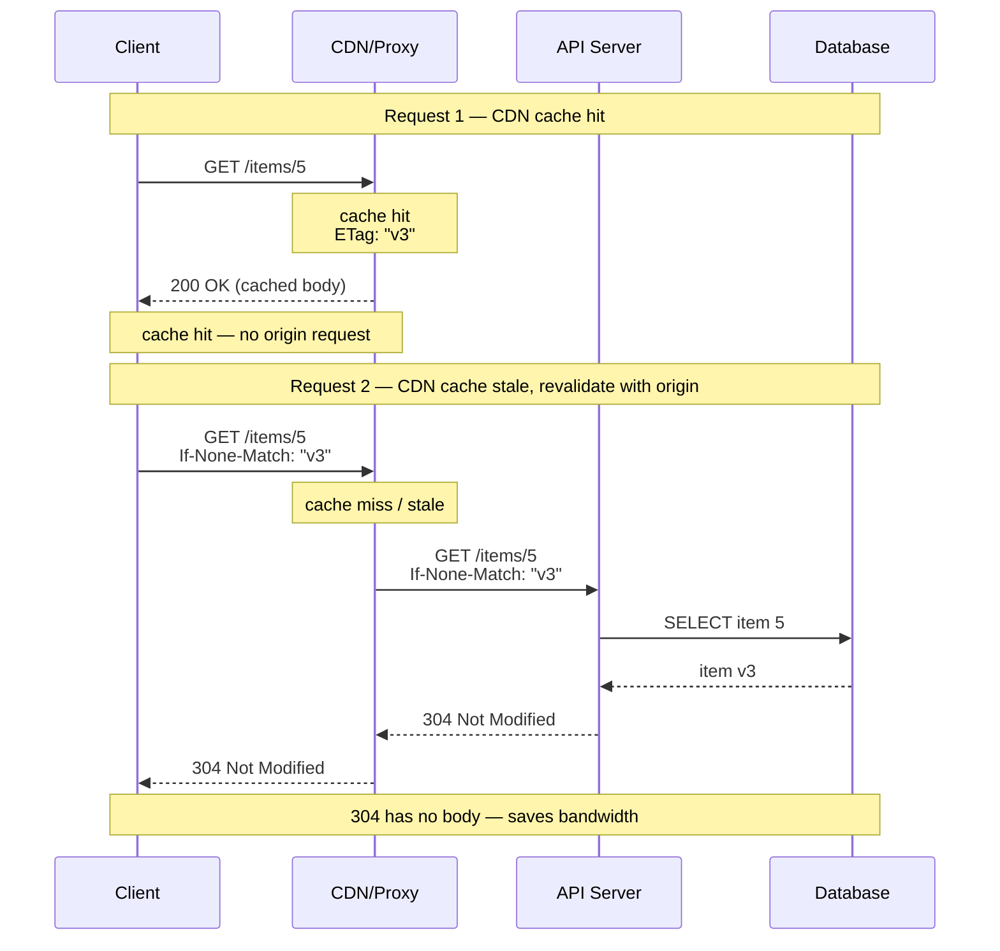
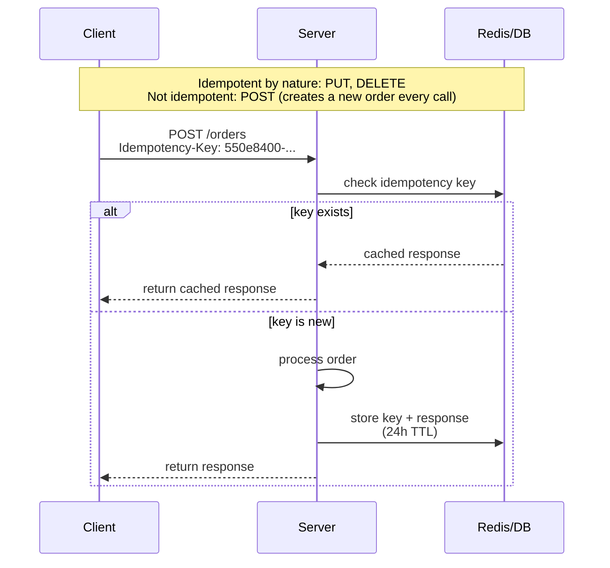
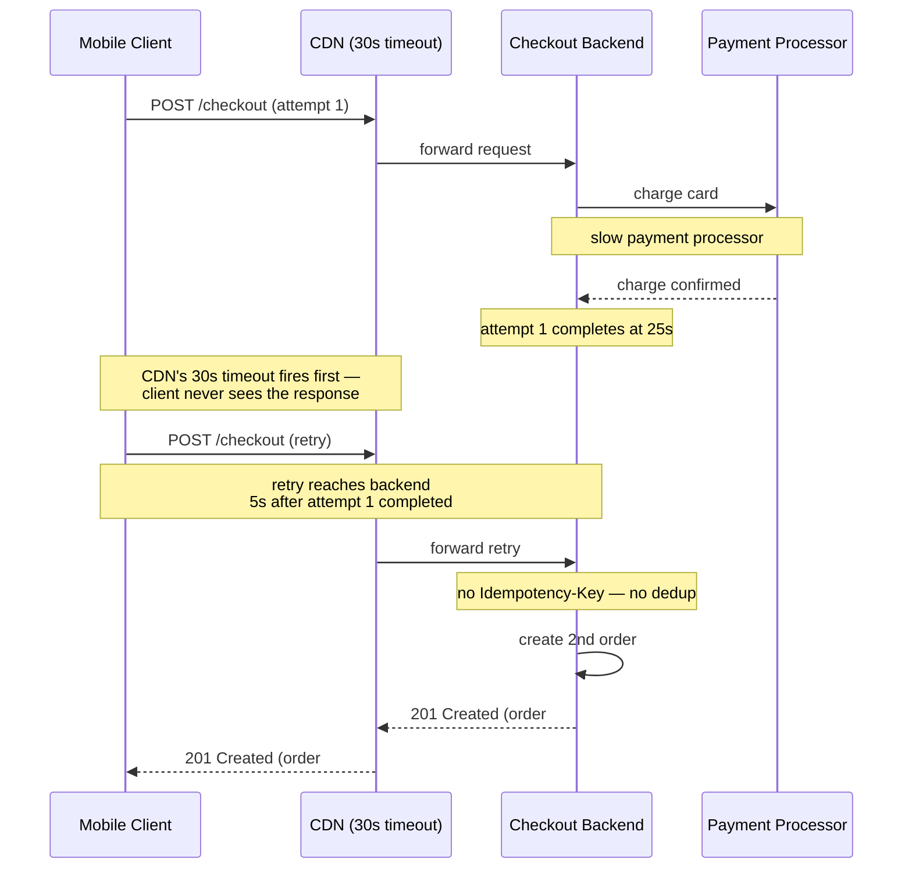

# REST API Design

## 1. Concept Overview

REST (Representational State Transfer) is an architectural style for distributed hypermedia systems, defined by Roy Fielding in his 2000 dissertation. A RESTful API exposes resources (nouns, not verbs) over HTTP, uses standard HTTP methods for operations, and is stateless. REST is the dominant paradigm for public and internal APIs because it leverages HTTP's universal adoption, caching infrastructure, and tooling.

Getting REST right means more than mapping CRUD to HTTP methods. It requires thoughtful resource modeling, consistent versioning, idempotency for safe retries, proper HTTP caching headers, standard error responses, and pagination strategies that scale. Each of these has subtleties that separate well-designed APIs from ones that cause client integration pain for years.

---

## 2. Intuition

> **One-line analogy**: REST is a library where books are resources — you ask for a book by its call number (URL), the library tells you if it's changed since your last visit (ETag), and you never need to know which librarian helped you last time (stateless).

**Mental model**: A REST API is a set of named resources, each with a stable URL. HTTP methods map to operations: GET reads, POST creates, PUT/PATCH updates, DELETE removes. The key is that the URL identifies the resource, and the method specifies the operation — not the reverse (avoid GET /createUser or POST /getUserById).

**Why it matters**: A poorly designed REST API becomes a maintenance burden for years. Inconsistent naming, missing idempotency, no versioning strategy, and absent caching headers cause client-side bugs, unnecessary retries, and tight coupling between clients and server implementations.

**Key insight**: REST constraints exist to enable independent evolution of clients and servers. HATEOAS (Hypermedia As The Engine Of Application State) — rarely implemented but worth understanding — takes this to its logical conclusion: clients discover available actions from response links, not from documentation.

---

## 3. Core Principles

- **Stateless**: Every request contains all information needed to process it. No session state on the server.
- **Uniform interface**: Use HTTP methods consistently, use nouns for resources, use standard status codes.
- **Client-server**: Clients and servers evolve independently.
- **Cacheable**: Responses must declare themselves cacheable or not (Cache-Control, ETag).
- **Layered system**: Client cannot tell if it's talking to a CDN, load balancer, or origin server.
- **Code on demand** (optional): Server can return executable code (JavaScript). Rarely used.

---

## 4. Types / Architectures / Strategies

### 4.1 Resource Modeling

Resources are nouns, not verbs:

```
Good:                           Bad:
GET    /users                   GET /getUsers
GET    /users/{id}              POST /getUserById
POST   /users                   GET /createUser
PUT    /users/{id}              POST /updateUser
DELETE /users/{id}              GET /deleteUser

Collections vs instances:
/users           → collection
/users/123       → instance
/users/123/orders → sub-resource collection
/users/123/orders/456 → sub-resource instance
```

Nesting limit: 2 levels max. Deeper nesting becomes unwieldy:
```
/users/123/orders/456/items/789/reviews   ← too deep
/reviews?orderId=456&itemId=789           ← use query params instead
```

### 4.2 Versioning Strategies

| Strategy | Example | Pros | Cons |
|----------|---------|------|------|
| URI versioning | /api/v2/users | Simple, visible, cacheable | URL changes break bookmarks |
| Header versioning | Accept: application/vnd.api.v2+json | Clean URL, semantic | Less visible, harder to test in browser |
| Query parameter | /api/users?version=2 | Easy to test | Non-standard, pollutes URLs |
| Content negotiation | Accept: application/json; version=2 | Standard HTTP | Complex to implement |

URI versioning is most pragmatic for public APIs. Internal APIs can use header versioning.

### 4.3 HTTP Status Code Reference

Names and semantics below follow **RFC 9110** (HTTP Semantics, 2022), the document that registers the status codes and defines their meaning. 429 is defined separately, by RFC 6585.

| Code | Name | Use Case |
|------|------|---------|
| 200 | OK | Successful GET, PUT, PATCH |
| 201 | Created | Successful POST (include Location header) |
| 202 | Accepted | Async operation accepted (return task URL) |
| 204 | No Content | Successful DELETE; PUT with no response body |
| 301 | Moved Permanently | Permanent URL change. RFC 9110 §15.4.2 notes that "for historical reasons" a user agent MAY rewrite POST to GET — use 308 when that must not happen |
| 302 | Found | Temporary URL change. Carries the same historical POST-to-GET rewrite allowance (§15.4.3) — use 307 when the method must survive |
| 303 | See Other | Redirect the client to a *different* resource, to be fetched with GET. The POST-Redirect-GET response (§15.4.4) |
| 304 | Not Modified | Conditional GET, resource unchanged |
| 307 | Temporary Redirect | Temporary, and the agent "MUST NOT change the request method" (§15.4.8). The method-preserving 302 |
| 308 | Permanent Redirect | Permanent, method and body preserved (§15.4.9). The method-preserving 301 |
| 400 | Bad Request | Client error in request (validation failure) |
| 401 | Unauthorized | Not authenticated (missing/invalid token) |
| 403 | Forbidden | Authenticated but not authorized |
| 404 | Not Found | Resource does not exist |
| 405 | Method Not Allowed | HTTP method not supported for this resource |
| 409 | Conflict | Conflict with current state (duplicate, optimistic lock) |
| 410 | Gone | Resource permanently deleted (stronger than 404) |
| 422 | Unprocessable Content | Semantic validation errors (not syntax). RFC 9110 §15.5.21; many frameworks still label it "Unprocessable Entity" |
| 429 | Too Many Requests | Rate limit exceeded (include Retry-After header) |
| 500 | Internal Server Error | Unhandled server error |
| 502 | Bad Gateway | Upstream service returned invalid response |
| 503 | Service Unavailable | Server temporarily unavailable (include Retry-After) |

### 4.4 Pagination Strategies

| Strategy | Example | Use Case | Limitations |
|----------|---------|---------|-------------|
| Offset | ?page=3&size=20 | Simple, known total count needed | Performance degrades at high offsets; inconsistent on inserts |
| Cursor-based | ?cursor=eyJpZCI6MTAwfQ | Consistent, efficient | Cannot jump to arbitrary page |
| Keyset | ?after_id=100&size=20 | Efficient, consistent, stable | Cannot go backward easily |
| Seek/Keyset | WHERE id > 100 ORDER BY id LIMIT 20 | Most efficient for DB | Same as keyset |

Offset pagination at page 1000 with page size 20 executes `OFFSET 19980` in SQL — the database reads and discards 19,980 rows before the first row it returns, touching 20,000 rows to deliver 20. This causes query time proportional to page number, not page size.



The offset line reuses the two concrete numbers already in this module: page 1000 touches 20,000 rows to return 20 (above), and the equivalent `OFFSET 500000` query discards 500,000 rows (Section 10). Keyset/cursor pagination touches only the page size, 20 rows, at any depth.

**What this actually says.** "`OFFSET N` does not mean 'jump to row N.' It means 'read N rows, throw them all away, then start returning results.' The database has no way to skip rows it has not read."

That one sentence is the whole interview answer. Everything else — why page 1 is fast, why page 1000 times out, why the fix is a `WHERE` clause and not an index — follows from it mechanically.

| Symbol | What it is |
|--------|------------|
| page size | Rows the client actually receives. Constant, 20 here |
| `OFFSET N` | `(page - 1) × page size`. Rows read and discarded before the first result |
| rows scanned, offset | `OFFSET + page size`. Grows linearly with page depth |
| rows scanned, keyset | `page size`. Constant — the index seeks directly to the cursor |
| wasted work ratio | `OFFSET ÷ page size`. Rows discarded per row returned |

**Walk one example.** The four points plotted above, with the waste made explicit:

```
  page    OFFSET     scanned   returned   discarded   wasted per row returned
  -----   --------   -------   --------   ---------   -----------------------
      1          0        20         20           0        0x
    100      1,980     2,000         20       1,980       99x
  1,000     19,980    20,000         20      19,980      999x
 25,000    499,980   500,000         20     499,980   24,999x

  keyset, any page:  WHERE id > <cursor> ORDER BY id LIMIT 20
                     scanned 20, discarded 0, wasted 0x at every depth

  page 25,000 comparison: 500,000 rows scanned vs 20  ->  25,000x more work
```

**Why an index does not save you.** The instinct is "add an index on the sort column." The index does help — it removes the sort — but `OFFSET` still walks the index entries one at a time to count off 499,980 of them before it can start emitting rows. Counting is cheaper than sorting, so the query gets faster, but it stays **O(offset)**. Keyset pagination changes the complexity class rather than the constant: `WHERE id > 100` is a single B-tree descent to the leaf, then a sequential read of 20 entries, which is `O(log n + page size)` at page 1 and page 25,000 alike.

This is also why offset pagination gets *slower as the table grows* even for a fixed page number, and why it silently skips or duplicates rows when items are inserted between requests — the offset counts positions in a result set that shifted underneath it, while a cursor names an actual row that does not move.

---

## 5. Architecture Diagrams

### Request Lifecycle with Caching



The first request is served entirely from the CDN edge cache. The second forces revalidation against the origin, but a matching ETag still returns a bodyless 304 instead of the full payload.

### RFC 9457 Problem Details Error Response

RFC 9457 (2023) defines a machine-readable error body carried as `application/problem+json`.

```json
{
  "type": "https://api.example.com/errors/validation-failed",
  "title": "Validation Failed",
  "status": 400,
  "detail": "Request body failed validation",
  "instance": "/api/v1/users",
  "traceId": "abc-123-def",
  "violations": [
    {
      "field": "email",
      "message": "must be a valid email address",
      "rejectedValue": "not-an-email"
    },
    {
      "field": "age",
      "message": "must be at least 18",
      "rejectedValue": 15
    }
  ]
}
```

---

## 6. How It Works — Detailed Mechanics

### 6.1 Idempotency

An operation is idempotent if applying it N times has the same effect as applying it once. `Idempotency-Key` below is a **vendor convention**, popularised by Stripe, not a standard: the IETF's `draft-ietf-httpapi-idempotency-key-header` has been in the HTTP APIs working group since 2021, sits at revision 07, and is currently in the *expired* draft state with no RFC number. Implement it because your clients expect the Stripe shape, and do not cite a specification for it.



The Idempotency-Key turns a non-idempotent POST into a safely retryable call: the server keys the stored response on the client-supplied UUID and replays it unchanged for 24 hours instead of creating a second order.

### 6.2 HATEOAS

```json
// Without HATEOAS: client must know API structure
GET /orders/123
{
  "id": 123,
  "status": "pending",
  "total": 99.99
}

// With HATEOAS: response tells client what actions are available
GET /orders/123
{
  "id": 123,
  "status": "pending",
  "total": 99.99,
  "_links": {
    "self": { "href": "/orders/123" },
    "cancel": { "href": "/orders/123/cancel", "method": "POST" },
    "payment": { "href": "/payments?orderId=123", "method": "POST" },
    "customer": { "href": "/customers/456" }
  }
}
```

HATEOAS decouples clients from API structure — clients navigate via links, not hardcoded URLs. In practice, it is rarely implemented because API documentation serves the same purpose with less complexity.

### 6.3 OpenAPI 3 Specification

The current release is **OpenAPI 3.2.0** (published 2025-09-19, the first minor bump since 3.1.0 in February 2021). 3.0.x and 3.1.x remain widely deployed, so check what your tooling accepts before declaring `3.2.0`.

```yaml
openapi: 3.2.0
info:
  title: Order API
  version: 1.0.0

paths:
  /orders:
    post:
      summary: Create an order
      operationId: createOrder
      requestBody:
        required: true
        content:
          application/json:
            schema:
              $ref: '#/components/schemas/CreateOrderRequest'
      responses:
        '201':
          description: Order created
          headers:
            Location:
              description: URL of created order
              schema:
                type: string
          content:
            application/json:
              schema:
                $ref: '#/components/schemas/Order'
        '400':
          $ref: '#/components/responses/ValidationError'
        '429':
          $ref: '#/components/responses/RateLimited'
```

### 6.4 Cursor-Based Pagination Implementation

```java
// Request: GET /api/v1/orders?cursor=eyJpZCI6MTAwfQ&size=20
// cursor is base64({"id":100})

// CursorPage is your own DTO — do NOT reuse Spring Data's Page, which is an
// interface (cannot be instantiated) and carries offset/total-count semantics.

@GetMapping("/orders")
public CursorPage<OrderDto> listOrders(
        @RequestParam(required = false) String cursor,
        @RequestParam(defaultValue = "20") int size) {

    Long afterId = cursor != null ? decodeCursor(cursor) : 0L;

    // PageRequest.of(0, ...) here is a LIMIT, not an OFFSET: the page number is
    // pinned at 0 forever and the WHERE id > afterId clause does the seeking.
    // size + 1 fetches one extra row purely to detect whether a next page exists.
    List<Order> orders = orderRepository
        .findByIdGreaterThanOrderByIdAsc(afterId, PageRequest.of(0, size + 1));

    boolean hasNext = orders.size() > size;
    if (hasNext) {
        orders = orders.subList(0, size);
    }

    String nextCursor = hasNext
        ? encodeCursor(orders.get(orders.size() - 1).getId())
        : null;

    return new CursorPage<>(
        orders.stream().map(orderMapper::toDto).toList(),
        nextCursor,
        hasNext
    );
}

private String encodeCursor(Long id) {
    return Base64.getEncoder().encodeToString(
        ("{\"id\":" + id + "}").getBytes()
    );
}
```

---

## 7. Real-World Examples

**GitHub REST API**: Versions via the date-based `X-GitHub-Api-Version` request header, not a path segment — there is no `/v3/` in `api.github.com` URLs, and requests that omit the header default to `2022-11-28`. Unsupported versions get a 410 Gone, and each version is supported for at least 24 months after its successor ships. On conditional requests GitHub's own wording is "most endpoints return an `etag` header, and many endpoints return a `last-modified` header" — most, not all, so do not build a client that assumes universal ETag coverage. Where one is returned, an `If-None-Match` that yields 304 Not Modified does not count against the primary rate limit provided the request was correctly authorized, which is the real reason to use conditional GETs against this API. GitHub also sends a `Link` header with `rel=next/prev/first/last`; the underlying scheme is per-endpoint — `page`/`per_page` (offset) on most endpoints, `before`/`after` cursors or `since` timestamps on others. Validation errors return 422 with a `message` + `errors` array.

**Stripe API**: A widely copied reference for API design. Uses idempotency keys for POST requests, cursor-based pagination with `starting_after`/`ending_before`, and webhook signatures with HMAC-SHA256 in the `Stripe-Signature` header. Its errors are **not** RFC 9457 Problem Details — Stripe uses its own envelope, `{"error": {"type", "code", "message", "param", "doc_url", ...}}`. Versioning is date-based with a release name: major releases carry a codename and monthly releases reuse it, giving strings like `2026-06-24.dahlia`.

---

## 8. Tradeoffs

| Versioning Strategy | Discoverability | Caching | Client Effort |
|--------------------|----------------|---------|---------------|
| URI (/v2/) | High | Easy (different URL) | Low |
| Header | Low | Varies | Medium |
| Query param | High | Easy | Low |

| Pagination | Consistency | Performance at scale | Can seek |
|------------|------------|---------------------|---------|
| Offset | Poor (concurrent writes) | Poor (high OFFSET) | Yes |
| Cursor | Good | Good | No |
| Keyset | Good | Excellent | No (forward only) |

---

## 9. When to Use / When NOT to Use

**REST over gRPC**: Use REST for public APIs, browser-consumable APIs, and when you need human-readable debugging. Use gRPC for internal service-to-service communication where schema enforcement and generated clients save development time.

**Cursor pagination**: Use for any feed, list, or log that can be modified between pages. Use offset only for admin interfaces where user jumps to specific pages and the data does not change.

**Idempotency-Key header**: Implement for all payment, order creation, and other state-changing POST endpoints where network failures may cause retries.

---

## 10. Common Pitfalls

**Returning 200 for errors**: Some APIs return HTTP 200 with an error body (`{"success": false, "error": "not found"}`). This breaks HTTP clients that make decisions based on status codes, breaks monitoring (all requests look successful), and breaks CDN error caching. Always use the appropriate HTTP status code.

**Using GET for state-changing operations**: `GET /users/123/delete` violates REST semantics and is dangerous — bots, prefetch, and crawlers can trigger GET requests. DELETE /users/123 ensures the operation only runs when explicitly executed by a client.

**Missing idempotency for creates**: A network timeout after a POST /orders reaches the server but before the response returns causes clients to retry, creating duplicate orders. Without idempotency keys, you need deduplication logic. With them, the server returns the original response for retries.

**Offset pagination in production**: An application that works fine at launch fails when the database grows to millions of rows. `SELECT * FROM orders ORDER BY created_at OFFSET 500000 LIMIT 20` scans and discards 500,000 rows. Migrate to keyset pagination before this becomes a problem.

**Inconsistent error formats**: Different endpoints returning different error structures (some with "message", others with "error", others with "detail") make client error handling a mess of special cases. Adopt RFC 9457 Problem Details across all endpoints from day one.

---

## 11. Technologies & Tools

| Tool | Purpose |
|------|---------|
| Swagger UI / ReDoc | OpenAPI documentation rendering |
| springdoc-openapi | Spring Boot OpenAPI 3 auto-generation |
| Postman | API testing, collection management |
| `httpie` | CLI HTTP client with JSON formatting |
| RestAssured | Java REST API testing framework |
| `karate` | BDD-style API testing |
| Bruno | Open-source Postman alternative |
| Stoplight Studio | OpenAPI visual editor |

---

## 12. Interview Questions with Answers

**Q: What are the REST architectural constraints?**
**Short:** Fielding's constraints are stateless, uniform interface, client-server, cacheable, layered system, and optional code-on-demand.

Fielding's 2000 dissertation defines five required constraints plus one optional: stateless, uniform interface, client-server, cacheable, layered system, and optionally code-on-demand. Stateless means no server-side session; uniform interface means standard HTTP methods and status codes over resource-based URLs; client-server means the two evolve independently; cacheable means responses declare their own cacheability; layered system means the client cannot tell whether it is talking to the origin or an intermediary; code-on-demand means the server may ship executable code. The most important for API design are stateless, uniform interface, and cacheable.

**Q: What is the difference between PUT and PATCH?**
**Short:** PUT replaces the entire resource and is idempotent; PATCH applies a partial update and is not by default.

PUT replaces the entire resource with the provided representation — fields not included in the request are set to null/default. PATCH applies a partial update — only the fields provided are changed. PUT is idempotent (RFC 9110 §9.3.4); PATCH (RFC 5789) is not idempotent by default — idempotency depends on the patch document. JSON Merge Patch (RFC 7396) is idempotent because it states target values outright, whereas JSON Patch (RFC 6902) is not guaranteed idempotent: RFC 6902 makes no such claim, and `{"op": "add", "path": "/items/-"}` appends a new element on every replay. An "increment counter" PATCH is likewise not idempotent. For most REST APIs, PATCH is more practical for updates.

**Q: How do you version a REST API and what are the tradeoffs?**
**Short:** URI versioning (/v1/, /v2/) is the pragmatic choice for public APIs since it is visible and easy to route.

URI versioning (/v1/, /v2/) is most common: visible, easy to route at the CDN/load balancer, easy to test in a browser. Header versioning (Accept: application/vnd.api.v2+json) is more RESTful but harder to test and less visible. Query parameter (?version=2) is easy to add but not standard. For public APIs, URI versioning is the pragmatic choice. Never remove a version without at least 6-12 months deprecation notice with Sunset headers.

**Q: What is idempotency and why does it matter for API design?**
**Short:** Idempotency means repeating the same request N times has the same effect on server state as sending it once.

Idempotency means sending the same request N times has the same side effect as sending it once. Per RFC 9110 §9.2.2 the idempotent methods are GET, HEAD, PUT, DELETE, OPTIONS and TRACE; POST is not, and PATCH is not idempotent by default. Idempotency is about the effect on server state, not the response: a second DELETE /users/123 correctly returns 404 while the state — "user 123 does not exist" — is identical to after the first call, so DELETE is still idempotent. Idempotency matters because network timeouts can cause clients to retry — a non-idempotent POST retry creates duplicate resources. Adding an Idempotency-Key header to POST endpoints allows clients to safely retry: the server deduplicates based on the key and returns the original response for subsequent calls.

**Q: What is the difference between 401 and 403?**
**Short:** 401 means the client is unauthenticated; 403 means it is authenticated but lacks permission for the resource.

401 Unauthorized means the client is not authenticated — no valid credentials were provided (missing or invalid token). Despite the name, it really means "unauthenticated." The client should authenticate and retry. 403 Forbidden means the client is authenticated but not authorized — the identity is known but lacks permission for the requested resource. The client should not retry with the same credentials.

**Q: How would you design pagination for a high-volume feed?**
**Short:** Use cursor-based pagination with WHERE id > last_seen_id instead of OFFSET, which slows down at depth.

Use cursor-based (keyset) pagination: instead of OFFSET N, use WHERE id > last_seen_id LIMIT 20. This costs O(log n + page size) — one B-tree descent plus a sequential read of the page — at any depth, instead of the O(offset) walk that OFFSET forces. The cursor is an opaque base64-encoded value (e.g., JSON with id and timestamp) so the implementation can change. Provide a next_cursor field in responses. Large feed and log APIs converge on this pattern; Stripe (`starting_after`) and several GitHub endpoints (`before`/`after`) are public examples.

**Q: What is RFC 9457 Problem Details?**
**Short:** RFC 9457 defines a standard application/problem+json error format with type, title, status, detail, and instance.

RFC 9457 defines the standard error response format for HTTP APIs, served with the media type `application/problem+json`. The members are: type (URI identifying the error class), title (human-readable summary), status (HTTP status code), detail (specific explanation for this occurrence), and instance (URI identifying this occurrence). Additional extension members can be added. Using Problem Details ensures all errors have a consistent, machine-parseable format across endpoints.

**Q: How do you design a REST API for a file upload?**
**Short:** Small files use a multipart/form-data POST; large files use a signed URL to upload directly to object storage.

For small files (<10 MB): multipart/form-data POST with the file as a form field. For large files: use a signed URL pattern — client requests a signed upload URL from the API, uploads directly to object storage (S3, GCS), then notifies the API of completion. This offloads bandwidth from the API server and enables resumable uploads. Never buffer large files in the API server's memory.

**Q: What HTTP caching headers should a REST API set?**
**Short:** Set ETag plus Cache-Control for mutable resources, a long max-age for immutable ones, and no-store for sensitive data.

For mutable resources: `ETag` (version identifier) + `Cache-Control: no-cache` (must revalidate, but can store) or `Cache-Control: max-age=60, private`. For immutable versioned resources: `Cache-Control: max-age=31536000, immutable`. For sensitive data: `Cache-Control: no-store`. Always set `Vary: Accept-Encoding` if responses are compressed. The `Vary` header tells caches which request headers affect the response. The same ETag does double duty for conditional requests (RFC 9110 §8.8, §13): clients send `If-None-Match` on GET to get a bodyless 304, and `If-Match` on PUT/PATCH/DELETE for optimistic concurrency — a mismatch returns 412 Precondition Failed. Note that `If-None-Match` uses weak comparison so a weak validator (`W/"v3"`) works, while `If-Match` uses strong comparison and a weak ETag will never match, so byte-exact strong ETags are required for the write path.

**Q: What is HATEOAS and is it practical?**
**Short:** HATEOAS embeds navigable links in responses but is rarely implemented in production APIs today.

HATEOAS (Hypermedia As The Engine Of Application State) means responses include links to related resources and available actions, enabling clients to navigate the API without out-of-band documentation. In theory it allows client-server evolution. In practice it is rarely implemented because: (1) generating links is complex, especially for conditional actions; (2) most clients use generated SDKs from OpenAPI specs rather than following links; (3) it does not solve versioning problems. Understand it for interviews; use OpenAPI in production.

**Q: How do you design an async long-running operation endpoint?**
**Short:** Return 202 Accepted with a Location header to a job status URL that the client polls until completion.

POST /jobs returns 202 Accepted with a Location header pointing to a job status URL (/jobs/123). The client polls GET /jobs/123 until status is "completed" or "failed". The response includes the result URL when done. Alternative: use webhooks — client registers a callback URL, server POSTs the result when done. Webhooks require the client to have a publicly accessible endpoint.

**Q: What is the N+1 problem in REST APIs?**
**Short:** Fetching a parent then querying each child separately causes N+1 requests; batch or embed endpoints fix it.

Clients need a user and their 50 orders. Naive approach: GET /users/123, then GET /orders/123, GET /orders/124... = 51 requests. Solutions: (1) include sub-resources in the response via an `include` or `embed` query parameter; (2) provide a batch endpoint (POST /orders/batch with list of IDs); (3) switch to GraphQL which resolves this structurally. The N+1 problem in REST APIs is the main argument for GraphQL in complex data-access scenarios.

**Q: How do you handle breaking changes in a REST API?**
**Short:** Add fields without removing them, never change field types, and deprecate old versions via the Sunset header.

(1) Add fields without removing (clients ignore unknown fields if using lenient deserialization). (2) Never change field types. (3) Never remove required request fields. (4) Deprecate via the Sunset header (RFC 8594), an HTTP-date: `Sunset: Fri, 01 Jan 2027 00:00:00 GMT`, alongside the Deprecation header (RFC 9745), whose value is a structured-field Date, not a boolean: `Deprecation: @1785542400` (2026-08-01T00:00:00Z) — `Deprecation: true` is pre-standard and invalid. (5) When breaking changes are unavoidable, increment the major version (/v2/). (6) Run both versions in parallel for at least 6 months. (7) Monitor usage of deprecated endpoints via metrics.

**Q: What is content negotiation in REST?**
**Short:** The client's Accept header picks the response format, letting one endpoint serve JSON or XML from the same URL.

The client uses the Accept header to specify acceptable response formats: `Accept: application/json, application/xml;q=0.9`. The server responds with the best match and includes `Content-Type` in the response. This allows one endpoint to serve multiple formats without separate URLs. Java Spring MVC's content negotiation via `produces` on @RequestMapping handles this automatically.

**Q: How do you implement rate limiting in a REST API?**
**Short:** Implement rate limiting at the gateway or filter layer and return 429 with Retry-After and X-RateLimit headers.

Implement at the API gateway or a filter/middleware layer. Return 429 Too Many Requests when the limit is exceeded, with headers: `X-RateLimit-Limit: 100`, `X-RateLimit-Remaining: 0`, `X-RateLimit-Reset: 1735689600` (epoch when window resets), `Retry-After: 60` (seconds). Know which of those are standardised and which are not: `Retry-After` is defined by RFC 9110, while the three `X-RateLimit-*` fields are a de facto convention with no specification behind them — clients guess at their semantics, and different APIs disagree on whether `Reset` is an epoch or a delta. The IETF work to replace them, `draft-ietf-httpapi-ratelimit-headers` (`RateLimit` and `RateLimit-Policy`), is still an active working-group draft at revision 11 and has **not** been published as an RFC, so keep emitting the `X-` fields and treat the standardised pair as something to add later, not to switch to. Use sliding window or token bucket algorithms. Limit by API key, user ID, or IP depending on the use case.

---

## 13. Best Practices

- Use nouns for resource URLs; HTTP methods express the operation.
- Return the created resource in the POST response body (not just a 201 with Location).
- Include a trace/correlation ID in every error response for debugging.
- Adopt RFC 9457 Problem Details (`application/problem+json`) for all error responses from day one.
- Implement Idempotency-Key for all state-changing POST endpoints that create resources.
- Use cursor-based pagination from the start; migrating later is painful.
- Set ETag + Cache-Control on all GET responses — even short-lived cache headers (max-age=5) dramatically reduce origin load.
- Provide a machine-readable OpenAPI spec; generate client SDKs from it.
- Use the Sunset header to communicate deprecation timelines.

---

## 14. Case Study

**Problem**: An e-commerce API had a checkout endpoint `POST /checkout` that was creating duplicate orders during Black Friday traffic spikes. Network timeouts at the CDN layer (30s) were causing mobile clients to retry the checkout POST, resulting in doubled orders and doubled charges.

**Investigation**: Load balancer logs showed the original POST reached the backend and completed in 25s (slow due to payment processor latency). The CDN timed out at 30s and the client retried. The retry arrived 5s after the first request completed, and since there was no deduplication, a second order was created.



The backend finished attempt 1 in 25s, but the CDN's 30s timeout fired before the response reached the client, so the client retried; the retry landed 5s after attempt 1 had already completed and, with no idempotency check, created a second order — exactly what the Idempotency-Key fix below prevents.

**Fix**:
```java
// 1. Client generates UUID once per checkout attempt
// 2. Sends: POST /checkout
//           Idempotency-Key: 7f3a9b2e-1234-5678-abcd-9f8e7d6c5b4a

@PostMapping("/checkout")
public ResponseEntity<Order> checkout(
        @RequestHeader("Idempotency-Key") String idempotencyKey,
        @RequestBody CheckoutRequest request) {

    // Check if this key was already processed
    Optional<CachedResponse> cached =
        idempotencyStore.get(idempotencyKey);

    if (cached.isPresent()) {
        // Return identical response to original request
        return ResponseEntity
            .status(cached.get().getStatus())
            .body(cached.get().getBody());
    }

    // Acquire distributed lock on idempotency key.
    // CloseableLock is your own AutoCloseable wrapper — java.util.concurrent.locks.Lock
    // is NOT AutoCloseable and cannot be used in try-with-resources.
    try (CloseableLock lock = lockService.lock(idempotencyKey, 60, SECONDS)) {
        // Double-check after acquiring lock
        cached = idempotencyStore.get(idempotencyKey);
        if (cached.isPresent()) {
            return ResponseEntity.status(cached.get().getStatus())
                .body(cached.get().getBody());
        }

        Order order = checkoutService.process(request);

        // Store result with 24h TTL
        idempotencyStore.store(idempotencyKey, 201, order, Duration.ofHours(24));

        return ResponseEntity.created(orderUri(order)).body(order);
    }
}
```

**Result**: Zero duplicate orders on the next Black Friday. The idempotency key stored in Redis with a 24h TTL meant all retries within 24 hours returned the original response. The distributed lock prevented concurrent duplicate processing for the rare case of near-simultaneous retries.
