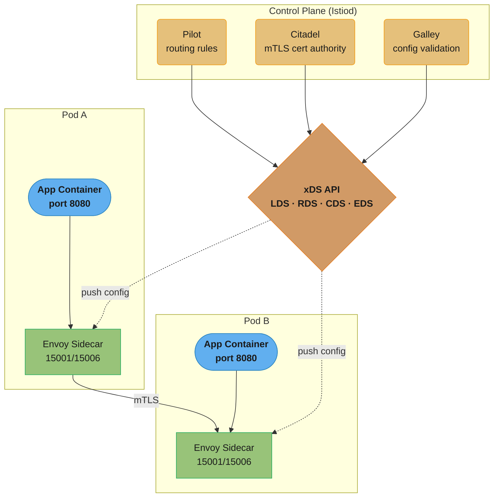
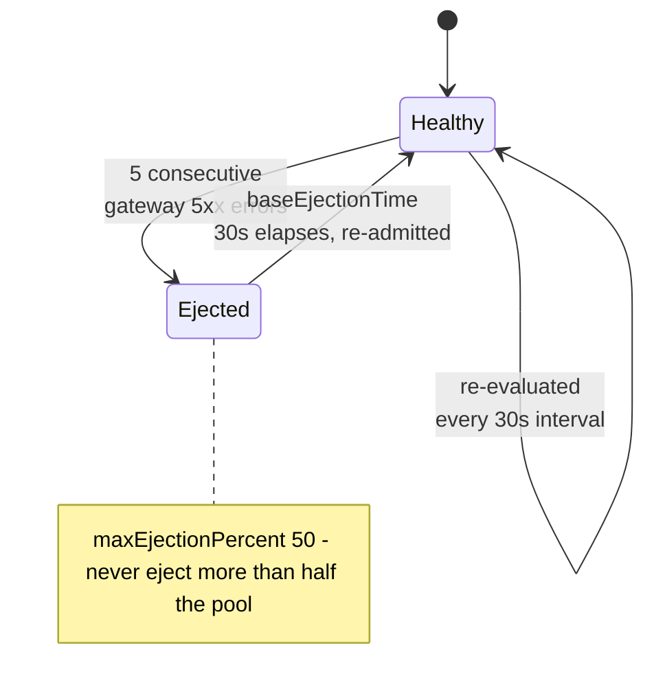
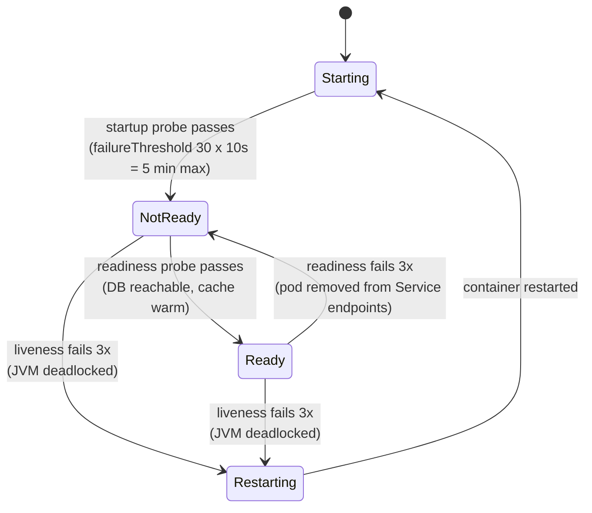

# Service Mesh and Service Discovery

## 1. Concept Overview

A service mesh is a dedicated infrastructure layer for handling service-to-service communication in a microservices architecture. It handles traffic management, security (mTLS), and observability without requiring changes to application code. A sidecar proxy (Envoy) is injected alongside each service instance and intercepts all inbound and outbound traffic. The control plane (Istio) configures and manages the sidecar proxies. Service discovery is the mechanism by which services locate each other's network addresses, which can be client-side (service queries a registry directly), server-side (a load balancer queries the registry), or DNS-based (Kubernetes Services).

---

## 2. Intuition

Without a service mesh, every service must implement its own retry logic, circuit breakers, timeout handling, TLS certificates, and telemetry. This logic is duplicated in each service and is typically inconsistent. A service mesh moves this infrastructure into the sidecar proxy — a shared, consistent implementation that every service benefits from automatically. The application code only speaks to localhost; the sidecar handles all the network complexity.

---

## 3. Core Principles

- **Transparent proxy**: the application does not know about the sidecar; it connects to the sidecar transparently via iptables redirect
- **Separation of concerns**: business logic in the application, networking concerns in the mesh
- **Zero-trust network**: assume any service can be compromised; enforce mTLS between all services
- **Declarative traffic policy**: traffic rules (retries, timeouts, circuit breakers) are configured as Kubernetes CRDs, not in application code
- **Uniform observability**: automatic metrics, traces, and access logs across all services without per-service instrumentation

---

## 4. Types / Architectures / Strategies

**Service mesh implementations**:
- Istio + Envoy: most feature-complete; control plane (Istiod), data plane (Envoy sidecar); complex to operate
- Linkerd: lightweight, Rust-based sidecar; simpler than Istio; less feature-complete
- Consul Connect: HashiCorp Consul with built-in mTLS and intentions
- AWS App Mesh: Envoy-based managed service mesh for AWS

**Service discovery mechanisms**:
- Client-side: service registers with registry (Eureka, Consul), client queries registry, client load-balances
- Server-side: client calls load balancer (AWS ALB, Nginx), LB queries registry, LB routes request
- DNS-based: Kubernetes Services create DNS entries, kube-proxy maintains iptables/IPVS rules
- Mesh-based: control plane distributes service endpoints to all sidecar proxies (xDS protocol)

**Health check types (Kubernetes)**:
- Liveness: is the process alive? Failure → restart container
- Readiness: is the service ready to serve traffic? Failure → remove from Service endpoints
- Startup: has the service finished initializing? Replaces liveness delay for slow-starting apps

---

## 5. Architecture Diagrams

**Service Mesh Architecture (Istio)**


*Istiod's three components compute the mesh configuration and push it to every Envoy sidecar over the xDS API (LDS, RDS, CDS, EDS); iptables then transparently redirects each pod's traffic into its local sidecar, and sidecars encrypt pod-to-pod traffic with mTLS.*

**Service Discovery Mechanisms**

```mermaid
flowchart TD
    classDef io      fill:#61afef,stroke:#2e86c1,color:#1a1a1a,font-weight:bold
    classDef frozen  fill:#c678dd,stroke:#9b59b6,color:#fff
    classDef train   fill:#98c379,stroke:#27ae60,color:#1a1a1a
    classDef mathOp  fill:#d19a66,stroke:#e67e22,color:#1a1a1a,font-weight:bold
    classDef lossN   fill:#e06c75,stroke:#c0392b,color:#fff,font-weight:bold
    classDef req     fill:#56b6c2,stroke:#0097a7,color:#1a1a1a
    classDef base    fill:#e5c07b,stroke:#f39c12,color:#1a1a1a

    subgraph CS["Client-Side (Eureka / Ribbon)"]
        direction LR
        csA(["Service A"]) -->|"query"| csReg["Eureka Registry"]
        csReg -->|"instance list"| csPick{"pick instance<br/>round robin / random"}
        csPick --> csB(["Service B instance"])
    end

    subgraph SS["Server-Side (AWS ALB)"]
        direction LR
        ssA(["Service A"]) -->|"HTTP request"| ssALB["ALB"]
        ssALB -->|"query target group"| ssB(["Service B instance"])
    end

    subgraph DNSSD["DNS-Based (Kubernetes)"]
        direction LR
        dnsA(["Service A"]) -->|"DNS lookup"| dnsKube["kube-dns"]
        dnsKube -->|"ClusterIP"| dnsIptables{"iptables / IPVS"}
        dnsIptables --> dnsB(["healthy pod"])
    end

    class csA,ssA,dnsA io
    class csB,ssB,dnsB io
    class csReg,ssALB,dnsKube base
    class csPick,dnsIptables mathOp
```


*Client-side discovery puts the registry query and load-balancing choice inside the caller; server-side and DNS-based discovery move that decision into shared infrastructure (the ALB or kube-dns) at the cost of one extra hop — see the tradeoffs in §8.*

---

## 6. How It Works — Detailed Mechanics

### Istio Traffic Management

```yaml
# VirtualService: routing rules for traffic entering a service
apiVersion: networking.istio.io/v1alpha3
kind: VirtualService
metadata:
  name: order-service-vs
spec:
  hosts:
    - order-service
  http:
    # Canary: route 10% to v2
    - route:
        - destination:
            host: order-service
            subset: v1
          weight: 90
        - destination:
            host: order-service
            subset: v2
          weight: 10
      # Retry policy applied at mesh level (no code changes needed)
      retries:
        attempts: 3
        perTryTimeout: 2s
        retryOn: 5xx,reset,connect-failure
      timeout: 10s
    # Fault injection for chaos testing
    - fault:
        delay:
          fixedDelay: 5s
          percentage:
            value: 10  # inject delay for 10% of requests
      route:
        - destination:
            host: order-service
            subset: v1
```

```yaml
# DestinationRule: traffic policy for a service
apiVersion: networking.istio.io/v1alpha3
kind: DestinationRule
metadata:
  name: order-service-dr
spec:
  host: order-service
  trafficPolicy:
    # Circuit breaker at mesh level
    outlierDetection:
      consecutiveGatewayErrors: 5       # 5 consecutive 5xx
      interval: 30s                     # evaluated every 30s
      baseEjectionTime: 30s             # eject for 30s initially
      maxEjectionPercent: 50            # never eject more than 50% of instances
    connectionPool:
      tcp:
        maxConnections: 100
      http:
        h2UpgradePolicy: UPGRADE
        http1MaxPendingRequests: 100
        http2MaxRequests: 1000
  subsets:
    - name: v1
      labels:
        version: v1
    - name: v2
      labels:
        version: v2
```

**Outlier Detection State Machine (Envoy)**


*Envoy re-evaluates outlier status on the 30s `interval`; five consecutive gateway errors ejects an instance from the load-balancing pool for `baseEjectionTime` (30s), after which it is re-admitted — `maxEjectionPercent` caps ejections at 50% so a partial bad deploy can never take the whole pool down.*

### mTLS Configuration

```yaml
# Enforce mTLS for all services in the namespace
apiVersion: security.istio.io/v1beta1
kind: PeerAuthentication
metadata:
  name: default
  namespace: production
spec:
  mtls:
    mode: STRICT  # reject all non-mTLS connections

---
# AuthorizationPolicy: who can call whom
apiVersion: security.istio.io/v1beta1
kind: AuthorizationPolicy
metadata:
  name: allow-order-to-inventory
  namespace: production
spec:
  selector:
    matchLabels:
      app: inventory-service
  action: ALLOW
  rules:
    - from:
        - source:
            principals: ["cluster.local/ns/production/sa/order-service"]
      to:
        - operation:
            methods: ["GET", "POST"]
            paths: ["/api/inventory/*"]
```

### Spring Cloud Gateway — Service Discovery with Client-Side Load Balancing

```java
@Configuration
public class GatewayConfig {

    @Bean
    public RouteLocator routes(RouteLocatorBuilder builder) {
        return builder.routes()
            // Route by path to discovered service (lb:// = load-balanced)
            .route("order-service", r -> r
                .path("/api/orders/**")
                .filters(f -> f
                    .circuitBreaker(c -> c
                        .setName("order-cb")
                        .setFallbackUri("forward:/fallback/orders"))
                    .retry(config -> config
                        .setRetries(3)
                        .setMethods(HttpMethod.GET)
                        .setBackoff(Duration.ofMillis(100), Duration.ofMillis(1000), 2, true))
                    .requestRateLimiter(r2 -> r2
                        .setRateLimiter(redisRateLimiter())
                        .setKeyResolver(userKeyResolver())))
                .uri("lb://order-service"))  // resolved via Eureka/Consul
            .build();
    }
}
```

### Kubernetes Service and DNS-Based Discovery

```yaml
# Kubernetes Service creates stable DNS entry and ClusterIP
apiVersion: v1
kind: Service
metadata:
  name: order-service
  namespace: production
spec:
  selector:
    app: order-service
  ports:
    - port: 8080
      targetPort: 8080
  type: ClusterIP
# DNS: order-service.production.svc.cluster.local -> ClusterIP
# kube-proxy maintains iptables rules: ClusterIP -> random healthy pod
```

### Health Check Design Patterns

```yaml
apiVersion: apps/v1
kind: Deployment
metadata:
  name: order-service
spec:
  template:
    spec:
      containers:
        - name: order-service
          image: order-service:1.0.0
          ports:
            - containerPort: 8080
          # Startup probe: generous timeout for slow JVM startup
          # Replaces initial delay for liveness; prevents premature restarts
          startupProbe:
            httpGet:
              path: /actuator/health/liveness
              port: 8080
            failureThreshold: 30    # 30 * 10s = 5 minutes max startup time
            periodSeconds: 10

          # Liveness: is the JVM alive? NEVER check external deps here
          # A DB being down should NOT restart the pod — just remove from LB
          livenessProbe:
            httpGet:
              path: /actuator/health/liveness
              port: 8080
            initialDelaySeconds: 0  # startup probe handles delay
            periodSeconds: 10
            failureThreshold: 3     # 3 consecutive failures -> restart

          # Readiness: is the service ready for traffic?
          # Check DB connectivity, cache warmup, etc.
          readinessProbe:
            httpGet:
              path: /actuator/health/readiness
              port: 8080
            periodSeconds: 5
            failureThreshold: 3     # 3 consecutive failures -> remove from Service
```

**Kubernetes Probe Lifecycle**


*Before the startup probe passes, liveness and readiness are not evaluated at all; once running, a readiness failure only pulls the pod out of the Service's endpoint list (no restart) while a liveness failure restarts the container — the distinction the database-connectivity-in-liveness pitfall in §10 gets wrong.*

```java
// Spring Boot Actuator health endpoints
// /actuator/health/liveness — Kubernetes liveness check
// /actuator/health/readiness — Kubernetes readiness check

@Component
public class DatabaseReadinessIndicator implements HealthIndicator {

    private final DataSource dataSource;

    @Override
    public Health health() {
        try (Connection conn = dataSource.getConnection()) {
            conn.isValid(1); // 1 second timeout
            return Health.up().build();
        } catch (SQLException e) {
            // readiness fails -> pod removed from LB -> no new traffic
            // liveness remains passing -> pod NOT restarted
            return Health.down()
                .withDetail("database", "Connection failed: " + e.getMessage())
                .build();
        }
    }
}
```

### Eureka Client-Side Discovery (Spring Cloud)

```yaml
# application.yaml — Eureka client
spring:
  application:
    name: order-service
  cloud:
    loadbalancer:
      ribbon:
        enabled: false  # use Spring Cloud LoadBalancer (Ribbon deprecated)

eureka:
  client:
    service-url:
      defaultZone: http://eureka-server:8761/eureka/
    register-with-eureka: true
    fetch-registry: true
    registry-fetch-interval-seconds: 30
  instance:
    lease-renewal-interval-in-seconds: 30
    lease-expiration-duration-in-seconds: 90
    health-check-url-path: /actuator/health
    prefer-ip-address: true
```

---

## 7. Real-World Examples

- **Google**: Envoy was created by Lyft and adopted widely; Google contributed heavily to Istio which uses Envoy; GCP's Traffic Director is a managed service mesh control plane
- **Lyft**: originated Envoy proxy to solve their microservices networking challenges (service discovery, circuit breaking, observability) without modifying application code
- **Shopify**: uses Istio in production; automated mTLS rotation improved security posture; automatic distributed tracing via mesh removed need for per-service tracing instrumentation
- **Airbnb**: migrated from SmartStack (client-side discovery with Zookeeper) to Kubernetes-native discovery with Envoy sidecars

---

## 8. Tradeoffs

| Approach | Pros | Cons |
|----------|------|------|
| Service mesh (Istio) | Automatic mTLS, observability, traffic control; no code changes | Operational complexity, sidecar overhead (~5-10ms latency, ~50MB RAM per pod) |
| Client-side discovery (Eureka) | Simple, low latency | Logic in every service, registry becomes critical SPOF |
| Server-side discovery (ALB) | Simple client | Extra network hop, LB becomes bottleneck |
| DNS-based (Kubernetes Services) | Simplest, built-in | Limited metadata, no fine-grained traffic control |

---

## 9. When to Use / When NOT to Use

Use a service mesh when: you have 20+ microservices, need zero-trust security (mTLS), want centralized traffic control without code changes, or need uniform observability across all services.

Do NOT add a service mesh for a small number of services (< 10) — the operational overhead is not justified. Do NOT enable a service mesh if the team lacks Kubernetes and networking expertise; misconfigured Istio is worse than no mesh (traffic misrouting, unexpected mTLS failures). For simpler setups, Spring Cloud Gateway + Resilience4j + Spring Cloud LoadBalancer provides similar capabilities without sidecar overhead.

For liveness probes: NEVER check external dependencies (database, cache, downstream services) in liveness. A liveness failure triggers a pod restart. If all pods in a deployment restart simultaneously because the shared database is temporarily unavailable, the service has a self-inflicted outage. Liveness should only check that the JVM is alive and not deadlocked.

---

## 10. Common Pitfalls

**Liveness probe checking database connectivity**: A team configured liveness to call `SELECT 1` on the database. During a brief database maintenance window (2 minutes), all 10 pods failed their liveness probe. Kubernetes restarted all 10 pods simultaneously. Each pod tried to reconnect to the DB during startup, creating a connection storm that overwhelmed the DB, extending the outage from 2 minutes to 15 minutes. Fix: liveness = only check JVM health (trivial HTTP endpoint returning 200); readiness = check DB connectivity.

**Eureka registry cache causing stale instances**: A service instance was terminated but Eureka clients cached the old registry for `registry-fetch-interval-seconds=30`. For 30 seconds after instance termination, some requests were routed to the dead instance, causing connection refused errors. Fix: set `ribbon.ServerListRefreshInterval=5000` (5s cache refresh) and ensure HTTP clients have appropriate connect timeout and retry on first failure.

**Istio breaking existing HTTP health checks during mTLS migration**: A team enabled `STRICT` mTLS across the namespace before updating health check endpoints to use HTTPS. Kubernetes HTTP health checks (non-mTLS) started failing because Istio rejected non-mTLS connections. All pods entered a crash loop. Fix: set mTLS to `PERMISSIVE` first (accepts both mTLS and plaintext), migrate health checks to use Istio's built-in bypass (port 15021 for health checks bypasses mTLS), then switch to `STRICT`.

---

## 11. Technologies & Tools

| Tool | Purpose |
|------|---------|
| Istio | Service mesh control plane (traffic, security, observability) |
| Envoy | High-performance sidecar proxy (data plane) |
| Kiali | Istio observability UI (service topology, traffic visualization) |
| Linkerd | Lightweight service mesh (Rust-based sidecar) |
| Consul | Service discovery + KV + health checking + service mesh |
| Spring Cloud Eureka | Client-side service registry for Spring apps |
| Spring Cloud LoadBalancer | Client-side load balancing (replacement for Ribbon) |
| Kubernetes Services | Built-in DNS-based service discovery |

---

## 12. Interview Questions with Answers

**Q: What is a service mesh and what problems does it solve?**
A service mesh is a dedicated infrastructure layer for service-to-service communication. It solves: (1) mTLS between services without code changes (zero-trust security), (2) centralized retry/timeout/circuit breaker policy applied uniformly, (3) automatic distributed tracing and metrics for all service calls, (4) traffic control (canary releases, A/B testing, traffic mirroring) at the infrastructure level. Without a mesh, each service implements these concerns differently or not at all. The mesh uses a sidecar proxy (Envoy) injected into each pod; iptables rules redirect all pod traffic through the sidecar, making it transparent to applications.

**Q: What is the difference between liveness and readiness probes?**
Liveness determines if the process is alive — failure triggers a container restart. Check only that the JVM is running and not deadlocked: `GET /actuator/health/liveness` returning 200 is sufficient. Readiness determines if the service is ready to accept traffic — failure removes the pod from the Service's endpoints (no new requests). Check all dependencies: DB connectivity, cache availability, any required warmup. The critical distinction: if a database goes down, all pods should fail readiness (removed from LB, no new traffic) but pass liveness (not restarted). If liveness was tied to DB health, all pods would restart simultaneously, potentially causing a cascading failure.

**Q: What is the difference between client-side and server-side service discovery?**
In client-side discovery, the service queries a registry (Eureka, Consul) for available instances and performs load balancing itself using a client-side library (Spring Cloud LoadBalancer). The client knows about all instances and can implement sophisticated routing (zone-aware, latency-based). The downside is logic in every service and a tightly coupled registry. In server-side discovery, the client makes a request to a load balancer or DNS name; the load balancer queries the registry. The client is simpler but there is an extra network hop. Kubernetes Services are a form of server-side discovery using iptables/IPVS at the node level, which adds minimal latency.

**Q: How does Istio implement circuit breaking without code changes?**
Istio's `DestinationRule` `outlierDetection` configuration implements circuit breaking at the Envoy sidecar level. You configure: `consecutiveGatewayErrors` (how many 5xx responses before ejecting an instance), `interval` (how often to evaluate), `baseEjectionTime` (how long to eject for), and `maxEjectionPercent` (max percentage of instances to eject simultaneously). When Envoy detects that a specific upstream instance is returning errors, it stops routing traffic to that instance for the ejection period, then gradually re-admits it. This works for any service regardless of language or framework.

**Q: What is mTLS in a service mesh and why is it important?**
Mutual TLS (mTLS) means both the client and server authenticate each other using TLS certificates, unlike regular HTTPS where only the server is authenticated. In a service mesh, Istio's Citadel issues certificates to each service (based on its Kubernetes ServiceAccount). When service A calls service B, both sides present and validate certificates. This provides: authentication (only services with valid certificates can communicate), encryption (traffic is encrypted in transit — protects against eavesdropping within the cluster), and authorization (Istio's AuthorizationPolicy can restrict which service identities can call which endpoints). This implements zero-trust networking inside the cluster.

**Q: How does xDS protocol work in Istio?**
xDS (x Discovery Service) is the API between Istio's control plane (Istiod) and Envoy sidecar proxies. It consists of several sub-APIs: LDS (Listener Discovery Service) configures what ports Envoy listens on; RDS (Route Discovery Service) configures routing rules (VirtualService); CDS (Cluster Discovery Service) defines upstream service clusters (DestinationRule); EDS (Endpoint Discovery Service) provides healthy endpoint lists for each cluster. Istiod watches Kubernetes Service and Pod resources, merges Istio CRD configurations (VirtualService, DestinationRule), and pushes the derived xDS configuration to all relevant Envoy proxies. This is how a change to a VirtualService takes effect across all pods within seconds without restart.

**Q: What is the startup probe in Kubernetes and when should you use it?**
The startup probe prevents liveness and readiness probes from interfering with slow-starting applications. Before the startup probe succeeds, liveness and readiness probes are not evaluated. Configure `failureThreshold * periodSeconds` to cover the maximum possible startup time (Spring Boot cold start: 10-30 seconds). Once the startup probe succeeds, it is no longer checked — liveness and readiness take over. Without a startup probe, you would set `initialDelaySeconds=60` on liveness, meaning if the JVM hangs after startup, Kubernetes waits 60 seconds before restarting. With a startup probe, liveness reacts immediately after startup completes.

**Q: How do you perform a progressive canary rollout using Istio VirtualService traffic weights?**
Split traffic between two DestinationRule subsets by weight in the VirtualService, then raise the canary's percentage only after each step clears its error-rate and latency gates. Using the `order-service-vs` VirtualService from §6, start the canary (`subset: v2`) at 5% weight and stable (`subset: v1`) at 95%, watch p99 latency and 5xx rate for a fixed soak window of 10-15 minutes, then move to 25%, 50%, and 100% at the same cadence — the same weight-based mechanic the container-deployment canary diagram shows, implemented at the mesh layer instead of the Kubernetes Service layer. Because this is a config-only change, Istiod pushes the new routing table to every Envoy sidecar over xDS within seconds and no pods are created or destroyed at any step. Automate the gate checks with Argo Rollouts' Istio integration rather than eyeballing dashboards — a human watching a graph at 2 AM is the weakest link in an otherwise automated rollout.

**Q: What is the difference in responsibility between a VirtualService and a DestinationRule in Istio?**
A VirtualService controls where a request routes to, and a DestinationRule controls how the connection to a chosen destination behaves. VirtualService owns request-level routing: path matching, header-based routing, traffic-weight splitting between subsets, retries, timeouts, and fault injection. DestinationRule owns connection-level policy applied once the destination is chosen: subset definitions that map a label like `version: v2` to a name a VirtualService can reference, the `outlierDetection` circuit breaker, and `connectionPool` limits like `maxConnections: 100`. A common interview trap is describing the circuit breaker as a VirtualService feature — it lives entirely in DestinationRule's `trafficPolicy.outlierDetection` block, as shown in §6, and in practice the two are almost always defined together.

**Q: What are the concrete steps to migrate a namespace from PERMISSIVE to STRICT mTLS without an outage?**
Deploy PERMISSIVE mode first so every pod accepts both plaintext and mTLS, migrate health checks to Istio's mTLS-bypass port, then switch to STRICT. Step one: apply a `PeerAuthentication` with `mode: PERMISSIVE`, which lets sidecars accept both encrypted and plaintext traffic so nothing breaks while some callers still lack a sidecar. Step two: verify every caller-callee pair actually negotiates mTLS with `istioctl authn tls-check`, and repoint any Kubernetes health check that hits the pod directly to Istio's reserved port 15021 (`/healthz/ready`), which bypasses mTLS specifically for kubelet probes. Step three: only after tls-check shows 100% mTLS traffic and health checks pass through 15021, flip `PeerAuthentication` to `mode: STRICT` — the case study in §10 is the cautionary tale, since skipping straight to STRICT before fixing health checks crash-loops every pod in the namespace at once.

**Q: What is the actual resource and latency cost of putting an Envoy sidecar in front of every pod?**
Each Envoy sidecar typically adds 5-10ms of p99 latency per hop and reserves around 50MB of RAM, multiplied across every pod in the mesh. From the tradeoffs table in §8: with 25 services averaging 4 replicas each, that is roughly 5GB of cluster-wide RAM spent on sidecars alone before any application logic runs, plus a CPU request per sidecar the scheduler must find room for on every node. Latency compounds with call depth — a request fanning out through 4 services now crosses 8 sidecar hops, client-side and server-side Envoy on each leg, which at 5-10ms each can add 40-80ms to a call chain that previously had none. This is why §9 draws the line at roughly 20+ services before a mesh pays for itself; below that, Spring Cloud Gateway plus Resilience4j delivers similar value without the per-hop tax.

**Q: How does Istio route pod traffic into the Envoy sidecar without any application code changes?**
An init container installs iptables rules that transparently redirect all inbound and outbound pod traffic through the Envoy sidecar's ports before the application container starts. The Istio CNI plugin or the `istio-init` container runs `iptables -t nat` rules that intercept traffic on the pod network namespace: inbound traffic redirects to Envoy's port 15006, and outbound traffic from the app container redirects to port 15001, both shown in the PodA/PodB diagram in §5. The application still believes it is talking directly to `order-service:8080`, but the kernel-level NAT rule silently routes the packet through Envoy first, which applies mTLS, retries, and telemetry before forwarding it on. Because this happens below the application layer, it works identically for a Java, Python, or legacy binary service with no HTTP client changes required.

**Q: What is Eureka's self-preservation mode and why can it cause stale routing during an outage?**
Self-preservation mode stops Eureka from expiring instance registrations when too many clients suddenly stop renewing their leases at once. Eureka expects roughly 85% of registered instances to renew their 30-second lease on schedule; if the renewal rate drops below that, commonly from a network partition or a mass simultaneous restart, Eureka assumes the network is unhealthy rather than the instances, and stops evicting anyone to avoid a false-positive mass deregistration. The tradeoff: during a real outage, self-preservation keeps serving stale addresses for longer than the normal 90-second `lease-expiration-duration-in-seconds`, so some requests keep hitting dead instances until the renewal rate recovers above 85%. This is a deliberate tradeoff toward registry availability over correctness — a single team's rolling restart of 20 instances at once can accidentally trip it, which is why Eureka dashboards show a visible banner when it activates.

**Q: What DNS caching pitfall can break client-side load balancing after a backend IP changes?**
The JVM caches successful DNS lookups by default, so a client can keep sending traffic to an old IP long after the hostname behind it has moved. The `networkaddress.cache.ttl` security property defaults to caching forever on many JVM distributions when no SecurityManager is installed, meaning a resolved hostname-to-IP mapping never expires for the life of the process, not even after the DNS record's own TTL elapses. This bites hardest with a database endpoint or internal load balancer that fails over to a new IP — client-side connection pools keep reconnecting to the dead IP and every new attempt times out until the JVM process restarts. Fix: explicitly set `networkaddress.cache.ttl=30` seconds, and prefer Kubernetes Service ClusterIPs, a stable virtual IP backed by iptables rather than a DNS-cached hostname, for in-cluster discovery specifically to sidestep this bug.

**Q: What goes wrong when a startup probe's failureThreshold is too tight for a service running database migrations at boot?**
A startup probe sized for a normal cold start restarts the container mid-migration, because Flyway or Liquibase can hold the process in a not-yet-ready state far longer than a typical boot. The startup probe in §6 allows `failureThreshold: 30` at `periodSeconds: 10`, a 5-minute budget sized for ordinary Spring Boot cold start; a schema migration touching a multi-million-row table can easily run 6-8 minutes, well past that budget. When the probe finally fails, Kubernetes kills and restarts the container without rolling back the partially applied migration, so the new container boots into a half-migrated schema, and Flyway's checksum validation can then refuse to proceed at all. Fix: size `failureThreshold * periodSeconds` to comfortably exceed the worst observed migration time, or run migrations in an init container or a one-shot Job that completes before the main container's startup probe begins evaluating.

**Q: Why is setting both initialDelaySeconds on a liveness probe and a separate startupProbe usually redundant?**
The two settings solve the same problem in incompatible ways, and only the startup probe actually adapts to real startup time. `initialDelaySeconds` on `livenessProbe` is a fixed guess — Kubernetes waits that many seconds before the first check regardless of whether the app was ready in 5 seconds or still not ready after 55; the health-check YAML in §6 sets `initialDelaySeconds: 0` specifically because a `startupProbe` already handles that delay dynamically, checking every `periodSeconds` until it passes or `failureThreshold` is exhausted. Leaving a nonzero `initialDelaySeconds` alongside a `startupProbe` is usually harmless but redundant, since the startup probe already gates when liveness begins evaluating, though a short `initialDelaySeconds` paired with a generous startup budget can mask which setting actually explains an observed restart. The clean pattern: set `initialDelaySeconds: 0` on both liveness and readiness once a startup probe exists, and let it own the entire cold-start grace period.

---

## 13. Best Practices

- Deploy service mesh in PERMISSIVE mTLS mode first, verify all services work, then switch to STRICT
- Use the startup probe instead of `initialDelaySeconds` — it is more precise and adapts to actual startup time
- Configure `maxEjectionPercent` on DestinationRule to prevent the circuit breaker from ejecting all instances simultaneously
- Use `ServiceEntry` to register external services (third-party APIs, databases) in the mesh for uniform observability
- Label all pods with `version` label for subset-based traffic splitting (canary deployments)
- Test mTLS configuration with `istioctl authn tls-check`
- Monitor Envoy sidecar resource usage — CPU and memory overhead is real (~50MB RAM per sidecar)
- Use Kiali to visualize service topology and identify unexpected cross-service connections

---

## 14. Case Study

**Problem**: An e-commerce platform had 25 microservices in Kubernetes. Every team implemented its own retry logic, circuit breakers, and timeouts with different libraries and configurations. During an incident, it was impossible to determine which service was responsible for cascading failures. Security team required mTLS between all services but implementing it in each service's code was estimated at 3 months of work.

**Solution with Istio**:
1. Installed Istio with `PERMISSIVE` mTLS; validated all services continued to work
2. Switched to `STRICT` mTLS — automatic certificate issuance and rotation for all 25 services took 2 days
3. Removed all per-service circuit breaker and retry code; replaced with Istio DestinationRule and VirtualService configs
4. Automatic distributed tracing (Kiali + Jaeger) revealed that 3 services had undocumented synchronous dependencies on a slow legacy service
5. Canary deployments via VirtualService weight routing replaced manual rolling deployments

**Results**:
- Security: all 25 services communicate via mTLS without a single code change
- Reliability: uniform circuit breaker configuration prevents cascading failures
- Observability: Kiali shows service topology and p99 latency per service pair in real time
- Operational overhead: adding a new service automatically inherits all mesh policies
