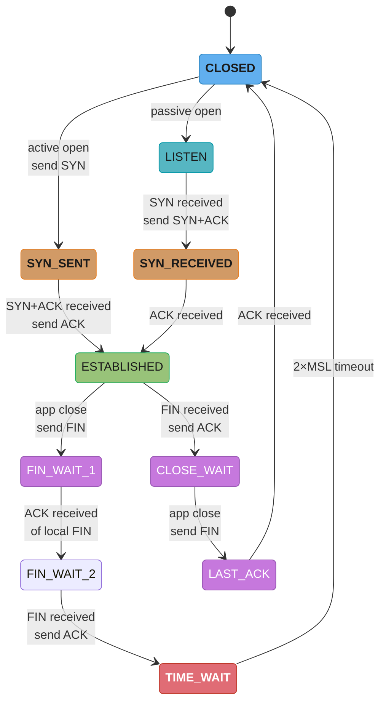
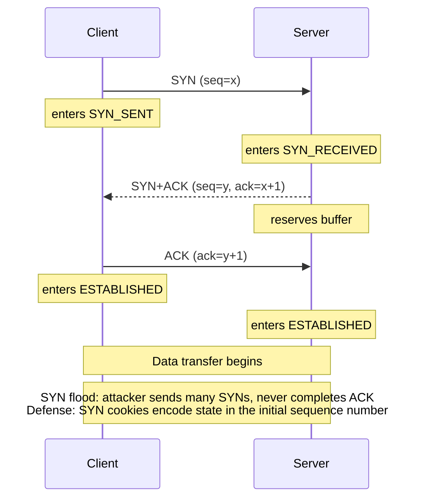
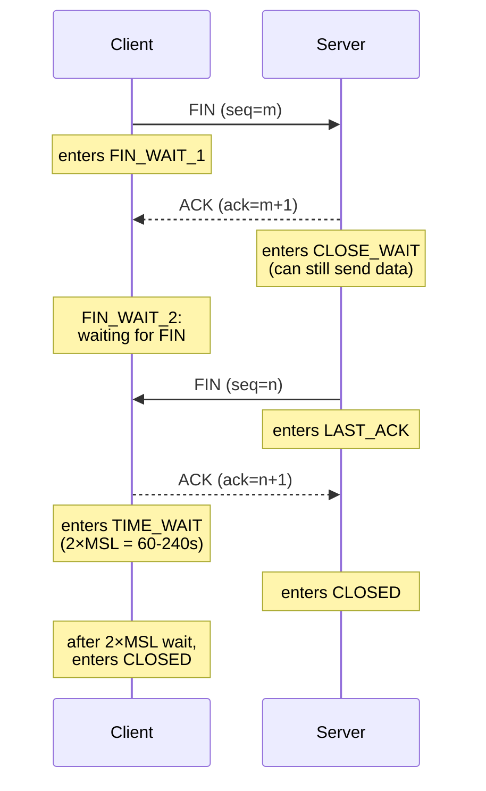
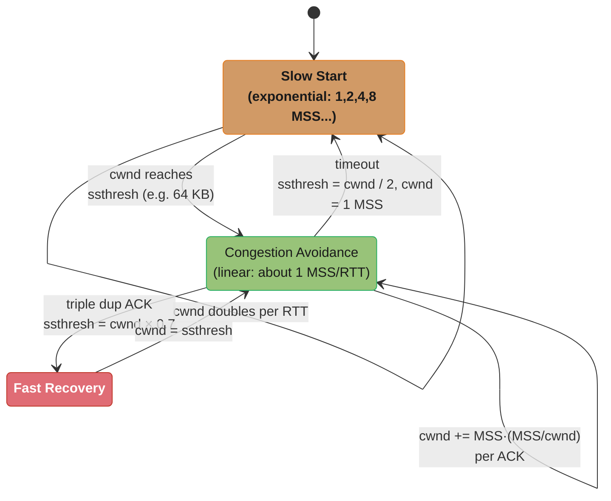
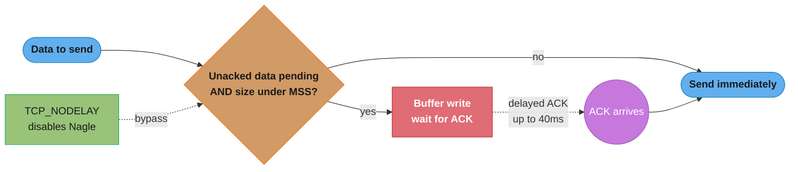
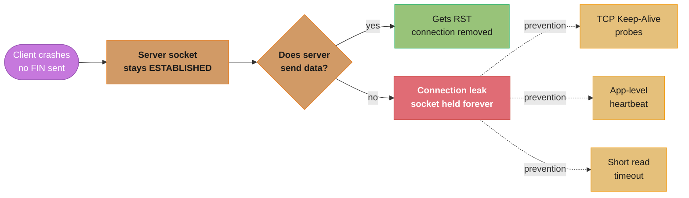
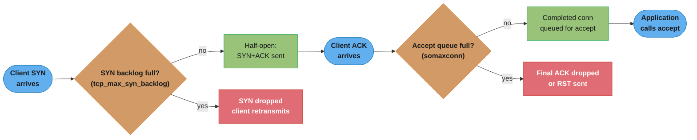

# TCP/IP Deep Dive

## 1. Concept Overview

TCP (Transmission Control Protocol) is the foundation of reliable communication on the internet. It provides ordered, error-checked delivery of a stream of bytes between applications running on hosts in an IP network. Every HTTP request, database query, and gRPC call rides on TCP. Understanding TCP internals — handshakes, flow control, congestion control, connection state management — is essential for diagnosing latency problems, tuning servers under high connection rates, and understanding why services misbehave under load.

This module covers TCP deeply: the complete state machine, flow and congestion control algorithms, TIME_WAIT implications for servers, socket-level tuning parameters, and Nagle's algorithm — a silent killer of low-latency applications.

---

## 2. Intuition

> **One-line analogy**: TCP is a reliable pipe built on top of an unreliable postal service (IP). It guarantees that all letters arrive, in order, exactly once — by numbering every letter, requiring acknowledgment, and retransmitting if none arrives.

**Mental model**: TCP is a sliding window protocol. The sender maintains a window of bytes that can be "in flight" (sent but not acknowledged). The receiver's window (rwnd) limits how fast the sender can push data. The congestion window (cwnd) limits how fast the network can absorb data. The actual send rate is min(rwnd, cwnd).

**Why it matters**: TIME_WAIT sockets accumulate on busy servers and can exhaust ephemeral ports. Nagle's algorithm batches small writes, adding 40ms+ latency to request-response protocols unless disabled. Congestion control algorithms determine throughput over long-distance or lossy links. Getting these wrong causes production latency spikes and connection failures.

**Key insight**: TCP was designed in 1981 for reliability on unreliable networks. Its defaults (port range, socket backlog, TIME_WAIT duration) were set for servers handling hundreds of connections. Modern servers handle hundreds of thousands — you must tune the kernel.

---

## 3. Core Principles

- **Reliability**: Sequence numbers + acknowledgments ensure ordered, exactly-once delivery.
- **Flow control**: Receiver advertises rwnd (receive window) to prevent sender from overwhelming it.
- **Congestion control**: Sender maintains cwnd to avoid overwhelming the network; adjusts based on loss signals.
- **Connection-oriented**: Explicit setup (3-way handshake) and teardown (4-way close or RST).
- **Full-duplex**: Both sides can send and receive simultaneously.
- **Byte stream**: No message boundaries — application must delimit messages (e.g., HTTP Content-Length header).

---

## 4. Types / Architectures / Strategies

### 4.1 TCP Header Fields

| Field | Size | Purpose |
|-------|------|---------|
| Source Port | 16 bit | Sender's port |
| Destination Port | 16 bit | Receiver's port |
| Sequence Number | 32 bit | Position of first byte in this segment |
| Acknowledgment Number | 32 bit | Next byte receiver expects |
| Data Offset | 4 bit | Header length in 32-bit words |
| Flags | 9 bit | SYN, ACK, FIN, RST, PSH, URG, ECE, CWR |
| Window Size | 16 bit | Receiver's available buffer (rwnd) |
| Checksum | 16 bit | Error detection |
| Urgent Pointer | 16 bit | Out-of-band data offset |

### 4.2 Congestion Control Algorithms

| Algorithm | Loss Signal | Behavior | Use Case |
|-----------|------------|----------|----------|
| TCP Reno | Packet loss | Additive increase / multiplicative decrease | Default on many older systems |
| TCP CUBIC | Packet loss | Cubic function for cwnd growth | Linux default since kernel 2.6.19 |
| TCP BBR | Bandwidth + RTT | Model-based, probes BDP | Google, high-latency/high-BDP links |
| QUIC | Packet loss + ECN | Per-stream control | HTTP/3 |

### 4.3 TCP State Machine



The active opener (client) walks CLOSED → SYN_SENT → ESTABLISHED while the passive opener (server) walks CLOSED → LISTEN → SYN_RECEIVED → ESTABLISHED; on close, the active closer's path (FIN_WAIT_1 → FIN_WAIT_2 → TIME_WAIT) forces the 2×MSL wait (60–240s on Linux) that drives the TIME_WAIT accumulation problem in Section 6.2, while the passive closer takes the shorter CLOSE_WAIT → LAST_ACK path straight to CLOSED.

---

## 5. Architecture Diagrams

### 3-Way Handshake



Three steps are required because both sides must independently confirm their initial sequence numbers before data flows; SYN cookies defend the handshake against floods by encoding connection state in the ISN instead of consuming a SYN-backlog entry (see Section 6.6).

### 4-Way Teardown (Active Close)



The active closer (here, the client) pays the 2×MSL TIME_WAIT cost (60–240s on Linux) while the passive closer (server) reaches CLOSED immediately after its final ACK — the asymmetry behind TIME_WAIT accumulation on servers that initiate their own outbound closes (Section 6.2).

### Sliding Window Flow Control

```
Sender Buffer
[SENT+ACK'd] [SENT, not ACK'd] [Can send now] [Cannot send yet]
             |<---  cwnd  --->|<--- rwnd --->|

Effective window = min(cwnd, rwnd)

If rwnd=0: sender stops, sends 1-byte "window probe" periodically
Window scale option (WSopt): allows rwnd up to 1GB (beyond 64KB default)
```

**In plain terms.** "You may have at most one window's worth of unacknowledged bytes in flight, and the window is whichever limit is tighter — what the receiver can store, or what the network can absorb."

That single sentence is the whole reason a fast link can still be slow: the sender is not rate-limited by bandwidth, it is limited by how many bytes it is allowed to leave unacknowledged while it waits one round trip for permission to send more.

| Symbol | What it is |
|--------|------------|
| `cwnd` | Congestion window — the sender's own guess at what the network can carry, adjusted by loss/delay signals |
| `rwnd` | Receive window — how much free buffer the receiver advertises in every ACK |
| `min(cwnd, rwnd)` | Effective window. Whichever side is more pessimistic wins; the other limit is irrelevant |
| `rwnd = 0` | Receiver buffer is full. Sender freezes and sends periodic 1-byte probes to learn when it reopens |
| WSopt | Window scale — a shift factor negotiated at handshake that lifts the 16-bit `rwnd` ceiling from 64 KB to 1 GB |

**Walk one example.** Why the 64 KB default caps a fast intercontinental link:

```
  throughput = effective window / RTT

  window = 64 KB, RTT = 80 ms
    65,536 bytes / 0.080 s  =  819,200 B/s  =  0.82 MB/s  =  6.6 Mbps

  window = 4 MB (window scaling on), RTT = 80 ms
    4,194,304 bytes / 0.080 s  =  52.4 MB/s  =  419 Mbps      64x more

  window = 64 KB, RTT = 1 ms (same-datacenter)
    65,536 / 0.001  =  65.5 MB/s  =  524 Mbps                 64 KB is fine here
```

The RTT is the denominator, so the same 64 KB window that saturates a datacenter link
delivers 6.6 Mbps across an ocean. This is the bandwidth-delay product (BDP) argument:
to keep a 1 Gbps link busy at 80 ms RTT you need `1 Gbps / 8 x 0.080 s = 10,000,000 bytes`
— about 9.5 MB — in flight at once, which is 150x the unscaled 64 KB ceiling. That is
exactly why the tuning table in Section 8 raises `SO_RCVBUF`/`SO_SNDBUF` to 4–16 MB on
high-BDP links: the buffer *is* the window, and the window *is* the throughput.

### Slow Start & Congestion Avoidance



Slow start doubles cwnd every RTT (1, 2, 4, 8 MSS…) until ssthresh (e.g. 64 KB), then congestion avoidance grows linearly by about 1 MSS per RTT; a triple-duplicate ACK triggers fast recovery (ssthresh = cwnd × 0.7) while a full timeout resets to slow start (ssthresh = cwnd / 2, cwnd = 1 MSS).

**What this actually says.** "Probe aggressively while you know nothing, then creep once you have found the edge — and treat a lost packet as proof you went too far."

The asymmetry is deliberate: growth is multiplicative going up (doubling) but the response to loss is multiplicative going *down* (halving). This is AIMD's cousin, and it is what keeps many independent TCP flows from collectively collapsing a shared link.

| Symbol | What it is |
|--------|------------|
| MSS | Maximum segment size — the largest payload one TCP segment carries, typically 1460 bytes on Ethernet |
| `cwnd` | Current congestion window, counted in MSS units |
| `ssthresh` | Slow-start threshold. Above it, switch from doubling to linear growth |
| `cwnd += MSS·(MSS/cwnd)` per ACK | Congestion avoidance. Summed over one full window of ACKs this adds exactly 1 MSS per RTT |
| `ssthresh = cwnd × 0.7` | Fast recovery after triple dup-ACK. Loss was mild, so give back only 30% |
| `ssthresh = cwnd / 2, cwnd = 1` | Timeout. No ACKs came back at all, so assume the worst and restart from scratch |

**Walk one example.** How many round trips a fresh connection needs before it stops being polite, with MSS = 1460 bytes and ssthresh = 64 KB:

```
  RTT 0    cwnd =  1 MSS  =   1,460 bytes
  RTT 1    cwnd =  2 MSS  =   2,920
  RTT 2    cwnd =  4 MSS  =   5,840
  RTT 3    cwnd =  8 MSS  =  11,680
  RTT 4    cwnd = 16 MSS  =  23,360
  RTT 5    cwnd = 32 MSS  =  46,720          still under 65,536
  RTT 6    cwnd = 64 MSS  =  93,440          crosses ssthresh -> linear from here

  ssthresh 65,536 / 1,460  =  44.9 MSS
```

Six round trips to reach 64 KB. On an 80 ms intercontinental RTT that is `6 x 80 = 480 ms`
spent before the connection is even warm — and a short HTTP response finishes long before
then, so it never leaves slow start at all. That is the arithmetic behind connection reuse:
every new TCP connection pays the ramp again, which is why the Nginx `keepalive 32` upstream
pool in Section 7 and HikariCP's long-lived connections matter more than any congestion-control
tuning flag.

**Why the linear phase looks so strange.** `cwnd += MSS·(MSS/cwnd)` per ACK is written per-ACK
but is designed to be read per-RTT. One full window generates `cwnd/MSS` ACKs, and each adds
`MSS²/cwnd` bytes, so the round-trip total is `(cwnd/MSS) × (MSS²/cwnd) = MSS` — one segment
per RTT, exactly. Without the `/cwnd` divisor a large window would grow proportionally to its
own size and the ramp would never flatten.

---

## 6. How It Works — Detailed Mechanics

### 6.1 Sequence Numbers and Acknowledgments

TCP numbers every byte in the stream. The SYN itself consumes one sequence number. Each data byte increments the sequence number. The ACK number is the next byte the receiver expects (cumulative ACK). If the receiver gets bytes 0-999 and 2000-2999 but not 1000-1999, it ACKs only 1000 (cumulative). The gap is filled by retransmission.

Selective Acknowledgment (SACK) option allows the receiver to inform the sender of non-contiguous blocks received, enabling selective retransmission instead of retransmitting everything after a gap.

### 6.2 TIME_WAIT and Its Server-Side Implications

After active close, the closer enters TIME_WAIT for 2*MSL (Maximum Segment Lifetime). On Linux, MSL is typically 30–60 seconds, so TIME_WAIT lasts 60–120 seconds. The purpose: ensure the final ACK reaches the other side, and absorb stale duplicate packets from previous connection incarnations.

**Problem**: A high-throughput HTTP server making many outbound connections (reverse proxy, service mesh, database client) accumulates TIME_WAIT sockets. Ephemeral ports are typically 28,000–65,000 (32,768–60,999 on Linux by default). At 60,000 TIME_WAIT sockets, new connections fail with "Cannot assign requested address" (EADDRNOTAVAIL).

**Read it like this.** "A port is not free the moment you close it — it is rented for 2×MSL afterwards, so your sustainable connection rate is the port pool divided by how long each rental lasts."

This is Little's Law wearing a networking costume: sockets in TIME_WAIT are the "items in the system", the connection rate is the arrival rate, and 2×MSL is the service time. Nothing about it is specific to TCP; it is the same arithmetic as sizing a connection pool.

| Symbol | What it is |
|--------|------------|
| MSL | Maximum segment lifetime — how long the network may plausibly still hold a stray packet. 30–60 s on Linux |
| 2×MSL | TIME_WAIT duration, 60–120 s. One MSL for the final ACK to arrive, one for any reply it triggers |
| Port pool | Ephemeral range width, `60999 − 32768 + 1` = 28,232 ports by default |
| Sustainable rate | `port pool ÷ 2×MSL` — new connections per second before ports run out |
| Ports in use | `connection rate × 2×MSL` — the steady-state TIME_WAIT count |

**Walk one example.** Both directions of the same equation, per destination IP:port pair:

```
  How fast can I go?      rate = ports / TIME_WAIT

    28,232 / 60 s   =   470 conn/s        (MSL = 30 s)
    28,232 / 120 s  =   235 conn/s        (MSL = 60 s)

  How many ports will I burn?    ports = rate x TIME_WAIT

      500 conn/s  x 60 s  =  30,000 sockets     survivable
    1,000 conn/s  x 60 s  =  60,000 sockets     EADDRNOTAVAIL

  After widening the range to 1024-65000:
    63,976 / 60 s   =  1,066 conn/s       roughly 2.3x headroom
```

The 60,000 figure above is not arbitrary — it is exactly what 1,000 connections/second
sustains for 60 seconds. Note how modest 470 conn/s is: a reverse proxy that opens a fresh
upstream connection per request hits the wall at traffic levels a single core handles
comfortably. Widening the port range buys about 2.3x, and `tcp_tw_reuse` buys more, but both
are second-best. Keep-alive is the real fix because it changes the *rate* term to near zero
rather than stretching the pool — one pooled connection serving 10,000 requests consumes one
port instead of 10,000 rentals.

```bash
# Check TIME_WAIT count
ss -s | grep TIME-WAIT

# Check ephemeral port range
cat /proc/sys/net/ipv4/ip_local_port_range
# default: 32768 60999 (28,232 ports, inclusive)

# Tuning options:
# 1. Widen port range
echo "1024 65000" > /proc/sys/net/ipv4/ip_local_port_range

# 2. Enable tcp_tw_reuse (safe for client-side)
echo 1 > /proc/sys/net/ipv4/tcp_tw_reuse

# 3. Keep-Alive reduces connections created (prefer over TIME_WAIT tuning)
echo 60 > /proc/sys/net/ipv4/tcp_keepalive_time
echo 10 > /proc/sys/net/ipv4/tcp_keepalive_intvl
echo 6  > /proc/sys/net/ipv4/tcp_keepalive_probes
```

`tcp_tw_reuse`: allows reuse of TIME_WAIT sockets for new outbound connections when it is safe (requires timestamps to distinguish old vs new segments). Safe for client-side connections (databases, upstream HTTP). Do NOT use `tcp_tw_recycle` (removed in kernel 4.12) — it breaks connections through NAT.

### 6.3 Nagle's Algorithm

Nagle's algorithm (RFC 896) batches small TCP writes: it holds outgoing data until either a full MSS can be sent or all outstanding unacknowledged data is ACKed. This reduces packet count on congested networks but adds up to 40ms (one delayed ACK timeout) of latency for request-response protocols.



Nagle's algorithm buffers a small write until the prior write is ACKed; paired with a receiver's 40ms delayed-ACK timer, this is the classic request-response latency bug — TCP_NODELAY bypasses the check entirely (see Section 14's case study for a production example of this exact interaction).

```java
// In Java, disable Nagle's for low-latency connections
ServerSocket serverSocket = new ServerSocket(8080);
Socket socket = serverSocket.accept();
socket.setTcpNoDelay(true);  // TCP_NODELAY

// For HttpClient (Java 11+)
HttpClient client = HttpClient.newBuilder()
    // No direct API — use system property:
    // -Djdk.httpclient.allowRestrictedHeaders=connection
    .build();
```

Redis clients, gRPC, and JDBC drivers all set TCP_NODELAY by default. MySQL Connector/J had a bug in older versions where TCP_NODELAY was off, causing intermittent 40ms latency on every small query.

### 6.4 Half-Open Connections

A half-open connection occurs when one end of a TCP connection has closed but the other does not know. Common cause: network partition, process crash without graceful close, idle connection through a stateful firewall that expired the state.



A half-open connection leaks memory silently when no data is ever sent on the stale socket; TCP Keep-Alive, application heartbeats, and short read timeouts are the three standard mitigations, with application heartbeats preferred as the most reliable.

### 6.5 SO_REUSEPORT

`SO_REUSEPORT` allows multiple sockets to bind to the same port. The kernel load-balances incoming connections across sockets. This enables:
- Multiple threads/processes to accept on the same port without a shared accept mutex
- Zero-downtime restarts (new process binds port, old process drains)

Nginx and newer Java runtimes use `SO_REUSEPORT` for their acceptor threads.

### 6.6 SYN Backlog and Accept Queue

The TCP handshake creates two queues:
- **SYN backlog** (incomplete queue): half-open connections (SYN received, SYN+ACK sent, waiting for ACK). Default: `net.ipv4.tcp_max_syn_backlog` = 128–256.
- **Accept queue** (complete queue): completed 3-way handshakes waiting for `accept()` call. Default: `net.core.somaxconn` = 128.



A SYN traverses two queues before reaching the application: the incomplete SYN backlog (half-open connections) and the complete accept queue (finished handshakes awaiting `accept()`); either one filling under burst load silently drops packets instead of erroring, which is why "Accept queue overflow under burst load" (Section 10) is so easy to misdiagnose.

When queues fill, new SYNs are dropped (causing client retransmit). For high-traffic servers:

```bash
echo 65535 > /proc/sys/net/core/somaxconn
echo 65535 > /proc/sys/net/ipv4/tcp_max_syn_backlog
# Also set in the application:
# new ServerSocket(port, 65535)  // backlog parameter
```

---

## 7. Real-World Examples

**Nginx as reverse proxy**: Nginx accepts HTTP connections on port 80/443, terminates TLS, and proxies to backend servers. It uses `SO_REUSEPORT` for worker processes and HTTP Keep-Alive with upstream servers (configured via `upstream` block with `keepalive 32`). Without upstream keepalive, Nginx creates a new TCP connection per request — causing connection rate spikes and TIME_WAIT accumulation.

**HikariCP and TCP Keep-Alive**: HikariCP uses `connectionTestQuery` or JDBC4 `isValid()` to validate connections. But at the TCP level, a silent firewall can drop the underlying socket without either end knowing. HikariCP's `connectionTimeout`, `idleTimeout`, and `maxLifetime` settings exist partly for this reason. Configuring `socketTimeout` in the JDBC URL ensures the driver closes stale connections.

**BBR congestion control at Google**: Google deployed BBR on their backbone and reported 2–25% throughput improvement on their CDN. BBR does not react to packet loss alone — it models bandwidth and RTT to find the optimal operating point. On high-bandwidth, high-latency links (inter-continental), BBR dramatically outperforms CUBIC.

---

## 8. Tradeoffs

| Parameter | Default | Tuned | Tradeoff |
|-----------|---------|-------|---------|
| Ephemeral port range | 32768–60999 | 1024–65000 | More ports, but low ports may conflict with services |
| tcp_tw_reuse | 0 | 1 | Reduces TIME_WAIT pressure; safe only with TCP timestamps |
| TCP_NODELAY | Off | On | Lower latency, more packets, higher CPU |
| SO_RCVBUF/SO_SNDBUF | Auto | 4 MB–16 MB | Higher throughput on high-BDP links; more memory per socket |
| tcp_keepalive_time | 7200s | 60s | Detects stale connections faster; more probe traffic |

| Congestion Algorithm | Fairness | High-BDP | Lossy | CPU |
|---------------------|---------|---------|-------|-----|
| CUBIC | Good | Medium | Poor | Low |
| BBR | Variable | Excellent | Good | Medium |
| Reno | Good | Poor | Poor | Low |

```mermaid
quadrantChart
    title Congestion algorithm fit: high-BDP vs lossy-link performance
    x-axis Low BDP-link throughput --> High BDP-link throughput
    y-axis Poor lossy-link robustness --> Good lossy-link robustness
    quadrant-1 Satellite / long-haul links
    quadrant-2 Bandwidth-limited niches
    quadrant-3 Reno: legacy / simple nets
    quadrant-4 CUBIC: datacenter / low-loss
    CUBIC: [0.55, 0.25]
    BBR: [0.85, 0.7]
    Reno: [0.2, 0.2]
```

BBR's bandwidth-and-RTT model — rather than reacting to loss alone — lets it dominate the high-BDP, lossy quadrant where Google reported 2–25% throughput gains after deploying it (Section 7), while CUBIC remains the safer default for low-loss, high-BDP datacenter networks.

---

## 9. When to Use / When NOT to Use

**TCP_NODELAY**: Always enable for request-response protocols (Redis, JDBC, gRPC, HTTP/1.1 without pipelining). Do not enable for bulk data transfer (file upload) — Nagle's batching improves throughput there.

**tcp_tw_reuse**: Enable on servers making many outbound connections (reverse proxies, service meshes). Do not enable when connections go through NAT hardware that does not support timestamps, or when using raw sockets.

**Large socket buffers (SO_SNDBUF)**: Enable for long-haul data transfer between data centers. Do not increase buffers blindly for many-connections workloads — each socket consumes the buffer memory.

---

## 10. Common Pitfalls

**Missing TCP_NODELAY on database connections**: JDBC drivers without TCP_NODELAY interact with delayed ACK to produce 40ms latency spikes on every small SQL query. The symptom is query latency consistently around 40ms when the database is on a separate host, even for simple `SELECT 1`. Fix: add `tcpNoDelay=true` to the JDBC URL or configure it in the connection pool.

**tcp_tw_recycle causing NAT breakage**: The `tcp_tw_recycle` option (removed in Linux 4.12) enabled aggressive TIME_WAIT recycling but relied on per-host timestamp state. When multiple clients behind a NAT gateway connected to the same server, the server would see decreasing timestamps from the NAT IP and drop connections. This caused intermittent connection failures in cloud environments. The lesson: `tcp_tw_recycle` was always dangerous; `tcp_tw_reuse` is the safe alternative.

**SYN flood and exhausted SYN backlog**: Without SYN cookies, a SYN flood exhausts the SYN backlog and legitimate connections are refused. `net.ipv4.tcp_syncookies=1` enables SYN cookies as a defense, encoding the state in the initial sequence number so no queue entry is needed until the handshake completes.

**Accept queue overflow under burst load**: When a service restarts and suddenly receives burst traffic, completed connections fill the accept queue faster than the application calls `accept()`. The kernel silently drops the final ACK or sends RST. The client retries, eventually succeeding, but initial requests timeout. Fix: increase `somaxconn`, ensure the application's acceptor loop is fast (do not do work in the acceptor thread).

**Half-open connections through firewalls**: Stateful firewalls expire TCP state after an inactivity timeout (typically 350–1800 seconds depending on the vendor). If no data flows during this period, the firewall drops the session entry but does not send RST. Both ends still think the connection is ESTABLISHED. The next packet (typically a health check or query) times out waiting for a response that will never come because the firewall silently drops it. Fix: TCP Keep-Alive at the OS level, or application heartbeats shorter than the firewall timeout.

---

## 11. Technologies & Tools

| Tool | Purpose |
|------|---------|
| `ss -tan` | TCP socket states with addresses |
| `netstat -s` | TCP statistics (retransmits, resets, etc.) |
| `tcpdump -i eth0 port 5432` | Capture database TCP traffic |
| `sysctl net.ipv4` | View/set TCP kernel parameters |
| `nmap --scan-flags SYN` | TCP SYN scan |
| `iperf3 -c server` | TCP throughput measurement |
| Wireshark TCP stream stats | RTT, retransmit, window size graphs |
| `ip tcp_metrics` | Per-host TCP performance metrics cache |
| `ethtool -K eth0 gso off` | Disable TCP segmentation offload (for testing) |

---

## 12. Interview Questions with Answers

**Q: Describe the TCP 3-way handshake and why each step is necessary.**
Client sends SYN with its initial sequence number. Server responds with SYN+ACK, acknowledging the client's sequence and sending its own sequence. Client sends ACK, acknowledging the server's sequence. Three steps are required because both sides need to agree on initial sequence numbers independently. A 2-way handshake would not establish the server's sequence number acknowledgment before data flows.

**Q: What is TIME_WAIT and why does it exist?**
TIME_WAIT is the state the active closer enters after sending the final ACK, lasting 2*MSL (60–240 seconds on Linux). It serves two purposes: ensuring the final ACK reaches the other side (if lost, the passive closer retransmits FIN and the active closer re-sends ACK), and ensuring all duplicate packets from the previous connection expire before the port pair is reused (preventing data corruption in a new connection).

**Q: How does TIME_WAIT cause problems on busy servers and how do you fix it?**
High-throughput servers making many short-lived outbound connections accumulate TIME_WAIT sockets that hold ports until expiry. If the ephemeral port range is exhausted, new connections fail with EADDRNOTAVAIL. Fix: (1) use persistent connections/connection pooling to reduce connection churn; (2) widen ephemeral port range to 1024–65000; (3) enable tcp_tw_reuse=1 for outbound connections; (4) never use tcp_tw_recycle (broken with NAT).

**Q: What is Nagle's algorithm and when should you disable it?**
Nagle's algorithm holds small TCP writes in a buffer until a full MSS is available or all outstanding data is ACKed, reducing small-packet overhead. Disable it (TCP_NODELAY=true) for request-response protocols like Redis, JDBC, or gRPC, where a single small request must be sent immediately. Without TCP_NODELAY, Nagle's interacts with delayed ACK to add 40ms of artificial latency to every request.

**Q: Explain TCP slow start and congestion avoidance.**
Slow start begins each new connection with cwnd=1 MSS and doubles it per RTT until reaching the slow start threshold (ssthresh). This avoids overwhelming the network immediately. Once ssthresh is reached, congestion avoidance takes over and increases cwnd by 1 MSS per RTT (linear). On packet loss (triple duplicate ACK), ssthresh is halved and cwnd is reduced; on timeout, cwnd is reset to 1 MSS (full slow start restart).

**Q: What is the difference between FIN and RST?**
FIN initiates a graceful close: the sender has finished sending but can still receive data. The other side may still send data. RST is an abrupt close: immediately terminates the connection with no data loss tolerance. RST is sent when a packet arrives for a closed socket, when a connection must be immediately aborted (e.g., SO_LINGER with l_onoff=1, l_linger=0), or to reject a SYN for a port with no listener.

**Q: What is the SYN backlog and how does SYN flooding exploit it?**
The SYN backlog holds half-open connections (SYN received, SYN+ACK sent, waiting for final ACK). A SYN flood attack sends many SYNs from spoofed IPs without completing handshakes, exhausting the backlog so legitimate connections are rejected. Defense: SYN cookies (tcp_syncookies=1) encode connection state in the ISN so no queue entry is needed until the ACK arrives.

**Q: How does TCP flow control work?**
The receiver advertises its available buffer space as the window size (rwnd) in each ACK. The sender never sends more bytes than the current rwnd. If rwnd reaches 0, the sender stops and sends 1-byte probes (window probes) periodically. Once the receiver drains its buffer and sends a window update with rwnd > 0, the sender resumes. This prevents the sender from overwhelming the receiver's buffer.

**Q: What is TCP Keep-Alive and when should you use it?**
TCP Keep-Alive sends probe packets on idle connections to detect if the other end is still alive. Configured via tcp_keepalive_time (default 7200s), tcp_keepalive_intvl (probe interval, default 75s), tcp_keepalive_probes (number of probes before declaring dead, default 9). Use it when connections must traverse stateful firewalls or NAT gateways that expire idle sessions, and when detecting half-open connections from crashed peers. Application-level heartbeats are more reliable and should be preferred.

**Q: What is BBR and how does it differ from CUBIC?**
CUBIC (Linux default) reacts to packet loss as a congestion signal — it reduces cwnd on each loss event. BBR (Bottleneck Bandwidth and RTT) probes for available bandwidth and RTT to model the network's operating point, then maintains cwnd at the bandwidth-delay product. BBR handles high-latency, high-bandwidth links better because it does not interpret every packet loss as congestion. On lossy wireless links, BBR can be too aggressive and crowd out loss-based algorithms.

**Q: What is the difference between SO_REUSEADDR and SO_REUSEPORT?**
SO_REUSEADDR allows binding a socket to a port that is in TIME_WAIT state (common for servers restarting quickly — without it, bind fails for 60–240 seconds). SO_REUSEPORT allows multiple sockets (in different processes or threads) to bind to the same IP:port; the kernel load-balances incoming connections across them. Nginx and modern Java servers use SO_REUSEPORT for worker-per-core architectures.

**Q: What are half-open connections and how do they cause memory leaks?**
A half-open connection occurs when one end has closed (process crash, network partition) but the other end's socket is still ESTABLISHED. The OS holds the socket and its buffers indefinitely because no signal (FIN or RST) was received. This leaks file descriptors and memory. Detection: `ss -tan | grep ESTABLISHED` growing without bound. Fix: TCP Keep-Alive with aggressive timers, application heartbeats, and connection idle timeouts.

**Q: What happens to in-flight data during a server restart?**
If the server process exits without calling close() on sockets, the OS sends RST to all connected clients. If the server calls close() gracefully (sends FIN), clients receive the FIN and can read remaining buffered data. For zero-downtime restarts: (1) stop accepting new connections but finish processing in-flight requests; (2) use SO_REUSEPORT for the new process to accept new connections immediately; (3) drain the old process with a timeout.

**Q: What is ECN (Explicit Congestion Notification)?**
ECN is a mechanism where routers mark packets (setting ECE/CWR bits in the IP header) to signal congestion before dropping packets. TCP supports ECN (IANA-registered TCP option). Benefits: faster congestion response without packet loss, lower latency. Requirement: both endpoints and all routers in the path must support ECN. In practice, some routers drop ECN-marked packets, requiring fallback. Linux enables ECN via `net.ipv4.tcp_ecn=1`.

**Q: How does TCP handle out-of-order delivery?**
TCP buffers out-of-order segments at the receiver. The receiver sends ACKs for the last contiguous byte received. If segment 1000–1999 arrives, then 3000–3999 arrives before 2000–2999, the receiver ACKs only 2000 (edge of contiguous delivery) but buffers 3000–3999. With SACK, the receiver can also report 3000–3999 as received, allowing the sender to retransmit only 2000–2999.

**Q: What is the significance of the sequence number space and why are initial sequence numbers (ISN) random?**
The 32-bit sequence number wraps around at 4 GB. ISNs are randomized to prevent blind packet injection attacks: an attacker who knows the IP:port pair cannot inject forged segments without guessing the current sequence number. The ISN randomization makes this guessing computationally infeasible, preventing TCP hijacking attacks.

**Q: What happens when a server calls listen(sockfd, backlog) with a small backlog?**
The second argument to listen() sets the maximum length of the accept queue (completed connections waiting for accept()). If the backlog is 5 and 10 connections complete the handshake before the application calls accept(), 5 will be queued and the other 5 will have their final ACKs silently dropped (or RST sent). The client will see a timeout or reset. Under burst traffic, a small backlog causes connection failures even when the server is healthy. Always set backlog to at least 1024, and increase somaxconn/tcp_max_syn_backlog accordingly.

**Q: Why do load balancers sometimes send RST to upstream connections?**
Load balancers have idle connection timeouts. When a backend connection has been idle for the configured timeout (commonly 60–300 seconds), the load balancer closes it, often by sending RST. If the backend application has no connection validation and reuses the connection, the next request will fail with a broken pipe error. This is why connection pools should have maxLifetime shorter than the LB idle timeout, and why keepalive probes should be shorter than the LB timeout.

**Q: Explain the relationship between TCP window size and throughput.**
Throughput = window_size / RTT. A TCP window of 64 KB over a 100ms RTT link gives 640 KB/s maximum throughput, regardless of bandwidth. The TCP window scale option (RFC 1323) extends the window to 1 GB. For high-BDP (bandwidth-delay product) links, increasing socket buffers is critical. `net.core.rmem_max` and `net.core.wmem_max` control maximum buffer sizes.

---

## 13. Best Practices

- Always set TCP_NODELAY for request-response protocols (JDBC, Redis clients, gRPC).
- Configure connection pool maxLifetime to be 30–60s shorter than load balancer / firewall idle timeouts.
- Set tcp_keepalive_time to 60s for production database connections to detect stale connections within a minute.
- Enable tcp_syncookies=1 on all public-facing servers to mitigate SYN floods.
- Monitor TIME_WAIT count via `ss -s`; if approaching ephemeral port range, enable tcp_tw_reuse.
- Always validate connections in connection pools (HikariCP connectionTestQuery or isValid).
- Use SO_REUSEPORT on high-connection-rate servers for per-thread/worker acceptors.
- Enable SACK (tcp_sack=1, default on Linux) to reduce retransmission overhead on lossy networks.
- For inter-datacenter traffic, consider BBR congestion control (`sysctl net.ipv4.tcp_congestion_control=bbr`).

---

## 14. Case Study

**Problem**: A Spring Boot API gateway proxying to 8 backend microservices was experiencing intermittent 40ms latency spikes on ~5% of requests. Metrics showed p50 at 2ms and p95 at 42ms — a suspiciously bimodal distribution suggesting a timeout mechanism, not variable load.

**Investigation**:
1. `tcpdump` on the gateway host during a slow request showed: gateway sent a small HTTP header (146 bytes), then 40.003ms later sent the body (892 bytes). The total time matched the 40ms spike exactly.
2. `ss -tn` showed the backend connections had TCP_NODELAY not set.
3. The gateway was using Spring WebClient with default settings. Spring's Netty-based HTTP client does not enable TCP_NODELAY by default in some configurations.

**Root Cause**: The gateway was sending the HTTP request headers and body as two separate write() calls (by the HTTP codec). Nagle's algorithm held the second write until the first was ACKed. The backend was using delayed ACK (40ms window). Together: gateway writes headers → Nagle buffers body → backend delays ACK 40ms → ACK arrives → Nagle releases body. Every request with a body suffered this 40ms penalty.

**Fix**:
```java
// Configure Netty channel option for TCP_NODELAY
WebClient webClient = WebClient.builder()
    .clientConnector(new ReactorClientHttpConnector(
        HttpClient.create()
            .option(ChannelOption.TCP_NODELAY, true)
    ))
    .build();
```

After fix: p95 dropped to 4ms. The bimodal distribution vanished.

**Lesson**: Always verify TCP_NODELAY on all HTTP client connections in production. The 40ms delayed ACK + Nagle interaction is one of the most common and most misdiagnosed sources of latency spikes.
