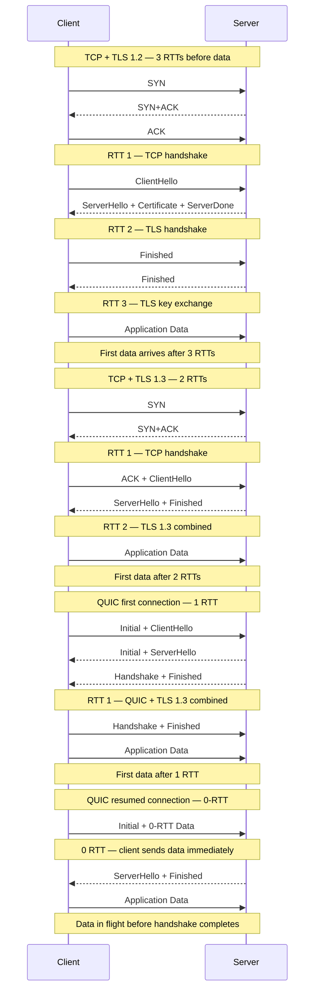
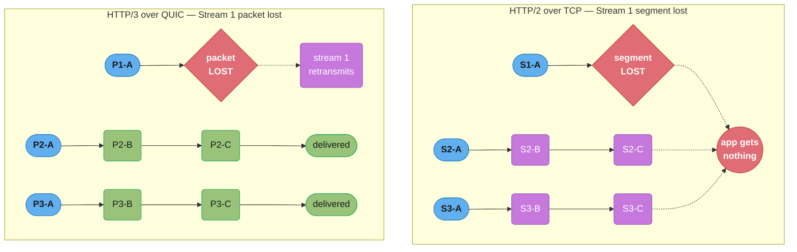
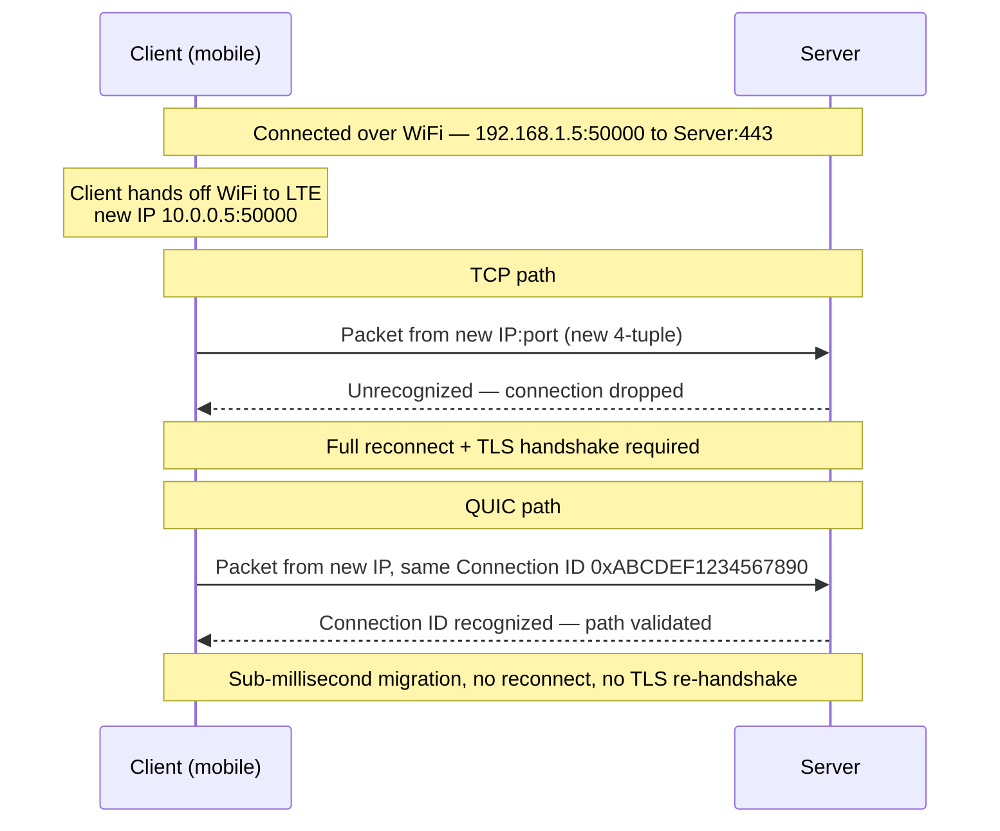
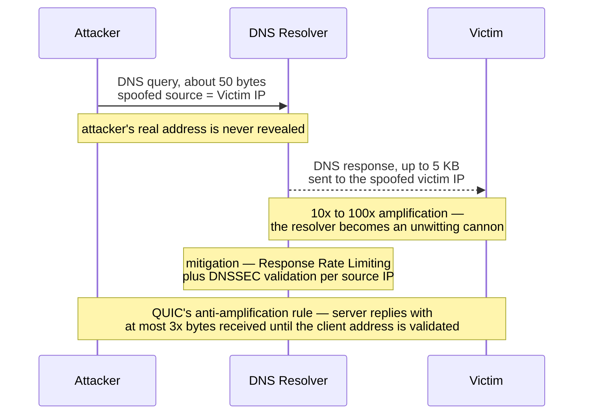
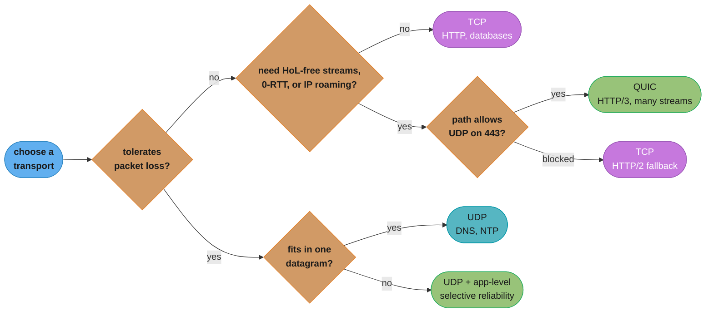
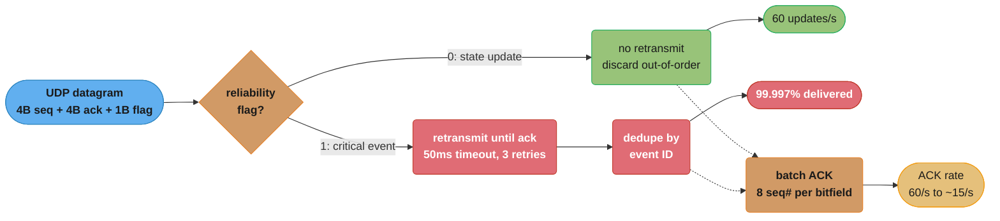

# UDP & QUIC

## 1. Concept Overview

UDP (User Datagram Protocol) is the minimal transport protocol — it provides multiplexing (ports) and error detection (checksum) but nothing else. No connection, no ordering, no retransmission. QUIC is a modern transport protocol built on top of UDP that delivers TCP-level reliability with better performance: 0-RTT connection establishment, per-stream multiplexing without head-of-line blocking, and built-in TLS 1.3. HTTP/3 runs entirely on QUIC.

Understanding UDP is essential for designing low-latency systems (gaming, VoIP, live video) where freshness matters more than completeness. Understanding QUIC is essential for building modern APIs and understanding how HTTP/3 eliminates the performance bottlenecks of HTTP/2 over TCP.

---

## 2. Intuition

> **One-line analogy**: UDP is a postcard — you write it, drop it in a mailbox, and hope for the best. There is no tracking number, no signature required, no guaranteed delivery. QUIC is express courier service — guaranteed delivery with digital signature, but the courier runs on the same streets as the postcards (UDP datagrams), just with better business processes on top.

**Mental model**: UDP delivers datagrams independently. Each datagram is self-contained — it either arrives intact (checksum verified) or is dropped. No state is maintained between datagrams. QUIC adds a connection layer on top: it tracks streams, sequence numbers, and acknowledgments, but does this in user-space, enabling faster iteration and deployment than kernel-level TCP changes.

**Why it matters**: DNS uses UDP (fast, stateless, single-response queries). Video streaming uses UDP-based RTP because a dropped frame is better than a 200ms pause waiting for retransmission. QUIC eliminates the "head-of-line blocking" problem that plagues HTTP/2 over TCP: a single lost TCP segment stalls all HTTP/2 streams, but a single lost QUIC packet only stalls the stream it belongs to.

**Key insight**: QUIC's key innovation is moving reliability into user-space. This enables 0-RTT handshakes (resume known connections with no roundtrip), per-stream flow control independent of per-connection flow control, and protocol evolution without kernel changes.

---

## 3. Core Principles

- **UDP datagrams**: Fixed-size, self-contained. No state between datagrams. Drop on error, never retransmit.
- **Checksum**: UDP has a 16-bit checksum (optional in IPv4, mandatory in IPv6). Detects corruption but does not prevent it.
- **Multiplexing**: Port numbers distinguish services. Source port is ephemeral (client); destination port is well-known (server).
- **QUIC connection**: Identified by a 64-bit Connection ID (not IP:port), enabling connection migration when the client's IP changes.
- **QUIC streams**: Independent byte streams multiplexed over one QUIC connection. Loss in one stream does not block others.
- **0-RTT**: QUIC clients with a cached server token can send application data in the first packet (0 round trips to establish).

---

## 4. Types / Architectures / Strategies

### 4.1 UDP Header

```
UDP Header (8 bytes):
  Source Port:      16 bits
  Destination Port: 16 bits
  Length:           16 bits  (header + data)
  Checksum:         16 bits  (optional in IPv4)
```

Entire UDP header is 8 bytes vs TCP's 20+ bytes. Minimal overhead for small messages.

### 4.2 UDP Use Cases

| Use Case | Why UDP | Notes |
|----------|---------|-------|
| DNS | Single request/response; latency critical | Query fits in one datagram; DNSSEC uses TCP for large responses |
| DHCP | Broadcast before IP assigned; no connection possible | Client IP unknown; must use broadcast |
| NTP | Time synchronization; single datagram per query | Ordering irrelevant; fresh data preferred |
| VoIP/RTP | Real-time audio; late packet worse than missing | RTP adds sequence numbers for ordering; playback buffers absorb small loss |
| Online gaming | 60 FPS state updates; stale state is useless | Game engines implement selective retransmit for critical events |
| Live video streaming | MPEG-TS over UDP; decoder handles loss gracefully | Forward error correction added at application layer |
| QUIC | Foundation for HTTP/3 | Reliability implemented in user-space on top of UDP |

### 4.3 QUIC vs TCP Comparison

| Feature | TCP | QUIC |
|---------|-----|------|
| Connection establishment | 1 RTT (+ 1 RTT TLS 1.2) | 0–1 RTT (TLS 1.3 built in) |
| HoL blocking | Yes (at TCP level) | No (per-stream) |
| Head-of-line blocking | Yes (all streams stall on segment loss) | No (only affected stream stalls) |
| Multiplexing | No (HTTP/2 adds at app layer, loses to TCP HoL) | Yes (native streams) |
| Connection migration | No (tied to IP:port 4-tuple) | Yes (Connection ID survives IP change) |
| TLS | Optional (separate) | Mandatory (integrated) |
| Packet loss handling | Retransmit + cwnd reduction | Per-stream retransmit; cwnd per-connection |
| Ossification risk | High (middleboxes interfere with new TCP options) | Lower (encrypted headers, runs as UDP) |
| User-space implementation | No (kernel) | Yes (can ship library updates without kernel upgrade) |
| Deployment | Universal | Growing (Chrome/Firefox/Curl support; server: nginx, envoy) |

### 4.4 QUIC Stream Types

| Stream Type | Description |
|-------------|-------------|
| Bidirectional stream | Client or server can send data; used for HTTP requests/responses |
| Server-initiated unidirectional | Server pushes data (HTTP/3 push, SETTINGS) |
| Client-initiated unidirectional | Client sends one-way (QPACK encoder stream) |

---

## 5. Architecture Diagrams

### TCP vs QUIC Connection Setup



Every extra round trip before data flows is pure setup tax: TCP with TLS 1.2 spends 3 RTTs before the first application byte, TCP with TLS 1.3 folds the handshake down to 2, and QUIC collapses transport and crypto into a single combined handshake — 1 RTT on a fresh connection, 0 RTT when resuming with a cached session ticket.

### QUIC Head-of-Line Blocking vs TCP



TCP's strict in-order delivery means one lost segment on Stream 1 freezes bytes already received for Streams 2 and 3 in the kernel buffer (purple), never reaching the app; QUIC's independent per-stream sequencing means only Stream 1 waits on retransmission while Streams 2 and 3 (green) are delivered immediately.

### QUIC Connection Migration



TCP identifies a connection by its 4-tuple, so a WiFi-to-LTE IP change looks like a brand-new connection and forces a full reconnect plus TLS re-handshake; QUIC identifies the connection by a 64-bit Connection ID that survives the IP change, so the server only needs to validate the new path.

---

## 6. How It Works — Detailed Mechanics

### 6.1 QUIC Packet Structure

QUIC packets are encrypted (unlike TCP headers which are plaintext). Only the Connection ID and packet number are visible to middleboxes:

```
QUIC Packet:
  Header Form:        1 bit (long vs short header)
  Connection ID:      0–160 bits (variable length)
  Packet Number:      1–4 bytes (per-packet space)
  Payload:            QUIC frames (encrypted with TLS 1.3)

QUIC Frames (inside encrypted payload):
  STREAM frame:       stream ID, offset, data
  ACK frame:          ACK ranges, delays
  CRYPTO frame:       TLS handshake data
  RESET_STREAM:       abort a stream
  STOP_SENDING:       request stream abort
  MAX_DATA:           connection-level flow control
  MAX_STREAM_DATA:    stream-level flow control
  NEW_CONNECTION_ID:  for migration
  RETIRE_CONNECTION_ID: garbage collect old connection IDs
```

### 6.2 0-RTT Security Considerations

0-RTT data can be replayed by an attacker who intercepts the ClientHello. A server that processes 0-RTT data must make it idempotent (safe to execute multiple times). HTTP/3 restricts 0-RTT to safe HTTP methods (GET, HEAD, OPTIONS) — not POST, PUT, DELETE. Applications must not use 0-RTT for non-idempotent operations.

### 6.3 DTLS (Datagram TLS)

DTLS adapts TLS for datagram transport. It adds:
- Sequence numbers and replay protection (UDP provides no ordering)
- Retransmission for handshake messages
- Record epoch tracking (to handle reordering)

DTLS is used for WebRTC data channels, VPN tunnels (WireGuard uses its own crypto but similar approach), and any UDP protocol needing encryption without switching to TCP.

### 6.4 UDP Amplification Attacks

DNS servers answer short queries with large responses. An attacker sends DNS queries with a spoofed source IP (the victim's IP). The DNS server sends large responses to the victim, amplifying traffic 10–100x. This is a UDP amplification DDoS attack. Mitigation: DNS servers rate-limit responses per source IP, use Response Rate Limiting (RRL), and require DNSSEC validation.

QUIC includes anti-amplification limits: until the server validates the client's address (3-way equivalent), the server sends at most 3x the bytes received. This prevents QUIC from being used as an amplification attack vector.



The attacker never queries from its own address; a tiny spoofed request triggers a large reply aimed at the victim, amplifying traffic 10 to 100x and turning the resolver into the attack's cannon. QUIC closes this loophole for itself by capping server-to-client bytes at 3x what it has received until the client's address is validated.

---

## 7. Real-World Examples

**DNS over UDP**: A DNS query for an A record is typically 30–50 bytes. The response is 50–500 bytes. Round-trip to a recursive resolver is 1–10ms. The simplicity of UDP (no handshake) is ideal — the response latency is the round-trip time to the resolver, nothing more.

**Cloudflare QUIC deployment**: Cloudflare has deployed HTTP/3 on all their edge nodes since 2019. They report ~20ms reduction in page load time for mobile users (who frequently change IPs) due to connection migration, and significant reduction in connection establishment overhead.

**Google QUIC history**: Google invented QUIC internally, used it for YouTube and Google Search, and then standardized it as RFC 9000. The standardized QUIC (IETF QUIC) differs from Google QUIC in several ways, but the core ideas are the same.

**WebRTC and UDP**: Video calls in browsers use WebRTC, which uses RTP/SRTP over UDP. ICE (Interactive Connectivity Establishment) and STUN/TURN protocols handle NAT traversal. The reason for UDP: a 200ms delayed video frame is worse than a dropped frame. The jitter buffer at the receiver handles minor packet reordering.

---

## 8. Tradeoffs

| Protocol | Overhead | Reliability | Latency | Use Case |
|----------|---------|-------------|---------|----------|
| UDP | 8 bytes | None | Lowest | DNS, NTP, gaming, streaming |
| TCP | 20+ bytes | Full | RTT per message | HTTP, databases, file transfer |
| QUIC | ~20 bytes + overhead | Per-stream | 0-1 RTT | HTTP/3, WebTransport |
| DTLS/UDP | ~13 bytes | Encryption only | Low | VoIP with security |

| QUIC Feature | Benefit | Cost |
|-------------|---------|------|
| 0-RTT | Faster on resumption | Replay attack risk |
| Connection migration | Mobile continuity | Increased server state |
| Encrypted headers | Reduces middlebox ossification | Cannot use transparent proxies |
| User-space | Fast protocol evolution | Higher CPU than kernel TCP |

---

## 9. When to Use / When NOT to Use

**Use UDP when**: Your application can tolerate loss (streaming, gaming), you implement your own reliability selective to what you need, or the message fits in one datagram and you need minimum latency (DNS, NTP).

**Do not use UDP when**: Your application assumes delivery guarantees (financial transactions, database operations, file transfer), or you do not have the engineering bandwidth to implement error handling.

**Use QUIC/HTTP/3 when**: Building APIs for mobile clients (frequent IP changes benefit from connection migration), serving high-throughput endpoints with multiple parallel resources (avoids TCP HoL blocking), or when TLS 1.3 0-RTT session resumption is important for latency.

**Do not use QUIC when**: Your network infrastructure does not allow UDP (some enterprise firewalls block UDP on port 443), or you need transparent load balancing that inspects TCP headers.



The two questions that actually decide the protocol are loss tolerance and whether the network path even permits UDP on port 443 — everything else in the four bullets above is a refinement of one of these two branches.

---

## 10. Common Pitfalls

**UDP buffer overflow**: UDP sockets have a receive buffer (default ~128–212 KB on Linux). If the application does not call recvfrom() fast enough, the kernel drops incoming datagrams. No error is reported to the sender — the datagrams are silently lost. High-rate UDP receivers must use large buffers (sysctl `net.core.rmem_max`) and process datagrams in tight loops or use recvmmsg() to batch receive.

**Multicast routing configuration**: UDP multicast requires IGMP snooping on switches and multicast routing between subnets. Not all cloud environments support multicast. Applications relying on multicast service discovery (Hazelcast auto-discovery, JGroups) fail silently in cloud environments that block multicast.

**QUIC blocked by enterprise firewalls**: Many enterprise firewalls block UDP on port 443 or rate-limit UDP. QUIC clients must fall back to TCP gracefully. Google's GQUIC had a 3-second fallback timer — causing worse performance than TCP-only when QUIC is blocked. Proper QUIC implementations detect QUIC-blocking quickly and fall back without the user noticing.

**UDP socket reuse without SO_REUSEPORT**: Multiple threads cannot read from the same UDP socket without external locking. Use SO_REUSEPORT to create per-thread sockets all bound to the same port. Kernel distributes packets using a 4-tuple hash.

---

## 11. Technologies & Tools

| Tool/Library | Purpose |
|-------------|---------|
| `quiche` (Cloudflare) | Rust QUIC library |
| `msquic` (Microsoft) | C QUIC implementation |
| `lsquic` (LiteSpeed) | C QUIC library with HTTP/3 |
| `nghttp3` | HTTP/3 library |
| `ngtcp2` | QUIC transport library |
| Nginx (1.25+) | HTTP/3 support via QUIC |
| Envoy Proxy | HTTP/3 / QUIC support |
| Netty | Java NIO with UDP; experimental QUIC support |
| Wireshark | QUIC dissector (decrypts with key log file) |
| `QUIC Tracker` | QUIC interoperability test suite |
| `curl --http3` | HTTP/3 client testing |

---

## 12. Interview Questions with Answers

**Q: What does UDP provide that IP does not?**
UDP adds port numbers (multiplexing — distinguishing applications on the same host) and a checksum (error detection — verifying payload integrity). That is all. IP provides addressing and routing; UDP provides nothing beyond those two additions.

**Q: Why is UDP preferred for DNS?**
DNS queries and responses typically fit in a single datagram. A DNS query takes 1 RTT over UDP — just the network round-trip time. TCP would add at least 1 RTT for the handshake before any data flows. For millions of DNS lookups per second, the latency and state overhead of TCP is unacceptable. Large DNSSEC responses use TCP as a fallback.

**Q: What is the head-of-line blocking problem in HTTP/2 over TCP?**
HTTP/2 multiplexes many streams over a single TCP connection. If a TCP segment is lost, TCP's in-order delivery guarantee stalls all streams — even those whose data arrived successfully — until the lost segment is retransmitted and received. HTTP/3 over QUIC solves this: each QUIC stream is independent, so a lost packet only stalls the stream it belongs to.

**Q: How does QUIC achieve 0-RTT connection establishment?**
On the first connection, QUIC completes a 1-RTT handshake. The server sends a session ticket containing keying material. On subsequent connections from the same client, the client uses the cached ticket to encrypt early data (0-RTT data) and sends application data in the first packet, before the handshake completes. The server can process this data immediately (with replay protection considerations).

**Q: What is connection migration in QUIC and why does it matter?**
QUIC connections are identified by a Connection ID, not by the IP:port 4-tuple. When a mobile client's IP changes (WiFi to LTE), the client sends a packet with the same Connection ID from the new address. The server validates the new path and migrates the connection without re-establishing TLS. For mobile users, this eliminates reconnect overhead on network switches.

**Q: What are the security implications of 0-RTT data?**
0-RTT data can be replayed by an attacker who captures the ClientHello and reuses it. The server must treat 0-RTT data as idempotent — only safe operations (HTTP GET, HEAD) should be accepted. HTTP/3 prohibits 0-RTT for non-idempotent requests. Applications must not process 0-RTT data for state-changing operations without idempotency guarantees.

**Q: What is DTLS and where is it used?**
DTLS (Datagram TLS) adapts TLS for UDP. It adds replay protection (sequence numbers), retransmission for lost handshake messages, and record epoch tracking for out-of-order datagrams. DTLS is used in WebRTC for peer-to-peer data channels, SRTP key negotiation, and VPN solutions over UDP.

**Q: How does UDP amplification work and how does QUIC prevent it?**
UDP is connectionless, so the source IP in a packet is trivially spoofed. An attacker sends small UDP requests (e.g., DNS queries) with the victim's IP as the source. Servers respond with large replies to the victim, amplifying traffic. QUIC prevents amplification by limiting server-to-client traffic to 3x received bytes until the client's address is validated (via the handshake completing), preventing QUIC servers from being used as amplifiers.

**Q: What is the difference between QUIC streams and HTTP/2 streams?**
HTTP/2 streams are application-level multiplexing inside a single TCP connection. A single TCP segment loss stalls all HTTP/2 streams (TCP HoL blocking). QUIC streams are transport-level multiplexing — each stream is independently sequenced and acknowledged at the QUIC layer. A single QUIC packet loss only stalls the stream(s) whose data was in that packet. QUIC also provides per-stream and per-connection flow control independently.

**Q: When would you choose HTTP/2 over HTTP/3?**
Choose HTTP/2 when: (1) your infrastructure (load balancers, firewalls) does not support UDP 443 or QUIC; (2) clients are in a controlled network (not mobile); (3) the engineering cost of HTTP/3 is not justified by the marginal latency improvement. HTTP/3 wins decisively for mobile users, high-packet-loss environments, and endpoints serving many parallel resources.

**Q: How does recvmmsg() improve UDP server performance?**
recvmmsg() is a Linux system call that receives multiple datagrams in a single system call (batch receive). For high-rate UDP applications (10+ Gbps network), context switch overhead of one system call per datagram is prohibitive. recvmmsg() with batch size 64 reduces system calls by 64x, significantly improving throughput. sendmmsg() provides the same benefit for batch sends.

**Q: What is selective reliability and why do game engines implement it over UDP?**
Game engines need to send high-frequency position updates (60–120 per second) where each update supersedes the previous. Reliable delivery of stale positions is useless and wasteful. But some events (player damage, item pickup, game state changes) must be delivered reliably. UDP allows game engines to implement selective reliability: unreliable delivery for frequent state updates, and a simple stop-and-wait or sliding window for critical events. This is more efficient than TCP, which would reliably deliver every stale position update.

---

## 13. Best Practices

- Use UDP for stateless, latency-sensitive, loss-tolerant workloads; always implement application-level sequence numbers if ordering matters.
- For UDP servers with high packet rate, set SO_RCVBUF to at least 4 MB and sysctl `net.core.rmem_max` accordingly.
- Enable QUIC/HTTP/3 on public-facing APIs with a graceful fallback to HTTP/2 for clients where UDP is blocked.
- Never use 0-RTT QUIC for non-idempotent operations; treat 0-RTT data like an HTTP GET.
- Use recvmmsg() for high-throughput UDP receivers (>1 Gbps).
- Implement application-level heartbeats over UDP to detect silent connection loss (no FIN/RST in UDP).
- When implementing custom protocols over UDP, handle reordering, duplication, and loss explicitly.

---

## 14. Case Study

**Problem**: A real-time multiplayer game server was dropping ~2% of UDP state update packets at 60 Hz per player. The engineering team debated whether to switch to TCP for reliability.

**Analysis**:
- State updates: 60/s per player, each 200 bytes. Loss of a state update means the client renders a slightly stale position for ~16ms. Acceptable.
- Critical events (damage, respawn, game state): 1–5/s per player. Loss causes game inconsistency. Must be reliable.
- TCP option rejected: TCP's reliability would buffer state updates behind retransmitted old state updates. A 100ms TCP retransmit would stall delivery of 6 state updates, causing visible jitter worse than 2% random loss.

**Solution**: Custom reliability layer over UDP:


The reliability flag is the routing decision: state updates take the no-retransmit hot path (green) since a stale position is worthless, while critical events take the retry-until-ack path (red) since losing a damage or respawn event breaks game consistency; batching acks into one 8-slot bitfield then cuts the ack rate 4x (60/s to about 15/s) without touching either path's semantics.

After deploying this hybrid approach: critical events delivered 99.997% of the time, state update loss of 2% remained unchanged but was acceptable, and player-perceived jitter was eliminated compared to TCP. This is the approach used by every major game engine (Valve's Source engine, Epic's NetDriver, Unity Netcode).
