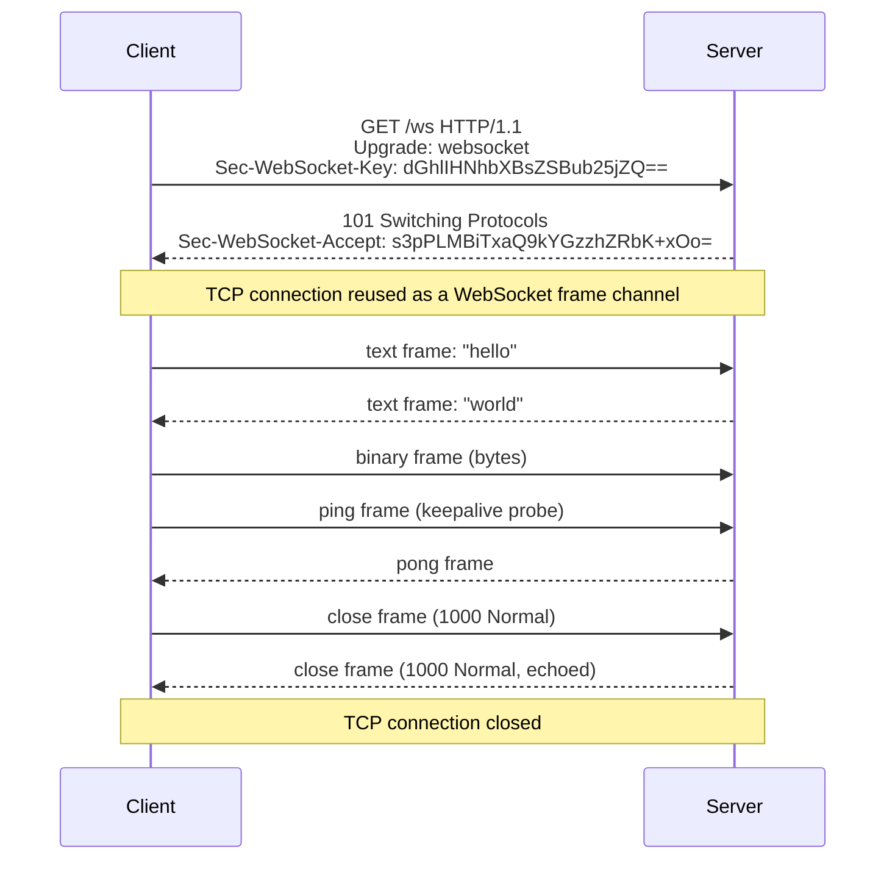
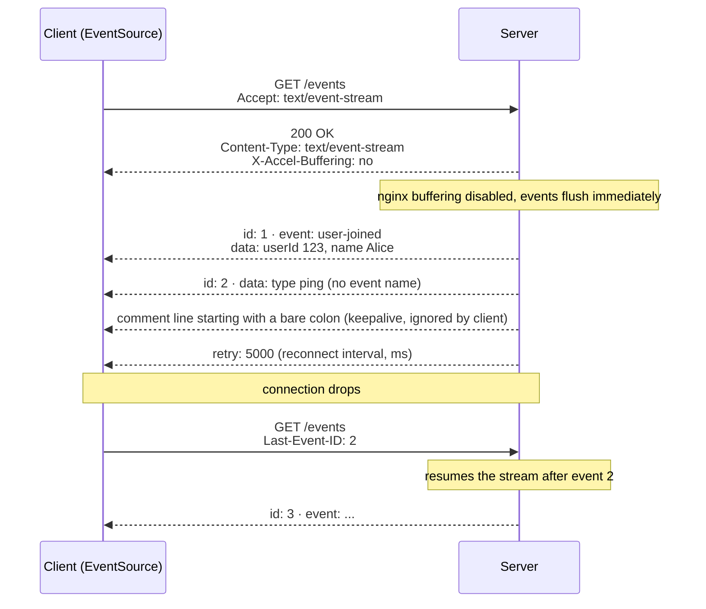
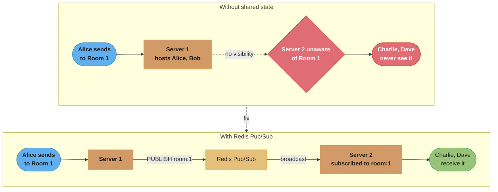
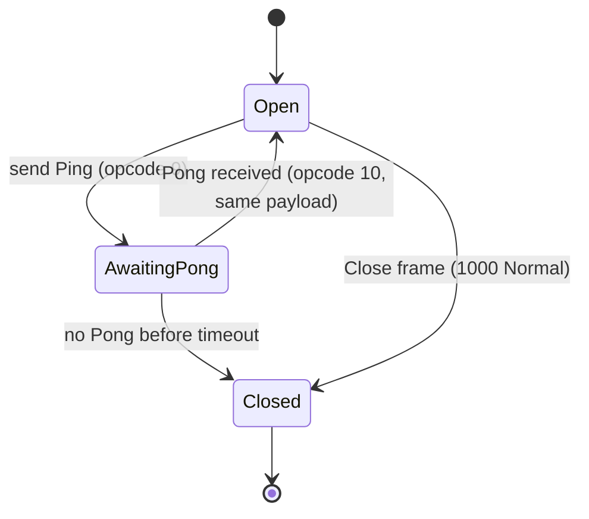
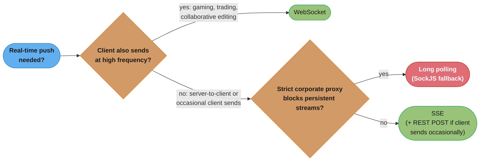
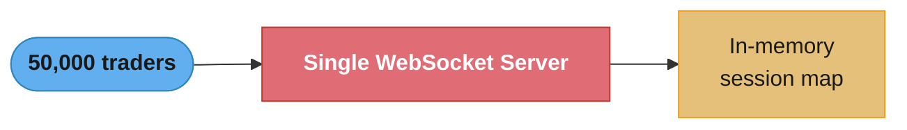
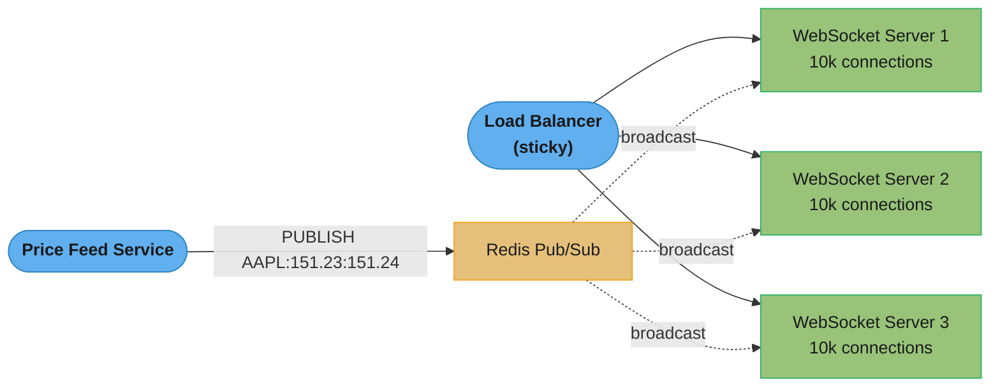

# WebSockets & Server-Sent Events

## 1. Concept Overview

HTTP is fundamentally request-response: the client initiates every interaction. For real-time applications — live chat, collaborative editing, trading dashboards, gaming — this model breaks down. Two technologies bridge this gap: WebSocket provides full-duplex, bidirectional communication over a persistent connection; Server-Sent Events (SSE) provides a server-to-client push channel over a standard HTTP connection.

Long polling was the original workaround: the client sends a request and the server holds it open until data is available, then the client immediately sends another. It works but creates connection overhead and cannot scale efficiently. WebSocket and SSE solve real-time communication properly — each with distinct characteristics that suit different use cases.

---

## 2. Intuition

> **One-line analogy**: HTTP request-response is a walkie-talkie where you push a button to talk. WebSocket is a phone call — both parties can talk simultaneously at any time. SSE is a radio broadcast — the station (server) continuously transmits and listeners (clients) only receive.

**Mental model**: WebSocket upgrades an HTTP connection to a full-duplex TCP channel. Once established, it is a raw bidirectional byte channel with a thin framing layer. SSE keeps an HTTP connection open indefinitely, with the server sending text/event-stream messages and the browser's EventSource API parsing them automatically.

**Why it matters**: Choosing incorrectly causes either wasted engineering effort (implementing full WebSocket when SSE suffices) or architecture limitations (using SSE when bidirectional communication is needed). Infrastructure also matters: load balancers, firewalls, and proxies treat WebSocket and SSE differently.

**Key insight**: SSE is simpler, more reliable (automatic reconnection is built into the browser), and works with standard HTTP/2 multiplexing. Use SSE whenever communication is server-to-client only. Use WebSocket only when clients need to send data at high frequency (gaming, collaborative editing, trading order entry).

---

## 3. Core Principles

- **WebSocket**: Starts as HTTP/1.1, upgrades to WS protocol. Persistent TCP connection. Bidirectional. Binary or text frames. No automatic reconnection.
- **SSE**: Standard HTTP/1.1 (or HTTP/2). Persistent response stream. Server-to-client only. Text format. Automatic reconnection built into EventSource API.
- **Long polling**: Standard HTTP. Client sends request, server holds it. After response, client immediately sends next request. Works everywhere; less efficient.
- **Stateful connections**: Both WebSocket and SSE are stateful — the server must route reconnecting clients to the same server instance (sticky sessions) or use a shared pub/sub backend.

---

## 4. Types / Architectures / Strategies

### 4.1 Comparison Matrix

| Feature | HTTP Long Polling | WebSocket | SSE |
|---------|-----------------|-----------|-----|
| Direction | Bidirectional | Bidirectional | Server to Client only |
| Connection | New per message | Persistent | Persistent |
| Protocol | HTTP/1.1 | WS/WSS | HTTP/1.1 or HTTP/2 |
| Auto-reconnect | Manual | Manual | Built-in (EventSource) |
| HTTP/2 support | Yes | No (WS over HTTP/2 exists but rare) | Yes (multiplexed) |
| Proxy/firewall | Works | Sometimes blocked | Works |
| Browser support | Universal | Universal | Universal (no IE, but IE is dead) |
| CDN support | Yes | Limited | Limited |
| Load balancing | Standard | Requires sticky/pub-sub | Requires sticky/pub-sub |
| Message format | JSON | Binary or text | Text/UTF-8 only |

### 4.2 WebSocket Frame Structure

| Bits | Field | Description |
|------|-------|-------------|
| 1 | FIN | Last fragment of message |
| 3 | RSV1-3 | Extension bits |
| 4 | Opcode | 0=continuation, 1=text, 2=binary, 8=close, 9=ping, 10=pong |
| 1 | MASK | Client frames must be masked; server frames must not |
| 7 | Payload length | 0-125: actual length; 126: next 2 bytes; 127: next 8 bytes |
| 32 | Masking key | Present if MASK=1 |
| * | Payload | Application data |

### 4.3 STOMP over WebSocket

STOMP (Simple Text Oriented Messaging Protocol) adds a pub/sub messaging layer over WebSocket. Spring's Spring WebSocket + SockJS stack supports STOMP:

- Client subscribes to destinations: `/topic/room.123`
- Server sends to destinations: `/topic/room.123`
- Broker relay (RabbitMQ STOMP plugin or ActiveMQ) handles routing at scale

---

## 5. Architecture Diagrams

### WebSocket Upgrade Handshake



One 101 response upgrades the same TCP connection into a persistent, full-duplex frame channel — every line after it is a WebSocket frame, not a new HTTP request.

The `Sec-WebSocket-Accept` is computed as:
SHA1(Sec-WebSocket-Key + "258EAFA5-E914-47DA-95CA-C5AB0DC85B11"), Base64-encoded.

### SSE Event Stream



Each `id:`/`event:`/`data:` triplet is one SSE message terminated by a blank line; on reconnect the browser automatically resends `Last-Event-ID`, so the server only has to replay what the client missed.

### Scaling WebSocket with Redis Pub/Sub



Without a shared channel, each server only knows about the sessions it holds locally, so Room 1's message silently stops at Server 1; publishing it to a Redis channel that every server subscribes to lets any server deliver to any connected client, regardless of which process the message originated on.

---

## 6. How It Works — Detailed Mechanics

### 6.1 Spring WebSocket Server (STOMP)

```java
@Configuration
@EnableWebSocketMessageBroker
public class WebSocketConfig implements WebSocketMessageBrokerConfigurer {

    @Override
    public void configureMessageBroker(MessageBrokerRegistry config) {
        // In-memory simple broker for single-server deployments
        config.enableSimpleBroker("/topic", "/queue");

        // For multi-server: relay to external STOMP broker (RabbitMQ)
        // config.enableStompBrokerRelay("/topic", "/queue")
        //     .setRelayHost("rabbitmq")
        //     .setRelayPort(61613)
        //     .setClientLogin("user")
        //     .setClientPasscode("password");

        config.setApplicationDestinationPrefixes("/app");
    }

    @Override
    public void registerStompEndpoints(StompEndpointRegistry registry) {
        registry.addEndpoint("/ws")
            .setAllowedOrigins("https://app.example.com")
            .withSockJS();  // SockJS fallback for non-WS environments
    }
}

@Controller
public class ChatController {

    @Autowired
    private SimpMessagingTemplate messagingTemplate;

    @MessageMapping("/chat.send")
    @SendTo("/topic/room.{roomId}")
    public ChatMessage send(@DestinationVariable String roomId,
                            ChatMessage message,
                            Principal principal) {
        // Principal from WebSocket auth (set in handshake interceptor)
        message.setSender(principal.getName());
        return message;
    }

    // Server-initiated push (from any @Service)
    public void notifyRoom(String roomId, String event) {
        messagingTemplate.convertAndSend(
            "/topic/room." + roomId,
            event
        );
    }
}
```

### 6.2 Spring SSE Implementation

```java
@RestController
public class NotificationController {

    private final Map<String, SseEmitter> emitters =
        new ConcurrentHashMap<>();

    @GetMapping(value = "/events", produces = MediaType.TEXT_EVENT_STREAM_VALUE)
    public SseEmitter subscribe(
            @RequestParam String userId,
            HttpServletResponse response) {

        // Disable buffering at nginx level
        response.setHeader("X-Accel-Buffering", "no");

        // Create emitter with 30-minute timeout
        SseEmitter emitter = new SseEmitter(30 * 60 * 1000L);

        emitters.put(userId, emitter);

        emitter.onCompletion(() -> emitters.remove(userId));
        emitter.onTimeout(() -> {
            emitters.remove(userId);
            emitter.complete();
        });
        emitter.onError(e -> emitters.remove(userId));

        // Send initial event
        try {
            emitter.send(SseEmitter.event()
                .id("0")
                .name("connected")
                .data("{\"userId\":\"" + userId + "\"}")
                .reconnectTime(5000));
        } catch (IOException e) {
            emitter.completeWithError(e);
        }

        return emitter;
    }

    // Called when notification needs to be pushed
    public void sendNotification(String userId, Notification notification) {
        SseEmitter emitter = emitters.get(userId);
        if (emitter != null) {
            try {
                emitter.send(SseEmitter.event()
                    .id(notification.getId())
                    .name("notification")
                    .data(objectMapper.writeValueAsString(notification)));
            } catch (IOException e) {
                emitters.remove(userId);
            }
        }
    }
}
```

### 6.3 WebSocket Authentication

```java
// WebSocket sessions are established once — authenticate during handshake
@Component
public class AuthHandshakeInterceptor implements HandshakeInterceptor {

    @Override
    public boolean beforeHandshake(ServerHttpRequest request,
                                   ServerHttpResponse response,
                                   WebSocketHandler wsHandler,
                                   Map<String, Object> attributes) {
        // Extract JWT from query param or header
        String token = extractToken(request);
        if (token == null || !jwtService.validate(token)) {
            return false;  // reject handshake
        }
        // Store user info in session attributes
        attributes.put("userId", jwtService.extractUserId(token));
        return true;
    }
}

// In STOMP, also handle CONNECT frame authentication
@Component
public class StompAuthChannelInterceptor implements ChannelInterceptor {

    @Override
    public Message<?> preSend(Message<?> message, MessageChannel channel) {
        StompHeaderAccessor accessor =
            MessageHeaderAccessor.getAccessor(message, StompHeaderAccessor.class);

        if (StompCommand.CONNECT.equals(accessor.getCommand())) {
            String token = accessor.getFirstNativeHeader("Authorization");
            // Validate token, set principal
            accessor.setUser(jwtService.extractPrincipal(token));
        }
        return message;
    }
}
```

### 6.4 Heartbeat/Ping-Pong

WebSocket keeps connections alive with ping-pong frames:
- Client or server sends a Ping frame (opcode 9, arbitrary payload up to 125 bytes)
- Recipient must respond with a Pong frame (opcode 10, same payload) as soon as possible
- If no Pong received within timeout, the sender should close the connection



The only way out of `AwaitingPong` without a matching Pong is a timeout that forces the connection closed — this is the mechanism that turns silent, half-dead TCP connections into detectable failures instead of leaked phantom sessions (see Common Pitfalls).

Spring configures STOMP heartbeats (not WebSocket ping-pong, but application-level heartbeats in the STOMP protocol):
```java
registry.enableSimpleBroker("/topic").setHeartbeatValue(new long[]{10000, 10000});
// [server sends heartbeat every 10s, wants client heartbeat every 10s]
```

---

## 7. Real-World Examples

**Slack**: Uses WebSocket for real-time message delivery. Messages are sent server-to-client via WebSocket; the client sends messages via REST POST (not WebSocket). This hybrid approach simplifies message delivery guarantees (REST POST is acknowledged; WebSocket is best-effort). On reconnect, Slack fetches missed messages via REST.

**Twitter/X live timeline**: Uses SSE for the home timeline. New tweets are pushed as SSE events. The client only receives; the client sends new tweets via REST POST. SSE is ideal because it is unidirectional (server pushes tweets to client) and HTTP/2 multiplexes it efficiently.

**Google Docs real-time collaboration**: Uses WebSocket for operational transforms — bidirectional is required because each user's changes must be sent to the server and server must push others' changes. The bidirectional nature is inherent to collaborative editing.

**Trading platforms**: Use WebSocket for order entry and market data. Both directions are needed: clients submit orders, server pushes execution confirmations and price ticks. Latency is critical — the persistent connection avoids handshake overhead.

---

## 8. Tradeoffs

| Scenario | Recommendation | Reason |
|----------|---------------|--------|
| Notifications, feeds, live scores | SSE | Server-to-client only; simpler, auto-reconnect |
| Chat, collaborative editing | WebSocket | Both sides send and receive |
| Price tickers, dashboards | SSE | Server pushes data; no client sends |
| Order entry, gaming input | WebSocket | Client sends high-frequency updates |
| Simple periodic updates | Long polling | Simplest; works through all proxies |

---

## 9. When to Use / When NOT to Use



The decision collapses to two questions: does the client need to send at high frequency, and does the network path even allow a persistent connection — SSE (optionally paired with REST POST, as Twitter/X does) and long polling are both server-push-oriented fallbacks for when the answer to the first question is no.

**SSE**: Use when only the server needs to push data to the client, and the data is text/JSON. SSE works through HTTP/2 transparently (each SSE stream is one HTTP/2 stream), through most corporate proxies, and has built-in reconnection with Last-Event-ID resume.

**WebSocket**: Use when the client needs to send data at high frequency and the latency of a new HTTP request per send is unacceptable. Do not use WebSocket when SSE would suffice — WebSocket requires more infrastructure work (sticky sessions or pub/sub fan-out).

**Long polling**: Use only as a last resort in environments that block WebSocket and SSE (some strict corporate proxies). The SockJS library falls back to long polling automatically.

---

## 10. Common Pitfalls

**Nginx buffering SSE responses**: Nginx buffers upstream responses by default. For SSE, this means events are held in Nginx's buffer until it fills or the response completes — clients never receive events until the stream ends (which defeats the purpose). Fix: add `proxy_buffering off;` and `X-Accel-Buffering: no` response header from the backend.

**WebSocket behind a non-sticky load balancer**: WebSocket connections are stateful. Round-robin load balancers route different connections to different backends. For WebSocket, either (1) use sticky sessions (route by session cookie/IP to the same backend), or (2) use a shared pub/sub backend (Redis Pub/Sub) so any backend can deliver messages to any connected client. A missing sticky session causes clients to lose messages or fail to connect to their session.

**Not handling WebSocket disconnects gracefully**: Clients disconnect without sending a Close frame (network failure, mobile app backgrounded, browser tab closed). The server must detect these via ping-pong timeouts or connection-level TCP keep-alive. Without detection, the server accumulates phantom sessions and leaks memory. Clean up all subscriptions and resource allocations when a session is closed.

**SSE and proxy timeout**: Enterprise HTTP proxies often close connections idle for more than 60 seconds. SSE streams may have no events for minutes. Send SSE comment lines (`: heartbeat\n\n`) every 30 seconds to keep the connection alive through intermediary proxies. The browser's EventSource ignores comments; proxies see activity and keep the connection open.

**WebSocket message framing for large messages**: WebSocket applications that try to send large messages (>1 MB) as a single frame can exhaust memory and cause buffering issues. Fragment large messages into multiple frames or redesign the protocol to send smaller chunks. Use Binary frames for non-text data — UTF-8 validation overhead on Text frames is significant for large payloads.

---

## 11. Technologies & Tools

| Tool | Purpose |
|------|---------|
| Spring WebSocket | Spring Boot WebSocket + STOMP support |
| socket.io | Node.js WebSocket with fallbacks |
| `wscat` | Command-line WebSocket client |
| Wireshark | WebSocket frame inspection |
| `curl -N --no-buffer` | Basic SSE testing from CLI |
| SockJS | WebSocket with long-polling fallback |
| Redis Pub/Sub | Shared state for multi-server WebSocket |
| RabbitMQ STOMP plugin | STOMP broker relay for production |
| Netty | High-performance WebSocket server (underlies Spring WebFlux) |
| WebSocket King | Browser extension for WebSocket testing |

---

## 12. Interview Questions with Answers

**Q: How does the WebSocket upgrade handshake work?**
The client sends an HTTP/1.1 GET request with headers: `Upgrade: websocket`, `Connection: Upgrade`, `Sec-WebSocket-Key: <random-base64>`, `Sec-WebSocket-Version: 13`. The server responds with `101 Switching Protocols` and `Sec-WebSocket-Accept: <SHA1(key + GUID) base64>`. The key computation proves the server understands WebSocket (not just reflecting headers). After 101, the TCP connection is reused as a WebSocket channel.

**Q: What is the difference between WebSocket and SSE?**
WebSocket is bidirectional — both client and server can send frames at any time. SSE is unidirectional — only the server can push events. SSE uses standard HTTP; browsers handle reconnection automatically via the EventSource API and Last-Event-ID. WebSocket requires manual reconnection logic. SSE works with HTTP/2 multiplexing natively; WebSocket does not (WebSocket over HTTP/2 is defined but rarely deployed). Use SSE for server-push-only scenarios; WebSocket for full-duplex communication.

**Q: How do you scale WebSocket connections horizontally?**
WebSocket connections are stateful — a client is connected to a specific server. Horizontal scaling requires either: (1) sticky sessions — load balancer routes all requests from a client to the same server (by IP or cookie); (2) shared pub/sub backend — each server publishes messages to Redis Pub/Sub, all servers subscribe, and each delivers to its locally connected clients. Option 2 is more resilient to server failure. Sticky sessions can cause imbalanced load if some connections are more active.

**Q: What is the WebSocket ping-pong mechanism?**
Ping and Pong are WebSocket control frames (opcodes 9 and 10). Either party can send a Ping with up to 125 bytes of payload. The recipient must respond with a Pong containing the same payload as soon as possible. This serves as a keep-alive: if no Pong is received within a timeout, the connection is considered dead and closed. Spring's STOMP heartbeat uses STOMP-level heartbeats (not WS ping-pong) for higher-level keep-alive.

**Q: How does SSE automatic reconnection work?**
The browser's EventSource API automatically reconnects when the connection closes. After reconnection, it sends the `Last-Event-ID: <id>` header with the id of the last received event. The server should use this to resume delivery from that point, preventing missed events. If the SSE stream includes a `retry: <ms>` field, the browser uses that interval for reconnection (default is a few seconds). This makes SSE inherently more reliable than WebSocket, which requires manual reconnection logic.

**Q: What is STOMP and why is it used over WebSocket?**
STOMP (Simple Text Oriented Messaging Protocol) is a simple message protocol with SEND, SUBSCRIBE, UNSUBSCRIBE, and ACK semantics. By itself, WebSocket provides only a raw bidirectional channel — you must build message routing, pub/sub, and acknowledgment on top. STOMP adds this structure. Spring's SockJS/STOMP integration provides a complete pub/sub system over WebSocket, with message broker support (in-memory or external RabbitMQ/ActiveMQ).

**Q: How do you authenticate WebSocket connections?**
WebSocket connections cannot send custom headers in the initial browser WebSocket API (the JavaScript API does not support custom headers on the Upgrade request). Solutions: (1) send token as a URL query parameter (e.g., `wss://api.example.com/ws?token=xxx`) — validate in the server's handshake interceptor; (2) use a cookie for authentication (HTTP cookies are sent with the Upgrade request); (3) for STOMP, authenticate in the CONNECT frame (send token as a STOMP header) — the server validates before allowing subscriptions. Option 1 is most common despite token visibility in logs (use HTTPS/WSS to prevent interception).

**Q: What happens to a WebSocket connection when the server restarts?**
A server restart closes all TCP connections (sends RST or FIN). The client receives a WebSocket Close frame or a TCP error. Without reconnection logic, the client's connection dies. The client must implement exponential backoff reconnection: retry after 1s, 2s, 4s, 8s, ... with a maximum interval. After reconnecting, the client must re-subscribe to channels/rooms. This is why SSE is often preferred — EventSource reconnection is automatic and built-in.

**Q: How do you prevent WebSocket connections from being used for DDoS?**
Rate limit at the load balancer or API gateway: max WebSocket upgrade requests per IP per second. Rate limit at the application layer: max messages per second per connection. Validate authentication during the handshake — unauthenticated connections should be rejected immediately, not after messages arrive. Implement message size limits. Use connection-level rate limiters to disconnect clients sending too many messages. Monitor connection counts per IP.

**Q: What is SockJS and when do you need it?**
SockJS is a JavaScript library that provides a WebSocket-like API but falls back to long polling, XHR streaming, or other transports when WebSocket is blocked by corporate proxies or firewalls. Spring's SockJS integration automatically handles the negotiation. Use SockJS when supporting corporate network environments that block WebSocket. For modern consumer applications where WebSocket is universally available, SockJS adds unnecessary complexity.

**Q: How does Spring SseEmitter work and what are its lifecycle methods?**
SseEmitter wraps a Server-Sent Events response. You return it from a controller method. The emitter stays open until: `emitter.complete()` is called (graceful end), `emitter.completeWithError(Exception)` is called (error), or the timeout expires (configured in the constructor). Lifecycle callbacks: `onCompletion()`, `onTimeout()`, `onError()` — use these to clean up references in registries. Sending events via `emitter.send(event)` is not thread-safe for concurrent sends — synchronize or use a single-thread sender.

**Q: How would you design a live collaboration system using WebSocket?**
Schema: WebSocket connection per document, authenticated during handshake. Client joins via STOMP SUBSCRIBE `/topic/doc.{docId}`. Edits sent to STOMP `/app/doc.{docId}.edit`. Server applies Operational Transforms (OT) or CRDTs, broadcasts transformed edit to `/topic/doc.{docId}`. Scaling: Redis Pub/Sub channel per document; any server instance can handle edits from any user. For conflict resolution: use CRDTs (e.g., Yjs, Automerge) client-side with eventual consistency rather than OT server-side. State recovery: when a user reconnects, fetch full document state via REST, then subscribe to WebSocket for incremental updates.

**Q: What is the Last-Event-ID in SSE and how does it enable reliability?**
Last-Event-ID is a header sent by the EventSource on reconnection containing the `id` field of the last event the client received. The server stores the current event ID and, on reconnection, can replay all events after the provided ID. This requires the server to buffer recent events (in memory or a message queue) for replay. Without this, events sent while the client was disconnected are lost. For high-reliability systems, buffer events for at least the maximum expected reconnection time (commonly 60–120 seconds).

**Q: Why must WebSocket frames from client to server be masked, while server-to-client frames must not be?**
Masking exists to prevent cache-poisoning and request-smuggling attacks against proxies and CDNs that sit between the browser and the server, not to provide any real confidentiality. Without masking, an attacker could craft WebSocket frame payloads that, byte-for-byte, resemble a valid HTTP request, and a misbehaving intermediary caching or forwarding raw bytes might interpret them as a second smuggled request. The RFC 6455 masking key XORs every client-to-server payload byte with a random per-frame key, so the bytes on the wire never form a predictable, attacker-chosen pattern that a proxy could be tricked into parsing as HTTP. Server-to-client frames are not masked because the server is trusted infrastructure, and only the browser-originated direction faces the specific threat masking defends against.

**Q: Why must nginx response buffering be disabled for SSE, and how do you do it?**
Nginx buffers upstream responses by default, holding SSE events until the buffer fills or the response completes. This defeats the purpose of a live event stream, since the client receives nothing until the buffer flushes, sometimes minutes after the events were actually generated. Disable it by setting `proxy_buffering off;` in the nginx location block and by sending an `X-Accel-Buffering: no` response header from the backend, both of which tell nginx to forward each chunk to the client immediately as it is written. Always verify SSE endpoints behind nginx with a manual curl test, since buffering bugs are invisible in local development without a reverse proxy in front.

**Q: How do you safely handle large WebSocket messages (over 1MB)?**
Fragment the message into multiple WebSocket frames using the continuation opcode, rather than sending the entire payload as one giant frame that must be buffered whole in memory on both ends. The first frame carries the real opcode (text or binary) with FIN=0, each subsequent chunk is sent as a continuation frame (opcode 0) with FIN=0, and the final chunk sets FIN=1 to signal the message is complete. Prefer binary frames over text frames for large non-text payloads, since text frames require UTF-8 validation on the full payload, and that validation cost becomes significant at multi-megabyte sizes. An application-level alternative is to redesign the protocol to avoid large single messages entirely, such as streaming a file in smaller application-defined chunks with their own sequence numbers.

---

## 13. Best Practices

- Use SSE for server-to-client push and WebSocket only for bidirectional real-time communication.
- Always disable nginx buffering for SSE: `proxy_buffering off` and `X-Accel-Buffering: no`.
- Send SSE comment heartbeats every 25–30 seconds to keep connections alive through proxies.
- Implement Redis Pub/Sub fan-out for WebSocket at scale — avoid sticky sessions as the only strategy.
- Authenticate during WebSocket handshake (query param token or cookie), not after the upgrade.
- Implement WebSocket reconnection with exponential backoff and jitter.
- Clean up session state immediately on WebSocket close or timeout — memory leaks from phantom sessions are common.
- Use STOMP over WebSocket for application-level pub/sub semantics; do not reinvent messaging on raw WebSocket.

---

## 14. Case Study

**Problem**: A live trading platform serving 50,000 concurrent traders was running a single WebSocket server process. WebSocket connections were stateful per process, and horizontal scaling was impossible without breaking sessions. A deployment required a 30-second maintenance window that disconnected all traders simultaneously — unacceptable.

**Architecture before**:


Every trader's session lives only in this one process's memory, so there is no way to add a second server or restart this one without dropping all 50,000 connections at once — the 30-second maintenance window described above.

**Architecture after (Redis Pub/Sub fan-out)**:


Sticky routing only decides which of the 3 servers a trader's connection lands on; delivery itself goes through Redis, so any server can publish a price tick and every server — and therefore every subscribed trader — receives it.

**Zero-downtime deployment**:
1. Start new server with the same load balancer entry.
2. Load balancer routes new connections to new server (connection-level sticky).
3. Drain old server: stop accepting new connections, wait for existing connections to timeout or disconnect naturally.
4. Shut down old server after 30 minutes of draining.

**Results**: Zero-downtime deployments, horizontal scaling to 200k concurrent connections across 20 servers, 99.99% message delivery rate. Redis Pub/Sub added ~1ms latency per message (acceptable for this use case).
