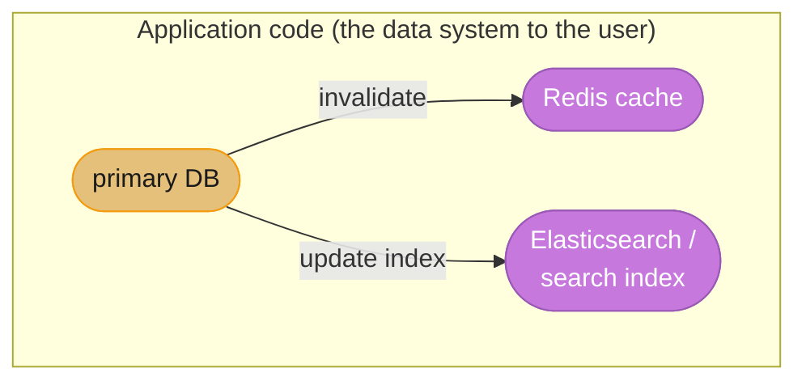
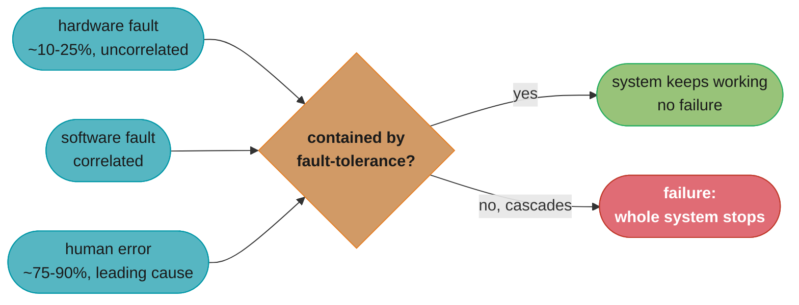
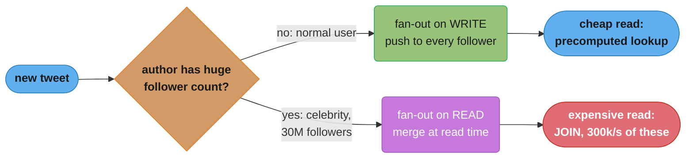
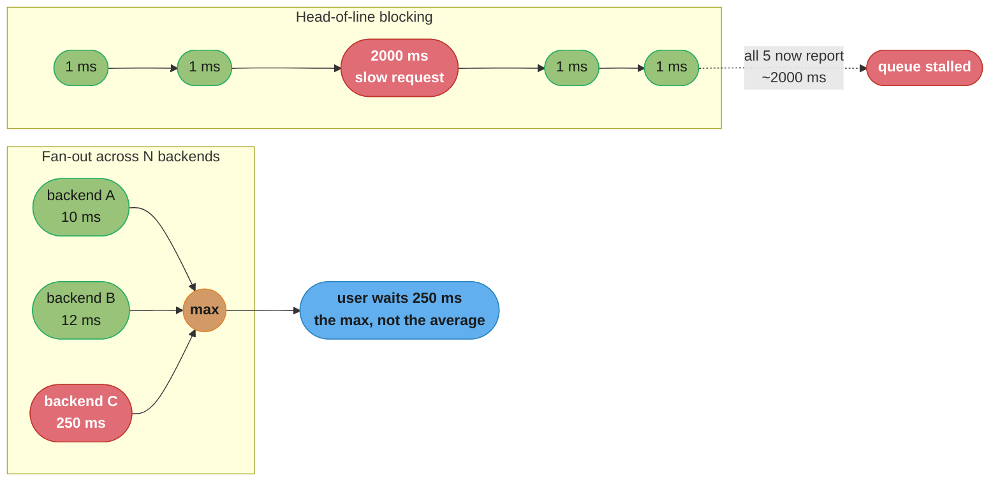
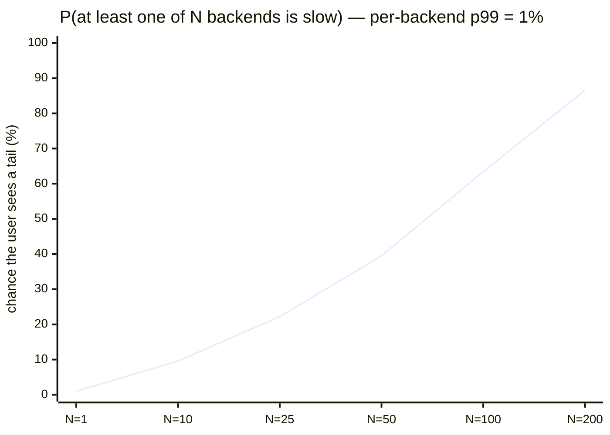
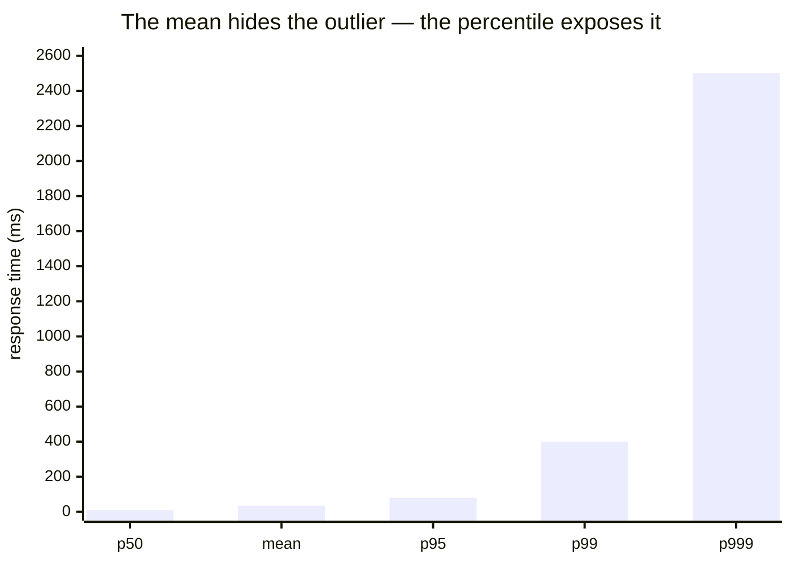

# Chapter 1: Reliable, Scalable, and Maintainable Applications

> Part I — Foundations of Data Systems · DDIA (Kleppmann) · the vocabulary chapter; leads to all of Parts II–III

## Chapter Map

This chapter defines the three concerns the entire book is built on and gives you precise,
measurable language for each. It is the most-quoted chapter in system-design interviews
because it teaches you how to *describe* load and performance rigorously (percentiles, not
averages) instead of hand-waving "it should be fast."

**TL;DR:**
- **Reliability** = tolerating hardware faults, software faults, and human error.
- **Scalability** = describing load with the right parameters, describing performance with
  percentiles (p50/p95/p99/p999), and choosing how to cope as load grows.
- **Maintainability** = operability + simplicity + evolvability; the largest lifetime cost.

## The Big Question

> "What does it even mean for a system to be 'good'? And how do I measure 'fast' and
> 'handles load' in a way I can put a number on and defend?"

Analogy: averages lie. If 99 customers are served in 10 ms and one waits 10 seconds, the
"average" hides a furious customer. Kleppmann's central move in this chapter is to replace
fuzzy adjectives with measurable definitions — and the headline tool is the **percentile**.

---

## 1.1 Thinking About Data Systems

Kleppmann opens by dissolving the category boundaries between "databases", "queues",
"caches", etc. They're increasingly the same: Redis is a datastore used as a message queue;
Kafka is a message queue with database-like durability. So he reasons about the umbrella
term **data system** — the composite you assemble from these tools plus your application
code. The user sees one system with one set of guarantees; you're responsible for those
guarantees even though no single tool provides them all.



Caption: the chapter's framing — your app is a composite data system, and the consistency
*between* its pieces (DB ↔ cache ↔ index) is your responsibility, not any single tool's.

The three concerns — reliability, scalability, maintainability — are introduced as the lens
for evaluating any such composite.

## 1.2 Reliability

**Reliability** means continuing to work *correctly* (right function, right performance)
even when things go wrong. The things that go wrong are **faults**; a system that
anticipates and copes with faults is **fault-tolerant** or **resilient**. Crucial nuance:
fault ≠ failure. A *fault* is one component deviating from spec; a *failure* is the system
stopping service entirely. You can never reduce faults to zero, so you design to stop faults
from cascading into failures. Deliberately *inducing* faults (Netflix's Chaos Monkey) is how
you prove your fault-tolerance actually works.

### Hardware faults

Disks fail (mean time to failure ~10–50 years for one disk, but with 10,000 disks you lose
roughly one *per day*), RAM goes bad, the power grid blips. Historically: add redundancy —
RAID, dual power supplies, hot-swappable CPUs. As data volumes grew, software fault-tolerance
techniques (tolerating the loss of whole machines) increasingly *supplement or replace*
hardware redundancy, because they enable rolling restarts and patching with zero downtime.

#### Decoding "10,000 disks means one dies every day"

That sentence is a formula in disguise. The rate at which a *fleet* fails is the fleet size
divided by the mean time to failure of one unit:

```
  failures per year = number of disks / MTTF of one disk
  failures per day  = failures per year / 365
```

**Stated plainly.** "One disk lasting decades is irrelevant. What matters is that you own
thousands of them, and the fleet failure rate scales linearly with how many you own."

| Symbol | What it is |
|--------|------------|
| `MTTF` | Mean time to failure for a *single* disk. The book's range: 10 to 50 years |
| `number of disks` | Fleet size. The multiplier that turns a rare event into a routine one |
| `failures per year` | Expected disk deaths across the whole fleet in a year |
| `365` | Days per year — only converts the rate into an on-call-relevant unit |

**Walk one example.** Push both ends of the book's MTTF range through it, 10,000 disks:

```
  optimistic disk (MTTF = 50 years)
    10000 / 50  =  200 failures/year
    200 / 365   =  0.55 failures/day      <- about one every two days

  pessimistic disk (MTTF = 10 years)
    10000 / 10  = 1000 failures/year
    1000 / 365  =  2.74 failures/day      <- about three every day

  the book's "roughly one per day" sits inside [0.55, 2.74]
```

The point of the arithmetic is the *reframing*. A single disk with a 50-year MTTF feels
like something you will never have to think about; multiply by a fleet and disk death
becomes a scheduled, budgeted, automated event. This is exactly why the chapter says
hardware redundancy alone stops being the answer at scale — you cannot hand-swap a drive
every day, so the software has to treat whole-machine loss as normal.

### Software errors

Systematic faults are more insidious than hardware faults because they're **correlated** —
a leap-second bug hits every node at once; a runaway process exhausts a shared resource for
everyone. They lurk until an unusual condition triggers them. No quick fix; mitigations are
careful assumptions, thorough testing, process isolation, measuring/monitoring, and
crash-and-restart of individual processes.

### Human errors

Humans configure systems and are the leading cause of outages (one study: ~10–25% of
outages from hardware, the rest config errors). You make systems reliable *despite* humans
by: designing APIs/admin interfaces that make the right thing easy; decoupling places where
mistakes happen (sandboxes with real data, no real users); testing thoroughly at all levels;
allowing quick and easy *recovery* (fast rollback, gradual rollout); and detailed monitoring
(telemetry).

All three fault categories funnel into the same question — does fault-tolerance contain
this one, or does it cascade into a failure?



Caption: the fault/failure boundary — hardware (~10-25% of outages, uncorrelated), software
(correlated, triggered on every node by the same condition), and human error (the rest,
~75-90%, the leading cause) all cross the same fault-tolerance boundary; you can never drive
faults to zero, so reliability engineering lives entirely at this boundary.

## 1.3 Scalability

**Scalability** is *not* a one-dimensional label ("X is scalable"). It's the question: *if
load grows in a particular way, what are our options for coping?* To discuss it you need two
things: a way to describe load, and a way to describe performance.

### Describing load — load parameters

Pick numbers that capture the stress on your system: requests/sec to a server, read:write
ratio, simultaneously active users, cache hit rate. **The right parameter depends on your
architecture.** Kleppmann's running example is Twitter's timeline:

> Two operations: post tweet (~4.6k req/s avg, 12k/s peak) and home timeline reads
> (~300k req/s). The hard part isn't tweet *volume* — it's **fan-out**: each user follows
> many, and each user is followed by many.

#### Decoding the fan-out numbers

The three rates above look like trivia until you divide them. Fan-out-on-write turns one
insert into one write *per follower*, so the real write volume is not the tweet rate:

```
  timeline writes/sec = tweet rate x average followers per user
  read:write ratio    = timeline reads/sec / tweet rate
```

**The idea behind it.** "Posting is rare and reading is constant, so pay the cost at write
time — unless a single writer has so many followers that one post becomes its own outage."

| Symbol | What it is |
|--------|------------|
| `tweet rate` | Posts accepted per second. 4.6k/s average, 12k/s peak |
| `average followers per user` | The fan-out factor. ~75 in the book's example |
| `timeline reads/sec` | Home-timeline requests, ~300k/s — the dominant operation |
| `read:write ratio` | How read-heavy the workload is; decides which side to precompute |

**Walk one example.** The average case first, then the celebrity that breaks it:

```
  read:write ratio  = 300000 / 4600        = 65.2 reads per tweet
  peak headroom     =  12000 / 4600        =  2.6x above average
  fan-out on write  =   4600 x 75          = 345000 timeline writes/sec

  celebrity with 30,000,000 followers posts ONE tweet:
    30000000 writes from a single insert   = 30,000,000x write amplification
    at 100000 timeline writes/sec drain    = 300 seconds = 5 minutes
```

Read the two lines at the bottom together. Sixty-five reads per write is what *justifies*
fan-out-on-write: you precompute once and serve 65 cheap lookups. But the same choice means
one celebrity post occupies the entire write pipeline for five minutes, during which every
other user's timeline delivery queues behind it. That single division is the whole argument
for Twitter's hybrid — precompute for the 99.9% of users with ordinary follower counts, and
merge-at-read for the handful whose fan-out is pathological.

**Why "requests per second" is the wrong load parameter here.** Tweet rate alone says the
system handles 4.6k writes/s, which sounds easy. The parameter that actually predicts load
is the *distribution* of followers per user — and specifically its tail, because the mean of
75 and a maximum of 30M live in the same dataset. Sizing off the mean under-provisions by
five orders of magnitude for the accounts that matter most.



Caption: the canonical "describe the load correctly" lesson — the relevant load parameter is
the *distribution of followers per user* (fan-out), not raw tweet rate. The right parameter
chooses the architecture.

### Describing performance — throughput, latency, and percentiles

Two questions: when you increase a load parameter and keep resources fixed, how is
performance affected? And, to hold performance steady, how much must you grow resources?

- **Throughput** (records/sec, batch jobs) vs **response time** (what the client sees:
  service time + queueing + network delays). **Latency** is technically the duration a
  request waits to be handled; response time is what the client experiences. The book uses
  response time as the headline metric.
- **Use percentiles, not the mean.** Response times vary wildly; the *median (p50)* tells
  you the typical experience ("half of requests faster than this"). Tail percentiles
  **p95 / p99 / p999** tell you the worst experiences — and those often hit your *most
  valuable* customers (more data ⇒ slower requests). Amazon targets p999 and notes a 100 ms
  slowdown costs ~1% in sales.
- **Tail latencies matter disproportionately** because of **fan-out**: a single user request
  often hits many backends in parallel, and the *slowest* one determines the user's wait.
  The more backends, the higher the chance at least one is slow — so the tail dominates.

#### Decoding the percentile — and why the mean lies

Both statistics summarize the same sorted list of response times, but they ask different
questions:

```
  mean = (sum of all response times) / (number of requests)

  pN   = sort the response times ascending, then take the value at
         position ceil(N/100 x count)
         "N percent of requests were at least this fast"
```

**In plain terms.** "The mean asks *how much total time did we spend*; a percentile asks
*how bad was it for the unluckiest customers*. Only the second question has a user attached
to the answer."

| Symbol | What it is |
|--------|------------|
| `sum / count` | The mean. Every request contributes, so one huge value drags all of it |
| `sort ascending` | The step that makes percentiles robust — magnitude becomes rank |
| `ceil(N/100 x count)` | Which position in the sorted list. p50 = middle, p99 = near the end |
| `p50` | Median. The *typical* experience — half of users did better |
| `p95 / p99 / p999` | Tail. The 1-in-20, 1-in-100, 1-in-1000 worst experiences |

**Walk one example.** Twenty requests, small enough to check by hand. Sixteen at 10 ms, two
at 25 ms, one at 90 ms, and one straggler at 1800 ms:

```
  sorted: 10 x16, 25, 25, 90, 1800          count = 20, total = 2100 ms

  mean  = 2100 / 20              = 105 ms
  p50   = position ceil(0.50x20) = 10  -> value   10 ms
  p95   = position ceil(0.95x20) = 19  -> value   90 ms
  p99   = position ceil(0.99x20) = 20  -> value 1800 ms

  mean / p50 = 105 / 10 = 10.5x
  requests actually slower than the mean: 1 of 20
  the single 1800 ms request supplies 85.7% of all milliseconds spent
  drop that one request and the mean collapses to 15.79 ms
```

Look at the third line from the bottom. **The mean of 105 ms describes no request in this
dataset.** Nineteen of twenty users were served in 25 ms or less; the twentieth waited
nearly two seconds. The mean sits ten times above the typical experience and twenty times
below the worst, so it is simultaneously too pessimistic to describe the median user and
far too optimistic to describe the angry one. It is an average of two populations that
should never have been averaged.

The last line is the tell for how fragile the mean is: deleting a *single* request out of
twenty moves it from 105 ms to 15.79 ms. Any statistic that one sample can move by 6.6x is
not a summary of the distribution — it is a summary of the outlier. The percentiles barely
move at all, because `p50` only cares that the value sits at rank 10; whether the slowest
request took 1800 ms or 18000 ms is irrelevant to it.

**Why this is the chapter's most-quoted paragraph.** An SLO written as "average < 200 ms"
passes cleanly on this data (105 ms), while 5% of users wait 1.8 seconds. Written as
"p99 < 200 ms" it fails, correctly. The percentile is what makes the promise enforceable —
and the tail requests are disproportionately your largest accounts, because more data per
user means more work per request.

Why tails dominate (head-of-line blocking + fan-out):



Caption: percentiles must be measured on the *client* and aggregated correctly — you cannot
average percentiles across machines; you must keep the histogram of raw response times.

The chance that *at least one* of N parallel backend calls lands in its own p99 tail
compounds quickly as fan-out grows — this is the mechanic behind "tails dominate":



Caption: the compounding-probability mechanic behind "tails dominate" — each extra backend
is one more chance for at least one call to land in its own p99 tail (1 - 0.99^N); by
N = 100 backends that is already ~63% of users, matching the number above, which is why
fan-out-heavy services must drive down tail latency itself, not just the median.

#### Decoding tail-latency amplification

The curve above is one formula. A request that fans out to `N` backends is slow if *any*
single backend is slow, so compute the probability that they are *all* fast and subtract:

```
  P(user sees a slow request) = 1 - (1 - p)^N

  with p = 0.01 (each backend's own p99):   1 - 0.99^N
```

**What the formula is telling you.** "You are not rolling the dice once per request — you
are rolling it once per backend, and you lose if *any* roll comes up bad."

| Symbol | What it is |
|--------|------------|
| `p` | One backend's chance of being slow. `p = 0.01` is exactly what "p99" means |
| `1 - p` | Chance that one backend is fast. `0.99` |
| `(1 - p)^N` | Chance that **all** `N` are fast — multiplication, since calls are independent |
| `1 - (...)` | Flip it: chance that **at least one** was slow. This is the user's experience |
| `N` | Fan-out width. The exponent, which is why the effect compounds rather than adds |

**Walk one example.** Hold `p` fixed at 1% and widen the fan-out:

```
  N =   1    1 - 0.99^1    = 1 - 0.990000 = 0.010000  ->   1.00% of users
  N =  10    1 - 0.99^10   = 1 - 0.904382 = 0.095618  ->   9.56% of users
  N = 100    1 - 0.99^100  = 1 - 0.366032 = 0.633968  ->  63.40% of users
  N = 500    1 - 0.99^500  = 1 - 0.006570 = 0.993430  ->  99.34% of users
```

Read the last line slowly. **Every backend is meeting a 99% fast SLO, and 99.34% of users
still hit a slow call.** Nothing is broken, no service is misbehaving, every dashboard is
green — and essentially every user has a bad experience. The exponent is doing all the work:
`N` appears as a power, not a multiplier, so widening fan-out does not degrade the user
experience gradually, it collapses it.

The crossover is worth memorizing: `log(0.5) / log(0.99) = 68.97`, so at **69 backends** the
majority of your users are hitting a tail call. Most microservice architectures cross that
line without anyone deciding to.

**The fix is in `p`, not `N`.** You usually cannot shrink fan-out — the architecture needs
those services. So drive down the per-backend tail instead. Tightening each backend from
p99 (`p = 0.01`) to p999 (`p = 0.001`) is a 10x improvement in one number, and here is what
that single change buys at the same fan-out widths:

```
                    p = 0.01 (p99)      p = 0.001 (p999)
  N =   1               1.00%                0.10%
  N =  10               9.56%                1.00%
  N = 100              63.40%                9.52%
  N = 500              99.34%               39.36%
```

At `N = 100`, one order of magnitude on the backend tail takes the fraction of affected
users from 63.40% down to 9.52% — a 6.7x improvement in user-visible quality bought entirely
by work no single service's own dashboard would have flagged as urgent. This is the
arithmetic behind Amazon targeting p999 rather than p99, and behind Dean and Barroso's
"The Tail at Scale": in a fan-out system, the tail *is* the median experience.

### Approaches for coping with load

- **Scaling up (vertical)** — a more powerful machine. Simple, but a single big machine is
  expensive and has a ceiling.
- **Scaling out (horizontal / shared-nothing)** — distribute load across many machines.
  Cheaper commodity hardware, but introduces all the distributed-systems complexity of
  Parts II–III.
- Most real systems are **elastic** (auto-add resources on load) or manually scaled
  (simpler, fewer surprises). There is **no magic "scalable" architecture** — the
  architecture depends on which operations are common and which are rare (the load
  parameters). An architecture for 100k req/s of 1 kB each is utterly different from one for
  3 req/min of 2 GB each, even at identical "throughput."

## 1.4 Maintainability

The majority of software cost is **ongoing maintenance**, not initial development: fixing
bugs, keeping it operational, investigating failures, adapting to new platforms and
requirements, paying down technical debt. Design for three principles:

- **Operability — make it easy for ops to keep it running.** Good monitoring, good defaults,
  predictable behavior, self-healing, good documentation, avoiding dependence on individual
  machines. Good operations can work around bad software; good software cannot survive bad
  operations.
- **Simplicity — manage complexity so new engineers can understand it.** The enemy is
  *accidental complexity* (complexity not inherent in the problem but arising from the
  implementation). The best tool against it is **abstraction**: a good abstraction hides
  implementation detail behind a clean interface and is reusable (a high-level language
  hides machine code; SQL hides storage engines).
- **Evolvability (extensibility / modifiability / plasticity) — make change easy.**
  Requirements always change. Evolvability operates at the data-system level and is tightly
  linked to simplicity and good abstractions: simple, well-abstracted systems are easier to
  modify. Agile working patterns (TDD, refactoring) are tools here.

---

## Visual Intuition

response times of 1000 requests, sorted:



The mean (35 ms) is dragged up by the tail yet still understates it. Only the
percentile vector (10 / 80 / 400 / 2500) tells the real story. SLOs are written
as "p99 < 200 ms", never "average < 200 ms".

Caption: the chapter's signature lesson made visible — report the percentile vector, set
SLOs on the tail (p95/p99/p999), and remember the tail hits your highest-value users hardest.

### Reconstructing the distribution behind that chart

The five bars are not five independent facts — they are five readings of one sorted list of
1000 response times. Here is a distribution that produces every one of them exactly:

```
  rank        count   value     which bar it sets
  1  - 949      949    10 ms    p50 = rank 500  -> 10 ms
  950            1     80 ms    p95 = rank 950  -> 80 ms
  951 - 989     39    130 ms
  990            1    400 ms    p99 = rank 990  -> 400 ms
  991 - 998      8   1870 ms
  999 - 1000     2   2500 ms    p999 = rank 999 -> 2500 ms
                ----
                1000 requests, 35000 ms total

  mean = 35000 / 1000 = 35 ms
```

**Read it like this.** "Ninety-five percent of this system's requests finish in 80 ms or
less, and the mean still says 35 ms — a number no user experienced, because it is the
average of a 10 ms crowd and a 2500 ms disaster."

Note what the mean of 35 ms is made of. The 949 fast requests contribute 9490 ms of the
35000 ms total; the 11 slowest requests — barely 1% of traffic — contribute 20,360 ms, or
58.2% of all time spent. The mean is majority-owned by the requests it is hiding. That
inversion is the entire reason the percentile vector `10 / 80 / 400 / 2500` is reported
instead of the single number, and why the chart puts `mean` deliberately out of rank order
between p50 and p95: it belongs to neither population.

---

## Key Concepts Glossary

- **Data system** — composite of stores + app code presenting one set of guarantees.
- **Reliability** — working correctly despite faults.
- **Fault** — one component deviating from spec. **Failure** — whole system stops.
- **Fault-tolerant / resilient** — anticipates and copes with certain faults.
- **Hardware fault** — disk/RAM/power failure; usually uncorrelated, handled by redundancy.
- **Software fault** — systematic, *correlated* bug triggered by a condition.
- **Scalability** — having coping strategies as a load parameter grows.
- **Load parameter** — number describing stress (req/s, read:write ratio, fan-out, hit rate).
- **Fan-out** — number of downstream requests one input generates (followers per user;
  backends per user request).
- **Throughput** — work per unit time. **Response time** — what the client experiences
  (service + queueing + network). **Latency** — duration a request awaits service.
- **Percentile (p50/p95/p99/p999)** — value below which that fraction of requests fall;
  p50 = median. **Tail latency** — the high percentiles.
- **Head-of-line blocking** — one slow request stalling those queued behind it.
- **Vertical scaling (scale up)** — bigger machine. **Horizontal scaling (scale out /
  shared-nothing)** — more machines.
- **Elastic** — automatically adds/removes resources with load.
- **Maintainability** — operability + simplicity + evolvability.
- **Accidental complexity** — complexity from the implementation, not inherent to the problem.
- **Abstraction** — clean reusable interface hiding implementation detail.

---

## Tradeoffs & Decision Tables

| | Scale up (vertical) | Scale out (horizontal) |
|---|---|---|
| Complexity | Low | High (distributed systems) |
| Cost curve | Superlinear at the high end | Commodity, near-linear |
| Ceiling | Hard hardware limit | Effectively none |
| Fault tolerance | Single machine = single point | Tolerates machine loss |

| | Fan-out on read (pull) | Fan-out on write (push) |
|---|---|---|
| Read cost | High (join at read) | Low (precomputed lookup) |
| Write cost | Low (one insert) | High (write to every follower) |
| Best for | Few reads, or celebrities | Read-heavy, normal fan-out |
| Twitter's choice | Used for celebrities | Used for normal users (hybrid) |

| Metric | Use it for | Don't |
|--------|-----------|-------|
| Mean / average | Quick sanity check | Anything user-facing; it hides tails |
| p50 (median) | Typical experience | Worst-case SLOs |
| p99 / p999 | SLOs, capacity, alerting | — (but expensive to optimize) |

---

## Common Pitfalls / War Stories

- **Setting SLOs on the average.** "Average response time < 200 ms" passes while 1% of
  requests take 5 s. Those 1% are often whales (largest accounts, most data). Always SLO on
  p95/p99/p999.
- **Averaging percentiles across machines.** p99 of machine A and p99 of machine B do not
  average to the cluster p99. You must aggregate raw histograms (HdrHistogram, t-digest),
  not the percentiles themselves.
- **Ignoring fan-out when reasoning about tails.** A user request that fans out to 100
  services will, with each service at p99=10 ms, *very often* hit at least one slow one —
  so the user-perceived p99 is far worse than any single service's p99.
- **The celebrity write storm.** Naively choosing fan-out-on-write, then a celebrity with
  30M followers tweets and you enqueue 30M writes, melting the system. The fix is a hybrid:
  precompute for normal users, merge-at-read for the few extreme accounts.
- **Confusing "we use Kubernetes/Cassandra" with "we are scalable."** Scalability is about
  matching architecture to the actual load parameters, not adopting a buzzword stack. The
  wrong load model produces an architecture that scales the wrong dimension.

---

## Real-World Systems Referenced

Twitter (timeline fan-out), Amazon (p999 SLOs, 100 ms ⇒ 1% sales), Netflix (Chaos Monkey
for fault injection), RAID storage, and the general practice of rolling upgrades on
shared-nothing clusters.

---

## Summary

A good data system is reliable, scalable, and maintainable. **Reliability** is tolerating
hardware faults (redundancy), software faults (correlated, fixed by testing/isolation/
monitoring), and human error (good interfaces, easy recovery, telemetry). **Scalability**
starts with describing load using the right *load parameters* (Twitter: fan-out, not tweet
rate), describing performance with *percentiles* (p50 for typical, p99/p999 for the tail
that hits your best customers), understanding why fan-out makes tails dominate, and choosing
between scaling up and scaling out. **Maintainability** — the largest lifetime cost — is
operability, simplicity (fighting accidental complexity with abstraction), and evolvability.
There is no one-size-fits-all scalable architecture; the right design follows from which
operations are common.

---

## Interview Questions

**Q: Why should you report response times as percentiles rather than as an average?**
Because response-time distributions are heavily skewed by outliers, so the mean describes no actual user — a few very slow requests drag it up while still understating the worst case. The median (p50) tells you the typical experience and the tail (p95/p99/p999) tells you the worst, which is what users actually complain about. SLOs are therefore written as "p99 < 200 ms," never as an average.

**Q: What is the difference between a fault and a failure, and which one do you design to eliminate?**
A fault is one component deviating from spec (a disk dies); a failure is the whole system stopping service. You do *not* try to eliminate faults — they're inevitable — you build fault-tolerance so faults don't escalate into failures. Netflix's Chaos Monkey deliberately injects faults in production to verify the system absorbs them.

**Q: In the Twitter timeline example, what is the real load parameter, and why does it determine the architecture?**
The real load parameter is the *fan-out* — the distribution of how many followers each user has — not the raw tweet rate. Tweets arrive at only ~5k/s, but timeline reads run ~300k/s, so the cost is in delivering each tweet to all followers. This drives the choice between fan-out-on-read (cheap writes, expensive reads) and fan-out-on-write (expensive writes, cheap reads); Twitter uses a hybrid because celebrities make pure fan-out-on-write explode.

**Q: Why do tail latencies (p99/p999) matter more than the median in a system with high fan-out?**
Because a single user-facing request often fans out to many backend services in parallel, and the user waits for the *slowest* of them. The more backends, the higher the probability that at least one is in its slow tail — so even if each service has a good p99, the user-perceived p99 is much worse. This is why services that fan out heavily must drive down tail latency, not just the median.

**Q: Why can't you average the p99 values reported by ten different servers to get the cluster p99?**
Percentiles are not linear, so averaging them is mathematically meaningless — a server handling few requests and one handling many contribute unequally. You must aggregate the raw response-time *histograms* (using structures like HdrHistogram or t-digest) and compute the percentile from the combined distribution. Averaging percentiles is a common and silent monitoring bug.

**Q: What is head-of-line blocking and how does it inflate tail latency?**
Head-of-line blocking is when one slow request occupies the server (or sits at the front of a queue) and stalls all the requests queued behind it, even if those would have been fast. The result is that a single slow operation makes many requests report high latency. It's a major contributor to tail latency and is why queueing delay must be measured on the client side, where the full wait is visible.

**Q: Distinguish the three categories of faults and the main mitigation for each.**
Hardware faults (disk/RAM/power) are mostly uncorrelated and handled by redundancy and, increasingly, software fault-tolerance enabling rolling restarts. Software faults are systematic and *correlated* (a bug that hits all nodes on a trigger), mitigated by testing, process isolation, monitoring, and crash-restart. Human errors are the largest source of outages, mitigated by well-designed interfaces, sandboxes, easy/fast rollback, and detailed telemetry.

**Q: Why are correlated software faults more dangerous than uncorrelated hardware faults?**
Hardware faults are largely independent — one disk dying doesn't make another die, so redundancy (RAID, replicas) works well. Software faults are correlated: a leap-second bug or a bad input pattern hits every node simultaneously, so your redundant copies all fail at once and redundancy gives no protection. Correlation defeats the statistical independence that hardware redundancy relies on.

**Q: What are the three components of maintainability?**
Operability (making it easy for operations to keep the system running smoothly — monitoring, good defaults, predictability), simplicity (managing complexity so new engineers can understand it, chiefly by removing accidental complexity through abstraction), and evolvability (making it easy to change as requirements evolve). Maintenance dominates total lifetime cost, so these are economically the most important properties.

**Q: What is accidental complexity, and what is the primary tool for reducing it?**
Accidental complexity is complexity that arises from the implementation rather than being inherent in the problem the software solves — tangled dependencies, special cases, inconsistent naming. The primary tool against it is good abstraction: a clean, reusable interface that hides implementation detail (SQL hiding storage engines, a high-level language hiding machine code). Removing accidental complexity is the essence of "simplicity."

**Q: Compare scaling up and scaling out; when would you still choose to scale up?**
Scaling up (a bigger machine) is operationally simple and avoids distributed-systems complexity but is expensive at the high end and has a hard ceiling. Scaling out (more commodity machines, shared-nothing) is cost-effective and tolerates machine loss but imports all the hard problems of Parts II–III. You scale up when the workload fits comfortably on one machine and you value simplicity and strong single-node consistency over a distributed system's complexity.

**Q: What does Kleppmann mean by "there is no magic scalable architecture"?**
He means scalability is always relative to specific load parameters, so an architecture is designed around which operations are common and which are rare — not adopted as a universal recipe. A system tuned for 100k small requests/sec looks nothing like one tuned for a few multi-gigabyte requests per minute, even at the same nominal throughput. Copying another company's stack without matching its load profile is how you scale the wrong dimension.

**Q: Why does measuring response time on the client matter more than measuring it on the server?**
Because the server's view excludes queueing delay, network transit, and time the request spent waiting to be accepted — exactly the components that head-of-line blocking and load inflate. The client sees the full response time the user actually experiences. Server-side timing can look healthy while clients are timing out.

**Q: What is the relationship between throughput and response time, and why keep them separate?**
Throughput measures work completed per unit time (jobs/sec, records/sec) and is the natural metric for batch systems; response time measures how long an individual request takes and is the natural metric for online systems. They can move in opposite directions — pushing throughput by batching often raises individual response times. Conflating them leads to optimizing one while silently degrading the other.

**Q: How does the load parameter you choose change as a system's architecture changes?**
The relevant load parameter is whatever best captures the dominant stress for *that* architecture: requests/sec for a stateless web tier, read:write ratio for a database, simultaneous connections for a chat server, cache hit rate for a read-through cache, fan-out for a social feed. As you redesign the system, the binding constraint shifts, so the parameter you track must shift with it; tracking the wrong one hides the real bottleneck.

**Q: Why does the chapter say good operations can work around bad software but not vice versa?**
Because operability — monitoring, runbooks, fast rollback, capacity headroom — lets a skilled ops team contain and recover from a flawed system, keeping it serving users. But no amount of elegant software survives an environment with no monitoring, no rollback path, and unpredictable manual changes; the software will eventually hit a condition operations can't see or recover from. Hence investing in operability pays off even for imperfect code.

---

## Cross-links in this repo

- [hld/scalability/ — horizontal vs vertical scaling, load modeling](../../../hld/scalability/README.md)
- [hld/load_balancing/ — distributing traffic, fan-out at the edge](../../../hld/load_balancing/README.md)
- [hld/ — the system-design interview framework (requirements, scale estimation)](../../../hld/README.md)
- [database/database_caching_patterns/ — cache-aside, stampede, hit-rate as a load parameter](../../../database/database_caching_patterns/README.md)

## Further Reading

- Kleppmann, DDIA Ch 1 — original text and its reference list.
- Dean & Barroso, "The Tail at Scale," CACM 2013 — the canonical paper on why tail latency
  dominates fan-out systems.
- Brendan Gregg, *Systems Performance* — latency measurement and percentiles in depth.
