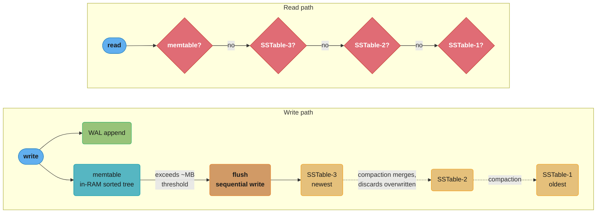
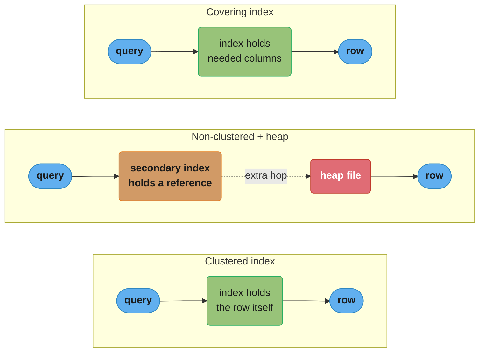
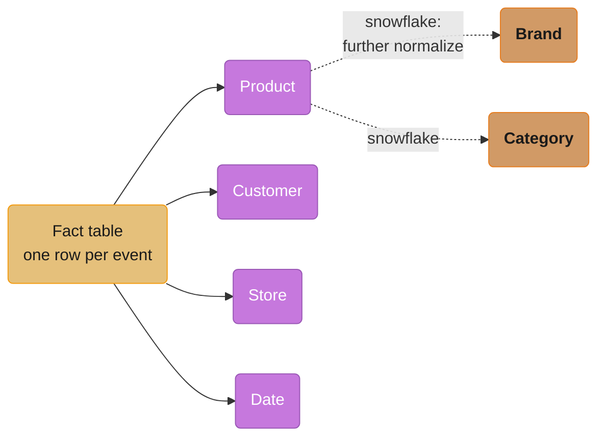
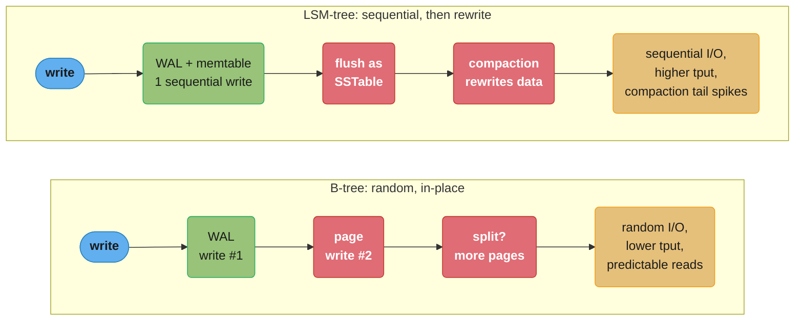

# Chapter 3: Storage and Retrieval

> Part I — Foundations of Data Systems · DDIA (Kleppmann) · builds on Ch 2, leads to Ch 4

## Chapter Map

This chapter opens the database's hood: how, on the level of bytes on disk, a database stores
data and finds it again. It splits storage engines into two families optimized for two
workloads — **OLTP** (transaction processing: many small point reads/writes) and **OLAP**
(analytics: scan-and-aggregate over huge datasets) — and within OLTP contrasts the two great
index structures, **LSM-trees** and **B-trees**.

**TL;DR:**
- **Log-structured (LSM-tree)** storage: append-only, sequential writes, compaction; great
  write throughput. **Page-oriented (B-tree)** storage: in-place updates, the relational
  default; great read latency.
- An index speeds reads but slows writes — every index is a cost on every write.
- **OLTP vs OLAP** are fundamentally different; analytics moved to separate **data
  warehouses** with **column-oriented storage**, which compresses and scans far faster.

## The Big Question

> "Why is a database fast at finding one row but slow to scan a billion — and how do
> different engines (Postgres vs Cassandra vs a data warehouse) make opposite tradeoffs to
> win at different jobs?"

Analogy: the world's simplest database is `echo "$key,$value" >> db` for writes and `grep`
for reads. Writes are blazing (sequential append) but reads are O(n) (scan everything). An
**index** is the additional structure you build to make reads fast — and the entire chapter
is about which index structure to pay for, given your workload.

---

## 3.1 Data Structures That Power Your Database

### Hash indexes

The simplest index for a log-structured store: keep an in-memory hash map from key to the
**byte offset** in the data file. Write = append to file + update the hash map; read = look up
the offset, seek, read. Bitcask (Riak's engine) works exactly this way: extremely fast
reads/writes as long as all keys fit in RAM. To bound disk usage, break the log into
**segments** and run **compaction** — throw away duplicate keys, keeping only the latest value
per key — then merge segments. Limits: the key set must fit in memory, and **range queries are
inefficient** (you can't scan a key range, only point-lookup each key).

### SSTables and LSM-trees

Improve the log by requiring each segment's key-value pairs to be **sorted by key** — a
**Sorted String Table (SSTable)**. Three wins: (1) merging segments is a cheap mergesort-style
scan; (2) you no longer need every key in memory — a **sparse** in-memory index (one key per
few KB) suffices, and you scan the small gap between known offsets; (3) you can compress blocks
between sparse-index entries, saving disk and I/O.

How to keep writes sorted when they arrive in random order? Buffer them in an in-memory
balanced tree (red-black/AVL), called a **memtable**. When it exceeds a threshold (a few MB),
write it out as a new SSTable segment (already sorted). Reads check the memtable, then the
newest segment, then older ones. A background process runs **compaction + merging**. This is a
**Log-Structured Merge-tree (LSM-tree)** — the basis of LevelDB, RocksDB, Cassandra, HBase,
Lucene.

**LSM-tree write/read path:**



Writes fan out to the WAL for durability and the in-RAM memtable; once the memtable exceeds
its threshold (a few MB) it flushes as a new sorted SSTable, and background compaction merges
older segments. Reads check the memtable first, then each SSTable from newest to oldest — a
missing key must check every level, which is exactly why Bloom filters exist.

- **Crash recovery:** the memtable is volatile, so each write also appends to an unsorted
  **write-ahead log (WAL)** on disk; replay it after a crash.
- **Bloom filters:** a probabilistic set membership structure that answers "key definitely
  NOT here" cheaply, so reads skip SSTables that can't contain the key — critical because a
  *missing* key would otherwise check every level.
- **Compaction strategies:** *size-tiered* (newer/smaller SSTables merged into older/larger;
  HBase, Cassandra) vs *leveled* (key range split into smaller SSTables organized in levels;
  LevelDB, RocksDB). Leveled uses less disk; size-tiered does less write work.

### B-trees

The most widely used index (every major relational DB, plus many non-relational). B-trees keep
keys sorted (fast range queries) but organize the file into fixed-size **pages/blocks** (4–16
KB), read or written one page at a time — mirroring the underlying hardware. Each page contains
keys and **references to child pages**; the **branching factor** (references per page) is
typically several hundred, so a tree of just 3–4 levels can index a huge dataset (4 KB pages,
branching factor 500 ⇒ 4 levels = 256 TB).

Updates are **in place**: find the page, change the value, write the page back. Inserts may
**split** a full page into two. The depth stays O(log n) and balanced. Crash safety relies on a
WAL (**redo log**): the split-a-page operation touches multiple pages, and a crash mid-split
would corrupt the tree, so the WAL lets recovery finish or undo it. Concurrency needs
**latches** (lightweight locks) on pages.

### Comparing B-trees and LSM-trees

The defining difference is **where the work goes**:

- **LSM-trees: faster writes.** All writes are sequential appends (memtable flush + WAL),
  which is much faster than B-tree random in-place page writes — especially on spinning disks
  and friendlier to SSD wear.
- **B-trees: faster/more predictable reads.** A read follows one path down the tree; an LSM
  read may have to check the memtable plus several SSTable levels (mitigated by Bloom filters).
- **Write amplification:** one logical write causes multiple physical writes. B-trees write
  every piece of data at least twice (WAL + page, more on splits). LSM-trees rewrite data
  repeatedly during compaction. High write amplification limits write throughput and wears
  SSDs. LSM generally sustains *higher* write throughput because writes are sequential and
  compaction can be tuned.
- **Space:** LSM-trees compress better (no per-page fragmentation; better packing), so lower
  disk footprint. B-trees leave pages partially empty after splits (fragmentation).
- **LSM downside — compaction interference:** compaction competes with foreground reads/writes
  for disk I/O, so at high write volume LSM can show *worse and less predictable* tail latency.
  And if compaction can't keep up, unmerged segments accumulate and reads slow down — you must
  monitor it.
- **B-tree advantage — transactions:** each key exists in exactly one place in a B-tree, which
  makes locking ranges for transaction isolation natural (LSM has the same key across levels).

### Other indexing structures

- **Secondary indexes:** indexes on non-primary-key columns; values aren't unique, so the
  index entry points to a list of matching rows (or appends a row identifier). Essential for
  joins and filtering. Both B-trees and LSM-trees can host them.
- **Storing values in the index:** the index value can be the *row itself* (a **clustered
  index** — MySQL InnoDB stores rows in the primary-key B-tree) or a *reference* to the row in
  a separate **heap file** (the indirection avoids duplicating data across multiple secondary
  indexes). A **covering index** stores *some* columns in the index so common queries are
  answered from the index alone, without touching the heap.

**Clustered vs non-clustered vs covering index — where the extra hop happens:**



A clustered index stores the row itself, so a lookup is one hop; a non-clustered (secondary)
index stores only a reference, adding a second hop into the heap file to fetch the row; a
covering index answers the query from the index's own columns, skipping the heap entirely.

- **Multi-column / concatenated indexes:** combine fields (e.g. `(lastname, firstname)`) for
  multi-field queries. For geospatial/multi-dimensional data, specialized structures like
  **R-trees** (and space-filling-curve tricks) handle "within this lat/long box."
- **Fuzzy indexes & full-text search:** Lucene allows searching for words within an edit
  distance, using an in-memory finite-state automaton over the term dictionary — similar in
  spirit to a trie.
- **Keeping everything in memory:** **in-memory databases** (Redis, Memcached, VoltDB,
  MemSQL) avoid disk-format overhead. Their speed comes less from "no disk reads" (the OS
  caches disk anyway) and more from *not having to encode data into a disk-friendly form*.
  Some offer durability via a log/snapshots or replication. In-memory designs can also offer
  data models hard to do on disk (Redis's priority queues, sets).

## 3.2 Transaction Processing or Analytics?

Two access patterns diverged into two kinds of systems:

| | OLTP (online transaction processing) | OLAP (online analytic processing) |
|---|---|---|
| Read pattern | Small number of records by key | Aggregate over millions of records |
| Write pattern | Random-access, low-latency from user input | Bulk import (ETL) or event stream |
| Used by | End users via web app | Analyst / business intelligence |
| Data size | GB–TB | TB–PB |
| Bottleneck | Disk seek time | Disk bandwidth |

Originally the same database served both. As datasets grew, companies stopped running
analytics on the OLTP database (expensive ad-hoc queries hurt latency-sensitive transactions)
and built a separate **data warehouse**: a read-only copy of data from all OLTP systems,
loaded via **ETL** (Extract–Transform–Load), optimized for analytic queries.

**Stars and snowflakes (schemas for analytics).** Warehouses commonly use a **star schema**: a
central **fact table** (one row per event — a sale, a click) surrounded by **dimension tables**
(who, what, where, when, how — product, customer, store, date). It's called a star because the
fact table is in the middle with dimensions radiating out. A **snowflake schema** further
normalizes dimensions into sub-dimensions (more normalized, more joins, less common). Fact
tables are enormous (trillions of rows, petabytes), and a typical query touches only a few of
their many columns.

**Star schema fan-out (and the snowflake extension):**



A star schema is literally shaped like its name: the fact table sits at the center with
dimension tables (product, customer, store, date) radiating outward, one join away. A
snowflake schema takes it further, normalizing a dimension like product into sub-dimensions
(brand, category) — more normalized and more joins, which is why it's less common in practice.

## 3.3 Column-Oriented Storage

The key insight for analytics: a fact table may have 100+ columns, but a query touches 4–5,
yet **row-oriented** storage forces the engine to load every column of every row off disk.
**Column-oriented storage** stores all values of *one column* together (column by column
instead of row by row), so a query reads only the columns it needs — slashing disk I/O.

- **Column compression:** values within a column are similar, so they compress extremely well.
  **Bitmap encoding** of a column with few distinct values (e.g. `country`, `product_id`)
  turns it into one bitmap per distinct value; these bitmaps are tiny and support fast `WHERE
  product_id IN (...)` via bitwise OR. Compression also lets more data fit in CPU cache and
  uses memory bandwidth efficiently (vectorized processing).
- **Sort order:** you can sort the rows of a column store (consistently across all columns) by
  a chosen key. Sorting helps compression (long runs of repeated values) and speeds range
  queries on the sort key. **C-Store/Vertica** keep *several* differently-sorted copies of the
  data (redundant, like multiple secondary indexes) so each query uses the best sort order.
- **Writing to column storage:** in-place updates are hard (inserting a row means rewriting all
  columns). The solution is **LSM-style**: buffer writes in an in-memory row store, then merge
  into the column files in bulk — same idea as the LSM-tree memtable.
- **Aggregation: materialized views and data cubes.** Because the same aggregates are computed
  repeatedly, warehouses cache them in **materialized views** (a precomputed, on-disk query
  result that's refreshed when data changes) and **data cubes / OLAP cubes** (a grid of
  aggregates summarized along multiple dimensions). These make common rollups instant but make
  the data less flexible to query in new ways.

---

## Visual Intuition

```
ROW-ORIENTED vs COLUMN-ORIENTED (an analytics query reads 3 of 100 columns)

  ROW STORE on disk:                COLUMN STORE on disk:
  [r1: c1 c2 c3 ... c100]           col1: [r1 r2 r3 ... rN]   ← query reads ONLY
  [r2: c1 c2 c3 ... c100]           col2: [r1 r2 r3 ... rN]      col1, col7, col23
  [r3: c1 c2 c3 ... c100]           col3: [r1 r2 r3 ... rN]      and skips the other 97
   ...                               ...
  query must read ALL 100 cols      col100:[r1 r2 r3 ... rN]   ← 97% less disk I/O,
  of every row, then discard 97                                   and each column compresses
```

**Write amplification — where each engine pays:**



Caption: column orientation wins analytics by reading only needed columns and compressing
them; LSM vs B-tree is fundamentally a choice of *where* to pay write-amplification cost and
whether you want write throughput (LSM) or read predictability (B-tree).

---

## Key Concepts Glossary

- **Log (append-only)** — sequential write file; basis of log-structured engines.
- **Hash index** — in-memory map key → byte offset in the data file (Bitcask).
- **Segment / compaction** — splitting the log into files and merging out overwritten keys.
- **SSTable (Sorted String Table)** — a segment with keys sorted; enables sparse index +
  cheap merge + block compression.
- **Memtable** — in-memory sorted structure buffering writes before flush.
- **LSM-tree** — Log-Structured Merge-tree: memtable + SSTables + compaction (LevelDB,
  RocksDB, Cassandra, HBase, Lucene).
- **Write-ahead log (WAL) / redo log** — durable log for crash recovery.
- **Bloom filter** — probabilistic structure answering "definitely not present" cheaply.
- **Compaction strategy** — size-tiered vs leveled.
- **B-tree** — page-oriented, in-place, balanced tree; the relational default.
- **Page / block** — fixed-size unit (4–16 KB) of B-tree I/O.
- **Branching factor** — child references per B-tree page (hundreds).
- **Page split** — splitting a full page into two on insert.
- **Latch** — lightweight lock protecting a page under concurrency.
- **Write amplification** — physical writes per logical write.
- **Secondary index** — index on a non-key column; entries point to row(s).
- **Clustered index** — index that stores the row itself (InnoDB primary key).
- **Heap file** — separate file holding rows, referenced by indexes.
- **Covering index** — index storing some columns so queries skip the heap.
- **R-tree** — index for multi-dimensional/geospatial data.
- **In-memory database** — keeps the dataset in RAM (Redis, VoltDB).
- **OLTP / OLAP** — transaction processing vs analytic processing.
- **Data warehouse / ETL** — separate analytics store loaded by Extract-Transform-Load.
- **Star schema / fact table / dimension table** — analytics modeling pattern.
- **Snowflake schema** — star schema with further-normalized dimensions.
- **Column-oriented storage** — values stored column-by-column.
- **Bitmap encoding** — compressing low-cardinality columns into per-value bitmaps.
- **Materialized view / data cube** — precomputed, cached aggregates.

---

## Tradeoffs & Decision Tables

| | LSM-tree | B-tree |
|---|---|---|
| Writes | Sequential, high throughput | Random in-place, lower throughput |
| Reads | Check memtable + N SSTables (Bloom filters help) | One path, predictable |
| Write amplification | Compaction rewrites | WAL + page (+ splits) |
| Disk footprint | Lower (better compression) | Higher (page fragmentation) |
| Tail latency | Can spike during compaction | More predictable |
| Transactions/locking | Key across levels (harder) | Key in one place (natural) |
| Examples | RocksDB, Cassandra, HBase, Lucene | InnoDB, PostgreSQL, most RDBMS |

| | OLTP store | OLAP warehouse |
|---|---|---|
| Storage layout | Row-oriented | Column-oriented |
| Query | Point lookups by key | Scan + aggregate |
| Bottleneck | Disk seeks | Disk bandwidth |
| Schema | Normalized | Star / snowflake |
| Example | PostgreSQL, MySQL | Redshift, BigQuery, Vertica, ClickHouse |

---

## Common Pitfalls / War Stories

- **Adding indexes for every query.** Each secondary index must be updated on every write,
  so over-indexing turns a fast write path into a slow one. Indexes are a read optimization
  paid for by writes; add them deliberately.
- **LSM compaction falling behind.** Under sustained heavy writes, if compaction can't keep
  pace, unmerged SSTables pile up, reads must check more segments, and latency degrades —
  often a silent, creeping outage. Monitor compaction backlog and pending-compaction bytes.
- **Range queries on a hash index.** Hash indexes give O(1) point lookups but cannot scan a
  key range at all; choosing a hash-only engine for a workload that needs ranges (time-series,
  pagination) is a dead end. Use a sorted structure (SSTable/B-tree).
- **Running analytics on the OLTP database.** A heavy ad-hoc aggregate scan competes with
  latency-sensitive transactions, spiking user-facing p99. This is exactly why warehouses
  exist; replicate to a column store for analytics instead.
- **Row store for analytics.** Storing a 100-column fact table row-oriented forces every query
  to read all 100 columns even when it needs 4 — 25× wasted I/O. Use column storage for
  scan-heavy analytic workloads.
- **A missing-key read storm in LSM without Bloom filters.** Looking up keys that don't exist
  forces a check of *every* SSTable level; without Bloom filters this is catastrophically slow
  for not-found lookups (e.g. cache-miss patterns).

---

## Real-World Systems Referenced

Bitcask/Riak (hash index), LevelDB, RocksDB, Cassandra, HBase, Lucene/Elasticsearch (LSM),
PostgreSQL, MySQL InnoDB, Oracle, SQL Server (B-tree), Redis, Memcached, VoltDB, MemSQL,
Oracle TimesTen (in-memory), Teradata, Vertica/C-Store, Amazon Redshift, Google BigQuery,
Apache Parquet/ORC, ClickHouse (warehouse/columnar), Apache Hive/Spark/Impala (SQL-on-Hadoop).

---

## Summary

Storage engines split by workload. For OLTP, two index families dominate: **log-structured
(LSM-trees)** — append-only sequential writes, memtable + SSTables + compaction + Bloom
filters, optimized for write throughput; and **page-oriented (B-trees)** — in-place updates in
fixed pages with a high branching factor, optimized for read predictability and natural
transaction locking. Both rely on a WAL for crash recovery, and every index trades faster
reads for slower writes (write amplification). Secondary, clustered, covering, multi-column,
geospatial, fuzzy, and in-memory indexes are variations on these themes. For analytics, OLTP
and OLAP diverged: analytics moved to **data warehouses** loaded by ETL, modeled as **star/
snowflake schemas**, and stored **column-oriented** — reading only needed columns, compressing
aggressively (bitmap encoding), sorting for compression and range scans, buffering writes
LSM-style, and caching results in **materialized views and data cubes**.

---

## Interview Questions

**Q: What is the fundamental tradeoff between LSM-trees and B-trees?**
LSM-trees optimize writes and B-trees optimize reads. LSM-trees turn all writes into sequential appends (memtable flush plus WAL) and defer cleanup to background compaction, giving very high write throughput; reads may have to consult the memtable plus several SSTable levels. B-trees update pages in place with random I/O, giving lower write throughput but a single, predictable read path down the tree. So you pick LSM for write-heavy workloads and B-trees for read-heavy or latency-sensitive ones.

**Q: What is write amplification, and how does it differ between the two engine families?**
Write amplification is the number of physical writes caused by one logical write, and it limits sustainable write throughput while wearing out SSDs. B-trees write each datum at least twice — once to the WAL and once to the page — plus extra writes when pages split. LSM-trees write once sequentially but then rewrite the same data repeatedly during compaction as segments merge. Both pay it; LSM usually still sustains higher write throughput because its writes are sequential and its compaction is tunable.

**Q: Why does an LSM-tree need Bloom filters, especially for keys that don't exist?**
Because an LSM read that misses the memtable must check SSTable segments from newest to oldest, and a key that doesn't exist anywhere forces it to check *every* segment before concluding "not found" — extremely slow under not-found-heavy patterns like cache misses. A Bloom filter is a compact probabilistic structure that answers "this key is definitely not in this SSTable" cheaply, letting the read skip segments that can't contain the key and avoid the full scan.

**Q: Why are all writes in a log-structured store appends, and why is that fast?**
Appending writes the data to the end of a file (and to the WAL) sequentially, never seeking to overwrite existing data in place. Sequential writes are dramatically faster than random writes on spinning disks and are also gentler on SSDs (fewer erase cycles, less wear). The cost is deferred: overwritten and deleted values accumulate until background compaction reclaims the space.

**Q: What does compaction do in an LSM-tree, and what happens if it can't keep up?**
Compaction merges SSTable segments, discarding overwritten and deleted keys so that only the latest value per key survives, which bounds disk usage and keeps read paths short. If compaction falls behind sustained heavy writes, unmerged segments accumulate, so reads must scan more segments and latency degrades; eventually disk fills. This makes compaction backlog a critical metric to monitor, and it's why LSM tail latency can spike when compaction competes with foreground I/O.

**Q: Why do B-trees keep a write-ahead log if they update pages in place?**
Because some operations touch multiple pages — most importantly a page split, which splits one full page into two and updates the parent. A crash partway through would leave the tree corrupted (a dangling or orphaned page). The WAL (redo log) records the intended changes before they're applied so that recovery after a crash can replay the log to complete or roll back the multi-page operation and restore a consistent tree.

**Q: How can a B-tree with 4 KB pages index a 256 TB dataset in only four levels?**
Because each page holds a large number of child references — the branching factor — typically several hundred. With a branching factor of 500, one level addresses 500 pages, two levels 500², three levels 500³, and four levels 500⁴ pages; at 4 KB per page that's on the order of hundreds of terabytes. The high branching factor keeps the tree shallow, so a lookup follows only about four page reads regardless of dataset size.

**Q: What is a clustered index versus a heap file with a non-clustered index?**
A clustered index stores the actual row data *within* the index structure ordered by the index key — MySQL InnoDB stores rows in the primary-key B-tree, so a primary-key lookup returns the row directly. The alternative stores rows in a separate heap file and has the index hold a reference (pointer) into the heap; this avoids duplicating row data across multiple secondary indexes but adds an indirection hop. Clustered indexes speed reads on the clustering key but make secondary-index lookups go through it.

**Q: What is a covering index and what problem does it solve?**
A covering index stores some of a row's columns directly in the index, so a query that needs only those columns is answered entirely from the index without reading the row from the heap or clustered store. It solves the extra-I/O problem of index-then-fetch: the second lookup into the table is eliminated. The cost is a larger index and more write overhead, so it's worth it for hot queries on a stable set of columns.

**Q: Why do analytic workloads use column-oriented storage instead of row-oriented?**
Analytic queries typically aggregate over millions of rows but touch only a handful of a fact table's many columns. Row-oriented storage forces the engine to read every column of every row off disk and then discard the unneeded ones, wasting most of the I/O. Column-oriented storage keeps each column's values together, so the query reads only the columns it references — often a 90%+ reduction in disk I/O — and the similar values within a column compress extremely well.

**Q: How does bitmap encoding compress a column, and why is it good for analytics?**
For a column with few distinct values (like country or product category), bitmap encoding stores one bitmap per distinct value, where bit *i* indicates whether row *i* has that value. These bitmaps are tiny and often further run-length compressed. They make filters like `WHERE product_id IN (30, 68, 69)` fast: load those three bitmaps and OR them together to get all matching rows, with no row scan — a perfect fit for analytic filtering on low-cardinality columns.

**Q: How do you write to a column store given that in-place row inserts are hard?**
You use the same trick as LSM-trees: buffer incoming writes in an in-memory row-oriented structure (a sorted store), and periodically merge that buffer into the on-disk column files in bulk. Queries read both the in-memory buffer and the column files and combine the results. This keeps writes cheap and amortized while preserving the column files' read efficiency, which is why systems like Vertica adopt an LSM-style write path.

**Q: What are a star schema and a snowflake schema, and how do they differ?**
A star schema centers on a large fact table (one row per event, like a sale) with foreign keys radiating out to dimension tables describing the who/what/where/when (product, customer, store, date) — drawn as a star. A snowflake schema goes further and normalizes those dimensions into sub-dimension tables (e.g. product → brand and category tables), which reduces redundancy but adds joins. Star is more common in warehouses because it's simpler and analysts find it easier to query.

**Q: Why did OLTP and OLAP split into separate systems instead of sharing one database?**
Because their access patterns conflict: OLTP needs low-latency point reads/writes from user requests, while OLAP runs heavy ad-hoc scan-and-aggregate queries over huge datasets. Running analytics on the OLTP database makes those expensive scans compete for resources and spike user-facing latency. So companies extract data into a separate read-only data warehouse via ETL, optimized (column storage, star schemas) for analytics without endangering the transactional system.

**Q: What actually makes in-memory databases fast, given that the OS already caches disk pages?**
The main speedup is *not* avoiding disk reads — the OS page cache already serves hot data from RAM in disk-backed databases. It's that an in-memory database avoids the overhead of encoding/decoding its in-memory data structures into a disk-friendly byte format. It can also offer data models that are awkward on disk, like Redis's sets and priority queues. Durability is added separately via append-only logs, periodic snapshots, or replication to other nodes.

**Q: What is a materialized view (or data cube), and what is its tradeoff?**
A materialized view is a precomputed, on-disk copy of a query's result (often an aggregate) that is refreshed when underlying data changes, so repeated queries read the cached result instantly instead of recomputing it; a data cube generalizes this to a grid of aggregates summarized along several dimensions at once. The tradeoff is flexibility: the cube/view answers the precomputed rollups very fast but can't easily answer queries that need a dimension it didn't materialize, and it adds maintenance cost on writes.

---

## Cross-links in this repo

- [database/storage_engines_internals/ — B+tree, LSM-tree, WAL, buffer pool in production depth](../../../database/storage_engines_internals/README.md)
- [database/indexing_deep_dive/ — covering, partial, composite, GIN, BRIN indexes](../../../database/indexing_deep_dive/README.md)
- [database/time_series_databases/ — columnar + LSM in ClickHouse, Gorilla compression](../../../database/time_series_databases/README.md)
- [database/in_memory_databases/ — Redis vs Memcached, durability modes](../../../database/in_memory_databases/README.md)

## Further Reading

- Kleppmann, DDIA Ch 3 — original text and references.
- O'Neil et al., "The Log-Structured Merge-Tree (LSM-Tree)," 1996 — the founding LSM paper.
- Stonebraker et al., "C-Store: A Column-oriented DBMS," VLDB 2005 — column-store foundations.
