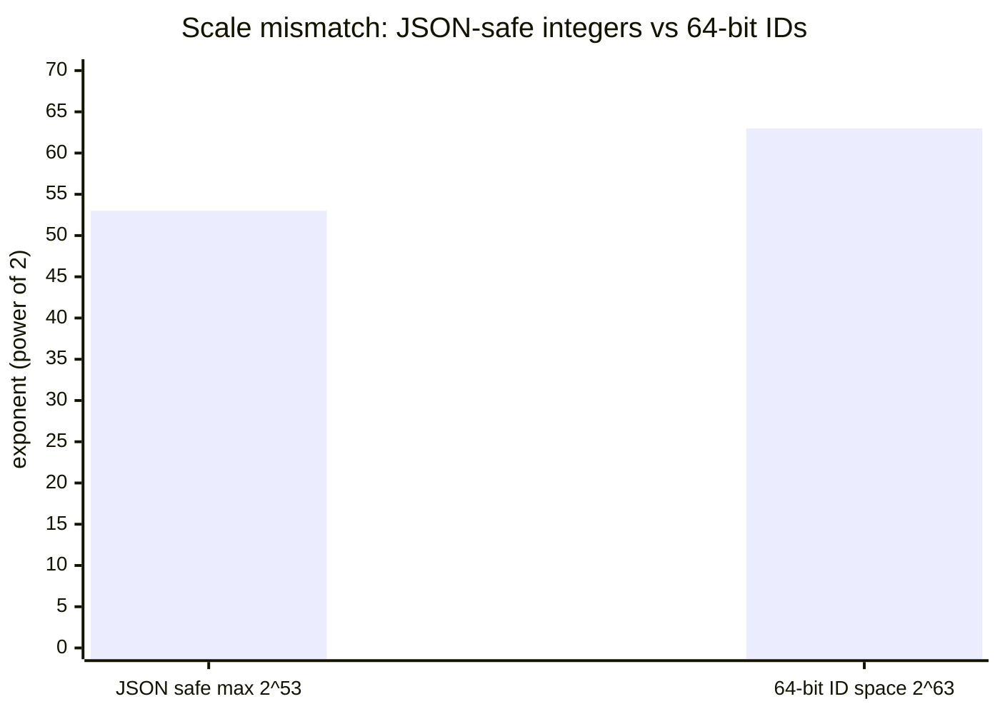
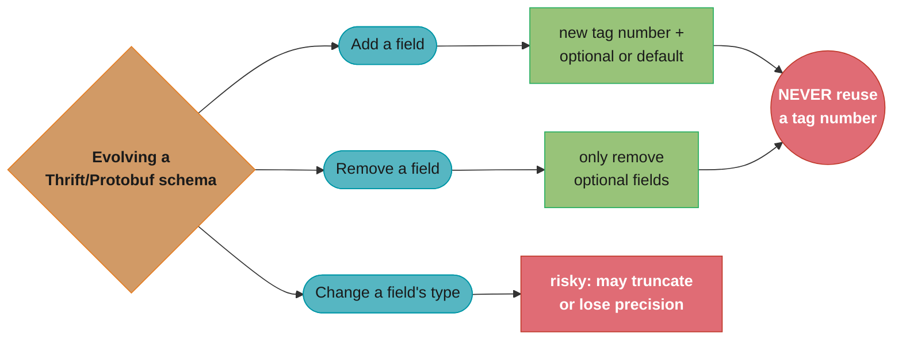
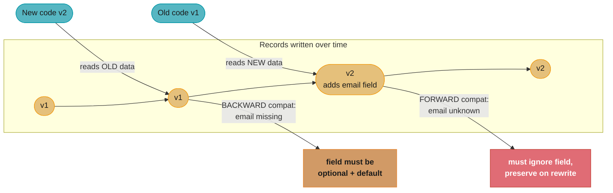
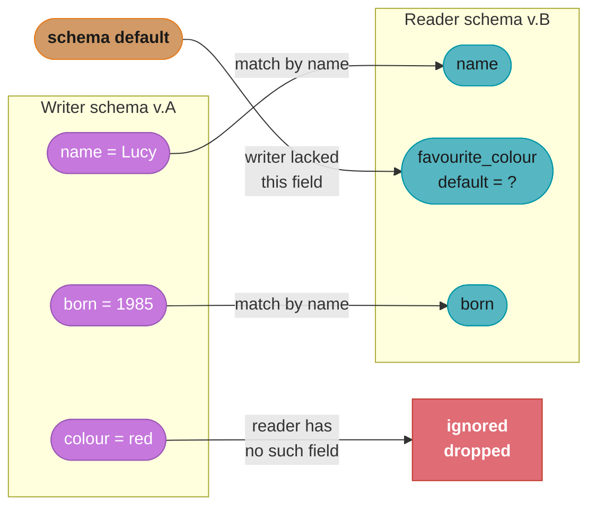

# Chapter 4: Encoding and Evolution

> Part I — Foundations of Data Systems · DDIA (Kleppmann) · builds on Ch 1–3, closes Part I, leads to Part II

## Chapter Map

Applications change, so the data they read and write changes shape over time. This chapter is
about **evolvability at the data level**: how to encode data so that old and new versions of
code can coexist during a rolling deployment, talking to each other and to data written years
apart. The two big ideas are **encoding formats** (how to turn in-memory objects into bytes)
and **dataflow modes** (how those bytes travel between processes).

**TL;DR:**
- Code changes roll out gradually, so you need **backward compatibility** (new code reads old
  data) AND **forward compatibility** (old code reads new data) simultaneously.
- Binary schema-based formats (**Protocol Buffers, Thrift, Avro**) give compact size, schema
  documentation, and rule-based evolution — far better than JSON/XML for internal use.
- Data flows three ways — **through databases**, **through services (REST/RPC)**, and
  **through asynchronous message queues** — and each must handle version skew.

## The Big Question

> "I'm deploying a new version of my code while the old version is still running and old data
> still sits in the database. How do I change the data's shape without a coordinated, big-bang,
> everyone-stops-at-once deployment?"

Analogy: think of encoding as translating between two languages — the rich in-memory language
of objects/structs/pointers and the flat language of bytes on a wire or disk. Pointers are
meaningless to another process, so encoding must serialize the *content*. The trick is
designing that translation so the dictionary can change on one side without breaking the other.

---

## 4.1 Formats for Encoding Data

Two representations of data: **in memory** (objects, structs, lists, hash maps, pointers —
optimized for CPU access) and **a byte sequence** (for files or network — self-contained, no
pointers). Converting in-memory → bytes is **encoding** (serialization, marshalling); the
reverse is **decoding** (parsing, deserialization, unmarshalling).

### Language-specific formats

Java's `Serializable`, Python's `pickle`, Ruby's `Marshal`. Convenient (one line to save an
object) but deeply flawed: tied to one language (can't interoperate); the decoder can
instantiate arbitrary classes, a **security hole**; versioning and efficiency are afterthoughts.
Avoid for anything but the most transient use.

### JSON, XML, and CSV (textual formats)

Standardized, human-readable, widely supported — good for *interfaces between organizations*.
But they have real problems: ambiguity around **numbers** (XML/CSV can't distinguish a number
from a string; JSON can't distinguish integers from floats and loses precision on integers
> 2^53, biting Twitter's 64-bit tweet IDs); **no native binary** (must Base64-encode, +33%
size); optional/complicated schema support; CSV has no schema and is fragile. They're verbose.
Despite the flaws, they're "good enough" as a lingua franca and dominate public APIs.

Caption: JSON can represent integers exactly only up to 2^53 (about 9 quadrillion), but a 64-bit
ID space reaches 2^63 (about 9.2 quintillion) — 10 extra bits, a 1,024x gap. Any ID above 2^53
silently loses precision when parsed as a JSON number, which is exactly why Twitter had to return
tweet IDs as both a number and a string.

### Binary encoding

For internal data (within one organization), binary formats win on **size** and **speed**.
Naive binary JSON (MessagePack, BSON) shrinks things a little but still ships every field name
in every message. The big win comes from a **schema**.

### Thrift and Protocol Buffers

Both (Thrift from Facebook, Protocol Buffers from Google) require a **schema / IDL** declaring
fields with **field tags (numbers)** and types. Code generation produces classes in your
language. The encoded bytes reference fields by their **tag number, not their name**, so they're
compact. Evolution rules:

- **Add a field:** give it a new tag number. Old code reading new data ignores unknown tags
  (forward compatible). New code reading old data sees the field is missing — so **new fields
  must be optional or have a default** (backward compatible).
- **Never reuse a tag number**, and you can't make a field `required` if old data lacks it.
- **Remove a field:** only remove optional fields, and never reuse their tag number.
- **Change a type:** risky — may lose precision or truncate (e.g. 32-bit → 64-bit int: new code
  reading old data is fine, old code reading new data truncates).

Caption: the three schema-change operations funnel into their own compatibility rule, and adding
or removing a field both answer to the same non-negotiable constraint — a retired tag number is
never reused, since that would let new code misread old bytes under the wrong field.

### Avro

Apache Avro (born for Hadoop) also uses a schema but takes a different approach: the encoded
bytes contain **no field tags and no type annotations at all** — just concatenated values. This
is the most compact, but it means the reader *must* know the exact schema used to write the
data. Avro's elegant solution: distinguish the **writer's schema** (used to encode) from the
**reader's schema** (the version the consumer expects). They need not be identical — Avro
**resolves** them by matching fields *by name*, filling in defaults for fields the reader has
but the writer didn't, and ignoring fields the writer had but the reader doesn't.

How does the reader learn the writer's schema? Depends on context: a large file embeds it once
in a header (Hadoop); a database stores a version number per record and keeps a schema registry;
network connections negotiate it on handshake. Avro's killer feature: because matching is by
name and schemas are first-class, it supports **dynamically generated schemas** (e.g.
auto-generate an Avro schema from a relational table's columns; rename a column and the new
writer schema still resolves against old readers) — far friendlier than Thrift/Protobuf's
hard-coded tag numbers for this use case.

### The merits of schemas

Schema-based binary encodings give: compactness (no field names in the payload); the schema is
valuable **up-to-date documentation**; a **schema registry** lets you check compatibility before
deploying; and code generation provides compile-time type checking in statically typed
languages. Schemas deliver the guarantees of schema-on-write while still supporting evolution —
the best of both worlds for internal data.

## 4.2 Modes of Dataflow

Who encodes and who decodes? Three modes, each needing forward+backward compatibility.

### Dataflow through databases

The process writing to the database encodes; a process reading later decodes. Because of
rolling upgrades, the **reader may be older than the writer**, so backward AND forward
compatibility are both needed *within a single database*. A subtle, dangerous bug: an old
version of the app reads a record, doesn't understand a new field a newer version added, and
**rewrites the record, silently dropping the unknown field**. Encoders must preserve unknown
fields through a decode-modify-encode cycle. Also note **"data outlives code"**: you deploy new
code in minutes, but the data in the database may be five years old — the database effectively
contains every version of your schema ever written. Migrations (rewriting all rows) are
expensive, so most databases allow the schema to evolve and old rows to keep their old shape.

### Dataflow through services: REST and RPC

A client encodes a request; a server decodes it, processes, encodes a response; the client
decodes that. **SOA / microservices**: services are deployed independently, so a server and its
clients run different versions at the same time — compatibility across versions is mandatory.

- **REST** is a *design philosophy* built on HTTP: resources identified by URLs, standard HTTP
  verbs, often JSON. Simple, well-tooled, dominant for public APIs.
- **SOAP** is an XML-based RPC protocol with a heavy standards stack (WSDL); complex, falling
  out of favor.
- **RPC (Remote Procedure Call)** tries to make a network call *look like* a local function
  call (Thrift, gRPC, etc.). Kleppmann stresses this abstraction is **fundamentally leaky**:
  a network call is unpredictable (may be lost or slow), may return without you knowing if it
  executed (timeouts → must be **idempotent** to retry safely), has wildly variable latency, must
  serialize all arguments, and crosses language boundaries. A local call either returns or throws;
  a network call has a whole new failure mode. Modern RPC frameworks acknowledge this with
  futures/promises, streaming, and service discovery, and are mainly used for internal
  service-to-service calls where you control both ends.

### Message-passing dataflow (asynchronous)

A middle ground: like RPC, a client sends a message to another process; like databases, it goes
through an intermediary — a **message broker / message queue** (RabbitMQ, ActiveMQ, Kafka,
NATS). Benefits: it **buffers** if the recipient is down or overloaded (improving reliability);
it can **redeliver** to a crashed consumer (preventing message loss); the sender needn't know
the recipient's address (decoupling); one message can go to **multiple** recipients; it
**decouples** sender from receiver (the sender doesn't wait, just fires and forgets). The broker
generally doesn't enforce a schema, so messages need forward+backward compatibility too. A
related model is the **actor model** (Akka, Erlang/OTP, Orleans): concurrency as actors that
communicate only by asynchronous messages; a **distributed actor framework** transparently sends
those messages across nodes — but rolling upgrades still require message compatibility.

---

## Visual Intuition

Caption: the chapter's core mechanic — evolution works only if old and new code stay mutually
compatible, and Avro achieves it by reconciling a writer schema against a reader schema by name.

---

## Key Concepts Glossary

- **Encoding (serialization, marshalling)** — in-memory object → byte sequence.
- **Decoding (parsing, deserialization, unmarshalling)** — bytes → in-memory object.
- **Backward compatibility** — new code can read data written by old code.
- **Forward compatibility** — old code can read data written by new code.
- **Field tag** — numeric field identifier in Thrift/Protobuf encodings (not the name).
- **IDL (Interface Definition Language)** — the schema declaration for Thrift/Protobuf/gRPC.
- **Writer's schema / reader's schema** — Avro's pair; reconciled by name + defaults.
- **Schema evolution** — changing a schema while preserving compatibility.
- **Schema registry** — central store of schema versions; checks compatibility pre-deploy.
- **Data outlives code** — the database holds every historical schema version of your data.
- **REST** — resource-oriented design philosophy over HTTP.
- **SOAP** — heavyweight XML-based RPC protocol with WSDL.
- **RPC (Remote Procedure Call)** — makes a network call look like a local function call
  (leaky abstraction).
- **Idempotence** — an operation safe to apply more than once (needed to retry RPCs safely).
- **Message broker / queue** — async intermediary buffering and routing messages (Kafka,
  RabbitMQ).
- **Actor model** — concurrency as message-passing actors; distributed across nodes by a
  framework.

---

## Tradeoffs & Decision Tables

| Format | Size | Schema | Cross-language | Best for |
|--------|------|--------|----------------|----------|
| Language-specific (pickle, Java ser.) | medium | implicit | No | Nothing durable (security + lock-in) |
| JSON / XML / CSV | large (text) | optional/weak | Yes | Public APIs, cross-org interfaces |
| Thrift / Protobuf | small | required (tags) | Yes | Internal RPC + storage, static schemas |
| Avro | smallest | required (by name) | Yes | Dynamically generated schemas, big data files |

| Dataflow mode | Coupling | Failure handling | Compatibility need |
|---------------|----------|------------------|--------------------|
| Through database | Time-decoupled (writer then reader) | Reader may be older | Backward + forward |
| Service REST/RPC | Synchronous, request/response | Timeouts, retries (need idempotence) | Across versions both directions |
| Message broker | Async, fully decoupled | Buffer, redeliver, fan-out | Backward + forward |

---

## Common Pitfalls / War Stories

- **The silent field-drop bug.** Old code reads a record that a newer version augmented with a
  field, doesn't know the field, and on rewrite *drops* it. Data is silently lost during normal
  operation. Encoders/ORMs must preserve unknown fields through a decode-modify-re-encode cycle.
- **Making a new field `required` in Protobuf/Thrift.** Old data lacks it, so new code can't
  decode old records — instant backward-incompatibility. New fields must be optional or carry a
  default. Likewise, never reuse a retired field's tag number.
- **JSON integer precision.** Numbers above 2^53 lose precision in JSON's float representation;
  Twitter had to return tweet IDs as both a number and a string because 64-bit IDs broke
  JavaScript consumers. Don't put large integers in JSON unquoted.
- **Treating RPC like a local call.** Assuming a remote call either succeeds or throws ignores
  the "succeeded but the response was lost" case. Retrying a non-idempotent RPC (charge a card,
  send money) after a timeout double-applies it. Make remote operations idempotent.
- **Big-bang schema migrations.** Rewriting every row to a new shape on a huge table is slow,
  locks tables, and risks downtime. Prefer schema-on-read evolution: let old rows keep their
  shape and handle both versions in code, migrating lazily.
- **Forgetting messages need compatibility too.** Brokers don't enforce schemas, so during a
  rolling upgrade a v2 producer can enqueue messages a still-running v1 consumer must tolerate
  (and vice versa). Apply the same forward/backward rules to queue payloads.

---

## Real-World Systems Referenced

Java Serializable, Python pickle, Ruby Marshal (language-specific); JSON, XML, CSV, Protocol
Buffers (Google), Apache Thrift (Facebook), Apache Avro + Hadoop (formats); REST, SOAP/WSDL,
gRPC (services); Confluent Schema Registry; RabbitMQ, ActiveMQ, Apache Kafka, NATS, Amazon SQS
(brokers); Akka, Erlang/OTP, Microsoft Orleans (actor frameworks); Twitter's 64-bit-ID JSON
workaround.

---

## Summary

Because code is deployed gradually and data outlives code, encodings must support **backward
compatibility** (new code reads old data) and **forward compatibility** (old code reads new
data) at the same time. Language-specific serialization is convenient but unsafe and
non-portable; JSON/XML/CSV are the cross-organization lingua franca despite ambiguity and
verbosity; and schema-based binary formats — **Thrift/Protocol Buffers** (field tags) and
**Avro** (writer vs reader schema, matched by name) — give compactness, documentation,
compatibility-checking, and disciplined evolution rules for internal data. Data then flows three
ways: through **databases** (where readers may be older than writers and unknown fields must be
preserved), through **services** via REST or the leaky-abstraction RPC (timeouts demand
idempotence), and through **asynchronous message brokers** and the actor model (decoupling,
buffering, redelivery, fan-out). Every mode needs version-skew tolerance.

---

## Interview Questions

**Q: What are forward and backward compatibility, and why do you need both at once?**
Backward compatibility means new code can read data written by old code; forward compatibility means old code can read data written by new code. You need both simultaneously because deployments are rolling — for a window of time, old and new versions of your application run side by side, reading and writing the same database and queues. New code must understand the historical data, and old code must tolerate (and not corrupt) data written by the newer code it hasn't been updated to fully understand.

**Q: How do Protocol Buffers and Thrift achieve schema evolution, and what are the rules?**
They encode fields by numeric tag rather than by name, so the schema maps tags to field names and types out of band. To add a field you assign it a brand-new tag; old readers ignore unknown tags (forward compatible), and the field must be optional or have a default so new readers can handle old data lacking it (backward compatible). The rules: never reuse a tag number, never make a new field required, and only remove optional fields — never reusing their tags.

**Q: How does Avro differ from Protobuf/Thrift, and what is its key advantage?**
Avro's encoded bytes contain no field tags or type annotations at all — just concatenated values — so the reader must know the schema used to write the data. It separates the writer's schema (used to encode) from the reader's schema (what the consumer expects) and reconciles them by matching fields by *name*, filling defaults for missing fields and ignoring extra ones. Its key advantage is friendliness to dynamically generated schemas, like auto-deriving a schema from a database table, because there are no manually assigned tag numbers to coordinate.

**Q: Why does Avro distinguish the writer's schema from the reader's schema?**
Because the data may have been written by a different (often older or newer) version of the code than the one reading it, and Avro's tagless encoding gives no way to interpret the bytes without the exact writing schema. By carrying or referencing the writer's schema and resolving it against the reader's expected schema by field name, Avro lets the two versions differ yet still communicate — defaults cover fields the reader added, and fields the writer included but the reader dropped are skipped.

**Q: What is the "silent field drop" bug when data flows through a database?**
It happens when an older version of the application reads a record that a newer version augmented with a field the old code doesn't know about, then writes the record back — and in doing so discards the unrecognized field, silently losing data during normal operation. The fix is for the encoding/decoding layer to preserve unknown fields through a decode-modify-re-encode cycle so that fields a given code version doesn't understand survive a round trip untouched.

**Q: Why does the book say "data outlives code," and what does that imply for migrations?**
Because you can deploy new code across a fleet in minutes, but the data already sitting in the database may be years old and was written by many past schema versions — so the database effectively contains every version of your schema you've ever used. This implies you should avoid big-bang migrations that rewrite every row (slow, lock-heavy, risky) and instead let the schema evolve so old rows keep their shape, handling multiple versions at read time and migrating lazily.

**Q: Why are language-specific serialization formats (pickle, Java Serializable) discouraged?**
They lock data to a single language so other systems can't read it; they're a security risk because decoding can instantiate arbitrary classes, enabling remote code execution on untrusted input; and they typically neglect versioning and efficiency, encoding bulky representations with poor evolution support. They're acceptable only for the most transient, same-process, same-version use — never for data persisted or sent across a network or time.

**Q: What problems do JSON, XML, and CSV have despite their popularity?**
They're verbose and have ambiguous data types: XML and CSV can't reliably distinguish a number from a string, and JSON can't distinguish integers from floats and loses precision on integers above 2^53. They have no native binary support, forcing Base64 (a ~33% size increase), and their schema support is optional or weak (CSV has none). They persist because they're human-readable and universally supported, making them a solid lingua franca for interfaces between organizations.

**Q: Why is RPC's "make a remote call look like a local call" considered a leaky abstraction?**
Because a network call has failure modes a local call never does: it can be lost or delayed unpredictably, and it can time out *after* the server already executed it, leaving the caller unsure whether it happened. Latency varies enormously, all arguments must be serialized, and large objects become problematic across languages. A local function call either returns a value or throws; pretending the network behaves the same way hides exactly the cases that cause production bugs.

**Q: Given RPC timeouts, why is idempotence important?**
Because when an RPC times out, the caller doesn't know whether the operation executed or not, so the safe response is to retry — but retrying a non-idempotent operation (charge a credit card, transfer money) applies it twice. Designing operations to be idempotent (safe to apply repeatedly, e.g. via a unique request ID the server deduplicates) lets the client retry freely after a timeout without risking double execution, which is essential for reliable service-to-service communication.

**Q: What advantages does asynchronous message-passing offer over direct RPC?**
A message broker buffers messages when the recipient is unavailable or overloaded (improving reliability and smoothing load spikes), can redeliver to a consumer that crashed (preventing loss), decouples sender from receiver so the sender needn't know the recipient's address or wait for a response, and lets one message fan out to multiple consumers. The cost is that it's one-way and asynchronous, so request/response patterns need extra work, and payloads still require forward/backward compatibility since brokers don't enforce schemas.

**Q: What benefits do schemas provide beyond compact encoding?**
A schema is valuable, always-current documentation of the data's structure; a schema registry lets you check forward/backward compatibility of a proposed change *before* deploying it, catching breaking changes early; and in statically typed languages, code generation from the schema gives compile-time type checking. In effect, schemas deliver the guarantees of schema-on-write while still permitting disciplined evolution, which is why they're preferred for internal data over schemaless JSON.

**Q: How does data flow "through a database" create a compatibility requirement that services don't?**
When data flows through a database, the writer and reader are separated in *time*, not just space — a record written today may be read months later by code that has since changed, and during rolling upgrades a reader process may actually be older than the writer. So a single database simultaneously holds records in many schema versions, requiring both forward and backward compatibility within one datastore, plus care to preserve unknown fields. Services exchange data live, so the version skew is bounded to currently running instances.

**Q: What is the actor model, and how does it relate to message compatibility?**
The actor model structures concurrency as independent actors that hold local state and communicate only by sending each other asynchronous messages, avoiding shared-memory locking. A distributed actor framework (Akka, Erlang/OTP, Orleans) transparently routes those messages across nodes, so it doubles as a programming and a distribution model. Because actors exchange encoded messages and the system undergoes rolling upgrades, those messages need the same forward/backward compatibility as any other dataflow.

**Q: When would you choose a textual format like JSON over a binary schema format like Avro or Protobuf?**
Choose JSON when the interface crosses organizational boundaries or targets a broad, uncontrolled set of consumers (public web APIs), where human readability, universal tooling, and no need to distribute schemas outweigh size and type-safety concerns. Choose a binary schema format for internal, high-volume, performance-sensitive dataflows where you control both ends, can manage schemas centrally, and want compactness, evolution rules, and type checking — the typical microservice-to-microservice or data-pipeline case.

**Q: Why must you never reuse a field tag number in Protobuf/Thrift, and what's the analogous Avro concern?**
Reusing a retired tag number means old data encoded with that tag for the *old* field will be misinterpreted by new code as the *new* field of that tag, silently corrupting reads. The analogous Avro concern is that since resolution is by field *name*, renaming a field breaks matching unless you use aliases — so you add an alias mapping the new name to the old so the reader can still reconcile data written under the previous name. Both are about preserving the identity link between historical bytes and current code.

---

## Cross-links in this repo

- [backend/ — API design, REST vs RPC, microservices versioning](../../../backend/CLAUDE.md)
- [java/grpc_protobuf/ — Protocol Buffers and gRPC in practice](../../../java/grpc_protobuf/README.md)
- [database/database_migrations_zero_downtime/ — expand-contract, evolving schemas safely](../../../database/database_migrations_zero_downtime/README.md)
- [database/distributed_transactions/ — outbox pattern, idempotency keys](../../../database/distributed_transactions/README.md)

## Further Reading

- Kleppmann, DDIA Ch 4 — original text and references.
- "Protocol Buffers" and "Apache Avro" official specifications — the evolution rules in detail.
- Waldo et al., "A Note on Distributed Computing," 1994 — the classic argument that local and
  remote calls are fundamentally different (the RPC critique's intellectual root).
