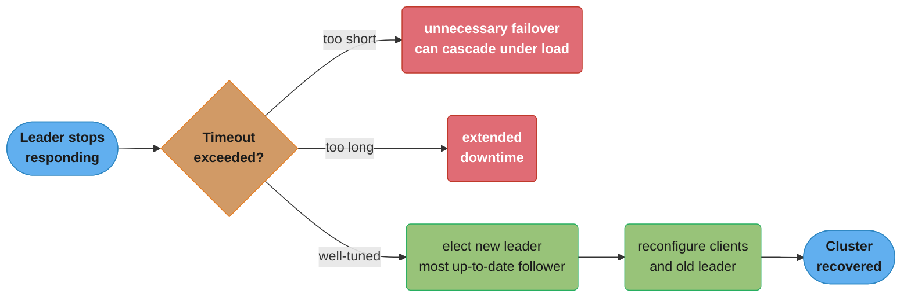
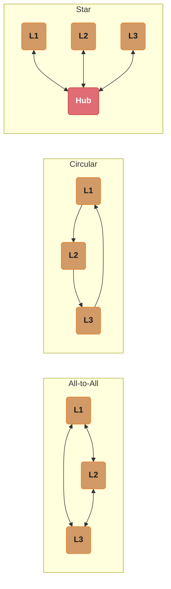
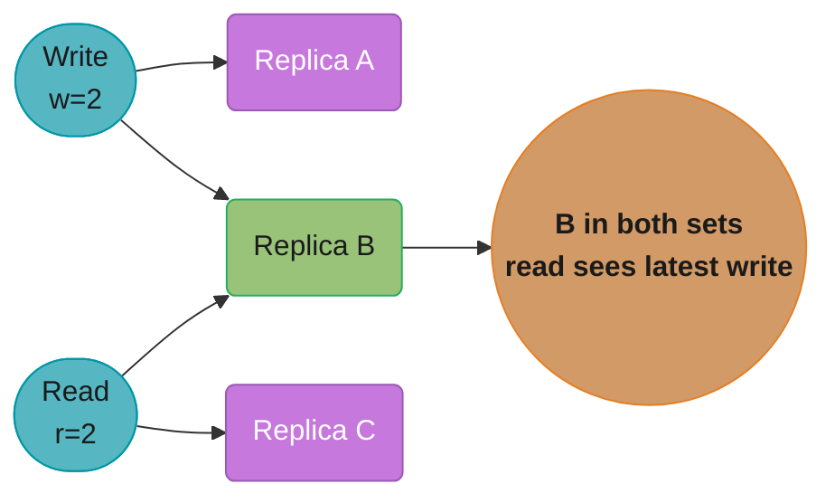
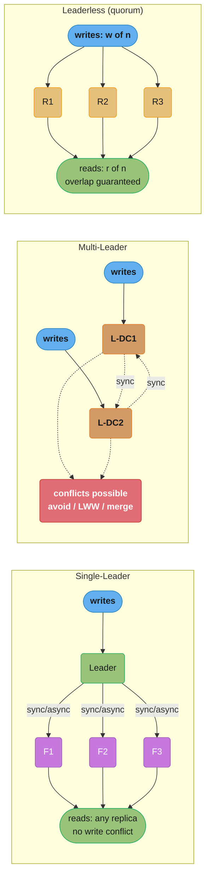
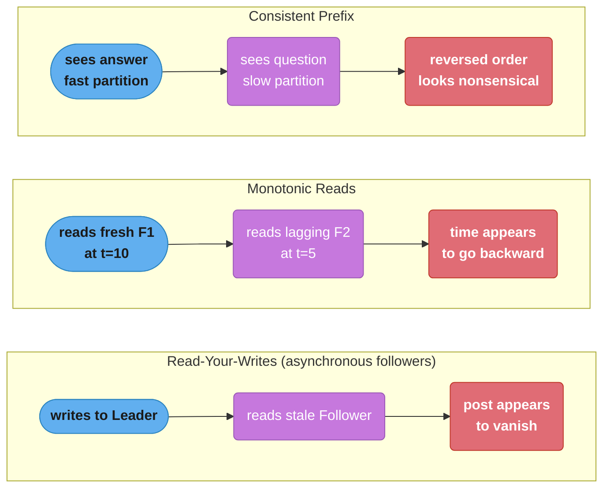

# Chapter 5: Replication

> Part II — Distributed Data · DDIA (Kleppmann) · opens Part II, leads to Ch 6 (partitioning)

## Chapter Map

Part II begins by asking *why* you'd spread data across multiple machines (scalability, fault
tolerance, latency) and then tackles the first technique: **replication** — keeping a copy of
the same data on several nodes. The chapter's hard truth is that the moment a write must reach
more than one node, you confront a hierarchy of consistency problems, and every solution is a
tradeoff between consistency, availability, and latency.

**TL;DR:**
- Three replication architectures: **single-leader** (one node accepts writes), **multi-leader**
  (several accept writes), and **leaderless** (any replica accepts writes; clients use quorums).
- Replication can be **synchronous** (safe but blocks) or **asynchronous** (fast but can lose
  recently-acknowledged writes on failover).
- **Replication lag** breaks intuitive guarantees; you patch it with read-your-writes,
  monotonic reads, and consistent-prefix reads.
- Multi-leader and leaderless designs must **detect and resolve write conflicts** (LWW,
  version vectors).

## The Big Question

> "I want copies of my data on several machines — for failover, for read scaling, for putting
> data near users. The instant I have two copies, which one is 'right' when they disagree, and
> what does a client see while they're catching up?"

Analogy: replication is like a team taking notes in a meeting. If everyone copies from one
designated note-taker (single-leader), the notes stay consistent but that person is a
bottleneck. If everyone writes their own and reconciles later (multi-leader/leaderless), nobody
blocks but you must merge conflicting accounts of what was said.

---

## 5.1 Leaders and Followers

The most common approach: **single-leader replication** (a.k.a. active/passive,
master-slave). One replica is the **leader**; all writes go to it. The leader writes to its
local storage and sends the change to **followers** via a **replication log**. Each follower
applies the changes in the same order. **Reads** can go to the leader *or* any follower. Used
by PostgreSQL, MySQL, MongoDB replica sets, Kafka, and many message brokers.

### Synchronous versus asynchronous replication

- **Synchronous:** the leader waits for the follower to confirm before reporting success.
  Guarantees the follower has an up-to-date copy, but if that follower is slow or down, the
  leader **blocks all writes** until it recovers. Making *all* followers synchronous is
  impractical (one slow node halts everything).
- **Asynchronous:** the leader sends changes but doesn't wait. Fast and resilient to slow
  followers, but if the leader fails before a write propagates, that **acknowledged write is
  lost**. This is the common default despite the durability weakness.
- **Semi-synchronous:** make *one* follower synchronous and the rest async — guarantees at
  least two nodes have the data, and promote the sync follower if the leader dies.

### Setting up new followers

You can't just copy files while writes flow. The process: take a consistent **snapshot** of
the leader (without locking), copy it to the new follower, then have the follower request all
changes *since the snapshot's position* in the replication log (a log sequence number / LSN /
binlog coordinate) and catch up.

### Handling node outages

- **Follower failure (catch-up recovery):** the follower knows its last-processed log position;
  on restart it requests everything since and catches up. Easy.
- **Leader failure (failover):** hard. Detect the leader is dead (usually a timeout — no
  perfect way to tell "dead" from "slow"); choose a new leader (election or a controller node,
  ideally the most up-to-date follower); reconfigure clients and old leader to follow the new
  one. Failover is riddled with pitfalls (below).



Caption: the failover timeout is a guess at "dead vs. slow" — too short triggers spurious
failovers that can cascade under load, too long extends downtime, and even a well-tuned
timeout still needs election plus reconfiguration before the cluster is healthy again.

### Implementation of replication logs

- **Statement-based:** ship the SQL statements. Breaks on nondeterminism (`NOW()`, `RAND()`,
  auto-increment ordering, triggers/side-effects). Mostly abandoned.
- **Write-ahead log (WAL) shipping:** ship the low-level byte-level log the storage engine
  already writes. Very efficient but tightly coupled to the storage format — leader and
  followers must run (nearly) the same DB version, blocking zero-downtime upgrades.
- **Logical (row-based) log:** a separate log describing changes at the *row* level (MySQL
  binlog in row mode). Decoupled from the storage engine, so it allows version-heterogeneous
  replicas and is what **change data capture (CDC)** consumes (→ Ch 11).
- **Trigger-based:** application-level replication via triggers; flexible but more overhead and
  error-prone.

## 5.2 Problems with Replication Lag

With asynchronous followers, a read from a lagging follower returns **stale** data — temporary
inconsistency that resolves "eventually" (**eventual consistency**). But "eventually" can be
seconds or minutes under load, breaking three intuitive guarantees:

### Decoding replication lag: it is a queue, not a constant

Lag is not a property of the network — it is the length of a queue. The follower receives log
entries at the leader's write rate and drains them at its own apply rate:

```
  backlog B      = replication-log entries received but not yet applied
  staleness      = B / arrival_rate          (how many seconds of writes are queued)
  drain time     = B / (apply_rate - arrival_rate)
  utilization  r = arrival_rate / apply_rate
```

**What this actually says.** "A follower is behind by however much work is sitting in its
queue, and it only catches up if it can apply faster than the leader can write." That reframing
is the point: lag is a *rate* problem, so it is unbounded whenever the follower is even
marginally slower — no amount of waiting fixes it.

| Symbol | What it is |
|--------|------------|
| `B` | Backlog: log entries the follower has received but not applied yet |
| `arrival_rate` | The leader's write rate, in writes/sec — what the follower must keep up with |
| `apply_rate` | How fast this follower can execute replayed writes, in writes/sec |
| `staleness` | How many seconds behind the follower's view of the data is |
| `drain time` | Seconds until the backlog reaches zero. Undefined when apply <= arrival |
| `r` | Utilization. Below 1.0 the follower catches up; at or above 1.0 lag grows forever |

**Walk one example.** A leader taking 5,000 writes/sec, a follower holding a 200,000-entry
backlog, and three different follower speeds:

```
  staleness now = 200,000 / 5,000 = 40 s behind, in all three cases

                 apply    net drain    r = arr/apply    drain time
  healthy        6,000    +1,000/s        0.833          200 s   -> caught up
  marginal       5,100      +100/s        0.980        2,000 s   -> 33 min
  overloaded     4,800      -200/s        1.042          never   -> diverges
```

The overloaded follower is only 4% slower than the leader, and it never recovers:

```
  B(t) = 200,000 + 200 x t          staleness(t) = B(t) / 5,000

    t = 0        B =    200,000     staleness =    40 s
    t = 1 hour   B =    920,000     staleness =   184 s   (3.1 min)
    t = 24 hours B = 17,480,000     staleness = 3,496 s   (58.3 min)
```

**Why the "seconds or minutes" wording matters.** The queue formula explains why lag reports
are bimodal in production: while `r < 1` lag is small and self-correcting, and the instant `r`
crosses 1.0 — a vacuum, a big batch job, a slower replica disk — lag climbs linearly and does
not stop. There is no gentle middle. This is the mathematical reason the chapter warns against
assuming "it'll be fast enough."

### Reading your own writes (read-after-write consistency)

A user submits data, then reads it back from a lagging follower and sees it *missing* — looks
like data loss. **Read-your-writes consistency** guarantees a user always sees their *own*
updates (no promise about others'). Techniques: read things the user may have modified from the
leader (e.g. their own profile); track the timestamp/log-position of the user's last write and
only read from a follower at least that current; route the user's reads to the same replica.

### Monotonic reads

A user reads from an up-to-date follower (sees new data), then a later read hits a more-lagging
follower (data *disappears* — moving backward in time). **Monotonic reads** guarantees you never
see time go backward: a weaker guarantee than strong consistency but stronger than eventual.
Achieve it by routing each user to a fixed replica (e.g. hash of user ID).

### Decoding the staleness window both guarantees have to cover

Both fixes are sized by the same quantity — how far behind the follower is. Written as
log positions rather than seconds, the rule each technique enforces is:

```
  follower_LSN     = leader_LSN - B
  safe to read from a follower  iff  follower_LSN >= LSN_of_my_last_write
  pin-to-leader window          =  B / arrival_rate     (the staleness from above)
  monotonic-read violation      =  staleness(replica_2) - staleness(replica_1)
```

**Stated plainly.** "Only read from a replica that has already caught up past your own write;
if you cannot check that, read from the leader for as long as the lag lasts." The LSN form is
exact, the seconds form is the crude version everyone actually ships.

| Symbol | What it is |
|--------|------------|
| `leader_LSN` | The leader's current log position — the newest write in the system |
| `follower_LSN` | How far this follower has replayed. Always `leader_LSN - B` |
| `LSN_of_my_last_write` | The position the user's own write landed at; the token to compare against |
| `pin-to-leader window` | Seconds a user must be routed to the leader before followers are safe |
| `staleness(replica_i)` | Seconds that particular replica is behind; each replica has its own |

**Walk one example.** Same cluster: leader at LSN 10,000,000, backlog 200,000, 5,000 writes/sec:

```
  follower_LSN = 10,000,000 - 200,000 = 9,800,000
  gap          =    200,000 entries  =  200,000 / 5,000 = 40 s of writes

  user writes -> lands at LSN 10,000,000
    read from follower now  : 9,800,000 < 10,000,000  -> write NOT visible, looks lost
    pin to leader for 40 s  : covers the whole window -> read-your-writes holds
    or wait for catch-up    : 200,000 / (6,000 - 5,000) = 200 s at the healthy apply rate
```

Monotonic reads breaks on the *spread between* replicas, not on any single lag figure:

```
  replica F1 staleness =  2 s        first read  -> sees writes up to t-2
  replica F2 staleness = 40 s        second read -> sees writes up to t-40

  apparent jump backward = 40 - 2 = 38 s of history vanishing between two reads
```

**Why pinning to one replica is enough for monotonic reads but not read-your-writes.** Pinning
zeroes the *spread* term — one replica cannot disagree with itself — so time never runs
backward. It does nothing to the *absolute* staleness, so your own 40-second-old write can
still be missing from that pinned replica. Different guarantee, different term of the formula;
this is exactly why the chapter lists them separately.

### Consistent prefix reads

If writes happen in a certain order, anyone reading them sees them in that order. Violated when
related writes land on different partitions that replicate at different speeds, so an observer
sees an answer *before* the question. **Consistent-prefix reads** guarantees causally-related
writes appear in their correct order. Especially a problem in partitioned (sharded) databases
where partitions replicate independently.

> **Don't pretend lag doesn't exist.** If your application can't tolerate the (sometimes
> minutes-long) lag of asynchronous replication, design for the specific guarantee you need —
> or use a system providing stronger consistency — rather than assuming "it'll be fast enough."

## 5.3 Multi-Leader Replication

Allow **more than one node to accept writes**; each leader is also a follower of the others.

**Use cases:** multi-datacenter operation (a leader per datacenter, so writes are local and
fast, and a datacenter outage doesn't block writes); clients with **offline operation** (your
phone's calendar is a leader that syncs when online); collaborative editing (each user's local
copy is a leader). Within one datacenter, multi-leader's downsides usually outweigh benefits.

**The central problem — write conflicts.** Two leaders concurrently modify the same record;
the conflict surfaces only when the writes replicate to each other. Single-leader avoids this
entirely. Conflict handling options:

- **Conflict avoidance:** route all writes for a given record to the same leader (no concurrent
  conflicting writes). The simplest and most recommended approach when feasible.
- **Last write wins (LWW):** attach a timestamp/ID, keep the "latest." Simple but **loses data**
  (the other write silently vanishes) and depends on clock accuracy.
- **Merge / application-defined resolution:** record conflicting versions and let the
  application (or user) merge them (on write or on read); CRDTs and operational transformation
  automate this for specific data types.

**Topologies:** how leaders propagate writes among themselves — **all-to-all** (every leader to
every other; robust but writes can arrive out of causal order), **circular**, and **star**. The
ring/star topologies have a single point of failure; all-to-all is more fault tolerant but can
deliver writes out of order (needing version vectors to order them correctly).



Caption: all-to-all is the most fault-tolerant topology but can deliver causally related writes
out of order (needing version vectors); circular and star route through fewer links, but the
star's hub — and any single ring node — is a single point of failure that stalls propagation.

## 5.4 Leaderless Replication

No leader; the **client (or a coordinator) sends each write to several replicas** directly.
Pioneered by Dynamo and used by Cassandra, Riak, Voldemort.

### Writing to the database when a node is down

There's no failover. The client sends a write to all replicas; if some are down, it proceeds as
long as enough acknowledge. A returning node has stale data. Two repair mechanisms keep replicas
converging: **read repair** (when a client reads from several replicas and notices one is stale,
it writes the fresh value back) and **anti-entropy** (a background process continuously compares
and copies missing data between replicas).

### Quorums for reading and writing

With **n** replicas, require **w** to acknowledge each write and **r** replicas for each read.
If **w + r > n**, the read and write sets overlap by at least one node, so a read is guaranteed
to see at least one replica with the latest write — a **quorum**. Typical: n=3, w=2, r=2. Tuning
w and r trades durability/consistency against availability and latency (e.g. w=n, r=1 for
read-heavy; smaller w for write availability).



Caption: with n=3, w=2, r=2 the write set (A, B) and read set (B, C) overlap on replica B, so
w+r exceeding n guarantees the read always touches at least one replica holding the latest write.

### Decoding w + r > n

The inequality is pigeonhole counting, and the quantity it is really about is the size of the
guaranteed overlap between the write set and the read set:

```
  |W| = w        |R| = r        both drawn from the same n replicas

  guaranteed overlap = max(0, w + r - n)

  overlap >= 1  <=>  w + r - n >= 1  <=>  w + r > n
```

**Read it like this.** "You are putting `w` marks and `r` marks on `n` slots; if the two counts
together exceed the number of slots, some slot must carry both marks." That shared slot is a
replica which both accepted the newest write and answers the read — so the read cannot miss it.

| Symbol | What it is |
|--------|------------|
| `n` | Total replicas holding each key |
| `w` | Replicas that must acknowledge before a write is reported successful |
| `r` | Replicas the client reads from and compares versions across |
| `W`, `R` | The actual sets of nodes contacted by one write and one read |
| `w + r - n` | Overlap size. `>= 1` means guaranteed freshness; `<= 0` means a gap may exist |

**Walk one example.** Every configuration worth knowing, with the overlap computed:

```
   n    w    r     w + r    w + r - n     verdict
   3    2    2       4         +1         holds  -- the standard default
   3    1    1       2         -1         BROKEN -- write {A}, read {B}, no overlap
   5    3    3       6         +1         holds  -- the 5-node standard
   5    2    2       4         -1         BROKEN -- write {A,B}, read {D,E}, disjoint
   3    3    1       4         +1         holds  -- write all, read one
   5    4    2       6         +1         holds  -- write-heavy skew
   5    1    5       6         +1         holds  -- write one, read all
```

The two broken rows fail for the same reason: `w + r - n` is negative, so the sets can be
chosen fully disjoint. With n=3, w=1, r=1 a write landing only on replica A and a read served
only by replica B share nothing, and the read returns a value that predates the acknowledged
write — silently, with no error.

**Put simply.** The same three numbers also decide how many dead nodes you survive, and the two
tolerances pull in opposite directions:

```
  node failures a write tolerates = n - w
  node failures a read  tolerates = n - r
  sum of the two                  = 2n - (w + r)  <  n     whenever w + r > n
```

```
   n    w    r     write tolerates    read tolerates    note
   3    2    2         1 down             1 down        balanced, survives one loss either way
   5    3    3         2 down             2 down        balanced, survives two
   3    3    1         0 down             2 down        ANY node down blocks all writes
   5    1    5         4 down             0 down        writes almost always succeed, reads fragile
   3    1    1         2 down             2 down        maximum availability, zero freshness
```

**Why you cannot have all three.** `(n - w) + (n - r) < n` is forced by `w + r > n`, so the
freshness guarantee is paid for directly out of the failure budget. The `n=3, w=3, r=1` row is
the trap: it satisfies the inequality and gives the cheapest possible reads, but a single
unavailable replica halts every write in the cluster. And the maximally available `n=3, w=1,
r=1` row is exactly the one whose overlap is negative — availability bought by giving up the
guarantee, which is the whole tradeoff the chapter is describing.

**Limits of quorums:** even with w+r>n, edge cases return stale data — concurrent writes (which
to keep?); a write that succeeds on some and fails on others isn't rolled back; if a node with a
new value dies and is restored from a replica with the old value, the quorum can be violated;
and timing of concurrent reads/writes. Quorums give *strong-ish* but **not** linearizable
consistency by default.

### Sloppy quorums and hinted handoff

When a network partition cuts the client off from its "home" replicas, it may still reach *some*
nodes. A **sloppy quorum** accepts the write on whatever w nodes are reachable — even nodes not
among the designated home replicas — boosting write availability. **Hinted handoff:** those
temporary nodes hold the write and forward it ("hand it off") to the proper home replicas once
the partition heals. Sloppy quorums raise availability but **weaken the w+r>n guarantee** (the
overlap may not hold during the partition).

### Detecting concurrent writes

The core problem: clients write concurrently, replicas receive them in different orders, and you
must converge. Techniques:

- **Last write wins (LWW):** order writes by timestamp, keep the highest. Achieves convergence
  but **discards concurrent writes** (data loss) and relies on synchronized clocks. Cassandra's
  default.
- **"Happens-before" and concurrency:** operation A *happens-before* B if B knew about / depended
  on A. If neither knows about the other, they're **concurrent** — and concurrency, not wall-clock
  time, is what defines a conflict. (Two operations can be concurrent even if they occurred at
  different real times.)
- **Version numbers / version vectors:** the server assigns a version number per key and returns
  it with reads; a client must send back the version it saw when writing, letting the server tell
  whether a write supersedes or is concurrent with others. With multiple replicas you need a
  **version vector** (a version number per replica) to track causal history across all of them —
  this lets the system keep concurrent values as **siblings** to be merged rather than silently
  dropping them.

---

## Visual Intuition





Caption: pick the architecture by where writes originate, then patch async lag with the
specific read guarantee your app needs — these are weaker than, and cheaper than, full
linearizability (Ch 9).

---

## Key Concepts Glossary

- **Replication** — keeping copies of the same data on multiple nodes.
- **Leader / follower (master/slave, primary/replica)** — single-leader roles.
- **Replication log** — the stream of changes the leader sends to followers.
- **Synchronous / asynchronous / semi-synchronous replication** — whether the leader waits.
- **Failover** — promoting a follower to leader after the leader fails.
- **Catch-up recovery** — a returned follower replaying the log from its last position.
- **Snapshot + log position (LSN/binlog coordinate)** — how a new follower bootstraps.
- **Statement-based / WAL-shipping / logical (row-based) / trigger-based** — replication-log
  implementations.
- **Change data capture (CDC)** — consuming the logical replication log (→ Ch 11).
- **Replication lag** — the delay before a follower reflects a write.
- **Eventual consistency** — replicas converge if writes stop.
- **Read-your-writes (read-after-write) consistency** — see your own updates.
- **Monotonic reads** — never see time move backward.
- **Consistent-prefix reads** — causally ordered writes appear in order.
- **Multi-leader replication** — multiple nodes accept writes; sync among themselves.
- **Write conflict** — concurrent writes to the same record on different leaders.
- **Conflict resolution** — avoidance, LWW, or application/CRDT merge.
- **Replication topology** — all-to-all, circular, star.
- **Leaderless replication** — clients write to / read from multiple replicas (Dynamo-style).
- **Quorum (w + r > n)** — overlapping read/write sets guaranteeing freshness.
- **Read repair / anti-entropy** — mechanisms that converge leaderless replicas.
- **Sloppy quorum / hinted handoff** — accepting writes on non-home nodes during a partition.
- **Last write wins (LWW)** — timestamp-based conflict resolution (lossy).
- **Happens-before / concurrent** — causal ordering; concurrency defines a conflict.
- **Version vector** — per-replica version numbers tracking causal history; preserves siblings.

---

## Tradeoffs & Decision Tables

| | Single-leader | Multi-leader | Leaderless |
|---|---|---|---|
| Who accepts writes | One node | Several nodes | Any replica (w of n) |
| Write conflicts | None | Yes (must resolve) | Yes (version vectors / LWW) |
| Failover | Needed, error-prone | No single point | No failover concept |
| Best for | Most OLTP, read scaling | Multi-DC, offline, collab editing | High availability, multi-DC writes |
| Examples | PostgreSQL, MySQL, MongoDB | CouchDB, multi-DC MySQL, calendars | Cassandra, Riak, Dynamo |

| | Synchronous | Asynchronous | Semi-synchronous |
|---|---|---|---|
| Write latency | High (waits) | Low | Medium |
| Durability on failover | Strong | Can lose acked writes | At least 2 nodes safe |
| Resilience to slow node | Poor (blocks) | Good | Good |

| Read guarantee | Prevents | How |
|----------------|----------|-----|
| Read-your-writes | "my own write vanished" | Read own data from leader / track write position |
| Monotonic reads | "time went backward" | Pin user to one replica |
| Consistent prefix | "answer before question" | Order causally-related writes (version vectors) |

---

## Common Pitfalls / War Stories

- **Failover data loss with async replication.** GitHub's well-known incident: an out-of-date
  MySQL follower was promoted to leader after the old leader failed; primary-key sequences the
  old leader had handed out were reused, and those values had been referenced by Redis, causing
  cross-store inconsistency and private data exposure. Async + failover can silently lose acked
  writes and corrupt invariants.
- **Split brain.** Two nodes both believe they're leader and both accept writes; without a
  mechanism to shut one down (and not a naive one — some designs that shut down "both" leaders
  on conflict have killed the cluster). Fencing and a single source of truth for leadership are
  essential.
- **Choosing the failover timeout.** Too short → unnecessary failovers (a brief load spike
  triggers a leader change, worsening the overload — cascading failures). Too long → extended
  downtime. There is no perfect value; this is the "can't tell dead from slow" problem.
- **LWW silently dropping writes.** Cassandra's default LWW means two concurrent writes to the
  same key keep only one — the other is gone with no error. If you need all writes preserved,
  you must use a conflict-free data type or unique keys, not LWW.
- **Assuming quorums are linearizable.** w+r>n gives strong-ish reads but NOT linearizability;
  concurrent writes, failed partial writes, and node restores from stale replicas can all return
  stale or conflicting data. Don't build a leader-election or locking primitive on a plain quorum.
- **Ignoring replication lag in app logic.** Reading immediately after writing from a follower
  shows stale/missing data and gets misreported as bugs. Identify reads that must be fresh and
  route them to the leader or use a read guarantee.

---

## Real-World Systems Referenced

PostgreSQL, MySQL (binlog), Oracle Data Guard, SQL Server AlwaysOn, MongoDB replica sets,
Espresso, Kafka, RabbitMQ (single-leader); CouchDB, BDR, Tungsten Replicator, calendar apps
(multi-leader); Amazon Dynamo, Riak, Cassandra, Voldemort (leaderless); GitHub failover
incident; Google Docs / operational transformation and CRDTs (collaborative editing).

---

## Summary

Replication keeps copies of data on multiple nodes for fault tolerance, read scaling, and low
latency. **Single-leader** routes all writes through one node and is simplest (no conflicts) but
needs careful, failure-prone failover and a chosen replication-log format (logical/row-based is
the most flexible and feeds CDC). **Multi-leader** lets several nodes accept writes — great for
multi-datacenter and offline/collaborative use — but must detect and resolve write conflicts
(avoid, LWW, or merge). **Leaderless** (Dynamo-style) has clients write to and read from several
replicas, using **quorums (w + r > n)** plus read repair and anti-entropy to converge; sloppy
quorums and hinted handoff trade the quorum guarantee for availability during partitions.
Asynchronous replication introduces **lag**, which breaks read-your-writes, monotonic-reads, and
consistent-prefix guarantees unless you design for them. Concurrent writes require reasoning
about **happens-before vs concurrency** and tracking causal history with **version vectors** to
avoid silently losing data (as LWW does).

---

## Interview Questions

**Q: What is the difference between synchronous and asynchronous replication, and what does each risk?**
Synchronous replication makes the leader wait for a follower to confirm a write before acknowledging success, guaranteeing the follower is up to date but blocking all writes if that follower is slow or down. Asynchronous replication has the leader acknowledge immediately and propagate changes in the background, giving low latency and resilience to slow followers but risking the loss of recently acknowledged writes if the leader fails before they propagate. Semi-synchronous is the common compromise: one synchronous follower guarantees two copies, the rest async.

**Q: Why is leader failover so error-prone?**
Because you can't reliably distinguish a dead leader from a slow one, so failover detection relies on timeouts that are guesses; the newly promoted follower may be missing writes the old leader acknowledged (async data loss); discarded writes can violate invariants shared with other systems (GitHub's reused primary keys corrupting Redis); two nodes may both think they're leader (split brain); and a too-short timeout causes spurious failovers that can cascade under load. Each step has a failure mode, which is why managed failover is notoriously tricky.

**Q: What does "w + r > n" guarantee in a leaderless quorum, and what does it NOT guarantee?**
It guarantees that the set of replicas a write touched and the set a read consults overlap in at least one node, so the read sees at least one replica holding the latest write — i.e. reads are reasonably fresh. It does NOT guarantee linearizability: concurrent writes (which value wins?), writes that partially succeed and aren't rolled back, sloppy quorums during partitions, and a node being restored from a stale replica can all still surface stale or conflicting values. Quorums give strong-ish, not strong, consistency.

**Q: Explain read-your-writes consistency and how you'd implement it.**
Read-your-writes (read-after-write) consistency guarantees that a user always sees updates they themselves just made, though not necessarily other users' updates, preventing the alarming "I submitted it but it's gone" experience caused by reading a lagging follower. You implement it by reading anything the user might have modified from the leader (e.g. their own profile), or by tracking the log position/timestamp of the user's last write and only serving their reads from a follower that has caught up to it, or by pinning the user's reads to the replica they wrote to.

**Q: What is monotonic reads, and what anomaly does it prevent?**
Monotonic reads guarantees a user never sees data move *backward* in time across successive reads — once they've seen a value, later reads won't show an older state. It prevents the anomaly where a first read hits an up-to-date follower (showing a new comment) and a second read hits a more-lagging follower (the comment disappears). It's achieved by routing each user consistently to the same replica, for example by hashing the user ID, so they don't bounce between followers at different lag.

**Q: What is consistent-prefix reads, and why are partitioned databases especially prone to violating it?**
Consistent-prefix reads guarantees that if a sequence of writes happens in a causal order, any reader sees them in that same order — never an answer before its question. Partitioned (sharded) databases are especially prone to violating it because different partitions replicate independently at different speeds, so causally related writes that landed on different partitions can become visible out of order. Preventing it requires tracking causal relationships (e.g. version vectors) so related writes are ordered consistently.

**Q: When is multi-leader replication worth its complexity, and what is its defining problem?**
It's worth it for multi-datacenter deployments (a local leader per datacenter gives low write latency and tolerance of a datacenter outage), for clients needing offline writes (a phone's local database acts as a leader and syncs later), and for real-time collaborative editing. Its defining problem is write conflicts: two leaders can concurrently modify the same record, and the conflict only surfaces when the writes replicate to each other, requiring resolution by avoidance, last-write-wins, or application-level merging — complexity single-leader avoids entirely.

**Q: Why is "last write wins" dangerous as a conflict-resolution strategy?**
Because "last" is decided by a timestamp, and when two writes are genuinely concurrent, LWW keeps one and silently discards the other with no error — that's data loss, not conflict resolution. It also depends on clock synchronization across nodes, and clock skew can make a logically earlier write win or an earlier one lose. It's acceptable only when losing concurrent writes is tolerable (e.g. caching); for data you can't afford to drop, use version vectors to preserve siblings or design keys so writes never conflict.

**Q: Explain "happens-before" and concurrency, and why concurrency (not wall-clock time) defines a conflict.**
Operation A happens-before B if B could have known about or depended on A (e.g. A's result was read before B was issued); if neither operation knew about the other, they are concurrent. A conflict is defined by concurrency, not real time, because two operations issued at different wall-clock moments can still be concurrent if neither had seen the other — and conversely, true ordering is about causal dependence, which clocks can't reliably capture. The system must therefore track causal history, not timestamps, to know what actually conflicts.

**Q: What is a version vector and what problem does it solve that a single version number can't?**
A version vector is a set of version numbers, one per replica, that together capture the causal history of a value across all replicas. A single version number works when one node assigns it, but with multiple replicas accepting writes you need to know what each replica had seen to determine whether two writes are causally ordered or concurrent. The version vector lets the system detect concurrent writes and retain them as siblings for later merging, rather than a single counter forcing it to wrongly conclude one write supersedes another and dropping data.

**Q: What are read repair and anti-entropy in leaderless systems?**
They are the two mechanisms that make replicas converge after a node was unavailable for some writes. Read repair happens during normal reads: when a client reads from multiple replicas and detects one returned a stale value, it writes the newer value back to that replica. Anti-entropy is a continuous background process that compares data between replicas and copies over anything missing, independent of reads. Read repair fixes frequently read keys quickly; anti-entropy ensures even rarely read keys eventually converge.

**Q: What are sloppy quorums and hinted handoff, and how do they affect the quorum guarantee?**
A sloppy quorum accepts a write on whatever w reachable nodes exist during a network partition, even nodes outside the key's designated home replicas, to keep accepting writes when the home replicas are unreachable. Hinted handoff is the follow-up: those temporary nodes hold the write and forward it to the proper home replicas once the partition heals. They increase write availability but weaken the w+r>n guarantee, because during the partition the read set and the write set may no longer overlap, so reads can miss recent writes.

**Q: Compare the replication-log implementations and say which feeds change data capture.**
Statement-based logs ship the SQL statements but break on nondeterministic functions and side effects, so they're mostly abandoned. WAL shipping sends the storage engine's low-level byte log — efficient but tightly coupled to the storage format and DB version, blocking zero-downtime upgrades. Logical (row-based) logs describe changes at the row level, decoupled from the storage engine, allowing heterogeneous replica versions; this is what change data capture consumes to feed downstream systems like search indexes and stream processors. Trigger-based replication runs in the application layer for flexibility at higher overhead.

**Q: How does a new follower bootstrap without locking the leader?**
The leader takes a consistent snapshot of its database at a particular point in the replication log (most databases can do this without locking, using MVCC). That snapshot is copied to the new follower, which records the exact log position the snapshot corresponds to. The follower then connects to the leader and requests all changes that occurred *since* that position, replaying them to catch up to the current state, after which it stays current by continuously applying the live replication stream.

**Q: What replication topologies exist for multi-leader setups, and what are their tradeoffs?**
All-to-all has every leader send its writes to every other leader, which is robust to a single node failing but can deliver causally related writes out of order at different nodes, requiring version vectors to order them. Circular and star topologies pass writes along a defined path, which reduces redundant traffic but introduces a single point of failure — if one node goes down, the propagation path is broken until it's reconfigured. All-to-all is generally more fault tolerant at the cost of ordering complexity.

**Q: Why does the book warn against ignoring replication lag, and what's the practical takeaway?**
Because "eventual" consistency offers no bound on how stale a read can be — under load or failure, lag can be seconds or minutes, long enough to break user expectations and cause bugs reported as data loss. The practical takeaway is to explicitly decide which operations require freshness and engineer the specific guarantee they need (read-your-writes, monotonic reads, consistent prefix) or route them to the leader, rather than assuming asynchronous followers will "always be fast enough."

**Q: What is split brain, and how should systems guard against it?**
Split brain is when two nodes both believe they are the leader and both accept writes, leading to divergent, conflicting data that's hard to reconcile. Systems guard against it by ensuring only one leader can be active — using a consensus-backed source of truth for leadership, fencing tokens that let downstream resources reject writes from a deposed leader, and careful failover logic. Naive mitigations (like automatically shutting down any node that detects a conflict) can backfire by killing the whole cluster, so the mechanism must be principled.

---

## Cross-links in this repo

- [database/replication_and_high_availability/ — Patroni, split-brain, replication slots, multi-region](../../../database/replication_and_high_availability/README.md)
- [database/consistency_models_and_consensus/ — version clocks, CRDTs, fencing tokens](../../../database/consistency_models_and_consensus/README.md)
- [database/wide_column_databases/ — Cassandra ring, consistency levels, tombstones](../../../database/wide_column_databases/README.md)
- [hld/ — CAP/PACELC and replication in the interview framework](../../../hld/README.md)

## Further Reading

- Kleppmann, DDIA Ch 5 — original text and references.
- DeCandia et al., "Dynamo: Amazon's Highly Available Key-value Store," SOSP 2007 — leaderless
  quorums, sloppy quorums, hinted handoff, vector clocks.
- The GitHub 2012 database-failover post-mortem — the canonical async-failover war story.
